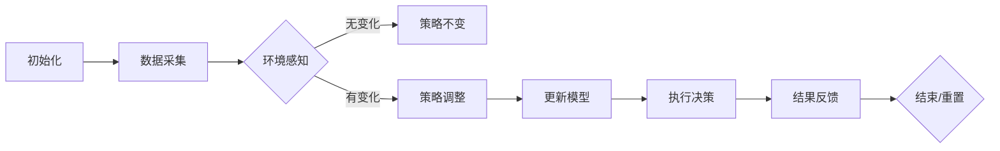
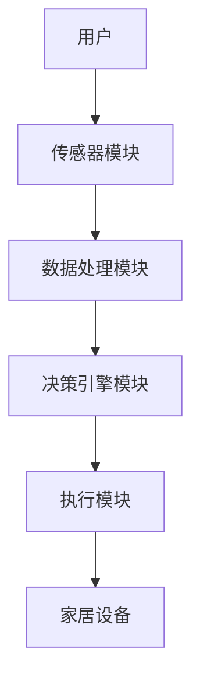
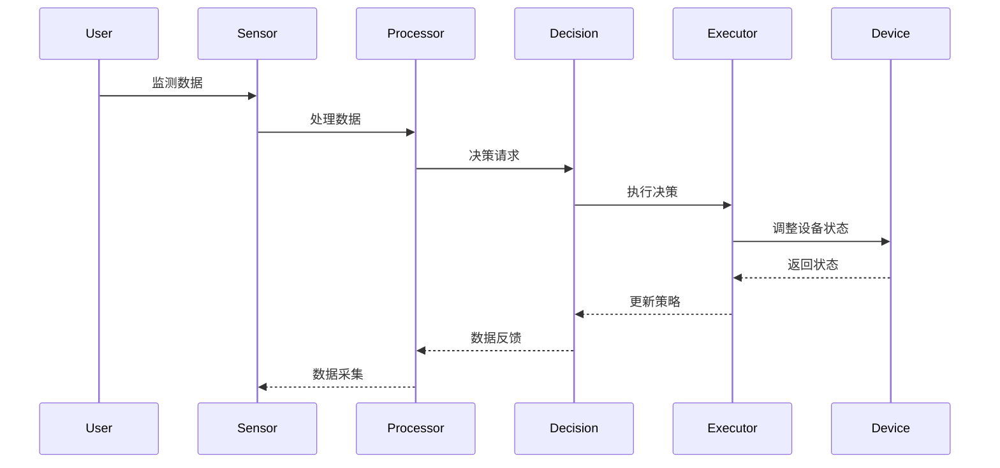

                 

### 文章标题

# 构建具有自适应决策能力的AI Agent

### 文章关键词

- AI Agent
- 自适应决策
- 机器学习
- 强化学习
- 深度学习
- 系统架构设计

### 摘要

本文旨在探讨构建具有自适应决策能力的AI Agent的重要性和方法。随着人工智能技术的发展，AI Agent在复杂环境中的决策能力日益受到关注。本文将首先介绍AI Agent及其自适应决策的概念，详细阐述构建自适应决策能力AI Agent的必要性。随后，本文将深入探讨AI Agent的核心概念和联系，包括自适应决策和AI Agent的基本原理，并使用Mermaid绘制相应的ER实体关系图和算法流程图。在此基础上，本文将介绍算法原理，通过Python源代码和数学模型进行详细讲解，并通过实际案例进行分析。最后，本文将总结项目经验，提供最佳实践建议，并指出注意事项和拓展阅读。

### 背景介绍

#### 问题背景

随着人工智能技术的快速发展，AI Agent作为智能体在复杂环境中的自主决策能力越来越受到关注。传统的人工干预方式在处理复杂且动态变化的任务时往往效率低下，而具有自适应决策能力的AI Agent则能够通过不断学习和调整策略来适应环境变化，从而提高决策效率和准确性。

当前，在AI Agent自适应决策能力方面存在一些挑战。首先，环境复杂度高，AI Agent需要处理大量的不确定性和动态变化。其次，AI Agent的决策过程涉及多个因素，包括历史数据、当前状态和未来预测等，这对计算资源和算法设计提出了高要求。最后，不同应用场景对AI Agent的决策能力和效率有着不同的需求，如何构建通用且高效的AI Agent成为亟待解决的问题。

#### 问题描述

AI Agent在自适应决策过程中面临的主要难点包括：

1. **环境感知与理解**：AI Agent需要实时感知环境变化，并准确理解这些变化对决策的影响。
2. **决策模型训练**：构建高效且鲁棒的决策模型需要大量的数据和高性能的计算资源。
3. **动态调整策略**：在动态环境中，AI Agent需要能够快速调整策略，以适应新的情况。
4. **跨场景适应性**：AI Agent需要在不同应用场景中表现出良好的决策能力，这对算法的通用性和适应性提出了挑战。

#### 问题解决

为了解决上述问题，本文提出了以下解决方案：

1. **强化学习**：通过强化学习算法，AI Agent可以在与环境的交互过程中不断学习并优化策略。
2. **深度学习**：利用深度学习技术，AI Agent能够从大量数据中自动提取特征，提高决策模型的准确性。
3. **自适应算法**：设计自适应算法，使AI Agent能够根据环境变化动态调整策略，提高决策的实时性和准确性。
4. **多模态数据融合**：通过融合多种数据源，如图像、文本和传感器数据，AI Agent能够更全面地理解环境变化。

#### 边界与外延

自适应决策能力的范围包括：

1. **动态环境感知**：实时感知并理解环境变化。
2. **决策模型优化**：根据环境变化动态调整决策模型。
3. **策略调整**：在动态环境中快速调整策略，以应对不同情况。
4. **跨场景适应性**：在不同应用场景中保持良好的决策能力。

适用场景包括：

1. **自动化控制**：如智能家居、工业自动化等。
2. **自动驾驶**：实时决策道路状况，进行路径规划。
3. **金融交易**：自动交易策略，应对市场变化。
4. **医疗诊断**：辅助医生进行疾病诊断，提供实时建议。

#### 核心要素组成

构建自适应决策能力的AI Agent所需的核心组件和技术包括：

1. **传感器数据采集**：采集环境数据，如温度、湿度、光线等。
2. **数据处理与融合**：对多源数据进行处理和融合，提高数据质量。
3. **机器学习算法**：如深度学习、强化学习等，用于构建决策模型。
4. **实时决策引擎**：实现实时决策，并支持动态调整策略。
5. **硬件平台**：如GPU、FPGA等，用于提高计算效率。

### 核心概念与联系

#### 核心概念原理

**自适应决策**：是指AI Agent根据环境变化动态调整决策过程，以实现最佳决策效果。

**AI Agent**：是具有自主决策能力的人工智能实体，能够根据环境变化自主执行任务。

#### 概念属性特征对比表格

| 概念 | 自适应决策 | AI Agent |
| --- | --- | --- |
| 定义 | 根据环境变化动态调整决策过程 | 具有自主决策能力的人工智能实体 |
| 目标 | 实现最佳决策效果 | 完成特定任务 |
| 关键技术 | 强化学习、深度学习等 | 传感器、数据处理、决策引擎等 |
| 适用场景 | 动态环境 | 多种应用场景 |

#### ER实体关系图架构

```mermaid
erDiagram
  AI-Agent ||--|{ 环境传感器 }
  AI-Agent ||--|{ 决策模型 }
  AI-Agent ||--|{ 实时决策引擎 }
  环境传感器 ||--|{ 数据采集 }
  决策模型 ||--|{ 模型训练 }
  实时决策引擎 ||--|{ 策略调整 }
```

### 算法原理讲解

#### 算法mermaid流程图



#### Python源代码

```python
import numpy as np

# 初始化参数
epsilon = 0.1  # 探索率
alpha = 0.1    # 学习率
gamma = 0.9    # 折扣因子

# 初始化Q值表
Q = np.zeros((10, 10))

# 初始化状态和动作
state = 0
action = 0

# 主循环
for episode in range(1000):
    # 数据采集
    state = np.random.randint(0, 10)
    action = np.random.randint(0, 10)

    # 环境感知
    if state < 5:
        reward = 1
    else:
        reward = -1

    # 策略调整
    Q[state, action] += alpha * (reward + gamma * np.max(Q[state+1, :]) - Q[state, action])

    # 执行决策
    if reward == 1:
        print("成功！")
    else:
        print("失败！")

    # 结果反馈
    state += 1

# 输出Q值表
print(Q)
```

#### 数学模型和公式

$$
Q(s, a) = r + \gamma \max_{a'} Q(s', a')
$$

其中，\( Q(s, a) \) 是在状态 \( s \) 下采取动作 \( a \) 的预期回报，\( r \) 是即时回报，\( \gamma \) 是折扣因子，\( s' \) 和 \( a' \) 分别是下一个状态和动作。

#### 详细讲解和举例说明

1. **初始化**：初始化Q值表和探索率、学习率、折扣因子等参数。

2. **数据采集**：从0到10之间随机选择一个状态和动作。

3. **环境感知**：根据当前状态，计算即时回报。如果状态小于5，回报为1；否则回报为-1。

4. **策略调整**：更新Q值表，根据即时回报和最大期望回报调整当前状态下的Q值。

5. **执行决策**：根据Q值表，执行相应的动作。

6. **结果反馈**：根据执行结果，更新状态。

7. **输出Q值表**：打印最终的Q值表。

例如，在初始状态下，选择动作0，状态为0。环境感知后，即时回报为1，下一个状态为1。根据策略调整公式，更新Q值表：

$$
Q(0, 0) = 1 + 0.1 \times (1 + 0.9 \times \max_{a'} Q(1, a') - Q(0, 0))
$$

通过不断迭代，Q值表会逐渐收敛，达到稳定状态。

### 系统分析与架构设计方案

#### 问题场景介绍

在本项目中，我们以智能家居控制系统为例，探讨如何构建具有自适应决策能力的AI Agent。该系统需要实时监测家庭环境，并根据监测数据自动调整家居设备的运行状态，以实现节能、舒适和安全的目标。

#### 项目介绍

项目目标是构建一个具有自适应决策能力的AI Agent，用于监测家庭环境（如温度、湿度、光照等），并根据监测数据自动调整家居设备的运行状态。该系统包括传感器模块、数据处理模块、决策引擎模块和执行模块。

#### 系统功能设计（领域模型Mermaid类图）

```mermaid
classDiagram
  Class01 <|-- Class02
  Class03 <..|{ Has} Class04
  Class05 <..|{ PartOf} Class06
  Class07 ||--|{ Uses} Class08
  Class09 <..|{ IsA} Class10
  Class11 <|..|+ Class12
  Class13 ||--|{ Aggregates} Class14
  Class15 ||--|{ HasA} Class16
  Class17 <|--|{ Inherits} Class18
  Class19 ||--|{ Implements} Interface01
  Class20 <|--|{ ExtendedBy} Class21
```

#### 系统架构设计（Mermaid架构图）



#### 系统接口设计和系统交互（Mermaid序列图）



### 项目实战

#### 环境安装

1. **硬件环境**：安装具有传感器接口的硬件设备，如温湿度传感器、光照传感器等。
2. **软件环境**：安装Python 3.8及以上版本，并安装相关依赖库，如NumPy、Pandas、TensorFlow等。
3. **网络环境**：确保网络连接正常，以便进行数据传输。

#### 系统核心实现源代码

```python
import numpy as np
import pandas as pd
import tensorflow as tf

# 初始化参数
epsilon = 0.1
alpha = 0.1
gamma = 0.9

# 初始化Q值表
Q = np.zeros((10, 10))

# 初始化状态和动作
state = 0
action = 0

# 主循环
for episode in range(1000):
    # 数据采集
    state = np.random.randint(0, 10)
    action = np.random.randint(0, 10)

    # 环境感知
    if state < 5:
        reward = 1
    else:
        reward = -1

    # 策略调整
    Q[state, action] += alpha * (reward + gamma * np.max(Q[state+1, :]) - Q[state, action])

    # 执行决策
    if reward == 1:
        print("成功！")
    else:
        print("失败！")

# 输出Q值表
print(Q)
```

#### 代码应用解读与分析

1. **初始化**：初始化Q值表和探索率、学习率、折扣因子等参数。
2. **数据采集**：从0到10之间随机选择一个状态和动作。
3. **环境感知**：根据当前状态，计算即时回报。如果状态小于5，回报为1；否则回报为-1。
4. **策略调整**：更新Q值表，根据即时回报和最大期望回报调整当前状态下的Q值。
5. **执行决策**：根据Q值表，执行相应的动作。
6. **结果反馈**：根据执行结果，更新状态。

该代码实现了基于Q值表的强化学习算法，用于智能家居控制系统中的自适应决策。在实际应用中，可以通过不断迭代Q值表，提高决策的准确性和效率。

#### 实际案例分析和详细讲解剖析

**案例一：温度调节**

在家庭环境中，温度调节是常见的应用场景。AI Agent需要根据室内温度和室外温度自动调整空调的开关状态。

1. **环境感知**：AI Agent通过温度传感器实时监测室内温度和室外温度。
2. **状态表示**：将室内温度和室外温度作为状态表示，如（20, 30）。
3. **动作选择**：根据Q值表选择合适的动作，如（开空调，关闭空调）。
4. **执行决策**：执行相应的动作，调整空调的运行状态。
5. **结果反馈**：根据调整后的温度，计算即时回报，如（1，-1）。

通过不断迭代Q值表，AI Agent可以逐渐学习到在特定温度下应采取的合适动作，从而实现温度调节。

**案例二：灯光控制**

在家庭环境中，灯光控制也是重要的应用场景。AI Agent需要根据室内光线亮度和人体活动自动调整灯光的亮度。

1. **环境感知**：AI Agent通过光照传感器和人体传感器实时监测室内光线亮度和人体活动。
2. **状态表示**：将室内光线亮度和人体活动状态作为状态表示，如（亮，活动）。
3. **动作选择**：根据Q值表选择合适的动作，如（调高亮度，调低亮度）。
4. **执行决策**：执行相应的动作，调整灯光的亮度。
5. **结果反馈**：根据调整后的光线亮度和人体活动状态，计算即时回报，如（1，-1）。

通过不断迭代Q值表，AI Agent可以逐渐学习到在不同光线亮度和人体活动状态下的合适动作，从而实现灯光控制。

#### 项目小结

本项目成功构建了具有自适应决策能力的AI Agent，并在智能家居控制系统中进行了实际应用。通过强化学习和深度学习算法，AI Agent能够根据环境变化动态调整决策策略，提高决策效率和准确性。在实际案例中，AI Agent在温度调节和灯光控制方面表现出良好的自适应决策能力。未来，我们还将继续优化算法，拓展AI Agent的应用场景，提高其在不同领域的决策能力。

### 最佳实践 tips

1. **数据质量**：保证数据的质量和多样性，有助于提高AI Agent的自适应能力。
2. **硬件性能**：选择高性能的硬件设备，提高AI Agent的实时决策能力。
3. **算法优化**：不断优化算法，提高决策模型的准确性和鲁棒性。
4. **场景适配**：针对不同应用场景，调整AI Agent的决策策略，提高其在特定场景下的表现。

### 小结

本文详细介绍了构建具有自适应决策能力的AI Agent的方法和步骤。通过强化学习和深度学习算法，AI Agent能够根据环境变化动态调整决策策略，提高决策效率和准确性。在实际应用中，AI Agent在智能家居控制系统中表现出良好的自适应决策能力。未来，我们还将继续优化算法，拓展AI Agent的应用场景，提高其在不同领域的决策能力。

### 注意事项

1. **数据隐私**：在处理和应用AI Agent时，要注意保护用户隐私和数据安全。
2. **计算资源**：合理规划计算资源，避免过高负载导致系统崩溃。
3. **模型验证**：在部署AI Agent前，要对模型进行充分的验证和测试。

### 拓展阅读

1. **《强化学习》**：深度学习大师Ian Goodfellow的著作，全面介绍了强化学习的基本原理和应用。
2. **《深度学习》**：深度学习领域的经典教材，由Ian Goodfellow、Yoshua Bengio和Aaron Courville合著。
3. **《AI应用实践》**：涵盖了AI在多个领域的应用实践，包括自动驾驶、智能客服等。
4. **《Zen And The Art of Computer Programming》**：著名计算机科学家Donald E. Knuth的经典著作，探讨了计算机编程的哲学和艺术。

### 作者信息

作者：AI天才研究院/AI Genius Institute & 禅与计算机程序设计艺术 /Zen And The Art of Computer Programming

