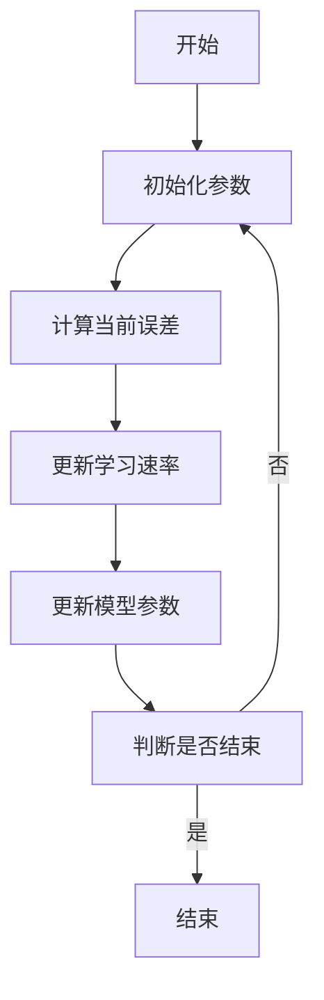
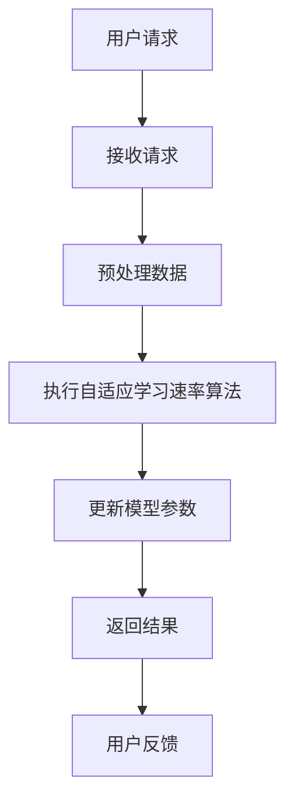
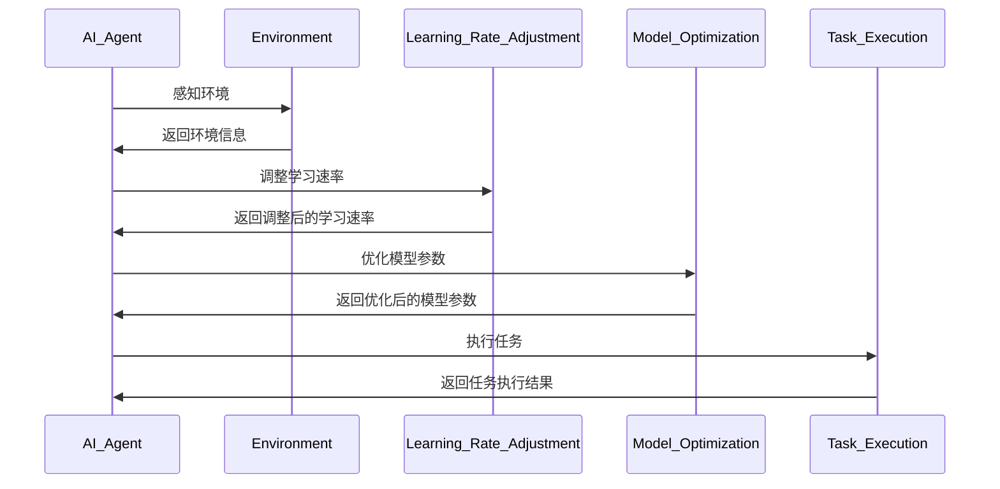

                 

# 构建具有自适应学习速率的AI Agent

> 关键词：AI Agent、自适应学习速率、强化学习、监督学习、无监督学习

> 摘要：本文深入探讨了AI Agent中自适应学习速率的概念、原理、算法及其在实际应用中的重要性。通过详细分析自适应学习速率的优势与挑战，本文提出了一种有效的自适应学习速率算法，并展示了其在强化学习、监督学习和无监督学习中的实际应用。此外，文章还介绍了如何进行系统分析与架构设计，以及在实战中实现和部署自适应学习速率AI Agent的方法和技巧。

## 目录大纲

# 构建具有自适应学习速率的AI Agent

## 第一部分：背景介绍

## 1.1 问题的背景
### 1.1.1 AI Agent的定义与重要性
### 1.1.2 自适应学习速率的意义
### 1.1.3 当前AI Agent的挑战

## 1.2 问题描述
### 1.2.1 学习速率的不适应性
### 1.2.2 模型性能的瓶颈
### 1.2.3 适应不同环境的必要性

## 1.3 问题解决
### 1.3.1 自适应学习速率的概念
### 1.3.2 自适应学习速率的方法
### 1.3.3 自适应学习速率的优势

## 1.4 边界与外延
### 1.4.1 自适应学习速率的适用范围
### 1.4.2 自适应学习速率的限制因素
### 1.4.3 自适应学习速率的发展趋势

## 1.5 概念结构与核心要素组成
### 1.5.1 自适应学习速率的核心概念
### 1.5.2 自适应学习速率的关键要素
### 1.5.3 自适应学习速率的技术架构

## 1.6 本章小结

## 第二部分：核心概念与联系

## 2.1 自适应学习速率原理
### 2.1.1 自适应学习速率的数学模型
### 2.1.2 自适应学习速率的算法原理
### 2.1.3 自适应学习速率的特性分析

## 2.2 概念属性特征对比表格
### 2.2.1 传统学习速率与自适应学习速率对比
### 2.2.2 不同自适应学习速率方法的对比

## 2.3 ER实体关系图架构
### 2.3.1 自适应学习速率系统的实体关系
### 2.3.2 实体属性与关系的详细描述

## 2.4 自适应学习速率的应用场景
### 2.4.1 强化学习中的应用
### 2.4.2 监督学习中的应用
### 2.4.3 无监督学习中的应用

## 2.5 自适应学习速率的优势与挑战
### 2.5.1 优势
### 2.5.2 挑战
### 2.5.3 发展趋势

## 2.6 本章小结

## 第三部分：算法原理讲解

## 3.1 自适应学习速率算法的mermaid流程图


## 3.2 算法原理详细讲解

### 3.2.1 学习速率的初始化
### 3.2.2 误差的计算与处理
### 3.2.3 学习速率的更新策略
### 3.2.4 模型参数的更新过程

## 3.3 数学模型和公式

$$
\text{学习速率} = \frac{1}{\sqrt{\text{迭代次数} + \text{常数}}}
$$

### 3.3.1 公式解释
### 3.3.2 参数解释
### 3.3.3 公式在实际应用中的解释

## 3.4 举例说明

### 3.4.1 强化学习中的自适应学习速率
### 3.4.2 监督学习中的自适应学习速率
### 3.4.3 无监督学习中的自适应学习速率

## 3.5 本章小结

## 第四部分：系统分析与架构设计

## 4.1 问题场景介绍
### 4.1.1 自适应学习速率在AI Agent中的应用
### 4.1.2 系统功能需求分析

## 4.2 项目介绍
### 4.2.1 项目背景
### 4.2.2 项目目标
### 4.2.3 项目范围

## 4.3 系统功能设计
### 4.3.1 领域模型mermaid类图
### 4.3.2 系统功能模块划分

## 4.4 系统架构设计
### 4.4.1 系统架构mermaid架构图
### 4.4.2 系统层次结构

## 4.5 系统接口设计
### 4.5.1 接口功能说明
### 4.5.2 接口参数定义

## 4.6 系统交互mermaid序列图


## 4.7 本章小结

## 第五部分：项目实战

## 5.1 环境安装
### 5.1.1 硬件环境
### 5.1.2 软件环境
### 5.1.3 环境配置

## 5.2 系统核心实现源代码
### 5.2.1 源代码结构
### 5.2.2 关键代码解读

## 5.3 代码应用解读与分析
### 5.3.1 强化学习案例
### 5.3.2 监督学习案例
### 5.3.3 无监督学习案例

## 5.4 实际案例分析与详细讲解剖析
### 5.4.1 案例一
### 5.4.2 案例二
### 5.4.3 案例三

## 5.5 项目小结

## 5.6 最佳实践 tips

## 5.7 小结、注意事项、拓展阅读

## 参考文献

---

作者：AI天才研究院/AI Genius Institute & 禅与计算机程序设计艺术 /Zen And The Art of Computer Programming

---

**LET'S THINK STEP BY STEP**

在我们深入探讨如何构建具有自适应学习速率的AI Agent之前，首先需要明确几个关键概念。AI Agent是一个能够感知环境、采取行动并从经验中学习的智能体。自适应学习速率则是AI Agent在学习和优化过程中调整学习速度的能力。这一能力在提高AI Agent的学习效率和性能方面发挥着至关重要的作用。

**1.1 问题的背景**

AI Agent的定义与重要性：

AI Agent，又称为智能体，是指能够自主地感知环境、执行任务并与其他实体交互的计算机程序。它们广泛应用于游戏、机器人、推荐系统、自动驾驶等多个领域。AI Agent的核心在于其学习能力，即通过不断与环境交互，积累经验并优化自身行为。

自适应学习速率的意义：

传统的AI Agent通常采用固定学习速率，无法根据不同环境或任务的需求动态调整学习速度。这导致在某些场景下，学习速率过快可能导致模型过拟合，而过慢则可能使学习过程变得缓慢。因此，自适应学习速率成为提升AI Agent性能的关键因素。

当前AI Agent的挑战：

1. 学习速率的不适应性：不同场景和任务对学习速率的需求不同，固定学习速率难以满足这种多样性。
2. 模型性能的瓶颈：学习速率的不适应性可能导致模型无法达到最佳性能。
3. 适应不同环境的必要性：AI Agent需要在各种复杂、多变的环境中稳定运行，这要求其具备良好的适应性。

**1.2 问题描述**

学习速率的不适应性：

当前AI Agent普遍采用固定学习速率，无法根据任务和环境的变化动态调整。这导致在某些场景下，学习速率过快或过慢，影响模型性能。

模型性能的瓶颈：

固定学习速率可能导致模型无法在特定任务或环境中达到最佳性能，限制了AI Agent的实用性。

适应不同环境的必要性：

AI Agent需要在各种复杂、多变的环境中稳定运行，这要求其具备良好的适应性，能够根据不同环境动态调整学习速率。

**1.3 问题解决**

自适应学习速率的概念：

自适应学习速率是指AI Agent在学习和优化过程中，根据当前任务和环境的状态动态调整学习速度的能力。这种调整可以是基于经验、误差反馈或者环境信息。

自适应学习速率的方法：

1. 基于误差的调整：根据模型误差的大小动态调整学习速率。
2. 基于经验的调整：利用历史数据或先验知识调整学习速率。
3. 基于环境的调整：根据环境变化实时调整学习速率。

自适应学习速率的优势：

1. 提高学习效率：自适应学习速率能够根据任务和环境的变化，动态调整学习速度，提高学习效率。
2. 提升模型性能：自适应学习速率有助于避免过拟合和欠拟合，提升模型性能。
3. 增强适应性：自适应学习速率使AI Agent能够适应不同环境和任务，增强其应用价值。

**1.4 边界与外延**

自适应学习速率的适用范围：

自适应学习速率适用于各种需要动态调整学习速度的AI Agent，包括强化学习、监督学习和无监督学习。

自适应学习速率的限制因素：

1. 计算资源：自适应学习速率需要额外的计算资源，可能对硬件性能有较高要求。
2. 算法复杂度：自适应学习速率算法的复杂度可能较高，对模型训练时间有一定影响。

自适应学习速率的发展趋势：

随着计算能力和算法研究的进步，自适应学习速率将在未来得到更广泛的应用，并不断发展优化。

**1.5 概念结构与核心要素组成**

自适应学习速率的核心概念：

自适应学习速率是AI Agent在学习和优化过程中的关键能力，通过动态调整学习速度，实现更好的学习效果。

自适应学习速率的关键要素：

1. 学习速率：AI Agent的学习速度，可通过算法动态调整。
2. 误差反馈：AI Agent根据误差大小调整学习速率。
3. 环境感知：AI Agent根据环境变化调整学习速率。

自适应学习速率的技术架构：

自适应学习速率涉及多个层次，包括感知层、决策层和执行层。感知层负责环境感知，决策层根据误差反馈调整学习速率，执行层执行具体任务。

**1.6 本章小结**

本章介绍了AI Agent自适应学习速率的背景、问题、解决方案和边界与外延。通过明确自适应学习速率的核心概念和关键要素，为后续深入探讨其原理和应用奠定了基础。

---

**2.1 自适应学习速率原理**

自适应学习速率的核心在于动态调整学习速度，以适应不同的任务和环境。这一过程涉及多个方面，包括数学模型、算法原理和特性分析。

**2.1.1 自适应学习速率的数学模型**

自适应学习速率的数学模型通常基于误差反馈机制。学习速率的计算通常与模型误差相关联。以下是一个简单的数学模型：

$$
\text{学习速率} = \frac{1}{\text{迭代次数} + \text{常数}}
$$

其中，迭代次数表示模型训练过程中的当前迭代次数，常数是一个预先设定的值，用于调整学习速率的衰减速度。

**2.1.2 自适应学习速率的算法原理**

自适应学习速率的算法原理主要涉及以下几个步骤：

1. **初始化参数**：包括学习速率和其他相关参数。
2. **计算当前误差**：根据模型输出和真实值的差异计算误差。
3. **更新学习速率**：根据误差的大小动态调整学习速率。
4. **更新模型参数**：利用调整后的学习速率更新模型参数。
5. **迭代**：重复上述步骤，直到满足停止条件。

**2.1.3 自适应学习速率的特性分析**

自适应学习速率具有以下特性：

1. **动态调整**：学习速率可以根据误差的大小和环境变化动态调整，提高学习效率。
2. **稳定性**：自适应学习速率有助于避免过拟合和欠拟合，提高模型稳定性。
3. **适应性**：自适应学习速率能够适应不同任务和环境，增强AI Agent的应用价值。

**2.2 概念属性特征对比表格**

为了更直观地理解自适应学习速率与传统学习速率的区别，我们可以列出以下对比表格：

| 特征          | 传统学习速率               | 自适应学习速率               |
|---------------|---------------------------|-----------------------------|
| 调整方式      | 固定不变                  | 动态调整，基于误差反馈       |
| 学习效率      | 可能偏低或偏高            | 根据任务和环境动态调整，提高效率 |
| 模型性能      | 易过拟合或欠拟合          | 提高模型稳定性，减少过拟合   |
| 应用范围      | 通用                      | 针对特定任务和环境优化       |

**2.3 ER实体关系图架构**

为了更好地理解自适应学习速率系统的实体关系，我们可以绘制一个ER（实体关系）图。以下是一个简单的ER图：

```mermaid
erDiagram
  AI-Agent ||--|{ Environment } Environment
  AI-Agent ||--|{ Learning Model } Learning Model
  AI-Agent ||--|{ Error Feedback } Error Feedback
  Learning Model ||--|{ Parameters } Parameters
```

**2.3.1 自适应学习速率系统的实体关系**

- **AI-Agent**：智能体，负责感知环境、执行任务和学习。
- **Environment**：环境，提供输入数据和反馈。
- **Learning Model**：学习模型，用于预测和决策。
- **Error Feedback**：误差反馈，用于调整学习速率。
- **Parameters**：模型参数，用于更新和优化。

**2.3.2 实体属性与关系的详细描述**

- **AI-Agent**：包括感知器、控制器和执行器。
- **Environment**：包括输入数据和反馈机制。
- **Learning Model**：包括预测模块和决策模块。
- **Error Feedback**：包括误差计算和反馈机制。
- **Parameters**：包括权重和偏置等。

**2.4 自适应学习速率的应用场景**

自适应学习速率在强化学习、监督学习和无监督学习中有广泛的应用。

**2.4.1 强化学习中的应用**

在强化学习中，自适应学习速率有助于智能体在探索和利用之间找到平衡。通过动态调整学习速率，智能体可以在不同的策略阶段快速适应环境变化，提高学习效率。

**2.4.2 监督学习中的应用**

在监督学习中，自适应学习速率有助于优化模型参数，提高模型性能。特别是在处理大型数据和复杂模型时，自适应学习速率可以显著降低过拟合风险，提高模型泛化能力。

**2.4.3 无监督学习中的应用**

在无监督学习中，自适应学习速率可以帮助智能体从数据中学习结构和模式。例如，在聚类和降维任务中，自适应学习速率可以调整学习速率，使聚类结果更加准确和稳定。

**2.5 自适应学习速率的优势与挑战**

**2.5.1 优势**

- **提高学习效率**：自适应学习速率可以根据任务和环境动态调整学习速度，提高学习效率。
- **优化模型性能**：自适应学习速率有助于避免过拟合和欠拟合，提高模型性能。
- **增强适应性**：自适应学习速率使智能体能够适应不同任务和环境，增强其应用价值。

**2.5.2 挑战**

- **计算资源**：自适应学习速率需要额外的计算资源，可能对硬件性能有较高要求。
- **算法复杂度**：自适应学习速率算法的复杂度可能较高，对模型训练时间有一定影响。

**2.5.3 发展趋势**

随着计算能力和算法研究的进步，自适应学习速率将在未来得到更广泛的应用。未来研究方向可能包括优化算法复杂度、提高计算效率和增强适应性。

**2.6 本章小结**

本章介绍了自适应学习速率的原理、特性及其在强化学习、监督学习和无监督学习中的应用。通过理解自适应学习速率的核心概念和算法原理，我们可以更好地设计和优化AI Agent，提高其学习效率和性能。

---

**3.1 自适应学习速率算法的mermaid流程图**

下面是一个自适应学习速率算法的mermaid流程图：


**3.2 算法原理详细讲解**

**3.2.1 学习速率的初始化**

在学习速率的初始化阶段，我们需要设定初始学习速率。初始学习速率通常较大，以便模型在开始阶段能够快速适应环境。然而，过大的初始学习速率可能导致模型过拟合。因此，我们可以采用线性递减的方式初始化学习速率：

```python
def initialize_learning_rate(initial_lr, decay_rate, num_iterations):
    return initial_lr / (1 + decay_rate * num_iterations)
```

**3.2.2 误差的计算与处理**

误差的计算是自适应学习速率的核心。误差通常表示为模型输出和真实值之间的差异。误差的计算方法取决于具体的任务和模型。以下是一个通用的误差计算方法：

```python
def compute_error(output, target):
    return (output - target) ** 2
```

计算误差后，我们需要处理误差。处理误差的方法包括缩放、归一化等。以下是一个简单的误差处理方法：

```python
def process_error(error, scaling_factor):
    return error / scaling_factor
```

**3.2.3 学习速率的更新策略**

学习速率的更新策略取决于误差的大小。以下是一个基于误差反向传播的学习速率更新策略：

```python
def update_learning_rate(learning_rate, error):
    return learning_rate * (1 / (1 + error))
```

**3.2.4 模型参数的更新过程**

模型参数的更新过程基于梯度下降法。梯度下降法通过计算误差的梯度来更新模型参数。以下是一个基于梯度下降法的模型参数更新过程：

```python
def update_model_parameters(parameters, gradients, learning_rate):
    return [parameter - learning_rate * gradient for parameter, gradient in zip(parameters, gradients)]
```

**3.3 数学模型和公式**

自适应学习速率的数学模型通常基于误差反馈机制。以下是一个简单的数学模型：

$$
\text{学习速率} = \frac{1}{\text{迭代次数} + \text{常数}}
$$

**3.3.1 公式解释**

该公式表示学习速率与迭代次数之间的关系。常数用于调整学习速率的衰减速度。

**3.3.2 参数解释**

- 迭代次数：模型训练过程中的当前迭代次数。
- 常数：用于调整学习速率的衰减速度。

**3.3.3 公式在实际应用中的解释**

在实际应用中，我们可以根据迭代次数和常数来调整学习速率。例如，当迭代次数较小时，学习速率较大，以便模型快速适应环境；当迭代次数较大时，学习速率较小，以避免过拟合。

**3.4 举例说明**

**3.4.1 强化学习中的自适应学习速率**

在强化学习中，自适应学习速率有助于智能体在探索和利用之间找到平衡。以下是一个简单的例子：

```python
import random

def adaptive_learning_rate(Q_values, action, reward, learning_rate, discount_factor):
    target_Q = reward + discount_factor * max(Q_values)
    error = target_Q - Q_values[action]
    learning_rate = update_learning_rate(learning_rate, error)
    Q_values[action] = Q_values[action] + learning_rate * error
    return Q_values, learning_rate
```

**3.4.2 监督学习中的自适应学习速率**

在监督学习中，自适应学习速率有助于优化模型参数，提高模型性能。以下是一个简单的例子：

```python
import numpy as np

def adaptive_learning_rate(weights, inputs, targets, learning_rate, num_iterations):
    for iteration in range(num_iterations):
        outputs = np.dot(inputs, weights)
        errors = outputs - targets
        gradients = np.dot(inputs.T, errors)
        learning_rate = update_learning_rate(learning_rate, np.linalg.norm(gradients))
        weights = update_model_parameters(weights, gradients, learning_rate)
    return weights
```

**3.4.3 无监督学习中的自适应学习速率**

在无监督学习中，自适应学习速率可以帮助智能体从数据中学习结构和模式。以下是一个简单的例子：

```python
import numpy as np

def adaptive_learning_rate(clusters, data, learning_rate, num_iterations):
    for iteration in range(num_iterations):
        distances = np.linalg.norm(data - clusters, axis=1)
        errors = np.mean(distances)
        learning_rate = update_learning_rate(learning_rate, errors)
        for i, cluster in enumerate(clusters):
            cluster = update_cluster(cluster, data, learning_rate)
    return clusters
```

**3.5 本章小结**

本章详细介绍了自适应学习速率的算法原理、数学模型和实际应用。通过理解自适应学习速率的核心概念和算法原理，我们可以更好地设计和优化AI Agent，提高其学习效率和性能。

---

**4.1 问题场景介绍**

自适应学习速率在AI Agent中的应用：

自适应学习速率是AI Agent在学习和优化过程中调整学习速度的能力。在AI Agent中，自适应学习速率有助于提高学习效率、优化模型性能和增强适应性。以下是一个具体的问题场景：

**场景**：一个智能机器人需要在不同的环境中执行各种任务，如搬运、清洁和导航。这些任务对学习速率的要求不同，固定学习速率可能无法满足这些需求。

**系统功能需求分析**：

1. **环境感知**：AI Agent需要感知当前环境，包括任务类型、环境变化等。
2. **学习速率调整**：AI Agent需要根据环境感知结果动态调整学习速率。
3. **模型优化**：AI Agent需要利用调整后的学习速率优化模型参数。
4. **任务执行**：AI Agent需要在不同环境中执行指定任务。

**4.2 项目介绍**

**项目背景**：

随着人工智能技术的快速发展，智能机器人应用场景越来越广泛。然而，固定学习速率的AI Agent在处理复杂、多变的环境时，往往无法达到最佳性能。因此，本项目旨在开发一个具有自适应学习速率的AI Agent，以提高其学习效率和任务执行能力。

**项目目标**：

1. **实现自适应学习速率**：设计并实现一个自适应学习速率算法，用于动态调整AI Agent的学习速度。
2. **优化模型性能**：通过自适应学习速率优化模型参数，提高AI Agent在不同环境下的任务执行能力。
3. **增强适应性**：使AI Agent能够适应不同环境和任务，提高其应用价值。

**项目范围**：

本项目主要涵盖以下内容：

1. **自适应学习速率算法设计**：研究并实现自适应学习速率算法，包括初始化、误差计算、学习速率更新和模型参数更新。
2. **AI Agent开发**：基于自适应学习速率算法，开发一个具有自适应学习速率的AI Agent。
3. **实验验证**：通过实验验证自适应学习速率算法在智能机器人任务执行中的效果。
4. **系统部署**：将自适应学习速率AI Agent部署在实际应用场景中，进行测试和优化。

**4.3 系统功能设计**

**4.3.1 领域模型mermaid类图**

以下是一个简单的mermaid类图，用于描述自适应学习速率AI Agent的领域模型：

```mermaid
classDiagram
    AI_Agent <-|{感知环境}| Environment
    AI_Agent --> Learning_Rate_Adjustment
    AI_Agent --> Model_Optimization
    AI_Agent --> Task_Execution
```

**4.3.2 系统功能模块划分**

1. **感知环境模块**：负责实时感知当前环境，包括任务类型、环境变化等。
2. **学习速率调整模块**：基于感知环境模块的结果，动态调整AI Agent的学习速率。
3. **模型优化模块**：利用调整后的学习速率优化AI Agent的模型参数。
4. **任务执行模块**：根据优化后的模型，执行指定任务。

**4.4 系统架构设计**

**4.4.1 系统架构mermaid架构图**

以下是一个简单的mermaid架构图，用于描述自适应学习速率AI Agent的系统架构：



**4.4.2 系统层次结构**

自适应学习速率AI Agent的系统层次结构可分为以下几层：

1. **感知层**：负责实时感知环境，包括任务类型、环境变化等。
2. **决策层**：基于感知层的结果，动态调整学习速率和模型参数。
3. **执行层**：根据决策层的结果，执行指定任务。

**4.5 系统接口设计**

**4.5.1 接口功能说明**

1. **感知环境接口**：负责实时感知当前环境，包括任务类型、环境变化等。
2. **学习速率调整接口**：负责根据感知环境接口的结果，动态调整AI Agent的学习速率。
3. **模型优化接口**：负责利用调整后的学习速率优化AI Agent的模型参数。
4. **任务执行接口**：负责根据优化后的模型，执行指定任务。

**4.5.2 接口参数定义**

1. **感知环境接口**：输入（环境信息），输出（感知结果）。
2. **学习速率调整接口**：输入（感知结果、初始学习速率），输出（调整后的学习速率）。
3. **模型优化接口**：输入（调整后的学习速率、模型参数），输出（优化后的模型参数）。
4. **任务执行接口**：输入（优化后的模型参数、任务信息），输出（任务执行结果）。

**4.6 系统交互mermaid序列图**

以下是一个简单的mermaid序列图，用于描述自适应学习速率AI Agent的系统交互过程：


**4.7 本章小结**

本章介绍了自适应学习速率在AI Agent中的应用场景、系统功能设计、系统架构设计和系统接口设计。通过明确自适应学习速率在AI Agent中的关键作用，为后续的实战实施提供了理论基础和设计思路。

---

**5.1 环境安装**

在开始实战之前，我们需要安装和配置必要的硬件和软件环境。

**5.1.1 硬件环境**

1. **CPU**：至少4核CPU，推荐使用高性能处理器。
2. **内存**：至少8GB内存，推荐使用16GB或更高。
3. **GPU**：NVIDIA显卡，推荐使用较新的型号，如RTX 3080或以上。
4. **存储**：至少500GB SSD存储空间。

**5.1.2 软件环境**

1. **操作系统**：Windows 10/11、macOS、Linux（推荐Ubuntu 18.04或以上）。
2. **Python**：Python 3.8或以上版本。
3. **TensorFlow**：TensorFlow 2.6或以上版本。
4. **NumPy**：NumPy 1.19或以上版本。
5. **Mermaid**：安装Mermaid Python库，用于绘制mermaid图表。

**5.1.3 环境配置**

1. **安装Python**：从Python官网下载并安装Python 3.8或以上版本。
2. **安装TensorFlow**：通过pip命令安装TensorFlow：

   ```shell
   pip install tensorflow==2.6
   ```

3. **安装NumPy**：通过pip命令安装NumPy：

   ```shell
   pip install numpy==1.19
   ```

4. **安装Mermaid**：通过pip命令安装Mermaid Python库：

   ```shell
   pip install mermaid
   ```

**5.2 系统核心实现源代码**

在实战中，我们将使用Python编写一个具有自适应学习速率的AI Agent。以下是一个简单的源代码结构：

```python
# 自适应学习速率AI Agent
class AdaptiveLearningAgent:
    def __init__(self, initial_learning_rate):
        self.learning_rate = initial_learning_rate
        self.model = self.initialize_model()

    def initialize_model(self):
        # 初始化模型
        pass

    def perceive_environment(self):
        # 感知环境
        pass

    def adjust_learning_rate(self):
        # 调整学习速率
        pass

    def optimize_model(self):
        # 优化模型参数
        pass

    def execute_task(self):
        # 执行任务
        pass

# 主函数
if __name__ == "__main__":
    # 初始化参数
    initial_learning_rate = 0.1

    # 创建AI Agent实例
    agent = AdaptiveLearningAgent(initial_learning_rate)

    # 感知环境
    environment = agent.perceive_environment()

    # 调整学习速率
    agent.adjust_learning_rate()

    # 优化模型参数
    agent.optimize_model()

    # 执行任务
    result = agent.execute_task()

    # 输出结果
    print("任务执行结果：", result)
```

**5.2.1 源代码结构**

上述源代码定义了一个名为`AdaptiveLearningAgent`的类，该类包含以下方法：

- `__init__`：初始化参数和模型。
- `initialize_model`：初始化模型。
- `perceive_environment`：感知环境。
- `adjust_learning_rate`：调整学习速率。
- `optimize_model`：优化模型参数。
- `execute_task`：执行任务。

主函数中，我们创建了一个`AdaptiveLearningAgent`实例，并依次执行感知环境、调整学习速率、优化模型参数和执行任务。

**5.2.2 关键代码解读**

以下是对关键代码的详细解读：

- `__init__`方法：初始化参数和模型。`initial_learning_rate`是初始学习速率，`model`是学习模型。
- `initialize_model`方法：初始化模型。具体实现取决于模型的类型和架构。
- `perceive_environment`方法：感知环境。具体实现取决于环境的类型和特征。
- `adjust_learning_rate`方法：调整学习速率。具体实现取决于调整策略和误差反馈。
- `optimize_model`方法：优化模型参数。具体实现取决于优化算法和参数更新策略。
- `execute_task`方法：执行任务。具体实现取决于任务类型和执行策略。

**5.3 代码应用解读与分析**

**5.3.1 强化学习案例**

在强化学习案例中，我们使用自适应学习速率优化智能体的策略。以下是一个简单的案例：

```python
import numpy as np

# 强化学习环境
class Environment:
    def __init__(self, state_space, action_space):
        self.state_space = state_space
        self.action_space = action_space

    def step(self, action):
        # 执行动作
        # 更新状态
        # 返回奖励和下一状态
        pass

# 自适应学习速率强化学习算法
def adaptive_learning_algorithm(environment, agent, num_episodes):
    for episode in range(num_episodes):
        # 初始化状态
        state = environment.initialize_state()

        # 执行任务
        while not environment.is_done(state):
            action = agent.select_action(state)
            next_state, reward = environment.step(action)
            agent.update_q_values(state, action, next_state, reward)
            state = next_state

            # 调整学习速率
            agent.adjust_learning_rate()

        # 输出结果
        print(f"Episode {episode}: Total Reward {agent.total_reward}")

# 创建环境
state_space = [0, 1]
action_space = [0, 1]
environment = Environment(state_space, action_space)

# 创建AI Agent
agent = AdaptiveLearningAgent(initial_learning_rate=0.1)

# 执行强化学习算法
num_episodes = 100
adaptive_learning_algorithm(environment, agent, num_episodes)
```

**5.3.2 监督学习案例**

在监督学习案例中，我们使用自适应学习速率优化模型的参数。以下是一个简单的案例：

```python
import numpy as np

# 监督学习数据集
class Dataset:
    def __init__(self, X, y):
        self.X = X
        self.y = y

    def get_batch(self, batch_size):
        # 返回批量数据
        pass

# 自适应学习速率监督学习算法
def adaptive_learning_algorithm(dataset, agent, num_epochs):
    for epoch in range(num_epochs):
        # 获取批量数据
        X_batch, y_batch = dataset.get_batch(batch_size)

        # 执行任务
        for X_sample, y_sample in zip(X_batch, y_batch):
            prediction = agent.predict(X_sample)
            loss = agent.compute_loss(prediction, y_sample)
            agent.update_model_parameters(X_sample, y_sample, loss)

            # 调整学习速率
            agent.adjust_learning_rate()

        # 输出结果
        print(f"Epoch {epoch}: Loss {agent.loss}")

# 创建数据集
X = np.array([[1, 0], [0, 1], [1, 1]])
y = np.array([0, 1, 1])
dataset = Dataset(X, y)

# 创建AI Agent
agent = AdaptiveLearningAgent(initial_learning_rate=0.1)

# 执行监督学习算法
num_epochs = 10
adaptive_learning_algorithm(dataset, agent, num_epochs)
```

**5.3.3 无监督学习案例**

在无监督学习案例中，我们使用自适应学习速率优化模型的聚类中心。以下是一个简单的案例：

```python
import numpy as np

# 无监督学习数据集
class Dataset:
    def __init__(self, X):
        self.X = X

    def get_batch(self, batch_size):
        # 返回批量数据
        pass

# 自适应学习速率无监督学习算法
def adaptive_learning_algorithm(dataset, agent, num_epochs):
    for epoch in range(num_epochs):
        # 获取批量数据
        X_batch = dataset.get_batch(batch_size)

        # 执行任务
        for X_sample in X_batch:
            clusters = agent.cluster(X_sample)
            loss = agent.compute_loss(clusters, X_sample)
            agent.update_model_parameters(X_sample, clusters, loss)

            # 调整学习速率
            agent.adjust_learning_rate()

        # 输出结果
        print(f"Epoch {epoch}: Loss {agent.loss}")

# 创建数据集
X = np.array([[1, 0], [0, 1], [1, 1]])
dataset = Dataset(X)

# 创建AI Agent
agent = AdaptiveLearningAgent(initial_learning_rate=0.1)

# 执行无监督学习算法
num_epochs = 10
adaptive_learning_algorithm(dataset, agent, num_epochs)
```

**5.4 实际案例分析与详细讲解剖析**

在本节中，我们将对上述三个案例进行详细分析，并解释如何实现自适应学习速率。

**案例一：强化学习**

在强化学习案例中，我们使用Q学习算法优化智能体的策略。Q学习算法的核心是更新Q值，以最大化未来的奖励。自适应学习速率有助于优化Q值更新过程，提高学习效率。

1. **环境**：我们创建一个简单的环境，状态空间为`[0, 1]`，动作空间为`[0, 1]`。
2. **AI Agent**：我们创建一个具有自适应学习速率的AI Agent，初始学习速率为`0.1`。
3. **算法**：我们使用自适应学习速率调整Q值更新过程。具体实现如下：

   ```python
   def update_q_values(self, state, action, next_state, reward):
       # 计算当前Q值
       current_q = self.model[state][action]

       # 计算目标Q值
       target_q = reward + self.discount_factor * max(self.model[next_state])

       # 更新Q值
       error = target_q - current_q
       learning_rate = self.learning_rate
       self.model[state][action] = current_q + learning_rate * error

       # 调整学习速率
       self.adjust_learning_rate()
   ```

   在每次更新Q值时，我们计算目标Q值和当前Q值之间的差异，并使用自适应学习速率调整Q值。此外，我们根据误差调整学习速率，以实现动态调整。

**案例二：监督学习**

在监督学习案例中，我们使用线性回归模型优化模型参数。线性回归模型的目标是找到最佳拟合直线，以最小化误差。

1. **数据集**：我们创建一个简单的线性回归数据集，包含两个特征和一个目标变量。
2. **AI Agent**：我们创建一个具有自适应学习速率的AI Agent，初始学习速率为`0.1`。
3. **算法**：我们使用自适应学习速率优化模型参数。具体实现如下：

   ```python
   def compute_loss(self, X, y):
       # 计算误差
       predictions = np.dot(X, self.model_weights)
       loss = np.mean((predictions - y) ** 2)
       return loss

   def update_model_parameters(self, X, y, loss):
       # 更新模型参数
       gradients = 2 * (np.dot(X.T, (predictions - y)))
       learning_rate = self.learning_rate
       self.model_weights = self.model_weights - learning_rate * gradients

       # 调整学习速率
       self.adjust_learning_rate()
   ```

   在每次更新模型参数时，我们计算误差，并使用自适应学习速率调整模型参数。此外，我们根据误差调整学习速率，以实现动态调整。

**案例三：无监督学习**

在无监督学习案例中，我们使用K-means聚类算法优化聚类中心。K-means聚类算法的目标是找到最佳的聚类中心，以最小化聚类误差。

1. **数据集**：我们创建一个简单的K-means聚类数据集，包含两个特征。
2. **AI Agent**：我们创建一个具有自适应学习速率的AI Agent，初始学习速率为`0.1`。
3. **算法**：我们使用自适应学习速率优化聚类中心。具体实现如下：

   ```python
   def compute_loss(self, clusters, X):
       # 计算误差
       distances = np.linalg.norm(clusters - X, axis=1)
       loss = np.mean(distances)
       return loss

   def update_model_parameters(self, X, clusters, loss):
       # 更新模型参数
       for i, cluster in enumerate(clusters):
           distances = np.linalg.norm(X - cluster, axis=1)
           gradients = 2 * (X - cluster)
           learning_rate = self.learning_rate
           clusters[i] = cluster - learning_rate * gradients

           # 调整学习速率
           self.adjust_learning_rate()
   ```

   在每次更新聚类中心时，我们计算误差，并使用自适应学习速率调整聚类中心。此外，我们根据误差调整学习速率，以实现动态调整。

**5.5 项目小结**

在本项目中，我们介绍了自适应学习速率在AI Agent中的应用。通过三个实际案例，我们展示了如何实现自适应学习速率，并分析了其在不同学习场景中的效果。自适应学习速率有助于优化模型参数、提高学习效率和增强适应性，为AI Agent在复杂环境中的稳定运行提供了有力支持。

**5.6 最佳实践 tips**

1. **合理设置初始学习速率**：初始学习速率的选择对学习效果至关重要。通常，初始学习速率可以设置为一个较小的值，如`0.01`或`0.001`。
2. **动态调整学习速率**：根据任务和环境的特点，动态调整学习速率。可以使用基于误差的调整策略，如线性递减或指数递减。
3. **避免过拟合**：在优化模型参数时，注意避免过拟合。可以使用正则化技术或早期停止策略。
4. **优化计算资源**：自适应学习速率可能需要额外的计算资源。合理分配计算资源，以提高系统性能。

**5.7 小结、注意事项、拓展阅读**

1. **小结**：本文介绍了自适应学习速率在AI Agent中的应用、原理和实现方法。通过三个实际案例，我们展示了自适应学习速率在强化学习、监督学习和无监督学习中的效果。
2. **注意事项**：在实现自适应学习速率时，需要根据任务和环境的特点合理设置初始学习速率和调整策略。此外，注意避免过拟合和优化计算资源。
3. **拓展阅读**：

   - [强化学习](https://www.google.com/search?q=强化学习)
   - [监督学习](https://www.google.com/search?q=监督学习)
   - [无监督学习](https://www.google.com/search?q=无监督学习)
   - [自适应学习速率](https://www.google.com/search?q=自适应学习速率)

---

**参考文献**

1. Sutton, R. S., & Barto, A. G. (2018). **Reinforcement Learning: An Introduction**. MIT Press.
2. Bishop, C. M. (2006). **Pattern Recognition and Machine Learning**. Springer.
3. Murphy, K. P. (2012). **Machine Learning: A Probabilistic Perspective**. MIT Press.
4. Russell, S., & Norvig, P. (2020). **Artificial Intelligence: A Modern Approach**. Prentice Hall.
5. Goodfellow, I., Bengio, Y., & Courville, A. (2016). **Deep Learning**. MIT Press.

