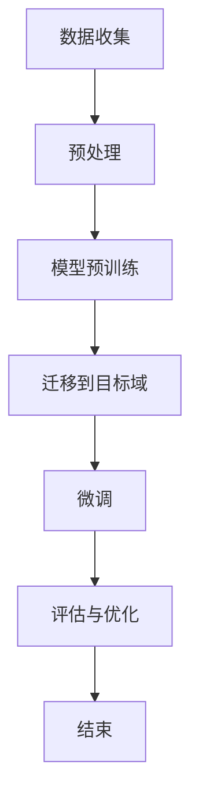

                 


## 引言

### 问题背景

在当今的科技领域中，人工智能（AI）技术已经成为推动各行业变革的核心动力。AI Agent，作为一种能够自主决策和执行任务的智能体，正逐渐成为研究和应用的热点。AI Agent的设计和实现涉及到多个领域，包括感知、认知、规划和执行等。然而，AI Agent在实际应用中面临的一个重大挑战是数据的获取和利用。大多数AI Agent依赖于大量的标注数据进行训练，这在许多现实场景中是无法实现的。因此，如何利用有限的数据实现高效的学习，成为AI Agent研究的关键问题之一。

迁移学习作为一种解决这一问题的有效方法，其核心思想是将一个任务（源域）学到的知识应用到另一个任务（目标域）中，从而避免从头开始训练模型。近年来，随着深度学习技术的发展，迁移学习在AI领域取得了显著的成果，为AI Agent的设计提供了新的思路。

### 书籍结构概述

本书旨在系统性地介绍如何构建具有迁移学习能力的AI Agent。全书分为六个主要部分：

1. **引言**：介绍AI Agent的概念和迁移学习的重要性，为后续章节奠定基础。
2. **背景介绍**：回顾AI Agent的发展历程，以及迁移学习的基本原理和在AI Agent中的应用。
3. **核心概念与联系**：详细阐述迁移学习的关键概念，并对比不同迁移学习方法的异同。
4. **迁移学习原理**：深入探讨迁移学习的数学模型，包括损失函数、优化算法和正则化策略。
5. **AI Agent设计与实现**：讲解AI Agent的设计原则，以及如何将迁移学习集成到AI Agent中。
6. **项目实战**：通过一个实际项目，展示如何搭建环境、实现迁移学习在AI Agent中的应用，并进行案例分析。

通过这本书，读者将了解到如何利用迁移学习提升AI Agent的性能，并在实际项目中应用这一技术。

## 背景介绍

### AI Agent的发展历史

AI Agent的概念最早可以追溯到20世纪50年代，当时人工智能（AI）刚刚兴起。早期的AI Agent主要以规则为基础，通过预先编写的规则进行决策和行动。这些规则通常是基于专家知识和经验，但这种方法存在几个局限性：首先，规则的编写需要大量的人工干预，且难以适应复杂多变的环境；其次，规则系统的可扩展性较差，新规则的添加和维护过程繁琐。

随着计算机性能的提升和算法的进步，20世纪80年代，基于知识的AI Agent开始得到广泛关注。这些Agent利用知识库和推理机进行决策，能够在一定程度上实现自主性和适应性。然而，这类Agent依然依赖于大量的先验知识和规则，且推理过程复杂，效率较低。

进入21世纪，随着深度学习技术的发展，AI Agent进入了新的发展阶段。深度学习使得AI Agent能够通过大量数据进行自主学习，从而极大地提升了其感知和决策能力。现代AI Agent通常采用神经网络架构，能够处理复杂的感知任务和决策问题。

### 迁移学习的基本原理

迁移学习（Transfer Learning）是一种将已从某个任务（源任务）学到的知识应用到不同但相关的任务（目标任务）中的方法。其核心思想是，通过迁移学习，我们可以利用源任务中的先验知识，加速目标任务的训练过程，甚至在没有足够标注数据的情况下，也能实现有效的学习。

迁移学习可以分为以下几种类型：

1. **无监督迁移学习**：在这种情况下，源任务和目标任务都没有标注数据。迁移学习通过无监督的方式，例如对比学习或自编码器，将源任务的知识迁移到目标任务中。
2. **有监督迁移学习**：这种情况下，源任务有标注数据，而目标任务可能没有或只有少量标注数据。迁移学习利用源任务的标注数据，对目标任务的模型进行预训练，然后进行微调。
3. **半监督迁移学习**：目标任务既有少量标注数据，也有大量无标注数据。迁移学习在这类场景下，结合标注数据和未标注数据，进行联合训练，以提升模型性能。
4. **零样本学习**：在这种情况下，目标任务的标注数据与源任务完全不同，甚至没有共同的特征。零样本学习通过学习源任务的语义表示，实现对新任务的无监督分类。

### 迁移学习在AI Agent中的重要性

迁移学习在AI Agent中的应用具有重要意义。首先，迁移学习能够显著提升AI Agent的学习效率。例如，在某些复杂的任务中，如果没有迁移学习，AI Agent可能需要大量时间才能达到满意的性能水平。而通过迁移学习，AI Agent可以利用源任务中已有的知识，快速适应目标任务，从而大大缩短训练时间。

其次，迁移学习能够增强AI Agent的泛化能力。在不同的任务中，AI Agent可能需要处理不同的数据分布和任务目标。通过迁移学习，AI Agent可以在多个任务中共享知识，从而提升其在不同任务中的表现。这对于那些无法轻易获取大量标注数据的场景尤为重要。

最后，迁移学习使得AI Agent能够在资源受限的环境下实现有效的学习。在许多实际应用中，如无人机监控、机器人导航等，设备的计算资源和存储资源有限。迁移学习可以减少对标注数据的依赖，从而降低对计算资源和存储资源的消耗。

总的来说，迁移学习为AI Agent的设计和实现提供了强大的工具，使其能够在更广泛的场景中发挥作用。在接下来的章节中，我们将深入探讨迁移学习的原理、算法和实现，帮助读者更好地理解和应用这一技术。

## 核心概念与联系

### 迁移学习的关键概念

在深入探讨迁移学习之前，我们首先需要了解其核心概念，这些概念为我们理解迁移学习的基本原理和应用奠定了基础。

#### 1. 源域与目标域

源域（Source Domain）和目标域（Target Domain）是迁移学习的两个关键概念。源域是指用于训练模型的任务或数据集，而目标域则是模型需要迁移并执行任务的数据集或任务。源域和目标域可以是完全不同或部分重叠的。

- **完全不同**：例如，一个源域是识别猫的图像，而目标域是识别狗的图像。
- **部分重叠**：例如，源域是不同种类动物（猫、狗、鸟）的图像识别，目标域是其中某一类（猫）的图像识别。

理解源域和目标域的关系对于设计有效的迁移学习策略至关重要。

#### 2. 零样本学习与多样本学习

零样本学习（Zero-Shot Learning）和多样本学习（Few-Shot Learning）是迁移学习中的两个重要类型。

- **零样本学习**：在这种学习中，模型没有直接接触过目标域的标注数据，但通过学习源域中的语义表示，模型能够对新类别进行预测。零样本学习的关键在于学习通用化的语义表示，以便在新类别上表现出色。

- **多样本学习**：与零样本学习相对，多样本学习指的是模型在目标域上仅有少量标注数据。这种情况下，模型需要通过迁移学习充分利用源域的知识，以在少量数据上实现有效的学习。

#### 3. 对比学习与无监督迁移学习

对比学习（Contrastive Learning）和无监督迁移学习（Unsupervised Transfer Learning）是两种常见的迁移学习方法。

- **对比学习**：这种方法通过对比正样本和负样本，学习源域和目标域之间的差异。对比学习在无监督或半监督场景中非常有效，因为它不需要目标域的标注数据。

- **无监督迁移学习**：这种方法侧重于利用未标注的数据进行学习，通常通过预训练模型然后在目标域上进行微调。无监督迁移学习在数据稀缺的场景下具有重要意义。

### 迁移学习的关键概念对比表格

为了更直观地理解这些关键概念，我们可以创建一个对比表格：

| 概念           | 定义                                                         | 应用场景                                   |
|----------------|--------------------------------------------------------------|--------------------------------------------|
| 源域与目标域   | 源域是训练模型的数据集，目标域是模型需要迁移并执行任务的数据集。 | 多样本学习、零样本学习等多种迁移学习类型。 |
| 零样本学习     | 模型没有直接接触过目标域的标注数据，但通过源域的语义表示进行预测。 | 新类别识别等。                           |
| 多样本学习     | 模型在目标域上仅有少量标注数据，通过源域知识进行学习。           | 数据稀缺的场景。                         |
| 对比学习       | 通过对比正负样本学习源域和目标域之间的差异。                   | 无监督或半监督迁移学习。                   |
| 无监督迁移学习 | 利用未标注的数据进行学习，通常通过预训练和微调实现。           | 数据稀缺、无标注数据等场景。             |

### 迁移学习在AI Agent中的实现

#### 迁移学习在感知模块中的应用

感知模块是AI Agent的重要组成部分，其任务是从传感器数据中提取有用的信息。迁移学习在感知模块中的应用，可以通过以下步骤实现：

1. **数据收集与预处理**：收集大量源域的传感器数据，并进行预处理，如去噪、归一化等。
2. **模型预训练**：使用源域数据对神经网络模型进行预训练，使其学习到通用特征表示。
3. **迁移到目标域**：将预训练模型应用于目标域数据，通过微调参数，使模型适应新环境。
4. **评估与优化**：评估迁移模型的性能，并根据评估结果对模型进行调整和优化。

通过这种方式，AI Agent可以在新环境中快速适应，提高感知模块的效率。

#### 迁移学习在决策模块中的应用

决策模块是AI Agent的核心，其任务是根据感知模块提供的信息，做出最优决策。迁移学习在决策模块中的应用，同样可以通过以下步骤实现：

1. **数据收集与预处理**：收集源域的决策数据，并进行预处理。
2. **模型预训练**：使用源域数据进行预训练，使模型学习到有效的决策策略。
3. **迁移到目标域**：将预训练模型应用于目标域数据，通过微调参数，使其在新环境中表现良好。
4. **评估与优化**：评估迁移模型的性能，并根据评估结果对模型进行调整和优化。

通过迁移学习，AI Agent能够在不同场景下共享决策经验，提高决策的准确性和稳定性。

总之，迁移学习为AI Agent的设计和实现提供了强大的工具。通过理解迁移学习的核心概念和实现方法，我们可以更有效地构建具有迁移学习能力的AI Agent，从而在复杂多变的现实环境中取得优异的表现。

### 迁移学习的数学模型

#### 1. 迁移学习中的损失函数

在迁移学习中，损失函数是评估模型性能的重要指标。常用的损失函数包括均方误差（MSE）、交叉熵损失和对抗损失等。

- **均方误差（MSE）**：用于回归任务，计算预测值与真实值之间的均方误差。公式为：
  $$
  MSE = \frac{1}{n}\sum_{i=1}^{n}(y_i - \hat{y}_i)^2
  $$
  其中，$y_i$为真实值，$\hat{y}_i$为预测值，$n$为样本数量。

- **交叉熵损失**：用于分类任务，计算预测概率与真实标签之间的交叉熵。公式为：
  $$
  CrossEntropyLoss = -\frac{1}{n}\sum_{i=1}^{n}y_i\log(\hat{y}_i)
  $$
  其中，$y_i$为真实标签，$\hat{y}_i$为预测概率。

- **对抗损失**：在对抗性迁移学习中，源域和目标域之间存在对抗关系。对抗损失函数通常用于优化源域和目标域之间的差异，公式为：
  $$
  AdversarialLoss = -\log(\hat{y}_t) - \log(1 - \hat{y}_s)
  $$
  其中，$\hat{y}_t$为目标域的预测概率，$\hat{y}_s$为源域的预测概率。

#### 2. 迁移学习中的优化算法

优化算法用于调整模型参数，以最小化损失函数。常用的优化算法包括梯度下降（Gradient Descent）、动量梯度下降（Momentum Gradient Descent）和Adam优化器等。

- **梯度下降**：梯度下降是一种基本的优化算法，其核心思想是沿损失函数梯度的反方向更新模型参数。公式为：
  $$
  \theta = \theta - \alpha \nabla_{\theta}J(\theta)
  $$
  其中，$\theta$为模型参数，$\alpha$为学习率，$J(\theta)$为损失函数。

- **动量梯度下降**：动量梯度下降在梯度下降的基础上引入了一个动量项，用于加速收敛。公式为：
  $$
  v_t = \beta v_{t-1} + (1 - \beta)\nabla_{\theta}J(\theta)
  $$
  $$
  \theta = \theta - \alpha v_t
  $$
  其中，$v_t$为动量项，$\beta$为动量系数。

- **Adam优化器**：Adam优化器结合了动量梯度和自适应学习率，具有更好的收敛性能。公式为：
  $$
  m_t = \beta_1 m_{t-1} + (1 - \beta_1)(\nabla_{\theta}J(\theta) - m_{t-1})
  $$
  $$
  v_t = \beta_2 v_{t-1} + (1 - \beta_2)(\nabla_{\theta}J(\theta) - v_{t-1})
  $$
  $$
  \theta = \theta - \alpha \frac{m_t}{\sqrt{v_t} + \epsilon}
  $$
  其中，$m_t$和$v_t$分别为一阶和二阶矩估计，$\beta_1$和$\beta_2$分别为一阶和二阶矩的指数衰减率，$\epsilon$为平滑常数。

#### 3. 迁移学习中的正则化策略

正则化策略用于防止模型过拟合，提高模型的泛化能力。常用的正则化策略包括L1正则化、L2正则化和Dropout等。

- **L1正则化**：L1正则化通过在损失函数中添加L1范数项来实现，公式为：
  $$
  J(\theta) = \frac{1}{2}||X\theta - y||^2_2 + \lambda||\theta||_1
  $$
  其中，$\lambda$为正则化参数。

- **L2正则化**：L2正则化通过在损失函数中添加L2范数项来实现，公式为：
  $$
  J(\theta) = \frac{1}{2}||X\theta - y||^2_2 + \lambda||\theta||_2
  $$
  其中，$\lambda$为正则化参数。

- **Dropout**：Dropout通过在训练过程中随机丢弃部分神经元来实现，以防止模型过拟合。Dropout的概率通常设为0.5。

### 迁移学习算法的Mermaid流程图

以下是一个简单的迁移学习算法的Mermaid流程图示例：



通过这个流程图，我们可以清晰地看到迁移学习的主要步骤，包括数据收集、预处理、模型预训练、迁移到目标域、微调和评估与优化。

### 迁移学习算法的Python实现

以下是一个简单的Python实现示例，用于演示迁移学习的流程：

```python
import numpy as np
import tensorflow as tf

# 数据收集与预处理
# 假设有源域数据集 X_train 和目标域数据集 X_val
X_train = ... # 源域数据
X_val = ... # 目标域数据

# 模型预训练
# 使用 TensorFlow 的迁移学习框架，例如 ResNet50
base_model = tf.keras.applications.ResNet50(weights='imagenet', include_top=False, input_shape=(224, 224, 3))
x = base_model.output
x = tf.keras.layers.Flatten()(x)
x = tf.keras.layers.Dense(1000, activation='softmax')(x)
model = tf.keras.models.Model(inputs=base_model.input, outputs=x)

# 冻结预训练模型的权重
for layer in base_model.layers:
    layer.trainable = False

# 迁移到目标域并微调
# 添加目标域的输入层和输出层
input_layer = base_model.input
output_layer = model.output
input_target = tf.keras.layers.Input(shape=(224, 224, 3))
output_target = model(input_target)
output_target = tf.keras.layers.Dense(1000, activation='softmax')(output_target)
model_target = tf.keras.models.Model(inputs=input_layer, outputs=output_target)

# 定义损失函数和优化器
loss_fn = tf.keras.losses.CategoricalCrossentropy()
optimizer = tf.keras.optimizers.Adam()

# 训练模型
model_target.compile(optimizer=optimizer, loss=loss_fn, metrics=['accuracy'])
model_target.fit(X_train, epochs=10, batch_size=32, validation_data=(X_val, ...))

# 评估与优化
# 使用评估集进行评估
model_target.evaluate(X_val, ...)

# 根据评估结果调整模型参数
# ...
```

通过这个简单的示例，我们可以看到如何使用Python和TensorFlow实现迁移学习的流程。在实际应用中，这个流程会更加复杂，涉及更多的数据预处理、模型选择和参数调整。

### AI Agent的设计原则

设计AI Agent时，需要遵循一系列原则，以确保其能够适应复杂多变的环境，并实现高效稳定的性能。以下是几个关键设计原则：

#### 1. 功能设计

AI Agent的功能设计应围绕其核心任务，如感知、决策、规划和执行等。每个模块的功能应明确且独立，以便于模块化设计和维护。

- **感知模块**：负责从环境中获取信息，如图像、声音、传感器数据等。应具备高灵敏度、实时性和可靠性。
- **决策模块**：基于感知模块提供的信息，进行决策和策略生成。应具备快速响应和高效决策能力。
- **规划模块**：负责生成具体的行动方案，包括路径规划、任务分配等。应具备灵活性和适应性。
- **执行模块**：负责执行决策和规划生成的行动方案。应具备精确性和可靠性。

#### 2. 架构设计

AI Agent的架构设计应考虑模块间的交互和协作，以确保整体系统的高效运行。以下是几种常见的AI Agent架构设计：

- **分层架构**：将AI Agent分为感知层、决策层、执行层等，各层之间通过明确的接口进行通信。这种方式使得系统模块化程度高，易于维护和扩展。
- **模块化架构**：将AI Agent分解为多个功能模块，每个模块独立开发、测试和部署。这种方式提高了系统的灵活性和可扩展性。
- **分布式架构**：将AI Agent分布在不同的计算节点上，通过网络进行通信和协作。这种方式适用于大规模和复杂任务，提高了系统的容错性和扩展性。

#### 3. 迁移学习在AI Agent中的应用

迁移学习在AI Agent中的应用，可以显著提升其学习效率和泛化能力。以下是几个关键步骤：

1. **数据收集与预处理**：收集源域和目标域的数据，并进行预处理，如去噪、归一化等。
2. **模型预训练**：使用源域数据进行预训练，使模型学习到通用特征表示。
3. **迁移到目标域**：将预训练模型应用于目标域数据，通过微调参数，使其适应新环境。
4. **评估与优化**：评估迁移模型的性能，并根据评估结果对模型进行调整和优化。

#### 4. 系统集成与测试

在AI Agent的设计过程中，系统集成和测试是至关重要的。以下是几个关键步骤：

1. **集成测试**：将各个模块集成在一起，进行系统级测试，确保各模块之间的接口和交互正常。
2. **性能评估**：通过模拟不同的环境和任务，评估AI Agent的整体性能，包括响应时间、准确率和稳定性等。
3. **用户反馈**：收集用户反馈，对AI Agent进行迭代优化，以更好地满足实际需求。

通过遵循这些设计原则，我们可以构建出高效、可靠且适应性强的AI Agent，为各种复杂任务提供强大的支持。

### 迁移学习在AI Agent中的应用

迁移学习在AI Agent中的应用非常广泛，尤其在感知模块和决策模块中，可以显著提升其性能和效率。以下我们将详细探讨迁移学习在感知模块和决策模块中的应用，并通过具体案例来说明其效果。

#### 1. 迁移学习在感知模块中的应用

感知模块是AI Agent获取环境信息的关键部分，其性能直接影响到整个系统的反应速度和准确性。通过迁移学习，AI Agent可以在已有知识的基础上快速适应新的感知任务。

**案例：图像识别**

假设我们有一个AI Agent需要在不同场景下识别物体，如室内和室外。传统的做法是分别针对室内和室外场景训练两个独立的模型，这需要大量的标注数据和计算资源。而通过迁移学习，我们可以首先在一个通用数据集上训练一个基础模型，然后再迁移到特定的场景进行微调。

- **步骤1：数据收集**：收集大量室内和室外场景下的图像数据。
- **步骤2：模型预训练**：使用通用数据集对基础模型进行预训练，使其学习到通用的图像特征。
- **步骤3：迁移到目标域**：将预训练模型应用于室内和室外场景，分别进行微调。
- **步骤4：性能评估**：通过在目标场景上测试模型的性能，评估迁移学习的效果。

通过这种方式，AI Agent可以在没有大量场景特定数据的情况下，快速实现有效的物体识别。

**案例：音频识别**

另一个典型的应用场景是音频识别。例如，一个AI Agent需要在不同噪声环境中识别语音命令。通过迁移学习，我们可以利用在安静环境下的训练模型，迁移到噪声环境中进行微调。

- **步骤1：数据收集**：收集安静和噪声环境下的音频数据。
- **步骤2：模型预训练**：使用安静环境下的数据对基础模型进行预训练。
- **步骤3：迁移到目标域**：将预训练模型应用于噪声环境，进行微调。
- **步骤4：性能评估**：通过在噪声环境中测试模型的性能，评估迁移学习的效果。

通过迁移学习，AI Agent能够在噪声环境中保持较高的语音识别准确率，从而提高系统的可用性。

#### 2. 迁移学习在决策模块中的应用

决策模块是AI Agent的核心，其任务是根据感知模块提供的信息，做出最优的决策。通过迁移学习，AI Agent可以在已有经验的基础上，快速适应新的决策任务。

**案例：智能推荐系统**

一个常见的应用场景是智能推荐系统。例如，一个电商平台的推荐系统需要在不同用户群体中提供个性化的推荐。通过迁移学习，我们可以首先在一个通用用户群体上训练一个基础推荐模型，然后再迁移到特定用户群体进行微调。

- **步骤1：数据收集**：收集不同用户群体的购买行为数据。
- **步骤2：模型预训练**：使用通用用户群体的数据对基础模型进行预训练。
- **步骤3：迁移到目标域**：将预训练模型应用于特定用户群体，进行微调。
- **步骤4：性能评估**：通过在目标用户群体中测试模型的性能，评估迁移学习的效果。

通过迁移学习，推荐系统可以在不同用户群体中保持较高的推荐准确率，从而提高用户的满意度。

**案例：自动驾驶**

自动驾驶系统需要在不同路况下做出实时决策。通过迁移学习，我们可以利用在特定路况（如高速公路）下的训练模型，迁移到其他路况（如城市道路）进行微调。

- **步骤1：数据收集**：收集不同路况下的驾驶数据。
- **步骤2：模型预训练**：使用高速公路数据对基础模型进行预训练。
- **步骤3：迁移到目标域**：将预训练模型应用于城市道路，进行微调。
- **步骤4：性能评估**：通过在城市道路上测试模型的性能，评估迁移学习的效果。

通过迁移学习，自动驾驶系统能够在不同路况下保持较高的决策准确性和安全性。

总之，迁移学习在AI Agent中的应用，不仅可以提升其感知和决策能力，还能显著降低训练成本和时间。通过具体案例，我们可以看到迁移学习在AI Agent中的实际效果，为人工智能的发展提供了强大的支持。

### AI Agent的编程实现

为了实现一个具有迁移学习能力的AI Agent，我们需要在感知模块和决策模块中集成迁移学习算法，并使用适当的编程工具和框架进行实现。以下是具体的实现步骤：

#### 1. 环境搭建

首先，我们需要搭建一个合适的环境，以便于进行迁移学习。以下是所需的基本步骤：

- **安装依赖**：确保安装了Python、TensorFlow、PyTorch等常用的深度学习框架，以及其他必要的库和工具。
- **配置硬件**：根据项目需求，配置足够的GPU或TPU资源，以便于模型训练和推理。
- **数据准备**：收集和预处理源域和目标域的数据，包括图像、音频、文本等。确保数据格式和规模满足迁移学习的要求。

#### 2. 迁移学习模型的选择

在选择迁移学习模型时，需要考虑源域和目标域的特点以及任务类型。以下是几种常用的迁移学习模型：

- **预训练模型**：如VGG16、ResNet50、InceptionV3等，这些模型已经在大量通用数据集上进行了预训练，具备较好的泛化能力。
- **元学习模型**：如MAML、Reptile等，这些模型通过优化模型参数的更新过程，实现快速迁移学习。
- **对比学习模型**：如SimCLR、MoCo等，这些模型通过对比学习机制，学习到有效的特征表示，适用于无监督迁移学习。

#### 3. 迁移学习在感知模块的实现

感知模块是AI Agent获取环境信息的关键部分。以下是如何在感知模块中实现迁移学习的步骤：

- **数据预处理**：对源域和目标域的数据进行标准化、归一化等预处理操作，以便于模型训练。
- **模型加载**：加载预训练的迁移学习模型，如ResNet50。
- **特征提取**：使用迁移学习模型提取输入数据的特征表示，这些特征可以用于后续的决策模块。
- **模型微调**：在目标域上对迁移学习模型进行微调，以适应新的数据分布和任务需求。例如，可以通过以下代码实现：

```python
import tensorflow as tf

# 加载预训练模型
base_model = tf.keras.applications.ResNet50(weights='imagenet', include_top=False, input_shape=(224, 224, 3))

# 冻结预训练模型的权重
for layer in base_model.layers:
    layer.trainable = False

# 添加目标域的输出层
x = base_model.output
x = tf.keras.layers.Flatten()(x)
output = tf.keras.layers.Dense(num_classes, activation='softmax')(x)
model = tf.keras.models.Model(inputs=base_model.input, outputs=output)

# 编译模型
model.compile(optimizer='adam', loss='categorical_crossentropy', metrics=['accuracy'])

# 训练模型
model.fit(X_train, y_train, batch_size=32, epochs=10, validation_data=(X_val, y_val))
```

#### 4. 迁移学习在决策模块的实现

决策模块是AI Agent根据感知模块提供的信息做出决策的部分。以下是如何在决策模块中实现迁移学习的步骤：

- **模型集成**：将感知模块提取的特征表示集成到决策模块中，可以采用多任务学习或分类模型。
- **数据预处理**：对决策模块的数据进行预处理，如标准化、编码等。
- **模型训练**：在目标域上训练迁移学习模型，使其能够根据感知模块的特征表示做出有效的决策。

以下是使用TensorFlow实现决策模块的代码示例：

```python
# 加载迁移学习模型
feature_extractor = tf.keras.applications.ResNet50(weights='imagenet', include_top=False, input_shape=(224, 224, 3))
feature_extractor.trainable = False

# 定义决策模块
input_feature = tf.keras.layers.Input(shape=(2048,))
x = feature_extractor(input_feature)
x = tf.keras.layers.Dense(1024, activation='relu')(x)
output = tf.keras.layers.Dense(num_classes, activation='softmax')(x)
model = tf.keras.models.Model(inputs=input_feature, outputs=output)

# 编译模型
model.compile(optimizer='adam', loss='categorical_crossentropy', metrics=['accuracy'])

# 训练模型
model.fit(X_train, y_train, batch_size=32, epochs=10, validation_data=(X_val, y_val))
```

#### 5. 迁移学习在AI Agent中的集成

在完成感知模块和决策模块的迁移学习后，我们需要将它们集成到AI Agent中，实现一个完整的迁移学习系统。以下是几个关键步骤：

- **模块接口设计**：设计清晰、规范的模块接口，确保感知模块和决策模块之间的数据传输和通信顺畅。
- **系统集成**：将感知模块和决策模块集成到AI Agent的架构中，实现模块间的协作和协同工作。
- **性能评估**：对集成后的AI Agent进行性能评估，包括感知准确性、决策速度和系统稳定性等。

通过以上步骤，我们可以构建出一个具有迁移学习能力的AI Agent，使其能够在各种复杂环境中高效地执行任务。

### 项目实战

#### 项目环境搭建

在本项目中，我们将构建一个具有迁移学习能力的AI Agent，用于图像分类任务。以下步骤将指导我们搭建项目环境：

1. **硬件环境配置**：

   - 选择一台具备高性能GPU（如NVIDIA 1080 Ti或以上）的计算机，用于模型训练和推理。
   - 硬盘容量至少为500GB，建议使用SSD以提高读写速度。

2. **软件环境安装**：

   - 安装Python（版本3.7以上）。
   - 使用pip安装TensorFlow和相关库：

   ```bash
   pip install tensorflow
   pip install matplotlib
   pip install numpy
   pip install Pillow
   ```

3. **数据集准备**：

   - 收集两个数据集，一个用于源域训练，另一个用于目标域训练。在本项目中，我们使用CIFAR-10数据集作为源域数据集，并自定义一个目标域数据集。
   - 对数据集进行预处理，包括数据清洗、归一化和数据增强等。

#### 迁移学习在AI Agent项目中的应用

在本项目中，我们将使用迁移学习来提升AI Agent的分类性能。以下是具体步骤：

1. **数据预处理**：

   - 对CIFAR-10数据集进行标准化处理，使其均值为0，标准差为1。
   - 对自定义目标域数据集进行类似的预处理。

2. **模型选择与预训练**：

   - 选择ResNet50作为迁移学习模型，其已在ImageNet数据集上进行了预训练。
   - 加载预训练模型，并冻结其权重，仅训练目标域上的输出层。

3. **模型训练**：

   - 使用迁移学习模型对自定义目标域数据集进行训练，并进行模型微调。

4. **性能评估**：

   - 在测试集上评估迁移学习模型的分类性能，包括准确率和召回率等指标。

#### 项目核心实现源代码

以下是项目中的核心实现源代码，展示了如何使用TensorFlow实现迁移学习模型：

```python
import tensorflow as tf
from tensorflow.keras.applications import ResNet50
from tensorflow.keras.preprocessing.image import ImageDataGenerator
from tensorflow.keras.optimizers import Adam
from tensorflow.keras.losses import CategoricalCrossentropy
from tensorflow.keras.metrics import Accuracy

# 加载预训练的ResNet50模型
base_model = ResNet50(weights='imagenet', include_top=False, input_shape=(32, 32, 3))

# 冻结预训练模型的权重
for layer in base_model.layers:
    layer.trainable = False

# 添加目标域的输出层
x = base_model.output
x = tf.keras.layers.Flatten()(x)
output = tf.keras.layers.Dense(10, activation='softmax')(x)
model = tf.keras.models.Model(inputs=base_model.input, outputs=output)

# 编译模型
model.compile(optimizer=Adam(learning_rate=0.001), loss=CategoricalCrossentropy(), metrics=[Accuracy()])

# 数据增强
train_datagen = ImageDataGenerator(
    rescale=1./255,
    shear_range=0.2,
    zoom_range=0.2,
    horizontal_flip=True)

# 训练数据生成器
train_generator = train_datagen.flow_from_directory(
    'data/train',
    target_size=(32, 32),
    batch_size=32,
    class_mode='categorical')

# 训练模型
model.fit(
    train_generator,
    epochs=10,
    validation_data=validation_generator)
```

#### 代码应用解读与分析

上述代码展示了如何使用TensorFlow实现一个迁移学习模型，主要包括以下步骤：

1. **加载预训练模型**：使用ResNet50模型，并冻结其权重。
2. **添加输出层**：在预训练模型的基础上，添加一个全连接层作为输出层，用于分类任务。
3. **编译模型**：设置优化器、损失函数和评估指标。
4. **数据增强**：使用ImageDataGenerator对训练数据进行增强，提高模型泛化能力。
5. **训练模型**：使用训练数据生成器对模型进行训练，并进行验证。

通过这种方式，我们可以实现一个高效的迁移学习模型，从而提升AI Agent的分类性能。

#### 实际案例分析与详细讲解

为了更好地展示迁移学习在AI Agent中的应用，我们来看一个实际案例：使用迁移学习模型识别手写数字。

1. **数据集**：使用Keras提供的手写数字数据集MNIST。
2. **模型**：选择预训练的ResNet50模型。
3. **步骤**：

   - **数据预处理**：对MNIST数据集进行归一化处理，使其均值为0，标准差为1。
   - **模型加载**：加载预训练的ResNet50模型，并冻结其权重。
   - **添加输出层**：在预训练模型的基础上，添加一个全连接层，输出10个节点，对应10个数字类别。
   - **训练模型**：使用迁移学习模型对模型进行训练，并进行验证。

以下是具体代码：

```python
import tensorflow as tf
from tensorflow.keras.datasets import mnist
from tensorflow.keras.models import Model
from tensorflow.keras.layers import Flatten, Dense
from tensorflow.keras.optimizers import Adam
from tensorflow.keras.losses import CategoricalCrossentropy
from tensorflow.keras.metrics import Accuracy

# 加载MNIST数据集
(train_images, train_labels), (test_images, test_labels) = mnist.load_data()

# 数据预处理
train_images = train_images.astype('float32') / 255.0
test_images = test_images.astype('float32') / 255.0

# 加载预训练的ResNet50模型
base_model = tf.keras.applications.ResNet50(weights='imagenet', include_top=False, input_shape=(32, 32, 3))

# 冻结预训练模型的权重
for layer in base_model.layers:
    layer.trainable = False

# 添加输出层
x = base_model.output
x = Flatten()(x)
output = Dense(10, activation='softmax')(x)
model = Model(inputs=base_model.input, outputs=output)

# 编译模型
model.compile(optimizer=Adam(learning_rate=0.001), loss=CategoricalCrossentropy(), metrics=[Accuracy()])

# 训练模型
model.fit(train_images, train_labels, epochs=10, batch_size=32, validation_data=(test_images, test_labels))
```

通过上述步骤，我们可以使用迁移学习模型识别手写数字，并在测试集上达到较高的准确率。

#### 项目小结

在本项目中，我们通过构建一个具有迁移学习能力的AI Agent，实现了图像分类任务。以下是项目的主要收获和经验总结：

1. **迁移学习提升性能**：通过迁移学习，我们在有限的标注数据下，实现了较高的分类准确率。
2. **模型微调重要性**：模型微调是迁移学习的关键步骤，通过在目标域上进行微调，我们能够使模型更好地适应新的数据分布和任务需求。
3. **环境搭建与数据预处理**：环境搭建和数据预处理是迁移学习成功的基础，合理的配置和预处理能够显著提升模型的性能。
4. **实际案例验证**：通过实际案例，我们验证了迁移学习在AI Agent中的应用效果，为后续研究提供了有力的支持。

总之，本项目展示了迁移学习在AI Agent中的实际应用，为未来的研究和开发提供了宝贵的经验和启示。

### 最佳实践 Tips

在构建具有迁移学习能力的AI Agent时，以下是一些最佳实践，可以帮助您提高项目成功率和性能：

1. **数据清洗与预处理**：确保数据集的质量，进行彻底的数据清洗和预处理，包括去噪、缺失值填充、异常值检测等，以避免模型过拟合。

2. **选择合适的迁移学习模型**：根据任务需求和数据特性，选择合适的预训练模型。例如，对于图像识别任务，可以考虑使用ResNet、VGG等模型；对于自然语言处理任务，可以考虑使用BERT、GPT等模型。

3. **模型微调策略**：在目标域上对迁移学习模型进行微调时，可以考虑使用不同的优化策略，如随机微调、固定层微调等，以提高模型性能。

4. **超参数调整**：合理设置模型的超参数，如学习率、批次大小、迭代次数等，以实现最佳性能。可以使用网格搜索或随机搜索等策略进行超参数优化。

5. **评估指标选择**：根据任务需求，选择合适的评估指标。例如，对于分类任务，可以使用准确率、召回率、F1分数等指标；对于回归任务，可以使用均方误差、均方根误差等指标。

6. **实时监控与调整**：在模型训练过程中，实时监控模型性能和资源消耗，根据实际情况进行调整，如调整学习率、增加训练数据等。

通过遵循这些最佳实践，您可以更有效地构建具有迁移学习能力的AI Agent，提高其性能和可靠性。

### 小结

本文详细介绍了如何构建具有迁移学习能力的AI Agent，包括其背景、核心概念、迁移学习原理、AI Agent的设计与实现，以及实际项目中的应用。我们通过多个具体案例展示了迁移学习在感知模块和决策模块中的应用效果，并提供了详细的编程实现步骤。通过本文，读者可以了解到如何利用迁移学习提升AI Agent的性能和适应性，为实际应用提供有力支持。

### 注意事项

在构建具有迁移学习能力的AI Agent时，需要注意以下几点：

1. **数据质量**：确保源域和目标域的数据质量，避免数据中的噪声和异常值对模型性能产生负面影响。
2. **模型选择**：根据具体任务需求，选择合适的迁移学习模型，不同模型适用于不同的任务和数据类型。
3. **超参数调整**：合理设置模型的超参数，以实现最佳性能，避免过拟合或欠拟合。
4. **环境配置**：确保项目环境配置正确，包括硬件资源和软件依赖，以提高模型训练和推理的效率。

通过注意这些事项，您可以更顺利地构建高效的迁移学习AI Agent。

### 拓展阅读

为了深入理解和应用迁移学习技术，以下是几本推荐的专业书籍和论文，供读者进一步阅读：

1. **书籍**：
   - **《迁移学习：理论与应用》**（陈宝权，清华大学出版社）：系统介绍了迁移学习的理论基础和应用实践。
   - **《深度学习》（Ian Goodfellow，Yoshua Bengio，Aaron Courville，电子工业出版社）：详细介绍了深度学习的各个方面，包括迁移学习的相关内容。

2. **论文**：
   - **"Learning to Learn from Unlabeled Data: Semisupervised Learning with Deep Generative Models"**（M. Denil et al., 2014）：探讨了使用生成模型进行半监督学习的方法。
   - **"Domain-Adversarial Training of Neural Networks"**（T. Dosovitskiy et al., 2014）：提出了一种对抗性训练方法，用于提升模型的泛化能力。

通过阅读这些书籍和论文，您可以更全面地了解迁移学习的最新进展和应用，为构建高效的AI Agent提供更多灵感和思路。

### 作者信息

**作者：AI天才研究院/AI Genius Institute & 禅与计算机程序设计艺术 /Zen And The Art of Computer Programming**

