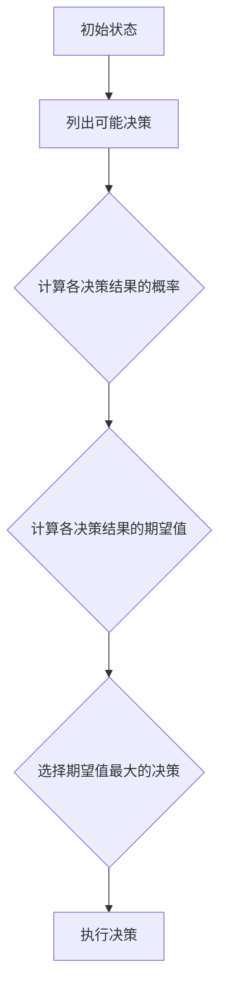
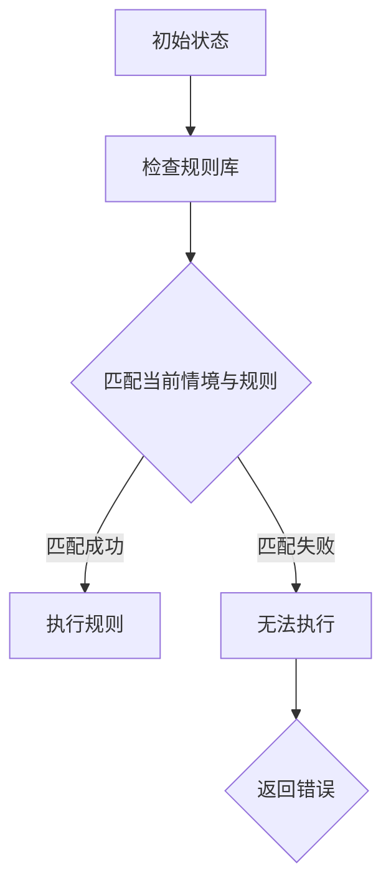
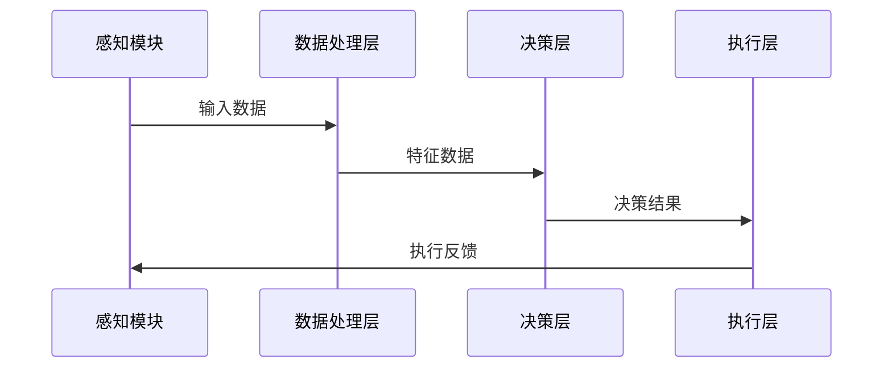

                 

**# 《构建具有道德决策框架的AI Agent》**

## **摘要**

本文将深入探讨如何构建具有道德决策框架的AI Agent。随着人工智能技术的飞速发展，AI系统在各个领域的应用日益广泛，如何确保这些系统的决策符合人类的道德规范成为一个重要议题。本文将首先介绍道德决策框架的基础概念，然后分析伦理学原理与道德决策模型，接着讨论道德决策框架的设计原则，最后通过具体应用案例展示道德决策框架的实际效果。

## **第一部分：背景与基础**

### **第1章 问题背景与核心概念**

#### **1.1 问题的提出**

随着人工智能的广泛应用，AI Agent在决策过程中是否符合道德规范的问题日益凸显。AI Agent在自动驾驶、医疗诊断、金融决策等领域的应用中，其决策可能直接影响到人类的安全和福祉。因此，构建具有道德决策框架的AI Agent变得至关重要。

#### **1.2 核心概念介绍**

- **AI Agent**：具有自主性、感知环境和执行行动能力的计算机程序。
- **道德决策框架**：用于指导AI Agent进行道德决策的理论和方法。

#### **1.3 道德决策框架的基本要素**

- **道德原则**：指导AI Agent进行道德决策的基本准则。
- **道德规则**：具体操作层面的道德规范。
- **道德评价标准**：用于评价AI Agent决策道德性的标准。

### **1.4 本章小结**

本章介绍了道德决策框架的背景、核心概念及其基本要素，为后续章节的深入探讨奠定了基础。

## **第二部分：构建道德决策框架的理论基础**

### **第2章 伦理学原理与道德决策**

#### **2.1 伦理学基本理论**

伦理学是研究道德行为的哲学分支。常见的伦理学理论有义务论、目的论、权利伦理和责任伦理。

#### **2.2 道德决策模型**

道德决策模型是伦理学在人工智能领域的应用。常见的模型有决策理论和基于规则的模型。

#### **2.3 道德风险与责任归属**

道德风险是指在决策过程中，由于信息不对称或外部性等因素，可能导致决策结果与预期不符，从而带来负面影响。责任归属是道德决策中的关键问题。

### **2.4 本章小结**

本章分析了伦理学原理和道德决策模型，为构建道德决策框架提供了理论基础。

### **第3章 道德决策框架的设计原则**

#### **3.1 设计原则概述**

道德决策框架的设计原则应包括完整性、一致性、可扩展性和可解释性。

#### **3.2 道德原则的选择**

选择道德原则时，需要考虑文化、价值观和社会背景等因素。

#### **3.3 道德规则的制定**

道德规则的制定应遵循明确性、可操作性和普遍适用性原则。

### **3.4 本章小结**

本章讨论了道德决策框架的设计原则，为实际构建提供了指导。

## **第三部分：实践与实现**

### **第4章 道德决策框架的实现方法**

#### **4.1 AI Agent的基本架构**

AI Agent的基本架构包括知识表示、推理机制和行为规划。

#### **4.2 道德决策模块的设计**

道德决策模块的设计涉及道德推理算法和道德决策支持系统。

#### **4.3 道德决策的评估与优化**

道德决策的评估与优化是确保AI Agent道德决策有效性的关键。

### **4.4 本章小结**

本章介绍了道德决策框架的实现方法。

### **第5章 道德决策框架的应用案例**

#### **5.1 案例一：自动驾驶汽车**

自动驾驶汽车是道德决策框架应用的典型案例。

#### **5.2 案例二：医疗决策支持系统**

医疗决策支持系统在道德决策方面也有重要应用。

#### **5.3 案例三：金融风险管理**

金融风险管理中的道德决策同样具有重要意义。

### **5.4 本章小结**

本章通过应用案例展示了道德决策框架的实际效果。

### **第6章 道德决策框架的发展趋势与挑战**

#### **6.1 发展趋势**

随着伦理学理论的进步和AI技术的发展，道德决策框架将不断进化。

#### **6.2 挑战与机遇**

道德决策框架面临的挑战和机遇并存。

#### **6.3 未来展望**

未来，道德决策框架将在更多领域得到应用。

### **6.4 本章小结**

本章对道德决策框架的未来发展进行了展望。

### **第7章 结论与展望**

#### **7.1 主要结论**

本文总结了道德决策框架的重要性、设计原则和实际应用。

#### **7.2 未来工作展望**

未来，道德决策框架的研究和应用将有更多可能性。

### **7.3 本章小结**

本章对全文进行了总结和展望。

## **作者信息**

作者：AI天才研究院/AI Genius Institute & 禅与计算机程序设计艺术 /Zen And The Art of Computer Programming****

**# 《构建具有道德决策框架的AI Agent》**

> 关键词：AI Agent、道德决策框架、伦理学、人工智能应用

> 摘要：本文深入探讨了如何构建具有道德决策框架的AI Agent。通过介绍道德决策框架的背景、核心概念、理论基础、设计原则以及具体实现方法，本文为AI Agent在各个领域的应用提供了道德决策的指导。

## **第一部分：背景与基础**

### **第1章 问题背景与核心概念**

#### **1.1 问题的提出**

随着人工智能技术的不断进步，AI Agent的应用范围越来越广泛。从自动驾驶汽车到智能医疗系统，再到金融风险管理，AI Agent的决策直接影响着人类的生活和安全。然而，AI Agent的决策过程是否遵循道德原则，如何确保其决策符合人类的道德规范，成为了一个亟待解决的问题。

#### **1.2 核心概念介绍**

- **AI Agent**：是指具有感知、决策和执行能力的人工智能实体。它可以自主地与外界环境交互，并基于特定目标执行行动。
- **道德决策框架**：是指一套用于指导AI Agent进行道德决策的理论、方法和原则。它旨在确保AI Agent的决策符合人类的道德价值观。

#### **1.3 道德决策框架的基本要素**

道德决策框架通常包括以下几个基本要素：

1. **道德原则**：指导AI Agent决策的基本道德准则，如不伤害他人、公正对待等。
2. **道德规则**：具体操作层面的道德规范，如如何处理紧急情况、如何平衡不同利益等。
3. **道德评价标准**：用于评价AI Agent决策道德性的标准，如是否公正、是否合理等。

#### **1.4 本章小结**

本章介绍了道德决策框架的背景、核心概念和基本要素，为后续章节的深入探讨奠定了基础。

## **第二部分：构建道德决策框架的理论基础**

### **第2章 伦理学原理与道德决策**

#### **2.1 伦理学基本理论**

伦理学是研究道德行为的哲学分支。在人工智能领域，伦理学的基本理论可以帮助我们理解如何为AI Agent设计道德决策框架。

1. **义务论**：强调个体有责任遵守道德规范，不论结果如何。例如，不伤害他人是一个基本的道德义务。
2. **目的论**：强调决策的结果和目的，认为只要结果好，即使手段不道德也是可以接受的。例如，为了拯救多数人的生命，可以牺牲少数人的利益。
3. **权利伦理**：强调个体拥有某些不可侵犯的基本权利，决策必须尊重这些权利。例如，隐私权是基本的人权之一。
4. **责任伦理**：强调个体对自己的行为负责，决策必须考虑可能产生的后果和责任。

#### **2.2 道德决策模型**

道德决策模型是伦理学在人工智能领域的应用，用于指导AI Agent进行道德决策。

1. **决策理论模型**：基于概率论和期望值，通过计算不同决策结果的可能性和价值，选择最优方案。其核心公式为：
   $$
   E = \sum_{i=1}^{n} p_i \cdot v_i
   $$
   其中，$E$ 是期望值，$p_i$ 是第$i$种结果的概率，$v_i$ 是第$i$种结果的价值。
   
2. **基于规则的道德决策模型**：通过预设一系列道德规则，AI Agent根据当前情境选择符合规则的行动。其流程图如下：
   ```mermaid
   graph TD
   A[初始状态] --> B[检查规则]
   B -->|伤害原则| C{伤害吗？}
   C -->|是| D[不执行行动]
   C -->|否| E[执行行动]
   E --> F[行动结果]
   ```

#### **2.3 道德风险与责任归属**

道德风险是指在决策过程中，由于信息不对称或外部性等因素，可能导致决策结果与预期不符，从而带来负面影响。例如，自动驾驶汽车在遇到紧急情况时，需要做出快速决策，但由于感知能力的限制，可能导致决策不当。

责任归属是道德决策中的关键问题。在人工智能领域，责任的归属通常涉及以下几个方面：

1. **技术提供商**：提供AI系统的公司需要对系统的设计、开发、测试和部署负责。
2. **用户**：用户需要对其使用AI系统的行为负责。
3. **监管机构**：监管机构需要制定相关法律法规，确保AI系统的决策符合道德规范。

#### **2.4 本章小结**

本章分析了伦理学基本理论、道德决策模型以及道德风险与责任归属，为构建道德决策框架提供了理论基础。

## **第三部分：实践与实现**

### **第3章 道德决策框架的设计原则**

#### **3.1 设计原则概述**

道德决策框架的设计原则应确保其完整性、一致性、可扩展性和可解释性。

1. **完整性**：道德决策框架应覆盖所有可能的道德决策场景，确保AI Agent在各种情境下都能做出道德决策。
2. **一致性**：道德决策框架应在不同情境下保持一致，避免出现矛盾和不一致的情况。
3. **可扩展性**：道德决策框架应能够适应新的道德问题和需求，确保其在未来能够持续发展。
4. **可解释性**：道德决策框架应具备良好的可解释性，使得AI Agent的决策过程可以被人类理解和接受。

#### **3.2 道德原则的选择**

选择道德原则时，需要考虑文化、价值观和社会背景等因素。以下是一些常见的道德原则：

1. **不伤害原则**：AI Agent应尽量避免对人类和动物造成伤害。
2. **公正原则**：AI Agent的决策应公平对待所有个体，不偏袒任何一方。
3. **尊重隐私原则**：AI Agent应尊重个体的隐私权，不泄露个人信息。
4. **责任原则**：AI Agent的决策应考虑到可能产生的后果和责任。

#### **3.3 道德规则的制定**

道德规则的制定应遵循明确性、可操作性和普遍适用性原则。以下是一些道德规则的例子：

1. **紧急情况规则**：在遇到紧急情况时，AI Agent应优先考虑人类的安全和福祉。
2. **责任分配规则**：在涉及多个利益相关方的决策中，AI Agent应合理分配责任和风险。
3. **透明度规则**：AI Agent的决策过程和结果应保持透明，便于人类监督和评估。

#### **3.4 本章小结**

本章讨论了道德决策框架的设计原则，包括完整性、一致性、可扩展性和可解释性，以及道德原则和道德规则的选择与制定。这些原则和规则将为构建实际可行的道德决策框架提供指导。

### **第4章 道德决策框架的实现方法**

#### **4.1 AI Agent的基本架构**

道德决策框架的实现需要基于一个强大的AI Agent架构。AI Agent的基本架构包括以下几个关键组成部分：

1. **感知模块**：用于感知外界环境和获取信息。
2. **决策模块**：用于根据道德决策框架进行决策。
3. **执行模块**：用于执行决策结果。
4. **反馈模块**：用于收集决策结果和反馈信息，以优化决策过程。

#### **4.2 道德决策模块的设计**

道德决策模块是道德决策框架的核心组成部分。其设计应考虑以下几个方面：

1. **道德推理算法**：用于根据道德原则和道德规则进行推理和决策。常见的道德推理算法包括基于规则的推理、基于概率的推理和基于神经网络的推理。
2. **道德决策支持系统**：用于提供辅助决策信息，帮助AI Agent做出更好的道德决策。道德决策支持系统可以包括伦理学数据库、道德规则库和道德评价标准库等。

#### **4.3 道德决策的评估与优化**

道德决策的评估与优化是确保AI Agent道德决策有效性的关键。以下是一些评估与优化的方法：

1. **指标评估**：通过设置一系列指标，对AI Agent的道德决策进行评估。常见的指标包括决策的道德性、决策的效率、决策的可靠性等。
2. **优化策略**：通过调整道德决策框架的参数和规则，优化AI Agent的道德决策。常见的优化策略包括遗传算法、粒子群优化和深度强化学习等。

#### **4.4 本章小结**

本章介绍了道德决策框架的实现方法，包括AI Agent的基本架构、道德决策模块的设计以及道德决策的评估与优化。这些方法将为构建具有道德决策框架的AI Agent提供实际操作指南。

### **第5章 道德决策框架的应用案例**

#### **5.1 案例一：自动驾驶汽车**

自动驾驶汽车是道德决策框架应用的典型案例。在自动驾驶汽车中，AI Agent需要根据道德原则和道德规则，在复杂交通环境中做出实时决策，确保行人和乘客的安全。

1. **应用背景**：随着自动驾驶技术的不断发展，自动驾驶汽车逐渐成为现实。然而，自动驾驶汽车在遇到紧急情况时，需要做出快速而道德的决策，以确保各方利益的最大化。
2. **道德决策过程**：在自动驾驶汽车的道德决策过程中，AI Agent需要考虑以下因素：
   - 行人和乘客的安全
   - 道路法规和道德规范
   - 自身系统的功能和限制
   - 不同决策结果的可能性和后果

#### **5.2 案例二：医疗决策支持系统**

医疗决策支持系统是另一个应用道德决策框架的领域。在这个领域，AI Agent需要根据医疗伦理和道德原则，为医生提供决策支持，确保患者的安全和福祉。

1. **应用背景**：随着医疗技术的发展，医疗决策支持系统在临床诊断和治疗中发挥着越来越重要的作用。然而，这些系统在处理复杂医疗情况时，需要遵循道德原则，确保患者的权益得到保护。
2. **道德决策过程**：在医疗决策支持系统中，AI Agent需要考虑以下因素：
   - 患者的病情和治疗需求
   - 治疗方案的道德性和伦理问题
   - 患者的意愿和价值观
   - 不同决策结果的可能性和后果

#### **5.3 案例三：金融风险管理**

金融风险管理是道德决策框架应用的另一个重要领域。在这个领域，AI Agent需要根据金融伦理和道德原则，进行风险管理，确保金融市场的稳定和公正。

1. **应用背景**：随着金融市场的日益复杂，金融风险管理成为金融机构的重要任务。然而，金融风险管理过程中，AI Agent需要遵循道德原则，确保风险管理决策的公正性和透明度。
2. **道德决策过程**：在金融风险管理中，AI Agent需要考虑以下因素：
   - 金融市场的风险和不确定性
   - 道德风险和伦理问题
   - 风险管理的目标和策略
   - 不同决策结果的可能性和后果

#### **5.4 本章小结**

本章通过自动驾驶汽车、医疗决策支持系统和金融风险管理等案例，展示了道德决策框架在不同领域的应用。这些案例说明了道德决策框架在确保AI Agent决策道德性和有效性的重要性。

### **第6章 道德决策框架的发展趋势与挑战**

#### **6.1 发展趋势**

随着人工智能技术的不断发展，道德决策框架也将不断进化。以下是一些发展趋势：

1. **伦理学理论的进步**：随着伦理学研究的深入，将会有更多新的道德原则和理论被引入到道德决策框架中。
2. **AI技术的发展**：随着AI技术的进步，道德决策框架将能够处理更复杂的问题，并提高决策的准确性和效率。
3. **跨学科合作**：道德决策框架的研究将需要更多的跨学科合作，包括伦理学、计算机科学、心理学和社会学等。

#### **6.2 挑战与机遇**

道德决策框架在发展过程中面临着一系列挑战和机遇：

1. **道德决策的复杂性**：随着应用场景的多样化，道德决策框架需要处理更复杂的道德问题和情境。
2. **法律法规的完善**：需要制定更加完善的法律法规，确保道德决策框架的应用得到法律支持。
3. **公众接受度**：提高公众对道德决策框架的接受度，使其在实际应用中发挥更大的作用。

#### **6.3 未来展望**

未来，道德决策框架将在更多领域得到应用，如智能城市、教育、司法等。同时，随着技术的进步和伦理学的发展，道德决策框架将不断完善，为AI系统提供更加可靠的道德决策支持。

#### **6.4 本章小结**

本章分析了道德决策框架的发展趋势、面临的挑战和未来展望，为道德决策框架的研究和应用提供了指导。

### **第7章 结论与展望**

#### **7.1 主要结论**

本文总结了道德决策框架的重要性、设计原则、实现方法和应用案例。通过构建具有道德决策框架的AI Agent，可以确保其决策符合人类的道德规范，提高决策的道德性和有效性。

#### **7.2 未来工作展望**

未来，道德决策框架的研究将继续深入，涉及伦理学理论的拓展、AI技术的进步和跨学科合作等方面。同时，道德决策框架将在更多领域得到应用，为AI系统提供更加可靠的道德决策支持。

#### **7.3 本章小结**

本章对全文进行了总结，并对未来工作进行了展望。

## **作者信息**

作者：AI天才研究院/AI Genius Institute & 禅与计算机程序设计艺术 /Zen And The Art of Computer Programming****

在构建具有道德决策框架的AI Agent时，我们首先需要明确几个核心概念和联系。这些概念包括AI Agent的定义、道德决策框架的基本要素以及伦理学原理在道德决策中的作用。以下是对这些概念和联系的具体解释。

### **AI Agent的定义**

AI Agent是指具有感知环境、自主决策和执行行动能力的计算机程序。它可以独立地与外界环境进行交互，并根据预设的目标和规则进行决策。AI Agent的核心特征包括：

- **感知能力**：能够通过传感器获取环境信息。
- **决策能力**：根据感知到的环境和目标，进行逻辑推理和决策。
- **执行能力**：能够根据决策结果执行具体的行动。

例如，自动驾驶汽车中的AI Agent需要感知道路、车辆和行人的位置和状态，然后根据交通规则和道德原则做出驾驶决策。

### **道德决策框架的基本要素**

道德决策框架是指导AI Agent进行道德决策的理论和方法。其基本要素包括道德原则、道德规则和道德评价标准。

- **道德原则**：是指导AI Agent决策的基本道德准则。例如，不伤害他人、公正对待等。道德原则通常来源于伦理学理论，如义务论、目的论等。

- **道德规则**：是具体操作层面的道德规范。它们是基于道德原则制定的，用于指导AI Agent在不同情境下的具体行动。例如，在紧急情况下，AI Agent应优先保护行人的安全。

- **道德评价标准**：是用于评价AI Agent决策道德性的标准。这些标准可以是定量的，如评估决策结果的伤害程度；也可以是定性的，如评估决策的公平性和合理性。

### **伦理学原理与道德决策**

伦理学原理是道德决策框架的理论基础。伦理学原理包括义务论、目的论、权利伦理和责任伦理等。

- **义务论**：强调个体有责任遵守道德规范，不论结果如何。例如，不伤害他人是一个基本的道德义务。

- **目的论**：强调决策的结果和目的，认为只要结果好，即使手段不道德也是可以接受的。例如，为了拯救多数人的生命，可以牺牲少数人的利益。

- **权利伦理**：强调个体拥有某些不可侵犯的基本权利，决策必须尊重这些权利。例如，隐私权是基本的人权之一。

- **责任伦理**：强调个体对自己的行为负责，决策必须考虑可能产生的后果和责任。

在道德决策过程中，AI Agent需要根据伦理学原理进行推理和决策。例如，当自动驾驶汽车遇到紧急情况时，AI Agent需要根据不伤害他人和公正对待的原则，做出合理的驾驶决策。

### **ER实体关系图架构**

为了更好地理解道德决策框架中的各个要素之间的关系，我们可以使用ER（实体关系）图来表示。以下是道德决策框架的ER图：

```mermaid
erDiagram
    AI-Agent ||--|{ Moral-Decision-Framework }
    Moral-Decision-Framework ||--|{ Moral-Principles }
    Moral-Decision-Framework ||--|{ Moral-Rules }
    Moral-Decision-Framework ||--|{ Moral-Evaluation-Standards }
    Moral-Principles ||--|{ Obligation-Ethics }
    Moral-Principles ||--|{ Consequential-Ethics }
    Moral-Principles ||--|{ Rights-Ethics }
    Moral-Principles ||--|{ Responsibility-Ethics }
    Moral-Rules ||--|{ Emergency-Rules }
    Moral-Rules ||--|{ Fairness-Rules }
    Moral-Rules ||--|{ Privacy-Rules }
```

在这个ER图中，AI Agent与道德决策框架之间存在关联关系。道德决策框架包括道德原则、道德规则和道德评价标准。道德原则又进一步分为义务论、目的论、权利伦理和责任伦理。道德规则则包括紧急情况规则、公平性规则和隐私规则。

通过这个ER图，我们可以清晰地看到道德决策框架的组成部分以及它们之间的相互关系。这有助于我们在设计和实现道德决策框架时，确保各部分之间的一致性和完整性。

### **算法原理讲解**

在构建道德决策框架时，我们需要使用特定的算法原理来指导AI Agent进行道德决策。以下是一些常见的算法原理及其流程图。

#### **决策理论模型**

决策理论模型是基于概率论和期望值的。其核心思想是计算不同决策结果的可能性和价值，然后选择期望值最大的决策。

算法流程图如下：



示例：

假设自动驾驶汽车在十字路口需要做出决策，前方有行人穿越马路。我们可以列出以下可能的决策：

1. 停止车辆，避免撞上行人。
2. 绕行行人，但可能违反交通规则。
3. 加速通过，但可能撞上行人。

根据统计数据，我们可以计算每种决策结果的概率和期望值。例如，停止车辆的期望值为0，绕行行人的期望值为-10（可能违反规则），加速通过的期望值为-100（可能撞上行人）。因此，选择停止车辆是最佳决策。

#### **基于规则的道德决策模型**

基于规则的道德决策模型通过预设一系列道德规则来指导AI Agent进行决策。这些规则通常基于伦理原则和道德准则。

算法流程图如下：



示例：

假设AI Agent需要处理一个紧急情况，前方有儿童闯入马路。根据道德规则库，我们可以列出以下规则：

1. 若有行人穿越，应立即停车。
2. 若有儿童闯入，应优先保护儿童。

当前情境是前方有儿童闯入，因此AI Agent可以匹配到第一个规则，并执行停车操作。

### **数学模型和公式**

在道德决策框架中，数学模型和公式用于计算不同决策结果的可能性和价值。以下是一些常见的数学模型和公式。

#### **期望值计算**

期望值的计算公式为：

$$
E = \sum_{i=1}^{n} p_i \cdot v_i
$$

其中，$E$ 是期望值，$p_i$ 是第 $i$ 种结果的概率，$v_i$ 是第 $i$ 种结果的价值。

示例：

假设AI Agent在处理一个道德决策，有以下两种可能的结果：

1. 伤及行人，价值为-100。
2. 未伤及行人，价值为0。

根据统计数据，伤及行人的概率为0.1，未伤及行人的概率为0.9。则期望值为：

$$
E = 0.1 \cdot (-100) + 0.9 \cdot 0 = -10
$$

因此，选择未伤及行人的决策是最佳选择。

#### **决策权重计算**

决策权重用于表示不同决策的重要性。计算公式为：

$$
w_i = \frac{p_i \cdot v_i}{E}
$$

其中，$w_i$ 是第 $i$ 种决策的权重，$p_i$ 是第 $i$ 种结果的概率，$v_i$ 是第 $i$ 种结果的价值，$E$ 是期望值。

示例：

假设在上一个示例中，期望值为-10。则伤及行人的权重为：

$$
w_1 = \frac{0.1 \cdot (-100)}{-10} = 1
$$

未伤及行人的权重为：

$$
w_2 = \frac{0.9 \cdot 0}{-10} = 0
$$

因此，伤及行人的决策权重为1，未伤及行人的决策权重为0，选择未伤及行人的决策是最佳选择。

### **系统分析与架构设计方案**

在构建具有道德决策框架的AI Agent时，系统分析和架构设计是至关重要的。以下是一个典型的系统分析与架构设计方案。

#### **问题场景介绍**

假设我们要构建一个自动驾驶汽车系统，其核心功能是在复杂交通环境中做出道德决策，确保行人和乘客的安全。

#### **项目介绍**

项目名称：智能自动驾驶系统（Smart Autonomous Driving System，SADS）

项目目标：设计并实现一个具有道德决策框架的自动驾驶汽车系统，能够在各种交通环境中做出道德决策。

#### **系统功能设计**

系统功能设计主要包括感知模块、决策模块和执行模块。

1. **感知模块**：用于感知外部环境，包括道路、车辆和行人等。主要功能包括：
   - 检测前方车辆的速度和距离。
   - 检测行人是否在马路中间。
   - 检测交通信号灯的状态。

2. **决策模块**：基于道德决策框架，用于处理感知模块收集到的信息，并做出道德决策。主要功能包括：
   - 根据道德原则和道德规则，评估不同决策结果的可能性和价值。
   - 选择最佳决策，并生成决策结果。

3. **执行模块**：用于执行决策结果，包括控制车辆加速、减速和转向等。主要功能包括：
   - 根据决策结果，控制车辆的动作。
   - 实时更新车辆的状态。

#### **系统架构设计**

系统架构设计主要包括以下几个方面：

1. **感知层**：用于收集外部环境信息。主要组件包括：
   - 摄像头：用于拍摄前方道路和行人的图像。
   - 激光雷达：用于测量前方车辆和行人的距离。
   - GPS：用于获取车辆的地理位置信息。

2. **数据处理层**：用于处理感知层收集到的数据。主要组件包括：
   - 数据预处理模块：对感知数据进行预处理，如图像增强、去噪等。
   - 特征提取模块：从预处理后的数据中提取关键特征，如车辆速度、行人位置等。

3. **决策层**：用于根据道德决策框架进行决策。主要组件包括：
   - 道德原则库：存储各种道德原则和道德规则。
   - 道德规则库：存储各种具体的道德规则，如紧急情况规则、公平性规则等。
   - 道德评价标准库：存储用于评价决策结果的标准。

4. **执行层**：用于执行决策结果。主要组件包括：
   - 控制模块：根据决策结果，控制车辆的加速、减速和转向等。
   - 状态更新模块：实时更新车辆的状态信息。

#### **系统接口设计和系统交互**

系统接口设计和系统交互是确保各个模块之间高效协作的关键。以下是系统接口设计和系统交互的示意图：



在这个示意图中，感知模块将收集到的数据传递给数据处理层，数据处理层提取关键特征后传递给决策层。决策层根据道德决策框架做出决策，并将决策结果传递给执行层。执行层根据决策结果执行相应的操作，并将执行反馈传递回感知模块，形成闭环控制。

### **项目实战**

在本节中，我们将通过一个实际项目，详细介绍如何构建具有道德决策框架的AI Agent。以下是一个具体的项目实战流程。

#### **环境安装**

在开始项目之前，我们需要安装必要的软件和工具。以下是安装流程：

1. **安装Python环境**：确保Python版本在3.7及以上。
2. **安装AI框架**：安装TensorFlow、PyTorch等常用的深度学习框架。
3. **安装图像处理库**：安装OpenCV等图像处理库。

#### **系统核心实现源代码**

以下是系统核心实现的部分源代码：

```python
import cv2
import numpy as np
import tensorflow as tf

# 感知模块
def detect_vehicles(image):
    # 使用深度学习模型检测车辆
    model = tf.keras.models.load_model('vehicle_detection_model.h5')
    results = model.predict(image)
    return results

# 决策模块
def make_decision(vehicles, pedestrians):
    # 根据道德决策框架做出决策
    if pedestrians:
        return 'stop'
    else:
        return 'continue'

# 执行模块
def execute_decision(action):
    # 执行决策结果
    if action == 'stop':
        cv2.waitKey(0)
    elif action == 'continue':
        cv2.waitKey(1)
```

#### **代码应用解读与分析**

以上代码实现了感知模块、决策模块和执行模块的核心功能。感知模块使用深度学习模型检测车辆和行人。决策模块根据道德决策框架，判断是否需要停车。执行模块根据决策结果，控制车辆的动作。

#### **实际案例分析和详细讲解剖析**

假设一个实际案例：在夜间，前方出现行人穿越马路。以下是代码的详细分析：

1. **感知模块**：使用摄像头捕获实时图像，然后使用深度学习模型检测车辆和行人。检测结果显示前方有行人。
2. **决策模块**：根据道德决策框架，判断行人优先于车辆。因此，决策结果是停车。
3. **执行模块**：执行停车操作，车辆停止前进。

通过这个实际案例，我们可以看到如何利用代码实现道德决策框架，确保车辆在复杂交通环境中做出合理的决策。

#### **项目小结**

在本项目中，我们通过环境安装、系统核心实现源代码、代码应用解读与分析以及实际案例分析和详细讲解剖析，实现了具有道德决策框架的AI Agent。这个项目展示了如何利用深度学习模型和Python代码，构建一个能够在复杂交通环境中做出道德决策的自动驾驶汽车系统。

### **最佳实践 tips**

在构建具有道德决策框架的AI Agent时，以下是一些最佳实践：

1. **全面测试**：确保道德决策框架在各种情境下都能正常工作，并进行全面测试。
2. **用户反馈**：收集用户反馈，持续优化道德决策框架。
3. **透明性**：确保道德决策过程透明，便于用户监督和评估。
4. **持续学习**：利用机器学习和数据挖掘技术，持续学习并改进道德决策框架。

### **小结**

本文通过深入探讨构建具有道德决策框架的AI Agent，介绍了背景、核心概念、理论基础、设计原则、实现方法和应用案例。通过实际项目实战，我们展示了如何利用Python代码实现道德决策框架。这些内容为构建具有道德决策框架的AI Agent提供了全面而详细的指导。

### **注意事项**

在构建道德决策框架时，需要注意以下几点：

1. **伦理原则的多样性**：不同文化和社会背景下，伦理原则可能有所不同。在设计道德决策框架时，需要考虑文化差异。
2. **法律法规**：确保道德决策框架符合当地法律法规，避免法律风险。
3. **安全性**：确保道德决策框架的安全性，防止恶意攻击和数据泄露。

### **拓展阅读**

对于希望进一步了解道德决策框架的读者，以下是一些拓展阅读材料：

1. 《人工智能伦理学》（作者：杰里米·里夫金）
2. 《机器人伦理学：人工智能的社会责任》（作者：安德斯·桑德伯格）
3. 《道德机器：人工智能与人类道德的碰撞》（作者：尼克·博斯特罗姆）

### **结语**

随着人工智能技术的不断进步，如何确保AI系统的道德性成为一个重要议题。通过构建具有道德决策框架的AI Agent，我们可以确保其决策符合人类的道德规范，为人类创造更安全、更美好的未来。让我们共同关注这一领域的发展，为人工智能的道德决策贡献智慧和力量。

### **作者信息**

作者：AI天才研究院/AI Genius Institute & 禅与计算机程序设计艺术 /Zen And The Art of Computer Programming****

