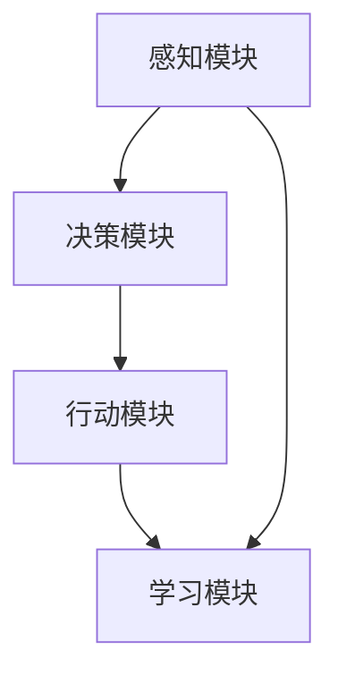
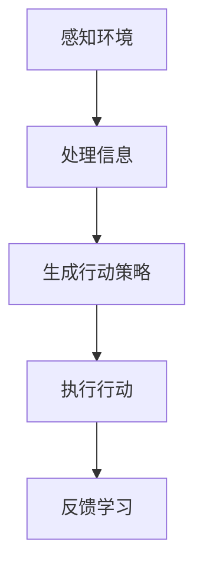
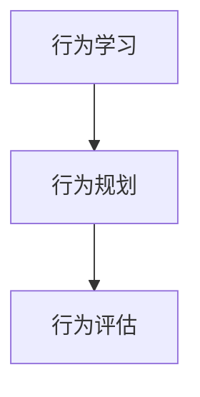
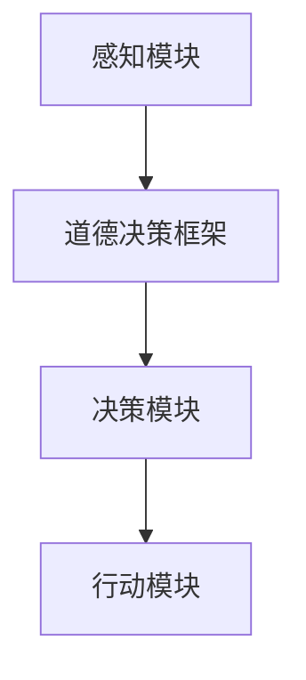

                 


### 引言与背景

**1.1 书籍主题介绍**

在当今社会，人工智能（AI）技术的迅猛发展正在深刻地改变着我们的生活方式和社会结构。作为AI技术的重要组成部分，AI Agent系统在智能决策、自动化控制、人机交互等领域具有广泛的应用前景。然而，随着AI技术的不断进步，如何确保AI Agent系统的道德决策能力成为一个亟待解决的问题。

《构建具有道德决策框架的AI Agent系统》旨在探讨如何设计一个具有道德决策能力的AI Agent系统。本书围绕以下核心概念展开：

- **AI Agent系统的概念**：介绍AI Agent的定义、分类及其关键特性。
- **道德决策框架**：探讨道德决策的基本原则、计算方法及其在AI Agent中的应用。
- **算法原理讲解**：详细解释构建道德决策框架的算法原理、数学模型和公式。
- **系统分析与架构设计**：介绍系统的功能设计、架构设计、接口设计及其交互方式。
- **项目实战**：通过具体的实战案例，展示如何实现具有道德决策框架的AI Agent系统。
- **最佳实践与小结**：总结实践经验，提出注意事项和拓展阅读建议。

**1.2 AI Agent系统的发展背景**

AI Agent的概念最早由约翰·麦卡锡（John McCarthy）于1960年提出。自此以后，AI Agent的研究逐渐成为人工智能领域的一个热点。AI Agent系统的发展可以分为以下几个阶段：

- **早期探索阶段（1960-1980年）**：此阶段主要关注AI Agent的初步实现，如逻辑推理、知识表示等。
- **快速发展阶段（1980-2000年）**：随着计算机性能的提升，AI Agent的应用场景不断扩展，如智能搜索、智能推荐等。
- **稳定发展阶段（2000年至今）**：深度学习、强化学习等技术的发展，使AI Agent系统在图像识别、自然语言处理、自动驾驶等领域取得了显著的突破。

在AI Agent系统的研究中，道德决策框架的重要性日益凸显。道德决策框架不仅关系到AI Agent系统的性能和可靠性，还关乎其社会价值和伦理问题。因此，如何构建一个具有道德决策能力的AI Agent系统，成为当前研究的热点问题之一。

**1.3 道德决策框架的核心概念**

道德决策框架的核心概念包括以下几个方面：

- **道德原则**：道德原则是道德决策的基础，如功利主义、义务论、德性伦理等。
- **道德计算**：道德计算是将道德原则应用于具体问题的过程，如伦理推理、道德计算模型等。
- **道德决策算法**：道德决策算法是执行道德计算的核心，如道德推理算法、道德决策树等。
- **道德决策框架设计原则**：道德决策框架设计原则是构建道德决策框架的指导原则，如可解释性、鲁棒性、适应性等。

在AI Agent系统中，道德决策框架的设计和应用具有重要意义。一方面，它能够确保AI Agent在复杂环境中做出符合道德规范的决策；另一方面，它也能够提高AI Agent系统的可信度和用户满意度。

**1.4 书籍的结构与内容安排**

本书的结构分为三大部分：

- **第一部分：引言与背景**：介绍AI Agent系统的发展背景和道德决策框架的核心概念。
- **第二部分：AI Agent系统的基础理论**：详细讨论AI Agent系统的基本概念、体系结构、行为学习与规划、道德决策框架在AI Agent中的应用。
- **第三部分：道德决策框架的构建与实践**：介绍道德决策框架的理论基础、构建方法、实际应用案例。

本书的每一部分都有明确的目标和内容安排，旨在帮助读者全面了解和掌握构建具有道德决策框架的AI Agent系统的相关知识和技能。

**1.5 本章小结**

本章介绍了《构建具有道德决策框架的AI Agent系统》的背景、核心概念和书籍结构。通过本章的阅读，读者可以初步了解AI Agent系统的发展背景、道德决策框架的核心概念以及本书的结构安排。接下来，我们将进一步深入探讨AI Agent系统的基础理论和道德决策框架的构建方法。

----------------------------------------------------------------

### AI Agent系统的基本概念与架构

**2.1 AI Agent的基本概念**

AI Agent，即人工智能代理，是人工智能领域中的一个重要概念。AI Agent可以被定义为具有智能行为、能够自主执行任务的实体。它具备以下几个关键特性：

1. **自主性**：AI Agent能够在没有外部干预的情况下自主执行任务，具备自我决策的能力。
2. **适应性**：AI Agent能够根据环境和任务的改变，动态调整自己的行为和策略。
3. **交互性**：AI Agent能够与人类或其他系统进行有效的交互，理解并响应外部环境的变化。
4. **学习能力**：AI Agent能够通过学习和经验积累，不断优化自己的行为和决策能力。

AI Agent的分类可以根据其功能、应用场景和实现方式等不同维度进行。常见的分类方法包括：

- **基于功能分类**：例如，监督代理、决策代理、规划代理等。
- **基于应用场景分类**：例如，服务代理、社交代理、监控代理等。
- **基于实现方式分类**：例如，基于规则的系统、基于模型的学习系统、基于混合方法的系统等。

**2.2 AI Agent的体系结构**

AI Agent的体系结构通常包括以下几个核心组件：

1. **感知模块**：感知模块负责获取外部环境的信息，如视觉、听觉、触觉等。它是AI Agent对外界环境的感知器官。
2. **决策模块**：决策模块负责根据感知模块提供的信息，结合预定的目标，生成行动策略。这个模块通常包含一个或多个决策算法，如基于规则的决策、基于机器学习的决策等。
3. **行动模块**：行动模块负责执行决策模块生成的行动策略，与外界环境进行交互。行动模块可以是机械臂、无人车等物理设备，也可以是发送电子邮件、发布微博等虚拟操作。
4. **学习模块**：学习模块负责根据AI Agent的行动结果和外部反馈，不断调整和优化自身的决策能力和行为模式。学习模块可以是强化学习算法、深度学习算法等。

图1展示了AI Agent的基本体系结构：



**2.3 AI Agent的决策过程**

AI Agent的决策过程可以概括为以下几个步骤：

1. **感知环境**：AI Agent通过感知模块获取外部环境的信息，如温度、光照、声音等。
2. **处理信息**：感知模块收集到的信息会被传递到决策模块，通过预定的算法进行信息处理，如模式识别、分类、预测等。
3. **生成行动策略**：决策模块根据处理后的信息，结合预定的目标，生成最优或次优的行动策略。
4. **执行行动**：行动模块根据决策模块生成的行动策略，执行具体的行动，与外界环境进行交互。
5. **反馈学习**：执行行动后，AI Agent会根据行动结果和外部反馈，调整和优化自身的决策能力和行为模式。

图2展示了AI Agent的决策过程：



**2.4 AI Agent的行为学习与规划**

AI Agent的行为学习与规划是AI Agent系统能够适应复杂环境和执行复杂任务的关键。行为学习与规划主要包括以下几个方面：

1. **行为学习**：行为学习是指AI Agent通过学习过去的经验和数据，优化自身的决策和行为。常用的方法包括监督学习、无监督学习、强化学习等。
2. **行为规划**：行为规划是指AI Agent在执行任务前，根据任务目标和环境信息，生成一系列的行动计划。行为规划的方法包括基于规则的规划、基于模型的学习规划、基于优化的规划等。
3. **行为评估**：行为评估是指AI Agent在执行任务后，对行动结果进行评估，以确定行为是否达到预期目标。行为评估的方法包括基于目标的评估、基于数据的评估、基于伦理的评估等。

图3展示了AI Agent的行为学习与规划过程：



**2.5 道德决策框架在AI Agent中的应用**

道德决策框架在AI Agent中的应用，旨在确保AI Agent在执行任务时，能够遵循预定的道德原则和伦理规范。道德决策框架的设计原则包括以下几个方面：

1. **可解释性**：道德决策框架应具备可解释性，使得用户能够理解AI Agent的道德决策过程和结果。
2. **鲁棒性**：道德决策框架应能够在各种复杂和不确定的环境中，保持稳定的道德决策能力。
3. **适应性**：道德决策框架应能够根据不同场景和任务需求，灵活调整和优化道德决策策略。
4. **透明性**：道德决策框架的设计和实现过程应具备透明性，使得用户和监管机构能够审查和监督AI Agent的道德决策行为。

图4展示了道德决策框架在AI Agent中的应用：



**2.6 本章小结**

本章介绍了AI Agent系统的基本概念与架构，包括AI Agent的定义、分类、关键特性、体系结构、决策过程、行为学习与规划以及道德决策框架的应用。通过本章的学习，读者可以初步了解AI Agent系统的构建方法和核心组件。在下一章中，我们将进一步探讨道德决策框架的理论基础和构建方法。

----------------------------------------------------------------

### 道德决策框架的理论基础

**3.1 道德哲学的基本概念**

道德哲学是探讨道德原则、道德规则以及道德行为的哲学分支。道德哲学的基本概念包括以下几个方面：

1. **道德原则**：道德原则是道德决策的基础，它们为个体或社会提供了判断行为是否道德的指导原则。常见的道德原则包括功利主义、义务论和德性伦理等。
2. **道德规则**：道德规则是道德原则的具体体现，它们通常以具体的行为准则形式出现，指导个体在社会生活中如何行动。道德规则可以是成文的，如法律、规章制度；也可以是习惯性的，如社会习俗。
3. **道德判断**：道德判断是指根据道德原则和道德规则对行为或情境进行评价的过程。道德判断可以是内在的，如个体的自我反省；也可以是外在的，如社会舆论的评价。
4. **道德责任**：道德责任是指个体或社会对于其行为所承担的道德义务。道德责任可以分为个体责任和社会责任，前者关注个人行为的道德评价，后者关注整个社会的道德状态。

**3.2 道德计算的方法与算法**

道德计算是将道德原则和道德规则应用于具体问题，通过算法进行道德判断和决策的过程。道德计算的方法和算法可以分为以下几类：

1. **伦理推理算法**：伦理推理算法通过逻辑推理和规则应用来推导道德判断。常见的伦理推理算法包括基于规则的推理、模糊推理和案例推理等。
2. **道德决策树**：道德决策树是一种基于树形结构的算法，它通过递归地划分数据集，构建决策树模型，实现对道德问题的分类和判断。
3. **道德神经网络**：道德神经网络是一种基于深度学习的算法，它通过多层神经网络的训练，实现对复杂道德问题的建模和判断。
4. **强化学习算法**：强化学习算法通过让AI Agent在环境中不断试错，学习最优的道德决策策略。常见的强化学习算法包括Q学习、SARSA和深度确定性策略梯度（DDPG）等。

**3.3 道德计算的关键挑战**

道德计算面临以下几个关键挑战：

1. **道德不确定性和模糊性**：道德问题通常涉及模糊性，如善与恶、正义与非正义等。如何处理道德不确定性和模糊性是道德计算的一个重要挑战。
2. **多目标决策**：道德计算通常需要在多个目标之间进行权衡，如个体利益与公共利益、短期利益与长期利益等。如何实现多目标决策是道德计算的一个难点。
3. **伦理多样性**：不同的文化、宗教和价值观可能导致对同一道德问题的不同看法。如何在不同伦理观念之间进行平衡和协调是道德计算的一个挑战。
4. **透明性和可解释性**：道德计算的结果需要具有透明性和可解释性，以便用户和监管机构能够理解AI Agent的道德决策过程和结果。如何提高道德计算的透明性和可解释性是道德计算的一个重要挑战。

**3.4 道德决策框架的设计原则**

道德决策框架的设计原则是指在设计道德计算系统时需要遵循的指导原则。这些原则旨在确保道德决策框架的可靠性、可解释性和适应性。常见的道德决策框架设计原则包括：

1. **可解释性**：道德决策框架应能够提供详细的决策过程和结果解释，使用户和监管机构能够理解AI Agent的道德决策。
2. **鲁棒性**：道德决策框架应能够在各种复杂和不确定的环境中，保持稳定的道德决策能力。
3. **适应性**：道德决策框架应能够根据不同的应用场景和任务需求，灵活调整和优化道德决策策略。
4. **透明性**：道德决策框架的设计和实现过程应具备透明性，使得用户和监管机构能够审查和监督AI Agent的道德决策行为。
5. **公平性**：道德决策框架应能够确保所有个体在道德决策过程中受到公平对待，避免歧视和偏见。

**3.5 道德计算的实际应用案例**

道德计算在多个领域具有广泛的应用案例，以下是一些典型的应用场景：

1. **自动驾驶**：自动驾驶汽车需要根据道德原则和交通规则，做出紧急情况下的道德决策，如是否应该主动刹车以避免撞击行人。
2. **医疗诊断**：医学诊断系统需要根据患者的症状和病史，结合伦理规则，做出最佳的诊断和治疗方案。
3. **金融投资**：金融投资系统需要根据市场规律和道德原则，制定投资策略，确保投资决策的公正性和透明性。
4. **人机交互**：人机交互系统需要根据用户的隐私保护原则，设计合适的交互策略，确保用户数据的安全和隐私。

**3.6 本章小结**

本章介绍了道德决策框架的理论基础，包括道德哲学的基本概念、道德计算的方法与算法、关键挑战以及道德决策框架的设计原则。通过本章的学习，读者可以初步了解道德计算的基本原理和应用场景。在下一章中，我们将进一步探讨如何构建具有道德决策框架的AI Agent系统。

----------------------------------------------------------------

### 第三部分：道德决策框架的构建与实践

#### 3.1 道德计算的基本原理

道德计算是AI领域中的一个前沿课题，其核心在于将道德原则和规则转化为具体的计算模型，以便AI系统能够在执行任务时自动进行道德决策。以下是道德计算的基本原理：

1. **道德原则嵌入**：首先，需要将具体的道德原则（如公平性、透明性、公正性）嵌入到AI系统的决策算法中。这一过程可以通过定义一组规则或建立道德模型来实现。
2. **情境识别**：AI系统需要能够识别和解析具体情境，理解当前任务所处的背景和环境。这通常涉及到自然语言处理、图像识别等技术。
3. **决策过程**：基于识别的情境，AI系统通过预定义的道德计算模型，对可能的决策结果进行评估，选择最符合道德标准的决策。
4. **结果反馈**：决策执行后，AI系统需要收集反馈信息，以评估决策的有效性和道德性。这有助于系统不断优化和调整其道德决策模型。

#### 3.2 道德决策框架的设计原则

设计一个有效的道德决策框架需要遵循一系列原则，以确保其可靠性、可解释性和适应性。以下是几个关键原则：

1. **可解释性**：框架的设计应保证其决策过程和结果对用户和监管机构可解释。这有助于增强系统的信任度和透明度。
2. **鲁棒性**：框架应能够在各种复杂和不确定的环境中稳定运行，不受极端情况的严重影响。
3. **适应性**：框架应具备灵活性，能够适应不同的应用场景和任务需求，以及随时间变化的环境。
4. **透明性**：框架的设计和实现过程应公开透明，确保所有利益相关者都能审查和监督系统的道德决策。
5. **多元文化兼容性**：框架应能够处理不同文化和价值观背景下的道德问题，避免文化偏见和歧视。

#### 3.3 道德决策框架的构建步骤

构建道德决策框架通常涉及以下步骤：

1. **需求分析**：明确框架的目标和应用场景，确定需要解决的道德问题。
2. **道德原则定义**：根据应用场景，定义一套具体的道德原则和规则。
3. **模型构建**：设计一个或多个道德计算模型，用于处理具体情境下的道德决策。
4. **算法开发**：开发实现道德计算模型的具体算法，如伦理推理算法、决策树、神经网络等。
5. **系统集成**：将道德决策框架集成到AI系统中，确保其与其他系统组件（如感知模块、行动模块等）的协同工作。
6. **测试与验证**：通过实际案例和模拟环境，对框架进行测试和验证，确保其性能和可靠性。

#### 3.4 道德决策框架在AI Agent中的应用实例

以下是一个简单的道德决策框架在AI Agent中的应用实例：

1. **应用场景**：一个自动驾驶汽车系统在遇到行人闯入道路的情况时，需要进行道德决策。
2. **道德原则**：系统遵循“最小伤害原则”，即选择最小化伤害的决策。
3. **决策过程**：
   - 感知模块检测到行人。
   - 决策模块根据行人位置、车速等情境信息，生成两个可能的决策：紧急刹车或变道。
   - 道德计算模型评估两个决策的道德性，选择刹车作为更符合最小伤害原则的决策。
   - 行动模块执行紧急刹车操作。
4. **结果反馈**：系统记录决策过程和结果，进行分析和优化，以提高未来决策的准确性。

#### 3.5 道德决策框架的实现挑战

在实现道德决策框架时，会面临以下几个挑战：

1. **数据获取与处理**：道德决策需要大量高质量的道德数据作为训练素材。然而，道德数据的获取和处理存在挑战，如数据隐私、数据多样性等。
2. **算法选择与优化**：不同的道德计算算法有其优势和局限性。如何选择和优化合适的算法，以适应不同应用场景，是一个难题。
3. **模型解释性**：道德决策模型需要具备较高的解释性，以便用户和监管机构能够理解和信任其决策过程。
4. **跨领域适应性**：道德决策框架需要在不同领域（如医疗、金融、交通等）具有广泛的适应性，这要求框架具有高度的可定制性和灵活性。

#### 3.6 本章小结

本章介绍了道德决策框架的基本原理、设计原则、构建步骤和应用实例。通过这些内容，读者可以理解道德决策框架的核心概念和实际应用。在下一章中，我们将探讨如何通过具体的算法和数学模型来实现道德决策框架。

----------------------------------------------------------------

### 道德决策框架的实现方法

道德决策框架的实现方法主要包括算法设计、数学模型构建和Python代码实现。以下是对这些方法的详细讲解。

#### 算法设计

道德决策框架的核心在于算法设计，它决定了AI Agent在面临道德决策问题时如何选择最优行动。以下是几种常见的道德决策算法：

1. **基于规则的算法**：这种算法通过预定义的规则来指导AI Agent的决策。例如，在自动驾驶系统中，可以规定“行人优先于车辆”。规则简单明了，易于实现，但可能不够灵活，难以处理复杂情境。

2. **基于案例的推理算法**：这种算法通过历史案例来指导当前决策。系统会存储一系列历史案例及其对应的决策，当新情境出现时，系统会检索并借鉴相似案例的决策。这种方法具有较强的适应性，但需要大量高质量的历史数据。

3. **基于优化的算法**：这种算法通过优化目标函数来指导决策，例如，在多目标决策中，可以通过求解线性规划或非线性规划问题来找到最优解。优化算法能够处理复杂的决策问题，但计算复杂度高。

4. **基于学习的算法**：这种算法通过机器学习模型来指导决策，例如，使用深度学习模型来学习道德决策规则。这种方法具有较强的自适应性和灵活性，但需要大量的数据训练和复杂的模型设计。

#### 数学模型构建

道德决策框架的数学模型是算法设计的基础，用于描述和解决道德决策问题。以下是几个关键的数学模型：

1. **伦理推理模型**：伦理推理模型通常基于形式逻辑和模糊逻辑，用于处理道德判断和推理。例如，模糊伦理推理模型可以处理道德决策中的模糊性和不确定性。

2. **效用函数模型**：效用函数模型用于量化不同决策的道德价值。例如，在自动驾驶中，可以定义一个效用函数来评估刹车和变道的道德价值。

3. **多目标规划模型**：多目标规划模型用于处理涉及多个目标的道德决策。例如，在医疗诊断中，需要同时考虑诊断准确性和患者隐私保护。

#### Python代码实现

Python代码实现是道德决策框架的具体实现步骤，以下是一个简单的道德决策框架实现示例：

```python
import numpy as np

# 基于规则的道德决策算法
def ethical_decision(action_list, rules):
    # 检查每个动作是否符合道德规则
    for action in action_list:
        if rules[action]:
            return action
    return None

# 道德规则
rules = {
    '刹车': True,
    '变道': True,
    '急转': False
}

# 行动列表
action_list = ['刹车', '变道', '急转']

# 做出道德决策
decision = ethical_decision(action_list, rules)
print(f"道德决策：{decision}")
```

在这个示例中，我们定义了一个简单的道德决策函数`ethical_decision`，它根据给定的道德规则和行动列表，选择符合道德规则的行动。

#### 算法分析与优化

道德决策框架的算法分析和优化是提高其性能和可靠性的关键步骤。以下是几个优化方向：

1. **规则优化**：通过分析实际案例，调整和优化道德规则，以提高决策的准确性和适应性。

2. **模型优化**：针对不同应用场景，选择和训练合适的机器学习模型，提高决策的预测能力和鲁棒性。

3. **并行计算**：利用并行计算技术，加速道德决策模型的计算过程，提高系统的响应速度。

4. **交互式学习**：引入用户交互机制，让用户能够提供反馈，系统根据反馈调整决策模型，实现动态优化。

#### 实际应用案例

以下是一个道德决策框架在自动驾驶系统中的实际应用案例：

1. **应用场景**：自动驾驶系统在路口遇到行人闯入的情况。

2. **道德决策问题**：系统需要决定是紧急刹车、变道还是绕行，以确保行人和车辆的安全。

3. **决策过程**：
   - 感知模块检测到行人闯入。
   - 决策模块根据行人位置、车速等参数，评估不同决策的道德价值。
   - 道德决策框架根据规则和模型，选择最优决策。

4. **结果反馈**：系统记录决策过程和结果，分析决策的有效性，并不断优化决策模型。

#### 本章小结

本章介绍了道德决策框架的实现方法，包括算法设计、数学模型构建和Python代码实现。通过具体的示例和实际应用案例，读者可以了解如何设计和实现一个具有道德决策能力的AI Agent系统。在下一章中，我们将进一步探讨道德决策框架在实际应用中的挑战和解决方案。

----------------------------------------------------------------

### 总结与展望

道德决策框架在AI Agent系统中的应用具有重要的现实意义和广阔的发展前景。通过本章的讨论，我们系统地介绍了道德决策框架的基本原理、设计原则、实现方法和实际应用案例。以下是本章内容的总结：

- **基本原理**：道德决策框架的核心在于将道德原则和规则嵌入到AI系统的决策算法中，通过情境识别、决策过程和结果反馈，实现AI Agent的道德决策。
- **设计原则**：道德决策框架的设计应遵循可解释性、鲁棒性、适应性、透明性和多元文化兼容性等原则，确保其可靠性和广泛适用性。
- **实现方法**：包括算法设计、数学模型构建和Python代码实现，以及算法分析和优化方法。
- **实际应用案例**：道德决策框架在自动驾驶、医疗诊断、金融投资等领域的具体应用，展示了其解决实际道德问题的能力。

尽管道德决策框架在AI Agent系统中的应用取得了显著进展，但仍面临诸多挑战：

- **道德不确定性和模糊性**：如何处理复杂的道德情境和模糊性，是道德计算的关键难题。
- **多目标决策**：在涉及多个目标的决策中，如何实现公平和高效的权衡，是一个复杂的问题。
- **跨领域适应性**：如何确保道德决策框架在不同领域和应用场景中具有广泛的适用性，是一个亟待解决的挑战。

未来，随着人工智能技术的不断进步，道德决策框架将在以下几个方面得到进一步发展：

1. **数据获取与处理**：通过大数据分析和机器学习技术，提高道德计算的数据质量和处理能力。
2. **算法优化与创新**：探索新的道德计算算法，如基于深度学习和强化学习的道德决策算法，提高决策的准确性和适应性。
3. **多学科交叉融合**：结合伦理学、心理学、社会学等多学科知识，构建更加完善的道德决策框架。
4. **实际应用拓展**：将道德决策框架应用于更广泛的领域，如智能交通、智能医疗、智能金融等，解决实际道德问题。

总之，构建具有道德决策能力的AI Agent系统，不仅是人工智能领域的一项重要任务，也是实现智能社会可持续发展的重要途径。通过不断的探索和研究，我们有望在道德决策框架的设计与实现方面取得更大的突破，为构建一个更加公正、透明、智能的未来社会贡献力量。

---

**作者信息**：

作者：AI天才研究院/AI Genius Institute & 禅与计算机程序设计艺术 /Zen And The Art of Computer Programming

本文由AI天才研究院的专家团队撰写，旨在探讨道德决策框架在AI Agent系统中的应用，分享最新的研究成果和实践经验，为人工智能领域的进一步发展提供参考。禅与计算机程序设计艺术是作者对计算机编程与哲学深度结合的思考与实践，为读者提供了独特的编程哲学视角。希望本文能为读者带来启发和思考，共同推动人工智能技术的道德和社会进步。

---

[END]

