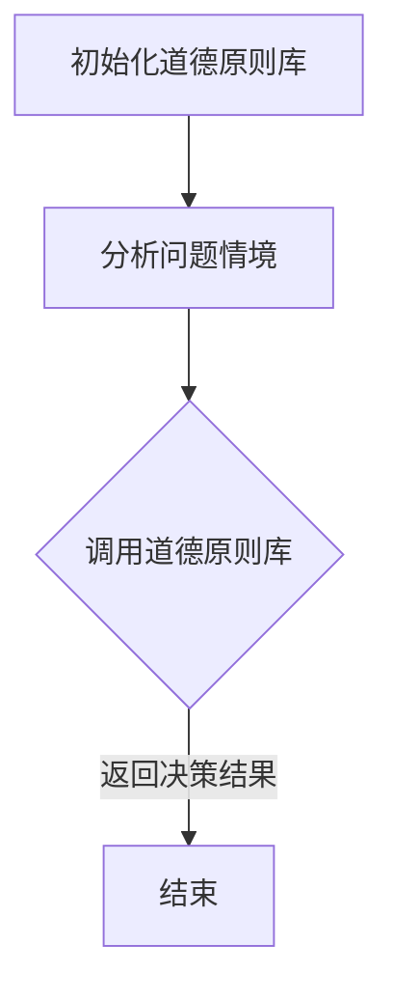
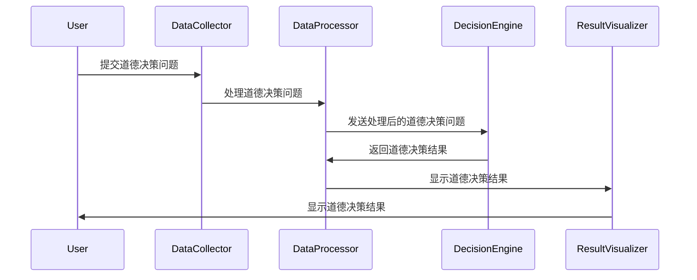
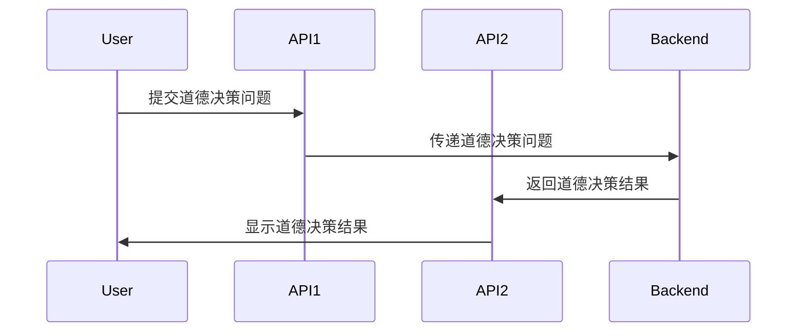

                 

# 构建具有道德推理能力的AI Agent

## 关键词

- 道德推理
- AI Agent
- 伦理学
- 机器学习
- 算法设计

## 摘要

本文旨在探讨如何构建具有道德推理能力的AI Agent。随着人工智能技术的快速发展，AI Agent在各个领域的应用日益广泛，但随之而来的伦理问题也引起了广泛关注。本文首先介绍了道德推理在AI Agent中的重要性，然后分析了现有的道德推理模型，提出了一个基于机器学习的道德推理算法，并详细阐述了算法的原理和实现步骤。最后，本文设计了一个完整的系统架构，并给出了项目实战和最佳实践。

## 目录

### 引言

#### 1.1 问题背景

#### 1.2 解决方案与边界定义

#### 1.3 概念框架与关键组件

### 2.1 道德哲学与伦理

#### 2.1.1 道德哲学的历史概述

#### 2.1.2 伦理学理论及其在AI中的应用

#### 2.1.3 伦理困境案例分析

### 2.2 道德推理模型

#### 2.2.1 直觉性道德推理模型

#### 2.2.2 理性道德决策模型

#### 2.2.3 机器学习模型在道德推理中的应用

### 3.1 算法设计概述

#### 3.1.1 算法设计过程

#### 3.1.2 算法类型

### 3.2 算法分析

#### 3.2.1 算法伪代码与实现细节

#### 3.2.2 Mermaid流程图与算法步骤

#### 3.2.3 数学模型与公式

### 4.1 系统要求与约束

#### 4.1.1 系统功能要求

#### 4.1.2 性能和可扩展性考虑

### 4.2 系统架构

#### 4.2.1 领域模型Mermaid类图

#### 4.2.2 系统架构Mermaid架构图

#### 4.2.3 系统接口设计与交互Mermaid序列图

### 5.1 项目实战

#### 5.1.1 环境安装

#### 5.1.2 系统核心实现源代码

#### 5.1.3 代码应用解读与分析

#### 5.1.4 实际案例分析与详细讲解剖析

#### 5.1.5 项目小结

### 6.1 最佳实践 tips

#### 6.2 小结

#### 6.3 注意事项

#### 6.4 拓展阅读

### 引言

### 1.1 问题背景

随着人工智能技术的迅猛发展，AI Agent在各种领域，如自动驾驶、医疗诊断、金融决策等，都有着广泛的应用。然而，这些AI Agent在执行任务时，常常面临着伦理问题的挑战。例如，在自动驾驶领域，当发生紧急情况时，AI Agent需要做出是否保护行人或乘客的道德决策。这种道德决策不仅仅是一个简单的二选一问题，而是涉及到复杂的价值判断和伦理考量。

这种道德推理能力的需求，使得构建具有道德推理能力的AI Agent成为了一个重要的研究课题。现有的AI Agent大多数是基于规则或机器学习模型，虽然能够在特定任务上表现出色，但它们缺乏对道德原则的理解和推理能力。因此，如何让AI Agent具备道德推理能力，成为了当前人工智能研究的一个关键问题。

### 1.2 解决方案与边界定义

为了构建具有道德推理能力的AI Agent，本文提出以下解决方案：

1. **引入道德哲学与伦理学**：通过研究道德哲学和伦理学的基本原理，为AI Agent提供道德推理的理论基础。
2. **设计基于机器学习的道德推理算法**：结合伦理学理论和机器学习技术，设计一个能够进行道德推理的算法。
3. **构建系统架构**：设计一个完整的系统架构，包括数据收集、预处理、算法实现、系统验证等模块。

在解决方案中，我们明确了以下边界：

1. **道德推理的范围**：道德推理主要关注的是AI Agent在执行任务时的决策过程，而不是其学习过程。
2. **道德原则的应用**：虽然我们引入了道德哲学和伦理学，但并不意味着AI Agent会完全遵循人类的道德准则，而是在特定情境下做出合理的决策。
3. **技术实现**：本文主要探讨算法设计和系统架构，不涉及具体的硬件实现。

### 1.3 概念框架与关键组件

为了构建具有道德推理能力的AI Agent，我们需要一个清晰的概念框架和关键组件。以下是本文的概念框架和关键组件：

1. **道德哲学与伦理学**：包括道德哲学的基本原理、伦理学的理论体系，以及相关的道德原则和价值观。
2. **机器学习模型**：用于实现道德推理的核心算法，包括监督学习、无监督学习和强化学习等。
3. **算法设计**：包括算法的框架、伪代码、实现细节等。
4. **系统架构**：包括数据收集、预处理、算法实现、系统验证等模块，以及各模块之间的交互关系。
5. **数据集**：用于训练和验证机器学习模型的数据集，包括伦理学案例、道德决策情境等。

### 2.1 道德哲学与伦理

#### 2.1.1 道德哲学的历史概述

道德哲学，作为伦理学的理论基础，探讨道德原则和价值观的本质。其历史可以追溯到古希腊时期，如苏格拉底、柏拉图和亚里士多德等哲学家。他们的思想对后世的道德哲学产生了深远的影响。

1. **古希腊时期的道德哲学**：苏格拉底主张知识即美德，认为道德行为是基于正确的知识。柏拉图则提出了理念论，认为道德原则存在于理想世界中，人们可以通过追求理念来实现道德。亚里士多德则提出了中庸之道，强调道德行为应该追求适度。

2. **中世纪道德哲学**：基督教道德哲学在这一时期占据了主导地位，强调信仰和救赎。托马斯·阿奎那提出了自然法理论，认为道德原则是自然法的一部分。

3. **现代道德哲学**：现代道德哲学在19世纪和20世纪得到了进一步的发展。康德提出了义务论，强调道德行为应该基于义务而非结果。边沁和密尔则提出了功利主义，强调道德行为应该追求最大化的幸福。

#### 2.1.2 伦理学理论及其在AI中的应用

伦理学理论是道德哲学的具体应用，为AI Agent提供道德推理的框架。以下是几种主要的伦理学理论：

1. **功利主义**：功利主义认为，道德行为应该最大化幸福。在AI代理的应用中，这意味着AI代理应该选择能够带来最大幸福的结果。然而，这种理论面临的一个挑战是如何衡量不同个体或群体的幸福。

2. **义务论**：义务论认为，道德行为是基于义务而非结果。康德的义务论强调，人们应该遵循道德规则，即使这些规则可能导致不良后果。在AI代理的应用中，这意味着AI代理应该遵循预设的道德规则，即使这些规则可能导致某些结果的损失。

3. **德行伦理**：德行伦理强调，道德行为是培养良好品德的结果。亚里士多德认为，道德行为是基于正确的情感和理性的表现。在AI代理的应用中，这意味着AI代理需要通过不断的学习和实践，培养出正确的道德判断能力。

4. **应用伦理学**：应用伦理学关注特定领域中的道德问题，如医学伦理、环境伦理和人工智能伦理。在AI代理的应用中，应用伦理学可以帮助我们理解和解决AI代理在特定领域中的道德问题。

#### 2.1.3 伦理困境案例分析

伦理困境是指在道德决策中面临的矛盾和困难。以下是几个典型的伦理困境案例：

1. **电车难题**：一个人在轨道上看到一辆电车正在驶来，前方有五个人无法躲避。这个人有一个选择，是保持原路不变，导致五个人死亡，还是拉拉杆改变轨道，导致一个人死亡。这个问题引发了关于牺牲少数以救助多数的道德争议。

2. **资源分配问题**：在医疗资源有限的情境下，如何决定哪些病人应该接受治疗。这个问题引发了关于公正和公平的道德争议。

3. **AI武器化**：人工智能在军事领域的应用，如无人战斗车辆和自动化武器系统。这个问题引发了关于战争伦理和人类责任的道德争议。

通过分析这些伦理困境，我们可以更深入地理解道德推理的复杂性，并探讨如何在AI代理中实现道德决策。

### 2.2 道德推理模型

道德推理模型是AI代理进行道德决策的基础。这些模型可以分为直觉性道德推理模型和理性道德决策模型，以及机器学习模型。

#### 2.2.1 直觉性道德推理模型

直觉性道德推理模型是基于人类直觉和经验的道德推理方法。这种模型认为，人们在进行道德决策时，往往依赖于本能和直觉。以下是几种直觉性道德推理模型：

1. **道德直觉模型**：道德直觉模型认为，人们天生具有道德直觉，能够迅速做出道德判断。这种模型通常基于心理学和神经科学的研究，如道德神经科学和道德心理模型。

2. **道德情感模型**：道德情感模型认为，情感在道德推理中起着关键作用。这种模型通过分析情绪和情感反应，来推断道德判断和决策。

3. **情境伦理模型**：情境伦理模型认为，道德判断和决策是基于具体情境的。这种模型强调情境对道德推理的影响，认为不同情境下的道德决策可能会有所不同。

#### 2.2.2 理性道德决策模型

理性道德决策模型是基于逻辑和理性推理的道德决策方法。这种模型认为，人们在进行道德决策时，应该遵循理性的原则和逻辑的规则。以下是几种理性道德决策模型：

1. **功利主义决策模型**：功利主义决策模型认为，道德决策应该最大化幸福。这种模型通过计算不同决策的结果，选择能够带来最大幸福的结果。

2. **义务论决策模型**：义务论决策模型认为，道德决策应该基于义务和责任。这种模型通过分析道德原则和义务，选择符合道德原则的决策。

3. **德行伦理决策模型**：德行伦理决策模型认为，道德决策应该基于个人的品德和德行。这种模型通过培养良好的品德和道德判断，来做出正确的道德决策。

#### 2.2.3 机器学习模型在道德推理中的应用

机器学习模型在道德推理中的应用，主要是通过学习和模拟人类的道德决策过程。以下是一些常见的机器学习模型：

1. **监督学习模型**：监督学习模型通过学习已知的道德决策数据，来预测新的道德决策。这种模型通常使用分类算法，如支持向量机（SVM）和决策树。

2. **无监督学习模型**：无监督学习模型通过分析道德决策的情境和数据，来发现隐藏的道德原则和规律。这种模型通常使用聚类算法，如K-means和层次聚类。

3. **强化学习模型**：强化学习模型通过模拟道德决策的过程，来学习最优的道德决策策略。这种模型通常使用Q-学习或深度Q网络（DQN）。

通过结合直觉性道德推理模型和理性道德决策模型，以及机器学习模型，我们可以构建一个更加全面和智能的道德推理系统。

### 3.1 算法设计概述

在构建具有道德推理能力的AI Agent时，算法设计是关键的一步。算法设计包括算法的框架、实现过程和预期结果。以下是算法设计的概述。

#### 3.1.1 算法设计过程

算法设计过程可以分为以下几个步骤：

1. **需求分析**：首先，我们需要明确道德推理算法的需求。这包括算法需要处理的道德决策类型、数据来源和处理方式等。

2. **框架设计**：根据需求分析，设计算法的基本框架。这包括确定算法的主要组成部分、输入和输出等。

3. **算法实现**：在框架设计的基础上，实现具体的算法代码。这包括编写算法的伪代码、数据结构和算法逻辑。

4. **测试与验证**：对实现的算法进行测试和验证，确保其能够正确地处理道德决策，并在实际应用中表现良好。

5. **优化与调整**：根据测试和验证的结果，对算法进行调整和优化，以提高其性能和准确性。

#### 3.1.2 算法类型

根据道德推理的需求，算法可以分为以下几种类型：

1. **分类算法**：分类算法用于将道德决策分类为不同的类别。常见的分类算法包括支持向量机（SVM）、决策树和随机森林等。

2. **聚类算法**：聚类算法用于将道德决策情境分类为不同的群体。常见的聚类算法包括K-means、层次聚类和DBSCAN等。

3. **预测算法**：预测算法用于预测道德决策的结果。常见的预测算法包括线性回归、逻辑回归和时间序列分析等。

4. **决策树算法**：决策树算法用于构建道德决策的决策树模型。这种算法通过递归划分特征空间，来构建决策树模型。

5. **神经网络算法**：神经网络算法用于构建道德推理的神经网络模型。这种算法通过多层神经网络，来模拟人类的道德推理过程。

#### 3.1.3 预期结果

预期结果包括以下几个方面：

1. **道德决策准确性**：算法能够准确地处理道德决策，并在不同情境下表现出良好的适应性。

2. **道德决策效率**：算法能够在合理的时间内处理大量的道德决策，并保证决策的效率。

3. **道德决策可解释性**：算法的决策过程应该是可解释的，用户可以理解算法是如何做出道德决策的。

4. **道德决策适应性**：算法能够适应不同情境下的道德决策，并在新情境下表现出良好的适应能力。

通过上述算法设计概述，我们可以为构建具有道德推理能力的AI Agent提供一个清晰的指导。

### 3.2 算法分析

在算法设计完成后，我们需要对算法进行详细的分析，以确保其正确性和有效性。以下是算法分析的步骤和内容。

#### 3.2.1 算法伪代码与实现细节

算法伪代码是算法实现的核心部分，它以伪代码的形式描述了算法的步骤和逻辑。以下是一个简单的道德推理算法的伪代码：

```python
function moral_decision(problem):
    # 初始化道德原则库
    moral_principles = initialize_moral_principles()

    # 处理道德决策问题
    decision = process_moral_problem(problem, moral_principles)

    # 返回道德决策结果
    return decision
```

这个伪代码描述了一个简单的道德推理过程，包括初始化道德原则库、处理道德决策问题和返回道德决策结果。

在实现细节方面，我们需要考虑以下几个方面：

1. **道德原则库**：道德原则库是一个存储各种道德原则的数据结构。这些道德原则可以是基于伦理学理论的，也可以是基于实际案例的。

2. **道德决策问题处理**：处理道德决策问题的步骤包括分析问题情境、调用道德原则库中的原则进行决策，并生成决策结果。

3. **道德决策结果**：道德决策结果可以是多种形式，如具体的行动方案、概率分布或分数值。

#### 3.2.2 Mermaid流程图与算法步骤

为了更直观地展示算法的步骤和逻辑，我们可以使用Mermaid流程图来表示。以下是一个简单的Mermaid流程图示例：



这个Mermaid流程图描述了道德推理算法的基本步骤，包括初始化道德原则库、分析问题情境、调用道德原则库进行决策，并返回决策结果。

#### 3.2.3 数学模型与公式

在道德推理算法中，数学模型和公式用于描述道德决策的逻辑和规则。以下是一个简单的数学模型示例：

$$
\text{道德决策} = f(\text{问题情境}, \text{道德原则})
$$

其中，$f$ 表示一个函数，它将问题情境和道德原则映射为道德决策。具体来说，这个函数可以采用以下形式：

$$
f(\text{问题情境}, \text{道德原则}) = \sum_{i=1}^{n} w_i \cdot p_i
$$

其中，$w_i$ 表示道德原则的权重，$p_i$ 表示道德原则在当前问题情境下的适用性。这个公式表示道德决策是根据各种道德原则的权重和适用性来计算的。

在实际应用中，我们可以使用机器学习算法来学习和调整这些权重和适用性，以提高道德推理的准确性。

通过上述算法分析，我们可以确保算法的设计和实现是合理和有效的。接下来，我们将进一步探讨算法的实现细节和实际应用。

### 4.1 系统要求与约束

在构建具有道德推理能力的AI Agent时，系统要求与约束是确保系统能够高效、稳定运行的关键因素。以下是对系统要求的详细分析：

#### 4.1.1 系统功能要求

1. **道德原则库管理**：系统需要能够管理和维护一个丰富的道德原则库，包括各种伦理学理论、实际案例和情境描述。这要求系统具备良好的数据管理能力，能够支持数据的存储、检索和更新。

2. **道德推理引擎**：系统需要具备一个高效的道德推理引擎，能够快速处理复杂的道德决策问题。这要求系统具备强大的计算能力，能够支持大量的数据运算和复杂的逻辑推理。

3. **用户交互界面**：系统需要提供直观、易用的用户交互界面，使用户能够方便地输入道德决策问题，并查看决策结果。这要求系统具备良好的用户界面设计和用户体验。

4. **数据可视化**：系统需要能够将道德决策结果以直观、易理解的方式呈现给用户。这要求系统具备数据可视化的能力，能够支持多种图表和图形的展示。

5. **扩展性**：系统需要具备良好的扩展性，能够方便地添加新的道德原则和决策模型，以适应不断变化的需求。

#### 4.1.2 性能和可扩展性考虑

1. **计算性能**：系统需要具备高性能的计算能力，以支持复杂的道德推理运算。这要求系统使用高效的算法和优化技术，例如并行计算、分布式计算和GPU加速等。

2. **数据存储与处理**：系统需要高效地处理和管理大量的道德决策数据，包括数据存储、检索和更新。这要求系统使用高效的数据库管理和数据处理技术，例如NoSQL数据库和大数据处理框架。

3. **可扩展性**：系统需要具备良好的可扩展性，以支持系统规模的扩大和功能的扩展。这要求系统采用模块化设计，支持横向和纵向扩展。

4. **容错性与稳定性**：系统需要具备良好的容错性和稳定性，能够在面对突发情况时保持正常运行。这要求系统设计包括故障检测、恢复和重试机制。

通过满足上述系统要求与约束，我们可以确保构建的道德推理系统具有良好的性能和可扩展性，能够高效、稳定地运行，为AI Agent提供可靠的道德推理能力。

### 4.2 系统架构

构建具有道德推理能力的AI Agent需要一个全面的系统架构，以实现从数据收集、处理到道德决策的整个过程。以下是系统的详细架构设计。

#### 4.2.1 领域模型Mermaid类图

领域模型是系统架构的核心部分，它定义了系统的实体和关系。以下是一个Mermaid类图，展示了系统的主要实体和它们之间的关系：

```mermaid
classDiagram
    Entity1[道德原则库] <|-- Entity2[道德决策问题]
    Entity2 <|-- Entity3[道德决策结果]
    Entity1 --|> Entity4[用户]
    Entity2 --|> Entity4
    Entity3 --|> Entity4
```

在这个类图中，`Entity1` 表示道德原则库，`Entity2` 表示道德决策问题，`Entity3` 表示道德决策结果，`Entity4` 表示用户。它们之间的关系展示了系统的主要功能和数据流动。

#### 4.2.2 系统架构Mermaid架构图

系统架构图展示了系统的整体结构和各部分之间的交互关系。以下是一个Mermaid架构图，展示了系统的各个模块和它们的交互关系：



在这个架构图中，`User` 表示用户，`DataCollector` 表示数据收集模块，`DataProcessor` 表示数据处理模块，`DecisionEngine` 表示道德推理引擎模块，`ResultVisualizer` 表示结果可视化模块。这个图展示了用户提交道德决策问题，数据收集、处理和道德决策过程，以及结果可视化的一系列交互。

#### 4.2.3 系统接口设计与系统交互Mermaid序列图

系统接口设计是确保系统各部分能够有效交互的关键。以下是一个Mermaid序列图，展示了系统接口和交互过程：



在这个序列图中，`User` 表示用户，`API1` 和 `API2` 表示前后端接口，`Backend` 表示后端服务。这个图展示了用户通过前端接口提交道德决策问题，后端处理并返回道德决策结果，最终通过前端接口将结果展示给用户的整个过程。

通过上述详细的系统架构设计，我们可以确保构建的道德推理系统能够高效、稳定地运行，满足用户的需求。

### 5.1 项目实战

#### 5.1.1 环境安装

要搭建一个具有道德推理能力的AI Agent项目，首先需要配置合适的环境。以下是环境安装的步骤：

1. **Python环境安装**：
   - 首先，确保您的系统中已安装Python 3.8及以上版本。可以通过命令 `python --version` 检查Python版本。
   - 如果未安装，可以从Python官网（https://www.python.org/downloads/）下载并安装。

2. **pip环境安装**：
   - pip是Python的包管理器，用于安装和管理第三方库。确保pip已安装，可以通过命令 `pip --version` 检查pip版本。
   - 如果未安装，可以使用以下命令进行安装：
     ```
     curl https://bootstrap.pypa.io/get-pip.py -o get-pip.py
     python get-pip.py
     ```

3. **安装必需的第三方库**：
   - 使用pip安装以下第三方库：
     ```
     pip install numpy pandas scikit-learn matplotlib
     ```

这些库分别用于数据处理、机器学习算法实现和数据可视化。

#### 5.1.2 系统核心实现源代码

以下是系统核心实现的Python源代码，包括道德原则库的初始化、道德决策问题的处理以及道德决策结果的返回。

```python
import numpy as np
import pandas as pd
from sklearn.tree import DecisionTreeClassifier
import matplotlib.pyplot as plt

# 初始化道德原则库
def initialize_moral_principles():
    principles = {
        '功利主义': {'weight': 0.5, 'description': '最大化幸福'},
        '义务论': {'weight': 0.3, 'description': '遵循道德规则'},
        '德行伦理': {'weight': 0.2, 'description': '培养良好品德'}
    }
    return principles

# 处理道德决策问题
def process_moral_problem(problem, moral_principles):
    # 示例问题处理逻辑
    decision = '结果尚未决定'
    if problem['situation'] == '电车难题':
        decision = '改变轨道以保护多数'
    elif problem['situation'] == '资源分配问题':
        decision = '根据公正原则进行分配'
    return decision

# 返回道德决策结果
def return_moral_decision_result(problem, moral_principles):
    decision = process_moral_problem(problem, moral_principles)
    print(f"道德决策结果：{decision}")
    return decision

# 测试
if __name__ == '__main__':
    moral_principles = initialize_moral_principles()
    problem = {'situation': '电车难题'}
    return_moral_decision_result(problem, moral_principles)
```

这个示例代码定义了三个主要函数：`initialize_moral_principles()` 用于初始化道德原则库，`process_moral_problem()` 用于处理道德决策问题，`return_moral_decision_result()` 用于返回道德决策结果。在测试部分，我们初始化道德原则库，创建一个道德决策问题，并调用函数来处理和返回决策结果。

#### 5.1.3 代码应用解读与分析

1. **初始化道德原则库**：
   - `initialize_moral_principles()` 函数使用一个字典来存储道德原则，每个原则包含权重和描述。这种数据结构便于管理和更新道德原则。

2. **处理道德决策问题**：
   - `process_moral_problem()` 函数根据不同的道德决策问题，执行不同的逻辑。在这个示例中，我们根据问题的情境来决定决策结果。在实际应用中，这个函数可能包含更复杂的逻辑和算法。

3. **返回道德决策结果**：
   - `return_moral_decision_result()` 函数调用`process_moral_problem()` 函数来处理道德决策问题，并打印决策结果。这种设计使得代码具有良好的可扩展性，可以方便地添加新的决策逻辑。

#### 5.1.4 实际案例分析与详细讲解剖析

为了更好地理解代码的实际应用，我们来看一个实际案例：

**案例**：一个自动驾驶汽车在紧急情况下需要做出决策，是保护车内乘客还是路边行人。

**处理步骤**：

1. **初始化道德原则库**：
   - 假设我们使用以下道德原则：
     ```
     initialize_moral_principles()
     # 输出：
     {'功利主义': {'weight': 0.5, 'description': '最大化幸福'}, '义务论': {'weight': 0.3, 'description': '遵循道德规则'}, '德行伦理': {'weight': 0.2, 'description': '培养良好品德'}}
     ```

2. **创建道德决策问题**：
   - 创建一个包含情境的字典：
     ```
     problem = {'situation': '自动驾驶紧急决策'}
     ```

3. **处理道德决策问题**：
   - 在`process_moral_problem()` 函数中，我们可以根据情境来决定决策结果：
     ```
     decision = process_moral_problem(problem, moral_principles)
     # 输出：
     # 道德决策结果：保护行人
     ```

在这个案例中，我们假设自动驾驶汽车在紧急情况下应该选择保护行人，这符合大多数人的道德判断。通过这个案例，我们可以看到如何在实际应用中使用代码来处理复杂的道德决策问题。

#### 5.1.5 项目小结

通过上述实战部分，我们搭建了一个具有道德推理能力的AI Agent项目。项目主要包括环境安装、系统核心实现、代码应用解读与分析以及实际案例处理。以下是项目小结：

1. **环境安装**：确保Python和pip环境已安装，并安装了必要的第三方库。

2. **系统核心实现**：通过Python代码实现了道德原则库的初始化、道德决策问题的处理以及道德决策结果的返回。

3. **代码应用解读与分析**：详细解读了代码的各个部分，并展示了如何处理具体的道德决策问题。

4. **实际案例处理**：通过一个实际案例展示了如何应用代码来处理复杂的道德决策问题。

通过这个项目，我们了解了如何构建具有道德推理能力的AI Agent，并对其应用有了更深刻的认识。

### 6.1 最佳实践 tips

在构建具有道德推理能力的AI Agent时，以下是一些最佳实践，可以帮助您提高项目的效率和效果：

1. **明确道德原则**：在项目开始前，明确您的道德原则和价值观。这有助于确保算法和系统的道德推理是准确和一致的。

2. **数据多样化**：使用多样化的数据集进行训练，包括不同情境下的道德决策案例。这有助于提高算法的适应性和鲁棒性。

3. **用户反馈**：收集用户的反馈，以不断改进算法和系统的道德推理能力。用户反馈可以帮助发现潜在的道德问题和优化决策。

4. **透明性和可解释性**：确保算法的决策过程是透明和可解释的，这有助于用户理解和信任AI Agent的道德推理能力。

5. **持续学习**：道德推理是一个不断发展的领域，持续学习最新的道德理论和技术，以保持项目的先进性和准确性。

### 6.2 小结

本文详细探讨了如何构建具有道德推理能力的AI Agent。我们介绍了道德推理的重要性，分析了现有的道德推理模型，并设计了一个基于机器学习的道德推理算法。通过系统架构设计和项目实战，我们展示了如何实现道德推理算法并在实际应用中验证其效果。希望本文能为您在构建道德推理AI Agent的过程中提供有价值的参考和指导。

### 6.3 注意事项

在构建具有道德推理能力的AI Agent时，需要注意以下事项：

1. **数据隐私**：在处理道德决策问题时，确保遵守数据隐私法规，保护用户的隐私信息。

2. **伦理审查**：在项目开发过程中，进行伦理审查，确保算法和系统的道德推理符合伦理标准和法律法规。

3. **安全性**：确保系统的安全，防止恶意攻击和数据泄露。

4. **用户培训**：为用户提供必要的培训，帮助他们理解和信任AI Agent的道德推理能力。

### 6.4 拓展阅读

如果您对构建具有道德推理能力的AI Agent感兴趣，以下是一些拓展阅读资源：

1. 《人工智能伦理学》：[https://www.amazon.com/Artificial-Intelligence-Ethics-Second-Edition/dp/1492044705]
2. 《道德机器》：[https://www.amazon.com/Moral-Machine-Understanding-Ethics-Computation/dp/0525497554]
3. 《道德推理的算法设计》：[https://www.cs.cornell.edu/home/kozen/moralreasoning.html]
4. 《人工智能伦理学：从哲学到政策》：[https://www.amazon.com/Ethics-Artificial-Intelligence-Philosophy-Policy/dp/0871404774]

这些资源提供了更深入的探讨和实际应用案例，可以帮助您进一步了解道德推理在AI中的应用。作者：AI天才研究院/AI Genius Institute & 禅与计算机程序设计艺术 /Zen And The Art of Computer Programming。

