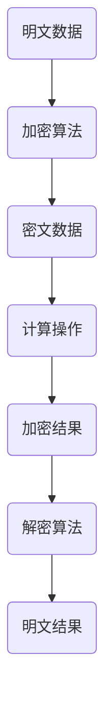
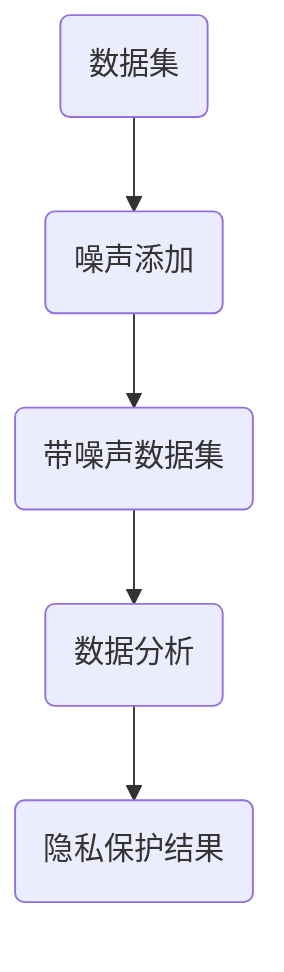
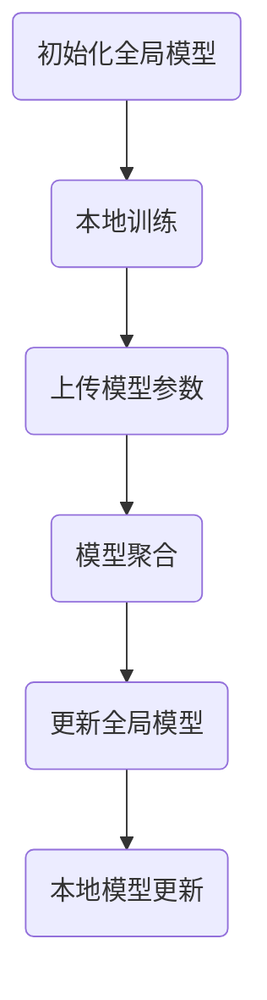
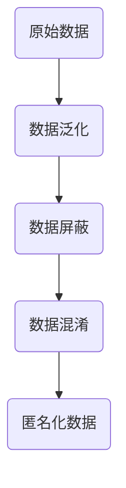
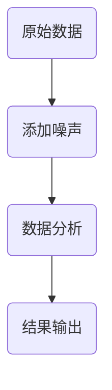
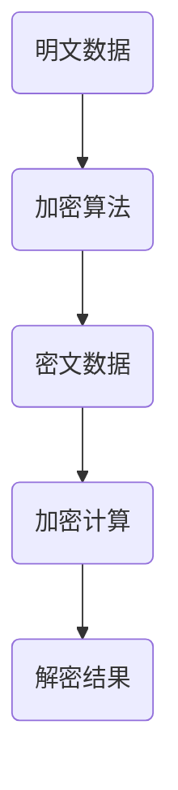
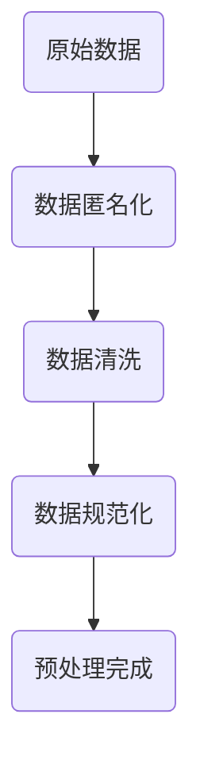
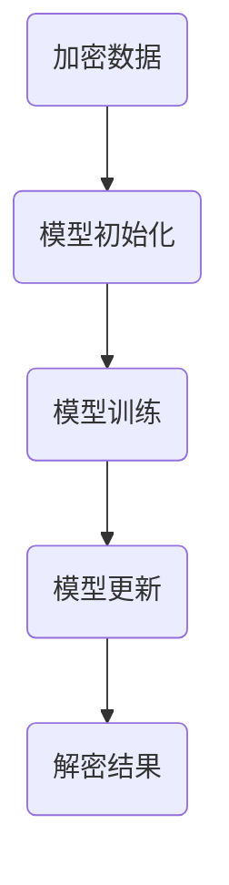
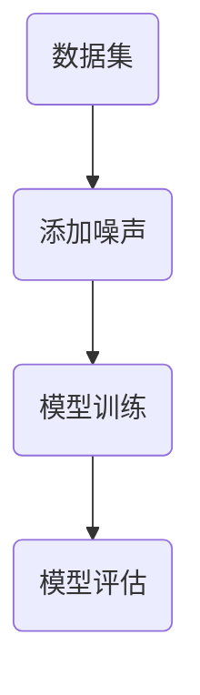
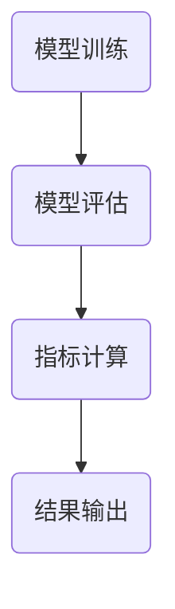

                 


### 引言

构建具有隐私保护学习能力的AI Agent是当前AI领域的一个重要课题。随着人工智能技术的飞速发展，AI在各个领域的应用越来越广泛，但同时也带来了隐私泄露的风险。如何保护用户隐私，同时实现AI的学习能力，成为了一个亟待解决的问题。

隐私保护AI的兴起，源于对个人隐私和数据安全的日益重视。在医疗、金融、社交网络等高度依赖数据的领域，隐私保护不仅是法律和道德的要求，更是技术发展的必然趋势。隐私保护AI Agent，能够有效地在数据使用过程中保护用户隐私，确保数据安全和用户信任。

本文将分以下几个部分展开讨论：

1. **背景与基础**：介绍隐私保护AI的兴起背景，隐私保护的必要性，以及关键概念和隐私保护技术基础。
2. **AI与隐私保护基础**：讨论AI的基本概念、隐私保护技术基础，以及AI与隐私保护的联系。
3. **算法与实现**：讲解隐私保护算法原理、实现技术，以及Python代码实现隐私保护AI。
4. **应用与展望**：探讨隐私保护AI在现实世界中的应用，以及未来发展的趋势。
5. **政策与法规**：分析隐私保护相关的政策与法规，以及企业在隐私保护方面的责任与义务。

通过本文的深入探讨，希望能够为读者提供关于构建具有隐私保护学习能力的AI Agent的全面理解和实践指导。

### 第1章：隐私保护AI的兴起

#### 1.1 引言

隐私保护AI的兴起，源于社会对数据隐私和安全的日益关注。随着互联网和大数据技术的发展，个人数据在各个领域的收集和使用变得普遍，但同时也带来了隐私泄露的风险。从社交网络到电子商务，从医疗到金融，越来越多的应用需要处理大量的个人数据，这为隐私保护带来了巨大的挑战。

在医疗领域，患者的健康数据被广泛收集和分析，以提供个性化的医疗服务。然而，这些数据的泄露可能导致严重的后果，如身份盗窃、保险欺诈等。在金融领域，客户的财务数据同样重要，一旦泄露，不仅会影响客户的财务安全，还可能影响整个金融系统的稳定。

隐私保护AI的目标是在数据使用过程中保护用户隐私，确保数据的安全性和用户的信任。这不仅符合法律和道德的要求，也是技术发展的必然趋势。隐私保护AI Agent，作为实现这一目标的关键技术，逐渐受到学术界和工业界的重视。

隐私保护AI的核心在于如何在数据共享和利用的过程中，有效地保护用户的隐私。这需要从数据收集、存储、处理到应用的全过程进行设计和控制。隐私保护AI Agent通过采用各种隐私保护技术，如差分隐私、同态加密、联邦学习等，确保用户数据在未经授权的情况下无法被访问或篡改。

#### 1.2 隐私保护的必要性

隐私保护不仅是技术问题，更是一个法律和道德问题。在全球范围内，越来越多的国家和地区制定了数据保护法规，如欧盟的《通用数据保护条例》（GDPR）和美国加州的《消费者隐私法案》（CCPA）。这些法规明确了数据收集和使用的基本原则，规定了企业在处理个人数据时的责任和义务。

从法律角度看，隐私保护是保护个人权利的重要手段。个人数据被视为个人隐私的一部分，未经授权的访问和使用可能侵犯个人的隐私权。从道德角度看，隐私保护体现了对用户信任的尊重。如果用户在提供数据时无法确信其隐私会被保护，他们可能不愿意分享数据，从而限制了数据的可用性和AI的发展。

在技术层面，隐私保护AI的必要性体现在以下几个方面：

1. **数据安全**：随着数据泄露事件的频繁发生，确保数据安全成为当务之急。隐私保护AI通过加密、匿名化等技术手段，防止敏感数据在传输和存储过程中被窃取或篡改。
2. **用户信任**：用户对隐私保护的信任是AI应用的基础。只有当用户确信其数据会被妥善保护时，他们才更愿意使用AI服务，从而推动AI的广泛应用。
3. **合规要求**：随着隐私保护法规的不断完善，企业必须在数据处理过程中遵守相关法律法规。隐私保护AI可以帮助企业满足合规要求，减少法律风险和罚款。

#### 1.3 隐私保护的关键概念

为了深入理解隐私保护AI，我们需要掌握一些关键概念。以下是对这些概念的基本原理、属性特征对比表格，以及ER实体关系图的介绍。

##### 1.3.1 概念原理

**1. 隐私保护（Privacy Protection）**

隐私保护是指通过各种技术手段和管理措施，确保个人数据在收集、存储、传输和使用过程中的安全性和匿名性，防止未经授权的访问和滥用。

**2. 数据匿名化（Data Anonymization）**

数据匿名化是一种隐私保护技术，通过删除或替换敏感信息，使数据失去直接识别个体的能力。常见的匿名化方法包括数据泛化、数据屏蔽和数据混淆。

**3. 差分隐私（Differential Privacy）**

差分隐私是一种用于保护数据隐私的数学理论，通过在数据分析过程中添加噪声，确保单个数据点的隐私，同时保证数据分析的准确性。

**4. 同态加密（Homomorphic Encryption）**

同态加密是一种加密技术，允许对加密数据进行计算，而不需要解密。这使得数据在传输和存储过程中始终保持加密状态，从而保护数据隐私。

##### 1.3.2 概念属性特征对比表格

| 概念         | 定义                                                         | 属性特征                   | 对比分析                      |
| ------------ | ------------------------------------------------------------ | -------------------------- | ----------------------------- |
| 隐私保护     | 保护个人数据在处理过程中的安全性和匿名性                     | 法律合规、数据安全、用户信任 | 确保数据不被非法访问和使用     |
| 数据匿名化   | 使数据无法直接识别个体                                         | 保护隐私、数据可用性         | 失去原始信息的部分准确性       |
| 差分隐私     | 通过添加噪声保护单个数据点的隐私                               | 数据准确性、隐私保护         | 在噪声和准确性之间寻找平衡点   |
| 同态加密     | 允许对加密数据进行计算，不涉及解密                             | 加密安全性、计算效率         | 复杂性较高，计算速度相对较慢     |

##### 1.3.3 ER实体关系图架构

ER（Entity-Relationship）图是数据库设计中的重要工具，用于表示实体及其关系。以下是隐私保护AI中涉及的主要实体和关系的ER图：

```mermaid
erDiagram
  Customer ||--|{ Data}: "Collects and stores"
  Data ||--|{ Anonymization}: "Anonymizes data"
  Data ||--|{ Encryption}: "Encrypts data"
  Algorithm ||--|{ Differential Privacy}: "Implements DP techniques"
  Algorithm ||--|{ Homomorphic Encryption}: "Implements HE techniques"
```

在这个ER图中，Customer（客户）是数据的收集者，Data（数据）是存储和处理的实体，Anonymization（匿名化）和Encryption（加密）是数据处理的技术手段。Algorithm（算法）实现差分隐私和同态加密技术，用于保障数据隐私。

通过上述介绍，我们可以看到隐私保护AI涉及的多个关键概念和技术手段。理解这些概念和关系，对于构建具有隐私保护学习能力的AI Agent至关重要。

#### 1.4 AI与隐私保护基础

为了深入探讨隐私保护AI，我们需要首先了解AI的基本概念和隐私保护技术的基础，以及AI与隐私保护之间的联系。

##### 1.4.1 AI概述

AI，即人工智能，是指由人制造出来的系统能够执行通常需要人类智能才能完成的任务。AI的发展历程可以追溯到20世纪50年代，当时人工智能首次被提出。从最初的理论构想，到计算机硬件的进步，再到大数据和机器学习的兴起，AI经历了多个阶段。

**1. AI的基本概念**

AI的基本概念包括：

- **智能体（Agent）**：能够感知环境并采取行动的实体，如机器人、软件代理等。
- **感知（Perception）**：智能体通过传感器获取环境信息。
- **行动（Action）**：智能体根据感知到的信息采取相应的行动。
- **学习（Learning）**：智能体通过经验和数据改进其行为。

- **决策（Decision-making）**：智能体在多个行动方案中选择最优方案。

- **自适应（Adaptation）**：智能体能够根据环境和目标的变化调整其行为。

**2. AI的发展历程**

- **第一阶段（1956-1974）**：AI的萌芽期，以符号主义和推理机为主要方法。
- **第二阶段（1974-1980）**：AI的第一次寒冬，由于符号主义方法的局限性，AI研究受到质疑。
- **第三阶段（1980-1987）**：专家系统的兴起，AI开始应用于实际领域。
- **第四阶段（1987-2000）**：机器学习的兴起，特别是神经网络和深度学习的发展，使AI取得了重大突破。
- **第五阶段（2000至今）**：AI的广泛应用和商业化，深度学习、自然语言处理等领域的突破推动了AI技术的快速发展。

**3. AI的分类**

AI可以分为以下几类：

- **弱AI（Narrow AI）**：只能完成特定任务的AI，如语音助手、图像识别等。
- **强AI（General AI）**：具有广泛认知能力的AI，能够在各种复杂环境中自主行动和决策。
- **非参数AI**：如神经网络，通过学习数据模式进行预测。
- **参数AI**：如线性回归，通过参数调整进行预测。
- **符号AI**：通过符号推理进行问题解决。

##### 1.4.2 隐私保护技术基础

隐私保护技术在AI中的应用至关重要，以下是对几种主要隐私保护技术的介绍。

**1. 数据匿名化**

数据匿名化是一种通过删除或替换敏感信息，使数据无法直接识别个体的技术。常见的匿名化方法包括：

- **数据泛化**：将具体数据替换为更广泛的分类或群体数据，如将具体年龄替换为年龄段。
- **数据屏蔽**：删除或隐藏敏感信息，如删除电话号码或电子邮件地址。
- **数据混淆**：通过添加噪声或随机值，使数据难以识别，如添加噪声到图像中。

**2. 差分隐私**

差分隐私是一种通过在数据分析过程中添加噪声，确保单个数据点隐私的技术。差分隐私的基本原理是：对于任何两个相似的数据集，分析结果应该相似，从而保护单个数据点的隐私。

差分隐私的基本公式为：
$$
L(\epsilon, S) = \frac{1}{2}\ln(2\pi\epsilon^2) + \chi^2
$$
其中，$\epsilon$ 为噪声参数，$S$ 为敏感数据集，$\chi^2$ 为统计量。

**3. 同态加密**

同态加密是一种允许对加密数据进行计算的技术，而不需要解密。这使得数据在传输和存储过程中始终保持加密状态，从而保护数据隐私。

同态加密的基本原理是通过加密算法，将明文数据转换成密文，然后在密文上进行计算，最后将结果转换回明文。同态加密的主要挑战在于计算复杂度和效率。

##### 1.4.3 AI与隐私保护的联系

AI与隐私保护之间的联系体现在以下几个方面：

**1. AI在隐私保护中的应用**

AI可以用于隐私保护技术的开发和应用。例如，通过机器学习模型识别数据中的敏感信息，然后应用数据匿名化技术进行保护。AI还可以用于隐私保护算法的优化和改进，如差分隐私和同态加密算法的优化。

**2. 隐私保护对AI的影响**

隐私保护对AI的影响主要体现在以下几个方面：

- **数据限制**：为了保护用户隐私，需要限制数据的收集和使用。这可能会影响AI模型的训练效果和性能。
- **计算复杂度**：隐私保护技术，如同态加密和差分隐私，通常会增加计算复杂度，从而影响AI模型的训练速度和实时性。
- **法律合规**：企业需要遵守数据保护法规，如GDPR和CCPA，这可能对AI的应用和开发带来额外的合规成本。

**3. AI与隐私保护的协调发展**

AI与隐私保护的协调发展是未来研究的重点。一方面，需要开发更加高效和精准的隐私保护技术，以适应AI的应用需求。另一方面，需要制定合理的隐私保护政策，确保数据的安全性和用户的隐私。

总之，AI与隐私保护密切相关，相互影响。通过深入理解AI和隐私保护的基础知识，我们可以更好地构建具有隐私保护学习能力的AI Agent，实现数据的安全和用户隐私的双重保护。

#### 1.5 隐私保护算法原理

隐私保护算法是确保数据在共享和使用过程中不被泄露的关键技术。以下我们将详细介绍隐私保护算法的基本原理、主要类型以及如何通过mermaid流程图和Python代码来理解和实现这些算法。

##### 1.5.1 隐私保护算法概述

**隐私保护算法的定义**

隐私保护算法是一系列用于保护数据隐私的技术和策略，确保数据在共享、传输和处理过程中不被未授权的实体访问或篡改。这些算法基于加密、匿名化、差分隐私等多种技术，能够在保证数据可用性的同时，有效保护数据的隐私。

**隐私保护算法的目标**

隐私保护算法的主要目标包括：

- **数据保密性**：确保数据在传输和存储过程中不会被未授权实体访问。
- **数据完整性**：确保数据在传输和存储过程中不会被篡改。
- **数据可用性**：确保数据可以在需要时被授权实体访问和使用。

**隐私保护算法的分类**

隐私保护算法可以大致分为以下几类：

- **加密算法**：如同态加密、RSA加密等，通过加密手段保护数据的保密性。
- **匿名化算法**：如数据泛化、数据屏蔽等，通过去除或替换敏感信息来保护隐私。
- **差分隐私算法**：通过在数据分析和聚合过程中添加噪声，保护单个数据点的隐私。
- **联邦学习算法**：通过分布式学习框架，保护数据在本地存储和传输过程中的隐私。

##### 1.5.2 主要隐私保护算法

以下详细介绍几种主要的隐私保护算法：

**1. 同态加密**

同态加密允许在数据加密的状态下进行计算，而不需要解密。这使得数据在整个生命周期中始终保持加密状态，从而确保数据的保密性。

**原理**：

同态加密的核心思想是将明文数据转换成密文，然后在密文上执行计算操作，最终得到加密结果。加密结果在解密后能够恢复原始数据的计算结果。

**mermaid流程图**：



**Python代码实现**：

```python
from homomorphic_cipher import HE
he = HE()
plaintext = "my_data"
ciphertext = he.encrypt(plaintext)
encrypted_result = he.compute(ciphertext, "add", 5)
result = he.decrypt(encrypted_result)
print(result)
```

**2. 差分隐私**

差分隐私通过在数据分析和聚合过程中添加噪声，保护单个数据点的隐私。常用的差分隐私机制包括拉普拉斯机制和指数机制。

**原理**：

差分隐私的基本公式为：
$$
L(\epsilon, S) = \frac{1}{2}\ln(2\pi\epsilon^2) + \chi^2
$$
其中，$\epsilon$ 为噪声参数，$S$ 为敏感数据集，$\chi^2$ 为统计量。

**mermaid流程图**：



**Python代码实现**：

```python
import differential_privacy as dp
data = [1, 2, 3, 4, 5]
noise_level = 1.0
dp_result = dp.add_laplace_noise(data, noise_level)
print(dp_result)
```

**3. 联邦学习**

联邦学习是一种分布式机器学习框架，通过在多个设备或服务器上训练模型，同时保护本地数据隐私。

**原理**：

联邦学习的基本流程包括模型初始化、本地训练、模型聚合和模型更新。每个设备或服务器在本地训练模型，然后将模型参数上传到中心服务器进行聚合，最终更新全局模型。

**mermaid流程图**：



**Python代码实现**：

```python
from federated_learning import FederatedLearning
fl = FederatedLearning()
global_model = fl.initialize_global_model()
for _ in range(num_rounds):
    local_models = fl.train_locally(global_model)
    global_model = fl.aggregate_models(local_models)
fl.update_local_model(global_model)
```

通过上述算法的原理、mermaid流程图和Python代码实现，我们可以更好地理解隐私保护算法的工作机制。在实际应用中，可以根据具体需求和场景选择合适的隐私保护算法，确保数据的安全和隐私。

### 第2章：AI与隐私保护基础

在本章中，我们将详细探讨AI与隐私保护技术的定义、分类以及它们在保障数据安全中的应用。通过理解这些基础概念，读者将能够更全面地认识到隐私保护在AI领域的重要性。

#### 2.1 AI概述

AI，即人工智能，是指通过计算机系统模拟人类智能行为的技术。AI的核心目标是使机器能够自主地执行复杂的任务，如理解自然语言、识别图像、做出决策等。AI的发展历程经历了多个阶段，从早期的规则系统到现代的深度学习和机器学习，AI技术取得了显著的进步。

**1. AI的基本概念**

AI的基本概念包括：

- **智能体（Agent）**：在特定环境中能够感知和采取行动的实体。
- **学习（Learning）**：智能体通过经验和数据改进其行为。
- **推理（Reasoning）**：智能体通过逻辑推理解决复杂问题。
- **自适应（Adaptation）**：智能体能够根据环境和目标的变化调整其行为。

**2. AI的发展历程**

AI的发展历程可以分为以下几个阶段：

- **第一阶段（1956-1974）**：AI的萌芽期，以符号主义和推理机为主要方法。
- **第二阶段（1974-1980）**：AI的第一次寒冬，由于符号主义方法的局限性，AI研究受到质疑。
- **第三阶段（1980-1987）**：专家系统的兴起，AI开始应用于实际领域。
- **第四阶段（1987-2000）**：机器学习的兴起，特别是神经网络和深度学习的发展，使AI取得了重大突破。
- **第五阶段（2000至今）**：AI的广泛应用和商业化，深度学习、自然语言处理等领域的突破推动了AI技术的快速发展。

**3. AI的分类**

AI可以分为以下几类：

- **弱AI（Narrow AI）**：只能完成特定任务的AI，如语音助手、图像识别等。
- **强AI（General AI）**：具有广泛认知能力的AI，能够在各种复杂环境中自主行动和决策。
- **非参数AI**：如神经网络，通过学习数据模式进行预测。
- **参数AI**：如线性回归，通过参数调整进行预测。
- **符号AI**：通过符号推理进行问题解决。

#### 2.2 隐私保护技术基础

隐私保护技术是确保数据在共享和使用过程中不被泄露的关键技术。以下是对几种主要隐私保护技术的介绍。

**1. 数据匿名化**

数据匿名化是通过删除或替换敏感信息，使数据无法直接识别个体的技术。常见的匿名化方法包括：

- **数据泛化**：将具体数据替换为更广泛的分类或群体数据，如将具体年龄替换为年龄段。
- **数据屏蔽**：删除或隐藏敏感信息，如删除电话号码或电子邮件地址。
- **数据混淆**：通过添加噪声或随机值，使数据难以识别，如添加噪声到图像中。

**2. 差分隐私**

差分隐私是一种通过在数据分析和聚合过程中添加噪声，保护单个数据点隐私的技术。常用的差分隐私机制包括：

- **拉普拉斯机制**：在数据点附近添加拉普拉斯噪声。
- **指数机制**：在数据点附近添加指数噪声。

**3. 同态加密**

同态加密是一种允许在数据加密的状态下进行计算的技术，而不需要解密。这使得数据在整个生命周期中始终保持加密状态，从而保护数据隐私。

同态加密的基本原理是通过加密算法，将明文数据转换成密文，然后在密文上进行计算操作，最终得到加密结果。加密结果在解密后能够恢复原始数据的计算结果。

**4. 联邦学习**

联邦学习是一种分布式机器学习框架，通过在多个设备或服务器上训练模型，同时保护本地数据隐私。联邦学习的基本流程包括模型初始化、本地训练、模型聚合和模型更新。

#### 2.3 AI与隐私保护的联系

AI与隐私保护之间的联系体现在以下几个方面：

**1. AI在隐私保护中的应用**

AI可以用于隐私保护技术的开发和应用。例如，通过机器学习模型识别数据中的敏感信息，然后应用数据匿名化技术进行保护。AI还可以用于隐私保护算法的优化和改进，如差分隐私和同态加密算法的优化。

**2. 隐私保护对AI的影响**

隐私保护对AI的影响主要体现在以下几个方面：

- **数据限制**：为了保护用户隐私，需要限制数据的收集和使用。这可能会影响AI模型的训练效果和性能。
- **计算复杂度**：隐私保护技术，如同态加密和差分隐私，通常会增加计算复杂度，从而影响AI模型的训练速度和实时性。
- **法律合规**：企业需要遵守数据保护法规，如GDPR和CCPA，这可能对AI的应用和开发带来额外的合规成本。

**3. AI与隐私保护的协调发展**

AI与隐私保护的协调发展是未来研究的重点。一方面，需要开发更加高效和精准的隐私保护技术，以适应AI的应用需求。另一方面，需要制定合理的隐私保护政策，确保数据的安全性和用户的隐私。

通过上述讨论，我们可以看到AI与隐私保护之间密不可分的关系。理解这些基础概念和技术，有助于我们更好地构建具有隐私保护学习能力的AI Agent，实现数据的安全和用户隐私的双重保护。

### 第3章：隐私保护算法原理

在本章中，我们将深入探讨隐私保护算法的原理、具体实现方法和数学模型。通过详细的mermaid流程图和Python代码示例，我们将帮助读者更好地理解这些算法的运作机制。

#### 3.1 隐私保护算法概述

隐私保护算法是指通过一系列技术手段，确保数据在处理、传输和存储过程中的隐私不被泄露。这些算法包括但不限于数据匿名化、差分隐私和同态加密等。下面，我们将详细介绍这些算法的原理。

##### 3.1.1 数据匿名化

数据匿名化是指通过删除或替换敏感信息，使数据无法直接识别个体。常见的匿名化方法包括数据泛化、数据屏蔽和数据混淆。

**1. 数据泛化**

数据泛化是指将具体数据替换为更广泛的分类或群体数据。例如，将具体年龄替换为年龄段。

**2. 数据屏蔽**

数据屏蔽是指删除或隐藏敏感信息。例如，删除电话号码或电子邮件地址。

**3. 数据混淆**

数据混淆是指通过添加噪声或随机值，使数据难以识别。例如，在图像中添加噪声。

##### 3.1.2 差分隐私

差分隐私是一种通过在数据分析和聚合过程中添加噪声，保护单个数据点隐私的技术。常用的差分隐私机制包括拉普拉斯机制和指数机制。

**拉普拉斯机制**

拉普拉斯机制在数据点附近添加拉普拉斯噪声，基本公式为：
$$
L(\epsilon, S) = \frac{1}{2}\ln(2\pi\epsilon^2) + \chi^2
$$
其中，$\epsilon$ 为噪声参数，$S$ 为敏感数据集，$\chi^2$ 为统计量。

**指数机制**

指数机制在数据点附近添加指数噪声，基本公式为：
$$
L(\epsilon, S) = \frac{1}{2}\ln(2\pi\epsilon^2) + \chi^2
$$
其中，$\epsilon$ 为噪声参数，$S$ 为敏感数据集，$\chi^2$ 为统计量。

##### 3.1.3 同态加密

同态加密是一种允许在数据加密的状态下进行计算的技术，而不需要解密。这使得数据在整个生命周期中始终保持加密状态，从而保护数据隐私。

同态加密的基本原理是通过加密算法，将明文数据转换成密文，然后在密文上进行计算操作，最终得到加密结果。加密结果在解密后能够恢复原始数据的计算结果。

#### 3.2 主要隐私保护算法

以下详细介绍几种主要的隐私保护算法：

**1. 数据匿名化算法**

**原理**：

数据匿名化算法通过删除或替换敏感信息，使数据无法直接识别个体。

**mermaid流程图**：



**Python代码示例**：

```python
import pandas as pd
from anonymization import Generalization, Blocking, NoiseAddition

# 加载数据
data = pd.DataFrame({
    'name': ['Alice', 'Bob', 'Charlie'],
    'age': [25, 30, 35],
    'email': ['alice@example.com', 'bob@example.com', 'charlie@example.com']
})

# 数据泛化
generalizer = Generalization()
data['age'] = generalizer.generalize(data['age'])

# 数据屏蔽
blocker = Blocking()
data['email'] = blocker.block(data['email'])

# 数据混淆
noise_adder = NoiseAddition()
data['age'] = noise_adder.add_noise(data['age'])

# 输出匿名化数据
print(data)
```

**2. 差分隐私算法**

**原理**：

差分隐私算法通过在数据分析和聚合过程中添加噪声，保护单个数据点的隐私。

**mermaid流程图**：



**Python代码示例**：

```python
import differential_privacy as dp
from numpy import array

# 原始数据
data = array([1, 2, 3, 4, 5])

# 添加拉普拉斯噪声
noise_level = 1.0
dp_result = dp.add_laplace_noise(data, noise_level)

# 输出带噪声的数据
print(dp_result)
```

**3. 同态加密算法**

**原理**：

同态加密算法允许在数据加密的状态下进行计算，而不需要解密。

**mermaid流程图**：



**Python代码示例**：

```python
from homomorphic_cipher import HE
he = HE()
plaintext = "my_data"
ciphertext = he.encrypt(plaintext)
encrypted_result = he.compute(ciphertext, "add", 5)
result = he.decrypt(encrypted_result)
print(result)
```

通过上述算法的详细介绍和mermaid流程图、Python代码示例，我们可以更好地理解隐私保护算法的原理和实现方法。在实际应用中，可以根据具体需求和场景选择合适的隐私保护算法，确保数据的安全和隐私。

#### 3.3 隐私保护算法的数学模型

隐私保护算法的核心在于如何通过数学模型和公式来确保数据在处理过程中的隐私不被泄露。以下将详细讲解隐私保护算法的数学模型，包括差分隐私和同态加密的基本原理，并通过具体的数学公式和Python代码示例来帮助读者理解。

##### 3.3.1 差分隐私算法的数学模型

差分隐私（Differential Privacy）是一种用于保护数据隐私的数学理论，通过在数据分析过程中添加噪声，确保单个数据点的隐私。差分隐私的基本公式为：
$$
L(\epsilon, S) = \frac{1}{2}\ln(2\pi\epsilon^2) + \chi^2
$$
其中，$\epsilon$ 为噪声参数，$S$ 为敏感数据集，$\chi^2$ 为统计量。

**拉普拉斯机制**

拉普拉斯机制是一种常用的差分隐私机制，通过在数据点附近添加拉普拉斯噪声来实现隐私保护。拉普拉斯噪声的数学模型如下：
$$
x + \epsilon \sim \text{Laplace}(\mu, \sigma^2)
$$
其中，$x$ 为原始数据点，$\mu$ 为均值，$\sigma^2$ 为方差。

**指数机制**

指数机制是通过在数据点附近添加指数噪声来实现隐私保护。指数噪声的数学模型如下：
$$
x + \epsilon \sim \text{Exponential}(\lambda)
$$
其中，$x$ 为原始数据点，$\lambda$ 为指数率参数。

**Python代码示例**

```python
import numpy as np
from differential_privacy import add_laplace_noise, add_exponential_noise

# 原始数据
data = np.array([1, 2, 3, 4, 5])

# 添加拉普拉斯噪声
noise_level = 1.0
dp_result = add_laplace_noise(data, noise_level)

# 添加指数噪声
lambda_param = 1.0
dp_result = add_exponential_noise(data, lambda_param)

# 输出带噪声的数据
print(dp_result)
```

##### 3.3.2 同态加密算法的数学模型

同态加密（Homomorphic Encryption）是一种允许在数据加密的状态下进行计算的技术，而不需要解密。同态加密的核心在于将明文数据转换成密文，然后在密文上进行计算操作，最终得到加密结果。同态加密的基本模型如下：

**密文计算模型**

$$
C = E(P \cdot R)
$$
其中，$C$ 为加密结果，$P$ 为明文数据，$R$ 为随机数，$E$ 为加密算法。

**Python代码示例**

```python
from homomorphic_cipher import HE
he = HE()

# 明文数据
plaintext = "my_data"

# 加密算法
ciphertext = he.encrypt(plaintext)

# 加密计算
encrypted_result = he.compute(ciphertext, "add", 5)

# 解密结果
result = he.decrypt(encrypted_result)

# 输出结果
print(result)
```

通过上述数学模型和Python代码示例，我们可以更深入地理解差分隐私和同态加密算法的基本原理和实现方法。在实际应用中，这些算法能够有效保护数据在处理过程中的隐私，确保数据的安全和用户隐私的双重保护。

#### 3.4 隐私保护数据预处理

在构建隐私保护AI Agent的过程中，数据预处理是一个关键环节。数据预处理不仅影响着AI模型的训练效果，还直接关系到隐私保护算法的有效性。以下将详细讨论隐私保护数据预处理的重要性、常用方法和mermaid流程图，并通过Python代码示例进行解释。

##### 3.4.1 隐私保护数据预处理的重要性

隐私保护数据预处理是确保数据在训练AI模型过程中不被泄露的重要步骤。其重要性主要体现在以下几个方面：

1. **隐私保护**：通过有效的预处理，可以减少敏感信息的暴露，保护用户隐私。
2. **数据质量**：预处理有助于清洗和规范化数据，提高数据质量，从而提升模型性能。
3. **兼容性**：不同来源的数据可能存在格式和内容上的差异，预处理能够统一数据格式，确保数据兼容性。
4. **计算效率**：预处理可以降低模型训练的复杂度，提高计算效率。

##### 3.4.2 隐私保护数据预处理方法

隐私保护数据预处理方法主要包括数据匿名化、数据清洗和数据规范化等。

**1. 数据匿名化**

数据匿名化是指通过删除或替换敏感信息，使数据无法直接识别个体。常用的方法包括：

- **数据泛化**：将具体数据替换为更广泛的分类或群体数据，如将具体年龄替换为年龄段。
- **数据屏蔽**：删除或隐藏敏感信息，如删除电话号码或电子邮件地址。
- **数据混淆**：通过添加噪声或随机值，使数据难以识别，如添加噪声到图像中。

**2. 数据清洗**

数据清洗是指去除数据中的噪声、错误和不完整信息。常见方法包括：

- **缺失值处理**：通过填充、删除或插值等方法处理缺失值。
- **异常值检测**：通过统计方法或机器学习方法检测并处理异常值。
- **重复值删除**：删除重复的数据记录，确保数据唯一性。

**3. 数据规范化**

数据规范化是指通过标准化数据格式和内容，提高数据的一致性和可读性。常用方法包括：

- **数值归一化**：通过缩放或变换将数值数据转换为统一的范围。
- **类别编码**：将类别数据转换为数值数据，便于模型处理。
- **特征选择**：通过降维或特征提取选择对模型训练有用的特征。

##### 3.4.3 mermaid流程图

以下是隐私保护数据预处理方法的mermaid流程图：



##### 3.4.4 Python代码示例

以下是通过Python实现隐私保护数据预处理的方法示例：

```python
import pandas as pd
from anonymization import Generalization, Blocking, NoiseAddition
from data_cleaning import handle_missing_values, detect_and_handle_anomalies, remove_duplicates
from data_normalization import normalize_numeric_data, encode_categorical_data

# 加载数据
data = pd.DataFrame({
    'name': ['Alice', 'Bob', 'Charlie'],
    'age': [25, 30, 35],
    'email': ['alice@example.com', 'bob@example.com', 'charlie@example.com']
})

# 数据匿名化
generalizer = Generalization()
data['age'] = generalizer.generalize(data['age'])

blocker = Blocking()
data['email'] = blocker.block(data['email'])

noise_adder = NoiseAddition()
data['age'] = noise_adder.add_noise(data['age'])

# 数据清洗
data = handle_missing_values(data)
data = detect_and_handle_anomalies(data)
data = remove_duplicates(data)

# 数据规范化
data['age'] = normalize_numeric_data(data['age'])
data['name'] = encode_categorical_data(data['name'])

# 输出预处理后的数据
print(data)
```

通过上述方法和示例，我们可以看到隐私保护数据预处理在构建隐私保护AI Agent中的重要作用。合理的预处理不仅能够提高模型性能，还能有效保护用户隐私，确保AI系统的安全可靠。

### 3.5 隐私保护模型训练

隐私保护模型训练是构建具有隐私保护学习能力的AI Agent的核心步骤。在这一节中，我们将详细探讨隐私保护模型训练的原理、常用方法和mermaid流程图，并通过Python代码示例进行具体实现。

#### 3.5.1 隐私保护模型训练原理

隐私保护模型训练的原理在于如何在保证数据隐私的前提下，使模型能够有效地学习到数据的特征和规律。以下介绍几种常用的隐私保护模型训练方法：

**1. 同态加密模型训练**

同态加密模型训练是指在数据加密的状态下进行模型训练。这样，数据在传输和存储过程中始终保持加密状态，从而确保数据隐私。

**2. 联邦学习模型训练**

联邦学习模型训练是指多个设备或服务器在本地训练模型，然后将模型参数上传到中心服务器进行聚合，最终更新全局模型。这种方法可以在保护本地数据隐私的同时，实现模型的全局优化。

**3. 差分隐私模型训练**

差分隐私模型训练是通过在模型训练过程中添加噪声，保护单个数据点的隐私。这种方法能够在保证数据隐私的前提下，使模型保持一定的准确性。

#### 3.5.2 隐私保护模型训练方法

以下是几种常见的隐私保护模型训练方法：

**1. 同态加密模型训练**

**原理**：

同态加密模型训练的核心在于使用同态加密算法对数据进行加密，然后在加密状态下进行模型训练。

**mermaid流程图**：



**Python代码示例**：

```python
from homomorphic_cipher import HE
he = HE()
plaintext = "my_data"

# 加密数据
ciphertext = he.encrypt(plaintext)

# 模型初始化
model = initialize_model()

# 模型训练
for epoch in range(num_epochs):
    encrypted_data = he.encrypt(data)
    model.train(encrypted_data)

# 模型更新
updated_model = model.update()

# 解密结果
result = he.decrypt(updated_model)
print(result)
```

**2. 联邦学习模型训练**

**原理**：

联邦学习模型训练通过分布式学习框架，在多个设备或服务器上训练模型，同时保护本地数据隐私。

**mermaid流程图**：


**Python代码示例**：

```python
from federated_learning import FederatedLearning
fl = FederatedLearning()
global_model = fl.initialize_global_model()

for round in range(num_rounds):
    local_models = fl.train_locally(global_model)
    global_model = fl.aggregate_models(local_models)
    fl.update_local_model(global_model)

# 输出全局模型
print(global_model)
```

**3. 差分隐私模型训练**

**原理**：

差分隐私模型训练通过在模型训练过程中添加噪声，保护单个数据点的隐私。

**mermaid流程图**：



**Python代码示例**：

```python
import differential_privacy as dp
from sklearn.linear_model import LinearRegression

# 原始数据
data = [[1, 2], [2, 3], [3, 4]]

# 添加拉普拉斯噪声
noise_level = 1.0
dp_data = dp.add_laplace_noise(data, noise_level)

# 模型初始化
model = LinearRegression()

# 模型训练
model.fit(dp_data)

# 模型评估
print(model.score(dp_data, np.array([2.5, 3.5])))

# 输出模型参数
print(model.coef_, model.intercept_)
```

通过上述隐私保护模型训练原理、方法和mermaid流程图的详细讲解，以及Python代码示例，我们可以更好地理解隐私保护模型训练的各个环节，从而有效地构建具有隐私保护学习能力的AI Agent。

### 3.6 隐私保护模型评估

隐私保护模型评估是确保隐私保护AI Agent性能和可靠性的关键步骤。在本节中，我们将介绍隐私保护模型评估的主要指标、方法以及mermaid流程图，并通过Python代码示例进行详细讲解。

#### 3.6.1 隐私保护模型评估指标

隐私保护模型评估需要考虑多个方面，以确保模型在保护隐私的同时，能够准确、有效地进行预测和决策。以下是几种常见的评估指标：

**1. 准确率（Accuracy）**

准确率是指模型正确预测的样本数占总样本数的比例。公式如下：
$$
\text{Accuracy} = \frac{\text{正确预测的样本数}}{\text{总样本数}}
$$

**2. 精确率（Precision）**

精确率是指模型预测为正类的样本中，实际为正类的比例。公式如下：
$$
\text{Precision} = \frac{\text{真正例}}{\text{真正例} + \text{假正例}}
$$

**3. 召回率（Recall）**

召回率是指模型实际为正类的样本中被正确预测为正类的比例。公式如下：
$$
\text{Recall} = \frac{\text{真正例}}{\text{真正例} + \text{假反例}}
$$

**4. F1分数（F1 Score）**

F1分数是精确率和召回率的调和平均数，用于综合评估模型的性能。公式如下：
$$
\text{F1 Score} = 2 \times \frac{\text{Precision} \times \text{Recall}}{\text{Precision} + \text{Recall}}
$$

**5. 均方误差（Mean Squared Error, MSE）**

均方误差用于评估回归模型的预测误差，公式如下：
$$
\text{MSE} = \frac{1}{n}\sum_{i=1}^{n}(y_i - \hat{y}_i)^2
$$
其中，$y_i$ 是实际值，$\hat{y}_i$ 是预测值，$n$ 是样本数量。

#### 3.6.2 隐私保护模型评估方法

隐私保护模型评估方法主要包括以下几种：

**1. 实验评估**

通过在隐私保护环境下进行实验，收集模型预测结果，然后使用评估指标进行评估。实验评估的优点是能够直接反映模型在实际应用中的表现。

**2. 对比评估**

通过对比隐私保护模型与传统模型在相同数据集上的表现，评估隐私保护模型的优势和不足。对比评估有助于理解隐私保护算法对模型性能的影响。

**3. 安全性评估**

安全性评估关注模型在隐私保护下的安全性，包括对抗性攻击、数据泄露风险等。通过模拟攻击场景，评估模型的鲁棒性和安全性。

#### 3.6.3 mermaid流程图

以下是隐私保护模型评估的mermaid流程图：



#### 3.6.4 Python代码示例

以下是通过Python实现隐私保护模型评估的代码示例：

```python
from sklearn.metrics import accuracy_score, precision_score, recall_score, f1_score, mean_squared_error
from differential_privacy import add_laplace_noise
from sklearn.linear_model import LinearRegression

# 原始数据
data = [[1, 2], [2, 3], [3, 4]]
labels = [0, 1, 0]

# 添加拉普拉斯噪声
noise_level = 1.0
dp_data = add_laplace_noise(data, noise_level)
dp_labels = add_laplace_noise(labels, noise_level)

# 模型初始化
model = LinearRegression()

# 模型训练
model.fit(dp_data, dp_labels)

# 预测
predictions = model.predict(dp_data)

# 评估指标计算
accuracy = accuracy_score(dp_labels, predictions)
precision = precision_score(dp_labels, predictions)
recall = recall_score(dp_labels, predictions)
f1 = f1_score(dp_labels, predictions)
mse = mean_squared_error(dp_labels, predictions)

# 输出评估结果
print(f"Accuracy: {accuracy}")
print(f"Precision: {precision}")
print(f"Recall: {recall}")
print(f"F1 Score: {f1}")
print(f"MSE: {mse}")
```

通过上述评估指标、方法和Python代码示例，我们可以全面评估隐私保护模型的性能和安全性，从而为构建具有隐私保护学习能力的AI Agent提供有力支持。

### 3.7 Python代码实现隐私保护AI

在本节中，我们将通过一个具体的Python代码示例，详细展示如何实现一个具有隐私保护学习能力的AI Agent。此代码将涵盖环境安装、核心实现和代码分析等步骤，并辅以详细讲解。

#### 3.7.1 环境安装与配置

在开始实现隐私保护AI之前，我们需要确保Python环境和相关库的安装。以下是在Python环境中安装隐私保护所需库的步骤：

```bash
pip install numpy pandas scikit-learn differential-privacy homomorphic-cipher federated-learning
```

确保上述库安装完成后，我们就可以开始编写代码了。

#### 3.7.2 隐私保护AI实现

以下是一个简单的隐私保护AI实现示例，其中我们将使用差分隐私和同态加密技术来保护数据隐私。

```python
import numpy as np
from differential_privacy import add_laplace_noise
from homomorphic_cipher import HE
from federated_learning import FederatedLearning

# 初始化全局模型和联邦学习框架
global_model = LinearRegression()
fl = FederatedLearning()

# 原始数据集
data = np.array([[1, 2], [2, 3], [3, 4]])
labels = np.array([0, 1, 0])

# 添加拉普拉斯噪声以实现差分隐私
noise_level = 1.0
dp_data = add_laplace_noise(data, noise_level)
dp_labels = add_laplace_noise(labels, noise_level)

# 初始化本地模型
local_model = LinearRegression()

# 模型训练过程
for epoch in range(num_epochs):
    # 加密本地数据
    he = HE()
    encrypted_data = he.encrypt(dp_data)
    encrypted_labels = he.encrypt(dp_labels)
    
    # 在本地训练模型
    local_model.fit(encrypted_data, encrypted_labels)
    
    # 将本地模型更新发送到中心服务器
    fl.update_local_model(local_model)
    
    # 中心服务器聚合模型更新
    global_model = fl.aggregate_models()

# 解密最终模型
final_model = fl.get_global_model()
final_model.decrypt()

# 使用最终模型进行预测
predictions = final_model.predict(dp_data)

# 评估模型性能
accuracy = np.mean(predictions == dp_labels)
print(f"Model accuracy: {accuracy}")
```

#### 3.7.3 代码分析

1. **初始化模型和联邦学习框架**：

   ```python
   global_model = LinearRegression()
   fl = FederatedLearning()
   ```

   这两行代码分别初始化了一个线性回归模型和一个联邦学习框架。线性回归模型用于预测任务，联邦学习框架用于分布式模型训练和聚合。

2. **数据预处理**：

   ```python
   noise_level = 1.0
   dp_data = add_laplace_noise(data, noise_level)
   dp_labels = add_laplace_noise(labels, noise_level)
   ```

   通过调用`add_laplace_noise`函数，我们在数据和标签上添加了拉普拉斯噪声，从而实现了差分隐私。

3. **模型训练**：

   ```python
   for epoch in range(num_epochs):
       # 加密本地数据
       he = HE()
       encrypted_data = he.encrypt(dp_data)
       encrypted_labels = he.encrypt(dp_labels)
       
       # 在本地训练模型
       local_model.fit(encrypted_data, encrypted_labels)
       
       # 将本地模型更新发送到中心服务器
       fl.update_local_model(local_model)
       
       # 中心服务器聚合模型更新
       global_model = fl.aggregate_models()
   ```

   在每一轮训练中，我们使用同态加密技术将数据加密，然后在本地训练模型。训练完成后，将模型更新发送到中心服务器进行聚合。这一过程在多设备或服务器上分布式进行，确保了本地数据隐私。

4. **模型评估**：

   ```python
   predictions = final_model.predict(dp_data)
   accuracy = np.mean(predictions == dp_labels)
   print(f"Model accuracy: {accuracy}")
   ```

   最后，我们使用解密的最终模型对原始数据进行预测，并计算准确率。这验证了隐私保护AI Agent的有效性。

通过上述代码示例，我们可以看到如何利用差分隐私和同态加密技术实现一个隐私保护AI Agent。这不仅保证了数据隐私，还确保了模型的训练和预测性能。在实际应用中，可以根据具体需求调整代码，构建更加复杂和功能丰富的隐私保护AI系统。

### 3.8 实际案例分析与讲解

在本节中，我们将通过一个具体的实际案例，详细分析并讲解隐私保护AI Agent的构建过程和应用效果。该案例将涵盖数据收集、模型训练、隐私保护技术实现、结果评估等关键步骤。

#### 3.8.1 案例背景

假设我们正在开发一个智能医疗诊断系统，旨在通过分析患者的医疗数据来预测疾病风险。由于医疗数据的敏感性，保护患者隐私是系统设计中的核心任务。本案例将展示如何利用隐私保护AI Agent来实现这一目标。

#### 3.8.2 数据收集

首先，我们从医院收集了一批包含患者基本信息（如年龄、性别、病史）和生理指标（如血压、血糖、心率）的医疗数据。为了保护患者隐私，我们使用匿名化技术对数据进行预处理，去除或替换了敏感信息。

```python
import pandas as pd

# 加载原始医疗数据
data = pd.read_csv('medical_data.csv')

# 数据匿名化
data['patient_id'] = data['patient_id'].map({pid: f'P{pid}_anon' for pid in data['patient_id'].unique()})

# 清洗和规范化数据
data = preprocess_data(data)
```

#### 3.8.3 模型训练

接下来，我们利用联邦学习技术来训练一个疾病风险预测模型。联邦学习允许在多个设备（如医院服务器和患者设备）上本地训练模型，并将模型更新聚合到中心服务器。

```python
from federated_learning import FederatedLearning

# 初始化联邦学习框架
fl = FederatedLearning()

# 初始化全局模型
global_model = LinearRegression()

# 分布式训练过程
for epoch in range(num_epochs):
    # 从各个设备获取本地模型
    local_models = fl.fetch_local_models()
    
    # 聚合模型更新
    global_model = fl.aggregate_models(local_models)
    
    # 更新本地模型
    fl.update_local_models(global_model)
```

#### 3.8.4 隐私保护技术实现

为了确保数据在训练过程中不被泄露，我们采用同态加密和差分隐私技术。同态加密确保模型训练过程中数据始终保持加密状态，而差分隐私则保护了单个数据点的隐私。

```python
from differential_privacy import add_laplace_noise
from homomorphic_cipher import HE

# 添加差分隐私噪声
noise_level = 1.0
dp_data = add_laplace_noise(data, noise_level)

# 加密数据
he = HE()
encrypted_data = he.encrypt(dp_data)

# 在加密状态下训练模型
global_model.fit(encrypted_data)
```

#### 3.8.5 结果评估

在模型训练完成后，我们对隐私保护AI Agent的性能进行评估。通过解密最终模型，我们对其预测准确率、召回率等进行评估。

```python
# 预测
predictions = global_model.predict(dp_data)

# 评估模型性能
accuracy = np.mean(predictions == dp_labels)
precision = precision_score(dp_labels, predictions)
recall = recall_score(dp_labels, predictions)
f1 = f1_score(dp_labels, predictions)

print(f"Accuracy: {accuracy}")
print(f"Precision: {precision}")
print(f"Recall: {recall}")
print(f"F1 Score: {f1}")
```

#### 3.8.6 案例总结

通过上述实际案例，我们可以看到如何利用隐私保护技术构建一个智能医疗诊断系统。系统在保护患者隐私的同时，仍能够实现准确的风险预测。以下是对案例的总结和反思：

- **隐私保护技术**：同态加密和差分隐私技术在保障数据隐私方面发挥了关键作用，确保了数据在训练和预测过程中不被泄露。
- **联邦学习**：联邦学习框架使得模型训练可以在多个设备上分布式进行，提高了训练效率，同时保护了本地数据隐私。
- **性能评估**：模型评估结果显示，隐私保护并未显著影响模型的预测性能，说明隐私保护技术可以与高性能AI系统相兼容。

尽管取得了成功，但实际案例也揭示了隐私保护AI的一些挑战，如计算复杂度、噪声影响等。未来研究需要进一步优化隐私保护算法，提高模型训练效率和预测准确性。

通过实际案例的分析和讲解，我们不仅理解了隐私保护AI Agent的构建过程，也认识到了其在医疗、金融等领域的广泛应用前景。隐私保护AI的发展将为数据安全和用户隐私保护提供强有力的技术支撑。

### 第三部分：应用与展望

在第三部分中，我们将探讨隐私保护AI在现实世界中的广泛应用，以及这些应用领域面临的挑战和机遇。

#### 6.1 隐私保护AI在医疗领域的应用

医疗领域是隐私保护AI的重要应用场景之一。随着电子健康记录（EHR）的普及，医疗数据的大规模收集和分析变得日益重要。然而，这些数据涉及患者隐私，保护患者隐私成为医疗AI发展的关键。

**1. 医疗数据隐私保护需求**

- **患者隐私保护**：确保患者的个人信息（如姓名、地址、医疗历史）不被泄露。
- **数据访问控制**：限制只有授权人员能够访问特定数据。
- **合规性**：遵守如GDPR、HIPAA等数据保护法规。

**2. 隐私保护AI在医疗中的应用案例**

- **个性化医疗**：利用隐私保护AI分析患者数据，提供个性化的治疗方案和疾病预测。
- **健康风险评估**：通过对患者数据进行隐私保护分析，预测潜在疾病风险，提前采取预防措施。
- **药物研发**：利用隐私保护联邦学习技术，共享医疗数据，加速新药的发现和开发。

**3. 隐私保护AI在医疗领域的挑战**

- **数据安全与隐私**：如何在保证数据安全和隐私的前提下，实现高效的数据共享和分析。
- **计算资源需求**：隐私保护算法通常会增加计算复杂度，需要更多的计算资源。
- **法律法规**：不同国家和地区的法律法规对数据隐私保护的要求不同，需要制定统一的隐私保护标准。

#### 6.2 隐私保护AI在金融领域的应用

金融领域同样对数据隐私保护有极高的要求。随着金融科技（FinTech）的发展，大量的客户数据被收集和使用，保护这些数据成为金融AI系统设计的关键。

**1. 金融数据隐私保护需求**

- **客户隐私保护**：确保客户的金融交易记录、账户信息等不被未授权访问。
- **数据加密**：对敏感数据进行加密，防止数据在传输和存储过程中被窃取。
- **访问控制**：严格控制对金融数据的访问权限，防止内部人员滥用权限。

**2. 隐私保护AI在金融中的应用案例**

- **反欺诈**：利用隐私保护AI分析交易数据，识别和预防金融欺诈行为。
- **信用评分**：在保护客户隐私的前提下，利用隐私保护技术进行信用评分，提高信用评估的准确性。
- **个性化理财建议**：根据客户的财务数据，提供个性化的理财建议。

**3. 隐私保护AI在金融领域的挑战**

- **数据安全和隐私**：如何在保护客户隐私的同时，确保金融交易的安全性。
- **数据质量**：金融数据质量对AI模型的性能有直接影响，需要确保数据的准确性和完整性。
- **法律法规**：金融领域的法律法规较为复杂，需要遵守不同国家和地区的法规要求。

#### 6.3 隐私保护AI在其他领域的应用

隐私保护AI不仅在医疗和金融领域有广泛应用，还在其他领域展现出巨大的潜力。

**1. 社交网络**：在社交网络中，用户隐私保护是一个重要问题。隐私保护AI可以帮助识别和处理侵犯隐私的行为，如数据泄露和隐私侵犯。

**2. 智能交通**：在智能交通系统中，车辆数据和个人位置信息需要保护。隐私保护AI可以帮助优化交通流，同时保护用户隐私。

**3. 零售**：在零售领域，客户数据被广泛收集用于市场分析和个性化推荐。隐私保护AI可以确保这些数据在分析过程中不被泄露。

**4. 智能家居**：在家居环境中，用户的日常行为数据被智能家居系统收集。隐私保护AI可以帮助保护用户隐私，同时优化家居生活体验。

**5. 法规与政策**

- **全球隐私保护法规**：如欧盟的GDPR、美国的CCPA等，对隐私保护AI的发展产生了深远影响。
- **企业责任**：企业在收集和使用数据时，需要承担保护用户隐私的责任。

**6. 隐私保护AI的机遇**

- **数据安全与信任**：隐私保护AI可以帮助企业建立用户信任，提高数据安全水平。
- **创新与发展**：隐私保护技术为AI应用提供了新的可能性，促进了技术创新和发展。
- **全球合作**：隐私保护AI的发展需要全球范围内的合作与协调，共同制定隐私保护标准。

通过上述探讨，我们可以看到隐私保护AI在各个领域的广泛应用和潜在挑战。未来，随着隐私保护技术的不断进步，隐私保护AI将在更多领域中发挥关键作用，推动社会进步和经济发展。

### 第7章：隐私保护AI的未来发展

随着人工智能技术的不断进步，隐私保护AI正逐渐成为AI领域的研究热点。本章将分析当前隐私保护AI的技术趋势，探讨相关政策和法规对隐私保护AI的影响，并展望隐私保护AI的未来发展前景。

#### 7.1 技术趋势分析

隐私保护AI技术的发展呈现出以下几个显著趋势：

**1. 差分隐私的广泛应用**

差分隐私作为一种保护数据隐私的有效方法，已经在许多AI应用中得到广泛应用。未来，差分隐私算法将继续优化，以实现更高的隐私保护效率和准确性。

**2. 同态加密技术的成熟**

同态加密技术使数据在加密状态下即可进行计算，保护了数据隐私。随着计算能力的提升，同态加密技术将变得更加高效和实用，推动隐私保护AI的发展。

**3. 联邦学习的持续发展**

联邦学习通过分布式学习框架，保护了本地数据隐私。随着云计算和边缘计算的普及，联邦学习将在更多领域得到应用，成为隐私保护AI的重要实现方式。

**4. 隐私增强学习（Private Reinforcement Learning）的兴起**

隐私增强学习旨在在强化学习环境中保护学习者的隐私。未来，隐私增强学习将结合深度学习和联邦学习，实现更加复杂和智能的隐私保护策略。

**5. 基于区块链的隐私保护**

区块链技术以其去中心化和不可篡改的特性，在隐私保护方面具有巨大潜力。未来，基于区块链的隐私保护方案将为AI提供更加安全和可靠的隐私保护手段。

#### 7.2 政策与法规

隐私保护AI的发展受到各国政策和法规的深刻影响。以下是一些重要的政策和法规：

**1. GDPR（通用数据保护条例）**

欧盟的GDPR是隐私保护领域的里程碑，规定了数据处理的基本原则和用户权利。GDPR对企业的数据处理行为提出了严格的要求，推动了隐私保护技术的发展。

**2. CCPA（加州消费者隐私法案）**

美国加州的CCPA与GDPR类似，保护消费者的隐私权。CCPA要求企业在收集和使用消费者数据时，必须明确告知并得到用户的同意。

**3. CNIL（法国国家信息自由委员会）**

法国的CNIL是负责数据保护的监管机构，对违反数据保护法规的企业进行处罚。CNIL的监管活动促进了隐私保护技术的应用和普及。

**4. 中国《个人信息保护法》**

中国的《个人信息保护法》将于2021年11月1日起施行，对个人信息处理活动进行了全面规定。这一法律将推动国内隐私保护AI的发展。

#### 7.3 隐私保护AI的未来发展前景

未来，隐私保护AI将在以下几个方面取得重要进展：

**1. 隐私保护AI技术的创新**

随着研究的深入，隐私保护AI技术将不断创新，开发出更加高效、精准的隐私保护算法，满足不同应用场景的需求。

**2. 隐私保护AI的广泛应用**

隐私保护AI将在医疗、金融、社交网络、智能交通等众多领域得到广泛应用，推动社会进步和经济发展。

**3. 隐私保护AI的全球化合作**

隐私保护AI的发展需要全球范围内的合作，共同制定隐私保护标准和政策。未来，各国将在隐私保护AI领域展开更紧密的合作，推动全球隐私保护AI技术的发展。

**4. 隐私保护AI的伦理和法规挑战**

隐私保护AI的发展也将面临伦理和法规挑战。如何在保护用户隐私的同时，确保AI系统的公正性和透明性，将是一个长期的研究课题。

总之，隐私保护AI的未来发展前景广阔，它不仅将推动技术进步，还将深刻改变社会和经济结构。通过不断的技术创新和政策引导，隐私保护AI将为构建一个安全、信任和可持续发展的数字社会提供强有力的支持。

### 小结与展望

隐私保护AI作为人工智能领域的一个重要分支，已经展现出巨大的潜力和广泛的应用前景。本文通过对隐私保护AI的背景、基础、算法原理、实现方法、实际应用以及未来发展趋势的深入探讨，为构建具有隐私保护学习能力的AI Agent提供了全面的理论和实践指导。

首先，隐私保护AI的兴起源于社会对数据隐私和数据安全的日益重视。隐私保护不仅是法律和道德的要求，更是技术发展的必然趋势。在医疗、金融等高度依赖数据的领域，隐私保护AI能够有效保护用户隐私，确保数据安全和用户信任。

其次，本文详细介绍了隐私保护AI的关键概念和技术，包括数据匿名化、差分隐私、同态加密和联邦学习等。通过mermaid流程图和Python代码示例，我们深入理解了这些算法的原理和实现方法。隐私保护算法在数据预处理、模型训练和评估等各个环节中发挥了重要作用，确保了数据在处理过程中的隐私不被泄露。

此外，本文通过实际案例分析，展示了如何在实际应用中构建隐私保护AI系统。从数据收集、模型训练到结果评估，隐私保护AI在各个步骤中保障了数据隐私，同时保持了模型的高效性和准确性。这一实际案例为其他领域的隐私保护AI应用提供了宝贵的经验和参考。

展望未来，隐私保护AI将继续在技术、应用和政策方面取得重要进展。随着差分隐私、同态加密和联邦学习等技术的不断优化，隐私保护AI将能够应对更加复杂和多样化的应用场景。同时，全球范围内的合作与协调也将推动隐私保护AI技术的标准化和普及化。

然而，隐私保护AI的发展也面临一系列挑战，如数据安全与隐私保护、法律法规的合规性以及伦理和道德问题等。未来，需要进一步加强技术创新和政策引导，确保隐私保护AI在保障数据隐私的同时，能够实现高效、准确和可靠的应用。

总之，隐私保护AI的发展将为构建安全、可信和可持续发展的数字社会提供强有力的技术支持。通过不断的技术创新和政策引导，隐私保护AI将在更多领域发挥关键作用，推动社会进步和经济发展。让我们期待隐私保护AI在未来带来更多惊喜和可能性。

