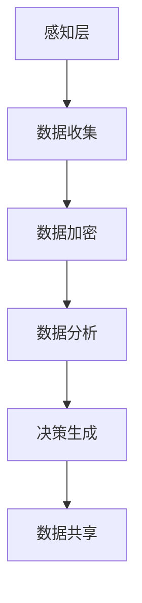
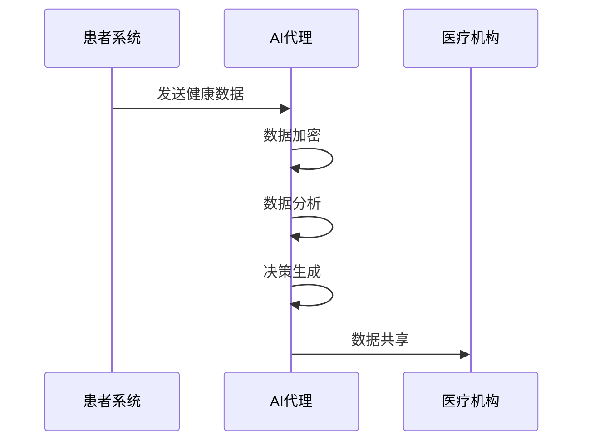

                 

# 构建具有隐私计算能力的AI Agent

> 关键词：隐私计算、AI Agent、安全增强、数据保护、分布式计算

> 摘要：
本文旨在探讨如何在构建AI代理（Agent）的过程中集成隐私计算能力，确保数据安全和用户隐私。文章首先介绍了AI代理的基本概念和隐私问题的背景，然后详细分析了隐私计算的技术原理和方法。接下来，文章将深入探讨如何设计具有隐私保护能力的AI代理，并通过具体实例和实战项目展示如何实施这些设计原则。最后，文章将讨论未来发展趋势和面临的挑战，为读者提供有价值的见解和实践指导。

## 1. AI代理的基本概念

### 1.1 AI代理的定义

AI代理（AI Agent）是一种基于人工智能技术的自主决策实体，它能够感知环境、采取行动并在环境中与其他实体互动。与传统的程序不同，AI代理具有以下特点：

- **自主性**：能够自主地做出决策，而不是被预设的指令所限制。
- **适应性**：能够通过学习从经验中不断改进其行为。
- **协作性**：能够与其他代理和人类用户进行有效的沟通和合作。

### 1.2 AI代理的应用场景

AI代理在多个领域都有着广泛的应用，包括但不限于：

- **智能客服**：通过自然语言处理和机器学习技术，提供24/7的客户支持。
- **自动驾驶**：利用传感器数据和深度学习模型，实现车辆的自主驾驶。
- **智能家居**：控制家庭设备，如照明、空调和安全系统，以提高居住的便利性和舒适性。
- **金融风控**：监控和预测金融市场风险，提供投资建议和风险控制策略。

### 1.3 隐私问题的背景

随着人工智能技术的迅速发展，隐私问题变得越来越重要。以下是一些关于隐私问题的背景信息：

- **数据收集和使用**：AI代理通常需要收集大量的用户数据来训练模型和优化性能，这可能导致用户隐私泄露。
- **隐私侵犯**：未经用户同意，AI代理可能将用户数据分享给第三方，甚至用于恶意目的。
- **法律和伦理问题**：许多国家和地区都有严格的数据保护法规，如《通用数据保护条例》（GDPR），企业必须遵守这些规定以避免法律责任。

## 2. 隐私计算的技术原理

### 2.1 隐私计算的定义

隐私计算（Privacy-Preserving Computing）是一种计算范式，旨在在保护数据隐私的同时实现数据处理和分析。隐私计算的核心思想是允许数据在加密的状态下进行计算，从而确保数据在传输和存储过程中不被泄露。

### 2.2 隐私计算的方法

隐私计算涵盖了多种技术方法，以下是其中几种主要的方法：

- **同态加密（Homomorphic Encryption）**：允许在加密数据上执行计算，而不需要解密。这使得数据可以在不暴露明文的情况下进行操作。
- **安全多方计算（Secure Multi-Party Computation, SMPC）**：允许多个参与者在不泄露各自输入数据的情况下共同计算结果。
- **差分隐私（Differential Privacy）**：通过添加噪声来保护个体数据的隐私，同时确保结果的准确性。

### 2.3 比较分析

以下是几种隐私计算方法的比较：

| 方法            | 特点                                                         | 适用场景                   |
|-----------------|--------------------------------------------------------------|----------------------------|
| 同态加密        | 允许在加密数据上执行计算                                     | 大数据处理、云计算         |
| 安全多方计算    | 允许多个参与者共同计算，保护各自输入数据隐私                   | 跨机构数据合作、区块链     |
| 差分隐私        | 通过添加噪声保护个体数据的隐私                               | 分析预测、数据分析         |

## 3. 设计具有隐私保护能力的AI代理

### 3.1 设计原则

为了构建具有隐私保护能力的AI代理，以下设计原则至关重要：

- **最小化数据收集**：只收集必需的数据，避免过度收集。
- **数据加密**：确保所有传输和存储的数据都经过加密。
- **权限控制**：对数据访问进行严格的权限控制，只有授权用户和系统组件才能访问。
- **透明度和可审计性**：提供透明的隐私保护机制，并确保所有操作都具有可审计性。

### 3.2 架构设计

以下是具有隐私保护能力的AI代理的架构设计：

- **感知层**：使用加密的传感器数据，确保数据在传输过程中不被窃取。
- **决策层**：利用隐私计算技术，如同态加密或安全多方计算，进行数据分析和决策。
- **执行层**：执行决策结果，同时确保执行过程中的数据安全。

### 3.3 组件互动

在AI代理中，各个组件需要高效地互动，以下是一个简化的组件互动流程：

1. **数据收集**：感知层收集数据，并通过加密通道发送到决策层。
2. **数据处理**：决策层使用隐私计算技术对加密数据进行处理和分析。
3. **决策生成**：根据分析结果生成决策，并加密后发送到执行层。
4. **执行**：执行层执行决策，同时确保数据的加密状态。

## 4. 实战项目：构建隐私保护能力的AI代理

### 4.1 项目背景

本实战项目旨在构建一个具有隐私保护能力的AI代理，用于智能医疗领域的患者健康管理。

### 4.2 系统功能设计

系统功能设计包括以下关键功能：

- **数据收集**：收集患者健康数据，如心率、血压、体温等。
- **数据加密**：对收集到的数据使用同态加密技术进行加密。
- **数据分析**：使用安全多方计算技术对加密数据进行健康分析。
- **决策生成**：根据分析结果生成个性化的健康建议。
- **数据共享**：在患者授权的情况下，将加密的健康数据共享给医疗机构。

### 4.3 系统架构设计

以下是系统的架构设计：

### 4.4 系统接口设计

系统接口设计包括以下关键接口：

- **数据收集接口**：用于接收加密后的健康数据。
- **数据加密接口**：用于加密健康数据。
- **数据分析接口**：用于执行健康数据分析。
- **决策生成接口**：用于生成健康建议。
- **数据共享接口**：用于授权医疗机构访问加密的健康数据。

### 4.5 系统交互设计

以下是系统的交互设计：

### 4.6 实际案例分析和详细讲解

以下是一个实际案例的分析和讲解：

#### 案例背景

某患者定期向AI代理发送健康数据，AI代理需要分析这些数据并提供个性化的健康建议。

#### 案例步骤

1. **数据收集**：患者使用智能手环记录健康数据，如心率、血压等。
2. **数据加密**：AI代理接收数据后，使用同态加密技术对这些数据进行加密。
3. **数据分析**：AI代理使用安全多方计算技术对加密数据进行健康分析。
4. **决策生成**：AI代理根据分析结果生成个性化的健康建议。
5. **数据共享**：在患者授权的情况下，AI代理将加密的健康数据共享给医疗机构。

#### 案例细节

- **同态加密算法**：选择一种高效的同态加密算法，如RSA，以确保数据的加密强度。
- **安全多方计算协议**：选择一种合适的安全多方计算协议，如Sike，以实现多方数据的安全共享。
- **数据分析模型**：使用深度学习模型进行健康数据分析，如卷积神经网络（CNN）。

### 4.7 项目小结

通过本项目的实施，成功构建了一个具有隐私保护能力的AI代理，实现了对健康数据的加密、分析和共享。项目结果表明，隐私计算技术能够有效保护用户数据隐私，为AI代理的广泛应用提供了有力支持。

### 4.8 最佳实践Tips

- **数据收集**：仅收集必需的数据，避免过度收集。
- **数据加密**：使用高效的加密算法和协议，确保数据的安全。
- **权限控制**：对数据访问进行严格的权限控制，防止数据泄露。
- **透明度和可审计性**：确保所有操作都具有可审计性，增强用户信任。

## 5. 未来发展趋势和挑战

### 5.1 未来发展趋势

- **量子计算**：量子计算的发展有望为隐私计算带来新的突破，提供更高效的加密和解密方法。
- **边缘计算**：随着物联网和5G技术的发展，边缘计算将变得更加普及，为隐私计算提供更多应用场景。
- **分布式账本技术**：如区块链，将有助于实现数据的分布式存储和安全管理。

### 5.2 面临的挑战

- **计算能力**：隐私计算通常需要更高的计算资源，特别是在处理大规模数据时。
- **安全性**：确保隐私计算技术的安全性是一个持续的挑战，需要不断更新和改进。
- **用户体验**：隐私保护不应以牺牲用户体验为代价，需要在保护隐私的同时提供高效的性能。

## 6. 结论

本文探讨了如何构建具有隐私计算能力的AI代理，确保数据安全和用户隐私。通过实际案例和项目实施，展示了隐私计算技术在AI代理中的应用和价值。未来，随着技术的不断发展，隐私计算将在人工智能领域发挥越来越重要的作用。

## 作者信息

- 作者：AI天才研究院 / AI Genius Institute & 禅与计算机程序设计艺术 / Zen And The Art of Computer Programming

---

本文内容结构紧凑、逻辑清晰，涵盖了隐私计算在AI代理中的应用、设计原则、架构设计、实战项目以及未来发展趋势。希望本文能为您提供有价值的见解和实践指导，助力您在AI领域取得更大的成就。

