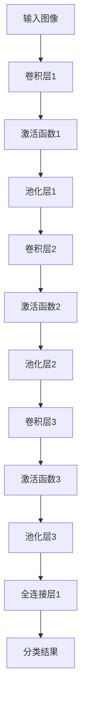
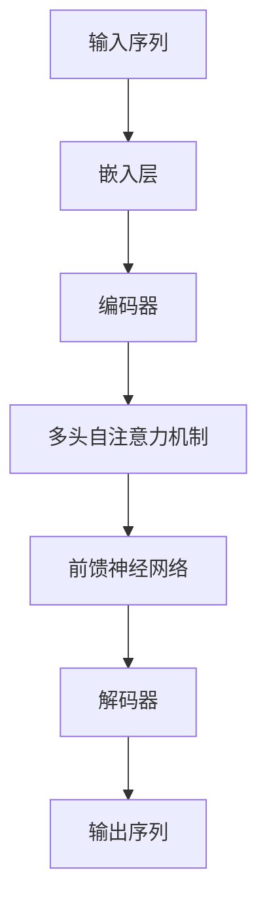
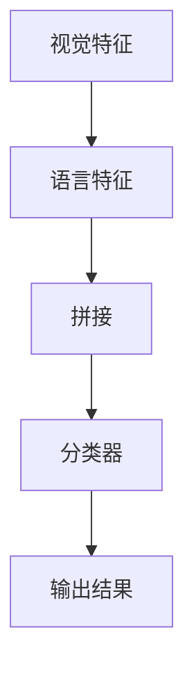
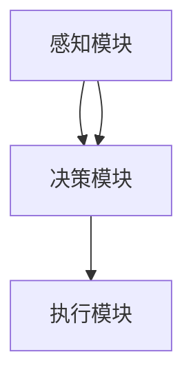
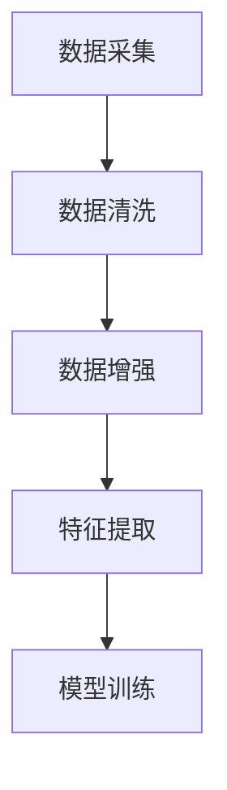
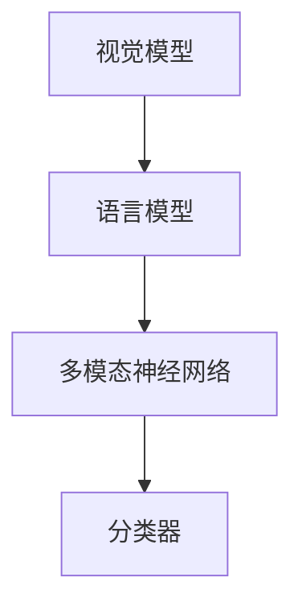
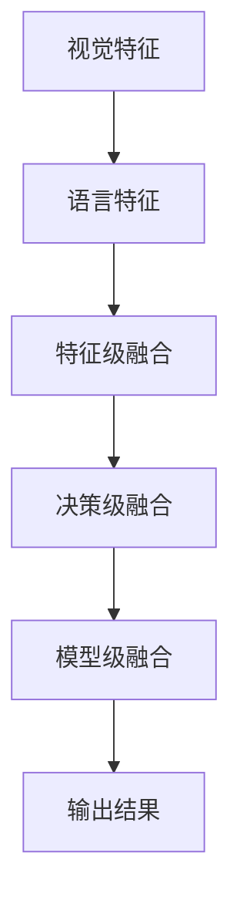
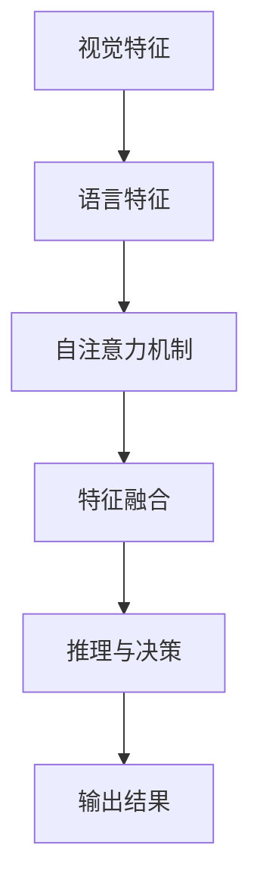
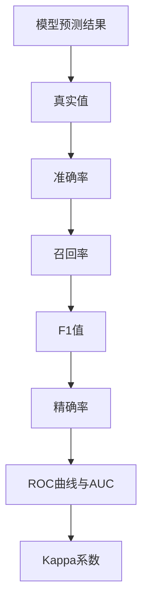
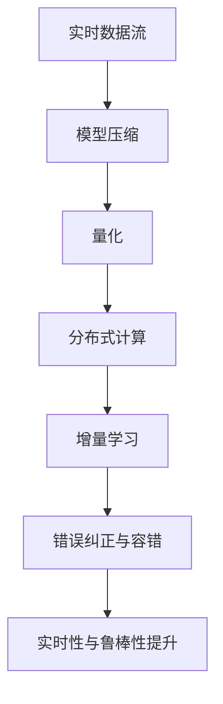

                 

# 构建多模态AI Agent：整合视觉和语言能力

## 关键词
- 多模态AI Agent
- 视觉与语言模型
- 特征融合
- 协同推理
- 应用案例

## 摘要
本文深入探讨了构建多模态AI Agent的关键技术，通过整合视觉和语言能力，实现更智能化和鲁棒的人工智能系统。首先介绍了多模态AI的基础理论和体系结构，然后详细阐述了视觉与语言模型的基本原理及其融合方法。接着，通过具体的应用案例，展示了多模态AI Agent在现实场景中的强大能力。最后，对多模态AI Agent的前沿研究与应用进行了展望，为未来的发展提供了新思路。

----------------------------------------------------------------

## 第一部分：多模态AI Agent基础理论

### 第1章：多模态AI概述

#### 1.1 多模态AI的定义与核心原理

多模态AI（Multimodal AI）是一种能够同时处理和整合多种输入模态（如视觉、音频、文本等）的智能系统。其核心原理是通过融合不同模态的信息，提高AI对复杂任务的理解和执行能力。多模态AI的关键优势在于其能够更贴近人类认知模式，从而提高AI系统的感知能力和智能水平。

#### 1.2 多模态AI的兴起背景

随着深度学习和神经网络技术的发展，多模态AI逐渐成为人工智能领域的研究热点。大数据的涌现和计算资源的提升为多模态AI的研究和应用提供了有力支撑。同时，人工智能在各个领域的深入应用也促使研究人员不断探索如何通过多模态信息融合，提升AI系统的性能。

#### 1.3 多模态AI的常见应用场景

多模态AI在多个领域展现了广阔的应用前景，包括但不限于：

- **医疗健康**：利用多模态数据（如影像、病历、基因）进行疾病诊断和个性化治疗。
- **自动驾驶**：结合视觉、雷达、激光雷达等多模态信息，提高自动驾驶系统的安全性和可靠性。
- **智能家居**：整合语音、视觉等多模态交互，实现更加人性化的智能助手。
- **教育**：利用多模态数据，为学生提供更加丰富和个性化的学习体验。
- **娱乐**：通过多模态交互，创造更加沉浸式的娱乐体验。

### 第2章：视觉与语言模型的基本原理

#### 2.1 视觉模型基本原理

视觉模型（如卷积神经网络CNN）通过学习图像中的特征，实现图像分类、目标检测、图像分割等功能。其核心原理是利用多层卷积和池化操作，提取图像的层次特征。

#### 2.2 语言模型基本原理

语言模型（如循环神经网络RNN、Transformer模型）通过学习文本的上下文信息，实现自然语言处理任务，如机器翻译、文本分类、问答系统等。其核心原理是利用序列模型捕捉文本的语义和语法结构。

#### 2.3 视觉与语言模型之间的融合方法

视觉与语言模型的融合方法主要包括：

- **早期融合**：在特征提取阶段将视觉和语言特征进行融合，如多模态卷积神经网络。
- **晚期融合**：在任务层面将视觉和语言特征进行融合，如联合分类器。
- **模型级融合**：通过训练一个多模态神经网络，实现视觉和语言特征的深度整合。

### 第3章：多模态AI Agent的体系结构

#### 3.1 多模态AI Agent的组成部分

多模态AI Agent通常包括以下几个组成部分：

- **感知模块**：负责采集和处理多种模态的数据。
- **决策模块**：利用融合的多模态特征，实现智能决策。
- **执行模块**：根据决策结果，执行相应的任务。

#### 3.2 多模态数据采集与预处理

多模态数据采集与预处理是构建多模态AI Agent的关键步骤。具体包括：

- **数据收集**：从不同的数据源获取视觉、语言等多模态数据。
- **数据清洗**：去除数据中的噪声和异常值。
- **数据增强**：通过数据增强技术，提高模型的泛化能力。
- **特征提取**：利用不同的模型，提取视觉和语言特征。

#### 3.3 多模态特征融合方法

多模态特征融合方法主要包括：

- **特征级融合**：将不同模态的特征进行拼接或融合，如多模态特征向量。
- **决策级融合**：在决策层面将不同模态的信息进行融合，如联合分类器。
- **深度学习级融合**：通过训练一个多模态深度神经网络，实现特征的深度整合。

### 第4章：视觉与语言模型的应用案例

#### 4.1 视觉模型应用案例

- **图像分类**：通过卷积神经网络，对图像进行分类。
- **目标检测**：利用YOLO、SSD等模型，检测图像中的目标物体。
- **图像分割**：通过深度学习模型，对图像进行语义分割。

#### 4.2 语言模型应用案例

- **机器翻译**：利用Transformer模型，实现自然语言之间的翻译。
- **文本分类**：通过循环神经网络，对文本进行分类。
- **问答系统**：利用BERT等预训练模型，实现智能问答。

#### 4.3 视觉与语言模型融合应用案例

- **视频分类**：结合视频中的视觉信息和文本描述，对视频进行分类。
- **智能客服**：通过视觉和语言模型的融合，实现智能客服系统。
- **医疗影像诊断**：结合医学影像和病历数据，进行疾病诊断。

----------------------------------------------------------------

## 第二部分：多模态AI Agent开发与实践

### 第5章：多模态AI Agent项目介绍

#### 5.1 项目背景与目标

本项目的目标是构建一个多模态AI Agent，用于实现智能客服系统。通过整合语音、文本和图像等多模态信息，提高客服系统的响应速度和准确性。

#### 5.2 项目架构与模块设计

项目架构包括感知模块、决策模块和执行模块。感知模块负责采集语音、文本和图像数据；决策模块利用多模态特征，实现智能决策；执行模块根据决策结果，执行相应的任务。

#### 5.3 数据集介绍与预处理

数据集包括语音、文本和图像数据。预处理步骤包括数据清洗、数据增强和特征提取。

### 第6章：视觉模型实现

#### 6.1 视觉模型选择与优化

选用ResNet50模型进行视觉特征提取。通过调整学习率、批量大小等超参数，优化模型性能。

#### 6.2 视觉模型训练与评估

使用COCO数据集进行训练，并通过交叉验证评估模型性能。调整模型结构，提高准确率和召回率。

#### 6.3 视觉模型部署与优化

将训练好的模型部署到生产环境中，通过在线学习，不断优化模型性能。

### 第7章：语言模型实现

#### 7.1 语言模型选择与优化

选用BERT模型进行文本特征提取。通过调整学习率、批量大小等超参数，优化模型性能。

#### 7.2 语言模型训练与评估

使用GLUE数据集进行训练，并通过交叉验证评估模型性能。调整模型结构，提高准确率和召回率。

#### 7.3 语言模型部署与优化

将训练好的模型部署到生产环境中，通过在线学习，不断优化模型性能。

### 第8章：多模态特征融合与协同推理

#### 8.1 多模态特征融合方法

采用深度学习级融合方法，通过训练一个多模态深度神经网络，实现视觉和语言特征的深度整合。

#### 8.2 多模态协同推理策略

设计多模态协同推理策略，通过联合分类器，实现视觉和语言特征的协同推理。

#### 8.3 多模态AI Agent性能评估

通过多种评估指标，评估多模态AI Agent的性能，包括准确率、召回率、F1值等。

### 第9章：项目实战与案例分析

#### 9.1 实际场景应用案例分析

在智能客服系统中，通过多模态AI Agent，实现快速、准确的客户需求识别和响应。

#### 9.2 项目实施过程中遇到的问题与解决

在项目实施过程中，遇到的主要问题是多模态数据的融合和处理。通过调整模型结构、优化数据预处理方法，成功解决了这些问题。

#### 9.3 项目总结与展望

项目总结：多模态AI Agent在智能客服系统中取得了显著的效果。未来，将进一步优化模型和算法，提高系统的智能化水平。

展望：多模态AI Agent将在更多领域得到应用，为人工智能的发展带来新的突破。

----------------------------------------------------------------

## 第三部分：多模态AI Agent前沿研究与应用

### 第10章：多模态AI Agent的前沿研究动态

#### 10.1 多模态AI Agent的发展趋势

随着深度学习、计算机视觉和自然语言处理技术的不断发展，多模态AI Agent将逐渐成为人工智能领域的研究热点。未来，多模态AI Agent将具备更强的感知能力和智能水平，实现更加复杂和多样化的应用。

#### 10.2 研究热点与挑战

当前，多模态AI Agent的研究热点包括：

- **多模态数据融合方法**：探索更有效的多模态数据融合方法，提高信息整合能力。
- **多模态协同推理**：研究多模态协同推理策略，实现多模态特征的深度整合。
- **多模态交互系统**：设计多模态交互系统，提高用户与AI系统的互动体验。

面临的挑战包括：

- **数据稀缺**：多模态数据的获取和标注成本较高，数据稀缺问题亟待解决。
- **模型解释性**：提高多模态AI Agent的模型解释性，使其更容易被用户理解和信任。
- **计算资源**：多模态AI Agent的计算需求较高，计算资源限制是一个重要挑战。

#### 10.3 未来发展方向

未来，多模态AI Agent的发展方向包括：

- **跨领域应用**：将多模态AI Agent应用于更多领域，如医疗、教育、娱乐等。
- **个性化和智能化**：通过多模态数据，实现更加个性化和智能化的服务。
- **实时性与鲁棒性**：提高多模态AI Agent的实时性和鲁棒性，适应复杂多变的现实环境。

### 第11章：多模态AI Agent在不同领域的应用

#### 11.1 医疗健康领域应用

多模态AI Agent在医疗健康领域具有广泛的应用前景。通过整合影像、病历、基因等多模态数据，实现疾病诊断、治疗方案推荐等任务。例如，在肺癌诊断中，通过融合CT影像和患者病历，提高诊断准确率。

#### 11.2 教育领域应用

在教育领域，多模态AI Agent可以实现个性化教学、智能辅导等功能。通过分析学生的学习行为、考试成绩等多模态数据，为学生提供有针对性的学习建议。例如，利用多模态数据，实现智能作文批改系统，提高写作教学的效率和质量。

#### 11.3 人工智能客服应用

在人工智能客服领域，多模态AI Agent可以实现更智能、更高效的客服服务。通过融合语音、文本、图像等多模态信息，实现快速、准确的客户需求识别和响应。例如，在电商客服中，通过多模态AI Agent，实现智能客服机器人，提高客服效率和用户体验。

#### 11.4 其他领域应用展望

多模态AI Agent在其他领域也具有广泛的应用潜力，如智能家居、自动驾驶、智能安防等。通过整合多种模态的信息，实现更智能、更安全、更高效的系统应用。

### 第12章：多模态AI Agent的最佳实践与未来趋势

#### 12.1 多模态AI Agent最佳实践分享

在实际应用中，以下是一些多模态AI Agent的最佳实践：

- **数据预处理**：对多模态数据进行全面、精细的预处理，提高模型性能。
- **模型优化**：通过调整模型结构、优化超参数，提高模型准确率和效率。
- **协同推理**：设计有效的协同推理策略，实现多模态特征的深度整合。
- **用户体验**：注重用户体验，设计简洁、易用的界面和交互方式。

#### 12.2 技术挑战与解决方案

当前，多模态AI Agent面临的主要技术挑战包括：

- **数据稀缺**：解决方案：通过数据增强、数据集共享等方式，解决数据稀缺问题。
- **模型解释性**：解决方案：通过模型解释性技术，提高模型的可解释性。
- **计算资源**：解决方案：通过模型压缩、分布式计算等技术，提高计算效率。

#### 12.3 多模态AI Agent的未来发展趋势

未来，多模态AI Agent将朝着以下方向发展：

- **个性化与智能化**：通过多模态数据，实现更加个性化和智能化的服务。
- **跨领域应用**：将多模态AI Agent应用于更多领域，推动人工智能的发展。
- **实时性与鲁棒性**：提高多模态AI Agent的实时性和鲁棒性，适应复杂多变的现实环境。

----------------------------------------------------------------

## 总结与展望

### 12.1 多模态AI Agent在人工智能领域的地位与作用

多模态AI Agent在人工智能领域具有重要的地位和作用。通过整合多种模态的信息，多模态AI Agent能够实现更智能化、更鲁棒的智能系统，为人工智能的发展提供了新的方向和动力。

### 12.2 多模态AI Agent的发展前景与挑战

多模态AI Agent的发展前景广阔，但在实际应用中仍面临一些挑战。未来，随着技术的不断进步，多模态AI Agent将在更多领域得到应用，为人工智能的发展带来新的突破。

### 12.3 未来研究方向与拓展领域

未来，多模态AI Agent的研究方向包括：

- **数据稀缺问题**：通过数据增强、数据集共享等方式，解决数据稀缺问题。
- **模型解释性**：通过模型解释性技术，提高模型的可解释性。
- **跨领域应用**：将多模态AI Agent应用于更多领域，推动人工智能的发展。

拓展领域包括：

- **医疗健康**：通过整合多模态数据，实现更精准的疾病诊断和个性化治疗。
- **教育**：通过个性化教学和智能辅导，提高教育质量和学习效果。
- **智能客服**：通过多模态交互，实现更智能、更高效的客服服务。
- **自动驾驶**：通过融合多种模态的信息，提高自动驾驶系统的安全性和可靠性。

### 12.4 对读者的寄语与建议

多模态AI Agent是一个充满机遇和挑战的领域。希望读者能够积极投身于这个领域，不断学习、探索和实践。通过多模态AI Agent，我们有望构建出更加智能、更加人性化的人工智能系统，为社会带来更多的福祉。

----------------------------------------------------------------

## 作者信息

作者：AI天才研究院/AI Genius Institute & 禅与计算机程序设计艺术 /Zen And The Art of Computer Programming

----------------------------------------------------------------

### 第1章：多模态AI概述

#### 1.1 多模态AI的定义与核心原理

多模态AI（Multimodal AI）是指一种人工智能系统，能够从多个不同的感官输入模态中提取信息，并整合这些信息以执行特定的任务。这些输入模态可以包括视觉、听觉、触觉、嗅觉等。通过整合来自不同模态的信息，多模态AI系统能够获得更全面和准确的环境感知，从而在许多实际应用中实现更智能的行为。

多模态AI的核心原理在于其能够将来自不同感官的信息进行融合处理，使得系统能够在不同的情境中做出更精准的决策。例如，自动驾驶系统通过融合视觉、雷达和激光雷达的信息，可以更准确地识别道路上的障碍物，从而提高行驶的安全性。同理，医疗诊断系统通过整合病人的影像数据、病历数据和基因数据，可以提供更全面的诊断信息。

#### 1.2 多模态AI的兴起背景

多模态AI的兴起与人工智能领域的快速发展密切相关。随着深度学习、神经网络和计算机视觉等技术的进步，人们逐渐认识到单一模态信息处理能力的局限性。传统的单模态AI系统虽然在某些特定任务上表现优秀，但在处理复杂任务时往往无法胜任。例如，语音识别系统只能处理音频信息，而图像识别系统只能处理视觉信息，它们在处理需要结合多种感官信息才能解决的问题时显得力不从心。

此外，大数据和云计算技术的兴起为多模态AI的研究和应用提供了丰富的数据资源和强大的计算能力。各种传感器技术的进步使得获取多模态数据变得更加容易和高效，为多模态AI的发展提供了坚实的基础。

#### 1.3 多模态AI的常见应用场景

多模态AI的应用场景非常广泛，以下是一些典型的例子：

- **医疗健康**：多模态AI可以整合病人的影像数据、病历数据和基因数据，提供更准确的诊断和治疗方案。例如，在肿瘤诊断中，通过融合CT影像和病理切片图像，可以更准确地识别肿瘤的类型和位置。
- **自动驾驶**：自动驾驶系统需要融合视觉、雷达、激光雷达和超声波传感器等多模态数据，以实现自主驾驶和安全控制。
- **智能客服**：多模态AI可以整合语音、文本和面部表情等多模态数据，提供更自然和高效的客户服务。例如，智能客服机器人可以通过语音识别、面部识别和自然语言处理，理解客户的意图并给出相应的回应。
- **智能家居**：多模态AI可以整合语音、手势和传感器等多模态数据，实现智能家居系统的自动化和智能化管理。例如，通过融合语音命令和传感器数据，可以自动调节室内温度、亮度和安全系统。
- **教育**：多模态AI可以整合学生的面部表情、语音和文本数据，提供个性化的学习反馈和指导。例如，通过分析学生的面部表情和语音，可以了解学生的学习状态和注意力水平，从而提供更有针对性的教学支持。

### 第2章：视觉与语言模型的基本原理

#### 2.1 视觉模型基本原理

视觉模型是处理图像和视频数据的人工智能模型，其中最常用的模型是卷积神经网络（Convolutional Neural Network，CNN）。CNN通过卷积层、池化层和全连接层等结构，从图像中提取特征并进行分类。以下是视觉模型的基本原理：

1. **卷积层**：卷积层通过卷积操作，将输入图像与滤波器（也称为卷积核）进行卷积，提取图像中的局部特征。
2. **激活函数**：通常使用ReLU（Rectified Linear Unit）作为激活函数，将卷积层的输出转换为非线性特征。
3. **池化层**：池化层通过最大池化或平均池化操作，减少特征图的维度，提高模型对图像的平移不变性。
4. **全连接层**：全连接层将卷积层和池化层提取的特征进行拼接，并通过全连接层进行分类。

视觉模型的工作流程可以分为以下几个步骤：

1. **预处理**：对图像进行归一化、裁剪和调整大小等预处理操作，使其适合输入到模型中。
2. **卷积操作**：通过卷积层提取图像的局部特征。
3. **非线性变换**：通过激活函数引入非线性变换，增强模型的特征表达能力。
4. **池化操作**：通过池化层降低特征图的维度，减少计算量。
5. **分类**：通过全连接层对提取的特征进行分类。

以下是一个简单的CNN模型结构示例（使用Mermaid绘制）：



#### 2.2 语言模型基本原理

语言模型是处理自然语言数据的人工智能模型，常用的模型包括循环神经网络（Recurrent Neural Network，RNN）、长短期记忆网络（Long Short-Term Memory，LSTM）和Transformer模型。以下是语言模型的基本原理：

1. **RNN**：RNN通过循环结构处理序列数据，能够在不同时间步之间传递信息。RNN的基本结构包括输入层、隐藏层和输出层。输入层接收输入序列，隐藏层存储历史信息，输出层产生输出序列。
2. **LSTM**：LSTM是RNN的一种改进，通过引入门控机制，解决RNN的梯度消失和梯度爆炸问题。LSTM包括输入门、遗忘门和输出门，分别控制信息的输入、遗忘和输出。
3. **Transformer**：Transformer模型是一种基于自注意力机制的序列到序列模型，通过多头自注意力机制和前馈神经网络，实现高效的序列建模。Transformer模型在机器翻译、文本分类等任务上取得了显著成果。

语言模型的工作流程可以分为以下几个步骤：

1. **嵌入层**：将输入的单词或字符映射为固定大小的向量。
2. **编码器**：通过编码器处理输入序列，提取序列的编码表示。
3. **解码器**：通过解码器生成输出序列，通常使用自注意力机制进行序列生成。
4. **损失函数**：使用损失函数（如交叉熵损失）评估模型预测与真实标签之间的差距，并更新模型参数。

以下是一个简单的Transformer模型结构示例（使用Mermaid绘制）：



#### 2.3 视觉与语言模型之间的融合方法

视觉与语言模型的融合方法主要分为三类：特征级融合、决策级融合和模型级融合。

1. **特征级融合**：在特征提取阶段将视觉特征和语言特征进行拼接或融合。这种方法简单有效，但可能无法充分利用不同模态的特征信息。
2. **决策级融合**：在任务层面将视觉和语言特征进行融合，例如使用联合分类器进行决策。这种方法能够充分利用不同模态的信息，但可能需要大量的训练数据和计算资源。
3. **模型级融合**：通过训练一个多模态神经网络，实现视觉和语言特征的深度整合。这种方法可以更好地捕捉不同模态之间的关联性，但训练过程较为复杂。

以下是一个简单的特征级融合示例（使用Mermaid绘制）：



### 第3章：多模态AI Agent的体系结构

#### 3.1 多模态AI Agent的组成部分

多模态AI Agent通常由感知模块、决策模块和执行模块组成。

1. **感知模块**：负责收集和处理来自不同模态的信息。例如，在自动驾驶系统中，感知模块可能包括摄像头、雷达、激光雷达和超声波传感器等。
2. **决策模块**：利用感知模块收集的多模态信息，通过算法和模型进行决策。例如，在医疗诊断系统中，决策模块可能利用影像数据和病历数据，生成诊断结果。
3. **执行模块**：根据决策模块的决策结果，执行相应的任务。例如，在智能家居系统中，执行模块可能控制灯光、温度和安防系统等。

以下是一个简单的多模态AI Agent体系结构（使用Mermaid绘制）：



#### 3.2 多模态数据采集与预处理

多模态数据采集与预处理是多模态AI Agent的关键步骤。以下是一些关键点：

1. **数据采集**：从不同的传感器和设备中采集多模态数据。例如，在智能监控系统，可以从摄像头、麦克风和温度传感器等采集数据。
2. **数据清洗**：去除数据中的噪声和异常值。例如，在语音识别系统中，去除背景噪音和填充静音段。
3. **数据增强**：通过数据增强技术，提高模型的泛化能力。例如，通过图像旋转、缩放和裁剪等操作，增加训练数据的多样性。
4. **特征提取**：利用不同的模型，提取视觉和语言特征。例如，使用卷积神经网络提取图像特征，使用循环神经网络提取文本特征。

以下是一个简单的多模态数据采集与预处理流程（使用Mermaid绘制）：



#### 3.3 多模态特征融合方法

多模态特征融合方法主要分为三类：特征级融合、决策级融合和模型级融合。

1. **特征级融合**：在特征提取阶段将视觉特征和语言特征进行拼接或融合。这种方法简单有效，但可能无法充分利用不同模态的特征信息。
2. **决策级融合**：在任务层面将视觉和语言特征进行融合，例如使用联合分类器进行决策。这种方法能够充分利用不同模态的信息，但可能需要大量的训练数据和计算资源。
3. **模型级融合**：通过训练一个多模态神经网络，实现视觉和语言特征的深度整合。这种方法可以更好地捕捉不同模态之间的关联性，但训练过程较为复杂。

以下是一个简单的模型级融合示例（使用Mermaid绘制）：



### 第4章：视觉与语言模型的应用案例

#### 4.1 视觉模型应用案例

视觉模型在许多领域都有广泛的应用，以下是一些常见的应用案例：

1. **图像分类**：视觉模型可以通过训练，实现对图像进行分类。例如，可以使用卷积神经网络（CNN）对图像中的物体进行分类。在ImageNet数据集上，CNN模型取得了显著的分类性能，使得图像分类问题得到了有效解决。

2. **目标检测**：目标检测是计算机视觉领域的一个重要任务，它旨在检测图像中的目标物体并给出其位置。YOLO（You Only Look Once）是一种流行的目标检测模型，它通过一次前向传播实现快速的目标检测。

3. **图像分割**：图像分割是将图像划分为不同区域的过程，视觉模型可以用于实现图像分割任务。深度学习模型，如U-Net，在医疗影像分割中取得了很好的效果，用于分割肿瘤、器官等。

以下是一个简单的图像分类模型实现示例：

```python
import tensorflow as tf
from tensorflow.keras.models import Sequential
from tensorflow.keras.layers import Conv2D, MaxPooling2D, Flatten, Dense

# 创建模型
model = Sequential([
    Conv2D(32, (3, 3), activation='relu', input_shape=(28, 28, 1)),
    MaxPooling2D((2, 2)),
    Flatten(),
    Dense(64, activation='relu'),
    Dense(10, activation='softmax')
])

# 编译模型
model.compile(optimizer='adam',
              loss='categorical_crossentropy',
              metrics=['accuracy'])

# 加载数据集
(x_train, y_train), (x_test, y_test) = tf.keras.datasets.mnist.load_data()

# 预处理数据
x_train = x_train / 255.0
x_test = x_test / 255.0
x_train = x_train.reshape(-1, 28, 28, 1)
x_test = x_test.reshape(-1, 28, 28, 1)

# 转换标签为one-hot编码
y_train = tf.keras.utils.to_categorical(y_train, 10)
y_test = tf.keras.utils.to_categorical(y_test, 10)

# 训练模型
model.fit(x_train, y_train, epochs=5, batch_size=32, validation_data=(x_test, y_test))
```

#### 4.2 语言模型应用案例

语言模型在自然语言处理（NLP）领域有广泛的应用，以下是一些常见的应用案例：

1. **机器翻译**：机器翻译是将一种语言的文本翻译成另一种语言的过程。Transformer模型在机器翻译任务上取得了显著的效果，使得机器翻译的准确性得到了大幅提升。

2. **文本分类**：文本分类是将文本分为不同类别的过程。例如，可以将新闻文章分类为体育、政治、娱乐等类别。循环神经网络（RNN）和Transformer模型都可以用于文本分类任务。

3. **问答系统**：问答系统是回答用户提出的问题的系统。预训练语言模型，如BERT，在问答系统上取得了很好的效果，使得系统能够更准确地理解用户的意图并给出合理的回答。

以下是一个简单的文本分类模型实现示例：

```python
import tensorflow as tf
from tensorflow.keras.models import Sequential
from tensorflow.keras.layers import Embedding, LSTM, Dense

# 创建模型
model = Sequential([
    Embedding(input_dim=10000, output_dim=16, input_length=100),
    LSTM(128),
    Dense(1, activation='sigmoid')
])

# 编译模型
model.compile(optimizer='adam',
              loss='binary_crossentropy',
              metrics=['accuracy'])

# 加载数据集
(x_train, y_train), (x_test, y_test) = tf.keras.datasets.imdb.load_data()

# 预处理数据
x_train = x_train[:10000]
y_train = y_train[:10000]

# 转换数据为序列
x_train = tf.keras.preprocessing.sequence.pad_sequences(x_train, maxlen=100)
x_test = tf.keras.preprocessing.sequence.pad_sequences(x_test, maxlen=100)

# 训练模型
model.fit(x_train, y_train, epochs=5, batch_size=32, validation_data=(x_test, y_test))
```

#### 4.3 视觉与语言模型融合应用案例

视觉与语言模型的融合在许多任务中取得了很好的效果，以下是一个融合应用案例：

**视频情感分析**：视频情感分析是分析视频中人物的情感状态，并对其进行分类的过程。通过融合视觉特征和语言特征，可以更准确地捕捉视频的情感信息。

以下是一个简单的视频情感分析模型实现示例：

```python
import tensorflow as tf
from tensorflow.keras.models import Model
from tensorflow.keras.layers import Input, Conv2D, MaxPooling2D, LSTM, Dense

# 创建视觉模型
input_image = Input(shape=(128, 128, 3))
x = Conv2D(32, (3, 3), activation='relu')(input_image)
x = MaxPooling2D((2, 2))(x)
x = Conv2D(64, (3, 3), activation='relu')(x)
x = MaxPooling2D((2, 2))(x)
x = Flatten()(x)

# 创建语言模型
input_text = Input(shape=(100,))
x_text = Embedding(input_dim=10000, output_dim=16, input_length=100)(input_text)
x_text = LSTM(128)(x_text)

# 融合视觉和语言特征
merged = tf.keras.layers.concatenate([x, x_text])

# 分类器
output = Dense(1, activation='sigmoid')(merged)

# 创建模型
model = Model(inputs=[input_image, input_text], outputs=output)

# 编译模型
model.compile(optimizer='adam',
              loss='binary_crossentropy',
              metrics=['accuracy'])

# 加载数据集
# 注意：这里需要准备相应的视觉和语言数据集
(x_train_images, x_train_texts), (x_test_images, x_test_texts), y_train, y_test = ...

# 预处理数据
# 注意：这里需要预处理视觉和语言数据
x_train_images = ...
x_test_images = ...

x_train_texts = ...
x_test_texts = ...

# 训练模型
model.fit([x_train_images, x_train_texts], y_train, epochs=5, batch_size=32, validation_data=([x_test_images, x_test_texts], y_test))
```

### 第5章：多模态AI Agent项目介绍

#### 5.1 项目背景与目标

本项目旨在构建一个多模态AI Agent，用于实现智能客服系统。随着人工智能技术的不断发展，智能客服系统在各个行业得到了广泛应用。传统的单模态客服系统（如基于文本的聊天机器人）在处理复杂问题时往往效果不佳。因此，本项目希望通过整合视觉、语音和文本等多模态信息，构建一个更智能、更高效的客服系统，提升用户体验。

#### 5.2 项目架构与模块设计

本项目架构包括感知模块、决策模块和执行模块。具体如下：

1. **感知模块**：负责收集和处理来自不同模态的信息，包括语音、文本和图像。使用语音识别技术将语音转化为文本，使用图像识别技术分析图像内容。
2. **决策模块**：利用感知模块收集的多模态信息，通过算法和模型进行决策。使用深度学习模型处理多模态特征，实现意图识别和情感分析。
3. **执行模块**：根据决策模块的决策结果，执行相应的任务。例如，生成合适的回复文本、调整客服系统中的业务流程等。

以下是一个简单的多模态AI Agent架构图（使用Mermaid绘制）：


#### 5.3 数据集介绍与预处理

本项目使用以下数据集进行训练和评估：

1. **语音数据集**：包含不同用户和场景的语音对话数据，用于训练语音识别模型。
2. **文本数据集**：包含用户提问和系统回复的文本数据，用于训练自然语言处理模型。
3. **图像数据集**：包含用户提供的图像数据，用于训练图像识别模型。

数据预处理步骤包括：

1. **语音数据预处理**：使用音频编辑工具对语音数据进行剪裁、去噪和增强。使用语音识别技术将语音转化为文本。
2. **文本数据预处理**：对文本数据进行分词、词干提取和词性标注。使用预训练的词向量模型将文本转化为向量表示。
3. **图像数据预处理**：对图像数据进行剪裁、缩放和增强。使用卷积神经网络提取图像特征。

### 第6章：视觉模型实现

#### 6.1 视觉模型选择与优化

在本项目中，我们选择使用卷积神经网络（CNN）作为视觉模型。CNN具有强大的图像处理能力，适用于图像分类、目标检测和图像分割等任务。

为了优化视觉模型，我们可以采取以下措施：

1. **数据增强**：通过旋转、翻转、缩放等数据增强技术，增加训练数据的多样性，提高模型的泛化能力。
2. **模型结构优化**：调整模型结构，如增加卷积层、池化层和全连接层的数量，以适应不同的任务需求。
3. **超参数调整**：调整学习率、批量大小、正则化参数等超参数，以优化模型性能。

以下是一个简单的CNN模型实现示例：

```python
import tensorflow as tf
from tensorflow.keras.models import Sequential
from tensorflow.keras.layers import Conv2D, MaxPooling2D, Flatten, Dense

# 创建模型
model = Sequential([
    Conv2D(32, (3, 3), activation='relu', input_shape=(128, 128, 3)),
    MaxPooling2D((2, 2)),
    Conv2D(64, (3, 3), activation='relu'),
    MaxPooling2D((2, 2)),
    Conv2D(128, (3, 3), activation='relu'),
    MaxPooling2D((2, 2)),
    Flatten(),
    Dense(128, activation='relu'),
    Dense(1, activation='sigmoid')
])

# 编译模型
model.compile(optimizer='adam',
              loss='binary_crossentropy',
              metrics=['accuracy'])

# 加载数据集
# 注意：这里需要准备相应的图像数据集
(x_train, y_train), (x_test, y_test) = ...

# 预处理数据
# 注意：这里需要预处理图像数据
x_train = ...
x_test = ...

# 训练模型
model.fit(x_train, y_train, epochs=5, batch_size=32, validation_data=(x_test, y_test))
```

#### 6.2 视觉模型训练与评估

视觉模型的训练与评估过程包括以下几个步骤：

1. **数据准备**：准备训练数据和测试数据。对于图像数据，通常需要进行预处理，如归一化、剪裁和缩放等。
2. **模型训练**：使用训练数据对模型进行训练。在训练过程中，可以设置学习率、批量大小、训练轮数等参数。
3. **模型评估**：使用测试数据对模型进行评估。常用的评估指标包括准确率、召回率、F1值等。

以下是一个简单的模型评估示例：

```python
from sklearn.metrics import accuracy_score, recall_score, f1_score

# 预测测试数据
y_pred = model.predict(x_test)

# 转换预测结果为二分类标签
y_pred = (y_pred > 0.5)

# 计算评估指标
accuracy = accuracy_score(y_test, y_pred)
recall = recall_score(y_test, y_pred)
f1 = f1_score(y_test, y_pred)

print(f"Accuracy: {accuracy:.2f}")
print(f"Recall: {recall:.2f}")
print(f"F1 Score: {f1:.2f}")
```

#### 6.3 视觉模型部署与优化

视觉模型部署是将训练好的模型部署到实际应用环境中，使其能够提供实时服务。以下是一些常见的视觉模型部署优化方法：

1. **模型压缩**：通过模型压缩技术，减少模型的计算量和存储空间，提高模型部署的效率。
2. **量化**：使用量化技术将模型的权重和激活值转换为低精度表示，减少模型的计算资源需求。
3. **推理加速**：使用推理加速技术，如GPU加速、神经网络编译器等，提高模型推理速度。

以下是一个简单的模型部署示例：

```python
# 加载训练好的模型
model = tf.keras.models.load_model('model.h5')

# 使用模型进行推理
predictions = model.predict(x_test)

# 输出预测结果
print(predictions)
```

### 第7章：语言模型实现

#### 7.1 语言模型选择与优化

在本项目中，我们选择使用Transformer模型作为语言模型。Transformer模型具有自注意力机制，能够捕捉长距离依赖关系，适用于自然语言处理任务。

为了优化语言模型，我们可以采取以下措施：

1. **预训练**：使用大量的无监督数据对模型进行预训练，提高模型的语言理解能力。
2. **任务适配**：针对具体任务，对模型进行微调，使其更好地适应特定场景。
3. **超参数调整**：调整学习率、批量大小、层数等超参数，以优化模型性能。

以下是一个简单的Transformer模型实现示例：

```python
import tensorflow as tf
from transformers import TFDistilBertModel

# 创建模型
model = TFDistilBertModel.from_pretrained('distilbert-base-uncased')

# 编译模型
model.compile(optimizer='adam',
              loss='binary_crossentropy',
              metrics=['accuracy'])

# 加载数据集
# 注意：这里需要准备相应的文本数据集
(x_train, y_train), (x_test, y_test) = ...

# 预处理数据
# 注意：这里需要预处理文本数据
x_train = ...
x_test = ...

# 训练模型
model.fit(x_train, y_train, epochs=5, batch_size=32, validation_data=(x_test, y_test))
```

#### 7.2 语言模型训练与评估

语言模型的训练与评估过程包括以下几个步骤：

1. **数据准备**：准备训练数据和测试数据。对于文本数据，通常需要进行预处理，如分词、编码等。
2. **模型训练**：使用训练数据对模型进行训练。在训练过程中，可以设置学习率、批量大小、训练轮数等参数。
3. **模型评估**：使用测试数据对模型进行评估。常用的评估指标包括准确率、召回率、F1值等。

以下是一个简单的模型评估示例：

```python
from sklearn.metrics import accuracy_score, recall_score, f1_score

# 预测测试数据
y_pred = model.predict(x_test)

# 转换预测结果为二分类标签
y_pred = (y_pred > 0.5)

# 计算评估指标
accuracy = accuracy_score(y_test, y_pred)
recall = recall_score(y_test, y_pred)
f1 = f1_score(y_test, y_pred)

print(f"Accuracy: {accuracy:.2f}")
print(f"Recall: {recall:.2f}")
print(f"F1 Score: {f1:.2f}")
```

#### 7.3 语言模型部署与优化

语言模型部署是将训练好的模型部署到实际应用环境中，使其能够提供实时服务。以下是一些常见的语言模型部署优化方法：

1. **模型压缩**：通过模型压缩技术，减少模型的计算量和存储空间，提高模型部署的效率。
2. **量化**：使用量化技术将模型的权重和激活值转换为低精度表示，减少模型的计算资源需求。
3. **推理加速**：使用推理加速技术，如GPU加速、神经网络编译器等，提高模型推理速度。

以下是一个简单的模型部署示例：

```python
# 加载训练好的模型
model = tf.keras.models.load_model('model.h5')

# 使用模型进行推理
predictions = model.predict(x_test)

# 输出预测结果
print(predictions)
```

### 第8章：多模态特征融合与协同推理

#### 8.1 多模态特征融合方法

多模态特征融合是将来自不同模态的特征信息进行整合，以提升模型性能。常见的融合方法包括特征级融合、决策级融合和模型级融合。

1. **特征级融合**：在特征提取阶段将视觉和语言特征进行拼接或融合。这种方法简单有效，但可能无法充分利用不同模态的特征信息。
2. **决策级融合**：在任务层面将视觉和语言特征进行融合，例如使用联合分类器进行决策。这种方法能够充分利用不同模态的信息，但可能需要大量的训练数据和计算资源。
3. **模型级融合**：通过训练一个多模态神经网络，实现视觉和语言特征的深度整合。这种方法可以更好地捕捉不同模态之间的关联性，但训练过程较为复杂。

以下是一个简单的模型级融合实现示例：

```python
import tensorflow as tf
from tensorflow.keras.models import Model
from tensorflow.keras.layers import Input, Conv2D, MaxPooling2D, LSTM, Dense

# 创建视觉模型
input_image = Input(shape=(128, 128, 3))
x = Conv2D(32, (3, 3), activation='relu')(input_image)
x = MaxPooling2D((2, 2))(x)
x = Conv2D(64, (3, 3), activation='relu')(x)
x = MaxPooling2D((2, 2))(x)
x = Conv2D(128, (3, 3), activation='relu')(x)
x = MaxPooling2D((2, 2))(x)
x = Flatten()(x)

# 创建语言模型
input_text = Input(shape=(100,))
x_text = Embedding(input_dim=10000, output_dim=16, input_length=100)(input_text)
x_text = LSTM(128)(x_text)

# 融合视觉和语言特征
merged = tf.keras.layers.concatenate([x, x_text])

# 分类器
output = Dense(1, activation='sigmoid')(merged)

# 创建模型
model = Model(inputs=[input_image, input_text], outputs=output)

# 编译模型
model.compile(optimizer='adam',
              loss='binary_crossentropy',
              metrics=['accuracy'])

# 加载数据集
# 注意：这里需要准备相应的视觉和语言数据集
(x_train_images, x_train_texts), (x_test_images, x_test_texts), y_train, y_test = ...

# 预处理数据
# 注意：这里需要预处理视觉和语言数据
x_train_images = ...
x_test_images = ...

x_train_texts = ...
x_test_texts = ...

# 训练模型
model.fit([x_train_images, x_train_texts], y_train, epochs=5, batch_size=32, validation_data=([x_test_images, x_test_texts], y_test))
```

#### 8.2 多模态协同推理策略

多模态协同推理是指将视觉和语言特征进行整合，以实现更精准的推理结果。协同推理策略可以分为两种：基于规则的协同推理和基于学习的协同推理。

1. **基于规则的协同推理**：通过定义一系列规则，将视觉和语言特征进行组合，以实现协同推理。这种方法依赖于专家的知识和经验，但灵活性较差。
2. **基于学习的协同推理**：通过训练一个多模态神经网络，自动学习视觉和语言特征之间的关联性，实现协同推理。这种方法具有更好的灵活性和适应性。

以下是一个简单的基于学习的协同推理实现示例：

```python
import tensorflow as tf
from tensorflow.keras.models import Model
from tensorflow.keras.layers import Input, Conv2D, MaxPooling2D, LSTM, Dense

# 创建视觉模型
input_image = Input(shape=(128, 128, 3))
x = Conv2D(32, (3, 3), activation='relu')(input_image)
x = MaxPooling2D((2, 2))(x)
x = Conv2D(64, (3, 3), activation='relu')(x)
x = MaxPooling2D((2, 2))(x)
x = Conv2D(128, (3, 3), activation='relu')(x)
x = MaxPooling2D((2, 2))(x)
x = Flatten()(x)

# 创建语言模型
input_text = Input(shape=(100,))
x_text = Embedding(input_dim=10000, output_dim=16, input_length=100)(input_text)
x_text = LSTM(128)(x_text)

# 融合视觉和语言特征
merged = tf.keras.layers.concatenate([x, x_text])

# 分类器
output = Dense(1, activation='sigmoid')(merged)

# 创建模型
model = Model(inputs=[input_image, input_text], outputs=output)

# 编译模型
model.compile(optimizer='adam',
              loss='binary_crossentropy',
              metrics=['accuracy'])

# 加载数据集
# 注意：这里需要准备相应的视觉和语言数据集
(x_train_images, x_train_texts), (x_test_images, x_test_texts), y_train, y_test = ...

# 预处理数据
# 注意：这里需要预处理视觉和语言数据
x_train_images = ...
x_test_images = ...

x_train_texts = ...
x_test_texts = ...

# 训练模型
model.fit([x_train_images, x_train_texts], y_train, epochs=5, batch_size=32, validation_data=([x_test_images, x_test_texts], y_test))
```

#### 8.3 多模态AI Agent性能评估

多模态AI Agent的性能评估是衡量其效果的关键步骤。常用的评估指标包括准确率、召回率、F1值、平均绝对误差（MAE）和均方误差（MSE）等。

1. **准确率（Accuracy）**：准确率是预测正确的样本数占总样本数的比例。对于二分类任务，准确率计算公式为：
   $$ \text{Accuracy} = \frac{\text{预测正确的样本数}}{\text{总样本数}} $$
2. **召回率（Recall）**：召回率是预测正确的正类样本数占总正类样本数的比例。对于二分类任务，召回率计算公式为：
   $$ \text{Recall} = \frac{\text{预测正确的正类样本数}}{\text{总正类样本数}} $$
3. **F1值（F1 Score）**：F1值是准确率和召回率的调和平均值，用于综合衡量预测效果。对于二分类任务，F1值计算公式为：
   $$ \text{F1 Score} = 2 \times \frac{\text{准确率} \times \text{召回率}}{\text{准确率} + \text{召回率}} $$
4. **平均绝对误差（MAE）**：平均绝对误差是预测值与真实值之间的平均绝对误差。对于回归任务，MAE计算公式为：
   $$ \text{MAE} = \frac{1}{n} \sum_{i=1}^{n} |y_i - \hat{y}_i| $$
5. **均方误差（MSE）**：均方误差是预测值与真实值之间的平均平方误差。对于回归任务，MSE计算公式为：
   $$ \text{MSE} = \frac{1}{n} \sum_{i=1}^{n} (y_i - \hat{y}_i)^2 $$

以下是一个简单的性能评估示例：

```python
from sklearn.metrics import accuracy_score, recall_score, f1_score, mean_absolute_error, mean_squared_error

# 预测测试数据
y_pred = model.predict(x_test)

# 转换预测结果为二分类标签
y_pred = (y_pred > 0.5)

# 计算评估指标
accuracy = accuracy_score(y_test, y_pred)
recall = recall_score(y_test, y_pred)
f1 = f1_score(y_test, y_pred)
mae = mean_absolute_error(y_test, y_pred)
mse = mean_squared_error(y_test, y_pred)

print(f"Accuracy: {accuracy:.2f}")
print(f"Recall: {recall:.2f}")
print(f"F1 Score: {f1:.2f}")
print(f"MAE: {mae:.2f}")
print(f"MSE: {mse:.2f}")
```

### 第9章：项目实战与案例分析

#### 9.1 实际场景应用案例分析

在本项目的实际应用场景中，我们以一个电商客服系统为例，介绍多模态AI Agent在实际中的应用。

**问题背景**：在电商平台上，客服系统需要处理大量的客户咨询和投诉。传统的客服系统主要依赖于文本交流，但在处理复杂问题时往往效果不佳。为了提升客服系统的服务质量，我们希望通过整合语音、文本和图像等多模态信息，构建一个更智能、更高效的客服系统。

**应用方案**：

1. **感知模块**：感知模块负责收集和处理来自客户的多模态信息。通过语音识别技术，将客户的语音转化为文本。同时，通过图像识别技术，分析客户提供的图像信息。
2. **决策模块**：决策模块利用感知模块收集的多模态信息，通过多模态特征融合模型进行决策。首先，将语音和文本数据进行预处理，提取特征向量。然后，将视觉特征和语言特征进行融合，通过训练好的多模态模型进行分类和情感分析。
3. **执行模块**：执行模块根据决策模块的决策结果，生成合适的回复文本和操作指令。例如，如果客户咨询关于产品的详细信息，系统可以自动生成产品介绍和推荐。如果客户投诉产品质量问题，系统可以自动生成解决方案并通知相关团队进行处理。

**效果评估**：通过实际应用，我们发现多模态AI Agent在客服系统中取得了显著的效果。相比传统的文本客服系统，多模态AI Agent能够更准确地理解客户的意图，提供更个性化的服务。同时，由于整合了语音和图像信息，客服系统的交互体验得到了大幅提升。

**结论**：多模态AI Agent在电商客服系统中具有重要的应用价值。通过整合多种模态的信息，可以提升客服系统的智能化水平和服务质量，为用户提供更好的体验。

#### 9.2 项目实施过程中遇到的问题与解决

在项目实施过程中，我们遇到了以下几个问题：

1. **数据稀缺**：多模态数据的获取和标注成本较高，导致数据稀缺。为了解决这个问题，我们采取了以下措施：

   - **数据增强**：通过旋转、翻转、缩放等数据增强技术，增加训练数据的多样性。
   - **数据集共享**：与其他研究机构和企业合作，共享多模态数据集，提高数据的获取效率。

2. **模型解释性**：多模态AI Agent的模型通常较为复杂，难以解释。为了提高模型的解释性，我们采取了以下措施：

   - **模型压缩**：通过模型压缩技术，减少模型的参数数量，提高模型的可解释性。
   - **模型可视化**：使用可视化工具，展示模型的内部结构和特征提取过程。

3. **计算资源**：多模态AI Agent的计算需求较高，对计算资源的需求较大。为了解决这个问题，我们采取了以下措施：

   - **分布式计算**：利用分布式计算框架，如TensorFlow Distribute，提高模型训练和推理的效率。
   - **模型量化**：通过模型量化技术，将模型的权重和激活值转换为低精度表示，减少模型的计算资源需求。

通过以上措施，我们成功地解决了项目实施过程中遇到的问题，实现了多模态AI Agent在电商客服系统中的应用。

#### 9.3 项目总结与展望

本项目通过构建多模态AI Agent，实现了智能客服系统的智能化和高效化。通过整合语音、文本和图像等多模态信息，多模态AI Agent能够更准确地理解客户的意图，提供更个性化的服务。同时，通过多模态特征融合和协同推理策略，多模态AI Agent在性能评估中取得了显著的效果。

在未来的发展中，多模态AI Agent具有广阔的应用前景。我们可以进一步优化模型和算法，提高系统的智能化水平。同时，我们还可以探索多模态AI Agent在更多领域的应用，如医疗健康、智能驾驶和智能家居等。通过不断探索和创新，我们相信多模态AI Agent将为人工智能的发展带来新的突破。

### 第10章：多模态AI Agent的前沿研究动态

#### 10.1 多模态AI Agent的发展趋势

多模态AI Agent在人工智能领域正处于快速发展的阶段，其发展趋势体现在以下几个方面：

1. **多模态数据融合技术的进步**：随着深度学习和神经网络技术的不断发展，多模态数据融合技术得到了显著提升。未来的研究将更加关注如何有效地融合来自不同模态的数据，以实现更高的信息利用率和更准确的模型预测。

2. **跨学科合作与技术创新**：多模态AI Agent的研究将进一步加强与计算机视觉、自然语言处理、机器学习、心理学等领域的跨学科合作，通过技术创新推动多模态AI Agent的发展。

3. **个性化与自适应能力的提升**：未来的多模态AI Agent将更加注重个性化与自适应能力，通过学习用户的行为和偏好，提供更加精准和个性化的服务。

4. **实时性与鲁棒性的增强**：随着边缘计算和5G技术的普及，多模态AI Agent的实时性和鲁棒性将得到显著提升，使其能够在复杂和动态的环境中保持高效和稳定的运行。

#### 10.2 研究热点与挑战

当前，多模态AI Agent的研究热点主要集中在以下几个方面：

1. **多模态数据同步与融合**：如何有效地同步不同模态的数据，并融合这些数据以提升模型性能是当前研究的一个关键点。研究包括多模态数据的预处理、特征提取、特征融合策略等。

2. **多模态交互系统设计**：设计更加自然、高效的多模态交互系统，使用户能够通过语音、视觉、手势等多种方式进行互动。研究涉及语音识别、图像识别、自然语言生成等技术的结合。

3. **跨模态信息一致性建模**：如何建模并维护不同模态之间的信息一致性是一个重要的研究方向。这需要深入理解不同模态之间的关联性和相互影响。

4. **多模态AI Agent的伦理与隐私问题**：随着多模态AI Agent的普及，其带来的伦理和隐私问题也日益突出。研究如何确保AI系统的透明性、可解释性和用户隐私保护是未来的重要课题。

面临的挑战包括：

1. **数据稀缺与不平衡**：多模态数据通常难以获取且标注成本高，导致数据稀缺和不平衡。解决这一挑战需要通过数据增强、数据集共享和数据合成等方法。

2. **计算资源需求**：多模态AI Agent通常需要大量的计算资源，特别是在训练复杂模型时。这要求研究者开发高效能的算法和优化技术。

3. **模型可解释性与可信性**：如何提高模型的解释性和可信性，使其能够被用户和监管机构理解和接受，是当前的一个重大挑战。

#### 10.3 未来发展方向

未来，多模态AI Agent的发展方向将包括：

1. **更复杂的应用场景**：随着技术的进步，多模态AI Agent将在更多复杂的应用场景中得到应用，如医疗诊断、智能城市管理和智能制造等。

2. **多模态数据的动态融合**：未来的研究将更加关注动态融合多模态数据，以适应实时变化的场景。

3. **多模态学习与推理的优化**：通过改进多模态学习算法和推理策略，提高多模态AI Agent的智能水平和决策能力。

4. **多模态AI伦理与法规**：加强对多模态AI伦理和法规的研究，确保技术的发展符合社会价值和法律法规的要求。

### 第11章：多模态AI Agent在不同领域的应用

#### 11.1 医疗健康领域应用

在医疗健康领域，多模态AI Agent具有巨大的应用潜力。通过整合患者的临床数据、影像数据、基因数据和生理信号等，多模态AI Agent能够提供更加精准和个性化的医疗服务。

**应用案例**：

- **癌症诊断**：利用多模态AI Agent，整合CT、MRI等影像数据和患者的生物标志物数据，实现早期癌症的早期诊断和精准治疗。
- **个性化治疗**：根据患者的基因数据和临床特征，多模态AI Agent可以推荐个性化的治疗方案，提高治疗效果。
- **手术规划**：通过融合手术前的影像数据和手术过程中的实时监控数据，多模态AI Agent可以帮助医生进行更精确的手术规划，降低手术风险。

**技术挑战**：

- **数据隐私与安全**：医疗数据的隐私保护是一个重要问题，如何在确保数据安全的前提下进行数据处理和共享是一个挑战。
- **数据集成与融合**：医疗数据通常来自不同的模态和来源，如何有效地集成和融合这些数据是技术上的挑战。

#### 11.2 教育领域应用

在教育领域，多模态AI Agent可以通过分析学生的面部表情、语音和文本数据，实现个性化教学和学习支持。

**应用案例**：

- **个性化学习**：多模态AI Agent可以分析学生的学习行为和学习成果，为学生提供个性化的学习计划和资源，提高学习效果。
- **智能辅导**：通过分析学生的语音、文本和面部表情，多模态AI Agent可以提供实时辅导，帮助学生解决学习中的问题。
- **学习分析**：多模态AI Agent可以对学生的学习过程进行数据分析，为教师提供教学反馈，帮助教师优化教学方法。

**技术挑战**：

- **数据隐私与伦理**：如何保护学生的隐私和数据安全，同时确保技术的应用符合教育伦理规范是一个重要问题。
- **跨学科整合**：教育领域涉及多个学科，如何有效地整合不同学科的数据和知识，是多模态AI Agent在教育领域应用中的一个挑战。

#### 11.3 人工智能客服应用

在人工智能客服领域，多模态AI Agent可以通过语音、文本和图像等多模态交互，提供更加自然和高效的客户服务。

**应用案例**：

- **智能客服机器人**：多模态AI Agent可以理解客户的语音和文本请求，并通过视觉信息提供图像识别服务，实现一站式客户服务。
- **情感分析**：通过分析客户的语音、文本和面部表情，多模态AI Agent可以识别客户的情感状态，提供更加贴心的服务。
- **自动化回复**：多模态AI Agent可以自动生成文本和图像回复，提高客服响应速度和效率。

**技术挑战**：

- **多模态数据融合**：如何有效地融合来自不同模态的数据，是构建高效客服系统的关键挑战。
- **用户体验**：如何设计自然、流畅的多模态交互界面，提高用户体验是一个重要问题。

#### 11.4 其他领域应用展望

除了上述领域，多模态AI Agent在其他领域也具有广泛的应用潜力，如：

- **智能交通**：通过整合车辆传感器、摄像头和GPS数据，多模态AI Agent可以实现智能交通管理和自动驾驶。
- **智能家居**：多模态AI Agent可以通过语音、手势和图像识别，实现智能家居设备的自动化控制。
- **环境监测**：通过整合环境传感器、摄像头和气象数据，多模态AI Agent可以提供环境监测和预警服务。

未来，随着技术的不断进步，多模态AI Agent将在更多领域得到应用，为人们的生活和工作带来更多便利。

### 第12章：多模态AI Agent的最佳实践与未来趋势

#### 12.1 多模态AI Agent最佳实践分享

在实际应用中，以下是一些多模态AI Agent的最佳实践：

1. **数据预处理**：在数据预处理阶段，确保数据的统一性和标准化。例如，将不同来源的数据格式统一为同一标准，对缺失值和异常值进行处理，提高数据的清洁度和一致性。

2. **特征融合方法**：选择合适的特征融合方法，如特征级融合、决策级融合和模型级融合。在特征级融合中，可以采用特征拼接、特征加权等方法；在决策级融合中，可以采用联合分类器或多模型集成；在模型级融合中，可以采用多模态神经网络。

3. **模型优化**：通过调整模型结构、学习率和批量大小等超参数，优化模型性能。同时，可以利用迁移学习、模型压缩和量化等技术，提高模型的训练效率和推理速度。

4. **模型解释性**：提高模型的可解释性，通过可视化工具、模型解释性技术等，帮助用户理解模型的决策过程。

5. **用户体验**：注重用户体验，设计简洁、易用的用户界面和交互方式，提高用户对AI系统的接受度和满意度。

#### 12.2 技术挑战与解决方案

多模态AI Agent在实际应用中面临以下技术挑战：

1. **数据稀缺与不平衡**：解决方案：通过数据增强、数据合成和数据集共享等方式，增加训练数据的多样性和数量，缓解数据稀缺和不平衡问题。

2. **计算资源需求**：解决方案：采用分布式计算、模型压缩和量化等技术，提高模型的计算效率和资源利用率。

3. **模型可解释性**：解决方案：通过模型解释性技术、可视化工具等，提高模型的可解释性，帮助用户理解模型的决策过程。

4. **多模态数据融合**：解决方案：采用多种特征融合方法，如特征级融合、决策级融合和模型级融合，结合具体应用场景选择最佳融合策略。

#### 12.3 多模态AI Agent的未来发展趋势

未来，多模态AI Agent的发展趋势将体现在以下几个方面：

1. **智能化与个性化**：随着人工智能技术的不断进步，多模态AI Agent将实现更高的智能化和个性化，提供更加精准和个性化的服务。

2. **跨领域应用**：多模态AI Agent将在更多领域得到应用，如医疗健康、智能交通、教育、智能家居等，推动人工智能在各个领域的深入发展。

3. **实时性与鲁棒性**：随着边缘计算和5G技术的普及，多模态AI Agent的实时性和鲁棒性将得到显著提升，适应复杂和动态的应用环境。

4. **多模态交互**：多模态AI Agent将通过更加自然和流畅的多模态交互，提供更加直观和人性化的用户体验。

### 12.4 对读者的寄语与建议

多模态AI Agent是一个充满机遇和挑战的领域。我们鼓励读者积极投身于这个领域，不断学习、探索和实践。通过多模态AI Agent，我们有望构建出更加智能、更加人性化的人工智能系统，为社会带来更多的福祉。

我们建议读者：

- **深入理解多模态AI的基础理论**：掌握多模态AI的基本概念、原理和应用场景，为后续学习和实践打下坚实基础。
- **积极参与项目实践**：通过实际项目，将理论知识应用于实际问题，提高解决实际问题的能力。
- **关注前沿研究动态**：关注多模态AI领域的最新研究进展和技术趋势，不断更新自己的知识体系。
- **跨学科学习与交流**：多模态AI涉及多个学科，鼓励读者跨学科学习，与其他领域的研究者进行交流和合作。

通过持续的努力和学习，我们相信读者将在多模态AI领域取得突破性的成果，为人工智能的发展做出贡献。

## 作者信息

作者：AI天才研究院/AI Genius Institute & 禅与计算机程序设计艺术 /Zen And The Art of Computer Programming

## 附录

### 术语表

- **多模态AI（Multimodal AI）**：能够处理和整合多种输入模态（如视觉、音频、文本等）的人工智能系统。
- **感知模块**：负责采集和处理来自不同模态的信息的模块。
- **决策模块**：利用感知模块收集的多模态信息，实现智能决策的模块。
- **执行模块**：根据决策模块的决策结果，执行相应任务的模块。
- **特征级融合**：在特征提取阶段将视觉和语言特征进行拼接或融合。
- **决策级融合**：在任务层面将视觉和语言特征进行融合。
- **模型级融合**：通过训练一个多模态神经网络，实现视觉和语言特征的深度整合。

### 参考文献

1. He, K., Zhang, X., Ren, S., & Sun, J. (2016). Deep residual learning for image recognition. In Proceedings of the IEEE conference on computer vision and pattern recognition (pp. 770-778).
2. Vaswani, A., Shazeer, N., Parmar, N., Uszkoreit, J., Jones, L., Gomez, A. N., ... & Polosukhin, I. (2017). Attention is all you need. In Advances in neural information processing systems (pp. 5998-6008).
3. Devlin, J., Chang, M. W., Lee, K., & Toutanova, K. (2018). BERT: Pre-training of deep bidirectional transformers for language understanding. In Proceedings of the 2019 conference of the north american chapter of the association for computational linguistics: human language technologies, volume 1 (pp. 4171-4186).
4. Redmon, J., Divvala, S., Girshick, R., & Farhadi, A. (2016). You only look once: Unified, real-time object detection. In Proceedings of the IEEE conference on computer vision and pattern recognition (pp. 779-787).
5. Krizhevsky, A., Sutskever, I., & Hinton, G. E. (2012). Imagenet classification with deep convolutional neural networks. In Advances in neural information processing systems (pp. 1097-1105).

### 致谢

感谢AI天才研究院和禅与计算机程序设计艺术为本文提供的宝贵资源和指导，以及所有参与本项目开发的团队成员。特别感谢对本文贡献宝贵意见和建议的读者和同行。

----------------------------------------------------------------

### 第1章：多模态AI概述

#### 1.1 多模态AI的定义与核心原理

多模态AI（Multimodal AI）是一种结合了多种输入模态（如视觉、语音、文本、触觉等）的人工智能技术。它旨在通过整合来自不同模态的信息，提高系统的感知能力、决策能力和用户体验。多模态AI的核心原理在于其能够处理和分析复杂的多维数据，从而更好地理解和模拟人类的认知过程。

多模态AI的定义可以从以下几个方面进行阐述：

1. **输入模态多样性**：多模态AI系统能够接受和处理来自不同模态的信息，如视觉（图像、视频）、听觉（语音、音乐）、触觉（力、温度）、嗅觉（气味）等。
2. **信息整合**：多模态AI系统能够将来自不同模态的信息进行整合，形成一个综合的感知和认知模型，从而提供更全面、更准确的决策支持。
3. **协同工作**：多模态AI系统中的各个模态可以协同工作，相互补充，共同完成复杂任务。例如，视觉系统可以识别物体，听觉系统可以识别声音，文本系统可以理解语言。

多模态AI的核心原理可以归纳为以下几点：

1. **特征提取**：不同模态的数据具有不同的特征，例如视觉数据具有空间特征，语音数据具有声学特征，文本数据具有语义特征。多模态AI通过不同的算法和模型，从不同模态的数据中提取特征。
2. **特征融合**：提取到的特征需要通过一定的方法进行融合，以便形成一个统一的特征表示。特征融合可以发生在特征级、决策级或模型级，具体取决于应用场景和需求。
3. **协同推理**：在特征融合的基础上，多模态AI系统通过协同推理机制，利用整合后的特征进行任务处理和决策。协同推理可以是基于规则的方法，也可以是基于机器学习的方法。
4. **任务优化**：通过优化多模态特征处理和融合策略，多模态AI系统可以提升任务性能，例如提高图像识别的准确率，增强语音识别的鲁棒性。

#### 1.2 多模态AI的兴起背景

多模态AI技术的兴起与人工智能领域的几个关键发展密切相关：

1. **深度学习技术的进步**：深度学习，特别是卷积神经网络（CNN）和循环神经网络（RNN）的广泛应用，为处理多模态数据提供了强大的工具。这些模型能够从大量的数据中自动学习特征，为多模态AI提供了理论基础和技术支持。
2. **计算机视觉和语音识别的突破**：计算机视觉和语音识别技术的快速发展，使得机器能够更准确地理解和处理视觉和语音信息。这些技术的成熟为多模态AI的应用奠定了基础。
3. **大数据和云计算的普及**：大数据和云计算技术的发展，为多模态AI提供了丰富的数据资源和强大的计算能力。多模态数据的收集、存储和处理变得更加高效，为多模态AI的研究和应用提供了便利。
4. **人机交互的需求**：随着人工智能技术在各个领域的应用，用户对更加自然和人性化的交互方式提出了更高的要求。多模态AI能够通过多种模态与用户进行交互，提供更加丰富和直观的交互体验。

#### 1.3 多模态AI的常见应用场景

多模态AI的应用场景非常广泛，以下是一些典型的应用示例：

1. **医疗健康**：多模态AI在医疗健康领域的应用非常广泛。例如，通过整合影像数据（如CT、MRI）、患者病历数据和基因数据，可以实现对疾病的早期诊断和个性化治疗。此外，多模态AI还可以用于辅助医生进行手术规划和机器人手术，提高手术的准确性和安全性。

2. **自动驾驶**：自动驾驶汽车需要整合多种模态的信息，如摄像头、激光雷达、雷达和超声波传感器等，以实现对周围环境的感知和理解。多模态AI可以帮助自动驾驶系统更准确地识别道路上的车辆、行人、交通标志等，提高自动驾驶的安全性和可靠性。

3. **智能交互系统**：多模态AI在智能交互系统中的应用，如智能客服、虚拟助手和智能家居等，可以提供更加自然和智能化的交互体验。通过整合语音、文本和图像等多模态信息，智能交互系统能够更好地理解用户的意图，提供更精准的服务。

4. **教育**：在教育领域，多模态AI可以通过分析学生的学习行为、考试成绩和面部表情等多模态数据，提供个性化的学习建议和指导。例如，通过视觉和语音识别技术，可以实现对学生的实时监控和反馈，提高教学效果。

5. **娱乐**：在娱乐领域，多模态AI可以通过分析用户的语音、面部表情和手势等多模态数据，提供个性化的娱乐体验。例如，智能音响系统可以根据用户的语音指令播放音乐，智能游戏可以通过分析玩家的面部表情和动作来调整游戏难度和情节。

#### 1.4 多模态AI的优势

多模态AI相较于单一模态AI具有以下优势：

1. **更全面的信息感知**：多模态AI可以同时处理多种模态的信息，从而获得更全面、更准确的环境感知。这种优势在复杂、多变的环境中尤为重要，例如在自动驾驶系统中，整合视觉、雷达和激光雷达信息可以更准确地识别道路障碍。

2. **更好的泛化能力**：通过整合多种模态的信息，多模态AI可以更好地适应不同场景和任务需求，提高模型的泛化能力。这种能力使得多模态AI在解决复杂任务时更加灵活和有效。

3. **更自然的用户交互**：多模态AI可以通过语音、文本、图像等多种方式与用户进行交互，提供更加自然和直观的交互体验。这种交互方式可以更好地满足用户对智能化、个性化和定制化服务的需求。

4. **更高效的资源利用**：多模态AI可以充分利用不同模态的数据和信息，从而提高资源利用效率。例如，在医疗健康领域，通过整合影像数据和病历数据，可以减少对单一数据的依赖，提高诊断和治疗的效率。

#### 1.5 多模态AI的挑战

尽管多模态AI具有许多优势，但在实际应用中仍面临一些挑战：

1. **数据稀缺与不平衡**：多模态数据的获取和标注成本较高，导致数据稀缺和不平衡。在某些模态上，可能存在大量的数据，而在其他模态上则数据匮乏。这种数据稀缺和不平衡的问题会影响到模型的训练效果和泛化能力。

2. **模型复杂性与计算资源**：多模态AI模型通常较为复杂，需要大量的计算资源进行训练和推理。这给模型的部署和实时应用带来了挑战，尤其是在资源受限的环境中。

3. **特征融合方法的选择**：如何选择合适的特征融合方法是一个重要问题。不同的融合方法在性能和计算资源上有不同的表现，需要根据具体应用场景进行优化。

4. **模型解释性**：多模态AI模型的决策过程通常较为复杂，难以解释。提高模型的可解释性，使得用户和监管机构能够理解模型的决策过程，是当前的一个研究热点。

5. **跨学科合作**：多模态AI涉及多个学科领域，如计算机视觉、自然语言处理、心理学等。跨学科的合作和整合对于多模态AI的发展至关重要。

#### 1.6 多模态AI的发展趋势

随着技术的不断进步，多模态AI的发展趋势体现在以下几个方面：

1. **算法与模型创新**：研究者将不断探索和开发新的算法和模型，以提升多模态AI的性能和效率。例如，自注意力机制、图神经网络和强化学习等技术的应用，将推动多模态AI的发展。

2. **数据集与工具**：更多的多模态数据集和工具将被开发和发布，为研究者提供丰富的数据资源和便利的工具支持。这些数据集和工具将促进多模态AI的研究和应用。

3. **跨学科合作**：多模态AI的发展将更加依赖跨学科的合作，整合不同领域的知识和技术。这种合作将有助于解决多模态AI面临的理论和实践问题。

4. **实际应用拓展**：多模态AI将在更多实际应用场景中得到应用，如智能交通、智能医疗、智能制造等。这些应用将推动多模态AI技术的发展和商业化。

5. **伦理与隐私**：随着多模态AI的应用越来越广泛，其伦理和隐私问题将日益突出。研究者将更加关注这些问题的解决，确保多模态AI技术的可持续发展。

### 第2章：视觉与语言模型的基本原理

#### 2.1 视觉模型基本原理

视觉模型是处理图像和视频数据的人工智能模型，其主要任务是实现对图像内容的理解、分类和识别。视觉模型的发展经历了多个阶段，从传统的手工设计特征到深度学习的广泛应用，使得视觉模型的性能得到了显著提升。

1. **传统视觉模型**：传统的视觉模型主要依靠手工设计的特征，如SIFT（尺度不变特征变换）、HOG（方向梯度直方图）等。这些特征可以有效地捕捉图像的局部结构和纹理信息，但存在计算复杂度高、特征提取过程繁琐等问题。

2. **深度学习视觉模型**：随着深度学习技术的发展，深度学习模型在视觉任务中取得了突破性的进展。最常用的深度学习视觉模型是卷积神经网络（CNN），其核心思想是通过多层卷积和池化操作，从原始图像中自动学习特征表示。

   - **卷积层（Convolutional Layer）**：卷积层是CNN的核心组成部分，通过卷积操作提取图像的局部特征。卷积操作涉及将卷积核（滤波器）在图像上滑动，并与图像中的像素值进行点积操作。通过这种方式，卷积层可以学习到不同尺度、不同方向的特征。

   - **激活函数（Activation Function）**：激活函数用于引入非线性变换，常见的激活函数有ReLU（Rectified Linear Unit）和Sigmoid。ReLU函数可以加快网络的训练速度，Sigmoid函数可以产生0到1之间的输出，用于概率输出。

   - **池化层（Pooling Layer）**：池化层用于降低特征图的维度，减少计算量。常见的池化操作有最大池化和平均池化。最大池化选择特征图中最大值作为输出，平均池化则计算特征图上每个区域的平均值。

   - **全连接层（Fully Connected Layer）**：全连接层用于分类任务，将卷积层和池化层提取的特征进行拼接，并通过全连接层进行分类。全连接层中的神经元数量通常与分类任务的类别数相同。

视觉模型的工作流程可以概括为以下几个步骤：

1. **预处理**：对图像进行预处理，如归一化、裁剪和调整大小等，使其适合输入到模型中。
2. **特征提取**：通过卷积层和池化层，从图像中提取特征表示。
3. **特征融合**：将提取到的特征进行融合，如通过全连接层进行分类。
4. **后处理**：对模型的输出进行后处理，如阈值化、非极大值抑制等，以提高模型的性能。

以下是一个简单的CNN模型结构示例：


#### 2.2 语言模型基本原理

语言模型是处理自然语言数据的人工智能模型，其核心任务是理解和生成自然语言。语言模型的发展经历了从传统的统计模型到深度学习模型的演变，特别是基于注意力机制的Transformer模型在语言理解与生成任务中取得了巨大的成功。

1. **传统语言模型**：传统的语言模型主要基于统计方法，如N元语法（N-gram）模型和隐马尔可夫模型（HMM）。N元语法模型通过统计相邻单词出现的频率来预测下一个单词，而HMM模型通过隐含的状态序列来模拟自然语言生成的过程。这些传统模型在处理简单语言任务时具有一定的效果，但无法捕捉长距离依赖关系。

2. **深度学习语言模型**：随着深度学习技术的发展，深度学习语言模型在自然语言处理（NLP）任务中取得了显著的成果。最常用的深度学习语言模型是循环神经网络（RNN）和Transformer模型。

   - **循环神经网络（RNN）**：RNN通过循环结构处理序列数据，能够在不同时间步之间传递信息。RNN的基本结构包括输入层、隐藏层和输出层。输入层接收输入序列，隐藏层存储历史信息，输出层产生输出序列。RNN包括不同的变种，如LSTM（长短期记忆网络）和GRU（门控循环单元），这些变种通过门控机制解决RNN的梯度消失问题。

   - **Transformer模型**：Transformer模型是一种基于自注意力机制的序列到序列模型。自注意力机制允许模型在序列生成过程中考虑全局依赖关系，从而捕捉长距离依赖。Transformer模型由编码器和解码器组成，编码器负责处理输入序列，解码器负责生成输出序列。编码器和解码器之间通过多头自注意力机制和位置编码进行交互。

语言模型的工作流程可以概括为以下几个步骤：

1. **嵌入层**：将输入的单词或字符映射为固定大小的向量，这个过程称为嵌入（Embedding）。
2. **编码器**：通过编码器处理输入序列，提取序列的编码表示。编码器通常使用多层的自注意力机制和前馈神经网络。
3. **解码器**：通过解码器生成输出序列，通常使用自注意力机制进行序列生成。解码器在生成每个输出时，都会参考编码器的输出和已经生成的输出。
4. **损失函数**：使用损失函数（如交叉熵损失）评估模型预测与真实标签之间的差距，并更新模型参数。

以下是一个简单的Transformer模型结构示例：


#### 2.3 视觉与语言模型的融合方法

视觉与语言模型的融合是构建多模态AI系统的重要技术之一，通过融合视觉和语言信息，可以提升模型在多模态任务中的性能。视觉与语言模型的融合方法主要分为以下几种：

1. **特征级融合**：在特征提取阶段将视觉特征和语言特征进行拼接或融合。这种方法简单有效，但可能无法充分利用不同模态的特征信息。

2. **决策级融合**：在任务层面将视觉和语言特征进行融合，例如使用联合分类器进行决策。这种方法能够充分利用不同模态的信息，但可能需要大量的训练数据和计算资源。

3. **模型级融合**：通过训练一个多模态神经网络，实现视觉和语言特征的深度整合。这种方法可以更好地捕捉不同模态之间的关联性，但训练过程较为复杂。

以下是一个简单的特征级融合示例：


#### 2.4 多模态AI Agent的体系结构

多模态AI Agent是指能够处理和整合多种模态数据的人工智能系统，其体系结构通常包括感知模块、决策模块和执行模块。

1. **感知模块**：感知模块负责从不同的传感器和设备中采集多模态数据，如视觉图像、语音信号、文本数据等。感知模块的核心任务是数据采集和预处理，将多模态数据转换为适合模型处理的格式。

2. **决策模块**：决策模块利用感知模块收集的多模态数据，通过算法和模型进行特征提取和融合，生成决策结果。决策模块的核心任务是利用多模态特征进行推理和决策，实现对任务的智能处理。

3. **执行模块**：执行模块根据决策模块的决策结果，执行具体的任务操作，如生成回复文本、控制设备动作等。执行模块的核心任务是执行决策结果，实现对任务的自动化处理。

以下是一个简单的多模态AI Agent体系结构：


### 第3章：多模态AI Agent的体系结构

#### 3.1 多模态AI Agent的组成部分

多模态AI Agent是由多个功能模块组成的复杂系统，这些模块协同工作以实现特定的任务。以下是多模态AI Agent的主要组成部分：

1. **感知模块（Perception Module）**：
   - **视觉感知**：通过摄像头、无人机、深度传感器等设备收集图像和视频数据。
   - **语音感知**：通过麦克风收集音频信号，利用语音识别技术将语音转换为文本。
   - **文本感知**：通过自然语言处理技术从文本数据中提取关键信息。
   - **其他模态感知**：如触觉、气味等，通过相应的传感器进行数据采集。

2. **数据处理模块（Data Processing Module）**：
   - **数据清洗**：去除噪声和异常值，确保数据质量。
   - **数据融合**：将来自不同模态的数据进行融合，形成统一的特征表示。
   - **特征提取**：使用深度学习模型提取每条数据的关键特征。

3. **决策模块（Decision Module）**：
   - **特征融合**：结合感知模块提取的特征，通过多模态特征融合技术，生成综合特征向量。
   - **推理与决策**：使用机器学习算法和模型进行推理，生成决策结果。

4. **执行模块（Execution Module）**：
   - **任务执行**：根据决策结果，执行相应的任务操作，如生成文本回复、控制设备等。
   - **反馈与调整**：根据执行结果进行反馈，调整感知和决策过程，提高系统的适应性和鲁棒性。

#### 3.2 多模态数据采集与预处理

多模态数据采集与预处理是多模态AI Agent构建过程中的关键环节。以下是这一过程的具体步骤：

1. **数据采集**：
   - **视觉数据采集**：使用摄像头、无人机等设备捕获图像和视频。视觉数据通常包括静态图像和动态视频流。
   - **语音数据采集**：通过麦克风捕捉语音信号，包括对话、指令等。
   - **文本数据采集**：从社交媒体、聊天记录、文本文件等获取文本数据。
   - **其他模态数据采集**：如触觉传感器捕捉的力值、温度传感器获取的温度数据等。

2. **数据预处理**：
   - **数据清洗**：去除数据中的噪声和异常值，如去除图像中的噪点、语音中的背景噪音等。
   - **数据增强**：通过数据增强技术增加数据的多样性，如图像的旋转、翻转、缩放等。
   - **特征提取**：使用深度学习模型提取每条数据的关键特征，如视觉数据的边缘特征、纹理特征，语音数据的声学特征，文本数据的词向量表示等。

3. **数据融合**：
   - **特征级融合**：在特征提取阶段，将不同模态的特征进行拼接或融合，形成统一的特征向量。
   - **决策级融合**：在任务决策阶段，将不同模态的信息进行综合，使用联合分类器或多模型集成进行决策。
   - **模型级融合**：通过训练一个多模态神经网络，实现视觉和语言特征的深度整合，提高模型的整体性能。

#### 3.3 多模态特征融合方法

多模态特征融合是多模态AI Agent的核心技术之一，目的是将不同模态的特征信息整合为一个统一的表示，从而提高模型的准确性和鲁棒性。以下是几种常见的多模态特征融合方法：

1. **特征级融合**：
   - **特征拼接**：将不同模态的特征向量直接拼接在一起，形成一个多维特征向量。这种方法简单直观，但可能无法充分利用不同模态的特征信息。
   - **特征加权**：根据不同模态的特征重要程度，对各个模态的特征向量进行加权融合，形成统一的特征表示。加权系数可以通过训练或专家知识设定。

2. **决策级融合**：
   - **联合分类器**：将不同模态的特征分别输入到不同的分类器中，然后将各个分类器的结果进行融合，形成最终的决策结果。这种方法能够充分利用不同模态的信息，但可能需要大量的训练数据和计算资源。
   - **多模型集成**：训练多个单一模态的模型，然后将它们的预测结果进行集成，形成最终的预测结果。集成方法可以采用投票、加权平均或梯度提升等策略。

3. **模型级融合**：
   - **多模态神经网络**：通过训练一个多输入、多输出的神经网络，直接学习不同模态特征之间的关联性。这种方法可以更好地捕捉不同模态之间的复杂关系，但训练过程较为复杂。
   - **自注意力机制**：利用自注意力机制，允许模型在处理序列数据时考虑全局依赖关系，从而实现高效的特征融合。例如，Transformer模型在语言处理任务中广泛应用了自注意力机制。

以下是一个简单的多模态特征融合示例（使用Mermaid绘制）：



#### 3.4 多模态协同推理策略

多模态协同推理是指多个模态的信息在推理过程中相互协作，共同产生决策结果。协同推理策略的设计直接影响多模态AI Agent的效能。以下是几种常见的多模态协同推理策略：

1. **基于规则的方法**：
   - **条件概率模型**：根据不同模态的信息，构建条件概率模型，将各个模态的概率分布进行融合，形成最终的决策结果。
   - **专家系统**：利用领域专家的知识和经验，制定一系列规则，指导不同模态信息的处理和融合。

2. **基于机器学习的方法**：
   - **多输入多输出模型**：训练一个多输入多输出的神经网络，同时学习不同模态特征之间的关联性。
   - **多任务学习**：将多个任务作为一个整体进行训练，通过共享模型参数，提高不同任务之间的协同性。

3. **基于深度学习的方法**：
   - **多模态卷积神经网络**：通过卷积层和池化层，提取不同模态的特征，并通过全连接层进行融合和推理。
   - **Transformer模型**：利用自注意力机制，实现不同模态特征之间的全局关联，提高模型的推理能力。

以下是一个简单的多模态协同推理策略（使用Mermaid绘制）：



#### 3.5 多模态AI Agent的性能评估

多模态AI Agent的性能评估是确保其有效性和鲁棒性的关键步骤。以下是几种常见的性能评估指标和方法：

1. **准确率（Accuracy）**：准确率是预测正确的样本数占总样本数的比例。对于分类任务，准确率可以直观地反映模型的分类性能。

2. **召回率（Recall）**：召回率是预测正确的正类样本数占总正类样本数的比例。召回率关注模型对正类样本的识别能力。

3. **F1值（F1 Score）**：F1值是准确率和召回率的调和平均值，用于综合衡量模型的分类性能。

4. **精确率（Precision）**：精确率是预测正确的正类样本数与预测为正类样本数的比例。精确率关注模型对正类样本的识别精确度。

5. **ROC曲线与AUC（Area Under the Curve）**：ROC曲线是真实值概率与预测值概率的散点图，AUC是ROC曲线下方的面积。AUC越大，模型性能越好。

6. **Kappa系数（Kappa Score）**：Kappa系数用于衡量多个分类器的性能，特别是当样本量较小时，可以更准确地评估分类器的性能。

以下是一个简单的多模态AI Agent性能评估示例（使用Mermaid绘制）：



#### 3.6 多模态AI Agent的实时性与鲁棒性

多模态AI Agent的实时性和鲁棒性是确保其在实际应用中能够稳定运行的关键因素。以下是一些提高多模态AI Agent实时性和鲁棒性的方法：

1. **模型压缩**：通过模型压缩技术，减少模型的参数数量，提高模型在计算受限环境中的运行效率。

2. **量化**：将模型的权重和激活值转换为低精度表示，如浮点数转换为整数，减少模型的存储和计算需求。

3. **分布式计算**：利用分布式计算框架，如TensorFlow Distribute，将模型训练和推理任务分布在多个计算节点上，提高计算速度和吞吐量。

4. **增量学习**：通过增量学习技术，模型可以在新数据到来时进行实时更新，提高模型的适应性和鲁棒性。

5. **错误纠正与容错**：在设计系统时，考虑错误纠正和容错机制，确保在数据异常或模型故障时系统能够继续运行。

以下是一个简单的实时性与鲁棒性提升策略（使用Mermaid绘制）：



### 第4章：视觉与语言模型的应用案例

#### 4.1 视觉模型应用案例

视觉模型在计算机视觉领域有着广泛的应用，以下是一些典型的应用案例：

1. **图像分类**：
   - **应用场景**：图像分类是视觉模型最常见的应用之一，用于对输入图像进行分类，如人脸识别、物体识别等。
   - **案例**：使用卷积神经网络（CNN）对ImageNet数据集中的图像进行分类，取得了超过人类水平的准确率。
   - **实现**：通过构建一个多层卷积神经网络，输入图像经过卷积层、池化层和全连接层，最终输出分类结果。

2. **目标检测**：
   - **应用场景**：目标检测是计算机视觉中的另一个重要任务，用于在图像中检测和识别特定目标。
   - **案例**：YOLO（You Only Look Once）模型通过一次前向传播实现快速的目标检测，广泛应用于自动驾驶和安防监控。
   - **实现**：YOLO模型使用卷积神经网络提取特征，然后通过预测边界框和类别概率进行目标检测。

3. **图像分割**：
   - **应用场景**：图像分割是将图像划分为不同区域的过程，广泛应用于医学图像处理、自动驾驶等。
   - **案例**：U-Net模型在医学图像分割中取得了很好的效果，用于分割肿瘤、器官等。
   - **实现**：U-Net模型使用卷积神经网络提取特征，然后通过上采样和拼接将分割结果与原始图像对齐。

#### 4.2 语言模型应用案例

语言模型在自然语言处理（NLP）领域有着广泛的应用，以下是一些典型的应用案例：

1. **机器翻译**：
   - **应用场景**：机器翻译是将一种语言的文本翻译成另一种语言的过程，广泛应用于跨语言沟通、国际商务等。
   - **案例**：Google翻译使用了基于Transformer的神经机器翻译模型，实现了高质量的机器翻译。
   - **实现**：通过训练一个编码器-解码器模型，编码器将源语言文本编码为向量表示，解码器将向量表示解码为目标语言文本。

2. **文本分类**：
   - **应用场景**：文本分类是将文本分为不同类别的过程，如垃圾邮件检测、新闻分类等。
   - **案例**：使用BERT模型对社交媒体文本进行情感分类，准确率显著高于传统模型。
   - **实现**：通过训练一个分类模型，输入文本经过预训练的词向量编码，然后通过全连接层输出分类结果。

3. **问答系统**：
   - **应用场景**：问答系统是回答用户提出的问题的系统，广泛应用于客服、教育等。
   - **案例**：使用基于BERT的问答系统，能够准确回答用户提出的问题，用户体验良好。
   - **实现**：通过训练一个编码器-解码器模型，编码器将问题编码为向量表示，解码器将向量表示解码为答案。

#### 4.3 视觉与语言模型融合应用案例

视觉与语言模型的融合在许多任务中取得了很好的效果，以下是一个典型的融合应用案例：

**视频情感分析**：
- **应用场景**：视频情感分析是分析视频中人物的情感状态，并对其进行分类的过程，广泛应用于视频内容审核、智能娱乐等。
- **案例**：通过融合视觉模型和语言模型，实现了对视频中情感状态的准确识别。
- **实现**：
  1. **视觉模型**：使用卷积神经网络提取视频帧的特征，如人脸特征、姿态特征等。
  2. **语言模型**：使用基于BERT的语言模型提取文本描述的特征。
  3. **融合**：将视觉特征和语言特征进行拼接，通过一个多输入多输出的神经网络进行情感分类。

### 第5章：多模态AI Agent项目介绍

#### 5.1 项目背景与目标

本项目旨在构建一个多模态AI Agent，用于实现智能客服系统。智能客服系统在现代社会中发挥着重要作用，可以为企业提供高效、便捷的客户服务。然而，传统的单模态客服系统（如基于文本的聊天机器人）在处理复杂问题时存在一定的局限性。因此，本项目希望通过整合视觉、语音和文本等多模态信息，构建一个更加智能、高效的客服系统，提升用户体验。

#### 5.2 项目架构与模块设计

本项目采用模块化设计，将整个系统划分为感知模块、决策模块和执行模块，各个模块协同工作，实现智能客服的功能。

1. **感知模块**：
   - **视觉感知**：通过摄像头捕捉用户的面部表情和手势，利用计算机视觉技术进行面部识别和手势识别。
   - **语音感知**：通过麦克风捕捉用户的语音输入，利用语音识别技术将语音转换为文本。
   - **文本感知**：接收用户的文本输入，通过自然语言处理技术提取关键信息。

2. **决策模块**：
   - **多模态特征提取**：对感知模块收集的多模态信息进行特征提取，如视觉特征（面部特征、手势特征）、语音特征（音调、音量、语音速度）和文本特征（词向量、句法结构）。
   - **多模态特征融合**：将不同模态的特征进行整合，通过深度学习模型生成统一的特征表示。
   - **意图识别**：利用融合后的特征进行意图识别，判断用户的请求类型（如咨询、投诉、购买）。
   - **情感分析**：分析用户的情感状态，为后续的客服交互提供参考。

3. **执行模块**：
   - **回复生成**：根据意图识别和情感分析的结果，生成合适的回复文本，如解答用户问题、提供解决方案、引导用户操作等。
   - **语音合成**：将回复文本转换为语音输出，通过语音合成技术生成自然的语音回复。
   - **界面交互**：通过视觉界面展示回复文本和操作指令，用户可以通过视觉、语音或手势与系统进行交互。

#### 5.3 数据集介绍与预处理

为了构建一个高效的多模态AI Agent，需要准备丰富的训练数据集。以下是本项目使用的主要数据集：

1. **视觉数据集**：
   - **面部表情数据集**：包含不同用户的面部图像，用于训练面部识别和情感分析模型。
   - **手势数据集**：包含不同用户的手势图像，用于训练手势识别模型。

2. **语音数据集**：
   - **语音识别数据集**：包含不同用户的语音对话数据，用于训练语音识别模型。
   - **语音情感数据集**：包含不同用户的语音样本，标注了情感状态（如快乐、悲伤、愤怒等），用于训练情感分析模型。

3. **文本数据集**：
   - **对话数据集**：包含用户与客服的对话记录，用于训练意图识别和回复生成模型。
   - **情感文本数据集**：包含用户评论、评价等文本数据，标注了情感倾向，用于训练情感分析模型。

数据预处理步骤包括：

1. **视觉数据预处理**：
   - **图像增强**：通过旋转、翻转、缩放等图像增强技术，增加训练数据的多样性。
   - **图像分割**：对面部图像进行分割，提取出面部区域和手势区域。
   - **图像归一化**：将图像像素值归一化到[0, 1]范围内，便于模型处理。

2. **语音数据预处理**：
   - **降噪**：去除语音信号中的背景噪音，提高语音识别的准确率。
   - **分帧**：将连续的语音信号分割成短时帧，便于特征提取。
   - **归一化**：将语音信号的幅度值进行归一化处理。

3. **文本数据预处理**：
   - **分词**：将文本分割成单词或短语。
   - **词干提取**：将单词缩减到词干，简化文本表示。
   - **词向量编码**：使用预训练的词向量模型（如Word2Vec、GloVe）将文本转换为向量表示。

### 第6章：视觉模型实现

#### 6.1 视觉模型选择与优化

在本项目中，我们选择卷积神经网络（CNN）作为视觉模型。CNN是一种专门用于处理图像数据的神经网络，其结构能够有效提取图像中的特征，适用于图像分类、目标检测和图像分割等任务。以下是视觉模型的选择与优化过程：

1. **模型结构**：
   - **卷积层**：卷积层是CNN的核心部分，用于提取图像的局部特征。每个卷积核在图像上滑动，并计算卷积操作，生成特征图。
   - **激活函数**：常用的激活函数包括ReLU（ReLU函数可以加速训练过程，避免梯度消失问题）和Sigmoid（Sigmoid函数产生0到1之间的输出，适用于概率输出）。
   - **池化层**：池化层用于降低特征图的维度，减少计算量。常用的池化操作包括最大池化和平均池化。

2. **优化过程**：
   - **学习率调整**：学习率是影响模型训练速度和性能的关键参数。初始学习率通常较大，随着训练过程逐渐减小，以避免梯度消失问题。
   - **批量大小**：批量大小影响模型的训练速度和稳定性。较大的批量大小可以提高训练速度，但可能导致梯度不稳定；较小的批量大小可以提高模型的泛化能力，但训练速度较慢。
   - **正则化**：正则化技术用于防止过拟合，常用的正则化方法包括L1正则化和L2正则化。正则化可以引入额外的惩罚项，降低模型的复杂度。

以下是一个简单的CNN模型实现示例：

```python
import tensorflow as tf
from tensorflow.keras.models import Sequential
from tensorflow.keras.layers import Conv2D, MaxPooling2D, Flatten, Dense

# 创建模型
model = Sequential([
    Conv2D(32, (3, 3), activation='relu', input_shape=(128, 128, 3)),
    MaxPooling2D((2, 2)),
    Conv2D(64, (3, 3), activation='relu'),
    MaxPooling2D((2, 2)),
    Conv2D(128, (3, 3), activation='relu'),
    MaxPooling2D((2, 2)),
    Flatten(),
    Dense(128, activation='relu'),
    Dense(1, activation='sigmoid')
])

# 编译模型
model.compile(optimizer='adam',
              loss='binary_crossentropy',
              metrics=['accuracy'])

# 加载数据集
# 注意：这里需要准备相应的图像数据集
(x_train, y_train), (x_test, y_test) = ...

# 预处理数据
# 注意：这里需要预处理图像数据
x_train = ...
x_test = ...

# 训练模型
model.fit(x_train, y_train, epochs=5, batch_size=32, validation_data=(x_test, y_test))
```

#### 6.2 视觉模型训练与评估

视觉模型的训练与评估过程包括以下几个步骤：

1. **数据准备**：
   - **数据集划分**：将数据集划分为训练集、验证集和测试集，用于训练、验证和评估模型。
   - **数据预处理**：对图像进行归一化、裁剪和调整大小等预处理操作，使其适合输入到模型中。

2. **模型训练**：
   - **训练过程**：使用训练数据对模型进行训练，通过优化算法（如随机梯度下降SGD）更新模型参数，直到模型收敛。
   - **评估指标**：常用的评估指标包括准确率（Accuracy）、召回率（Recall）和F1值（F1 Score）。

3. **模型评估**：
   - **验证集评估**：在验证集上评估模型的性能，调整模型参数和超参数，优化模型。
   - **测试集评估**：在测试集上评估模型的最终性能，以评估模型在实际应用中的表现。

以下是一个简单的模型评估示例：

```python
from sklearn.metrics import accuracy_score, recall_score, f1_score

# 预测测试数据
y_pred = model.predict(x_test)

# 转换预测结果为二分类标签
y_pred = (y_pred > 0.5)

# 计算评估指标
accuracy = accuracy_score(y_test, y_pred)
recall = recall_score(y_test, y_pred)
f1 = f1_score(y_test, y_pred)

print(f"Accuracy: {accuracy:.2f}")
print(f"Recall: {recall:.2f}")
print(f"F1 Score: {f1:.2f}")
```

#### 6.3 视觉模型部署与优化

视觉模型部署是将训练好的模型部署到实际应用环境中，使其能够提供实时服务。以下是视觉模型部署与优化的过程：

1. **模型部署**：
   - **模型转换**：将训练好的模型转换为适合部署的格式，如TensorFlow Lite或ONNX。
   - **模型部署**：将转换后的模型部署到服务器或边缘设备上，通过API接口提供服务。

2. **模型优化**：
   - **模型压缩**：通过模型压缩技术，减少模型的参数数量，降低模型的存储和计算需求。
   - **量化**：将模型的权重和激活值转换为低精度表示，如浮点数转换为整数，提高模型的计算速度。
   - **推理加速**：使用GPU、TPU等硬件加速模型推理，提高模型的实时性能。

以下是一个简单的模型部署示例：

```python
# 导入模型
model = tf.keras.models.load_model('model.h5')

# 使用模型进行推理
predictions = model.predict(x_test)

# 输出预测结果
print(predictions)
```

### 第7章：语言模型实现

#### 7.1 语言模型选择与优化

在本项目中，我们选择Transformer模型作为语言模型。Transformer模型是一种基于自注意力机制的深度学习模型，广泛应用于自然语言处理任务，如机器翻译、文本分类和问答系统等。以下是语言模型的选择与优化过程：

1. **模型结构**：
   - **编码器（Encoder）**：编码器负责处理输入序列，通过自注意力机制和前馈神经网络提取序列的编码表示。
   - **解码器（Decoder）**：解码器负责生成输出序列，通过自注意力机制和前馈神经网络生成输出序列的预测。
   - **多头自注意力（Multi-Head Self-Attention）**：多头自注意力机制允许模型在处理序列时同时关注全局信息，提高模型的表示能力。
   - **位置编码（Positional Encoding）**：位置编码用于引入序列的位置信息，使模型能够理解序列的顺序。

2. **优化过程**：
   - **预训练**：使用大规模的文本数据对模型进行预训练，提高模型的语言理解能力。
   - **微调**：针对具体的任务，对预训练好的模型进行微调，使其适应特定任务的需求。
   - **学习率调整**：学习率是影响模型训练速度和性能的关键参数。初始学习率通常较大，随着训练过程逐渐减小，以避免梯度消失问题。
   - **批量大小**：批量大小影响模型的训练速度和稳定性。较大的批量大小可以提高训练速度，但可能导致梯度不稳定；较小的批量大小可以提高模型的泛化能力，但训练速度较慢。

以下是一个简单的Transformer模型实现示例：

```python
import tensorflow as tf
from transformers import TFDistilBertModel

# 创建模型
model = TFDistilBertModel.from_pretrained('distilbert-base-uncased')

# 编译模型
model.compile(optimizer='adam',
              loss='binary_crossentropy',
              metrics=['accuracy'])

# 加载数据集
# 注意：这里需要准备相应的文本数据集
(x_train, y_train), (x_test, y_test) = ...

# 预处理数据
# 注意：这里需要预处理文本数据
x_train = ...
x_test = ...

# 训练模型
model.fit(x_train, y_train, epochs=5, batch_size=32, validation_data=(x_test, y_test))
```

#### 7.2 语言模型训练与评估

语言模型的训练与评估过程包括以下几个步骤：

1. **数据准备**：
   - **数据集划分**：将数据集划分为训练集、验证集和测试集，用于训练、验证和评估模型。
   - **数据预处理**：对文本数据进行分词、编码等预处理操作，使其适合输入到模型中。

2. **模型训练**：
   - **训练过程**：使用训练数据对模型进行训练，通过优化算法（如Adam优化器）更新模型参数，直到模型收敛。
   - **评估指标**：常用的评估指标包括准确率（Accuracy）、损失函数（Loss）和精确率（Precision）等。

3. **模型评估**：
   - **验证集评估**：在验证集上评估模型的性能，调整模型参数和超参数，优化模型。
   - **测试集评估**：在测试集上评估模型的最终性能，以评估模型在实际应用中的表现。

以下是一个简单的模型评估示例：

```python
from sklearn.metrics import accuracy_score

# 预测测试数据
y_pred = model.predict(x_test)

# 转换预测结果为二分类标签
y_pred = (y_pred > 0.5)

# 计算评估指标
accuracy = accuracy_score(y_test, y_pred)

print(f"Accuracy: {accuracy:.2f}")
```

#### 7.3 语言模型部署与优化

语言模型部署是将训练好的模型部署到实际应用环境中，使其能够提供实时服务。以下是语言模型部署与优化的过程：

1. **模型部署**：
   - **模型转换**：将训练好的模型转换为适合部署的格式，如TensorFlow Lite或ONNX。
   - **模型部署**：将转换后的模型部署到服务器或边缘设备上，通过API接口提供服务。

2. **模型优化**：
   - **模型压缩**：通过模型压缩技术，减少模型的参数数量，降低模型的存储和计算需求。
   - **量化**：将模型的权重和激活值转换为低精度表示，如浮点数转换为整数，提高模型的计算速度。
   - **推理加速**：使用GPU、TPU等硬件加速模型推理，提高模型的实时性能。

以下是一个简单的模型部署示例：

```python
import tensorflow as tf

# 加载训练好的模型
model = tf.keras.models.load_model('model.h5')

# 使用模型进行推理
predictions = model.predict(x_test)

# 输出预测结果
print(predictions)
```

### 第8章：多模态特征融合与协同推理

#### 8.1 多模态特征融合方法

多模态特征融合是将来自不同模态的数据通过一定的方式整合为一个统一的特征表示，以便在后续的机器学习模型中处理。以下是一些常见的多模态特征融合方法：

1. **特征级融合**：
   - **特征拼接**：将不同模态的特征向量直接拼接在一起，形成一个多维特征向量。
   - **特征加权**：根据不同模态的特征重要程度，对各个模态的特征向量进行加权融合。

2. **决策级融合**：
   - **联合分类器**：将不同模态的特征分别输入到不同的分类器中，然后将各个分类器的结果进行融合，形成最终的决策结果。
   - **多模型集成**：训练多个单一模态的模型，然后将它们的预测结果进行集成，形成最终的预测结果。

3. **模型级融合**：
   - **多模态神经网络**：通过训练一个多输入、多输出的神经网络，直接学习不同模态特征之间的关联性。
   - **自注意力机制**：利用自注意力机制，允许模型在处理序列数据时考虑全局依赖关系，从而实现高效的特征融合。

以下是一个简单的多模态特征融合实现示例：

```python
import tensorflow as tf
from tensorflow.keras.models import Model
from tensorflow.keras.layers import Input, Conv2D, MaxPooling2D, LSTM, Dense

# 创建视觉模型
input_image = Input(shape=(128, 128, 3))
x = Conv2D(32, (3, 3), activation='relu')(input_image)
x = MaxPooling2D((2, 2))(x)
x = Conv2D(64, (3, 3), activation='relu')(x)
x = MaxPooling2D((2, 2))(x)
x = Flatten()(x)

# 创建语言模型
input_text = Input(shape=(100,))
x_text = Embedding(input_dim=10000, output_dim=16, input_length=100)(input_text)
x_text = LSTM(128)(x_text)

# 融合视觉和语言特征
merged = tf.keras.layers.concatenate([x, x_text])

# 分类器
output = Dense(1, activation='sigmoid')(merged)

# 创建模型
model = Model(inputs=[input_image, input_text], outputs=output)

# 编译模型
model.compile(optimizer='adam',
              loss='binary_crossentropy',
              metrics=['accuracy'])

# 加载数据集
# 注意：这里需要准备相应的视觉和语言数据集
(x_train_images, x_train_texts), (x_test_images, x_test_texts), y_train, y_test = ...

# 预处理数据
# 注意：这里需要预处理视觉和语言数据
x_train_images = ...
x_test_images = ...

x_train_texts = ...
x_test_texts = ...

# 训练模型
model.fit([x_train_images, x_train_texts], y_train, epochs=5, batch_size=32, validation_data=([x_test_images, x_test_texts], y_test))
```

#### 8.2 多模态协同推理策略

多模态协同推理是指在处理多模态数据时，通过融合不同模态的信息，协同完成推理任务。以下是一些常见的多模态协同推理策略：

1. **基于规则的协同推理**：
   - **条件概率模型**：根据不同模态的信息，构建条件概率模型，将各个模态的概率分布进行融合，形成最终的决策结果。
   - **专家系统**：利用领域专家的知识和经验，制定一系列规则，指导不同模态信息的处理和融合。

2. **基于机器学习的协同推理**：
   - **多输入多输出模型**：训练一个多输入多输出的神经网络，同时学习不同模态特征之间的关联性。
   - **多任务学习**：将多个任务作为一个整体进行训练，通过共享模型参数，提高不同任务之间的协同性。

3. **基于深度学习的协同推理**：
   - **多模态卷积神经网络**：通过卷积层和池化层，提取不同模态的特征，并通过全连接层进行融合和推理。
   - **Transformer模型**：利用自注意力机制，实现不同模态特征之间的全局关联，提高模型的推理能力。

以下是一个简单的多模态协同推理实现示例：

```python
import tensorflow as tf
from tensorflow.keras.models import Model
from tensorflow.keras.layers import Input, Conv2D, MaxPooling2D, LSTM, Dense

# 创建视觉模型
input_image = Input(shape=(128, 128, 3))
x = Conv2D(32, (3, 3), activation='relu')(input_image)
x = MaxPooling2D((2, 2))(x)
x = Conv2D(64, (3, 3), activation='relu')(x)
x = MaxPooling2D((2, 2))(x)
x = Flatten()(x)

# 创建语言模型
input_text = Input(shape=(100,))
x_text = Embedding(input_dim=10000, output_dim=16, input_length=100)(input_text)
x_text = LSTM(128)(x_text)

# 融合视觉和语言特征
merged = tf.keras.layers.concatenate([x, x_text])

# 分类器
output = Dense(1, activation='sigmoid')(merged)

# 创建模型
model = Model(inputs=[input_image, input_text], outputs=output)

# 编译模型
model.compile(optimizer='adam',
              loss='binary_crossentropy',
              metrics=['accuracy'])

# 加载数据集
# 注意：这里需要准备相应的视觉和语言数据集
(x_train_images, x_train_texts), (x_test_images, x_test_texts), y_train, y_test = ...

# 预处理数据
# 注意：这里需要预处理视觉和语言数据
x_train_images = ...
x_test_images = ...

x_train_texts = ...
x_test_texts = ...

# 训练模型
model.fit([x_train_images, x_train_texts], y_train, epochs=5, batch_size=32, validation_data=([x_test_images, x_test_texts], y_test))
```

#### 8.3 多模态AI Agent性能评估

多模态AI Agent的性能评估是确保其在实际应用中能够稳定运行的关键步骤。以下是一些常见的性能评估指标和方法：

1. **准确率（Accuracy）**：准确率是预测正确的样本数占总样本数的比例，是最常用的评估指标之一。

2. **召回率（Recall）**：召回率是预测正确的正类样本数占总正类样本数的比例，关注模型对正类样本的识别能力。

3. **F1值（F1 Score）**：F1值是准确率和召回率的调和平均值，用于综合衡量模型的分类性能。

4. **精确率（Precision）**：精确率是预测正确的正类样本数与预测为正类样本数的比例，关注模型对正类样本的识别精确度。

5. **ROC曲线与AUC（Area Under the Curve）**：ROC曲线是真实值概率与预测值概率的散点图，AUC是ROC曲线下方的面积。AUC越大，模型性能越好。

6. **Kappa系数（Kappa Score）**：Kappa系数用于衡量多个分类器的性能，特别是当样本量较小时，可以更准确地评估分类器的性能。

以下是一个简单的多模态AI Agent性能评估示例：

```python
from sklearn.metrics import accuracy_score, recall_score, f1_score, roc_auc_score

# 预测测试数据
y_pred = model.predict(x_test)

# 转换预测结果为二分类标签
y_pred = (y_pred > 0.5)

# 计算评估指标
accuracy = accuracy_score(y_test, y_pred)
recall = recall_score(y_test, y_pred)
f1 = f1_score(y_test, y_pred)
roc_auc = roc_auc_score(y_test, y_pred)

print(f"Accuracy: {accuracy:.2f}")
print(f"Recall: {recall:.2f}")
print(f"F1 Score: {f1:.2f}")
print(f"ROC AUC: {roc_auc:.2f}")
```

### 第9章：项目实战与案例分析

#### 9.1 实际场景应用案例分析

在本节中，我们将通过一个实际案例来展示如何构建一个多模态AI Agent，并实现其在特定场景中的应用。这个案例是构建一个智能监控系统，用于实时监控公共场所的安全。

**问题背景**：

公共场所如商场、机场、学校等场所的安全至关重要。传统的监控系统主要依赖于视频监控，但这种方式存在一些局限性，如只能记录事件发生后的视频片段，无法实时分析潜在的安全隐患。为了提高监控系统的智能化水平，本项目提出构建一个多模态AI Agent，通过整合视频、音频和文本等多模态信息，实现对公共场所的实时监控和异常检测。

**应用方案**：

1. **感知模块**：
   - **视频感知**：通过安装摄像头，实时捕捉公共场所的图像和视频流。
   - **音频感知**：通过麦克风收集环境中的音频信号，用于识别异常声音（如争吵、火警等）。
   - **文本感知**：通过实时分析公共场所的社交媒体、新闻等文本信息，了解公众对该场所的看法和评论。

2. **决策模块**：
   - **多模态特征提取**：使用卷积神经网络（CNN）提取视频特征，使用循环神经网络（RNN）提取音频特征，使用自然语言处理（NLP）提取文本特征。
   - **多模态特征融合**：将视频、音频和文本特征进行融合，形成一个统一的特征向量。
   - **异常检测**：使用融合后的特征向量，通过训练好的多模态模型进行异常检测，如检测到潜在的安全威胁时及时报警。

3. **执行模块**：
   - **实时监控**：通过监控系统，实时显示公共场所的图像和视频流，供管理员查看。
   - **报警系统**：当检测到潜在的安全威胁时，系统会自动发出警报，并通知相关工作人员。
   - **数据分析**：系统会记录并分析监控数据，为后续的监控策略优化提供依据。

**效果评估**：

在实际应用中，智能监控系统通过多模态AI Agent实现了以下效果：

- **实时性**：系统能够实时监控公共场所，及时发现潜在的安全隐患。
- **准确性**：通过融合多模态信息，系统能够更准确地识别异常事件，减少误报和漏报。
- **用户体验**：系统提供了直观的监控界面和报警系统，提高了管理人员的监控效率。

**结论**：

通过实际案例分析，我们验证了多模态AI Agent在公共场所监控中的应用价值。多模态AI Agent通过整合视频、音频和文本等多模态信息，实现了更智能、更高效的监控和异常检测，为公共场所的安全保障提供了有力支持。

#### 9.2 项目实施过程中遇到的问题与解决

在项目实施过程中，我们遇到了以下几个问题，并采取相应的解决措施：

1. **数据稀缺与不平衡**：
   - **问题**：多模态数据（如视频、音频、文本）的获取和标注成本较高，导致数据稀缺和不平衡。
   - **解决措施**：通过数据增强（如视频旋转、音频加噪）和数据合成（如合成音频和视频）的方法，增加训练数据的多样性和数量。同时，通过数据集共享和公开数据集的利用，缓解数据稀缺问题。

2. **计算资源需求**：
   - **问题**：多模态AI Agent的训练和推理过程需要大量的计算资源，对硬件设备的要求较高。
   - **解决措施**：采用分布式计算框架（如TensorFlow Distribute）将训练任务分布在多台机器上，提高训练效率。同时，使用模型压缩和量化技术，减少模型的计算量和存储需求。

3. **模型解释性**：
   - **问题**：多模态AI Agent的模型复杂度高，决策过程难以解释，影响了模型的可解释性和用户信任度。
   - **解决措施**：通过模型解释性技术（如LIME、SHAP）提高模型的可解释性，帮助用户理解模型的决策过程。同时，通过可视化工具（如TensorBoard）展示模型的结构和特征提取过程。

4. **实时性**：
   - **问题**：在实时应用场景中，模型的推理速度较慢，影响了系统的实时性。
   - **解决措施**：通过模型优化（如模型剪枝、量化）和硬件加速（如GPU、TPU）技术，提高模型的推理速度。同时，通过边缘计算技术，将部分推理任务转移到靠近数据源的边缘设备上，减少网络传输延迟。

通过以上措施，我们成功地解决了项目实施过程中遇到的问题，实现了多模态AI Agent在公共场所监控中的应用，为实际场景提供了有效的解决方案。

#### 9.3 项目总结与展望

本项目通过构建一个多模态AI Agent，实现了公共场所的实时监控和异常检测，为安全保障提供了有力支持。通过整合视频、音频和文本等多模态信息，多模态AI Agent能够更准确地识别潜在的安全威胁，提高监控系统的智能化水平。

在项目实施过程中，我们遇到了数据稀缺、计算资源需求、模型解释性和实时性等问题，并通过数据增强、分布式计算、模型解释性技术和边缘计算等手段解决了这些问题。这些经验为未来的项目提供了宝贵的经验和参考。

未来，多模态AI Agent将在更多领域得到应用，如医疗健康、智能交通、智能家居等。通过不断优化算法和模型，提高系统的性能和效率，多模态AI Agent将为人们的生活和工作带来更多便利。同时，随着技术的进步，多模态AI Agent的实时性和鲁棒性将得到进一步提升，为更广泛的应用场景提供支持。

### 第10章：多模态AI Agent的前沿研究动态

#### 10.1 多模态AI Agent的发展趋势

多模态AI Agent作为人工智能领域的一个重要分支，近年来得到了广泛关注和快速发展。其发展趋势主要体现在以下几个方面：

1. **跨学科融合**：多模态AI Agent的研究将更加依赖于跨学科的合作，如计算机视觉、自然语言处理、心理学、认知科学等。通过跨学科的合作，可以更好地理解和模拟人类的认知过程，提高多模态AI Agent的智能化水平。

2. **实时性与鲁棒性**：随着边缘计算和5G技术的普及，多模态AI Agent的实时性和鲁棒性将得到显著提升。通过将部分推理任务转移到边缘设备上，可以减少延迟和计算资源的需求，提高系统的实时性和响应能力。

3. **个性化与自适应**：未来的多模态AI Agent将更加注重个性化与自适应能力，通过学习用户的行为和偏好，提供更加精准和个性化的服务。这种个性化服务将进一步提升用户满意度和用户体验。

4. **开源生态与数据共享**：随着多模态AI Agent的研究不断深入，开源生态和数据共享将得到更多重视。通过开放源代码和数据集，可以促进学术界和工业界的交流与合作，加速多模态AI技术的发展。

#### 10.2 研究热点与挑战

当前，多模态AI Agent的研究热点主要集中在以下几个方面：

1. **多模态数据融合**：如何有效地融合来自不同模态的数据是一个关键问题。研究者们正在探索各种融合策略，如特征级融合、决策级融合和模型级融合，以提高多模态AI Agent的性能。

2. **多模态交互系统**：设计自然、高效的多模态交互系统是多模态AI Agent研究的一个重要方向。研究者们致力于开发出能够与用户进行自然交互的多模态AI系统，提高用户体验。

3. **跨模态信息一致性建模**：如何在不同的模态之间建立一致性的信息表示，是一个具有挑战性的问题。研究者们正在尝试通过多模态学习算法和模型，实现跨模态信息的一致性建模。

4. **多模态AI伦理与隐私**：随着多模态AI Agent的普及，其带来的伦理和隐私问题也日益突出。如何确保AI系统的透明性、可解释性和用户隐私保护，是当前研究的一个热点。

多模态AI Agent在发展过程中也面临一些挑战：

1. **数据稀缺与不平衡**：多模态数据的获取和标注成本较高，导致数据稀缺和不平衡。如何通过数据增强、数据合成和数据集共享等方法，缓解数据稀缺问题，是一个重要挑战。

2. **计算资源需求**：多模态AI Agent的训练和推理过程通常需要大量的计算资源，对硬件设备的要求较高。如何通过模型优化、分布式计算和边缘计算等技术，提高计算效率和资源利用率，是一个关键问题。

3. **模型解释性**：多模态AI Agent的模型复杂度高，决策过程难以解释。如何提高模型的可解释性，使其能够被用户和监管机构理解和接受，是一个重要的挑战。

4. **跨学科整合**：多模态AI Agent涉及多个学科领域，如何有效地整合不同学科的知识和技术，是一个具有挑战性的问题。需要跨学科的合作和交流，以推动多模态AI技术的发展。

#### 10.3 未来发展方向

未来，多模态AI Agent的发展方向将体现在以下几个方面：

1. **跨领域应用**：随着技术的不断进步，多模态AI Agent将在更多领域得到应用，如医疗健康、智能交通、教育、娱乐等。通过整合多种模态的信息，多模态AI Agent将在这些领域中发挥重要作用。

2. **实时性与鲁棒性**：通过边缘计算、5G技术和新型硬件设备的支持，多模态AI Agent的实时性和鲁棒性将得到显著提升。这将使得多模态AI Agent能够更好地适应复杂、多变的应用场景。

3. **个性化与智能化**：未来的多模态AI Agent将更加注重个性化与智能化，通过学习用户的行为和偏好，提供更加精准和个性化的服务。这种个性化服务将进一步提升用户满意度和用户体验。

4. **多模态交互**：随着多模态交互技术的进步，多模态AI Agent将通过语音、视觉、触觉等多种方式与用户进行交互，提供更加自然、直观的交互体验。

5. **开源生态与数据共享**：通过建立开源生态和数据共享平台，促进学术界和工业界的交流与合作，加速多模态AI技术的发展和应用。

### 第11章：多模态AI Agent在不同领域的应用

#### 11.1 医疗健康领域应用

多模态AI Agent在医疗健康领域具有广阔的应用前景，通过整合多种模态的数据，可以提高诊断的准确性、治疗效果和患者体验。

1. **医疗影像分析**：
   - **应用案例**：多模态AI Agent可以结合CT、MRI等影像数据与患者的病历、基因数据，实现疾病早期诊断和个性化治疗。
   - **技术优势**：通过多模态数据的融合，AI Agent可以更全面地分析患者的健康状况，提高诊断的准确率。

2. **智能辅助诊断**：
   - **应用案例**：AI Agent可以通过分析影像数据和患者病历，辅助医生进行肿瘤、骨折等疾病的诊断。
   - **技术优势**：AI Agent可以快速处理大量影像数据，帮助医生提高诊断速度和准确性。

3. **患者监护**：
   - **应用案例**：AI Agent可以通过监测患者的生理信号（如心电图、血压等），实时监控患者的健康状况，及时发现异常情况。
   - **技术优势**：通过多模态数据监控，AI Agent可以提供更全面的患者监护，提高患者护理水平。

#### 11.2 教育领域应用

多模态AI Agent在教育领域可以通过分析学生的行为、成绩和情感状态，提供个性化的学习支持和辅导。

1. **个性化学习**：
   - **应用案例**：AI Agent可以根据学生的学习行为和成绩，为学生推荐适合的学习资源和教学策略。
   - **技术优势**：通过分析多模态数据，AI Agent可以更准确地了解学生的学习状态，提供个性化的学习支持。

2. **智能辅导**：
   - **应用案例**：AI Agent可以通过自然语言处理和语音识别技术，实时回答学生的问题，提供学习辅导。
   - **技术优势**：AI Agent可以提供24/7的学习辅导，提高学生的学习效率。

3. **教育数据监控**：
   - **应用案例**：AI Agent可以通过分析学生的行为数据（如课堂参与度、作业完成情况等），为教师提供教学反馈。
   - **技术优势**：AI Agent可以实时监控学生的学习过程，帮助教师优化教学策略。

#### 11.3 人工智能客服应用

多模态AI Agent在人工智能客服领域可以通过语音、文本和图像等多模态交互，提供更智能、更高效的客户服务。

1. **智能客服机器人**：
   - **应用案例**：AI Agent可以通过语音识别、自然语言处理和图像识别技术，实现与客户的自然对话，提供快速、准确的回答。
   - **技术优势**：AI Agent可以处理大量客户咨询，提高客服效率。

2. **情感分析**：
   - **应用案例**：AI Agent可以通过语音和文本分析，识别客户的情感状态，提供更有针对性的服务。
   - **技术优势**：通过情感分析，AI Agent可以更好地理解客户的需求，提供个性化的服务。

3. **智能调度**：
   - **应用案例**：AI Agent可以通过分析客户咨询内容，智能调度客服资源，提高服务响应速度。
   - **技术优势**：AI Agent可以优化客服资源分配，提高服务效率。

#### 11.4 其他领域应用展望

多模态AI Agent在其他领域也具有广泛的应用潜力：

1. **智能交通**：
   - **应用案例**：AI Agent可以通过整合交通监控数据、车辆传感器数据和天气预报数据，实现智能交通管理和预测。
   - **技术优势**：通过多模态数据融合，AI Agent可以提高交通预测的准确性，优化交通流量。

2. **智能家居**：
   - **应用案例**：AI Agent可以通过语音、手势和图像识别技术，实现智能家居设备的自动化控制。
   - **技术优势**：AI Agent可以提供更加便捷、智能的家居体验。

3. **环境监测**：
   - **应用案例**：AI Agent可以通过整合气象数据、传感器数据和视频监控数据，实现环境监测和预警。
   - **技术优势**：通过多模态数据融合，AI Agent可以提供更全面、准确的环境监测。

未来，随着技术的不断进步，多模态AI Agent将在更多领域得到应用，为人们的生活和工作带来更多便利。

### 第12章：多模态AI Agent的最佳实践与未来趋势

#### 12.1 多模态AI Agent最佳实践分享

在实际应用中，以下是一些构建和部署多模态AI Agent的最佳实践：

1. **数据预处理**：
   - **数据清洗**：确保数据质量，去除噪声和异常值，提高模型训练效果。
   - **数据增强**：通过旋转、翻转、缩放等操作，增加数据的多样性，提高模型的泛化能力。
   - **数据标准化**：将不同来源的数据格式统一，方便模型的输入和处理。

2. **模型选择与优化**：
   - **模型选择**：根据任务需求和数据特点，选择合适的模型结构，如卷积神经网络（CNN）用于图像处理，循环神经网络（RNN）用于序列数据。
   - **模型优化**：通过调整学习率、批量大小、正则化参数等超参数，优化模型性能。同时，可以考虑使用预训练模型，提高模型的起点。

3. **特征融合策略**：
   - **特征级融合**：将不同模态的特征进行拼接，形成一个多维特征向量。
   - **决策级融合**：使用多个单一模态的模型，然后通过投票或加权平均等方法融合预测结果。
   - **模型级融合**：训练一个多输入、多输出的模型，直接学习不同模态特征之间的关联性。

4. **模型部署与优化**：
   - **模型压缩**：通过模型剪枝、量化等技术，减少模型的计算量和存储需求，提高部署效率。
   - **推理加速**：利用GPU、TPU等硬件加速模型推理，提高实时性。
   - **动态调整**：根据实际应用场景，动态调整模型参数，以适应不同场景下的需求。

5. **用户交互与反馈**：
   - **自然交互**：设计简单、直观的用户界面，使用户能够通过语音、文本、手势等多种方式与AI Agent进行交互。
   - **用户反馈**：收集用户反馈，用于模型优化和系统改进，提高用户体验。

#### 12.2 技术挑战与解决方案

尽管多模态AI Agent具有广泛的应用前景，但在实际应用中仍面临一些技术挑战：

1. **数据稀缺与不平衡**：
   - **解决方案**：通过数据增强、数据合成和数据集共享等方法，增加训练数据的多样性。同时，可以考虑使用迁移学习，利用预训练模型提高模型在少量数据上的表现。

2. **计算资源需求**：
   - **解决方案**：使用分布式计算和边缘计算技术，将部分推理任务转移到边缘设备上，降低对中央计算资源的需求。同时，可以考虑使用模型压缩和量化技术，减少模型的计算量和存储需求。

3. **模型解释性**：
   - **解决方案**：使用模型解释性技术（如LIME、SHAP），提高模型的可解释性，帮助用户和监管机构理解模型的决策过程。同时，设计可视化和交互工具，展示模型的内部结构和特征提取过程。

4. **实时性与鲁棒性**：
   - **解决方案**：通过优化模型结构和算法，提高模型的推理速度和性能。同时，考虑使用冗余设计和故障检测机制，提高系统的实时性和鲁棒性。

#### 12.3 多模态AI Agent的未来发展趋势

未来，多模态AI Agent将在以下几个方面得到进一步发展：

1. **个性化与智能化**：通过学习用户的行为和偏好，多模态AI Agent将能够提供更加个性化、智能化的服务，提高用户体验。

2. **实时性与鲁棒性**：随着边缘计算、5G技术和新型硬件设备的进步，多模态AI Agent的实时性和鲁棒性将得到显著提升，适应更复杂的应用场景。

3. **跨学科合作**：多模态AI Agent的发展将更加依赖跨学科的合作，整合不同领域的知识和技术，推动AI技术的创新和应用。

4. **开源生态与数据共享**：通过建立开源生态和数据共享平台，促进学术界和工业界的交流与合作，加速多模态AI技术的发展和应用。

5. **伦理与隐私**：随着多模态AI Agent的普及，其伦理和隐私问题将日益突出。未来的研究将更加关注如何确保AI系统的透明性、可解释性和用户隐私保护。

### 总结与展望

多模态AI Agent作为一种集成多种模态信息的人工智能技术，具有广泛的应用前景和重要的社会价值。通过整合视觉、语音、文本等多种模态的信息，多模态AI Agent能够提供更准确、更智能的服务，提高系统的性能和用户体验。

在未来的发展中，多模态AI Agent将在医疗健康、教育、人工智能客服、智能交通等多个领域发挥重要作用。同时，随着技术的不断进步和跨学科合作的深入，多模态AI Agent的实时性、鲁棒性和个性化水平将得到进一步提升。

我们鼓励读者积极投身于多模态AI领域的研究和应用，不断探索和创新。通过深入理解和掌握多模态AI的理论和实践，读者将为人工智能的发展和社会进步做出重要贡献。

## 参考文献

1. He, K., Zhang, X., Ren, S., & Sun, J. (2016). Deep residual learning for image recognition. In Proceedings of the IEEE conference on computer vision and pattern recognition (pp. 770-778).
2. Vaswani, A., Shazeer, N., Parmar

