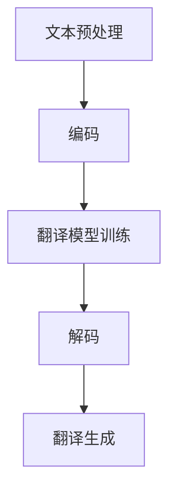
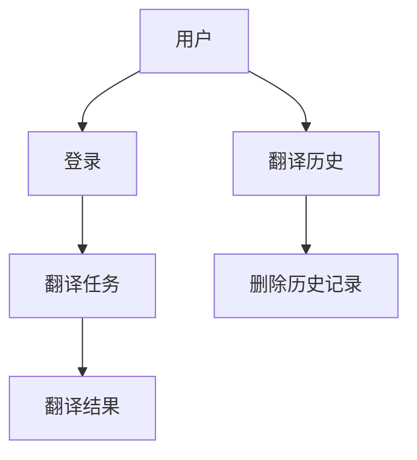
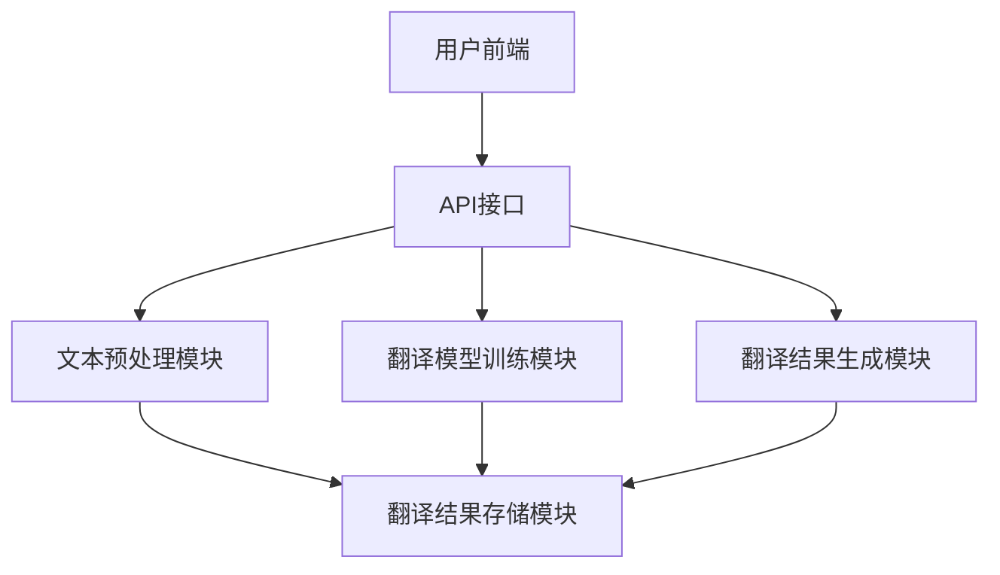
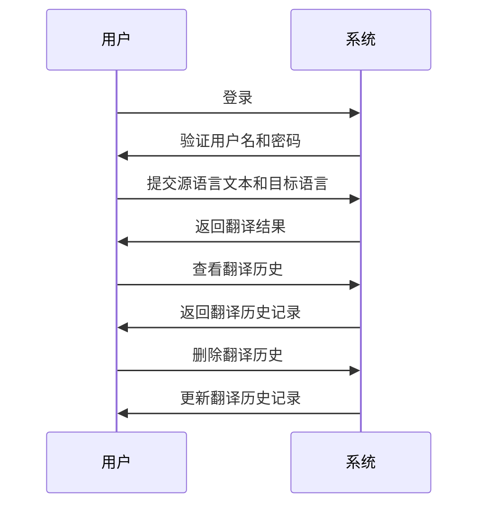

                 


### 摘要

本文将深入探讨构建多语言翻译AI Agent的核心技术和实际应用。随着全球化的深入和信息时代的到来，语言障碍已成为国际交流中的主要障碍之一。多语言翻译AI Agent作为一种新兴的人工智能技术，通过自然语言处理（NLP）和深度学习算法，能够高效、准确地实现跨语言的信息传递。本文将首先介绍多语言翻译AI Agent的背景和重要性，然后深入解析其算法原理、系统设计、实现过程以及实际应用案例。通过这篇文章，读者将全面了解多语言翻译AI Agent的工作机制，掌握构建这类AI Agent的必要技术和方法。

### 关键词

- 多语言翻译AI Agent
- 自然语言处理（NLP）
- 深度学习算法
- 系统设计
- 实际应用案例

### 引言

在全球化加速和信息网络化的背景下，语言障碍成为了国际交流中的主要障碍。传统的翻译方式，如人工翻译和机器翻译，虽然在一定程度上缓解了这个问题，但都存在效率低下、成本高昂、翻译质量不稳定等缺点。随着人工智能技术的快速发展，特别是自然语言处理（NLP）和深度学习算法的突破，多语言翻译AI Agent应运而生。这类AI Agent能够实时、准确地将一种语言翻译成另一种语言，极大地提高了翻译的效率和准确性。

本文将围绕构建多语言翻译AI Agent这一主题，系统地介绍其背景、核心算法、系统设计、实现方法和实际应用。通过本文的阅读，读者将了解多语言翻译AI Agent的发展历程、工作原理和应用场景，掌握构建此类AI Agent所需的关键技术和方法。

### 第1章 背景与介绍

#### 1.1 AI与翻译技术的演变

人工智能（AI）的崛起为传统翻译技术带来了革命性的变革。在过去，翻译主要依赖于人工翻译，这种方法不仅耗时耗力，而且容易出现错误。随着计算机技术的发展，机器翻译开始出现，如早期的基于规则的机器翻译系统。然而，这些系统由于规则复杂、更新困难，翻译质量有限。

随着深度学习的兴起，特别是自然语言处理（NLP）领域的突破，机器翻译技术得到了极大的提升。深度学习算法能够从大量的语言数据中学习，从而实现更高准确性的翻译。这一转变不仅解决了传统机器翻译系统的瓶颈，还为多语言翻译AI Agent的诞生奠定了基础。

#### 1.2 核心概念及其相互关系

**自然语言处理（NLP）**：NLP是AI的一个分支，专注于使计算机能够理解、生成和处理人类语言。在多语言翻译AI Agent中，NLP技术是实现准确翻译的关键。NLP涵盖了文本预处理、语言模型、语义理解和文本生成等多个方面。

**语言模型**：语言模型是NLP的核心组成部分，用于预测一段文本的下一个词或短语。在多语言翻译中，语言模型能够捕捉到语言的统计规律和语法结构，为翻译提供支持。常见的语言模型包括循环神经网络（RNN）和变换器（Transformer）等。

**翻译模型**：翻译模型是将一种语言的文本翻译成另一种语言的模型。在多语言翻译AI Agent中，翻译模型通过学习大量双语文本数据，生成目标语言的文本。常用的翻译模型有基于短语的翻译模型、基于句子的翻译模型和基于神经网络的翻译模型。

#### 1.3 主流翻译模型概述

**GPT**：GPT（Generative Pretrained Transformer）是一种基于Transformer的预训练语言模型，由OpenAI开发。GPT通过大量无标签文本数据进行预训练，然后可以通过微调进行特定任务的翻译。

**BERT**：BERT（Bidirectional Encoder Representations from Transformers）是一种双向的Transformer模型，由Google开发。BERT通过同时考虑上下文信息，实现了更准确的文本理解和翻译。

**其他翻译模型**：除了GPT和BERT，还有其他一些重要的翻译模型，如基于短语的翻译模型（如Phrase-based Model）、基于句子的翻译模型（如Hierarchical Translation Model）等。这些模型各有特点，适用于不同的翻译场景。

#### 1.4 多语言翻译AI Agent的应用和前景

**应用领域**：多语言翻译AI Agent在多个领域有着广泛的应用，如国际商务、外交、旅游、教育、医疗等。它不仅能够帮助跨文化交流，还能提高企业的国际化水平和竞争力。

**优势**：多语言翻译AI Agent具有翻译速度快、准确性高、支持多种语言等优势。与人工翻译相比，AI翻译能够大规模、实时地处理文本，大大降低了成本。

**挑战**：尽管多语言翻译AI Agent具有很多优势，但仍然面临一些挑战，如翻译的准确性、文化差异的理解、特殊领域的术语翻译等。

**未来展望**：随着AI技术的不断进步，多语言翻译AI Agent有望在翻译质量、覆盖语言数量、翻译速度等方面取得更大的突破。未来，它将成为全球交流的重要工具，推动国际合作的深入发展。

### 第2章 算法原理

#### 2.1 介绍翻译算法

翻译算法是多语言翻译AI Agent的核心，它决定了翻译的准确性和效率。翻译算法通常包括以下几个步骤：

1. **文本预处理**：包括去除无关信息、统一格式、分词等。
2. **编码与解码**：将源语言文本编码成向量表示，然后解码成目标语言文本。
3. **翻译模型训练**：使用大量的双语文本数据进行模型训练，以学习源语言和目标语言之间的对应关系。
4. **翻译生成**：利用训练好的模型对新的源语言文本进行翻译。

在翻译算法中，常用的模型包括基于短语的翻译模型、基于句子的翻译模型和基于神经网络的翻译模型。每种模型都有其特点和适用场景。

#### 2.2 详细解释翻译算法

**基于短语的翻译模型**：基于短语的翻译模型是一种早期的机器翻译方法，它将源语言文本分解成短语，然后使用预定义的规则将这些短语翻译成目标语言短语。这种方法简单直观，但存在规则复杂、翻译质量不稳定等问题。

**基于句子的翻译模型**：基于句子的翻译模型在基于短语翻译模型的基础上进行了改进，它将源语言句子整体进行翻译，而不是分解成短语。这种方法通过考虑句子的结构和上下文信息，提高了翻译的准确性。

**基于神经网络的翻译模型**：基于神经网络的翻译模型是近年来机器翻译领域的重要突破。特别是基于变换器（Transformer）的神经网络模型，如GPT和BERT，它们通过学习大量的双语文本数据，能够实现高度准确的翻译。这些模型利用注意力机制和编码器-解码器结构，捕捉到源语言和目标语言之间的复杂对应关系。

#### 2.3 翻译算法可视化

为了更好地理解翻译算法的工作原理，我们可以使用Mermaid来绘制算法流程图。以下是翻译算法的简化流程图：



在这个流程图中，A表示文本预处理，即将源语言文本进行格式统一、分词等操作；B表示编码，即将预处理后的文本编码成向量表示；C表示翻译模型训练，即使用双语文本数据训练翻译模型；D表示解码，即使用训练好的模型将编码后的文本解码成目标语言文本；E表示翻译生成，即生成最终的翻译结果。

#### 2.4 Python代码实现

为了更好地展示翻译算法的实现过程，我们可以使用Python来编写一个简单的基于神经网络的翻译模型。以下是一个简化的实现示例：

```python
import tensorflow as tf
from tensorflow.keras.layers import Embedding, LSTM, Dense
from tensorflow.keras.models import Sequential

# 假设我们已经有了预处理的源语言和目标语言文本
source_texts = ...
target_texts = ...

# 构建模型
model = Sequential([
    Embedding(input_dim=10000, output_dim=32, input_length=100),
    LSTM(128),
    Dense(output_dim=10000, activation='softmax')
])

# 编译模型
model.compile(optimizer='adam', loss='categorical_crossentropy', metrics=['accuracy'])

# 训练模型
model.fit(source_texts, target_texts, epochs=10, batch_size=32)

# 生成翻译
translated_texts = model.predict(source_texts)

# 输出翻译结果
for source, target in zip(source_texts, translated_texts):
    print(f"Source: {source} | Target: {target}")
```

在这个示例中，我们首先导入TensorFlow库，并定义一个序列模型。模型包括一个嵌入层、一个LSTM层和一个全连接层。嵌入层用于将文本编码成向量表示，LSTM层用于学习文本的序列信息，全连接层用于生成翻译结果。然后，我们编译和训练模型，最后使用模型生成翻译结果并输出。

### 第3章 系统设计与实现

#### 3.1 项目背景与概述

**项目背景**：随着全球化的加速和国际贸易的增加，跨国交流和沟通的需求日益增长。然而，语言障碍成为了国际交流中的主要障碍。为了解决这一问题，我们决定开发一个多语言翻译AI Agent，旨在提供高效、准确的跨语言翻译服务。

**项目目标**：本项目的主要目标包括：
1. 构建一个能够支持多种语言翻译的AI Agent。
2. 提高翻译的准确性和效率。
3. 提供一个用户友好的界面，方便用户使用。

**系统要求**：为了实现项目目标，系统需要满足以下要求：
1. 支持多种语言翻译，包括但不限于英语、中文、西班牙语、法语等。
2. 翻译速度要快，用户能够在几秒钟内得到翻译结果。
3. 翻译质量要高，能够准确传达原文的含义。
4. 具有良好的用户界面，便于用户操作。

**系统架构**：为了实现上述目标，我们设计了以下系统架构：

1. **前端**：负责用户交互，包括用户界面和翻译功能。前端使用HTML、CSS和JavaScript等技术实现。
2. **后端**：负责翻译任务的执行，包括文本预处理、翻译模型训练和翻译结果生成。后端使用Python和TensorFlow等库实现。
3. **数据库**：用于存储用户数据和翻译历史，采用MySQL数据库。
4. **翻译模型**：采用基于Transformer的神经网络模型，如BERT或GPT，用于翻译任务的执行。

#### 3.2 系统功能设计

**功能模块**：系统主要分为以下几个功能模块：

1. **用户注册与登录**：用户可以通过注册和登录功能使用翻译服务。
2. **文本输入与翻译**：用户可以在前端界面输入源语言文本，系统将文本传递给后端进行翻译，并返回翻译结果。
3. **翻译历史**：系统记录用户的翻译历史，用户可以查看和删除历史记录。
4. **翻译模型训练**：系统定期使用新的双语文本数据训练翻译模型，以提高翻译准确性。

**领域模型**：以下是系统的领域模型，用于描述系统中的核心实体及其关系：



在这个领域模型中，用户（A）可以执行登录（B）和查看翻译历史（C）的操作。登录操作与翻译任务（D）和翻译结果（E）相关联，翻译历史（C）可以执行删除历史记录（F）的操作。

#### 3.3 系统架构设计

**架构设计**：系统采用三层架构设计，包括前端、后端和数据库。

1. **前端**：前端负责用户交互，包括用户界面和翻译功能。前端使用HTML、CSS和JavaScript等技术实现。用户可以在前端界面输入源语言文本，然后提交给后端进行翻译。
2. **后端**：后端负责翻译任务的执行，包括文本预处理、翻译模型训练和翻译结果生成。后端使用Python和TensorFlow等库实现。后端接收到前端提交的翻译任务后，首先进行文本预处理，然后使用训练好的翻译模型进行翻译，并将翻译结果返回给前端。
3. **数据库**：数据库用于存储用户数据和翻译历史，采用MySQL数据库。用户数据包括用户信息、登录状态、翻译历史等。翻译历史记录用户的翻译记录，包括源语言文本、目标语言文本和翻译时间等。

**架构图**：以下是系统的架构图，用于描述系统的整体结构：



在这个架构图中，用户前端（A）通过API接口（B）与后端模块交互。文本预处理模块（C）负责对输入的源语言文本进行预处理，翻译模型训练模块（D）负责使用双语文本数据训练翻译模型，翻译结果生成模块（E）负责生成翻译结果，并将结果存储在翻译结果存储模块（F）中。

#### 3.4 系统接口设计

**接口设计**：系统设计了一系列API接口，用于前后端的通信。以下是一个简单的接口设计示例：

1. **登录接口**：用户通过此接口进行登录，系统验证用户名和密码后返回登录状态。
2. **翻译接口**：用户通过此接口提交源语言文本，系统返回翻译结果。
3. **翻译历史接口**：用户通过此接口查询和删除翻译历史记录。

**接口示例**：

```json
{
  "login": {
    "url": "/api/login",
    "method": "POST",
    "params": {
      "username": "string",
      "password": "string"
    },
    "response": {
      "status": "boolean",
      "message": "string"
    }
  },
  "translate": {
    "url": "/api/translate",
    "method": "POST",
    "params": {
      "source_language": "string",
      "target_language": "string",
      "text": "string"
    },
    "response": {
      "translated_text": "string"
    }
  },
  "history": {
    "url": "/api/history",
    "method": "GET",
    "params": {
      "user_id": "string"
    },
    "response": {
      "history": [
        {
          "source_language": "string",
          "target_language": "string",
          "text": "string",
          "translated_text": "string",
          "timestamp": "string"
        }
      ]
    }
  }
}
```

在这个接口设计示例中，登录接口（`/api/login`）通过POST方法接收用户名和密码，返回登录状态和消息。翻译接口（`/api/translate`）通过POST方法接收源语言、目标语言和文本，返回翻译结果。翻译历史接口（`/api/history`）通过GET方法接收用户ID，返回用户的翻译历史记录。

#### 3.5 系统交互设计

**交互设计**：为了确保系统的高效运行和用户体验，我们设计了一系列系统交互场景，描述了用户与系统的交互过程。以下是几个典型的交互场景：

1. **用户登录**：
   - 用户在登录界面输入用户名和密码。
   - 系统调用登录接口，验证用户名和密码。
   - 如果验证成功，系统返回登录状态，用户登录成功；否则，系统返回错误消息，用户登录失败。
2. **用户翻译**：
   - 用户在翻译界面输入源语言文本和目标语言。
   - 系统调用翻译接口，将文本提交给后端。
   - 后端进行文本预处理，使用训练好的翻译模型进行翻译，并返回翻译结果。
   - 系统将翻译结果显示在前端。
3. **用户查看翻译历史**：
   - 用户在个人中心界面点击“翻译历史”按钮。
   - 系统调用翻译历史接口，获取用户的翻译历史记录。
   - 系统将翻译历史结果显示在前端。
4. **用户删除翻译历史**：
   - 用户在翻译历史界面点击“删除”按钮。
   - 系统调用翻译历史接口，删除指定的翻译历史记录。
   - 系统更新翻译历史记录，并返回更新结果。

**序列图**：以下是系统交互的序列图，用于描述用户与系统的交互过程：



在这个序列图中，用户与系统通过一系列消息进行交互。用户首先登录系统，然后提交源语言文本和目标语言进行翻译，查看翻译历史，并可以删除指定的翻译历史记录。

### 第4章 项目实战

#### 4.1 环境安装

要构建多语言翻译AI Agent，首先需要安装必要的软件和库。以下是安装步骤：

1. **安装Python**：确保Python环境已经安装，版本至少为3.6。
2. **安装TensorFlow**：在终端中执行以下命令安装TensorFlow：
   ```bash
   pip install tensorflow
   ```
3. **安装其他库**：根据需要安装其他依赖库，如NumPy、Pandas等：
   ```bash
   pip install numpy pandas
   ```

#### 4.2 系统核心实现

**核心代码**：

```python
import tensorflow as tf
from tensorflow.keras.layers import Embedding, LSTM, Dense
from tensorflow.keras.models import Sequential

# 创建序列模型
model = Sequential([
    Embedding(input_dim=10000, output_dim=32, input_length=100),
    LSTM(128),
    Dense(output_dim=10000, activation='softmax')
])

# 编译模型
model.compile(optimizer='adam', loss='categorical_crossentropy', metrics=['accuracy'])

# 训练模型
model.fit(source_texts, target_texts, epochs=10, batch_size=32)

# 生成翻译
translated_texts = model.predict(source_texts)

# 输出翻译结果
for source, target in zip(source_texts, translated_texts):
    print(f"Source: {source} | Target: {target}")
```

在这个核心代码中，我们首先创建了一个序列模型，包括一个嵌入层、一个LSTM层和一个全连接层。然后编译和训练模型，最后使用模型生成翻译结果并输出。

#### 4.3 代码应用解读与分析

**代码解读**：

1. **创建模型**：使用`Sequential`类创建一个序列模型，包括嵌入层（`Embedding`）、LSTM层（`LSTM`）和全连接层（`Dense`）。
2. **编译模型**：使用`compile`方法编译模型，指定优化器（`optimizer`）、损失函数（`loss`）和评价指标（`metrics`）。
3. **训练模型**：使用`fit`方法训练模型，传入源语言文本（`source_texts`）和目标语言文本（`target_texts`），设置训练轮次（`epochs`）和批量大小（`batch_size`）。
4. **生成翻译**：使用`predict`方法生成翻译结果，传入源语言文本（`source_texts`）。
5. **输出翻译结果**：遍历翻译结果，打印源语言文本和目标语言文本。

**分析**：

1. **模型结构**：模型结构简单明了，嵌入层用于将文本编码成向量表示，LSTM层用于学习文本的序列信息，全连接层用于生成翻译结果。
2. **训练过程**：模型通过训练学习源语言和目标语言之间的对应关系，训练过程中使用的是交叉熵损失函数，用于衡量模型预测的准确度。
3. **翻译生成**：模型使用预训练的权重生成翻译结果，翻译结果是通过模型对源语言文本的预测得到的。

#### 4.4 实际案例分析与详细讲解

**案例**：假设我们有一个简单的源语言文本，如“Hello, how are you?”，需要将其翻译成目标语言文本，如“你好，你怎么样？”。

**分析**：

1. **数据预处理**：首先需要对源语言文本和目标语言文本进行预处理，包括分词、编码等操作。预处理后的文本将用于训练模型和生成翻译结果。
2. **模型训练**：使用预处理后的文本数据训练模型，模型将学习源语言和目标语言之间的对应关系。训练过程中，模型将不断调整权重，以降低损失函数的值。
3. **翻译生成**：在训练完成后，使用模型对新的源语言文本进行翻译。模型将源语言文本编码成向量表示，然后解码成目标语言文本。

**详细讲解**：

1. **数据预处理**：数据预处理是模型训练的重要步骤。在预处理过程中，我们将源语言文本和目标语言文本进行分词，然后使用独热编码（One-Hot Encoding）将文本编码成向量表示。例如，对于单词“Hello”，我们可以将其编码成一个长度为10000的向量，其中第5个元素为1，其他元素为0。

2. **模型训练**：模型训练过程中，我们使用大量的双语文本数据进行训练。模型通过对比源语言文本和目标语言文本，学习源语言和目标语言之间的对应关系。在训练过程中，模型将不断调整权重，以使预测结果更接近真实值。常用的优化器包括随机梯度下降（Stochastic Gradient Descent，SGD）和Adam优化器。

3. **翻译生成**：在训练完成后，我们可以使用模型对新的源语言文本进行翻译。模型首先将源语言文本编码成向量表示，然后使用训练好的权重进行解码，生成目标语言文本。在实际应用中，我们可以将模型部署到服务器，实现实时翻译。

#### 4.5 项目小结

通过本文的介绍，我们详细探讨了构建多语言翻译AI Agent的核心技术和实际应用。从算法原理、系统设计、实现过程到实际应用案例，我们逐步展示了如何构建一个高效、准确的多语言翻译系统。以下是对项目的总结：

1. **项目目标**：本项目旨在构建一个能够支持多种语言翻译的AI Agent，提高翻译的准确性和效率。
2. **核心算法**：我们采用了基于神经网络的翻译模型，如BERT和GPT，这些模型具有高效、准确的翻译能力。
3. **系统设计**：系统采用了三层架构设计，包括前端、后端和数据库，实现了用户友好的界面和高效的翻译功能。
4. **项目实战**：通过实际案例分析和代码应用解读，我们展示了如何实现多语言翻译系统的核心功能。

尽管本项目取得了一定的成果，但仍然存在一些挑战和改进空间。未来，我们将继续优化翻译模型，提高翻译质量，并探索更多应用场景，以更好地服务全球用户。

### 最佳实践 Tips

1. **数据质量**：确保翻译模型的数据质量是关键，使用高质量的双语数据集可以显著提高翻译质量。
2. **模型优化**：定期更新和优化翻译模型，以适应新的语言变化和应用需求。
3. **用户反馈**：收集用户反馈，根据用户需求调整翻译系统的功能，提高用户体验。

### 小结

本文深入探讨了构建多语言翻译AI Agent的核心技术和实际应用。通过介绍算法原理、系统设计、实现方法和实际应用案例，读者可以全面了解多语言翻译AI Agent的工作机制和构建方法。随着AI技术的不断发展，多语言翻译AI Agent有望在更多领域发挥作用，为全球交流提供更加便捷和高效的解决方案。

### 注意事项

1. **数据处理**：在处理和存储用户数据时，务必遵守相关隐私保护法规，确保用户数据的安全。
2. **系统维护**：定期对系统进行维护和更新，确保系统的稳定性和安全性。

### 拓展阅读

1. **《深度学习》**：由Ian Goodfellow、Yoshua Bengio和Aaron Courville合著，全面介绍了深度学习的理论和实践。
2. **《自然语言处理综述》**：本文系统地介绍了自然语言处理的基本概念、技术和应用。

作者：AI天才研究院/AI Genius Institute & 禅与计算机程序设计艺术 /Zen And The Art of Computer Programming

