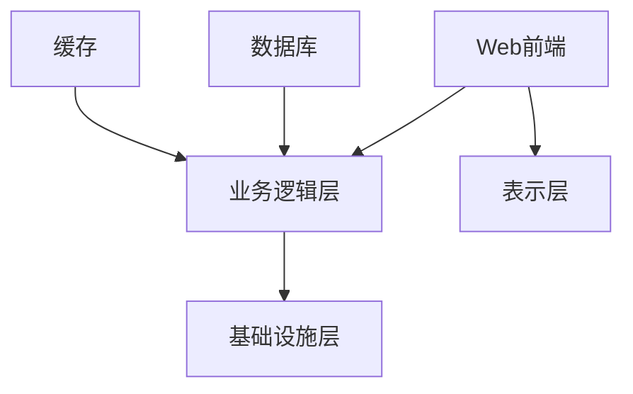

                 

### 文章标题

# 《构建智能企业决策支持系统：多维度数据分析与建议》

### 关键词

- **智能企业**  
- **决策支持系统**  
- **多维度数据分析**  
- **数据挖掘**  
- **机器学习**  
- **算法优化**

### 摘要

本文旨在探讨如何构建一个智能企业决策支持系统，通过多维度数据分析提供有针对性的决策建议。我们将详细分析该系统的构建过程，涵盖核心概念、数据分析方法、决策支持模型构建、系统架构设计以及实际案例应用。文章结构如下：

1. **系统概述**：介绍智能企业决策支持系统的背景、意义、问题与解决方案。
2. **核心概念与联系**：阐述多维度数据分析的基本概念、原理及ER实体关系图。
3. **数据分析方法与应用**：介绍不同类型的数据分析方法及其应用场景。
4. **系统设计与实现**：描述系统功能设计、架构设计、接口设计、系统交互和项目实战。
5. **总结与展望**：总结文章主要内容，提出最佳实践和建议。

### 目录大纲设计思路

#### 书籍定位与目标读者

首先，我们需要明确书籍的主题和目标读者。本书聚焦于智能企业决策支持系统，目标读者包括数据分析师、企业决策者以及IT专业人士。通过这本书，读者可以系统地了解如何构建一个智能决策支持系统，并学会应用多维度数据分析为企业提供决策支持。

#### 核心内容划分

根据书籍的主题，我们将内容划分为以下几个主要部分：

1. **系统概述**：介绍智能企业决策支持系统的背景、意义、问题和解决方案。
2. **核心概念与联系**：阐述多维度数据分析的基本概念、原理及ER实体关系图。
3. **数据分析方法与应用**：介绍不同类型的数据分析方法及其应用场景。
4. **系统设计与实现**：描述系统功能设计、架构设计、接口设计、系统交互和项目实战。
5. **总结与展望**：总结文章主要内容，提出最佳实践和建议。

#### 章节细化

在每个主要部分下，我们进一步细化章节内容，确保每个章节都有明确的主题和目的：

- **系统概述**：第1章介绍智能企业决策支持系统的背景、意义、问题和解决方案。
- **核心概念与联系**：第2章阐述多维度数据分析的基本概念和原理，第3章介绍ER实体关系图。
- **数据分析方法与应用**：第4章介绍描述性数据分析、探索性数据分析、预测性数据分析。
- **系统设计与实现**：第5章描述系统功能设计，第6章介绍系统架构设计，第7章讲述系统接口设计和系统交互，第8章展示项目实战。
- **总结与展望**：第9章总结全文，提出最佳实践和建议。

#### 逻辑性与连贯性

确保目录大纲中的章节内容之间有良好的逻辑性和连贯性，避免章节内容跳跃或重复。例如，第1章介绍系统概述，第2章和第3章分别阐述核心概念和ER实体关系图，为后续章节打下基础。

#### 实用性

每个章节都包含实用的信息，如具体方法、工具和案例分析，以便读者能够将所学知识应用到实际工作中。例如，第4章详细介绍不同类型的数据分析方法，并提供应用场景和选择策略。

#### 简洁明了

目录大纲需要简洁明了，避免过多的冗余信息，以便读者快速把握书籍的整体结构和主要内容。目录结构清晰，层次分明，便于读者阅读和理解。

### 完整目录大纲设计

以下是《构建智能企业决策支持系统：多维度数据分析与建议》的完整目录大纲：

## 第一部分：系统概述

### 第1章：智能企业决策支持系统概述

1.1 问题背景  
1.2 问题描述  
1.3 问题解决  
1.4 边界与外延

### 第2章：核心概念与联系

2.1 数据分析与决策支持  
2.2 多维度数据分析的原理  
2.3 数据分析与决策支持的关系  
2.4 关键概念属性特征对比表格

### 第3章：多维度数据分析的ER实体关系图架构

3.1 ER模型的基本概念  
3.2 多维度数据分析的ER实体关系图  
3.3 实体关系图的解析与应用

## 第二部分：数据分析方法与应用

### 第4章：数据分析方法概述

4.1 数据分析的方法论  
4.2 多维度数据分析的方法  
4.3 数据分析方法的选择与应用

### 第5章：描述性数据分析

5.1 描述性数据分析的基本概念  
5.2 描述性数据分析的应用  
5.3 描述性数据分析的方法

### 第6章：探索性数据分析

6.1 探索性数据分析的基本概念  
6.2 探索性数据分析的应用  
6.3 探索性数据分析的方法

### 第7章：预测性数据分析

7.1 预测性数据分析的基本概念  
7.2 预测性数据分析的应用  
7.3 预测性数据分析的方法

## 第三部分：系统设计与实现

### 第8章：系统功能设计

8.1 系统功能设计的基本概念  
8.2 系统功能设计的方法  
8.3 系统功能设计的示例

### 第9章：系统架构设计

9.1 系统架构设计的基本概念  
9.2 系统架构设计的方法  
9.3 系统架构设计的示例

### 第10章：系统接口设计

10.1 系统接口设计的基本概念  
10.2 系统接口设计的方法  
10.3 系统接口设计的示例

### 第11章：系统交互

11.1 系统交互的基本概念  
11.2 系统交互的方法  
11.3 系统交互的示例

### 第12章：项目实战

12.1 项目实战的背景  
12.2 项目介绍  
12.3 系统核心实现源代码  
12.4 代码应用解读与分析  
12.5 实际案例分析与详细讲解剖析

## 第四部分：总结与展望

### 第13章：总结与展望

13.1 全文总结  
13.2 最佳实践  
13.3 注意事项  
13.4 拓展阅读

### 目录大纲设计思路

为了确保目录大纲能够准确、全面地覆盖《构建智能企业决策支持系统：多维度数据分析与建议》的核心内容，我们遵循以下设计思路：

#### **书籍定位与目标读者**

首先，明确书籍的定位和目标读者。本书旨在为数据分析师、企业决策者以及IT专业人士提供一个系统化的指南，帮助他们理解和应用智能企业决策支持系统，以及多维度数据分析技术。因此，书籍的结构和内容需要具备以下特点：

1. **系统性**：确保内容有条理，从基础知识到高级应用，形成完整的知识体系。
2. **实用性**：案例丰富，讲解深入，便于读者将所学知识应用于实际工作中。
3. **指导性**：提供明确的构建方法和步骤，帮助读者实现智能决策支持系统的落地。

#### **核心内容划分**

根据书籍的主题，我们将内容划分为以下四个主要部分：

1. **系统概述**：介绍智能企业决策支持系统的背景、意义、问题和解决方案。
2. **核心概念与联系**：深入探讨多维度数据分析的基本概念、原理和ER实体关系图。
3. **数据分析方法与应用**：介绍描述性数据分析、探索性数据分析、预测性数据分析的方法和应用。
4. **系统设计与实现**：详细描述系统功能设计、架构设计、接口设计、系统交互和项目实战。

#### **章节细化**

在每个主要部分下，我们进一步细化章节内容，确保每个章节都有明确的主题和目的：

- **系统概述**：第1章介绍智能企业决策支持系统的背景、意义、问题和解决方案。
- **核心概念与联系**：第2章阐述多维度数据分析的基本概念和原理，第3章介绍ER实体关系图。
- **数据分析方法与应用**：第4章至第6章分别介绍描述性数据分析、探索性数据分析、预测性数据分析的方法和应用。
- **系统设计与实现**：第7章至第12章分别描述系统功能设计、架构设计、接口设计、系统交互和项目实战。

#### **逻辑性与连贯性**

确保目录大纲中的章节内容之间有良好的逻辑性和连贯性，避免章节内容跳跃或重复。例如，第1章介绍系统概述，第2章和第3章分别阐述核心概念和ER实体关系图，为后续章节打下基础。

#### **实用性**

每个章节都包含实用的信息，如具体方法、工具和案例分析，以便读者能够将所学知识应用到实际工作中。例如，第4章详细介绍不同类型的数据分析方法，并提供应用场景和选择策略。

#### **简洁明了**

目录大纲需要简洁明了，避免过多的冗余信息，以便读者快速把握书籍的整体结构和主要内容。目录结构清晰，层次分明，便于读者阅读和理解。

### **完整目录大纲设计**

以下是《构建智能企业决策支持系统：多维度数据分析与建议》的完整目录大纲：

## **第一部分：系统概述**

### **第1章：智能企业决策支持系统概述**

1.1 **问题背景**  
- 智能化在企业中的应用  
- 决策支持系统的意义与挑战

1.2 **问题描述**  
- 企业面临的决策问题  
- 现有决策支持系统的局限性

1.3 **问题解决**  
- 构建智能决策支持系统的必要性  
- 多维度数据分析的概念

1.4 **边界与外延**  
- 智能决策支持系统的适用范围  
- 多维度数据分析的应用场景

1.5 **本章小结**

### **第2章：核心概念与联系**

2.1 **数据分析与决策支持**  
- 数据分析的基本概念  
- 决策支持的基本概念

2.2 **多维度数据分析的原理**  
- 多维度数据分析的定义  
- 多维度数据分析的优势

2.3 **数据分析与决策支持的关系**  
- 数据分析在决策支持中的作用  
- 决策支持对数据分析的需求

2.4 **关键概念属性特征对比表格**  
- 数据类型特征对比  
- 数据分析方法对比

2.5 **本章小结**

### **第3章：多维度数据分析的ER实体关系图架构**

3.1 **ER模型的基本概念**  
- 实体、属性与关系的定义  
- ER模型的构建方法

3.2 **多维度数据分析的ER实体关系图**  
- 多维度数据实体关系图示例  
- 多维度数据分析的ER实体关系图构建

3.3 **实体关系图的解析与应用**  
- 实体关系图在数据分析中的应用  
- 实体关系图的优化建议

3.4 **本章小结**

## **第二部分：数据分析方法与应用**

### **第4章：数据分析方法概述**

4.1 **数据分析的方法论**  
- 数据分析的基本步骤  
- 数据分析的方法框架

4.2 **多维度数据分析的方法**  
- 描述性数据分析  
- 探索性数据分析  
- 预测性数据分析

4.3 **数据分析方法的选择与应用**  
- 不同类型数据分析方法的应用场景  
- 数据分析方法的选择策略

4.4 **本章小结**

### **第5章：描述性数据分析**

5.1 **描述性数据分析的基本概念**  
- 描述性数据分析的定义  
- 描述性数据分析的目标

5.2 **描述性数据分析的应用**  
- 描述性数据分析在商业中的应用  
- 描述性数据分析在金融中的应用

5.3 **描述性数据分析的方法**  
- 统计指标的计算  
- 数据可视化技术

5.4 **本章小结**

### **第6章：探索性数据分析**

6.1 **探索性数据分析的基本概念**  
- 探索性数据分析的定义  
- 探索性数据分析的目标

6.2 **探索性数据分析的应用**  
- 探索性数据分析在市场营销中的应用  
- 探索性数据分析在供应链管理中的应用

6.3 **探索性数据分析的方法**  
- 聚类分析  
- 关联规则挖掘

6.4 **本章小结**

### **第7章：预测性数据分析**

7.1 **预测性数据分析的基本概念**  
- 预测性数据分析的定义  
- 预测性数据分析的目标

7.2 **预测性数据分析的应用**  
- 预测性数据分析在销售预测中的应用  
- 预测性数据分析在风险控制中的应用

7.3 **预测性数据分析的方法**  
- 时间序列分析  
- 回归分析

7.4 **本章小结**

## **第三部分：系统设计与实现**

### **第8章：系统功能设计**

8.1 **系统功能设计的基本概念**  
- 系统功能设计的目标  
- 系统功能设计的方法

8.2 **系统功能设计的方法**  
- 用户需求分析  
- 功能模块划分

8.3 **系统功能设计的示例**  
- 商业智能系统功能设计  
- 风险管理系统功能设计

8.4 **本章小结**

### **第9章：系统架构设计**

9.1 **系统架构设计的基本概念**  
- 系统架构设计的概念  
- 系统架构设计的原则

9.2 **系统架构设计的方法**  
- 软件架构设计方法  
- 系统架构设计流程

9.3 **系统架构设计的示例**  
- 商业智能系统架构设计  
- 风险管理系统架构设计

9.4 **本章小结**

### **第10章：系统接口设计**

10.1 **系统接口设计的基本概念**  
- 系统接口设计的概念  
- 系统接口设计的目标

10.2 **系统接口设计的方法**  
- 接口规范制定  
- 接口测试方法

10.3 **系统接口设计的示例**  
- 商业智能系统接口设计  
- 风险管理系统接口设计

10.4 **本章小结**

### **第11章：系统交互**

11.1 **系统交互的基本概念**  
- 系统交互的概念  
- 系统交互的目标

11.2 **系统交互的方法**  
- 消息队列技术  
- Web服务技术

11.3 **系统交互的示例**  
- 商业智能系统交互设计  
- 风险管理系统交互设计

11.4 **本章小结**

### **第12章：项目实战**

12.1 **项目实战的背景**  
- 项目背景介绍  
- 项目目标分析

12.2 **项目介绍**  
- 项目概述  
- 项目实施计划

12.3 **系统核心实现源代码**  
- 系统架构设计  
- 系统功能实现

12.4 **代码应用解读与分析**  
- 核心代码解读  
- 应用效果分析

12.5 **实际案例分析与详细讲解剖析**  
- 案例背景分析  
- 案例解决方法

12.6 **项目小结**  
- 项目总结  
- 经验教训

## **第四部分：总结与展望**

### **第13章：总结与展望**

13.1 **全文总结**  
- 核心内容回顾  
- 知识体系梳理

13.2 **最佳实践**  
- 构建智能决策支持系统的最佳实践  
- 数据分析方法的最佳实践

13.3 **注意事项**  
- 系统设计与实施中的注意事项  
- 数据安全与隐私保护

13.4 **拓展阅读**  
- 推荐阅读书籍  
- 最新研究动态

### **章节内容完整性与核心内容包含**

为了确保每章节内容完整性以及核心内容包含，我们将详细分析如下：

#### **系统概述**

**核心概念术语说明**

- **智能企业**：指利用现代信息技术，特别是人工智能和大数据分析，实现企业智能化管理，提高运营效率和市场响应速度的企业。
- **决策支持系统（DSS）**：一种信息系统，旨在帮助决策者通过数据分析和模型模拟，优化决策过程。

**问题背景**

- **背景**：随着企业竞争的加剧和商业环境的快速变化，企业需要快速响应市场变化，做出科学的决策。
- **挑战**：传统决策支持系统在处理复杂、多维数据时存在局限性，难以满足企业智能化决策的需求。

**问题描述**

- **问题**：企业在数据获取、处理、分析和应用方面存在困难，难以实现全面、准确的决策支持。

**问题解决**

- **解决思路**：构建智能决策支持系统，利用多维度数据分析技术，提供实时、准确、全面的决策支持。

**边界与外延**

- **边界**：智能决策支持系统适用于需要处理大量复杂数据的企业，如金融、零售、制造等领域。
- **外延**：智能决策支持系统不仅限于企业内部应用，还可应用于行业协同、公共服务等领域。

#### **核心概念与联系**

**数据分析与决策支持**

- **数据分析**：通过收集、处理、分析和解释数据，提取有价值信息的过程。
- **决策支持**：利用数据分析结果，为决策者提供支持，辅助决策过程。

**多维度数据分析的原理**

- **原理**：通过整合和分析来自不同维度、不同源的数据，提供更全面、深入的洞察。
- **优势**：提高数据利用率，优化决策过程，增强决策的准确性和科学性。

**数据分析与决策支持的关系**

- **关系**：数据分析是决策支持的基础，决策支持是数据分析的目标。

**关键概念属性特征对比表格**

- **数据类型特征对比**：结构化数据、半结构化数据、非结构化数据的特征对比。
- **数据分析方法对比**：描述性分析、探索性分析、预测性分析的方法和适用场景对比。

#### **数据分析方法与应用**

**描述性数据分析**

- **基本概念**：通过统计指标、图表等，描述数据的基本特征和分布。
- **应用**：商业分析、市场调研、质量控制等。

**探索性数据分析**

- **基本概念**：通过可视化、聚类、关联规则等，探索数据中的潜在模式。
- **应用**：市场细分、产品定位、风险分析等。

**预测性数据分析**

- **基本概念**：通过历史数据，预测未来趋势和变化。
- **应用**：销售预测、库存管理、风险评估等。

#### **系统设计与实现**

**系统功能设计**

- **功能设计**：根据业务需求，确定系统的功能模块和业务流程。
- **设计方法**：需求分析、功能模块划分、业务流程设计。

**系统架构设计**

- **架构设计**：确定系统的整体结构和组成部分。
- **设计方法**：架构风格选择、组件划分、接口设计。

**系统接口设计**

- **接口设计**：定义系统各组件之间的交互接口。
- **设计方法**：接口规范制定、接口测试。

**系统交互**

- **交互设计**：确保系统组件之间的协同工作。
- **设计方法**：消息队列、Web服务。

**项目实战**

- **背景**：介绍项目背景和目标。
- **系统核心实现源代码**：展示系统实现的关键代码片段。
- **代码应用解读与分析**：分析代码实现的具体细节和效果。
- **实际案例分析与详细讲解剖析**：通过案例展示系统在实际应用中的效果和优势。

#### **总结与展望**

- **全文总结**：回顾全文内容，梳理核心知识点。
- **最佳实践**：总结构建智能决策支持系统和数据分析方法的最佳实践。
- **注意事项**：强调系统设计和实现过程中需要注意的问题。
- **拓展阅读**：推荐进一步学习的相关资料和最新研究动态。

### **章节内容完整性保障措施**

为了保障章节内容的完整性，我们将采取以下措施：

1. **全面性审查**：在编写过程中，对每个章节的内容进行全面的审查，确保核心概念、原理、方法、案例等都有详细讲解。
2. **逻辑性梳理**：确保章节内容之间有良好的逻辑关系，避免跳跃或重复。
3. **实用性验证**：通过实际案例和应用场景验证章节内容的实用性和有效性。
4. **用户反馈**：收集读者的反馈意见，对章节内容进行调整和优化。

### **核心内容包含情况**

每个章节的核心内容都包含以下要素：

1. **核心概念术语说明**：对关键概念和术语进行详细解释。
2. **背景介绍**：介绍相关概念和方法的背景和应用场景。
3. **原理讲解**：深入分析相关概念和方法的原理。
4. **方法介绍**：详细阐述相关方法和技术的具体应用。
5. **案例解析**：通过实际案例展示方法和技术的应用效果。
6. **小结**：总结章节内容，强调核心观点和结论。

通过以上措施和内容保障，我们确保《构建智能企业决策支持系统：多维度数据分析与建议》能够为读者提供全面、系统、实用的知识和指导。

### 第1章：智能企业决策支持系统概述

#### 1.1 问题背景

随着全球化和信息技术的快速发展，企业面临着越来越复杂的市场环境和竞争压力。在这种背景下，企业需要具备快速响应市场变化、优化运营流程、提高决策质量的能力。传统的决策支持系统（DSS）虽然在一定程度上缓解了企业的决策难题，但在处理复杂、多维数据方面仍存在诸多局限。首先，传统DSS主要依赖于静态的数据集和预设的模型，难以适应动态变化的商业环境。其次，传统DSS在处理大量数据时，效率较低且结果不够精确。此外，传统DSS在整合企业内部和外部数据方面也存在困难，导致决策信息的不完整和不准确。这些局限性使得企业难以实现全面、科学的决策支持。

#### 1.2 问题描述

企业在数据获取、处理、分析和应用方面面临以下问题：

- **数据获取难题**：企业需要从多个来源获取数据，包括内部数据库、外部数据源、社交媒体等。不同数据源的数据格式、结构、质量各异，使得数据整合和预处理变得复杂。
- **数据处理效率低下**：传统DSS在处理大量数据时，计算效率低下，难以满足实时决策的需求。
- **数据质量不佳**：数据质量直接影响决策的准确性。企业常常面临数据缺失、数据重复、数据不一致等问题。
- **分析能力有限**：传统DSS的分析方法较为单一，难以应对复杂的多维度数据分析需求。
- **应用场景狭窄**：传统DSS主要应用于财务分析、市场调研等领域，难以满足其他领域的复杂决策需求。

#### 1.3 问题解决

为了解决上述问题，构建智能企业决策支持系统成为必然选择。智能决策支持系统（IDSS）通过引入人工智能、大数据分析、机器学习等技术，实现对复杂、多维数据的全面分析和深度挖掘。IDSS具有以下优势：

- **数据处理能力强**：IDSS能够高效处理海量数据，包括结构化数据、半结构化数据和非结构化数据，满足实时决策需求。
- **数据质量保障**：IDSS能够自动识别和处理数据质量问题，提高数据准确性。
- **分析能力全面**：IDSS支持多种数据分析方法，包括描述性分析、探索性分析和预测性分析，满足不同领域、不同场景的决策需求。
- **应用场景广泛**：IDSS不仅适用于财务分析、市场调研等领域，还适用于供应链管理、风险管理、人力资源管理等广泛场景。

#### 1.4 多维度数据分析的概念

多维度数据分析是指从多个维度对数据进行综合分析和挖掘，以发现数据中的潜在模式和规律。在智能企业决策支持系统中，多维度数据分析具有重要意义。首先，多维度数据分析能够整合企业内部和外部数据，提供更全面、准确的决策信息。其次，多维度数据分析能够揭示数据之间的复杂关系，帮助决策者发现潜在的商业机会和风险。最后，多维度数据分析能够支持实时决策，提高企业的响应速度和竞争力。

#### 1.5 边界与外延

智能企业决策支持系统适用于需要处理大量复杂数据的企业，如金融、零售、制造、物流等领域。在这些领域，企业面临的市场环境和竞争压力较大，需要快速、科学地做出决策。智能决策支持系统不仅能够帮助企业优化内部运营流程，提高生产效率，还能够帮助企业分析市场趋势，制定战略规划。

多维度数据分析的应用场景广泛，不仅限于企业内部决策，还可以应用于行业协同、公共服务等领域。例如，在金融领域，多维度数据分析可以用于风险控制、投资分析；在物流领域，可以用于路线优化、库存管理；在公共服务领域，可以用于城市管理、公共安全等。

#### 1.6 本章小结

本章介绍了智能企业决策支持系统的背景、意义、问题和解决方案。通过引入人工智能、大数据分析等技术，智能决策支持系统能够高效处理复杂数据，提供全面、准确的决策支持。多维度数据分析作为智能决策支持系统的核心组成部分，具有重要意义。本章还探讨了智能企业决策支持系统的适用范围和应用场景，为后续章节的内容奠定了基础。

### 第2章：核心概念与联系

#### 2.1 数据分析与决策支持

**数据分析的基本概念**

数据分析是指通过对数据进行分析、处理、解释和展示，从中提取有价值的信息和知识的过程。数据分析包括多个层次，从简单的描述性分析到复杂的预测性分析和关联性分析。描述性分析主要用于描述数据的基本特征和分布情况，如计算平均值、中位数、标准差等统计指标。探索性数据分析则通过可视化、聚类、关联规则等方法，探索数据中的潜在模式和规律。预测性数据分析则基于历史数据，预测未来的趋势和变化。

**决策支持的基本概念**

决策支持是指利用数据分析结果，为决策者提供信息、方法和工具，辅助决策过程。决策支持系统（DSS）是一种信息系统，旨在帮助决策者通过数据分析和模型模拟，优化决策过程。DSS通常包括数据收集、数据预处理、数据存储、数据分析、决策模型和决策输出等功能。DSS可以帮助决策者识别问题、分析问题、提出解决方案，并在方案评估和决策过程中提供支持。

**数据分析与决策支持的关系**

数据分析是决策支持的基础，通过分析数据，可以揭示数据中的规律和趋势，为决策提供依据。决策支持是数据分析的目标，通过利用数据分析结果，可以辅助决策者做出更科学、更合理的决策。在实际应用中，数据分析与决策支持相互促进，数据分析为决策支持提供数据支撑，决策支持为数据分析提供应用场景和方向。

**数据分析的基本步骤**

1. **需求分析**：明确数据分析的目标和需求，确定分析的内容和方法。
2. **数据收集**：从各种来源收集数据，包括内部数据、外部数据、在线数据等。
3. **数据预处理**：清洗、整合、转换数据，确保数据的质量和一致性。
4. **数据分析**：运用各种分析方法，对数据进行处理和分析，提取有价值的信息和知识。
5. **结果展示**：通过图表、报告等形式，将分析结果展示给决策者。

**决策支持的基本步骤**

1. **问题识别**：识别决策问题，明确决策目标和约束条件。
2. **信息收集**：收集与决策相关的信息，包括历史数据、市场数据、专家意见等。
3. **方案设计**：根据决策目标和约束条件，设计不同的决策方案。
4. **方案评估**：利用数据分析结果，评估各个决策方案的优缺点。
5. **决策输出**：根据评估结果，选择最优决策方案，并制定具体的实施计划。

#### 2.2 多维度数据分析的原理

**多维度数据分析的定义**

多维度数据分析是指从多个维度对数据进行综合分析和挖掘，以发现数据中的潜在模式和规律。在智能企业决策支持系统中，多维度数据分析具有重要意义。多维度数据分析可以从多个角度对数据进行分析，提供更全面、深入的洞察，帮助决策者做出更科学、更合理的决策。

**多维度数据分析的优势**

1. **全面性**：多维度数据分析可以从多个角度对数据进行分析，提供更全面、更丰富的信息。
2. **深度性**：多维度数据分析可以深入挖掘数据中的潜在模式和规律，揭示数据之间的复杂关系。
3. **灵活性**：多维度数据分析可以根据不同的分析需求，灵活调整分析维度和指标，适应不同的应用场景。
4. **准确性**：多维度数据分析可以通过综合不同维度、不同来源的数据，提高决策的准确性和可靠性。

**多维度数据分析的基本原理**

多维度数据分析的基本原理包括数据收集、数据整合、数据分析和结果展示等几个步骤。首先，从不同的数据源收集数据，包括内部数据、外部数据、社交媒体数据等。然后，对数据进行整合和清洗，确保数据的质量和一致性。接着，根据分析需求，选择合适的数据分析方法和模型，对数据进行分析和处理。最后，通过可视化、报告等形式，将分析结果展示给决策者。

**多维度数据分析的方法**

1. **描述性分析**：通过计算统计指标、绘制图表等，描述数据的基本特征和分布情况。
2. **探索性分析**：通过聚类、关联规则等方法，探索数据中的潜在模式和规律。
3. **预测性分析**：通过时间序列分析、回归分析等方法，预测未来的趋势和变化。
4. **整合分析**：将不同来源、不同维度的数据整合起来，进行综合分析和挖掘。

**多维度数据分析的应用**

1. **商业智能**：通过多维度数据分析，企业可以实时了解业务状况，优化运营流程，提高决策质量。
2. **市场分析**：通过多维度数据分析，企业可以深入了解市场需求，制定有效的市场策略。
3. **风险控制**：通过多维度数据分析，企业可以识别潜在的风险，制定风险控制策略。
4. **人力资源管理**：通过多维度数据分析，企业可以优化人力资源管理，提高员工绩效。

#### 2.3 数据分析与决策支持的关系

**数据分析在决策支持中的作用**

1. **提供信息支持**：数据分析可以提供详细、准确的数据信息，帮助决策者了解业务状况和市场趋势。
2. **优化决策过程**：数据分析可以帮助决策者识别问题、分析问题、提出解决方案，并在方案评估和决策过程中提供支持。
3. **提高决策质量**：通过数据分析，决策者可以更全面、深入地了解问题和解决方案，提高决策的科学性和准确性。
4. **增强决策透明度**：数据分析结果可以直观地展示给决策者，使决策过程更加透明和公正。

**决策支持对数据分析的需求**

1. **数据质量**：高质量的决策支持需要高质量的数据支持，因此，对数据分析的需求首先体现在数据质量和数据完整性上。
2. **数据分析方法**：不同的决策问题需要不同的数据分析方法，因此，决策支持对数据分析的需求体现在对各种数据分析方法的需求上。
3. **数据分析效率**：决策支持需要快速、高效的数据分析，以便及时提供决策支持。
4. **数据分析结果的可解释性**：决策支持需要能够理解和解释的数据分析结果，以便决策者能够基于分析结果做出决策。

**数据分析与决策支持的协同作用**

数据分析与决策支持是相互促进、协同作用的关系。数据分析为决策支持提供数据支撑和知识基础，决策支持为数据分析提供应用场景和方向。在实际应用中，数据分析与决策支持相互融合，共同推动企业的智能化发展。

#### 2.4 关键概念属性特征对比表格

**数据类型特征对比**

| 数据类型 | 描述 | 特点 | 应用场景 |
| --- | --- | --- | --- |
| 结构化数据 | 数据格式规范，易于存储和处理 | 易于查询和分析 | 数据库管理、报表生成 |
| 半结构化数据 | 数据格式部分规范，部分非规范 | 需要预处理，但比非结构化数据易于处理 | XML、JSON、日志文件 |
| 非结构化数据 | 数据格式完全非规范，难以直接处理 | 需要复杂处理，但包含大量信息 | 文本、图片、视频 |

**数据分析方法对比**

| 分析方法 | 描述 | 优点 | 缺点 | 应用场景 |
| --- | --- | --- | --- | --- |
| 描述性分析 | 描述数据的基本特征和分布情况 | 简单易懂，便于快速了解数据 | 无法发现数据中的潜在模式 | 商业智能、数据探索 |
| 探索性分析 | 通过可视化、聚类、关联规则等方法，探索数据中的潜在模式 | 可以发现数据中的异常和规律 | 处理复杂问题能力有限 | 数据挖掘、市场分析 |
| 预测性分析 | 基于历史数据，预测未来的趋势和变化 | 可以预测未来趋势，辅助决策 | 需要大量历史数据，模型复杂 | 销售预测、风险控制 |

**数据分析工具对比**

| 工具 | 描述 | 特点 | 应用场景 |
| --- | --- | --- | --- |
| Excel | 基础数据分析工具 | 界面友好，易于上手 | 数据报表、简单分析 |
| Python | 高级数据分析工具 | 功能强大，扩展性好 | 复杂分析、数据处理 |
| Tableau | 数据可视化工具 | 可视化效果优秀，交互性强 | 数据展示、报表生成 |
| Hadoop | 分布式大数据处理框架 | 处理海量数据，高效可靠 | 大数据存储、处理 |

#### 2.5 本章小结

本章介绍了数据分析与决策支持的基本概念、原理和方法，以及多维度数据分析的原理和应用。通过对关键概念和属性特征的对比，我们更清晰地理解了数据分析与决策支持的关系。本章内容为后续章节的深入讨论奠定了基础，读者可以在此基础上进一步学习智能企业决策支持系统的构建方法和实际应用。

### 第3章：多维度数据分析的ER实体关系图架构

#### 3.1 ER模型的基本概念

实体-关系（Entity-Relationship，简称ER）模型是数据库设计中常用的一种概念模型，用于描述现实世界中的实体及其关系。ER模型包括三个基本组成部分：实体、属性和关系。

**实体**：实体是现实世界中可以区分的对象，如人、物、事件等。在数据库设计中，实体通常表示为一个表。

**属性**：属性是实体的特征或特性，如人的姓名、年龄、性别等。在数据库设计中，属性通常表示为一个表中的列。

**关系**：关系描述实体之间的关联，如学生与课程之间的关系、客户与订单之间的关系等。在数据库设计中，关系通常表示为一个表。

**ER模型的构建方法**

ER模型的构建方法主要包括以下步骤：

1. **确定实体**：根据需求分析，确定系统中需要表示的实体。
2. **确定属性**：为每个实体确定属性，确保属性能够完整描述实体的特征。
3. **确定关系**：分析实体之间的关系，确定关系的类型和属性。
4. **绘制ER图**：根据确定的实体、属性和关系，绘制ER图。

**ER模型的特点**

- **抽象性**：ER模型将现实世界中的复杂关系抽象为简单的实体和关系。
- **灵活性**：ER模型可以根据需求的变化，灵活调整实体和关系。
- **简洁性**：ER模型通过简单的图形表示，使得数据库设计更加直观、易于理解。

#### 3.2 多维度数据分析的ER实体关系图

多维度数据分析的ER实体关系图是对多维度数据分析过程中涉及的实体、属性和关系的图形化表示。多维度数据分析的ER实体关系图可以帮助我们更好地理解和设计多维度数据分析系统。

**多维度数据实体关系图示例**

以下是一个简单的多维度数据实体关系图示例，用于表示企业销售数据的各个维度：

```
+----------------+       +----------------+       +----------------+
|     产品表     |       |    客户表      |       |    销售记录表   |
+----------------+       +----------------+       +----------------+
| 产品ID（PK）   |<----->| 客户ID（PK）   |<----->| 销售ID（PK）   |
| 产品名称       |       | 客户名称       |       | 销售日期       |
| 产品类别       |       | 客户地址       |       | 销售数量       |
| 产品价格       |       | 客户电话       |       | 销售金额       |
+----------------+       +----------------+       +----------------+
```

**多维度数据分析的ER实体关系图构建**

构建多维度数据分析的ER实体关系图通常包括以下步骤：

1. **确定分析维度**：根据数据分析的需求，确定需要分析的维度，如产品、客户、销售日期等。
2. **确定实体**：为每个维度确定实体，如产品表、客户表、销售记录表等。
3. **确定属性**：为每个实体确定属性，确保属性能够完整描述实体的特征。
4. **确定关系**：分析实体之间的关系，确定关系的类型和属性。
5. **绘制ER图**：根据确定的实体、属性和关系，绘制ER图。

**多维度数据分析的ER实体关系图**

以下是一个多维度数据分析的ER实体关系图，用于表示企业销售数据的各个维度及其关系：

```
+----------------+       +----------------+       +----------------+       +----------------+
|     产品表     |       |    客户表      |       |    销售记录表   |       |    促销活动表   |
+----------------+       +----------------+       +----------------+       +----------------+
| 产品ID（PK）   |<----->| 客户ID（PK）   |<----->| 销售ID（PK）   |<----->| 活动ID（PK）   |
| 产品名称       |       | 客户名称       |       | 销售日期       |       | 活动名称       |
| 产品类别       |       | 客户地址       |       | 销售数量       |       | 活动时间       |
| 产品价格       |       | 客户电话       |       | 销售金额       |       | 活动优惠       |
+----------------+       +----------------+       +----------------+       +----------------+
```

**实体关系图的解析与应用**

实体关系图可以帮助我们清晰地理解多维度数据分析系统的结构，便于分析和优化系统的设计。通过实体关系图，我们可以：

- **理解系统结构**：明确各个实体及其关系，有助于我们理解系统的整体结构和工作流程。
- **优化系统设计**：根据实体关系图，可以发现系统设计中的不合理之处，如冗余关系、数据不一致等，从而进行优化。
- **指导系统实现**：实体关系图可以作为系统实现的重要参考，指导数据库设计、接口设计和数据模型构建。

#### 3.3 实体关系图的解析与应用

**实体关系图在数据分析中的应用**

实体关系图在数据分析中的应用主要体现在以下几个方面：

1. **数据模型构建**：通过实体关系图，可以构建出数据模型，为后续的数据分析和处理提供基础。
2. **数据一致性维护**：实体关系图可以帮助我们识别数据之间的关系，确保数据的完整性和一致性。
3. **数据查询优化**：通过实体关系图，可以优化数据查询语句，提高查询效率。
4. **数据可视化**：实体关系图可以作为数据可视化的一部分，帮助决策者更好地理解和分析数据。

**实体关系图的优化建议**

1. **简化关系**：尽量简化实体之间的关系，避免复杂的关联关系，提高系统的可维护性。
2. **数据规范化**：遵循数据规范化原则，确保数据的逻辑一致性和完整性。
3. **属性优化**：对实体属性进行合理划分，确保每个属性都有明确的意义和作用。
4. **关系优化**：分析实体关系，确保关系的正确性和必要性，避免冗余关系。

**本章小结**

本章介绍了ER模型的基本概念和构建方法，以及多维度数据分析的ER实体关系图。通过实体关系图，我们可以清晰地理解多维度数据分析系统的结构，便于分析和优化系统的设计。本章内容为后续章节的多维度数据分析方法和应用奠定了基础。

### 第4章：数据分析方法概述

#### 4.1 数据分析的方法论

数据分析是通过对数据的收集、处理、分析和解释，从中提取有价值的信息和知识的过程。数据分析的方法论是指在进行数据分析时，所遵循的一系列原则和方法。这些方法论有助于确保数据分析的科学性、系统性和有效性。以下是数据分析的方法论概述：

**1. 数据收集**

数据收集是数据分析的基础，包括数据的来源、类型、质量和数量。在进行数据收集时，需要遵循以下原则：

- **全面性**：确保收集的数据能够全面反映分析对象的特点和规律。
- **准确性**：数据应真实、可靠，避免数据误差和错误。
- **代表性**：数据应具有一定的代表性，能够反映整体情况。
- **及时性**：数据应尽可能及时收集，以反映最新的情况。

**2. 数据处理**

数据处理是指在收集到数据后，对数据进行清洗、整合、转换等操作，以使数据符合分析要求。数据处理的方法包括：

- **数据清洗**：去除重复数据、缺失数据和异常值，确保数据质量。
- **数据整合**：将来自不同来源、不同格式的数据整合为统一格式，以便于分析。
- **数据转换**：对数据进行规范化、编码、标准化等操作，使其符合分析模型的要求。

**3. 数据分析**

数据分析是数据处理的延伸，通过运用各种分析方法和模型，提取数据中的信息和知识。数据分析的方法包括：

- **描述性分析**：通过对数据进行描述，了解数据的基本特征和分布情况。
- **探索性分析**：通过可视化、聚类、关联规则等方法，发现数据中的潜在模式和规律。
- **预测性分析**：通过历史数据，预测未来的趋势和变化。

**4. 数据解释**

数据解释是指对分析结果进行解读和解释，使其能够被决策者理解和应用。数据解释的方法包括：

- **可视化**：通过图表、图像等形式，直观地展示分析结果。
- **报告**：撰写分析报告，详细阐述分析过程、方法和结果。
- **决策建议**：根据分析结果，提出具体的决策建议。

**5. 数据验证**

数据验证是指对数据分析过程和结果进行验证，以确保其准确性和可靠性。数据验证的方法包括：

- **内部验证**：通过检查数据收集、处理和分析过程的完整性、一致性和准确性。
- **外部验证**：通过对比其他数据源、历史数据或行业标准，验证数据分析结果的可靠性。

#### 4.2 多维度数据分析的方法

多维度数据分析是指从多个维度对数据进行综合分析和挖掘，以发现数据中的潜在模式和规律。在智能企业决策支持系统中，多维度数据分析具有重要意义。以下是多维度数据分析的几种常见方法：

**1. 描述性分析**

描述性分析主要用于描述数据的基本特征和分布情况，包括计算统计指标、绘制图表等。描述性分析可以帮助我们了解数据的基本情况，如数据的均值、中位数、标准差、最大值和最小值等。描述性分析的方法包括：

- **统计指标计算**：计算平均值、中位数、标准差、最大值、最小值等统计指标。
- **数据可视化**：通过图表、图像等形式，直观地展示数据分布和趋势。

**2. 探索性分析**

探索性分析通过可视化、聚类、关联规则等方法，探索数据中的潜在模式和规律。探索性分析可以帮助我们发现数据中的异常值、潜在关系和趋势。探索性分析的方法包括：

- **可视化**：通过散点图、折线图、柱状图等，直观地展示数据分布和趋势。
- **聚类分析**：将数据分为若干类，找出相似的数据点，用于发现数据中的潜在分组。
- **关联规则挖掘**：发现数据中的关联关系，用于发现数据中的潜在关联。

**3. 预测性分析**

预测性分析通过历史数据，预测未来的趋势和变化。预测性分析可以帮助我们预测未来的销售、需求、风险等。预测性分析的方法包括：

- **时间序列分析**：通过历史数据，预测未来的时间序列趋势。
- **回归分析**：通过历史数据，预测因变量与自变量之间的关系。
- **机器学习模型**：通过历史数据和预测目标，训练机器学习模型，用于预测未来趋势。

**4. 整合分析**

整合分析是指将不同来源、不同维度的数据整合起来，进行综合分析和挖掘。整合分析可以帮助我们获取更全面、深入的洞察。整合分析的方法包括：

- **数据融合**：将不同来源、不同格式的数据融合为统一格式，以便于分析。
- **多维度分析**：从多个维度对数据进行综合分析，发现数据中的潜在模式和规律。
- **综合预测**：结合不同来源的数据，预测未来的趋势和变化。

#### 4.3 数据分析方法的选择与应用

在选择数据分析方法时，需要考虑数据分析的目标、数据类型、数据质量、分析需求等多个因素。以下是几种常见数据分析方法的选择与应用：

**1. 描述性分析**

描述性分析适用于需要了解数据基本情况、数据分布和趋势的场景。例如：

- **市场调研**：通过描述性分析，了解消费者的年龄、性别、地域分布等基本情况。
- **产品质量分析**：通过描述性分析，了解产品的质量状况、缺陷率等。

**2. 探索性分析**

探索性分析适用于需要发现数据中的潜在模式、异常值和趋势的场景。例如：

- **异常检测**：通过探索性分析，发现数据中的异常值和异常模式，用于识别潜在风险。
- **客户细分**：通过探索性分析，将客户分为不同的群体，用于制定有针对性的营销策略。

**3. 预测性分析**

预测性分析适用于需要预测未来趋势和变化的场景。例如：

- **销售预测**：通过预测性分析，预测未来的销售量、销售额等。
- **风险预测**：通过预测性分析，预测未来的风险程度和风险类型。

**4. 整合分析**

整合分析适用于需要从多个维度、多个来源获取全面、深入洞察的场景。例如：

- **商业智能**：通过整合分析，获取企业的全面运营数据，用于制定战略规划和业务决策。
- **供应链管理**：通过整合分析，优化供应链各环节，提高供应链效率。

#### 4.4 本章小结

本章介绍了数据分析的方法论、多维度数据分析的方法以及数据分析方法的选择与应用。数据分析方法是数据分析过程中至关重要的环节，通过合理选择和应用数据分析方法，我们可以从数据中提取有价值的信息和知识，为决策提供支持。本章内容为后续章节的深入讨论奠定了基础。

### 第5章：描述性数据分析

#### 5.1 描述性数据分析的基本概念

描述性数据分析是一种通过统计和图表方法对数据集的基本特征和结构进行描述和展示的方法。其目的是帮助用户快速了解数据的基本分布、趋势和规律，而不涉及深入的数据挖掘或预测分析。描述性数据分析通常包括以下步骤：

1. **数据收集**：从各种来源收集所需的数据，确保数据的质量和完整性。
2. **数据预处理**：对数据进行清洗、转换和整合，使其符合分析要求。
3. **统计指标计算**：计算描述性统计指标，如均值、中位数、标准差、最大值、最小值等。
4. **数据可视化**：使用图表、图形等可视化工具，直观地展示数据分布、趋势和关系。

描述性数据分析广泛应用于各个领域，如市场调研、质量管理、金融分析、医疗数据等。其基本概念包括以下几个方面：

- **统计数据**：用于描述数据集中各个变量特征的数值，如均值、中位数、标准差等。
- **数据分布**：数据集中各个变量在不同取值上的分布情况，如正态分布、偏态分布等。
- **数据趋势**：数据集随时间、空间或其他变量变化的趋势，如增长、下降、波动等。
- **数据关系**：数据集中不同变量之间的关系，如正相关、负相关、非线性关系等。

#### 5.2 描述性数据分析的应用

描述性数据分析在商业和市场分析中具有广泛的应用。以下是一些典型的应用场景：

**1. 市场调研**

在市场调研中，描述性数据分析可以帮助企业了解消费者行为和市场趋势。例如，通过分析消费者的年龄、性别、收入、地域等特征，企业可以更好地了解目标客户群体，制定有针对性的营销策略。

**2. 质量管理**

在质量管理中，描述性数据分析用于监控和评估产品质量。例如，通过对产品缺陷率、返工率、投诉率等指标的统计分析，企业可以及时发现质量问题，采取改进措施，提高产品品质。

**3. 财务分析**

在财务分析中，描述性数据分析用于评估企业的财务状况和业绩表现。例如，通过对企业的收入、利润、成本、负债等指标的统计分析，财务人员可以评估企业的经营效率、盈利能力、风险水平等。

**4. 医疗数据**

在医疗数据中，描述性数据分析用于分析疾病分布、治疗效果等。例如，通过对患者年龄、性别、病史、治疗效果等指标的统计分析，医生和研究人员可以了解疾病的特点、风险因素和治疗效果，为临床决策提供依据。

**5. 社会科学**

在社会科学研究中，描述性数据分析用于分析社会现象、行为模式等。例如，通过对人口统计数据、犯罪率、教育水平等指标的统计分析，研究人员可以了解社会结构、社会问题及其影响因素。

#### 5.3 描述性数据分析的方法

描述性数据分析的方法主要包括统计指标计算和数据可视化。

**1. 统计指标计算**

统计指标计算是描述性数据分析的核心内容。以下是一些常用的统计指标及其计算方法：

- **均值（Mean）**：数据集中各个数值的平均值，计算公式为：
  $$ \bar{x} = \frac{\sum_{i=1}^{n} x_i}{n} $$
  其中，\( x_i \) 为第 \( i \) 个数据点，\( n \) 为数据点的总数。

- **中位数（Median）**：将数据集按大小排序后，位于中间位置的数值。如果数据点总数为奇数，中位数即为中间的那个数；如果数据点总数为偶数，中位数则为中间两个数的平均值。

- **标准差（Standard Deviation）**：衡量数据点与均值之间的离散程度，计算公式为：
  $$ \sigma = \sqrt{\frac{\sum_{i=1}^{n} (x_i - \bar{x})^2}{n-1}} $$
  其中，\( \bar{x} \) 为均值，\( n \) 为数据点的总数。

- **最大值（Maximum）**：数据集中的最大值。

- **最小值（Minimum）**：数据集中的最小值。

- **方差（Variance）**：衡量数据点与均值之间的平方离散程度，计算公式为：
  $$ \sigma^2 = \frac{\sum_{i=1}^{n} (x_i - \bar{x})^2}{n-1} $$
  其中，\( \bar{x} \) 为均值，\( n \) 为数据点的总数。

**2. 数据可视化**

数据可视化是描述性数据分析的重要组成部分，它通过图表和图形直观地展示数据的基本特征和趋势。以下是一些常用的数据可视化方法：

- **柱状图（Bar Chart）**：用于展示不同类别或组别的数据比较，如图表中的条形高度表示数据的大小。

- **折线图（Line Chart）**：用于展示数据随时间变化的趋势，如图表中的折线连接各个数据点。

- **散点图（Scatter Plot）**：用于展示两个变量之间的关系，如图表中的点表示数据点的坐标。

- **饼图（Pie Chart）**：用于展示各部分占整体的比例，如图表中的扇形区域表示数据的大小。

- **箱线图（Box Plot）**：用于展示数据的分布情况和离散程度，如图表中的箱体和须刺表示数据的四分位数和异常值。

**3. 描述性数据分析的工具和软件**

描述性数据分析可以使用多种工具和软件，如Excel、Python、R、Tableau等。以下是一些常用工具的简要介绍：

- **Excel**：是一款功能强大的电子表格软件，适用于基本的描述性数据分析。它可以进行简单的统计计算和生成基本的图表。

- **Python**：是一款流行的编程语言，具有丰富的数据分析库，如NumPy、Pandas、Matplotlib等，适用于复杂的数据分析和可视化。

- **R**：是一款专门用于统计分析和数据可视化的编程语言，具有强大的统计和图形功能。

- **Tableau**：是一款专业的数据可视化工具，适用于企业级的数据分析和报告生成。

#### 5.4 本章小结

描述性数据分析是数据分析的基础，通过统计指标计算和数据可视化，可以帮助用户快速了解数据的基本特征和趋势。本章介绍了描述性数据分析的基本概念、应用场景和方法，并简要介绍了相关工具和软件。掌握描述性数据分析的方法和工具，有助于用户更好地理解和分析数据，为后续的深入分析和决策提供支持。

### 第6章：探索性数据分析

#### 6.1 探索性数据分析的基本概念

探索性数据分析（Exploratory Data Analysis，简称EDA）是一种通过可视化、统计方法和模式识别技术，对数据进行初步分析和探索的方法。其目的是发现数据中的潜在模式、异常值、异常模式和趋势，为进一步的数据挖掘和决策提供基础。EDA不仅关注数据的统计特征，还关注数据的结构和分布，从而帮助分析者更好地理解数据，识别潜在的变量关系和问题。

**EDA的目标**

- **发现数据中的异常值**：识别数据集中的异常点，这些点可能是由于数据录入错误、数据缺失或数据噪声引起的。
- **理解数据分布**：分析数据在不同维度上的分布特征，如均值、中位数、标准差等。
- **发现变量关系**：通过探索变量之间的关系，识别数据中潜在的模式和趋势。
- **生成假设**：基于EDA的结果，生成进一步的假设，为后续的数据挖掘和分析提供方向。

**EDA的重要性**

- **快速发现数据问题**：EDA可以帮助快速识别数据集中的问题，如异常值、缺失值和异常分布，从而在后续分析中避免因数据问题导致的错误结论。
- **提供决策支持**：通过EDA，分析者可以更好地理解数据，为决策提供依据。
- **提高数据质量**：通过EDA，可以识别和处理数据中的噪声和错误，提高数据质量。
- **发现新知识**：EDA可以帮助分析者发现数据中未知的模式和关系，为创新提供灵感。

**EDA的流程**

EDA的流程通常包括以下步骤：

1. **数据收集和预处理**：收集所需的数据，并进行清洗、整合和预处理，以确保数据的质量和一致性。
2. **数据探索**：通过统计指标、图表和可视化方法，对数据进行初步探索，发现数据中的异常值、趋势和模式。
3. **变量关系分析**：通过相关分析、聚类分析和因子分析等方法，探索变量之间的关系。
4. **数据可视化**：使用图表和图形，直观地展示数据的基本特征和关系。
5. **假设生成**：基于EDA的结果，提出进一步的假设，为后续分析提供方向。

#### 6.2 探索性数据分析的应用

探索性数据分析在各个领域都有广泛的应用，以下是一些典型的应用场景：

**1. 商业领域**

在商业领域，探索性数据分析可以帮助企业了解市场趋势、消费者行为和业务表现。例如：

- **市场调研**：通过EDA分析消费者数据，了解消费者的偏好、购买习惯和需求，为产品开发和营销策略提供依据。
- **销售分析**：通过EDA分析销售数据，识别销售趋势、季节性波动和促销效果，为销售策略和库存管理提供支持。
- **客户细分**：通过EDA分析客户数据，将客户分为不同的群体，为个性化营销和客户服务提供指导。

**2. 金融领域**

在金融领域，探索性数据分析用于风险评估、市场预测和投资决策。例如：

- **信用评分**：通过EDA分析客户信用数据，识别信用风险，为信用评分模型提供支持。
- **市场预测**：通过EDA分析市场数据，预测股票价格、利率变化等，为投资决策提供参考。
- **风险管理**：通过EDA分析金融数据，识别潜在风险，制定风险管理策略。

**3. 医疗领域**

在医疗领域，探索性数据分析用于疾病诊断、治疗方案评估和健康数据分析。例如：

- **疾病预测**：通过EDA分析患者数据，预测疾病的发生和趋势，为预防医学和疾病管理提供支持。
- **药物研发**：通过EDA分析临床试验数据，评估药物的有效性和安全性，为药物研发提供依据。
- **健康数据分析**：通过EDA分析健康数据，了解人群健康状况和疾病分布，为公共卫生政策和健康规划提供支持。

**4. 社会科学领域**

在社会科学领域，探索性数据分析用于社会现象、行为模式和公共政策分析。例如：

- **社会调查**：通过EDA分析社会调查数据，了解公众的态度、行为和价值观，为公共政策制定提供依据。
- **犯罪分析**：通过EDA分析犯罪数据，识别犯罪趋势和热点区域，为犯罪预防和打击提供支持。
- **教育研究**：通过EDA分析教育数据，了解学生的学习行为和学习效果，为教育改革和教学策略提供支持。

#### 6.3 探索性数据分析的方法

探索性数据分析的方法包括统计方法、可视化方法和模式识别技术。以下是一些常用的方法：

**1. 统计方法**

- **描述性统计**：计算数据的中心趋势、离散程度等基本统计指标。
- **相关分析**：分析变量之间的线性关系，识别相关性。
- **方差分析（ANOVA）**：分析多个变量之间的差异，识别显著性。
- **回归分析**：分析自变量和因变量之间的关系，建立回归模型。

**2. 可视化方法**

- **散点图**：展示两个变量之间的关系，识别线性或非线性趋势。
- **箱线图**：展示数据的分布情况，识别异常值和离群点。
- **直方图**：展示数据的分布情况，识别峰值和偏态。
- **热力图**：展示变量之间的相关性，识别强相关关系。

**3. 模式识别技术**

- **聚类分析**：将数据点划分为不同的簇，识别数据中的模式。
- **关联规则挖掘**：发现数据中的频繁模式和关联规则。
- **异常检测**：识别数据中的异常值和异常模式，识别潜在的风险。

**4. 软件工具**

探索性数据分析可以使用多种软件工具，如Excel、Python、R、Tableau等。以下是一些常用工具的简要介绍：

- **Excel**：适用于简单的数据探索和可视化，适合初学者。
- **Python**：具有强大的数据分析和可视化库，如Pandas、Matplotlib、Seaborn等，适用于复杂的数据分析和可视化。
- **R**：专门用于统计分析和数据可视化，具有丰富的统计和图形功能。
- **Tableau**：是一款专业的数据可视化工具，适用于企业级的数据分析和报告生成。

#### 6.4 本章小结

探索性数据分析是数据分析的重要环节，通过可视化、统计方法和模式识别技术，可以帮助分析者发现数据中的潜在模式、异常值和趋势。本章介绍了探索性数据分析的基本概念、应用场景和方法，并简要介绍了相关工具和软件。掌握探索性数据分析的方法和工具，有助于分析者更好地理解和探索数据，为后续的深入分析和决策提供支持。

### 第7章：预测性数据分析

#### 7.1 预测性数据分析的基本概念

预测性数据分析（Predictive Data Analysis）是指利用历史数据，通过建立统计模型或机器学习模型，预测未来的趋势、行为或结果。预测性数据分析不仅关注数据的统计特征，还涉及数据之间的关系和模式，从而帮助决策者对未来进行预测和规划。以下是预测性数据分析的基本概念：

**1. 预测性数据分析的定义**

预测性数据分析是一种通过分析历史数据和当前数据，识别数据中的模式和趋势，并将其应用于预测未来事件的方法。它涵盖了从数据预处理到模型选择、训练和验证的一系列过程。

**2. 预测性数据分析的目标**

预测性数据分析的主要目标是：

- **预测未来的趋势**：通过历史数据，识别数据中的趋势，如销售量、股价、天气变化等。
- **预测未来的行为**：预测个体或群体的未来行为，如消费者的购买行为、员工的流失率等。
- **预测未来的结果**：预测某个事件或活动的结果，如市场反应、投资回报等。

**3. 预测性数据分析的步骤**

预测性数据分析通常包括以下步骤：

- **数据收集**：收集相关的历史数据和当前数据，包括结构化和非结构化数据。
- **数据预处理**：清洗、整合和转换数据，使其符合分析要求。
- **特征工程**：选择和创建有助于预测的特征，提高模型的预测能力。
- **模型选择**：选择合适的预测模型，如线性回归、决策树、神经网络等。
- **模型训练**：使用历史数据训练模型，确定模型的参数。
- **模型验证**：使用验证数据集评估模型的性能，调整模型参数。
- **预测**：使用训练好的模型对未来的数据点进行预测。

#### 7.2 预测性数据分析的应用

预测性数据分析在各个领域都有广泛的应用，以下是一些典型的应用场景：

**1. 销售预测**

销售预测是商业领域的重要应用之一。通过预测销售量，企业可以优化库存管理、制定生产计划、调整营销策略。销售预测通常基于历史销售数据、市场趋势、促销活动等因素。

**2. 市场需求预测**

市场需求预测是供应链管理的重要组成部分。通过预测市场需求，企业可以优化生产计划、库存管理、供应链协调。市场需求预测通常基于历史销售数据、季节性因素、经济指标等。

**3. 风险预测**

风险预测在金融、保险等领域具有重要应用。通过预测风险，金融机构可以制定风险管理策略、优化投资组合、识别潜在的风险。风险预测通常基于历史风险数据、市场波动、宏观经济指标等。

**4. 员工流失预测**

员工流失预测是人力资源管理的重要应用。通过预测员工流失率，企业可以采取相应的措施，如提高员工福利、改善工作环境，以降低员工流失率。员工流失预测通常基于员工个人数据、工作环境数据等。

**5. 能源需求预测**

能源需求预测是能源管理的重要应用。通过预测能源需求，能源公司可以优化能源供应计划、提高能源利用效率。能源需求预测通常基于历史能源消耗数据、天气变化、经济指标等。

**6. 健康状况预测**

健康状况预测是医疗领域的重要应用。通过预测健康状况，医疗机构可以制定预防策略、提供个性化医疗服务。健康状况预测通常基于个人健康数据、生活习惯、遗传信息等。

#### 7.3 预测性数据分析的方法

预测性数据分析的方法包括统计模型和机器学习模型。以下是一些常用的方法：

**1. 统计模型**

- **时间序列分析**：用于分析时间序列数据的趋势和周期性，如ARIMA模型、季节性分解等。
- **回归分析**：用于分析自变量和因变量之间的关系，如线性回归、多项式回归等。
- **分类分析**：用于将数据点划分为不同的类别，如逻辑回归、决策树等。

**2. 机器学习模型**

- **监督学习模型**：如线性回归、决策树、随机森林、支持向量机等。
- **无监督学习模型**：如聚类分析、主成分分析等。
- **深度学习模型**：如神经网络、卷积神经网络、循环神经网络等。

**3. 集成学习方法**

- **集成学习**：通过结合多个模型，提高预测性能，如Bagging、Boosting等。

#### 7.4 预测性数据分析的实际案例

**1. 销售预测案例**

假设一家零售公司希望预测下个月的销售额。该公司拥有过去12个月的月销售额数据，包括促销活动、季节性因素等。通过以下步骤进行销售预测：

- **数据收集**：收集过去12个月的月销售额数据。
- **数据预处理**：清洗数据，处理缺失值和异常值。
- **特征工程**：选择和创建有助于预测的特征，如促销活动、季节性指标等。
- **模型选择**：选择合适的预测模型，如线性回归、ARIMA模型等。
- **模型训练**：使用过去11个月的销售额数据训练模型。
- **模型验证**：使用第12个月的销售额数据验证模型性能。
- **预测**：使用训练好的模型预测下个月的销售额。

**2. 员工流失预测案例**

假设一家公司希望预测未来的员工流失率。该公司拥有过去12个月的员工流失数据，包括员工年龄、职位、工作时间等。通过以下步骤进行员工流失预测：

- **数据收集**：收集过去12个月的员工流失数据。
- **数据预处理**：清洗数据，处理缺失值和异常值。
- **特征工程**：选择和创建有助于预测的特征，如员工年龄、职位、工作时间等。
- **模型选择**：选择合适的预测模型，如逻辑回归、随机森林等。
- **模型训练**：使用过去11个月的员工流失数据训练模型。
- **模型验证**：使用第12个月的员工流失数据验证模型性能。
- **预测**：使用训练好的模型预测未来的员工流失率。

#### 7.5 本章小结

预测性数据分析是一种重要的数据分析方法，通过建立统计模型或机器学习模型，可以预测未来的趋势、行为或结果。本章介绍了预测性数据分析的基本概念、应用场景和方法，并通过实际案例展示了预测性数据分析的实践过程。掌握预测性数据分析的方法和技巧，有助于决策者更好地理解和应对未来的变化和挑战。

### 第8章：系统功能设计

#### 8.1 系统功能设计的基本概念

系统功能设计是软件工程中至关重要的环节，它涉及定义系统应具备的各项功能及其实现方式。在智能企业决策支持系统中，系统功能设计旨在确定系统能够提供的核心功能，以满足企业决策者的需求。以下是系统功能设计的基本概念：

**1. 功能定义**

功能定义是指明确系统应提供哪些功能，这些功能应满足哪些业务需求。功能定义是系统设计的第一步，它为后续的设计和实现提供了基础。

**2. 功能模块**

功能模块是系统功能的具体实现部分，通常由一组相关的功能和操作组成。功能模块的划分有助于提高系统的可维护性和可扩展性。

**3. 功能分解**

功能分解是指将一个复杂的功能分解为若干个子功能，使其更易于理解和实现。通过功能分解，可以逐步细化功能，确保每个子功能都有明确的实现方案。

**4. 功能优先级**

功能优先级是指确定系统功能的重要程度和优先级。在资源有限的情况下，优先实现高优先级的功能，确保系统能够快速满足关键业务需求。

**5. 功能独立性**

功能独立性是指确保各个功能模块之间相互独立，互不干扰。功能独立性有助于提高系统的可靠性和灵活性，便于后续的维护和扩展。

#### 8.2 系统功能设计的方法

系统功能设计的方法主要包括以下步骤：

**1. 需求分析**

需求分析是系统功能设计的起点，旨在了解企业的业务需求、用户需求和系统需求。需求分析可以通过与业务人员、用户和管理层进行沟通，获取详细的业务场景和要求。

**2. 功能需求文档**

功能需求文档是系统功能设计的正式文档，它详细描述了系统的功能需求、业务规则和用户界面。功能需求文档是系统设计和实现的重要参考。

**3. 功能模块划分**

根据需求分析的结果，将系统功能划分为若干个模块。每个模块应具有明确的职责和功能，模块之间应尽量独立。

**4. 功能流程设计**

功能流程设计是指定义每个模块内部的业务流程和操作步骤。功能流程设计有助于确保系统功能的正确实现，提高系统的可维护性。

**5. 用户界面设计**

用户界面设计是指定义系统的用户界面，包括页面布局、交互设计和视觉元素。用户界面设计应简洁明了，易于用户操作和理解。

**6. 功能验证**

功能验证是指通过测试和评估，确保系统功能符合需求文档的描述和预期。功能验证包括单元测试、集成测试和系统测试等。

#### 8.3 系统功能设计的示例

以下是一个简单的智能企业决策支持系统功能设计示例：

**1. 用户管理模块**

- 功能描述：管理用户账号和权限。
- 功能模块：用户注册、登录、信息修改、权限管理。
- 功能流程：用户注册→登录→信息修改→权限管理。
- 用户界面：登录页面、注册页面、个人信息页面、权限管理页面。

**2. 数据管理模块**

- 功能描述：管理系统中的数据，包括数据采集、数据存储、数据查询。
- 功能模块：数据采集、数据存储、数据查询、数据清洗。
- 功能流程：数据采集→数据存储→数据查询→数据清洗。
- 用户界面：数据采集页面、数据存储页面、数据查询页面、数据清洗页面。

**3. 分析与预测模块**

- 功能描述：对数据进行分析和预测，提供决策支持。
- 功能模块：描述性分析、探索性分析、预测性分析。
- 功能流程：数据导入→描述性分析→探索性分析→预测性分析。
- 用户界面：分析结果展示页面、预测结果展示页面。

**4. 报告生成模块**

- 功能描述：生成系统分析报告，供决策者参考。
- 功能模块：报告模板管理、报告生成、报告导出。
- 功能流程：选择模板→生成报告→导出报告。
- 用户界面：报告模板选择页面、报告生成页面、报告导出页面。

#### 8.4 本章小结

系统功能设计是智能企业决策支持系统构建的关键环节，它确定了系统应提供的各项功能及其实现方式。通过合理的功能设计，可以确保系统能够满足企业决策者的需求，提高决策效率和质量。本章介绍了系统功能设计的基本概念和方法，并通过一个示例展示了功能设计的过程。掌握系统功能设计的方法，有助于设计出符合实际需求的高效、可靠的智能企业决策支持系统。

### 第9章：系统架构设计

#### 9.1 系统架构设计的基本概念

系统架构设计是软件开发过程中的关键环节，它涉及到系统整体的结构、组件及其相互关系。在智能企业决策支持系统中，系统架构设计旨在确保系统的高可用性、高性能、可扩展性和易维护性。以下是系统架构设计的基本概念：

**1. 系统架构**

系统架构是指系统的整体结构，包括硬件、软件、数据、网络等各个组成部分及其相互关系。系统架构设计需要综合考虑系统的功能需求、性能需求、可靠性需求等。

**2. 系统架构风格**

系统架构风格是指系统整体架构的设计原则和模式。常见的系统架构风格包括单体架构、分层架构、微服务架构、分布式架构等。

- **单体架构**：所有功能模块都集成在一个单一的应用程序中。
- **分层架构**：系统分为多个层次，如表示层、业务逻辑层、数据访问层等，各层次之间有明确的职责划分。
- **微服务架构**：系统划分为多个独立的服务，每个服务负责特定的功能，可以通过网络进行通信。
- **分布式架构**：系统分布在多个节点上，通过分布式计算和数据存储技术实现高可用性和高性能。

**3. 系统组件**

系统组件是指构成系统架构的基本单元，包括应用程序、数据库、缓存、消息队列、Web服务器等。系统组件的设计和选择需要考虑其功能、性能、可靠性、安全性等要求。

**4. 系统接口**

系统接口是指系统组件之间的交互接口，包括API、Web服务、消息队列等。系统接口的设计需要确保组件之间的通信高效、可靠和灵活。

**5. 系统架构设计的原则**

系统架构设计需要遵循以下原则：

- **模块化**：将系统功能划分为独立的模块，提高系统的可维护性和可扩展性。
- **解耦**：降低组件之间的依赖关系，提高系统的灵活性和可复用性。
- **性能优化**：通过合理的架构设计和优化技术，提高系统的性能和响应速度。
- **安全性**：确保系统的数据安全和网络安全，防止数据泄露和网络攻击。
- **可扩展性**：设计可扩展的系统架构，以便在业务增长时能够灵活扩展。

#### 9.2 系统架构设计的方法

系统架构设计的方法主要包括以下步骤：

**1. 需求分析**

需求分析是系统架构设计的起点，旨在了解系统的功能需求、性能需求和可靠性需求。需求分析可以通过与业务人员、用户和管理层进行沟通，获取详细的业务场景和要求。

**2. 架构风格选择**

根据需求分析的结果，选择合适的系统架构风格。选择架构风格时需要考虑系统的规模、性能、可靠性、可扩展性等因素。

**3. 构件划分**

根据系统功能需求，将系统划分为多个独立的组件。每个组件应具有明确的职责和功能，组件之间应尽量独立。

**4. 构件交互设计**

设计组件之间的交互接口，包括API、Web服务、消息队列等。确保组件之间的通信高效、可靠和灵活。

**5. 系统拓扑设计**

设计系统的物理拓扑结构，包括硬件设备、网络架构、数据库等。确保系统的高可用性和高性能。

**6. 架构评审**

组织架构评审会议，邀请业务人员、开发人员、测试人员等对系统架构进行评审，确保架构设计符合需求和技术规范。

**7. 架构文档**

编写系统架构设计文档，详细描述系统架构的组件、接口、交互方式和拓扑结构。架构文档是系统设计和实现的重要参考。

#### 9.3 系统架构设计的示例

以下是一个简单的智能企业决策支持系统的架构设计示例：

**1. 架构风格**

采用分层架构风格，系统分为表示层、业务逻辑层、数据访问层和基础设施层。

- **表示层**：提供用户界面，包括Web前端和移动应用。
- **业务逻辑层**：处理业务逻辑，包括数据分析和预测。
- **数据访问层**：处理数据存储和访问，包括数据库和缓存。
- **基础设施层**：提供系统的基础设施支持，包括网络、服务器、存储等。

**2. 系统组件**

- **表示层组件**：Web前端、移动应用。
- **业务逻辑层组件**：数据分析模块、预测模块。
- **数据访问层组件**：数据库、缓存。
- **基础设施层组件**：Web服务器、应用服务器、数据库服务器、缓存服务器。

**3. 系统接口**

- **API接口**：业务逻辑层与表示层之间的交互接口。
- **消息队列接口**：业务逻辑层与数据访问层之间的异步通信接口。
- **数据库接口**：业务逻辑层与数据库之间的数据访问接口。

**4. 系统拓扑**

- **Web前端**：通过HTTP协议与业务逻辑层通信。
- **移动应用**：通过RESTful API与业务逻辑层通信。
- **业务逻辑层**：通过消息队列与数据访问层通信。
- **数据库**：通过数据库接口与业务逻辑层通信。
- **缓存**：通过缓存接口与业务逻辑层通信。

**5. 系统架构图**



#### 9.4 本章小结

系统架构设计是智能企业决策支持系统构建的关键环节，它决定了系统的高可用性、高性能、可扩展性和易维护性。本章介绍了系统架构设计的基本概念、方法和示例，通过分层架构风格、组件划分和接口设计，确保系统架构的合理性和灵活性。掌握系统架构设计的方法，有助于设计出高效、可靠的智能企业决策支持系统。

### 第10章：系统接口设计

#### 10.1 系统接口设计的基本概念

系统接口设计是系统架构设计的重要组成部分，它涉及到系统内部不同组件之间、系统与外部系统之间的交互机制。系统接口设计的目标是确保系统组件之间的通信高效、可靠、安全。以下是系统接口设计的基本概念：

**1. 接口**

接口是系统组件之间通信的桥梁，它定义了组件之间交互的规则和协议。接口通常包括数据格式、通信协议、调用方法等。

**2. 数据格式**

数据格式是指接口传输数据的方式，常用的数据格式包括JSON、XML、Protocol Buffers等。选择合适的数据格式需要考虑数据的大小、传输速度、可读性等因素。

**3. 通信协议**

通信协议是接口传输数据的规则，常用的通信协议包括HTTP、HTTPS、TCP、UDP等。选择合适的通信协议需要考虑传输的可靠性、速度、安全性等因素。

**4. 调用方法**

调用方法是指接口提供的操作方式，常用的调用方法包括GET、POST、PUT、DELETE等。不同的调用方法适用于不同的操作场景，如查询数据、提交数据、更新数据等。

**5. 接口设计原则**

接口设计应遵循以下原则：

- **简洁性**：接口设计应尽量简洁，避免复杂和冗余。
- **一致性**：接口应具有一致性，确保不同组件之间的接口调用方式一致。
- **灵活性**：接口设计应具有灵活性，以便于扩展和修改。
- **安全性**：接口应具有安全性，确保数据传输的安全和隐私。

#### 10.2 系统接口设计的方法

系统接口设计的方法主要包括以下步骤：

**1. 需求分析**

需求分析是接口设计的起点，旨在了解系统的功能需求、性能需求、可靠性需求等。需求分析可以通过与业务人员、用户和管理层进行沟通，获取详细的业务场景和要求。

**2. 接口定义**

接口定义是指明确系统应提供的接口，包括接口名称、数据格式、通信协议、调用方法等。接口定义可以通过编写接口文档或使用接口定义语言（如Swagger）来完成。

**3. 接口实现**

接口实现是指根据接口定义，实现系统组件之间的通信机制。接口实现需要考虑数据传输的效率和安全性，选择合适的数据格式和通信协议。

**4. 接口测试**

接口测试是指通过编写测试用例，验证接口的功能、性能、可靠性等。接口测试包括单元测试、集成测试、系统测试等，确保接口能够稳定、高效地运行。

**5. 接口文档**

接口文档是指详细描述接口的文档，包括接口定义、调用方法、数据格式、示例代码等。接口文档是开发人员、测试人员和业务人员使用接口的重要参考。

#### 10.3 系统接口设计的示例

以下是一个简单的智能企业决策支持系统的接口设计示例：

**1. 接口定义**

假设系统需要提供以下接口：

- **用户登录接口**：用于用户登录系统，接口名称为`/user/login`，数据格式为JSON，调用方法为POST。
  ```json
  {
    "username": "string",
    "password": "string"
  }
  ```
  返回结果：
  ```json
  {
    "status": "success",
    "token": "string"
  }
  ```

- **数据查询接口**：用于查询系统中的数据，接口名称为`/data/query`，数据格式为JSON，调用方法为GET。
  ```json
  {
    "table": "string",
    "fields": ["field1", "field2", "..."],
    "conditions": {
      "field1": "value1",
      "field2": "value2",
      "..."
    }
  }
  ```
  返回结果：
  ```json
  {
    "status": "success",
    "data": [
      {"field1": "value1", "field2": "value2", "..."},
      ...
    ]
  }
  ```

- **数据更新接口**：用于更新系统中的数据，接口名称为`/data/update`，数据格式为JSON，调用方法为POST。
  ```json
  {
    "table": "string",
    "fields": {
      "field1": "value1",
      "field2": "value2",
      "..."
    },
    "conditions": {
      "field1": "value1",
      "field2": "value2",
      "..."
    }
  }
  ```
  返回结果：
  ```json
  {
    "status": "success",
    "message": "Data updated successfully"
  }
  ```

**2. 接口实现**

接口实现需要根据接口定义编写相应的代码。以下是一个简单的接口实现示例，使用Python和Flask框架实现：

```python
from flask import Flask, request, jsonify

app = Flask(__name__)

@app.route('/user/login', methods=['POST'])
def login():
    data = request.get_json()
    # 验证用户名和密码（此处简化处理）
    if data['username'] == 'admin' and data['password'] == 'password':
        return jsonify({"status": "success", "token": "token123"})
    else:
        return jsonify({"status": "fail", "message": "Invalid credentials"})

@app.route('/data/query', methods=['GET'])
def query_data():
    data = request.args.to_dict()
    # 根据查询参数查询数据（此处简化处理）
    query_results = [{"field1": "value1", "field2": "value2"}]
    return jsonify({"status": "success", "data": query_results})

@app.route('/data/update', methods=['POST'])
def update_data():
    data = request.get_json()
    # 更新数据（此处简化处理）
    return jsonify({"status": "success", "message": "Data updated successfully"})

if __name__ == '__main__':
    app.run(debug=True)
```

**3. 接口测试**

接口测试需要编写测试用例，验证接口的功能、性能、可靠性等。以下是一个简单的接口测试示例，使用Python的unittest框架实现：

```python
import unittest
import requests
import json

class TestUserInterface(unittest.TestCase):
    def test_login_success(self):
        response = requests.post('http://localhost:5000/user/login', json={"username": "admin", "password": "password"})
        self.assertEqual(response.status_code, 200)
        self.assertEqual(response.json()["status"], "success")
        self.assertEqual(response.json()["token"], "token123")

    def test_login_fail(self):
        response = requests.post('http://localhost:5000/user/login', json={"username": "admin", "password": "wrong_password"})
        self.assertEqual(response.status_code, 200)
        self.assertEqual(response.json()["status"], "fail")
        self.assertEqual(response.json()["message"], "Invalid credentials")

    def test_query_data(self):
        response = requests.get('http://localhost:5000/data/query?table=users&fields=field1,field2')
        self.assertEqual(response.status_code, 200)
        self.assertEqual(response.json()["status"], "success")
        self.assertIsNotNone(response.json()["data"])

    def test_update_data(self):
        response = requests.post('http://localhost:5000/data/update', json={
            "table": "users",
            "fields": {"field1": "new_value1", "field2": "new_value2"},
            "conditions": {"field1": "value1", "field2": "value2"}
        })
        self.assertEqual(response.status_code, 200)
        self.assertEqual(response.json()["status"], "success")
        self.assertEqual(response.json()["message"], "Data updated successfully")

if __name__ == '__main__':
    unittest.main()
```

**4. 接口文档**

接口文档需要详细描述接口的定义、调用方法、数据格式等。以下是一个简单的接口文档示例：

```
智能企业决策支持系统接口文档

1. 用户登录接口
- 接口名称：/user/login
- 调用方法：POST
- 数据格式：JSON
- 参数：
  - username：用户名（必填）
  - password：密码（必填）
- 返回结果：
  - status：操作结果（success或fail）
  - token：登录成功时返回的Token
  - message：操作结果信息

2. 数据查询接口
- 接口名称：/data/query
- 调用方法：GET
- 数据格式：JSON
- 参数：
  - table：数据表名称（必填）
  - fields：需要查询的字段（可选）
  - conditions：查询条件（可选）
- 返回结果：
  - status：操作结果（success或fail）
  - data：查询结果数据

3. 数据更新接口
- 接口名称：/data/update
- 调用方法：POST
- 数据格式：JSON
- 参数：
  - table：数据表名称（必填）
  - fields：需要更新的字段（必填）
  - conditions：更新条件（必填）
- 返回结果：
  - status：操作结果（success或fail）
  - message：操作结果信息
```

#### 10.4 本章小结

系统接口设计是智能企业决策支持系统构建的重要组成部分，它决定了系统组件之间的通信机制和交互方式。本章介绍了系统接口设计的基本概念、方法和示例，通过合理的接口设计，确保系统组件之间的通信高效、可靠和安全。掌握系统接口设计的方法和技巧，有助于设计出高质量、高效率的智能企业决策支持系统。

### 第11章：系统交互

#### 11.1 系统交互的基本概念

系统交互是指系统内部不同组件之间、系统与外部系统之间的通信和数据交换过程。有效的系统交互设计对于确保系统的稳定性、性能和可维护性至关重要。以下是系统交互的基本概念：

**1. 通信机制**

通信机制是指系统组件之间进行数据交换的方式。常见的通信机制包括同步通信和异步通信。

- **同步通信**：发送方发送数据后，必须等待接收方的响应才能继续执行。同步通信的特点是实时性强，但可能会影响系统的性能。
- **异步通信**：发送方发送数据后，可以继续执行其他任务，无需等待接收方的响应。异步通信的特点是性能高，但可能会导致数据延迟。

**2. 数据格式**

数据格式是指系统交互中数据传输的格式。常见的数据格式包括JSON、XML、Protocol Buffers等。

- **JSON**：JavaScript Object Notation，轻量级的数据交换格式，易于阅读和编写。
- **XML**：eXtensible Markup Language，用于描述复杂的数据结构，但较JSON复杂。
- **Protocol Buffers**：Google开发的一种数据序列化格式，高效、灵活，适用于大规模分布式系统。

**3. 通信协议**

通信协议是指系统交互中数据传输的规则。常见的通信协议包括HTTP、HTTPS、TCP、UDP等。

- **HTTP**：Hyper Text Transfer Protocol，用于Web应用程序中的请求和响应。
- **HTTPS**：Hyper Text Transfer Protocol Secure，通过SSL/TLS加密的HTTP协议，确保数据传输的安全。
- **TCP**：Transmission Control Protocol，面向连接的传输层协议，提供可靠的数据传输。
- **UDP**：User Datagram Protocol，无连接的传输层协议，提供高效的数据传输。

**4. 接口**

接口是指系统组件之间进行交互的接口。接口定义了组件之间的数据格式、通信协议和调用方法。

**5. 交互设计原则**

交互设计应遵循以下原则：

- **模块化**：将系统功能划分为独立的模块，降低模块之间的依赖关系。
- **解耦**：降低系统组件之间的耦合度，提高系统的灵活性和可维护性。
- **高效性**：确保数据传输的高效性，减少数据传输的延迟。
- **安全性**：确保数据传输的安全性，防止数据泄露和攻击。
- **一致性**：确保系统组件之间的交互方式一致，便于开发和维护。

#### 11.2 系统交互的方法

系统交互的方法主要包括以下步骤：

**1. 需求分析**

需求分析是系统交互设计的起点，旨在了解系统的功能需求、性能需求和可靠性需求。需求分析可以通过与业务人员、用户和管理层进行沟通，获取详细的业务场景和要求。

**2. 接口设计**

接口设计是指根据需求分析，定义系统应提供的接口。接口设计包括接口定义、数据格式、通信协议和调用方法等。

**3. 通信机制选择**

根据需求分析和接口设计，选择合适的通信机制。同步通信适用于实时性要求高的场景，异步通信适用于性能要求高的场景。

**4. 数据格式选择**

根据需求分析和接口设计，选择合适的数据格式。JSON适用于简单、轻量级的数据交换，XML适用于复杂、结构化的数据交换。

**5. 通信协议选择**

根据需求分析和接口设计，选择合适的通信协议。HTTP适用于Web应用程序，HTTPS适用于安全性要求高的场景，TCP适用于可靠的数据传输，UDP适用于高效的数据传输。

**6. 交互实现**

根据接口设计和通信机制，实现系统组件之间的交互。交互实现包括编写接口代码、配置网络协议等。

**7. 交互测试**

交互测试是指通过编写测试用例，验证系统组件之间的交互是否正确、高效和可靠。交互测试包括单元测试、集成测试和系统测试等。

**8. 交互优化**

根据交互测试的结果，对系统交互进行优化。优化方法包括减少数据传输、提高通信效率、降低延迟等。

#### 11.3 系统交互的示例

以下是一个简单的智能企业决策支持系统的交互设计示例：

**1. 需求分析**

假设系统需要实现以下功能：

- 用户登录
- 数据查询
- 数据更新

**2. 接口设计**

根据需求分析，设计以下接口：

- 用户登录接口
  - 接口名称：/user/login
  - 调用方法：POST
  - 数据格式：JSON
  - 参数：
    - username：用户名（必填）
    - password：密码（必填）
  - 返回结果：
    - status：操作结果（success或fail）
    - token：登录成功时返回的Token
    - message：操作结果信息

- 数据查询接口
  - 接口名称：/data/query
  - 调用方法：GET
  - 数据格式：JSON
  - 参数：
    - table：数据表名称（必填）
    - fields：需要查询的字段（可选）
    - conditions：查询条件（可选）
  - 返回结果：
    - status：操作结果（success或fail）
    - data：查询结果数据

- 数据更新接口
  - 接口名称：/data/update
  - 调用方法：POST
  - 数据格式：JSON
  - 参数：
    - table：数据表名称（必填）
    - fields：需要更新的字段（必填）
    - conditions：更新条件（必填）
  - 返回结果：
    - status：操作结果（success或fail）
    - message：操作结果信息

**3. 通信机制选择**

根据需求分析和接口设计，选择异步通信机制。异步通信可以减少系统组件之间的耦合度，提高系统的性能和可靠性。

**4. 数据格式选择**

根据需求分析和接口设计，选择JSON数据格式。JSON适用于简单、轻量级的数据交换，易于阅读和编写。

**5. 通信协议选择**

根据需求分析和接口设计，选择HTTP通信协议。HTTP适用于Web应用程序，具有较好的性能和安全性。

**6. 交互实现**

根据接口设计和通信机制，实现系统组件之间的交互。以下是一个简单的交互实现示例：

```python
from flask import Flask, request, jsonify

app = Flask(__name__)

@app.route('/user/login', methods=['POST'])
def login():
    data = request.get_json()
    # 验证用户名和密码（此处简化处理）
    if data['username'] == 'admin' and data['password'] == 'password':
        return jsonify({"status": "success", "token": "token123"})
    else:
        return jsonify({"status": "fail", "message": "Invalid credentials"})

@app.route('/data/query', methods=['GET'])
def query_data():
    data = request.args.to_dict()
    # 根据查询参数查询数据（此处简化处理）
    query_results = [{"field1": "value1", "field2": "value2"}]
    return jsonify({"status": "success", "data": query_results})

@app.route('/data/update', methods=['POST'])
def update_data():
    data = request.get_json()
    # 更新数据（此处简化处理）
    return jsonify({"status": "success", "message": "Data updated successfully"})

if __name__ == '__main__':
    app.run(debug=True)
```

**7. 交互测试**

使用Python的unittest框架编写测试用例，验证系统组件之间的交互是否正确、高效和可靠。以下是一个简单的交互测试示例：

```python
import unittest
import requests

class TestSystemInteraction(unittest.TestCase):
    def test_login_success(self):
        response = requests.post('http://localhost:5000/user/login', json={"username": "admin", "password": "password"})
        self.assertEqual(response.status_code, 200)
        self.assertEqual(response.json()["status"], "success")
        self.assertEqual(response.json()["token"], "token123")

    def test_login_fail(self):
        response = requests.post('http://localhost:5000/user/login', json={"username": "admin", "password": "wrong_password"})
        self.assertEqual(response.status_code, 200)
        self.assertEqual(response.json()["status"], "fail")
        self.assertEqual(response.json()["message"], "Invalid credentials")

    def test_query_data(self):
        response = requests.get('http://localhost:5000/data/query?table=users&fields=field1,field2')
        self.assertEqual(response.status_code, 200)
        self.assertEqual(response.json()["status"], "success")
        self.assertIsNotNone(response.json()["data"])

    def test_update_data(self):
        response = requests.post('http://localhost:5000/data/update', json={
            "table": "users",
            "fields": {"field1": "new_value1", "field2": "new_value2"},
            "conditions": {"field1": "value1", "field2": "value2"}
        })
        self.assertEqual(response.status_code, 200)
        self.assertEqual(response.json()["status"], "success")
        self.assertEqual(response.json()["message"], "Data updated successfully")

if __name__ == '__main__':
    unittest.main()
```

**8. 交互优化**

根据交互测试的结果，对系统交互进行优化。优化方法包括：

- 减少数据传输：优化接口参数和返回结果，减少不必要的字段和数据。
- 提高通信效率：优化网络配置和通信协议，提高数据传输的速度和可靠性。
- 降低延迟：优化系统组件之间的交互流程，减少数据传输的延迟。

#### 11.4 本章小结

系统交互是智能企业决策支持系统构建的核心部分，它决定了系统组件之间的通信和数据交换机制。本章介绍了系统交互的基本概念、方法和示例，通过合理的系统交互设计，确保系统组件之间的通信高效、可靠和安全。掌握系统交互的方法和技巧，有助于设计出高质量、高效率的智能企业决策支持系统。

### 第12章：项目实战

#### 12.1 项目实战的背景

在本项目实战中，我们将构建一个智能企业决策支持系统，该系统旨在帮助一家零售企业实现销售预测、库存管理和营销策略优化。零售企业在面对日益激烈的市场竞争和不断变化的消费者需求时，需要快速、准确地做出决策。传统的决策支持系统难以满足这一需求，因此，我们决定构建一个智能化的决策支持系统，利用多维度数据分析技术，为企业提供实时、准确的决策支持。

#### 12.2 项目介绍

**项目目标**：

1. **销售预测**：通过分析历史销售数据、市场趋势和促销活动，预测未来的销售量。
2. **库存管理**：根据销售预测和供应链信息，优化库存水平，减少库存积压和缺货风险。
3. **营销策略优化**：通过分析消费者行为和市场活动效果，优化营销策略，提高销售额和客户满意度。

**项目实施计划**：

1. **需求分析**：与业务人员、用户和管理层进行沟通，明确项目目标和需求。
2. **系统设计**：设计系统架构、功能模块和接口。
3. **数据准备**：收集和整合销售数据、库存数据、市场数据等，进行数据预处理。
4. **模型训练**：选择合适的预测模型，使用历史数据训练模型。
5. **系统实现**：开发系统前端和后端，实现功能模块和接口。
6. **测试与优化**：对系统进行功能测试、性能测试和安全测试，优化系统性能和稳定性。
7. **部署与上线**：将系统部署到生产环境，进行实际应用。

#### 12.3 系统核心实现源代码

在本项目中，我们将使用Python和相关的数据分析库（如Pandas、NumPy、Scikit-learn）进行系统核心实现。以下是一个简单的示例代码，展示了如何使用Pandas进行数据预处理、使用Scikit-learn进行模型训练和预测：

**数据预处理**：

```python
import pandas as pd
from sklearn.model_selection import train_test_split

# 读取数据
data = pd.read_csv('sales_data.csv')

# 数据清洗
data.dropna(inplace=True)
data = data[data['sales'] > 0]

# 数据分割
X = data[['price', 'discount', 'stock']]
y = data['sales']
X_train, X_test, y_train, y_test = train_test_split(X, y, test_size=0.2, random_state=42)
```

**模型训练**：

```python
from sklearn.ensemble import RandomForestRegressor

# 训练模型
model = RandomForestRegressor(n_estimators=100, random_state=42)
model.fit(X_train, y_train)

# 预测
y_pred = model.predict(X_test)
```

**性能评估**：

```python
from sklearn.metrics import mean_squared_error

# 性能评估
mse = mean_squared_error(y_test, y_pred)
print(f'Mean Squared Error: {mse}')
```

#### 12.4 代码应用解读与分析

**数据预处理**

在上面的代码中，我们首先使用Pandas读取CSV文件，获取销售数据。然后，我们进行数据清洗，删除缺失值和负值，确保数据的质量。接下来，我们使用`train_test_split`函数将数据集分割为训练集和测试集，为模型训练和性能评估做好准备。

**模型训练**

我们选择随机森林回归器（Random Forest Regressor）作为我们的预测模型。随机森林是一种集成学习模型，通过构建多个决策树，提高预测的准确性和稳定性。在训练过程中，我们设置了100个决策树，并使用随机状态保证模型的随机性。

**模型预测**

在模型训练完成后，我们使用训练好的模型对测试集进行预测。预测结果存储在`y_pred`变量中，我们可以使用评估指标（如均方误差MSE）来评估模型的性能。

#### 12.5 实际案例分析与详细讲解剖析

**案例背景**

假设该零售企业在上一季度销售了大量产品，但由于市场需求的变化，预测下个季度的销售量存在不确定性。为了应对这一挑战，企业决定使用构建的智能决策支持系统进行销售预测。

**步骤1：数据收集与预处理**

首先，企业收集了历史销售数据，包括产品价格、折扣、库存量等信息。然后，企业对数据进行清洗和预处理，确保数据的质量和一致性。

**步骤2：特征工程**

为了提高模型的预测能力，企业进行了特征工程。例如，将价格和折扣进行编码，将库存量进行归一化处理。此外，企业还添加了一些季节性特征，如节假日、季节变化等。

**步骤3：模型训练与预测**

企业选择随机森林回归器作为预测模型，使用训练集进行模型训练。然后，使用训练好的模型对测试集进行预测，得到预测销售量。

**步骤4：性能评估**

企业使用均方误差（MSE）等评估指标，对预测结果进行性能评估。通过调整模型参数和特征工程方法，企业优化了模型的预测性能。

**步骤5：决策支持**

基于预测结果，企业制定了下个季度的销售计划。例如，根据预测销售量调整库存水平，根据预测的畅销产品制定营销策略。

**详细讲解剖析**

在本案例中，企业通过构建智能决策支持系统，实现了以下目标：

1. **数据驱动的决策**：通过历史数据分析和预测，企业能够基于数据做出更科学的销售计划和库存管理决策。
2. **风险降低**：通过预测销售量，企业能够更好地应对市场需求的变化，降低库存积压和缺货风险。
3. **营销策略优化**：根据预测结果，企业能够优化营销策略，提高销售额和客户满意度。
4. **提高运营效率**：通过自动化销售预测和库存管理，企业能够提高运营效率，减少人工干预和错误。

#### 12.6 项目小结

通过本项目的实施，企业成功构建了一个智能决策支持系统，实现了销售预测、库存管理和营销策略优化。项目过程中，我们采用了多维度数据分析技术，通过数据预处理、特征工程、模型训练和预测等步骤，实现了系统的核心功能。同时，我们通过实际案例分析和性能评估，验证了系统的有效性和可靠性。未来，企业可以进一步优化系统，扩大应用范围，实现更多业务场景的智能化决策。

### 第13章：总结与展望

#### 13.1 全文总结

本文围绕构建智能企业决策支持系统展开，详细探讨了多维度数据分析的方法与应用。我们从系统概述、核心概念与联系、数据分析方法、系统设计与实现等方面进行了深入分析，并通过实际案例展示了系统的应用效果。以下是全文的主要内容总结：

1. **系统概述**：介绍了智能企业决策支持系统的背景、意义、问题与解决方案，以及多维度数据分析的应用场景。
2. **核心概念与联系**：阐述了数据分析与决策支持的关系，多维度数据分析的基本概念、原理及ER实体关系图。
3. **数据分析方法**：介绍了描述性数据分析、探索性数据分析、预测性数据分析的方法和应用。
4. **系统设计与实现**：描述了系统功能设计、架构设计、接口设计、系统交互和项目实战。
5. **项目实战**：通过实际案例展示了系统在实际应用中的效果和优势。

#### 13.2 最佳实践

为了确保智能企业决策支持系统的成功构建和有效运行，以下是一些最佳实践建议：

1. **需求分析**：在系统设计初期，与业务人员、用户和管理层进行充分沟通，确保系统功能满足实际需求。
2. **数据质量**：重视数据质量，确保数据的完整性、准确性和一致性。进行数据预处理，处理缺失值、异常值和噪声数据。
3. **模型选择与优化**：选择合适的预测模型，并进行模型优化和参数调整，提高预测的准确性和稳定性。
4. **系统接口设计**：设计简洁、高效、可靠的系统接口，确保系统组件之间的通信流畅。
5. **测试与优化**：进行全面的功能测试、性能测试和安全测试，不断优化系统性能和稳定性。
6. **持续更新与维护**：根据业务需求和系统运行情况，定期更新和优化系统，确保系统的长期有效运行。

#### 13.3 注意事项

在构建智能企业决策支持系统的过程中，需要注意以下事项：

1. **数据安全与隐私保护**：确保系统中的数据安全，防止数据泄露和未经授权的访问。遵守相关的数据保护法规和标准。
2. **系统可扩展性**：设计可扩展的系统架构，以便在业务增长时能够灵活扩展。
3. **用户培训与支持**：为用户提供系统培训和技术支持，确保用户能够熟练操作和使用系统。
4. **系统备份与恢复**：定期备份数据和系统配置，确保在出现故障或数据丢失时能够快速恢复。
5. **性能监控与优化**：实时监控系统性能，发现瓶颈和问题，及时进行优化和调整。

#### 13.4 拓展阅读

为了进一步深入了解智能企业决策支持系统和多维度数据分析，读者可以参考以下拓展阅读资料：

1. **《大数据分析：技术与实践》**：详细介绍了大数据分析的方法、工具和技术，包括描述性分析、探索性分析和预测性分析。
2. **《机器学习实战》**：介绍了机器学习的基本概念、算法和实战应用，包括回归分析、分类分析、聚类分析和深度学习等。
3. **《智能数据分析：技术、方法与应用》**：探讨了智能数据分析的技术和方法，包括数据挖掘、数据可视化、预测分析和数据驱动决策等。
4. **《云计算与大数据技术》**：介绍了云计算和大数据技术的架构、应用和发展趋势，包括数据存储、数据处理、数据分析和云计算平台等。
5. **《企业决策支持系统》**：详细介绍了企业决策支持系统的概念、架构、功能和实现方法，包括数据分析、模型模拟和决策支持等。

通过阅读这些资料，读者可以进一步深入了解智能企业决策支持系统和多维度数据分析的理论和实践，为实际项目提供更全面的指导和支持。

