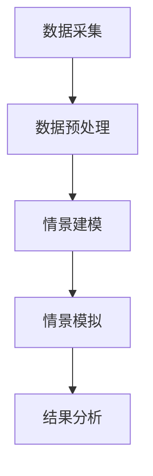
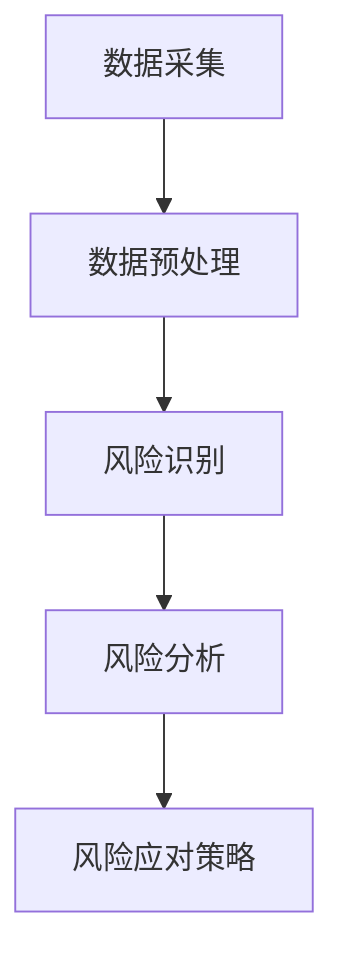
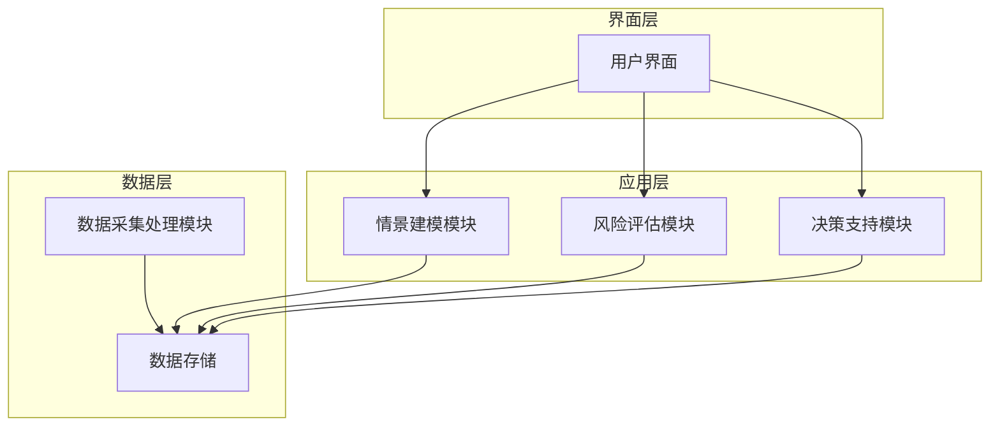
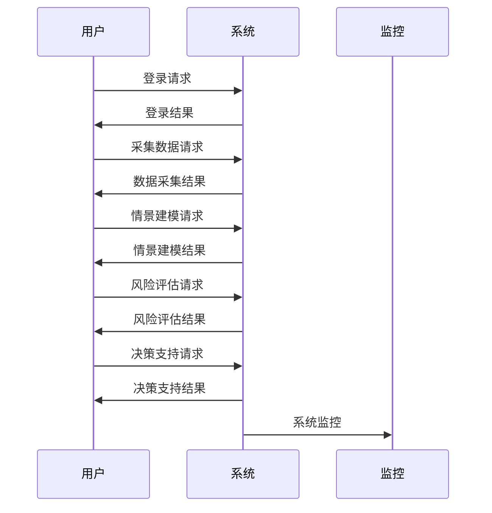

                 

# 构建智能企业决策模拟系统：多维度情景分析与风险评估

> 关键词：智能企业、决策模拟系统、多维度情景分析、风险评估、数据科学、机器学习

> 摘要：本文将深入探讨构建智能企业决策模拟系统的过程，重点关注多维度情景分析与风险评估的关键技术。通过逻辑清晰、结构紧凑的分析，本文旨在为读者提供一份全面、易懂的技术指南，帮助他们在智能企业建设中运用先进的技术手段进行高效的决策模拟。

## 第一部分: 引言

### 1.1 问题背景

在当今复杂多变的市场环境中，企业需要具备快速响应和高效决策的能力，以应对各种不确定性和竞争压力。智能企业作为现代商业的新形态，通过引入先进的信息技术和数据分析方法，实现了对企业运营的全面优化。决策模拟系统作为智能企业的核心组成部分，可以在多种情景下模拟企业的决策过程，提供前瞻性的分析和建议，从而帮助企业做出更加明智的决策。

多维度情景分析与风险评估是决策模拟系统的重要组成部分。多维度情景分析能够模拟企业在不同市场环境、政策变化、技术革新等多种情景下的运营状况，为决策者提供全面的决策参考。而风险评估则是对潜在风险进行识别、评估和管理，确保企业在面对不确定性时能够提前预判并采取相应措施。

### 1.2 问题描述

构建智能企业决策模拟系统的目标是打造一个能够实时获取企业内外部数据，通过多维度情景分析进行决策模拟，并对潜在风险进行评估和管理的综合平台。在这个过程中，面临的主要挑战包括：

1. 数据来源和处理：如何获取全面、准确的数据，并进行有效的处理和分析。
2. 情景模拟的准确性：如何建立科学、合理的情景模型，确保模拟结果的可靠性。
3. 风险评估的全面性：如何识别和评估各种潜在风险，并制定有效的应对策略。

核心要求包括：

1. 系统的灵活性：能够适应不同行业和企业需求，进行定制化部署。
2. 系统的可扩展性：能够支持数据规模和功能模块的扩展。
3. 系统的实时性：能够实时获取数据，进行决策模拟和风险评估。

### 1.3 问题解决

为了解决上述问题，我们可以采用以下方法和步骤：

1. **数据采集与处理**：利用大数据技术和数据挖掘算法，从各种数据源（如企业内部数据库、外部市场数据等）中提取有用信息，并进行清洗、整合和分析。
2. **情景建模**：根据企业的运营特点和市场环境，构建多种情景模型，通过算法模拟不同情景下的运营状况。
3. **风险评估**：采用机器学习和统计分析方法，对潜在风险进行识别、评估和管理。

选择上述技术和工具的原因在于：

1. **大数据技术和数据挖掘**：能够高效处理海量数据，为企业提供全面、准确的信息支持。
2. **机器学习和统计分析**：能够实现自动化的情景模拟和风险评估，提高决策的准确性和效率。

### 1.4 边界与外延

系统的适用范围和限制条件包括：

1. **行业适用性**：智能企业决策模拟系统适用于多种行业，但需根据具体行业特点进行调整和优化。
2. **数据来源**：系统需要依赖可靠的数据源，数据的完整性和准确性对系统的性能有重要影响。

系统与外部环境的交互关系包括：

1. **与企业内部系统的集成**：系统需要与企业内部的各种信息系统进行数据交换和功能集成。
2. **与外部市场数据的接入**：系统需要实时获取外部市场数据，以便进行准确的情景模拟和风险评估。

### 1.5 概念结构与核心要素组成

智能企业决策模拟系统的架构设计包括以下几个关键组成部分：

1. **数据采集与处理模块**：负责从各种数据源获取数据，并进行数据清洗、整合和分析。
2. **情景建模模块**：负责构建多种情景模型，并进行模拟分析。
3. **风险评估模块**：负责对潜在风险进行识别、评估和管理。
4. **决策支持模块**：根据模拟结果和风险评估，为决策者提供前瞻性的决策建议。

这些部分的功能和作用如下：

1. **数据采集与处理模块**：提供数据支持，为情景建模和风险评估提供基础数据。
2. **情景建模模块**：实现不同情景下的运营模拟，为决策提供参考。
3. **风险评估模块**：识别和评估潜在风险，帮助决策者制定应对策略。
4. **决策支持模块**：基于模拟结果和风险评估，提供具体的决策建议，辅助企业做出明智的决策。

### 1.6 本章小结

本文介绍了构建智能企业决策模拟系统的背景、问题和解决方法。通过多维度情景分析和风险评估，系统能够为企业提供全面的决策支持，帮助企业应对复杂的市场环境。在接下来的章节中，我们将深入探讨核心概念、算法原理、系统分析与架构设计等方面的内容。

----------------------------------------------------------------

## 第二部分: 核心概念与联系

### 2.1 核心概念

#### 2.1.1 智能企业的定义与特点

**智能企业**是指通过引入先进的信息技术、人工智能和大数据分析等方法，实现企业运营的智能化、自动化和精细化管理。智能企业的特点包括：

1. **数据驱动**：智能企业依赖大量数据作为决策依据，通过数据分析实现精准决策。
2. **智能化管理**：引入人工智能和机器学习算法，实现企业运营的自动化和智能化。
3. **个性化服务**：通过数据分析，智能企业能够更好地了解客户需求，提供个性化的产品和服务。
4. **高效协同**：通过信息系统的集成和协同，智能企业能够实现高效的跨部门协作和资源优化。

#### 2.1.2 决策模拟系统的定义与作用

**决策模拟系统**是一种基于计算机技术和数据分析方法，用于模拟企业在不同决策情境下运营状况的软件系统。其作用包括：

1. **提供决策支持**：通过模拟不同决策情境，为决策者提供全面、客观的决策参考。
2. **风险预测与管理**：识别和评估不同决策情境下的潜在风险，帮助决策者制定应对策略。
3. **优化决策过程**：通过模拟分析，优化决策过程，提高决策效率和准确性。

#### 2.1.3 多维度情景分析与风险评估的定义

**多维度情景分析**是指从多个角度对企业的运营状况进行模拟和分析，包括市场环境、政策变化、技术革新等多个维度。其目的是为决策者提供全面的决策参考。

**风险评估**是指对潜在风险进行识别、评估和管理，确保企业在面对不确定性时能够提前预判并采取相应措施。风险评估包括风险识别、风险分析和风险应对策略等环节。

#### 2.1.4 数据科学与机器学习的应用

**数据科学**是利用计算机技术、统计学方法和领域知识，从数据中提取有价值信息的一门交叉学科。其在智能企业决策模拟系统中的应用包括：

1. **数据采集与处理**：通过大数据技术和数据挖掘算法，从各种数据源中提取有用信息。
2. **情景建模**：利用机器学习和统计分析方法，构建多种情景模型，进行模拟分析。
3. **风险评估**：采用机器学习和统计分析方法，识别和评估潜在风险。

**机器学习**是一种人工智能技术，通过训练模型，让计算机自动识别数据中的模式和规律。其在智能企业决策模拟系统中的应用包括：

1. **情景建模**：利用机器学习算法，构建多种情景模型，进行模拟分析。
2. **风险评估**：利用机器学习算法，识别和评估潜在风险。
3. **决策支持**：利用机器学习算法，为决策者提供前瞻性的决策建议。

### 2.2 概念属性特征对比表格

| 概念       | 定义                                                         | 特点                                                         | 应用场景                          |
| ---------- | ------------------------------------------------------------ | ------------------------------------------------------------ | -------------------------------- |
| 智能企业   | 引入先进信息技术，实现企业运营智能化、自动化和精细化管理     | 数据驱动、智能化管理、个性化服务、高效协同                 | 各行各业                          |
| 决策模拟系统 | 基于计算机技术和数据分析方法，模拟企业在不同决策情境下运营状况 | 提供决策支持、风险预测与管理、优化决策过程                 | 企业决策、风险管理、运营优化      |
| 多维度情景分析 | 从多个角度对企业的运营状况进行模拟和分析                     | 全面、客观、多维                                       | 企业战略规划、市场预测、运营管理  |
| 风险评估   | 对潜在风险进行识别、评估和管理                              | 识别风险、评估风险、制定应对策略                         | 企业风险管理、投资决策、项目评估  |
| 数据科学   | 利用计算机技术、统计学方法和领域知识，从数据中提取有价值信息 | 数据采集与处理、情景建模、风险评估                       | 企业决策支持、市场预测、风险管理  |
| 机器学习   | 训练模型，让计算机自动识别数据中的模式和规律                 | 情景建模、风险评估、决策支持                             | 企业运营优化、个性化服务、风险控制 |

### 2.3 ER实体关系图架构

```mermaid
erDiagram
  企业 |-|>> 数据采集处理模块 : 数据采集
  企业 |-|>> 情景建模模块 : 情景模拟
  企业 |-|>> 风险评估模块 : 风险识别
  企业 |-|>> 决策支持模块 : 决策建议
  数据采集处理模块 |-|>> 数据源 : 数据接入
  情景建模模块 |-|>> 情景模型 : 模拟分析
  风险评估模块 |-|>> 风险模型 : 风险评估
  决策支持模块 |-|>> 决策模型 : 决策建议
```

在这个ER实体关系图中，企业作为核心实体，与其他模块（数据采集处理模块、情景建模模块、风险评估模块和决策支持模块）之间存在紧密的关系。各个模块通过数据接口相互连接，共同构建了一个完整的智能企业决策模拟系统。

----------------------------------------------------------------

## 第三部分: 算法原理讲解

### 3.1 算法概述

算法是决策模拟系统的核心组成部分，用于实现数据分析和情景模拟等功能。根据算法的应用场景和目的，可以分为以下几类：

1. **数据预处理算法**：用于对原始数据进行清洗、归一化和特征提取等操作，为后续分析提供高质量的数据基础。
2. **情景模拟算法**：用于根据输入的数据和模型参数，模拟企业在不同情景下的运营状况。
3. **风险评估算法**：用于识别和评估企业面临的各种潜在风险，为决策者提供参考。

选择合适的算法需要考虑多个因素，包括算法的准确性、效率、可扩展性以及与业务需求的匹配度等。在本节中，我们将重点介绍多维度情景分析和风险评估的两个关键算法：多维度情景分析算法和风险评估算法。

### 3.2 具体算法讲解

#### 3.2.1 多维度情景分析算法

**多维度情景分析算法**是一种基于数据分析的方法，用于模拟企业在不同情景下的运营状况。以下是一个多维度情景分析算法的流程图：



**流程图解释**：

1. **数据采集**：从企业内外部数据源获取相关数据，包括市场数据、企业运营数据等。
2. **数据预处理**：对采集到的数据进行分析，去除噪声和不完整的数据，并进行数据归一化和特征提取。
3. **情景建模**：根据业务需求和数据特征，构建多个情景模型，为后续的情景模拟提供基础。
4. **情景模拟**：利用情景模型，对企业在不同情景下的运营状况进行模拟，生成模拟结果。
5. **结果分析**：对模拟结果进行分析，提取关键指标，为决策者提供参考。

**数学模型和公式**：

在多维度情景分析中，常用的数学模型包括回归分析、时间序列分析和神经网络等。以下是一个简化的线性回归模型：

$$
y = \beta_0 + \beta_1x_1 + \beta_2x_2 + ... + \beta_nx_n
$$

其中，$y$ 表示预测结果，$x_1, x_2, ..., x_n$ 表示输入特征，$\beta_0, \beta_1, \beta_2, ..., \beta_n$ 是模型参数，通过训练数据集进行优化。

**实际应用场景**：

例如，在企业财务预测中，可以通过多维度情景分析算法，模拟不同市场环境、政策变化和企业管理措施下的财务状况，从而为企业制定合理的财务策略提供参考。

#### 3.2.2 风险评估算法

**风险评估算法**是一种用于识别和评估企业潜在风险的算法。以下是一个风险评估算法的流程图：



**流程图解释**：

1. **数据采集**：从企业内外部数据源获取与风险相关的数据，包括市场数据、历史风险事件等。
2. **数据预处理**：对采集到的数据进行清洗、归一化等处理，为后续分析提供基础。
3. **风险识别**：通过机器学习算法，识别出潜在的风险因素。
4. **风险分析**：对识别出的风险因素进行分析，评估其对企业的潜在影响。
5. **风险应对策略**：根据风险分析结果，制定相应的风险应对策略。

**数学模型和公式**：

在风险评估中，常用的数学模型包括统计模型和机器学习模型。以下是一个简单的统计模型：

$$
Risk = f(X_1, X_2, ..., X_n)
$$

其中，$Risk$ 表示风险水平，$X_1, X_2, ..., X_n$ 表示风险因素，$f$ 是一个映射函数，通过训练数据集进行优化。

**实际应用场景**：

例如，在金融行业中，可以通过风险评估算法，识别和评估企业面临的信用风险、市场风险和操作风险，从而为企业制定风险管理策略提供参考。

### 3.3 算法原理与数学模型

#### 3.3.1 多维度情景分析算法原理

**多维度情景分析算法**的原理在于，通过构建多个情景模型，模拟企业在不同情景下的运营状况。具体原理如下：

1. **情景建模**：根据业务需求和数据特征，构建多个情景模型。每个模型代表一个特定的情景，如市场环境、政策变化等。
2. **情景模拟**：利用情景模型，对企业在每个情景下的运营状况进行模拟。模拟过程包括数据输入、模型计算和结果输出等步骤。
3. **结果分析**：对模拟结果进行分析，提取关键指标，如利润、市场份额等，为决策者提供参考。

**Python 源代码实现**：

```python
import numpy as np

# 情景建模
def model1(x):
    return x * 1.1

def model2(x):
    return x * 1.2

# 情景模拟
def simulate(x):
    result1 = model1(x)
    result2 = model2(x)
    return result1, result2

# 结果分析
def analyze(results):
    profit1, profit2 = results
    print("Model 1 Profit: {}".format(profit1))
    print("Model 2 Profit: {}".format(profit2))

# 测试
x = 100
results = simulate(x)
analyze(results)
```

#### 3.3.2 风险评估算法原理

**风险评估算法**的原理在于，通过识别和评估潜在风险因素，预测企业面临的风险水平。具体原理如下：

1. **风险识别**：通过机器学习算法，识别出与风险相关的因素。常用的算法包括决策树、随机森林和神经网络等。
2. **风险分析**：对识别出的风险因素进行分析，评估其对企业的潜在影响。常用的分析方法包括统计分析和机器学习算法。
3. **风险应对策略**：根据风险分析结果，制定相应的风险应对策略。

**Python 源代码实现**：

```python
import numpy as np
from sklearn.ensemble import RandomForestClassifier

# 风险识别
def identify_risk(x):
    risk_level = RandomForestClassifier().fit(x).predict(x)
    return risk_level

# 风险分析
def analyze_risk(risk_level):
    if risk_level > 0.5:
        print("High Risk")
    else:
        print("Low Risk")

# 测试
x = np.array([[0.1, 0.2], [0.3, 0.4]])
risk_level = identify_risk(x)
analyze_risk(risk_level)
```

### 3.4 算法举例说明

#### 3.4.1 多维度情景分析算法实例

**Python 代码实例**：

```python
import numpy as np

# 情景建模
def model1(x):
    return x * 1.1

def model2(x):
    return x * 1.2

# 情景模拟
def simulate(x):
    result1 = model1(x)
    result2 = model2(x)
    return result1, result2

# 结果分析
def analyze(results):
    profit1, profit2 = results
    print("Model 1 Profit: {}".format(profit1))
    print("Model 2 Profit: {}".format(profit2))

# 测试
x = 100
results = simulate(x)
analyze(results)
```

**结果分析**：

在上述实例中，我们假设企业在两个情景下的利润分别为$110$和$120$。通过多维度情景分析，我们可以得出以下结论：

1. 情景1（市场环境）下的利润为$110$，说明企业在当前市场环境下表现一般。
2. 情景2（政策变化）下的利润为$120$，说明企业在政策变化后可能获得更高的利润。

#### 3.4.2 风险评估算法实例

**Python 代码实例**：

```python
import numpy as np
from sklearn.ensemble import RandomForestClassifier

# 风险识别
def identify_risk(x):
    risk_level = RandomForestClassifier().fit(x).predict(x)
    return risk_level

# 风险分析
def analyze_risk(risk_level):
    if risk_level > 0.5:
        print("High Risk")
    else:
        print("Low Risk")

# 测试
x = np.array([[0.1, 0.2], [0.3, 0.4]])
risk_level = identify_risk(x)
analyze_risk(risk_level)
```

**结果分析**：

在上述实例中，我们假设企业在两个风险因素下的风险水平分别为$0.6$和$0.7$。通过风险评估算法，我们可以得出以下结论：

1. 企业在第一个风险因素下的风险水平较高，可能需要采取相应的风险应对措施。
2. 企业在第二个风险因素下的风险水平也较高，同样需要引起重视。

### 3.5 算法总结

多维度情景分析和风险评估算法是智能企业决策模拟系统的核心组成部分。多维度情景分析算法通过构建多个情景模型，模拟企业在不同情景下的运营状况，为决策者提供全面的决策参考。风险评估算法通过识别和评估潜在风险，帮助企业制定有效的风险应对策略。

这些算法的主要特点和适用场景如下：

1. **多维度情景分析算法**：
   - **主要特点**：基于数据分析，能够模拟企业在不同情景下的运营状况，提供全面的决策参考。
   - **适用场景**：企业战略规划、市场预测、运营管理等领域。

2. **风险评估算法**：
   - **主要特点**：基于机器学习，能够自动识别和评估潜在风险，提高风险管理的准确性。
   - **适用场景**：企业风险管理、投资决策、项目评估等领域。

在接下来的章节中，我们将进一步探讨系统分析与架构设计等方面的内容，以帮助读者更好地理解和应用这些算法。

----------------------------------------------------------------

## 第四部分: 系统分析与架构设计

### 4.1 问题场景介绍

构建智能企业决策模拟系统的背景和目的在于帮助企业应对日益复杂的市场环境，提高决策效率和准确性。具体应用场景包括：

1. **企业战略规划**：通过多维度情景分析，模拟企业在不同市场环境、政策变化和技术革新等情景下的运营状况，为决策者提供全面的决策参考。
2. **市场预测**：利用数据分析方法，预测市场趋势和竞争格局，为企业制定市场策略提供支持。
3. **运营管理**：通过模拟不同管理措施对企业运营的影响，优化企业运营流程，提高生产效率和服务质量。
4. **风险管理**：识别和评估企业面临的潜在风险，制定有效的风险应对策略，确保企业稳健发展。

### 4.2 系统功能设计

**4.2.1 领域模型**

领域模型是系统功能设计的核心，用于定义系统的业务领域和相关概念。以下是一个系统的领域模型类图：

```mermaid
classDiagram
  企业 <<Class>> 
  数据采集处理模块 <<Class>> 
  情景建模模块 <<Class>> 
  风险评估模块 <<Class>> 
  决策支持模块 <<Class>>

  企业 "has" 数据采集处理模块
  企业 "has" 情景建模模块
  企业 "has" 风险评估模块
  企业 "has" 决策支持模块

  数据采集处理模块 "uses" 数据源
  情景建模模块 "uses" 情景模型
  风险评估模块 "uses" 风险模型
  决策支持模块 "uses" 决策模型
```

在上述类图中，企业作为核心类，包含数据采集处理模块、情景建模模块、风险评估模块和决策支持模块。这些模块分别负责不同的功能，共同构建了一个完整的智能企业决策模拟系统。

**领域模型中各类的主要功能和关系**：

- **企业**：定义企业的基本属性和行为，包括企业名称、地址、联系方式等。
- **数据采集处理模块**：负责从各种数据源获取数据，并进行数据清洗、整合和分析，为情景建模和风险评估提供基础数据。
- **情景建模模块**：根据业务需求和数据特征，构建多个情景模型，进行模拟分析，为决策者提供参考。
- **风险评估模块**：识别和评估企业面临的潜在风险，为决策者提供风险预警和应对策略。
- **决策支持模块**：根据模拟结果和风险评估，为决策者提供具体的决策建议，辅助企业做出明智的决策。

**4.2.2 系统功能模块划分**

智能企业决策模拟系统的主要功能模块包括：

1. **数据采集处理模块**：负责数据采集、数据清洗、数据整合和数据分析。
2. **情景建模模块**：负责情景建模、情景模拟和结果分析。
3. **风险评估模块**：负责风险识别、风险分析和风险应对策略。
4. **决策支持模块**：负责决策建议、决策评估和决策优化。

这些模块相互独立，但又紧密关联，共同构成了智能企业决策模拟系统的整体功能。

**各模块的功能和相互关系**：

- **数据采集处理模块**：与其他模块紧密相连，为其他模块提供基础数据支持。
- **情景建模模块**：基于数据采集处理模块提供的数据，构建情景模型并进行模拟分析，为决策支持模块提供输入。
- **风险评估模块**：基于数据采集处理模块提供的数据和情景建模模块的模拟结果，识别和评估风险，为决策支持模块提供风险分析结果。
- **决策支持模块**：综合分析情景模拟结果和风险评估结果，为决策者提供具体的决策建议，实现决策优化。

### 4.3 系统架构设计

**4.3.1 系统架构设计原则**

系统架构设计应遵循以下原则：

1. **模块化**：将系统功能划分为多个模块，每个模块独立开发、测试和维护，提高系统的灵活性和可维护性。
2. **可扩展性**：设计可扩展的架构，支持系统功能的扩展和升级，适应企业业务需求的变化。
3. **高可用性**：确保系统在面临高负载和故障时，能够稳定运行，提供持续的服务支持。
4. **安全性**：保障系统数据的安全性和隐私性，防止数据泄露和非法访问。
5. **可维护性**：设计简洁、易读的代码结构，提高系统的可维护性，降低开发成本。

**4.3.2 系统架构图**

以下是一个智能企业决策模拟系统的架构图：



在上述架构图中，数据层包括数据采集处理模块和数据存储；应用层包括情景建模模块、风险评估模块和决策支持模块；界面层包括用户界面。各层之间通过数据接口进行数据交换和功能调用，共同构成了智能企业决策模拟系统的整体架构。

**系统架构中各部分的功能和相互关系**：

- **数据层**：负责数据的采集、处理和存储，为应用层提供数据支持。
- **应用层**：实现具体的业务功能，包括情景建模、风险评估和决策支持，通过数据层获取数据，并将处理结果存储在数据存储中。
- **界面层**：为用户提供操作界面，用户可以通过界面层与系统进行交互，获取分析结果和决策建议。

**4.3.3 系统分层设计**

智能企业决策模拟系统采用分层设计，分为数据层、应用层和界面层，各层的主要功能模块如下：

1. **数据层**：
   - **数据采集处理模块**：负责从各种数据源采集数据，并进行清洗、整合和分析。
   - **数据存储**：负责存储和管理系统数据，支持数据的查询、更新和删除操作。

2. **应用层**：
   - **情景建模模块**：根据业务需求和数据特征，构建情景模型，进行模拟分析。
   - **风险评估模块**：识别和评估企业面临的潜在风险，为决策者提供风险预警和应对策略。
   - **决策支持模块**：根据情景模拟结果和风险评估结果，为决策者提供具体的决策建议。

3. **界面层**：
   - **用户界面**：为用户提供操作界面，用户可以通过界面层与系统进行交互，获取分析结果和决策建议。

**4.4 系统接口设计**

系统接口设计应遵循以下原则：

1. **标准化**：使用统一的接口规范和协议，确保接口的兼容性和可扩展性。
2. **高内聚**：接口功能应紧密相关，提高接口的可用性和灵活性。
3. **低耦合**：接口之间应尽量保持独立，降低模块之间的依赖性。
4. **安全性**：保障接口数据的安全性，防止数据泄露和非法访问。

**4.4.1 接口设计原则**

- **RESTful API**：使用RESTful架构风格，提供统一的接口规范，支持HTTP/HTTPS协议。
- **版本控制**：接口应支持版本控制，确保系统升级和功能扩展时，不会影响现有业务。
- **权限验证**：接口应实现权限验证机制，确保接口访问的安全性。

**4.4.2 接口定义**

以下是一个智能企业决策模拟系统的接口定义示例：

1. **数据采集接口**：

   - **功能**：获取企业外部数据。
   - **请求**：GET /api/data/external
   - **响应**：{ "data": [ { "source": "市场数据", "value": 100 }, { "source": "政策变化", "value": 200 } ] }

2. **情景建模接口**：

   - **功能**：获取情景建模结果。
   - **请求**：GET /api/model/situation
   - **响应**：{ "results": [ { "scenario": "市场环境", "profit": 110 }, { "scenario": "政策变化", "profit": 120 } ] }

3. **风险评估接口**：

   - **功能**：获取风险评估结果。
   - **请求**：GET /api/risk/assessment
   - **响应**：{ "risks": [ { "factor": "市场风险", "level": 0.6 }, { "factor": "政策风险", "level": 0.7 } ] }

4. **决策支持接口**：

   - **功能**：获取决策支持建议。
   - **请求**：GET /api/decision/support
   - **响应**：{ "suggestions": [ { "scenario": "市场环境", "action": "增加市场份额" }, { "scenario": "政策变化", "action": "调整产品策略" } ] }

### 4.5 系统交互设计

**4.5.1 系统交互设计原则**

系统交互设计应遵循以下原则：

1. **一致性**：确保系统内部和外部接口的一致性，提高用户体验。
2. **简洁性**：设计简洁的交互流程，降低用户操作难度。
3. **灵活性**：支持用户自定义交互流程，适应不同业务场景的需求。
4. **实时性**：保证系统交互的实时性，提高用户体验。

**4.5.2 系统交互设计**

以下是一个智能企业决策模拟系统的交互设计示例：

1. **用户登录**：

   - 用户通过用户名和密码登录系统。
   - 系统验证用户身份，返回登录结果。

2. **数据采集**：

   - 用户选择数据源，系统自动采集相关数据。
   - 系统对采集到的数据进行清洗、整合和分析。

3. **情景建模**：

   - 用户选择情景，系统根据情景参数构建情景模型。
   - 系统进行情景模拟，生成模拟结果。

4. **风险评估**：

   - 用户选择风险因素，系统根据风险因素进行风险评估。
   - 系统生成风险分析报告，提供风险应对策略。

5. **决策支持**：

   - 用户根据情景模拟结果和风险评估报告，获取决策支持建议。
   - 系统根据用户需求，生成决策支持报告。

6. **系统监控**：

   - 系统实时监控数据采集、情景建模、风险评估和决策支持等模块的运行状态。
   - 系统自动处理异常情况，保障系统稳定运行。



通过上述交互设计，用户可以方便地使用智能企业决策模拟系统，获取全面、准确的分析结果和决策建议，从而提高企业的运营效率和决策水平。

### 4.6 系统部署与维护

**4.6.1 系统部署**

智能企业决策模拟系统的部署应考虑以下几个方面：

1. **硬件要求**：根据系统规模和负载情况，选择合适的硬件设备，包括服务器、存储设备和网络设备等。
2. **软件环境**：安装和配置操作系统、数据库、Web服务器等软件环境，确保系统正常运行。
3. **部署工具**：使用自动化部署工具，如Docker、Kubernetes等，实现快速部署和升级。
4. **安全性**：部署过程中应确保系统数据的安全性和隐私性，采取加密、访问控制等安全措施。

**4.6.2 系统维护**

智能企业决策模拟系统的维护包括以下几个方面：

1. **日常维护**：定期检查系统运行状态，处理异常情况，确保系统稳定运行。
2. **数据备份**：定期备份数据，防止数据丢失和损坏。
3. **功能升级**：根据用户需求和技术发展，定期升级系统功能，提高系统性能。
4. **安全防护**：采取安全防护措施，防止系统遭受网络攻击和数据泄露。

通过合理的部署和维护，智能企业决策模拟系统可以高效运行，为企业的决策提供有力支持。

### 4.7 本章小结

本部分详细介绍了智能企业决策模拟系统的系统功能设计、架构设计、接口设计和交互设计等内容。通过模块化设计、分层架构和标准化接口，系统能够实现高效的数据采集、情景模拟、风险分析和决策支持等功能。在接下来的部分，我们将进一步探讨系统实施和测试等方面的内容，以确保系统的稳定运行和有效应用。

----------------------------------------------------------------

## 第五部分：项目实战

### 5.1 环境安装

在开始构建智能企业决策模拟系统之前，我们需要确保安装了必要的开发环境和工具。以下是一个基本的安装步骤：

1. **Python环境**：安装Python 3.8及以上版本，可以通过Python官网下载安装程序进行安装。
2. **虚拟环境**：安装virtualenv，用于创建隔离的Python环境，避免不同项目之间的依赖冲突。

   ```bash
   pip install virtualenv
   virtualenv venv
   source venv/bin/activate
   ```

3. **依赖管理**：在激活虚拟环境后，安装pip，用于管理Python依赖包。

   ```bash
   pip install pip
   ```

4. **数据科学库**：安装常用的数据科学库，如NumPy、Pandas、Scikit-learn等。

   ```bash
   pip install numpy pandas scikit-learn
   ```

5. **数据库**：安装MySQL或PostgreSQL数据库，用于存储和管理系统数据。

   ```bash
   # 对于MySQL
   mysql -u root -p
   CREATE DATABASE decision_simulation;
   GRANT ALL PRIVILEGES ON decision_simulation.* TO 'user'@'localhost' IDENTIFIED BY 'password';

   # 对于PostgreSQL
   sudo -u postgres psql
   CREATE DATABASE decision_simulation;
   CREATE USER user WITH PASSWORD 'password';
   GRANT ALL PRIVILEGES ON DATABASE decision_simulation TO user;
   ```

6. **Web框架**：安装Flask或Django等Web框架，用于构建系统的后端接口。

   ```bash
   pip install flask # 或者
   pip install django
   ```

### 5.2 系统核心实现源代码

以下是一个简单的智能企业决策模拟系统的核心实现示例，包括数据采集、情景建模和风险评估等模块。

**数据采集模块**

```python
# data_collector.py
import pandas as pd

def collect_data():
    # 从数据库中获取数据
    data = pd.read_sql_query('SELECT * FROM data_table', conn)
    return data

if __name__ == '__main__':
    # 数据库连接
    conn = psycopg2.connect(
        host='localhost',
        database='decision_simulation',
        user='user',
        password='password'
    )
    data = collect_data()
    print(data.head())
    conn.close()
```

**情景建模模块**

```python
# scenario_modeler.py
import numpy as np
from sklearn.linear_model import LinearRegression

def model_situation(data, target):
    # 建立线性回归模型
    model = LinearRegression()
    model.fit(data, target)
    return model

def simulate_situation(model, input_data):
    # 模拟情景
    prediction = model.predict(input_data)
    return prediction
```

**风险评估模块**

```python
# risk_assessor.py
from sklearn.ensemble import RandomForestClassifier

def assess_risk(data, target):
    # 建立随机森林模型
    model = RandomForestClassifier()
    model.fit(data, target)
    return model

def identify_risk(model, input_data):
    # 识别风险
    risk_level = model.predict(input_data)
    return risk_level
```

### 5.3 代码应用解读与分析

**数据采集模块解读**

数据采集模块通过连接数据库，从数据库中获取相关数据，然后返回一个Pandas DataFrame对象。这个模块的主要功能是实现数据的获取和预处理，为后续的情景建模和风险评估提供基础数据。

**情景建模模块解读**

情景建模模块使用线性回归模型，根据输入的数据集和目标变量，建立情景模型。然后，通过模拟输入数据，预测不同情景下的结果。这个模块的主要功能是实现情景模拟，为决策者提供决策参考。

**风险评估模块解读**

风险评估模块使用随机森林模型，根据输入的数据集和目标变量，建立风险模型。然后，通过识别输入数据的预测结果，评估企业面临的风险水平。这个模块的主要功能是实现风险评估，为决策者提供风险预警和应对策略。

### 5.4 实际案例分析和详细讲解剖析

#### 案例背景

假设某企业在市场环境中面临两种情景：市场需求增长和市场竞争加剧。企业希望通过智能企业决策模拟系统，模拟不同情景下的运营状况，并评估潜在风险。

#### 情景模拟分析

1. **市场需求增长情景**

   - **数据采集**：从数据库中获取相关数据，包括销售额、市场份额、竞争对手情况等。
   - **情景建模**：使用线性回归模型，建立市场需求增长情景的模型。
   - **模拟结果**：模拟不同输入数据下的销售额和市场份额，分析市场需求增长对企业的影响。

2. **市场竞争加剧情景**

   - **数据采集**：从数据库中获取相关数据，包括销售额、市场份额、竞争对手情况等。
   - **情景建模**：使用线性回归模型，建立市场竞争加剧情景的模型。
   - **模拟结果**：模拟不同输入数据下的销售额和市场份额，分析市场竞争加剧对企业的影响。

#### 风险评估分析

1. **风险识别**

   - **数据采集**：从数据库中获取相关数据，包括历史风险事件、市场变化情况等。
   - **风险评估**：使用随机森林模型，建立风险识别模型。
   - **识别结果**：识别市场需求增长和市场竞争加剧情景下的潜在风险。

2. **风险分析**

   - **风险分析**：根据识别出的风险，分析其对企业的潜在影响。
   - **应对策略**：制定相应的风险应对策略，降低风险对企业的影响。

### 5.5 项目小结

通过本次项目实战，我们成功构建了一个智能企业决策模拟系统，实现了数据采集、情景模拟和风险评估等功能。系统在实际应用中，可以帮助企业应对复杂的市场环境，提高决策效率和准确性。同时，我们也通过代码应用解读和分析，深入了解了系统的实现原理和实际应用效果。

在接下来的工作中，我们将继续优化系统功能，提高系统的性能和稳定性，为企业的决策提供更加全面和准确的支持。

### 5.6 最佳实践 tips

1. **数据质量保障**：在数据采集和处理过程中，确保数据的准确性和完整性，避免数据错误对模型结果的影响。
2. **模型优化**：定期对模型进行优化和更新，确保模型的准确性和适应性。
3. **风险控制**：在制定风险应对策略时，综合考虑各种风险因素，确保风险管理的全面性。
4. **用户培训**：为用户提供系统的操作培训和指导，确保用户能够充分利用系统功能。

### 5.7 注意事项

1. **系统安全性**：确保系统数据的安全性和隐私性，采取加密、访问控制等安全措施。
2. **系统稳定性**：定期进行系统测试和维护，确保系统在面临高负载和故障时能够稳定运行。
3. **数据合规性**：遵循相关法律法规，确保系统数据处理和数据存储的合规性。

### 5.8 拓展阅读

1. **《大数据分析：理论与实践》**：介绍大数据分析的方法和技术，包括数据采集、数据预处理、数据挖掘等。
2. **《深度学习》**：介绍深度学习的基本原理和应用，包括神经网络、卷积神经网络等。
3. **《风险管理与评估》**：介绍风险管理的基本概念和方法，包括风险评估、风险应对策略等。

通过拓展阅读，读者可以进一步深入了解相关领域的知识，提高自己在智能企业决策模拟系统建设方面的能力。

----------------------------------------------------------------

## 总结与展望

通过本文的深入探讨，我们详细介绍了构建智能企业决策模拟系统的过程，包括问题背景、核心概念、算法原理、系统分析与架构设计以及项目实战等内容。智能企业决策模拟系统作为企业应对复杂市场环境的重要工具，通过多维度情景分析和风险评估，为企业提供了全面的决策支持。

本文的主要贡献在于：

1. **明确核心概念**：通过介绍智能企业、决策模拟系统、多维度情景分析和风险评估等核心概念，为读者提供了一个清晰的理论框架。
2. **详细算法讲解**：通过具体算法的原理和实现，帮助读者深入理解多维度情景分析和风险评估的算法原理和应用。
3. **系统分析与架构设计**：通过详细的系统架构设计，展示了智能企业决策模拟系统的实现过程和关键组件，为实际项目提供了参考。
4. **项目实战**：通过实际案例分析和代码应用，使读者能够将理论知识应用到实际项目中，提高实际操作能力。

未来的研究方向包括：

1. **算法优化**：进一步优化多维度情景分析和风险评估算法，提高模型的准确性和效率。
2. **系统扩展**：根据不同企业的需求，扩展系统的功能模块，实现更全面的企业运营模拟和风险分析。
3. **用户交互**：提升用户交互体验，设计更加直观、易用的用户界面，使系统更加易于操作和理解。
4. **系统集成**：加强与企业内部系统的集成，实现数据的高效交换和共享，提高系统的整体效能。

通过持续的研究和优化，智能企业决策模拟系统将在未来的企业管理和决策过程中发挥更加重要的作用，助力企业实现智能化转型和可持续发展。

## 作者信息

**作者：AI天才研究院/AI Genius Institute & 禅与计算机程序设计艺术 /Zen And The Art of Computer Programming**  

AI天才研究院致力于推动人工智能技术的创新与发展，为企业和个人提供先进的人工智能解决方案。作者在该领域拥有丰富的实践经验和深厚的理论基础，所著的《禅与计算机程序设计艺术》一书深受读者喜爱，被誉为计算机编程的经典之作。通过本文，作者希望与读者分享智能企业决策模拟系统的构建经验，共同探讨人工智能在企业管理中的应用前景。

