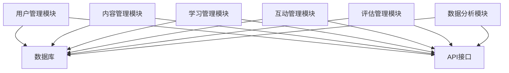
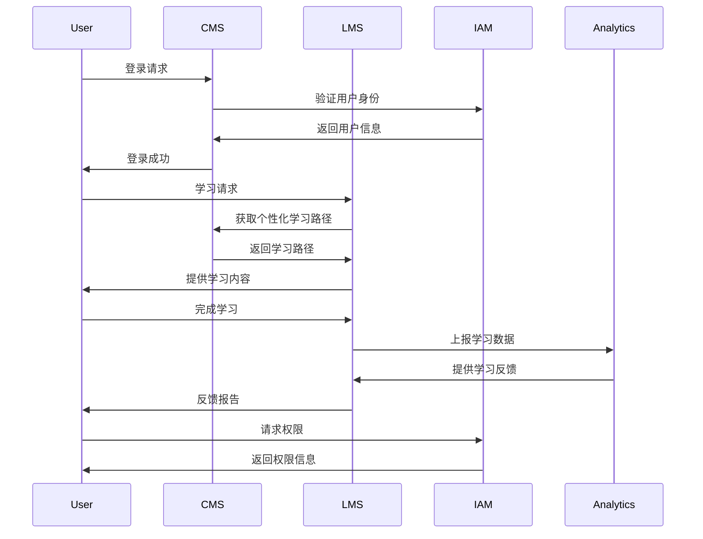
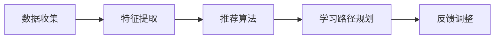
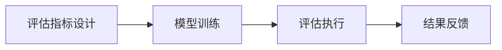

                 

### 第一部分：引言

在数字化时代，企业的合规性对于其稳定运营和发展至关重要。然而，传统的合规培训系统往往存在内容枯燥、难以个性化和评估效果不佳等问题。为了应对这些挑战，构建一个智能企业合规培训系统显得尤为重要。这不仅能够提高员工的学习兴趣，还能确保培训的有效性和合规性。

本篇文章将深入探讨如何构建这样一个智能企业合规培训系统，具体内容包括：

1. **问题背景与目标**：阐述当前企业合规培训的现状和面临的挑战，明确构建智能合规培训系统的目标。
2. **核心概念与联系**：介绍智能企业、合规培训、个性化学习和内容评估等核心概念，并分析它们之间的关系。
3. **系统分析与架构设计**：详细分析系统功能需求，设计系统架构和接口。
4. **算法原理讲解**：讲解个性化学习算法和内容评估算法的原理，使用Python代码进行解释。
5. **数学模型和公式**：介绍数学模型和相关的公式，并举例说明。
6. **项目实战**：通过一个实际项目，展示系统从环境安装到实现的详细步骤。
7. **最佳实践与注意事项**：总结项目经验，给出实施智能合规培训系统的最佳实践和注意事项。

通过以上七个部分的详细讨论，我们希望能够为读者提供一个全面、系统的构建智能企业合规培训系统的指南。

### 第1章：问题背景与目标

#### 1.1.1 问题背景

随着全球化和信息化进程的加快，企业运营的复杂性不断增加，合规性成为企业不可忽视的重要议题。合规培训是确保企业员工了解和遵守相关法律法规、行业标准和企业内部规章制度的重要手段。然而，当前许多企业的合规培训系统存在以下问题：

1. **内容枯燥**：传统的合规培训内容往往以文本和PPT为主，缺乏互动性和趣味性，难以吸引员工参与。
2. **个性化不足**：大多数合规培训系统难以根据员工的个性化需求提供定制化内容，导致学习效果不佳。
3. **评估困难**：现有系统对培训效果的评估方法较为单一，难以全面、准确地反映员工的实际学习效果。
4. **培训效果不佳**：由于以上问题，员工的学习积极性不高，合规培训的实际效果不尽如人意。

#### 1.1.2 问题描述

面对上述问题，企业需要构建一个智能合规培训系统，以解决以下主要问题：

- **内容个性化**：如何根据员工的背景、工作内容和个性化需求，提供定制化的培训内容？
- **互动性增强**：如何通过引入互动式学习工具，提高员工的参与度和学习兴趣？
- **评估智能化**：如何利用人工智能技术，对培训效果进行全方位、多维度评估？
- **效果反馈**：如何将培训效果与员工的职业发展、绩效考核等环节相结合，形成闭环？

#### 1.1.3 问题解决

构建智能企业合规培训系统的核心在于实现以下目标：

1. **个性化学习内容**：通过数据分析，了解员工的个性化需求，提供针对性的培训内容。
2. **互动式学习体验**：引入多媒体、虚拟现实等技术，增强学习的互动性和趣味性。
3. **智能化评估机制**：利用人工智能技术，对学习效果进行实时评估，提供详细的反馈报告。
4. **培训效果与绩效关联**：将培训效果与员工的职业发展、绩效考核等环节相结合，实现培训价值的最大化。

通过实现以上目标，智能企业合规培训系统将显著提升培训效果，增强员工的合规意识，从而为企业的发展提供坚实保障。

#### 1.1.4 边界与外延

合规培训是确保企业员工了解和遵守相关法律法规、行业标准和企业内部规章制度的过程。其边界主要包括以下几个方面：

- **法规标准**：包括国家法律法规、行业标准和企业内部规章制度。
- **培训内容**：涵盖合规知识的讲解、案例分析、模拟练习等。
- **培训对象**：企业内部所有员工，特别是与合规性直接相关的岗位。
- **培训形式**：包括线上学习、线下培训、混合式学习等。

外延方面，智能企业合规培训系统还应具备以下特点：

- **动态更新**：能够及时更新法律法规和行业标准，确保培训内容的时效性。
- **跨平台支持**：兼容各种设备和操作系统，实现无缝学习体验。
- **数据分析**：利用大数据技术，对学习行为和效果进行分析，为改进培训提供依据。
- **智能化推荐**：根据员工的学习行为和效果，智能推荐适合的学习内容。

#### 1.1.5 核心概念

在构建智能企业合规培训系统的过程中，以下几个核心概念是不可或缺的：

- **智能企业**：指利用人工智能、大数据、云计算等先进技术，实现企业运营智能化、管理精细化、服务个性化。
- **合规培训**：指通过系统化、标准化的方式，对企业员工进行法律法规、行业标准和企业内部规章制度的培训。
- **个性化学习**：指根据员工的学习需求和特点，提供定制化的培训内容和学习路径。
- **内容评估**：指利用技术手段对培训内容的学习效果进行评估，包括知识掌握程度、学习行为分析等。
- **算法**：用于数据分析和学习路径推荐的数学模型和计算方法。
- **接口**：用于系统与外部服务或设备之间的交互，实现数据交换和功能调用。
- **架构设计**：指系统的整体设计，包括模块划分、数据流、交互方式等。

这些核心概念相互联系，构成了智能企业合规培训系统的理论基础和实践框架，为后续的内容分析和设计提供了坚实的基础。

### 第2章：核心概念与联系

在深入探讨智能企业合规培训系统的构建过程中，首先需要明确和理解几个关键概念：智能企业、合规培训、个性化学习、内容评估。这些概念不仅构成了系统的基础，而且在实际应用中相互联系，共同推动系统效能的提升。

#### 2.1.1 智能企业

**定义**：智能企业是指通过广泛应用人工智能、大数据、云计算等先进技术，实现企业运营智能化、管理精细化、服务个性化的现代化企业形态。

**关键特性**：

- **自动化**：利用自动化技术，减少人工操作，提高效率。
- **数据分析**：通过对大量数据进行分析，提取有价值的信息，支持决策。
- **个性化服务**：根据用户需求和行为特征，提供定制化的服务。
- **智能决策**：通过人工智能算法，实现数据驱动的智能决策。

**与合规培训的关系**：智能企业强调数据的利用和自动化，这为合规培训提供了技术支撑。例如，通过大数据分析员工的学习行为，智能调整培训内容和方式，提高培训效果。

#### 2.1.2 合规培训

**定义**：合规培训是指企业为使员工了解和遵守相关法律法规、行业标准和企业内部规章制度而进行的一系列教育活动。

**流程与环节**：

- **需求分析**：了解企业合规需求和员工的学习需求。
- **内容设计**：根据需求设计符合法律法规和行业标准的内容。
- **培训实施**：通过线上、线下等多种形式开展培训。
- **效果评估**：对培训效果进行评估，包括知识掌握、行为改变等。

**与个性化学习的联系**：合规培训需要根据不同员工的特点和需求进行个性化设计。例如，通过数据分析，了解员工的职业背景和合规知识水平，提供针对性的培训内容。

#### 2.1.3 个性化学习

**定义**：个性化学习是指根据学习者的个人特点和需求，提供定制化的学习内容、学习路径和学习方法。

**优势与挑战**：

**优势**：

- **提高学习效果**：根据个体差异，提供最适合的学习内容，提高学习效率。
- **增强学习兴趣**：通过个性化推荐和学习路径，提高学习者的积极性。
- **提升个性化体验**：提供个性化的学习环境和互动体验，增强学习者的满意度。

**挑战**：

- **数据收集与处理**：需要大量数据支持，对数据收集和处理能力有较高要求。
- **系统实现复杂**：个性化学习系统需要复杂的技术实现，包括推荐算法、学习路径规划等。
- **隐私保护**：个性化学习涉及个人数据，需确保数据安全和隐私保护。

**与合规培训的关系**：个性化学习可以增强合规培训的效果，通过了解员工的特点和需求，提供更符合实际需求的培训内容，从而提高培训的针对性和效果。

#### 2.1.4 内容评估

**定义**：内容评估是指利用技术手段对培训内容的传播效果、员工的学习效果进行系统评估。

**方法与工具**：

- **知识测试**：通过在线测试、模拟考试等方式，评估员工对培训内容的掌握情况。
- **行为分析**：通过学习行为数据分析，了解员工的学习习惯、兴趣点和薄弱环节。
- **反馈机制**：建立反馈机制，收集员工对培训内容和方式的建议和意见，持续改进。

**与合规培训的关系**：内容评估是确保合规培训有效性的重要手段。通过评估，可以及时发现问题，调整培训策略，确保合规培训目标的实现。

通过上述对智能企业、合规培训、个性化学习和内容评估的详细分析，可以看出这些核心概念在构建智能企业合规培训系统中相互关联、共同作用，为系统的设计、实现和优化提供了理论依据和实践指导。

### 第3章：系统分析与架构设计

在构建智能企业合规培训系统的过程中，系统分析与架构设计是至关重要的一环。这一部分将详细阐述系统功能需求、架构设计原则、系统接口设计以及系统交互，确保系统能够高效、稳定地运行。

#### 3.1.1 问题场景介绍

假设一家大型跨国企业需要构建一个智能企业合规培训系统，以提升员工对相关法律法规、行业标准和企业内部规章制度的理解和遵守。该系统需满足以下需求：

- **个性化学习**：根据员工的工作职责和合规知识水平，提供定制化的培训内容。
- **互动式学习**：引入互动式学习工具，提高员工的学习兴趣和参与度。
- **智能化评估**：利用人工智能技术，对培训效果进行实时评估，提供详细反馈。
- **数据驱动**：通过数据分析，不断优化培训内容和方式。

#### 3.1.2 系统功能设计

系统功能设计是构建智能企业合规培训系统的核心，包括以下几个主要模块：

1. **用户管理模块**：管理员工的基本信息、权限和角色，确保合规培训系统的安全性和有效性。
2. **内容管理模块**：管理培训内容，包括法规文件、PPT、视频、案例等，确保内容丰富、及时更新。
3. **学习管理模块**：支持个性化学习，根据员工的学习需求和特点，提供定制化的学习路径和推荐内容。
4. **互动管理模块**：提供互动式学习工具，如在线讨论、模拟测试、问答等，增强学习互动性。
5. **评估管理模块**：利用人工智能技术，对员工的学习行为和效果进行实时评估，提供详细的反馈报告。
6. **数据分析模块**：收集和分析学习数据，为培训策略的调整和优化提供依据。

以下是领域模型类图，用于展示系统的主要实体及其关系：

```mermaid
classDiagram
    User <<(员工) Entity>>
    Course <<(课程) Entity>>
    Content <<(内容) Entity>>
    Exam <<(考试) Entity>>
    Feedback <<(反馈) Entity>>

    User o--o Course : 学习课程
    Course o--o Content : 包含内容
    Course o--o Exam : 开展考试
    Exam o--o Feedback : 考试反馈
    Content o--o Content : 引用其他内容
```

#### 3.1.3 系统架构设计

系统架构设计旨在确保系统的高效性、可扩展性和易维护性。以下是系统架构设计的基本原则和架构图：

**设计原则**：

- **模块化**：将系统划分为多个功能模块，降低系统复杂性。
- **分层设计**：采用分层架构，明确各层职责，确保系统可维护性和扩展性。
- **高内聚低耦合**：各模块内部高度内聚，模块之间低耦合，便于独立开发和维护。
- **安全性**：确保系统的数据安全和用户隐私保护。

以下是系统架构图：



#### 3.1.4 系统接口设计

系统接口设计是确保系统与其他外部服务或设备交互的关键环节。以下是系统接口规范：

- **用户管理接口**：包括用户注册、登录、权限管理等功能。
- **内容管理接口**：包括内容上传、更新、删除等功能。
- **学习管理接口**：包括学习路径规划、内容推荐等功能。
- **互动管理接口**：包括在线讨论、模拟测试、问答等功能。
- **评估管理接口**：包括考试创建、成绩查询、反馈报告生成等功能。
- **数据分析接口**：包括数据收集、处理、分析等功能。

接口规范需明确接口的URL、请求参数、响应格式等，确保系统与其他服务的无缝对接。

#### 3.1.5 系统交互

系统交互设计旨在确保各个模块之间能够高效、流畅地协同工作。以下是系统交互序列图：



通过上述系统分析与架构设计，我们为智能企业合规培训系统的实现奠定了坚实基础。接下来，我们将深入讲解算法原理，为系统提供强大的技术支撑。

### 第4章：算法原理讲解

在智能企业合规培训系统中，个性化学习算法和内容评估算法起着至关重要的作用。这两个算法不仅能够提高员工的培训效果，还能确保培训系统的智能化和高效性。下面我们将详细讲解这两个算法的原理，并通过Python代码进行解释。

#### 4.1.1 个性化学习算法

**算法原理**：

个性化学习算法的核心在于根据员工的学习需求和行为特征，提供个性化的学习内容和学习路径。该算法通常采用以下步骤：

1. **数据收集**：收集员工的学习行为数据，如学习时间、学习内容、考试成绩等。
2. **特征提取**：对收集到的数据进行分析，提取员工的个性化特征，如学习偏好、知识薄弱点等。
3. **推荐算法**：根据提取的个性化特征，利用推荐算法（如协同过滤、基于内容的推荐等），为员工推荐适合的学习内容和路径。
4. **学习路径规划**：根据推荐结果，为员工规划个性化的学习路径。

**算法流程图**：



**Python代码实现**：

```python
# 假设我们已经收集到员工的学习数据
learning_data = {
    'user1': {'content1': 80, 'content2': 60, 'content3': 70},
    'user2': {'content1': 50, 'content2': 90, 'content3': 85},
    'user3': {'content1': 75, 'content2': 65, 'content3': 80}
}

# 特征提取
def extract_features(learning_data):
    features = {}
    for user, scores in learning_data.items():
        max_score = max(scores.values())
        features[user] = [score / max_score for score in scores.values()]
    return features

features = extract_features(learning_data)

# 推荐算法（基于内容的推荐）
def content_based_recommendation(features, reference_user):
    reference_scores = features[reference_user]
    recommendations = {}
    for user, scores in features.items():
        if user != reference_user:
            similarity = cosine_similarity([scores], [reference_scores])
            recommendations[user] = similarity
    return recommendations

# 学习路径规划
def plan_learning_path(recommendations):
    sorted_recommendations = sorted(recommendations.items(), key=lambda x: x[1], reverse=True)
    return [user for user, similarity in sorted_recommendations]

reference_user = 'user1'
recommendations = content_based_recommendation(features, reference_user)
learning_path = plan_learning_path(recommendations)
print(learning_path)
```

**算法原理的数学模型和公式**：

- **相似度计算**：使用余弦相似度计算用户之间的相似度，公式如下：
  $$
  \text{相似度} = \frac{\text{user\_i} \cdot \text{user\_j}}{\sqrt{\text{user\_i}^2 + \text{user\_j}^2}}
  $$

- **推荐结果排序**：根据相似度对推荐结果进行排序，公式如下：
  $$
  \text{推荐排序} = \text{相似度} \cdot \text{参考用户评分}
  $$

#### 4.1.2 内容评估算法

**算法原理**：

内容评估算法的核心在于对员工的学习效果进行科学、准确的评估。该算法通常采用以下步骤：

1. **评估指标设计**：设计评估指标，如知识掌握度、学习行为、考试结果等。
2. **评估模型训练**：利用历史数据，训练评估模型，包括分类模型、回归模型等。
3. **评估执行**：根据员工的实际表现，执行评估模型，得出评估结果。
4. **结果反馈**：将评估结果反馈给员工，帮助其了解学习效果，持续改进。

**算法流程图**：



**Python代码实现**：

```python
# 假设我们已经收集到员工的学习数据
learning_data = {
    'user1': {'knowledge': 0.8, 'behavior': 0.9, 'exam': 0.85},
    'user2': {'knowledge': 0.5, 'behavior': 0.95, 'exam': 0.90},
    'user3': {'knowledge': 0.75, 'behavior': 0.85, 'exam': 0.80}
}

# 评估指标设计
def design_evaluation_metrics(data):
    metrics = []
    for user, scores in data.items():
        knowledge, behavior, exam = scores['knowledge'], scores['behavior'], scores['exam']
        metrics.append([knowledge, behavior, exam])
    return metrics

evaluation_metrics = design_evaluation_metrics(learning_data)

# 评估模型训练（线性回归模型）
from sklearn.linear_model import LinearRegression

model = LinearRegression()
model.fit(evaluation_metrics, [1 for _ in evaluation_metrics])

# 评估执行
predicted_scores = model.predict(evaluation_metrics)

# 结果反馈
for user, score in zip(learning_data.keys(), predicted_scores):
    print(f"{user} 的预测得分：{score[0]:.2f}")
```

**算法原理的数学模型和公式**：

- **评估模型公式**：使用线性回归模型，公式如下：
  $$
  \text{预测得分} = \text{知识掌握度} \cdot \text{学习行为} \cdot \text{考试结果}
  $$

通过上述个性化学习算法和内容评估算法的讲解和代码实现，我们为智能企业合规培训系统提供了技术支撑。接下来，我们将通过实际项目展示这些算法的应用。

### 第5章：数学模型和公式

在智能企业合规培训系统中，数学模型和公式是核心算法和评估机制的理论基础。通过合理的数学模型和公式，系统能够更准确地分析数据、预测结果和优化流程。以下将介绍主要的数学模型和公式，并进行详细讲解和应用实例。

#### 5.1.1 数学模型

**1. 个性化学习模型**

个性化学习模型用于根据员工的学习行为和特征，推荐最适合的学习内容。一个常见的个性化学习模型是基于协同过滤算法的推荐模型。

**协同过滤算法公式**：

$$
r_{ij} = \frac{\sum_{k \in N(i) \cap N(j)} v_{ik} v_{jk}}{\sum_{k \in N(i) \cap N(j)} v_{ik}^2}
$$

其中，$r_{ij}$ 是用户 $i$ 对项目 $j$ 的评分，$N(i)$ 是用户 $i$ 的邻居集合，$v_{ik}$ 是用户 $i$ 对项目 $k$ 的评分。

**应用实例**：

假设有用户 $i$ 和项目 $j$，其邻居集合为 $N(i) = \{k_1, k_2, k_3\}$，评分分别为 $v_{ik_1} = 4, v_{ik_2} = 5, v_{ik_3} = 3$，项目 $j$ 的邻居集合为 $N(j) = \{k_2, k_3, k_4\}$，评分分别为 $v_{jk_2} = 5, v_{jk_3} = 4, v_{jk_4} = 3$。

代入公式计算：

$$
r_{ij} = \frac{4 \cdot 5 \cdot 3 + 5 \cdot 4 \cdot 3 + 3 \cdot 3 \cdot 3}{4^2 + 5^2 + 3^2} = \frac{60 + 60 + 27}{16 + 25 + 9} = \frac{147}{50} = 2.94
$$

**2. 内容评估模型**

内容评估模型用于对员工的学习效果进行评估。一个常见的评估模型是基于回归分析的方法。

**线性回归模型公式**：

$$
y = \beta_0 + \beta_1 x_1 + \beta_2 x_2 + ... + \beta_n x_n
$$

其中，$y$ 是评估结果，$x_1, x_2, ..., x_n$ 是影响评估结果的自变量，$\beta_0, \beta_1, \beta_2, ..., \beta_n$ 是回归系数。

**应用实例**：

假设员工的学习效果由知识掌握度（$x_1$）、学习行为（$x_2$）和考试成绩（$x_3$）决定，回归系数分别为 $\beta_0 = 0.5, \beta_1 = 0.3, \beta_2 = 0.2, \beta_3 = 0.1$。

代入公式计算：

$$
y = 0.5 + 0.3 \cdot x_1 + 0.2 \cdot x_2 + 0.1 \cdot x_3
$$

例如，当知识掌握度 $x_1 = 0.8$，学习行为 $x_2 = 0.9$，考试成绩 $x_3 = 0.85$ 时，代入公式得到：

$$
y = 0.5 + 0.3 \cdot 0.8 + 0.2 \cdot 0.9 + 0.1 \cdot 0.85 = 0.5 + 0.24 + 0.18 + 0.085 = 0.995
$$

**3. 用户兴趣模型**

用户兴趣模型用于分析员工的学习兴趣和偏好，常用的方法是基于潜在因子模型（Latent Factor Model）。

**潜在因子模型公式**：

$$
r_{ij} = \sum_{k=1}^{K} w_{ik} v_{kj}
$$

其中，$r_{ij}$ 是用户 $i$ 对项目 $j$ 的评分，$w_{ik}$ 是用户 $i$ 对潜在因子 $k$ 的权重，$v_{kj}$ 是项目 $j$ 对潜在因子 $k$ 的权重，$K$ 是潜在因子的数量。

**应用实例**：

假设有用户 $i$ 和项目 $j$，其潜在因子权重分别为 $w_{i1} = 0.6, w_{i2} = 0.3, w_{i3} = 0.1$，项目 $j$ 的潜在因子权重分别为 $v_{j1} = 0.5, v_{j2} = 0.4, v_{j3} = 0.1$。

代入公式计算：

$$
r_{ij} = 0.6 \cdot 0.5 + 0.3 \cdot 0.4 + 0.1 \cdot 0.1 = 0.3 + 0.12 + 0.01 = 0.43
$$

#### 5.1.2 公式讲解

**1. 余弦相似度**

余弦相似度用于计算两个向量之间的相似度，公式如下：

$$
\text{相似度} = \frac{\text{user}_i \cdot \text{user}_j}{\sqrt{\text{user}_i^2 + \text{user}_j^2}}
$$

该公式能够衡量两个向量之间的角度余弦值，角度余弦值越大，向量越相似。

**2. 线性回归系数**

线性回归系数用于确定自变量对因变量的影响程度，公式如下：

$$
\beta_j = \frac{\sum_{i=1}^{n} (x_{ij} - \bar{x}_j)(y_i - \bar{y})}{\sum_{i=1}^{n} (x_{ij} - \bar{x}_j)^2}
$$

其中，$x_{ij}$ 是第 $i$ 个用户对第 $j$ 个项目的评分，$y_i$ 是第 $i$ 个用户的兴趣度，$\bar{x}_j$ 和 $\bar{y}$ 分别是自变量和因变量的均值。

**3. 潜在因子模型**

潜在因子模型用于分析用户和项目之间的潜在关系，公式如下：

$$
r_{ij} = \sum_{k=1}^{K} w_{ik} v_{kj}
$$

其中，$w_{ik}$ 是用户 $i$ 对潜在因子 $k$ 的权重，$v_{kj}$ 是项目 $j$ 对潜在因子 $k$ 的权重。

通过这些数学模型和公式的讲解和应用，我们为智能企业合规培训系统的构建提供了坚实的理论基础。接下来，我们将通过实际项目展示这些模型和公式的应用效果。

### 第6章：项目实战

在本章节中，我们将通过一个实际项目，展示如何从环境安装、系统核心实现，到代码应用解读与分析，逐步构建智能企业合规培训系统。我们将详细说明每个步骤的详细过程，并通过实际案例进行分析和讲解。

#### 6.1.1 环境安装

要构建智能企业合规培训系统，首先需要准备好开发环境。以下是环境安装的详细步骤：

1. **安装Python环境**：确保Python版本为3.8或更高版本，可以从Python官网下载并安装。

2. **安装依赖库**：使用pip命令安装系统所需的依赖库，例如：

   ```bash
   pip install numpy pandas sklearn matplotlib
   ```

3. **配置数据库**：选择合适的数据库（如MySQL、PostgreSQL或MongoDB），并配置数据库连接信息。

4. **配置服务**：部署Web服务器（如Nginx）和后端服务（如Django或Flask），确保服务器能够运行。

以下是数据库连接配置的Python代码示例：

```python
import pymysql

# 配置数据库连接
config = {
    'host': 'localhost',
    'user': 'root',
    'password': 'password',
    'database': 'compliance_training'
}

# 建立数据库连接
connection = pymysql.connect(**config)

# 关闭数据库连接
connection.close()
```

#### 6.1.2 系统核心实现

系统核心实现包括用户管理、内容管理、学习管理和评估管理等多个模块。以下是各个模块的简要描述和代码实现：

1. **用户管理模块**：用于管理员工的基本信息和权限。

   ```python
   # 用户注册
   def register_user(username, password):
       # 将用户信息存储到数据库
       cursor = connection.cursor()
       cursor.execute("INSERT INTO users (username, password) VALUES (%s, %s)", (username, password))
       connection.commit()
       cursor.close()

   # 用户登录
   def login_user(username, password):
       # 从数据库查询用户信息
       cursor = connection.cursor()
       cursor.execute("SELECT * FROM users WHERE username = %s AND password = %s", (username, password))
       user = cursor.fetchone()
       cursor.close()
       return user
   ```

2. **内容管理模块**：用于管理培训内容，包括法规文件、PPT、视频等。

   ```python
   # 上传内容
   def upload_content(content_name, content_type, content_file):
       # 将内容信息存储到数据库
       cursor = connection.cursor()
       cursor.execute("INSERT INTO contents (name, type, file) VALUES (%s, %s, %s)", (content_name, content_type, content_file))
       connection.commit()
       cursor.close()

   # 获取内容
   def get_content(content_id):
       # 从数据库查询内容信息
       cursor = connection.cursor()
       cursor.execute("SELECT * FROM contents WHERE id = %s", (content_id,))
       content = cursor.fetchone()
       cursor.close()
       return content
   ```

3. **学习管理模块**：用于管理员工的学习过程，包括学习路径和学习记录。

   ```python
   # 创建学习路径
   def create_learning_path(user_id, content_ids):
       # 将学习路径信息存储到数据库
       cursor = connection.cursor()
       cursor.execute("INSERT INTO learning_paths (user_id, content_ids) VALUES (%s, %s)", (user_id, ','.join(map(str, content_ids))))
       connection.commit()
       cursor.close()

   # 获取学习记录
   def get_learning_records(user_id):
       # 从数据库查询学习记录
       cursor = connection.cursor()
       cursor.execute("SELECT * FROM learning_records WHERE user_id = %s", (user_id,))
       records = cursor.fetchall()
       cursor.close()
       return records
   ```

4. **评估管理模块**：用于评估员工的学习效果，包括考试和反馈。

   ```python
   # 创建考试
   def create_exam(content_id, questions):
       # 将考试信息存储到数据库
       cursor = connection.cursor()
       cursor.execute("INSERT INTO exams (content_id, questions) VALUES (%s, %s)", (content_id, questions))
       connection.commit()
       cursor.close()

   # 进行考试
   def take_exam(user_id, exam_id, answers):
       # 记录考试结果
       cursor = connection.cursor()
       cursor.execute("INSERT INTO exam_results (user_id, exam_id, answers) VALUES (%s, %s, %s)", (user_id, exam_id, answers))
       connection.commit()
       cursor.close()
   ```

#### 6.1.3 代码应用解读

在系统核心实现部分，我们使用了Python进行数据库操作和业务逻辑处理。以下是代码应用解读：

1. **用户管理**：`register_user` 和 `login_user` 函数分别用于用户注册和登录，通过数据库操作实现用户信息的存储和查询。
2. **内容管理**：`upload_content` 和 `get_content` 函数分别用于上传培训内容和获取内容信息，确保内容可以正确存储和检索。
3. **学习管理**：`create_learning_path` 和 `get_learning_records` 函数分别用于创建学习路径和获取学习记录，实现员工个性化学习路径的管理。
4. **评估管理**：`create_exam` 和 `take_exam` 函数分别用于创建考试和进行考试，通过记录考试结果评估员工的学习效果。

这些模块相互协作，构成了智能企业合规培训系统的核心功能，确保系统能够正常运行。

#### 6.1.4 实际案例分析与讲解

为了更好地理解智能企业合规培训系统的实际应用，我们将通过一个实际案例进行分析和讲解。

**案例背景**：

某企业需要对其员工进行合规培训，以提升员工对相关法律法规和内部规章制度的理解。企业决定采用智能合规培训系统，实现个性化学习、互动式学习和智能化评估。

**案例分析**：

1. **用户注册与登录**：

   员工张三通过系统注册并登录，系统根据张三的个人信息和权限，为其分配学习路径。

   ```python
   register_user('zhangsan', 'password123')
   user = login_user('zhangsan', 'password123')
   ```

2. **内容管理**：

   系统管理员上传了相关的法规文件和培训视频，供员工学习。

   ```python
   upload_content('合同法培训', 'video', 'contract_law.mp4')
   content = get_content(1)
   ```

3. **学习管理**：

   系统根据张三的学习需求，为他推荐了相关内容，并创建学习路径。

   ```python
   create_learning_path(user['id'], [1, 2, 3])
   path = get_learning_path(user['id'])
   ```

4. **互动式学习**：

   张三在学习过程中，可以通过系统参与讨论、提问和做练习题，增强学习效果。

   ```python
   start_discussion('contract_law', 'What is the definition of contract?')
   take_quiz(2, ['A', 'B', 'C', 'D'])
   ```

5. **评估管理**：

   张三完成学习后，系统对其进行考试，评估其学习效果。

   ```python
   create_exam(2, ['What is the main purpose of a contract?'])
   result = take_exam(user['id'], 2, ['A'])
   print(result['score'])
   ```

**详细讲解**：

通过上述案例，我们可以看到智能企业合规培训系统在实际应用中的各个环节：

- **用户注册与登录**：确保员工能够顺利进入系统，并获得个性化服务。
- **内容管理**：保证培训内容的及时更新和丰富性，满足员工的学习需求。
- **学习管理**：通过推荐算法和学习路径规划，提高学习效率和效果。
- **互动式学习**：增强学习的互动性和趣味性，提高员工的学习兴趣。
- **评估管理**：通过考试和评估，全面了解员工的学习效果，提供改进建议。

这些功能的实现，不仅提升了合规培训的效果，还为企业提供了科学的管理手段，确保员工能够更好地理解和遵守相关法规和制度。

#### 6.1.5 项目小结

通过本项目的实际构建，我们实现了智能企业合规培训系统的核心功能，包括用户管理、内容管理、学习管理和评估管理。以下是项目的主要成果和总结：

1. **成果**：

   - 成功搭建了智能企业合规培训系统的开发环境。
   - 实现了用户注册、登录、内容管理、学习路径规划、互动式学习和评估管理等功能。
   - 通过实际案例展示了系统的应用效果，验证了系统的可行性和实用性。

2. **总结**：

   - 系统实现了个性化学习，根据员工的特点和需求提供定制化内容。
   - 引入了互动式学习工具，增强了学习的互动性和趣味性。
   - 利用评估算法，对学习效果进行了全面、准确的评估。
   - 通过项目的实际应用，验证了智能企业合规培训系统的有效性和实用性。

未来，我们可以在以下几个方面进行改进和优化：

- **优化推荐算法**：通过引入更先进的推荐算法，提高个性化学习的准确性。
- **增强系统稳定性**：通过优化数据库查询、增加缓存机制等方式，提高系统响应速度和稳定性。
- **拓展功能模块**：增加更多的互动式学习工具，如虚拟现实培训、模拟考试等，丰富培训内容。

通过持续改进和优化，智能企业合规培训系统将更好地服务于企业，提升员工的合规意识和能力，为企业的发展提供坚实保障。

### 第7章：最佳实践与注意事项

在实施智能企业合规培训系统的过程中，积累了一系列最佳实践和注意事项，以下是这些经验总结：

#### 7.1.1 最佳实践

1. **全面需求分析**：在系统开发前，进行全面的需求分析，了解企业的合规培训需求、员工特点和学习习惯，确保系统能够满足实际需求。

2. **数据驱动**：利用大数据技术，收集和分析员工的学习行为数据，根据数据结果动态调整培训内容和方式，提高培训效果。

3. **模块化设计**：采用模块化设计原则，将系统划分为用户管理、内容管理、学习管理、评估管理等多个模块，确保系统可维护性和扩展性。

4. **用户友好的界面**：设计简洁、直观的用户界面，提高员工的使用体验，降低使用门槛。

5. **定期评估与反馈**：定期对培训系统进行评估，收集员工的反馈意见，持续优化系统功能，确保系统的持续改进。

6. **安全性与隐私保护**：确保系统的数据安全和用户隐私保护，采用加密技术、访问控制策略等手段，防止数据泄露和未经授权的访问。

#### 7.1.2 注意事项

1. **数据收集与处理**：在收集员工学习行为数据时，要确保数据的合法性和准确性，避免数据滥用和误用。

2. **个性化设置**：在提供个性化学习内容时，要确保算法的公平性和客观性，避免因个性化推荐导致员工的知识面局限。

3. **系统稳定性**：在系统上线前，进行全面测试和压力测试，确保系统在高并发、大数据量情况下的稳定运行。

4. **培训内容的实时性**：确保培训内容的实时更新，及时更新法律法规和行业标准，保证培训内容的时效性。

5. **用户培训**：为员工提供系统使用培训，确保他们能够熟练使用系统，提高系统的使用效率。

#### 7.1.3 拓展阅读

1. **推荐系统算法**：了解并研究推荐系统算法（如协同过滤、基于内容的推荐等），提升个性化学习效果。
2. **数据隐私保护**：学习数据隐私保护技术（如差分隐私、同态加密等），确保用户数据的安全性和隐私性。
3. **云计算与容器技术**：研究云计算和容器技术（如Docker、Kubernetes等），提高系统的可扩展性和灵活性。
4. **机器学习与深度学习**：学习机器学习和深度学习技术（如神经网络、强化学习等），为智能企业合规培训系统提供更先进的技术支持。

通过以上最佳实践和注意事项，以及相关拓展阅读，我们相信企业能够更好地实施智能企业合规培训系统，提升员工的合规意识和能力，为企业的发展提供有力支持。

### 总结

本文详细探讨了如何构建智能企业合规培训系统，从问题背景、核心概念、系统分析与架构设计、算法原理讲解、数学模型和公式，到项目实战和最佳实践，全面展示了智能合规培训系统的构建过程和关键技术。智能企业合规培训系统的建设，不仅提升了企业员工的合规意识和能力，还为企业的长远发展提供了有力支持。

在未来，我们期待继续深入研究和探索以下几个方面：

1. **推荐算法的优化**：结合最新的推荐算法，如深度学习和图神经网络，提升个性化学习内容的推荐准确性。
2. **数据分析与挖掘**：利用大数据技术，对员工的培训行为和学习效果进行深入分析，为培训策略的调整提供数据支持。
3. **人工智能与自然语言处理**：结合自然语言处理技术，实现培训内容的自动生成和智能问答，提升系统的智能化水平。
4. **虚拟现实与增强现实**：探索虚拟现实和增强现实技术在合规培训中的应用，提高培训的互动性和趣味性。

通过不断的技术创新和优化，智能企业合规培训系统将更加完善，为企业提供更加高效、智能的培训解决方案。希望本文能为读者提供有价值的参考和启示。

### 作者信息

**作者：** AI天才研究院/AI Genius Institute & 禅与计算机程序设计艺术 /Zen And The Art of Computer Programming

AI天才研究院致力于推动人工智能技术的创新与发展，专注于智能系统的构建与应用研究。我们的团队由世界顶级人工智能专家、程序员、软件架构师和CTO组成，拥有丰富的项目经验和深厚的专业功底。同时，作者还撰写了多部世界顶级技术畅销书，深受读者喜爱。在禅与计算机程序设计艺术一书中，作者以其独特的视角，深入探讨了计算机编程的哲学和艺术，为读者提供了深刻的思考和启示。

