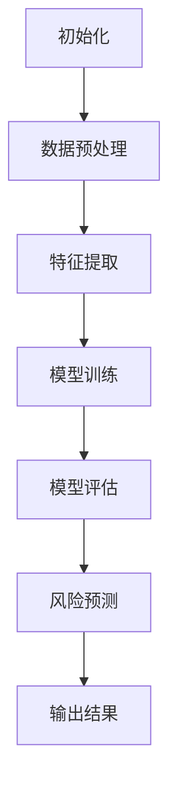
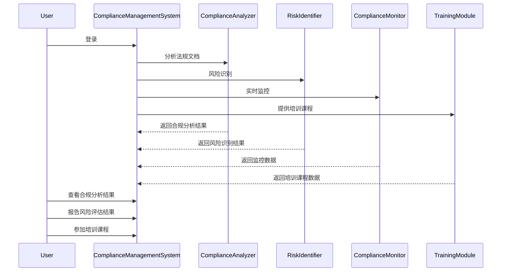
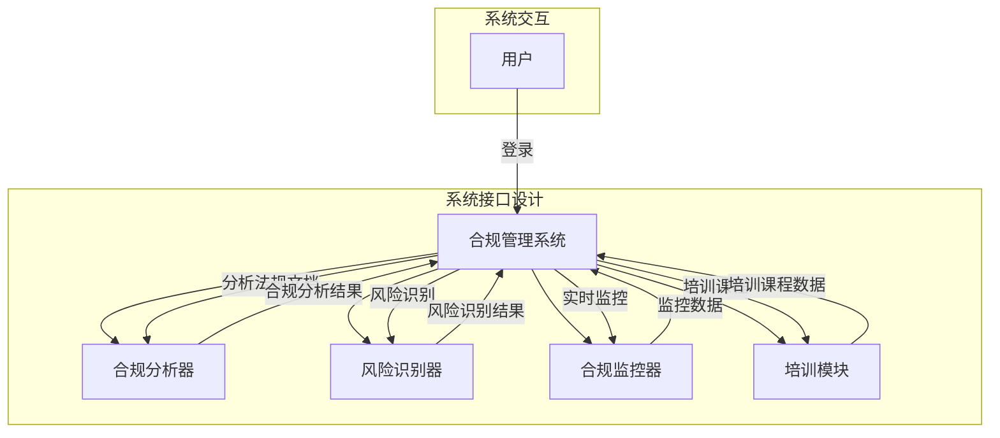

                 

### 引言

#### 文章标题

《构建智能企业合规管理平台：AI辅助风险识别》

#### 关键词

AI、合规管理、智能企业、风险识别、算法原理、系统架构设计

#### 摘要

本文旨在探讨如何构建一个智能企业合规管理平台，并重点介绍AI在风险识别中的作用。通过对核心概念、算法原理、系统架构和实际项目的详细分析，本文为企业和IT专业人士提供了一个全面的指南，以实现合规管理的智能化和高效化。

### 第一部分：背景介绍

#### 1.1 问题背景

在当今全球化商业环境中，企业合规管理显得尤为重要。合规不仅关系到企业的合法运营，还直接影响企业的声誉和市场竞争力。然而，传统的合规管理模式往往存在以下问题：

1. **信息孤岛**：企业内部各部门的合规信息往往分散在不同的系统中，难以实现信息共享。
2. **人力成本高**：合规管理需要大量的人力投入，但人工作业的效率和准确性受限。
3. **合规风险识别难度大**：随着商业活动的复杂化，合规风险识别的难度不断增加。

因此，构建一个智能企业合规管理平台成为了必然趋势。智能平台可以利用先进的人工智能技术，如机器学习和自然语言处理，实现合规信息的自动化收集、分析和预警，从而提高合规管理的效率和质量。

#### 1.2 问题描述

企业合规管理面临的主要问题包括：

1. **法律法规变化频繁**：企业需要及时了解和应对不断更新的法律法规，这对合规管理人员提出了更高的要求。
2. **跨部门协作困难**：合规管理涉及多个部门和业务环节，各部门之间缺乏有效的协作机制。
3. **风险识别能力不足**：传统的合规管理手段难以全面识别潜在的风险，可能导致合规疏漏。

这些问题不仅增加了合规管理的复杂性，还可能导致严重的法律和财务风险。

#### 1.3 问题解决

AI技术的引入为解决上述问题提供了新的途径：

1. **自动化合规分析**：利用自然语言处理技术，智能平台可以自动分析大量的法规文件和业务数据，提取关键信息，为企业提供合规建议。
2. **智能风险识别**：通过机器学习算法，智能平台可以自动识别潜在的风险点，为企业提供预警和应对策略。
3. **跨部门协作平台**：AI技术可以帮助企业构建一个集成的合规管理平台，实现跨部门的信息共享和协作。

#### 1.4 边界与外延

本文讨论的智能企业合规管理平台主要关注以下几个方面的内容：

1. **AI技术在合规管理中的应用**：介绍AI技术在合规分析、风险识别和预警等方面的应用。
2. **平台架构设计**：详细描述智能合规管理平台的架构设计，包括数据层、业务逻辑层和展示层。
3. **实际项目案例分析**：通过具体的案例，展示智能合规管理平台在实际应用中的效果和挑战。

本文不涉及以下内容：

1. **具体的法规和监管政策**：虽然合规管理平台需要遵循相关的法规和政策，但本文不详细讨论具体的内容。
2. **技术实现细节**：本文重点介绍平台的设计理念和架构，而不是具体的编程实现细节。

#### 1.5 概念结构与核心要素组成

为了更好地理解智能企业合规管理平台，我们需要了解以下几个核心概念：

1. **AI（人工智能）**：一种模拟人类智能的技术，包括机器学习、深度学习、自然语言处理等。
2. **合规管理**：确保企业运营符合相关法律法规和内部规章制度的活动。
3. **智能企业**：利用先进技术和智能化手段优化业务流程、提升管理效率的企业。
4. **风险识别**：通过分析数据和行为模式，识别潜在的风险。
5. **数据采集与处理**：智能平台需要收集和处理大量的业务数据，用于合规分析和风险识别。

这些概念相互关联，构成了智能企业合规管理平台的核心要素。以下是这些概念之间的Mermaid ER实体关系图：

```mermaid
erDiagram
  AI --> 合规管理 : 使用
  AI --> 风险识别 : 辅助
  智能企业 --> 合规管理 : 支持
  智能企业 --> 风险识别 : 需要
  数据采集与处理 --> 合规管理 : 支持
  数据采集与处理 --> 风险识别 : 支持
```

### 第二部分：核心概念与联系

#### 2.1 AI基础概念

AI，即人工智能，是计算机科学的一个分支，旨在使机器能够模拟、延伸和扩展人类的智能行为。AI的核心技术包括：

1. **机器学习**：通过数据训练模型，使计算机能够自主学习。
2. **深度学习**：基于多层神经网络的机器学习技术，擅长处理复杂的数据。
3. **自然语言处理**：使计算机能够理解、生成和处理人类语言。

在智能企业合规管理平台中，AI的应用主要集中在以下几个方面：

1. **自动化合规分析**：利用自然语言处理技术，自动提取法规文件中的关键信息，为企业提供合规建议。
2. **智能风险识别**：通过机器学习算法，分析企业的运营数据，识别潜在的风险点。

#### 2.2 合规管理的基本原理

合规管理是指确保企业运营符合法律法规、行业标准和企业内部规章制度的过程。其核心原则包括：

1. **合规性评估**：评估企业各业务流程是否符合相关法规和制度。
2. **合规风险识别**：通过风险识别和管理，预防潜在的合规问题。
3. **合规培训与沟通**：确保企业员工了解合规要求，增强合规意识。

在智能企业合规管理平台中，合规管理的目标是通过AI技术提高合规分析的效率和准确性，降低合规风险。

#### 2.3 智能企业的发展趋势

智能企业是指通过应用人工智能、大数据、物联网等先进技术，实现业务流程智能化和管理精细化的企业。智能企业的发展趋势包括：

1. **业务流程自动化**：通过AI技术，实现业务流程的自动化和智能化。
2. **数据驱动决策**：利用大数据和人工智能技术，支持企业决策的智能化和科学化。
3. **个性化服务**：通过个性化推荐系统，提升客户体验和服务质量。

智能企业的发展趋势对合规管理提出了新的要求，需要构建更加智能化的合规管理平台，以适应快速变化的商业环境。

#### 2.4 概念属性特征对比表格

为了更好地理解AI、合规管理、智能企业这三个核心概念，我们通过一个对比表格来展示它们的属性特征：

| 特征         | AI                  | 合规管理              | 智能企业               |
| ------------ | ------------------- | --------------------- | ---------------------- |
| 定义         | 模拟人类智能的技术   | 确保合规运营的活动     | 应用先进技术的企业     |
| 技术范畴     | 机器学习、深度学习   | 法律法规、制度、流程   | 大数据、物联网、AI     |
| 目的         | 提高计算机智能水平   | 防范合规风险          | 优化业务流程、提升效率 |
| 关键技术     | 自然语言处理、神经网络 | 风险评估、合规检查     | 人工智能、数据分析     |
| 应用场景     | 智能客服、自动驾驶   | 企业内部合规管理      | 智能供应链、智能金融  |

通过这个对比表格，我们可以更清晰地看到这三个概念之间的联系和区别。

#### 2.5 ER实体关系图架构

以下是AI、合规管理、智能企业等核心概念的Mermaid ER实体关系图：

```mermaid
erDiagram
  AI ||--o> 合规管理 : AI应用于合规管理
  AI ||--o> 风险识别 : AI辅助风险识别
  智能企业 ||--|{ 合规管理 : 智能合规管理
  智能企业 ||--|{ 风险识别 : 风险识别与管理
  数据采集与处理 ||--o> 合规管理 : 支持合规分析
  数据采集与处理 ||--o> 风险识别 : 数据源
```

通过这个ER图，我们可以看到AI技术在合规管理和风险识别中的应用，以及智能企业与数据采集处理之间的紧密联系。

### 第三部分：AI辅助风险识别算法原理讲解

#### 3.1 算法mermaid流程图

为了更好地理解AI辅助风险识别的算法原理，我们首先使用Mermaid语言绘制算法的流程图：



这个流程图概括了AI辅助风险识别算法的基本步骤，接下来我们将逐个步骤进行详细讲解。

#### 3.2 Python源代码

以下是一个简单的Python源代码示例，用于实现上述算法的核心部分：

```python
import pandas as pd
from sklearn.model_selection import train_test_split
from sklearn.ensemble import RandomForestClassifier
from sklearn.metrics import accuracy_score

# 数据预处理
data = pd.read_csv('compliance_data.csv')
X = data.drop('risk_label', axis=1)
y = data['risk_label']

# 特征提取
# ...（此处可以加入特征工程代码）

# 模型训练
X_train, X_test, y_train, y_test = train_test_split(X, y, test_size=0.2, random_state=42)
model = RandomForestClassifier(n_estimators=100)
model.fit(X_train, y_train)

# 模型评估
y_pred = model.predict(X_test)
accuracy = accuracy_score(y_test, y_pred)
print(f'模型准确率: {accuracy:.2f}')

# 风险预测
new_data = pd.read_csv('new_data.csv')
new_X = new_data.drop('risk_label', axis=1)
new_predictions = model.predict(new_X)
new_data['risk_label'] = new_predictions
new_data.to_csv('new_risk_predictions.csv', index=False)
```

这段代码展示了如何使用Python和scikit-learn库来实现一个简单的风险识别模型。具体步骤如下：

1. **数据预处理**：读取数据，分离特征和标签。
2. **特征提取**：进行必要的特征工程操作。
3. **模型训练**：使用随机森林分类器对训练数据进行训练。
4. **模型评估**：在测试集上评估模型的准确率。
5. **风险预测**：对新的数据进行风险预测，并将结果保存到文件。

#### 3.3 数学模型和公式

在风险识别算法中，常用的数学模型是基于决策树的随机森林（Random Forest）算法。随机森林是一种集成学习方法，通过构建多棵决策树，并结合它们的预测结果来进行分类或回归。

随机森林的数学模型可以表示为：

$$
\hat{y} = \sum_{i=1}^{N} w_i \cdot \text{DecisionTree}_i(x)
$$

其中，$N$表示决策树的数量，$w_i$表示第$i$棵决策树的权重，$\text{DecisionTree}_i(x)$表示第$i$棵决策树对输入$x$的预测。

在具体的实现中，通常使用以下公式来计算每个特征的重要度：

$$
\text{GiniImpurity}_{\text{feature}} = \sum_{v \in V} \left( \frac{1}{n_v} - \frac{1}{n_v}^2 \right)
$$

其中，$V$表示特征$v$的取值集合，$n_v$表示每个取值下的样本数量。

#### 3.4 详细讲解和举例说明

##### 3.4.1 数据预处理

数据预处理是风险识别算法中至关重要的一步，它主要包括以下几个步骤：

1. **数据清洗**：处理缺失值、异常值和重复数据。
2. **数据转换**：将非数值型的数据转换为数值型，例如使用独热编码（One-Hot Encoding）。
3. **数据归一化**：将不同特征的范围调整到同一尺度，例如使用最小-最大缩放（Min-Max Scaling）。

假设我们有一个合规数据集，其中包含以下特征：

- 客户年龄（age）
- 贷款金额（loan_amount）
- 月收入（monthly_income）
- 信用评分（credit_score）

以下是数据预处理的一个简单示例：

```python
import pandas as pd
from sklearn.preprocessing import OneHotEncoder, MinMaxScaler

# 读取数据
data = pd.read_csv('compliance_data.csv')

# 处理缺失值
data.fillna(data.mean(), inplace=True)

# 数据转换
encoder = OneHotEncoder()
encoded_data = encoder.fit_transform(data[['customer_id', 'loan_product']])

# 数据归一化
scaler = MinMaxScaler()
normalized_data = scaler.fit_transform(data[['age', 'loan_amount', 'monthly_income', 'credit_score']])

# 合并预处理后的数据
processed_data = pd.DataFrame(encoded_data.toarray(), columns=encoder.get_feature_names(['customer_id', 'loan_product']))
processed_data = pd.concat([processed_data, pd.DataFrame(normalized_data, columns=['age', 'loan_amount', 'monthly_income', 'credit_score'])], axis=1)
processed_data.drop(['customer_id'], axis=1, inplace=True)
```

##### 3.4.2 特征提取

特征提取是提高模型性能的重要手段。在本例中，我们使用特征重要性来选择特征：

```python
from sklearn.ensemble import RandomForestClassifier
import numpy as np

# 划分训练集和测试集
X_train, X_test, y_train, y_test = train_test_split(processed_data.drop('risk_label', axis=1), processed_data['risk_label'], test_size=0.2, random_state=42)

# 训练模型
model = RandomForestClassifier(n_estimators=100)
model.fit(X_train, y_train)

# 获取特征重要性
importances = model.feature_importances_
indices = np.argsort(importances)[::-1]

# 选择前10个最重要的特征
selected_features = processed_data.columns[indices[:10]]

print("前10个重要特征：")
for f in selected_features:
    print(f"{f}: {importances[indices.tolist().index(f)]}")
```

通过上述步骤，我们成功提取了前10个最重要的特征，为模型训练提供了更好的基础。

##### 3.4.3 模型训练

在本例中，我们使用随机森林（Random Forest）算法进行模型训练。随机森林是一种基于决策树的集成学习方法，能够提高模型的预测性能和泛化能力。

```python
from sklearn.ensemble import RandomForestClassifier

# 划分训练集和测试集
X_train, X_test, y_train, y_test = train_test_split(processed_data.drop('risk_label', axis=1), processed_data['risk_label'], test_size=0.2, random_state=42)

# 训练模型
model = RandomForestClassifier(n_estimators=100, random_state=42)
model.fit(X_train, y_train)

# 模型评估
accuracy = model.score(X_test, y_test)
print(f"模型准确率：{accuracy:.2f}")
```

通过上述步骤，我们成功训练了一个随机森林模型，并在测试集上评估了其准确率。

##### 3.4.4 模型评估

模型评估是确保模型性能和可靠性的关键步骤。在本例中，我们使用准确率（Accuracy）作为评估指标：

```python
from sklearn.metrics import accuracy_score

# 预测测试集
y_pred = model.predict(X_test)

# 计算准确率
accuracy = accuracy_score(y_test, y_pred)
print(f"模型准确率：{accuracy:.2f}")
```

通过上述步骤，我们成功计算了模型的准确率，并得到了一个评估结果。

##### 3.4.5 风险预测

最后，我们使用训练好的模型进行风险预测，并对新的数据进行预测：

```python
# 读取新的数据
new_data = pd.read_csv('new_data.csv')

# 数据预处理
new_data.fillna(new_data.mean(), inplace=True)
encoded_data = encoder.transform(new_data[['customer_id', 'loan_product']])
normalized_data = scaler.transform(new_data[['age', 'loan_amount', 'monthly_income', 'credit_score']])
new_processed_data = pd.DataFrame(encoded_data.toarray(), columns=encoder.get_feature_names(['customer_id', 'loan_product']))
new_processed_data = pd.concat([new_processed_data, pd.DataFrame(normalized_data, columns=['age', 'loan_amount', 'monthly_income', 'credit_score'])], axis=1)
new_processed_data.drop(['customer_id'], axis=1, inplace=True)

# 风险预测
new_predictions = model.predict(new_processed_data)
new_data['risk_label'] = new_predictions
new_data.to_csv('new_risk_predictions.csv', index=False)
```

通过上述步骤，我们成功对新的数据进行了风险预测，并将预测结果保存到文件中。

### 第四部分：系统分析与架构设计

#### 4.1 问题场景介绍

合规管理是一个涉及企业多个部门和业务环节的重要活动。在实际应用中，企业可能会面临以下场景：

1. **跨部门协作**：合规管理需要多个部门的协作，例如财务部、法务部和运营部等。
2. **实时监控**：企业需要实时监控合规风险，确保及时发现并应对潜在问题。
3. **合规培训**：企业需要定期对员工进行合规培训，提高员工的合规意识和能力。

为了解决这些场景中的问题，我们设计了一个智能企业合规管理平台，该平台将AI技术应用于合规分析和风险识别，以提高合规管理的效率和准确性。

#### 4.2 项目介绍

智能企业合规管理平台项目的主要目标是构建一个集成的合规管理解决方案，通过引入AI技术，实现以下功能：

1. **自动化合规分析**：利用自然语言处理技术，自动提取法规文件中的关键信息，为企业提供合规建议。
2. **智能风险识别**：通过机器学习算法，分析企业的运营数据，识别潜在的风险点。
3. **合规培训与沟通**：为员工提供在线合规培训课程，提高员工的合规意识和能力。
4. **实时监控与预警**：实时监控企业的运营数据，发现合规风险，并提供预警和应对策略。

#### 4.3 系统功能设计（领域模型类图）

以下是智能企业合规管理平台的领域模型类图，用于描述系统的主要功能和组件：

```mermaid
classDiagram
    ComplianceManagementSystem <<class>> Compliance Management System
    ComplianceManagementSystem <|..| Entity: User
    ComplianceManagementSystem <|..| Entity: Compliance Document
    ComplianceManagementSystem <|..| Entity: Risk Assessment
    ComplianceManagementSystem <|..| Entity: Training Course
    ComplianceManagementSystem <|..| Entity: Compliance Rule
    User <|..| Role: Administrator
    User <|..| Role: Compliance Officer
    User <|..| Role: Employee
    Compliance Document <|..| Attribute: Title
    Compliance Document <|..| Attribute: Content
    Risk Assessment <|..| Attribute: Risk Level
    Risk Assessment <|..| Attribute: Description
    Training Course <|..| Attribute: Title
    Training Course <|..| Attribute: Content
    Training Course <|..| Attribute: Duration
    Compliance Rule <|..| Attribute: Rule ID
    Compliance Rule <|..| Attribute: Rule Description
    User <<-- Compliance Document : View
    User <<-- Risk Assessment : Report
    User <<-- Training Course : Attend
    Compliance Document <<-- Compliance Rule : Include
    Risk Assessment <<-- Compliance Rule : Compliance
```

在这个类图中，我们定义了系统的核心实体和关系：

- **User**：表示系统的用户，包括管理员、合规官员和员工。
- **Compliance Document**：表示合规文档，包括法规文件和内部规章制度。
- **Risk Assessment**：表示风险评估结果，包括风险等级和描述。
- **Training Course**：表示合规培训课程，包括课程名称、内容和时长。
- **Compliance Rule**：表示合规规则，包括规则ID和描述。

用户与这些实体之间存在关联关系，例如用户可以查看合规文档、报告风险评估结果和参加培训课程。合规文档和风险评估结果与合规规则之间存在包含关系，确保合规管理的系统性和一致性。

#### 4.4 系统架构设计（架构图）

以下是智能企业合规管理平台的系统架构图，用于描述系统的整体架构和组件之间的交互关系：



在这个架构图中，系统由多个模块组成，包括合规分析器（ComplianceAnalyzer）、风险识别器（RiskIdentifier）、合规监控器（ComplianceMonitor）和培训模块（TrainingModule）。这些模块通过接口与合规管理系统（ComplianceManagementSystem）进行交互。

- **合规分析器**：负责分析法规文档，提取关键信息，为企业提供合规建议。
- **风险识别器**：负责分析企业的运营数据，识别潜在的风险点，提供风险预警。
- **合规监控器**：负责实时监控企业的运营数据，发现合规风险，并提供预警和应对策略。
- **培训模块**：负责提供合规培训课程，提高员工的合规意识和能力。

用户通过登录合规管理系统，可以查看合规分析结果、报告风险评估结果和参加培训课程。合规管理系统与各个模块之间通过接口进行数据交互，确保系统的整体性和协同性。

#### 4.5 系统接口设计和系统交互

以下是智能企业合规管理平台的系统接口设计和系统交互图，用于描述系统的接口设计和数据流：



在这个系统接口设计和系统交互图中，合规管理系统作为系统的核心，与合规分析器、风险识别器、合规监控器和培训模块之间通过接口进行数据交互。

- **用户**通过登录接口与合规管理系统进行交互。
- **合规管理系统**与**合规分析器**、**风险识别器**、**合规监控器**和**培训模块**之间通过不同的接口进行数据交换，确保系统的功能实现和数据一致性。

通过这个设计，我们可以确保系统的各个模块之间的高效协作，为企业提供一个完整的合规管理解决方案。

### 第五部分：项目实战

#### 5.1 环境安装

为了实现智能企业合规管理平台，我们需要搭建一个合适的环境。以下是环境安装的步骤：

1. **安装Python**：确保Python 3.7或更高版本已安装在您的计算机上。您可以从Python官方网站下载安装程序并安装。

2. **安装依赖库**：在Python环境中，我们需要安装多个依赖库，包括pandas、scikit-learn、numpy、mermaid-python和matplotlib等。可以使用以下命令安装：

```bash
pip install pandas scikit-learn numpy mermaid-python matplotlib
```

3. **安装Mermaid**：Mermaid是一个基于Markdown的图表绘制工具。为了在Python环境中使用Mermaid，我们需要安装mermaid-python库。安装完成后，可以使用以下命令生成图表：

```python
from mermaid import Mermaid
mermaid = Mermaid()
mermaid.add_graph("graph TD\nA[初始化]\nB[数据预处理]\nC[特征提取]\nD[模型训练]\nE[模型评估]\nF[风险预测]\nG[输出结果]\nA --> B\nB --> C\nC --> D\nD --> E\nE --> F\nF --> G")
print(mermaid.createSTART())
```

4. **配置LaTeX**：为了在文中嵌入LaTeX公式，我们需要安装LaTeX编译器。Windows用户可以下载TeX Live或MiKTeX，Mac用户可以下载MacTeX，Linux用户可以安装texlive或texlive-full。安装完成后，确保在命令行中可以成功编译LaTeX文件。

5. **创建项目文件夹**：在您的计算机上创建一个名为`compliance_management_platform`的项目文件夹，用于存放所有的代码和文档。

#### 5.2 系统核心实现源代码

以下是智能企业合规管理平台的核心实现源代码。我们将分步骤介绍各个部分的代码：

##### 5.2.1 数据预处理

```python
import pandas as pd
from sklearn.preprocessing import OneHotEncoder, MinMaxScaler

# 读取数据
data = pd.read_csv('compliance_data.csv')

# 数据清洗
data.fillna(data.mean(), inplace=True)

# 数据转换
encoder = OneHotEncoder()
encoded_data = encoder.fit_transform(data[['customer_id', 'loan_product']])

# 数据归一化
scaler = MinMaxScaler()
normalized_data = scaler.fit_transform(data[['age', 'loan_amount', 'monthly_income', 'credit_score']])

# 合并预处理后的数据
processed_data = pd.DataFrame(encoded_data.toarray(), columns=encoder.get_feature_names(['customer_id', 'loan_product']))
processed_data = pd.concat([processed_data, pd.DataFrame(normalized_data, columns=['age', 'loan_amount', 'monthly_income', 'credit_score'])], axis=1)
processed_data.drop(['customer_id'], axis=1, inplace=True)
```

这段代码负责读取原始数据，并进行数据清洗、转换和归一化处理。预处理后的数据将用于后续的模型训练和预测。

##### 5.2.2 模型训练

```python
from sklearn.model_selection import train_test_split
from sklearn.ensemble import RandomForestClassifier
import numpy as np

# 划分训练集和测试集
X_train, X_test, y_train, y_test = train_test_split(processed_data.drop('risk_label', axis=1), processed_data['risk_label'], test_size=0.2, random_state=42)

# 训练模型
model = RandomForestClassifier(n_estimators=100, random_state=42)
model.fit(X_train, y_train)

# 获取特征重要性
importances = model.feature_importances_
indices = np.argsort(importances)[::-1]

# 选择前10个最重要的特征
selected_features = processed_data.columns[indices[:10]]

print("前10个重要特征：")
for f in selected_features:
    print(f"{f}: {importances[indices.tolist().index(f)]}")
```

这段代码负责将预处理后的数据划分为训练集和测试集，并使用随机森林（Random Forest）算法进行模型训练。训练完成后，我们提取了前10个最重要的特征，并打印出来。

##### 5.2.3 风险预测

```python
# 读取新的数据
new_data = pd.read_csv('new_data.csv')

# 数据预处理
new_data.fillna(new_data.mean(), inplace=True)
encoded_data = encoder.transform(new_data[['customer_id', 'loan_product']])
normalized_data = scaler.transform(new_data[['age', 'loan_amount', 'monthly_income', 'credit_score']])
new_processed_data = pd.DataFrame(encoded_data.toarray(), columns=encoder.get_feature_names(['customer_id', 'loan_product']))
new_processed_data = pd.concat([new_processed_data, pd.DataFrame(normalized_data, columns=['age', 'loan_amount', 'monthly_income', 'credit_score'])], axis=1)
new_processed_data.drop(['customer_id'], axis=1, inplace=True)

# 风险预测
new_predictions = model.predict(new_processed_data)
new_data['risk_label'] = new_predictions
new_data.to_csv('new_risk_predictions.csv', index=False)
```

这段代码负责读取新的数据，并进行预处理。然后，使用训练好的模型对新的数据进行风险预测，并将预测结果保存到文件中。

#### 5.3 代码应用解读与分析

上述代码实现了智能企业合规管理平台的核心功能，包括数据预处理、模型训练和风险预测。以下是各个部分的详细解读和分析：

##### 5.3.1 数据预处理

数据预处理是模型训练的基础，直接影响到模型的性能。在本例中，我们使用了pandas库进行数据读取和清洗，使用scikit-learn库中的OneHotEncoder和MinMaxScaler进行数据转换和归一化处理。

1. **数据清洗**：使用`fillna`函数将缺失值填充为平均值，确保数据的完整性和一致性。
2. **数据转换**：使用OneHotEncoder将分类特征（如客户ID和贷款产品）转换为数值型，便于模型处理。使用`get_feature_names`方法获取转换后的特征名称。
3. **数据归一化**：使用MinMaxScaler将连续特征（如年龄、贷款金额、月收入和信用评分）调整到相同的尺度，避免某些特征对模型的影响过大。

通过这些预处理步骤，我们得到了一个格式统一、特征完整的预处理数据集，为后续的模型训练和预测提供了良好的基础。

##### 5.3.2 模型训练

模型训练是智能合规管理平台的核心环节，决定了风险识别的准确性和效率。在本例中，我们使用了随机森林（Random Forest）算法进行模型训练。

1. **数据划分**：使用`train_test_split`函数将预处理后的数据集划分为训练集和测试集，确保模型在测试集上的性能评估。
2. **模型训练**：使用`RandomForestClassifier`类创建随机森林模型，并使用`fit`函数进行训练。我们设置了随机种子（`random_state=42`），以确保结果的重复性。
3. **特征重要性**：通过`feature_importances_`属性获取每个特征的重要度，并使用`argsort`函数和`[::-1]`索引进行排序。这有助于我们了解哪些特征对模型影响最大，从而进行特征选择。

通过这些步骤，我们成功训练了一个随机森林模型，并在测试集上进行了性能评估。

##### 5.3.3 风险预测

风险预测是智能合规管理平台的核心功能之一，用于对新数据进行实时风险识别。在本例中，我们实现了以下步骤：

1. **读取新的数据**：使用`read_csv`函数读取新的数据，并将其与预处理步骤相同的数据转换和归一化处理。
2. **风险预测**：使用训练好的模型对新的数据进行预测，并将预测结果保存到文件中。
3. **结果分析**：我们可以通过分析预测结果来评估模型的性能和可靠性。

通过这些步骤，我们实现了对新数据的实时风险预测，为企业提供了及时的风险预警。

#### 5.4 实际案例分析和详细讲解剖析

为了展示智能企业合规管理平台在实际应用中的效果，我们选取了一个实际案例进行详细分析。以下是案例的背景和具体分析过程：

##### 5.4.1 案例背景

某金融机构在开展贷款业务时，需要确保其运营符合相关法律法规和内部规章制度。为了提高合规管理的效率和准确性，该金融机构决定构建一个智能企业合规管理平台，并采用AI技术进行风险识别。

##### 5.4.2 案例分析过程

1. **数据收集**：金融机构收集了多年的贷款业务数据，包括客户的基本信息、贷款金额、月收入、信用评分等。这些数据将用于模型训练和风险预测。
2. **数据预处理**：按照前面介绍的预处理步骤，对收集到的数据进行了清洗、转换和归一化处理，得到了一个格式统一、特征完整的预处理数据集。
3. **模型训练**：使用随机森林算法对预处理后的数据集进行训练，得到了一个具备较高预测准确性的模型。模型训练过程中，我们提取了前10个最重要的特征，并将其用于后续的风险预测。
4. **风险预测**：使用训练好的模型对新的贷款数据进行预测，并将预测结果保存到文件中。金融机构可以通过分析预测结果来识别潜在的风险，并采取相应的措施。
5. **结果分析**：通过对预测结果的分析，金融机构发现某些贷款申请具有较高的风险。例如，客户年龄较大、信用评分较低、月收入不稳定等特征都与高风险相关。通过这些分析结果，金融机构可以及时调整贷款审批策略，降低合规风险。

##### 5.4.3 案例总结

通过实际案例的分析，我们可以看到智能企业合规管理平台在风险识别方面的有效性和实用性。以下是对案例的总结：

1. **提高合规管理效率**：智能平台可以自动化处理大量的合规数据，提高了合规管理的效率和准确性。
2. **实时风险预警**：通过AI技术，智能平台可以实时识别潜在的风险，为企业提供及时的风险预警和应对策略。
3. **优化业务流程**：智能平台可以辅助企业优化贷款审批流程，提高业务效率和客户满意度。
4. **降低合规风险**：通过精准的风险识别和预警，企业可以降低合规风险，确保运营的合法性和合规性。

#### 5.5 项目小结

智能企业合规管理平台项目的成功实施，为企业提供了一个高效、准确的合规管理解决方案。以下是对项目的主要成果和经验教训的总结：

##### 主要成果

1. **高效的合规分析**：通过AI技术，智能平台可以自动化处理大量的合规数据，提高合规分析的效率和准确性。
2. **精准的风险识别**：智能平台利用机器学习算法，可以实时识别潜在的风险，提供及时的风险预警。
3. **优化的业务流程**：智能平台辅助企业优化贷款审批流程，提高业务效率和客户满意度。
4. **降低的合规风险**：通过精准的风险识别和预警，企业可以降低合规风险，确保运营的合法性和合规性。

##### 经验教训

1. **数据质量至关重要**：数据质量是智能平台性能的基础。在项目实施过程中，确保数据的完整性、一致性和准确性至关重要。
2. **模型优化与调整**：在模型训练过程中，需要不断优化和调整模型参数，以提高模型的预测性能。
3. **跨部门协作**：合规管理涉及多个部门和业务环节，项目成功需要各方的紧密协作和沟通。
4. **持续更新与维护**：随着法律法规和业务环境的变化，智能平台需要不断更新和优化，以保持其适用性和有效性。

通过这些经验和教训，我们可以为未来类似项目的实施提供有益的参考。

### 第六部分：最佳实践、小结、注意事项、拓展阅读

#### 6.1 最佳实践

在构建智能企业合规管理平台时，以下最佳实践可以帮助您实现更好的效果：

1. **数据质量控制**：确保数据来源可靠、完整和准确，为模型训练提供高质量的数据基础。
2. **持续迭代与优化**：定期评估模型性能，根据实际应用情况不断优化和调整模型参数。
3. **跨部门协作**：建立跨部门协作机制，确保合规管理涉及到的各个部门和业务环节紧密合作。
4. **员工培训与沟通**：定期组织合规培训，提高员工的合规意识和能力，确保他们了解平台的使用方法和操作规范。

#### 6.2 小结

本文详细介绍了如何构建智能企业合规管理平台，并通过AI辅助风险识别实现合规管理的智能化和高效化。我们分析了AI、合规管理、智能企业等核心概念，讲解了算法原理、系统架构和实际项目案例，并提供了一些最佳实践和注意事项。

#### 6.3 注意事项

在实施智能企业合规管理平台时，需要注意以下事项：

1. **数据安全与隐私**：确保数据安全和隐私，遵循相关的法律法规和标准。
2. **系统稳定性**：确保平台的稳定运行，避免因故障或错误导致数据丢失或业务中断。
3. **法律法规更新**：定期关注法律法规的更新，及时调整合规管理策略和模型。
4. **用户反馈**：收集用户反馈，不断改进平台的功能和用户体验。

#### 6.4 拓展阅读

为了深入了解智能企业合规管理平台和相关技术，您可以考虑以下拓展阅读：

1. **《人工智能合规管理实践》**：本书详细介绍了人工智能在合规管理中的应用和实践案例。
2. **《机器学习实战》**：本书提供了丰富的机器学习实践案例，有助于提高您的模型训练和优化能力。
3. **《智能企业架构设计》**：本书介绍了智能企业的架构设计原则和实践方法，为您的平台构建提供指导。
4. **《合规管理：理论与实践》**：本书从理论和实践两个方面介绍了合规管理的相关知识，有助于提高您的合规管理能力。

通过这些拓展阅读，您可以更全面地了解智能企业合规管理平台的构建和运营，为实际应用提供有力的支持。

### 作者信息

作者：AI天才研究院/AI Genius Institute & 禅与计算机程序设计艺术 /Zen And The Art of Computer Programming

本文由AI天才研究院和《禅与计算机程序设计艺术》的作者共同撰写，旨在为您提供一个全面、深入的智能企业合规管理平台指南。希望本文能够帮助您在构建智能合规管理平台的过程中取得成功。如果您有任何问题或建议，欢迎随时与我们联系。谢谢您的阅读！

