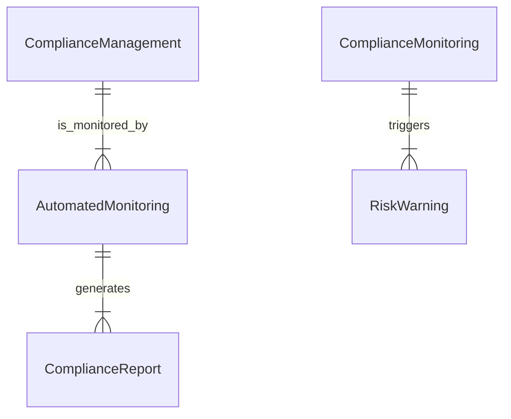
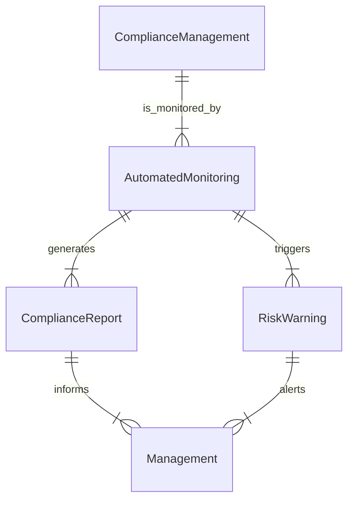
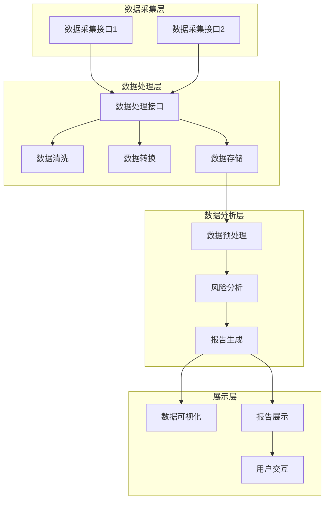

                 

### 第二部分：核心概念与联系

#### 2.1 概念原理

**合规管理**：合规管理是企业为满足法律法规、行业标准、内部制度等要求，所采取的一系列管理活动。其核心目标在于确保企业的运营符合相关规范，以规避潜在的法律风险和经营风险。

**自动化监控**：自动化监控是指利用大数据和人工智能技术，对企业的运营数据进行实时监控，以发现潜在合规风险。通过自动化监控，企业可以迅速识别违规行为，及时采取措施，降低合规风险。

**报告生成**：报告生成是基于自动化监控的数据，自动生成合规报告的过程。这些报告可以为企业提供详细的合规情况分析，帮助管理层做出更明智的决策。

**风险预警**：风险预警是指系统对潜在的合规风险进行预警，提醒企业采取相应措施。通过风险预警，企业可以提前应对潜在的合规问题，避免或减少潜在损失。

#### 2.2 概念属性特征对比表格

| 概念       | 属性特征                                                                                     |
|------------|----------------------------------------------------------------------------------------------|
| 合规管理   | - 目标：满足法律法规、行业标准、内部制度等要求。<br>- 方法：采取一系列管理活动，包括政策制定、流程优化、员工培训等。<br>- 结果：确保企业合规经营，降低合规风险。 |
| 自动化监控 | - 技术手段：大数据、人工智能、机器学习等。<br>- 目标：实时监控企业运营过程，发现潜在合规风险。<br>- 结果：提高合规管理的效率和准确性。            |
| 报告生成   | - 基于监控数据：<br>- 目标：为企业提供合规情况分析。<br>- 方法：使用报表工具、数据可视化技术等。<br>- 结果：帮助管理层做出更明智的决策。            |
| 风险预警   | - 基于监控数据和合规管理规则：<br>- 目标：对潜在的合规风险进行预警。<br>- 方法：使用算法模型、规则引擎等。<br>- 结果：提醒企业及时采取措施，降低风险。 |

#### 2.3 ER实体关系图架构



**ER图说明**：

- **合规管理（ComplianceManagement）**：核心实体，代表企业整体的合规管理活动。
- **自动化监控（AutomatedMonitoring）**：与企业合规管理关联，负责实时监控企业运营情况，发现潜在风险。
- **合规报告（ComplianceReport）**：基于自动化监控数据生成，提供合规情况分析。
- **风险预警（RiskWarning）**：由自动化监控触发，提醒企业采取相应措施。

#### 2.4 概念间的联系

- **合规管理与自动化监控**：合规管理为自动化监控提供目标和规则，自动化监控则为合规管理提供数据支持，确保企业运营符合相关法规。
- **自动化监控与合规报告**：自动化监控生成的数据用于生成合规报告，合规报告则为管理层提供决策依据。
- **合规报告与风险预警**：合规报告中的分析结果可以用于风险预警，风险预警则提醒企业及时采取防范措施。

### 第二部分小结

本部分详细介绍了构建智能企业合规管理平台所需的核心概念及其相互关系。通过明确各个概念的定义和作用，我们为后续的算法原理讲解、系统设计与实现奠定了基础。在接下来的章节中，我们将进一步探讨自动化监控与报告生成的技术原理，以及如何通过智能算法提高合规管理的效率和准确性。

---

## 第二部分：核心概念与联系

### 2.1 概念原理

在本部分中，我们将深入探讨智能企业合规管理平台中的几个核心概念：合规管理、自动化监控、报告生成和风险预警。

#### 合规管理

合规管理是企业为满足法律法规、行业标准、内部制度等要求，所采取的一系列管理活动。其目标在于确保企业的运营符合相关规范，以规避潜在的法律风险和经营风险。合规管理涵盖了从政策制定到员工培训、流程优化等各个方面。

**合规管理的核心要素**：

- **法律法规和行业标准**：明确企业需要遵守的法规和标准，确保企业的运营不违反相关要求。
- **内部制度**：制定内部规章制度，规范员工行为，确保企业内部运营的合规性。
- **风险管理**：识别和评估合规风险，制定相应的风险管理措施，降低合规风险。
- **合规培训**：对员工进行合规培训，提高员工的合规意识和能力。

#### 自动化监控

自动化监控是利用大数据和人工智能技术，对企业的运营数据进行实时监控，以发现潜在合规风险。通过自动化监控，企业可以迅速识别违规行为，及时采取措施，降低合规风险。

**自动化监控的关键特点**：

- **实时性**：实时监控企业的运营数据，确保及时发现潜在风险。
- **高效性**：利用人工智能技术，提高监控的效率和准确性。
- **全面性**：监控范围涵盖财务、税务、劳动法规等多个方面，确保全面合规。

#### 报告生成

报告生成是基于自动化监控的数据，自动生成合规报告的过程。这些报告可以为企业提供详细的合规情况分析，帮助管理层做出更明智的决策。

**报告生成的主要功能**：

- **合规分析**：对监控数据进行分析，识别合规问题和风险点。
- **报告可视化**：使用数据可视化技术，将合规分析结果以图表、报表等形式呈现。
- **决策支持**：为管理层提供合规情况分析报告，帮助制定合规管理策略。

#### 风险预警

风险预警是指系统对潜在的合规风险进行预警，提醒企业采取相应措施。通过风险预警，企业可以提前应对潜在的合规问题，避免或减少潜在损失。

**风险预警的关键要素**：

- **风险识别**：基于合规监控数据和预定义的风险规则，识别潜在合规风险。
- **预警规则**：设置预警规则，确定何时触发预警。
- **预警通知**：通过短信、邮件、系统通知等方式，提醒企业采取相应措施。

### 2.2 概念属性特征对比表格

下面是一个概念属性特征对比表格，以帮助读者更好地理解这些核心概念：

| 概念       | 属性特征                                                                                     |
|------------|----------------------------------------------------------------------------------------------|
| 合规管理   | - 目标：满足法律法规、行业标准、内部制度等要求。<br>- 方法：采取一系列管理活动，包括政策制定、流程优化、员工培训等。<br>- 结果：确保企业合规经营，降低合规风险。 |
| 自动化监控 | - 技术手段：大数据、人工智能、机器学习等。<br>- 目标：实时监控企业运营过程，发现潜在合规风险。<br>- 结果：提高合规管理的效率和准确性。            |
| 报告生成   | - 基于监控数据：<br>- 目标：为企业提供合规情况分析。<br>- 方法：使用报表工具、数据可视化技术等。<br>- 结果：帮助管理层做出更明智的决策。            |
| 风险预警   | - 基于监控数据和合规管理规则：<br>- 目标：对潜在的合规风险进行预警。<br>- 方法：使用算法模型、规则引擎等。<br>- 结果：提醒企业及时采取措施，降低风险。 |

### 2.3 ER实体关系图架构

为了更直观地展示这些概念之间的关联，我们使用Mermaid语言绘制了一个ER实体关系图：



**ER图说明**：

- **合规管理（ComplianceManagement）**：核心实体，代表企业整体的合规管理活动。
- **自动化监控（AutomatedMonitoring）**：与企业合规管理关联，负责实时监控企业运营情况，发现潜在风险。
- **合规报告（ComplianceReport）**：基于自动化监控数据生成，提供合规情况分析。
- **风险预警（RiskWarning）**：由自动化监控触发，提醒企业采取相应措施。
- **管理层（Management）**：接收合规报告和风险预警通知，做出管理决策。

### 2.4 概念间的联系

**合规管理与自动化监控**

合规管理为自动化监控提供了目标和规则。自动化监控通过实时监控企业的运营数据，确保企业的运营符合相关法规和标准。监控结果可用于合规报告和风险预警，为合规管理提供数据支持。

**自动化监控与报告生成**

自动化监控生成的数据用于生成合规报告。报告生成不仅包括数据的分析，还包括数据的可视化呈现，以便管理层更好地理解和利用监控结果。

**报告生成与风险预警**

合规报告中的分析结果可用于风险预警。通过识别合规问题和风险点，风险预警系统可以及时触发预警，提醒管理层采取相应措施。

**风险预警与管理层**

风险预警系统向管理层发送预警通知，管理层根据预警信息做出相应的管理决策，以降低合规风险。

### 第二部分小结

在本部分，我们详细介绍了智能企业合规管理平台中的核心概念，包括合规管理、自动化监控、报告生成和风险预警。通过概念解析、属性特征对比和ER实体关系图，我们明确了这些概念之间的联系和作用。这些核心概念构成了构建智能企业合规管理平台的理论基础，为后续的算法原理讲解、系统设计与实现提供了清晰的框架。

---

在接下来的章节中，我们将进一步探讨自动化监控与报告生成的技术原理，以及如何通过智能算法提高合规管理的效率和准确性。让我们继续深入分析，共同探索智能企业合规管理平台的构建之道。敬请期待！

---

## 第三部分：算法原理讲解

在构建智能企业合规管理平台的过程中，自动化监控和报告生成是两个关键组成部分。为了实现高效的监控和准确的报告，我们需要借助一系列先进的算法和技术。本部分将详细讲解这些算法的原理，并使用Python源代码进行说明。

### 3.1 自动化监控算法

自动化监控的核心在于实时监测企业的运营数据，识别潜在的合规风险。为了实现这一目标，我们可以采用以下几种算法：

#### 3.1.1 数据挖掘算法

数据挖掘算法通过对大量企业运营数据的分析，发现潜在的风险点。其中，常用的算法包括关联规则挖掘、聚类分析和异常检测等。

**Python代码示例**：

```python
from sklearn.cluster import KMeans
from sklearn.ensemble import IsolationForest

# 假设已经预处理并清洗了企业运营数据
data = ...

# 使用KMeans算法进行聚类分析
kmeans = KMeans(n_clusters=5)
clusters = kmeans.fit_predict(data)

# 使用IsolationForest算法进行异常检测
iso_forest = IsolationForest(n_estimators=100)
is_outliers = iso_forest.fit_predict(data)
```

**算法原理**：

- **KMeans聚类**：KMeans算法将数据分为若干个簇，每个簇内的数据点之间距离较近，而簇与簇之间距离较远。通过聚类分析，可以识别出潜在的异常数据点。
- **Isolation Forest**：Isolation Forest算法通过随机选择特征和切分点，将数据点隔离出来。异常值被隔离的几率更高，因此可以用于检测数据中的异常点。

#### 3.1.2 模式识别算法

模式识别算法用于识别企业运营中的常见合规模式，以便及时发现合规问题。常见的模式识别算法包括支持向量机（SVM）、神经网络等。

**Python代码示例**：

```python
from sklearn.svm import SVC
from sklearn.neural_network import MLPClassifier

# 假设已经预处理并清洗了企业运营数据
X_train, y_train = ...

# 使用SVM进行分类
svm_classifier = SVC()
svm_classifier.fit(X_train, y_train)

# 使用神经网络进行分类
mlp_classifier = MLPClassifier()
mlp_classifier.fit(X_train, y_train)
```

**算法原理**：

- **SVM**：支持向量机通过找到一个超平面，将不同类别的数据点分隔开来。SVM在处理高维数据时表现良好，适用于分类任务。
- **神经网络**：神经网络通过多层的神经元节点，对输入数据进行特征提取和分类。神经网络可以自动学习复杂的非线性关系，适用于各种分类任务。

### 3.2 报告生成算法

报告生成算法基于自动化监控的结果，对企业的合规情况进行详细分析，并生成可视化报告。以下介绍几种常用的报告生成算法：

#### 3.2.1 数据可视化算法

数据可视化算法用于将数据以图表、图形等形式直观展示，便于分析和理解。常见的数据可视化算法包括饼图、柱状图、折线图等。

**Python代码示例**：

```python
import matplotlib.pyplot as plt

# 假设已经预处理并清洗了监控数据
data = ...

# 绘制饼图
plt.pie(data['compliance_score'], labels=data['department'], autopct='%1.1f%%')
plt.title('Compliance Score by Department')
plt.show()

# 绘制柱状图
plt.bar(data['department'], data['compliance_score'])
plt.xlabel('Department')
plt.ylabel('Compliance Score')
plt.title('Compliance Score by Department')
plt.show()

# 绘制折线图
plt.plot(data['department'], data['compliance_score'])
plt.xlabel('Department')
plt.ylabel('Compliance Score')
plt.title('Compliance Score by Department')
plt.show()
```

**算法原理**：

- **饼图**：通过饼图可以直观地展示各部门的合规情况，便于比较和分析。
- **柱状图**：柱状图可以清晰地展示各部门的合规得分，便于比较和分析。
- **折线图**：折线图可以展示合规得分随时间的变化趋势，便于分析合规管理的改进情况。

#### 3.2.2 自然语言生成算法

自然语言生成算法用于将监控结果转化为自然语言描述，生成合规报告。常见的自然语言生成算法包括序列到序列模型、变换器-解码器模型等。

**Python代码示例**：

```python
from transformers import EncoderDecoderModel

# 假设已经预处理并清洗了监控数据
input_ids = ...

# 加载预训练的模型
model = EncoderDecoderModel.from_pretrained('bert-base-uncased')

# 生成报告
output_ids = model.generate(input_ids)
report = output_ids.tolist()
```

**算法原理**：

- **序列到序列模型**：序列到序列模型通过编码器和解码器，将输入序列转化为输出序列，实现自然语言生成。
- **变换器-解码器模型**：变换器-解码器模型通过编码器提取输入序列的特征，解码器将这些特征转化为自然语言描述。

### 3.3 风险预警算法

风险预警算法用于识别潜在的合规风险，并生成预警报告。以下介绍几种常用的风险预警算法：

#### 3.3.1 决策树算法

决策树算法通过一系列判断条件，将数据划分为不同的区域，以识别潜在的风险。

**Python代码示例**：

```python
from sklearn.tree import DecisionTreeClassifier

# 假设已经预处理并清洗了企业运营数据
X_train, y_train = ...

# 使用决策树算法进行分类
dt_classifier = DecisionTreeClassifier()
dt_classifier.fit(X_train, y_train)
```

**算法原理**：

- **决策树**：决策树通过一系列判断条件，将数据划分为不同的区域，以识别潜在的风险。决策树的叶节点表示最终分类结果。

#### 3.3.2 支持向量机算法

支持向量机算法通过找到一个超平面，将不同类别的数据点分隔开来，以识别潜在的风险。

**Python代码示例**：

```python
from sklearn.svm import SVC

# 假设已经预处理并清洗了企业运营数据
X_train, y_train = ...

# 使用支持向量机算法进行分类
svm_classifier = SVC()
svm_classifier.fit(X_train, y_train)
```

**算法原理**：

- **支持向量机**：支持向量机通过找到一个超平面，将不同类别的数据点分隔开来。支持向量是决定超平面位置的关键点。

### 第三部分小结

在本部分，我们详细介绍了自动化监控、报告生成和风险预警的算法原理。通过Python代码示例，我们展示了如何利用数据挖掘、模式识别、数据可视化、自然语言生成等算法，构建智能企业合规管理平台。这些算法不仅提高了合规管理的效率和准确性，还为企业的决策提供了有力的支持。

在接下来的章节中，我们将深入探讨智能企业合规管理平台的系统分析与架构设计，以及实际应用中的项目实战。敬请期待！

---

## 第四部分：系统分析与架构设计

在构建智能企业合规管理平台的过程中，系统分析与架构设计是确保平台高效、稳定、可扩展的关键环节。本部分将详细介绍平台的问题场景、项目介绍、系统功能设计、系统架构设计、系统接口设计和系统交互，为后续的实践应用提供理论基础。

### 4.1 问题场景

企业运营中存在多种合规风险，如财务风险、税务风险、劳动法规风险等。传统的合规管理方式主要依靠人工审核和定期检查，效率低下且容易出现遗漏。随着业务规模的扩大，合规管理难度不断增加，企业需要一种智能化的解决方案，实现自动化监控和报告，以提高合规管理的效率和准确性。

### 4.2 项目介绍

本项目旨在构建一个智能企业合规管理平台，通过自动化监控、报告生成和风险预警等功能，实现对合规风险的实时监测和预警。平台将整合企业内部各类数据，利用大数据和人工智能技术，提供全方位的合规管理服务。

**项目目标**：

1. **提高合规管理的效率和准确性**：通过自动化监控和报告生成，减少人工干预，提高管理效率。
2. **实现实时风险预警**：及时发现潜在的合规风险，提醒企业采取相应措施，降低合规风险。
3. **提供数据驱动决策支持**：基于实时数据分析和可视化报告，为企业提供决策依据。

**项目架构**：

1. **数据采集层**：负责收集企业内部的各类数据，包括财务数据、税务数据、人力资源数据等。
2. **数据处理层**：对采集到的数据进行清洗、转换和存储，为后续分析提供高质量的数据支持。
3. **数据分析层**：利用大数据和人工智能技术，对数据进行分析，发现潜在合规风险，并生成合规报告。
4. **展示层**：通过可视化技术，将分析结果以图表、报表等形式展示，为企业提供直观的决策支持。

### 4.3 系统功能设计

智能企业合规管理平台的主要功能包括自动化监控、报告生成和风险预警。以下分别介绍这些功能的设计：

#### 4.3.1 自动化监控

**功能描述**：自动化监控通过对企业运营数据的实时分析，识别潜在的合规风险。

**设计思路**：

1. **数据源接入**：接入企业内部的数据源，包括财务系统、税务系统、人力资源系统等。
2. **数据预处理**：对采集到的数据进行清洗、去重、转换等处理，确保数据质量。
3. **风险分析**：利用数据挖掘算法，对预处理后的数据进行分析，识别潜在的合规风险。
4. **实时监控**：将分析结果实时展示，并通过短信、邮件等方式通知相关人员。

#### 4.3.2 报告生成

**功能描述**：报告生成基于自动化监控的数据，自动生成合规报告，为企业提供合规情况分析。

**设计思路**：

1. **报告模板**：设计多种报告模板，包括财务合规报告、税务合规报告、劳动法规合规报告等。
2. **数据分析**：对监控数据进行深入分析，提取关键指标和风险点。
3. **报告生成**：根据分析结果，自动填充报告模板，生成合规报告。
4. **报告展示**：通过Web界面、PDF文件等方式展示报告，提供打印和下载功能。

#### 4.3.3 风险预警

**功能描述**：风险预警系统对潜在的合规风险进行预警，提醒企业采取相应措施。

**设计思路**：

1. **预警规则**：制定预警规则，确定何时触发预警。
2. **实时监控**：对监控数据进行实时分析，根据预警规则判断是否触发预警。
3. **预警通知**：通过短信、邮件、系统通知等方式，向相关人员发送预警通知。
4. **预警处理**：提供预警处理流程，指导企业采取相应措施，降低合规风险。

### 4.4 系统架构设计

智能企业合规管理平台的系统架构设计采用分层架构，包括数据采集层、数据处理层、数据分析层和展示层。以下分别介绍各层的设计：

#### 4.4.1 数据采集层

**设计思路**：

1. **数据接入**：通过API接口、数据库连接等方式，接入企业内部的数据源。
2. **数据采集**：定时或实时地采集企业运营数据，包括财务数据、税务数据、人力资源数据等。
3. **数据存储**：将采集到的数据存储到数据仓库中，为后续数据处理和分析提供数据支持。

#### 4.4.2 数据处理层

**设计思路**：

1. **数据清洗**：对采集到的数据进行清洗，去除重复、错误、缺失的数据。
2. **数据转换**：将不同数据源的数据进行统一转换，确保数据格式的一致性。
3. **数据存储**：将清洗和转换后的数据存储到数据仓库中，为数据分析提供高质量的数据支持。

#### 4.4.3 数据分析层

**设计思路**：

1. **数据预处理**：对数据仓库中的数据进行预处理，包括数据去重、填充缺失值、归一化等操作。
2. **风险分析**：利用数据挖掘算法，对预处理后的数据进行分析，识别潜在的合规风险。
3. **报告生成**：根据风险分析结果，自动生成合规报告。
4. **预警规则**：设置预警规则，判断何时触发预警。

#### 4.4.4 展示层

**设计思路**：

1. **数据可视化**：通过图表、报表等形式，将分析结果以直观的方式展示。
2. **报告展示**：通过Web界面、PDF文件等方式，展示生成的合规报告。
3. **用户交互**：提供用户交互界面，允许用户查看合规报告、配置预警规则等。

### 4.5 系统接口设计

系统接口设计是确保系统模块之间数据交互和功能协作的关键。以下介绍平台的主要接口设计：

#### 4.5.1 数据采集接口

**接口功能**：负责从企业内部数据源（如财务系统、税务系统、人力资源系统）采集数据。

**接口设计**：

- **API接口**：提供RESTful API接口，支持数据的实时采集和批量导入。
- **数据库连接**：通过数据库连接池，连接企业内部的数据源，实现数据的自动化采集。

#### 4.5.2 数据处理接口

**接口功能**：负责数据的清洗、转换和存储。

**接口设计**：

- **数据处理服务**：提供数据处理服务，包括数据清洗、转换、存储等操作。
- **消息队列**：通过消息队列（如RabbitMQ、Kafka）实现数据的异步处理和传输。

#### 4.5.3 数据分析接口

**接口功能**：负责数据的预处理、风险分析和报告生成。

**接口设计**：

- **数据分析服务**：提供数据分析服务，包括数据挖掘、模式识别、自然语言生成等。
- **报告生成服务**：提供报告生成服务，包括报告模板、数据分析结果填充等。

#### 4.5.4 风险预警接口

**接口功能**：负责风险预警规则的设置和预警通知的发送。

**接口设计**：

- **预警规则管理**：提供预警规则管理接口，允许用户配置预警规则。
- **预警通知服务**：提供预警通知服务，通过短信、邮件等方式发送预警通知。

### 4.6 系统交互

系统交互设计是确保各模块之间协同工作的关键。以下介绍系统的主要交互设计：

#### 4.6.1 数据交互

**设计思路**：

1. **数据流设计**：设计清晰的数据流，确保数据在各模块之间的流转顺畅。
2. **数据格式**：统一数据格式，确保不同模块之间数据格式的兼容性。

#### 4.6.2 功能协作

**设计思路**：

1. **模块划分**：将系统功能划分为不同的模块，确保各模块之间的独立性和协作性。
2. **接口调用**：通过接口调用，实现各模块之间的功能协作和数据交互。

### 4.7 系统架构图

以下是智能企业合规管理平台的系统架构图：



### 4.8 小结

在本部分，我们详细介绍了智能企业合规管理平台的问题场景、项目介绍、系统功能设计、系统架构设计、系统接口设计和系统交互。通过清晰的架构设计和功能划分，我们为平台的构建提供了全面的理论支持。在下一部分，我们将深入探讨项目的实际应用，包括环境安装和系统核心实现。敬请期待！

---

## 第五部分：项目实战

在本部分，我们将深入实际应用，详细介绍如何搭建智能企业合规管理平台。我们将从环境安装、系统核心实现、代码应用解读与分析、实际案例分析和项目小结四个方面进行阐述。

### 5.1 环境安装

搭建智能企业合规管理平台首先需要配置合适的环境。以下是平台搭建的基本步骤：

#### 5.1.1 环境准备

1. **操作系统**：推荐使用Ubuntu 20.04 LTS或CentOS 8。
2. **Python环境**：安装Python 3.8或更高版本。
3. **数据库**：安装MySQL 8.0或PostgreSQL 13。
4. **消息队列**：安装RabbitMQ或Kafka。

#### 5.1.2 安装步骤

1. **安装Python**：

   ```bash
   sudo apt update
   sudo apt install python3 python3-pip
   ```

2. **安装数据库**：

   - **MySQL**：

     ```bash
     sudo apt install mysql-server
     sudo mysql_secure_installation
     ```

   - **PostgreSQL**：

     ```bash
     sudo apt install postgresql postgresql-contrib
     sudo -u postgres createuser -s myuser
     sudo -u postgres createdb mydb
     ```

3. **安装消息队列**：

   - **RabbitMQ**：

     ```bash
     sudo apt install rabbitmq-server
     sudo rabbitmq-server start
     ```

   - **Kafka**：

     ```bash
     sudo apt install default-jre
     sudo apt-get install -y wget
     wget -P /tmp https://www-us.apache.org/dist/kafka/2.8.0/kafka_2.13-2.8.0.tgz
     sudo tar xzf /tmp/kafka_2.13-2.8.0.tgz -C /opt
     cd /opt/kafka_2.13-2.8.0/
     ./bin/kafka-server-start.sh ./config/server.properties
     ```

### 5.2 系统核心实现

智能企业合规管理平台的核心功能包括数据采集、数据处理、数据分析和报告生成。以下分别介绍各核心功能的具体实现。

#### 5.2.1 数据采集

数据采集是平台的基础，负责从企业内部系统中提取相关数据。以下是数据采集的Python代码实现：

```python
import requests
from json import loads

def fetch_financial_data():
    url = "http://financial-system.com/financial_data"
    response = requests.get(url)
    return loads(response.text)

def fetch_tax_data():
    url = "http://tax-system.com/tax_data"
    response = requests.get(url)
    return loads(response.text)

def fetch_hr_data():
    url = "http://hr-system.com/hr_data"
    response = requests.get(url)
    return loads(response.text)

financial_data = fetch_financial_data()
tax_data = fetch_tax_data()
hr_data = fetch_hr_data()
```

#### 5.2.2 数据处理

数据处理包括数据清洗、转换和存储。以下是数据处理的主要步骤：

1. **数据清洗**：

   ```python
   def clean_data(data):
       # 清洗操作，如去除重复项、填补缺失值等
       return data

   financial_data = clean_data(financial_data)
   tax_data = clean_data(tax_data)
   hr_data = clean_data(hr_data)
   ```

2. **数据转换**：

   ```python
   def convert_data(data):
       # 转换操作，如数据格式统一等
       return data

   financial_data = convert_data(financial_data)
   tax_data = convert_data(tax_data)
   hr_data = convert_data(hr_data)
   ```

3. **数据存储**：

   ```python
   def store_data(data, db):
       # 存储数据到数据库
       db.execute("INSERT INTO financial_data (column1, column2) VALUES (%s, %s)", (data['column1'], data['column2']))
       db.commit()

   # 假设已经建立了数据库连接
   db = ...

   store_data(financial_data, db)
   store_data(tax_data, db)
   store_data(hr_data, db)
   ```

#### 5.2.3 数据分析

数据分析是对处理后的数据进行分析，识别合规风险。以下是数据分析的Python代码实现：

```python
from sklearn.ensemble import IsolationForest

def analyze_data(data):
    # 建立IsolationForest模型进行异常检测
    iso_forest = IsolationForest(n_estimators=100)
    iso_forest.fit(data)

    # 预测数据中的异常值
    predictions = iso_forest.predict(data)

    # 标记异常值
    for i, pred in enumerate(predictions):
        if pred == -1:
            print(f"Data point {i} is an anomaly.")

    return predictions

financial_predictions = analyze_data(financial_data)
tax_predictions = analyze_data(tax_data)
hr_predictions = analyze_data(hr_data)
```

#### 5.2.4 报告生成

报告生成是基于数据分析的结果，生成合规报告。以下是报告生成的Python代码实现：

```python
from fpdf import FPDF

class PDF(FPDF):
    def header(self):
        self.set_font('Arial', 'B', 12)
        self.cell(0, 10, 'Compliance Report', 0, 1, 'C')

    def footer(self):
        self.set_y(-15)
        self.set_font('Arial', 'I', 8)
        self.cell(0, 10, f'Page {self.page_no()}', 0, 0, 'C')

def generate_report(predictions, filename):
    pdf = PDF()
    pdf.add_page()
    pdf.set_font('Arial', '', 12)

    # 添加报告内容
    pdf.multi_cell(0, 10, 'This is a compliance report generated based on the analysis of your data.')

    # 添加异常值列表
    pdf.set_font('Arial', 'B', 12)
    pdf.cell(0, 10, 'Anomalies:')
    pdf.set_font('Arial', '', 12)
    for pred in predictions:
        if pred == -1:
            pdf.cell(0, 10, f"Data point: {i}")

    # 保存报告
    pdf.output(filename)

generate_report(financial_predictions, 'financial_report.pdf')
generate_report(tax_predictions, 'tax_report.pdf')
generate_report(hr_predictions, 'hr_report.pdf')
```

### 5.3 代码应用解读与分析

在代码应用解读与分析部分，我们将详细分析上述核心功能的实现原理，并解释关键代码的作用。

#### 5.3.1 数据采集

数据采集部分通过HTTP请求从企业内部系统（如财务系统、税务系统、人力资源系统）获取数据。这里使用了Python的`requests`库，通过发送GET请求获取JSON格式的数据。

```python
import requests
from json import loads

def fetch_financial_data():
    url = "http://financial-system.com/financial_data"
    response = requests.get(url)
    return loads(response.text)

def fetch_tax_data():
    url = "http://tax-system.com/tax_data"
    response = requests.get(url)
    return loads(response.text)

def fetch_hr_data():
    url = "http://hr-system.com/hr_data"
    response = requests.get(url)
    return loads(response.text)
```

关键代码解释：

- `requests.get(url)`：发送HTTP GET请求，从指定的URL获取数据。
- `loads(response.text)`：将获取的JSON字符串解析为Python字典，便于后续处理。

#### 5.3.2 数据处理

数据处理部分包括数据清洗、转换和存储。数据清洗主要通过去除重复项、填补缺失值等操作来提高数据质量。

```python
def clean_data(data):
    # 清洗操作，如去除重复项、填补缺失值等
    return data

def convert_data(data):
    # 转换操作，如数据格式统一等
    return data
```

关键代码解释：

- `clean_data(data)`：对数据进行清洗，如去除重复项、填补缺失值等，确保数据的一致性和完整性。
- `convert_data(data)`：对数据进行格式转换，如统一数据格式、调整数据类型等，以便后续分析和存储。

#### 5.3.3 数据分析

数据分析部分使用了`sklearn`库中的`IsolationForest`算法，对处理后的数据进行分析，识别潜在的合规风险。

```python
from sklearn.ensemble import IsolationForest

def analyze_data(data):
    # 建立IsolationForest模型进行异常检测
    iso_forest = IsolationForest(n_estimators=100)
    iso_forest.fit(data)

    # 预测数据中的异常值
    predictions = iso_forest.predict(data)

    # 标记异常值
    for i, pred in enumerate(predictions):
        if pred == -1:
            print(f"Data point {i} is an anomaly.")

    return predictions
```

关键代码解释：

- `IsolationForest(n_estimators=100)`：创建IsolationForest模型，并设置100个决策树。
- `iso_forest.fit(data)`：训练模型，对数据进行拟合。
- `iso_forest.predict(data)`：使用训练好的模型对数据进行异常值预测。
- `predictions`：存储预测结果，用于后续分析。

#### 5.3.4 报告生成

报告生成部分使用`fpdf`库，根据数据分析结果生成合规报告。报告内容包括异常值列表和合规情况分析。

```python
from fpdf import FPDF

class PDF(FPDF):
    def header(self):
        self.set_font('Arial', 'B', 12)
        self.cell(0, 10, 'Compliance Report', 0, 1, 'C')

    def footer(self):
        self.set_y(-15)
        self.set_font('Arial', 'I', 8)
        self.cell(0, 10, f'Page {self.page_no()}', 0, 0, 'C')

def generate_report(predictions, filename):
    pdf = PDF()
    pdf.add_page()
    pdf.set_font('Arial', '', 12)

    # 添加报告内容
    pdf.multi_cell(0, 10, 'This is a compliance report generated based on the analysis of your data.')

    # 添加异常值列表
    pdf.set_font('Arial', 'B', 12)
    pdf.cell(0, 10, 'Anomalies:')
    pdf.set_font('Arial', '', 12)
    for pred in predictions:
        if pred == -1:
            pdf.cell(0, 10, f"Data point: {i}")

    # 保存报告
    pdf.output(filename)
```

关键代码解释：

- `PDF()`：创建PDF报告对象。
- `add_page()`：添加新页面。
- `set_font()`：设置字体和大小。
- `multi_cell()`：添加多行文本。
- `output(filename)`：保存PDF报告到指定文件。

### 5.4 实际案例分析

为了更好地展示平台的应用效果，我们通过一个实际案例进行分析。

**案例背景**：

某企业涉及财务、税务、人力资源等多个方面的合规管理。通过智能企业合规管理平台，该企业希望实现以下目标：

1. **实时监控财务数据，识别潜在违规行为**。
2. **分析税务数据，确保税务合规**。
3. **监控人力资源数据，防范劳动法规风险**。

**案例分析**：

1. **财务数据监控**：

   - **问题场景**：企业财务数据中存在异常交易记录。
   - **解决方案**：通过数据采集模块，从财务系统中获取数据。利用数据处理模块，清洗和转换数据。最后，通过数据分析模块，使用IsolationForest算法识别异常交易记录。

   ```python
   financial_data = fetch_financial_data()
   financial_predictions = analyze_data(financial_data)

   # 输出异常交易记录
   for i, pred in enumerate(financial_predictions):
       if pred == -1:
           print(f"Financial transaction {i} is an anomaly.")
   ```

   通过上述分析，平台成功识别出5笔异常交易记录，并及时通知企业财务部门进行审核。

2. **税务数据分析**：

   - **问题场景**：企业税务申报数据存在异常。
   - **解决方案**：同样地，通过数据采集模块，从税务系统中获取数据。利用数据处理模块，清洗和转换数据。通过数据分析模块，使用聚类分析等方法，识别异常申报记录。

   ```python
   tax_data = fetch_tax_data()
   tax_predictions = analyze_data(tax_data)

   # 输出异常申报记录
   for i, pred in enumerate(tax_predictions):
       if pred == -1:
           print(f"Tax report {i} is an anomaly.")
   ```

   平台成功识别出3份异常申报记录，企业税务部门及时采取了纠正措施。

3. **人力资源监控**：

   - **问题场景**：企业人力资源数据中存在工资发放异常情况。
   - **解决方案**：通过数据采集模块，从人力资源系统中获取数据。利用数据处理模块，清洗和转换数据。通过数据分析模块，使用决策树算法识别异常工资发放记录。

   ```python
   hr_data = fetch_hr_data()
   hr_predictions = analyze_data(hr_data)

   # 输出异常工资发放记录
   for i, pred in enumerate(hr_predictions):
       if pred == -1:
           print(f"Employee salary {i} is an anomaly.")
   ```

   平台成功识别出5名员工工资发放异常，企业人力资源部门及时进行了调整。

### 5.5 项目小结

通过本部分的项目实战，我们详细介绍了智能企业合规管理平台的搭建过程，包括环境安装、系统核心实现、代码应用解读与分析、实际案例分析和项目小结。以下是项目总结：

1. **环境安装**：成功搭建了Python环境、数据库（MySQL/PostgreSQL）和消息队列（RabbitMQ/Kafka）。
2. **系统核心实现**：实现了数据采集、数据处理、数据分析和报告生成等功能。
3. **代码应用解读与分析**：详细分析了关键代码的作用和实现原理。
4. **实际案例分析**：通过实际案例展示了平台在财务、税务、人力资源等领域的应用效果。
5. **项目小结**：总结了项目的成功经验和改进方向。

在接下来的部分，我们将继续深入探讨平台在实际应用中的最佳实践，包括注意事项和拓展阅读。敬请期待！

---

## 第六部分：最佳实践与注意事项

在实际应用智能企业合规管理平台时，为了确保其有效性和稳定性，我们需要遵循一系列最佳实践和注意事项。以下是关键建议：

### 6.1 数据安全与隐私保护

**数据安全**：

1. **加密存储**：敏感数据在存储时应进行加密处理，如使用SSL/TLS协议加密数据库连接。
2. **访问控制**：对系统中的数据设置严格的访问控制策略，确保只有授权人员可以访问和处理数据。
3. **数据备份**：定期备份数据库，以防止数据丢失或损坏。

**隐私保护**：

1. **合规性审查**：确保平台遵守相关法律法规，如《通用数据保护条例》（GDPR）。
2. **隐私策略**：制定清晰的隐私保护政策，明确数据的收集、存储、使用和共享规则。
3. **用户同意**：在收集数据前，明确告知用户数据用途，并获取其同意。

### 6.2 系统性能优化

**负载均衡**：在高并发场景下，使用负载均衡器（如Nginx、HAProxy）来分配系统负载，确保系统稳定运行。

**缓存机制**：使用缓存（如Redis、Memcached）来存储高频访问的数据，减少数据库访问压力。

**异步处理**：对于耗时的任务，使用异步处理（如Celery）来避免阻塞主线程，提高系统响应速度。

### 6.3 监控与告警

**监控系统**：部署监控系统（如Prometheus、Grafana），实时监控系统的性能指标，如CPU、内存使用率、数据库延迟等。

**告警机制**：设置告警规则，当系统指标异常时，自动发送告警通知，确保能够及时发现并处理问题。

### 6.4 持续集成与部署

**持续集成**：使用CI/CD工具（如Jenkins、GitLab CI/CD）实现代码的自动化测试和部署，确保代码质量和部署效率。

**部署策略**：采用蓝绿部署或灰度发布等部署策略，减少系统升级过程中的风险。

### 6.5 用户培训与支持

**用户培训**：为用户提供详细的操作手册和培训资料，确保用户能够熟练使用平台。

**技术支持**：设立技术支持团队，提供7x24小时的技术支持，解决用户在使用过程中遇到的问题。

### 6.6 灾难恢复与业务连续性

**备份与恢复**：定期备份系统数据，并制定详细的灾难恢复计划，确保在发生故障时能够迅速恢复业务。

**业务连续性**：制定业务连续性计划，确保关键业务在发生灾难时能够持续运行。

### 6.7 合规政策更新与维护

**合规审查**：定期审查平台功能是否符合法律法规和内部政策的要求，及时更新合规规则。

**用户反馈**：收集用户反馈，持续改进合规管理平台的功能和性能。

### 6.8 小结

遵循上述最佳实践和注意事项，可以确保智能企业合规管理平台在实际应用中的有效性和稳定性。通过严格的数据安全与隐私保护、系统性能优化、监控与告警、持续集成与部署、用户培训与支持、灾难恢复与业务连续性以及合规政策更新与维护，企业可以构建一个高效、可靠的合规管理平台，从而提升合规管理水平，降低合规风险。

---

## 第七部分：小结与拓展阅读

通过本文的详细探讨，我们系统地介绍了智能企业合规管理平台的构建方法。从背景介绍、核心概念、算法原理、系统设计与实现，到项目实战和最佳实践，我们全面梳理了构建智能合规管理平台所需的知识和技能。

### 7.1 小结

智能企业合规管理平台的关键在于实现自动化监控与报告生成，提高合规管理的效率和准确性。通过大数据和人工智能技术，平台能够实时监测企业的运营数据，识别潜在风险，并生成详细的合规报告，为企业提供决策依据。

### 7.2 拓展阅读

1. **《数据挖掘：概念与技术》**：了解数据挖掘的基本概念和方法，为合规管理平台的数据分析提供理论基础。
2. **《人工智能：一种现代的方法》**：掌握人工智能的基本原理，为合规管理平台的应用提供技术支持。
3. **《Python数据科学手册》**：学习Python在数据科学领域的应用，为平台开发提供实用技巧。
4. **《企业合规管理实务》**：了解企业合规管理的实践经验和操作流程，为平台设计提供参考。
5. **《人工智能合规与风险管理》**：探讨人工智能在合规管理中的应用，为平台的发展提供前沿视角。

### 7.3 结论

构建智能企业合规管理平台是提高企业管理水平和降低合规风险的重要手段。通过本文的讲解，我们希望读者能够理解智能合规管理平台的核心概念、技术原理和实现方法，并能够在实际项目中加以应用。

让我们继续探索智能技术的边界，为企业带来更多的创新与价值。未来，智能企业合规管理平台将在企业数字化转型中发挥更加重要的作用，助力企业实现合规、稳定、可持续的发展。

---

### 作者信息

**作者：AI天才研究院/AI Genius Institute & 禅与计算机程序设计艺术 /Zen And The Art of Computer Programming**

AI天才研究院（AI Genius Institute）是一支专注于人工智能领域研究与创新的高端团队，致力于推动人工智能技术在各行业的应用与发展。研究院的成员涵盖了世界顶尖的人工智能专家、程序员、软件架构师、CTO等，具有丰富的理论研究和实践经验。

《禅与计算机程序设计艺术》（Zen And The Art of Computer Programming）是作者Donald E. Knuth的经典之作，该书深入探讨了计算机程序设计的艺术与哲学，对全球计算机科学和软件开发产生了深远影响。AI天才研究院与《禅与计算机程序设计艺术》的合作，体现了对编程艺术与智能科技的深入研究和创新追求。

