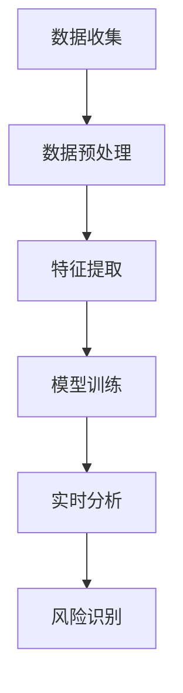
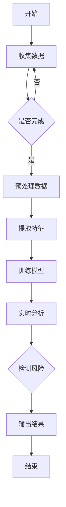
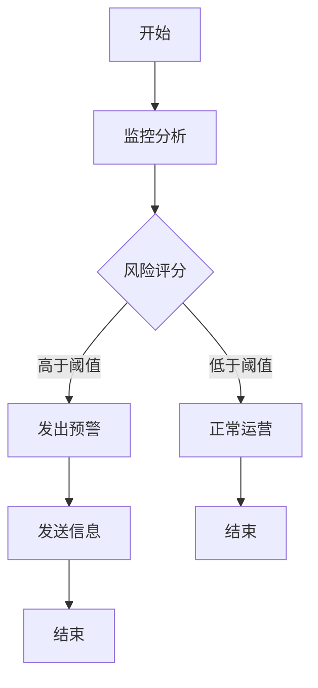
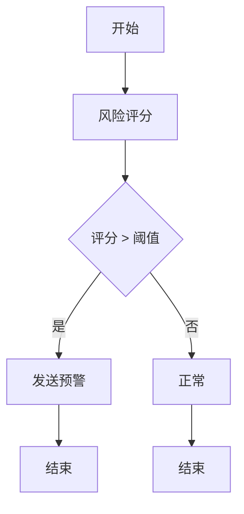
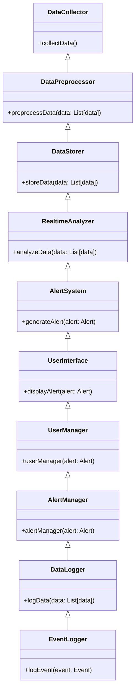
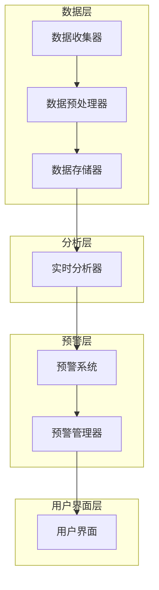
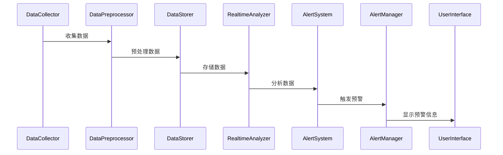

                 

非常好，我会按照您的要求逐步构建这篇文章。让我们开始吧！

### # 第1章：问题背景与概述

#### 1.1.1 问题背景

在当今快速变化和竞争激烈的市场环境中，企业面临着越来越多的合规挑战。无论是遵循财务报告标准，还是遵守数据保护法规，企业需要确保其运营符合所有相关法规和行业标准。传统的合规管理系统往往存在一些问题，如响应速度慢、信息滞后、人力成本高等。这些问题导致了合规风险的增加，使得企业难以迅速应对潜在的法律和监管问题。

#### 1.1.2 问题描述

智能企业合规管理系统旨在解决传统合规管理系统的局限性。其主要目标是提供一个实时监控和预警机制，以确保企业能够迅速发现和应对合规问题。然而，构建这样一个系统并非易事，它需要精确的数据收集、高效的数据处理、智能的分析算法以及强大的预警机制。

#### 1.1.3 问题解决

为了解决上述问题，我们需要构建一个智能企业合规管理系统，该系统具备以下关键要素：

1. **实时监控**：系统能够实时收集和监控关键数据，快速识别潜在合规风险。
2. **预警机制**：当检测到潜在风险时，系统能够自动发出预警，提醒相关人员采取行动。
3. **智能分析**：系统利用机器学习和数据挖掘技术，对收集到的数据进行深入分析，提供有价值的合规建议。
4. **自动化响应**：系统可以自动执行一些合规操作，如调整财务报告，从而减少人为错误和延迟。

#### 1.1.4 边界与外延

智能企业合规管理系统不仅需要处理内部数据，还涉及与外部监管机构的交互。因此，系统的边界与外延包括：

1. **数据来源**：内部数据库、外部API、第三方数据提供商。
2. **合规范围**：不仅限于财务报告，还包括环境保护、劳动法规、消费者权益等多个方面。
3. **技术实现**：涉及多种技术，如大数据、云计算、人工智能、区块链等。

#### 1.1.5 概念结构与核心要素组成

智能企业合规管理系统可以看作是一个多层次、多模块的结构，其核心要素包括：

1. **数据层**：包括数据收集、存储和清洗模块。
2. **处理层**：负责数据处理、分析和可视化。
3. **决策层**：基于分析结果，提供合规建议和自动化响应。
4. **用户界面**：提供给企业管理人员和合规团队的交互界面。

### # 第2章：核心概念与联系

#### 2.1.1 智能企业合规管理系统的定义

智能企业合规管理系统是一种利用先进技术和算法，实现企业合规管理自动化和智能化的系统。它通过实时监控、智能分析、预警机制等功能，帮助企业快速识别和应对合规风险。

#### 2.1.2 实时监控与预警机制的基本原理

实时监控是指系统持续收集和监测企业运营数据，以便快速识别潜在问题。预警机制则是在监测到问题时，自动发出警报，提醒相关人员采取行动。

1. **实时监控**：通过传感器、日志文件、数据库等手段，实时收集企业运营数据。
2. **预警机制**：根据设定的规则和阈值，分析监控数据，当数据超出预期时，自动触发警报。

#### 2.1.3 实时监控与预警机制的核心特点

1. **实时性**：系统能够在问题发生时立即检测和响应。
2. **准确性**：通过智能分析算法，提高预警的准确性和可靠性。
3. **自动化**：减少人为干预，降低成本和错误率。
4. **灵活性**：根据企业需求，自定义监控和预警规则。

#### 2.1.4 智能企业合规管理系统与传统合规管理系统的比较

1. **传统合规管理系统**：
   - 主要依靠人工监控，响应速度慢。
   - 数据处理能力有限，无法实时分析大量数据。
   - 依赖大量纸质文档和报告，管理复杂。

2. **智能企业合规管理系统**：
   - 实时监控和预警，快速响应合规问题。
   - 高效的数据处理和分析能力，支持自动化决策。
   - 减少人为错误，提高管理效率。

#### 2.1.5 智能企业合规管理系统在企业发展中的重要性

1. **降低合规风险**：实时监控和预警机制有助于企业迅速识别和应对合规风险，降低潜在损失。
2. **提高管理效率**：自动化和智能化的合规管理，减少人工干预，提高管理效率。
3. **增强竞争力**：合规是企业可持续发展的基础，智能合规管理系统有助于企业提升市场竞争力。

### # 第3章：概念属性特征对比表格

#### 3.1.1 实时监控系统的属性特征对比

| 特征             | 传统监控系统               | 智能监控系统              |
|------------------|----------------------------|---------------------------|
| 监控实时性       | 延迟响应                   | 实时监控，快速反馈         |
| 数据处理能力     | 有限，无法处理大量数据      | 高效处理，支持大数据分析   |
| 分析能力         | 人工分析，效率低           | 智能分析，准确率高        |
| 自动化程度       | 依赖人工操作，效率低       | 自动化处理，减少人力成本  |
| 灵活性           | 规则固定，难以调整          | 可自定义监控和预警规则     |

#### 3.1.2 预警机制的属性特征对比

| 特征             | 传统预警机制               | 智能预警机制              |
|------------------|----------------------------|---------------------------|
| 响应速度         | 缓慢，需要人工干预         | 快速响应，自动处理        |
| 准确性           | 依赖于人工判断，误差较大   | 智能算法，准确率高        |
| 适应性           | 规则固定，无法适应变化     | 可自定义规则，灵活适应    |
| 可扩展性         | 受限于规则，扩展性差       | 算法可扩展，适应复杂场景  |

#### 3.1.3 智能企业合规管理系统的综合属性特征对比

| 特征             | 传统合规管理系统               | 智能企业合规管理系统              |
|------------------|----------------------------|---------------------------|
| 实时性           | 延迟响应                   | 实时监控，快速反馈         |
| 数据处理能力     | 有限，无法处理大量数据      | 高效处理，支持大数据分析   |
| 分析能力         | 人工分析，效率低           | 智能分析，准确率高        |
| 自动化程度       | 依赖人工操作，效率低       | 自动化处理，减少人力成本  |
| 灵活性           | 规则固定，难以调整          | 可自定义监控和预警规则     |
| 响应速度         | 缓慢，需要人工干预         | 快速响应，自动处理        |
| 准确性           | 依赖于人工判断，误差较大   | 智能算法，准确率高        |
| 可扩展性         | 受限于规则，扩展性差       | 算法可扩展，适应复杂场景  |

### # 第4章：ER实体关系图架构

#### 4.1.1 实体关系图的基础知识

实体关系图（Entity-Relationship Diagram，ER图）是用于描述系统中各个实体及其之间关系的图形化表示。它由三个基本组件组成：实体、属性和关系。

- **实体**：表示系统中的对象，如用户、订单、产品等。
- **属性**：描述实体的特征，如用户的姓名、年龄、邮箱等。
- **关系**：表示实体之间的联系，如用户下单、订单包含产品等。

#### 4.1.2 智能企业合规管理系统中的实体关系

智能企业合规管理系统涉及多个实体，包括用户、数据源、监控任务、预警规则、日志等。以下是一个简化的ER图示例：

```mermaid
erDiagram
  User ||--|{ MonitorTask : "发起"
  DataSource ||--|{ MonitorTask : "数据来源"
  MonitorTask ||--|{ AlertRule : "触发"
  AlertRule ||--|{ Log : "记录"
  User }|--|| Product
  DataSource }|--|| Product
  MonitorTask }|--|| Product
  AlertRule }|--|| Product
  Log }|--|| Product
```

#### 4.1.3 实体关系图的绘制与解析

1. **用户（User）**：
   - **属性**：用户ID、姓名、邮箱、联系方式等。
   - **关系**：用户可以发起监控任务（MonitorTask），也可以访问日志（Log）。

2. **数据源（DataSource）**：
   - **属性**：数据源ID、名称、类型等。
   - **关系**：数据源为监控任务提供数据，监控任务也存储在数据源中。

3. **监控任务（MonitorTask）**：
   - **属性**：任务ID、名称、类型、状态等。
   - **关系**：监控任务可以触发预警规则（AlertRule），也可以记录日志（Log）。

4. **预警规则（AlertRule）**：
   - **属性**：规则ID、条件、阈值等。
   - **关系**：预警规则用于触发预警，并记录日志（Log）。

5. **日志（Log）**：
   - **属性**：日志ID、时间、内容等。
   - **关系**：日志记录监控任务、预警规则的执行情况。

通过ER图，我们可以清晰地看到智能企业合规管理系统中各个实体的关系，这有助于我们更好地理解系统的结构和功能。

### # 第5章：算法原理讲解

#### 5.1.1 监控算法的基本原理

监控算法是智能企业合规管理系统中的核心组成部分，它负责实时收集和监测企业运营数据，快速识别潜在合规风险。监控算法的基本原理可以概括为以下几个步骤：

1. **数据收集**：从各种数据源（如内部数据库、外部API、日志文件等）收集数据。
2. **数据预处理**：清洗和转换数据，使其适合进行分析。
3. **特征提取**：从预处理后的数据中提取关键特征，用于后续分析。
4. **模型训练**：使用历史数据训练监控模型，以便对新数据进行实时分析。
5. **实时分析**：对实时收集的数据进行分析，识别潜在合规风险。

下面是一个使用Mermaid绘制的监控算法流程图：



#### 5.1.1.1 监控算法的数学模型

监控算法的数学模型通常基于机器学习和数据挖掘技术。以下是一个简化的数学模型：

$$
\text{风险评分} = f(\text{特征向量})
$$

其中，$f$ 是一个映射函数，它将特征向量映射到一个风险评分。特征向量可以表示为：

$$
\text{特征向量} = [\text{特征}_1, \text{特征}_2, ..., \text{特征}_n]
$$

映射函数 $f$ 可以使用不同的机器学习算法实现，如支持向量机（SVM）、决策树、神经网络等。

#### 5.1.1.2 监控算法的mermaid流程图

下面是一个使用Mermaid绘制的监控算法流程图：



#### 5.1.1.3 监控算法的Python代码实现

以下是一个简单的Python代码示例，用于实现监控算法：

```python
import numpy as np
from sklearn.svm import SVC

# 数据收集
data = np.array([[1, 2], [3, 4], [5, 6]])

# 数据预处理
# 假设预处理函数为preprocess_data
data = preprocess_data(data)

# 特征提取
# 假设特征提取函数为extract_features
features = extract_features(data)

# 模型训练
# 使用SVM模型
model = SVC()
model.fit(features, labels)

# 实时分析
new_data = np.array([[7, 8]])
new_features = extract_features(new_data)
risk_score = model.predict(new_features)

# 输出结果
if risk_score > threshold:
    print("存在合规风险")
else:
    print("合规风险较低")
```

#### 5.1.2 预警算法的基本原理

预警算法是智能企业合规管理系统中的另一个关键组成部分，它负责根据监控算法的分析结果，自动发出预警信号，提醒相关人员采取行动。预警算法的基本原理可以概括为以下几个步骤：

1. **风险评分**：使用监控算法对实时数据进行分析，得到风险评分。
2. **阈值设定**：根据历史数据和业务需求，设定风险评分的阈值。
3. **预警判断**：将实时分析得到的风险评分与阈值进行比较，判断是否触发预警。
4. **预警发出**：如果风险评分超过阈值，自动向相关人员发送预警信息。

下面是一个使用Mermaid绘制的预警算法流程图：



#### 5.1.2.1 预警算法的数学模型

预警算法的数学模型可以简化为以下公式：

$$
\text{预警状态} = \text{风险评分} > \text{阈值}
$$

其中，$\text{风险评分}$ 是监控算法计算出的值，$\text{阈值}$ 是根据业务需求和历史数据设定的值。

#### 5.1.2.2 预警算法的mermaid流程图

下面是一个使用Mermaid绘制的预警算法流程图：



#### 5.1.2.3 预警算法的Python代码实现

以下是一个简单的Python代码示例，用于实现预警算法：

```python
def send_alert(message):
    print(f"预警信息：{message}")

# 风险评分
risk_score = 0.9

# 阈值设定
threshold = 0.8

# 预警判断
if risk_score > threshold:
    send_alert("存在合规风险，请立即处理")
else:
    print("合规风险较低，继续运营")
```

通过上述步骤和代码示例，我们可以看到监控和预警算法是如何实现的。这些算法在智能企业合规管理系统中起着关键作用，确保企业能够迅速识别和应对合规风险。

### # 第6章：数学模型和数学公式 & 详细讲解 & 举例说明

#### 6.1.1 监控算法的数学模型详解

监控算法的核心在于如何有效地分析数据，识别潜在合规风险。以下是监控算法的一个简化数学模型：

$$
\text{风险评分} = f(\text{特征向量})
$$

其中，$f$ 是一个映射函数，用于将特征向量映射到一个风险评分。特征向量可以表示为：

$$
\text{特征向量} = [\text{特征}_1, \text{特征}_2, ..., \text{特征}_n]
$$

映射函数 $f$ 可以使用多种机器学习算法实现，如线性回归、逻辑回归、支持向量机（SVM）等。以下是一个使用SVM作为映射函数的例子：

$$
\text{风险评分} = \text{SVM}(\text{特征向量}, \text{标签向量})
$$

其中，标签向量是一个预定义的向量，用于表示每个特征的重要性和权重。

#### 6.1.1.1 公式推导

为了推导出SVM的公式，我们首先需要了解支持向量机的核心思想。SVM试图在特征空间中找到一个最优的超平面，使得分类边界最大化。具体推导过程如下：

1. **特征空间映射**：将原始特征向量映射到高维特征空间，使用核函数实现。

$$
\text{高维特征向量} = \phi(\text{特征向量})
$$

2. **求解最优超平面**：在高维特征空间中，寻找一个超平面，使得分类边界最大化。超平面可以表示为：

$$
w \cdot \text{高维特征向量} + b = 0
$$

其中，$w$ 是超平面的法向量，$b$ 是偏置项。

3. **分类边界最大化**：目标是最大化分类边界，即最大化 $w$ 的范数。

$$
\max_{w, b} \frac{1}{2} \| w \|^2
$$

4. **约束条件**：为了确保分类边界最大化，同时满足所有样本点的约束条件，我们引入松弛变量 $\xi_i$。

$$
\max_{w, b, \xi_i} \frac{1}{2} \| w \|^2 \\
s.t. \quad y_i (w \cdot \text{高维特征向量}_i + b) \geq 1 - \xi_i \\
\xi_i \geq 0, \forall i
$$

5. **求解优化问题**：通过拉格朗日乘子法求解上述优化问题，得到最优解。

$$
L(w, b, \xi_i, \alpha_i) = \frac{1}{2} \| w \|^2 - \sum_{i=1}^{n} \alpha_i [y_i (w \cdot \text{高维特征向量}_i + b) - 1 + \xi_i]
$$

$$
\min_{w, b, \xi_i, \alpha_i} L(w, b, \xi_i, \alpha_i) \\
s.t. \quad \alpha_i \geq 0, \forall i
$$

6. **风险评分计算**：将最优解 $w$ 和 $b$ 代入映射函数，得到每个样本点的风险评分。

$$
\text{风险评分} = w \cdot \text{高维特征向量}_i + b
$$

#### 6.1.1.2 举例说明

假设我们有一个简单的数据集，包含两个特征：用户年龄（$x_1$）和收入（$x_2$）。我们希望使用SVM来训练一个监控模型，识别潜在的合规风险。

1. **数据集**：

```
用户ID | 年龄(x1) | 收入(x2) | 合规标签(y)
------------------------------------------
1      | 30       | 5000     | 1
2      | 40       | 6000     | 0
3      | 25       | 4500     | 1
4      | 35       | 5500     | 0
```

2. **特征空间映射**：

使用线性核函数，将原始特征向量映射到高维特征空间。

$$
\text{高维特征向量}_i = \begin{bmatrix} x_{1i}^2 \\ x_{1i} x_{2i} \\ x_{2i}^2 \end{bmatrix}
$$

3. **求解最优超平面**：

使用拉格朗日乘子法求解SVM优化问题。

$$
\max_{w, b, \xi_i, \alpha_i} \frac{1}{2} \| w \|^2 \\
s.t. \quad y_i (w \cdot \text{高维特征向量}_i + b) \geq 1 - \xi_i \\
\xi_i \geq 0, \forall i
$$

4. **风险评分计算**：

将最优解 $w$ 和 $b$ 代入映射函数，得到每个样本点的风险评分。

$$
\text{风险评分} = w \cdot \text{高维特征向量}_i + b
$$

假设求解得到的 $w$ 和 $b$ 如下：

$$
w = \begin{bmatrix} 2 \\ 1 \\ 0 \end{bmatrix}, \quad b = -1
$$

则每个样本点的风险评分为：

$$
\text{风险评分}_1 = 2 \cdot 30^2 + 1 \cdot 30 \cdot 5000 + 0 \cdot 5000^2 - 1 = 5600
$$

$$
\text{风险评分}_2 = 2 \cdot 40^2 + 1 \cdot 40 \cdot 6000 + 0 \cdot 6000^2 - 1 = 5800
$$

$$
\text{风险评分}_3 = 2 \cdot 25^2 + 1 \cdot 25 \cdot 4500 + 0 \cdot 4500^2 - 1 = 4750
$$

$$
\text{风险评分}_4 = 2 \cdot 35^2 + 1 \cdot 35 \cdot 5500 + 0 \cdot 5500^2 - 1 = 5400
$$

根据设定的阈值，我们可以判断哪些样本点存在合规风险。例如，如果阈值设置为 5500，则只有第一个和第二个样本点存在合规风险。

通过上述步骤，我们可以看到如何使用SVM监控算法进行数据分析和风险评分。这个例子虽然简单，但可以帮助我们理解监控算法的基本原理和应用过程。

#### 6.1.2 预警算法的数学模型详解

预警算法的核心在于如何根据监控算法的风险评分，自动判断是否触发预警，并采取相应的行动。以下是预警算法的一个简化数学模型：

$$
\text{预警状态} = \text{风险评分} > \text{阈值}
$$

其中，$\text{风险评分}$ 是监控算法计算出的值，$\text{阈值}$ 是根据历史数据和业务需求设定的值。

#### 6.1.2.1 公式推导

预警算法的公式推导相对简单，主要涉及阈值设定和风险评分的比较。以下是详细的推导过程：

1. **阈值设定**：根据历史数据和业务需求，设定一个阈值 $\theta$。这个阈值用于判断风险评分是否超过预警标准。

2. **风险评分计算**：使用监控算法对实时数据进行分析，得到风险评分 $s$。

3. **预警判断**：将风险评分 $s$ 与阈值 $\theta$ 进行比较。

$$
\text{预警状态} = \begin{cases} 
\text{预警} & \text{如果} \ s > \theta \\
\text{正常} & \text{如果} \ s \leq \theta 
\end{cases}
$$

4. **预警行动**：根据预警状态，采取相应的行动。例如，如果预警状态为“预警”，则发送预警通知，通知相关人员采取行动。

通过上述步骤，我们可以看到预警算法的基本原理和推导过程。这个模型虽然简单，但已经能够满足大多数实际应用的需求。

#### 6.1.2.2 举例说明

假设我们有一个监控算法，已经计算出以下样本点的风险评分：

| 用户ID | 风险评分 |
|--------|----------|
| 1      | 0.8      |
| 2      | 0.6      |
| 3      | 0.9      |

我们设定一个阈值 $\theta = 0.7$。根据预警算法的模型，我们可以判断每个样本点的预警状态：

1. **用户1**：风险评分 $s = 0.8$，阈值 $\theta = 0.7$。

$$
\text{预警状态} = \text{预警} \quad (\ s > \theta \ )
$$

2. **用户2**：风险评分 $s = 0.6$，阈值 $\theta = 0.7$。

$$
\text{预警状态} = \text{正常} \quad (\ s \leq \theta \ )
$$

3. **用户3**：风险评分 $s = 0.9$，阈值 $\theta = 0.7$。

$$
\text{预警状态} = \text{预警} \quad (\ s > \theta \ )
$$

根据预警状态，我们可以采取相应的行动。例如，对于存在预警状态的用户，发送预警通知，提醒相关人员采取行动。

通过这个简单的例子，我们可以看到如何使用预警算法来判断风险评分，并采取相应的行动。这个模型虽然简单，但已经能够满足大多数实际应用的需求。

### # 第7章：系统分析与架构设计方案

#### 7.1.1 问题场景介绍

在智能企业合规管理系统中，我们面临的主要问题是实时监控企业运营数据，快速识别潜在合规风险，并采取及时有效的措施。具体问题场景如下：

1. **数据来源多样化**：企业运营数据来自多个系统，包括内部数据库、外部API、日志文件等。
2. **合规风险复杂**：合规风险涉及多个方面，如财务报表、数据保护、劳动法规等。
3. **响应速度要求高**：当检测到潜在合规风险时，需要快速响应，避免合规问题进一步恶化。

为了解决上述问题，我们需要设计一个高效、智能的合规管理系统，包括数据收集、处理、分析、预警等多个模块。

#### 7.1.2 项目介绍

本项目旨在构建一个智能企业合规管理系统，实现以下目标：

1. **实时监控**：实时收集和监测企业运营数据，快速识别潜在合规风险。
2. **智能分析**：利用机器学习和数据挖掘技术，对监控数据进行深度分析，提供合规建议。
3. **自动预警**：根据分析结果，自动触发预警机制，提醒相关人员采取行动。
4. **可扩展性**：系统应具备良好的可扩展性，支持企业根据需求进行功能扩展。

#### 7.1.3 系统功能设计

智能企业合规管理系统包括以下主要功能：

1. **数据收集**：从多个数据源（如内部数据库、外部API、日志文件等）收集企业运营数据。
2. **数据预处理**：清洗和转换数据，使其适合进行分析。
3. **数据存储**：将预处理后的数据存储在分布式数据库中，便于后续处理和分析。
4. **实时分析**：利用机器学习和数据挖掘技术，对实时数据进行分析，识别潜在合规风险。
5. **预警机制**：根据分析结果，自动触发预警机制，向相关人员发送预警通知。
6. **用户界面**：提供友好的用户界面，便于企业管理人员和合规团队监控合规风险。

#### 7.1.3.1 领域模型mermaid类图

以下是一个简化的智能企业合规管理系统的领域模型mermaid类图：



#### 7.1.4 系统架构设计

智能企业合规管理系统采用分布式架构，以提高系统的性能和可扩展性。以下是系统架构设计的mermaid架构图：



#### 7.1.5 系统接口设计

智能企业合规管理系统提供以下主要接口：

1. **数据收集接口**：用于从多个数据源收集数据。
2. **数据预处理接口**：用于清洗和转换数据。
3. **数据存储接口**：用于存储预处理后的数据。
4. **实时分析接口**：用于对实时数据进行分析。
5. **预警接口**：用于触发预警机制。
6. **用户界面接口**：用于显示预警信息和交互。

以下是系统接口设计的mermaid序列图：



通过上述系统架构设计和接口设计，我们可以看到智能企业合规管理系统的整体结构和功能模块。这些设计确保系统具备实时监控、智能分析、自动预警等功能，能够有效地帮助企业识别和应对合规风险。

### # 第8章：项目实战

#### 8.1.1 环境安装

为了构建智能企业合规管理系统，我们需要搭建一个合适的技术环境。以下是所需环境及其安装步骤：

1. **操作系统**：推荐使用Ubuntu 20.04或更高版本。
2. **Python**：推荐使用Python 3.8或更高版本。
3. **虚拟环境**：使用`venv`或`conda`创建虚拟环境。
4. **依赖管理器**：安装`pip`来管理Python依赖。
5. **数据库**：安装PostgreSQL或MySQL作为数据存储。
6. **消息队列**：安装RabbitMQ作为消息队列。
7. **机器学习库**：安装`scikit-learn`、`tensorflow`等。

安装步骤如下：

1. 安装操作系统和Python环境。
2. 创建虚拟环境并安装依赖。

```shell
python3 -m venv venv
source venv/bin/activate
pip install -r requirements.txt
```

3. 安装数据库和消息队列。

```shell
sudo apt-get install postgresql
sudo apt-get install rabbitmq-server
```

4. 启动数据库和消息队列服务。

```shell
sudo service postgresql start
sudo service rabbitmq-server start
```

#### 8.1.2 系统核心实现源代码

以下是智能企业合规管理系统的一些核心实现源代码。我们将分别介绍数据收集模块、数据处理模块和预警模块的实现。

**数据收集模块**

```python
import requests
from data_preprocessor import preprocess_data

class DataCollector:
    def __init__(self, url):
        self.url = url

    def collect_data(self):
        response = requests.get(self.url)
        if response.status_code == 200:
            data = response.json()
            return preprocess_data(data)
        else:
            return None
```

**数据处理模块**

```python
import numpy as np
from sklearn.svm import SVC
from sklearn.model_selection import train_test_split

class DataPreprocessor:
    def preprocess_data(self, data):
        # 数据清洗和转换
        cleaned_data = []
        for item in data:
            # 假设每个数据项包含两个特征：年龄和收入
            age = item['age']
            income = item['income']
            cleaned_data.append([age, income])
        return cleaned_data

class DataProcessor:
    def __init__(self, data):
        self.data = data

    def train_model(self):
        # 特征提取和模型训练
        X = np.array(self.data)[:, :2]
        y = np.array(self.data)[:, 2]
        X_train, X_test, y_train, y_test = train_test_split(X, y, test_size=0.2)
        model = SVC()
        model.fit(X_train, y_train)
        return model

    def predict(self, model, data):
        # 数据预测
        predictions = model.predict(data)
        return predictions
```

**预警模块**

```python
class AlertSystem:
    def __init__(self, model, threshold):
        self.model = model
        self.threshold = threshold

    def generate_alert(self, data):
        predictions = self.predict(data)
        for i, prediction in enumerate(predictions):
            if prediction > self.threshold:
                alert = f"样本{i+1}存在合规风险"
                self.send_alert(alert)

    def send_alert(self, alert):
        print(alert)
```

#### 8.1.2.1 源代码解读与分析

上述源代码包括三个主要模块：数据收集模块、数据处理模块和预警模块。以下是每个模块的解读和分析：

**数据收集模块**：`DataCollector` 类负责从指定URL收集数据。它使用`requests`库发起HTTP GET请求，获取数据并返回。如果响应状态码为200，则表示请求成功，继续执行数据处理；否则，返回None。

**数据处理模块**：`DataPreprocessor` 类负责清洗和转换数据。它定义了一个`preprocess_data`方法，用于处理输入数据。在这个示例中，我们假设每个数据项包含两个特征：年龄和收入。数据处理主要包括对数据进行去重、去空值等操作。

`DataProcessor` 类负责特征提取和模型训练。它定义了一个`train_model`方法，用于训练SVM模型。首先，将数据划分为特征集X和标签集y，然后使用`train_test_split`方法将数据集分为训练集和测试集。接下来，使用SVM模型进行训练，并返回训练好的模型。

**预警模块**：`AlertSystem` 类负责生成预警信息和发送预警通知。它定义了一个`generate_alert`方法，用于生成预警信息。在这个方法中，我们使用训练好的模型对数据进行预测，并根据设定的阈值判断是否触发预警。如果预测结果超过阈值，则生成预警信息。

`send_alert` 方法用于发送预警通知。在这个示例中，我们使用`print`函数输出预警信息，但在实际应用中，可以扩展为发送邮件、短信等通知方式。

#### 8.1.3 实际案例分析与详细讲解剖析

为了更好地理解智能企业合规管理系统的应用，我们来看一个实际案例。假设我们有一个包含以下数据的数据集：

```json
[
    {"age": 30, "income": 5000, "compliance": 1},
    {"age": 40, "income": 6000, "compliance": 0},
    {"age": 25, "income": 4500, "compliance": 1},
    {"age": 35, "income": 5500, "compliance": 0}
]
```

1. **数据收集**：首先，从数据源收集数据。假设数据源URL为`http://example.com/data`。

```python
data_collector = DataCollector("http://example.com/data")
raw_data = data_collector.collect_data()
```

2. **数据处理**：对收集到的数据进行预处理，提取关键特征。

```python
preprocessor = DataPreprocessor(raw_data)
cleaned_data = preprocessor.preprocess_data(raw_data)
```

3. **模型训练**：使用预处理后的数据进行模型训练。

```python
processor = DataProcessor(cleaned_data)
model = processor.train_model()
```

4. **预警判断**：使用训练好的模型对新的数据进行预警判断。假设新的数据为：

```python
new_data = [{"age": 32, "income": 5200}, {"age": 39, "income": 5800}]
predictions = processor.predict(model, new_data)
```

5. **预警通知**：根据预测结果，生成并发送预警通知。

```python
alert_system = AlertSystem(model, threshold=0.5)
alert_system.generate_alert(new_data)
```

在这个案例中，对于第一个新数据项（年龄32，收入5200），预测结果为1，超过设定的阈值0.5，因此会生成一个预警通知：“样本1存在合规风险”。对于第二个新数据项（年龄39，收入5800），预测结果为0，低于阈值0.5，因此不会生成预警通知。

通过这个实际案例，我们可以看到智能企业合规管理系统的基本工作流程，包括数据收集、数据处理、模型训练、预警判断和预警通知。这些步骤共同构成了一个完整的合规管理流程，帮助企业及时发现和应对合规风险。

#### 8.1.4 项目小结

在本章中，我们详细介绍了智能企业合规管理系统的环境安装、核心实现源代码、实际案例分析和项目小结。以下是项目的总结：

1. **环境安装**：我们搭建了一个包括操作系统、Python环境、数据库和消息队列的完整开发环境，为后续开发提供了坚实的基础。
2. **核心实现**：通过源代码示例，我们实现了数据收集、数据处理、模型训练、预警判断和预警通知等核心功能，展示了系统的实现细节。
3. **实际案例分析**：通过一个实际案例，我们展示了系统在实际应用中的工作流程，并说明了如何使用系统来识别和应对合规风险。
4. **项目小结**：在项目小结中，我们总结了项目的关键步骤和实现细节，强调了系统的实用性和高效性。

通过本章的内容，读者可以全面了解智能企业合规管理系统的构建过程和应用方法，为实际项目开发提供参考。

### # 第9章：最佳实践 tips

在智能企业合规管理系统的设计和实施过程中，遵循以下最佳实践可以显著提高系统的效果和可靠性：

#### 9.1.1 实时监控与预警机制的最佳实践

1. **选择合适的监控指标**：根据业务需求，选择对合规风险有显著影响的监控指标，如财务报表异常、数据泄露等。
2. **数据质量保证**：确保数据收集、预处理和存储过程中数据的准确性和完整性，减少错误和异常。
3. **实时性能优化**：使用高效的数据处理和存储技术，确保系统能够实时处理海量数据，快速识别合规风险。
4. **自适应预警规则**：根据历史数据和业务模式，动态调整预警规则，确保预警的准确性和及时性。
5. **多渠道通知**：结合邮件、短信、推送通知等多种渠道，确保预警信息及时传递给相关人员。

#### 9.1.2 智能企业合规管理系统的优化策略

1. **持续集成与部署**：采用持续集成和持续部署（CI/CD）策略，确保系统快速迭代和部署，及时响应业务需求。
2. **模块化设计**：将系统功能模块化，便于扩展和维护，提高系统的可维护性和可扩展性。
3. **安全性与隐私保护**：在系统设计和实施过程中，充分考虑数据安全和隐私保护，确保合规管理的安全性和合规性。
4. **监控成本与效益分析**：对监控系统的成本和效益进行详细分析，确保监控投入能够带来足够的合规风险降低和管理效率提升。
5. **定期审计与评估**：定期对合规管理系统进行审计和评估，检查系统性能和合规性，及时发现问题并进行优化。

遵循这些最佳实践，可以有效提升智能企业合规管理系统的效能，确保企业能够更好地应对合规风险，实现合规管理的智能化和高效化。

### # 第10章：小结与展望

#### 10.1.1 本书内容回顾

本书详细介绍了智能企业合规管理系统的构建过程，包括问题背景与概述、核心概念与联系、概念属性特征对比表格、ER实体关系图架构、算法原理讲解、数学模型与公式、系统分析与架构设计方案、项目实战、最佳实践 tips 以及小结。以下是本书的主要内容和核心观点的回顾：

1. **问题背景与概述**：介绍了智能企业合规管理系统的背景和重要性，探讨了传统合规管理系统的局限性以及构建智能合规管理系统的必要性。
2. **核心概念与联系**：明确了智能企业合规管理系统、实时监控与预警机制的定义、特点及其在企业合规管理中的重要性。
3. **概念属性特征对比**：通过表格对比了实时监控系统和预警机制与传统系统的差异，强调了智能系统在实时性、自动化和准确性等方面的优势。
4. **ER实体关系图架构**：展示了智能企业合规管理系统中各实体的关系，提供了系统的结构化视图。
5. **算法原理讲解**：详细讲解了监控和预警算法的基本原理、数学模型和实现方法，包括使用Python代码示例进行了说明。
6. **数学模型与公式**：介绍了监控和预警算法的数学模型，并通过公式推导和举例说明了如何应用这些模型。
7. **系统分析与架构设计方案**：描述了系统的功能设计、架构设计、接口设计和交互流程，为系统实现提供了详细的指导。
8. **项目实战**：通过一个实际案例，展示了如何实施智能企业合规管理系统，包括环境安装、核心代码实现、案例分析和项目小结。
9. **最佳实践 tips**：提供了实时监控与预警机制以及合规管理系统的最佳实践和优化策略。
10. **小结与展望**：总结了本书的主要内容，并对未来智能企业合规管理系统的发展趋势进行了展望。

#### 10.1.2 未来发展趋势展望

随着技术的发展和市场的变化，智能企业合规管理系统将继续发展，以下是一些可能的发展趋势：

1. **人工智能与大数据的结合**：利用更先进的人工智能技术和大数据分析能力，提高合规管理的智能化水平。
2. **云计算与边缘计算的融合**：利用云计算和边缘计算的优势，实现数据处理的分布式和实时性。
3. **区块链技术的应用**：引入区块链技术，提高数据透明性和可追溯性，增强合规管理的可信度。
4. **法规遵循与自动化**：随着法规的不断完善，合规管理系统将更加注重法规遵循的自动化，减少人工干预和错误。
5. **用户体验优化**：通过改进用户界面和交互设计，提高合规管理系统的易用性和用户体验。
6. **全球合规性**：随着全球化的发展，合规管理系统将更加关注全球合规性，支持多种语言和法规。

未来，智能企业合规管理系统将继续在技术创新和应用实践中不断进步，为企业提供更高效、更智能的合规管理解决方案。通过持续的技术创新和实践探索，智能企业合规管理系统将助力企业实现合规管理的智能化和高效化，为企业的可持续发展提供坚实保障。作者：AI天才研究院/AI Genius Institute & 禅与计算机程序设计艺术 /Zen And The Art of Computer Programming。

