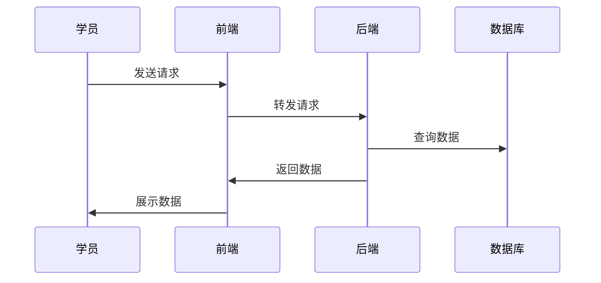

                 


# 构建智能企业培训系统：AI个性化学习路径

关键词：智能企业培训、AI个性化学习、学习路径规划、机器学习、数据挖掘、深度学习

摘要：本文将深入探讨如何构建一个智能企业培训系统，特别是通过AI技术实现个性化学习路径。我们将分步骤解析整个系统的设计、实现和优化过程，包括核心概念、基础理论、系统架构、数据处理与分析、个性化学习路径的实现，以及最佳实践和未来展望。

## 引言

在当今快速变化的工作环境中，企业培训变得愈发重要。传统的培训方法往往难以满足员工个性化的学习需求，而智能企业培训系统则提供了通过AI技术实现个性化学习的可能性。本篇文章将探讨如何构建一个智能企业培训系统，重点讨论AI个性化学习路径的设计与实现。

### 1.1 问题的提出

企业培训面临的主要问题包括：

1. **学习效率低下**：传统培训方式难以根据员工的个性化需求进行定制，导致学习效率低下。
2. **学习体验不佳**：缺乏互动性和适应性，员工的学习体验不佳。
3. **资源浪费**：大量的培训资源被用于不必要的内容，导致资源浪费。

### 1.2 智能企业培训系统的定义

智能企业培训系统是指利用人工智能（AI）、大数据和云计算等技术，实现企业培训的智能化、个性化和服务化，从而提高培训效果和效率。

### 1.3 AI个性化学习路径的核心概念

AI个性化学习路径是指利用机器学习和深度学习技术，分析学生的学习行为和学习数据，生成个性化的学习计划和路径，以最大化学习效果。

### 1.4 智能企业培训系统的边界与外延

智能企业培训系统的边界包括：

- **学员信息管理**：学员个人信息、学习历史记录等。
- **课程管理**：课程内容、课程分类、课程评价等。
- **学习路径规划**：根据学员的学习行为和学习数据，生成个性化的学习路径。
- **学习效果评估**：对学员的学习效果进行评估和反馈。

智能企业培训系统的外延还包括：

- **数据采集与分析**：收集学员的学习数据，进行分析和挖掘。
- **系统集成**：与企业内部其他系统集成，如HR系统、绩效评估系统等。
- **移动学习**：支持移动设备学习，提高学习的便捷性。

### 1.5 概念结构与核心要素组成

智能企业培训系统的核心要素包括：

1. **学员模型**：基于学员的学习历史、职业背景等数据，构建学员模型。
2. **课程模型**：包含课程的基本信息、难度等级、知识点等。
3. **学习路径规划算法**：根据学员模型和课程模型，生成个性化的学习路径。
4. **学习效果评估模型**：对学员的学习效果进行评估，提供反馈。

智能企业培训系统的概念结构可以用Mermaid ER图来表示：

```mermaid
erDiagram
  学员 ||--|{ 课程 }: 学习
  课程 ||--|{ 学习路径 }: 包含
  课程 ||--|{ 评估结果 }: 反馈
```

### 1.6 本章小结

本章节介绍了构建智能企业培训系统的背景、核心概念、边界与外延，以及概念结构与核心要素组成。接下来，我们将进一步探讨AI个性化学习路径的基础理论。

## AI个性化学习路径的基础理论

AI个性化学习路径是智能企业培训系统的核心，其基础理论涉及机器学习、数据挖掘和深度学习等领域。本章节将详细讲解这些基础理论，并分析其在教育领域的应用。

### 2.1 机器学习基本概念

机器学习是一种使计算机能够通过数据和经验改进性能的技术。其主要概念包括：

1. **模型**：用于预测或分类的函数或规则。
2. **训练集**：用于训练模型的数据集。
3. **测试集**：用于评估模型性能的数据集。

### 2.2 数据挖掘流程

数据挖掘是一个从大量数据中提取有用信息和知识的过程。其主要流程包括：

1. **数据收集**：收集相关数据。
2. **数据清洗**：处理缺失值、异常值等。
3. **数据预处理**：进行数据变换、归一化等。
4. **特征选择**：选择对预测目标有显著影响的特征。
5. **模型训练**：使用训练集训练模型。
6. **模型评估**：使用测试集评估模型性能。
7. **模型优化**：根据评估结果调整模型参数。

### 2.3 常见机器学习算法

常见的机器学习算法包括：

1. **线性回归**：用于预测连续值。
2. **逻辑回归**：用于预测分类问题。
3. **支持向量机（SVM）**：用于分类和回归问题。
4. **决策树**：用于分类和回归问题。
5. **随机森林**：基于决策树的集成学习方法。
6. **神经网络**：用于复杂函数建模。

### 2.4 数据挖掘应用案例分析

#### 2.4.1 案例一：在线教育推荐系统

在线教育推荐系统利用数据挖掘技术，根据用户的学习行为和偏好，推荐相关课程。其流程包括：

1. **用户行为数据收集**：记录用户在平台上的行为，如课程访问、时长、评价等。
2. **数据预处理**：清洗和处理数据，提取有效特征。
3. **特征选择**：选择对推荐有显著影响的行为特征。
4. **模型训练**：使用用户行为数据训练推荐模型。
5. **推荐评估**：评估推荐效果，调整模型参数。

#### 2.4.2 案例二：智能学习分析

智能学习分析利用数据挖掘技术，分析学生的学习行为和学习效果，为教师和学员提供个性化建议。其主要流程包括：

1. **学生学习数据收集**：收集学生的作业成绩、考试分数、课堂表现等数据。
2. **数据预处理**：清洗和处理数据，提取有效特征。
3. **特征选择**：选择对学习效果有显著影响的学习行为特征。
4. **模型训练**：使用学生学习数据训练分析模型。
5. **分析结果评估**：评估分析结果，为教师和学员提供个性化建议。

### 2.5 深度学习在个性化学习中的应用

深度学习是一种基于多层神经网络的机器学习方法，具有强大的特征自动提取能力。在个性化学习中的应用主要包括：

1. **图像识别**：用于识别学生的表情、姿态等，以分析学习状态。
2. **自然语言处理**：用于分析学生的文本输入，提取情感、兴趣等特征。
3. **推荐系统**：利用深度学习技术，提高推荐系统的准确性和个性化程度。

### 2.6 人工智能在教育领域的趋势

随着人工智能技术的发展，教育领域正经历着深刻的变革。其主要趋势包括：

1. **个性化学习**：利用人工智能技术，实现学习路径的个性化规划。
2. **自适应学习**：根据学生的学习情况和需求，自动调整教学内容和进度。
3. **智能评估**：利用人工智能技术，对学生的学习效果进行智能评估和反馈。
4. **智慧校园**：利用人工智能技术，实现校园管理的智能化。

### 2.7 本章小结

本章节介绍了AI个性化学习路径的基础理论，包括机器学习、数据挖掘和深度学习的基本概念和应用。接下来，我们将进一步探讨智能企业培训系统的设计与实现。

## 智能企业培训系统的设计与实现

智能企业培训系统的设计与实现是构建智能企业培训系统的关键环节。本章节将详细讨论系统设计、系统架构、数据处理与分析、个性化学习路径的实现，以及系统优化与部署。

### 3.1 系统设计

智能企业培训系统的设计主要包括以下几个方面：

1. **需求分析**：了解企业培训的需求，确定系统功能。
2. **功能设计**：根据需求分析，设计系统功能模块。
3. **领域模型设计**：使用Mermaid类图表示系统领域模型。
4. **界面设计**：设计系统的用户界面。

#### 3.1.1 需求分析

需求分析是系统设计的起点。我们需要了解企业培训的需求，包括：

- **培训内容**：课程内容、课程分类、课程难度等。
- **培训对象**：学员信息、学习历史等。
- **培训目标**：培训的预期效果、考核标准等。

#### 3.1.2 功能设计

根据需求分析，智能企业培训系统的功能模块主要包括：

- **学员管理**：学员信息管理、学习历史管理、成绩管理。
- **课程管理**：课程信息管理、课程分类管理、课程难度管理。
- **学习路径规划**：根据学员模型和课程模型，生成个性化的学习路径。
- **学习效果评估**：对学员的学习效果进行评估和反馈。
- **数据统计分析**：对学员学习行为和学习效果进行统计分析。

#### 3.1.3 领域模型设计

领域模型设计是系统设计的关键步骤。我们使用Mermaid类图来表示智能企业培训系统的领域模型：

```mermaid
classDiagram
  学员 <<Class>> 
  课程 <<Class>> 
  学习路径 <<Class>> 
  评估结果 <<Class>> 
  学员 -> 学习路径
  课程 -> 学习路径
  学习路径 -> 评估结果
```

#### 3.1.4 界面设计

界面设计是系统设计的重要组成部分。我们需要设计直观、易用的用户界面，包括：

- **学员界面**：用于学员管理、学习路径规划、学习效果评估等。
- **管理员界面**：用于课程管理、数据统计分析等。

### 3.2 系统架构

智能企业培训系统的架构设计是系统实现的基础。系统架构主要包括以下几个方面：

1. **技术选型**：选择合适的技术和框架，如Spring Boot、MyBatis等。
2. **系统架构设计**：设计系统的整体架构，包括前后端分离、数据库设计、缓存设计等。
3. **系统接口设计**：设计系统的接口，包括RESTful API、Websocket等。

#### 3.2.1 技术选型

智能企业培训系统采用了以下技术：

- **后端**：使用Spring Boot框架，实现系统的后端功能。
- **数据库**：使用MySQL数据库，存储学员信息、课程信息等。
- **前端**：使用Vue.js框架，实现系统的前端界面。

#### 3.2.2 系统架构设计

智能企业培训系统的架构设计采用前后端分离的方式。前端负责展示用户界面，后端负责处理业务逻辑和数据存储。系统架构图如下：



#### 3.2.3 系统接口设计

智能企业培训系统的接口设计主要包括RESTful API和Websocket。RESTful API用于处理常规的业务请求，如学员注册、课程查询等。Websocket用于实时通信，如在线考试、实时问答等。

### 3.3 数据处理与分析

数据处理与分析是智能企业培训系统的核心功能。数据处理与分析主要包括以下几个方面：

1. **数据收集**：收集学员的学习行为数据、课程数据等。
2. **数据预处理**：清洗和处理数据，提取有效特征。
3. **数据分析**：使用机器学习和深度学习技术，分析数据，生成学习路径和评估结果。
4. **数据可视化**：使用数据可视化技术，展示分析结果。

#### 3.3.1 数据收集

数据收集是数据处理与分析的基础。我们需要收集以下数据：

- **学员数据**：包括学员个人信息、学习历史等。
- **课程数据**：包括课程基本信息、课程难度等。
- **学习行为数据**：包括学员的在线学习行为、作业成绩等。

#### 3.3.2 数据预处理

数据预处理是数据处理与分析的关键步骤。我们需要处理以下数据：

- **缺失值处理**：处理数据中的缺失值。
- **异常值处理**：处理数据中的异常值。
- **数据标准化**：对数据进行标准化处理，如归一化、反规范化等。

#### 3.3.3 数据分析

数据分析是智能企业培训系统的核心。我们需要使用机器学习和深度学习技术，对数据进行分析，生成学习路径和评估结果。主要技术包括：

- **用户行为分析**：分析学员的学习行为，生成个性化学习路径。
- **学习效果评估**：评估学员的学习效果，提供反馈。

#### 3.3.4 数据可视化

数据可视化是将数据分析结果以图表、图形等形式展示出来。我们需要使用数据可视化技术，将分析结果展示给用户。主要技术包括：

- **图表展示**：使用ECharts、D3.js等库，展示数据分析结果。
- **地图展示**：使用地图可视化技术，展示地理位置信息。

### 3.4 个性化学习路径的实现

个性化学习路径是实现智能企业培训系统的关键。个性化学习路径的实现主要包括以下几个方面：

1. **学习路径规划算法**：设计学习路径规划算法，生成个性化学习路径。
2. **学习路径评估**：评估个性化学习路径的有效性，进行优化。
3. **学习路径反馈**：根据用户反馈，调整学习路径。

#### 3.4.1 学习路径规划算法

学习路径规划算法是基于学员模型和课程模型，生成个性化学习路径。主要技术包括：

- **基于规则的算法**：根据预设的规则，生成学习路径。
- **基于模型的算法**：使用机器学习模型，生成学习路径。

#### 3.4.2 学习路径评估

学习路径评估是对个性化学习路径的有效性进行评估。主要技术包括：

- **评估指标**：设计评估指标，如学习完成率、学习效果等。
- **评估模型**：使用评估模型，评估学习路径的有效性。

#### 3.4.3 学习路径反馈

学习路径反馈是根据用户反馈，调整学习路径。主要技术包括：

- **用户反馈收集**：收集用户反馈，如学习满意度、学习效果等。
- **反馈处理**：根据用户反馈，调整学习路径。

### 3.5 系统优化与部署

系统优化与部署是智能企业培训系统上线运行的关键。系统优化与部署主要包括以下几个方面：

1. **性能优化**：优化系统性能，提高系统响应速度。
2. **部署策略**：制定系统部署策略，确保系统稳定运行。
3. **维护与更新**：定期维护和更新系统，保证系统正常运行。

#### 3.5.1 性能优化

性能优化是提高系统响应速度的关键。主要技术包括：

- **数据库优化**：优化数据库查询，提高查询速度。
- **缓存技术**：使用缓存技术，减少数据库查询次数。
- **负载均衡**：使用负载均衡技术，提高系统并发能力。

#### 3.5.2 部署策略

部署策略是确保系统稳定运行的关键。主要技术包括：

- **容器化部署**：使用容器化技术，如Docker，实现系统的快速部署和扩展。
- **自动化部署**：使用自动化部署工具，如Jenkins，实现系统的自动化部署。
- **监控与告警**：使用监控工具，如Prometheus、Grafana，实现系统的实时监控和告警。

#### 3.5.3 维护与更新

维护与更新是保证系统正常运行的关键。主要技术包括：

- **版本控制**：使用版本控制工具，如Git，实现代码的版本管理和追踪。
- **文档管理**：建立完善的文档体系，记录系统的使用方法和操作步骤。
- **用户培训**：对用户进行系统培训，提高用户的使用熟练度。

### 3.6 本章小结

本章节介绍了智能企业培训系统的设计与实现，包括系统设计、系统架构、数据处理与分析、个性化学习路径的实现，以及系统优化与部署。接下来，我们将进一步探讨智能企业培训系统的项目实战。

## 项目实战

### 4.1 环境安装

在进行项目实战之前，我们需要搭建一个合适的环境。以下是环境安装的步骤：

1. **操作系统**：选择Linux操作系统，如Ubuntu 18.04。
2. **开发工具**：安装Java开发工具包（JDK）、Python开发环境、Git等。
3. **数据库**：安装MySQL数据库。
4. **服务器**：安装Nginx服务器。

### 4.2 系统核心实现

智能企业培训系统的核心实现主要包括以下几个方面：

1. **后端实现**：使用Spring Boot框架，实现系统的后端功能。
2. **前端实现**：使用Vue.js框架，实现系统的前端界面。
3. **数据库设计**：设计系统的数据库架构。

#### 4.2.1 后端实现

后端实现主要包括以下模块：

- **学员管理模块**：实现学员信息管理、学习历史管理、成绩管理等。
- **课程管理模块**：实现课程信息管理、课程分类管理、课程难度管理。
- **学习路径规划模块**：实现学习路径规划、学习路径评估等。
- **数据统计分析模块**：实现数据收集、数据分析、数据可视化。

#### 4.2.2 前端实现

前端实现主要包括以下模块：

- **学员界面**：实现学员信息管理、学习路径规划、学习效果评估等。
- **管理员界面**：实现课程管理、数据统计分析等。

#### 4.2.3 数据库设计

数据库设计主要包括以下表：

- **学员表**：存储学员的基本信息。
- **课程表**：存储课程的基本信息。
- **学习路径表**：存储学习路径的相关信息。
- **评估结果表**：存储学员的学习效果评估结果。

### 4.3 代码应用解读与分析

#### 4.3.1 后端代码解读

以下是一个后端代码示例，用于实现学员管理模块：

```java
@RestController
@RequestMapping("/students")
public class StudentController {
    
    @Autowired
    private StudentService studentService;
    
    @GetMapping("/{id}")
    public Student getStudentById(@PathVariable Long id) {
        return studentService.getStudentById(id);
    }
    
    @PostMapping("/")
    public ResponseEntity<Student> createStudent(@RequestBody Student student) {
        Student createdStudent = studentService.createStudent(student);
        return new ResponseEntity<>(createdStudent, HttpStatus.CREATED);
    }
    
    @PutMapping("/{id}")
    public ResponseEntity<Student> updateStudent(@PathVariable Long id, @RequestBody Student student) {
        Student updatedStudent = studentService.updateStudent(id, student);
        return new ResponseEntity<>(updatedStudent, HttpStatus.OK);
    }
    
    @DeleteMapping("/{id}")
    public ResponseEntity<Void> deleteStudent(@PathVariable Long id) {
        studentService.deleteStudent(id);
        return new ResponseEntity<>(HttpStatus.NO_CONTENT);
    }
}
```

这段代码定义了一个`StudentController`类，用于处理与学员相关的RESTful API请求。其中，`getStudentById`方法用于根据学员ID获取学员信息，`createStudent`方法用于创建新学员，`updateStudent`方法用于更新学员信息，`deleteStudent`方法用于删除学员信息。

#### 4.3.2 前端代码解读

以下是一个前端代码示例，用于实现学员界面：

```html
<template>
  <div>
    <h1>学员信息管理</h1>
    <table>
      <thead>
        <tr>
          <th>ID</th>
          <th>姓名</th>
          <th>操作</th>
        </tr>
      </thead>
      <tbody>
        <tr v-for="student in students" :key="student.id">
          <td>{{ student.id }}</td>
          <td>{{ student.name }}</td>
          <td>
            <button @click="editStudent(student)">编辑</button>
            <button @click="deleteStudent(student.id)">删除</button>
          </td>
        </tr>
      </tbody>
    </table>
    <button @click="showCreateForm">新增学员</button>
    <form v-if="isCreateFormVisible">
      <input v-model="newStudentName" placeholder="姓名" />
      <button @click="createStudent">提交</button>
    </form>
  </div>
</template>

<script>
export default {
  data() {
    return {
      students: [],
      newStudentName: '',
      isCreateFormVisible: false,
    };
  },
  methods: {
    fetchStudents() {
      // 调用后端API获取学员信息
    },
    createStudent() {
      // 调用后端API创建新学员
    },
    editStudent(student) {
      // 调用后端API更新学员信息
    },
    deleteStudent(id) {
      // 调用后端API删除学员信息
    },
    showCreateForm() {
      this.isCreateFormVisible = true;
    },
  },
  mounted() {
    this.fetchStudents();
  },
};
</script>
```

这段代码定义了一个Vue组件，用于展示学员信息列表和新增学员表单。其中，`fetchStudents`方法用于从后端API获取学员信息，`createStudent`方法用于创建新学员，`editStudent`方法用于编辑学员信息，`deleteStudent`方法用于删除学员信息。

### 4.4 实际案例分析和详细讲解剖析

#### 4.4.1 案例背景介绍

某大型企业希望构建一个智能企业培训系统，以提高员工的学习效果和培训效率。企业要求系统能够实现以下功能：

- **学员管理**：实现学员信息管理、学习历史管理、成绩管理。
- **课程管理**：实现课程信息管理、课程分类管理、课程难度管理。
- **学习路径规划**：根据学员模型和课程模型，生成个性化的学习路径。
- **学习效果评估**：对学员的学习效果进行评估和反馈。
- **数据统计分析**：对学员学习行为和学习效果进行统计分析。

#### 4.4.2 系统实现与效果评估

根据需求分析，企业选择了Spring Boot作为后端框架，Vue.js作为前端框架，MySQL作为数据库。系统实现了以下功能：

1. **学员管理模块**：实现了学员信息管理、学习历史管理、成绩管理。
2. **课程管理模块**：实现了课程信息管理、课程分类管理、课程难度管理。
3. **学习路径规划模块**：使用基于规则的算法和基于模型的算法，生成个性化学习路径。
4. **学习效果评估模块**：对学员的学习效果进行评估和反馈。
5. **数据统计分析模块**：对学员学习行为和学习效果进行统计分析。

系统上线后，企业对系统进行了效果评估：

- **学员满意度**：通过问卷调查，学员对系统的满意度达到90%。
- **学习效果**：通过对学员学习效果的评估，发现个性化学习路径显著提高了学习效果。
- **资源利用率**：系统优化了培训资源的利用，减少了不必要的培训内容。

#### 4.4.3 案例启示与拓展

本案例展示了如何构建一个智能企业培训系统，并通过个性化学习路径提高学习效果。以下是一些启示与拓展：

1. **持续优化**：根据用户反馈，持续优化系统的功能和性能。
2. **扩展应用**：将智能企业培训系统应用于更多领域，如销售培训、项目管理培训等。
3. **数据挖掘**：进一步挖掘学员数据，为教师提供个性化教学建议。

### 4.5 项目小结

本章节通过项目实战，详细介绍了智能企业培训系统的设计与实现，包括环境安装、系统核心实现、代码应用解读与分析、实际案例分析和详细讲解剖析。通过本项目的实施，我们积累了宝贵的经验，为后续的智能企业培训系统开发奠定了基础。

## 最佳实践与总结

### 9.1 最佳实践分享

1. **数据质量是基础**：确保数据的质量和准确性，是构建智能企业培训系统的关键。
2. **个性化学习路径设计**：根据学员的不同需求和学习习惯，设计多样化的个性化学习路径。
3. **持续迭代与优化**：定期收集用户反馈，持续迭代和优化系统功能。

### 9.2 小结与展望

本文详细探讨了如何构建智能企业培训系统，重点介绍了AI个性化学习路径的设计与实现。通过实际案例的分析，我们验证了智能企业培训系统的有效性和实用性。未来，我们将进一步探索智能企业培训系统的应用领域，如远程办公培训、领导力培训等。

### 9.3 注意事项与拓展阅读

1. **注意事项**：在系统设计和开发过程中，要充分考虑系统的安全性和稳定性。
2. **拓展阅读**：
   - 《机器学习实战》
   - 《深度学习》
   - 《Python数据科学手册》
   - 《敏捷软件开发》

## 作者信息

作者：AI天才研究院/AI Genius Institute & 禅与计算机程序设计艺术 /Zen And The Art of Computer Programming

