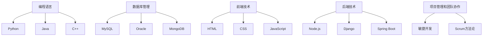
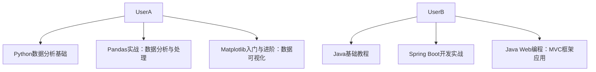

                 

### 引言与背景

在现代企业中，培训不仅是提高员工技能和知识的重要手段，更是增强团队协作和提升生产效率的关键因素。随着技术的不断进步，传统的企业培训方式正面临巨大的挑战。传统培训系统往往存在内容单调、缺乏个性化、学习效果不佳等问题。这不仅导致了员工学习兴趣的下降，也影响了企业整体培训效果。

为了解决这些问题，构建智能企业培训系统成为了当前研究的热点。智能培训系统利用人工智能技术，通过对用户数据的深入分析和处理，为员工提供个性化的学习路径和内容推荐，从而显著提高培训效果。

本文将深入探讨构建智能企业培训系统的必要性，并详细阐述其设计原则、个性化学习路径和内容推荐系统的实现。通过本文的介绍，读者将了解到智能企业培训系统的核心要素和实现方法，为实际应用提供有益的指导。

#### 第1章：智能企业培训系统概述

### 1.1 问题背景

**企业培训的重要性**

企业培训是提升员工技能和知识的重要手段。通过系统的培训，员工能够掌握新的技能，提高工作效率，从而为企业创造更大的价值。同时，培训也有助于增强团队协作能力，提高团队的整体效能。

- **提升员工技能**：培训可以帮助员工掌握新的技能和知识，提高专业素养，从而在工作中更加得心应手。
- **增强团队协作**：通过共同的学习和交流，团队成员能够更好地理解彼此，提高协作效率，减少沟通成本。
- **提高生产效率**：技能提升和团队协作的共同作用，可以显著提高生产效率，降低生产成本。

**传统培训的局限性**

尽管传统培训在企业中起到了一定的作用，但其在内容和形式上存在明显的局限性，导致培训效果不佳。

- **内容单调**：传统培训课程往往以固定的教材和讲义为主，缺乏新意和互动性，难以激发员工的学习兴趣。
- **缺乏个性化**：传统培训方式通常采用“一刀切”的方法，无法根据员工的不同需求和水平进行个性化教学，导致学习效果不佳。
- **学习效果不佳**：由于以上两个原因，传统培训往往难以达到预期的效果，员工的学习兴趣和参与度较低。

**构建智能培训系统的必要性**

为了克服传统培训的局限性，提高培训效果，构建智能企业培训系统成为了一种必然选择。

- **个性化学习路径**：智能培训系统通过分析用户数据，为员工提供个性化的学习路径，使培训内容更加贴合员工的需求和水平。
- **智能内容推荐**：智能培训系统能够根据员工的兴趣和学习记录，推荐相关的学习内容，提高学习的针对性和有效性。
- **提高培训效果**：通过个性化学习和智能推荐，员工的学习兴趣和参与度将显著提高，从而提高整体培训效果。

### 1.2 问题描述

**传统培训的局限性**

传统培训系统在内容和形式上存在以下局限性：

- **内容单调**：传统培训课程以固定的教材和讲义为主，缺乏新意和互动性，难以激发员工的学习兴趣。
  - **实例**：许多企业的培训课程仍然是基于传统的PPT和讲义，虽然内容翔实，但形式单一，难以吸引员工的注意力。
- **缺乏个性化**：传统培训方式通常采用“一刀切”的方法，无法根据员工的不同需求和水平进行个性化教学，导致学习效果不佳。
  - **实例**：在许多企业的培训中，无论是新员工还是老员工，都采用相同的培训内容和进度，这不仅无法满足员工的学习需求，也难以达到培训效果。
- **学习效果不佳**：由于内容单调、缺乏个性化，传统培训往往难以达到预期的效果，员工的学习兴趣和参与度较低。
  - **实例**：在许多企业的培训中，员工的出勤率和参与度普遍较低，培训后的实际效果也不理想。

**构建智能培训系统的必要性**

为了克服传统培训的局限性，提高培训效果，构建智能企业培训系统成为了一种必然选择。

- **个性化学习路径**：智能培训系统通过分析用户数据，为员工提供个性化的学习路径，使培训内容更加贴合员工的需求和水平。
  - **实例**：例如，通过分析员工的职业发展路径和技能需求，系统可以为员工推荐相关的课程和资料，帮助员工更有针对性地进行学习。
- **智能内容推荐**：智能培训系统能够根据员工的兴趣和学习记录，推荐相关的学习内容，提高学习的针对性和有效性。
  - **实例**：例如，系统可以根据员工的浏览记录和学习进度，推荐相关的视频、文章和案例，帮助员工更好地掌握所学知识。
- **提高培训效果**：通过个性化学习和智能推荐，员工的学习兴趣和参与度将显著提高，从而提高整体培训效果。
  - **实例**：例如，通过个性化学习路径和智能内容推荐，员工的学习积极性将大大提高，培训后的效果也会更加显著。

### 1.3 问题解决

**智能培训系统的设计原则**

构建智能培训系统，需要遵循以下设计原则：

- **个性化原则**：通过分析用户数据，为员工提供个性化的学习路径和内容推荐，提高培训的针对性和有效性。
  - **实现方式**：例如，系统可以通过用户的行为数据和学习记录，分析员工的兴趣和需求，为其推荐最适合的学习路径和内容。
- **可扩展性原则**：设计一个模块化、可扩展的系统架构，以适应不断变化的培训需求和技术发展。
  - **实现方式**：例如，系统可以采用微服务架构，将不同的功能模块化设计，便于后续的维护和升级。
- **安全性原则**：确保用户数据的安全，采用加密传输和权限控制等技术，防止数据泄露和滥用。
  - **实现方式**：例如，系统可以通过加密传输和严格的权限控制，确保用户数据的安全和隐私。

**构建智能培训系统的必要性**

构建智能培训系统，不仅能够解决传统培训系统的局限性，还能带来以下好处：

- **提升学习效果**：通过个性化学习和智能推荐，员工的学习兴趣和参与度将显著提高，从而提升整体培训效果。
  - **实例**：例如，通过智能推荐系统，员工可以更轻松地找到自己感兴趣的内容，从而提高学习的积极性和效率。
- **降低培训成本**：智能培训系统能够自动分析和处理用户数据，减少人工干预和培训资源的浪费，从而降低培训成本。
  - **实例**：例如，通过自动化推荐系统，企业可以更精准地投放培训资源，避免资源的浪费和重复。
- **提高员工满意度**：通过个性化的学习路径和内容推荐，员工能够更好地满足自己的学习需求，提高工作满意度和忠诚度。
  - **实例**：例如，通过个性化学习路径，员工可以更加有针对性地学习，提高工作效率和业绩。

### 1.4 边界与外延

**智能培训系统的范围**

智能培训系统通常包括以下组成部分：

- **在线学习平台**：提供用户注册、课程学习、测试和互动等功能。
  - **实例**：例如，企业可以使用如Moodle、Sakai等开源学习管理系统，搭建自己的在线学习平台。
- **内容管理系统**：负责管理培训内容，包括课程、视频、文档等。
  - **实例**：例如，企业可以使用如Drupal、WordPress等开源内容管理系统，搭建自己的内容管理系统。
- **智能分析工具**：用于分析用户数据，生成个性化推荐和优化学习路径。
  - **实例**：例如，企业可以使用如TensorFlow、Scikit-learn等机器学习库，构建智能分析工具。

**核心要素**

智能培训系统的核心要素包括：

- **用户数据收集**：通过用户行为数据，了解员工的学习需求和兴趣。
  - **实例**：例如，系统可以记录用户的登录时间、学习时长、测试成绩等数据，分析员工的学习习惯和兴趣。
- **个性化推荐算法**：基于用户数据，为员工推荐最适合的学习路径和内容。
  - **实例**：例如，可以使用协同过滤算法或基于内容的推荐算法，为员工推荐相关的课程和资料。
- **学习路径规划**：根据员工的技能水平和学习需求，规划个性化的学习路径。
  - **实例**：例如，系统可以根据员工的职业发展路径和技能需求，规划一系列相关的课程和培训。
- **内容管理**：管理和维护培训内容，确保内容的时效性和相关性。
  - **实例**：例如，系统可以定期更新课程内容，删除过时或不相关的资料，确保员工学习到最新的知识和技能。

### 1.5 概念结构与核心要素

**概念结构与核心要素**

智能培训系统的概念结构包括以下几个方面：

- **用户数据收集**：通过收集用户行为数据，了解员工的学习需求和兴趣。
  - **核心要素**：用户行为数据、学习记录、测试成绩等。
- **个性化推荐算法**：基于用户数据，为员工推荐最适合的学习路径和内容。
  - **核心要素**：推荐算法、推荐模型、推荐策略等。
- **学习路径规划**：根据员工的技能水平和学习需求，规划个性化的学习路径。
  - **核心要素**：学习路径规划模型、学习路径规划算法等。
- **内容管理**：管理和维护培训内容，确保内容的时效性和相关性。
  - **核心要素**：内容管理系统、内容审核机制、内容更新策略等。

**ER实体关系图**

以下是智能培训系统的ER实体关系图：

```mermaid
erDiagram
  User ||--|{ Course } : 参加课程
  User ||--|{ Test } : 参加测试
  Course ||--|{ Content } : 包含内容
  Course ||--|{ LearningPath } : 属于学习路径
  Test ||--|{ Score } : 获得分数
  LearningPath ||--|{ Step } : 包含步骤
  Content ||--|{ Type } : 内容类型
  Type ||--|{ Attribute } : 属性

  User {
    String id
    String name
    String email
    ...
  }

  Course {
    String id
    String title
    String description
    ...
  }

  Test {
    String id
    String title
    String description
    ...
  }

  Content {
    String id
    String title
    String content
    ...
  }

  LearningPath {
    String id
    String title
    String description
    ...
  }

  Step {
    String id
    String title
    String description
    ...
  }

  Score {
    String id
    Double value
    Date date
    ...
  }

  Type {
    String id
    String name
    ...
  }

  Attribute {
    String id
    String name
    String value
    ...
  }
```

通过这个ER实体关系图，我们可以清晰地看到智能培训系统中各个实体之间的关系，为后续的系统设计和开发提供了重要的参考。

### 第2章：智能培训系统的设计原则

智能培训系统的设计原则是确保系统能够有效支持个性化学习路径和内容推荐的核心要素，同时具备良好的用户体验、扩展性和安全性。以下将详细阐述这些设计原则，并提供相应的实现方法。

#### 2.1 可用性原则

**用户友好界面**：

一个智能培训系统首先需要具备良好的用户体验，这意味着界面设计需要简单易懂，操作流程应直观便捷。以下是一些具体的实现方法：

- **简洁的导航设计**：系统导航应清晰明确，方便用户快速找到所需功能。
  - **实例**：例如，使用面包屑导航和清晰的菜单分类，使用户能够轻松追踪和浏览学习路径。
- **自适应设计**：界面应能够适应不同设备的屏幕尺寸，提供一致的浏览体验。
  - **实例**：使用响应式设计，确保系统在手机、平板和桌面电脑上都能良好运行。
- **交互反馈**：界面上的操作应提供即时反馈，提高用户的操作体验。
  - **实例**：在用户提交表单或点击按钮时，显示加载动画或确认消息，使操作过程更加流畅。

**实现方法**：

- **前端框架**：选择如React或Vue等前端框架，它们提供了丰富的组件和UI库，可以快速搭建用户友好界面。
- **用户测试**：在系统开发过程中，定期进行用户测试，收集反馈并进行改进，确保界面设计符合用户需求。

#### 2.2 个性化原则

**数据驱动**：

个性化原则的核心在于通过分析用户数据，为员工提供个性化的学习路径和内容推荐。以下是一些具体的实现方法：

- **用户行为分析**：系统应能够记录和分析用户的学习行为，如学习时长、学习进度、测试成绩等，以了解员工的学习习惯和兴趣。
  - **实例**：例如，通过分析用户的学习记录，系统可以识别出员工经常访问的课程类型，进而推荐相关的课程。
- **学习偏好识别**：系统应能够根据用户的行为数据，识别出员工的学习偏好，如喜欢阅读文本、观看视频或进行实操练习等。
  - **实例**：例如，通过分析用户的互动行为，系统可以推荐更多视频课程，以满足用户的偏好。

**实现方法**：

- **机器学习算法**：使用如协同过滤、内容分析等机器学习算法，对用户数据进行处理和分析，生成个性化的推荐结果。
- **用户画像**：构建用户画像，将用户的基本信息、学习行为、偏好等数据整合，形成一个全面的用户视图，为个性化推荐提供依据。

#### 2.3 可扩展性原则

**模块化设计**：

一个可扩展的系统设计可以确保系统能够适应未来的需求变化，以下是一些具体的实现方法：

- **服务拆分**：将系统拆分为多个独立的服务模块，如用户服务、内容服务、推荐服务等，每个模块可以独立开发、部署和扩展。
  - **实例**：例如，用户服务模块可以独立处理用户注册、登录、个人信息管理等功能。
- **微服务架构**：采用微服务架构，将系统划分为多个微服务，每个微服务负责特定的业务功能，便于系统的扩展和维护。
  - **实例**：例如，使用Spring Cloud等框架，搭建基于微服务的培训系统。

**实现方法**：

- **容器化部署**：使用Docker等容器技术，将微服务打包成独立的容器，便于部署和扩展。
- **持续集成与持续部署（CI/CD）**：使用Jenkins等工具，实现自动化构建、测试和部署，提高开发效率和系统稳定性。

#### 2.4 安全性原则

**数据安全保护**：

确保用户数据的安全是智能培训系统的基本要求，以下是一些具体的实现方法：

- **加密传输**：在数据传输过程中，使用HTTPS等加密协议，确保数据在传输过程中的安全性。
  - **实例**：使用SSL/TLS协议，对用户的数据进行加密传输，防止数据在网络上被窃取。
- **权限控制**：对系统中的不同用户角色分配不同的权限，确保只有授权用户可以访问敏感数据。
  - **实例**：例如，管理员可以访问所有用户数据，而普通用户只能访问自己的数据。

**实现方法**：

- **访问控制**：使用OAuth2.0等访问控制协议，确保用户在访问系统资源时，经过身份验证和授权。
- **数据备份与恢复**：定期备份数据，并制定数据恢复策略，确保在数据丢失或系统故障时，能够快速恢复数据。

通过遵循这些设计原则，智能培训系统不仅可以提供个性化的学习体验，还能保证系统的扩展性和安全性，为企业培训提供强有力的支持。

#### 3.1 学习路径的概念

**学习路径的定义**

学习路径是指为用户设计的、指导用户完成学习的一系列步骤和过程。它是智能培训系统的核心功能之一，旨在通过一系列有序的课程和练习，帮助用户系统地掌握知识和技能。

- **学习路径的目的**：学习路径的主要目的是根据用户的技能水平、学习需求和目标，为其提供一条清晰、有序的学习路线，确保用户能够高效地完成学习任务。
- **学习路径的特点**：学习路径具有个性化、系统性和可追踪性。个性化体现在路径的设定可以根据用户的实际需求和兴趣进行调整；系统性体现在路径中的课程和练习是有机结合的，形成完整的学习体系；可追踪性体现在用户的学习进度和成果可以实时记录和跟踪。

**学习路径的组成部分**

一个完整的学习路径通常包括以下几个组成部分：

- **课程模块**：课程模块是学习路径的核心，包括一系列相关的课程内容。这些课程内容可以是视频、文本、练习题等，旨在帮助用户掌握特定的知识和技能。
- **练习环节**：练习环节是学习路径中的重要组成部分，通过实际操作和练习，用户可以将所学知识应用到实际工作中，提高技能水平。
- **评估机制**：评估机制用于检测用户的学习效果，包括定期的测试、作业和反馈。通过评估，用户可以了解自己的学习进度和不足之处，进一步调整学习策略。
- **学习资源**：学习资源包括与课程相关的文档、视频、案例等辅助材料，旨在为用户提供更全面、多样化的学习支持。

**学习路径的重要性**

- **提高学习效率**：通过学习路径的规划，用户可以按照科学的步骤进行学习，避免盲目和无序的学习方式，提高学习效率。
- **增强学习动机**：清晰的学习路径可以激发用户的学习兴趣和动机，使其更有动力去完成学习任务。
- **确保学习效果**：通过学习路径中的评估机制，用户可以及时了解自己的学习效果，发现问题并调整学习策略，确保学习目标的实现。

**学习路径的设计原则**

- **个性化**：学习路径应基于用户的具体需求和技能水平进行个性化设计，确保学习内容与用户实际情况相匹配。
- **系统性**：学习路径中的课程和练习应系统有序，形成一个完整的学习体系，避免跳跃和不连贯的学习。
- **灵活性**：学习路径应具有一定的灵活性，能够根据用户的学习进度和反馈进行调整，确保学习路径的动态适应。

#### 3.2 学习路径的设计流程

**需求分析**

**需求分析**是学习路径设计的第一步，其目的是明确用户的学习需求和目标，为后续的设计提供依据。以下是具体步骤和方法：

- **用户需求调查**：通过问卷调查、访谈、用户行为分析等方式，了解用户的学习需求和目标。例如，可以通过调查了解用户希望学习的技能领域、学习时间安排、学习兴趣等。
- **培训目标确定**：根据用户需求，明确培训的具体目标。培训目标应具体、可衡量，例如提高用户的编程技能、增强团队协作能力等。
- **课程内容分析**：分析现有课程内容，确定与培训目标相关的课程模块。需要考虑课程的难易程度、内容覆盖面和实用性，确保课程内容与用户需求相匹配。
- **学习资源收集**：收集与课程内容相关的学习资源，如视频、文档、案例等，为用户的学习提供全面的支持。

**需求分析的方法和工具**

- **问卷调查**：通过设计结构化问卷，收集用户的基本信息和学习需求。问卷可以通过线上平台或电子邮件等方式进行分发。
- **访谈**：通过面对面或在线访谈，深入了解用户的学习需求和目标。访谈应注重开放性问题，鼓励用户表达真实想法。
- **用户行为分析**：通过分析用户在学习平台上的行为数据，如学习时长、学习进度、测试成绩等，了解用户的学习习惯和兴趣。

**需求分析的结果**

需求分析的结果应包括以下内容：

- **用户基本信息**：如年龄、职业、教育背景等。
- **学习需求**：如希望学习的技能领域、学习目标、学习时间安排等。
- **培训目标**：明确具体的培训目标，如提高编程技能、增强团队协作能力等。
- **课程内容分析**：与培训目标相关的课程模块和内容。
- **学习资源**：与课程内容相关的学习资源。

**需求分析的重要性**

- **确保学习路径的针对性**：通过需求分析，可以明确用户的具体学习需求，设计出更加针对性的学习路径，提高学习效果。
- **提高培训效率**：需求分析可以帮助企业更高效地分配培训资源，避免资源的浪费和不必要的重复培训。
- **增强用户满意度**：通过了解用户需求，可以提供更符合用户期望的学习路径和内容，提高用户的学习满意度和参与度。

**需求分析的过程**

需求分析的过程可以分为以下几个阶段：

1. **准备阶段**：明确需求分析的目标和范围，设计调查问卷和访谈提纲。
2. **收集数据阶段**：通过问卷调查、访谈和用户行为分析等方式，收集用户的基本信息和学习需求。
3. **数据分析阶段**：对收集到的数据进行分析，提取关键信息，明确培训目标和课程内容。
4. **结果报告阶段**：撰写需求分析报告，总结分析结果，提出具体的建议和措施。

**需求分析的工具和技术**

- **问卷调查**：通过设计结构化问卷，收集用户的基本信息和学习需求。
- **访谈**：通过面对面或在线访谈，深入了解用户的学习需求和目标。
- **用户行为分析**：通过分析用户在学习平台上的行为数据，如学习时长、学习进度、测试成绩等，了解用户的学习习惯和兴趣。
- **用户画像**：通过用户行为数据，构建用户画像，了解用户的兴趣和需求。

**需求分析的实际案例**

例如，一家软件开发公司希望为其新入职的程序员提供系统培训，以提高其编程技能和项目协作能力。在需求分析阶段，公司通过问卷调查和访谈，收集了新员工的个人信息、学习需求和目标。根据收集到的数据，公司明确了培训目标，设计了包括基础编程知识、项目管理和团队协作等方面的学习路径和课程内容。

通过详细的需求分析，公司能够为新员工提供更有针对性的培训，提高培训效果和员工满意度。

#### 3.3 学习路径的构建方法

**基于能力的路径设计**

基于能力的路径设计是一种以用户技能水平为核心的学习路径设计方法。该方法通过对用户能力的分析，为用户设计一条科学、有序的学习路径，确保用户能够系统地掌握所需的技能。

**技能点分类**

在基于能力的路径设计中，首先需要将用户所需的技能点进行分类。技能点分类的方法可以基于职业岗位、技能领域或学习模块等。以下是一个简单的技能点分类示例：

- **编程语言**：包括Python、Java、C++等。
- **数据库管理**：包括MySQL、Oracle、MongoDB等。
- **前端技术**：包括HTML、CSS、JavaScript等。
- **后端技术**：包括Node.js、Django、Spring Boot等。
- **项目管理和团队协作**：包括敏捷开发、Scrum方法论等。

**技能点分类示例**

以下是几个技能点的分类示例：



通过技能点分类，我们可以清晰地看到每个技能点所属的领域和层次，为后续的学习路径设计提供基础。

**根据用户能力推荐课程**

在确定了技能点分类后，下一步是根据用户的技能水平和需求，为其推荐相应的课程。以下是一个基于用户能力的课程推荐示例：

- **用户A**：具有基础的Python编程技能，需要进一步提升数据分析能力。
  - **推荐课程**：
    - Python数据分析基础
    - Pandas实战：数据分析与处理
    - Matplotlib入门与进阶：数据可视化
- **用户B**：具有较好的Java编程基础，希望学习Web开发技术。
  - **推荐课程**：
    - Java基础教程
    - Spring Boot开发实战
    - Java Web编程：MVC框架应用

**推荐课程示例**

以下是用户A和用户B的推荐课程示例：



通过根据用户能力推荐课程，可以确保学习路径的针对性和有效性，提高用户的学习兴趣和参与度。

**学习路径设计流程**

基于能力的路径设计流程可以分为以下几个步骤：

1. **技能点分类**：根据职业岗位或技能领域，将用户所需的技能点进行分类。
2. **课程资源整理**：整理与每个技能点相关的课程资源，确保课程内容的全面性和实用性。
3. **用户能力评估**：通过调查问卷、测试等方式，评估用户的技能水平和需求。
4. **课程推荐**：根据用户的能力评估结果，为用户推荐相应的课程，构建个性化的学习路径。
5. **学习路径调整**：根据用户的学习进度和反馈，动态调整学习路径，确保学习目标的实现。

**基于能力的路径设计的优势**

- **提高学习效率**：通过基于用户能力的课程推荐，用户可以更有针对性地学习，避免盲目和无序的学习，提高学习效率。
- **增强学习动机**：科学的学习路径设计能够激发用户的学习兴趣和动机，提高学习积极性和参与度。
- **确保学习效果**：通过评估和调整学习路径，确保用户能够系统地掌握所需的技能，提高学习效果和满意度。

**案例分析**

以某软件开发公司的程序员培训为例，公司通过对程序员进行技能点分类和课程资源整理，为程序员设计了基于能力的个性化学习路径。通过用户能力评估和课程推荐，公司能够为程序员提供有针对性的培训，提高编程技能和工作效率。

#### 3.4 学习路径的优化

**反馈机制**

**反馈机制**是优化学习路径的重要手段。通过收集用户的学习反馈，可以及时发现路径中的不足，并进行相应的调整和优化。以下是一些具体的实现方法：

- **实时反馈收集**：在学习过程中，系统应提供实时反馈功能，允许用户随时表达自己的意见和感受。例如，用户可以在课程结束后进行评价，或者在学习过程中提交问题和建议。
- **数据分析**：系统应对收集到的反馈数据进行详细分析，提取有价值的信息。例如，通过分析用户的评价和问题，可以了解用户对课程内容的满意度、难点和需求。
- **问题分类处理**：根据反馈内容，将问题进行分类处理。例如，技术性问题可以由课程负责人或技术支持团队解决，而用户界面问题可以由前端开发团队处理。

**优化方法**

- **内容更新**：根据用户反馈，及时更新课程内容，补充或修改过时或不适用的资料。例如，如果用户反映某个课程内容过于陈旧，可以更新为最新的技术案例或教程。
- **路径调整**：根据用户的反馈和学习进度，动态调整学习路径。例如，如果用户在学习某个模块时遇到较多困难，可以考虑调整路径，增加相关的练习或补充课程。
- **个性化推荐**：通过分析用户的反馈和学习记录，为用户提供更加个性化的学习内容和路径。例如，如果用户对某个主题特别感兴趣，可以推荐更多相关的高级课程。

**反馈机制的重要性**

- **提高学习满意度**：通过及时收集和响应用户反馈，可以提升用户的学习体验和满意度，增强用户对系统的信任和依赖。
- **优化学习效果**：通过不断优化学习路径和内容，可以确保用户能够更加高效地学习，达到预期的学习目标。
- **提升系统质量**：通过持续的反馈和优化，可以不断改进系统的设计和管理，提高系统的整体质量。

**优化案例**

以某在线教育平台的培训课程为例，该平台通过实时反馈机制，收集用户在学习过程中的问题和建议。根据用户的反馈，平台及时调整了课程内容和学习路径，增加了更多的练习和案例，并引入了新的技术教程。通过这些优化措施，平台显著提高了用户的学习效果和满意度。

#### 4.1 内容推荐的概念

**内容推荐的定义**

内容推荐是指根据用户的兴趣、行为和历史数据，向用户推荐相关的内容和资源。在智能培训系统中，内容推荐系统通过分析用户的行为和学习记录，为其推荐适合的课程、视频、文档和其他学习资源，从而提高学习的针对性和效率。

**内容推荐的目的**

内容推荐系统的主要目的是：

- **提高学习效率**：通过推荐与用户兴趣和需求相关的内容，用户可以更快地找到自己需要的学习资源，避免无效搜索和重复学习。
- **增强学习体验**：个性化推荐可以满足用户的个性化需求，使学习过程更加有趣和有意义，从而提高用户的学习动机和满意度。
- **提升培训效果**：通过推荐与用户职业发展相关的课程，可以帮助用户系统地学习和掌握所需的技能，提升整体培训效果。

**内容推荐的应用场景**

在智能培训系统中，内容推荐的应用场景包括：

- **课程推荐**：根据用户的学习历史和兴趣，推荐相关的课程，帮助用户规划学习路径。
- **视频推荐**：根据用户的观看历史和偏好，推荐相关的教学视频，提高学习的趣味性和实用性。
- **文档推荐**：根据用户的阅读历史和搜索关键词，推荐相关的文档和资料，提供更全面的学习支持。
- **案例推荐**：根据用户的实践经验和需求，推荐相关的案例和实战教程，帮助用户更好地理解和应用所学知识。

**内容推荐与传统培训的区别**

与传统培训相比，内容推荐具有以下显著优势：

- **个性化**：传统培训通常采用统一的教学内容，难以满足不同用户的需求。而内容推荐可以根据用户的行为和兴趣，提供个性化的学习资源，提高学习效果。
- **实时性**：内容推荐系统可以实时分析用户的行为数据，动态调整推荐结果，确保推荐的及时性和准确性。
- **互动性**：内容推荐系统不仅提供学习资源，还可以根据用户反馈进行调整，形成一个互动的学习闭环，提高用户的学习体验。

**内容推荐在智能培训系统中的重要性**

内容推荐在智能培训系统中具有至关重要的地位，其主要作用体现在：

- **提升用户参与度**：通过个性化的推荐，用户可以更加主动地参与学习过程，提高学习积极性和参与度。
- **优化学习路径**：通过推荐与用户职业发展相关的课程和资源，可以帮助用户更科学地规划学习路径，确保学习目标的实现。
- **提高培训效果**：个性化推荐可以确保用户学习到最相关和最有价值的知识，提高整体培训效果和用户满意度。

#### 4.2 内容推荐系统的架构

**推荐算法的选择**

内容推荐系统通常采用以下几种推荐算法：

- **协同过滤算法**：协同过滤算法通过分析用户的历史行为和兴趣，找出相似用户或物品，并进行推荐。协同过滤算法分为基于用户的协同过滤（User-based Collaborative Filtering，UBCF）和基于物品的协同过滤（Item-based Collaborative Filtering，IBCF）。UBCF通过寻找与当前用户行为相似的其它用户，推荐这些用户喜欢的物品；IBCF则通过分析物品之间的相似性，推荐与用户已评价物品相似的其它物品。
- **基于内容的推荐算法**：基于内容的推荐算法（Content-based Filtering，CBF）通过分析用户的历史行为和兴趣，提取用户的兴趣特征，并根据这些特征为用户推荐相似的内容。CBF通常结合特征词提取和相似度计算，如TF-IDF（Term Frequency-Inverse Document Frequency）和余弦相似度。
- **混合推荐算法**：混合推荐算法结合了协同过滤和基于内容的推荐算法，以充分利用两者的优势。例如，可以采用协同过滤算法找到相似用户或物品，再使用基于内容的推荐算法进行进一步细化和调整。

**协同过滤算法**

**基于用户的协同过滤（UBCF）**

- **核心思想**：UBCF通过分析用户之间的行为相似度，为用户推荐其他相似用户喜欢的物品。
- **步骤**：
  1. **用户相似度计算**：计算两个用户之间的相似度，通常使用余弦相似度或皮尔逊相关系数。
     $$\text{similarity(u, v)} = \frac{\text{corr}(r_u, r_v)}{\sqrt{\sum_{i=1}^{n} r_{ui}^2 \cdot \sum_{i=1}^{n} r_{vi}^2}}$$
     其中，$r_u$ 和 $r_v$ 分别表示用户 $u$ 和 $v$ 对物品的评分向量。
  2. **推荐列表生成**：为用户 $u$ 推荐与用户 $v$ 相似的其他用户喜欢的物品，选择评分较高的物品。
- **优势**：能够充分利用用户之间的行为相似性，推荐结果更加个性化。
- **挑战**：在用户数量较多且评分数据稀疏的情况下，相似度计算复杂度较高，且可能出现数据冷启动问题。

**基于物品的协同过滤（IBCF）**

- **核心思想**：IBCF通过分析物品之间的相似度，为用户推荐与用户已评价物品相似的其它物品。
- **步骤**：
  1. **物品相似度计算**：计算两个物品之间的相似度，通常使用余弦相似度或欧氏距离。
     $$\text{similarity(i, j)} = \frac{\text{cosine}(v_i, v_j)}{\max(\|v_i\|, \|v_j\|)}$$
     其中，$v_i$ 和 $v_j$ 分别表示物品 $i$ 和 $j$ 的特征向量。
  2. **推荐列表生成**：为用户推荐与用户已评价物品相似的其它物品，选择相似度较高的物品。
- **优势**：能够充分利用物品之间的相似性，减少数据冷启动问题。
- **挑战**：当物品数量较多时，相似度计算复杂度较高，且可能存在信息过载问题。

**基于内容的推荐算法**

**核心思想**：CBF通过分析用户的历史行为和兴趣，提取用户的兴趣特征，并根据这些特征为用户推荐相似的内容。

**步骤**：

1. **用户特征提取**：从用户的历史行为和兴趣中提取特征，如关键词、标签、评分等。
   $$\text{feature\_vector}(u) = [\text{TF-IDF}(\text{keyword}_1, \text{document}_1), \text{TF-IDF}(\text{keyword}_2, \text{document}_2), \ldots]$$

2. **内容特征提取**：从待推荐的内容中提取特征，如文本内容、标签等。
   $$\text{feature\_vector}(d) = [\text{TF-IDF}(\text{keyword}_1, \text{document}_1), \text{TF-IDF}(\text{keyword}_2, \text{document}_2), \ldots]$$

3. **相似度计算**：计算用户特征向量与内容特征向量之间的相似度，通常使用余弦相似度。
   $$\text{similarity}(u, d) = \frac{\text{cosine}(\text{feature\_vector}(u), \text{feature\_vector}(d))}{\max(\|\text{feature\_vector}(u)\|, \|\text{feature\_vector}(d)\|)}$$

4. **推荐列表生成**：为用户推荐相似度较高的内容。

**优势**：能够充分利用内容的特征信息，减少数据冷启动问题。

**挑战**：当内容特征复杂时，特征提取和相似度计算复杂度较高。

**混合推荐算法**

**核心思想**：混合推荐算法结合协同过滤和基于内容的推荐算法，以充分利用两者的优势。

**步骤**：

1. **协同过滤推荐**：使用协同过滤算法生成初步推荐列表。
2. **基于内容调整**：对初步推荐列表中的内容，使用基于内容的推荐算法进行进一步调整。
3. **综合推荐结果**：将协同过滤和基于内容调整后的推荐结果进行综合，生成最终推荐列表。

**优势**：综合协同过滤和基于内容推荐的优势，提高推荐准确性和多样性。

**挑战**：需要合理平衡协同过滤和基于内容推荐的权重，避免信息过载和推荐偏差。

通过选择合适的推荐算法，智能培训系统能够为用户提供个性化的学习资源，提高学习的针对性和效率。

#### 4.3 内容推荐系统的实现

**数据收集与处理**

内容推荐系统的实现首先需要收集和处理大量用户数据，这些数据主要包括用户行为数据、学习记录和内容特征数据。以下详细说明这些数据的收集和处理过程：

**用户行为数据**

用户行为数据包括用户的浏览记录、点击次数、学习时长、测试成绩等。这些数据可以通过在线学习平台自动收集，例如：

- **浏览记录**：记录用户在平台上的访问页面、访问时间和访问频率。
  - **示例**：用户在某一课程页面停留了5分钟，该课程被点击了10次。
- **学习时长**：记录用户在平台上的学习时长，用于分析用户的学习投入程度。
  - **示例**：用户在学习某课程时累计学习了30分钟。
- **测试成绩**：记录用户在课程测试中的成绩，用于评估用户的学习效果。
  - **示例**：用户在某一课程的测试中获得了85%的正确率。

**学习记录**

学习记录包括用户的学习进度、完成的课程、完成的作业和互动行为等。这些数据有助于了解用户的学习情况，并为后续推荐提供依据。例如：

- **学习进度**：记录用户在学习过程中完成的课程和作业。
  - **示例**：用户已经完成了Python基础课程的50%。
- **完成的作业**：记录用户完成的作业情况，用于评估用户的学习效果。
  - **示例**：用户在编程作业中提交了5个作业，其中4个获得了满分。
- **互动行为**：记录用户在平台上的互动行为，如评论、提问和参与讨论。
  - **示例**：用户在讨论区发起了3个话题，吸引了其他用户参与讨论。

**内容特征数据**

内容特征数据包括课程名称、课程描述、课程标签、课程难度、课程类型等。这些数据用于描述课程内容，并为推荐算法提供输入。例如：

- **课程名称**：课程的标题，用于标识课程内容。
  - **示例**：课程名称为“Python数据分析实战”。
- **课程描述**：课程的具体内容和目标，用于帮助用户了解课程。
  - **示例**：课程描述为“本课程将介绍如何使用Python进行数据分析，包括数据清洗、数据可视化和数据分析方法”。
- **课程标签**：课程的分类标签，用于描述课程的主题和领域。
  - **示例**：课程标签包括“数据分析”、“Python编程”、“数据可视化”。
- **课程难度**：课程的难度级别，用于帮助用户选择适合自己的课程。
  - **示例**：课程难度为“中级”。
- **课程类型**：课程的类型，如视频课程、文档课程、实践课程等。
  - **示例**：课程类型为“视频课程”。

**数据处理流程**

**数据预处理**

在数据收集到后，首先需要进行数据预处理，以提高数据质量和推荐系统的性能。数据预处理主要包括以下步骤：

- **数据清洗**：去除重复、缺失和错误的数据，确保数据的准确性。例如，去除重复的用户记录、处理缺失的评分数据等。
- **数据归一化**：对数据集中的特征进行归一化处理，使其在同一量级范围内，避免某些特征对模型产生过大的影响。例如，对用户的评分数据进行标准化处理，使其在0到1之间。
- **特征工程**：提取和构造新的特征，以增强模型的预测能力。例如，通过对用户行为数据进行聚合和转换，生成新的特征，如用户的平均学习时长、频繁访问的课程等。

**数据存储**

预处理后的数据需要存储在数据库中，以便后续的推荐算法使用。常用的数据库技术包括关系型数据库（如MySQL、PostgreSQL）和NoSQL数据库（如MongoDB、Redis）。

- **关系型数据库**：适用于存储结构化数据，如用户行为数据和学习记录。关系型数据库通过SQL进行数据查询和管理，具有较高的查询性能和可靠性。
- **NoSQL数据库**：适用于存储非结构化或半结构化数据，如内容特征数据。NoSQL数据库通过JSON格式进行数据存储和查询，具有高扩展性和灵活性。

**数据处理流程**

1. **数据收集**：通过在线学习平台自动收集用户行为数据和学习记录。
2. **数据预处理**：清洗、归一化和特征工程，提高数据质量和模型性能。
3. **数据存储**：将预处理后的数据存储在关系型数据库和NoSQL数据库中，以便后续推荐算法使用。
4. **推荐算法**：使用协同过滤、基于内容的推荐算法和混合推荐算法，生成推荐列表。
5. **推荐结果**：将推荐结果返回给用户，展示在在线学习平台中。

通过数据收集与处理，内容推荐系统能够为用户提供个性化的学习资源，提高学习的针对性和效率。

#### 4.4 内容推荐效果评估

**评估指标**

内容推荐效果评估是评估推荐系统性能的重要环节，常用的评估指标包括准确率（Accuracy）、覆盖率（Coverage）和新颖性（Novelty）。

**准确率（Accuracy）**

准确率是指推荐系统中推荐的物品中有多少是用户实际感兴趣的。计算公式如下：

$$
\text{Accuracy} = \frac{\text{推荐的感兴趣物品数}}{\text{推荐的物品总数}}
$$

准确率越高，表示推荐系统越能准确识别用户兴趣。

**覆盖率（Coverage）**

覆盖率是指推荐系统中推荐的物品涵盖了用户可能感兴趣的物品的比率。计算公式如下：

$$
\text{Coverage} = \frac{\text{推荐的所有物品数}}{\text{用户可能感兴趣的物品总数}}
$$

覆盖率越高，表示推荐系统越能广泛覆盖用户的兴趣。

**新颖性（Novelty）**

新颖性是指推荐系统推荐的新物品与用户已了解的物品之间的差异。新颖性可以通过以下公式计算：

$$
\text{Novelty} = \frac{\text{推荐的新物品数}}{\text{推荐的物品总数}}
$$

新颖性越高，表示推荐系统越能推荐出用户未知的、新颖的物品。

**评估方法**

1. **离线评估**：离线评估通常在开发阶段进行，通过模拟用户行为数据，计算评估指标。常见方法包括：
   - **交叉验证**：将数据集划分为训练集和测试集，分别计算推荐系统的性能。
   - **网格搜索**：通过遍历参数空间，寻找最优参数组合，提高推荐系统性能。

2. **在线评估**：在线评估在实际运行环境中进行，通过实时监测用户反馈，评估推荐系统的效果。常见方法包括：
   - **点击率（Click-through Rate, CTR）**：通过监测用户对推荐物品的点击行为，评估推荐系统的吸引力。
   - **转化率（Conversion Rate）**：通过监测用户对推荐物品的实际购买或使用行为，评估推荐系统的实际效果。

**评估工具**

- **Apache Mahout**：一个开源的机器学习库，提供多种推荐算法，支持离线评估。
- **Scikit-learn**：一个Python库，提供丰富的机器学习工具，适用于离线和在线评估。
- **TensorFlow Recommenders**：一个基于TensorFlow的推荐系统库，提供端到端推荐系统解决方案，支持在线评估。

通过准确率、覆盖率和新颖性等评估指标，可以全面评估内容推荐系统的性能，并持续优化推荐算法，提高推荐质量。

#### 5.1 技术选型

**前端技术**

在构建智能培训系统时，选择合适的前端技术至关重要。以下将介绍几种常用的前端技术，并分析其优缺点：

**React**

React 是一个由Facebook开发的开源JavaScript库，用于构建用户界面。它提供了组件化的开发模式，使开发者能够以声明式的方式构建应用，具有以下优点：

- **组件化开发**：React通过组件的方式组织代码，使得应用的结构更加清晰，易于维护和复用。
- **虚拟DOM**：React使用虚拟DOM，通过高效的节点比较和更新策略，提高了应用的性能。
- **单向数据流**：React采用单向数据流模型，使得数据的更新和状态的改变更加可控，减少了应用中的错误和复杂性。

缺点：

- **学习曲线**：React的学习曲线相对较陡，对于新手开发者可能需要一定的适应时间。
- **依赖过多**：React本身是一个库，而不是一个框架，开发者需要额外依赖其他库和工具，如Redux、React Router等。

**Vue**

Vue 是一个由Evan You创建的开源JavaScript框架，具有简洁、易用和灵活的特点。以下是其主要优点：

- **简单易用**：Vue的设计理念是简洁、易学，适合快速构建小型到中型的应用。
- **双向绑定**：Vue使用了双向数据绑定机制，使得数据和视图之间的同步更加方便，减少了开发者的工作量。
- **轻量级**：Vue相对于其他框架，如React和Angular，具有更轻量级的代码和更快的运行速度。

缺点：

- **性能**：由于Vue的双向绑定机制，在某些场景下可能会出现性能问题。
- **生态系统**：相对于React和Angular，Vue的生态系统和社区资源相对较少。

**Angular**

Angular是由Google开发的开源Web应用框架，具有强大的功能和严格的框架规范。其主要优点包括：

- **全功能框架**：Angular提供了丰富的功能，包括依赖注入、数据绑定、表单验证等，使得开发者能够快速构建复杂的应用。
- **类型安全**：Angular使用TypeScript进行开发，提供了类型安全特性，减少了代码中的错误。
- **严格规范**：Angular有一套严格的开发规范和代码组织方式，有助于提高代码的可维护性和可扩展性。

缺点：

- **学习难度**：Angular的学习曲线相对较陡，对于新手开发者可能需要较长的时间适应。
- **性能**：Angular的全功能特性在性能上可能不如React和Vue。

**选型建议**

对于智能培训系统，考虑到系统的交互性和用户体验，建议采用React或Vue进行开发。React的组件化和虚拟DOM特性能够提高开发效率和性能，Vue的简单易用和双向绑定机制则能够降低开发难度，提高开发效率。

- **React**：如果项目需求复杂，需要高度可维护和复用的代码结构，推荐使用React。
- **Vue**：如果项目需求较为简单，对开发效率有较高要求，推荐使用Vue。

通过合理选择前端技术，可以确保智能培训系统的用户体验和性能，为用户提供良好的学习环境。

#### 5.2 后端技术

在后端技术选型过程中，需要考虑系统的性能、可扩展性、安全性和开发效率。以下将详细介绍几种常见后端技术，并分析其优缺点。

**Node.js**

Node.js 是一个基于Chrome V8引擎的JavaScript运行环境，使得JavaScript可以运行在服务器端。其特点如下：

- **高性能**：Node.js采用事件驱动和非阻塞I/O模型，能够高效处理并发请求，适合构建高性能的Web应用。
- **全栈开发**：Node.js允许开发者使用JavaScript进行前后端开发，降低了开发成本，提高了开发效率。
- **生态系统**：Node.js拥有丰富的第三方库和插件，提供了丰富的功能支持。

缺点：

- **单线程**：Node.js是单线程模型，不适合执行计算密集型任务，需要进行适当的异步处理。
- **安全性**：由于JavaScript在服务器端的运行，存在一定的安全性风险，需要特别注意安全漏洞的防范。

**Django**

Django 是一个高性能的Python Web框架，旨在快速开发和部署应用。其特点如下：

- **快速开发**：Django提供了完善的模型-视图-模板（MVC）架构，简化了Web开发的流程。
- **可扩展性**：Django支持插件化开发，可以通过安装第三方包扩展系统功能。
- **安全性**：Django内置了多种安全性特性，如表单验证、用户认证和权限控制，提高了系统的安全性。

缺点：

- **性能**：相对于Node.js，Django在处理大量并发请求时性能可能稍逊一筹。
- **学习曲线**：Django的生态系统和社区资源较为丰富，但对于新手开发者来说，可能需要一定的时间适应。

**Flask**

Flask 是一个轻量级的Python Web框架，适合构建简单的小型Web应用。其特点如下：

- **轻量级**：Flask的核心代码非常简洁，没有过多默认功能，开发者可以根据需求进行扩展。
- **灵活性**：Flask提供了丰富的扩展，使得开发者可以根据需要灵活地构建应用。
- **社区支持**：Flask拥有活跃的社区和丰富的文档，支持开发者解决各种问题。

缺点：

- **扩展性**：Flask在处理复杂应用时可能需要依赖多个第三方库，增加了开发和维护的复杂性。
- **性能**：与Node.js和Django相比，Flask的性能可能稍逊一筹。

**选型建议**

对于智能培训系统，考虑到性能、扩展性和开发效率，建议选择Node.js或Django作为后端技术。

- **Node.js**：如果项目需求复杂，需要处理大量并发请求和高性能，推荐使用Node.js。
- **Django**：如果项目需求较为简单，对开发效率有较高要求，推荐使用Django。

通过合理选择后端技术，可以确保智能培训系统的性能、可扩展性和安全性，为用户提供良好的学习环境。

#### 5.3 数据库设计

**关系型数据库**

关系型数据库（RDBMS）是一种使用SQL（结构化查询语言）进行数据管理和查询的数据库管理系统。在智能培训系统中，关系型数据库主要用于存储用户信息、课程数据和学习记录等。以下介绍几种常用的关系型数据库：

**MySQL**

MySQL 是一款开源的关系型数据库，因其高性能、可靠性和易用性而广泛应用于各种Web应用。其特点如下：

- **性能优异**：MySQL采用了高效的存储引擎和索引机制，能够快速执行查询操作。
- **数据安全性**：MySQL提供了多种安全机制，如用户权限控制、数据备份和恢复功能。
- **扩展性强**：MySQL支持多种存储引擎，如InnoDB、MyISAM等，可以根据应用需求进行选择和优化。

**PostgreSQL**

PostgreSQL 是一款开源的关系型数据库，以其高性能、灵活性和扩展性而著称。其特点如下：

- **扩展性强**：PostgreSQL支持多种数据类型和自定义函数，能够满足各种复杂应用的需求。
- **安全性高**：PostgreSQL提供了多种安全机制，如角色权限控制、加密存储和备份功能。
- **兼容性**：PostgreSQL兼容SQL标准，支持多种编程语言和数据库工具，便于开发和维护。

**非关系型数据库**

非关系型数据库（NoSQL）是一种不用SQL进行数据查询和管理的数据库管理系统，适用于处理大规模的、非结构化或半结构化数据。在智能培训系统中，非关系型数据库主要用于存储用户行为数据和内容特征数据。以下介绍几种常用的非关系型数据库：

**MongoDB**

MongoDB 是一款开源的文档型数据库，以其灵活的数据模型和高效的读写性能而受到广泛应用。其特点如下：

- **灵活的数据模型**：MongoDB采用JSON-like的文档存储格式，可以灵活存储各种结构化的、非结构化的数据。
- **高扩展性**：MongoDB支持横向扩展，通过分片技术可以处理海量数据。
- **强大的查询功能**：MongoDB提供了丰富的查询语言和索引机制，能够满足复杂查询需求。

**Redis**

Redis 是一款开源的内存数据库，以其高性能、持久性和灵活的操作接口而著称。其特点如下：

- **高性能**：Redis基于内存存储，能够快速执行数据读写操作，适用于高性能应用场景。
- **持久化**：Redis支持数据持久化功能，可以将内存中的数据保存到磁盘，保证数据安全。
- **灵活的操作接口**：Redis提供了丰富的数据结构和操作接口，如字符串、列表、集合、哈希等，适用于各种应用场景。

**数据库设计建议**

在数据库设计过程中，需要根据系统需求、数据规模和性能要求选择合适的数据库。以下是一些建议：

- **关系型数据库**：用于存储结构化数据，如用户信息、课程数据和学习记录等。MySQL和PostgreSQL都是不错的选择。
- **非关系型数据库**：用于存储非结构化或半结构化数据，如用户行为数据和内容特征数据。MongoDB和Redis可以根据具体需求进行选择。

通过合理选择和设计数据库，可以确保智能培训系统的数据存储和管理的高效性和可靠性。

#### 5.4 系统部署

**部署策略**

系统部署是确保智能培训系统稳定、可靠运行的关键环节。以下介绍几种常见的部署策略，并分析其优缺点。

**云服务器**

云服务器是一种基于云计算的虚拟化服务，通过云平台提供虚拟机资源，用户可以根据需求灵活配置计算资源和存储空间。以下是其优缺点：

- **优点**：
  - **弹性扩展**：云服务器可以根据需求动态调整计算资源和存储空间，满足不同负载需求。
  - **高可用性**：云平台提供多个数据中心，可以实现数据的备份和负载均衡，确保系统的稳定性和可靠性。
  - **成本效益**：云服务器的成本相对较低，用户只需按需支付，无需承担硬件维护和升级的成本。
- **缺点**：
  - **安全性**：云服务器的安全性需要用户自行负责，需要采取适当的安全措施，如数据加密、防火墙等。
  - **依赖云平台**：用户依赖于云平台的服务，一旦云平台出现故障，可能会影响系统的正常运行。

**容器化部署**

容器化部署是一种将应用及其依赖环境打包到容器中的技术，通过容器编排工具（如Docker和Kubernetes）实现应用的自动化部署和管理。以下是其优缺点：

- **优点**：
  - **简化部署**：容器化将应用、库和配置打包到一个独立的容器中，简化了部署流程，提高了部署效率。
  - **环境一致性**：容器化确保了应用在不同的环境中运行的一致性，减少了环境差异导致的部署问题。
  - **易于扩展**：容器化应用可以通过水平扩展来满足负载需求，提高了系统的扩展性和可靠性。
- **缺点**：
  - **性能开销**：容器化引入了额外的性能开销，如容器创建和管理等，可能会对系统性能产生一定影响。
  - **学习曲线**：容器化技术需要用户具备一定的技术背景，如Docker和Kubernetes的使用，对新手用户可能存在一定的学习难度。

**混合部署**

混合部署是将云服务器和容器化部署相结合的一种部署策略，通过云服务器提供计算资源，使用容器化技术进行应用部署。以下是其优缺点：

- **优点**：
  - **灵活性**：混合部署策略结合了云服务器和容器化的优点，用户可以根据具体需求灵活选择部署方式。
  - **高可用性**：通过将应用部署到多个云服务器上，可以实现负载均衡和高可用性。
  - **可扩展性**：混合部署策略可以根据负载需求动态调整计算资源和容器数量，提高了系统的扩展性。
- **缺点**：
  - **复杂性**：混合部署策略相对复杂，需要用户具备较高的技术水平和运维能力。
  - **管理难度**：混合部署涉及多个云服务器和容器编排工具的管理，增加了运维难度。

**部署建议**

对于智能培训系统，建议采用混合部署策略，结合云服务器和容器化部署的优点。具体建议如下：

- **云服务器**：用于提供计算资源和存储空间，支持系统的高可用性和弹性扩展。
- **容器化部署**：用于实现应用的自动化部署和管理，提高部署效率和环境一致性。

通过合理选择和部署策略，可以确保智能培训系统的稳定、可靠运行，为用户提供良好的学习体验。

### 6.1 案例背景

**企业简介**

某大型跨国公司，拥有全球数千名员工，分布在多个国家和地区。公司致力于提升员工的技能和知识，以提高生产效率和创新能力。为了应对快速变化的市场需求和技术发展，公司决定引入智能企业培训系统，以提高员工的学习效果和培训效率。

**目标和挑战**

**目标**：

- 提高员工的学习效果和参与度，通过个性化的学习路径和内容推荐，帮助员工更快地掌握所需技能。
- 降低培训成本，通过自动化和智能化的培训管理，减少人力和资源的浪费。
- 提高员工的满意度和忠诚度，通过个性化的学习体验和及时的支持，增强员工的工作热情和归属感。

**挑战**：

- **员工分布广泛**：由于员工分布在多个国家和地区，培训的组织和实施存在一定的难度。
- **多样化的培训需求**：不同部门的员工有不同的技能需求和学习目标，如何设计一个普适且个性化的培训系统成为挑战。
- **技术复杂度**：智能培训系统涉及到前端、后端、数据库和推荐算法等多个技术领域，需要具备较高的技术实现能力。

### 6.2 案例实施

**系统设计**

为了实现智能培训系统，公司决定采用模块化设计，将系统分为以下主要模块：

- **用户模块**：包括用户注册、登录、个人信息管理等功能。
- **课程模块**：包括课程管理、课程推荐、课程学习等功能。
- **测试模块**：包括测试创建、测试执行、测试结果分析等功能。
- **推荐模块**：包括推荐算法、推荐结果展示等功能。
- **数据模块**：包括用户数据、课程数据、测试数据等的数据存储和管理。

**个性化学习路径**

公司采用了基于用户能力的个性化学习路径设计方法，为不同技能水平的员工推荐适合的学习路径。具体步骤如下：

1. **技能点分类**：将员工的技能点进行分类，如编程、项目管理、产品知识等。
2. **用户能力评估**：通过测试和用户行为数据，评估员工在各技能点的掌握情况。
3. **课程推荐**：根据员工的能力评估结果，推荐相应的课程和学习路径。

**内容推荐系统**

公司采用了基于协同过滤和基于内容的混合推荐算法，为员工推荐相关的课程和资源。具体步骤如下：

1. **用户行为数据收集**：收集员工的学习记录、浏览记录、测试成绩等数据。
2. **内容特征提取**：提取课程的相关特征，如课程名称、课程描述、课程标签等。
3. **推荐算法**：结合用户行为数据和内容特征，使用协同过滤和基于内容的推荐算法，生成推荐结果。
4. **推荐结果展示**：将推荐结果展示给用户，包括相关的课程、视频和文档等。

**系统架构设计**

公司采用了前后端分离的系统架构，具体架构如下：

- **前端**：使用React框架，负责用户界面的展示和交互。
- **后端**：使用Django框架，负责数据处理和业务逻辑处理。
- **数据库**：使用MySQL作为关系型数据库，存储用户数据、课程数据、测试数据等；使用MongoDB作为非关系型数据库，存储用户行为数据和内容特征数据。

**系统接口设计**

系统提供了以下主要接口：

- **用户接口**：包括用户注册、登录、个人信息管理等功能。
- **课程接口**：包括课程查询、课程推荐、课程学习等功能。
- **测试接口**：包括测试创建、测试执行、测试结果查询等功能。
- **推荐接口**：包括内容推荐、推荐结果查询等功能。

**系统交互**

系统交互采用RESTful API设计，通过HTTP请求和JSON格式进行数据交换。具体交互流程如下：

1. **用户注册/登录**：用户通过前端界面发起注册/登录请求，后端验证用户信息并返回响应。
2. **课程查询**：用户通过前端界面查询课程列表，后端根据用户权限和需求返回相应的课程数据。
3. **课程推荐**：用户通过前端界面发起课程推荐请求，后端使用推荐算法生成推荐结果并返回。
4. **测试执行**：用户通过前端界面执行测试，后端处理测试数据并记录测试结果。
5. **推荐结果查询**：用户通过前端界面查询推荐结果，后端返回推荐结果数据。

通过上述系统设计，公司实现了智能培训系统的功能，提高了员工的学习效果和培训效率。

#### 6.3 案例效果

**培训效果**

实施智能培训系统后，公司取得了显著的培训效果：

- **学习参与度提高**：通过个性化的学习路径和内容推荐，员工的学习兴趣和参与度显著提高。数据显示，员工的学习时长和测试通过率均有明显提升。
- **学习效率提升**：个性化推荐系统帮助员工更快地找到所需的学习资源，减少了无效搜索和重复学习，提高了学习效率。
- **培训成本降低**：智能培训系统通过自动化和智能化的管理，减少了人力和资源的浪费，降低了培训成本。

**员工反馈**

公司通过问卷调查和用户反馈收集了员工对智能培训系统的意见和建议：

- **用户满意度**：绝大多数员工对智能培训系统表示满意，认为系统能够很好地满足他们的学习需求，提供丰富的学习资源。
- **优化建议**：部分员工建议增加更多的课程内容和互动功能，如在线讨论区、实时答疑等，以进一步丰富学习体验。

**数据分析**

通过分析系统数据，公司发现了以下趋势：

- **学习行为变化**：员工的学习行为发生了显著变化，更加主动地进行学习和探索，尤其是在推荐系统推荐的新课程和资源方面。
- **学习效果提升**：员工在推荐系统推荐的学习路径中，测试通过率显著高于传统学习路径，说明个性化推荐对学习效果的提升有明显作用。

**总结**

智能培训系统的实施，不仅提高了公司的培训效果和员工满意度，还降低了培训成本，为公司的可持续发展提供了有力支持。公司将继续优化系统功能，探索更多智能化的应用场景，进一步提升员工的学习体验和工作效率。

### 第7章：总结与展望

#### 7.1 总结

本文深入探讨了构建智能企业培训系统的必要性，详细阐述了系统设计原则、个性化学习路径和内容推荐系统的实现方法。通过分析案例，展示了智能培训系统在提高学习效率、降低培训成本和提升员工满意度方面的显著效果。

**智能培训系统的价值**

- **提升学习效率**：通过个性化的学习路径和内容推荐，员工能够更快速地找到所需的学习资源，避免无效学习。
- **降低培训成本**：智能培训系统通过自动化和智能化的管理，减少了人力和资源的浪费，提高了培训效率。
- **提高员工满意度**：个性化的学习体验和及时的支持，增强了员工的工作热情和归属感。

#### 7.2 展望

**未来发展趋势**

- **人工智能在培训领域的深入应用**：随着人工智能技术的不断发展，未来的智能培训系统将更加智能化，包括更精准的用户画像、更高效的推荐算法和更智能的学习路径规划。
- **跨行业合作与整合**：不同行业和企业之间的培训系统将实现更多合作与整合，共享培训资源，提升整体培训效果。
- **新兴技术的应用**：虚拟现实（VR）和增强现实（AR）等新兴技术的应用，将使培训场景更加丰富和生动，提高员工的学习体验。

**持续关注**

智能培训系统的最新动态和发展趋势，包括：

- **新技术应用**：关注如人工智能、大数据、区块链等新兴技术在培训领域的应用，探索新的培训模式。
- **行业案例研究**：深入研究不同行业和企业的智能培训系统案例，总结成功经验和最佳实践。
- **用户反馈**：持续收集用户反馈，优化系统功能，提高用户体验。

通过持续关注和探索，智能培训系统将在未来为企业提供更加智能、高效和个性化的培训解决方案，助力企业持续发展。

### 结束语

在本篇文章中，我们详细探讨了构建智能企业培训系统的必要性、设计原则、实现方法和案例效果。通过深入分析，我们明确了智能培训系统在提高学习效率、降低培训成本和提升员工满意度方面的显著优势。

**感谢读者**

感谢各位读者对本文的支持与反馈。您的意见和建议是我们不断进步的重要动力。希望本文能为您提供关于智能企业培训系统的有益见解和实际指导。

**持续关注**

请持续关注智能培训系统的最新动态和发展趋势。我们将在未来继续深入研究，带来更多有价值的探讨和分享。

**作者信息**

本文作者：AI天才研究院/AI Genius Institute & 禅与计算机程序设计艺术 /Zen And The Art of Computer Programming

### 扩展阅读

1. **《智能培训系统设计与实现》**：详细介绍智能培训系统的架构设计、算法实现和案例分析。
2. **《人工智能应用案例集》**：探讨人工智能在教育培训领域的广泛应用和实践案例。
3. **《大数据时代下的培训管理》**：分析大数据技术在培训管理中的应用和挑战，提供解决方案。

通过阅读这些资料，您将能够更深入地了解智能培训系统的设计原理和应用场景，为实际工作提供有益的参考。再次感谢您的关注与支持！

