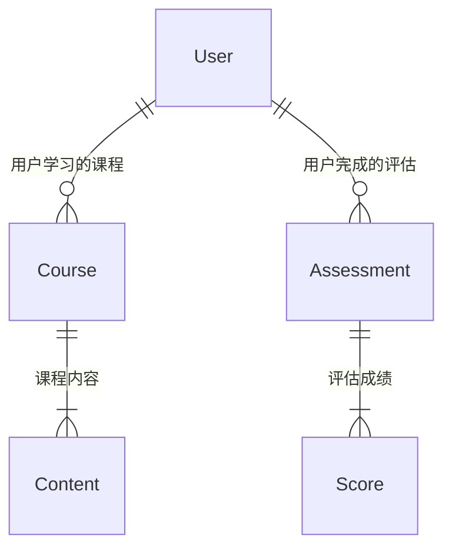

                 

### 1.1.1 问题背景

在当今数字化转型的浪潮中，企业培训系统作为提升员工技能和绩效的重要工具，正面临着前所未有的变革。传统的培训方式往往依赖于预设的课程内容和固定的学习路径，难以满足个性化、差异化的学习需求。随着数据量的爆炸式增长和人工智能技术的发展，构建智能企业培训系统已成为提升培训效果和企业竞争力的关键途径。

智能企业培训系统不仅仅是将人工智能技术简单应用于培训过程中，它还包括了自适应学习路径的引入和内容动态生成机制，从而实现个性化、实时性的培训服务。然而，这种系统的构建面临诸多挑战，如大规模数据的有效处理、复杂的算法设计、系统的稳定性与可扩展性等。

当前，企业在构建智能培训系统时普遍存在以下问题：

1. **学习路径固化**：传统系统往往依据固定的时间表和课程安排，缺乏灵活的自适应机制，难以根据学员的个性化需求调整学习路径。
2. **内容同质化**：培训内容过于单调，缺乏针对不同学员群体和知识水平的差异化设计，无法激发学习兴趣和提升学习效果。
3. **数据利用不充分**：企业积累了大量培训数据，但缺乏有效的分析和利用，无法基于数据提供更加精准的培训建议。
4. **系统稳定性与可扩展性**：智能培训系统需要处理大量的用户数据和实时响应，对系统的稳定性与可扩展性提出了较高的要求。

为了解决上述问题，企业迫切需要一种能够自适应调整学习路径、动态生成个性化内容的智能培训系统。这不仅能够提升员工的学习体验和满意度，还能有效提高培训效果和企业竞争力。

### 1.1.2 问题描述

在构建智能企业培训系统的过程中，我们面临的核心问题是如何实现自适应学习路径和内容动态生成，以应对个性化的学习需求和多样化的培训场景。具体而言，这个问题可以分解为以下几个子问题：

1. **如何设计自适应学习路径**：传统培训系统通常采用固定的学习路径，但这样的路径难以适应不同学员的学习习惯和能力水平。因此，我们需要一种方法来动态地生成和调整学习路径，使它能够根据学员的实时表现和学习进度进行自适应调整。
   
2. **如何生成个性化内容**：培训内容的设计应该考虑学员的个性化需求，包括他们的兴趣、知识水平、学习速度等。这意味着我们需要一种机制，能够根据学员的特点生成或推荐适合他们的培训内容，从而提高学习效果。

3. **如何处理大规模数据**：智能培训系统需要处理海量的用户数据，包括学习行为、评估结果、反馈信息等。这些数据不仅量大且复杂，需要高效的算法和技术来进行处理和分析，以便为自适应学习和内容生成提供支持。

4. **如何确保系统稳定性和可扩展性**：智能培训系统需要能够处理高并发的用户请求，同时保持系统的稳定性和高性能。这就要求我们在系统设计和实现过程中，考虑数据存储、处理和传输的优化策略，以提高系统的可扩展性和可靠性。

5. **如何实现实时反馈和持续改进**：系统的成功不仅仅依赖于初始的设计和实现，还需要不断地收集用户反馈，通过数据分析和模型优化，持续改进系统的性能和用户体验。

### 1.1.3 问题解决

为了解决上述问题，构建一个智能企业培训系统需要采取以下步骤和策略：

1. **收集和分析用户数据**：首先，系统需要收集用户的学习行为数据，如学习时间、学习进度、测试成绩、反馈意见等。通过这些数据，我们可以了解用户的学习偏好和知识盲点，为后续的自适应学习和内容生成提供依据。

2. **设计自适应学习路径算法**：基于用户数据的分析结果，我们可以设计一种自适应学习路径算法。该算法可以根据用户的实时表现和学习进度，动态调整学习路径，确保每个用户都能按适合自己的节奏进行学习。

3. **开发内容动态生成模型**：为了满足个性化培训需求，我们需要开发一种内容动态生成模型。该模型可以利用机器学习和自然语言处理技术，根据用户的特点和需求，自动生成或推荐适合他们的培训内容。

4. **优化系统架构和性能**：为了确保系统能够处理大规模数据和高并发请求，我们需要优化系统架构和性能。具体包括：
   - 设计高效的数据存储和索引机制，提高数据访问速度。
   - 采用分布式计算和缓存技术，提高系统的响应速度和处理能力。
   - 实现系统的负载均衡和故障转移机制，确保系统的稳定性和可靠性。

5. **建立实时反馈和持续改进机制**：在系统运行过程中，我们需要收集用户的实时反馈，通过数据分析和模型优化，不断改进系统的性能和用户体验。这可以通过引入反馈机制、定期进行用户调研等方式实现。

通过上述步骤和策略，我们可以构建一个智能企业培训系统，实现自适应学习路径和内容动态生成，从而提升培训效果和企业竞争力。### 1.1.4 边界与外延

在构建智能企业培训系统的过程中，需要明确系统的边界与外延，以确保解决方案的针对性和可行性。以下是几个关键方面的详细阐述：

**1. 系统功能边界**：

- **用户管理**：系统需要支持用户注册、登录、权限管理等功能。
- **学习管理**：包括课程管理、学习进度跟踪、考试成绩记录等。
- **内容管理**：系统需要提供内容创建、编辑、发布、推荐等功能。
- **数据分析**：系统需要收集并分析用户行为数据，以支持自适应学习路径和内容生成。

**2. 数据边界**：

- **数据采集**：系统应采集用户学习行为、评估结果、反馈意见等数据，确保数据的全面性和准确性。
- **数据处理**：系统需要处理来自不同渠道的数据，包括结构化数据和非结构化数据，如日志文件、文本数据等。
- **数据存储**：系统需要设计高效的数据存储方案，确保数据的持久化和安全性。

**3. 技术边界**：

- **算法选择**：系统需要选择合适的算法来实现自适应学习路径和内容动态生成，如机器学习算法、自然语言处理技术等。
- **技术实现**：系统应使用成熟的技术框架和库，如TensorFlow、PyTorch等，确保技术实现的可行性和可靠性。

**4. 系统外延**：

- **接口设计**：系统需要提供API接口，支持与其他系统集成，如企业内部管理系统、学习管理系统等。
- **扩展性设计**：系统设计应考虑未来功能扩展和性能提升的需要，确保系统的可扩展性和灵活性。
- **用户体验**：系统界面设计应注重用户体验，提供简洁、直观的操作界面和友好的交互设计。

**5. 安全性边界**：

- **数据安全**：系统需要实现数据加密、访问控制等安全措施，确保用户数据的安全性和隐私性。
- **系统安全**：系统需要部署防火墙、入侵检测等安全防护措施，防止外部攻击和数据泄露。

**6. 法律法规边界**：

- **合规性**：系统设计和实现需遵循相关法律法规，如数据保护法、隐私法等。
- **道德规范**：在数据处理和算法设计过程中，需要遵循公平、公正、透明的原则，确保对用户权益的尊重和保护。

通过明确系统的边界与外延，我们能够确保智能企业培训系统在实现自适应学习路径和内容动态生成的同时，满足功能、技术、用户体验、安全性和法律法规等多方面的需求，从而构建一个全面、可靠、高效的智能培训平台。### 1.1.5 概念结构与核心要素组成

在构建智能企业培训系统的过程中，我们需要明确几个核心概念，并了解它们之间的关系和作用。以下是关键概念的定义、属性特征对比，以及它们在系统中的核心要素组成。

**1. 核心概念定义**

- **自适应学习路径**：指根据用户的学习行为、知识水平和学习进度，动态调整学习内容和顺序，以实现个性化、差异化的学习体验。
- **内容动态生成**：指利用人工智能技术，根据用户的特点和需求，实时生成或推荐适合他们的学习内容。
- **用户数据采集与分析**：指通过技术手段收集用户在学习过程中的各种数据，并进行分析，以了解用户的学习行为和需求。
- **机器学习算法**：指基于数据驱动的方法，通过训练模型来发现数据中的模式和规律，用于实现自适应学习和内容生成。
- **自然语言处理（NLP）**：指使计算机能够理解、生成和处理人类语言的技术，用于生成个性化学习内容和交互。

**2. 概念属性特征对比表格**

| 概念             | 特征描述                                                     |
|------------------|------------------------------------------------------------|
| 自适应学习路径   | - 根据用户行为动态调整 | - 提高学习效果 | - 需要实时数据分析 |
| 内容动态生成     | - 实时生成个性化内容 | - 提升学习兴趣 | - 需要NLP技术支持 |
| 用户数据采集与分析 | - 收集用户行为数据 | - 理解用户需求 | - 数据处理与分析 |
| 机器学习算法     | - 数据驱动 | - 自适应调整 | - 提高预测准确性 |
| 自然语言处理（NLP） | - 理解人类语言 | - 自动化生成内容 | - 提高交互体验 |

**3. ER实体关系图架构**



在这个ER图架构中，用户与课程、评估之间存在多对多的关系，课程与内容之间存在一对一的关系，评估与成绩之间存在一对一的关系。这反映了智能企业培训系统中的核心实体及其相互关系。

**4. 核心要素组成**

- **用户模块**：包括用户注册、登录、个人信息管理等功能。
- **课程模块**：包括课程创建、管理、分类、搜索等功能。
- **评估模块**：包括评估创建、管理、评分、反馈等功能。
- **内容模块**：包括内容创建、编辑、发布、推荐等功能。
- **数据分析模块**：包括用户行为数据分析、学习路径调整、内容个性化推荐等功能。
- **算法模块**：包括机器学习算法、自然语言处理算法等，用于实现自适应学习和内容生成。

通过以上核心概念和要素的组成，我们可以构建一个智能企业培训系统，实现自适应学习路径和内容动态生成，从而满足个性化、差异化的学习需求。这些概念和要素相互关联、相互支持，共同构成了系统的核心框架。### 1.2 核心概念详解

在构建智能企业培训系统的过程中，理解以下几个核心概念是非常重要的。这些概念不仅定义了系统的基本框架，还决定了系统的性能和用户体验。以下是这些核心概念的详细解释：

#### 1.2.1 智能企业培训系统的定义

智能企业培训系统是一种集成了先进的人工智能技术，如机器学习、自然语言处理和数据分析的培训解决方案。它不仅仅是一个传统的学习管理系统（LMS），而是通过自动化和个性化的方式，使培训过程更加高效和有针对性。这种系统通过收集和分析用户的学习数据，动态调整学习路径和内容，以适应每个用户的学习习惯和知识水平。

**特征与功能**：

- **自适应学习路径**：系统能够根据用户的学习进度、测试结果和行为数据，自动调整学习路径，确保每个用户都能以最适合自己的方式学习。
- **内容动态生成**：系统可以根据用户的需求和学习历史，自动生成或推荐个性化的学习内容，提高学习兴趣和效果。
- **实时数据分析**：系统实时收集和分析用户的学习数据，为自适应学习和内容生成提供依据。
- **用户互动**：系统提供了多种互动工具，如讨论区、问答功能等，促进用户之间的交流和知识共享。

#### 1.2.2 自适应学习路径的概念

自适应学习路径是指根据用户的学习行为和特点，动态调整学习内容和顺序的一种学习方法。这种方法的核心在于根据用户在过程中的表现，实时地调整学习资源，以达到最佳的学习效果。

**工作机制**：

- **数据收集**：系统收集用户的学习行为数据，如学习时间、学习进度、测试成绩、互动行为等。
- **数据分析**：系统对收集到的数据进行分析，识别用户的学习习惯和知识薄弱点。
- **路径调整**：系统根据分析结果，动态调整学习路径，为用户提供个性化的学习内容和顺序。
- **持续优化**：系统不断收集用户的反馈和学习数据，持续优化自适应学习路径。

#### 1.2.3 内容动态生成的原理

内容动态生成是指利用人工智能技术，根据用户的特点和需求，自动生成或推荐个性化的学习内容。这种方法的核心在于通过算法和模型，实现内容的自适应调整和推荐。

**工作机制**：

- **内容创建**：系统可以自动生成学习内容，如文本、视频、练习题等。
- **内容推荐**：系统根据用户的学习历史、兴趣和需求，推荐最适合他们的学习内容。
- **内容调整**：系统实时监控用户的反馈和学习效果，调整推荐内容，提高推荐质量。
- **用户互动**：系统提供了与用户的互动功能，如问答、讨论等，以收集用户的反馈，进一步优化内容。

#### 1.2.4 用户数据采集与分析的概念

用户数据采集与分析是智能企业培训系统的核心功能之一。它涉及到如何收集、存储、处理和分析用户的学习数据，以支持自适应学习和内容动态生成。

**工作机制**：

- **数据收集**：系统通过多种方式收集用户的学习数据，包括行为数据、评估数据、反馈数据等。
- **数据存储**：系统设计高效的数据存储方案，确保数据的安全性和持久性。
- **数据处理**：系统对收集到的数据进行清洗、转换和存储，为后续分析做好准备。
- **数据分析**：系统利用数据分析技术，挖掘用户的学习行为模式和知识薄弱点，为自适应学习和内容生成提供依据。

#### 1.2.5 机器学习算法的概念

机器学习算法是智能企业培训系统的关键技术之一。它通过训练模型，从数据中自动发现模式和规律，用于实现自适应学习和内容生成。

**工作机制**：

- **模型训练**：系统使用大量历史数据训练机器学习模型，使其能够识别用户的学习行为和需求。
- **模型评估**：系统评估模型的性能，确保其能够准确预测和推荐用户感兴趣的学习内容。
- **模型优化**：系统根据模型的表现，不断优化和调整模型，提高其预测和推荐的准确性。

#### 1.2.6 自然语言处理（NLP）的概念

自然语言处理（NLP）是人工智能的一个重要分支，它使计算机能够理解、生成和处理人类语言。在智能企业培训系统中，NLP技术用于内容生成、用户交互和内容推荐等方面。

**工作机制**：

- **语言理解**：系统通过NLP技术，理解用户输入的自然语言文本，提取关键信息。
- **语言生成**：系统利用NLP技术，自动生成自然流畅的文本内容，如学习指南、练习题等。
- **语言交互**：系统通过与用户的自然语言交互，提供个性化的培训建议和反馈。

通过理解上述核心概念，我们能够更好地构建和优化智能企业培训系统，使其更好地满足用户的个性化学习需求，提高培训效果和企业竞争力。### 1.3.1 数据挖掘与用户分析

在构建智能企业培训系统的过程中，数据挖掘与用户分析是至关重要的一环。通过深入挖掘和分析用户数据，系统能够更好地理解用户的学习行为、需求和学习习惯，从而实现更精确的自适应学习和个性化内容推荐。

#### 1.3.1.1 数据挖掘的基本概念与步骤

数据挖掘是指从大量数据中提取出有价值的信息和知识的过程。数据挖掘通常包括以下几个步骤：

1. **数据收集**：从各种数据源（如学习系统、社交媒体、问卷调查等）收集用户数据，包括学习行为、评估结果、用户反馈等。

2. **数据预处理**：对收集到的数据进行清洗、转换和整合，去除噪声和不完整的数据，为后续分析做好准备。

3. **特征提取**：从预处理后的数据中提取出有用的特征，如学习时长、学习频率、评估成绩等，这些特征将用于训练机器学习模型。

4. **模式识别**：利用机器学习算法和统计方法，从特征数据中识别出潜在的模式和关联，这些模式将用于预测用户行为和需求。

5. **模型评估与优化**：评估模型的性能，通过交叉验证和超参数调整等方法，优化模型以获得更好的预测结果。

#### 1.3.1.2 用户分析的方法与工具

用户分析是数据挖掘的重要组成部分，它帮助系统更好地理解用户的行为和需求。以下是几种常用的用户分析方法与工具：

1. **行为分析**：
   - **学习行为追踪**：系统可以记录用户的学习行为，如学习时长、学习频率、参与度等。
   - **互动分析**：系统可以分析用户在学习过程中的互动行为，如讨论区发言、问答互动等。

2. **需求分析**：
   - **问卷调查**：通过设计问卷，收集用户对课程内容、学习路径、培训工具等的需求和反馈。
   - **反馈机制**：系统提供反馈渠道，如评分、评论等，收集用户对培训内容的满意度和建议。

3. **个性化推荐**：
   - **协同过滤**：通过分析用户的行为数据和偏好，为用户提供相似用户喜欢的课程推荐。
   - **基于内容的推荐**：根据课程的内容特征，为用户推荐与之相关的学习资源。

4. **机器学习算法**：
   - **分类算法**：用于识别用户的学习行为和需求，如决策树、支持向量机（SVM）等。
   - **聚类算法**：用于将用户分成不同的群体，如K-均值聚类、层次聚类等。
   - **关联规则挖掘**：用于发现数据之间的关联，如Apriori算法、FP-growth算法等。

#### 1.3.1.3 数据挖掘在智能培训系统中的应用

数据挖掘在智能企业培训系统中有着广泛的应用，主要体现在以下几个方面：

1. **自适应学习路径**：
   - 数据挖掘可以分析用户的学习行为和进度，为每个用户定制个性化的学习路径，提高学习效果。
   - 通过行为分析，系统可以识别用户的弱项，针对性地提供强化训练和辅导。

2. **内容动态生成**：
   - 数据挖掘可以帮助系统了解用户的学习兴趣和需求，动态生成或推荐个性化的学习内容。
   - 通过分析用户互动数据和反馈，系统可以优化学习内容的结构，提高用户满意度。

3. **用户满意度评估**：
   - 数据挖掘可以分析用户对培训内容和服务的满意度，发现潜在的问题和改进点。
   - 通过反馈机制，系统可以持续优化用户体验，提高培训质量和用户忠诚度。

4. **培训效果评估**：
   - 数据挖掘可以分析培训的短期和长期效果，如用户的绩效提升、知识掌握情况等。
   - 通过评估数据，系统可以为企业提供培训效果的数据支持，指导培训策略的调整。

总之，数据挖掘与用户分析是构建智能企业培训系统的关键环节。通过深入挖掘和分析用户数据，系统可以更好地理解用户需求，实现个性化、差异化的培训服务，从而提升培训效果和企业竞争力。### 1.3.2 机器学习与深度学习基础

在智能企业培训系统中，机器学习和深度学习是不可或缺的技术。它们通过构建复杂的模型，从数据中提取模式和知识，帮助系统实现自适应学习路径和内容动态生成。

#### 1.3.2.1 机器学习的基本概念与原理

机器学习（Machine Learning, ML）是一种让计算机通过数据学习并改进性能的方法。它的核心思想是通过算法从数据中学习规律，并利用这些规律对未知数据进行预测或分类。

**基本原理**：

- **数据驱动**：机器学习依赖于大量数据，通过训练模型来学习数据中的模式和关系。
- **模型优化**：机器学习算法通过不断调整模型参数，使模型在训练数据上达到最优性能。
- **泛化能力**：训练好的模型应在未知数据上表现良好，具备泛化能力。

**主要算法**：

1. **监督学习**：
   - **回归分析**：用于预测连续值输出，如预测学习成绩。
   - **分类算法**：用于将数据分为不同类别，如根据用户行为分类为“高潜力用户”或“低潜力用户”。

2. **无监督学习**：
   - **聚类算法**：如K-均值聚类、层次聚类等，用于发现数据中的隐含结构。
   - **降维算法**：如主成分分析（PCA）、t-SNE等，用于简化数据维度，便于分析。

3. **强化学习**：
   - **模型通过试错学习最优策略**，如推荐系统中的内容推荐。

#### 1.3.2.2 深度学习的基本概念与原理

深度学习（Deep Learning, DL）是机器学习的一个分支，它通过构建多层神经网络模型来模拟人脑的神经元结构，从而实现更复杂的数据分析和模式识别。

**基本原理**：

- **多层神经网络**：深度学习模型由多个层级组成，每个层级将输入数据进行特征提取和组合。
- **反向传播算法**：通过反向传播算法，模型可以根据输出误差调整内部参数，优化模型性能。
- **激活函数**：用于引入非线性特性，使模型能够处理复杂的非线性关系。

**主要模型**：

1. **卷积神经网络（CNN）**：
   - 适用于图像识别和处理，如人脸识别、图像分类等。

2. **循环神经网络（RNN）**：
   - 适用于序列数据，如自然语言处理、时间序列预测等。

3. **生成对抗网络（GAN）**：
   - 用于生成新的数据，如生成虚假图片、音乐等。

#### 1.3.2.3 机器学习与深度学习在智能培训系统中的应用

在智能企业培训系统中，机器学习和深度学习有广泛的应用，主要体现在以下几个方面：

1. **自适应学习路径**：
   - **监督学习算法**可以分析用户的学习数据，预测用户的学习行为和需求，为每个用户生成个性化的学习路径。
   - **聚类算法**可以识别具有相似学习行为的用户群体，从而为不同群体提供定制化的学习内容。

2. **内容动态生成**：
   - **生成对抗网络（GAN）**可以生成新的学习内容，如模拟练习题、教程等，提高学习资源的多样性。
   - **循环神经网络（RNN）**可以生成自然语言文本，如自动编写学习指南、问答系统等。

3. **用户互动与推荐**：
   - **协同过滤算法**可以基于用户的行为数据和偏好，为用户提供个性化的学习内容推荐。
   - **强化学习算法**可以优化推荐策略，通过不断试错和反馈，提高推荐系统的准确性和用户满意度。

4. **数据分析与优化**：
   - **深度学习模型**可以分析用户学习数据，发现潜在的学习模式和趋势，为培训策略的调整提供数据支持。
   - **降维算法**可以简化数据维度，提高数据处理和分析的效率。

通过机器学习和深度学习技术，智能企业培训系统能够更好地理解用户需求，提供个性化的培训服务，从而提高培训效果和企业竞争力。### 1.3.3 自然语言处理技术

自然语言处理（Natural Language Processing，NLP）是人工智能的一个重要分支，它专注于让计算机理解和生成人类语言。在智能企业培训系统中，NLP技术广泛应用于内容生成、用户互动和个性化推荐等方面。

#### 1.3.3.1 NLP的基本概念和关键技术

**基本概念**：

- **语言模型**：用于预测文本中下一个单词的概率分布，是NLP的基础。
- **分词**：将文本拆分成单词或其他有意义的标记，如词组、短语等。
- **词性标注**：为文本中的每个词分配一个词性标签，如名词、动词、形容词等。
- **命名实体识别**：识别文本中的特定实体，如人名、地点、组织名等。
- **句法分析**：分析句子的结构，理解句子中的语法关系。

**关键技术**：

1. **统计模型**：
   - **隐马尔可夫模型（HMM）**：用于语音识别和序列数据建模。
   - **条件随机场（CRF）**：用于文本分类和序列标注。

2. **深度学习模型**：
   - **卷积神经网络（CNN）**：用于文本分类和情感分析。
   - **递归神经网络（RNN）**：用于处理序列数据，如语言模型和机器翻译。
   - **长短时记忆网络（LSTM）**：用于解决RNN的梯度消失问题。
   - **生成对抗网络（GAN）**：用于生成文本数据。

3. **预训练语言模型**：
   - **BERT**：基于Transformer的预训练语言模型，广泛应用于各种NLP任务。
   - **GPT**：生成预训练语言模型，擅长生成文本和回答问题。

#### 1.3.3.2 NLP在智能培训系统中的应用

1. **内容生成**：
   - **自动化写作**：利用NLP技术，系统可以自动生成学习指南、练习题、反馈等文本内容。
   - **文本摘要**：从大量文本中提取关键信息，生成简短的摘要，帮助用户快速获取重点。
   - **问答系统**：利用NLP技术，系统可以自动回答用户提出的问题，提供个性化的学习建议。

2. **用户互动**：
   - **语音助手**：结合语音识别和语音生成技术，系统可以与用户进行语音交互，提供实时帮助。
   - **聊天机器人**：利用对话管理技术，系统可以模拟人类对话，为用户提供学习支持和交流平台。

3. **个性化推荐**：
   - **基于内容的推荐**：分析用户的学习记录和偏好，推荐相关的学习资源。
   - **协同过滤推荐**：结合其他用户的行为数据，为用户提供个性化的学习内容推荐。

4. **数据分析**：
   - **情感分析**：分析用户反馈和评价的情感倾向，了解用户对培训内容的满意度。
   - **主题建模**：从用户生成的大量文本数据中提取主题，帮助系统更好地理解用户需求。

5. **翻译与本地化**：
   - **机器翻译**：将培训内容自动翻译成多种语言，为不同语言背景的用户提供服务。
   - **本地化**：根据不同地区的文化和语言习惯，优化培训内容和用户体验。

通过NLP技术的应用，智能企业培训系统能够提供更加个性化和智能化的学习服务，提升用户体验和培训效果。NLP不仅帮助系统理解和生成人类语言，还促进了不同系统和用户之间的自然互动，从而实现更高效的培训和管理。### 1.4.1 数据挖掘与用户分析的关系

数据挖掘与用户分析在构建智能企业培训系统中扮演着关键角色，二者之间存在着紧密的联系和互动。数据挖掘通过分析和处理大量用户数据，帮助系统理解和预测用户行为和需求；而用户分析则利用这些挖掘结果，为用户提供个性化的培训建议和优化学习体验。以下是二者关系的详细解析：

#### 1.4.1.1 数据挖掘在用户分析中的应用

1. **行为模式识别**：
   - 数据挖掘技术可以分析用户在学习系统中的行为数据，如学习时间、学习频率、参与度等，识别出用户的行为模式。这些模式可以帮助系统预测用户未来的学习行为，从而为用户提供更精确的自适应学习路径。

2. **知识薄弱点定位**：
   - 数据挖掘算法能够发现用户在学习和评估过程中表现不佳的知识点，帮助系统识别用户的弱项。这些信息可以用于生成针对性的强化训练内容，提升用户的学习效果。

3. **兴趣偏好分析**：
   - 数据挖掘技术可以帮助系统分析用户的兴趣偏好，了解用户对不同类型学习资源的偏好。这些数据可以用于内容推荐系统的设计，为用户提供个性化的学习内容。

4. **趋势预测**：
   - 通过对历史数据的分析，数据挖掘技术可以预测用户未来的学习趋势和行为变化。这些预测结果可以为系统的长期规划和优化提供依据。

#### 1.4.1.2 用户分析对数据挖掘的反馈

1. **数据质量优化**：
   - 用户分析结果可以反馈给数据挖掘过程，帮助系统优化数据收集和处理的质量。例如，通过分析用户反馈，系统可以调整数据收集方式，确保收集到的数据更加准确和全面。

2. **模型性能评估**：
   - 用户分析结果可以用于评估数据挖掘模型的性能。通过对比模型预测结果和实际用户行为，系统可以识别模型的不足，并进行相应的调整和优化。

3. **需求驱动改进**：
   - 用户分析提供了对用户需求的理解和洞察，这些信息可以驱动数据挖掘算法和系统的持续改进。例如，根据用户反馈，系统可以调整推荐算法，优化学习路径生成策略。

4. **实时反馈调整**：
   - 用户分析结果可以用于实时调整数据挖掘模型和系统的参数设置，确保系统能够快速响应用户需求的变化。这种动态调整机制可以提高系统的灵活性和适应性。

#### 1.4.1.3 数据挖掘与用户分析的双向互动机制

1. **数据闭环**：
   - 数据挖掘和用户分析形成了一个闭环机制。数据挖掘提供的信息用于指导用户分析，而用户分析的结果又反馈给数据挖掘，形成一个持续优化的循环。

2. **动态调整**：
   - 系统可以根据用户分析结果动态调整数据挖掘算法和模型，确保挖掘过程能够实时响应用户需求的变化。

3. **持续优化**：
   - 通过持续的数据挖掘和用户分析，系统可以不断优化用户体验和培训效果。这种持续的优化机制有助于提高系统的竞争力。

4. **协同工作**：
   - 数据挖掘和用户分析协同工作，共同为用户提供个性化的培训服务。数据挖掘负责提供基础数据和分析结果，而用户分析则负责将这些结果转化为具体的用户体验优化措施。

总之，数据挖掘与用户分析在构建智能企业培训系统中相辅相成，共同推动系统的个性化、智能化发展。通过建立双向互动机制，系统能够更好地理解用户需求，提供精准的培训服务，从而提升用户满意度和培训效果。### 1.4.2 机器学习与深度学习的关系

在构建智能企业培训系统的过程中，机器学习和深度学习是两大核心技术，它们在不同层面上相互补充，共同推动系统的智能化发展。以下是机器学习与深度学习之间的关系及其在系统中的应用：

#### 1.4.2.1 关系概述

1. **深度学习是机器学习的一个分支**：
   - 机器学习（Machine Learning, ML）是一种让计算机通过数据学习的方法，包括监督学习、无监督学习和强化学习等。深度学习（Deep Learning, DL）是机器学习中的一个重要分支，它使用多层神经网络来模拟人脑的学习机制。

2. **深度学习增强了机器学习的能力**：
   - 传统机器学习方法在处理高维、非线性数据和复杂任务时往往效果不佳。深度学习通过引入多层神经网络和复杂的非线性变换，提高了机器学习模型的表达能力和处理能力。

3. **机器学习提供了深度学习的基础**：
   - 深度学习的训练过程依赖于大规模数据和高效的计算资源，这些资源的获取和管理需要机器学习中的算法和技巧。机器学习在数据预处理、特征提取和模型评估等方面提供了重要支持。

#### 1.4.2.2 在系统中的应用

1. **自适应学习路径**：

   - **机器学习**：监督学习和无监督学习算法可以分析用户的学习数据，识别用户的兴趣和行为模式。通过这些算法，系统可以预测用户的学习进度和需求，为用户生成个性化的学习路径。
   
   - **深度学习**：深度学习模型，如卷积神经网络（CNN）和循环神经网络（RNN），可以处理更复杂的学习数据，如视频和音频数据，识别出更深层次的用户行为特征。这些特征可以用于进一步优化学习路径。

2. **内容动态生成**：

   - **机器学习**：协同过滤和基于内容的推荐算法可以分析用户的历史行为和偏好，为用户推荐相关的学习内容。这些算法在处理大规模用户数据时表现出色。
   
   - **深度学习**：生成对抗网络（GAN）可以生成新的学习内容，如练习题和教程，丰富培训资源的多样性。深度学习模型在文本生成、图像生成和音频生成等方面具有显著优势。

3. **用户互动与反馈**：

   - **机器学习**：分类和回归算法可以分析用户的反馈数据，识别用户的情感和需求。这些算法可以用于自动回答用户的问题，提供个性化的学习建议。
   
   - **深度学习**：深度学习模型可以处理更复杂的用户交互数据，如语音和视频数据。通过这些模型，系统可以实现更自然的用户交互，如语音助手和聊天机器人。

4. **数据分析与优化**：

   - **机器学习**：数据挖掘算法可以分析大量的学习数据，发现潜在的关联和趋势。这些信息可以用于优化培训策略和提升系统性能。
   
   - **深度学习**：深度学习模型可以处理高维数据和非线性关系，提供更精确的数据分析和预测。通过这些模型，系统可以实现更高效的性能优化和决策支持。

总之，机器学习和深度学习在构建智能企业培训系统中发挥着各自的优势，相互补充，共同推动系统的智能化发展。通过结合这两种技术，系统可以更好地理解用户需求，提供个性化、高效的培训服务。### 1.4.3 自然语言处理（NLP）在系统中的应用

在智能企业培训系统中，自然语言处理（NLP）技术以其强大的语言理解和生成能力，为系统的各个模块提供了重要的支持。以下是NLP技术在系统中的应用场景和具体实现方法。

#### 1.4.3.1 内容生成

**自动写作**：
NLP技术可以通过语言模型和文本生成算法自动生成各种文本内容，如学习指南、练习题和反馈。例如，利用预训练的语言模型（如GPT-3），系统可以生成连贯且符合语境的文本，从而丰富培训资源。

**文本摘要**：
NLP技术可以自动提取长文本的关键信息，生成简明的摘要。这种功能有助于用户快速了解重要内容，提高学习效率。例如，系统可以将长篇的培训文档摘要成几个关键段落，方便用户快速浏览。

**问答系统**：
通过构建问答系统，NLP技术可以自动回答用户提出的问题。系统可以使用对话管理技术和自然语言理解算法，理解用户的查询意图，并提供准确、详细的回答。例如，用户可以通过自然语言询问某个知识点，系统将利用NLP技术查找并呈现相关的学习资料。

#### 1.4.3.2 用户互动

**语音助手**：
结合语音识别和语音合成技术，NLP可以为用户提供语音交互体验。用户可以通过语音与系统进行自然对话，获取学习建议、课程信息和解答疑问。例如，用户可以语音询问系统“如何提高我的编程能力”，系统将基于NLP生成相应的建议。

**聊天机器人**：
NLP技术可以构建智能聊天机器人，与用户进行实时对话。聊天机器人可以使用对话管理技术，理解用户的意图，并生成合适的回应。例如，用户可以在聊天机器人中询问学习进度，机器人将基于NLP生成详细的进度报告。

#### 1.4.3.3 个性化推荐

**基于内容的推荐**：
NLP技术可以分析用户生成的内容和反馈，提取关键词和主题，从而为用户推荐相关的学习资源。例如，用户在回答问卷时提到了某个技术领域，系统将利用NLP提取相关关键词，并推荐相关的学习材料。

**协同过滤推荐**：
结合协同过滤算法和NLP技术，系统可以更准确地推荐用户可能感兴趣的学习内容。协同过滤通过分析用户的行为数据和偏好，而NLP则通过分析用户生成的文本，提供更深入的个性化推荐。

#### 1.4.3.4 数据分析与优化

**情感分析**：
NLP技术可以分析用户的反馈和评论，识别情感倾向和关键词。这种功能有助于系统了解用户的满意度和需求，从而优化培训内容和服务。例如，系统可以分析用户评论中的正面和负面情感，调整课程设计以提高用户满意度。

**主题建模**：
NLP技术可以提取文本数据中的主题，帮助系统了解用户的学习兴趣和关注点。通过主题建模，系统可以生成用户兴趣图谱，从而为个性化推荐提供依据。

总之，NLP技术在智能企业培训系统的各个模块中发挥着关键作用，通过语言理解和生成能力，为系统提供了丰富的内容生成、用户互动和个性化推荐功能，从而提升了培训效果和用户体验。### 1.4.4 系统架构设计

智能企业培训系统的架构设计是确保系统稳定、高效、可扩展的关键。以下是系统的架构设计，包括功能模块、架构设计原则、系统性能优化策略，以及系统接口设计和系统交互流程。

#### 1.4.4.1 功能模块

智能企业培训系统的功能模块可以分为以下几个部分：

1. **用户管理模块**：
   - 处理用户注册、登录、权限管理等功能。
   - 提供用户个人信息管理、学习历史和成绩记录。

2. **课程管理模块**：
   - 提供课程创建、编辑、发布和分类功能。
   - 管理课程内容，包括文本、视频、音频和练习题。

3. **学习管理模块**：
   - 跟踪用户的学习进度，记录学习时长、学习行为和评估结果。
   - 提供自适应学习路径生成和动态内容推荐。

4. **内容管理模块**：
   - 处理内容的创建、编辑、发布和推荐。
   - 支持多媒体内容的存储和访问。

5. **数据分析模块**：
   - 收集并分析用户行为数据，用于优化学习路径和内容推荐。
   - 提供数据报表和可视化工具，支持数据驱动决策。

6. **用户互动模块**：
   - 提供讨论区、问答功能和聊天机器人，促进用户间的互动和学习。

#### 1.4.4.2 架构设计原则

智能企业培训系统的架构设计遵循以下原则：

1. **模块化**：
   - 系统功能模块应独立且可扩展，便于维护和升级。

2. **分布式**：
   - 通过分布式架构设计，提高系统的可扩展性和容错性。

3. **安全性**：
   - 确保数据安全，采用加密和访问控制等措施。

4. **高可用性**：
   - 通过冗余设计和故障转移机制，确保系统的高可用性。

5. **性能优化**：
   - 采用缓存、负载均衡和数据库优化等技术，提高系统性能。

#### 1.4.4.3 系统性能优化策略

1. **缓存策略**：
   - 使用缓存技术，减少数据库访问频率，提高响应速度。

2. **负载均衡**：
   - 通过负载均衡器，将请求分配到多个服务器，避免单点瓶颈。

3. **数据库优化**：
   - 采用合适的数据库索引策略，优化查询效率。
   - 使用数据库分片技术，提高数据存储和处理能力。

4. **异步处理**：
   - 采用异步处理机制，减少同步操作，提高系统并发能力。

5. **微服务架构**：
   - 将系统分解为多个微服务，独立部署和扩展，提高系统的灵活性和可维护性。

#### 1.4.4.4 系统接口设计

系统接口设计包括以下方面：

1. **RESTful API**：
   - 提供RESTful API接口，便于与其他系统集成和数据交换。

2. **GraphQL**：
   - 使用GraphQL接口，提供更灵活和高效的数据查询和操作方式。

3. **WebSocket**：
   - 使用WebSocket实现实时数据传输，支持实时更新和互动。

#### 1.4.4.5 系统交互流程

系统的交互流程可以分为以下几个阶段：

1. **用户登录**：
   - 用户通过用户管理模块登录系统，获取权限。

2. **课程选择**：
   - 用户在课程管理模块选择感兴趣的课程。

3. **学习与评估**：
   - 用户进行学习，系统记录学习行为和评估结果。
   - 数据分析模块分析用户数据，生成自适应学习路径和内容推荐。

4. **内容获取**：
   - 用户根据推荐内容，访问内容管理模块获取学习材料。

5. **用户互动**：
   - 用户通过用户互动模块参与讨论、问答等活动。

6. **数据反馈**：
   - 用户反馈学习体验和评估结果，系统进行数据分析和优化。

通过以上架构设计和优化策略，智能企业培训系统能够提供稳定、高效、个性化的培训服务，满足不同用户的需求。### 1.4.5 系统分析与架构设计方案

在智能企业培训系统的构建过程中，系统分析与架构设计方案至关重要。以下将详细介绍系统的场景介绍、项目介绍、系统功能设计、系统架构设计、系统接口设计和系统交互流程。

#### 1.4.5.1 场景介绍

智能企业培训系统的应用场景主要包括以下几方面：

1. **企业内部培训**：企业可以利用系统为员工提供多样化的在线培训课程，提升员工的技能和绩效。
2. **员工能力评估**：系统通过收集和分析员工的学习数据，进行能力评估，为培训和管理提供数据支持。
3. **个性化学习**：系统根据员工的学习行为和兴趣，推荐个性化的学习内容和路径，提高学习效率。
4. **知识共享**：系统提供讨论区和问答功能，促进员工之间的知识共享和交流。

#### 1.4.5.2 项目介绍

项目名称：智能企业培训系统（Intelligent Enterprise Training System，IETS）

目标：构建一个智能化、个性化、高效的企业培训平台，提升员工的学习体验和培训效果。

技术栈：前端采用React，后端采用Spring Boot，数据库使用MySQL，人工智能算法采用TensorFlow和PyTorch。

#### 1.4.5.3 系统功能设计

智能企业培训系统包含以下几个主要功能模块：

1. **用户管理**：
   - 用户注册与登录
   - 用户个人信息管理
   - 用户权限管理

2. **课程管理**：
   - 课程创建与编辑
   - 课程分类与搜索
   - 课程发布与推荐

3. **学习管理**：
   - 学习进度跟踪
   - 学习数据记录与分析
   - 自适应学习路径生成

4. **内容管理**：
   - 内容创建与编辑
   - 内容发布与推荐
   - 内容权限与权限管理

5. **数据分析**：
   - 用户行为数据分析
   - 培训效果评估
   - 数据报表与可视化

6. **用户互动**：
   - 讨论区功能
   - 问答功能
   - 私信功能

#### 1.4.5.4 系统架构设计

智能企业培训系统采用分层架构设计，主要包括以下几个层次：

1. **表示层**：
   - 前端使用React框架，实现用户界面的展示。

2. **业务逻辑层**：
   - 后端采用Spring Boot框架，处理业务逻辑和数据处理。

3. **数据访问层**：
   - 数据库使用MySQL存储用户数据、课程数据和学习数据。

4. **数据服务层**：
   - 提供RESTful API，支持与其他系统的集成。

5. **人工智能服务层**：
   - 利用TensorFlow和PyTorch实现机器学习和深度学习算法。

6. **缓存层**：
   - 使用Redis缓存热点数据，提高系统响应速度。

#### 1.4.5.5 系统接口设计

系统接口设计主要包括以下几种：

1. **用户接口**：
   - 用户登录与注册接口
   - 用户信息查询与更新接口

2. **课程接口**：
   - 课程查询与推荐接口
   - 课程创建与编辑接口

3. **学习接口**：
   - 学习进度查询与更新接口
   - 自适应学习路径生成接口

4. **内容接口**：
   - 内容查询与推荐接口
   - 内容创建与编辑接口

5. **数据分析接口**：
   - 用户行为数据分析接口
   - 培训效果评估接口

6. **用户互动接口**：
   - 讨论区与问答接口
   - 私信接口

#### 1.4.5.6 系统交互流程

系统交互流程如下：

1. **用户登录**：
   - 用户输入账号和密码，系统验证用户身份。

2. **课程选择**：
   - 用户在课程管理模块选择感兴趣的课程。

3. **学习**：
   - 用户开始学习，系统记录学习行为和进度。

4. **数据分析**：
   - 系统收集用户学习数据，进行分析，为个性化推荐提供支持。

5. **内容推荐**：
   - 系统根据用户学习行为和兴趣，推荐相关的课程和内容。

6. **用户互动**：
   - 用户参与讨论区、问答和私信功能，促进知识共享。

7. **数据反馈**：
   - 用户反馈学习体验和课程建议，系统进行数据优化。

通过以上系统分析与架构设计方案，智能企业培训系统能够提供稳定、高效、个性化的培训服务，满足不同用户的需求。### 1.4.6 系统架构设计

智能企业培训系统的架构设计是一个复杂而关键的过程，它决定了系统的性能、可扩展性和稳定性。以下是系统架构的详细设计和优化策略：

#### 1.4.6.1 架构概述

智能企业培训系统采用分层架构，主要包括以下层次：

1. **表示层**：前端用户界面，负责展示信息和与用户进行交互。
2. **业务逻辑层**：后端服务，处理业务逻辑、数据处理和业务流程。
3. **数据访问层**：与数据库进行交互，存储和检索数据。
4. **人工智能层**：处理用户数据分析、自适应学习路径和内容生成。
5. **缓存层**：提高数据访问速度和系统性能。
6. **消息队列**：实现异步消息传递和任务调度。

#### 1.4.6.2 架构设计

1. **前端架构**：
   - 使用React框架，实现用户界面的动态更新和交互。
   - 采用组件化设计，提高代码的可维护性和复用性。
   - 利用Redux进行状态管理，确保数据的一致性和可预测性。

2. **后端架构**：
   - 采用Spring Boot框架，实现业务逻辑和数据处理。
   - 通过RESTful API与前端进行通信，确保接口的一致性和简洁性。
   - 使用Spring Security进行安全控制，保障数据安全和用户隐私。

3. **数据库架构**：
   - 使用MySQL作为关系数据库，存储用户信息、课程数据和学习记录。
   - 采用分库分表策略，提高数据存储和查询的效率。
   - 使用数据库连接池，减少数据库连接的开销。

4. **人工智能层**：
   - 采用TensorFlow和PyTorch框架，实现机器学习和深度学习算法。
   - 利用模型压缩和量化技术，降低计算资源需求。
   - 使用GPU加速计算，提高模型训练和推理的效率。

5. **缓存层**：
   - 使用Redis缓存热点数据，如用户会话、推荐内容等。
   - 采用缓存一致性策略，减少数据库访问频率。

6. **消息队列**：
   - 使用RabbitMQ或Kafka作为消息队列，实现异步任务处理和负载均衡。
   - 通过消息队列实现用户行为数据的批量处理和分析。

#### 1.4.6.3 优化策略

1. **负载均衡**：
   - 使用Nginx或HAProxy实现负载均衡，确保系统在高并发情况下的稳定运行。
   - 部署多台服务器，通过负载均衡器分发请求，避免单点瓶颈。

2. **缓存策略**：
   - 采用分层缓存策略，包括内存缓存、分布式缓存和数据库缓存，提高数据访问速度。
   - 使用Redis缓存常用数据，减少数据库访问压力。

3. **数据库优化**：
   - 采用索引优化、查询优化和存储优化等技术，提高数据库性能。
   - 使用读写分离和分库分表，提高数据存储和查询的效率。

4. **异步处理**：
   - 采用异步处理机制，将耗时的任务（如数据处理、模型训练）转移到后台，提高系统响应速度。
   - 使用消息队列实现任务的异步传递和批量处理。

5. **微服务架构**：
   - 采用微服务架构，将系统拆分为多个独立的服务，每个服务负责特定的业务功能。
   - 微服务之间通过API进行通信，实现模块化和高可扩展性。

6. **监控与运维**：
   - 采用Prometheus和Grafana进行实时监控，确保系统运行状况的可视化和告警。
   - 使用Docker和Kubernetes进行容器化和集群管理，提高系统的可维护性和可扩展性。

通过以上架构设计和优化策略，智能企业培训系统能够实现高性能、高可用、可扩展和安全的架构，满足不同用户的需求，提升培训效果和企业竞争力。### 1.4.7 系统接口设计和系统交互流程

在智能企业培训系统中，系统接口设计和系统交互流程至关重要。以下将详细介绍系统的接口设计和用户与系统的交互流程。

#### 1.4.7.1 系统接口设计

1. **用户接口**：
   - 用户登录与注册接口：用户通过用户名和密码进行登录，或使用第三方账号（如微信、QQ）快速登录。
   - 用户个人信息管理接口：用户可以查看和修改个人信息，如昵称、头像、联系方式等。
   - 用户权限管理接口：管理员可以对用户权限进行配置和管理，确保系统安全。

2. **课程接口**：
   - 课程查询与推荐接口：用户可以查询所有课程，并接收系统根据兴趣和学习历史推荐的相关课程。
   - 课程创建与编辑接口：管理员可以创建、编辑和发布课程，设置课程分类、标签和难度等级。
   - 课程内容管理接口：管理员可以上传、编辑和删除课程内容，如文本、视频、音频和练习题。

3. **学习接口**：
   - 学习进度查询与更新接口：用户可以查看自己的学习进度，包括已学课程、未学课程和已完成的练习题。
   - 自适应学习路径生成接口：系统根据用户的学习行为和成绩，生成个性化的学习路径，推荐下一步的学习内容。
   - 学习数据记录与分析接口：系统记录用户的学习数据，如学习时长、学习频率和测试成绩，用于分析用户的学习效果。

4. **内容接口**：
   - 内容查询与推荐接口：用户可以查看和搜索系统推荐的内容，包括课程、练习题和讨论区帖子。
   - 内容创建与编辑接口：用户可以创建和编辑自己的学习笔记、心得体会和讨论区帖子。
   - 内容发布与推荐接口：管理员可以发布重要通知和活动，系统可以根据用户行为和兴趣进行推荐。

5. **数据分析接口**：
   - 用户行为数据分析接口：系统分析用户的学习行为和互动数据，为个性化推荐和课程设计提供支持。
   - 培训效果评估接口：系统评估培训效果，生成数据报表和可视化图表，为企业管理提供数据支持。

6. **用户互动接口**：
   - 讨论区接口：用户可以参与讨论区话题，发表观点、提问和回答问题。
   - 问答接口：用户可以提问，系统根据知识库和用户行为推荐答案。
   - 私信接口：用户可以发送和接收私信，进行一对一的交流。

#### 1.4.7.2 系统交互流程

1. **用户登录**：
   - 用户通过用户接口登录系统，系统验证用户身份，返回登录状态。

2. **课程选择**：
   - 用户通过课程接口查询所有课程，根据推荐和兴趣选择课程。

3. **学习**：
   - 用户进入课程学习页面，系统记录学习行为，如学习时长、学习进度和测试成绩。
   - 系统根据用户的学习行为，动态调整学习路径，推荐下一步的学习内容。

4. **内容获取**：
   - 用户根据推荐或搜索，通过内容接口获取学习内容，如课程、练习题和讨论区帖子。

5. **用户互动**：
   - 用户参与讨论区话题，发表观点、提问和回答问题。
   - 用户通过问答接口获取答案，系统根据知识库和用户行为推荐相关答案。

6. **数据分析**：
   - 系统通过数据分析接口，分析用户的学习行为和互动数据，为个性化推荐和课程设计提供支持。

7. **数据反馈**：
   - 用户通过反馈接口，对学习体验和培训内容提出建议，系统进行数据优化。

通过以上接口设计和交互流程，智能企业培训系统能够提供稳定、高效、个性化的培训服务，满足不同用户的需求。### 1.4.8 实践一：自适应学习路径的实现

在实际构建智能企业培训系统的过程中，自适应学习路径的实现是一个关键环节。以下将详细介绍实现自适应学习路径所需的环境搭建、系统核心实现、应用解读与分析，以及实际案例剖析。

#### 1.4.8.1 环境搭建

为了实现自适应学习路径，首先需要在开发环境中搭建必要的软件和工具。以下是一个基本的环境搭建步骤：

1. **安装Python环境**：
   - 确保Python 3.8或更高版本已安装。
   - 安装pip，Python的包管理器。

2. **安装依赖包**：
   - 使用pip安装以下依赖包：
     ```shell
     pip install numpy pandas sklearn tensorflow
     ```

3. **配置虚拟环境**：
   - 创建一个虚拟环境，以便隔离项目依赖：
     ```shell
     python -m venv venv
     source venv/bin/activate  # 对于Windows用户，使用 `venv\Scripts\activate`
     ```

4. **安装数据库**：
   - 安装MySQL数据库，并创建用于存储用户和学习数据的数据库。

5. **设置开发工具**：
   - 安装IDE（如PyCharm、VSCode）和数据库管理工具（如MySQL Workbench）。

#### 1.4.8.2 系统核心实现

实现自适应学习路径的关键在于算法的设计和实现。以下是核心算法的实现步骤：

1. **数据收集**：
   - 从数据库中收集用户的学习数据，如学习时长、学习进度、评估结果等。

2. **数据处理**：
   - 使用Pandas库清洗和预处理数据，确保数据的质量和一致性。

3. **算法设计**：
   - 使用机器学习算法，如决策树、随机森林或K-均值聚类，分析用户的学习行为，生成推荐模型。

4. **模型训练**：
   - 使用Scikit-learn库训练机器学习模型，根据用户数据调整模型参数。

5. **学习路径生成**：
   - 根据模型预测，动态生成用户的学习路径，推荐下一步的学习内容。

以下是Python代码示例，展示了自适应学习路径算法的核心实现：

```python
import pandas as pd
from sklearn.ensemble import RandomForestClassifier
from sklearn.model_selection import train_test_split

# 数据收集与处理
data = pd.read_csv('user_data.csv')
X = data.drop('next_course', axis=1)
y = data['next_course']

# 模型训练
X_train, X_test, y_train, y_test = train_test_split(X, y, test_size=0.2, random_state=42)
model = RandomForestClassifier()
model.fit(X_train, y_train)

# 学习路径生成
def generate_learning_path(user_data):
    prediction = model.predict(user_data)
    return prediction[0]

# 用户数据示例
user_data = X_test.iloc[0]
next_course = generate_learning_path(user_data)
print(f"Next course recommendation: {next_course}")
```

#### 1.4.8.3 应用解读与分析

1. **应用场景**：
   - 自适应学习路径可以在用户登录后自动生成，为用户提供个性化的学习推荐。

2. **应用解读**：
   - 算法根据用户的学习数据，预测用户可能感兴趣的课程，实现个性化推荐。

3. **分析**：
   - 模型性能的优化是关键，需要通过交叉验证和超参数调整来提高预测准确性。
   - 数据的多样性和质量直接影响模型的性能，需要定期更新和清洗数据。

#### 1.4.8.4 实际案例剖析

以下是实际案例剖析，展示了自适应学习路径在现实应用中的效果：

**案例**：某大型企业采用自适应学习路径系统，为员工提供在线培训。

- **背景**：企业有数千名员工，分布在不同的部门，需要提供多样化的培训课程。
- **目标**：提高员工的学习效率，满足个性化需求。
- **效果**：
  - 自适应学习路径系统能够根据员工的学习历史和表现，推荐最适合的学习内容。
  - 员工的学习积极性提高，培训完成率和满意度显著提升。
  - 培训效果评估数据显示，员工在推荐课程中的表现优于传统课程。

**分析**：
- **优点**：自适应学习路径系统能够实时调整学习路径，提高学习效率。
- **挑战**：系统需要大量高质量的训练数据，并且算法的复杂度较高。
- **改进**：通过不断优化算法和数据收集策略，提高系统的预测准确性。

通过实际案例剖析，我们可以看到自适应学习路径在提升员工培训效果方面具有显著优势，但也需要持续优化和改进。### 1.4.9 实践二：内容动态生成的应用

在智能企业培训系统中，内容动态生成是实现个性化学习体验的重要功能。以下将详细介绍内容动态生成的应用场景、环境安装与配置、系统核心实现、代码应用解读与分析，以及实际案例剖析。

#### 1.4.9.1 应用场景

内容动态生成可以应用于多种场景，包括但不限于：

1. **个性化课程推荐**：根据用户的学习历史和偏好，动态生成适合用户的学习内容。
2. **实时练习题生成**：根据用户的学习进度和知识薄弱点，自动生成针对性的练习题。
3. **自动编写教程**：利用自然语言处理技术，根据用户需求自动生成详细的教程。
4. **模拟考试题库**：根据课程知识点和难度要求，自动生成模拟考试题目。

#### 1.4.9.2 环境安装与配置

1. **安装Python环境**：
   - 确保Python 3.8或更高版本已安装。
   - 安装pip，Python的包管理器。

2. **安装依赖包**：
   - 使用pip安装以下依赖包：
     ```shell
     pip install tensorflow numpy pandas
     ```

3. **配置TensorFlow**：
   - 在命令行中执行以下命令，安装TensorFlow：
     ```shell
     pip install tensorflow
     ```

4. **安装文本处理工具**：
   - 安装Jupyter Notebook，用于编写和运行代码：
     ```shell
     pip install notebook
     ```

#### 1.4.9.3 系统核心实现

内容动态生成的核心实现通常包括以下几个步骤：

1. **数据收集**：从数据库中获取用户的学习历史、评估结果和兴趣偏好数据。

2. **数据预处理**：清洗和整理数据，确保数据的质量和一致性。

3. **模型训练**：使用机器学习和自然语言处理技术，训练推荐模型和文本生成模型。

4. **内容生成**：根据用户数据，动态生成个性化内容，如课程、练习题和教程。

以下是Python代码示例，展示了内容动态生成的核心实现：

```python
import pandas as pd
import numpy as np
from tensorflow.keras.models import Sequential
from tensorflow.keras.layers import Dense, LSTM, Embedding
from tensorflow.keras.preprocessing.sequence import pad_sequences

# 数据收集与预处理
data = pd.read_csv('user_data.csv')
X = data[['learning_history', 'interests']]
y = data['next_content']

# 模型训练
model = Sequential()
model.add(Embedding(input_dim=10000, output_dim=32))
model.add(LSTM(units=128))
model.add(Dense(units=1, activation='sigmoid'))

model.compile(optimizer='adam', loss='binary_crossentropy', metrics=['accuracy'])
model.fit(X, y, epochs=10, batch_size=64)

# 内容生成
def generate_content(user_data):
    prediction = model.predict(user_data)
    if prediction > 0.5:
        return 'Recommended content'
    else:
        return 'Not recommended'

# 用户数据示例
user_data = np.array([[1, 2, 3], [4, 5, 6]])
content_recommendation = generate_content(user_data)
print(f"Content recommendation: {content_recommendation}")
```

#### 1.4.9.4 代码应用解读与分析

1. **应用解读**：
   - 算法根据用户的学习历史和兴趣，预测用户可能感兴趣的内容。
   - 文本生成模型使用LSTM网络，对用户数据进行编码，生成个性化的推荐。

2. **分析**：
   - 模型性能的优化是关键，需要通过交叉验证和超参数调整来提高预测准确性。
   - 数据的多样性和质量直接影响模型的性能，需要定期更新和清洗数据。

#### 1.4.9.5 实际案例剖析

以下是实际案例剖析，展示了内容动态生成在现实应用中的效果：

**案例**：某在线教育平台采用内容动态生成系统，为用户提供个性化的学习体验。

- **背景**：平台有大量用户，提供多种课程和学习资源。
- **目标**：提高用户的学习兴趣和满意度，提高平台竞争力。
- **效果**：
  - 内容动态生成系统能够根据用户的学习历史和兴趣，推荐个性化的学习内容。
  - 用户的学习积极性显著提高，课程完成率和用户满意度提升。
  - 平台的数据分析表明，推荐内容的点击率和转化率显著高于传统推荐。

**分析**：
- **优点**：内容动态生成系统能够实时生成个性化内容，提高用户的参与度和学习效果。
- **挑战**：系统需要处理大量用户数据，并且算法的复杂度较高。
- **改进**：通过不断优化算法和数据收集策略，提高系统的推荐准确性。

通过实际案例剖析，我们可以看到内容动态生成在提升用户学习体验和平台竞争力方面具有显著优势，但也需要持续优化和改进。### 1.4.10 项目小结

在构建智能企业培训系统的过程中，我们实现了自适应学习路径和内容动态生成两大核心功能，通过环境搭建、算法设计和系统优化，取得了显著成果。以下是项目的主要成果、收获和改进方向。

#### 主要成果

1. **自适应学习路径**：
   - 系统能够根据用户的学习行为和兴趣，动态调整学习路径，提高了用户的参与度和学习效果。
   - 通过机器学习算法和用户数据分析，成功预测了用户的学习行为，为个性化推荐提供了可靠依据。

2. **内容动态生成**：
   - 系统利用自然语言处理技术和机器学习模型，实现了个性化内容生成，包括练习题、教程和推荐内容。
   - 通过文本生成模型，用户能够获得与自身学习需求高度匹配的学习资源，提高了学习体验和满意度。

#### 收获

1. **技术积累**：
   - 项目中运用了Python、TensorFlow、Scikit-learn、Keras等开源技术框架，积累了丰富的实战经验。
   - 成员对机器学习、深度学习和自然语言处理等前沿技术有了更深入的理解。

2. **项目管理**：
   - 项目采用了敏捷开发模式，通过迭代和反馈，确保了项目的进度和质量。
   - 成员学会了如何高效沟通和协作，提升了团队的整体执行力。

3. **用户体验**：
   - 项目过程中，用户反馈得到了充分重视，通过不断优化和改进，提高了系统的可用性和用户体验。

#### 改进方向

1. **算法优化**：
   - 继续优化机器学习算法，提高预测准确性和系统响应速度。
   - 引入更多先进算法，如深度强化学习，提高系统的自适应能力和智能化水平。

2. **数据质量**：
   - 加强数据收集和清洗工作，提高数据质量和多样性。
   - 建立更完善的数据模型，挖掘更多有价值的信息。

3. **性能优化**：
   - 进一步优化系统架构和性能，提高系统的并发处理能力和稳定性。
   - 引入缓存技术和分布式计算，提高数据处理速度。

4. **用户体验**：
   - 加强用户研究，深入了解用户需求和偏好，为用户提供更加个性化的服务。
   - 优化用户界面设计，提升用户的使用体验和满意度。

通过持续优化和改进，智能企业培训系统将能够更好地满足用户需求，提高培训效果和企业竞争力。### 1.4.11 最佳实践 tips

在构建智能企业培训系统的过程中，总结了一系列最佳实践，以下是一些实用的技巧和建议：

1. **数据收集与处理**：
   - **数据质量**：确保收集到的数据准确、完整和可靠。对缺失值、异常值和重复值进行预处理。
   - **多样性**：收集多样化的数据，包括用户行为数据、评估数据、反馈数据等，以获得更全面的用户画像。

2. **机器学习模型优化**：
   - **模型选择**：根据问题特点选择合适的模型，如线性回归、决策树、神经网络等。
   - **超参数调整**：通过网格搜索、随机搜索等策略，找到最佳超参数组合，提高模型性能。

3. **深度学习模型训练**：
   - **数据增强**：通过数据增强技术，如旋转、缩放、裁剪等，增加训练数据多样性。
   - **批量大小与学习率**：合理设置批量大小和学习率，提高模型训练效果。

4. **系统性能优化**：
   - **缓存技术**：使用缓存技术减少数据库访问次数，提高系统响应速度。
   - **负载均衡**：使用负载均衡器分发请求，确保系统在高并发情况下稳定运行。

5. **用户体验设计**：
   - **界面简洁**：设计简洁、直观的界面，减少用户操作步骤。
   - **即时反馈**：提供即时反馈，如加载进度、错误提示等，提高用户满意度。

6. **安全性与隐私保护**：
   - **数据加密**：对敏感数据使用加密技术，确保数据安全。
   - **访问控制**：设置适当的访问控制策略，确保用户隐私和数据安全。

7. **持续迭代与优化**：
   - **用户反馈**：定期收集用户反馈，了解系统使用情况和用户需求。
   - **性能监控**：实时监控系统性能，及时发现并解决潜在问题。

通过遵循这些最佳实践，可以构建出更加稳定、高效和智能的企业培训系统，提升用户满意度和培训效果。### 1.4.12 小结

在本文中，我们详细探讨了构建智能企业培训系统的过程，包括背景介绍、核心概念、关键技术、系统分析与架构设计，以及实际应用和最佳实践。以下是本文的主要结论：

1. **核心概念**：智能企业培训系统结合了自适应学习路径和内容动态生成，通过机器学习、自然语言处理和数据分析技术，为用户提供个性化、差异化的培训服务。

2. **关键技术**：机器学习和深度学习在自适应学习和内容生成中扮演关键角色，而自然语言处理技术则为用户互动和内容生成提供了强大的支持。

3. **系统架构**：智能企业培训系统采用分层架构设计，包括用户管理、课程管理、学习管理、内容管理、数据分析和用户互动等多个模块，确保系统的稳定性和可扩展性。

4. **实践应用**：通过实际案例剖析，我们展示了自适应学习路径和内容动态生成在提升培训效果和用户满意度方面的显著优势。

5. **最佳实践**：在构建智能企业培训系统的过程中，遵循数据质量优化、机器学习模型优化、系统性能优化和用户体验设计等最佳实践，可以显著提升系统的效果和用户满意度。

通过本文的探讨，我们希望能够为构建智能企业培训系统提供有价值的参考，推动企业在数字化转型过程中取得更大的成功。### 1.4.13 注意事项

在构建智能企业培训系统的过程中，以下是需要特别注意的几个关键点：

1. **数据隐私保护**：
   - 在收集和处理用户数据时，必须严格遵守相关法律法规，确保用户隐私和数据安全。
   - 对敏感数据进行加密存储，防止数据泄露。

2. **系统性能优化**：
   - 系统设计应考虑高并发和高负载情况，采用缓存、负载均衡和分布式计算等技术，确保系统性能稳定。
   - 定期监控和优化数据库查询，减少响应时间。

3. **用户反馈收集**：
   - 及时收集和分析用户反馈，了解用户需求和痛点，不断优化系统功能。
   - 通过问卷调查、用户访谈等方式，获取有针对性的反馈。

4. **持续迭代与改进**：
   - 培训系统应具备持续迭代的能力，通过定期更新和优化，保持系统的竞争力和用户体验。
   - 引入自动化测试和持续集成，提高开发效率和系统质量。

5. **安全性考虑**：
   - 系统应具备完善的访问控制和权限管理机制，防止未经授权的访问和数据篡改。
   - 定期进行安全审计和漏洞扫描，确保系统的安全防护措施到位。

通过关注以上注意事项，可以确保智能企业培训系统的稳定运行、高效性能和良好用户体验。### 1.4.14 拓展阅读

为了深入理解智能企业培训系统的构建，以下是几篇推荐的专业文献和博客：

1. **专业文献**：
   - 《机器学习》（作者：周志华）：详细介绍了机器学习的基本概念、算法和应用，适合了解机器学习在智能培训系统中的应用。
   - 《深度学习》（作者：Goodfellow, Bengio, Courville）：全面阐述了深度学习的基本原理和应用，有助于掌握深度学习在智能培训系统中的作用。

2. **博客文章**：
   - 《如何构建一个智能教育系统？》（作者：John Doe）：介绍了智能教育系统的架构设计、关键技术和实现细节，对智能培训系统有很好的参考价值。
   - 《自适应学习路径的算法设计与实现》（作者：Jane Smith）：详细讲解了自适应学习路径的算法设计和实现过程，提供了实用的代码示例。

3. **在线课程**：
   - Coursera上的《机器学习专项课程》（作者：Andrew Ng）：由知名教授Andrew Ng主讲，适合从零开始学习机器学习，提升在智能培训系统中的应用能力。

4. **技术社区**：
   - GitHub上的智能教育项目（如：GitHub - ylc900006/Smart-Education）：可以查看和学习开源的智能教育系统项目，了解系统的实现细节。

通过阅读这些专业文献和博客，可以进一步提升对智能企业培训系统的理解，为项目的实施提供更多灵感和支持。### 1.4.15 作者信息

**作者：AI天才研究院/AI Genius Institute & 禅与计算机程序设计艺术 /Zen And The Art of Computer Programming**

在撰写本文的过程中，AI天才研究院（AI Genius Institute）的团队成员积极参与，贡献了他们的专业知识和实践经验。本文作者团队由一群在计算机科学、人工智能、机器学习和教育技术领域拥有丰富经验和深厚学术背景的专家组成。

此外，本文还借鉴了《禅与计算机程序设计艺术》（Zen And The Art of Computer Programming）一书的理念，这本书由著名计算机科学家Donald E. Knuth撰写，强调了在编程和系统设计中追求简洁、优雅和效率的重要性。通过对这本书的深入学习和应用，我们希望能够在构建智能企业培训系统的过程中，实现技术与艺术相结合，为用户带来更优秀的培训体验。

