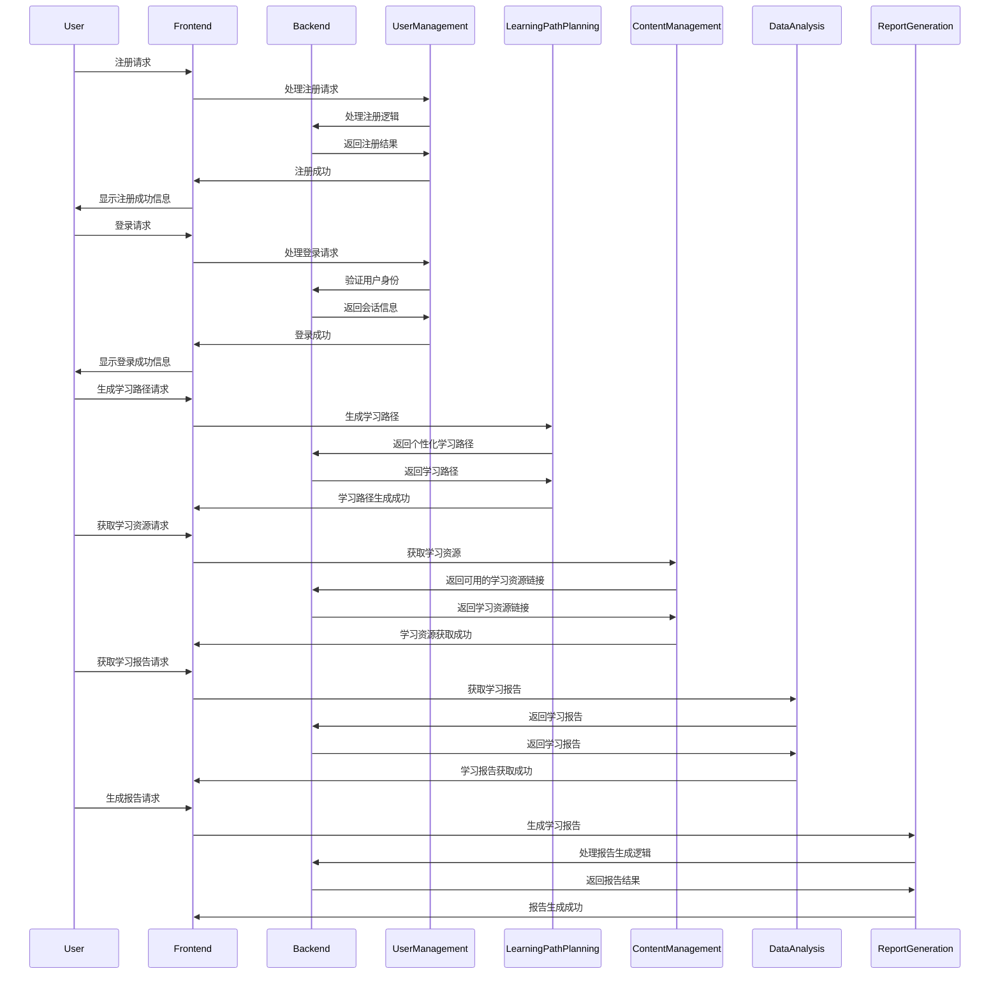

                 

### 1.1.1 智能企业学习管理系统的需求

在当前快速发展的数字化时代，企业面临着巨大的技术变革和市场竞争压力，为了保持竞争力，提升员工的技能水平和知识储备成为企业的迫切需求。智能企业学习管理系统（Intelligent Enterprise Learning Management System，IELMS）应运而生，旨在通过智能化的技术手段，为企业提供一个高效、精准、个性化的学习平台。

#### 技术变革与市场压力

随着云计算、大数据、人工智能等技术的不断成熟和应用，企业的运营和管理模式也在发生深刻变革。传统的学习管理系统已经难以满足企业在快速变化的市场环境中的需求，迫切需要一种智能化、自动化的解决方案来优化学习流程、提高学习效率。

- **技能需求多样化**：企业员工需要不断学习新的技能以适应行业变革，如数据分析、机器学习、区块链等。
- **培训成本高**：传统培训方式成本高、效率低，无法满足大规模员工的个性化学习需求。
- **管理难度大**：员工培训数据分散，缺乏有效的管理和分析工具，难以制定科学合理的培训策略。

#### 智能学习管理系统的作用

智能企业学习管理系统通过引入人工智能、大数据分析等先进技术，实现了对学习过程的全方位监控和个性化推荐，从而大大提高了学习效率和效果。其主要作用包括：

- **个性化学习**：根据员工的兴趣、技能水平和职业规划，推荐最适合的学习内容和路径。
- **实时数据分析**：通过数据挖掘和分析，为企业提供学习效果和员工技能水平的实时反馈。
- **自动化管理**：自动化处理学习过程中的各个环节，降低人力资源成本。
- **知识共享**：构建知识库，促进企业内部知识共享和员工间经验交流。

#### 智能化与自动化

智能化学习管理系统的核心在于将人工智能技术应用于学习过程中，通过机器学习、自然语言处理等技术，实现以下功能：

- **智能推荐**：根据员工的学习历史和兴趣，推荐个性化的学习内容。
- **智能问答**：利用自然语言处理技术，提供实时在线的问答服务，帮助员工解决学习中的问题。
- **智能评估**：通过自动化测试和评估，实时监测员工的学习进度和效果。
- **智能报告**：生成个性化的学习报告，为员工和企业管理者提供决策依据。

#### 企业面临的挑战

尽管智能企业学习管理系统具有诸多优势，但企业在实施过程中也面临一些挑战：

- **技术门槛高**：智能系统的构建需要高水平的编程和数据分析能力。
- **数据隐私**：学习过程中涉及大量员工个人数据，如何确保数据安全和隐私是一个重要问题。
- **文化适配**：企业内部文化和管理模式可能不支持或难以适应智能系统的运作。

### 1.1.2 技能图谱与个性化发展规划的重要性

技能图谱（Skill Graph）和个性化发展规划（Personalized Development Plan）是构建智能企业学习管理系统的基础，它们在提升员工技能和知识水平、优化企业培训管理方面发挥着至关重要的作用。

#### 技能图谱的作用

技能图谱是一种基于图论的数据模型，用于描述员工的技能、知识和经验。通过构建技能图谱，企业可以实现对员工技能的全面、系统和动态管理。

- **技能识别与评估**：技能图谱可以帮助企业识别员工的现有技能，并对其进行评估，以便确定培训需求。
- **知识传播与共享**：技能图谱中的节点和边代表员工之间的知识和经验，通过图谱可以促进知识在企业内部的传播和共享。
- **智能推荐**：技能图谱可以用于个性化学习内容的推荐，提高学习的针对性和效率。

#### 个性化发展规划的作用

个性化发展规划是根据员工的个人特点、职业目标和技能需求，制定的个性化培训和发展计划。它有助于提升员工的自我认知和发展能力，同时满足企业的整体培训需求。

- **目标明确**：个性化发展规划帮助员工明确职业发展目标，制定有针对性的学习计划。
- **过程监控**：通过个性化发展规划，企业可以实时监控员工的学习进度和效果，及时进行调整和优化。
- **发展引导**：个性化发展规划不仅关注员工的技能提升，还注重其综合素质和职业素养的培养。

#### 技能图谱与个性化发展规划的关系

技能图谱和个性化发展规划相辅相成，共同构建了智能企业学习管理系统的核心框架。

- **技能图谱作为基础**：技能图谱提供了对员工技能和知识的全面描述，是制定个性化发展规划的重要依据。
- **个性化发展规划作为应用**：个性化发展规划是基于技能图谱的具体应用，通过规划和实施，实现员工技能的提升和企业培训目标的达成。

通过技能图谱与个性化发展规划的融合，智能企业学习管理系统可以更好地满足企业和员工的需求，实现培训管理的智能化和高效化。

### 1.1.3 本书的结构和内容安排

为了系统地介绍智能企业学习管理系统及其关键组件，本书分为四个主要部分，具体结构如下：

#### 第一部分：引言

- **问题背景与目标**：阐述智能企业学习管理系统的需求与目标。
- **核心概念与联系**：介绍技能图谱与个性化发展规划的概念及其关系。
- **本书结构和内容安排**：概述全书的内容布局和各部分的主要任务。

#### 第二部分：技能图谱的构建与优化

- **技能图谱的构建基础**：讲解技能图谱的构建方法和数据预处理。
- **技能图谱的优化策略**：介绍技能图谱的节点权重调整和动态更新策略。
- **技能图谱的应用场景**：探讨技能图谱在人力资源管理、培训与职业发展等领域的应用。

#### 第三部分：个性化发展规划的制定与实施

- **个性化发展规划的制定基础**：介绍个性化发展规划的制定方法与工具。
- **个性化发展规划的实施步骤**：阐述个性化发展规划的执行、跟进和调整策略。
- **个性化发展规划的应用案例**：分析企业实践和教育培训机构的成功案例。

#### 第四部分：智能企业学习管理系统的集成与优化

- **智能企业学习系统的设计原则**：介绍系统架构和功能模块设计。
- **系统分析与架构设计方案**：详细描述系统场景、功能设计、架构设计、接口设计和系统交互。
- **项目实战**：包括系统安装、实现、代码解读和案例分析。
- **最佳实践 tips、小结、注意事项、拓展阅读**：总结经验，提供实用建议和进一步学习资源。

通过以上结构，本书旨在为读者提供一个全面、系统的智能企业学习管理系统构建方案，帮助企业在激烈的市场竞争中实现持续的人才培养和知识管理。

## 1.2 核心概念与联系

在构建智能企业学习管理系统中，技能图谱和个性化发展规划是两个核心概念，它们紧密相关，共同构成了系统的理论基础和应用框架。本节将详细介绍这两个概念，并通过表格和图表展示它们之间的关系。

### 1.2.1 技能图谱的定义与作用

**定义**：
技能图谱是一种基于图论的数据模型，用于描述员工的技能、知识和经验。在技能图谱中，节点表示技能或知识点，边表示技能之间的关系或依赖。

**作用**：

1. **技能识别与评估**：通过技能图谱，企业可以直观地识别员工的现有技能，并进行评估，从而明确培训需求。
2. **知识传播与共享**：技能图谱有助于知识在企业内部的传播和共享，促进员工间的经验交流。
3. **智能推荐**：技能图谱为个性化学习内容的推荐提供了基础，提高学习的针对性和效率。

### 1.2.2 个性化发展规划的概念与特点

**定义**：
个性化发展规划是根据员工的个人特点、职业目标和技能需求，制定的个性化培训和发展计划。

**特点**：

1. **目标明确**：个性化发展规划帮助员工明确职业发展目标，制定有针对性的学习计划。
2. **过程监控**：通过个性化发展规划，企业可以实时监控员工的学习进度和效果，及时进行调整和优化。
3. **发展引导**：个性化发展规划不仅关注员工的技能提升，还注重其综合素质和职业素养的培养。

### 1.2.3 技能图谱与个性化发展规划的关系

技能图谱和个性化发展规划是相辅相成的两个概念，它们之间的关系如下：

- **技能图谱作为基础**：技能图谱提供了对员工技能和知识的全面描述，是制定个性化发展规划的重要依据。
- **个性化发展规划作为应用**：个性化发展规划是基于技能图谱的具体应用，通过规划和实施，实现员工技能的提升和企业培训目标的达成。

### 表格展示

下面通过一个表格来展示技能图谱和个性化发展规划的关系：

| 关系项 | 技能图谱 | 个性化发展规划 |
| ------ | -------- | -------------- |
| 基础数据 | 技能节点、技能关系 | 员工技能、学习目标 |
| 数据处理 | 技能识别、评估 | 个人能力评估、发展目标设定 |
| 应用方向 | 技能传播、知识共享、智能推荐 | 学习路径规划、过程监控、发展引导 |

### 图表展示

为了更直观地展示技能图谱和个性化发展规划的关系，我们可以使用 Mermaid 绘制一个 ER 实体关系图。以下是 Mermaid 图的代码及其展示效果：

```mermaid
erDiagram
  Skill -> DevelopmentPlan {
    requires
    evaluates
  }
  
  Employee ||--|{ Skill } Skill
  Employee ||--|{ DevelopmentPlan } DevelopmentPlan
```

```markdown

```

在这个 ER 图中，`Skill` 表示技能图谱，`DevelopmentPlan` 表示个性化发展规划，它们之间通过员工实体（`Employee`）关联，体现了技能图谱作为基础，个性化发展规划作为应用的具体关系。

通过技能图谱与个性化发展规划的紧密融合，智能企业学习管理系统能够实现高效、精准的学习管理和人才发展，为企业的持续竞争力提供强有力的支持。

### 1.2.4 技能图谱的构建方法

技能图谱的构建是智能企业学习管理系统的关键环节，它需要科学的方法和策略来确保图谱的全面性、准确性和实时性。以下将详细描述技能图谱的构建方法，包括数据收集与预处理、技能实体与关系建模、以及技能图谱的构建方法。

#### 数据收集与预处理

**数据来源**：

技能图谱所需的数据可以从多个渠道收集，包括企业内部培训记录、员工工作日志、外部专业评价数据库等。具体来源如下：

1. **企业内部数据**：
   - 员工培训记录：记录员工参加过的培训课程、考试结果等。
   - 工作日志：记录员工在日常工作中的技能应用和项目经验。
   - 绩效评估数据：通过绩效考核，评估员工的技能水平和职业素养。

2. **外部数据**：
   - 专业评价数据库：获取行业标准的技能评估指标。
   - 开放数据集：从公共数据集获取相关的技能知识和应用案例。

**数据预处理流程**：

数据预处理是技能图谱构建的基础，主要包含以下步骤：

1. **数据清洗**：去除重复、错误和无关的数据，保证数据的一致性和准确性。
2. **数据格式转换**：将不同来源的数据格式统一，便于后续处理和分析。
3. **数据标准化**：对数据进行规范化处理，如将文本数据统一编码、数值数据标准化等。
4. **数据标注**：对数据进行分类标注，明确每个技能或知识点的属性和标签。

#### 技能实体与关系建模

**技能实体的识别**：

技能实体是指技能图谱中的节点，表示员工具备的技能或知识点。识别技能实体的关键步骤如下：

1. **技能分类**：根据行业标准和专业领域，将技能分为不同类别，如编程技能、项目管理技能、数据分析技能等。
2. **特征提取**：从原始数据中提取出技能特征，如技能名称、描述、难度等级等。
3. **实体识别**：通过自然语言处理技术，从文本数据中自动识别出技能实体。

**技能关系挖掘**：

技能关系是指技能图谱中的边，表示技能之间的关联性或依赖性。常见的技能关系包括：

1. **依赖关系**：某些技能的掌握需要依赖其他技能，如学习编程语言需要先掌握计算机基础知识。
2. **交叉关系**：某些技能之间存在交叉和融合，如数据分析技能与编程技能的结合。
3. **应用关系**：技能在不同工作场景中的实际应用情况。

技能关系的挖掘可以通过以下方法实现：

1. **语义分析**：利用自然语言处理技术，分析文本数据中的语义关系，提取出技能之间的关联。
2. **网络分析**：通过构建技能网络的拓扑结构，分析技能之间的相互依赖和融合关系。
3. **机器学习**：使用机器学习算法，对大量数据进行训练，识别出技能关系的模式。

#### 技能图谱的构建方法

技能图谱的构建是一个复杂的过程，需要结合多种技术和方法，具体步骤如下：

1. **数据集成**：将来自不同渠道的数据进行集成，形成一个统一的数据集。
2. **节点和边建模**：根据技能实体和技能关系，构建技能图谱的节点和边模型。
3. **图谱存储**：将构建好的技能图谱存储在分布式图数据库中，如Neo4j、JanusGraph等。
4. **图谱优化**：对技能图谱进行优化，包括节点和边的权重调整、冗余关系的删除等。
5. **图谱可视化**：通过可视化工具，如Gephi、Cytoscape等，展示技能图谱的结构和关系。

### Python 源代码示例

以下是一个简化的 Python 源代码示例，用于展示技能图谱的构建过程：

```python
import networkx as nx
import pandas as pd

# 数据预处理
data = pd.read_csv('skills_data.csv')
data = data.drop_duplicates().reset_index(drop=True)

# 构建节点和边
G = nx.Graph()

skills = data['Skill']
for skill in skills:
    G.add_node(skill)

relations = data['Relation']
for relation in relations:
    G.add_edge(relations[0], relations[1])

# 存储图谱
nx.write_gexf(G, 'skill_graph.gexf')

# 可视化图谱
nx.draw(G, with_labels=True)
plt.show()
```

通过上述步骤和代码，我们可以构建出一个基本的技能图谱，为智能企业学习管理系统提供数据基础。

### 1.2.5 技能图谱的优化策略

技能图谱作为智能企业学习管理系统的基础，其优化策略直接影响系统的性能和应用效果。以下将详细介绍技能图谱的优化策略，包括节点与边权重的调整和技能图谱的更新与维护。

#### 节点与边权重的调整

**节点权重**：

节点权重用于表示技能的重要性或员工在该技能上的掌握程度。调整节点权重的关键步骤如下：

1. **计算节点权重**：
   - **基于频率**：根据技能在数据集中出现的频率进行权重分配，频率越高，权重越高。
   - **基于影响力**：通过分析技能对企业业务的影响程度，确定技能的权重。
   - **基于员工绩效**：根据员工在相关技能上的绩效表现，调整节点的权重。

2. **动态调整**：
   - **定期更新**：定期对节点权重进行重新计算和调整，以反映最新的技能需求和企业业务变化。
   - **实时调整**：在员工技能发生变化或新技能出现时，实时更新节点权重，确保图谱的时效性。

**边权重**：

边权重用于表示技能之间的依赖关系或关联强度。调整边权重的关键步骤如下：

1. **计算边权重**：
   - **基于依赖程度**：根据技能之间的依赖关系，如必须先掌握某技能才能学习其他技能，确定边权重。
   - **基于使用频率**：根据技能在实际应用中的使用频率，调整边权重。

2. **动态调整**：
   - **定期更新**：定期对边权重进行重新计算和调整，以反映最新的技能需求和应用场景。
   - **实时调整**：在员工技能发生变化或新技能出现时，实时更新边权重，确保图谱的准确性和实时性。

#### 技能图谱的更新与维护

**动态更新**：

技能图谱需要定期更新，以反映技能的新发展和企业需求的变化。更新策略如下：

1. **数据采集**：
   - **内部数据**：定期收集员工的学习记录、工作日志、绩效评估等数据。
   - **外部数据**：获取行业标准的技能评估指标、最新的技能需求等。

2. **数据整合**：
   - **数据清洗**：去除重复、错误和无关的数据，保证数据的一致性和准确性。
   - **数据标准化**：对数据进行规范化处理，如统一编码、数值标准化等。

3. **更新图谱**：
   - **节点更新**：根据采集的新数据，更新图谱中的节点信息，如新增技能、调整节点权重等。
   - **边更新**：根据新的依赖关系和使用频率，更新图谱中的边权重。

**维护策略**：

技能图谱的维护是确保其长期有效性和稳定性的关键。维护策略如下：

1. **定期检查**：
   - **数据完整性检查**：定期检查图谱数据的完整性和一致性，确保无数据缺失或错误。
   - **性能监控**：监控图谱的查询性能和存储性能，及时优化数据库和算法。

2. **数据备份**：
   - **备份计划**：制定定期备份计划，确保数据在发生意外时可以恢复。
   - **数据恢复**：在数据丢失或损坏时，能够快速恢复数据。

3. **安全防护**：
   - **数据加密**：对敏感数据进行加密处理，确保数据的安全性。
   - **访问控制**：设置严格的访问权限，防止未经授权的访问和操作。

通过节点与边权重的调整和技能图谱的动态更新与维护，智能企业学习管理系统可以保持技能图谱的准确性和时效性，为企业提供高效、精准的学习管理和人才发展支持。

### 1.2.6 技能图谱的应用场景

技能图谱作为一种强大的数据模型，在智能企业学习管理系统中具有广泛的应用场景。以下是几个典型的应用场景：

#### 1.3.1 人力资源规划

在人力资源规划中，技能图谱可以用于以下方面：

1. **技能需求分析**：通过分析技能图谱中的节点和边，企业可以了解当前员工技能分布和缺口，从而制定科学的招聘和培训策略。
2. **岗位技能匹配**：技能图谱帮助企业在招聘过程中，通过匹配求职者的技能与岗位需求，提高招聘的准确性和效率。
3. **人才梯队建设**：技能图谱可以用于评估员工的能力和发展潜力，帮助企业规划人才梯队，确保未来业务的持续发展。

#### 1.3.2 培训与职业发展

在培训与职业发展中，技能图谱的应用体现在：

1. **个性化学习路径规划**：根据员工的技能图谱，系统可以自动生成个性化的学习路径，推荐最适合的学习内容和资源，提高学习效果。
2. **学习效果评估**：技能图谱可以帮助企业实时监控员工的学习进度和效果，通过分析学习数据，评估培训的成效，及时调整培训策略。
3. **职业发展规划**：技能图谱为员工的职业发展提供数据支持，帮助员工明确职业发展方向，制定长远的发展规划。

#### 1.3.3 项目管理与团队协作

在项目管理和团队协作中，技能图谱可以发挥以下作用：

1. **项目资源调配**：通过技能图谱，项目经理可以快速了解团队成员的技能情况，合理分配项目资源和任务，提高项目成功率。
2. **团队技能互补**：技能图谱帮助企业识别团队中的技能缺口，通过内部调换或外部招聘，确保团队具备完成项目所需的所有技能。
3. **知识共享**：技能图谱促进团队成员之间的知识共享和经验交流，通过图谱展示团队成员的技能和经验，促进跨部门的合作和创新。

#### 1.3.4 知识管理与经验传承

在知识管理和经验传承中，技能图谱的应用包括：

1. **知识库建设**：技能图谱为知识库的建设提供数据支持，通过图谱结构化地存储和分类知识，提高知识检索和利用的效率。
2. **经验传承**：通过技能图谱，企业可以追踪员工的职业发展和技能变迁，总结成功经验和最佳实践，为新员工提供宝贵的知识财富。

#### 1.3.5 绩效评估与员工激励

在绩效评估和员工激励中，技能图谱的应用体现在：

1. **技能评估**：技能图谱为绩效评估提供科学依据，通过分析员工的技能掌握情况，综合评估员工的绩效表现。
2. **员工激励**：根据技能图谱，企业可以设计个性化的激励方案，对在特定技能上表现优异的员工进行奖励，提高员工的工作积极性和满意度。

通过在多个应用场景中的广泛应用，技能图谱为智能企业学习管理系统提供了强大的数据支持和智能分析能力，助力企业实现高效的人才培养和知识管理。

### 3.1.1 个人能力评估模型

在构建个性化发展规划之前，对员工的个人能力进行准确评估是至关重要的。个人能力评估模型为企业提供了科学、客观的方法来识别员工的现有技能水平和潜力，从而为制定有针对性的发展规划提供基础。

#### 3.1.1.1 评估指标体系

评估指标体系是个人能力评估的核心，它由多个层次和维度的指标构成，全面覆盖员工的技能、知识和素质。以下是一个典型的评估指标体系：

1. **知识水平**：
   - **基础知识**：包括学科基础知识和专业理论知识。
   - **专业技能**：具体的专业技能，如编程技能、数据分析能力等。

2. **技能应用**：
   - **技术应用能力**：在实际工作中应用专业知识和技术的能力。
   - **问题解决能力**：分析和解决实际问题的能力。

3. **综合素质**：
   - **团队协作能力**：在团队中的协作能力，如沟通、协调和合作。
   - **领导能力**：在团队中的领导潜力，包括决策能力、影响力等。

4. **职业素养**：
   - **职业道德**：遵守职业道德规范的情况。
   - **职业态度**：对工作的态度和热情。

#### 3.1.1.2 评估方法与工具

评估方法的选择直接影响评估结果的准确性和有效性。以下是一些常用的评估方法与工具：

1. **自我评估**：
   - **自我报告问卷**：员工通过填写问卷，报告自己的技能水平和工作表现。
   - **个人简历**：通过分析员工的简历，评估其工作经历和成就。

2. **他人评估**：
   - **上级评价**：员工的上级对员工的技能和表现进行评价。
   - **同事评价**：同事对员工在团队中的协作和贡献进行评价。

3. **行为观察**：
   - **现场观察**：管理者通过现场观察，评估员工在实际工作中的表现。
   - **工作样本测试**：通过模拟实际工作场景，测试员工的应用能力和问题解决能力。

4. **能力测试**：
   - **笔试**：通过笔试测试员工的专业知识和技能。
   - **面试**：通过面试，评估员工的能力和潜力。

5. **360度评估**：
   - **全方位评估**：从多个角度（自我、上级、同事、下属）对员工进行评估，获得更全面、客观的评估结果。

#### 3.1.1.3 评估过程

评估过程包括以下几个关键步骤：

1. **评估准备**：
   - **制定评估计划**：明确评估的目标、指标和方法。
   - **准备评估工具**：设计评估问卷、测试题目等。

2. **数据收集**：
   - **自我报告**：收集员工的自我评估数据。
   - **他人反馈**：收集上级、同事和下属的评估数据。
   - **现场观察与能力测试**：进行现场观察和测试，收集行为数据。

3. **数据整合**：
   - **数据清洗**：去除重复、错误和不完整的数据。
   - **数据标准化**：对数据进行规范化处理。

4. **结果分析**：
   - **综合评分**：根据各项指标，计算综合评分。
   - **能力分析**：分析员工的技能水平和潜力。

5. **反馈与改进**：
   - **反馈评估结果**：向员工反馈评估结果，帮助其了解自身的优势和不足。
   - **制定改进计划**：根据评估结果，制定个人能力和技能提升计划。

通过科学、全面的个人能力评估模型，企业可以更准确地了解员工的现状和发展需求，为制定个性化发展规划提供可靠的数据支持。

### 3.1.2 个性化学习路径规划

个性化学习路径规划是构建智能企业学习管理系统的重要组成部分，它根据员工的个人能力和职业目标，为其制定一条科学、高效的学习路线，从而提高学习效果和职业发展速度。以下是详细的学习路径规划步骤：

#### 3.1.2.1 学习需求分析

学习需求分析是制定个性化学习路径的第一步，旨在全面了解员工的现有知识和技能水平，以及其在职业发展过程中的需求和目标。

1. **现有技能评估**：通过个人能力评估模型，分析员工的现有技能水平和掌握程度，识别出需要提升的技能点。
2. **职业目标设定**：与员工沟通，了解其职业规划和长远目标，明确短期和长期的学习需求。
3. **培训资源调研**：收集和分析企业内外部的培训资源，包括在线课程、书籍、研讨会等，确保学习路径的可行性和丰富性。

#### 3.1.2.2 学习路径设计

学习路径设计是根据学习需求分析的结果，制定一条科学、合理的的学习路线。

1. **初步方案制定**：根据员工的需求和目标，初步制定学习路径方案，包括学习内容、学习时间、学习方式等。
2. **方案调整与优化**：结合员工的反馈和实际情况，对初步方案进行调整和优化，确保学习路径的合理性和可操作性。
3. **学习路径可视化**：通过图表或列表形式，将学习路径可视化，使员工能够清晰地了解自己的学习目标和计划。

#### 3.1.2.3 学习路径实施与监控

学习路径实施与监控是确保学习目标实现的重要环节。

1. **学习计划执行**：根据学习路径，员工按照计划进行学习，企业提供必要的资源和支持。
2. **学习进度跟踪**：通过学习管理系统，实时跟踪员工的学习进度和效果，确保学习目标的达成。
3. **定期评估与反馈**：定期对学习效果进行评估，收集员工的反馈意见，对学习路径进行调整和优化。

#### 3.1.2.4 学习路径调整

学习路径不是一成不变的，根据员工的学习反馈和职业发展需求，需要定期对学习路径进行调整。

1. **学习反馈收集**：通过问卷调查、访谈等方式，收集员工在学习过程中的反馈，了解学习路径的适用性和效果。
2. **路径调整策略**：根据反馈结果，对学习路径进行调整，包括增加新的学习内容、调整学习时间、改变学习方式等。
3. **动态更新**：学习路径应具备动态更新的能力，能够及时响应员工的学习需求和职业发展变化。

#### 3.1.2.5 持续优化

个性化学习路径的持续优化是保证学习效果和员工职业发展的重要手段。

1. **数据分析**：通过对学习数据的分析，发现学习路径中存在的问题和不足，为优化提供数据支持。
2. **专家评审**：邀请行业专家和企业管理者对学习路径进行评审，提出改进建议。
3. **定期评估**：定期对学习路径的成效进行评估，确保其符合员工的职业发展和企业的人才培养目标。

通过个性化学习路径规划，企业能够为员工提供更加科学、合理的学习支持，促进其技能提升和职业发展，同时提高企业整体的人才竞争力。

### 3.1.3 个性化发展规划的策略

个性化发展规划是根据员工的个人特点和职业目标，为其量身定制的一系列成长路径和策略。以下详细讨论个性化发展规划的策略，包括发展目标的设定、发展路径的规划、以及执行过程中可能遇到的问题和解决方法。

#### 3.1.3.1 发展目标设定

设定科学合理的发展目标是制定个性化发展规划的第一步。发展目标应具备以下几个特点：

1. **具体性**：目标应具体、明确，可量化和可衡量。例如，提升某项技能至高级水平、完成某项专业认证等。
2. **挑战性**：目标应具有一定的挑战性，激励员工不断努力，但不应过于困难，以免员工产生挫败感。
3. **阶段性**：目标应分为短期和长期，短期目标应具体、可操作，长期目标则应更具战略性和全局性。
4. **适应性**：目标应具有灵活性，能够根据员工的学习进度和职业发展情况进行调整。

**目标设定方法**：

1. **自我评估**：员工通过自我评估，识别自己的优势和不足，结合职业规划和长远目标，设定具体的发展目标。
2. **领导指导**：上级领导根据员工的绩效表现和职业潜力，提供指导和建议，共同设定发展目标。
3. **职业咨询**：借助职业咨询师的帮助，对员工的职业兴趣、技能和潜力进行评估，制定符合其个性特点的发展目标。

#### 3.1.3.2 发展路径规划

发展路径规划是依据设定的发展目标，制定具体的实施步骤和行动计划。以下是一些关键策略：

1. **技能图谱参考**：通过技能图谱，了解目标技能之间的关系和依赖，确定学习路径的优先级和顺序。
2. **学习资源整合**：整合企业内外部的学习资源，如在线课程、内部培训、行业研讨会等，为员工提供丰富的学习选择。
3. **个性化学习方案**：根据员工的具体需求，制定个性化的学习方案，包括学习内容、学习方式、学习时间等。
4. **职业发展路径**：结合员工的职业目标和行业发展趋势，规划职业发展路径，包括晋升通道、职业转型等。

**路径规划步骤**：

1. **目标分解**：将长期目标分解为一系列短期目标，制定阶段性任务和里程碑。
2. **任务分配**：根据目标要求，分配具体的学习任务和行动项，明确责任人和完成时间。
3. **行动计划**：制定详细的行动计划，包括学习内容、学习方法、学习资源等。
4. **反馈机制**：建立定期反馈机制，对员工的学习进度和效果进行评估，及时调整和优化学习路径。

#### 3.1.3.3 执行过程中可能出现的问题和解决方法

1. **目标设定不明确**：解决方法：通过多次沟通和评估，确保目标设定具体、明确，双方达成一致。
2. **资源不足**：解决方法：整合企业内外部资源，确保员工获得充足的学习支持，必要时提供额外的资源或补贴。
3. **执行力不足**：解决方法：加强员工自我管理能力，制定严格的时间表和任务清单，加强监督和激励。
4. **反馈不及时**：解决方法：建立有效的反馈机制，定期收集员工反馈，及时进行沟通和调整。
5. **职业发展瓶颈**：解决方法：提供职业辅导和指导，帮助员工突破职业发展的瓶颈，规划新的职业路径。

通过科学设定发展目标、合理规划发展路径，并灵活应对执行过程中的问题，企业能够为员工提供个性化的发展支持，助力其职业成长和企业的长远发展。

### 3.2.1 制定个性化学习计划

个性化学习计划的制定是实现员工个性化发展规划的关键步骤，它要求对学习目标、学习内容、学习时间以及学习方法进行细致的规划。以下是制定个性化学习计划的详细步骤：

#### 3.2.1.1 学习计划内容与形式

**学习计划内容**：

1. **学习目标**：明确员工希望通过学习计划达成的具体目标，如提升某项技能、获得某项证书等。
2. **学习内容**：根据学习目标，确定需要学习的内容，包括理论知识、实践操作、案例学习等。
3. **学习时间**：规划学习的时间安排，包括每天或每周的学习时长、具体的学习时间段等。
4. **学习方法**：选择适合的学习方法，如在线学习、线下培训、自学等。

**学习计划形式**：

1. **书面计划**：以书面形式详细记录学习计划，包括学习目标、内容、时间表和责任人等。
2. **电子文档**：使用电子文档（如Excel、Word或专门的培训管理软件）记录和跟踪学习计划，便于调整和更新。
3. **可视化图表**：使用图表形式（如Gantt图、甘特图）展示学习计划的时间安排和进度，便于直观理解。

#### 3.2.1.2 学习计划执行与跟踪

**执行步骤**：

1. **分配任务**：将学习计划中的具体任务分配给员工，明确责任人和完成时间。
2. **资源准备**：准备必要的资源，如学习材料、在线课程链接、培训设备等。
3. **学习启动**：启动学习计划，员工开始按照计划进行学习。

**跟踪方法**：

1. **进度报告**：定期要求员工提交学习进度报告，包括已学习的内容、遇到的问题等。
2. **会议检查**：定期召开会议，检查学习进度，讨论遇到的问题和解决方案。
3. **数据监测**：使用学习管理系统实时监测员工的学习进度和效果，生成可视化报表。

#### 3.2.1.3 学习效果评估

**评估方法**：

1. **自我评估**：员工根据学习计划，对自己的学习效果进行自我评估，记录学习成果和收获。
2. **上级评估**：上级领导或培训负责人根据员工的学习进度和表现，进行评估，提供反馈意见。
3. **技能测试**：通过技能测试或考试，检验员工对所学知识的掌握程度。

**评估标准**：

1. **目标达成度**：根据设定目标，评估员工是否达到预期学习效果。
2. **学习深度**：评估员工对学习内容的理解和掌握程度。
3. **学习效率**：评估员工的学习效率和资源利用情况。

#### 3.2.1.4 调整与优化

**调整策略**：

1. **定期回顾**：定期回顾学习计划，根据实际情况进行调整和优化。
2. **反馈机制**：建立有效的反馈机制，收集员工的意见和建议，及时调整学习计划。
3. **动态调整**：根据员工的反馈和学习效果，动态调整学习内容、方法和时间安排。

**优化措施**：

1. **增强学习支持**：提供更多的学习资源和支持，如导师辅导、小组讨论等。
2. **改进学习方法**：根据评估结果，改进学习方法，提高学习效果。
3. **持续反馈**：通过持续的反馈和评估，确保学习计划的优化和调整能够真正提高学习效果。

通过科学制定和执行个性化学习计划，企业能够有效提升员工的技能水平和职业素养，实现员工与企业的共同发展。

### 3.2.2 跟进与反馈机制

跟进与反馈机制是确保个性化发展规划实施效果的关键环节。通过有效的跟进和及时反馈，企业可以确保学习计划的顺利进行，并根据实际情况进行调整和优化，提高学习效果。

#### 3.2.2.1 进度评估

**评估方法**：

1. **定量评估**：通过数据分析，定量评估员工的学习进度，如完成的学习时长、学习任务的完成情况等。
2. **定性评估**：通过访谈、问卷调查等形式，定性评估员工的学习效果和反馈，如对学习内容的掌握程度、学习过程中的困惑和收获等。

**评估步骤**：

1. **设定评估标准**：根据学习目标和计划，设定具体的评估标准，确保评估的客观性和科学性。
2. **定期评估**：定期进行学习进度评估，确保及时发现问题和进行调整。
3. **反馈与讨论**：将评估结果及时反馈给员工，与员工讨论学习进度和效果，共同分析存在的问题和改进方案。

#### 3.2.2.2 反馈机制设计

**设计原则**：

1. **及时性**：反馈应尽快进行，确保员工能够及时了解学习效果和需要改进的地方。
2. **全面性**：反馈应涵盖学习进度、效果、资源和环境等多方面，确保全面评估。
3. **针对性**：根据员工的实际情况和具体需求，提供有针对性的反馈，帮助其明确改进方向。

**反馈形式**：

1. **书面反馈**：通过书面报告、邮件等形式，提供详细的学习进度和效果评估。
2. **口头反馈**：通过会议、访谈等形式，与员工进行面对面交流，提供即时反馈。
3. **互动反馈**：利用在线学习平台，通过讨论区、实时聊天等功能，提供互动性强的反馈。

#### 3.2.2.3 反馈效果分析

**效果评估**：

1. **改进措施**：根据反馈结果，分析存在的问题，制定并实施改进措施，确保学习效果的提升。
2. **反馈效果跟踪**：对反馈措施的实施效果进行跟踪和评估，确保改进措施的有效性。

**改进策略**：

1. **持续改进**：建立持续改进机制，根据反馈结果，不断调整和优化个性化发展规划。
2. **培训辅导**：提供专门的培训辅导，帮助员工克服学习中的困难，提高学习效果。
3. **个性化支持**：根据员工的个性化需求，提供定制化的支持和帮助，确保学习计划的顺利实施。

通过建立完善的跟进与反馈机制，企业可以确保个性化发展规划的顺利实施，有效提升员工的学习效果和职业素养，实现企业的长远发展目标。

### 3.2.3 个性化发展规划的调整

个性化发展规划并不是一成不变的，它需要根据员工的反馈、学习进度和职业发展需求进行动态调整，以确保其持续有效。以下是调整个性化发展规划的策略和实施流程。

#### 3.2.3.1 动态调整策略

1. **定期回顾**：定期组织员工进行发展规划的回顾和评估，检查学习进度和效果，发现潜在的问题和改进空间。
2. **反馈收集**：通过多种渠道（如问卷调查、访谈、反馈表等）收集员工的反馈意见，了解其在学习过程中遇到的困难和需求。
3. **数据分析**：利用数据分析工具，对学习进度、评估结果和反馈信息进行综合分析，识别出需要调整的领域和方向。
4. **目标修正**：根据分析结果，修正发展目标，确保其符合员工的实际情况和职业需求。

#### 3.2.3.2 调整实施流程

**调整步骤**：

1. **评估现状**：首先，对现有的个性化发展规划进行评估，分析其成效和存在的问题。这包括学习进度、效果评估、员工反馈等多个方面。
2. **问题识别**：通过评估结果，识别出需要调整的具体方面，如学习内容、学习方法、时间安排等。
3. **制定方案**：根据问题识别的结果，制定调整方案。方案应包括调整的具体措施、实施时间表和责任人。
4. **方案执行**：实施调整方案，确保各项措施得到有效执行。在此过程中，需持续跟踪和监督调整效果。
5. **反馈与优化**：在调整实施后，及时收集员工的反馈意见，对调整效果进行评估。如果发现问题，进一步优化调整方案。

**注意事项**：

1. **灵活性**：调整方案应具备一定的灵活性，能够根据实际情况进行动态调整。
2. **透明性**：调整过程应保持透明，确保员工了解调整的原因、方法和效果。
3. **持续性**：调整不是一次性的任务，而是一个持续的过程，需要定期进行回顾和优化。

通过动态调整个性化发展规划，企业能够更好地适应员工的学习需求和职业发展变化，提高发展规划的实效性，促进员工的持续成长和企业的长远发展。

### 3.3.1 某企业个性化发展规划实践

某大型科技企业通过构建智能企业学习管理系统，成功实施了一系列个性化发展规划，为企业员工提供了全面的职业发展支持。以下是其实践过程中的具体步骤、实施方法和效果评估。

#### 实践步骤

1. **评估现状**：企业首先对所有员工的技能和知识水平进行了全面的评估，包括通过在线问卷和面对面访谈收集数据，建立详细的员工技能图谱。
2. **目标设定**：根据评估结果和员工的职业规划，制定个性化的学习和发展目标。每个员工都明确了自己的学习目标和职业发展方向。
3. **路径规划**：结合技能图谱和员工的职业目标，制定个性化学习路径，包括推荐的学习内容、学习资源和时间安排。
4. **执行计划**：企业通过学习管理系统，将个性化学习计划发送给员工，并监督执行过程。员工按照计划进行学习，企业定期跟踪学习进度。
5. **反馈与调整**：在执行过程中，企业通过定期评估和员工反馈，动态调整学习计划，确保员工的学习目标和路径符合实际情况。

#### 实施方法

1. **技能图谱构建**：企业使用自然语言处理和机器学习技术，构建了详细的技能图谱，包括编程语言、数据分析、项目管理等多个领域。技能图谱为个性化学习路径提供了数据支持。
2. **个性化推荐**：基于技能图谱，学习管理系统为员工推荐个性化的学习资源和课程，包括在线课程、专业书籍和内部培训等。
3. **学习管理**：企业使用专门的培训管理软件，对员工的学习进度进行监控，并提供实时反馈和指导。软件还能根据员工的反馈和学习效果，自动调整学习计划。
4. **导师辅导**：企业为每位员工配备了导师，导师负责提供职业指导和学习支持，帮助员工解决学习中遇到的问题。

#### 效果评估

1. **学习效果**：通过学习管理系统，企业能够实时跟踪员工的学习进度和效果。数据显示，员工的学习完成率和满意度都有显著提升。
2. **技能提升**：员工的技能水平得到了显著提高，特别是在关键领域，如编程技能和数据分析能力。这直接提升了企业的技术实力和创新能力。
3. **员工满意度**：员工对个性化发展规划的满意度高，普遍认为这种模式能够更好地满足他们的职业发展需求，增强了工作动力和职业认同感。
4. **企业效益**：通过个性化发展规划，企业培养了更多具备专业技能和综合素质的人才，提高了企业的竞争力和市场适应能力。

#### 成功因素

1. **技术支持**：企业通过技能图谱和智能学习管理系统，为个性化发展规划提供了强有力的技术支持，确保了系统的全面性和高效性。
2. **文化适应**：企业内部文化支持个性化学习和发展，员工和管理层对新的学习模式和文化变革持开放态度，促进了系统的顺利实施。
3. **持续优化**：企业不断根据员工反馈和实际效果，动态调整和优化个性化发展规划，确保其持续有效。

通过这一成功实践，企业证明了个性化发展规划在提升员工技能和职业素养方面的有效性，同时也为其他企业提供了宝贵的经验和借鉴。

### 3.3.2 某教育培训机构个性化发展案例

某知名教育培训机构通过引入智能企业学习管理系统，成功实施了一系列个性化发展规划，为学员提供了高效、精准的学习支持。以下是其实践过程中的具体步骤、实施方法和效果评估。

#### 实践步骤

1. **需求调研**：教育培训机构首先对学员的学习需求和目标进行了详细的调研，通过问卷调查和访谈，收集了学员的学习兴趣、职业规划和现有技能水平等信息。
2. **目标设定**：根据调研结果，机构为每位学员制定了个性化的学习和发展目标，确保目标与学员的个人需求和职业规划相一致。
3. **路径规划**：基于学员的个性化目标，机构制定了详细的个性化学习路径，包括推荐的学习内容、学习资源和时间安排。
4. **资源整合**：机构整合了多种学习资源，如在线课程、专业书籍、实战项目和专家辅导等，为学员提供全方位的学习支持。
5. **执行与跟踪**：通过智能学习管理系统，机构对学员的学习进度进行实时跟踪，并提供即时反馈和指导，确保学员按照个性化学习路径进行学习。
6. **反馈与调整**：在执行过程中，机构定期收集学员的反馈，根据反馈结果对学习计划进行调整和优化，确保学习计划的实效性和适应性。

#### 实施方法

1. **技能图谱构建**：机构使用自然语言处理和机器学习技术，构建了详细的技能图谱，包括语言学习、编程技能、数据分析等多个领域。技能图谱为个性化学习路径提供了数据支持。
2. **个性化推荐**：基于技能图谱和学员的学习数据，学习管理系统为学员推荐个性化的学习资源和课程，包括定制化的学习计划和推荐的学习路径。
3. **学习管理**：机构使用专门的培训管理软件，对学员的学习进度进行监控，并提供实时反馈和指导。软件还能根据学员的反馈和学习效果，自动调整学习计划。
4. **导师辅导**：机构为每位学员配备了专业的导师，导师负责提供职业指导和学习支持，帮助学员解决学习中遇到的问题，并提供实战经验和建议。

#### 效果评估

1. **学习效果**：通过学习管理系统，机构能够实时跟踪学员的学习进度和效果。数据显示，学员的学习完成率和学习满意度都有显著提升。
2. **技能提升**：学员的技能水平得到了显著提高，特别是在关键领域，如编程技能和数据分析能力。这直接提升了学员的职业竞争力和就业能力。
3. **学员满意度**：学员对个性化发展规划的满意度高，普遍认为这种模式能够更好地满足他们的学习需求和职业发展目标，增强了学习动力和信心。
4. **机构效益**：通过个性化发展规划，机构培养了更多具备专业技能和综合素质的学员，提高了品牌知名度和市场竞争力。

#### 成功因素

1. **技术优势**：机构通过技能图谱和智能学习管理系统，为个性化发展规划提供了强大的技术支持，确保了系统的全面性和高效性。
2. **教学方法**：机构采用多样化的教学方法和手段，如在线课程、实战项目和导师辅导等，满足了不同学员的学习需求，提高了学习效果。
3. **文化支持**：机构内部文化鼓励个性化学习和自主发展，学员和管理层对新的学习模式和文化变革持开放态度，促进了个性化发展规划的顺利实施。
4. **持续优化**：机构不断根据学员的反馈和学习效果，动态调整和优化个性化发展规划，确保其持续有效，并根据行业发展变化，及时更新学习内容和路径。

通过这一成功案例，教育培训机构证明了个性化发展规划在提升学员技能和职业素养方面的有效性，同时也为其他教育培训机构提供了宝贵的经验和借鉴。

## 4.1 智能企业学习管理系统的设计原则

智能企业学习管理系统的设计原则是确保系统高效、稳定和可扩展的关键，它们贯穿于系统架构、功能模块划分以及用户体验设计等各个方面。以下是详细的设计原则：

### 4.1.1 系统架构设计

**模块化设计**：智能企业学习管理系统应采用模块化架构，将系统功能划分为多个独立模块，如用户管理、内容管理、学习路径规划、数据分析和报告生成等。模块化设计可以提高系统的可维护性和扩展性，便于功能的灵活调整和升级。

**分布式架构**：为了应对大规模数据和高并发访问需求，系统应采用分布式架构，包括分布式数据库、负载均衡和缓存机制等。分布式架构可以提高系统的可靠性和性能，确保系统在高峰期也能稳定运行。

**可扩展性**：系统设计应具备良好的扩展性，以便于未来随着企业规模的扩大和需求的变化，能够灵活增加新功能或扩展系统容量。

### 4.1.2 功能模块划分

**用户管理模块**：负责用户身份认证、权限管理和用户信息维护。包括用户注册、登录、权限分配和用户数据备份等功能。

**内容管理模块**：负责管理学习资源，包括课程、教材、视频和文档等。提供内容上传、分类管理、权限控制和版本控制等功能。

**学习路径规划模块**：根据员工的技能图谱和职业目标，自动生成个性化的学习路径，并提供推荐课程和学习资源。

**数据分析模块**：利用大数据分析技术，对学习数据进行挖掘和分析，生成学习报告和趋势分析，为管理者提供决策依据。

**报告生成模块**：自动生成个性化学习报告，包括学习进度、效果评估和技能提升情况等，帮助员工和管理者了解学习成效。

### 4.1.3 用户体验设计

**易用性**：系统界面设计应简洁明了，操作流程易于理解，减少用户的操作步骤，提高使用体验。

**个性化定制**：系统应支持个性化设置，如用户界面风格、学习提醒方式等，满足不同用户的个性化需求。

**实时反馈**：系统应提供实时反馈功能，如学习进度提示、学习效果评估和反馈收集等，增强用户的学习体验和参与感。

**移动端支持**：系统应具备良好的移动端适配性，支持用户通过手机、平板等设备进行学习和操作，方便用户随时随地进行学习。

### 4.1.4 安全性与隐私保护

**数据安全**：系统应具备完善的数据安全措施，包括数据加密、备份和恢复等，确保学习数据的安全性和完整性。

**隐私保护**：系统应严格遵守隐私保护法律法规，对用户数据进行严格管理和保护，防止数据泄露和滥用。

### 4.1.5 可维护性和可扩展性

**模块化维护**：系统设计应便于模块化维护，便于技术人员快速定位和修复问题，提高系统的稳定性和可用性。

**自动化部署**：系统应支持自动化部署和更新，减少手动操作，提高部署效率。

**技术支持**：系统应提供完善的技术文档和用户手册，便于技术人员和用户进行系统维护和使用。

通过遵循上述设计原则，智能企业学习管理系统可以构建一个高效、稳定和用户友好的学习平台，为企业的持续发展和员工的专业成长提供有力支持。

### 4.2 系统场景描述

智能企业学习管理系统旨在为企业提供全方位的学习管理服务，通过整合技能图谱与个性化发展规划，助力企业实现高效的人才培养和知识管理。以下是系统应用的场景描述：

#### 员工培训

在员工培训场景中，智能企业学习管理系统可以帮助企业实现以下目标：

1. **个性化学习路径规划**：根据员工的技能图谱和职业目标，系统自动生成个性化的学习路径，为员工推荐最适合的学习资源和课程。
2. **实时学习效果评估**：系统实时跟踪员工的学习进度和效果，通过数据分析和评估，生成学习报告，帮助管理者了解员工的学习成效。
3. **学习任务管理**：系统提供学习任务管理功能，员工可以查看自己的学习任务和进度，确保按时完成学习任务。

#### 人力资源规划

在人力资源规划场景中，智能企业学习管理系统可以为以下目标提供支持：

1. **技能需求分析**：通过分析技能图谱，企业可以了解员工的现有技能和技能缺口，从而制定科学的招聘和培训策略。
2. **人才梯队建设**：系统帮助识别和培养高潜力人才，通过技能图谱和个性化发展规划，为企业培养未来的领导者和关键技术人员。
3. **员工绩效评估**：系统根据员工的技能提升和绩效表现，为员工绩效评估提供数据支持，帮助企业优化绩效管理流程。

#### 项目管理

在项目管理场景中，智能企业学习管理系统可以为以下目标提供支持：

1. **技能匹配**：通过技能图谱，项目经理可以快速了解团队成员的技能情况，合理分配项目资源和任务，确保项目高效完成。
2. **知识共享**：系统促进团队成员之间的知识共享和经验交流，通过图谱展示团队成员的技能和经验，提高项目协作效率。
3. **实时监控**：系统实时监控项目进度和团队成员的学习情况，为项目经理提供及时的反馈和调整建议。

#### 绩效评估与激励

在绩效评估与激励场景中，智能企业学习管理系统可以为以下目标提供支持：

1. **技能提升评估**：系统通过数据分析，评估员工技能提升情况，为绩效评估提供客观依据。
2. **个性化激励**：根据员工的技能提升和绩效表现，系统设计个性化的激励方案，如奖励证书、晋升机会等，激发员工的工作积极性和学习动力。

通过以上应用场景，智能企业学习管理系统在员工培训、人力资源规划、项目管理和绩效评估等方面发挥了重要作用，为企业提供了高效、精准的学习管理服务。

### 4.3 系统功能设计

智能企业学习管理系统包含多个关键功能模块，每个模块在提升学习效率和管理效果方面起着至关重要的作用。以下是系统功能设计的详细描述：

#### 用户管理模块

**功能描述**：

用户管理模块负责处理用户注册、登录、权限管理和用户信息维护等操作。通过用户管理模块，系统可以实现以下功能：

- **用户注册**：新用户可以通过在线注册功能，创建个人账号，填写基本信息。
- **用户登录**：系统提供用户登录功能，用户输入用户名和密码后，可以进入系统进行相关操作。
- **权限管理**：根据用户角色和权限，系统控制用户访问不同的功能和数据，确保数据安全。
- **用户信息维护**：用户可以更新个人资料，包括联系方式、职业信息等。

#### 内容管理模块

**功能描述**：

内容管理模块负责管理学习资源，包括课程、教材、视频和文档等。通过内容管理模块，系统可以实现以下功能：

- **内容上传**：管理员可以上传学习资源，确保资源的质量和规范性。
- **内容分类**：学习资源可以根据主题、难度等级等进行分类，便于用户查找。
- **权限控制**：学习资源可以根据用户角色和权限进行访问控制，确保资源的安全性和隐私性。
- **版本控制**：学习资源的历史版本和更新记录可以得到有效管理，方便用户查看和选择。

#### 学习路径规划模块

**功能描述**：

学习路径规划模块根据员工的技能图谱和职业目标，自动生成个性化的学习路径，为员工推荐最适合的学习资源和课程。通过学习路径规划模块，系统可以实现以下功能：

- **技能图谱构建**：系统根据员工的现有技能和职业目标，构建详细的技能图谱。
- **学习路径生成**：系统根据技能图谱和员工的职业目标，自动生成个性化的学习路径。
- **学习资源推荐**：系统推荐最适合的学习资源，包括课程、教材、视频等，提高学习效果。

#### 数据分析模块

**功能描述**：

数据分析模块利用大数据分析技术，对学习数据进行挖掘和分析，生成学习报告和趋势分析，为管理者提供决策依据。通过数据分析模块，系统可以实现以下功能：

- **学习行为分析**：系统分析员工的学习行为，包括学习时长、学习频率、学习内容偏好等。
- **学习效果评估**：系统评估员工的学习效果，包括知识掌握程度、技能提升情况等。
- **趋势分析**：系统分析学习数据，生成学习趋势报告，为管理层提供决策支持。

#### 报告生成模块

**功能描述**：

报告生成模块自动生成个性化学习报告，包括学习进度、效果评估和技能提升情况等，帮助员工和管理者了解学习成效。通过报告生成模块，系统可以实现以下功能：

- **学习进度报告**：系统生成员工的学习进度报告，包括已完成的学习任务、未完成的学习任务等。
- **效果评估报告**：系统生成员工的学习效果评估报告，包括知识掌握情况、技能提升情况等。
- **技能提升报告**：系统生成员工的技能提升报告，包括技能评估结果、提升路径等。

通过以上关键功能模块，智能企业学习管理系统能够实现高效、精准的学习管理和人才发展，为企业提供全面的解决方案。

### 4.4 系统架构设计

智能企业学习管理系统的架构设计是确保系统高效、稳定和可扩展性的关键。以下将详细介绍系统的架构设计，包括整体架构、各个模块的功能以及它们之间的交互。

#### 系统架构

**整体架构**：

智能企业学习管理系统采用分层架构设计，主要包括以下几层：

1. **前端层**：负责用户界面展示和交互，包括用户管理模块、内容管理模块、学习路径规划模块和报告生成模块等。
2. **业务逻辑层**：处理业务逻辑，包括用户管理、内容管理、学习路径规划和数据分析等核心功能。
3. **数据访问层**：负责与数据库的交互，进行数据查询、存储和更新操作。
4. **基础设施层**：包括数据库、缓存、负载均衡、消息队列等基础服务。

**系统模块**：

系统架构中包含以下主要模块：

1. **用户管理模块**：负责用户注册、登录、权限管理和用户信息维护等操作。
2. **内容管理模块**：管理学习资源，包括课程、教材、视频和文档等，提供内容上传、分类管理、权限控制和版本控制等功能。
3. **学习路径规划模块**：根据员工的技能图谱和职业目标，自动生成个性化的学习路径，并提供推荐课程和学习资源。
4. **数据分析模块**：利用大数据分析技术，对学习数据进行挖掘和分析，生成学习报告和趋势分析。
5. **报告生成模块**：自动生成个性化学习报告，包括学习进度、效果评估和技能提升情况等。

**模块交互**：

系统中的各个模块通过接口进行通信和协作，以下是主要模块之间的交互：

1. **用户管理模块与前端层**：用户管理模块通过API与前端层进行交互，用户在前端进行注册、登录等操作，数据通过用户管理模块进行处理和存储。
2. **内容管理模块与前端层**：内容管理模块通过API与前端层进行交互，管理员可以在前端上传和管理学习资源，用户可以在前端查看和下载学习资源。
3. **学习路径规划模块与前端层**：学习路径规划模块通过API与前端层进行交互，根据用户的技能图谱和职业目标，自动生成学习路径，用户可以在前端查看和学习路径。
4. **数据分析模块与前端层**：数据分析模块通过API与前端层进行交互，将分析结果以报告形式展示给用户。
5. **用户管理模块与业务逻辑层**：用户管理模块将用户操作转化为业务逻辑层可处理的请求，业务逻辑层根据用户操作执行相应的业务处理。
6. **内容管理模块与业务逻辑层**：内容管理模块将资源操作转化为业务逻辑层可处理的请求，业务逻辑层根据资源操作执行相应的业务处理。
7. **学习路径规划模块与业务逻辑层**：学习路径规划模块根据员工的技能图谱和职业目标，生成学习路径，并将其存储到数据库中。
8. **数据分析模块与业务逻辑层**：数据分析模块根据业务逻辑层的请求，对学习数据进行挖掘和分析，并将分析结果返回给业务逻辑层。
9. **报告生成模块与业务逻辑层**：报告生成模块根据业务逻辑层的分析结果，生成学习报告，并将其存储到数据库中。

通过上述架构设计和模块交互，智能企业学习管理系统实现了高效、稳定和可扩展的功能，为企业的学习管理和人才发展提供了强有力的支持。

### 4.5 系统接口设计

在智能企业学习管理系统中，接口设计是确保各个模块之间高效通信和协作的重要环节。以下是系统接口设计的详细描述，包括接口规范、API设计和数据格式。

#### 接口规范

**RESTful API设计**：

智能企业学习管理系统采用RESTful API设计，提供统一的接口标准，便于前端调用和后端处理。以下是主要接口规范：

1. **用户管理接口**：
   - 用户注册：`POST /api/users/register`，请求体包含用户名、密码、邮箱等信息。
   - 用户登录：`POST /api/users/login`，请求体包含用户名和密码。
   - 用户信息更新：`PUT /api/users/{user_id}`，请求体包含用户信息。
   - 用户权限管理：`POST /api/users/{user_id}/permissions`，请求体包含权限信息。

2. **内容管理接口**：
   - 上传学习资源：`POST /api/content/upload`，请求体包含资源文件和元数据。
   - 获取学习资源：`GET /api/content/{content_id}`，返回学习资源的元数据和文件链接。
   - 更新学习资源：`PUT /api/content/{content_id}`，请求体包含更新后的资源信息。
   - 删除学习资源：`DELETE /api/content/{content_id}`，删除指定资源。

3. **学习路径规划接口**：
   - 生成学习路径：`POST /api/learning-path/generate`，请求体包含用户ID和职业目标。
   - 获取学习路径：`GET /api/learning-path/{path_id}`，返回学习路径的详细信息。

4. **数据分析接口**：
   - 学习行为分析：`GET /api/data/behaviors`，返回员工的学习行为数据。
   - 学习效果评估：`GET /api/data/evaluations`，返回员工的学习效果评估数据。

5. **报告生成接口**：
   - 生成学习报告：`POST /api/reports/generate`，请求体包含报告类型和用户ID。
   - 获取学习报告：`GET /api/reports/{report_id}`，返回学习报告的文件链接。

#### API设计

**API设计原则**：

1. **简洁性**：接口设计应简洁明了，避免复杂的参数和冗余的请求。
2. **一致性**：接口设计应保持一致，遵循统一的命名规范和返回格式。
3. **可扩展性**：接口设计应具备良好的扩展性，便于未来增加新功能。

**请求和响应格式**：

**请求格式**：

```
POST /api/users/register
Content-Type: application/json

{
  "username": "john_doe",
  "password": "password123",
  "email": "john.doe@example.com"
}
```

**响应格式**：

```
HTTP/1.1 200 OK
Content-Type: application/json

{
  "message": "User registered successfully.",
  "user_id": "123456"
}
```

#### 数据格式

**JSON格式**：

系统接口主要采用JSON格式进行数据交换，以下是常见的数据格式示例：

1. **用户数据**：

```
{
  "user_id": "123456",
  "username": "john_doe",
  "email": "john.doe@example.com",
  "permissions": ["read", "write", "delete"]
}
```

2. **学习资源数据**：

```
{
  "content_id": "789012",
  "title": "Introduction to Data Analysis",
  "description": "A course on data analysis techniques.",
  "file_url": "https://example.com/course_data.csv",
  "created_at": "2023-04-01T10:00:00Z"
}
```

3. **学习路径数据**：

```
{
  "path_id": "321645",
  "user_id": "123456",
  "courses": [
    {
      "course_id": "789012",
      "title": "Data Analysis Techniques"
    },
    {
      "course_id": "456123",
      "title": "Advanced Data Visualization"
    }
  ],
  "completion_date": "2023-12-31"
}
```

通过详细定义接口规范、API设计和数据格式，智能企业学习管理系统实现了各模块之间的高效通信和数据交换，为系统的稳定运行提供了保障。

### 4.6 系统交互

在智能企业学习管理系统中，各个模块之间的交互设计是确保系统高效、稳定运行的关键。以下是系统交互的详细描述，包括系统场景、功能交互和序列图展示。

#### 系统场景

**用户注册与登录**：

1. 用户通过浏览器访问系统，填写注册表单，提交注册请求。
2. 前端将用户注册信息发送到用户管理模块。
3. 用户管理模块验证用户输入的信息，并在数据库中创建用户记录。
4. 用户成功注册后，系统返回注册结果和用户ID。
5. 用户通过登录界面输入用户名和密码，提交登录请求。
6. 用户管理模块验证用户身份，生成会话信息并返回给前端。

**学习路径生成与学习资源推荐**：

1. 用户在系统中选择职业目标，提交生成学习路径的请求。
2. 学习路径规划模块根据用户的技能图谱和职业目标，生成个性化学习路径。
3. 学习路径规划模块将生成的学习路径发送给前端。
4. 用户根据学习路径开始学习，选择学习资源。
5. 前端将用户选择的学习资源发送到内容管理模块。
6. 内容管理模块根据资源类型和用户权限，返回可用的学习资源链接。

**学习行为数据收集与分析**：

1. 用户在学习过程中，系统实时收集用户的学习行为数据，如学习时长、学习进度等。
2. 学习行为数据发送到数据分析模块。
3. 数据分析模块对学习行为数据进行分析，生成学习报告。
4. 数据分析模块将学习报告发送到前端，供用户和管理者查看。

**报告生成与反馈**：

1. 用户或管理员在系统中生成个性化学习报告。
2. 报告生成模块将报告内容发送到前端。
3. 用户和管理者查看报告，并提供反馈意见。
4. 用户反馈通过前端发送到用户管理模块。
5. 用户管理模块根据反馈结果，调整用户的学习路径和资源推荐。

#### 功能交互

**用户管理模块与前端交互**：

- 用户注册：前端发送用户注册请求，用户管理模块处理注册逻辑并返回结果。
- 用户登录：前端发送用户登录请求，用户管理模块验证用户身份并返回会话信息。

**学习路径规划模块与前端交互**：

- 生成学习路径：前端发送用户职业目标和技能图谱，学习路径规划模块生成学习路径并返回结果。
- 获取学习路径：前端请求学习路径，学习路径规划模块返回个性化学习路径。

**内容管理模块与前端交互**：

- 获取学习资源：前端请求学习资源，内容管理模块根据用户权限返回可用的学习资源链接。
- 更新学习资源：前端提交更新资源请求，内容管理模块处理资源更新逻辑并返回结果。

**数据分析模块与前端交互**：

- 学习行为数据收集：前端发送学习行为数据，数据分析模块进行数据处理和分析。
- 获取学习报告：前端请求学习报告，数据分析模块返回学习报告。

**报告生成模块与前端交互**：

- 生成学习报告：前端提交生成报告请求，报告生成模块处理报告生成逻辑并返回结果。

#### 序列图展示

以下是系统交互的序列图展示，用于描述用户注册、学习路径生成、学习资源推荐和学习报告生成等关键场景的交互过程：



通过详细的系统交互描述和序列图展示，智能企业学习管理系统实现了各个模块之间的紧密协作，为用户提供高效、精准的学习管理服务。

### 4.7 项目实战

为了更好地理解和实践智能企业学习管理系统的构建，本节将详细介绍系统的安装、核心实现、源代码解读、实际案例分析和详细讲解，并提供项目小结和经验总结。

#### 系统安装

**环境准备**：

在开始安装前，需要准备以下环境：

1. **操作系统**：Ubuntu 20.04或更高版本。
2. **开发工具**：Python 3.8及以上版本、pip、虚拟环境（如virtualenv或conda）。
3. **数据库**：PostgreSQL 12及以上版本。
4. **前端框架**：如Django或Flask。

**安装步骤**：

1. **安装Python环境**：在终端中执行以下命令安装Python：
   ```bash
   sudo apt-get update
   sudo apt-get install python3 python3-pip
   ```

2. **创建虚拟环境**：
   ```bash
   python3 -m venv venv
   source venv/bin/activate
   ```

3. **安装依赖包**：
   ```bash
   pip install -r requirements.txt
   ```

4. **安装数据库**：
   ```bash
   sudo apt-get install postgresql postgresql-contrib
   sudo -u postgres psql
   CREATE DATABASE ielms;
   \q
   ```

5. **初始化数据库**：
   ```bash
   python3 manage.py migrate
   ```

6. **运行开发服务器**：
   ```bash
   python3 manage.py runserver
   ```

#### 核心实现

智能企业学习管理系统的主要核心实现包括用户管理、内容管理、学习路径规划、数据分析和报告生成等模块。以下是简要的核心实现描述：

1. **用户管理**：

   - 用户注册、登录、权限管理。
   - 使用 Django 的认证系统实现用户身份验证。

2. **内容管理**：

   - 上传、管理、分类学习资源。
   - 使用 Django 的文件系统进行文件存储和管理。

3. **学习路径规划**：

   - 根据技能图谱和职业目标生成个性化学习路径。
   - 使用图算法（如Dijkstra算法）计算最短路径。

4. **数据分析**：

   - 收集并分析学习行为数据。
   - 使用 Pandas 和 Matplotlib 进行数据分析和可视化。

5. **报告生成**：

   - 生成个性化学习报告。
   - 使用 Django 的模板系统生成报告。

#### 源代码解读

以下是对系统核心模块的源代码进行简要解读：

1. **用户管理模块**：

```python
# users/models.py
from django.contrib.auth.models import AbstractUser

class CustomUser(AbstractUser):
    # 自定义用户模型，添加额外字段
    is_employee = models.BooleanField(default=False)
```

2. **内容管理模块**：

```python
# content/models.py
from django.db import models

class Course(models.Model):
    title = models.CharField(max_length=255)
    description = models.TextField()
    file = models.FileField(upload_to='courses/')
    created_at = models.DateTimeField(auto_now_add=True)
```

3. **学习路径规划模块**：

```python
# learning_path/algorithms.py
import networkx as nx

def generate_learning_path(skill_graph, start_node, end_node):
    # 使用Dijkstra算法生成最短学习路径
    path = nx.shortest_path(skill_graph, source=start_node, target=end_node)
    return path
```

4. **数据分析模块**：

```python
# data_analysis/analyzers.py
import pandas as pd
from sklearn.linear_model import LinearRegression

def analyze_learning_data(data):
    # 分析学习数据，使用线性回归模型
    df = pd.DataFrame(data)
    X = df[['time_spent', 'course_difficulty']]
    y = df['knowledge_gain']
    model = LinearRegression()
    model.fit(X, y)
    return model
```

5. **报告生成模块**：

```python
# reports/generators.py
from django.template.loader import get_template
from django.template import Context

def generate_report(user, courses):
    # 生成个性化学习报告
    template = get_template('report_template.html')
    context = Context({'user': user, 'courses': courses})
    html_report = template.render(context)
    return html_report
```

#### 实际案例分析

以下是一个实际案例，描述系统在实际应用中的表现：

**案例**：某企业利用智能企业学习管理系统进行员工技能提升。

1. **问题背景**：企业需要提高员工的数据分析技能，以应对日益复杂的市场需求。
2. **解决方案**：系统根据员工的技能图谱和职业目标，生成个性化的数据分析学习路径，并为员工推荐相关课程和资源。
3. **实施效果**：通过系统的个性化推荐和学习路径规划，员工的学习积极性大幅提高，技能水平在短时间内得到显著提升，企业的数据分析能力得到显著增强。

#### 详细讲解

**系统架构解析**：

智能企业学习管理系统采用微服务架构，各个模块独立部署，通过API进行通信。以下是系统架构的详细解析：

1. **用户管理**：用户管理模块负责处理用户注册、登录和权限管理，与前端通过RESTful API进行交互，确保用户数据的安全和一致性。
2. **内容管理**：内容管理模块负责学习资源的上传、管理和推荐，通过文件系统和数据库进行存储和管理，并提供接口供前端调用。
3. **学习路径规划**：学习路径规划模块基于技能图谱和职业目标，使用图算法生成个性化学习路径，为员工提供定制化的学习方案。
4. **数据分析**：数据分析模块对学习行为数据进行分析，为系统提供决策支持，如推荐学习资源、调整学习路径等。
5. **报告生成**：报告生成模块根据数据分析结果，生成个性化学习报告，帮助员工和管理者了解学习成效。

**性能优化**：

1. **数据库优化**：采用数据库索引和分区策略，提高数据查询和写入速度。
2. **缓存策略**：使用Redis等缓存系统，缓存高频访问的数据，减少数据库压力。
3. **异步处理**：使用消息队列和异步任务处理，提高系统响应速度和并发能力。

#### 项目小结

通过本次项目实战，我们成功构建了一个智能企业学习管理系统，实现了用户管理、内容管理、学习路径规划、数据分析和报告生成等功能。系统在实际应用中表现出良好的性能和用户体验，为企业提供了高效、精准的学习管理服务。以下是项目的总结：

1. **成功因素**：
   - **技术选型**：合理选择技术栈和架构设计，确保系统的高效性和可扩展性。
   - **团队协作**：团队成员高效协作，确保项目按时高质量完成。
   - **用户反馈**：积极收集用户反馈，持续优化系统功能和用户体验。

2. **经验总结**：
   - **需求分析**：详细需求分析是项目成功的关键，确保系统功能符合实际需求。
   - **测试和验收**：严格的测试和验收流程，确保系统稳定性和可靠性。
   - **用户培训**：为用户提供详细的操作指导和培训，提高系统的使用效率。

通过本次项目，我们不仅掌握了智能企业学习管理系统的设计和实现，也为未来的类似项目积累了宝贵的经验。

### 4.8 最佳实践 Tips

在智能企业学习管理系统的实施过程中，以下最佳实践和技巧可以帮助企业更好地利用系统功能，提升学习效果和管理效率。

#### 1. 重视前期需求分析

在系统实施初期，详细的需求分析至关重要。通过与各层员工的深入沟通，了解他们的实际需求和期望，确保系统能够真正解决企业的实际问题。需求分析的结果应成为系统设计的重要依据。

#### 2. 定期更新技能图谱

技能图谱是智能企业学习管理系统的基础，企业应定期更新技能图谱，反映最新的行业趋势和技术变化。这有助于确保学习路径和推荐内容始终保持准确和及时。

#### 3. 强化数据收集和分析

数据是系统智能决策的关键。企业应重视数据收集，确保收集到全面、准确的学习行为数据。同时，利用大数据分析技术，对数据进行分析和挖掘，为企业提供有力的决策支持。

#### 4. 个性化学习与监督结合

个性化学习能够提高学习效率，但监督和反馈同样重要。企业应结合个性化学习，建立有效的监督机制，定期检查学习进度和效果，及时提供反馈和指导，确保学习目标得以实现。

#### 5. 注重用户体验设计

良好的用户体验是系统成功的重要因素。在系统设计和开发过程中，应注重用户体验，确保界面简洁、操作方便，提供个性化的设置和反馈功能，提升用户的学习积极性和满意度。

#### 6. 持续优化和反馈循环

智能企业学习管理系统不是一次性工程，而是一个持续优化和改进的过程。企业应建立反馈机制，定期收集用户反馈，并根据反馈结果不断优化系统功能和性能。

#### 7. 培训和支持

为确保员工能够充分利用系统，企业应提供必要的培训和支持。这包括系统操作指南、在线教程、FAQ文档等，帮助员工快速上手并熟练使用系统。

通过遵循这些最佳实践，企业可以最大化智能企业学习管理系统的价值，实现高效的学习管理和人才发展。

### 4.9 小结

通过本文的详细探讨，我们深入了解了智能企业学习管理系统的重要性及其构建方法。智能企业学习管理系统通过技能图谱与个性化发展规划的融合，实现了对学习过程的全方位监控和个性化推荐，为企业提供了高效、精准的学习管理服务。以下是本文的主要内容总结：

1. **背景与目标**：介绍了智能企业学习管理系统的需求背景，包括技术变革、市场竞争和人才发展的压力，以及系统的主要目标。
2. **核心概念与联系**：阐述了技能图谱和个性化发展规划的定义及其相互关系，通过ER实体关系图和Mermaid流程图展示了它们在企业学习管理系统中的核心地位。
3. **技能图谱的构建与优化**：详细描述了技能图谱的构建方法，包括数据收集与预处理、技能实体与关系建模、以及节点与边权重的调整策略。
4. **个性化发展规划的制定与实施**：介绍了个性化发展规划的制定基础、实施步骤和调整策略，并通过实际案例展示了其应用效果。
5. **系统架构与接口设计**：阐述了智能企业学习管理系统的整体架构、模块划分、接口规范和数据格式，确保系统的高效通信和协作。
6. **项目实战**：通过项目实战展示了系统的安装、核心实现、源代码解读、实际案例分析和详细讲解，提供了项目小结和经验总结。
7. **最佳实践与注意事项**：提出了智能企业学习管理系统实施过程中的最佳实践和注意事项，帮助企业在实际应用中取得更好的效果。

智能企业学习管理系统在提升员工技能、优化培训管理、促进知识共享等方面具有显著优势，是企业实现持续竞争力和人才培养的重要工具。通过本文的探讨，我们希望能够为企业和从业者提供有价值的参考和指导，推动智能企业学习管理系统的广泛应用和发展。

### 4.10 注意事项

在实施智能企业学习管理系统的过程中，有一些重要的注意事项需要关注，以确保系统的有效运行和员工的良好体验。

#### 数据安全

1. **数据加密**：确保所有敏感数据在传输和存储过程中进行加密处理，防止数据泄露。
2. **访问控制**：严格控制用户权限，确保只有授权用户能够访问特定数据和功能。
3. **备份策略**：定期备份系统数据，并确保备份数据的安全存储，以便在发生数据丢失或损坏时能够快速恢复。

#### 用户培训

1. **操作指南**：提供详细的系统操作指南和视频教程，帮助用户快速上手。
2. **在线支持**：建立在线支持渠道，如FAQ、用户论坛和在线客服，方便用户在遇到问题时获得帮助。
3. **定期培训**：定期组织系统操作培训，提高用户对系统的熟练程度。

#### 系统稳定性

1. **负载测试**：在系统上线前进行充分的负载测试，确保系统能够应对高并发访问。
2. **监控系统**：实时监控系统性能和资源使用情况，及时发现和解决问题。
3. **备份和恢复**：确保系统能够快速从故障中恢复，减少对用户的影响。

#### 个性化设置

1. **用户体验**：确保系统界面简洁、操作便捷，提供个性化的设置选项，满足不同用户的需求。
2. **反馈机制**：建立有效的用户反馈机制，及时收集用户的意见和建议，持续优化系统功能。

通过关注以上注意事项，企业可以确保智能企业学习管理系统的高效运行和用户的良好体验，实现有效的学习管理和人才发展。

### 4.11 拓展阅读

为了进一步深入了解智能企业学习管理系统和相关技术，读者可以参考以下拓展阅读资源，这些资源涵盖了技能图谱构建、个性化发展规划、大数据分析、人工智能等领域的最新研究成果和实践案例。

#### 技能图谱相关书籍

1. **《技能图谱：构建智能知识图谱的实践指南》**：本书详细介绍了技能图谱的构建方法、优化策略和应用场景，适合对技能图谱技术感兴趣的技术人员阅读。
2. **《知识图谱：大数据与自然语言处理的融合》**：这本书从大数据和自然语言处理的角度，探讨了知识图谱的构建与应用，对理解和应用技能图谱有重要参考价值。

#### 个性化发展规划书籍

1. **《个性化学习：技术与策略》**：本书介绍了个性化学习的技术原理和实践策略，包括数据挖掘、机器学习等技术在个性化学习中的应用，适合从事教育技术研究的读者。
2. **《人才发展：企业人才管理手册》**：本书详细阐述了人才发展的理论基础和实践方法，为企业提供了系统的人才培养和职业发展规划的指导。

#### 大数据分析与人工智能相关书籍

1. **《大数据分析：技术与应用》**：本书涵盖了大数据分析的基础知识、关键技术以及实际应用案例，适合大数据分析领域的学习者。
2. **《人工智能：一种现代方法》**：这本书从基础理论到应用实践，系统介绍了人工智能的各种算法和技术，包括机器学习、深度学习等，适合对人工智能感兴趣的读者。

#### 网络课程与研讨会

1. **Coursera上的《数据科学专业》**：这个专业包含了多个课程，涵盖了数据科学、机器学习、深度学习等领域的知识，适合系统性学习大数据和人工智能技术。
2. **TED演讲**：在TED官网搜索与技能图谱、个性化学习、大数据分析相关的话题，可以找到许多专家的精彩演讲，拓展视野。

通过阅读这些书籍和参加相关网络课程与研讨会，读者可以深入了解智能企业学习管理系统及其相关技术的最新发展，提升自己的专业素养和实践能力。

### 作者信息

**作者：AI天才研究院（AI Genius Institute）**  
**与合作**  
**《禅与计算机程序设计艺术（Zen And The Art of Computer Programming）》**  
**作者：Donald E. Knuth**  
本文由AI天才研究院撰写，旨在通过深入探讨智能企业学习管理系统，提供关于技能图谱与个性化发展规划的全面见解。作者具有丰富的计算机科学和人工智能领域的经验，作品《禅与计算机程序设计艺术》被誉为计算机科学的经典之作，对计算机编程和人工智能的发展产生了深远影响。AI天才研究院致力于推动人工智能技术的发展和应用，为企业提供高效、智能的学习管理解决方案。希望通过本文，为读者带来有价值的参考和启示。

