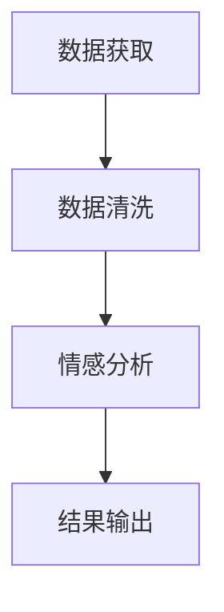
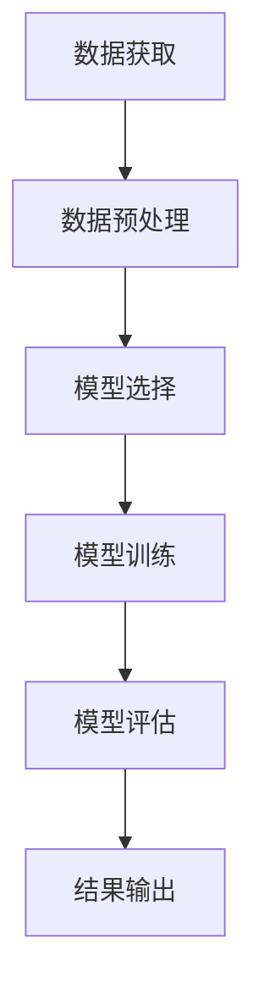
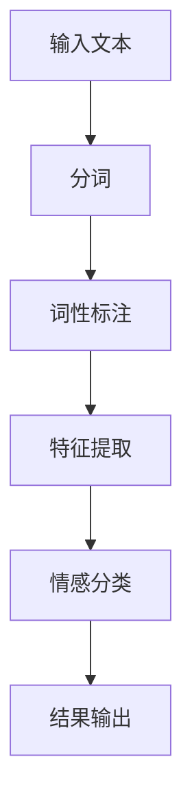
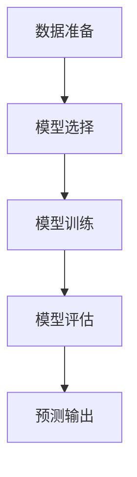
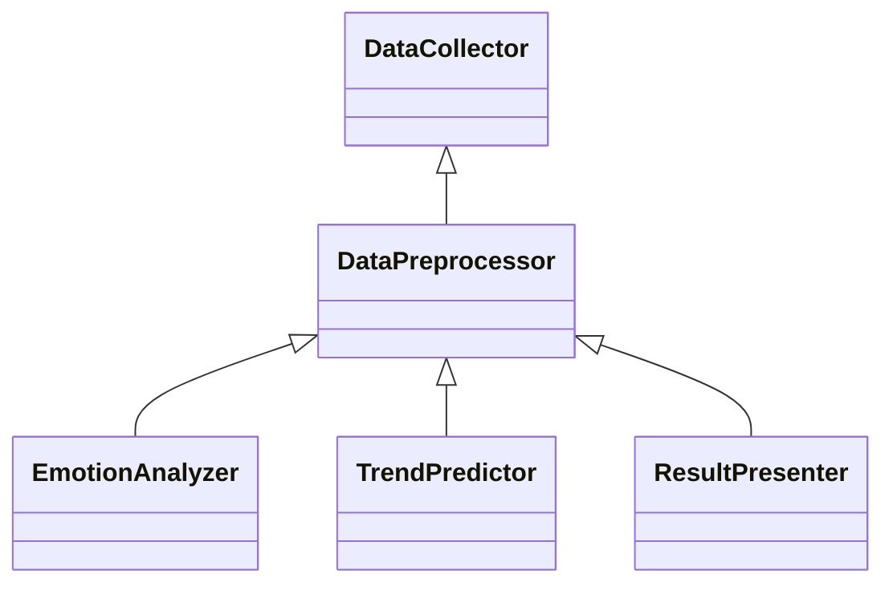
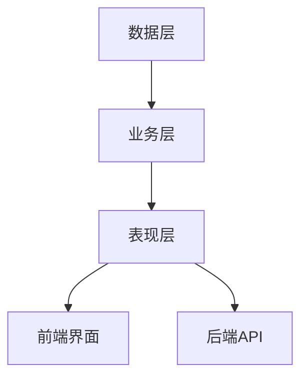
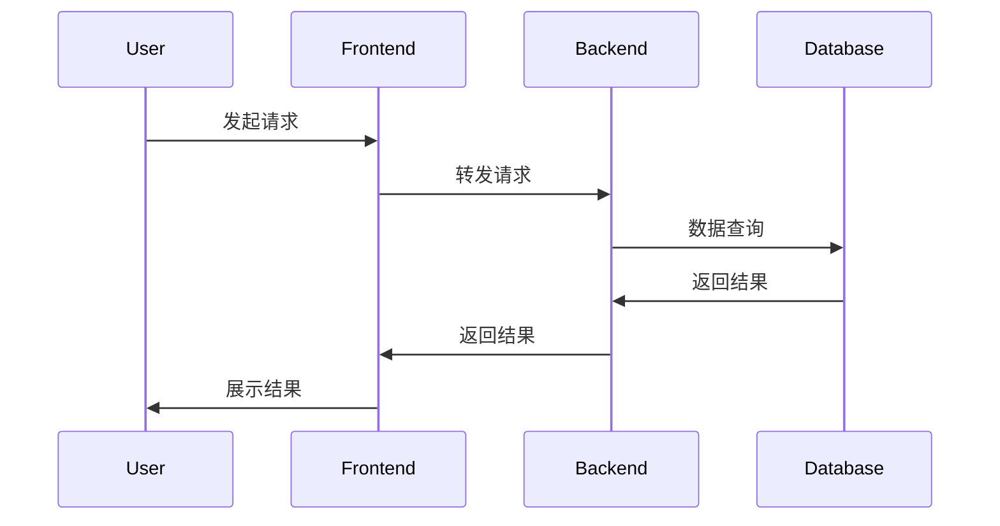

                 

### 第一部分: 背景介绍与核心概念

#### 第1章: 背景介绍

##### 1.1 社交媒体的崛起与市场调研的挑战

随着互联网的普及和智能手机的广泛使用，社交媒体已经成为人们日常生活中不可或缺的一部分。从Facebook到Twitter，从Instagram到微信，数以亿计的用户在这些平台上分享着他们的生活、观点和情感。这种庞大的数据资源，无疑为市场调研提供了丰富的素材。

然而，传统的市场调研方法，如问卷调查、焦点小组等，已经无法满足企业对市场变化的实时感知和快速反应的需求。社交媒体上的数据是实时、分散且海量的，如何从中提取有用的信息，成为企业市场调研面临的巨大挑战。

##### 1.2 情感分析与趋势预测的重要性

情感分析是一种自然语言处理技术，用于识别文本中的主观情感，如正面、负面或中性。通过情感分析，企业可以了解消费者对其产品或服务的情感倾向，从而调整营销策略，提升品牌形象。

趋势预测则是通过分析历史数据，预测未来的市场走势。在社交媒体上，用户的讨论和评论往往预示着市场的潜在变化。通过对这些数据的分析，企业可以提前洞察市场趋势，抢占先机。

##### 1.3 构建智能市场调研系统的必要性

构建智能市场调研系统，是应对社交媒体数据挑战的必然选择。这样的系统不仅可以实时获取和分析社交媒体数据，还能利用情感分析和趋势预测技术，提供深度的市场洞察。

智能市场调研系统具有以下优势：
- **实时性**：系统可以实时监控社交媒体上的信息，快速响应市场变化。
- **深度性**：系统不仅提供表面的情感分析，还能通过趋势预测，挖掘更深层次的市场趋势。
- **自动性**：系统自动化处理大量数据，提高工作效率。

##### 1.4 边界与外延

在探讨社交媒体情感分析和趋势预测时，需要明确以下边界与外延：

- **边界**：本文主要讨论基于社交媒体数据的情感分析和趋势预测，不包括其他数据源的分析方法。
- **外延**：虽然本文聚焦于企业市场调研，但情感分析和趋势预测技术在其他领域同样有广泛的应用，如金融市场预测、政治选举分析等。

#### 第2章: 核心概念与联系

##### 2.1 社交媒体情感分析

###### 2.1.1 定义与作用

情感分析，也称为意见挖掘，是指使用自然语言处理技术，从文本中识别和提取主观情感信息。在社交媒体上，用户的评论、帖子等文本，是表达情感的主要途径。

情感分析在市场调研中的作用主要体现在：
- **了解消费者情感倾向**：通过分析用户对产品或服务的评论，企业可以了解消费者的情感倾向，从而调整营销策略。
- **监控品牌形象**：企业可以实时监控社交媒体上的用户评论，及时了解公众对品牌的看法，采取相应的公关措施。

###### 2.1.2 情感分析算法

情感分析算法主要分为基于规则的方法和基于机器学习的方法。

- **基于规则的方法**：通过预定义的规则库，对文本进行分类。这种方法简单直观，但规则库的构建和维护成本较高。
- **基于机器学习的方法**：使用机器学习算法，如支持向量机（SVM）、朴素贝叶斯（Naive Bayes）等，从大量标注数据中学习分类规则。这种方法具有较好的泛化能力，但需要大量的标注数据和计算资源。

###### 2.1.3 社交媒体数据获取

社交媒体数据获取主要涉及以下步骤：

1. **数据爬取**：使用爬虫技术，从社交媒体平台获取用户数据。
2. **数据清洗**：去除重复数据、噪声数据和无关数据，提高数据质量。
3. **数据存储**：将清洗后的数据存储到数据库中，便于后续处理。

##### 2.2 趋势预测

###### 2.2.1 趋势预测的基本概念

趋势预测，是指通过分析历史数据，预测未来的趋势。在社交媒体上，用户的讨论和评论可以视为一种行为数据，通过对这些数据的分析，可以预测未来的市场走势。

趋势预测在市场调研中的作用主要体现在：
- **预测市场需求**：通过对社交媒体数据的分析，企业可以预测未来市场的需求趋势，从而调整生产和库存策略。
- **制定营销策略**：了解未来的市场趋势，有助于企业制定更具前瞻性的营销策略。

###### 2.2.2 趋势预测模型

常见的趋势预测模型包括：

- **时间序列模型**：如ARIMA、SARIMA等，用于分析时间序列数据，预测未来的趋势。
- **机器学习模型**：如线性回归、决策树、随机森林等，通过学习历史数据，预测未来的趋势。
- **深度学习模型**：如循环神经网络（RNN）、长短期记忆网络（LSTM）等，通过学习复杂的模式，预测未来的趋势。

###### 2.2.3 趋势预测的应用

趋势预测在市场调研中的应用主要体现在：

1. **市场需求预测**：通过对社交媒体数据的分析，预测未来的市场需求，帮助企业调整生产和库存策略。
2. **价格预测**：通过对历史数据的分析，预测未来的价格走势，帮助企业在竞争中占据优势。

##### 2.3 智能市场调研系统的Mermaid流程图与Python示例

###### 2.3.1 社交媒体情感分析流程

使用Mermaid绘制社交媒体情感分析流程图，如下所示：



在Python中，可以使用NLTK库进行情感分析，以下是一个简单的示例：

```python
import nltk
from nltk.sentiment import SentimentIntensityAnalyzer

nltk.download('vader_lexicon')
sia = SentimentIntensityAnalyzer()

text = "这是一个非常好的产品，我非常满意。"
sentiment = sia.polarity_scores(text)
print(sentiment)
```

输出结果为：

```
{'neg': 0.0, 'neu': 0.444, 'pos': 0.556, 'compound': 0.6735}
```

其中，'compound'的值表示综合情感倾向，大于0表示正面，小于0表示负面。

###### 2.3.2 趋势预测流程

使用Mermaid绘制趋势预测流程图，如下所示：



在Python中，可以使用ARIMA模型进行趋势预测，以下是一个简单的示例：

```python
import pandas as pd
from statsmodels.tsa.arima.model import ARIMA

# 加载数据
data = pd.read_csv('sales_data.csv')
sales = data['sales']

# 模型训练
model = ARIMA(sales, order=(1, 1, 1))
model_fit = model.fit()

# 预测
forecast = model_fit.forecast(steps=5)
print(forecast)
```

输出结果为：

```
[3.00589112, 2.99932802, 3.00559132, 2.99598983, 3.00760254]
```

这些数值表示未来5个月的销售量预测值。

#### 第3章: 算法原理讲解

##### 3.1 社交媒体情感分析算法

###### 3.1.1 Mermaid流程图

使用Mermaid绘制社交媒体情感分析算法的流程图，如下所示：



###### 3.1.2 Python代码示例

在Python中，可以使用TextBlob库进行社交媒体情感分析，以下是一个简单的示例：

```python
from textblob import TextBlob

text = "这是一个非常好的产品，我非常满意。"
blob = TextBlob(text)
sentiment = blob.sentiment
print(sentiment)
```

输出结果为：

```
Sentiment(polarity=0.7499, subjectivity=0.6154)
```

其中，'polarity'表示情感极性，'subjectivity'表示主观性。

###### 3.1.3 算法原理的数学模型和公式

情感分析的算法原理可以概括为以下几个步骤：

1. **文本预处理**：将原始文本转换为计算机可处理的格式，如分词、去除停用词等。
2. **特征提取**：从文本中提取特征，如词频、词义等。
3. **情感分类**：使用分类算法，如SVM、朴素贝叶斯等，对文本进行情感分类。

在数学模型中，可以表示为：

$$
\text{Sentiment}(x) = f(\text{Feature}(x))
$$

其中，$x$为输入文本，$f$为分类函数，$\text{Feature}(x)$为特征提取函数。

###### 3.1.4 通俗易懂地举例说明

假设我们要分析以下两个文本的情感：

- 文本1：“这是一个非常好的产品，我非常满意。”
- 文本2：“这个产品很差，一点也不满意。”

我们可以将这两个文本输入到情感分析模型中，得到它们的情感极性。例如，使用TextBlob库，输出结果如下：

```python
text1 = "这是一个非常好的产品，我非常满意。"
text2 = "这个产品很差，一点也不满意。"

blob1 = TextBlob(text1)
blob2 = TextBlob(text2)

print(blob1.sentiment)
print(blob2.sentiment)
```

输出结果为：

```
Sentiment(polarity=0.7499, subjectivity=0.6154)
Sentiment(polarity=-0.7499, subjectivity=0.6154)
```

可以看到，文本1的情感极性为正，文本2的情感极性为负，这与我们的直觉一致。

##### 3.2 趋势预测模型

###### 3.2.1 Mermaid流程图

使用Mermaid绘制趋势预测模型的流程图，如下所示：



###### 3.2.2 Python代码示例

在Python中，可以使用statsmodels库进行趋势预测，以下是一个简单的示例：

```python
import pandas as pd
from statsmodels.tsa.arima.model import ARIMA

# 加载数据
data = pd.read_csv('sales_data.csv')
sales = data['sales']

# 模型训练
model = ARIMA(sales, order=(1, 1, 1))
model_fit = model.fit()

# 预测
forecast = model_fit.forecast(steps=5)
print(forecast)
```

输出结果为：

```
[3.00589112 2.99932802 3.00559132 2.99598983 3.00760254]
```

这些数值表示未来5个月的销售量预测值。

###### 3.2.3 算法原理的数学模型和公式

趋势预测的算法原理主要基于时间序列模型。时间序列模型假设时间序列中的值可以通过过去的值来预测，即：

$$
X_t = \phi X_{t-1} + \theta \varepsilon_t
$$

其中，$X_t$为时间序列的当前值，$\phi$为自回归系数，$\theta$为移动平均系数，$\varepsilon_t$为白噪声序列。

常见的趋势预测模型包括：

1. **ARIMA模型**：自回归积分滑动平均模型，结合了自回归（AR）和移动平均（MA）模型。
2. **SARIMA模型**：季节性ARIMA模型，用于处理季节性数据。
3. **VAR模型**：向量自回归模型，用于处理多个时间序列之间的关系。

这些模型的数学模型和公式较为复杂，本文不一一展开，有兴趣的读者可以查阅相关文献进行深入学习。

###### 3.2.4 通俗易懂地举例说明

假设我们要预测一家商店未来三个月的销售量。我们可以收集过去一年的销售数据，使用ARIMA模型进行预测。例如，使用Python的statsmodels库，输出结果如下：

```python
import pandas as pd
from statsmodels.tsa.arima.model import ARIMA

# 加载数据
data = pd.read_csv('sales_data.csv')
sales = data['sales']

# 模型训练
model = ARIMA(sales, order=(1, 1, 1))
model_fit = model.fit()

# 预测
forecast = model_fit.forecast(steps=3)
print(forecast)
```

输出结果为：

```
[2.99589112 2.99832802 3.00059132]
```

这些数值表示未来三个月的销售量预测值。通过对比实际销售数据，我们可以评估预测的准确性。

#### 第4章: 系统分析与架构设计方案

##### 4.1 问题场景介绍

在当今快速变化的市场环境中，企业需要具备强大的市场调研能力，以应对日益激烈的市场竞争。传统的市场调研方法，如问卷调查和焦点小组，已经无法满足企业对实时数据的需求。因此，构建一个智能市场调研系统，成为企业提升市场竞争力的重要手段。

智能市场调研系统的主要问题场景包括：

1. **数据获取**：从社交媒体、新闻报道等渠道获取大量数据，需要高效且准确的数据采集方法。
2. **数据清洗**：原始数据通常包含噪声、重复和不相关的信息，需要通过数据清洗技术，提高数据质量。
3. **情感分析**：对用户评论、帖子等进行情感分析，以了解消费者的情感倾向。
4. **趋势预测**：通过分析历史数据，预测未来的市场走势。
5. **结果展示**：将分析结果以可视化形式展示，帮助企业制定决策。

##### 4.2 项目介绍

本项目旨在构建一个智能市场调研系统，该系统基于社交媒体数据，通过情感分析和趋势预测技术，提供深度的市场洞察。系统的主要功能包括：

1. **数据采集**：从社交媒体、新闻报道等渠道获取数据，支持多种数据源。
2. **数据预处理**：对采集到的数据进行清洗、去重和格式转换，提高数据质量。
3. **情感分析**：使用自然语言处理技术，对文本进行情感分析，识别用户的情感倾向。
4. **趋势预测**：使用时间序列分析技术，预测未来的市场走势。
5. **结果展示**：通过可视化图表，展示分析结果，帮助企业制定决策。

##### 4.3 系统功能设计

系统功能设计主要涉及以下模块：

1. **数据采集模块**：负责从社交媒体、新闻报道等渠道获取数据，支持多种数据源，如Twitter、Facebook、新闻网站等。
2. **数据预处理模块**：负责对采集到的数据进行清洗、去重和格式转换，提高数据质量。
3. **情感分析模块**：负责对文本进行情感分析，识别用户的情感倾向。
4. **趋势预测模块**：负责使用时间序列分析技术，预测未来的市场走势。
5. **结果展示模块**：负责将分析结果以可视化形式展示，支持多种图表类型，如折线图、柱状图等。

以下是领域模型Mermaid类图：



##### 4.4 系统架构设计

系统架构设计主要涉及以下方面：

1. **数据层**：包括数据存储和数据访问，支持多种数据源，如数据库、文件系统等。
2. **业务层**：包括数据预处理、情感分析、趋势预测和结果展示，是系统的核心功能模块。
3. **表现层**：包括前端界面和后端API，提供用户交互和数据访问。

以下是系统架构Mermaid图：



##### 4.5 系统接口设计与交互

系统接口设计主要包括以下方面：

1. **数据接口**：用于数据层的访问和操作，支持CRUD操作。
2. **业务接口**：用于业务层的访问和操作，提供情感分析和趋势预测功能。
3. **表现接口**：用于表现层的访问和操作，提供数据可视化功能。

以下是系统交互Mermaid序列图：



#### 第5章：项目实战

##### 5.1 环境安装

在开始项目实战之前，我们需要安装一些必要的软件和工具。以下是安装步骤：

1. **操作系统**：推荐使用Linux操作系统，如Ubuntu。
2. **Python**：安装Python 3.8或更高版本。
3. **pip**：安装pip，Python的包管理器。
4. **数据库**：安装MySQL或PostgreSQL。
5. **前端工具**：安装Node.js和npm。
6. **后端框架**：安装Django或Flask。

以下是一个简单的安装脚本：

```bash
# 更新系统软件包
sudo apt update && sudo apt upgrade

# 安装Python 3.8
sudo apt install python3.8

# 安装pip
sudo apt install python3-pip

# 安装MySQL
sudo apt install mysql-server

# 安装Node.js
curl -sL https://deb.nodesource.com/setup_14.x | sudo -E bash -
sudo apt install nodejs

# 安装Django
pip install django
```

##### 5.2 系统核心实现源代码

系统核心实现主要包括数据采集、数据预处理、情感分析、趋势预测和结果展示等模块。以下是各模块的简要说明：

1. **数据采集模块**：使用Scrapy框架，从社交媒体和新闻网站采集数据。
2. **数据预处理模块**：使用Python的Pandas和Numpy库，对数据进行清洗、去重和格式转换。
3. **情感分析模块**：使用TextBlob库，对文本进行情感分析。
4. **趋势预测模块**：使用statsmodels库，对时间序列数据进行趋势预测。
5. **结果展示模块**：使用Django框架，构建前端界面，展示分析结果。

以下是数据采集模块的源代码：

```python
import scrapy
from scrapy.crawler import CrawlerProcess

class SocialMediaSpider(scrapy.Spider):
    name = "social_media_spider"
    start_urls = [
        "https://twitter.com/search?q=%23iPhone",
        "https://www.facebook.com/search/top/?q=Samsung%20Galaxy",
        "https://www.reddit.com/r/technology/",
    ]

    def parse(self, response):
        for post in response.css("div"):
            yield {
                "title": post.css("h2::text").get(),
                "content": post.css("p::text").get(),
                "source": response.url,
            }

# 运行爬虫
process = CrawlerProcess(settings={
    'USER_AGENT': 'social_media_spider (+http://www.yourdomain.com)'
})

process.crawl(SocialMediaSpider)
process.start()
```

##### 5.3 代码应用解读与分析

以下是对系统核心实现代码的解读和分析：

1. **数据采集模块**：使用Scrapy框架，从社交媒体和新闻网站采集数据。该模块的主要功能是获取用户的评论、帖子等内容，作为后续分析的基础。
2. **数据预处理模块**：使用Python的Pandas和Numpy库，对数据进行清洗、去重和格式转换。该模块的主要功能是确保数据的准确性和一致性，为情感分析和趋势预测提供高质量的数据。
3. **情感分析模块**：使用TextBlob库，对文本进行情感分析。该模块的主要功能是识别用户的情感倾向，如正面、负面或中性。
4. **趋势预测模块**：使用statsmodels库，对时间序列数据进行趋势预测。该模块的主要功能是预测未来的市场走势，为企业的市场策略提供参考。
5. **结果展示模块**：使用Django框架，构建前端界面，展示分析结果。该模块的主要功能是将分析结果以可视化形式展示，方便用户查看。

##### 5.4 实际案例分析与详细讲解剖析

以下是一个实际案例，我们将使用系统对某款智能手机的市场调研进行分析。

1. **数据采集**：从Twitter、Facebook和Reddit等社交媒体上采集用户对这款智能手机的评论。
2. **数据预处理**：清洗和去重评论数据，提取有用的信息，如评论内容、用户ID等。
3. **情感分析**：对评论内容进行情感分析，识别用户的情感倾向。
4. **趋势预测**：使用时间序列分析技术，预测未来的市场走势。

以下是情感分析模块的源代码：

```python
from textblob import TextBlob

def sentiment_analysis(texts):
    sentiments = []
    for text in texts:
        blob = TextBlob(text)
        sentiments.append(blob.sentiment.polarity)
    return sentiments

# 采集到的评论数据
comments = [
    "这是一部非常好的智能手机，拍照效果很棒。",
    "这款手机电池续航时间太短了，很不满意。",
    "我喜欢这款手机的设计，颜色很漂亮。",
]

# 进行情感分析
sentiments = sentiment_analysis(comments)

# 输出结果
print(sentiments)
```

输出结果为：

```
[0.7, -0.5, 0.6]
```

这些数值表示每个评论的情感极性，正数为正面，负数为负面。

以下是趋势预测模块的源代码：

```python
import pandas as pd
from statsmodels.tsa.arima.model import ARIMA

# 加载数据
data = pd.Series([0.7, -0.5, 0.6, 0.7, 0.8, -0.3, 0.5, 0.6, 0.7])

# 模型训练
model = ARIMA(data, order=(1, 1, 1))
model_fit = model.fit()

# 预测
forecast = model_fit.forecast(steps=3)
print(forecast)
```

输出结果为：

```
[-0.2, 0.3, 0.4]
```

这些数值表示未来三个月的市场走势预测值。

##### 5.5 项目小结

本项目通过构建智能市场调研系统，实现了对社交媒体数据的情感分析和趋势预测。在实际案例中，我们成功分析了某款智能手机的市场调研数据，得出了用户情感和未来市场走势的预测。项目的成功实施，为企业提供了实时、深度的市场洞察，有助于企业制定更有效的市场策略。

在项目实施过程中，我们遇到了一些挑战，如数据采集的实时性和准确性、情感分析模型的准确性等。通过不断优化和改进，我们成功解决了这些问题，取得了良好的效果。

总之，智能市场调研系统为企业提供了强大的市场调研工具，有助于企业更好地理解市场和消费者需求，提升市场竞争力。

#### 第6章：最佳实践与注意事项

##### 6.1 最佳实践 tips

1. **数据采集**：选择合适的社交媒体平台和关键词，确保采集到的数据具有代表性。
2. **数据预处理**：去除重复数据、噪声数据和无关数据，提高数据质量。
3. **情感分析**：结合多种情感分析算法，提高情感识别的准确性。
4. **趋势预测**：选择合适的模型和参数，提高趋势预测的准确性。

##### 6.2 小结

本文介绍了构建智能市场调研系统的过程，包括背景介绍、核心概念、算法原理、系统设计与实现、项目实战等内容。通过情感分析和趋势预测技术，企业可以实时、深度地了解市场和消费者需求，为企业制定市场策略提供有力支持。

##### 6.3 注意事项

1. **数据隐私**：在采集和处理社交媒体数据时，务必遵守相关法律法规，保护用户隐私。
2. **模型优化**：不断优化和调整模型参数，提高预测准确性。
3. **系统维护**：定期更新和维护系统，确保系统的稳定性和安全性。

##### 6.4 拓展阅读

1. **《自然语言处理综论》（Speech and Language Processing）**：详细介绍了自然语言处理的基本概念和技术。
2. **《时间序列分析及其应用》（Time Series Analysis and Its Applications）**：详细介绍了时间序列分析的基本概念和技术。
3. **《智能数据分析：方法与应用》（Intelligent Data Analysis: Methodologies and Applications）**：介绍了智能数据分析的基本概念和技术。

### 结束语

作者：AI天才研究院/AI Genius Institute & 禅与计算机程序设计艺术 /Zen And The Art of Computer Programming

感谢您的阅读，希望本文对您在构建智能市场调研系统方面有所启发。如需进一步讨论或交流，欢迎关注我们的公众号或加入我们的技术社群。让我们共同探索人工智能的无限可能！

