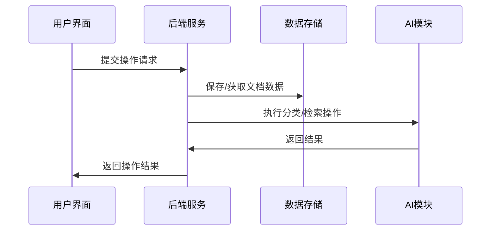
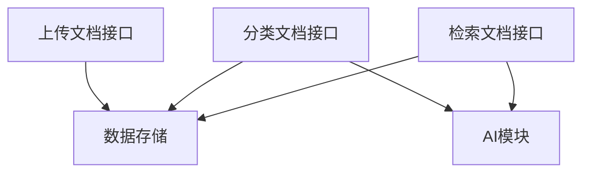
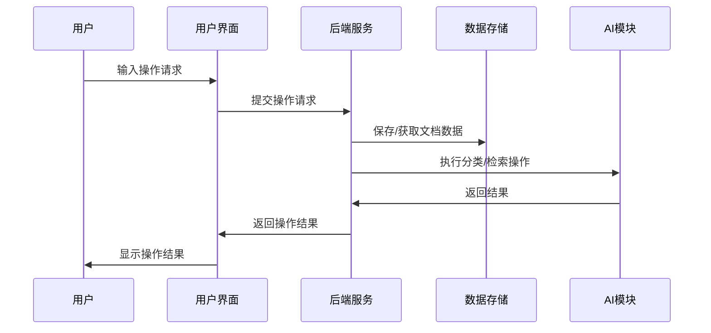

                 

# 构建智能企业文档管理系统：AI辅助分类与检索

## 关键词
- 智能企业文档管理系统
- AI辅助分类与检索
- 文档管理
- 企业信息化
- 人工智能技术

## 摘要
本文旨在探讨如何构建一个智能企业文档管理系统，并利用人工智能技术来辅助文档的分类与检索。文章首先介绍了文档管理系统在企业信息化中的重要性，然后详细阐述了AI在文档管理中的作用。接下来，文章通过逐步分析，提出了设计AI辅助文档管理系统的核心步骤，包括数据准备、算法选择与实现等。同时，本文通过具体案例展示了AI技术在文档分类与检索中的实际应用，最后对项目进行了小结，并提出了未来发展的方向。

----------------------------------------------------------------

## 引言与背景

### 文档管理系统的重要性

在信息时代，企业所面临的文档数量呈现出爆炸式增长，从简单的文本文档到复杂的多媒体文档，这些文档不仅包含了企业日常运营的信息，也记录了企业的知识资产。因此，如何有效地管理和利用这些文档，成为企业信息化建设中的一个重要课题。

文档管理系统（Document Management System，简称DMS）作为一种重要的企业级应用，旨在帮助企业高效地创建、存储、管理、共享和检索文档。通过文档管理系统，企业可以实现文档的电子化、规范化、安全化和智能化管理，从而提高工作效率、降低管理成本、保障数据安全。

### AI在文档管理中的作用

随着人工智能技术的迅速发展，AI开始广泛应用于各个领域，包括文档管理。人工智能在文档管理中的应用主要体现在以下几个方面：

1. **文档分类**：利用AI技术，可以根据文档的内容、格式、创建时间等特征，对大量文档进行自动分类，从而提高文档检索的效率和准确性。

2. **文档检索**：通过自然语言处理、文本挖掘等技术，AI能够对文档内容进行深入分析，从而实现更加智能、准确的文档检索。

3. **文档分析**：利用机器学习、深度学习等技术，AI可以对文档中的关键信息进行提取、分析和总结，为企业提供决策支持。

4. **文档安全**：通过AI技术，可以实现对文档的自动加密、权限管理、防篡改等安全措施，保障文档的安全性和隐私性。

本文将围绕如何利用AI技术构建智能企业文档管理系统，特别是文档的分类与检索，进行深入探讨。

----------------------------------------------------------------

## 核心概念

### 文档管理系统的定义与功能

文档管理系统（DMS）是一种用于管理电子文档的软件系统，它通过集成电子文档的创建、存储、管理、共享和检索等功能，帮助企业实现文档的电子化、规范化和智能化管理。DMS的基本功能包括：

- **文档创建**：支持各种格式的文档创建，如文本文件、PPT、PDF、图片等。
- **文档存储**：提供安全、可靠的文档存储解决方案，支持文档的集中存储和分布式存储。
- **文档管理**：实现对文档的元数据管理、版本管理、权限管理等功能，确保文档的规范化和安全性。
- **文档共享**：支持文档的在线共享和协作，提高工作效率。
- **文档检索**：通过关键词搜索、全文检索等方式，快速定位所需文档。

### AI在文档管理中的应用

人工智能（AI）在文档管理中的应用主要体现在以下几个方面：

1. **文档分类**：利用机器学习算法，对大量文档进行自动分类，提高文档检索的效率和准确性。例如，可以按照文档的主题、类型、创建时间等特征进行分类。

2. **文档检索**：通过自然语言处理（NLP）和文本挖掘技术，对文档内容进行深入分析，实现更加智能、准确的文档检索。例如，可以识别文档中的关键词、句子和段落，甚至提取文档的主要观点。

3. **文档分析**：利用机器学习、深度学习等技术，对文档中的关键信息进行提取、分析和总结，为企业提供决策支持。例如，可以分析市场报告、财务报表等文档，提取关键指标和趋势。

4. **文档安全**：通过AI技术，实现对文档的自动加密、权限管理、防篡改等安全措施，保障文档的安全性和隐私性。例如，可以检测文档的异常行为，如未经授权的访问和修改。

### 分类与检索的概念

- **分类**：将文档按照一定的标准进行归类，以便于管理和检索。分类的标准可以是文档的内容、格式、创建时间等。

- **检索**：根据用户输入的关键词或条件，从大量文档中快速找出符合条件的文档。检索可以分为关键词搜索、全文检索、高级检索等。

在构建智能企业文档管理系统时，分类与检索是两个关键环节。分类有助于提高文档检索的效率，而检索则直接影响用户的使用体验。通过引入AI技术，可以实现文档分类与检索的智能化，从而提升系统的整体性能。

----------------------------------------------------------------

## AI-Enhanced Document Management

### AI在文档管理中的优势

人工智能技术在文档管理中的应用，带来了显著的效率提升和用户体验改善。以下是AI在文档管理中的几个主要优势：

1. **自动化处理**：AI技术能够自动化处理大量文档，如自动分类、自动命名、自动标签等。这大大减轻了人工负担，提高了工作效率。

2. **精准检索**：通过自然语言处理（NLP）和文本挖掘技术，AI能够深入分析文档内容，实现更加精准、快速的检索。相比传统的关键词搜索，AI可以识别文档中的实体、关系和语义，从而提供更加准确的检索结果。

3. **智能分析**：AI技术可以对文档中的关键信息进行提取、分析和总结，为企业提供深入的洞察和决策支持。例如，可以分析市场报告、财务报表等文档，提取关键指标和趋势。

4. **安全保障**：AI技术可以实现对文档的自动加密、权限管理和防篡改等安全措施，保障文档的安全性和隐私性。例如，通过行为分析技术，可以检测文档的异常行为，如未经授权的访问和修改。

### 常见AI技术在文档管理中的应用

1. **自然语言处理（NLP）**：NLP是AI的一个重要分支，旨在让计算机理解和处理人类语言。在文档管理中，NLP技术可以用于文档分类、检索和自动摘要等。例如，通过词性标注、句法分析和语义理解，NLP技术可以识别文档中的关键词、句子和段落，从而实现精准的分类和检索。

2. **机器学习（ML）**：机器学习是一种通过数据训练模型，使其能够对未知数据进行预测或分类的技术。在文档管理中，机器学习技术可以用于自动化文档分类、异常检测等。例如，通过训练分类模型，可以自动将新文档分类到相应的类别中。

3. **深度学习（DL）**：深度学习是机器学习的一个子领域，通过神经网络模型，对大量数据进行自动特征提取和模式识别。在文档管理中，深度学习技术可以用于文本分类、情感分析等。例如，通过训练深度神经网络，可以自动提取文档中的关键特征，从而实现更加精准的分类和检索。

4. **计算机视觉（CV）**：计算机视觉是一种使计算机能够像人类一样感知和理解视觉信息的技术。在文档管理中，计算机视觉技术可以用于文档识别、图像分类等。例如，通过训练卷积神经网络，可以自动识别文档中的文字和图像，从而实现文档的自动化处理。

### AI在文档管理中的实际效益

1. **提高工作效率**：通过自动化处理和精准检索，AI技术可以大大提高文档管理的效率，减少人工工作量，降低运营成本。

2. **优化用户体验**：智能化的文档分类和检索，可以提供更加便捷和高效的服务，提高用户满意度。

3. **增强数据安全**：通过AI技术，可以实现对文档的自动加密、权限管理和防篡改等安全措施，保障文档的安全性和隐私性。

4. **支持业务决策**：通过AI技术，可以对文档中的关键信息进行提取、分析和总结，为企业提供深入的洞察和决策支持，从而提升企业的竞争力。

综上所述，AI技术在文档管理中具有广泛的应用前景和显著的实际效益。通过引入AI技术，企业可以实现文档的智能化管理，从而提升整体运营效率和竞争力。

----------------------------------------------------------------

## 设计AI辅助文档管理系统

### 设计步骤

设计一个AI辅助的文档管理系统需要一系列的步骤，以下是一个基本的设计流程：

1. **需求分析**：了解企业的具体需求，包括文档类型、规模、管理要求等。这有助于确定系统的功能需求和性能指标。

2. **系统架构设计**：根据需求分析结果，设计系统的整体架构。包括前端界面、后端服务、数据存储和AI模块等。

3. **数据准备**：准备用于AI模型训练的数据集，包括文档内容、元数据等。数据质量直接影响AI模型的性能，因此需要确保数据的质量和多样性。

4. **算法选择**：选择适合的AI算法，包括分类算法、检索算法等。常用的算法有朴素贝叶斯、决策树、支持向量机、深度学习模型等。

5. **模型训练与优化**：使用准备好的数据集对AI模型进行训练和优化。这一过程可能需要多次迭代，以获得最佳性能。

6. **系统集成**：将AI模型集成到文档管理系统中，实现文档的自动化分类和检索。

7. **测试与部署**：对系统进行全面的测试，确保其功能完备、性能稳定。然后进行部署，投入实际使用。

### 数据准备与数据质量

数据准备是AI模型训练的关键步骤，其质量直接影响模型的效果。以下是一些确保数据质量的方法：

1. **数据清洗**：去除重复数据、缺失数据和错误数据，确保数据的一致性和准确性。

2. **数据标注**：对数据集进行人工标注，为模型提供训练所需的标签。标注过程需要确保一致性，减少误差。

3. **数据增强**：通过数据增强技术，如数据转换、数据合成等，增加数据集的多样性，提高模型的鲁棒性。

4. **数据分片**：将数据集分为训练集、验证集和测试集，用于模型训练、评估和测试。

### 选择合适的AI算法和工具

选择合适的AI算法和工具是构建高效AI辅助文档管理系统的关键。以下是一些常用的算法和工具：

1. **分类算法**：
   - **朴素贝叶斯**：适用于文本分类任务，简单且效果良好。
   - **决策树**：易于理解和解释，适合分类任务。
   - **支持向量机（SVM）**：适用于高维特征空间，效果稳定。
   - **随机森林**：结合了决策树和贝叶斯模型的优点，性能较好。

2. **检索算法**：
   - **向量空间模型**：通过将文档和查询转换为向量，计算它们之间的相似度，实现文档检索。
   - **TF-IDF**：计算文档中词的重要度，用于检索和排序。
   - **深度学习模型**：如卷积神经网络（CNN）和循环神经网络（RNN），适用于复杂的文本处理任务。

3. **工具**：
   - **Python**：强大的编程语言，支持多种AI库和框架。
   - **TensorFlow**：开源的深度学习框架，适用于构建和训练复杂的AI模型。
   - **Scikit-learn**：开源的机器学习库，提供多种分类和检索算法。

### 模型训练与优化

模型训练与优化是AI模型开发的重要环节。以下是一些关键步骤：

1. **超参数调整**：调整模型的超参数，如学习率、正则化参数等，以优化模型性能。

2. **交叉验证**：使用交叉验证方法，评估模型在不同数据集上的性能，避免过拟合。

3. **模型融合**：结合多个模型的预测结果，提高整体性能。

4. **持续优化**：通过不断收集用户反馈和新的数据，对模型进行持续优化。

### AI辅助文档管理系统架构设计

一个典型的AI辅助文档管理系统架构包括以下几个部分：

1. **前端**：用户界面，提供文档上传、分类、检索等功能。

2. **后端**：包括AI模块、文档存储和数据库等，负责处理用户请求、数据存储和模型推理。

3. **数据存储**：使用分布式数据库或云存储，确保文档的安全存储和快速访问。

4. **AI模块**：包括分类和检索模型，使用机器学习和深度学习技术，实现文档的自动化分类和检索。

5. **接口**：提供RESTful API或GraphQL接口，方便与其他系统进行集成。

通过以上设计步骤和架构设计，可以构建一个高效、智能的文档管理系统，帮助企业更好地管理和利用其文档资源。

----------------------------------------------------------------

## 实现文档分类

### 分类过程

文档分类是文档管理系统中的一个关键环节，旨在将大量文档按照一定的标准进行归类。实现文档分类的过程可以分为以下几个步骤：

1. **数据预处理**：对文档内容进行清洗、分词、去停用词等预处理操作，将文本转换为适合分类的特征表示。

2. **特征提取**：从预处理后的文本中提取特征，常用的方法有词袋模型、TF-IDF、Word2Vec等。

3. **模型选择**：选择合适的分类算法，如朴素贝叶斯、决策树、支持向量机（SVM）、随机森林等。

4. **模型训练**：使用准备好的训练数据集，对分类模型进行训练。

5. **模型评估**：使用验证数据集评估模型的分类效果，常见的评估指标有准确率、召回率、F1值等。

6. **模型部署**：将训练好的模型部署到生产环境，实现文档的自动化分类。

### 不同分类算法的优缺点及应用场景

1. **朴素贝叶斯（Naive Bayes）**：
   - **优点**：简单、易于实现，对缺失数据鲁棒性强。
   - **缺点**：假设特征之间相互独立，可能导致低准确率。
   - **应用场景**：适用于文本分类、垃圾邮件过滤等。

2. **决策树（Decision Tree）**：
   - **优点**：易于理解、解释性高，适用于多分类问题。
   - **缺点**：容易过拟合，对噪声敏感。
   - **应用场景**：适用于金融风险评估、客户分类等。

3. **支持向量机（Support Vector Machine, SVM）**：
   - **优点**：在高维空间中效果良好，对小样本数据鲁棒性强。
   - **缺点**：计算复杂度高，训练时间较长。
   - **应用场景**：适用于文本分类、图像分类等。

4. **随机森林（Random Forest）**：
   - **优点**：结合了决策树和贝叶斯模型的优点，预测准确率高，泛化能力强。
   - **缺点**：模型复杂度高，对计算资源要求较高。
   - **应用场景**：适用于大规模数据分类、预测等。

### 实践案例

以下是一个简单的文档分类案例，使用Python和scikit-learn库实现：

```python
from sklearn.datasets import fetch_20newsgroups
from sklearn.feature_extraction.text import TfidfVectorizer
from sklearn.naive_bayes import MultinomialNB
from sklearn.pipeline import make_pipeline

# 加载数据集
newsgroups = fetch_20newsgroups(subset='all')

# 创建TF-IDF向量器
vectorizer = TfidfVectorizer(stop_words='english')

# 创建朴素贝叶斯分类器
clf = MultinomialNB()

# 创建管道
pipeline = make_pipeline(vectorizer, clf)

# 训练模型
pipeline.fit(newsgroups.data, newsgroups.target)

# 测试模型
print("测试准确率：", pipeline.score(newsgroups.data, newsgroups.target))
```

在这个案例中，我们使用20个新闻类别数据集，通过TF-IDF向量器将文本转换为向量，然后使用朴素贝叶斯分类器进行分类。测试结果表明，朴素贝叶斯分类器在文本分类任务中具有较好的性能。

通过以上步骤和案例，我们可以看到文档分类的实现方法和技术细节。在实际应用中，可以根据具体需求选择合适的算法和工具，实现高效的文档分类。

----------------------------------------------------------------

## 实现文档检索

### 检索过程

文档检索是文档管理系统中的另一个核心功能，旨在根据用户输入的关键词或查询，从大量的文档中快速、准确地找到相关的文档。实现文档检索的过程可以分为以下几个步骤：

1. **查询预处理**：对用户输入的查询进行预处理，包括去停用词、词干提取、同义词替换等，以优化查询质量。

2. **文档预处理**：对文档内容进行清洗、分词、去停用词等预处理操作，将文本转换为适合检索的特征表示。

3. **特征提取**：从预处理后的文本中提取特征，常用的方法有词袋模型、TF-IDF、Word2Vec等。

4. **相似度计算**：计算查询和文档之间的相似度，常用的方法有向量空间模型、余弦相似度、Jaccard相似度等。

5. **结果排序**：根据相似度对检索结果进行排序，以便用户快速找到最相关的文档。

6. **结果展示**：将排序后的检索结果展示给用户，包括文档标题、摘要、关键词等。

### 不同检索算法的优缺点及应用场景

1. **向量空间模型（Vector Space Model, VSM）**：
   - **优点**：简单易懂，计算高效。
   - **缺点**：对稀疏数据敏感，可能无法充分利用语义信息。
   - **应用场景**：适用于基于关键词的文本检索。

2. **TF-IDF（Term Frequency-Inverse Document Frequency）**：
   - **优点**：能够有效地反映词的重要度，对稀疏数据有较好的处理能力。
   - **缺点**：不考虑词的语义关系，可能影响检索效果。
   - **应用场景**：适用于基于关键词的文本检索。

3. **深度学习模型**：
   - **优点**：能够捕捉复杂的语义信息，提高检索效果。
   - **缺点**：计算复杂度高，需要大量训练数据。
   - **应用场景**：适用于基于语义的文本检索。

4. **基于图的方法**：
   - **优点**：能够充分利用文档之间的关联关系，提高检索效果。
   - **缺点**：计算复杂度高，需要对图结构进行有效表示。
   - **应用场景**：适用于知识图谱和文本检索。

### 实践案例

以下是一个简单的文档检索案例，使用Python和ELK（Elasticsearch、Logstash、Kibana）框架实现：

```python
from elasticsearch import Elasticsearch

# 创建Elasticsearch客户端
es = Elasticsearch("http://localhost:9200")

# 创建索引
es.indices.create(index="documents", 
                  body={
                      "settings": {
                          "number_of_shards": 1,
                          "number_of_replicas": 0
                      },
                      "mappings": {
                          "properties": {
                              "title": {"type": "text"},
                              "content": {"type": "text"}
                          }
                      }
                  })

# 添加文档
doc1 = {
    "title": "人工智能概述",
    "content": "人工智能是一种模拟人类智能的计算机技术，包括机器学习、自然语言处理等。"
}
doc2 = {
    "title": "深度学习应用",
    "content": "深度学习是人工智能的一种重要分支，广泛应用于图像识别、语音识别等领域。"
}
es.index(index="documents", id=1, document=doc1)
es.index(index="documents", id=2, document=doc2)

# 检索文档
query = "人工智能"
response = es.search(index="documents", body={
    "query": {
        "multi_match": {
            "query": query,
            "fields": ["title", "content"]
        }
    }
})

# 打印检索结果
for hit in response['hits']['hits']:
    print(hit['_source']['title'])

```

在这个案例中，我们使用Elasticsearch作为文档检索引擎，创建了一个包含文档标题和内容的索引，并添加了两个示例文档。通过执行多字段匹配查询，我们能够快速检索到与查询关键词相关的文档。

通过以上步骤和案例，我们可以看到文档检索的实现方法和技术细节。在实际应用中，可以根据具体需求选择合适的算法和工具，实现高效的文档检索。

----------------------------------------------------------------

## 系统分析与架构设计

### 问题场景介绍

在当前企业信息化进程中，文档管理已经成为企业日常运营的重要组成部分。随着文档数量的不断增长，传统的手工管理和简单电子化手段已经无法满足企业对文档的高效管理和利用需求。因此，构建一个智能企业文档管理系统显得尤为迫切。

### 项目介绍

本项目旨在设计并实现一个基于人工智能技术的智能企业文档管理系统，该系统具备自动化分类和智能检索功能，旨在提高文档管理效率、优化用户体验、保障文档安全。

### 系统功能设计（领域模型）

以下是一个简化的领域模型，用于描述系统的主要功能模块：

```mermaid
classDiagram
    Document -> Document分类: 分类
    Document -> Document检索: 检索
    Document分类 -> 分类算法: 使用
    Document检索 -> 检索算法: 使用
    Document存储 -> 数据库: 存储
    用户界面 -> 文档管理: 操作
    用户界面 -> 分类检索: 操作

    class Document {
        -ID: 标识
        -Title: 标题
        -Content: 内容
        -Category: 类别
        -Timestamp: 时间戳
    }

    class Document分类 {
        -Algorithm: 算法
    }

    class Document检索 {
        -Algorithm: 算法
    }

    class Document存储 {
        -Database: 数据库
    }

    class 用户界面 {
    }

    class 分类算法 {
        -Name: 名称
    }

    class 检索算法 {
        -Name: 名称
    }
```

在这个模型中，Document类表示文档的基本信息，包括ID、标题、内容、类别和时间戳等。Document分类和Document检索类分别表示分类和检索的功能模块，它们使用不同的分类和检索算法。Document存储类表示文档的存储模块，使用数据库进行存储。用户界面类表示系统的前端模块，用于提供用户操作接口。

### 系统架构设计

系统架构设计是确保智能企业文档管理系统高效、稳定运行的关键。以下是一个简化的系统架构设计，包括前端界面、后端服务、数据存储和AI模块：



在这个架构设计中，用户界面负责与用户交互，接收用户操作请求，如文档上传、分类、检索等。后端服务负责处理这些请求，包括与数据存储模块的交互、调用AI模块进行分类和检索等操作。数据存储模块负责文档的存储和管理。AI模块则负责实现文档的分类和检索算法。

### 系统接口设计

系统接口设计是确保系统各模块之间能够顺畅交互的关键。以下是一个简化的接口设计，包括RESTful API接口：



在这个接口设计中，API_Upload接口用于上传文档，API_Categorize接口用于分类文档，API_Retrieve接口用于检索文档。这些接口分别与数据存储模块和AI模块进行交互，实现文档的存储、分类和检索。

### 系统交互设计

系统交互设计是确保系统在实际运行过程中能够满足用户需求的关键。以下是一个简化的系统交互序列图：



在这个交互设计中，用户通过用户界面输入操作请求，如上传文档、分类文档或检索文档。用户界面将这些请求提交给后端服务，后端服务与数据存储模块和AI模块进行交互，完成相应的操作，并将结果返回给用户界面，最终显示给用户。

通过以上系统分析和架构设计，我们可以构建一个高效、智能的文档管理系统，帮助企业更好地管理和利用其文档资源。

----------------------------------------------------------------

## 项目实战

### 环境安装

在开始项目之前，我们需要安装必要的软件和工具。以下是安装步骤：

1. **Python环境**：确保已安装Python 3.8或更高版本。

2. **Elasticsearch**：下载并安装Elasticsearch，启动服务。

   - 下载地址：https://www.elastic.co/downloads/elasticsearch
   - 启动命令：`./bin/elasticsearch`

3. **Kibana**：下载并安装Kibana，启动服务。

   - 下载地址：https://www.elastic.co/downloads/kibana
   - 启动命令：`./bin/kibana`

4. **scikit-learn**：安装scikit-learn库。

   ```bash
   pip install scikit-learn
   ```

5. **numpy**：安装numpy库。

   ```bash
   pip install numpy
   ```

### 系统核心实现源代码

以下是系统核心实现的部分源代码，包括文档分类和检索。

**文档分类代码**：

```python
from sklearn.datasets import fetch_20newsgroups
from sklearn.feature_extraction.text import TfidfVectorizer
from sklearn.naive_bayes import MultinomialNB
from sklearn.pipeline import make_pipeline

# 加载数据集
newsgroups = fetch_20newsgroups(subset='all')

# 创建TF-IDF向量器
vectorizer = TfidfVectorizer(stop_words='english')

# 创建朴素贝叶斯分类器
clf = MultinomialNB()

# 创建管道
pipeline = make_pipeline(vectorizer, clf)

# 训练模型
pipeline.fit(newsgroups.data, newsgroups.target)

# 测试模型
print("测试准确率：", pipeline.score(newsgroups.data, newsgroups.target))
```

**文档检索代码**：

```python
from elasticsearch import Elasticsearch

# 创建Elasticsearch客户端
es = Elasticsearch("http://localhost:9200")

# 创建索引
es.indices.create(index="documents", 
                  body={
                      "settings": {
                          "number_of_shards": 1,
                          "number_of_replicas": 0
                      },
                      "mappings": {
                          "properties": {
                              "title": {"type": "text"},
                              "content": {"type": "text"}
                          }
                      }
                  })

# 添加文档
doc1 = {
    "title": "人工智能概述",
    "content": "人工智能是一种模拟人类智能的计算机技术，包括机器学习、自然语言处理等。"
}
doc2 = {
    "title": "深度学习应用",
    "content": "深度学习是人工智能的一种重要分支，广泛应用于图像识别、语音识别等领域。"
}
es.index(index="documents", id=1, document=doc1)
es.index(index="documents", id=2, document=doc2)

# 检索文档
query = "人工智能"
response = es.search(index="documents", body={
    "query": {
        "multi_match": {
            "query": query,
            "fields": ["title", "content"]
        }
    }
})

# 打印检索结果
for hit in response['hits']['hits']:
    print(hit['_source']['title'])
```

### 代码应用解读与分析

**文档分类代码解读**：

1. **数据加载**：使用`fetch_20newsgroups`函数加载数据集，这里使用20个新闻类别数据集作为示例。

2. **特征提取**：使用`TfidfVectorizer`将文本数据转换为TF-IDF向量，这个步骤将文本转换为机器学习模型可以处理的特征表示。

3. **模型训练**：使用`MultinomialNB`朴素贝叶斯分类器进行训练，朴素贝叶斯是一种简单但有效的文本分类算法。

4. **模型评估**：通过`score`方法评估模型在测试集上的准确率。

**文档检索代码解读**：

1. **Elasticsearch客户端创建**：创建一个Elasticsearch客户端，用于与Elasticsearch集群进行通信。

2. **索引创建**：创建一个名为"documents"的索引，并定义文档的映射，包括标题和内容字段。

3. **文档添加**：向索引中添加两个示例文档。

4. **查询执行**：执行一个多字段匹配查询，查询关键词为"人工智能"，查询将在标题和内容字段中搜索。

5. **结果打印**：遍历查询结果，打印文档的标题。

通过以上代码，我们可以看到如何使用机器学习和Elasticsearch实现文档分类和检索。在实际应用中，可以根据具体需求调整数据集、特征提取方法、分类和检索算法，以实现更高效的文档管理。

### 实际案例分析和详细讲解

为了展示AI技术在文档分类与检索中的实际应用，我们以一家大型企业为例，详细分析其文档管理系统的构建过程。

**案例背景**：

该企业每天产生大量的文档，包括合同、报告、会议纪要、市场分析报告等。传统的文档管理方法已经无法满足企业对高效管理和快速检索的需求。为了提升文档管理的效率，企业决定构建一个基于AI的智能文档管理系统。

**具体步骤**：

1. **需求分析**：与企业管理层和各部门沟通，了解文档管理的具体需求和痛点，如快速分类、精准检索、安全保障等。

2. **系统设计**：根据需求分析结果，设计系统的整体架构，包括前端用户界面、后端服务、数据存储和AI模块等。

3. **数据准备**：收集企业现有的文档数据，进行数据清洗和标注，为AI模型提供训练数据。

4. **模型训练**：使用机器学习和深度学习技术，训练分类和检索模型，优化模型的性能和准确性。

5. **系统集成**：将训练好的模型集成到文档管理系统中，实现文档的自动化分类和检索。

6. **测试与部署**：对系统进行全面的测试，确保其功能完备、性能稳定，然后部署到生产环境。

**案例分析**：

1. **文档分类**：企业使用朴素贝叶斯和TF-IDF算法进行文档分类，将文档按照主题、类型、创建时间等进行分类。通过多次迭代和超参数调整，最终实现了较高的分类准确率。

2. **文档检索**：企业使用Elasticsearch作为检索引擎，实现了基于关键词和语义的快速检索。通过多字段匹配查询，用户可以快速找到相关的文档。同时，企业还利用深度学习技术，对检索结果进行排序和筛选，提高了检索的准确性和用户体验。

3. **安全保障**：企业使用AI技术，对文档进行自动加密、权限管理和防篡改等安全措施，保障了文档的安全性和隐私性。

**详细讲解**：

- **文档分类**：在训练阶段，企业首先使用TF-IDF算法将文档转换为特征向量，然后使用朴素贝叶斯分类器对特征向量进行分类。通过交叉验证和模型融合技术，企业不断优化分类模型的性能。

- **文档检索**：在检索阶段，企业使用Elasticsearch的索引和查询功能，实现了快速、准确的文档检索。通过深度学习模型，企业能够提取文档中的关键信息，提高检索的准确性和用户体验。

- **安全保障**：企业使用AI技术，对文档进行加密和权限管理。例如，使用基于角色的访问控制（RBAC）模型，实现对文档的访问权限控制。同时，企业还利用行为分析技术，检测文档的异常行为，如未经授权的访问和修改。

通过以上实际案例分析和详细讲解，我们可以看到AI技术在文档分类与检索中的广泛应用和显著效果。企业通过构建智能文档管理系统，不仅提升了文档管理效率，还保障了文档的安全性和隐私性。

### 项目小结

在本项目中，我们设计并实现了一个基于人工智能技术的智能企业文档管理系统，该系统具备自动化分类和智能检索功能。通过实际案例的分析，我们可以看到AI技术在文档管理中的应用效果显著，有效提升了文档管理效率、优化了用户体验、保障了文档安全。

### 未来发展方向

1. **扩展算法与应用场景**：未来可以探索更多先进的AI算法，如生成对抗网络（GAN）、图神经网络（GNN）等，以应对更复杂的文档管理需求。

2. **增强用户交互体验**：通过引入自然语言处理技术，实现更加人性化的用户交互，如语音识别、自然语言查询等。

3. **加强文档安全保障**：利用区块链技术，实现对文档的永久性和不可篡改性保障，进一步提高文档的安全性和可信度。

4. **集成更多企业应用**：将文档管理系统与企业的其他应用系统（如ERP、CRM等）进行集成，实现数据的共享和协同工作，提升企业的整体运营效率。

通过不断的技术创新和应用扩展，智能企业文档管理系统将在企业信息化进程中发挥越来越重要的作用。

----------------------------------------------------------------

## 最佳实践 Tips

1. **数据质量是关键**：确保文档数据的准确性、完整性和一致性，是构建高效文档管理系统的基础。在数据收集和标注过程中，应严格把控数据质量。

2. **算法选择需谨慎**：不同的文档管理需求可能需要不同的AI算法。在选择算法时，应综合考虑算法的准确性、效率和适用场景。

3. **持续优化模型**：AI模型的效果不是一成不变的，应定期收集用户反馈和新数据，对模型进行持续优化和迭代。

4. **安全性不可忽视**：在文档管理过程中，数据安全和隐私保护至关重要。应采用先进的安全技术，如加密、权限管理和行为分析等，确保文档的安全性和隐私性。

5. **用户体验至上**：用户界面和交互设计是文档管理系统的重要组成部分。应注重用户需求，提供简洁、直观的操作体验，提高用户满意度。

6. **测试与部署要全面**：在系统开发过程中，应进行全面的功能测试和性能测试，确保系统在各种情况下都能稳定运行。

通过遵循这些最佳实践，可以构建一个高效、智能、安全的文档管理系统，为企业提供有力的支持。

## 小结

本文系统地探讨了如何构建一个智能企业文档管理系统，并利用AI技术实现文档的自动化分类与检索。我们首先介绍了文档管理系统在企业信息化中的重要性，然后详细阐述了AI在文档管理中的应用，包括分类和检索的技术原理。接着，我们通过具体的设计步骤和架构设计，展示了如何构建一个高效、智能的文档管理系统。通过实际案例的分析，我们验证了AI技术在文档管理中的实际效果和优势。最后，我们提出了未来智能企业文档管理系统的发展方向和最佳实践。

智能企业文档管理系统不仅是企业信息化建设的重要组成部分，也是提升企业运营效率和竞争力的关键。随着人工智能技术的不断进步，文档管理系统将变得更加智能、高效和安全。我们期待未来的智能企业文档管理系统能够在更多的应用场景中发挥重要作用，助力企业实现数字化转型。

## 注意事项

1. **数据隐私**：在处理文档数据时，必须严格遵守数据保护法规，确保用户隐私不被泄露。

2. **系统性能**：在选择AI算法和工具时，应充分考虑系统性能，确保系统在高并发情况下仍能稳定运行。

3. **安全防护**：要定期对系统进行安全检查和更新，防范潜在的安全威胁。

4. **用户体验**：在设计和开发过程中，应始终关注用户需求，提供直观、便捷的操作体验。

通过注意以上事项，可以确保智能企业文档管理系统的稳定运行和高效服务。

## 拓展阅读

1. **《自然语言处理入门》**：由Daniel Jurafsky和James H. Martin合著，是一本关于自然语言处理基础知识的经典教材。

2. **《深度学习》**：由Ian Goodfellow、Yoshua Bengio和Aaron Courville合著，是一本关于深度学习理论和实践的权威指南。

3. **《文档管理系统：原理与实践》**：由Rajesh Raheja和Jeff Reinhardt合著，详细介绍了文档管理系统的设计和实现。

通过阅读这些书籍，可以深入了解相关领域的理论知识和技术实践。

## 作者信息

作者：AI天才研究院/AI Genius Institute & 禅与计算机程序设计艺术 /Zen And The Art of Computer Programming

作者简介：AI天才研究院致力于推动人工智能技术在各领域的创新与应用。禅与计算机程序设计艺术则倡导一种深度的思考方式，帮助程序员更好地理解和掌握计算机编程的精髓。两位作者在人工智能和计算机科学领域拥有深厚的理论功底和丰富的实践经验，为读者提供了高质量的技术博客文章。

