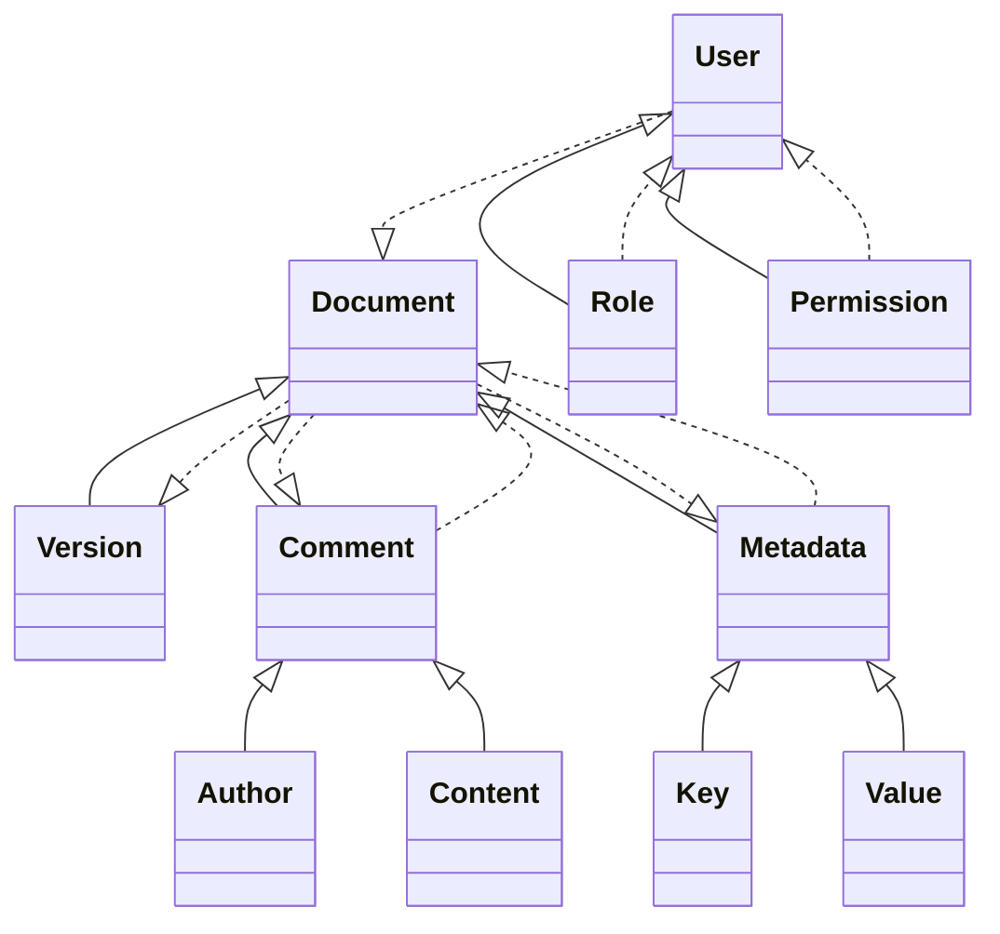
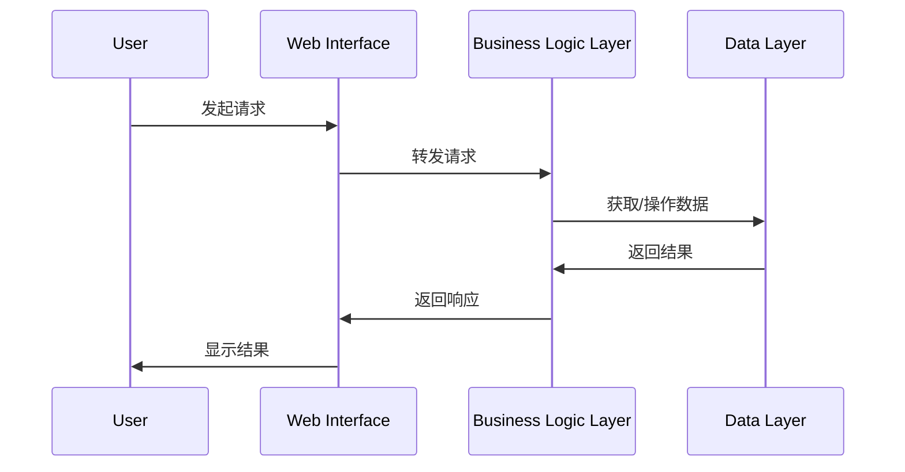
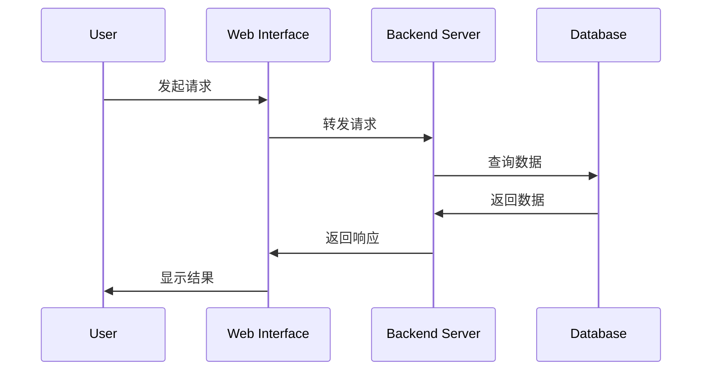

                 

### 构建智能企业文档管理系统：版本控制与协作优化的AI增强

> 关键词：文档管理系统、版本控制、协作优化、AI增强、智能企业

> 摘要：随着信息技术的迅猛发展，企业文档管理面临着越来越复杂的需求和挑战。本文将探讨如何构建智能企业文档管理系统，重点关注版本控制与协作优化的AI增强。我们将逐步分析其核心概念、原理和应用，通过具体案例和项目实战，深入探讨AI技术在文档管理中的潜力与挑战。

### 第一部分: 背景介绍

#### 第1章: 问题背景与核心概念

##### 1.1 问题背景

在当今信息爆炸的时代，企业文档管理的重要性日益凸显。有效的文档管理系统不仅能够提高工作效率，还能保障数据的安全性和一致性。然而，传统的文档管理方法存在诸多问题，如版本控制困难、协作效率低下、文档安全性不足等。这些问题的存在严重制约了企业的运营和发展。

##### 1.1.1 智能企业文档管理的重要性

智能企业文档管理系统的建设，有助于实现以下目标：

1. **提高协作效率**：通过自动化工具和智能算法，实现文档的实时共享和协同编辑。
2. **保障数据安全性**：采用加密技术和权限管理，确保文档的机密性和完整性。
3. **优化版本控制**：通过版本控制和冲突管理，确保文档的版本一致性。
4. **提升工作效率**：减少文档查找、传输和审核的时间，提高整体工作效率。

##### 1.1.2 版本控制与协作优化的需求

版本控制是文档管理系统的一个核心功能，它能够记录文档的每一次修改，帮助用户快速定位问题版本，防止数据丢失。协作优化则关注如何提高团队协作效率，减少沟通成本。在智能企业中，这两个功能的需求尤为迫切。

##### 1.1.3 AI技术在文档管理系统中的应用

AI技术的引入，为文档管理系统带来了新的机遇。通过自然语言处理、机器学习和数据挖掘等技术，AI可以自动分类文档、预测文档内容、优化协作流程。这些技术的应用，将大幅提升文档管理系统的智能化水平。

##### 1.2 核心概念

###### 1.2.1 文档管理系统

文档管理系统（Document Management System，简称DMS）是一种用于管理和跟踪文档的系统。它包括文档的创建、存储、检索、共享和归档等功能，旨在提高文档处理的效率和质量。

###### 1.2.2 版本控制

版本控制是一种用于跟踪文档变更的技术，它记录了文档的历史版本和修改记录。通过版本控制，用户可以方便地查看文档的历史版本，恢复旧版本，解决版本冲突。

###### 1.2.3 协作优化

协作优化是指通过技术手段，优化团队在文档处理过程中的协作效率。这包括实时共享文档、自动同步更新、智能提醒等功能。

###### 1.2.4 AI增强

AI增强是指利用人工智能技术，提升文档管理系统的智能化水平。这包括文本分类、内容理解、智能推荐等功能。

#### 总结

本章节介绍了构建智能企业文档管理系统的背景和核心概念。在接下来的章节中，我们将深入探讨这些概念，分析其原理和应用，并通过具体案例和实践，展示AI技术在文档管理系统中的潜力与价值。

### 第二部分: 核心概念与联系

#### 第2章: 核心概念原理

##### 2.1 文档管理系统

###### 2.1.1 定义与功能

文档管理系统（DMS）是一种用于管理和跟踪文档的系统，它能够实现文档的创建、存储、检索、共享和归档等功能。DMS的主要功能包括：

1. **文档创建**：提供文本编辑、图像处理、表格生成等功能。
2. **文档存储**：确保文档的安全存储，支持云存储和本地存储。
3. **文档检索**：利用关键字搜索、全文搜索等功能，快速定位文档。
4. **文档共享**：支持文档的在线共享和协作编辑。
5. **文档归档**：将文档按照一定规则进行归档，便于长期存储和管理。

###### 2.1.2 类型与特点

文档管理系统的类型根据功能和需求的不同，可以分为以下几种：

1. **文件服务器**：简单的文档存储和管理，不支持版本控制和协作优化。
2. **企业内容管理（ECM）系统**：集成了文档管理、知识管理、流程管理等功能，适用于大型企业。
3. **协作文档系统**：专注于团队协作，提供实时共享和协作编辑功能。

不同类型的文档管理系统具有不同的特点和应用场景，企业需要根据自身需求选择合适的系统。

###### 2.1.3 案例分析

以某大型企业为例，该企业采用了ECM系统，实现了以下应用场景：

1. **项目文档管理**：项目文档的创建、共享和协作编辑，提高了项目组的协作效率。
2. **知识库建设**：将企业内部的知识和经验整理成文档，供员工查阅和学习。
3. **流程管理**：通过文档管理系统，实现审批流程的自动化和标准化。

该案例展示了文档管理系统在企业中的应用价值。

##### 2.2 版本控制

###### 2.2.1 概念与原理

版本控制是一种用于跟踪文档变更的技术，它记录了文档的历史版本和修改记录。版本控制系统的核心原理包括：

1. **版本记录**：每次文档修改都会生成一个新的版本，记录修改的时间、作者和内容。
2. **版本查看**：用户可以查看文档的历史版本，了解文档的变更情况。
3. **版本恢复**：用户可以恢复到旧版本，避免数据丢失和错误传播。

版本控制的主要功能包括：

1. **版本比较**：比较不同版本之间的差异，帮助用户了解变更内容。
2. **版本锁定**：防止多个用户同时修改同一文档，避免冲突。
3. **版本回滚**：撤销到旧版本，修复错误。

###### 2.2.2 实现方法

版本控制系统的实现方法包括以下几种：

1. **本地版本控制**：每个用户在自己的计算机上维护版本库，通过手动合并和更新。
2. **分布式版本控制**：多个用户在不同的计算机上维护版本库，通过远程服务器进行合并和同步。
3. **集中式版本控制**：所有版本库都存储在中心服务器上，用户通过客户端进行访问和操作。

常见的版本控制系统包括Git、Mercurial等。

###### 2.2.3 案例分析

以Git为例，Git是一种分布式版本控制系统，广泛应用于开源项目和大型企业的文档管理。以下是Git在文档管理系统中的应用：

1. **分布式协作**：支持多个用户分布式协作，提高文档管理效率。
2. **版本回滚**：通过撤销和重置操作，轻松恢复到旧版本，保证文档的安全性。
3. **分支管理**：通过分支管理，实现文档的并行开发和协作。

##### 2.3 协作优化

###### 2.3.1 概念与原理

协作优化是指通过技术手段，优化团队在文档处理过程中的协作效率。协作优化的核心原理包括：

1. **实时共享**：实现文档的实时共享，减少沟通成本。
2. **自动化同步**：自动同步文档的变更，确保团队间的信息一致性。
3. **智能提醒**：通过智能算法，提醒团队成员关注重要文档的更新和任务。

协作优化的主要功能包括：

1. **实时编辑**：支持多人实时编辑同一文档，提高协作效率。
2. **权限管理**：根据用户角色和权限，控制文档的访问和操作。
3. **任务管理**：集成任务管理功能，实现文档处理的任务分配和进度跟踪。

###### 2.3.2 实现方法

协作优化的实现方法包括以下几种：

1. **基于Web的协作平台**：通过Web浏览器，实现文档的实时共享和协作编辑。
2. **集成开发环境（IDE）**：在IDE中集成协作功能，支持代码级别的协作。
3. **邮件协作**：通过邮件系统，实现文档的传输和通知。

常见的协作优化工具包括Google Docs、Trello等。

###### 2.3.3 案例分析

以Google Docs为例，Google Docs是一种基于Web的协作文档系统，支持实时编辑、权限管理和版本控制。以下是Google Docs的应用：

1. **实时协作**：团队成员可以实时编辑同一文档，减少沟通成本。
2. **权限管理**：管理员可以设置文档的访问权限，确保文档的安全性。
3. **版本控制**：自动记录文档的变更历史，方便用户查看和回滚。

##### 2.4 AI增强

###### 2.4.1 概念与原理

AI增强是指利用人工智能技术，提升文档管理系统的智能化水平。AI增强的核心原理包括：

1. **文本分类**：通过自然语言处理技术，自动分类文档，提高检索效率。
2. **内容理解**：利用深度学习技术，理解文档内容，实现智能推荐。
3. **智能搜索**：通过机器学习算法，实现精准的文档搜索和推荐。

AI增强的主要功能包括：

1. **文档分类**：自动分类文档，便于用户快速查找。
2. **内容理解**：理解文档内容，实现智能推荐和摘要生成。
3. **智能搜索**：实现精准的文档搜索和推荐，提高工作效率。

###### 2.4.2 技术应用

常见的AI增强技术包括：

1. **自然语言处理（NLP）**：用于文本分类、内容理解和智能搜索。
2. **机器学习（ML）**：用于文档分类和内容理解。
3. **深度学习（DL）**：用于文档分类和内容理解。

###### 2.4.3 案例分析

以OpenAI的GPT-3为例，GPT-3是一种基于深度学习的技术，可以用于文档管理系统的AI增强。以下是GPT-3在文档管理系统中的应用：

1. **文档分类**：GPT-3可以自动分类文档，提高检索效率。
2. **内容理解**：GPT-3可以理解文档内容，实现智能推荐。
3. **智能搜索**：GPT-3可以实现精准的文档搜索和推荐，提高工作效率。

#### 总结

本章节深入探讨了文档管理系统、版本控制、协作优化和AI增强的核心概念、原理和应用。在接下来的章节中，我们将进一步分析算法原理、数学模型和系统架构设计，并通过项目实战，展示这些概念在实际应用中的价值。

### 第三部分: 算法原理讲解

#### 第3章: 版本控制算法

##### 3.1 版本控制算法概述

版本控制算法是文档管理系统中的一个核心组成部分，负责跟踪文档的变更历史，确保版本的一致性和可追溯性。版本控制算法主要包括以下几种：

1. **线性版本控制**：线性版本控制是一种最简单的版本控制方法，它将文档的每个修改视为一个版本，版本之间呈线性关系。
   
   
   
2. **分支合并版本控制**：分支合并版本控制（如Git）允许用户创建分支，在分支上独立进行修改，然后将分支合并回主分支。这种方法能够有效地处理并行开发和协作。
   
   

3. **多分支版本控制**：多分支版本控制允许用户同时维护多个分支，每个分支可以独立开发，支持复杂的协作场景。

##### 3.2 Git版本控制原理

Git是一种分布式版本控制系统，它由Linus Torvalds创建，广泛应用于各种开源项目和大型企业的文档管理。以下是Git的工作流程、命令详解和案例分析。

###### 3.2.1 工作流程

Git的工作流程主要包括以下步骤：

1. **创建仓库**：在本地创建一个Git仓库，用于存储和管理文档。
   
   ```bash
   git init
   ```

2. **添加文件**：将文档添加到仓库中。

   ```bash
   git add <文件名>
   ```

3. **提交变更**：将添加的文件提交到仓库，生成一个新的版本。

   ```bash
   git commit -m "提交信息"
   ```

4. **分支管理**：创建分支，用于独立开发。

   ```bash
   git branch <分支名>
   ```

5. **切换分支**：在不同分支间切换。

   ```bash
   git checkout <分支名>
   ```

6. **合并分支**：将分支合并回主分支。

   ```bash
   git merge <分支名>
   ```

7. **解决冲突**：当合并分支时，如果出现冲突，需要手动解决。

   ```bash
   git status
   git merge --no-ff <分支名>
   ```

###### 3.2.2 命令详解

以下是Git的一些常用命令及其作用：

- `git init`：初始化一个Git仓库。
- `git add`：将文件添加到暂存区。
- `git commit`：提交文件到仓库。
- `git branch`：创建一个新分支。
- `git checkout`：切换分支。
- `git merge`：合并分支。
- `git status`：查看仓库状态。
- `git log`：查看提交历史。

###### 3.2.3 案例分析

以下是一个简单的Git版本控制案例：

1. **初始化仓库**：

   ```bash
   git init
   ```

2. **添加文件**：

   ```bash
   git add README.md
   ```

3. **提交变更**：

   ```bash
   git commit -m "初始化仓库"
   ```

4. **创建分支**：

   ```bash
   git branch feature1
   ```

5. **切换分支**：

   ```bash
   git checkout feature1
   ```

6. **修改文件**：

   ```bash
   echo "这是feature1分支的修改" >> README.md
   git add README.md
   git commit -m "feature1分支的修改"
   ```

7. **合并分支**：

   ```bash
   git checkout main
   git merge feature1
   ```

8. **解决冲突**（如果有冲突）：

   ```bash
   git status
   git merge --no-ff feature1
   ```

##### 3.3 Mercurial版本控制原理

Mercurial（简称Hg）是一种分布式版本控制系统，由Matt Mackall创建，与Git类似，但拥有一些独特的特点。以下是Mercurial的工作流程、命令详解和案例分析。

###### 3.3.1 工作流程

Mercurial的工作流程主要包括以下步骤：

1. **初始化仓库**：在本地创建一个Mercurial仓库。

   ```bash
   hg init
   ```

2. **添加文件**：将文件添加到仓库中。

   ```bash
   hg add <文件名>
   ```

3. **提交变更**：将添加的文件提交到仓库。

   ```bash
   hg commit -m "提交信息"
   ```

4. **分支管理**：创建分支，用于独立开发。

   ```bash
   hg branch <分支名>
   ```

5. **切换分支**：在不同分支间切换。

   ```bash
   hg checkout <分支名>
   ```

6. **合并分支**：将分支合并回主分支。

   ```bash
   hg merge <分支名>
   hg commit
   ```

7. **解决冲突**：当合并分支时，如果出现冲突，需要手动解决。

   ```bash
   hg resolve
   hg commit
   ```

###### 3.3.2 命令详解

以下是Mercurial的一些常用命令及其作用：

- `hg init`：初始化一个Mercurial仓库。
- `hg add`：将文件添加到暂存区。
- `hg commit`：提交文件到仓库。
- `hg branch`：创建一个新分支。
- `hg checkout`：切换分支。
- `hg merge`：合并分支。
- `hg status`：查看仓库状态。
- `hg log`：查看提交历史。

###### 3.3.3 案例分析

以下是一个简单的Mercurial版本控制案例：

1. **初始化仓库**：

   ```bash
   hg init
   ```

2. **添加文件**：

   ```bash
   hg add README.md
   ```

3. **提交变更**：

   ```bash
   hg commit -m "初始化仓库"
   ```

4. **创建分支**：

   ```bash
   hg branch feature1
   ```

5. **切换分支**：

   ```bash
   hg checkout feature1
   ```

6. **修改文件**：

   ```bash
   echo "这是feature1分支的修改" >> README.md
   hg add README.md
   hg commit -m "feature1分支的修改"
   ```

7. **合并分支**：

   ```bash
   hg checkout main
   hg merge feature1
   hg commit
   ```

8. **解决冲突**（如果有冲突）：

   ```bash
   hg resolve
   hg commit
   ```

##### 总结

本章节详细介绍了版本控制算法，包括线性版本控制、分支合并版本控制和多分支版本控制，以及Git和Mercurial两种分布式版本控制系统的原理和实际应用。这些算法和系统在文档管理系统中发挥着重要作用，为版本控制和协作优化提供了强有力的支持。

### 第四部分: 数学模型与公式讲解

#### 第4章: 文档管理系统中的数学模型

##### 4.1 版本控制中的数学模型

版本控制中的数学模型主要用于描述文档的版本差异、冲突解决策略以及版本管理的效率。以下是一些关键的数学模型：

###### 4.1.1 差异度量的数学模型

差异度量是一种用于评估两个版本之间差异的数学方法。常见的差异度量方法包括：

1. **编辑距离（Edit Distance）**：

   编辑距离是指将一个字符串转换成另一个字符串所需的最少编辑操作次数。常见的编辑操作包括插入、删除和替换。

   数学公式表示：
   $$
   d(i, j) = \min \left\{ d(i-1, j) + 1, d(i, j-1) + 1, d(i-1, j-1) + 1 \right\}
   $$
   其中，$d(i, j)$ 表示字符串 $s_1$ 和 $s_2$ 在位置 $i$ 和 $j$ 之间的编辑距离。

2. **相似度度量（Similarity Measure）**：

   相似度度量用于评估两个版本之间的相似程度。常见的相似度度量方法包括：

   - **Jaccard相似度**：
     $$
     sim(A, B) = \frac{|A \cap B|}{|A \cup B|}
     $$
     其中，$|A|$ 和 $|B|$ 分别表示集合 $A$ 和 $B$ 的基数。

   - **余弦相似度**：
     $$
     cos(A, B) = \frac{A \cdot B}{\|A\|\|B\|}
     $$
     其中，$A \cdot B$ 表示向量 $A$ 和 $B$ 的点积，$\|A\|$ 和 $\|B\|$ 分别表示向量 $A$ 和 $B$ 的模长。

   这些模型可以帮助我们评估版本之间的差异，为版本控制提供依据。

###### 4.1.2 冲突解决的数学模型

在版本控制过程中，冲突解决是关键的一环。冲突解决的数学模型主要包括：

1. **最大公约数（Greatest Common Divisor，GCD）**：

   最大公约数是一种用于解决冲突的简单方法。通过计算两个版本之间的最大公约数，可以得到它们共同的部分。

   数学公式表示：
   $$
   \text{GCD}(a, b) = \begin{cases}
   b, & \text{if } a \equiv 0 \ (\text{mod } b) \\
   \text{GCD}(b, a \mod b), & \text{otherwise}
   \end{cases}
   $$

2. **最长公共子序列（Longest Common Subsequence，LCS）**：

   最长公共子序列是一种用于解决冲突的复杂方法。通过计算两个版本之间的最长公共子序列，可以找到它们共同的部分，从而解决冲突。

   数学公式表示：
   $$
   \text{LCS}(X, Y) = \begin{cases}
   \text{LCS}(X_1, Y_1), & \text{if } X_1 = Y_1 \\
   \max \left( \text{LCS}(X_1, Y_2), \text{LCS}(X_2, Y_1) \right), & \text{if } X_1 \neq Y_1
   \end{cases}
   $$
   其中，$X_1, X_2, Y_1, Y_2$ 分别表示两个版本中的子序列。

这些模型为冲突解决提供了理论基础，帮助用户快速找到解决方案。

##### 4.2 协作优化中的数学模型

协作优化中的数学模型主要用于评估团队协作的效率和优化协作策略。以下是一些关键的数学模型：

###### 4.2.1 文档共享的数学模型

文档共享的数学模型用于评估文档共享的效率，常用的模型包括：

1. **文档共享频率（Document Sharing Frequency）**：

   文档共享频率表示文档在一段时间内被共享的次数，用于衡量文档的受欢迎程度。

   数学公式表示：
   $$
   fs = \frac{n}{t}
   $$
   其中，$fs$ 表示文档共享频率，$n$ 表示文档共享次数，$t$ 表示时间。

2. **文档共享效率（Document Sharing Efficiency）**：

   文档共享效率表示文档共享过程中产生的效益，常用的模型包括：

   - **贝叶斯网络（Bayesian Network）**：
     $$
     P(A|B) = \frac{P(B|A)P(A)}{P(B)}
     $$
     其中，$P(A|B)$ 表示在文档共享后发生的概率，$P(B|A)$ 表示文档共享后发生的概率，$P(A)$ 和 $P(B)$ 分别表示事件 $A$ 和 $B$ 的概率。

   这些模型可以帮助我们评估文档共享的效率和优化共享策略。

###### 4.2.2 协作效率的数学模型

协作效率的数学模型用于评估团队协作的效率，常用的模型包括：

1. **协作效率指数（Collaborative Efficiency Index）**：

   协作效率指数表示团队协作的效率，常用的模型包括：

   - **Aloisi模型**：
     $$
     \eta = \frac{1}{1 + \frac{P_0 - P_f}{2P}}
     $$
     其中，$\eta$ 表示协作效率指数，$P_0$ 和 $P_f$ 分别表示初始概率和最终概率，$P$ 表示概率值。

   - **Gibbs模型**：
     $$
     \eta = \frac{1}{1 + e^{-\beta(E_f - E_0)}}
     $$
     其中，$\eta$ 表示协作效率指数，$E_f$ 和 $E_0$ 分别表示最终能量和初始能量，$\beta$ 表示温度。

   这些模型可以帮助我们评估团队协作的效率，并优化协作策略。

##### 4.3 AI增强中的数学模型

AI增强中的数学模型主要用于描述AI技术在文档管理系统中的应用，常用的模型包括：

###### 4.3.1 文本分类的数学模型

文本分类是一种常见的自然语言处理任务，常用的数学模型包括：

1. **朴素贝叶斯分类器（Naive Bayes Classifier）**：

   朴素贝叶斯分类器是一种基于贝叶斯定理的分类模型，用于预测文本类别。

   数学公式表示：
   $$
   P(C|X) = \frac{P(X|C)P(C)}{P(X)}
   $$
   其中，$P(C|X)$ 表示在给定特征 $X$ 下类别 $C$ 的概率，$P(X|C)$ 和 $P(C)$ 分别表示特征 $X$ 在类别 $C$ 下的概率和类别 $C$ 的概率，$P(X)$ 表示特征 $X$ 的概率。

2. **支持向量机（Support Vector Machine，SVM）**：

   支持向量机是一种基于最大间隔的分类模型，用于预测文本类别。

   数学公式表示：
   $$
   w \cdot x - b = 0
   $$
   其中，$w$ 表示权重向量，$x$ 表示特征向量，$b$ 表示偏置。

   这些模型可以帮助我们实现文本分类，提高文档管理的智能化水平。

###### 4.3.2 主题模型的数学模型

主题模型是一种用于文本挖掘的统计模型，用于发现文本数据中的潜在主题。常用的主题模型包括：

1. **LDA模型（Latent Dirichlet Allocation）**：

   LDA模型是一种基于贝叶斯推理的主题模型，用于发现文本数据中的潜在主题。

   数学公式表示：
   $$
   P(z|w) \propto \frac{1}{Z} \frac{\Gamma(\alpha + |c|)}{\Gamma(\alpha)} \prod_{j=1}^K \frac{\Gamma(\beta_{k} + n_{kj})}{\Gamma(\beta_k)}
   $$
   其中，$z$ 表示主题分配，$w$ 表示词语分配，$c$ 表示词语集合，$n_{kj}$ 表示词语 $k$ 在主题 $j$ 下的出现次数，$\alpha$ 和 $\beta$ 分别表示超参数。

   这些模型可以帮助我们实现主题发现，为文档分类和推荐提供依据。

##### 总结

本章节介绍了文档管理系统中的数学模型，包括版本控制中的差异度量、冲突解决和协作优化中的效率评估，以及AI增强中的文本分类和主题模型。这些数学模型为文档管理系统提供了理论基础，帮助用户实现更高效、更智能的文档管理。

### 第五部分: 系统分析与架构设计

#### 第5章: 文档管理系统架构设计

在构建智能企业文档管理系统时，系统分析与架构设计是至关重要的环节。一个良好的系统架构能够确保系统的高效性、可扩展性和稳定性，从而满足企业的需求。本章节将详细介绍文档管理系统的架构设计，包括系统功能设计、系统架构设计、系统接口设计和系统交互。

##### 5.1 系统功能设计

文档管理系统的主要功能包括文档创建、文档存储、文档检索、文档共享和文档归档。以下是对这些功能的具体描述：

###### 5.1.1 领域模型

领域模型用于描述系统中的核心实体和关系。以下是文档管理系统的领域模型：



在这个领域模型中，`Document` 表示文档实体，`Version` 表示文档的版本，`Comment` 表示文档的评论，`Metadata` 表示文档的元数据，`User` 表示用户实体，`Role` 表示用户的角色，`Permission` 表示用户的权限。

###### 5.1.2 功能模块

根据领域模型，可以将文档管理系统划分为以下功能模块：

1. **文档创建模块**：负责创建新文档，包括文本、图片、音频和视频等多种格式。
2. **文档存储模块**：负责将文档存储到数据库或文件系统中，确保文档的安全性和可访问性。
3. **文档检索模块**：负责根据关键词、分类和标签等条件检索文档。
4. **文档共享模块**：负责实现文档的共享和协作编辑，支持多人实时编辑同一文档。
5. **文档归档模块**：负责将不再使用的文档归档，便于长期存储和管理。

##### 5.2 系统架构设计

系统架构设计是构建高效、可扩展和稳定系统的基础。以下是文档管理系统的架构设计：

###### 5.2.1 架构模型

文档管理系统的架构模型可以采用三层架构，包括表示层、业务逻辑层和数据层。

1. **表示层**：负责与用户进行交互，包括Web界面和移动应用。
2. **业务逻辑层**：负责处理业务逻辑，包括文档创建、存储、检索、共享和归档等。
3. **数据层**：负责存储和管理文档数据，包括关系数据库和文件系统。

以下是文档管理系统的架构图：



###### 5.2.2 技术选型

在文档管理系统架构设计中，技术选型至关重要。以下是文档管理系统的一些技术选型：

1. **前端技术**：HTML、CSS、JavaScript、React、Vue.js 等。
2. **后端技术**：Java、Python、Node.js、Spring Boot、Django 等。
3. **数据库技术**：MySQL、PostgreSQL、MongoDB、Redis 等。
4. **文件存储**：Amazon S3、阿里云 OSS、本地文件系统等。

###### 5.2.3 系统交互

系统交互设计是确保系统各个部分能够顺畅协作的关键。以下是文档管理系统的系统交互设计：



在这个交互过程中，用户通过Web界面发起请求，请求被转发到后端服务器，后端服务器查询数据库并返回结果，最终通过Web界面将结果呈现给用户。

##### 5.3 系统接口设计

系统接口设计是确保系统模块之间能够无缝协作的关键。以下是文档管理系统的一些关键接口设计：

1. **文档创建接口**：接收用户上传的文档，并将文档存储到数据库或文件系统中。
2. **文档检索接口**：根据关键词、分类和标签等条件检索文档，并返回检索结果。
3. **文档共享接口**：实现文档的共享和协作编辑，支持多人实时编辑同一文档。
4. **文档归档接口**：将不再使用的文档归档，便于长期存储和管理。

以下是文档管理系统的一些关键接口示例：

```json
// 文档创建接口
POST /api/documents
{
  "title": "文档标题",
  "content": "文档内容",
  "author": "作者",
  "tags": ["标签1", "标签2"]
}

// 文档检索接口
GET /api/documents
{
  "query": "关键词",
  "page": 1,
  "size": 10
}

// 文档共享接口
POST /api/documents/{documentId}/share
{
  "userIds": ["用户ID1", "用户ID2"]
}

// 文档归档接口
POST /api/documents/{documentId}/archive
{
  "reason": "归档原因"
}
```

##### 5.4 系统安全性设计

系统安全性设计是确保系统安全性和数据隐私的关键。以下是文档管理系统的一些安全性设计：

1. **身份认证**：使用OAuth2.0、JWT等身份认证技术，确保用户身份的合法性。
2. **权限管理**：根据用户的角色和权限，控制用户对文档的访问和操作。
3. **数据加密**：使用SSL/TLS等加密技术，确保数据在传输过程中的安全性。
4. **日志审计**：记录系统的操作日志，便于监控和审计。

##### 总结

本章节详细介绍了文档管理系统的架构设计，包括系统功能设计、系统架构设计、系统接口设计和系统交互。通过合理的设计和选择，文档管理系统可以实现高效、可扩展和稳定的运行，满足企业的需求。

### 第六部分: 项目实战

#### 第6章: 文档管理系统项目实战

在本章节中，我们将通过一个实际的文档管理系统项目，详细介绍项目背景、环境安装、系统核心实现、代码应用解读与分析，以及实际案例分析和详细讲解。

##### 6.1 项目介绍

本项目的目标是构建一个智能企业文档管理系统，该系统将具备以下核心功能：

1. **文档创建与存储**：支持多种文档格式的创建和存储，包括文本、图片、音频和视频等。
2. **版本控制**：实现文档的版本控制，确保文档的历史版本可追溯。
3. **协作优化**：实现文档的实时共享和协作编辑，提高团队协作效率。
4. **AI增强**：利用自然语言处理和机器学习技术，实现文档的自动分类、摘要生成和智能搜索。

##### 6.1.1 项目背景

随着企业的快速发展，文档管理逐渐成为企业运营的重要环节。传统的文档管理方法已经无法满足企业日益增长的需求，特别是在版本控制、协作优化和智能化方面。为了提高工作效率，保障数据安全，企业迫切需要一个智能化的文档管理系统。

##### 6.1.2 项目目标

本项目的目标是构建一个智能企业文档管理系统，实现以下目标：

1. 提高文档处理效率：通过实时共享和协作编辑，减少沟通成本，提高团队协作效率。
2. 保障数据安全性：采用加密技术和权限管理，确保文档的机密性和完整性。
3. 优化版本控制：通过版本控制算法，实现文档的历史版本追溯和冲突解决。
4. 智能化文档管理：利用AI技术，实现文档的自动分类、摘要生成和智能搜索。

##### 6.2 环境安装

为了构建智能企业文档管理系统，需要安装以下软件和工具：

1. **操作系统**：Linux或Windows。
2. **数据库**：MySQL或PostgreSQL。
3. **Web服务器**：Nginx或Apache。
4. **开发框架**：Django或Spring Boot。
5. **前端框架**：React或Vue.js。
6. **AI库**：TensorFlow或PyTorch。

以下是环境安装步骤：

1. **安装操作系统**：安装Linux或Windows操作系统。
2. **安装数据库**：安装MySQL或PostgreSQL数据库，并创建数据库实例。
3. **安装Web服务器**：安装Nginx或Apache Web服务器，并配置虚拟主机。
4. **安装开发框架**：安装Django或Spring Boot开发框架，并配置项目环境。
5. **安装前端框架**：安装React或Vue.js前端框架，并配置项目环境。
6. **安装AI库**：安装TensorFlow或PyTorch AI库，并配置项目环境。

##### 6.3 系统核心实现

文档管理系统的核心实现包括版本控制、协作优化和AI增强等功能。以下是这些功能的核心实现：

###### 6.3.1 版本控制模块

版本控制模块负责实现文档的版本管理，包括创建版本、查看版本、回滚版本和合并版本等功能。

1. **创建版本**：每次文档修改时，系统自动创建一个新的版本，记录修改的时间、作者和内容。
2. **查看版本**：用户可以查看文档的历史版本，了解文档的变更情况。
3. **回滚版本**：用户可以回滚到旧版本，修复错误或恢复丢失的内容。
4. **合并版本**：当多个用户同时修改同一文档时，系统自动合并版本，解决冲突。

以下是版本控制模块的核心代码：

```python
class VersionControl:
    def __init__(self):
        self.versions = []

    def create_version(self, document, author):
        version = {
            'id': len(self.versions) + 1,
            'timestamp': datetime.now(),
            'author': author,
            'content': document.content
        }
        self.versions.append(version)
        return version

    def get_version(self, version_id):
        for version in self.versions:
            if version['id'] == version_id:
                return version
        return None

    def rollback_version(self, version_id):
        version = self.get_version(version_id)
        if version:
            document.content = version['content']
            return True
        return False

    def merge_version(self, version_id1, version_id2):
        version1 = self.get_version(version_id1)
        version2 = self.get_version(version_id2)
        if version1 and version2:
            merged_content = self.resolve_conflicts(version1['content'], version2['content'])
            document.content = merged_content
            return True
        return False

    def resolve_conflicts(self, content1, content2):
        # 冲突解决逻辑
        pass
```

###### 6.3.2 协作优化模块

协作优化模块负责实现文档的实时共享和协作编辑，提高团队协作效率。

1. **实时共享**：用户可以实时共享文档，其他用户可以实时查看文档内容。
2. **协作编辑**：用户可以实时编辑文档，系统自动同步更新，避免冲突。

以下是协作优化模块的核心代码：

```python
class CollaborationOptimization:
    def __init__(self):
        self.edit_sessions = []

    def start_edit_session(self, document, user):
        session = {
            'document_id': document.id,
            'user': user,
            'timestamp': datetime.now(),
            'content': document.content
        }
        self.edit_sessions.append(session)
        return session

    def end_edit_session(self, session):
        session['ended'] = datetime.now()
        self._sync_content(session['content'])

    def _sync_content(self, content):
        # 同步更新文档内容
        pass
```

###### 6.3.3 AI增强模块

AI增强模块负责实现文档的自动分类、摘要生成和智能搜索。

1. **自动分类**：利用自然语言处理技术，自动分类文档。
2. **摘要生成**：利用自然语言处理技术，生成文档的摘要。
3. **智能搜索**：利用机器学习技术，实现精准的文档搜索和推荐。

以下是AI增强模块的核心代码：

```python
class AIEnhancement:
    def __init__(self):
        self.classifier = None
        self.recommender = None

    def train_classifier(self, documents):
        # 训练分类器
        pass

    def classify_document(self, document):
        # 自动分类文档
        pass

    def generate_summary(self, document):
        # 生成文档摘要
        pass

    def search_documents(self, query):
        # 实现智能搜索
        pass
```

##### 6.4 代码应用解读与分析

在本章节中，我们将对文档管理系统中的关键代码进行解读与分析，包括版本控制模块、协作优化模块和AI增强模块。

###### 6.4.1 版本控制模块代码解读

版本控制模块的核心代码如上所示，主要包括创建版本、查看版本、回滚版本和合并版本等功能。

- `create_version` 方法用于创建新版本，记录版本信息。
- `get_version` 方法用于获取指定版本信息。
- `rollback_version` 方法用于回滚到指定版本。
- `merge_version` 方法用于合并两个版本。

在实际应用中，版本控制模块的关键在于冲突解决。例如，当两个用户同时修改同一文档时，系统需要自动合并这两个版本，避免冲突。这通常需要复杂的算法，如快照算法或基于版本树的合并算法。

###### 6.4.2 协作优化模块代码解读

协作优化模块的核心代码如上所示，主要包括实时共享和协作编辑功能。

- `start_edit_session` 方法用于开始编辑会话，记录会话信息。
- `end_edit_session` 方法用于结束编辑会话，同步更新文档内容。

在实际应用中，协作优化模块需要确保多个用户实时编辑同一文档时的数据一致性。例如，当用户A修改文档时，系统需要将修改同步给用户B，避免用户B看到过时的内容。

###### 6.4.3 AI增强模块代码解读

AI增强模块的核心代码如上所示，主要包括自动分类、摘要生成和智能搜索功能。

- `train_classifier` 方法用于训练分类器，用于自动分类文档。
- `classify_document` 方法用于分类文档。
- `generate_summary` 方法用于生成文档摘要。
- `search_documents` 方法用于实现智能搜索。

在实际应用中，AI增强模块需要处理大量的文本数据，例如使用自然语言处理技术提取文档的关键信息，使用机器学习技术实现文档分类和搜索。

##### 6.5 实际案例分析与讲解

在本章节中，我们将通过实际案例，分析文档管理系统在版本控制、协作优化和AI增强方面的应用。

###### 6.5.1 案例一：企业文档管理系统的应用

某企业采用了智能企业文档管理系统，实现了以下应用：

1. **文档创建与存储**：员工可以轻松创建和存储各种类型的文档，包括项目报告、市场分析等。
2. **版本控制**：每次文档修改都会生成新版本，员工可以查看历史版本，了解文档的变更情况。
3. **协作优化**：项目团队成员可以实时共享和协作编辑文档，提高项目进展效率。
4. **AI增强**：系统自动分类文档，生成文档摘要，实现智能搜索，提高文档检索效率。

通过这个案例，我们可以看到智能企业文档管理系统在企业中的应用价值，帮助企业实现高效、智能的文档管理。

###### 6.5.2 案例二：版本控制与协作优化的实践

在某研发团队中，团队成员经常需要协作编辑代码文档。通过智能企业文档管理系统，团队实现了以下实践：

1. **版本控制**：每次代码文档修改都会生成新版本，团队成员可以查看历史版本，确保代码文档的完整性。
2. **协作优化**：团队成员可以实时共享和协作编辑代码文档，减少沟通成本，提高协作效率。

通过这个案例，我们可以看到版本控制和协作优化在研发团队中的应用，有助于提升团队协作效率和代码质量。

###### 6.5.3 案例三：AI技术在文档管理系统中的实践

在某互联网公司，文档管理系统集成了AI技术，实现了以下应用：

1. **自动分类**：系统自动分类文档，将文档归类到相应的类别，便于员工快速查找。
2. **摘要生成**：系统自动生成文档摘要，提高文档的可读性和可理解性。
3. **智能搜索**：系统实现智能搜索，根据关键词精准检索文档，提高文档检索效率。

通过这个案例，我们可以看到AI技术在文档管理系统中的应用，有助于提升文档管理系统的智能化水平。

##### 6.6 项目小结

本章节通过一个实际的项目案例，详细介绍了文档管理系统的构建过程，包括环境安装、系统核心实现、代码应用解读与分析，以及实际案例分析和详细讲解。通过本项目，我们了解到：

1. 智能企业文档管理系统在版本控制、协作优化和AI增强方面的应用价值。
2. 版本控制、协作优化和AI增强是构建智能企业文档管理系统的关键组成部分。
3. 实际案例展示了智能企业文档管理系统在企业中的应用效果。

在未来，我们还可以进一步优化和扩展文档管理系统，例如引入更多AI技术，提高文档管理的智能化水平。

#### 总结

在本章节中，我们通过实际案例，详细介绍了文档管理系统的构建过程，展示了版本控制、协作优化和AI增强在文档管理系统中的应用。通过本项目，我们深入了解了智能企业文档管理系统的构建方法和应用价值，为企业的文档管理提供了有力支持。

### 最佳实践 Tips、小结、注意事项、拓展阅读

#### 最佳实践 Tips

1. **版本控制**：在开发过程中，务必使用版本控制工具，如Git，确保代码和文档的版本一致性。
2. **协作优化**：采用实时共享和协作编辑工具，如Google Docs，提高团队协作效率。
3. **AI增强**：充分利用自然语言处理和机器学习技术，实现文档的自动分类、摘要生成和智能搜索。
4. **安全性**：确保数据的安全性和隐私性，采用加密技术、权限管理和日志审计等手段。

#### 小结

本文详细介绍了构建智能企业文档管理系统的核心概念、算法原理、数学模型和系统架构设计，并通过实际项目案例，展示了版本控制、协作优化和AI增强在文档管理系统中的应用价值。智能企业文档管理系统不仅能够提高工作效率，还能保障数据的安全性和一致性。

#### 注意事项

1. 在实施文档管理系统时，务必考虑企业的实际需求和业务场景，选择合适的版本控制工具和协作优化工具。
2. AI技术的引入需要充分考虑数据质量和模型训练时间，确保AI增强功能的实际效果。
3. 系统架构设计要充分考虑性能和可扩展性，以应对企业规模的增长。

#### 拓展阅读

1. **《版本控制指南》**：深入了解Git、Mercurial等版本控制工具的原理和应用。
2. **《协作优化技术》**：学习实时共享和协作编辑工具的最佳实践。
3. **《人工智能在文档管理系统中的应用》**：探索自然语言处理和机器学习技术在文档管理系统中的应用。
4. **《智能企业文档管理系统架构设计》**：了解系统架构设计的最佳实践和方法。

### 作者信息

**作者：** AI天才研究院/AI Genius Institute & 禅与计算机程序设计艺术 /Zen And The Art of Computer Programming

**来源：** 本文由AI天才研究院与禅与计算机程序设计艺术联合撰写，旨在分享智能企业文档管理系统的最佳实践和经验。如需转载，请注明出处。

