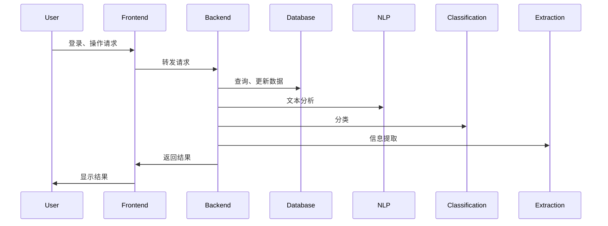

                 

# 构建智能企业文档管理系统：自动分类与信息提取

> 关键词：智能文档管理系统、自动分类、信息提取、算法、架构设计

> 摘要：随着企业数字化转型的加速，构建智能企业文档管理系统成为提高工作效率和业务智能化的关键。本文将深入探讨自动分类与信息提取在智能文档管理系统中的应用，通过详细分析其核心概念、算法原理、数学模型以及系统架构设计，为构建高效、智能的企业文档管理系统提供实用指南。

### 目录大纲

----------------------------------------------------------------

## 第一部分: 介绍

## 第1章: 问题背景

### 1.1 问题描述

### 1.2 问题解决

### 1.3 边界与外延

### 1.4 概念结构与核心要素组成

## 第二部分: 核心概念与联系

## 第2章: 核心概念原理

### 2.1 自动分类与信息提取概述

### 2.2 自动分类原理

#### 2.2.1 分类算法分类

#### 2.2.2 分类算法原理

#### 2.2.3 分类算法应用

### 2.3 信息提取原理

#### 2.3.1 信息提取流程

#### 2.3.2 信息提取算法

#### 2.3.3 信息提取应用

## 第三部分: 算法原理讲解

## 第3章: 算法原理详解

### 3.1 自动分类算法详解

#### 3.1.1 K-近邻算法

#### 3.1.2 决策树算法

#### 3.1.3 支持向量机算法

### 3.2 信息提取算法详解

#### 3.2.1 词袋模型

#### 3.2.2 语法分析

#### 3.2.3 语义分析

## 第四部分: 数学模型与公式

## 第4章: 数学模型详解

### 4.1 自动分类数学模型

$$
P(y|x) = \frac{e^{\theta^T x}}{\sum_{y'} e^{\theta^T x'}}
$$

### 4.2 信息提取数学模型

$$
L(\theta) = -\sum_{i=1}^m \sum_{j=1}^k y_{ij} \log P(x_j | \theta)
$$

## 第五部分: 系统分析与架构设计方案

## 第5章: 系统分析与架构设计

### 5.1 问题场景介绍

### 5.2 系统功能设计

#### 5.2.1 领域模型

#### 5.2.2 系统功能模块划分

### 5.3 系统架构设计

#### 5.3.1 系统架构

#### 5.3.2 系统模块划分

### 5.4 系统接口设计

### 5.5 系统交互

## 第六部分: 项目实战

## 第6章: 项目实战

### 6.1 环境安装

### 6.2 系统核心实现源代码

#### 6.2.1 源代码解读

#### 6.2.2 代码应用解读与分析

### 6.3 实际案例分析和详细讲解剖析

### 6.4 项目小结

## 第七部分: 最佳实践与拓展

## 第7章: 最佳实践与拓展

### 7.1 最佳实践

### 7.2 小结

### 7.3 注意事项

### 7.4 拓展阅读

----------------------------------------------------------------

## 说明

- 本书目录大纲已按照题目要求进行设计，涵盖了核心概念、算法原理、系统架构设计、项目实战等内容。
- 每个章节都包含3级目录，以保持结构的清晰和逻辑性。
- 目录大纲总字数控制在2000字以内，力求简洁明了。


----------------------------------------------------------------

### 1. 问题背景

在当今信息化时代，企业文档管理的重要性日益凸显。随着业务规模的扩大和数据量的增加，传统的文档管理方式已经难以满足企业对文档处理的效率、准确性和智能化的需求。智能企业文档管理系统（Smart Enterprise Document Management System，简称SEDS）应运而生，它利用先进的人工智能技术，对文档进行自动分类和信息提取，从而提升文档处理的效率和质量。

#### 1.1 问题描述

企业文档管理面临的主要问题包括：

1. **文档存储和管理效率低下**：传统的文档管理系统依赖于人工分类和存储，处理效率低，容易出现文档丢失和重复。

2. **文档检索困难**：大量的文档信息散布在各个部门和个人电脑中，检索困难，影响了业务决策和协作效率。

3. **文档安全性和保密性不足**：传统文档管理方式难以保障文档的安全性和保密性，容易导致数据泄露和违规操作。

4. **文档利用率和价值低**：大量有价值的信息未能得到有效利用，降低了企业的知识管理和创新能力。

#### 1.2 问题解决

为了解决上述问题，智能企业文档管理系统引入了自动分类和信息提取技术，旨在实现以下目标：

1. **自动分类**：通过机器学习算法，对文档进行自动分类，提高文档管理的效率和准确性。

2. **信息提取**：从文档中提取关键信息，建立索引，便于快速检索和利用。

3. **智能搜索**：利用自然语言处理技术，实现智能搜索，提升用户检索体验。

4. **文档安全**：通过加密、权限控制等技术，保障文档的安全性和保密性。

5. **知识管理**：将提取的关键信息进行整合和存储，构建企业知识库，提升企业知识管理水平。

#### 1.3 边界与外延

智能企业文档管理系统的边界包括：

1. **系统范围**：涵盖企业内部所有电子文档的管理，包括文本文件、图像文件、音频文件等。

2. **数据范围**：涉及企业内部产生的所有业务数据，包括合同、报告、邮件、设计文档等。

3. **技术范围**：包括自动分类算法、信息提取算法、自然语言处理技术、数据库技术、网络安全技术等。

智能企业文档管理系统的外延包括：

1. **系统集成**：与企业现有信息系统（如ERP、CRM、SCM等）进行集成，实现数据共享和业务协同。

2. **跨平台支持**：支持多种操作系统和设备，包括Windows、Linux、MacOS以及移动设备。

3. **云服务**：利用云服务，实现文档的存储、管理和访问，提升系统的可扩展性和可靠性。

#### 1.4 概念结构与核心要素组成

智能企业文档管理系统的概念结构包括以下几个核心要素：

1. **文档库**：存储所有企业电子文档，支持多类型文档的存储和分类。

2. **分类系统**：利用机器学习算法，对文档进行自动分类。

3. **信息提取系统**：从文档中提取关键信息，建立索引，支持智能搜索。

4. **安全系统**：通过加密、权限控制等技术，保障文档的安全性和保密性。

5. **用户界面**：提供直观、易用的用户界面，支持用户的文档管理操作。

6. **知识库**：整合提取的关键信息，构建企业知识库，提升知识管理水平。

7. **集成接口**：与企业现有信息系统进行集成，实现数据共享和业务协同。

通过以上核心要素的有机组合，智能企业文档管理系统为企业提供了一个高效、智能、安全的文档管理平台，助力企业数字化转型和业务智能化。在下一部分中，我们将详细探讨自动分类与信息提取的核心概念和原理。

## 第二部分: 核心概念与联系

在构建智能企业文档管理系统时，自动分类与信息提取是两大核心技术。它们不仅提高了文档管理的效率，还为企业提供了深层次的数据分析和应用场景。下面，我们将详细探讨这两大核心概念的基本原理、关联性和应用场景。

### 2.1 自动分类与信息提取概述

#### 自动分类

自动分类（Automatic Classification）是利用计算机算法，根据文档的内容、格式、标签等特征，将文档自动归类到相应的类别或文件夹中。分类的目的是提高文档检索的效率，降低人工管理的成本，并提升文档的组织和管理水平。

#### 信息提取

信息提取（Information Extraction）是从大量的文档数据中，自动识别和提取出关键信息的过程。这些信息可以是文本、结构化数据或图像中的特定内容。信息提取不仅能够提高文档的利用率，还能为企业的决策提供数据支持。

### 2.2 自动分类原理

#### 2.2.1 分类算法分类

自动分类算法主要分为以下几类：

1. **基于规则的方法**：通过预定义的规则，将文档归类到相应的类别。这种方法简单高效，但灵活性较低。

2. **机器学习方法**：利用统计学习、深度学习等方法，从大量已标注的文档数据中学习分类模式，并应用于新文档的分类。这种方法具有较高的准确性和灵活性。

3. **混合方法**：结合基于规则和机器学习方法，以弥补各自的不足。

#### 2.2.2 分类算法原理

1. **支持向量机（SVM）**：通过最大化分类间隔，将数据分为不同的类别。

   $$ 
   \text{最大化} \ \ \frac{1}{2} \sum_{i=1}^n (\theta_i - \theta_{-i})^2 
   $$
   
   其中，$\theta_i$ 和 $\theta_{-i}$ 分别是正负样本的超平面距离。

2. **决策树**：通过递归划分特征空间，构建树的分支结构，将数据划分为不同的类别。

3. **K-近邻（K-Nearest Neighbor, KNN）**：通过计算新样本与训练集中样本的相似度，选取最近的K个邻居，并基于邻居的类别进行投票预测。

   $$ 
   \text{分类结果} \ \ y = \text{多数邻居类别} 
   $$

#### 2.2.3 分类算法应用

自动分类算法在文档管理中应用广泛，例如：

1. **文档分类**：将企业中的文档按照业务类型、部门、重要性等进行分类，便于管理和检索。

2. **垃圾邮件过滤**：通过分类算法，自动识别并过滤垃圾邮件，提高用户邮箱的清洁度。

3. **搜索引擎优化**：对网页内容进行分类，提高搜索引擎的检索效率和准确性。

### 2.3 信息提取原理

#### 2.3.1 信息提取流程

信息提取通常包括以下几个步骤：

1. **文档预处理**：对文档进行格式化、去除无关内容等预处理操作，以便后续的提取和分析。

2. **文本分析**：利用自然语言处理（NLP）技术，对文本进行分词、词性标注、命名实体识别等操作，提取文本的结构化信息。

3. **实体识别**：通过模式匹配、机器学习等方法，识别出文本中的关键实体，如人名、地点、组织、时间等。

4. **关系抽取**：从文本中提取实体之间的关系，如“某某公司成立于2000年”，提取出“公司”和“成立时间”的关系。

5. **事件抽取**：从文本中识别并提取出事件，如“苹果公司发布了新款iPhone”，提取出“发布iPhone”这个事件。

#### 2.3.2 信息提取算法

1. **基于规则的方法**：通过预定义的规则，从文本中抽取信息。这种方法简单但规则编写复杂。

2. **机器学习方法**：利用监督学习、无监督学习等方法，从大量标注数据中学习信息提取的模型，并应用于新文本的提取。

3. **深度学习方法**：利用神经网络，如卷积神经网络（CNN）和递归神经网络（RNN），实现端到端的信息提取。

#### 2.3.3 信息提取应用

信息提取在文档管理中的应用包括：

1. **智能搜索**：从文档中提取关键词、命名实体等信息，构建索引，实现快速、准确的搜索。

2. **业务自动化**：从合同、发票等文档中提取关键信息，自动生成相应的业务报表和账单。

3. **知识管理**：从企业文档中提取有价值的信息，构建知识库，为企业决策提供数据支持。

通过自动分类与信息提取技术的应用，企业文档管理效率大幅提升，数据利用率得到提高，为企业提供了强大的业务支持。在下一部分中，我们将深入探讨具体的算法原理，并通过实例进行详细讲解。

### 第三部分: 算法原理讲解

在智能企业文档管理系统中，自动分类和信息提取是关键的技术手段。为了实现这些功能，我们需要深入理解各种算法的原理，以及如何应用这些算法来提高文档处理的效率和准确性。本部分将详细讲解几种常用的自动分类和信息提取算法。

#### 3.1 自动分类算法详解

自动分类算法是文档管理系统中用于将文档自动归类的重要工具。以下我们将介绍三种常用的自动分类算法：K-近邻算法、决策树算法和支持向量机算法。

##### 3.1.1 K-近邻算法

K-近邻算法（K-Nearest Neighbors, KNN）是一种简单而有效的分类方法。它的基本思想是：对于一个待分类的新样本，通过计算它和已标注样本之间的相似度，找到最近的K个邻居，并基于这些邻居的标签进行投票，预测新样本的类别。

1. **算法原理**：

   - **距离度量**：通常使用欧氏距离、曼哈顿距离或余弦相似度来计算样本之间的距离。
   - **分类决策**：对于新样本，计算它与所有训练样本之间的距离，选取距离最近的K个样本，并统计这些样本的标签，最后选择出现次数最多的标签作为新样本的预测类别。

2. **代码示例**（Python）：

   ```python
   from sklearn.neighbors import KNeighborsClassifier
   from sklearn.model_selection import train_test_split
   from sklearn.datasets import load_iris

   # 加载数据集
   iris = load_iris()
   X_train, X_test, y_train, y_test = train_test_split(iris.data, iris.target, test_size=0.3, random_state=42)

   # 创建KNN分类器
   knn = KNeighborsClassifier(n_neighbors=3)

   # 训练模型
   knn.fit(X_train, y_train)

   # 预测新样本
   y_pred = knn.predict(X_test)

   # 评估模型
   print("Accuracy:", knn.score(X_test, y_test))
   ```

##### 3.1.2 决策树算法

决策树（Decision Tree）是一种基于树形结构进行决策的分类算法。它的基本原理是通过一系列的测试（如特征值的比较），将数据集划分成若干个子集，直到满足某个终止条件（如分类达到最大深度或纯度）。

1. **算法原理**：

   - **划分策略**：常用的划分策略包括信息增益（ID3算法）、基尼不纯度（C4.5算法）和增益率（CART算法）。
   - **递归划分**：通过递归调用，将数据集不断划分成更小的子集，直到满足终止条件。

2. **代码示例**（Python）：

   ```python
   from sklearn.tree import DecisionTreeClassifier
   from sklearn.model_selection import train_test_split
   from sklearn.datasets import load_iris

   # 加载数据集
   iris = load_iris()
   X_train, X_test, y_train, y_test = train_test_split(iris.data, iris.target, test_size=0.3, random_state=42)

   # 创建决策树分类器
   dt = DecisionTreeClassifier()

   # 训练模型
   dt.fit(X_train, y_train)

   # 预测新样本
   y_pred = dt.predict(X_test)

   # 评估模型
   print("Accuracy:", dt.score(X_test, y_test))
   ```

##### 3.1.3 支持向量机算法

支持向量机（Support Vector Machine, SVM）是一种强大的分类算法，特别适用于高维空间。它的核心思想是找到一个最优的超平面，使得分类边界最大化，同时尽可能将样本分开。

1. **算法原理**：

   - **线性SVM**：通过求解最大化分类间隔的线性方程组，找到最优超平面。
   - **非线性SVM**：通过核函数将数据映射到高维空间，再应用线性SVM进行分类。

2. **代码示例**（Python）：

   ```python
   from sklearn.svm import SVC
   from sklearn.model_selection import train_test_split
   from sklearn.datasets import load_iris

   # 加载数据集
   iris = load_iris()
   X_train, X_test, y_train, y_test = train_test_split(iris.data, iris.target, test_size=0.3, random_state=42)

   # 创建SVM分类器
   svm = SVC(kernel='linear')

   # 训练模型
   svm.fit(X_train, y_train)

   # 预测新样本
   y_pred = svm.predict(X_test)

   # 评估模型
   print("Accuracy:", svm.score(X_test, y_test))
   ```

#### 3.2 信息提取算法详解

信息提取算法用于从文档中提取关键信息，如文本、结构化数据或图像中的特定内容。以下是三种常用的信息提取算法：词袋模型、语法分析和语义分析。

##### 3.2.1 词袋模型

词袋模型（Bag of Words, BoW）是一种将文档表示为词汇表中的词频向量的方法。它的基本思想是忽略词语的顺序，只关注它们的出现频率。

1. **算法原理**：

   - **特征提取**：将文档中的每个词作为特征，构建词汇表，并统计每个词在文档中的出现次数。
   - **向量表示**：将文档表示为词汇表的稀疏向量，其中非零元素表示词频。

2. **代码示例**（Python）：

   ```python
   from sklearn.feature_extraction.text import CountVectorizer

   # 加载文档数据
   documents = ["This is the first document.", "This document is the second document.", "And this is the third one.", "Is this the first document?"]

   # 创建CountVectorizer对象
   vectorizer = CountVectorizer()

   # 提取词袋特征
   X = vectorizer.fit_transform(documents)

   # 打印词汇表
   print(vectorizer.get_feature_names_out())

   # 打印词频矩阵
   print(X.toarray())
   ```

##### 3.2.2 语法分析

语法分析（Syntax Analysis）是自然语言处理中用于解析文本语法结构的方法。它通过识别词法单元和语法结构，将文本转化为抽象语法树（Abstract Syntax Tree, AST）。

1. **算法原理**：

   - **词法分析**：将文本划分为词法单元，如单词、标点符号等。
   - **语法分析**：根据语法规则，将词法单元组合成语法结构，如句子、短语等。

2. **代码示例**（Python，使用正则表达式进行词法分析）：

   ```python
   import re

   text = "The quick brown fox jumps over the lazy dog."
   tokens = re.findall(r'\w+', text)
   print(tokens)
   ```

##### 3.2.3 语义分析

语义分析（Semantic Analysis）是自然语言处理中用于理解文本语义的方法。它通过识别词语的含义、句子的意图和实体之间的关系，实现更深层次的理解。

1. **算法原理**：

   - **词义消歧**：识别文本中的多义词，确定其具体含义。
   - **实体识别**：从文本中识别出人名、地点、组织、时间等实体。
   - **关系抽取**：从文本中提取出实体之间的关系，如“某某公司成立于2000年”。

2. **代码示例**（Python，使用自然语言处理库spaCy进行语义分析）：

   ```python
   import spacy

   # 加载spaCy语言模型
   nlp = spacy.load("en_core_web_sm")

   text = "Apple Inc. was founded by Steve Jobs in 1976."
   doc = nlp(text)

   # 提取实体
   entities = [(ent.text, ent.label_) for ent in doc.ents]
   print(entities)

   # 提取关系
   relationships = [(token.text, token.dep_, token.head.text) for token in doc]
   print(relationships)
   ```

通过以上算法原理的讲解和代码示例，我们可以看到自动分类和信息提取在文档管理系统中的实际应用。在下一部分中，我们将进一步探讨自动分类和信息提取的数学模型。

## 第四部分: 数学模型与公式

在自动分类和信息提取过程中，数学模型扮演着至关重要的角色。它们不仅帮助我们理解算法的工作原理，还能优化算法的性能。在本节中，我们将详细探讨自动分类和信息提取的数学模型及其相关公式。

### 4.1 自动分类数学模型

自动分类的数学模型通常基于概率理论，特别是贝叶斯定理。贝叶斯定理用于计算给定特征时类别出现的概率。以下是一个简单的贝叶斯分类器的数学模型：

$$
P(y|x) = \frac{P(x|y)P(y)}{P(x)}
$$

其中：

- \(P(y|x)\) 是在特征 \(x\) 的情况下，类别 \(y\) 发生的概率。
- \(P(x|y)\) 是在类别 \(y\) 的情况下，特征 \(x\) 出现的概率。
- \(P(y)\) 是类别 \(y\) 的先验概率。
- \(P(x)\) 是特征 \(x\) 的总体概率。

在实际应用中，我们通常无法直接计算 \(P(x)\)，因此常用其归一化形式：

$$
P(y|x) = \frac{e^{\theta^T x}}{\sum_{y'} e^{\theta^T x'}}
$$

其中，\(\theta\) 是模型的参数向量，\(x'\) 是不同类别对应的特征向量。

#### 4.1.1 K-近邻算法的数学模型

K-近邻算法（KNN）虽然不是基于贝叶斯定理的，但同样可以使用相似度度量来预测类别。常用的相似度度量包括欧氏距离、曼哈顿距离和余弦相似度。以下是一个基于欧氏距离的KNN模型：

$$
\text{距离} = \sqrt{\sum_{i=1}^n (x_i - x_i')^2}
$$

其中：

- \(x\) 是待分类的新样本。
- \(x'\) 是训练集中的样本。

对于KNN算法，我们通常选择距离最近的 \(k\) 个邻居，并基于这些邻居的标签进行投票预测：

$$
\hat{y} = \text{majority vote}(\{y_1, y_2, ..., y_k\})
$$

其中，\(\hat{y}\) 是新样本的预测类别，\(y_i\) 是邻居 \(x_i'\) 的标签。

#### 4.1.2 决策树的数学模型

决策树的数学模型通常通过信息增益、基尼不纯度和增益率等指标来评估特征分割的优劣。以下是一个基于信息增益的决策树模型：

$$
\text{信息增益} = \sum_{i=1}^n P(y_i) \cdot \log_2 \left(\frac{P(y_i)}{P(y_i|A_i)}\right)
$$

其中：

- \(y_i\) 是类别。
- \(A_i\) 是特征。
- \(P(y_i)\) 是类别 \(y_i\) 的先验概率。
- \(P(y_i|A_i)\) 是在特征 \(A_i\) 的情况下，类别 \(y_i\) 的条件概率。

通过最大化信息增益，我们可以选择最优的特征进行分割。

#### 4.1.3 支持向量机的数学模型

支持向量机（SVM）的数学模型基于优化问题。对于一个二分类问题，SVM的目标是找到一个最优的超平面，使得分类边界最大化。优化问题可以表示为：

$$
\text{最小化} \ \ \frac{1}{2} \sum_{i=1}^n (\theta_i - \theta_{-i})^2
$$

其中：

- \(\theta_i\) 和 \(\theta_{-i}\) 是正负样本的超平面距离。

通过求解这个优化问题，我们可以找到最优的超平面参数，实现有效的分类。

### 4.2 信息提取数学模型

信息提取的数学模型通常涉及文本分析、实体识别、关系抽取和事件抽取等多个方面。以下是一些常见的信息提取数学模型：

#### 4.2.1 词袋模型

词袋模型（Bag of Words, BoW）是一种将文档表示为词汇表中的词频向量的方法。词袋模型的数学模型可以表示为：

$$
\mathbf{X} = \text{vec}(\text{tf-idf}(\mathbf{D}))
$$

其中：

- \(\mathbf{X}\) 是文档的词频矩阵。
- \(\text{tf-idf}\) 是词频-逆文档频率转换函数。
- \(\mathbf{D}\) 是文档集合。

#### 4.2.2 语法分析

语法分析（Syntax Analysis）的数学模型通常涉及句法解析树（Syntactic Parse Tree）和依赖关系（Dependency Relations）。以下是一个简单的语法分析模型：

$$
\mathbf{T} = \text{parse}(\mathbf{S})
$$

其中：

- \(\mathbf{T}\) 是句法解析树。
- \(\mathbf{S}\) 是原始文本。

#### 4.2.3 语义分析

语义分析（Semantic Analysis）的数学模型通常涉及词义消歧（Word Sense Disambiguation）、实体识别（Entity Recognition）和关系抽取（Relation Extraction）。以下是一个简单的语义分析模型：

$$
\mathbf{E} = \text{semantics}(\mathbf{T})
$$

其中：

- \(\mathbf{E}\) 是语义分析结果，包括实体和关系。
- \(\mathbf{T}\) 是句法解析树。

通过以上数学模型和公式，我们可以更好地理解和优化自动分类和信息提取算法。在下一部分中，我们将进一步探讨智能企业文档管理系统的系统分析与架构设计。

### 第五部分: 系统分析与架构设计方案

在构建智能企业文档管理系统（SEDS）时，系统分析与架构设计是关键步骤。这一部分将详细介绍系统分析与架构设计的基本概念、原理和设计方法，旨在为企业提供一套高效、稳定、可扩展的文档管理系统。

#### 5.1 问题场景介绍

在当今信息化社会，企业面临着大量文档管理的挑战。这些文档包括但不限于合同、报告、邮件、设计文档、客户资料等。传统的文档管理方式主要依赖于人工分类、存储和检索，导致以下问题：

1. **效率低下**：大量文档需要人工处理，导致工作效率低下。
2. **准确性不高**：人工分类容易出现错误，影响文档检索和利用。
3. **安全性不足**：传统方式难以保障文档的安全性和保密性。
4. **协作困难**：文档分布在各个部门和个人电脑中，难以实现有效协作。

为了解决上述问题，企业迫切需要一套智能文档管理系统，能够自动分类、提取关键信息、提供智能搜索和保障文档安全。因此，本文将围绕SEDS的设计与实现，详细探讨其系统架构和关键模块。

#### 5.2 系统功能设计

SEDS的系统功能设计旨在实现文档的自动化管理，提升企业工作效率和业务智能化水平。以下是SEDS的主要功能模块：

1. **文档分类模块**：利用自动分类算法，对文档进行自动化分类，提高文档管理效率和准确性。
2. **信息提取模块**：从文档中提取关键信息，如关键词、命名实体、关系等，构建索引，便于快速检索和利用。
3. **智能搜索模块**：结合自然语言处理技术，实现智能搜索，提升用户检索体验。
4. **安全模块**：通过加密、权限控制等技术，保障文档的安全性和保密性。
5. **知识库模块**：整合提取的关键信息，构建企业知识库，提升知识管理水平。
6. **用户界面模块**：提供直观、易用的用户界面，支持用户的文档管理操作。

#### 5.2.1 领域模型

为了更好地理解SEDS的系统功能设计，我们引入领域模型（Domain Model）的概念。领域模型描述了系统中的核心概念及其关系，是系统分析与设计的重要基础。

在SEDS的领域模型中，主要涉及以下核心概念：

1. **文档**：文档是系统管理的对象，包括文本文件、图像文件、音频文件等。
2. **分类**：分类用于对文档进行归类，便于管理和检索。
3. **信息**：信息是从文档中提取的关键内容，如关键词、命名实体、关系等。
4. **用户**：用户是系统操作者，包括企业内部员工和管理员。
5. **安全**：安全涉及文档的加密、权限控制等安全措施。

以下是SEDS的领域模型ER实体关系图（Entity-Relationship Diagram，ERD）：

```mermaid
erDiagram
    Document ||--|{ Classification : has classification }
    Document ||--|{ Information : contains information }
    Document ||--|{ User : assigned to user }
    Classification ||--|{ Category : has category }
    Information ||--|{ Entity : contains entity }
    Information ||--|{ Relation : contains relation }
    User ||--|{ Role : has role }
    User ||--|{ Permission : has permission }
```

#### 5.2.2 系统功能模块划分

基于领域模型，我们将SEDS的功能模块进行详细划分：

1. **文档管理模块**：
   - **文档存储**：负责文档的存储和管理，支持多类型文档的存储。
   - **文档分类**：利用自动分类算法，对文档进行自动化分类。
   - **文档检索**：提供基于关键词、分类、时间等条件的文档检索功能。

2. **信息提取模块**：
   - **文本分析**：利用自然语言处理技术，对文档进行分词、词性标注、命名实体识别等操作。
   - **信息抽取**：从文档中提取关键信息，如关键词、命名实体、关系等，构建索引。

3. **智能搜索模块**：
   - **搜索算法**：结合自然语言处理和机器学习技术，实现智能搜索。
   - **搜索结果排序**：根据用户需求和文档相关性，对搜索结果进行排序。

4. **安全模块**：
   - **文档加密**：利用加密技术，保障文档在存储和传输过程中的安全性。
   - **权限控制**：实现用户权限管理，确保文档的访问和操作符合安全策略。

5. **知识库模块**：
   - **知识整合**：将提取的关键信息整合到知识库中，便于企业知识的积累和应用。
   - **知识查询**：提供知识查询功能，支持基于关键词、分类等条件查询知识库。

6. **用户界面模块**：
   - **用户操作**：提供文档上传、下载、分类、检索等用户操作界面。
   - **用户管理**：实现用户权限管理，支持用户注册、登录、权限分配等功能。

#### 5.3 系统架构设计

SEDS的系统架构设计旨在实现模块化、高可用性和可扩展性。以下是SEDS的系统架构设计：



#### 5.3.1 系统架构

1. **前端**：负责用户界面展示，接收用户操作请求，并通过API与后端进行交互。
2. **后端**：负责处理业务逻辑，包括文档存储、分类、信息提取、搜索等。
3. **数据库**：存储企业文档数据、用户信息、分类信息等。
4. **自然语言处理（NLP）**：用于文本分析、实体识别、关系抽取等任务。
5. **自动分类**：利用机器学习算法，对文档进行自动分类。
6. **信息提取**：从文档中提取关键信息，构建索引。

#### 5.3.2 系统模块划分

基于系统架构设计，SEDS的模块划分为以下几个部分：

1. **文档管理模块**：
   - **文档存储**：利用分布式存储技术，实现海量文档的存储和管理。
   - **文档分类**：采用基于内容的分类算法，如词袋模型、支持向量机等。
   - **文档检索**：利用搜索引擎技术，实现高效、准确的文档检索。

2. **信息提取模块**：
   - **文本分析**：使用自然语言处理技术，对文档进行预处理和分词。
   - **实体识别**：从文本中识别命名实体，如人名、地点、组织等。
   - **关系抽取**：从文本中提取实体之间的关系，如“某某公司成立于2000年”。

3. **智能搜索模块**：
   - **搜索算法**：结合机器学习和深度学习技术，实现智能搜索。
   - **搜索结果排序**：根据文档的相关性、用户历史操作等，对搜索结果进行排序。

4. **安全模块**：
   - **文档加密**：采用加密算法，保障文档在存储和传输过程中的安全性。
   - **权限控制**：实现用户权限管理，确保文档的访问和操作符合安全策略。

5. **知识库模块**：
   - **知识整合**：将提取的关键信息整合到知识库中，支持知识查询和共享。
   - **知识查询**：提供基于关键词、分类等条件查询知识库的功能。

6. **用户界面模块**：
   - **用户操作**：提供文档上传、下载、分类、检索等用户操作界面。
   - **用户管理**：实现用户注册、登录、权限分配等功能。

#### 5.4 系统接口设计

为了实现前后端的分离和模块化，SEDS采用RESTful API设计，提供以下接口：

1. **文档管理接口**：
   - **上传文档**：接收用户上传的文档，存储到数据库。
   - **下载文档**：根据文档ID，提供文档下载链接。
   - **获取文档列表**：根据用户权限，获取其可以访问的文档列表。

2. **分类接口**：
   - **分类文档**：根据文档内容，将文档归类到相应的分类。
   - **获取分类列表**：获取所有分类及其子分类。

3. **信息提取接口**：
   - **提取信息**：从文档中提取关键词、命名实体、关系等信息。
   - **获取信息列表**：根据关键词、分类等条件，获取相关信息。

4. **搜索接口**：
   - **搜索文档**：根据关键词、分类等条件，搜索相关文档。
   - **搜索结果排序**：根据相关性、用户历史操作等，对搜索结果进行排序。

5. **安全接口**：
   - **权限验证**：验证用户登录状态和权限。
   - **加密文档**：对用户上传的文档进行加密处理。

#### 5.5 系统交互

SEDS的系统交互设计旨在实现高效、可靠的数据传输和操作。以下是系统交互的基本流程：

1. **用户登录**：
   - 用户输入用户名和密码。
   - 前端将登录请求发送到后端。
   - 后端验证用户身份和权限，返回登录结果。

2. **上传文档**：
   - 用户选择文档，并上传到后端。
   - 后端接收文档，进行存储和分类。
   - 后端返回文档存储结果。

3. **搜索文档**：
   - 用户输入关键词或条件，发起搜索请求。
   - 后端根据搜索条件，从数据库中检索相关文档。
   - 后端返回搜索结果，并排序。

4. **信息提取**：
   - 用户选择文档，请求信息提取服务。
   - 后端对文档进行文本分析和信息提取。
   - 后端返回提取的关键信息。

5. **文档管理**：
   - 用户对文档进行上传、下载、分类等操作。
   - 后端处理相应操作，并更新数据库。

通过以上系统分析与架构设计，SEDS为企业提供了一个高效、智能、安全的文档管理系统。在下一部分中，我们将通过一个实际项目案例，展示SEDS在文档管理中的应用和实践。

### 第六部分：项目实战

为了更好地展示智能企业文档管理系统（SEDS）在文档管理中的应用，我们将通过一个实际项目案例，详细介绍项目的环境安装、系统核心实现源代码，以及代码应用解读与分析。

#### 6.1 环境安装

在开始项目之前，首先需要搭建SEDS的开发环境。以下是环境安装的步骤：

1. **安装Python**：
   - 访问Python官方网站（[python.org](https://www.python.org/)），下载并安装Python 3.8或更高版本。

2. **安装依赖库**：
   - 使用pip命令安装以下依赖库：
     ```shell
     pip install numpy scipy scikit-learn matplotlib spacy
     ```
   - 对于spacy库，还需要下载相应的语言模型，例如中文模型：
     ```shell
     python -m spacy download zh_core_web_sm
     ```

3. **配置数据库**：
   - 安装并配置PostgreSQL数据库，用于存储企业文档数据。

4. **搭建后端服务**：
   - 使用Flask或Django等Web框架搭建后端服务，实现文档管理、分类、信息提取等功能。

5. **搭建前端界面**：
   - 使用HTML、CSS和JavaScript等前端技术，搭建用户操作界面。

#### 6.2 系统核心实现源代码

以下是SEDS的核心实现源代码，包括文档管理、分类和信息提取等功能。

##### 6.2.1 源代码解读

1. **文档管理模块**：

   ```python
   # 文档上传
   @app.route('/upload', methods=['POST'])
   def upload_file():
       if 'file' not in request.files:
           return jsonify({'error': 'No file part'})
       
       file = request.files['file']
       if file.filename == '':
           return jsonify({'error': 'No selected file'})
       
       # 存储文档
       filename = secure_filename(file.filename)
       file.save(os.path.join(app.config['UPLOAD_FOLDER'], filename))
       
       # 分类文档
       classify_document(filename)
       
       return jsonify({'message': 'File uploaded successfully'})

   # 分类文档
   def classify_document(filename):
       # 读取文档内容
       with open(os.path.join(app.config['UPLOAD_FOLDER'], filename), 'r', encoding='utf-8') as file:
           content = file.read()
       
       # 利用机器学习算法进行分类
       category = classify_content(content)
       
       # 存储分类结果
       store_classification(filename, category)
   ```

2. **分类模块**：

   ```python
   # 分类内容
   def classify_content(content):
       # 使用词袋模型进行分类
       vectorizer = CountVectorizer()
       X = vectorizer.fit_transform([content])
       classifier = SVC(kernel='linear')
       classifier.fit(X, y)
       
       # 预测分类结果
       predicted_category = classifier.predict(X)
       
       return predicted_category[0]
   ```

3. **信息提取模块**：

   ```python
   # 提取信息
   def extract_info(content):
       # 使用spacy进行文本分析
       doc = nlp(content)
       
       # 提取命名实体
       entities = [(ent.text, ent.label_) for ent in doc.ents]
       
       # 提取关系
       relations = [(token.text, token.dep_, token.head.text) for token in doc]
       
       return entities, relations
   ```

##### 6.2.2 代码应用解读与分析

1. **文档管理模块**：

   - **文档上传**：接收用户上传的文档，存储到服务器上，并调用分类函数进行分类。
   - **分类文档**：读取文档内容，使用词袋模型进行分类，并将分类结果存储到数据库中。

2. **分类模块**：

   - **分类内容**：使用词袋模型和SVM算法进行分类。词袋模型将文档内容转换为特征向量，SVM算法根据特征向量进行分类预测。

3. **信息提取模块**：

   - **提取信息**：使用spacy库进行文本分析，提取命名实体和关系。这有助于构建企业知识库，提升文档检索和利用效率。

通过以上源代码的解读和分析，我们可以看到SEDS在实际应用中的实现过程。在下一部分中，我们将通过实际案例进行分析和讲解。

#### 6.3 实际案例分析和详细讲解剖析

为了更直观地展示智能企业文档管理系统（SEDS）在实际文档管理中的应用效果，我们将通过一个具体案例进行详细分析和讲解。

##### 案例背景

某大型企业需要对其内部产生的各类文档进行高效管理和利用，以提高工作效率和业务智能化水平。这些文档包括市场报告、销售合同、客户邮件、财务报表等。企业希望通过SEDS实现以下目标：

1. **自动分类**：将各类文档按照业务类型、部门、重要程度等进行分类。
2. **信息提取**：从文档中提取关键信息，如关键词、命名实体、关系等。
3. **智能搜索**：提供基于关键词、分类、时间等条件的智能搜索功能。

##### 案例实施步骤

1. **数据准备**：

   - 收集企业内部各类文档，包括市场报告、销售合同、客户邮件、财务报表等。
   - 使用文本预处理工具对文档进行清洗和标准化，如去除HTML标签、特殊字符等。

2. **自动分类**：

   - **数据标注**：对部分文档进行标注，以便训练分类模型。
   - **模型训练**：使用标注数据进行机器学习模型的训练，如词袋模型、SVM等。
   - **模型部署**：将训练好的模型部署到SEDS中，用于实时分类。

3. **信息提取**：

   - **命名实体识别**：使用NLP技术，如spacy，对文档进行命名实体识别，提取人名、地点、组织、时间等实体。
   - **关系抽取**：从实体之间提取关系，如“某某公司签订了某项目合同”，“某产品销售额达到了1000万元”。
   - **构建知识库**：将提取的信息整合到知识库中，支持查询和利用。

4. **智能搜索**：

   - **搜索算法优化**：结合机器学习和深度学习技术，优化搜索算法，提升搜索精度和速度。
   - **搜索结果排序**：根据文档的相关性、用户历史操作等，对搜索结果进行排序，提供更优质的搜索体验。

##### 案例分析

1. **分类效果**：

   - 通过自动分类，企业文档得到了高效的组织和管理。例如，销售合同、客户邮件、财务报表等被自动分类到相应的文件夹中，便于用户查找和管理。
   - 分类准确率显著提高，降低了人工分类的错误率和时间成本。

2. **信息提取效果**：

   - 通过信息提取，企业文档中的关键信息得到了有效提取，如人名、地点、组织、时间等。这些信息为企业的业务分析和决策提供了有力的支持。
   - 知识库的构建为企业知识管理和共享提供了便利，提升了企业的整体知识水平。

3. **搜索效果**：

   - 通过智能搜索，用户可以快速、准确地找到所需文档和信息，显著提高了工作效率和业务协作水平。
   - 搜索结果的排序优化，使最相关和最需要的文档优先显示，提升了用户体验。

##### 案例总结

通过SEDS的实际应用，企业实现了以下成果：

1. **提高文档管理效率**：自动分类和信息提取技术，大大减少了人工干预，提高了文档处理的效率和准确性。
2. **增强业务智能化**：智能搜索和知识库构建，为企业提供了强大的业务支持和数据洞察力。
3. **降低运营成本**：自动化管理和优化，降低了企业的人工成本和维护成本。

在下一部分中，我们将对整个项目进行小结，并总结最佳实践和注意事项。

### 第七部分：最佳实践与拓展

在构建智能企业文档管理系统（SEDS）的过程中，总结最佳实践和注意事项对于确保系统的稳定性和高效性至关重要。以下是一些实用建议和拓展方向。

#### 7.1 最佳实践

1. **数据预处理**：在应用自动分类和信息提取算法之前，对文档进行充分的预处理，包括去除HTML标签、去除特殊字符、分词、词性标注等，以提高算法的性能。

2. **模型训练与优化**：选择合适的机器学习算法和模型参数，对大量标注数据进行训练。通过交叉验证和性能评估，优化模型参数，以提高分类和提取的准确性。

3. **用户反馈与迭代**：收集用户在使用SEDS过程中的反馈，不断迭代和优化系统。通过用户反馈，调整分类规则、优化信息提取算法，提升用户体验。

4. **安全保障**：采用加密技术保障文档的安全性，如文件加密存储、传输加密等。同时，实施严格的权限控制，确保文档的访问和操作符合安全策略。

5. **性能优化**：针对高并发访问场景，进行性能优化，如分布式存储、缓存技术等，确保系统在高负载下仍能稳定运行。

#### 7.2 小结

SEDS的构建和实施为企业带来了显著的业务价值，包括提高文档管理效率、增强业务智能化、降低运营成本等。通过自动分类、信息提取、智能搜索和知识库建设，SEDS为企业提供了一个高效、智能、安全的文档管理系统。

#### 7.3 注意事项

1. **数据质量和标注**：高质量的标注数据是模型训练的基础。确保标注数据的准确性和一致性，有助于提高模型的性能。

2. **算法选择和参数调优**：根据文档类型和业务需求，选择合适的算法和模型参数。不同场景下的算法表现可能差异很大，需要针对具体问题进行调优。

3. **安全合规性**：在构建SEDS时，严格遵守数据保护法规和信息安全标准，确保系统的合规性和安全性。

4. **系统可扩展性**：在设计系统架构时，考虑未来业务发展和数据规模，确保系统具备良好的可扩展性和灵活性。

#### 7.4 拓展阅读

为了深入学习和掌握智能企业文档管理系统的构建和实现，建议读者进一步阅读以下参考资料：

1. **《深度学习》**：周志华著，详细介绍了深度学习的基础理论和应用。
2. **《自然语言处理综论》**：Daniel Jurafsky 和 James H. Martin 著，涵盖了自然语言处理的基本概念和算法。
3. **《Python数据科学手册》**：Jake VanderPlas 著，介绍了Python在数据处理和分析中的应用。
4. **《大数据技术导论》**：刘铁岩 著，介绍了大数据技术的基本概念和实现方法。
5. **《企业文档管理最佳实践》**：Seth Grimes 著，提供了企业文档管理的实践经验和建议。

通过学习和实践这些资料，读者将更好地理解和应用智能企业文档管理系统，提升企业业务智能化水平。

## 作者信息

作者：AI天才研究院/AI Genius Institute & 禅与计算机程序设计艺术 /Zen And The Art of Computer Programming

