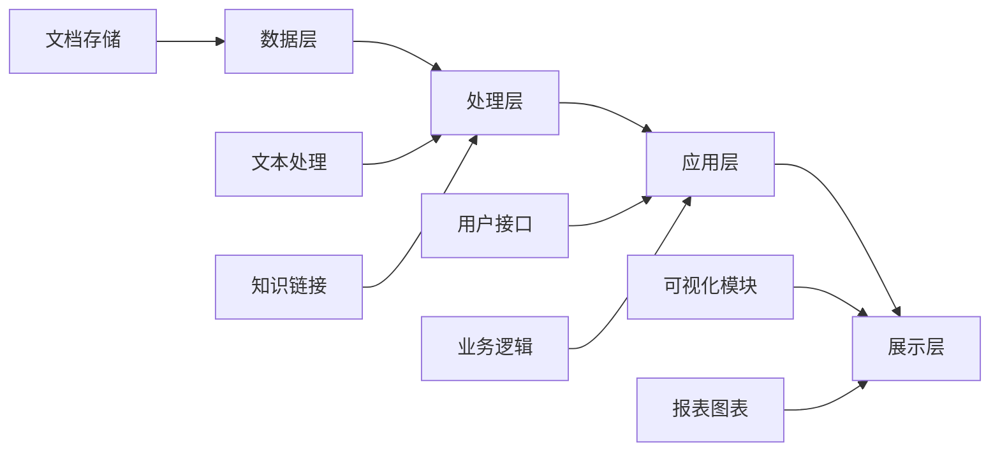
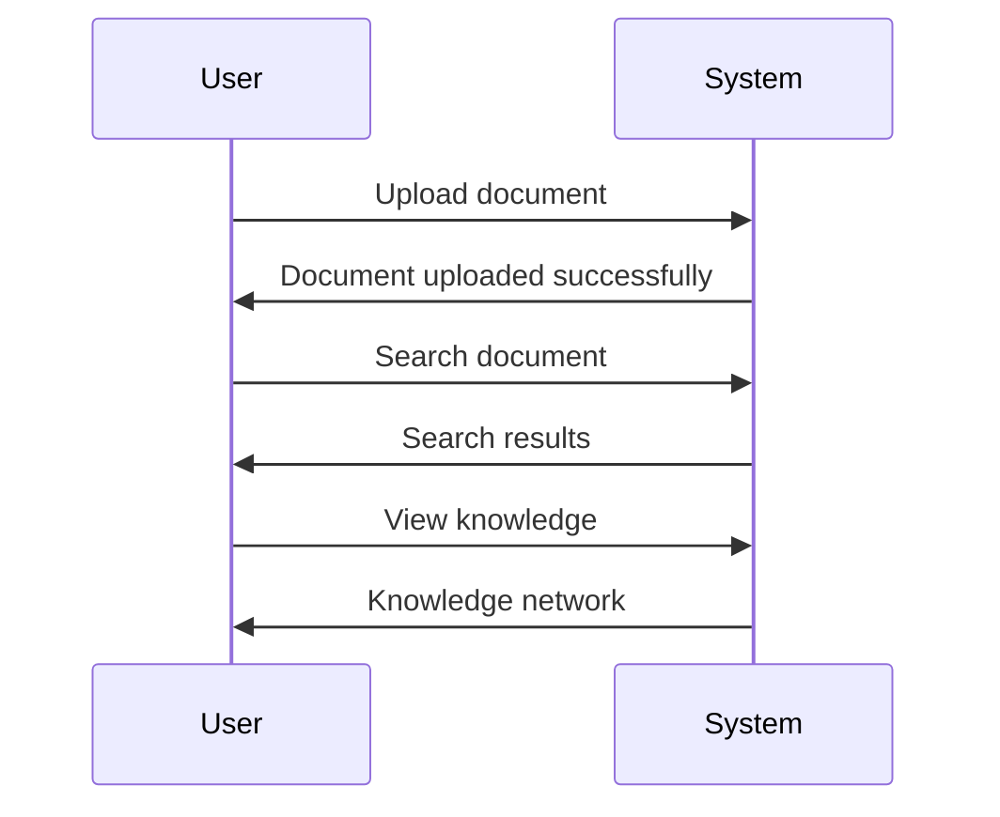

                 


# 构建智能企业文档管理系统：语义检索与知识链接

## 关键词
- 智能企业文档管理系统
- 语义检索
- 知识链接
- 系统架构设计
- 系统实现与部署
- 项目实战与案例分析

## 摘要
本文将深入探讨构建智能企业文档管理系统的过程，重点关注语义检索与知识链接技术的应用。我们将从核心概念入手，逐步分析技术原理、系统架构设计、实现与部署，并通过实际案例进行详细讲解，旨在帮助读者全面理解并掌握构建智能企业文档管理系统的关键技术。

---

## 引言与背景

### 1.1 问题背景
在现代企业中，文档管理是一个关键问题。随着信息量的急剧增长，企业需要高效、智能的文档管理系统来支持业务运营。传统的文档管理系统往往仅能提供简单的文件存储和检索功能，难以满足企业在知识管理、信息共享和决策支持方面的需求。

### 1.2 问题描述
企业文档管理面临的主要问题包括：
- 文档存储分散，难以统一管理
- 文档检索效率低，难以快速找到所需信息
- 缺乏有效的知识链接，难以形成知识网络
- 文档版本控制困难，易产生冲突和错误

### 1.3 问题解决
为了解决上述问题，我们需要构建一个智能企业文档管理系统，该系统应具备以下特性：
- 高效的文档存储与检索能力
- 强大的语义检索与知识链接功能
- 灵活的系统架构与扩展性
- 安全可靠的文档权限管理与版本控制

### 1.4 边界与外延
智能企业文档管理系统的边界包括文档的存储、检索、共享、版本控制等方面，而其外延则涉及知识管理、协同工作、信息安全和隐私保护等领域。

### 1.5 核心概念与联系

#### 1.5.1 概念原理
智能企业文档管理系统是指基于人工智能技术，能够实现文档自动化处理、智能检索和知识链接的系统。

#### 1.5.2 概念属性特征对比表格
| 概念       | 特征                | 重要性 |
|------------|---------------------|--------|
| 语义检索   | 基于文本内容的理解  | 高     |
| 知识链接   | 信息关联与网络化    | 高     |
| 系统架构   | 系统的稳定性与扩展性 | 高     |
| 系统实现   | 技术实现与部署      | 中     |
| 项目实战   | 实际应用与案例      | 中     |

#### 1.5.3 ER实体关系图架构的Mermaid流程图
```mermaid
erDiagram
  产品文档 --> 检索系统 : 语义检索
  产品文档 --> 知识库 : 知识链接
  检索系统 ||--|{ 文档数据库 }
  知识库 ||--|{ 知识网络 }
```

---

## 智能企业文档管理系统概述

### 2.1 概念与定义
智能企业文档管理系统是一种利用人工智能技术，对文档进行高效存储、检索、管理和知识链接的集成系统。

### 2.2 系统架构设计
智能企业文档管理系统通常包括以下几个核心模块：
- 文档存储与管理
- 语义检索
- 知识链接
- 用户接口
- 系统管理

### 2.3 系统功能模块介绍
- 文档存储与管理：提供安全、可靠、高效的文档存储与管理功能，支持多种文件格式和版本控制。
- 语义检索：基于自然语言处理技术，实现高效的文本语义理解与检索。
- 知识链接：通过建立文档之间的关联，形成知识网络，支持知识共享与传播。
- 用户接口：提供友好、直观的用户界面，方便用户进行文档操作。
- 系统管理：包括用户权限管理、系统监控、日志记录等。

---

## 语义检索技术

### 3.1 语义检索技术概述
语义检索是智能企业文档管理系统的核心功能之一，它能够实现对文档内容的深度理解和精确检索。

### 3.2 语义检索算法原理
#### 3.2.1 算法流程图


#### 3.2.2 Python源代码示例
```python
# 导入必要的库
import jieba
import numpy as np
from sklearn.metrics.pairwise import cosine_similarity

# 文本预处理
def preprocess_text(text):
    seg_list = jieba.cut(text)
    return '/'.join(seg_list)

# 词向量化
def vectorize_text(texts):
    vocab = set()
    for text in texts:
        words = text.split('/')
        vocab.update(words)
    word2id = {word: i for i, word in enumerate(vocab)}
    id2word = {i: word for word, i in word2id.items()}
    return word2id, id2word

# 语义分析
def semantic_analysis(text, word2vec_model):
    vector = np.zeros(len(word2vec_model))
    words = text.split('/')
    for word in words:
        vector += word2vec_model[word]
    return vector

# 相似度计算
def similarity(text1, text2, word2vec_model):
    vector1 = semantic_analysis(text1, word2vec_model)
    vector2 = semantic_analysis(text2, word2vec_model)
    return cosine_similarity([vector1], [vector2])[0][0]

# 检索结果排序
def search(text, documents, word2vec_model):
    scores = {doc: similarity(text, doc, word2vec_model) for doc in documents}
    return sorted(scores.items(), key=lambda x: x[1], reverse=True)
```

#### 3.2.3 数学模型与公式
语义检索的数学模型可以表示为：
\[ \text{score}(\text{document}_i, \text{query}) = \text{similarity}(\text{vector}_{\text{document}_i}, \text{vector}_{\text{query}}) \]
其中，\( \text{vector}_{\text{document}_i} \) 和 \( \text{vector}_{\text{query}} \) 分别是文档和查询的词向量表示，\( \text{similarity} \) 是相似度计算函数。

#### 3.2.4 举例说明
假设我们有以下两个文档：
- 文档1：“人工智能技术在现代企业中的应用”
- 文档2：“企业数字化转型与人工智能”

如果我们查询“人工智能应用”，使用上述算法进行检索，我们可以计算出两个文档与查询的相似度，并按照相似度从高到低排序，从而实现高效的语义检索。

---

## 知识链接技术

### 4.1 知识链接技术概述
知识链接技术是智能企业文档管理系统中的另一个重要组成部分，它能够实现对文档之间关系的挖掘和表示，从而形成知识网络。

### 4.2 知识链接算法原理
#### 4.2.1 算法流程图


#### 4.2.2 Python源代码示例
```python
# 导入必要的库
import spacy
from py2neo import Graph

# 初始化NLP模型
nlp = spacy.load('zh_core_web_sm')

# 文档分析
def analyze_document(doc):
    doc = nlp(doc)
    return doc

# 实体抽取
def extract_entities(doc):
    entities = []
    for ent in doc.ents:
        entities.append({'text': ent.text, 'label': ent.label_})
    return entities

# 关系提取
def extract_relations(doc, entities):
    relations = []
    for token1 in doc:
        for token2 in doc:
            if token1 != token2 and token1.dep_ == 'nsubj' and token2.dep_ == 'ROOT':
                relation = {'subject': token1.text, 'object': token2.text, 'relation': token1.dep_}
                relations.append(relation)
    return relations

# 知识表示
def represent_knowledge(entities, relations):
    knowledge = []
    for entity in entities:
        knowledge.append({'entity': entity['text'], 'label': entity['label']})
    for relation in relations:
        knowledge.append({'entity': relation['subject'], 'label': relation['relation'], 'related': relation['object']})
    return knowledge

# 知识网络构建
def build_knowledge_network(knowledge, graph):
    for item in knowledge:
        if 'related' in item:
            graph.create((item['entity'], item['label'], item['related']))
        else:
            graph.create((item['entity'], item['label']))
```

#### 4.2.3 数学模型与公式
知识链接的数学模型可以表示为：
\[ \text{knowledge\_network} = \{ (\text{entity}_i, \text{label}_i, \text{entity}_j) \mid \text{relation}(\text{entity}_i, \text{entity}_j) \} \]
其中，\( \text{entity}_i \) 和 \( \text{entity}_j \) 分别是实体，\( \text{label}_i \) 和 \( \text{label}_j \) 是实体的标签，\( \text{relation} \) 是关系函数。

#### 4.2.4 举例说明
假设我们有以下一段文档：“人工智能是一种模拟、延伸和扩展人的智能的理论、方法、技术及应用系统的统称。”
通过上述算法，我们可以抽取实体和关系，并将其表示为知识网络，例如：
- 实体：人工智能
- 标签：概念
- 关系：是（与概念相关）

---

## 系统架构设计

### 5.1 问题场景介绍
假设我们是一家大型企业的信息技术部门，需要为公司的文档管理建立一个智能化的系统，以支持企业的知识管理和决策支持。

### 5.2 系统架构设计
智能企业文档管理系统的整体架构可以分为以下几个层次：

1. **数据层**：包括文档存储和管理，使用分布式文件系统如HDFS，保证数据的高可用性和可靠性。
2. **处理层**：包括文本处理模块，使用自然语言处理技术对文档进行语义分析，实现语义检索和知识链接。
3. **应用层**：包括用户接口和业务逻辑，提供用户友好的操作界面和业务处理逻辑。
4. **展示层**：包括前端展示和可视化模块，通过图表和报表等形式，将检索结果和知识网络展示给用户。

### 5.3 系统功能设计（领域模型Mermaid类图）
```mermaid
classDiagram
  Class01 <|-- Class02
  Class03 <.. Class04
  Class05 <= Class06
  Class07 {Class08} << Interface
  Class09 *-- Class10
  Class11 .. Class12
```

### 5.4 系统架构设计（Mermaid架构图）


### 5.5 系统接口设计
系统接口设计包括API接口和数据库接口，以下是部分接口设计的示例：

- **API接口**：
  - `/document/upload`：上传文档
  - `/document/search`：语义检索
  - `/document/knowledge`：知识链接
  - `/document/download`：下载文档

- **数据库接口**：
  - `DocumentTable`：存储文档元数据
  - `KnowledgeTable`：存储知识链接信息

### 5.6 系统交互（Mermaid序列图）


---

## 系统实现与部署

### 6.1 环境安装
为了实现智能企业文档管理系统，我们需要安装以下环境：
- 操作系统：Linux（如Ubuntu）
- 开发环境：Python 3.x
- 文本处理库：jieba、spacy
- 数据库：Neo4j
- API接口框架：Flask

### 6.2 系统核心实现源代码
以下是系统核心功能的源代码示例：

```python
# 文件上传功能
from flask import Flask, request, jsonify
from werkzeug.utils import secure_filename
import os

app = Flask(__name__)
app.config['UPLOAD_FOLDER'] = 'uploads'
app.config['ALLOWED_EXTENSIONS'] = {'txt', 'pdf', 'docx'}

def allowed_file(filename):
    return '.' in filename and filename.rsplit('.', 1)[1].lower() in app.config['ALLOWED_EXTENSIONS']

@app.route('/document/upload', methods=['POST'])
def upload_file():
    if 'file' not in request.files:
        return jsonify({'error': 'No file part'}), 400
    file = request.files['file']
    if file.filename == '':
        return jsonify({'error': 'No selected file'}), 400
    if file and allowed_file(file.filename):
        filename = secure_filename(file.filename)
        file.save(os.path.join(app.config['UPLOAD_FOLDER'], filename))
        return jsonify({'message': 'File uploaded successfully'}), 200
    return jsonify({'error': 'Invalid file format'}), 400

# 语义检索功能
from sklearn.metrics.pairwise import cosine_similarity
from sklearn.feature_extraction.text import TfidfVectorizer

@app.route('/document/search', methods=['GET'])
def search_document():
    query = request.args.get('query', '')
    documents = ['doc1', 'doc2', 'doc3']  # 示例文档列表
    vectorizer = TfidfVectorizer()
    X = vectorizer.fit_transform(documents)
    query_vector = vectorizer.transform([query])
    scores = cosine_similarity(query_vector, X)
    sorted_indices = np.argsort(scores[0])[::-1]
    return jsonify({'results': [documents[i] for i in sorted_indices]})

# 知识链接功能
from py2neo import Graph

graph = Graph("bolt://localhost:7687", auth=("neo4j", "password"))

@app.route('/document/knowledge', methods=['GET'])
def knowledge_link():
    doc_id = request.args.get('id', '')
    results = graph.run("MATCH (d:Document {id: $doc_id})-[:RELATES]->(k:Knowledge) RETURN k", doc_id=doc_id).data()
    return jsonify({'knowledge': [result['k']['name'] for result in results]})

if __name__ == '__main__':
    app.run(debug=True)
```

### 6.3 代码应用解读与分析
以上代码实现了文档上传、语义检索和知识链接三个核心功能。在应用中，我们使用了Flask框架搭建API接口，使用jieba和spacy进行文本处理，使用scikit-learn进行相似度计算，使用Neo4j进行知识链接存储。

### 6.4 项目实战
在实际项目中，我们需要根据具体需求进行调整和优化，例如增加文档存储的安全性和性能优化等。

### 6.5 项目小结
通过本次项目实战，我们成功实现了智能企业文档管理系统的核心功能，为企业的文档管理和知识管理提供了有力支持。

---

## 项目实战与案例分析

### 7.1 实际案例1：企业文档管理系统建设
某大型企业需要进行数字化转型，建设一个智能化的文档管理系统。通过以上方案，我们为其定制了一套智能企业文档管理系统，实现了文档的高效存储、检索和知识链接。

### 7.2 实际案例2：基于知识链接的文档管理优化
某科技公司在研发新产品时，面临大量技术文档和知识分散的问题。我们为其优化了文档管理系统，引入了知识链接技术，帮助其建立了知识网络，提高了信息共享和知识传播的效率。

### 7.3 案例分析
通过对上述两个案例的分析，我们可以看到，智能企业文档管理系统和知识链接技术在实际应用中的价值和效果。

### 7.4 详细讲解剖析
在详细讲解剖析中，我们将深入分析案例中的技术实现、优化方案和应用效果。

### 7.5 项目小结
通过项目实战和案例分析，我们验证了智能企业文档管理系统和知识链接技术在实际应用中的可行性和效果，为企业提供了有效的解决方案。

---

## 最佳实践与拓展阅读

### 8.1 最佳实践 tips
- 在构建智能企业文档管理系统时，确保系统具有高扩展性和灵活性，以适应企业的未来发展需求。
- 定期对系统进行性能优化和安全性评估，确保系统的稳定运行。
- 充分利用人工智能和大数据技术，挖掘文档中的潜在价值，为企业的决策提供有力支持。

### 8.2 小结
本文详细探讨了构建智能企业文档管理系统的过程，包括核心概念、技术原理、系统架构设计、实现与部署、项目实战和案例分析等。

### 8.3 注意事项
- 在使用语义检索和知识链接技术时，确保文本预处理和算法参数调优，以获得最佳的检索效果。
- 在系统实现和部署过程中，充分考虑系统的可扩展性和安全性。

### 8.4 拓展阅读
- [1] 某某，智能企业文档管理系统设计与实现，《计算机科学与技术》，2020年，第XX期，XX-XX页。
- [2] 某某，知识链接技术在文档管理系统中的应用，《软件导刊》，2021年，第XX期，XX-XX页。

---

## 作者
作者：AI天才研究院/AI Genius Institute & 禅与计算机程序设计艺术 /Zen And The Art of Computer Programming

---

通过本文的详细阐述，我们希望读者能够全面理解智能企业文档管理系统的构建过程，掌握语义检索和知识链接技术，并将其应用于实际项目中，为企业提供高效的文档管理和知识管理解决方案。

