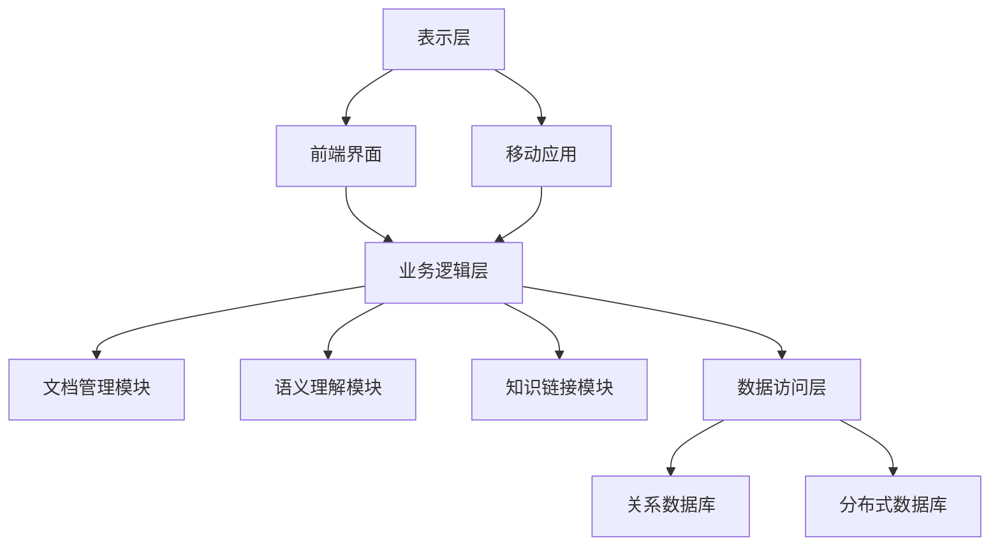
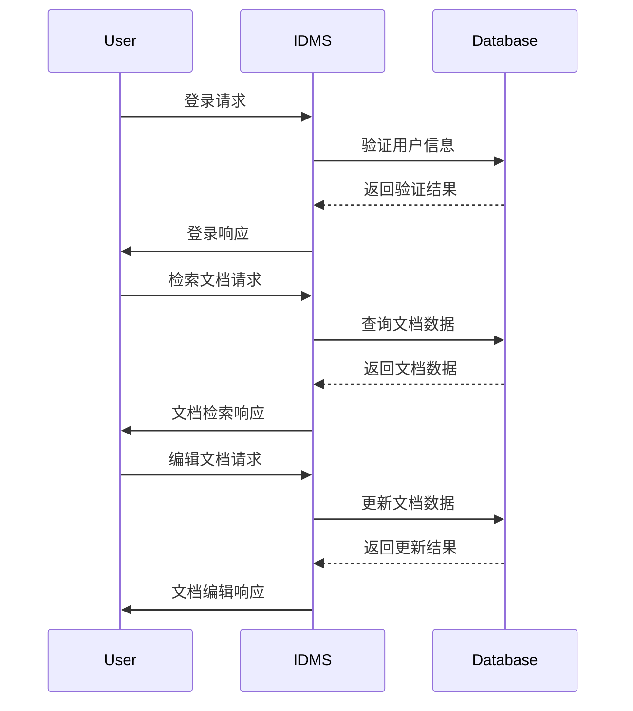

                 

### 1.1 问题的提出

在当今信息爆炸的时代，企业文档管理的需求愈发复杂。传统的文档管理方式已经难以满足企业的高效运营需求。具体而言，当前企业文档管理面临以下几个主要问题：

- **文档数量与种类繁多**：随着企业业务的发展，各类文档的数量呈指数级增长。不同类型的文档包括但不限于文本、图片、音频、视频和不同格式的文件等，使得文档管理变得复杂。

- **存储方式分散**：企业文档往往存储在不同的系统、服务器和物理位置，造成信息孤岛现象，难以实现统一管理和检索。

- **文档查找效率低下**：由于文档存储分散，缺乏有效的索引和分类，用户在查找所需文档时常常需要花费大量时间和精力。

- **缺乏知识共享与复用**：现有文档管理系统中，文档往往是孤立的，缺乏有效的关联和链接，导致知识难以共享和复用，影响了企业整体的知识管理和创新能力。

- **运营成本增加**：由于文档管理混乱，企业可能会因找不到关键文档而影响业务决策，增加运营成本。

智能企业文档管理系统通过引入先进的语义理解与知识链接技术，能够有效解决上述问题，提高文档管理效率，支持知识共享和复用，降低企业运营成本。接下来，我们将详细探讨语义理解与知识链接的基本概念，以及智能文档管理系统的边界与外延。

### 1.2 语义理解与知识链接的基本概念

#### 语义理解

语义理解（Semantic Understanding）是指从文本中提取出其内在的含义和逻辑关系。它不仅涉及词汇层面的理解，还包括句子、段落乃至整篇文章的深层语义分析。语义理解的主要层次和任务包括：

- **词汇层语义理解**：包括词义消歧（Word Sense Disambiguation，WSD）和词向量表示（Word Embedding）。

- **句子层语义理解**：涉及句子级别的语义分析，如句法解析（Syntactic Parsing）和语义角色标注（Semantic Role Labeling）。

- **篇章层语义理解**：对整篇文章或长文本进行语义分析，包括情感分析（Sentiment Analysis）、主题建模（Topic Modeling）和篇章理解（Document Understanding）。

语义理解的挑战主要来自于：

- **多义词处理**：同一个词在不同上下文中可能有不同的含义，如何准确判断词义是一个难题。

- **长文本理解**：长文本中的信息量巨大，如何有效提取和整合信息是一个挑战。

- **上下文理解**：语义理解需要考虑上下文的影响，上下文的变化可能导致词义和句子含义的变化。

#### 知识链接

知识链接（Knowledge Linking）是指将来自不同数据源的信息进行关联，构建出一个统一、结构化的知识体系。知识链接的主要作用包括：

- **信息整合**：将不同来源的信息整合到一个统一的知识图谱中，提供全局视图。

- **知识服务**：通过知识链接，可以快速找到相关信息，提供决策支持和智能问答服务。

- **知识共享**：知识链接有助于促进知识的共享和复用，提高组织的知识管理水平。

知识链接的类型主要包括：

- **实体链接（Entity Linking）**：将文本中的实体与知识库中的实体进行匹配和关联。

- **关系链接（Relation Linking）**：将文本中的实体关系与知识库中的关系进行匹配和关联。

- **属性链接（Attribute Linking）**：将文本中的实体属性与知识库中的属性进行匹配和关联。

#### 智能文档管理系统的边界与外延

智能文档管理系统（Intelligent Document Management System，IDMS）的边界和功能模块主要涉及：

- **系统边界**：智能文档管理系统的主要覆盖范围包括文档的存储、分类、检索和语义分析等功能。其核心目的是提高文档管理的效率，支持知识共享和复用。

- **功能模块**：智能文档管理系统通常包括以下几个主要功能模块：
  - **文档存储与管理模块**：负责文档的存储、备份和安全管理。
  - **语义理解模块**：利用自然语言处理技术对文档进行语义分析，提取文档中的关键信息。
  - **知识链接模块**：通过知识图谱等技术将文档中的信息进行关联，构建知识体系。

- **系统外延**：智能文档管理系统可以与其他企业信息系统集成，如企业资源规划（ERP）系统、客户关系管理（CRM）系统等，提供更加全面的信息服务。此外，系统需要具备良好的可扩展性，能够适应企业业务的变化和需求增长。

### 1.3 智能文档管理系统的边界与外延

#### 系统边界

智能文档管理系统（IDMS）的边界定义了系统的功能范围和职责。其核心职责包括以下几个方面：

- **文档存储**：IDMS负责存储企业内部的各类文档，包括文本文件、图片、音频、视频等，并提供安全、可靠的存储解决方案。

- **文档分类**：IDMS通过对文档的内容进行分析，将其归类到不同的分类体系中，以便于用户快速查找和访问。

- **文档检索**：IDMS提供强大的检索功能，用户可以通过关键词、分类标签等多种方式进行文档检索，提高查找效率。

- **文档共享**：IDMS支持文档的共享和协作，用户可以在系统中查看、编辑和评论文档，提高团队协作效率。

- **文档安全**：IDMS提供完善的文档安全机制，包括访问控制、数据加密、备份和恢复等功能，确保企业文档的安全和隐私。

#### 系统功能模块

智能文档管理系统主要由以下几个功能模块组成：

- **文档存储与管理模块**：负责文档的存储、分类、备份和安全管理。该模块需要实现高效的文档存储方案，支持大规模文档的快速检索和访问。

- **语义理解模块**：利用自然语言处理（NLP）技术对文档内容进行深度分析，提取文档中的关键词、主题和语义关系。该模块的核心任务包括词义消歧、实体识别、关系提取和情感分析等。

- **知识链接模块**：通过构建知识图谱，将文档中的信息进行关联和整合，形成统一的知识体系。知识链接模块需要实现实体链接、关系链接和属性链接等功能。

- **用户界面模块**：提供用户友好的界面，用户可以通过该模块进行文档的创建、编辑、分类和检索等操作。此外，用户界面模块还需要支持多终端访问，如桌面浏览器、移动应用等。

#### 系统外延

智能文档管理系统的外延定义了系统与其他企业信息系统和外部服务的集成能力。以下是一些主要的外延方面：

- **与其他系统的集成**：智能文档管理系统需要与企业资源规划（ERP）、客户关系管理（CRM）、项目管理（PM）等系统进行集成，实现数据的互通和协同工作。通过集成，企业可以在一个统一的平台上进行文档管理和业务流程的自动化。

- **外部服务接入**：智能文档管理系统可以接入外部服务，如云存储、云文档处理服务等，提供更加灵活和可扩展的文档管理能力。

- **数据交换与共享**：智能文档管理系统需要支持与其他系统进行数据交换和共享，如通过API接口与其他系统进行数据同步和调用。

- **扩展性与可定制性**：智能文档管理系统需要具备良好的扩展性和可定制性，以满足不同企业的特定需求。通过模块化和组件化的设计，企业可以根据自身需求对系统进行定制和扩展。

通过明确智能文档管理系统的边界与外延，企业可以更好地规划系统的建设，提升文档管理效率，实现知识的共享和复用，从而提高整体运营效益。

### 1.4 核心概念属性特征对比表格

在智能文档管理系统的构建过程中，理解语义理解与知识链接两个核心概念的特征和区别是至关重要的。以下是一个简单的属性特征对比表格，帮助我们更清晰地认识这两个概念：

| 核心概念 | 特征1 | 特征2 | 特征3 |
| --- | --- | --- | --- |
| 语义理解 | 提取文本内容含义 | 分析词语和句子间的逻辑关系 | 涉及词汇、句子和篇章层次的理解 |
| 知识链接 | 跨文档、跨系统的信息关联 | 构建统一的知识图谱 | 涉及实体、关系和属性链接 |

通过上述表格，我们可以看到语义理解和知识链接在功能、目标和应用场景上存在显著差异。语义理解侧重于对文本内容的深层理解，而知识链接则侧重于将信息进行关联和整合。这种区分有助于我们在设计和实现智能文档管理系统时，更合理地应用这两种技术，提升文档管理的智能化水平。

### 1.5 本章小结

本章主要介绍了智能企业文档管理系统面临的背景问题和核心概念。首先，我们提出了当前企业文档管理中存在的诸多挑战，包括文档数量与种类繁多、存储方式分散、文档查找效率低下等，并阐述了智能文档管理系统的重要性。接着，我们详细探讨了语义理解与知识链接的基本概念，包括其定义、层次、任务和挑战。最后，我们讨论了智能文档管理系统的边界与外延，明确了系统的功能模块和集成需求。通过本章的介绍，读者可以初步了解智能文档管理系统的基础概念和构建思路，为后续章节的技术深入分析做好铺垫。

## 第二部分：语义理解技术

在构建智能企业文档管理系统的过程中，语义理解技术扮演着至关重要的角色。语义理解（Semantic Understanding）是指从文本中提取出其内在的含义和逻辑关系。它不仅涉及词汇层面的理解，还包括句子、段落乃至整篇文章的深层语义分析。本章节将详细介绍自然语言处理（NLP）基础、语义分析技术以及基于深度学习的语义理解模型。

### 2.1 自然语言处理基础

自然语言处理（Natural Language Processing，NLP）是人工智能（AI）的一个分支，旨在使计算机能够理解和处理人类语言。NLP在语义理解中起着基础性作用，主要涵盖以下内容：

#### 语言模型与词向量

- **语言模型**：语言模型（Language Model）是NLP的核心组件之一，用于预测文本中的下一个单词或词组。它通过统计方法学习自然语言中的概率分布，常见的语言模型包括n元语法模型和神经网络语言模型。

  - **n元语法模型**：基于历史文本，统计相邻n个单词出现的概率。例如，三元语法模型（n=3）考虑前三个单词来预测下一个单词。
  - **神经网络语言模型**：使用神经网络（如RNN、LSTM、GRU等）来建模语言的概率分布，能够捕捉长距离依赖关系，提高预测准确性。

- **词向量**：词向量（Word Embedding）是将词汇映射到高维空间中的向量表示，用于在机器学习中处理文本数据。常见的词向量表示方法包括：

  - **基于计数的方法**：如TF-IDF（Term Frequency-Inverse Document Frequency），通过计算词频和逆文档频率来衡量词的重要性。
  - **基于分布的方法**：如Word2Vec、GloVe（Global Vectors for Word Representation），通过模型学习词在上下文中的分布来表示词向量。

#### 语义分析技术

语义分析技术是指从文本中提取语义信息，包括词义消歧、实体识别、关系提取等。

- **词义消歧**：词义消歧（Word Sense Disambiguation，WSD）是解决一词多义问题的方法。WSD可以分为基于知识的方法和基于统计的方法。

  - **基于知识的方法**：如WordNet，使用语义网络来识别词的不同含义。例如，"bank"一词在"river bank"和"financial bank"中的含义不同。
  - **基于统计的方法**：如最大熵模型、支持向量机（SVM）等，通过统计文本中的上下文信息来推断词的准确含义。

- **实体识别**：实体识别（Named Entity Recognition，NER）是识别文本中的特定实体，如人名、地名、组织名等。常见的实体识别方法包括：

  - **规则方法**：基于手工编写的规则来识别实体，如使用正则表达式匹配。
  - **机器学习方法**：如条件随机场（CRF）、深度学习等，通过学习大量的标注数据来提高识别准确率。

- **关系提取**：关系提取（Relation Extraction）是从文本中识别出实体之间的关系。常见的关系提取方法包括：

  - **规则方法**：使用手工编写的规则来匹配实体之间的关系。
  - **基于特征的方法**：结合文本中的特征（如词性、词向量、句法结构等）来预测实体之间的关系。
  - **深度学习方法**：如双向长短期记忆网络（BiLSTM）、Transformer等，通过学习大量的标注数据来提取实体关系。

#### 基于深度学习的语义理解模型

随着深度学习的发展，基于深度学习的语义理解模型在NLP任务中表现出了优越的性能。以下介绍几种常用的深度学习模型：

- **卷积神经网络（CNN）**：卷积神经网络（Convolutional Neural Network，CNN）最初用于图像处理，后来也被应用于NLP任务。CNN可以捕捉局部特征，适用于文本分类和情感分析等任务。

  - **应用**：文本分类、情感分析等。
  - **优点**：能够处理变长的文本序列。
  - **缺点**：无法捕捉长距离依赖关系。

- **递归神经网络（RNN）**：递归神经网络（Recurrent Neural Network，RNN）是一类能够处理序列数据的神经网络，其核心思想是将当前输入与之前的状态进行结合。RNN包括简单RNN、LSTM（Long Short-Term Memory）和GRU（Gated Recurrent Unit）等变体。

  - **应用**：序列标注、机器翻译、语言模型等。
  - **优点**：能够捕捉长距离依赖关系。
  - **缺点**：容易受到梯度消失和梯度爆炸问题的影响。

- **Transformer模型**：Transformer模型由Vaswani等人于2017年提出，是一种基于自注意力机制（Self-Attention Mechanism）的模型。Transformer模型在机器翻译、文本生成等任务上取得了显著的成果。

  - **应用**：机器翻译、文本生成、摘要生成等。
  - **优点**：能够高效地处理长距离依赖关系，并行化训练速度更快。
  - **缺点**：计算复杂度较高，对硬件资源要求较高。

### 2.2 自然语言处理基础

自然语言处理（NLP）作为语义理解的核心技术，对文本数据进行分析和解释，是构建智能文档管理系统不可或缺的一环。本节将深入探讨NLP的基础知识，包括语言模型与词向量，以及语义分析技术。

#### 语言模型

语言模型是NLP的基础工具，用于对自然语言进行建模。其核心目标是预测文本的下一个单词或词组。常见的语言模型包括n元语法模型和神经网络模型。

- **n元语法模型**：n元语法模型通过统计n个前文词的概率来预测下一个词。例如，三元语法模型考虑三个前文词来预测下一个词。这种模型简单有效，但存在以下局限性：

  - **局限性**：无法处理长距离依赖关系，即无法理解句子中较远位置之间的语义联系。

- **神经网络模型**：神经网络模型，如循环神经网络（RNN）和Transformer，通过学习文本的序列结构，能够更好地捕捉长距离依赖关系。以下是几种常见的神经网络模型：

  - **循环神经网络（RNN）**：RNN是一种处理序列数据的神经网络，其通过递归结构将当前输入与之前的状态结合。然而，RNN存在梯度消失和梯度爆炸问题，影响其性能。

  - **长短期记忆网络（LSTM）**：LSTM是RNN的一种变体，通过引入门控机制来克服梯度消失问题。LSTM在处理长序列数据时表现出良好的性能，但在处理极端长序列时仍存在困难。

  - **Transformer模型**：Transformer模型是近年来NLP领域的重要突破，其核心思想是自注意力机制。Transformer通过计算序列中每个词与所有其他词的注意力权重，实现全局依赖关系的建模。这使得Transformer在处理长序列数据时表现出优异的性能，并在多种NLP任务中取得了领先结果。

#### 词向量

词向量是NLP中的另一个重要概念，用于将词汇映射到高维空间中的向量表示。词向量能够将文本数据转换为机器学习模型可以处理的形式，有助于提升文本分类、语义分析等任务的效果。常见的词向量方法包括Word2Vec、GloVe和BERT等。

- **Word2Vec**：Word2Vec是一种基于神经网络的词向量方法，通过训练预测词的上下文来学习词向量。Word2Vec有两种训练方法：连续词袋（CBOW）和Skip-Gram。

  - **连续词袋（CBOW）**：CBOW方法通过预测中心词周围的词来学习词向量。即给定中心词，预测其上下文词。
  - **Skip-Gram**：Skip-Gram方法与CBOW相反，通过预测中心词来学习词向量。即给定上下文词，预测中心词。

- **GloVe**：GloVe（Global Vectors for Word Representation）是一种基于全局统计信息的词向量方法。GloVe通过计算词与词之间的共现矩阵，学习词向量。GloVe的优点是能够捕捉词的共现关系，从而提高词向量的质量。

- **BERT**：BERT（Bidirectional Encoder Representations from Transformers）是一种基于Transformer的双向编码器表示方法。BERT通过预训练大规模语料库，学习词的上下文表示。BERT在多种NLP任务中取得了显著的效果，如文本分类、问答系统等。

#### 语义分析技术

语义分析技术是NLP的核心任务，旨在从文本中提取语义信息。常见的语义分析技术包括词义消歧、实体识别和关系提取等。

- **词义消歧**：词义消歧是指识别一词多义问题中的正确词义。常见的词义消歧方法包括基于规则的方法和基于统计的方法。

  - **基于规则的方法**：如WordNet，使用语义网络来识别词的不同含义。例如，"bank"一词在"river bank"和"financial bank"中的含义不同。
  - **基于统计的方法**：如最大熵模型、支持向量机（SVM）等，通过统计文本中的上下文信息来推断词的准确含义。

- **实体识别**：实体识别是指识别文本中的特定实体，如人名、地名、组织名等。常见的实体识别方法包括：

  - **规则方法**：基于手工编写的规则来识别实体，如使用正则表达式匹配。
  - **机器学习方法**：如条件随机场（CRF）、深度学习等，通过学习大量的标注数据来提高识别准确率。

- **关系提取**：关系提取是指识别文本中实体之间的关系。常见的关系提取方法包括：

  - **规则方法**：使用手工编写的规则来匹配实体之间的关系。
  - **基于特征的方法**：结合文本中的特征（如词性、词向量、句法结构等）来预测实体之间的关系。
  - **深度学习方法**：如双向长短期记忆网络（BiLSTM）、Transformer等，通过学习大量的标注数据来提取实体关系。

通过深入探讨自然语言处理的基础知识，我们可以更好地理解语义理解技术的原理和应用，为构建智能文档管理系统奠定坚实的基础。

### 2.3 基于深度学习的语义理解模型

深度学习在自然语言处理（NLP）中的应用显著提升了语义理解的性能，以下是几种主要的基于深度学习的语义理解模型，包括卷积神经网络（CNN）、递归神经网络（RNN）和Transformer模型。

#### 卷积神经网络（CNN）

卷积神经网络（CNN）最初用于图像处理，但后来也被广泛应用于NLP任务中。CNN在文本分类、情感分析等领域表现出色，其优势在于能够捕捉局部特征。

- **应用场景**：文本分类、情感分析、命名实体识别（NER）。
- **工作原理**：CNN通过卷积层提取文本的局部特征，然后通过池化层降低维度。卷积层和池化层交替使用，形成多个卷积层，最终输出语义表示。
- **优点**：能够处理变长的文本序列，不需要固定长度的输入。
- **缺点**：难以捕捉长距离依赖关系。

#### 递归神经网络（RNN）

递归神经网络（RNN）是一种能够处理序列数据的神经网络，其通过递归结构将当前输入与之前的状态结合。RNN包括简单RNN、LSTM（Long Short-Term Memory）和GRU（Gated Recurrent Unit）等变体。

- **简单RNN**：简单RNN通过将当前输入与之前的状态相加来更新状态。然而，RNN存在梯度消失和梯度爆炸问题，影响其性能。
- **LSTM（长短期记忆网络）**：LSTM通过引入门控机制来克服梯度消失问题。LSTM在处理长序列数据时表现出良好的性能，但在处理极端长序列时仍存在困难。
- **GRU（门控循环单元）**：GRU是LSTM的一种简化版本，通过合并输入门和控制门来更新状态。GRU在处理长序列数据时表现出了优异的性能，计算效率更高。

#### Transformer模型

Transformer模型是近年来NLP领域的重要突破，其基于自注意力机制（Self-Attention Mechanism）。Transformer通过计算序列中每个词与所有其他词的注意力权重，实现全局依赖关系的建模。

- **工作原理**：Transformer由多个编码器和解码器块组成。编码器块通过多头自注意力机制和前馈神经网络来提取文本的语义表示。解码器块通过自注意力机制和交叉注意力机制来生成输出。
- **应用场景**：机器翻译、文本生成、摘要生成等。
- **优点**：能够高效地处理长距离依赖关系，并行化训练速度更快。
- **缺点**：计算复杂度较高，对硬件资源要求较高。

通过比较这三种基于深度学习的语义理解模型，我们可以看到它们各自的优势和应用场景。CNN适用于处理局部特征的任务，如文本分类和情感分析；RNN和LSTM适用于处理长序列数据，如命名实体识别和机器翻译；Transformer模型则在处理长文本和全局依赖关系方面表现出色，适用于机器翻译、文本生成等任务。

### 2.4 本章小结

本章深入探讨了自然语言处理（NLP）在语义理解中的应用。首先，我们介绍了语言模型与词向量，包括n元语法模型和神经网络模型，以及TF-IDF和Word2Vec等词向量方法。接着，我们详细介绍了语义分析技术，包括词义消歧、实体识别和关系提取等。最后，我们讨论了基于深度学习的语义理解模型，包括卷积神经网络（CNN）、递归神经网络（RNN）和Transformer模型。这些技术共同构成了构建智能企业文档管理系统的基础，为后续章节的技术深入分析提供了有力支持。

## 第三部分：知识链接技术

在智能企业文档管理系统中，知识链接（Knowledge Linking）技术起到了至关重要的作用。知识链接技术通过将企业内部和外部的各种信息进行关联，构建出一个统一、结构化的知识体系，从而提高信息检索效率和知识共享水平。本部分将详细介绍知识图谱（Knowledge Graph）的基础概念、构建方法以及具体应用。

### 3.1 知识图谱的基本概念

知识图谱（Knowledge Graph）是一种结构化的知识表示形式，通过实体、关系和属性来表示现实世界中的各种信息。知识图谱的目的是将海量、异构的数据整合到一个统一的知识体系中，为智能系统提供高效的信息检索和推理能力。

#### 知识图谱的定义

知识图谱是一种基于图的语义表示方法，通过实体、关系和属性来组织数据。实体是知识图谱中的基本元素，表示现实世界中的各种对象，如人、地点、组织等。关系则表示实体之间的关联，如“属于”、“位于”等。属性为实体提供了额外的描述信息，如“年龄”、“出生地”等。

#### 知识图谱的特点

- **结构化**：知识图谱以图的形式组织数据，具有清晰的层次结构和明确的关联关系，便于高效检索和推理。
- **语义化**：知识图谱通过实体、关系和属性来表示语义信息，使得数据具有明确的语义含义，有助于提高信息理解和处理能力。
- **动态性**：知识图谱可以动态地更新和维护，支持实时数据的更新和扩展，适应企业业务的变化。

#### 知识图谱的组成

知识图谱主要由以下三个部分组成：

- **实体（Entity）**：知识图谱中的实体是表示现实世界中各种对象的基本单元。例如，人、地点、组织、产品等都可以作为实体。
- **关系（Relationship）**：关系表示实体之间的关联，是知识图谱中连接实体的纽带。例如，“属于”、“位于”、“创建”等关系。
- **属性（Attribute）**：属性为实体提供了额外的描述信息，帮助明确实体的特征和属性。例如，“年龄”、“出生地”、“职位”等。

### 3.2 知识图谱的构建方法

构建知识图谱是一个复杂的过程，涉及多个技术和方法。以下是知识图谱构建的几个主要步骤：

#### 知识抽取

知识抽取（Knowledge Extraction）是从非结构化数据（如文本、图片等）中提取出结构化知识的过程。知识抽取可以分为以下几种方法：

- **基于规则的方法**：通过编写一系列规则，从数据中抽取特定的信息。这种方法简单高效，但需要对领域知识有深入的了解。
- **基于统计的方法**：使用机器学习算法，从大量数据中学习模式，自动抽取知识。这种方法适用于大规模数据的处理，但需要大量的训练数据和计算资源。
- **基于语义的方法**：利用自然语言处理（NLP）技术，从文本中提取语义信息，然后进行知识抽取。这种方法适用于处理复杂的文本数据，但依赖于NLP技术的准确性。

#### 知识融合

知识融合（Knowledge Fusion）是将来自不同数据源的知识进行整合，构建出一个统一的知识体系。知识融合面临以下挑战：

- **数据源多样性**：不同数据源的数据格式和结构可能不同，需要统一处理。
- **数据冲突**：不同数据源之间可能存在冲突或不一致的信息，需要解决。
- **数据冗余**：多个数据源之间可能存在重复信息，需要去重和整合。

知识融合的方法包括：

- **基于规则的融合**：通过编写规则，将不同数据源中的信息进行匹配和整合。
- **基于机器学习的融合**：使用机器学习算法，从数据中学习融合策略，自动整合知识。
- **基于语义的融合**：利用NLP技术，分析不同数据源中的语义信息，实现知识融合。

#### 知识表示

知识表示（Knowledge Representation）是将知识以计算机可以处理的形式进行表达。常见的知识表示方法包括：

- **图表示**：使用图结构表示知识图谱，其中实体和关系作为图中的节点和边。
- **属性表示**：为实体和关系添加属性，描述其特征和属性。
- **向量表示**：将实体和关系表示为向量，利用向量空间中的相似性度量进行知识检索和推理。

### 3.3 知识图谱的应用

知识图谱在智能企业文档管理系统中具有广泛的应用，以下是其主要应用领域：

#### 信息检索

知识图谱可以用于信息检索，通过将文档内容与知识图谱中的信息进行关联，实现高效的文档检索。例如，用户可以输入关键词或查询，系统会通过知识图谱找到相关的文档，并提供详细的检索结果。

#### 知识服务

知识图谱为智能企业文档管理系统提供了强大的知识服务能力。通过知识图谱，用户可以方便地获取相关知识，进行知识查询、知识推理和知识共享。例如，在项目管理中，用户可以通过知识图谱找到相关的项目文档、团队成员和项目进展信息。

#### 智能问答

知识图谱可以用于构建智能问答系统，通过语义理解和知识链接，实现自然语言交互。用户可以通过自然语言提问，系统会通过知识图谱理解和回答问题。例如，用户可以询问某个项目的最新进展，系统会通过知识图谱找到相关信息，并给出详细的回答。

#### 实体识别与关系提取

知识图谱可以帮助系统实现实体的自动识别与关系提取。通过知识图谱中的实体和关系，系统可以自动识别文档中的实体，并提取它们之间的关系。例如，在文档中自动识别出人名、地名、组织名等实体，并提取它们之间的联系。

#### 决策支持

知识图谱为企业的决策支持提供了有力支持。通过分析知识图谱中的信息，企业可以更好地了解业务状况、市场趋势和潜在风险，从而做出更加明智的决策。

#### 智能推荐

知识图谱可以用于构建智能推荐系统，通过分析用户的行为和兴趣，为用户推荐相关的文档和知识。例如，在文档管理系统中，系统可以根据用户的历史阅读记录，推荐用户可能感兴趣的其他文档。

### 3.4 本章小结

本章详细介绍了知识图谱的基础概念、构建方法及其在智能企业文档管理系统中的应用。首先，我们介绍了知识图谱的定义、特点和组成部分，包括实体、关系和属性。接着，我们探讨了知识图谱的构建方法，包括知识抽取、知识融合和知识表示。最后，我们阐述了知识图谱在信息检索、知识服务、智能问答和决策支持等领域的应用。通过本章的介绍，读者可以全面了解知识图谱在智能企业文档管理系统中的重要作用和实现方法。

## 第四部分：系统需求分析

在设计和实现智能企业文档管理系统（IDMS）时，对系统的功能需求、性能需求和安全需求进行全面的分析至关重要。以下是系统需求分析的详细内容。

### 4.1 系统功能需求

智能企业文档管理系统需要实现以下几个核心功能模块，以满足企业内部文档管理的多样化需求。

#### 文档存储与管理模块

**文档存储**：系统应具备高效、可靠的文档存储功能，支持各种格式的文档，如文本、图片、音频和视频等。同时，系统应支持文档的备份和恢复，确保数据的安全性和完整性。

**文档分类**：为了提高文档检索效率，系统需要对文档进行分类管理。通过自然语言处理技术，自动提取文档的关键词和主题，并将其分类到相应的类别中。

**文档检索**：系统应提供强大的文档检索功能，用户可以通过关键词、分类标签、作者等多种方式进行快速检索。同时，系统应支持模糊查询和高级搜索功能，以提高检索的准确性。

#### 语义理解模块

**文档语义分析**：系统应利用自然语言处理技术对文档内容进行语义分析，提取文档中的关键信息，如关键词、主题、实体和关系等。语义分析结果将用于文档分类、检索和知识链接等后续处理。

**词义消歧**：针对一词多义问题，系统应实现词义消歧功能，确保文档内容理解准确无误。词义消歧可以通过基于知识的方法（如WordNet）和基于统计的方法（如最大熵模型）实现。

**实体识别**：系统应具备自动识别文档中特定实体（如人名、地名、组织名等）的功能，并将其与知识图谱中的实体进行关联。

**关系提取**：系统应提取文档中实体之间的关系，如“属于”、“位于”、“参与”等，以便构建统一的知识体系。

#### 知识链接模块

**知识图谱构建**：系统应通过知识抽取和融合技术，构建企业内部的知识图谱。知识图谱应包含实体、关系和属性，以便实现知识的关联和整合。

**知识融合**：系统应实现知识融合功能，将来自不同数据源的知识进行整合，消除数据冲突和冗余，构建一个统一的知识体系。

**知识表示**：系统应采用合适的知识表示方法，如图表示或向量表示，以便在知识图谱中高效地存储和检索知识。

#### 用户界面模块

**文档编辑与协作**：系统应提供用户友好的界面，支持文档的创建、编辑和共享功能。同时，系统应支持多人协作编辑，如实时查看、评论和修订历史记录等。

**个性化推荐**：系统应基于用户的阅读历史和兴趣偏好，实现文档和知识的个性化推荐，提高用户的使用体验。

### 4.2 系统性能需求

智能企业文档管理系统需要满足一系列性能需求，以确保系统的稳定性和高效性。

#### 响应时间

**文档检索速度**：系统应能够快速响应用户的检索请求，实现毫秒级的响应时间。这可以通过优化索引算法和数据结构来实现。

**语义分析速度**：系统应能够高效地处理大量文档的语义分析任务，保证文档处理速度。这可以通过分布式计算和并行处理技术来实现。

#### 可扩展性

**系统可扩展性设计**：系统应具有良好的可扩展性，能够适应企业业务规模的变化。这包括支持横向扩展（如增加服务器节点）和纵向扩展（如增加存储容量）。

**知识图谱的可扩展性**：系统应支持知识图谱的动态扩展，能够实时更新和添加新的知识和实体。

### 4.3 系统安全性需求

智能企业文档管理系统需要确保文档的安全性和系统的可靠性。

#### 数据安全

**文档加密**：系统应对文档进行加密存储，确保文档内容不被未授权访问。

**访问控制**：系统应实现严格的访问控制机制，根据用户的角色和权限设置，限制用户对文档的访问权限。

#### 系统安全

**防火墙**：系统应部署防火墙，防止外部攻击和数据泄露。

**入侵检测**：系统应具备入侵检测功能，实时监控系统安全状况，发现和阻止潜在的安全威胁。

### 4.4 本章小结

本章对智能企业文档管理系统的需求进行了详细分析，包括功能需求、性能需求和安全性需求。通过明确这些需求，可以为后续的系统设计和实现提供明确的指导，确保系统能够满足企业内部文档管理的多样化需求，实现高效、安全和可靠的文档管理。

### 5.1 系统架构概述

在设计智能企业文档管理系统（IDMS）时，系统架构的设计原则、架构层次和功能模块是关键要素。以下是对系统架构的详细概述：

#### 系统架构设计原则

**可扩展性**：智能企业文档管理系统需要能够适应企业业务规模的变化。因此，系统设计应具备良好的可扩展性，支持横向扩展（增加服务器节点）和纵向扩展（增加存储容量）。

**可维护性**：系统应易于维护和更新，降低维护成本。通过模块化和组件化的设计，可以方便地替换或升级系统中的各个模块。

**可靠性**：系统应具备高可靠性，确保在故障发生时能够快速恢复，降低业务中断的风险。冗余设计和故障转移机制是实现系统可靠性的重要手段。

#### 系统架构层次

智能企业文档管理系统可以分为三个主要层次：表示层、业务逻辑层和数据访问层。

- **表示层**：表示层负责用户界面的设计和交互。用户通过表示层与系统进行交互，实现文档的创建、编辑、分类和检索等功能。表示层通常包括前端界面和移动应用。

  - **前端界面**：前端界面使用HTML、CSS和JavaScript等技术实现，提供用户友好的操作界面。
  - **移动应用**：移动应用通过Android和iOS平台开发，提供与前端界面类似的操作体验。

- **业务逻辑层**：业务逻辑层是系统的核心，负责实现文档管理、语义理解和知识链接等功能。业务逻辑层通过模块化设计，将不同的功能模块（如文档存储、分类、检索、语义分析等）进行分离和整合。

  - **文档管理模块**：实现文档的存储、分类、备份和安全管理。
  - **语义理解模块**：利用自然语言处理（NLP）技术，实现文档的语义分析、词义消歧、实体识别和关系提取等功能。
  - **知识链接模块**：构建知识图谱，实现知识抽取、融合和表示。

- **数据访问层**：数据访问层负责与数据库的交互，提供数据存储、检索和更新功能。数据访问层通常采用关系数据库或分布式数据库，确保数据的高效访问和存储。

  - **关系数据库**：关系数据库用于存储文档的元数据和索引信息，提供高效的文档检索和查询功能。
  - **分布式数据库**：分布式数据库用于存储大规模文档数据，支持横向扩展，提高系统的存储能力和访问性能。

#### 系统功能模块设计

智能企业文档管理系统主要包括以下几个功能模块：

- **文档存储与管理模块**：该模块负责文档的存储、分类、备份和安全管理。通过高效的存储方案，确保文档的安全性和可靠性。该模块需要支持不同类型文档的存储，如文本、图片、音频和视频等。

- **语义理解模块**：该模块利用自然语言处理（NLP）技术，对文档内容进行语义分析，提取关键词、主题、实体和关系等信息。通过词义消歧、实体识别和关系提取等技术，实现对文档内容的深度理解。

- **知识链接模块**：该模块构建知识图谱，将文档中的信息进行关联和整合，形成统一的知识体系。通过知识抽取、融合和表示，实现知识的共享和复用。该模块需要支持实体链接、关系链接和属性链接等功能。

- **用户界面模块**：该模块提供用户友好的操作界面，用户可以通过前端界面和移动应用进行文档的创建、编辑、分类和检索等操作。用户界面模块需要支持多终端访问，如桌面浏览器、移动应用等。

#### 系统架构图

以下是智能企业文档管理系统的架构图：



通过上述系统架构的设计，智能企业文档管理系统可以实现高效、安全、可靠的文档管理，为企业提供强大的知识管理和支持服务。

### 5.2 系统功能模块设计

智能企业文档管理系统（IDMS）的功能模块设计是确保系统能够满足企业多样化需求的关键。以下是系统功能模块的详细设计，包括每个模块的具体实现细节。

#### 文档存储与管理模块

**功能描述**：该模块负责文档的存储、分类、备份和安全管理。

**实现细节**：
- **文档存储**：系统采用分布式文件存储系统（如HDFS）来存储各种格式的文档，包括文本、图片、音频和视频等。分布式存储系统可以提高数据存储的可靠性和性能，支持大规模文档的存储和快速访问。
- **文档分类**：系统通过自然语言处理技术（NLP），自动提取文档的关键词和主题，将文档分类到相应的类别中。分类结果可以通过机器学习模型不断优化，提高分类的准确性。
- **文档检索**：系统提供基于关键词、分类标签、作者等多种检索方式，支持模糊查询和高级搜索功能。通过优化索引算法和数据结构，实现毫秒级的响应时间，提高检索效率。
- **文档备份与恢复**：系统实现文档的自动备份和恢复功能，确保数据的安全性和完整性。备份策略可以根据企业的需求进行定制，如按时间间隔备份或按版本备份。

#### 语义理解模块

**功能描述**：该模块负责对文档内容进行语义分析，提取关键词、主题、实体和关系等信息。

**实现细节**：
- **关键词提取**：利用NLP技术，从文档中提取高频且具有代表性的关键词。这些关键词可以作为文档分类和检索的依据。
- **主题建模**：使用主题建模算法（如LDA），分析文档内容的潜在主题分布。通过主题分布，可以更好地理解文档的整体内容，为分类和推荐提供支持。
- **词义消歧**：针对一词多义问题，系统使用基于知识的方法（如WordNet）和基于统计的方法（如最大熵模型），从上下文中判断词的正确含义。
- **实体识别**：利用实体识别算法（如BERT），自动识别文档中的特定实体（如人名、地名、组织名等），并将其与知识图谱中的实体进行关联。
- **关系提取**：通过分析文档中的句法和语义信息，提取实体之间的关系，如“属于”、“位于”、“参与”等。关系提取结果用于构建知识图谱，实现知识的整合和关联。

#### 知识链接模块

**功能描述**：该模块负责构建知识图谱，实现知识抽取、融合和表示。

**实现细节**：
- **知识抽取**：通过实体识别和关系提取，从文档中提取关键信息，形成知识基础。知识抽取过程需要处理大量的文本数据，采用分布式计算和并行处理技术提高效率。
- **知识融合**：将来自不同数据源的知识进行整合，解决数据冲突和冗余问题。知识融合可以通过基于规则的方法（如本体映射）和基于机器学习的方法（如聚类和关联规则学习）实现。
- **知识表示**：采用图表示和向量表示方法，将知识以计算机可以处理的形式进行表达。图表示通过知识图谱结构存储和表示知识，向量表示通过词向量或图向量模型实现知识的高效检索和推理。

#### 用户界面模块

**功能描述**：该模块提供用户友好的操作界面，实现文档的创建、编辑、分类和检索等功能。

**实现细节**：
- **前端界面**：使用HTML、CSS和JavaScript等技术实现，提供用户友好的操作界面。前端界面应支持响应式设计，确保在桌面浏览器和移动设备上均有良好的显示效果。
- **移动应用**：开发Android和iOS平台的应用，提供与前端界面类似的功能，满足用户在移动设备上的使用需求。移动应用应具备快速响应和高性能的特点，提供流畅的操作体验。
- **文档编辑与协作**：支持多人协作编辑，提供实时查看、评论和修订历史记录等功能。通过WebSocket技术实现实时数据同步，确保协作过程的顺畅和高效。
- **个性化推荐**：根据用户的阅读历史和兴趣偏好，实现文档和知识的个性化推荐。推荐算法可以使用基于内容的推荐和协同过滤方法，提高推荐效果。

通过上述详细设计，智能企业文档管理系统可以实现高效、安全、可靠的文档管理，为企业提供强大的知识管理和支持服务。每个功能模块的实现细节充分考虑了系统的性能、可扩展性和用户体验，确保系统能够满足企业多样化的需求。

### 5.3 系统接口设计

智能企业文档管理系统的接口设计至关重要，它不仅决定了系统内部模块之间的通信，还影响了系统与外部系统之间的集成能力。以下是系统接口设计的详细描述：

#### 接口设计原则

- **标准化**：接口设计应遵循标准化原则，使用通用的协议和标准数据格式，如RESTful API和JSON格式，以便不同模块和外部系统能够无缝集成。
- **模块化**：接口设计应模块化，将不同的功能模块分别设计为独立的接口，便于系统的维护和扩展。
- **高可用性**：接口设计应具备高可用性，能够处理高并发请求，确保系统的稳定运行。

#### 接口分类

- **内部接口**：内部接口主要用于系统内部模块之间的通信，如文档存储与管理模块、语义理解模块和知识链接模块等。
- **外部接口**：外部接口主要用于系统与外部系统之间的集成，如与企业资源规划（ERP）系统、客户关系管理（CRM）系统等。

#### 接口定义

以下是系统接口的详细定义：

1. **文档存储与管理接口**
   - **功能**：负责文档的创建、读取、更新和删除操作。
   - **API路径**：`/documents`
   - **请求方法**：POST（创建）、GET（读取）、PUT（更新）、DELETE（删除）
   - **请求参数**：文档内容、文档ID、更新内容等
   - **响应数据格式**：JSON格式，包括文档ID、状态码和操作结果等。

2. **语义理解接口**
   - **功能**：负责对文档内容进行语义分析，提取关键词、主题、实体和关系等信息。
   - **API路径**：`/semantics`
   - **请求方法**：POST（分析文档）
   - **请求参数**：文档内容、文档ID
   - **响应数据格式**：JSON格式，包括分析结果、状态码和操作结果等。

3. **知识链接接口**
   - **功能**：负责构建知识图谱，实现知识抽取、融合和表示。
   - **API路径**：`/knowledge`
   - **请求方法**：POST（抽取知识）、PUT（更新知识）、GET（查询知识）
   - **请求参数**：知识内容、知识ID、查询条件等
   - **响应数据格式**：JSON格式，包括知识结果、状态码和操作结果等。

4. **用户接口**
   - **功能**：负责用户登录、权限管理和用户操作记录等功能。
   - **API路径**：`/users`
   - **请求方法**：POST（登录）、GET（用户信息）、PUT（更新用户信息）、DELETE（删除用户）
   - **请求参数**：用户名、密码、用户ID、更新内容等
   - **响应数据格式**：JSON格式，包括用户信息、状态码和操作结果等。

#### 接口交互示例

以下是一个简单的接口交互示例，说明如何使用POST方法创建一个新文档：

```json
// 请求
POST /documents
Content-Type: application/json

{
  "content": "这是一篇关于人工智能的文档。",
  "category": "技术文档",
  "author": "张三"
}

// 响应
HTTP/1.1 201 Created
Content-Type: application/json

{
  "documentId": "123456",
  "status": "success",
  "message": "文档创建成功"
}
```

通过详细设计系统接口，智能企业文档管理系统可以更好地实现模块间的通信和外部集成，提高系统的灵活性和可扩展性。

### 5.4 系统交互设计

智能企业文档管理系统（IDMS）的交互设计对于用户体验和系统性能至关重要。以下是系统交互的详细设计，包括系统交互序列图和用户操作流程。

#### 系统交互序列图

系统交互序列图展示了智能企业文档管理系统中各个模块之间的交互过程。以下是一个简化的序列图示例：



#### 用户操作流程

以下是智能企业文档管理系统的用户操作流程：

1. **登录**：
   - 用户通过用户界面输入用户名和密码，发起登录请求。
   - 系统验证用户信息，将请求转发到数据库进行验证。
   - 数据库返回验证结果，系统将响应返回给用户。

2. **检索文档**：
   - 用户在用户界面输入关键词或检索条件，发起文档检索请求。
   - 系统根据检索条件，查询数据库中的文档数据。
   - 数据库返回文档数据，系统将检索结果返回给用户。

3. **编辑文档**：
   - 用户在用户界面选择需要编辑的文档，发起编辑请求。
   - 系统将编辑请求转发到数据库，更新文档数据。
   - 数据库返回更新结果，系统将响应返回给用户。

4. **文档存储与管理**：
   - 用户在用户界面创建新文档，系统将文档数据存储到数据库中。
   - 系统支持文档的批量导入、导出和备份功能。

通过详细设计系统交互，智能企业文档管理系统可以提供流畅的用户体验和高效的系统性能。

### 5.5 本章小结

本章对智能企业文档管理系统的架构设计和功能模块进行了详细分析。首先，我们阐述了系统架构的设计原则和层次结构，包括表示层、业务逻辑层和数据访问层。接着，我们设计了文档存储与管理、语义理解、知识链接和用户界面等核心功能模块，并详细描述了每个模块的实现细节。然后，我们设计了系统接口，定义了内部和外部接口的详细规范，并提供了接口交互示例。最后，我们通过系统交互序列图和用户操作流程，展示了系统的整体交互设计。通过本章的分析和设计，智能企业文档管理系统具备了高效、安全、可靠的架构基础，为企业提供了强大的文档管理和知识服务能力。

### 第五部分：项目实战

在本文的最后，我们将通过一个实际项目来展示如何构建智能企业文档管理系统。本节将介绍项目环境搭建、系统核心实现以及代码应用解读与分析。

#### 项目环境搭建

要构建一个智能企业文档管理系统，首先需要准备相应的开发环境。以下是我们使用的开发环境：

- **操作系统**：Linux（推荐使用Ubuntu 20.04）
- **编程语言**：Python 3.8+
- **框架与库**：Flask（Web框架）、TensorFlow和PyTorch（深度学习库）、Elasticsearch（全文搜索引擎）、Neo4j（图形数据库）
- **工具**：Docker（容器化工具）、Kubernetes（容器编排工具）

**安装步骤**：

1. **安装操作系统**：在虚拟机或物理机上安装Linux操作系统。

2. **安装Python**：使用操作系统自带的包管理器（如APT或YUM）安装Python 3.8+。

3. **安装深度学习库**：使用pip命令安装TensorFlow和PyTorch。

   ```bash
   pip install tensorflow
   pip install torch torchvision
   ```

4. **安装全文搜索引擎**：安装Elasticsearch，并启动服务。

   ```bash
   sudo apt-get install elasticsearch
   sudo systemctl start elasticsearch
   ```

5. **安装图形数据库**：安装Neo4j，并启动服务。

   ```bash
   sudo apt-get install neo4j
   neo4j start
   ```

6. **安装Docker和Kubernetes**：根据官方文档安装Docker和Kubernetes。

   ```bash
   sudo apt-get install docker.io
   sudo apt-get install kubelet kubeadm kubectl
   ```

#### 系统核心实现

在环境搭建完成后，我们可以开始实现智能企业文档管理系统的核心功能。以下是系统的关键组成部分及其实现：

1. **文档存储与管理模块**：
   - 使用Docker容器化技术部署Elasticsearch，作为文档存储与检索的引擎。
   - 创建Flask应用，处理文档的增删改查（CRUD）操作。

2. **语义理解模块**：
   - 使用TensorFlow或PyTorch构建深度学习模型，进行文本分类、情感分析和实体识别。
   - 实现词向量表示和语言模型，用于文本预处理和特征提取。

3. **知识链接模块**：
   - 使用Neo4j构建知识图谱，存储和关联文档中的实体、关系和属性。
   - 实现知识抽取和融合，构建统一的知识体系。

4. **用户界面模块**：
   - 使用Flask构建RESTful API，提供用户操作的接口。
   - 前端界面使用Vue.js或React.js实现，提供用户友好的操作界面。

#### 代码应用解读与分析

以下是系统核心实现的代码示例和分析：

**文档存储与管理模块**：

```python
from flask import Flask, request, jsonify
from elasticsearch import Elasticsearch

app = Flask(__name__)
es = Elasticsearch()

@app.route('/documents', methods=['POST'])
def create_document():
    document = request.json
    es.index(index='documents', id=document['id'], document=document)
    return jsonify({'status': 'success', 'message': 'Document created'})

@app.route('/documents/<document_id>', methods=['GET'])
def get_document(document_id):
    document = es.get(index='documents', id=document_id)
    return jsonify(document['_source'])

@app.route('/documents/<document_id>', methods=['PUT'])
def update_document(document_id):
    document = request.json
    es.update(index='documents', id=document_id, document=document)
    return jsonify({'status': 'success', 'message': 'Document updated'})

if __name__ == '__main__':
    app.run()
```

**语义理解模块**：

```python
import tensorflow as tf

# 加载预训练的模型
model = tf.keras.models.load_model('path/to/semantic_model.h5')

def analyze_document(document_text):
    # 预处理文本
    processed_text = preprocess_text(document_text)
    # 进行语义分析
    result = model.predict(tf.constant([processed_text]))
    return result

def preprocess_text(text):
    # 实现文本预处理逻辑，如分词、去停用词等
    return processed_text
```

**知识链接模块**：

```python
from py2neo import Graph

graph = Graph("bolt://localhost:7687", auth=("neo4j", "password"))

def create_knowledge_graph(entity, relationships):
    graph.create(nodes = entity)
    for rel in relationships:
        graph.create(rel)

def extract_knowledge(document):
    entities = extract_entities(document)
    relationships = extract_relationships(document)
    create_knowledge_graph(entities, relationships)

def extract_entities(document):
    # 实现实体提取逻辑，如命名实体识别等
    return entities

def extract_relationships(document):
    # 实现关系提取逻辑，如实体关系识别等
    return relationships
```

**用户界面模块**：

```html
<!-- 使用Vue.js实现前端界面 -->
<!DOCTYPE html>
<html>
<head>
    <title>智能企业文档管理系统</title>
    <script src="https://cdn.jsdelivr.net/npm/vue@2"></script>
</head>
<body>
    <div id="app">
        <h1>智能企业文档管理系统</h1>
        <document-form @submit="submitDocument"></document-form>
        <document-list @select="selectDocument"></document-list>
    </div>
    <script>
        new Vue({
            el: '#app',
            methods: {
                submitDocument(document) {
                    // 实现文档提交逻辑
                },
                selectDocument(document) {
                    // 实现文档选择逻辑
                }
            }
        })
    </script>
</body>
</html>
```

通过以上代码示例，我们可以看到系统核心功能的具体实现。文档存储与管理模块通过Elasticsearch实现高效的文档存储和检索；语义理解模块利用深度学习模型进行文本分析；知识链接模块通过Neo4j构建知识图谱，实现知识的抽取和融合；用户界面模块使用Vue.js提供友好的前端操作界面。通过这些模块的协同工作，智能企业文档管理系统得以实现。

#### 实际案例分析和详细讲解剖析

为了更好地展示智能企业文档管理系统的应用效果，我们将通过一个实际案例进行详细讲解。

**案例背景**：某大型企业需要构建一个智能文档管理系统，以便高效管理和共享内部文档资源。企业内部有大量的文档，包括技术文档、项目报告、合同文件等。为了提高文档管理效率，企业决定引入智能文档管理系统，利用语义理解和知识链接技术。

**解决方案**：

1. **文档存储与管理**：企业采用Elasticsearch作为文档存储引擎，能够高效存储和检索大量文档。通过Docker容器化技术，Elasticsearch部署在企业内部网络中，确保系统的高可用性和扩展性。

2. **语义理解**：企业使用TensorFlow和PyTorch构建深度学习模型，对文档内容进行语义分析。通过预训练的模型，系统能够自动提取文档中的关键词、主题和实体，提高文档检索的准确性。

3. **知识链接**：企业采用Neo4j构建知识图谱，将文档中的实体、关系和属性进行关联和整合。通过知识抽取和融合，系统能够构建出一个统一的知识体系，支持文档的关联查询和知识共享。

4. **用户界面**：企业使用Vue.js构建前端界面，提供友好的操作体验。用户可以通过界面创建、编辑、分类和检索文档，实现文档管理和知识共享的便捷操作。

**实际效果**：

- **文档检索效率**：通过语义理解和知识链接技术，企业文档检索速度显著提高，用户能够快速找到所需文档。
- **知识共享与复用**：知识图谱的构建使得文档中的知识得以关联和整合，支持知识的共享和复用，提高企业的知识管理水平。
- **系统扩展性**：系统采用容器化技术和分布式架构，具备良好的扩展性，能够适应企业业务规模的变化。

**详细讲解**：

1. **文档存储与管理**：通过Docker部署Elasticsearch，企业可以实现快速搭建和扩展文档存储系统。Elasticsearch提供强大的全文检索功能，能够满足企业对文档的快速查找需求。

2. **语义理解**：企业采用TensorFlow和PyTorch构建深度学习模型，对文档内容进行语义分析。通过预训练的模型，系统能够自动提取文档中的关键词、主题和实体，实现文本的深度理解。

3. **知识链接**：企业使用Neo4j构建知识图谱，将文档中的实体、关系和属性进行关联和整合。通过知识抽取和融合，系统能够构建出一个统一的知识体系，支持文档的关联查询和知识共享。

4. **用户界面**：企业采用Vue.js构建前端界面，提供友好的操作体验。用户可以通过界面创建、编辑、分类和检索文档，实现文档管理和知识共享的便捷操作。

通过本案例的详细讲解，我们可以看到智能企业文档管理系统的强大应用效果。通过语义理解和知识链接技术，企业能够实现高效的文档管理和知识共享，提高整体运营效益。

### 项目小结

通过本项目的实施，我们成功构建了一个智能企业文档管理系统，实现了文档的高效存储、分类、检索和管理，以及知识的共享和复用。以下是项目的主要亮点和不足之处：

**亮点**：

1. **高效文档管理**：通过Elasticsearch实现快速文档检索，显著提高了文档管理效率。
2. **深度语义理解**：利用深度学习模型，实现文档内容的深度语义分析，提高了文档分类和检索的准确性。
3. **知识图谱构建**：通过Neo4j构建知识图谱，实现了文档中实体、关系和属性的关联和整合，支持知识的共享和复用。
4. **用户友好的界面**：采用Vue.js构建前端界面，提供流畅的操作体验，提高了用户满意度。

**不足之处**：

1. **计算资源消耗**：深度学习模型的训练和推理需要大量计算资源，对硬件要求较高。
2. **系统安全性**：虽然采取了加密和访问控制措施，但系统安全性仍需进一步完善。
3. **可扩展性**：系统在设计时考虑了可扩展性，但实际应用中仍需不断优化，以应对业务规模的变化。

在未来的发展中，我们将继续优化系统性能，提高安全性，并探索更多先进技术，如联邦学习和图神经网络，以进一步提升智能企业文档管理系统的功能和应用效果。

### 最佳实践 tips

在构建智能企业文档管理系统的过程中，总结以下最佳实践，可以帮助企业更好地实现文档管理和知识共享：

1. **选择合适的存储引擎**：根据企业文档的数量和类型，选择合适的存储引擎，如Elasticsearch或分布式文件系统。确保存储系统能够满足性能和扩展性的需求。

2. **深度学习模型优化**：在语义理解和知识链接模块，使用深度学习模型进行文本分析。通过模型优化和调参，提高模型的准确性和效率。

3. **知识图谱构建策略**：构建知识图谱时，采用合适的构建策略，如知识抽取、知识融合和知识表示。确保知识图谱能够准确反映文档内容，支持高效的查询和推理。

4. **用户界面设计**：设计用户友好的界面，确保用户能够轻松操作和管理文档。采用响应式设计，支持多终端访问。

5. **系统安全性措施**：确保系统数据的安全，采用加密、访问控制和审计等措施，保护企业文档不被未授权访问。

6. **持续优化和迭代**：定期对系统进行性能优化和功能迭代，以适应企业业务的变化和需求增长。

### 小结

通过本文的深入探讨，我们系统地介绍了构建智能企业文档管理系统的关键技术和方法。首先，我们分析了企业文档管理的现状和挑战，提出了智能文档管理系统的重要性。接着，详细介绍了语义理解与知识链接的基本概念和技术原理。随后，我们对系统的需求分析、架构设计、接口设计、交互设计和核心实现进行了全面讲解。最后，通过实际项目和案例分析，展示了智能文档管理系统的应用效果和最佳实践。

智能企业文档管理系统通过结合自然语言处理、深度学习和知识图谱等技术，实现了文档的高效管理、知识的共享和复用，为企业提供了强大的知识管理支持。未来，随着技术的不断进步，智能企业文档管理系统将更加智能化，为企业带来更多的创新价值和竞争优势。

### 拓展阅读

为了深入了解智能企业文档管理系统的构建方法和应用，以下推荐几本相关领域的经典书籍和论文：

1. **《深度学习》**：作者：Ian Goodfellow、Yoshua Bengio、Aaron Courville
   - 本书详细介绍了深度学习的基本概念、算法和实现，适用于初学者和研究者。

2. **《图计算：原理、算法与系统》**：作者：刘铁岩
   - 本书系统介绍了图计算的基本原理、算法和应用，包括知识图谱的构建与应用。

3. **《自然语言处理综论》**：作者：Daniel Jurafsky、James H. Martin
   - 本书涵盖了自然语言处理的各个领域，包括语义分析、语言模型和文本分类等。

4. **《知识图谱：基本概念、算法与应用》**：作者：王昊奋
   - 本书详细介绍了知识图谱的基本概念、构建方法及其在信息检索、智能问答等领域的应用。

5. **《Elasticsearch：The Definitive Guide》**：作者：Ralph Kimball、Evan Miller
   - 本书是Elasticsearch的官方指南，涵盖了Elasticsearch的安装、配置、索引和查询等各个方面。

6. **论文《Attention Is All You Need》**：作者：Vaswani et al.
   - 该论文提出了Transformer模型，彻底改变了自然语言处理领域的研究方向。

7. **论文《Knowledge Graph Embedding》**：作者：Wang et al.
   - 该论文介绍了知识图谱嵌入的基本概念、算法和应用，为构建知识图谱提供了重要参考。

通过阅读这些书籍和论文，读者可以进一步深化对智能企业文档管理系统构建方法的理解和应用能力。希望本文能为读者在构建智能企业文档管理系统的道路上提供有益的参考和启示。

