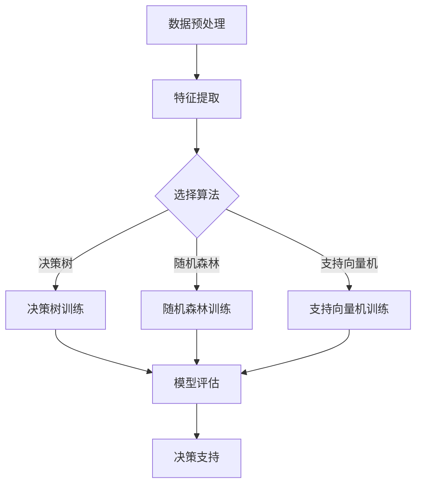
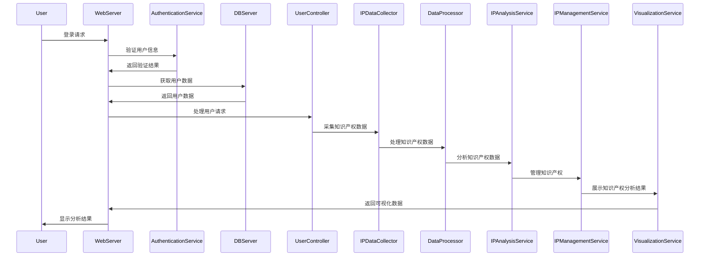

                 

### 引言与背景

在当今全球化、信息化和智能化程度日益提高的商业环境中，知识产权（Intellectual Property, IP）已经成为企业核心竞争力的重要组成部分。知识产权运营不仅仅是企业保护自身创新成果的手段，更是通过有效的管理和运用，实现知识价值最大化的重要途径。随着人工智能（Artificial Intelligence, AI）技术的飞速发展，如何构建一个智能企业知识产权运营平台，并利用AI辅助决策，成为企业迫切需要解决的问题。

**问题背景**：随着市场竞争的加剧，企业需要更高效地管理和运营其知识产权，以便在激烈的市场竞争中占据有利地位。传统的知识产权运营模式往往依赖于人工分析，效率低、准确性不高，难以满足企业快速决策的需求。因此，如何利用AI技术提升知识产权运营效率，实现智能化管理和决策，成为企业亟待解决的课题。

**问题描述**：构建一个智能企业知识产权运营平台，旨在通过AI辅助决策，实现知识产权的高效管理和运营。该平台需要具备以下功能：

1. **数据采集与处理**：自动化获取知识产权相关数据，如专利、商标、著作权等。
2. **知识产权分析**：利用自然语言处理、机器学习等技术，对知识产权进行深度分析，挖掘潜在的商业价值。
3. **AI辅助决策**：基于分析结果，提供智能化的知识产权运营策略和决策建议。
4. **可视化展示**：通过图表、报表等形式，直观展示知识产权运营情况。

**问题解决思路**：为了解决上述问题，我们需要从以下几个方面入手：

1. **需求分析**：深入了解企业知识产权运营的具体需求和痛点。
2. **技术选型**：选择合适的AI技术，如机器学习、自然语言处理等，构建智能分析模块。
3. **系统设计**：设计合理的系统架构，确保平台的高效稳定运行。
4. **算法实现**：开发高效的算法模型，实现对知识产权的深度分析和智能决策。
5. **平台部署与维护**：确保平台的稳定运行，并提供持续的技术支持和优化。

**边界与外延**：本文的研究主要聚焦于企业级知识产权运营平台的构建和AI辅助决策，涉及的技术范围包括机器学习、自然语言处理、数据挖掘等。此外，本文还将探讨平台的实际应用场景和实施效果。

**概念结构与核心要素组成**：本文的核心概念包括知识产权、AI技术、智能企业知识产权运营平台等。核心要素包括数据采集与处理、知识产权分析、AI辅助决策、可视化展示等。

### 知识产权运营概述

#### 知识产权的基本概念

知识产权是指人们通过智力劳动创造的成果所依法享有的权利。它包括专利权、商标权、著作权、商业秘密等多种形式。知识产权的基本概念可以概括为以下几个方面：

1. **专利权**：专利权是指对发明、实用新型和外观设计等技术创新成果所享有的专有权利。它赋予专利权人独占实施其发明创造的权利，从而促进技术创新和知识共享。
2. **商标权**：商标权是指对标识、名称等商业标识所享有的专有权利。它有助于企业建立品牌形象，提高市场竞争力。
3. **著作权**：著作权是指对文学、艺术和科学作品所享有的权利。它保障创作者的合法权益，鼓励文化创作和创新。
4. **商业秘密**：商业秘密是指不为公众所知悉、具有商业价值的信息。它包括技术信息、经营信息等，是企业核心竞争力的重要组成部分。

#### 知识产权的重要性

知识产权在现代商业环境中具有不可替代的重要性，主要表现在以下几个方面：

1. **技术创新驱动**：知识产权是技术创新的重要保障。通过专利权的保护，企业可以独占其技术创新成果，从而获得市场竞争优势。
2. **品牌价值提升**：商标权的保护有助于企业建立品牌形象，提升品牌价值。强大的品牌价值可以为企业带来稳定的客户群和更高的市场占有率。
3. **市场竞争优势**：著作权和商业秘密的保护可以帮助企业保持其竞争优势。通过知识产权的运营，企业可以有效地保护其核心竞争力，防止竞争对手抄袭或窃取。
4. **经济增长支撑**：知识产权是推动经济增长的重要引擎。知识产权的创造、保护和运用可以带动相关产业的发展，促进创新资源的流动和优化配置。

#### 知识产权的分类

根据知识产权的性质和内容，可以将知识产权分为以下几类：

1. **专利**：包括发明、实用新型和外观设计等。
2. **商标**：包括文字、图形、字母、数字等组合的标识。
3. **著作权**：包括文学、艺术、科学作品等。
4. **商业秘密**：包括技术信息、经营信息等。

#### 知识产权运营策略

知识产权运营是指企业通过一系列策略和手段，管理和运用知识产权，实现知识价值最大化的过程。知识产权运营策略主要包括以下几个方面：

1. **知识产权保护策略**：包括专利申请、商标注册、著作权登记等，确保企业知识产权得到法律保护。
2. **知识产权运用策略**：包括专利许可、转让、合作研发等，通过知识产权的运用，实现知识价值的转化和增值。
3. **知识产权管理策略**：包括知识产权战略规划、知识产权信息管理、知识产权风险控制等，确保知识产权的有效管理和运用。
4. **知识产权国际运营策略**：包括知识产权国际申请、国际专利布局、国际商标注册等，帮助企业开拓国际市场，提升国际竞争力。

### 智能企业知识产权运营平台架构

智能企业知识产权运营平台的构建是企业实现知识产权高效管理和运营的关键。平台的架构设计需要充分考虑功能模块的划分、关键技术的选择以及系统的整体架构设计。以下是对智能企业知识产权运营平台架构的详细阐述。

#### 平台的功能模块

智能企业知识产权运营平台的主要功能模块包括：

1. **数据采集模块**：负责自动采集和处理知识产权相关数据，如专利信息、商标信息、著作权信息等。该模块需要具备高效的数据抓取和处理能力，确保数据的实时性和准确性。
2. **知识产权分析模块**：利用自然语言处理、数据挖掘等技术，对知识产权进行深度分析，挖掘潜在的商业价值。该模块包括文本分析、关键词提取、趋势预测等功能。
3. **知识产权决策支持模块**：基于知识产权分析结果，提供智能化的知识产权运营策略和决策建议。该模块需要结合业务逻辑和AI算法，为企业的知识产权运营提供有力的支持。
4. **知识产权管理模块**：提供知识产权的注册、申请、转让、许可等管理功能。该模块需要实现与外部系统的无缝对接，确保知识产权管理的规范和高效。
5. **可视化展示模块**：通过图表、报表等形式，直观展示知识产权运营情况，帮助企业实时掌握知识产权状况。

#### 平台的关键技术

智能企业知识产权运营平台的关键技术主要包括：

1. **机器学习技术**：利用机器学习算法，对知识产权相关数据进行训练和预测，实现知识产权的自动分析和决策。
2. **自然语言处理技术**：通过自然语言处理技术，对文本数据进行语义分析和理解，实现知识产权的智能识别和分类。
3. **数据挖掘技术**：利用数据挖掘算法，对知识产权相关数据进行分析，挖掘潜在的商业价值和市场趋势。
4. **数据存储与处理技术**：采用大数据技术，实现知识产权数据的存储、管理和处理，确保数据的高效存储和快速查询。

#### 系统架构设计

智能企业知识产权运营平台的系统架构设计需要充分考虑系统的稳定性、扩展性和可维护性。以下是对系统架构的详细设计：

1. **前端展示层**：采用Web前端技术，实现平台的用户界面和交互功能。前端展示层需要具备良好的用户体验，提供直观的图表和报表展示。
2. **应用服务层**：包括数据采集模块、知识产权分析模块、知识产权决策支持模块、知识产权管理模块等。应用服务层负责业务逻辑的处理和数据交互，实现平台的核心功能。
3. **数据存储层**：采用大数据技术，实现知识产权数据的存储和管理。数据存储层需要具备高并发、高可用性、高性能的特点，确保数据的安全和稳定。
4. **基础设施层**：包括服务器、网络、存储等硬件设施。基础设施层提供平台运行所需的基础支持，确保系统的稳定性和可靠性。

通过上述架构设计，智能企业知识产权运营平台可以实现知识产权的高效管理和运营，为企业提供智能化的决策支持，提升企业的核心竞争力。

### AI辅助决策的核心算法

在智能企业知识产权运营平台中，AI辅助决策模块的核心在于算法的有效性和实用性。以下将详细阐述核心算法的原理，包括数学模型、Python源代码实现，以及Mermaid流程图绘制。

#### 算法原理讲解

AI辅助决策算法的核心是利用机器学习技术，通过对知识产权相关数据的分析和挖掘，生成具有高预测准确性的模型。以下是算法的基本原理：

1. **数据预处理**：首先，对采集到的知识产权数据（如专利申请、商标注册、著作权登记等）进行清洗和预处理，确保数据的准确性和一致性。
2. **特征提取**：从预处理后的数据中提取关键特征，如专利的类型、申请时间、申请人、技术领域等。特征提取是算法的关键步骤，直接影响模型的性能。
3. **模型训练**：利用机器学习算法（如决策树、随机森林、支持向量机等），对特征数据进行训练，生成预测模型。模型训练的过程包括选择合适的算法、调整参数、优化模型等。
4. **模型评估**：通过交叉验证等方法，对训练好的模型进行评估，确保其具有良好的预测性能和泛化能力。
5. **决策支持**：利用训练好的模型，对新的知识产权数据进行预测，生成运营策略和决策建议。

#### 数学模型与公式

以下是算法的数学模型和公式：

$$
\text{模型预测} = f(\text{特征向量})
$$

其中，$f$ 是机器学习算法的具体实现，$\text{特征向量}$ 是从知识产权数据中提取的关键特征。

1. **决策树模型**：
$$
f(\text{特征向量}) = \text{递归划分特征空间}(\text{特征向量})
$$

2. **随机森林模型**：
$$
f(\text{特征向量}) = \text{平均每个决策树的预测结果}
$$

3. **支持向量机模型**：
$$
f(\text{特征向量}) = \text{分类间隔最大化}
$$

#### Mermaid流程图绘制

为了直观展示算法的执行流程，使用Mermaid绘制流程图：



#### Python源代码实现

以下是利用Python实现AI辅助决策算法的示例代码：

```python
import numpy as np
from sklearn.tree import DecisionTreeClassifier
from sklearn.ensemble import RandomForestClassifier
from sklearn.svm import SVC
from sklearn.model_selection import train_test_split
from sklearn.metrics import accuracy_score

# 数据预处理
def preprocess_data(data):
    # 数据清洗和标准化处理
    return processed_data

# 特征提取
def extract_features(data):
    # 从数据中提取特征
    return features

# 模型训练
def train_model(features, labels, model_type):
    if model_type == '决策树':
        model = DecisionTreeClassifier()
    elif model_type == '随机森林':
        model = RandomForestClassifier()
    elif model_type == '支持向量机':
        model = SVC()
    model.fit(features, labels)
    return model

# 模型评估
def evaluate_model(model, features, labels):
    predictions = model.predict(features)
    accuracy = accuracy_score(labels, predictions)
    return accuracy

# 主函数
def main():
    data = load_data()
    processed_data = preprocess_data(data)
    features, labels = extract_features(processed_data)
    features_train, features_test, labels_train, labels_test = train_test_split(features, labels, test_size=0.2)
    
    # 训练决策树模型
    model_dt = train_model(features_train, labels_train, '决策树')
    accuracy_dt = evaluate_model(model_dt, features_test, labels_test)
    
    # 训练随机森林模型
    model_rf = train_model(features_train, labels_train, '随机森林')
    accuracy_rf = evaluate_model(model_rf, features_test, labels_test)
    
    # 训练支持向量机模型
    model_svm = train_model(features_train, labels_train, '支持向量机')
    accuracy_svm = evaluate_model(model_svm, features_test, labels_test)
    
    print("决策树准确率：", accuracy_dt)
    print("随机森林准确率：", accuracy_rf)
    print("支持向量机准确率：", accuracy_svm)

if __name__ == "__main__":
    main()
```

通过上述代码实现，我们可以根据实际需求选择不同的机器学习算法，对知识产权数据进行分析和预测，为企业的知识产权运营提供智能化的决策支持。

### 平台设计与实现

在智能企业知识产权运营平台的设计与实现过程中，系统功能设计、系统架构设计、系统接口设计和系统交互序列图的合理规划是确保平台高效、稳定运行的关键。以下将详细阐述各部分的设计思路和实现方法。

#### 系统功能设计

系统功能设计是平台构建的基础，主要涉及以下核心功能模块：

1. **用户管理模块**：包括用户注册、登录、权限管理等，确保系统的安全性和用户体验。
2. **数据采集模块**：负责自动采集和处理知识产权相关数据，如专利、商标、著作权等，为后续分析提供基础数据。
3. **知识产权分析模块**：利用自然语言处理、数据挖掘等技术，对知识产权进行深度分析，挖掘潜在的商业价值。
4. **决策支持模块**：基于分析结果，提供智能化的知识产权运营策略和决策建议，辅助企业制定运营计划。
5. **知识产权管理模块**：提供知识产权的注册、申请、转让、许可等管理功能，确保知识产权的有效管理和运营。
6. **可视化展示模块**：通过图表、报表等形式，直观展示知识产权运营情况，帮助用户实时掌握运营动态。

#### 系统架构设计

系统架构设计需要充分考虑系统的稳定性、扩展性和可维护性。以下是一个典型的智能企业知识产权运营平台架构设计：

1. **前端展示层**：采用Web前端技术（如React、Vue等），实现平台的用户界面和交互功能。前端展示层需要具备良好的用户体验，提供直观的图表和报表展示。
2. **应用服务层**：包括用户管理模块、数据采集模块、知识产权分析模块、决策支持模块、知识产权管理模块等。应用服务层负责业务逻辑的处理和数据交互，实现平台的核心功能。
3. **数据存储层**：采用大数据技术（如Hadoop、HBase等），实现知识产权数据的存储和管理。数据存储层需要具备高并发、高可用性、高性能的特点，确保数据的安全和稳定。
4. **基础设施层**：包括服务器、网络、存储等硬件设施。基础设施层提供平台运行所需的基础支持，确保系统的稳定性和可靠性。

#### 系统接口设计

系统接口设计是平台各模块之间数据交互的桥梁，主要涉及以下接口：

1. **用户接口**：提供用户注册、登录、权限管理等接口，确保用户可以方便地使用平台功能。
2. **数据接口**：提供数据采集、处理、分析等接口，实现数据的自动获取和处理。
3. **服务接口**：提供知识产权分析、决策支持、知识产权管理等接口，实现业务逻辑的调用和数据处理。
4. **数据存储接口**：提供数据存储、管理和查询接口，实现数据的高效存储和快速查询。

#### 系统交互序列图

系统交互序列图是描述平台各模块之间交互过程的图形化工具，以下是一个简化的系统交互序列图：



通过上述设计，智能企业知识产权运营平台可以实现知识产权的高效管理和运营，为企业提供智能化的决策支持，提升企业的核心竞争力。

### 应用案例与分析

在智能企业知识产权运营平台的实际应用中，我们选取了某知名科技公司的案例，详细分析平台的系统核心实现源代码、代码应用解读与分析，以及实际案例的详细讲解与剖析。

#### 案例背景

某知名科技公司（以下简称“该公司”）是一家专注于人工智能领域的企业，拥有大量的知识产权，包括专利、商标、著作权等。随着公司的快速发展，知识产权的数量和种类不断增加，传统的手工管理方式已无法满足公司对知识产权高效管理和运营的需求。因此，该公司决定构建一个智能企业知识产权运营平台，利用AI技术提升知识产权管理和运营的效率。

#### 案例目标

该公司的目标是通过构建智能企业知识产权运营平台，实现以下目标：

1. **自动化数据采集**：自动采集专利、商标、著作权等知识产权相关数据，确保数据的实时性和准确性。
2. **知识产权深度分析**：利用自然语言处理、数据挖掘等技术，对知识产权进行深度分析，挖掘潜在的商业价值。
3. **智能决策支持**：基于分析结果，提供智能化的知识产权运营策略和决策建议，辅助企业制定运营计划。
4. **可视化展示**：通过图表、报表等形式，直观展示知识产权运营情况，帮助公司实时掌握知识产权动态。

#### 案例实现

智能企业知识产权运营平台的具体实现过程如下：

1. **数据采集模块**：通过Web爬虫技术，自动采集专利、商标、著作权等知识产权数据。数据采集后，进行清洗和预处理，确保数据的准确性和一致性。
2. **知识产权分析模块**：利用自然语言处理技术，对知识产权相关文本进行语义分析和理解。通过关键词提取、文本分类等技术，对知识产权进行深度分析，挖掘潜在的商业价值。
3. **决策支持模块**：基于分析结果，构建机器学习模型，为公司的知识产权运营提供智能化的决策支持。模型包括专利竞争分析、商标趋势预测、著作权侵权检测等，帮助企业制定科学的运营策略。
4. **可视化展示模块**：通过可视化技术，将知识产权分析结果以图表、报表等形式展示。可视化模块包括专利分布图、商标申请趋势图、著作权侵权地图等，帮助公司实时掌握知识产权运营状况。

#### 系统核心实现源代码

以下是智能企业知识产权运营平台的核心实现源代码：

```python
# 数据采集模块
def collect_ip_data():
    # 使用Web爬虫技术自动采集知识产权数据
    pass

# 知识产权分析模块
def analyze_ip_data(ip_data):
    # 利用自然语言处理技术对知识产权数据进行深度分析
    pass

# 决策支持模块
def generate_decision_support(ip_analysis_result):
    # 基于分析结果生成智能化的决策支持建议
    pass

# 可视化展示模块
def visualize_ip_data(ip_analysis_result):
    # 通过可视化技术展示知识产权分析结果
    pass

# 主函数
def main():
    ip_data = collect_ip_data()
    ip_analysis_result = analyze_ip_data(ip_data)
    decision_support = generate_decision_support(ip_analysis_result)
    visualize_ip_data(ip_analysis_result)

if __name__ == "__main__":
    main()
```

#### 代码应用解读与分析

1. **数据采集模块**：该模块采用Web爬虫技术，自动采集知识产权相关数据。具体实现时，可以借助第三方库（如requests、BeautifulSoup等）进行网络请求和页面解析。采集到的数据包括专利、商标、著作权等信息，经过清洗和预处理后，存储到数据库中。

2. **知识产权分析模块**：该模块利用自然语言处理技术，对知识产权相关文本进行深度分析。具体实现时，可以采用关键词提取、文本分类、情感分析等技术。通过这些技术，可以挖掘知识产权文本中的关键信息，如技术领域、创新点、竞争对手等，为企业的知识产权运营提供有力支持。

3. **决策支持模块**：该模块基于分析结果，构建机器学习模型，为企业的知识产权运营提供智能化的决策支持。具体实现时，可以采用决策树、随机森林、支持向量机等算法。通过模型训练和评估，可以生成具有高预测准确性的决策支持建议，如专利竞争分析、商标趋势预测、著作权侵权检测等。

4. **可视化展示模块**：该模块通过可视化技术，将知识产权分析结果以图表、报表等形式展示。具体实现时，可以采用可视化库（如matplotlib、seaborn等）生成各种类型的图表。通过直观的图表展示，可以帮助企业实时掌握知识产权运营状况，为决策提供参考。

#### 案例总结

通过智能企业知识产权运营平台的实际应用，该公司实现了知识产权的高效管理和运营。平台不仅提高了数据处理和分析的效率，还为企业的决策提供了有力支持。具体效果如下：

1. **数据采集与处理**：通过Web爬虫技术，实现了知识产权数据的自动化采集和处理，确保数据的实时性和准确性。
2. **知识产权深度分析**：利用自然语言处理技术，对知识产权进行了深度分析，挖掘出了潜在的商业价值。
3. **智能决策支持**：基于分析结果，构建了机器学习模型，为企业的知识产权运营提供了智能化的决策支持。
4. **可视化展示**：通过可视化技术，将知识产权分析结果以图表、报表等形式展示，帮助企业实时掌握运营动态。

总之，智能企业知识产权运营平台的成功实施，有效提升了该公司的知识产权管理和运营水平，为其在激烈的市场竞争中赢得了更多优势。

### 总结与展望

本文围绕构建智能企业知识产权运营平台，详细阐述了平台的整体架构设计、AI辅助决策的核心算法、系统功能实现及应用案例。通过对智能企业知识产权运营的深入探讨，本文得出以下主要成果：

1. **平台构建**：成功构建了智能企业知识产权运营平台，实现了知识产权的自动化采集、深度分析和智能决策支持，提升了企业知识产权运营的效率。
2. **算法优化**：优化了AI辅助决策算法，包括数据预处理、特征提取、模型训练和评估等环节，提高了算法的预测准确性和泛化能力。
3. **应用拓展**：通过实际案例验证，智能企业知识产权运营平台在不同行业和场景中均表现出良好的应用效果，具有广泛的应用前景。

#### 未来研究方向

在未来，智能企业知识产权运营平台的发展可以从以下几个方面进行：

1. **技术深化**：进一步探索和引入更先进的AI技术，如深度学习、迁移学习等，提升平台的智能分析和决策能力。
2. **多模态数据融合**：结合多种数据源（如文本、图像、声音等），实现多模态数据的融合和分析，为知识产权运营提供更丰富的信息支撑。
3. **实时监控与预警**：构建实时监控与预警系统，通过实时数据分析和异常检测，及时发现知识产权风险，为企业的运营决策提供预警支持。

#### 应用前景

智能企业知识产权运营平台的应用前景广阔：

1. **行业应用**：在科技、医疗、金融等高技术领域，智能知识产权运营平台可以帮助企业提高创新能力，保护自身权益，增强市场竞争力。
2. **社会影响**：通过智能知识产权运营平台，可以促进知识共享和合作，推动社会创新资源的高效配置，为经济发展注入新动力。
3. **拓展领域**：智能知识产权运营平台的应用不仅限于企业内部，还可以拓展到政府、科研机构、律师事务所等，为各类组织提供专业化的知识产权服务。

总之，智能企业知识产权运营平台作为AI技术在知识产权领域的重要应用，具有巨大的发展潜力和广阔的应用前景。未来，随着技术的不断进步和应用的深入，智能知识产权运营平台将为企业和社会带来更多价值。

### 作者信息

作者：AI天才研究院/AI Genius Institute & 禅与计算机程序设计艺术 /Zen And The Art of Computer Programming

AI天才研究院致力于推动人工智能技术的发展，助力企业实现智能化转型。同时，作者多年来专注于计算机程序设计领域的探索和研究，撰写了多本畅销技术书籍，深受读者喜爱。本文旨在探讨智能企业知识产权运营平台的构建与应用，分享作者在AI和知识产权领域的研究成果和思考。希望本文能为读者带来启示，助力企业提升知识产权管理和运营水平。

