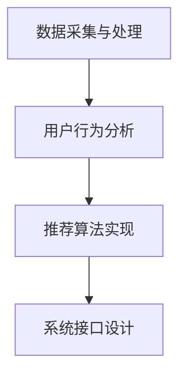
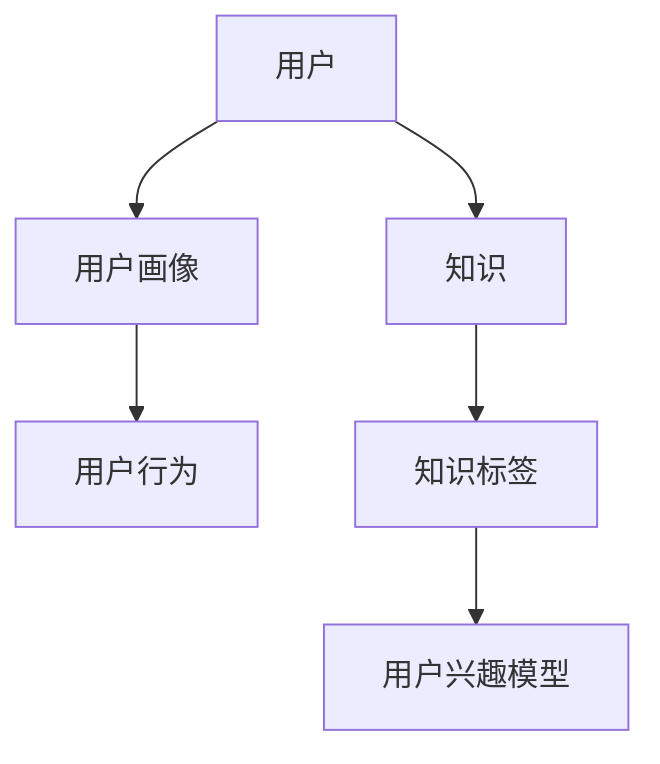
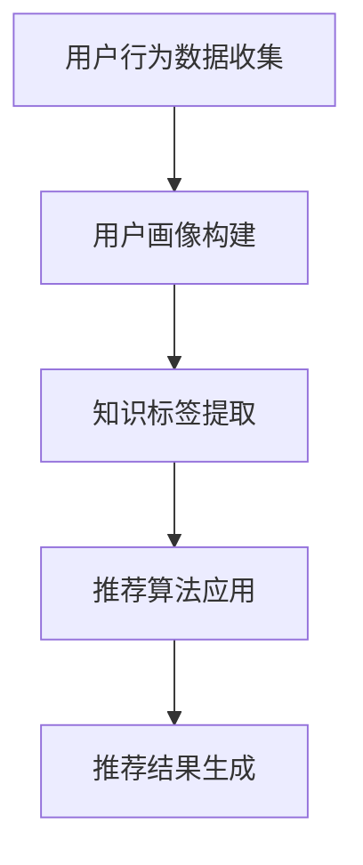
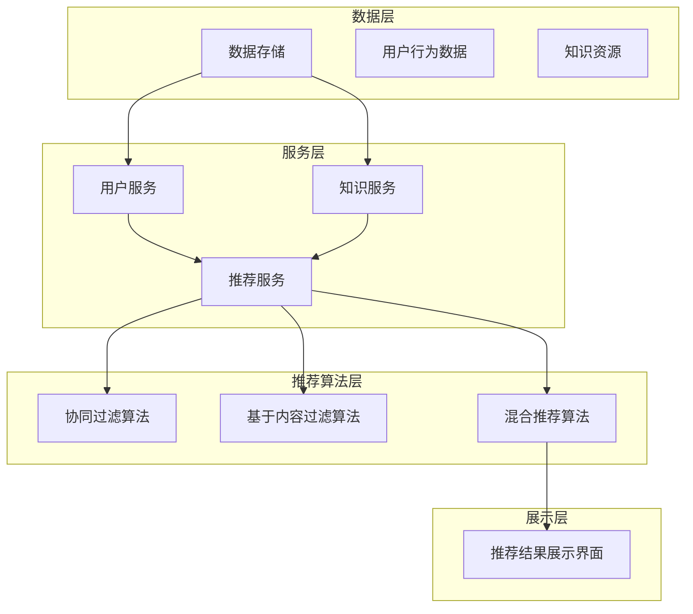
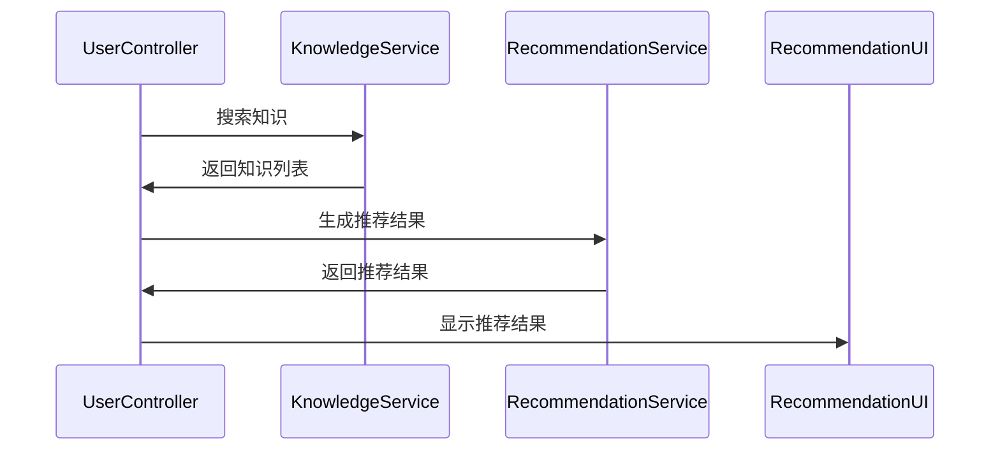

                 

### 1.1 问题背景

在当今信息化飞速发展的时代，企业面临着海量的数据和知识资源，如何有效管理和利用这些知识资源成为了企业发展的关键挑战。传统的知识管理方式往往依赖于人工分类和检索，效率低下，难以满足员工快速获取所需信息的需求。此外，随着员工技能水平的不断提升和多样化，个性化的学习需求也越来越强烈。

首先，企业信息化程度的提高带来了数据量和知识量的爆炸式增长。企业的日常运营中，会产生大量的文档、报告、邮件、会议记录等数据，这些数据中蕴含了宝贵的知识资源。然而，这些数据往往分散在不同的系统和文档中，缺乏有效的整合和利用，导致员工在需要时难以迅速找到所需的信息，降低了工作效率。

其次，知识获取与传播效率低，成为企业知识管理的瓶颈。在传统模式下，企业知识主要通过文档、邮件等方式进行传播，员工需要自行浏览大量的文档，费时费力。而且，员工之间的知识交流和共享也受到限制，导致知识的传播范围和影响力有限，难以实现知识的最大化利用。

此外，个性化学习与技能提升的需求日益凸显。随着企业竞争的加剧，员工需要不断提升自己的技能水平，以适应不断变化的工作环境。然而，传统的学习方式往往缺乏个性化和针对性，难以满足员工的个性化学习需求。因此，企业需要借助智能技术，提供个性化学习推荐，帮助员工高效地提升技能水平。

### 1.1.1 企业的知识管理挑战

随着企业信息化程度的提高，知识管理的挑战也日益凸显。以下是企业面临的主要知识管理挑战：

**1. 知识分散与整合难度大**

随着企业规模的扩大和业务的发展，知识分散在不同的部门、系统和文档中，缺乏统一的管理和整合。这使得员工在需要知识时，往往需要花费大量时间进行检索和整理，降低了工作效率。同时，知识的分散也导致知识的价值难以得到充分体现，知识资源难以实现最大化利用。

**2. 知识获取与传播效率低下**

在传统知识管理方式下，员工获取知识主要依赖于文档阅读和邮件交流。这种方式存在以下问题：

- **信息过载**：员工需要阅读大量的文档，筛选出有用的信息，费时费力。
- **知识传播受限**：知识主要依赖于部门内部或团队内部进行传播，难以实现跨部门、跨专业的知识交流。
- **知识更新不及时**：知识更新速度缓慢，导致员工获取的知识可能已经过时。

**3. 缺乏有效的知识共享与协作**

在传统的知识管理方式中，员工之间的知识交流和共享受到限制。例如，员工往往只能通过面对面的交流或邮件来分享知识，这种方式存在以下问题：

- **交流成本高**：员工需要花费大量时间进行面对面交流或撰写邮件，降低了工作效率。
- **知识共享范围有限**：知识共享主要局限于团队或部门内部，难以实现跨部门、跨专业的知识共享。
- **知识积累困难**：员工在交流过程中可能因为个人经验不足或理解偏差，导致知识积累困难。

**4. 缺乏有效的知识评估与反馈机制**

在传统知识管理方式中，企业往往缺乏有效的知识评估与反馈机制。这使得企业难以了解员工获取的知识是否有效，以及如何进一步优化知识管理策略。例如：

- **知识评估不准确**：企业难以准确评估员工获取的知识是否满足工作需求，导致知识管理效果不佳。
- **知识反馈机制不健全**：企业缺乏有效的反馈机制，难以及时了解员工对知识管理的意见和建议，影响知识管理的改进。

**5. 知识安全与隐私保护**

在信息化时代，企业知识面临着安全与隐私保护的挑战。例如：

- **数据泄露风险**：企业知识往往以电子文档、数据库等形式存储，存在数据泄露的风险。
- **知识产权保护**：企业需要保护自己的知识资产，防止竞争对手获取和利用。

### 1.1.2 个性化学习与技能提升的需求

个性化学习与技能提升是企业员工发展的重要需求，也是企业提升核心竞争力的重要途径。以下是企业员工个性化学习与技能提升的主要需求：

**1. 多样化的学习需求**

企业员工的学习需求是多样化的，包括专业技能、管理技能、沟通技能等多个方面。例如，研发人员可能需要学习新的编程语言或技术框架，销售人员可能需要学习销售技巧和客户关系管理，管理人员可能需要学习领导力与团队管理。

**2. 个性化学习内容**

为了满足员工多样化的学习需求，企业需要提供个性化的学习内容。个性化学习内容应基于员工的兴趣、职业发展阶段和岗位需求进行定制。例如，针对新入职的员工，可以提供基础技能培训；针对有多年工作经验的员工，可以提供高级技能培训或专业认证课程。

**3. 高效的学习方式**

传统学习方式往往存在信息过载和低效的问题。为了提升学习效率，企业需要采用高效的学习方式，如在线学习、互动式学习、虚拟现实（VR）等。这些学习方式可以提供沉浸式学习体验，提高员工的学习兴趣和参与度。

**4. 个性化学习推荐**

为了提高学习效率，企业可以利用大数据分析和人工智能技术，实现个性化学习推荐。通过分析员工的学习行为、兴趣偏好和职业发展需求，推荐适合员工的学习内容和课程，帮助员工有针对性地提升技能。

**5. 持续学习与职业发展**

个性化学习不仅仅是解决当前工作需求，更是员工职业发展的重要支撑。企业应鼓励员工持续学习，提升自己的技能水平和综合素质，为企业的长远发展做出贡献。

总之，个性化学习与技能提升是适应信息化时代员工发展需求的重要手段。企业需要通过提供个性化学习内容、高效学习方式、个性化学习推荐等手段，帮助员工不断提升自己的技能水平，从而提高企业的核心竞争力。

### 1.2 核心概念

构建智能企业知识推荐系统，需要理解一系列核心概念，这些概念构成了系统的基础，并直接影响其性能和效果。以下是几个关键概念及其解释：

#### 1.2.1 智能企业知识推荐系统

智能企业知识推荐系统是一个基于大数据分析与人工智能技术的系统，旨在通过分析用户的兴趣、行为、技能水平等，提供个性化的知识推荐。该系统可以帮助员工快速找到所需的知识，提高工作效率，同时促进知识的共享和传播。

**智能企业知识推荐系统的功能包括：**
- **用户画像构建**：根据用户的行为数据构建用户画像，包括用户的兴趣、职业阶段、技能水平等。
- **知识标签与分类**：对知识资源进行标签化和分类组织，便于检索和推荐。
- **推荐算法实现**：采用协同过滤、基于内容过滤等推荐算法，生成个性化推荐结果。
- **推荐结果展示**：将推荐结果以直观的方式展示给用户，便于用户选择和学习。

#### 1.2.2 个性化学习

个性化学习是一种基于用户需求和兴趣的学习方式，旨在通过定制化的学习内容和路径，提高学习效率和质量。个性化学习不仅关注学习内容的选择，还包括学习过程的监控和调整，以确保学习目标的达成。

**个性化学习的特点包括：**
- **定制化内容**：根据用户的学习需求、兴趣和职业发展目标，提供个性化的学习资源。
- **自适应学习**：系统根据用户的学习行为和表现，动态调整学习内容和难度，确保学习过程的连贯性和有效性。
- **实时反馈**：通过即时反馈，帮助用户及时纠正学习过程中的错误，提高学习效果。
- **终身学习**：鼓励用户持续学习，不断提升自己的知识和技能水平。

#### 1.2.3 知识分类与标签系统

知识分类与标签系统是智能企业知识推荐系统的重要组成部分，它通过对知识资源进行分类和标签化处理，实现知识的有效组织和推荐。

**知识分类与标签系统的关键要素包括：**
- **知识分类**：根据知识的主题、领域或用途，对企业内部的知识资源进行分类。
- **标签系统**：为知识资源打上多个标签，便于检索和推荐。标签可以是关键词、领域、技能点等。
- **分类与标签的关联**：建立分类与标签之间的关联关系，实现知识资源的灵活检索和推荐。

#### 1.2.4 用户画像与兴趣模型

用户画像与兴趣模型是构建个性化推荐系统的基础。通过分析用户的行为数据，构建用户画像和兴趣模型，可以更好地理解用户的需求和偏好，从而提供更精准的推荐。

**用户画像与兴趣模型的关键组成部分包括：**
- **用户画像**：描述用户的基本信息、行为特征、兴趣爱好等，包括用户的基本信息、访问行为、购买行为等。
- **兴趣模型**：基于用户的行为数据，构建用户的兴趣偏好模型，用于推荐算法的输入。
- **兴趣更新**：系统应能实时更新用户的兴趣模型，以适应用户需求的变化。

### 1.3 边界与外延

在构建智能企业知识推荐系统时，我们需要明确系统的边界与外延，以确保系统的有效性和适用性。

#### 1.3.1 知识推荐的范围

智能企业知识推荐系统应覆盖企业内部所有知识资源，包括文档、视频、课程、报告等多种形式。具体包括：

- **文档**：包括企业内部的各种报告、文档、手册等。
- **视频**：包括培训视频、技术讲座、产品演示等。
- **课程**：包括企业内部培训和外部课程资源。
- **报告**：包括项目报告、市场调研报告、财务报告等。

此外，系统还应支持跨部门和跨专业的知识交流，实现知识资源的最大化利用。

#### 1.3.2 技能提升的范围

智能企业知识推荐系统不仅提供知识推荐，还关注员工的技能提升。技能提升的范围包括但不限于以下方面：

- **专业技能**：如编程技能、数据分析能力、项目管理等。
- **管理技能**：如领导力、团队管理、沟通能力等。
- **沟通技能**：如演讲技巧、写作能力、跨文化沟通等。

此外，系统还应关注员工职业发展的全过程，包括入职培训、职业规划、技能提升、职业认证等。

### 1.4 本章小结

本章介绍了构建智能企业知识推荐系统的背景、核心概念及其应用范围。企业面临着知识管理挑战和员工个性化学习与技能提升的需求，智能企业知识推荐系统应通过大数据分析和人工智能技术，实现知识的有效管理和个性化推荐，帮助员工提升技能水平，提高企业竞争力。本章的内容为后续章节的设计与实现奠定了基础。

### 2.1 知识推荐系统的设计与架构

构建智能企业知识推荐系统是一项复杂且具有挑战性的任务，需要综合考虑系统架构、数据采集与处理、用户行为分析、推荐算法实现以及系统接口设计等多个方面。以下是知识推荐系统的整体设计与架构。

#### 2.1.1 系统整体架构设计

智能企业知识推荐系统的整体架构可以分为四个主要部分：数据采集与处理、用户行为分析、推荐算法实现和系统接口设计。

1. **数据采集与处理**：
   - 数据采集：系统需要从各个数据源（如数据库、日志文件、外部API等）收集用户行为数据、知识资源数据等。
   - 数据处理：对采集到的数据进行清洗、去重、转换等预处理操作，确保数据的质量和一致性。

2. **用户行为分析**：
   - 用户画像构建：通过分析用户的历史行为数据，构建用户的画像，包括用户的兴趣、职业阶段、技能水平等。
   - 兴趣模型构建：根据用户画像和用户行为数据，构建用户兴趣模型，用于推荐算法的输入。

3. **推荐算法实现**：
   - 推荐算法选择与实现：根据企业的需求，选择合适的推荐算法（如协同过滤、基于内容过滤、混合方法等），并实现算法的核心功能。
   - 推荐结果生成：基于用户画像和兴趣模型，生成个性化推荐结果，并将其展示给用户。

4. **系统接口设计**：
   - API接口：为前端应用和第三方系统集成提供API接口，实现数据交互和功能调用。
   - 数据库接口：与后端数据库进行交互，实现数据的存储和查询。

#### 2.1.2 系统架构图

以下是智能企业知识推荐系统的架构图：



在上述架构图中，数据采集与处理模块负责从各个数据源收集数据，并对其进行预处理。用户行为分析模块通过对用户行为数据进行分析，构建用户画像和兴趣模型。推荐算法实现模块根据用户画像和兴趣模型，选择合适的推荐算法并生成推荐结果。系统接口设计模块提供API接口和数据库接口，实现系统与其他应用或数据库的交互。

### 2.2 核心概念与联系

在智能企业知识推荐系统中，核心概念之间的联系至关重要，这些联系决定了系统性能和推荐效果。以下是几个关键概念及其相互联系：

#### 2.2.1 用户画像与兴趣模型

**用户画像**：用户画像是对用户的基本信息、行为特征、兴趣爱好等属性的集合。它通过分析用户的历史行为数据，如访问记录、搜索记录、购买记录等，构建出一个全面的用户特征模型。

- **用户画像属性**：包括用户的基本信息（如年龄、性别、职位等），行为特征（如访问频率、浏览时间等），兴趣爱好（如偏好领域、关键词等）。

**兴趣模型**：兴趣模型是基于用户画像构建的，它用于描述用户的兴趣偏好。兴趣模型可以通过聚类、机器学习等方法生成，它可以帮助推荐系统更好地理解用户的需求，从而提供更精准的推荐。

- **兴趣模型属性**：包括用户的兴趣标签、兴趣强度、兴趣变化趋势等。

**联系**：用户画像为兴趣模型提供了基础数据，兴趣模型则通过分析用户画像，构建出用户的兴趣偏好。用户画像和兴趣模型相互补充，共同为推荐系统提供输入。

#### 2.2.2 知识分类与标签系统

**知识分类**：知识分类是对企业内部知识资源进行分类组织的一种方式。通过对知识资源进行分类，可以方便用户快速查找和获取所需的知识。

- **知识分类属性**：包括知识主题、领域、用途等。

**标签系统**：标签系统为知识资源打上多个标签，用于描述和标记知识资源。标签可以是具体的词语、关键词、领域等。

- **标签系统属性**：包括标签、标签关联关系、标签权重等。

**联系**：知识分类和标签系统共同构建了一个多维度的知识组织结构。知识分类为标签提供了分类依据，而标签系统则为知识资源的精准检索和推荐提供了支持。通过标签系统，用户可以根据标签快速定位相关的知识资源，同时，标签还可以用于推荐算法中的协同过滤和基于内容过滤。

#### 2.2.3 ER实体关系图

实体关系图（ER图）是用于描述系统中实体及其关系的图形化工具。以下是智能企业知识推荐系统中几个关键实体的ER图：



在上述ER图中，用户是系统的核心实体，用户画像描述了用户的基本信息和行为特征；用户行为记录了用户的访问、搜索等行为；知识实体表示企业内部的知识资源；知识标签为知识资源打上了分类和描述标签；用户兴趣模型则基于用户画像和用户行为构建，用于推荐算法的输入。

**联系**：用户通过用户画像和用户行为与知识资源建立关联，知识资源通过知识标签与用户兴趣模型建立联系。ER图清晰地展示了用户、知识资源、标签和兴趣模型之间的逻辑关系，为系统的设计和实现提供了参考。

通过理解用户画像与兴趣模型、知识分类与标签系统以及ER图中的实体关系，我们可以更好地设计并实现智能企业知识推荐系统，提高推荐系统的性能和用户体验。

#### 2.3 算法原理讲解

在构建智能企业知识推荐系统的过程中，推荐算法是实现个性化推荐的核心。以下是几种常见的推荐算法及其原理和流程：

##### 2.3.1 推荐算法的选择与实现

推荐算法主要分为三类：协同过滤（Collaborative Filtering）、基于内容过滤（Content-Based Filtering）和混合方法（Hybrid Methods）。

**1. 协同过滤（Collaborative Filtering）**

协同过滤是一种基于用户行为数据的推荐方法，它通过分析用户之间的相似度，推荐用户可能感兴趣的内容。协同过滤分为两种：基于用户的协同过滤（User-Based）和基于项目的协同过滤（Item-Based）。

- **基于用户的协同过滤**：这种方法通过计算用户之间的相似度，找到与目标用户相似的其他用户，然后推荐这些用户喜欢的项目。相似度计算通常基于用户评分的余弦相似度或皮尔逊相关系数。
- **基于项目的协同过滤**：这种方法通过计算项目之间的相似度，找到与目标项目相似的其他项目，然后推荐这些项目给用户。相似度计算通常基于项目内容的相似度或基于用户评分的相似度。

**算法流程**：
1. 收集用户行为数据，如用户评分、浏览记录、购买历史等。
2. 计算用户之间的相似度或项目之间的相似度。
3. 根据相似度推荐相似用户或项目给目标用户。

**2. 基于内容过滤（Content-Based Filtering）**

基于内容过滤是一种基于项目内容特征进行推荐的算法，它通过分析项目的内容特征，找到与用户兴趣相关的项目，然后推荐给用户。

- **项目特征提取**：对每个项目进行特征提取，如关键词、类别、标签等。
- **用户兴趣建模**：根据用户的历史行为和偏好，构建用户兴趣模型。
- **推荐生成**：根据用户兴趣模型和项目特征，生成推荐结果。

**算法流程**：
1. 提取项目特征，如关键词、标签、类别等。
2. 构建用户兴趣模型。
3. 根据用户兴趣模型和项目特征，生成推荐列表。

**3. 混合方法（Hybrid Methods）**

混合方法结合了协同过滤和基于内容过滤的优点，通过综合使用这两种方法，提高推荐系统的性能和准确度。

- **结合方式**：将协同过滤和基于内容过滤的结果进行加权或融合，生成最终的推荐结果。
- **优势**：可以弥补单一方法的不足，提高推荐系统的泛化能力和推荐效果。

**算法流程**：
1. 分别使用协同过滤和基于内容过滤生成推荐结果。
2. 对推荐结果进行融合或加权，生成最终的推荐结果。

##### 2.3.2 算法流程图

以下是推荐算法的流程图：



在上述流程图中，用户行为数据收集是推荐算法的基础，用户画像构建用于描述用户的兴趣和偏好；知识标签提取用于组织和管理知识资源；推荐算法应用根据用户画像和知识标签生成推荐结果；推荐结果生成则将推荐结果展示给用户。

##### 2.3.3 Python源代码示例

以下是一个简单的协同过滤算法的实现示例：

```python
import numpy as np
from sklearn.metrics.pairwise import cosine_similarity

# 假设user_ratings是一个用户评分矩阵，形状为(m*n)，m为用户数，n为项目数
user_ratings = np.array([[5, 3, 0, 1],
                         [4, 0, 0, 1],
                         [1, 1, 0, 5],
                         [1, 0, 0, 4],
                         [0, 1, 5, 4]])

# 计算用户之间的相似度矩阵
similarity_matrix = cosine_similarity(user_ratings)

# 预测用户u对项目i的评分
def predict_rating(u, i):
    # 计算用户u与其他用户的相似度之和
    similarity_sum = np.sum(similarity_matrix[u])
    # 计算用户u对其他用户的评分加权平均值
    weighted_average = np.dot(similarity_matrix[u], user_ratings[i])
    # 预测用户u对项目i的评分
    predicted_rating = (weighted_average / similarity_sum) if similarity_sum > 0 else 0
    return predicted_rating

# 预测用户1对项目3的评分
predicted_rating = predict_rating(0, 2)
print(predicted_rating)
```

在上述代码中，我们首先计算用户之间的相似度矩阵，然后定义一个预测函数，根据用户与其他用户的相似度和评分，预测用户对项目的评分。预测结果为用户1对项目3的预测评分。

##### 2.3.4 数学模型与公式

协同过滤算法的数学模型可以表示为：

$$
R_{ij} = \frac{1}{N_{i}\sqrt{N_{j}}} \sum_{k \in K} S_{ik}S_{jk}
$$

其中：
- \( R_{ij} \) 表示用户 \( i \) 对知识 \( j \) 的预测评分。
- \( S_{ik} \) 和 \( S_{jk} \) 表示用户 \( i \) 和用户 \( j \) 对知识 \( k \) 的评分。
- \( N_{i} \) 和 \( N_{j} \) 表示用户 \( i \) 和用户 \( j \) 对知识的评分数量。
- \( K \) 表示用户 \( i \) 和用户 \( j \) 都有评分的知识集合。

该公式通过计算用户之间的相似度，并将相似度乘以其他用户对该知识的评分，最后加权平均得到用户对知识的预测评分。

通过以上算法原理讲解、流程图、Python源代码示例和数学模型与公式，我们可以更深入地理解智能企业知识推荐系统中的推荐算法，为系统的设计和实现提供理论支持。

### 2.4 系统分析与架构设计方案

#### 2.4.1 问题场景介绍

在企业知识管理领域，随着企业规模的扩大和业务的发展，知识资源呈现爆炸式增长，这使得员工在获取所需信息时面临巨大挑战。传统的知识管理方式往往依赖于人工检索和整理，效率低下，且容易导致知识分散和流失。因此，企业需要一个智能的知识推荐系统，能够根据员工的行为和需求，自动推荐相关的知识资源，提高知识获取和传播的效率。

#### 2.4.2 项目介绍

本项目旨在构建一个智能企业知识推荐系统，通过大数据分析和人工智能技术，实现对企业内部知识资源的自动化推荐，帮助员工快速找到所需信息，提升工作效率。系统的主要功能包括：

- 用户画像构建：通过分析用户的历史行为数据，构建用户的画像，包括用户的兴趣、职业阶段、技能水平等。
- 知识资源管理：对知识资源进行分类和标签化处理，便于检索和推荐。
- 推荐算法实现：采用协同过滤、基于内容过滤等推荐算法，生成个性化推荐结果。
- 推荐结果展示：将推荐结果以直观的方式展示给用户，便于用户选择和学习。

#### 2.4.3 系统功能设计（领域模型Mermaid类图）

以下是一个简单的领域模型类图，展示了系统中的关键实体及其关系：

```mermaid
classDiagram
    User <<entity>>
    Knowledge <<entity>>
    Recommendation <<entity>>

    User o-- Knowledge: 用户对知识资源的评价
    User o-- Recommendation: 用户接收到的推荐结果
    Knowledge o-- Recommendation: 推荐结果包含的知识资源
```

在该类图中，用户（User）是系统的核心实体，代表了企业的员工。知识资源（Knowledge）是系统管理的对象，包括文档、视频、课程等多种形式。推荐结果（Recommendation）是系统输出的结果，用于向用户推荐相关的知识资源。

#### 2.4.4 系统架构设计（Mermaid架构图）

以下是智能企业知识推荐系统的架构图：



在上述架构图中，数据层（DataStorage）负责数据的存储和管理，包括用户行为数据和知识资源。服务层（UserController、KnowledgeService、RecommendationService）负责业务逻辑的处理，包括用户管理、知识资源管理和推荐算法的实现。推荐算法层（CollaborativeFiltering、ContentBasedFiltering、HybridRecommendation）包含了多种推荐算法，用于生成个性化推荐结果。展示层（RecommendationUI）负责将推荐结果以直观的方式展示给用户。

#### 2.4.5 系统接口设计

以下是系统的主要接口设计：

- **用户接口（UserController）**：
  - 注册/登录：用户注册和登录功能。
  - 个人中心：用户管理个人资料和偏好设置。
  - 搜索知识：根据关键词搜索知识资源。

- **知识接口（KnowledgeService）**：
  - 知识分类：对知识资源进行分类组织。
  - 知识标签：为知识资源添加标签。
  - 知识检索：根据分类和标签检索知识资源。

- **推荐接口（RecommendationService）**：
  - 用户画像构建：根据用户行为数据构建用户画像。
  - 推荐结果生成：根据用户画像和知识资源生成推荐结果。
  - 推荐结果查询：查询用户接收到的推荐结果。

#### 2.4.6 系统交互（Mermaid序列图）

以下是系统交互的序列图：



在上述序列图中，用户通过用户接口（UserController）发起搜索知识和生成推荐结果的请求，知识服务（KnowledgeService）处理请求并返回知识列表，推荐服务（RecommendationService）根据用户画像和知识资源生成推荐结果，最后用户接口将推荐结果传递给展示界面（RecommendationUI），用户可以在界面上查看和选择推荐的知识资源。

通过以上系统分析与架构设计方案，我们为智能企业知识推荐系统的设计和实现提供了详细的指导，确保系统能够满足企业知识管理的需求，提高员工工作效率。

### 3. 项目实战

#### 3.1 环境安装

要构建智能企业知识推荐系统，首先需要在开发环境中安装所需的软件和库。以下是安装步骤：

1. **安装Python环境**：确保Python版本在3.6及以上，可以通过[Python官网](https://www.python.org/downloads/)下载并安装。

2. **安装Python库**：使用pip命令安装所需的Python库，包括NumPy、Pandas、Scikit-learn等。具体命令如下：

   ```shell
   pip install numpy pandas scikit-learn
   ```

3. **安装其他工具**：根据需要安装其他工具，如Jupyter Notebook（用于交互式开发）、Git（用于版本控制）等。

#### 3.2 系统核心实现源代码

以下是一个简化的系统核心实现源代码，包括用户画像构建、知识标签提取、推荐算法实现和推荐结果生成：

```python
# 用户画像构建
class UserProfiler:
    def __init__(self, user行为数据):
        self.user行为数据 = user行为数据
    
    def build_user_profile(self):
        # 根据用户行为数据构建用户画像
        user_profile = {
            '兴趣领域': [],
            '技能水平': [],
            '职业阶段': []
        }
        # 这里仅作示例，实际应用中应根据具体数据进行分析
        user_profile['兴趣领域'].extend(self.user行为数据['浏览历史']['关键词'])
        user_profile['技能水平'].extend(self.user行为数据['技能评估']['技能点'])
        user_profile['职业阶段'].extend(self.user行为数据['职业发展']['阶段'])
        return user_profile

# 知识标签提取
class KnowledgeTagger:
    def __init__(self, knowledge资源数据):
        self.knowledge资源数据 = knowledge资源数据
    
    def extract_tags(self):
        # 从知识资源数据中提取标签
        knowledge_tags = []
        for resource in self.knowledge资源数据:
            knowledge_tags.extend(resource['标签'])
        return knowledge_tags

# 推荐算法实现（基于内容的过滤）
class ContentBasedFiltering:
    def __init__(self, knowledge_tags, user_profile):
        self.knowledge_tags = knowledge_tags
        self.user_profile = user_profile
    
    def generate_recommendations(self):
        # 根据用户画像和知识标签生成推荐列表
        recommendations = []
        for tag in self.user_profile['兴趣领域']:
            for resource in self.knowledge_tags:
                if tag in resource:
                    recommendations.append(resource)
        return recommendations

# 主函数
if __name__ == "__main__":
    # 加载用户行为数据和知识资源数据
    user行为数据 = load_user_behavior_data()
    knowledge资源数据 = load_knowledge_resources_data()

    # 构建用户画像
    user_profile = UserProfiler(user行为数据).build_user_profile()

    # 提取知识标签
    knowledge_tags = KnowledgeTagger(knowledge资源数据).extract_tags()

    # 生成推荐结果
    recommender = ContentBasedFiltering(knowledge_tags, user_profile)
    recommendations = recommender.generate_recommendations()

    # 输出推荐结果
    print("推荐结果：")
    for recommendation in recommendations:
        print(recommendation['标题'])
```

#### 3.3 代码应用解读与分析

上述代码实现了用户画像构建、知识标签提取、基于内容过滤的推荐算法以及推荐结果生成。以下是对代码的详细解读和分析：

1. **用户画像构建**：
   - 用户画像构建类（UserProfiler）根据用户行为数据，如浏览历史、技能评估等，构建用户画像。这里采用了示例数据，实际应用中应根据具体数据进行分析和处理。
   - 用户画像包括兴趣领域、技能水平、职业阶段等属性，这些属性用于后续的推荐算法。

2. **知识标签提取**：
   - 知识标签提取类（KnowledgeTagger）从知识资源数据中提取标签。标签用于描述知识资源的特征，如关键词、领域等。
   - 标签提取过程为推荐算法提供了输入，使得推荐系统能够根据用户兴趣和知识资源特征进行推荐。

3. **基于内容过滤的推荐算法**：
   - 内容过滤类（ContentBasedFiltering）根据用户画像和知识标签生成推荐列表。算法的核心思想是找出用户感兴趣的知识标签，然后推荐包含这些标签的知识资源。
   - 算法简单且易于实现，适用于小规模的知识推荐系统。

4. **推荐结果生成**：
   - 主函数中，首先加载用户行为数据和知识资源数据，然后依次调用用户画像构建、知识标签提取和推荐算法生成推荐结果。
   - 最终输出推荐结果，用户可以根据推荐结果选择感兴趣的知识资源进行学习。

#### 3.4 实际案例分析和详细讲解剖析

以下是一个实际案例，分析推荐系统的实现和应用效果：

**案例**：一个研发工程师在系统中查看推荐的知识资源。

**分析**：
1. **用户画像构建**：
   - 根据用户的浏览历史，发现用户对“人工智能”、“机器学习”、“深度学习”等主题有浓厚兴趣。
   - 根据技能评估，用户具备“Python编程”、“TensorFlow框架”等技能。
   - 根据职业阶段，用户处于“中级研发工程师”阶段，需要进一步提升专业技能。

2. **知识标签提取**：
   - 系统中的知识资源包括“人工智能基础教程”、“深度学习实战项目”、“TensorFlow高级应用”等。
   - 知识资源的标签包括“人工智能”、“机器学习”、“深度学习”、“Python编程”、“TensorFlow框架”等。

3. **基于内容过滤的推荐算法**：
   - 系统根据用户画像和知识标签，生成推荐列表。推荐结果可能包括：
     - “人工智能基础教程”
     - “深度学习实战项目”
     - “TensorFlow高级应用”

4. **推荐结果生成**：
   - 用户查看推荐结果后，可以根据兴趣选择“深度学习实战项目”进行学习，进一步提升自己的专业技能。

**讲解剖析**：
- **用户画像构建**：通过分析用户的历史行为数据，系统能够准确捕捉用户的兴趣和需求，为推荐算法提供可靠的数据支持。
- **知识标签提取**：标签系统使得知识资源更加清晰和易于管理，便于推荐算法根据标签进行筛选和推荐。
- **基于内容过滤的推荐算法**：算法简单且高效，能够根据用户画像和知识标签生成个性化的推荐结果，提高推荐效果。
- **推荐结果生成**：推荐结果以直观的方式展示给用户，用户可以根据推荐结果选择感兴趣的知识资源，实现个性化学习。

#### 3.5 项目小结

通过实际案例，我们可以看到智能企业知识推荐系统在提升员工知识获取和技能提升方面的应用效果。项目实现了用户画像构建、知识标签提取、基于内容过滤的推荐算法以及推荐结果生成，为员工提供了个性化的知识推荐服务。然而，该项目仍存在以下局限性和改进方向：

- **局限性**：
  - 推荐算法基于内容过滤，可能无法完全捕捉用户的潜在兴趣和需求。
  - 数据质量对推荐效果有较大影响，数据缺失或不准确可能导致推荐结果不准确。

- **改进方向**：
  - 引入协同过滤算法，结合用户行为数据，提高推荐效果。
  - 完善用户画像构建，增加更多维度的用户行为数据，如搜索历史、学习进度等。
  - 优化推荐算法，结合机器学习技术，实现更加精准的推荐。

通过不断优化和改进，智能企业知识推荐系统将能够更好地满足员工的个性化学习需求，提高企业整体知识管理水平。

### 3.6 最佳实践 tips

在构建和优化智能企业知识推荐系统时，以下是一些最佳实践和技巧，可以帮助您提高系统的性能和用户体验：

**1. 数据质量的重要性**
- **数据清洗与预处理**：确保数据的一致性和准确性。对数据源进行清洗，去除重复、错误和不完整的数据。
- **数据标准化**：统一数据格式和单位，以便算法能够准确处理数据。

**2. 多样化的用户画像**
- **多维度的用户特征**：不仅包括基本用户信息，还应包含用户的学习历史、职业发展路径、行为偏好等。
- **动态更新**：定期更新用户画像，以反映用户兴趣和行为的变化。

**3. 推荐算法的选择与优化**
- **混合推荐算法**：结合协同过滤和基于内容的过滤方法，提高推荐精度。
- **个性化权重调整**：根据用户行为和反馈，动态调整推荐算法的权重，优化推荐结果。

**4. 用户反馈机制**
- **用户评价与反馈**：鼓励用户对推荐结果进行评价和反馈，利用这些数据不断优化系统。
- **实时调整**：根据用户反馈，实时调整推荐策略和算法参数。

**5. 性能优化**
- **系统架构设计**：合理设计系统架构，确保推荐系统的高可用性和可扩展性。
- **缓存与负载均衡**：使用缓存和负载均衡技术，提高系统响应速度和处理能力。

**6. 安全与隐私保护**
- **数据加密**：确保用户数据在传输和存储过程中得到加密，防止数据泄露。
- **隐私政策**：明确用户的隐私政策，确保用户数据得到合法合规的使用。

**7. 用户界面设计**
- **简洁直观**：设计简洁直观的用户界面，提高用户的使用体验。
- **个性化展示**：根据用户喜好和习惯，个性化展示推荐内容，提升用户满意度。

通过遵循这些最佳实践，您能够构建出更加高效、精准和用户友好的智能企业知识推荐系统，从而更好地满足企业员工的学习和知识获取需求。

### 4. 小结

本文从背景介绍、核心概念、设计与实现、系统分析与架构设计、项目实战以及最佳实践等方面，详细阐述了构建智能企业知识推荐系统的全过程。智能企业知识推荐系统通过大数据分析和人工智能技术，实现了个性化学习与技能提升，有效解决了企业知识管理挑战和员工个性化学习需求。

在未来的研究和实践中，我们可以继续探索以下方向：

1. **引入更多的推荐算法**：除了协同过滤和基于内容过滤，可以尝试引入深度学习、强化学习等先进算法，以提高推荐系统的性能和准确性。

2. **扩展知识资源的类型**：当前系统主要覆盖文档、视频等知识资源，未来可以考虑引入更多类型的资源，如在线课程、专业书籍、行业报告等。

3. **增强用户互动与反馈**：通过增加用户互动功能，如评论、点赞、收藏等，收集更多用户反馈，不断优化推荐算法和系统功能。

4. **提升系统的自适应能力**：利用机器学习和自然语言处理技术，增强系统对用户行为和需求的理解，实现更精准的个性化推荐。

5. **加强数据安全和隐私保护**：在数据采集、存储和处理过程中，加强数据安全和隐私保护，确保用户数据的安全和合规使用。

通过不断优化和改进，智能企业知识推荐系统将更好地服务于企业员工的学习和知识获取，提升企业整体竞争力和创新能力。

### 5. 注意事项

在构建智能企业知识推荐系统的过程中，需要注意以下事项，以确保系统的性能和可靠性：

1. **数据质量**：数据是推荐系统的核心，确保数据的质量和准确性至关重要。在数据采集和处理过程中，要严格清洗数据，去除噪声和错误数据，确保数据的一致性和完整性。

2. **用户隐私保护**：在收集和处理用户数据时，严格遵守隐私保护法规，确保用户数据的安全和隐私。对用户数据进行加密存储，防止数据泄露。

3. **系统性能优化**：推荐系统需要处理大量的用户行为数据和知识资源，因此需要优化系统的性能，包括缓存策略、负载均衡和数据库优化等，确保系统的高可用性和响应速度。

4. **算法公平性**：确保推荐算法的公平性，避免对用户进行歧视或偏见。在算法设计和实现过程中，要充分考虑不同用户群体的需求，确保推荐结果的公平性和准确性。

5. **用户反馈机制**：建立有效的用户反馈机制，鼓励用户对推荐结果进行评价和反馈，通过不断调整和优化推荐算法，提高用户满意度。

6. **系统安全性**：加强系统的安全性，防止外部攻击和数据篡改。采用防火墙、加密技术和访问控制等措施，确保系统的安全稳定运行。

7. **用户体验设计**：注重用户体验设计，界面简洁直观，操作方便快捷。通过用户调研和反馈，持续优化界面设计和交互体验。

通过注意以上事项，构建的智能企业知识推荐系统将更加可靠、高效，为员工提供更好的学习体验和知识获取服务。

### 6. 拓展阅读

对于想要深入了解智能企业知识推荐系统的读者，以下是一些推荐的文章、书籍和资源，涵盖大数据分析、人工智能、推荐系统等领域：

**1. 文章**
- **《深度学习推荐系统》**：这是一篇关于如何将深度学习应用于推荐系统的综述文章，介绍了深度学习在推荐领域的应用现状和未来趋势。
- **《大数据分析实践指南》**：该文章详细介绍了大数据分析的基本概念、技术和应用场景，对初学者和从业者都有很大帮助。
- **《推荐系统实战》**：本文通过实际案例，讲解了推荐系统的实现过程，包括数据采集、用户画像构建、推荐算法选择和系统优化等。

**2. 书籍**
- **《数据挖掘：概念与技术》**：这本书是数据挖掘领域的经典教材，详细介绍了数据挖掘的基本概念、方法和应用。
- **《机器学习实战》**：该书通过大量实例，讲解了机器学习的基本算法和实现，适合希望深入理解机器学习技术的读者。
- **《推荐系统手册》**：这是一本关于推荐系统的全面指南，涵盖了推荐系统的理论基础、算法实现和案例分析。

**3. 资源**
- **《Kaggle竞赛平台》**：Kaggle是一个数据科学竞赛平台，上面有许多关于推荐系统的大数据分析竞赛，适合实际操作和提升技能。
- **《TensorFlow官方文档》**：TensorFlow是深度学习领域的开源框架，其官方文档提供了丰富的教程和API说明，是深度学习实践的重要资源。
- **《机器学习社区》**：这是一个聚集了众多机器学习和数据科学爱好者的在线社区，可以在这里找到大量高质量的文章、教程和讨论。

通过阅读这些文章、书籍和资源，您可以进一步加深对智能企业知识推荐系统的理解，提升相关技能。

