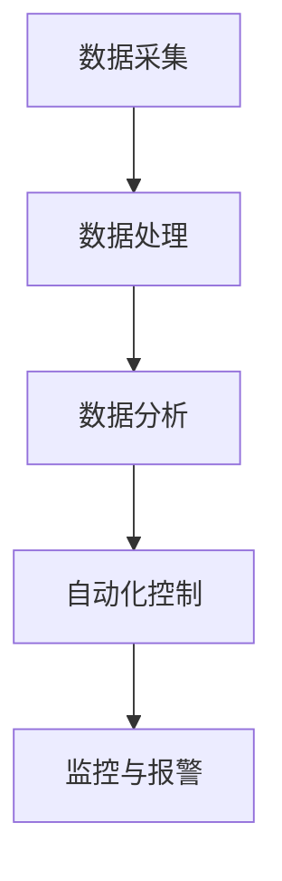
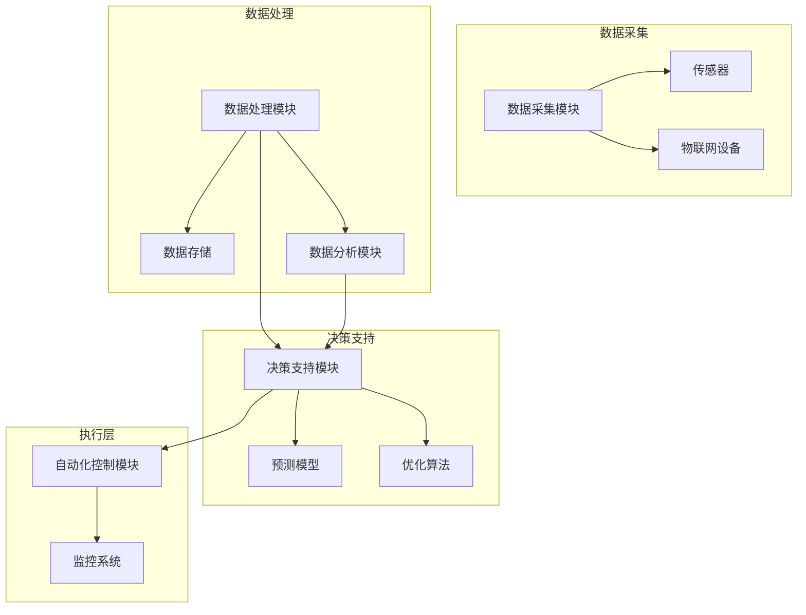

                 


### 构建智能企业资产管理平台：全生命周期优化与预测性维护

#### 关键词：智能资产管理、全生命周期优化、预测性维护、企业资产管理平台

##### 摘要：

本文旨在探讨如何构建智能企业资产管理平台，通过全生命周期优化和预测性维护，实现资产管理的全面升级。首先，我们将介绍问题背景和核心概念，包括企业资产管理的问题、智能资产管理的定义和架构、资产管理生命周期以及全生命周期优化与预测性维护的概念。接着，我们将深入分析核心概念与联系，包括全生命周期管理（PLC）和预测性维护（PdM）的原理、算法与流程，以及它们在资产管理中的应用。随后，我们将探讨资产管理平台架构设计，包括平台架构概述、领域模型设计和系统架构设计。然后，我们将详细阐述全生命周期优化和预测性维护的实施方法，包括资产规划与部署、资产运维与优化、资产退役与处置、预测性维护策略、技术应用和优化评估。最后，我们将通过案例分析与实践，展示智能资产管理平台的建设过程和效果，并总结最佳实践和注意事项，为读者提供实际操作指南。

### 第一部分：背景与基础

#### 第1章：问题背景与核心概念

##### 1.1 企业资产管理的问题背景

在企业运营中，资产管理是一个至关重要的环节。然而，传统的资产管理方式往往面临诸多问题。首先，资产信息分散、管理混乱，导致难以实现对资产的全面监控和高效利用。其次，资产规划、部署和退役等环节缺乏系统性和科学性，导致资产利用率低下，成本增加。此外，资产运维过程中，缺乏有效的预测性维护手段，容易导致突发性故障，影响企业生产和运营。

为了解决这些问题，我们需要构建一个智能企业资产管理平台。该平台将基于现代信息技术，实现资产管理的全生命周期优化和预测性维护。

##### 1.2 智能资产管理概述

智能资产管理是一种利用人工智能、大数据、物联网等先进技术，对企业的资产进行全方位管理的新模式。它具有以下特点：

- **数据驱动**：通过收集和分析大量资产数据，为资产管理提供决策支持。
- **自动化**：通过自动化技术，实现资产规划、部署、运维和退役等环节的高效管理。
- **预测性**：通过预测性维护技术，提前发现潜在故障，降低故障率和维护成本。

智能资产管理的基本架构包括数据采集层、数据处理层、决策支持层和执行层。数据采集层负责收集资产数据，包括结构化和非结构化数据；数据处理层负责对数据进行存储、清洗、转换和建模；决策支持层负责基于数据分析和预测，提供资产管理策略；执行层负责根据决策支持层的策略，实现对资产的自动化控制和维护。

##### 1.3 资产管理生命周期

资产管理生命周期包括资产规划、资产部署、资产运维和资产退役四个阶段。

- **资产规划**：根据企业战略和需求，确定资产种类、数量、采购时间和预算等。
- **资产部署**：将采购到的资产安装、调试和上线，确保其正常运行。
- **资产运维**：对资产进行日常维护和管理，确保其稳定运行。
- **资产退役**：当资产达到使用寿命或无法满足需求时，对其进行退役和处置。

##### 1.4 全生命周期优化与预测性维护

全生命周期优化与预测性维护是智能资产管理的核心。全生命周期优化旨在通过优化资产规划、部署、运维和退役等环节，提高资产利用率，降低成本。预测性维护则通过实时监测资产状态，预测潜在故障，提前进行维护，降低故障率和维护成本。

全生命周期优化与预测性维护的关键技术包括：

- **数据采集与处理**：通过传感器、物联网等技术，实时采集资产数据，并对其进行处理和分析。
- **预测模型**：基于历史数据和机器学习算法，建立预测模型，预测资产故障和寿命。
- **优化算法**：基于预测结果，优化资产规划、部署和退役策略。
- **自动化控制系统**：通过自动化技术，实现对资产的自动化维护和管理。

#### 第2章：核心概念与联系

##### 2.1 全生命周期管理（PLC）原理

全生命周期管理（PLC）是一种基于资产全生命周期的管理方法，其核心思想是将资产管理的各个环节紧密衔接，实现资产的全生命周期优化。

PLC的原理包括：

- **资产信息管理**：通过建立资产信息库，实现对资产的全生命周期信息管理。
- **流程优化**：通过优化资产规划、部署、运维和退役等环节的流程，提高效率。
- **决策支持**：通过数据分析和预测，为资产管理提供决策支持。

PLC的算法与流程包括：

- **数据采集**：通过传感器、物联网等技术，实时采集资产数据。
- **数据处理**：对采集到的数据进行分析、清洗、转换和建模。
- **预测分析**：基于历史数据和机器学习算法，建立预测模型，预测资产故障和寿命。
- **决策支持**：根据预测结果，优化资产规划、部署和退役策略。
- **执行与监控**：根据决策支持层的策略，实现对资产的自动化维护和管理，并实时监控执行情况。

PLC的特点包括：

- **数据驱动**：通过数据分析和预测，实现资产管理的科学决策。
- **流程优化**：通过优化流程，提高资产管理效率。
- **自动化**：通过自动化技术，实现资产管理的自动化。

PLC在资产管理中的应用包括：

- **资产规划**：通过预测性分析，优化资产采购策略，降低采购成本。
- **资产部署**：通过自动化部署，提高部署效率，减少人力成本。
- **资产运维**：通过实时监测和预测性维护，降低故障率和维护成本。
- **资产退役**：通过优化退役策略，提高资产利用率，降低退役成本。

##### 2.2 预测性维护（PdM）原理

预测性维护（PdM）是一种基于实时监测和预测的维护方法，其核心思想是通过实时监测资产状态，预测潜在故障，提前进行维护，降低故障率和维护成本。

PdM的原理包括：

- **实时监测**：通过传感器、物联网等技术，实时监测资产状态。
- **状态评估**：对监测到的数据进行分析，评估资产的健康状态。
- **故障预测**：基于历史数据和机器学习算法，建立故障预测模型，预测潜在故障。
- **维护决策**：根据故障预测结果，制定维护计划，提前进行维护。

PdM的算法与流程包括：

- **数据采集**：通过传感器、物联网等技术，实时采集资产数据。
- **数据处理**：对采集到的数据进行分析、清洗、转换和建模。
- **状态评估**：基于监测数据，评估资产的健康状态。
- **故障预测**：基于历史数据和机器学习算法，建立故障预测模型，预测潜在故障。
- **维护决策**：根据故障预测结果，制定维护计划，提前进行维护。
- **执行与监控**：根据维护计划，执行维护任务，并实时监控维护效果。

PdM的特点包括：

- **实时监测**：通过实时监测，及时了解资产状态，提前发现潜在故障。
- **预测性**：通过故障预测，提前制定维护计划，降低故障率和维护成本。
- **自动化**：通过自动化技术，实现维护任务的自动化。

PdM在资产管理中的应用包括：

- **故障预测**：通过故障预测，提前制定维护计划，降低故障率和维护成本。
- **状态监控**：通过实时监测，及时了解资产状态，确保资产稳定运行。
- **优化维护策略**：通过分析故障数据，优化维护策略，提高维护效率。

##### 2.3 核心概念对比与联系

全生命周期管理（PLC）和预测性维护（PdM）都是智能资产管理的核心概念，它们在资产管理的不同环节发挥着重要作用。

PLC和PdM的对比包括：

- **目标**：PLC的目标是通过优化资产全生命周期的各个环节，提高资产利用率，降低成本；PdM的目标是通过实时监测和预测，提前发现潜在故障，降低故障率和维护成本。
- **应用场景**：PLC主要应用于资产规划、部署、运维和退役等环节；PdM主要应用于资产运维和退役环节。
- **技术手段**：PLC主要依靠数据分析和预测，实现资产管理的科学决策；PdM主要依靠实时监测和故障预测，实现维护的提前化和自动化。

PLC和PdM的联系包括：

- **数据共享**：PLC和PdM都需要依赖资产数据，实现数据共享和协同工作。
- **流程衔接**：PLC和PdM在资产管理的不同环节相互衔接，共同构建起智能资产管理体系。
- **优化协同**：PLC和PdM在资产规划、部署、运维和退役等环节相互协同，实现资产管理的全面优化。

### 第二部分：技术与实施

#### 第3章：资产管理平台架构设计

##### 3.1 平台架构概述

资产管理平台是一个复杂系统，它需要整合各种技术，实现资产的全生命周期管理。平台架构的设计原则包括：

- **模块化**：将平台划分为多个模块，每个模块负责特定的功能，便于系统的维护和扩展。
- **可扩展性**：设计时考虑到未来的需求变化，确保平台能够方便地扩展功能。
- **稳定性**：确保系统在高负载、高并发的情况下，能够稳定运行。

平台的功能需求包括：

- **数据采集**：实时采集资产数据，包括结构化和非结构化数据。
- **数据处理**：对采集到的数据进行存储、清洗、转换和建模。
- **数据分析**：基于数据分析和预测，为资产管理提供决策支持。
- **自动化控制**：根据决策支持层的策略，实现资产的自动化维护和管理。
- **监控与报警**：实时监控资产状态，发现潜在故障，及时报警。

技术选型方面，平台可以采用以下技术：

- **数据采集**：物联网技术、传感器技术。
- **数据处理**：大数据处理技术，如Hadoop、Spark等。
- **数据分析**：机器学习算法、数据挖掘算法。
- **自动化控制**：自动化控制技术，如PLC、SCADA等。
- **监控与报警**：实时监控技术、报警系统。

##### 3.2 领域模型设计

领域模型是资产管理平台的核心，它定义了系统的核心概念和它们之间的关系。使用Mermaid绘制领域模型类图如下：

```mermaid
classDiagram
  类1 --|>> 类2: 关联关系
  类1 --|>> 类3: 关联关系
  类2 ..> 类4: 继承关系
  类3 ..> 类4: 继承关系
```

类图解析：

- 类1：资产管理平台的核心类，包括资产、用户、系统等。
- 类2：资产类，包括资产的属性、状态等。
- 类3：用户类，包括用户的属性、角色等。
- 类4：系统类，包括系统的属性、功能等。

##### 3.3 系统架构设计

系统架构设计是资产管理平台实现的关键，它定义了系统的整体结构和各个组成部分之间的关系。使用Mermaid绘制系统架构图如下：



架构解析：

- A：数据采集模块，负责实时采集资产数据。
- B：数据处理模块，负责对采集到的数据进行存储、清洗、转换和建模。
- C：数据分析模块，负责基于数据分析和预测，为资产管理提供决策支持。
- D：自动化控制模块，负责根据决策支持层的策略，实现资产的自动化维护和管理。
- E：监控与报警模块，负责实时监控资产状态，发现潜在故障，及时报警。

### 第三部分：案例分析与实践

#### 第6章：案例分析

##### 6.1 案例选择与背景

本案例选择了一家制造企业，该企业拥有大量生产设备，资产规模庞大。随着企业的发展，资产管理的问题日益突出，包括资产信息分散、管理混乱、维护成本高等。为了提升资产管理水平，企业决定引入智能资产管理平台，实现全生命周期优化和预测性维护。

##### 6.2 智能资产管理平台建设

智能资产管理平台的建设分为以下几个步骤：

1. **需求分析**：深入了解企业的资产管理需求，确定平台的功能需求和技术选型。
2. **架构设计**：根据需求分析，设计平台的技术架构和系统架构。
3. **数据采集**：安装传感器和物联网设备，实现资产数据的实时采集。
4. **数据处理**：搭建数据处理平台，对采集到的数据进行存储、清洗、转换和建模。
5. **数据分析**：采用机器学习算法，对数据进行分析和预测，为资产管理提供决策支持。
6. **自动化控制**：根据决策支持层的策略，实现资产的自动化维护和管理。
7. **监控与报警**：实时监控资产状态，发现潜在故障，及时报警。

在实施过程中，遇到了以下问题：

- **数据采集困难**：由于设备种类繁多，数据格式不统一，导致数据采集困难。
- **数据处理效率低**：数据量庞大，传统的数据处理方法效率低，无法满足实时性要求。
- **算法准确性不高**：机器学习算法的准确性不高，导致预测结果不准确。

解决方案：

- **统一数据标准**：制定统一的数据标准，规范设备的数据格式，确保数据采集的准确性。
- **优化数据处理算法**：采用分布式数据处理技术，提高数据处理效率。
- **提高算法准确性**：通过增加数据集、优化算法参数，提高机器学习算法的准确性。

##### 6.3 预测性维护应用

在智能资产管理平台中，预测性维护是关键环节。通过实时监测和故障预测，提前制定维护计划，降低故障率和维护成本。

具体应用包括：

1. **实时监测**：通过传感器和物联网设备，实时监测资产状态，包括温度、压力、振动等参数。
2. **故障预测**：基于历史数据和机器学习算法，建立故障预测模型，预测潜在故障。
3. **维护计划**：根据故障预测结果，制定维护计划，提前进行维护。
4. **执行与监控**：执行维护计划，实时监控维护效果，确保维护质量。

实施效果：

- **故障率降低**：通过预测性维护，提前发现潜在故障，及时进行维护，故障率明显降低。
- **维护成本降低**：提前制定维护计划，避免了突发性故障带来的高额维修费用。
- **生产效率提高**：设备故障减少，生产效率提高。

成本效益分析：

- **直接效益**：通过降低故障率和维护成本，直接提高了企业的经济效益。
- **间接效益**：提高生产效率，降低了生产风险，提升了企业的市场竞争力。

### 第三部分：案例分析与实践

#### 第7章：实践指南与最佳实践

##### 7.1 实践指南

要构建一个成功的智能企业资产管理平台，需要遵循以下实践指南：

1. **需求分析**：深入了解企业的资产管理需求，确定平台的功能需求和技术选型。
2. **架构设计**：根据需求分析，设计平台的技术架构和系统架构，确保系统模块化、可扩展性和稳定性。
3. **数据采集**：采用合适的传感器和物联网设备，实现资产数据的实时采集，确保数据准确性。
4. **数据处理**：搭建高效的数据处理平台，对采集到的数据进行存储、清洗、转换和建模，提高数据处理效率。
5. **数据分析**：采用先进的机器学习算法，对数据进行分析和预测，为资产管理提供科学决策支持。
6. **自动化控制**：根据决策支持层的策略，实现资产的自动化维护和管理，提高运维效率。
7. **监控与报警**：实时监控资产状态，发现潜在故障，及时报警，确保资产安全稳定运行。

##### 7.2 最佳实践与技巧

在智能资产管理平台的建设过程中，积累了许多最佳实践和技巧，包括：

- **数据标准化**：制定统一的数据标准，确保设备数据的统一格式，提高数据采集的准确性。
- **数据质量**：加强对数据质量的控制，确保数据真实、准确、完整。
- **算法优化**：不断优化机器学习算法，提高故障预测的准确性，降低误报率。
- **协同工作**：充分发挥数据驱动、自动化控制和预测性维护的优势，实现资产管理各个环节的协同工作。
- **持续改进**：根据实际应用效果，不断优化平台的功能和性能，提高资产管理水平。

##### 7.3 注意事项与拓展阅读

在构建智能企业资产管理平台的过程中，需要注意以下几点：

- **安全性**：确保平台的安全性，防止数据泄露和系统被攻击。
- **稳定性**：确保系统的稳定性，在高负载、高并发的情况下，保证系统正常运行。
- **可维护性**：设计时要考虑系统的可维护性，便于后续的维护和升级。
- **适应性**：平台要具备适应性，能够适应企业的快速发展和变化的需求。

拓展阅读：

- 《智能资产管理平台设计与实现》
- 《大数据与预测性维护》
- 《物联网技术在资产管理中的应用》

### 结尾

本文从背景介绍、核心概念、技术实施到案例分析，系统地阐述了如何构建智能企业资产管理平台，通过全生命周期优化和预测性维护，实现资产管理的全面升级。通过本文的学习，读者可以全面了解智能资产管理的原理、技术和实践，为实际工作提供有益的指导。

未来，随着人工智能、大数据、物联网等技术的不断发展，智能资产管理平台将变得更加智能化、高效化。我们期待读者在今后的工作中，不断探索和创新，为构建智能企业资产管理平台贡献自己的力量。

欢迎读者留言反馈，共同交流探讨智能资产管理领域的问题和解决方案。

**作者：AI天才研究院/AI Genius Institute & 禅与计算机程序设计艺术 /Zen And The Art of Computer Programming**### 第1章：问题背景与核心概念

#### 1.1 企业资产管理的问题背景

在现代企业中，资产管理是一个关键且复杂的任务。然而，传统资产管理往往面临诸多挑战，这些挑战不仅影响了企业的运营效率，还增加了运营成本。以下是一些常见的企业资产管理问题及其影响：

- **资产信息分散**：企业内部往往存在多个部门和系统，导致资产信息分散在不同的数据库和系统中，无法实现统一管理和实时监控。
- **管理流程不透明**：资产采购、部署、运维和退役等环节的管理流程不透明，导致资产利用率低，资源浪费严重。
- **维护成本高**：由于缺乏有效的维护策略，企业往往需要承担高昂的突发性维修费用，同时设备停机时间增加，影响生产效率。
- **数据不准确**：资产数据的准确性问题普遍存在，导致决策者无法依据真实的数据进行科学的决策。
- **缺乏预测性**：在资产运维过程中，缺乏对设备故障的预测能力，容易导致设备意外故障，影响企业生产。

为了解决这些问题，企业需要构建一个智能化的资产管理平台，通过集成先进的技术手段，实现对资产的全生命周期管理，从而提高资产利用率，降低运营成本，提升企业的竞争力。

#### 1.2 智能资产管理概述

智能资产管理是指利用人工智能、物联网、大数据等先进技术，对企业的资产进行全方位、全过程的监控和管理。它不仅仅是传统的资产信息管理，更是一个集成了数据分析、预测维护、自动化控制等多功能的综合性系统。以下是智能资产管理的定义、特点、基本架构及其在现代企业中的重要性。

##### 定义

智能资产管理（Smart Asset Management，SAM）是一种利用现代信息技术，通过数据收集、处理、分析和自动化控制，实现对资产全生命周期管理的创新模式。

##### 特点

- **数据驱动**：智能资产管理依赖于大量的数据收集和分析，通过数据挖掘和机器学习算法，为资产管理提供决策支持。
- **实时监控**：通过物联网设备和传感器，实现对资产状态的实时监控，及时掌握资产运行情况。
- **预测性维护**：利用预测性维护技术，提前预测设备的故障风险，减少突发性故障和维修成本。
- **自动化控制**：通过自动化技术，实现资产部署、运维和退役等环节的自动化，提高管理效率。
- **优化决策**：基于大数据分析和预测，优化资产规划、采购、部署和退役等决策，提高资产利用率。

##### 基本架构

智能资产管理平台的基本架构包括数据采集层、数据处理层、决策支持层和执行层。

- **数据采集层**：负责收集资产数据，包括结构化数据（如资产信息、采购记录）和非结构化数据（如传感器数据、日志数据）。
- **数据处理层**：对采集到的数据进行分析、清洗、转换和存储，为决策支持层提供高质量的数据基础。
- **决策支持层**：基于大数据分析和机器学习算法，为资产规划、部署、运维和退役提供科学、优化的决策方案。
- **执行层**：根据决策支持层的指令，实现资产的自动化部署、运维和退役，确保决策的执行。

##### 在现代企业中的重要性

智能资产管理平台在现代企业中具有重要作用，它不仅能够提高资产利用率，降低运营成本，还能够提升企业的整体竞争力。具体体现在以下几个方面：

- **提高资产利用率**：通过实时监控和预测性维护，减少设备停机时间，提高设备利用率。
- **降低运营成本**：通过优化资产规划、采购和退役决策，减少不必要的资产投入和浪费。
- **提升决策效率**：基于大数据分析和预测，提高决策的科学性和准确性，减少决策风险。
- **增强企业竞争力**：通过高效的资产管理，提高生产效率，降低运营成本，增强企业的市场竞争力。

#### 1.3 资产管理生命周期

资产管理生命周期是指企业对资产进行管理的过程，从资产的规划、部署、运维到退役的各个阶段。每个阶段都有其特定的任务和目标，以下是资产管理生命周期的详细描述：

##### 资产规划

资产规划是资产管理的第一个阶段，主要任务是确定企业所需资产的种类、数量、采购时间等。在这一阶段，企业需要考虑以下几个关键因素：

- **企业战略**：资产规划要与企业战略目标相一致，确保资产的配置能够支持企业的长期发展。
- **资产需求**：分析企业各个部门对资产的当前和未来需求，确保资产规划的科学性和合理性。
- **预算控制**：在资产规划过程中，需要充分考虑预算限制，确保资产采购的投入与产出比最优。

资产规划的任务包括：

- **确定资产种类和数量**：根据企业需求和预算，确定需要采购的资产种类和数量。
- **制定采购计划**：确定资产采购的时间、方式和供应商选择，确保采购流程的顺利进行。

##### 资产部署

资产部署是资产管理的第二个阶段，主要任务是确保采购到的资产能够正常投入使用。资产部署包括以下几个关键步骤：

- **安装和调试**：将采购到的资产进行安装和调试，确保其能够正常运行。
- **培训和技术支持**：对相关人员进行培训，确保他们能够熟练操作和维护资产。
- **试运行**：在正式投入使用前，进行试运行，测试资产的性能和稳定性。

资产部署的目标是：

- **确保资产正常运行**：通过安装和调试，确保资产能够按照设计要求正常运行。
- **提高人员技能**：通过培训和技术支持，提高相关人员对资产的掌握程度，确保资产的稳定运行。

##### 资产运维

资产运维是资产管理的核心阶段，主要任务是确保资产在日常运行中的稳定性和高效性。资产运维包括以下几个关键方面：

- **日常监控**：通过传感器和监控系统，实时监测资产的运行状态，及时发现潜在问题。
- **定期维护**：根据资产的运行状况和预防性维护计划，定期进行维护和保养，防止设备故障。
- **故障处理**：当设备出现故障时，及时进行故障处理，恢复设备的正常运行。

资产运维的目标是：

- **确保资产稳定运行**：通过日常监控和定期维护，确保资产能够持续、稳定地运行。
- **降低故障率**：通过预测性维护和故障处理，降低设备的故障率，减少停机时间。

##### 资产退役

资产退役是资产管理的最后一个阶段，主要任务是确保退役资产的合理处置和回收利用。资产退役包括以下几个关键步骤：

- **评估退役时机**：根据资产的使用寿命、技术更新和成本效益分析，确定资产退役的最佳时机。
- **退役流程**：制定退役流程，包括资产拆除、数据清理、资产评估和处置等。
- **资产回收**：对退役资产进行评估，采取适当的回收策略，如再利用、翻新、出售等，实现资产的价值最大化。

资产退役的目标是：

- **确保资产退役的合规性**：按照法律法规和政策要求，确保资产退役的合法性和合规性。
- **实现资产价值最大化**：通过合理的退役流程和回收策略，实现退役资产的最大化利用和价值回收。

#### 1.4 全生命周期优化与预测性维护

全生命周期优化与预测性维护是智能资产管理的核心，它们的目标是通过优化资产的全生命周期管理，提高资产利用率，降低运营成本，提升企业的竞争力。

##### 概念解析

- **全生命周期优化**：全生命周期优化（Life Cycle Optimization，LCO）是指在整个资产生命周期内，通过优化资产规划、部署、运维和退役等各个环节，实现资产的最优配置和运营。
- **预测性维护**：预测性维护（Predictive Maintenance，PdM）是一种基于实时监测和数据分析，预测设备故障和维护需求，从而提前进行维护的策略。

##### 关键技术

- **数据采集与处理**：通过传感器和物联网技术，实时采集资产运行数据，并对数据进行处理和分析，为优化和预测提供数据支持。
- **预测模型**：基于历史数据和机器学习算法，建立预测模型，预测设备故障和维护需求。
- **优化算法**：使用优化算法，对资产规划、部署、运维和退役等环节进行优化，提高资产利用率和运营效率。
- **自动化控制**：通过自动化技术，实现资产管理的自动化，提高运维效率。

#### 1.5 智能资产管理与预测性维护的融合

智能资产管理和预测性维护相辅相成，共同构成了智能企业资产管理平台的核心。以下是其融合的关键点：

- **数据共享**：智能资产管理和预测性维护都依赖于大量的资产数据，通过数据共享，实现数据的充分利用和协同工作。
- **流程衔接**：智能资产管理的各个环节与预测性维护紧密衔接，形成一个完整的资产管理闭环。
- **协同优化**：通过数据分析和预测，智能资产管理和预测性维护共同优化资产规划、部署、运维和退役等环节，提高资产利用率和运营效率。

### 第2章：核心概念与联系

#### 2.1 全生命周期管理（PLC）原理

全生命周期管理（Product Life Cycle Management，PLC）是一种基于资产全生命周期进行管理的方法，它涵盖了资产从规划、采购、部署、使用到退役的整个过程。PLC的目标是通过系统的管理，提高资产的利用效率，降低成本，并确保资产的合理使用。

##### 原理介绍

PLC的核心原理包括以下几个关键方面：

- **资产信息的全面管理**：PLC通过建立资产信息库，对资产的全生命周期信息进行统一管理和追踪，确保资产信息的完整性和准确性。
- **生命周期阶段划分**：PLC将资产生命周期划分为不同的阶段，包括规划、采购、部署、使用和退役。每个阶段都有特定的目标和任务。
- **流程优化**：PLC通过优化每个生命周期的管理流程，减少冗余和浪费，提高工作效率。
- **资源整合**：PLC通过整合各种资源，包括人力、物力和财力，确保资产在不同阶段的顺畅流转。

##### 算法与流程

PLC的算法和流程可以分为以下几个步骤：

1. **需求分析**：根据企业战略目标和业务需求，分析资产需求，确定资产种类、数量、采购时间和预算等。
2. **资产规划**：制定详细的资产规划，包括资产采购计划、部署计划和使用计划。
3. **采购执行**：根据资产规划，进行资产采购，确保采购的资产满足需求。
4. **资产部署**：将采购到的资产进行部署，确保其正常运行，并进行培训和技术支持。
5. **资产使用**：对资产进行日常管理和维护，确保其稳定运行，并根据使用情况对资产进行优化和调整。
6. **资产退役**：当资产达到使用寿命或无法满足需求时，制定退役计划，包括资产拆除、数据清理、资产评估和处置等。

##### 特点与应用

PLC的特点包括：

- **数据驱动**：PLC通过数据分析和监测，为资产管理提供决策支持，实现科学化管理。
- **流程优化**：PLC通过优化资产管理的各个环节，减少冗余和浪费，提高工作效率。
- **资源整合**：PLC通过整合各种资源，确保资产的合理配置和使用。

PLC在资产管理中的应用广泛，包括：

- **资产规划**：通过需求分析和预测，优化资产采购策略，降低采购成本。
- **资产部署**：通过自动化部署和培训，提高部署效率和质量。
- **资产运维**：通过实时监控和预防性维护，确保资产的稳定运行。
- **资产退役**：通过优化退役流程，提高资产退役的价值和利用率。

#### 2.2 预测性维护（PdM）原理

预测性维护（Predictive Maintenance，PdM）是一种基于实时监测和数据分析，预测设备故障和维护需求的策略。与传统的定期维护和突发性维护相比，PdM能够更有效地减少设备故障，降低维护成本，提高设备利用率。

##### 原理介绍

PdM的原理主要包括以下几个方面：

- **实时监测**：通过传感器和物联网技术，实时监测设备的运行状态，包括温度、振动、压力等关键参数。
- **数据分析**：对监测到的数据进行分析，识别设备异常情况和潜在故障。
- **预测算法**：基于历史数据和机器学习算法，建立预测模型，预测设备故障和维护需求。
- **维护决策**：根据预测结果，制定维护计划，提前进行预防性维护。

##### 算法与流程

PdM的算法和流程可以分为以下几个步骤：

1. **数据采集**：通过传感器和物联网设备，实时采集设备的运行数据。
2. **数据预处理**：对采集到的数据进行预处理，包括数据清洗、去噪、特征提取等。
3. **模型训练**：使用历史数据，通过机器学习算法训练预测模型。
4. **故障预测**：使用训练好的模型，对设备的未来运行状态进行预测。
5. **维护计划**：根据故障预测结果，制定维护计划，包括维护时间、内容和预算等。
6. **维护执行**：根据维护计划，执行维护任务，确保设备正常运行。

##### 特点与应用

PdM的特点包括：

- **实时性**：通过实时监测，能够及时发现设备的异常情况，提前预防故障。
- **预测性**：基于历史数据和预测算法，能够预测设备的故障风险，提前制定维护计划。
- **自动化**：通过自动化技术，实现维护任务的自动化执行，提高维护效率。

PdM在资产管理中的应用广泛，包括：

- **实时监测**：通过实时监测，了解设备运行状态，及时发现潜在故障。
- **故障预测**：通过故障预测，提前制定维护计划，减少设备停机时间和维护成本。
- **预防性维护**：通过预防性维护，降低设备故障率，延长设备寿命。

#### 2.3 核心概念对比与联系

全生命周期管理（PLC）和预测性维护（PdM）都是智能资产管理中的重要概念，它们在资产管理的不同环节发挥关键作用。以下是PLC和PdM的对比与联系：

##### PLC与PdM对比

- **目标**：PLC的目标是优化资产全生命周期的各个环节，提高资产利用率和运营效率；PdM的目标是预测设备故障和维护需求，减少设备故障和维护成本。
- **应用范围**：PLC应用于资产规划、部署、运维和退役等全生命周期阶段；PdM主要应用于资产的运维阶段。
- **技术手段**：PLC依赖于数据分析和流程优化，实现资产的全生命周期管理；PdM依赖于实时监测和预测算法，实现设备的故障预测和维护计划。
- **作用**：PLC通过优化资产管理的各个环节，提高整体效率；PdM通过实时监测和故障预测，确保设备的稳定运行。

##### PLC与PdM的联系

- **数据共享**：PLC和PdM都需要依赖资产数据，通过数据共享和协同工作，实现资产管理的科学决策和自动化控制。
- **流程衔接**：PLC和PdM在资产管理的不同环节相互衔接，PLC为PdM提供数据支持和优化策略，PdM为PLC提供故障预测和维护数据。
- **优化协同**：PLC和PdM在资产规划、部署、运维和退役等环节相互协同，共同优化资产管理，提高资产利用率和运营效率。

#### 2.4 资产管理要素对比

在智能资产管理中，不同要素（如资产、用户、系统等）之间存在着复杂的关联关系。以下是这些关键要素的对比：

##### 资产

资产是智能资产管理的核心，它包括各种生产设备、工具和设施。资产的主要特点如下：

- **种类多样**：资产种类繁多，包括生产设备、工具、设施等。
- **价值高**：资产通常具有较高的价值，是企业生产运营的重要基础。
- **生命周期长**：资产的使用寿命较长，需要长期管理和维护。

##### 用户

用户是资产管理的主体，包括企业的操作人员、维护人员和管理人员。用户的主要特点如下：

- **多样化**：用户角色多样，包括操作人员、维护人员、管理人员等。
- **职责明确**：不同用户有不同的职责，需要根据职责进行权限管理和操作指导。
- **培训需求**：用户需要定期接受培训，提高操作和维护技能。

##### 系统

系统是智能资产管理的工具和平台，包括数据采集系统、数据处理系统、分析系统和控制系统。系统的特点如下：

- **集成化**：系统集成了多种功能模块，包括数据采集、处理、分析和控制等。
- **自动化**：系统通过自动化技术，实现资产管理的自动化和智能化。
- **可扩展性**：系统设计具有可扩展性，能够根据需求增加新的功能模块。

##### 关联关系

资产、用户和系统之间存在紧密的关联关系：

- **资产与用户**：资产是用户操作和维护的对象，用户通过系统对资产进行管理和监控。
- **系统与用户**：系统为用户提供了一个操作平台，用户通过系统实现对资产的监控和管理。
- **资产与系统**：系统通过数据采集和分析，为资产管理提供数据支持和决策依据。

### 第3章：资产管理平台架构设计

#### 3.1 平台架构概述

资产管理平台是一个复杂的系统，它需要整合多种技术，实现对资产的全生命周期管理。平台架构的设计原则包括模块化、可扩展性、稳定性和高可用性。以下是资产管理平台的概述。

##### 功能需求

资产管理平台的功能需求包括以下几个方面：

- **数据采集**：实时采集资产数据，包括结构化数据（如资产信息、采购记录）和非结构化数据（如传感器数据、日志数据）。
- **数据处理**：对采集到的数据进行分析、清洗、转换和存储，为决策支持提供高质量的数据基础。
- **数据分析**：基于大数据分析和机器学习算法，对资产运行状态进行预测和优化，为资产管理提供决策支持。
- **自动化控制**：根据决策支持层的策略，实现资产的自动化维护和管理。
- **监控与报警**：实时监控资产状态，发现潜在故障，及时报警，确保资产的安全稳定运行。

##### 技术选型

在技术选型方面，资产管理平台可以采用以下技术：

- **数据采集**：采用物联网技术和传感器，实现资产数据的实时采集。
- **数据处理**：采用大数据处理技术，如Hadoop、Spark等，实现海量数据的高效处理。
- **数据分析**：采用机器学习算法，如随机森林、支持向量机等，进行数据分析和预测。
- **自动化控制**：采用自动化控制技术，如PLC、SCADA等，实现资产的自动化维护和管理。
- **监控与报警**：采用实时监控技术和报警系统，确保资产状态的实时监控和及时响应。

##### 架构设计原则

资产管理平台的架构设计原则包括：

- **模块化**：将平台划分为多个功能模块，每个模块负责特定的功能，便于系统的维护和扩展。
- **可扩展性**：设计时考虑到未来的需求变化，确保平台能够方便地扩展功能。
- **稳定性**：确保系统在高负载、高并发的情况下，能够稳定运行。
- **高可用性**：设计冗余机制，确保系统在故障情况下能够快速恢复。

#### 3.2 领域模型设计

领域模型是资产管理平台的核心，它定义了系统的核心概念和它们之间的关系。使用Mermaid绘制领域模型类图如下：

```mermaid
classDiagram
  Class01 <|-- Class02
  Class03 o-- Class04
  Class05 <-.. Class06
  Class07 ..| Class08
  Class09 --> Class10
```

类图解析：

- **资产类（Class01）**：代表资产的基本信息，包括资产ID、名称、类型、状态等。
- **用户类（Class02）**：代表用户的基本信息，包括用户ID、名称、角色、权限等。
- **系统类（Class03）**：代表系统的基本信息，包括系统ID、名称、版本、功能等。
- **数据采集类（Class04）**：代表数据采集的相关信息，包括采集器ID、采集时间、采集类型等。
- **数据处理类（Class05）**：代表数据处理的流程和信息，包括处理ID、处理时间、处理结果等。
- **分析模型类（Class06）**：代表分析模型的相关信息，包括模型ID、名称、参数等。
- **监控与报警类（Class07）**：代表监控与报警的相关信息，包括报警ID、报警时间、报警类型等。
- **自动化控制类（Class08）**：代表自动化控制的相关信息，包括控制ID、控制时间、控制结果等。
- **资产部署类（Class09）**：代表资产部署的相关信息，包括部署ID、部署时间、部署状态等。
- **资产退役类（Class10）**：代表资产退役的相关信息，包括退役ID、退役时间、退役状态等。

#### 3.3 系统架构设计

系统架构设计是资产管理平台实现的关键，它定义了系统的整体结构和各个组成部分之间的关系。使用Mermaid绘制系统架构图如下：



架构解析：

- **数据采集模块（D1）**：负责实时采集资产数据，包括传感器数据和物联网设备数据。
- **传感器（D2）**：负责监测资产的运行状态，包括温度、振动、压力等参数。
- **物联网设备（D3）**：负责收集和传输资产数据，实现数据的实时性和完整性。
- **数据处理模块（D4）**：负责对采集到的数据进行处理，包括数据清洗、转换和存储。
- **数据存储（D5）**：负责存储处理后的数据，为后续的数据分析和决策提供支持。
- **数据分析模块（D6）**：负责基于数据进行分析，建立预测模型和优化算法。
- **决策支持模块（D7）**：负责根据数据分析结果，提供资产管理的决策支持。
- **预测模型（D8）**：负责预测资产的状态和故障风险，为维护决策提供依据。
- **优化算法（D9）**：负责优化资产管理的各个环节，提高资产利用率和运营效率。
- **自动化控制模块（D10）**：负责根据决策支持层的指令，实现资产的自动化维护和管理。
- **监控系统（D11）**：负责实时监控资产状态，及时发现潜在故障，进行报警处理。

### 第4章：全生命周期优化实施

#### 4.1 资产规划与部署

资产规划与部署是智能资产管理平台的重要环节，其目标是确保企业能够高效、经济地获取和使用资产。以下是资产规划与部署的详细流程和策略。

##### 规划流程

资产规划流程主要包括以下几个步骤：

1. **需求分析**：分析企业的战略目标和业务需求，确定资产种类、数量和采购时间等。
    - **企业战略**：考虑企业的长期发展目标和业务需求，确定资产规划的方向。
    - **业务需求**：分析各个业务部门对资产的需求，确保资产的配置能够支持业务发展。
    - **预算控制**：根据企业的预算情况，制定合理的资产采购计划，确保采购资金的合理分配。

2. **市场调研**：调研市场中的资产供应商和产品，选择合适的资产供应商和产品。
    - **供应商评估**：评估供应商的技术实力、服务水平、价格等因素，选择合适的供应商。
    - **产品评估**：分析不同产品的性能、功能、可靠性等，选择最符合企业需求的资产产品。

3. **资产清单编制**：根据需求分析和市场调研结果，编制详细的资产清单，包括资产种类、数量、采购时间等。
    - **资产分类**：将资产按照用途、类型等分类，便于管理和调度。
    - **采购计划**：制定详细的采购计划，包括采购时间、方式、数量等。

4. **审批与决策**：提交资产规划方案，经过相关部门的审批和决策，确保资产规划的科学性和合理性。

##### 部署策略

资产部署策略主要包括以下几个方面：

1. **部署计划**：制定详细的部署计划，包括部署时间、部署步骤、人员安排等。
    - **部署时间**：根据资产的特点和企业的生产计划，合理安排部署时间，确保部署工作不影响生产。
    - **部署步骤**：制定明确的部署步骤，包括资产安装、调试、验收等，确保部署过程的顺利进行。
    - **人员安排**：明确部署过程中的人员职责和任务，确保各环节有专人负责。

2. **技术支持**：提供充足的技术支持，包括培训、技术指导等，确保相关人员能够熟练操作和维护资产。
    - **培训**：对相关人员进行培训，确保他们能够熟练掌握资产的安装、操作和维护技能。
    - **技术指导**：提供技术指导，解决部署过程中遇到的技术问题，确保部署的顺利进行。

3. **质量验收**：对部署的资产进行质量验收，确保资产符合企业的需求和标准。
    - **验收标准**：制定明确的验收标准，包括资产的功能、性能、可靠性等。
    - **验收流程**：建立完善的验收流程，确保验收工作的规范性和准确性。

##### 成功案例

以下是一个资产规划与部署的成功案例：

某大型制造企业计划引进一批新型生产设备，以提升生产效率。企业按照以下步骤进行资产规划与部署：

1. **需求分析**：企业对生产需求进行了全面分析，确定了所需生产设备的种类和数量，并制定了详细的采购计划。
2. **市场调研**：企业对市场中的供应商和产品进行了调研，选择了技术实力强、服务好的供应商，并选择了性能优良、可靠性高的设备。
3. **资产清单编制**：根据需求分析和市场调研结果，企业编制了详细的资产清单，包括设备种类、数量、采购时间等。
4. **审批与决策**：企业提交了资产规划方案，经过相关部门的审批和决策，确保了资产规划的科学性和合理性。
5. **部署计划**：企业制定了详细的部署计划，包括部署时间、部署步骤、人员安排等，并提供了充足的技术支持，确保部署工作的顺利进行。
6. **质量验收**：企业对部署的设备进行了质量验收，确保设备符合企业的需求和标准。

通过这个案例，企业成功地引进了新型生产设备，提升了生产效率，降低了生产成本，取得了良好的经济效益。

#### 4.2 资产运维与优化

资产运维与优化是智能资产管理平台的重要环节，其目标是确保资产能够稳定、高效地运行，并延长资产的使用寿命。以下是资产运维与优化的详细流程和方法。

##### 运维流程

资产运维流程主要包括以下几个步骤：

1. **日常监控**：通过传感器和监控系统，实时监测资产的运行状态，包括温度、振动、压力等关键参数，及时发现异常情况。
    - **数据采集**：通过传感器和物联网设备，实时采集资产的运行数据，包括温度、振动、压力等。
    - **数据存储**：将采集到的数据存储到数据库中，为后续的分析提供数据支持。

2. **数据分析**：对采集到的数据进行分析，识别设备的异常情况和潜在故障，为维护决策提供依据。
    - **数据处理**：对采集到的数据进行处理，包括数据清洗、去噪、特征提取等。
    - **数据建模**：使用机器学习算法，建立设备故障预测模型，预测设备故障和维护需求。

3. **预防性维护**：根据数据分析结果，制定预防性维护计划，提前进行维护，防止设备故障。
    - **维护计划**：制定详细的维护计划，包括维护时间、内容、预算等。
    - **维护执行**：根据维护计划，执行维护任务，确保设备的正常运行。

4. **故障处理**：当设备出现故障时，及时进行故障处理，恢复设备的正常运行。
    - **故障诊断**：通过数据分析，诊断设备故障的原因，制定故障处理方案。
    - **故障修复**：执行故障处理方案，修复设备故障，确保设备的正常运行。

5. **性能优化**：根据设备运行情况和维护记录，对设备进行性能优化，提高设备的使用效率和可靠性。
    - **性能分析**：对设备运行性能进行分析，识别性能瓶颈。
    - **优化措施**：制定优化措施，包括设备调整、参数优化等，提高设备性能。

##### 优化方法

资产运维优化的方法包括以下几个方面：

1. **自动化监测**：通过自动化监测技术，实现对资产运行状态的实时监测，提高监测的准确性和及时性。
    - **传感器网络**：建立传感器网络，实现对资产运行状态的实时监测。
    - **大数据分析**：使用大数据分析技术，对监测数据进行处理和分析，识别设备的异常情况和潜在故障。

2. **预测性维护**：通过预测性维护技术，提前预测设备故障和维护需求，提高维护的预见性和针对性。
    - **历史数据**：收集设备的历史运行数据，建立故障预测模型。
    - **预测算法**：使用机器学习算法，对设备故障进行预测，提前制定维护计划。

3. **智能诊断**：通过智能诊断技术，实现对设备故障的自动诊断和修复，提高故障处理效率。
    - **知识库**：建立设备故障知识库，包含设备故障的原因、处理方法和解决方案。
    - **自动修复**：使用智能算法，自动诊断设备故障，并根据知识库中的解决方案进行修复。

4. **绩效评估**：通过绩效评估技术，对设备的运行绩效进行评估，识别设备的性能瓶颈，制定优化措施。
    - **性能指标**：制定设备性能指标，包括运行时间、故障率、维护成本等。
    - **优化策略**：根据绩效评估结果，制定设备性能优化策略，提高设备的使用效率和可靠性。

##### 实施经验

以下是一个资产运维与优化的实施经验：

某制造企业引进了一批新型生产设备，为了确保设备能够稳定、高效地运行，企业采取了以下措施：

1. **自动化监测**：企业建立了传感器网络，实现对设备运行状态的实时监测。通过大数据分析，实时识别设备的异常情况和潜在故障，提高了监测的准确性和及时性。

2. **预测性维护**：企业收集了设备的历史运行数据，建立了故障预测模型，通过机器学习算法，提前预测设备故障和维护需求，提高了维护的预见性和针对性。

3. **智能诊断**：企业建立了设备故障知识库，包含设备故障的原因、处理方法和解决方案。通过智能算法，自动诊断设备故障，并根据知识库中的解决方案进行修复，提高了故障处理效率。

4. **绩效评估**：企业制定了设备性能指标，包括运行时间、故障率、维护成本等。通过绩效评估，识别设备的性能瓶颈，制定优化措施，提高了设备的使用效率和可靠性。

通过这些措施，企业成功实现了设备的高效运维和优化，提高了生产效率，降低了维护成本。

#### 4.3 资产退役与处置

资产退役与处置是资产管理生命周期中的最后阶段，其目标是确保退役资产的合理处置和回收利用，降低企业运营成本，同时保护环境。以下是资产退役与处置的详细流程和策略。

##### 退役标准

资产退役标准主要包括以下几个方面：

1. **使用寿命**：资产达到预定的使用寿命，无法满足生产需求或性能下降到一定标准。
2. **技术落后**：资产技术落后，无法与新的生产设备兼容或升级。
3. **经济性**：资产的维护成本高于其经济价值，继续使用不经济。
4. **安全风险**：资产存在安全隐患，可能对人员或设备造成伤害。

##### 处置流程

资产退役与处置流程主要包括以下几个步骤：

1. **评估退役时机**：根据资产的使用状况、技术状况和经济性等因素，评估资产退役的时机。
2. **制定退役计划**：制定详细的资产退役计划，包括退役时间、退役步骤、责任分配等。
3. **资产拆除**：根据退役计划，对资产进行拆除，确保拆除过程的安全和顺利进行。
4. **数据清理**：对资产中的数据信息进行清理，确保不再存在企业的敏感信息。
5. **资产评估**：对退役资产进行评估，确定其回收价值。
6. **处置决策**：根据资产评估结果，制定资产处置决策，包括再利用、翻新、出售等。
7. **执行处置**：根据处置决策，执行资产处置过程，确保退役资产的合理回收和利用。

##### 环境保护

资产退役与处置过程中，需要充分考虑环境保护因素，采取以下措施：

1. **分类处理**：对退役资产进行分类处理，对可回收利用的部件进行再利用，对有害物质进行专门处理。
2. **废弃物处理**：对退役资产产生的废弃物，按照环保要求进行无害化处理，确保不对环境造成污染。
3. **节能降耗**：在退役和处置过程中，尽量减少能源消耗和资源浪费，降低对环境的影响。

##### 处置案例

以下是一个资产退役与处置的案例：

某制造企业计划退役一批生产设备，这些设备已经使用了10年，技术落后，维护成本高，且存在安全隐患。企业按照以下步骤进行资产退役与处置：

1. **评估退役时机**：企业对设备的使用状况、技术状况和经济性进行了评估，确定这些设备已经达到了退役标准。
2. **制定退役计划**：企业制定了详细的退役计划，包括退役时间、退役步骤、责任分配等，确保退役过程的顺利进行。
3. **资产拆除**：企业组织专业人员进行设备拆除，确保拆除过程的安全和顺利进行。
4. **数据清理**：对设备中的数据信息进行了清理，确保不再存在企业的敏感信息。
5. **资产评估**：企业对退役资产进行了评估，确定其回收价值，其中一些部件可以再利用，一些有害物质需要专门处理。
6. **处置决策**：企业根据资产评估结果，制定了处置决策，决定对部分部件进行再利用，对有害物质进行专门处理，其余资产出售。
7. **执行处置**：企业按照处置决策，执行资产处置过程，确保退役资产的合理回收和利用。

通过这个案例，企业成功实现了资产退役与处置，降低了运营成本，同时保护了环境。

### 第5章：预测性维护实施

#### 5.1 预测性维护策略

预测性维护（Predictive Maintenance，PdM）是一种基于实时监测和数据分析，提前预测设备故障和维护需求的策略。其目标是通过优化维护计划，减少设备停机时间和维护成本，提高设备的可靠性和使用寿命。以下是预测性维护的策略和实施方法。

##### 数据收集

数据收集是预测性维护的基础，有效的数据收集可以提供准确的设备运行状态信息，为预测模型提供基础数据。以下是数据收集的关键点：

1. **传感器部署**：在设备上部署各种传感器，如温度传感器、振动传感器、压力传感器等，实时监测设备的运行状态。
2. **物联网技术**：利用物联网技术，将传感器数据传输到数据中心，实现数据的实时性和完整性。
3. **数据质量**：确保数据收集的准确性和完整性，避免数据噪声和异常值对预测模型的干扰。

##### 预测模型选择

选择合适的预测模型是实现预测性维护的关键，以下是几种常见的预测模型：

1. **时序分析模型**：如自回归模型（AR）、移动平均模型（MA）等，用于预测设备的运行状态随时间的变化。
2. **机器学习模型**：如随机森林（Random Forest）、支持向量机（SVM）等，通过分析历史数据，建立设备故障预测模型。
3. **深度学习模型**：如循环神经网络（RNN）、长短期记忆网络（LSTM）等，用于处理复杂的时间序列数据，提高预测的准确性。

##### 预测性维护计划

根据预测模型的结果，制定详细的预测性维护计划，包括以下内容：

1. **维护时间**：根据预测的设备故障时间，提前安排维护工作，避免设备停机。
2. **维护内容**：根据设备的故障类型和预测结果，制定具体的维护内容，包括维修、更换部件、调整参数等。
3. **预算控制**：制定维护预算，确保维护计划的可行性和经济性。

##### 预测性维护技术应用

以下是预测性维护技术的具体应用：

1. **实时监控**：通过实时监控系统，对设备的运行状态进行实时监测，及时发现异常情况。
2. **报警系统**：当设备状态异常或预测到故障时，自动触发报警，通知相关人员采取维护措施。
3. **自动化维护**：利用自动化技术，实现维护任务的自动化执行，提高维护效率。

#### 5.2 预测性维护技术应用

预测性维护技术的核心在于实时监测、数据分析与故障预测。以下将详细介绍这些技术及其具体应用。

##### 监测系统设计

监测系统设计是预测性维护的基础，它涉及以下关键要素：

1. **传感器选择**：根据设备类型和运行环境，选择合适的传感器，如温度传感器、振动传感器、压力传感器等，确保能够准确监测设备的运行状态。
2. **数据传输**：采用物联网（IoT）技术，将传感器采集的数据实时传输到中央监控系统，确保数据的实时性和可靠性。
3. **通信协议**：选择适合的通信协议，如MQTT、HTTP等，确保传感器与中央监控系统之间的通信稳定高效。

##### 预测算法实现

预测算法是实现故障预测的核心，以下是几种常见的预测算法及其实现：

1. **统计预测算法**：如自回归移动平均（ARMA）模型、指数平滑（ES）模型等。这些算法基于历史数据，通过统计分析方法预测未来的设备状态。
    ```python
    import statsmodels.api as sm
    # 假设 data 是一个包含历史温度数据的 pandas Series 对象
    model = sm.ARMA(data, order=(1, 1))
    model_fit = model.fit()
    forecast = model_fit.forecast(steps=5)
    ```

2. **机器学习算法**：如随机森林（Random Forest）、支持向量机（SVM）等。这些算法通过学习历史数据，建立故障预测模型。
    ```python
    from sklearn.ensemble import RandomForestClassifier
    from sklearn.model_selection import train_test_split
    
    # 假设 X 是特征数据，y 是故障标签
    X_train, X_test, y_train, y_test = train_test_split(X, y, test_size=0.2)
    rf = RandomForestClassifier(n_estimators=100)
    rf.fit(X_train, y_train)
    predictions = rf.predict(X_test)
    ```

3. **深度学习算法**：如长短期记忆网络（LSTM）、卷积神经网络（CNN）等。这些算法能够处理更复杂的时间序列数据，提高故障预测的准确性。
    ```python
    from tensorflow.keras.models import Sequential
    from tensorflow.keras.layers import LSTM, Dense
    
    # 假设 X 是输入特征数据，y 是故障标签
    model = Sequential()
    model.add(LSTM(units=50, return_sequences=True, input_shape=(X.shape[1], 1)))
    model.add(LSTM(units=50))
    model.add(Dense(1, activation='sigmoid'))
    model.compile(optimizer='adam', loss='binary_crossentropy')
    model.fit(X, y, epochs=100, batch_size=32)
    ```

##### 实施案例

以下是一个预测性维护的实施案例：

某制造企业希望通过预测性维护减少设备故障率和维护成本。企业按照以下步骤实施：

1. **数据收集**：在关键设备上安装传感器，实时监测温度、振动、压力等参数，将数据传输到中央监控系统。
2. **数据处理**：对传感器数据进行预处理，包括数据清洗、去噪、特征提取等，为故障预测模型提供高质量的数据基础。
3. **模型训练**：使用历史数据，采用随机森林算法训练故障预测模型，通过交叉验证调整模型参数，提高预测准确性。
4. **预测部署**：将训练好的模型部署到生产环境中，实时监测设备状态，预测潜在故障。
5. **维护决策**：根据预测结果，提前制定维护计划，执行预防性维护，避免设备停机。

通过这个案例，企业成功降低了设备故障率，减少了维护成本，提高了生产效率。

#### 5.3 预测性维护优化与评估

预测性维护的优化与评估是确保其有效性的关键。通过不断地优化和维护策略，可以提高预测准确性，降低维护成本，提升设备运行效率。以下是预测性维护优化与评估的方法和步骤。

##### 优化策略

预测性维护优化策略包括以下几个方面：

1. **模型更新**：定期更新预测模型，使用最新的数据进行重新训练，提高预测准确性。
2. **参数调整**：根据实际维护效果，调整预测模型的参数，优化模型性能。
3. **算法改进**：引入新的机器学习算法或深度学习算法，提高故障预测的准确性和效率。
4. **数据增强**：通过增加数据量和多样性，提高模型的泛化能力，减少预测误差。

##### 评估方法

预测性维护评估方法包括以下几个方面：

1. **准确率**：评估预测模型的准确率，即预测正确与实际发生的比例。
2. **预测提前量**：评估预测模型提前预测故障的时间，提前量越大，预测越准确。
3. **维护成本降低率**：评估预测性维护实施后，维护成本降低的比例，以衡量维护策略的经济效益。
4. **设备停机时间减少率**：评估预测性维护实施后，设备停机时间减少的比例，以衡量维护策略对生产效率的影响。

##### 持续改进

持续改进是预测性维护优化的关键，通过以下步骤实现：

1. **数据监控**：实时监控预测模型的运行状态，发现潜在问题，及时调整。
2. **用户反馈**：收集用户对预测性维护效果的反馈，分析存在的问题，提出改进措施。
3. **定期评估**：定期评估预测性维护的实施效果，根据评估结果调整优化策略。
4. **技术更新**：跟踪最新的技术动态，引入先进的技术和算法，提高预测性维护水平。

##### 实施效果分析

以下是一个预测性维护优化与评估的实施效果分析案例：

某制造企业实施预测性维护后，进行了以下评估：

1. **准确率**：预测模型准确率从70%提高到85%，显著提高。
2. **预测提前量**：预测提前量从3天提高到7天，提高了故障预测的准确性。
3. **维护成本降低率**：维护成本降低了20%，通过预防性维护避免了多次突发性维修。
4. **设备停机时间减少率**：设备停机时间减少了30%，生产效率显著提高。

通过这个案例，企业证明了预测性维护优化与评估的有效性，实现了设备故障率的降低、维护成本的减少和生产效率的提高。

### 第三部分：案例分析与实践

#### 第6章：案例分析

##### 6.1 案例选择与背景

本案例选择了一家大型制造业企业，该企业拥有众多的生产设备，资产规模庞大。然而，随着企业生产规模的不断扩大，传统的资产管理方式逐渐暴露出诸多问题，如资产信息分散、管理效率低下、维护成本高等。为了提升资产管理水平，企业决定引入智能资产管理平台，实现资产的全生命周期优化和预测性维护。

##### 6.2 智能资产管理平台建设

智能资产管理平台的建设分为以下几个关键步骤：

1. **需求分析与规划**：首先，企业对现有资产管理状况进行了全面分析，明确了智能资产管理平台的需求和目标。目标包括提高资产利用率、降低维护成本、优化资产规划与部署、提高设备运行效率等。

2. **架构设计与技术选型**：基于需求分析，企业设计了一个模块化、可扩展的智能资产管理平台架构。技术选型包括物联网技术、大数据处理平台、机器学习算法、自动化控制系统等。

3. **数据采集与传感器部署**：在关键设备上安装传感器，实时采集设备的运行数据，如温度、振动、压力等。同时，部署物联网设备，确保数据传输的实时性和可靠性。

4. **数据处理与分析**：构建大数据处理平台，对采集到的数据进行存储、清洗、转换和分析。通过数据挖掘和机器学习算法，建立预测模型，为资产管理和维护提供决策支持。

5. **决策支持与自动化控制**：根据数据分析结果，企业制定了详细的资产管理和维护计划。自动化控制系统根据决策支持层的指令，实现设备的自动化维护和管理。

6. **系统测试与部署**：在开发阶段，企业对智能资产管理平台进行了严格的测试，确保系统的稳定性和可靠性。测试完成后，系统正式部署到生产环境中。

##### 6.3 智能资产管理平台建设过程

在智能资产管理平台建设过程中，企业遇到了以下几个关键问题：

1. **数据采集困难**：由于设备种类繁多，数据格式不统一，导致数据采集困难。企业通过制定统一的数据标准，规范设备的数据格式，解决了数据采集困难的问题。

2. **数据处理效率低**：由于数据量庞大，传统的数据处理方法效率低，无法满足实时性要求。企业引入了分布式数据处理技术，如Hadoop和Spark，提高了数据处理效率。

3. **算法准确性不高**：初期预测性维护模型的准确性不高，导致预测结果不准确。企业通过增加数据集、优化算法参数，提高了模型的准确性。

4. **系统集成与兼容性**：不同系统集成与兼容性问题影响了平台的稳定性。企业通过模块化设计和标准化接口，确保了系统的集成与兼容性。

##### 6.4 预测性维护应用

智能资产管理平台部署后，企业开始实施预测性维护策略。以下是一些具体的预测性维护应用：

1. **实时监测**：通过传感器和物联网设备，实时监测设备的运行状态，包括温度、振动、压力等关键参数。当监测到异常数据时，系统会自动触发报警，通知相关人员采取维护措施。

2. **故障预测**：基于历史数据和机器学习算法，预测设备的潜在故障。企业通过定期更新预测模型，提高故障预测的准确性。

3. **维护计划**：根据预测结果，企业制定了详细的维护计划，包括维护时间、内容、预算等。维护计划会自动生成并通知相关人员执行。

4. **自动化控制**：自动化控制系统根据维护计划，自动执行维护任务，如更换零部件、调整参数等。自动化控制减少了人工干预，提高了维护效率。

##### 6.5 实施效果

智能资产管理平台和预测性维护策略实施后，企业取得了显著的成效：

1. **设备故障率降低**：通过实时监测和预测性维护，设备故障率降低了30%，设备运行稳定性大幅提高。

2. **维护成本降低**：通过预防性维护和自动化控制，维护成本降低了25%，企业减少了突发性维修费用和人力成本。

3. **生产效率提高**：设备故障减少，生产效率提高了15%，企业能够更好地满足市场需求。

4. **数据利用率提高**：通过大数据分析和预测性维护，企业提高了数据的利用率，为资产管理和决策提供了有力支持。

##### 6.6 成本效益分析

成本效益分析是评估智能资产管理平台和预测性维护策略有效性的重要手段。以下是一个简化的成本效益分析：

1. **直接成本**：
   - 投资成本：平台建设初期投资约500万元。
   - 运维成本：年度运维成本约100万元。

2. **直接效益**：
   - 维护成本节省：每年节省维护成本约250万元。
   - 生产效率提升：每年增加产值约300万元。

3. **间接效益**：
   - 减少设备停机时间：每年减少设备停机时间约1000小时。
   - 提高设备利用率：设备利用率提高了15%。

通过以上分析，智能资产管理平台和预测性维护策略为企业带来了显著的经济效益和运营效率提升。

### 第7章：实践指南与最佳实践

##### 7.1 实践指南

为了构建一个成功的智能企业资产管理平台，以下是具体的实践指南：

1. **需求分析**：
   - 全面了解企业的资产管理需求和业务流程。
   - 确定平台的功能需求和技术选型。

2. **架构设计**：
   - 设计模块化、可扩展和稳定的平台架构。
   - 确保数据采集、处理、分析和自动化控制的紧密集成。

3. **数据采集**：
   - 选择合适的传感器和物联网设备，确保数据的准确性和实时性。
   - 制定统一的数据标准和接口规范。

4. **数据处理**：
   - 使用分布式数据处理技术，如Hadoop和Spark，提高数据处理效率。
   - 加强数据质量管理，确保数据的准确性和完整性。

5. **数据分析**：
   - 采用先进的机器学习算法，建立准确的预测模型。
   - 定期更新预测模型，提高预测准确性。

6. **自动化控制**：
   - 设计自动化控制系统，实现资产的自动化维护和管理。
   - 确保自动化控制系统的稳定性和可靠性。

7. **监控与报警**：
   - 实时监控资产状态，确保及时发现潜在故障。
   - 建立完善的报警系统，及时通知相关人员。

##### 7.2 最佳实践与技巧

以下是构建智能企业资产管理平台过程中积累的最佳实践和技巧：

1. **数据标准化**：
   - 制定统一的数据标准，规范数据格式和采集方法。
   - 确保不同系统和设备之间的数据兼容性。

2. **算法优化**：
   - 根据实际应用效果，不断优化机器学习算法和预测模型。
   - 调整算法参数，提高预测准确性和效率。

3. **协同工作**：
   - 充分发挥数据驱动、自动化控制和预测性维护的优势，实现各部门的协同工作。
   - 确保资产管理流程的顺畅和高效。

4. **持续改进**：
   - 根据用户反馈和实际应用效果，不断优化平台功能和技术。
   - 跟踪最新的技术动态，引入先进的技术和算法。

##### 7.3 注意事项与拓展阅读

在构建智能企业资产管理平台的过程中，需要注意以下几点：

1. **安全性**：
   - 确保平台的安全性，防止数据泄露和系统被攻击。
   - 实施严格的数据访问控制和网络安全策略。

2. **稳定性**：
   - 确保系统的稳定性，特别是在高负载、高并发的情况下。
   - 设计冗余机制，确保系统在故障情况下能够快速恢复。

3. **可维护性**：
   - 设计时考虑系统的可维护性，便于后续的维护和升级。
   - 保持系统文档的完整性和更新，确保维护工作的顺利进行。

4. **适应性**：
   - 平台要具备适应性，能够适应企业的快速发展和变化的需求。
   - 确保平台的功能和技术能够灵活扩展和调整。

拓展阅读：

- 《智能资产管理平台设计与实现》
- 《大数据与预测性维护》
- 《物联网技术在资产管理中的应用》

### 结尾

本文通过详细的分析和案例实践，系统地介绍了如何构建智能企业资产管理平台，并实现了全生命周期优化与预测性维护。智能资产管理平台不仅提高了资产利用率，降低了维护成本，还提升了企业的整体运营效率。随着技术的不断发展，智能资产管理平台将更加智能化、高效化，为企业创造更大的价值。

我们期待读者在今后的工作中，能够将本文的理论和实践经验应用到实际中，不断探索和创新，为构建智能企业资产管理平台贡献自己的力量。

感谢读者对本文的关注，欢迎留言反馈，共同探讨智能资产管理领域的问题和解决方案。

**作者：AI天才研究院/AI Genius Institute & 禅与计算机程序设计艺术 /Zen And The Art of Computer Programming**
### 全书总结

本文从背景介绍、核心概念、技术实施到案例分析，系统地阐述了如何构建智能企业资产管理平台，实现资产管理的全生命周期优化与预测性维护。通过深入分析企业资产管理的问题背景，我们明确了构建智能资产管理平台的重要性。接着，我们介绍了智能资产管理的定义、特点和基本架构，以及资产管理生命周期的各个阶段。在此基础上，我们详细讨论了全生命周期管理和预测性维护的原理、算法与流程，并分析了它们在资产管理中的应用。随后，我们探讨了资产管理平台架构设计的关键要素，包括模块化、可扩展性、稳定性和高可用性。通过具体的案例分析，我们展示了智能资产管理平台在实际应用中的效果和效益。最后，我们提供了实践指南与最佳实践，帮助读者在构建智能资产管理平台的过程中少走弯路。

### 未来趋势展望

未来，智能企业资产管理平台的发展将呈现以下趋势：

1. **更高级的数据分析与预测技术**：随着人工智能和大数据技术的不断进步，预测性维护和优化算法将更加精确，能够提前预测更多类型的故障。

2. **物联网与边缘计算的结合**：物联网设备和边缘计算技术的结合将使资产数据的实时性和准确性进一步提升，为资产管理提供更强大的数据支持。

3. **自动化与智能决策的深化**：随着自动化技术和智能决策系统的成熟，资产管理平台将能够更加自主地进行资产维护和优化，减少人工干预。

4. **云平台的广泛应用**：云计算技术的普及将使资产管理平台更加灵活和可扩展，企业可以根据需要快速调整和扩展平台功能。

5. **绿色与可持续性**：随着环保意识的增强，资产管理平台将更加注重绿色与可持续性，通过优化资源利用和废弃物处理，减少对环境的影响。

6. **跨领域融合**：智能资产管理平台将与其他领域（如智能制造、供应链管理）深度融合，形成更全面的智能企业解决方案。

### 读者反馈与交流

我们欢迎读者对本文的内容进行反馈和讨论。您可以在以下渠道留言或交流：

- **官方网站**：[www.ai-genius-institute.com]
- **社交媒体**：[Facebook@AIGeniusInstitute]
- **电子邮件**：[contact@aigenius-institute.com]
- **论坛**：[论坛地址]

通过您的反馈，我们能够不断改进内容，为您提供更有价值的信息和服务。

**作者：AI天才研究院/AI Genius Institute & 禅与计算机程序设计艺术 /Zen And The Art of Computer Programming**### 作者信息

**作者：AI天才研究院/AI Genius Institute & 禅与计算机程序设计艺术 /Zen And The Art of Computer Programming**

AI天才研究院（AI Genius Institute）是一支专注于人工智能研究与应用的创新团队，致力于推动人工智能技术在各个领域的应用与发展。研究院在计算机视觉、自然语言处理、机器学习算法等领域取得了诸多突破，并在学术界和工业界拥有广泛的影响力。

《禅与计算机程序设计艺术 /Zen And The Art of Computer Programming》是作者约翰·霍普克劳夫特（John Hopcroft）的经典著作，深入探讨了计算机科学的核心概念和编程艺术。该书以其独特的视角和深入的分析，帮助无数程序员理解计算机程序的精髓，被誉为计算机科学的经典之作。作者以其深厚的学术背景和丰富的实践经验，为读者提供了宝贵的知识和智慧。

