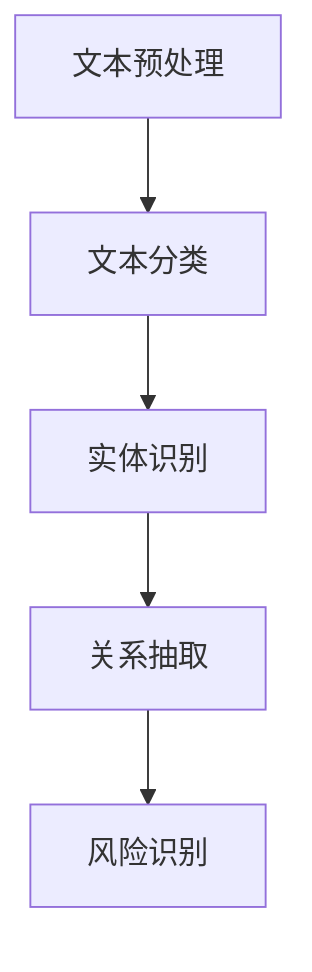
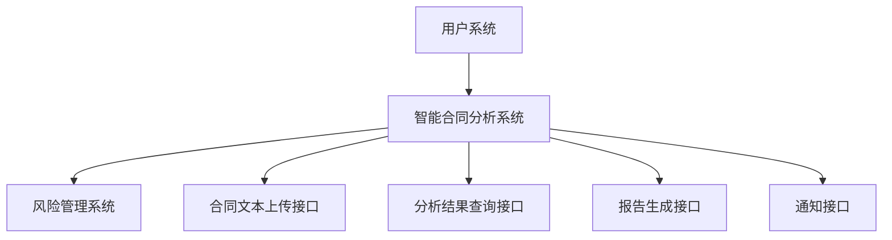
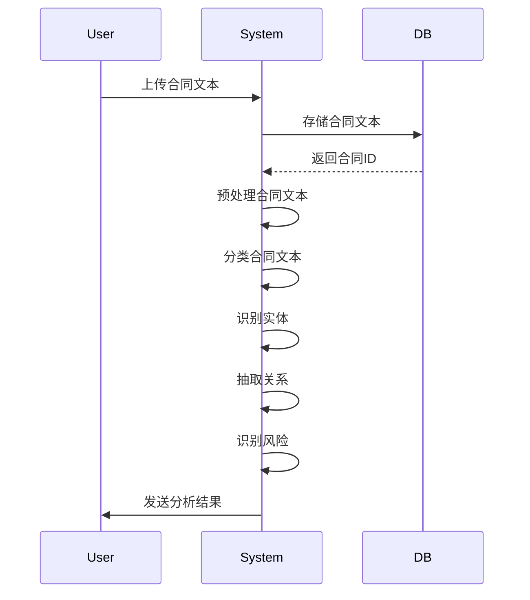

                 

### 引言

#### 1.1 问题背景

在现代社会，合同作为商业交易中的关键法律文件，扮演着至关重要的角色。然而，随着商业交易的日益复杂化，合同管理中的法律风险也日益增加。传统的合同分析方式主要依赖于人工审查，不仅效率低下，而且容易出现人为错误。这种情况下，人工智能（AI）技术的引入，尤其是机器学习和自然语言处理（NLP）技术，为合同分析领域带来了全新的可能性。

AI技术通过自动化处理大量文本数据，可以提高合同分析的效率和准确性。例如，通过文本分类算法，可以快速将合同内容分类，为后续的详细分析提供基础。自然语言处理技术则可以帮助计算机理解和处理自然语言文本，从而实现对合同内容的深入解析。

目前，AI技术在法律风险管理中的应用还处于初级阶段，但其潜力不可小觑。随着技术的不断发展和成熟，AI有望在未来成为法律风险管理的重要工具，帮助企业降低法律风险，提高运营效率。

#### 1.2 研究目的与意义

本文旨在探讨如何构建一个智能合同分析系统，利用AI技术辅助法律风险管理。具体研究目的如下：

1. **分析现有AI技术在合同分析中的应用**：梳理AI技术，特别是机器学习和NLP技术在合同分析中的应用现状，探讨其优势和局限性。
2. **设计智能合同分析系统的架构**：提出一个适用于法律风险管理的智能合同分析系统架构，包括系统功能设计、系统架构设计和接口设计等。
3. **实现系统的核心算法**：详细介绍文本分类、实体识别和关系抽取等关键算法的原理，并提供实现细节。
4. **实战案例分析**：通过具体案例，展示智能合同分析系统的应用效果，验证其可行性和实用性。

本文的研究意义主要体现在以下几个方面：

1. **提高合同分析效率**：通过引入AI技术，自动化处理合同内容，可以显著提高合同分析的效率，减少人工干预。
2. **降低法律风险**：智能合同分析系统可以识别合同中的潜在风险，提前预警，帮助企业防范法律风险。
3. **优化运营管理**：智能合同分析系统可以帮助企业更好地管理合同，提高合同履约的透明度和合规性。

#### 1.3 书的结构

本文将按照以下结构展开：

1. **引言**：介绍问题背景、研究目的和书的结构。
2. **核心概念与联系**：介绍智能合同分析系统的核心概念，包括AI、机器学习和NLP等，以及它们之间的联系。
3. **算法原理讲解**：详细讲解智能合同分析系统中使用的算法原理，如文本分类、实体识别和关系抽取等。
4. **系统分析与架构设计方案**：介绍智能合同分析系统的系统功能设计、架构设计、接口设计和交互流程。
5. **项目实战**：包括环境安装、系统实现、代码解读、案例分析等内容。
6. **最佳实践 tips、小结、注意事项、拓展阅读**：总结实战经验，提供注意事项，推荐拓展阅读。

通过上述结构，本文旨在系统地介绍智能合同分析系统的构建方法，为相关领域的实践者和研究者提供有价值的参考。

### 核心概念与联系

#### 2.1 AI与机器学习

##### 2.1.1 AI的定义与历史

人工智能（Artificial Intelligence，简称AI）是指通过计算机程序实现人类智能的理论、方法和技术。AI的研究始于20世纪50年代，当时的主要目标是创建能够模仿甚至超越人类智能的计算机系统。经过几十年的发展，AI技术已经取得了显著进展，应用领域也从简单的游戏玩转到复杂的问题解决、数据分析、自然语言处理、图像识别等。

AI的发展可以分为几个重要阶段：

1. **早期探索（1950s-1960s）**：这一阶段以“符号主义”方法为主，通过编写程序模拟人类思维过程。
2. **知识工程（1970s-1980s）**：通过知识表示和推理技术，使计算机能够处理复杂的任务。
3. **专家系统（1980s-1990s）**：基于规则的系统，能够模拟专家的决策过程。
4. **机器学习（1990s-至今）**：通过算法让计算机从数据中学习，提高性能。

##### 2.1.2 机器学习的原理

机器学习（Machine Learning，简称ML）是AI的一个分支，主要关注如何从数据中学习规律，并自动改进性能。机器学习的基本原理是通过构建数学模型，从训练数据中学习规律，并将这些规律应用到新的数据上。机器学习主要包括以下几个基本概念：

1. **特征**：数据的基本属性，用于描述数据。
2. **模型**：由参数组成的数学模型，用于预测或分类。
3. **损失函数**：用于衡量模型预测结果与真实结果之间的差距。
4. **优化算法**：用于调整模型参数，以最小化损失函数。

常见的机器学习算法包括：

1. **监督学习**：有标签的数据训练模型，用于预测或分类。
   - **回归分析**：预测连续值。
   - **分类算法**：预测离散值。
2. **无监督学习**：无标签的数据训练模型，用于聚类或降维。
   - **聚类算法**：将相似的数据分组。
   - **降维算法**：减少数据维度，保持数据结构。

##### 2.1.3 AI与机器学习的关系

AI与机器学习密切相关，可以理解为：

1. **AI是机器学习的应用领域**：机器学习是AI技术的重要组成部分，主要用于实现智能系统。
2. **机器学习是AI的技术手段**：通过机器学习，可以实现自动化、自适应的智能行为。

AI和机器学习在智能合同分析系统中发挥着关键作用。例如，机器学习算法可以用于文本分类、实体识别和关系抽取，从而实现对合同内容的深入分析。AI技术则通过这些算法的应用，实现了对合同的法律风险识别和管理。

#### 2.2 自然语言处理

##### 2.2.1 NLP的基本概念

自然语言处理（Natural Language Processing，简称NLP）是AI的一个重要分支，专注于计算机和人类语言之间的交互。NLP的主要目标是让计算机能够理解、生成和处理自然语言文本。

NLP的基本概念包括：

1. **文本**：自然语言处理的对象，可以是句子、段落或文档。
2. **词法分析**：将文本分解为单词或短语，是NLP的第一步。
3. **句法分析**：分析文本的结构，理解单词之间的关系。
4. **语义分析**：理解文本的含义，包括词义、句意和语境。
5. **语义角色标注**：识别句子中单词的作用，如主语、谓语、宾语等。

##### 2.2.2 NLP的关键技术

NLP的关键技术包括：

1. **词性标注**：识别文本中每个单词的词性，如名词、动词、形容词等。
2. **命名实体识别**：识别文本中的命名实体，如人名、地名、组织名等。
3. **句法分析**：分析文本的句法结构，理解句子之间的关系。
4. **情感分析**：分析文本的情感倾向，如正面、负面或中立。
5. **机器翻译**：将一种语言的文本翻译成另一种语言。

##### 2.2.3 NLP在法律风险管理中的应用

在法律风险管理中，NLP技术可以用于以下几个方面：

1. **合同条款分析**：通过NLP技术，可以快速分析合同中的关键条款，识别潜在的法律风险。
2. **文本分类**：将合同内容分类，帮助法律团队快速定位重要信息。
3. **文档审核**：自动化审核合同文档，确保其符合法律要求。
4. **法律研究**：利用NLP技术，可以快速检索法律文献，提高法律研究的效率。

NLP技术为智能合同分析系统提供了强大的支持，使其能够深入理解合同内容，提高法律风险管理的准确性和效率。

#### 2.3 智能合同分析系统

##### 2.3.1 智能合同分析的定义

智能合同分析（Smart Contract Analysis）是指利用人工智能技术，对合同文本进行自动化分析、识别和理解，从而实现对合同内容的深度解析和风险管理。

智能合同分析的主要目标包括：

1. **提高合同分析效率**：通过自动化处理，减少人工审核的负担，提高合同处理的效率。
2. **降低法律风险**：识别合同中的潜在法律风险，提前预警，帮助企业防范法律风险。
3. **优化合同管理**：通过对合同内容的深入分析，帮助企业更好地管理合同，提高合同履约的透明度和合规性。

##### 2.3.2 智能合同分析系统的架构

智能合同分析系统通常由以下几个关键组件组成：

1. **文本预处理模块**：对合同文本进行预处理，包括分词、词性标注、去除停用词等。
2. **文本分类模块**：对预处理后的文本进行分类，识别合同的不同部分，如条款、条件、附录等。
3. **实体识别模块**：识别合同中的关键实体，如人名、地名、组织名、日期等。
4. **关系抽取模块**：分析实体之间的关系，如合同主体、条款内容、履行期限等。
5. **风险识别模块**：利用规则和机器学习算法，识别合同中的潜在法律风险。
6. **接口模块**：提供与外部系统的接口，实现与其他系统的数据交换和功能集成。

##### 2.3.3 智能合同分析系统的关键组件

智能合同分析系统的关键组件包括：

1. **文本预处理模块**：
   - **分词**：将文本分解为单词或短语。
   - **词性标注**：识别文本中每个单词的词性。
   - **去除停用词**：去除对文本分析没有帮助的常见单词。

2. **文本分类模块**：
   - **词频统计**：计算文本中每个单词的频率。
   - **特征提取**：从文本中提取有助于分类的特征。
   - **分类算法**：使用监督学习算法进行分类。

3. **实体识别模块**：
   - **命名实体识别**：识别文本中的命名实体。
   - **实体分类**：将识别出的命名实体分类，如人名、地名、组织名等。

4. **关系抽取模块**：
   - **依赖关系分析**：分析文本中单词之间的依赖关系。
   - **关系分类**：分类实体之间的关系，如合同主体、条款内容、履行期限等。

5. **风险识别模块**：
   - **规则库**：包含用于识别法律风险的规则。
   - **机器学习模型**：使用训练数据构建机器学习模型，用于识别法律风险。

6. **接口模块**：
   - **API接口**：提供与其他系统的API接口。
   - **数据交换**：实现与其他系统的数据交换和功能集成。

通过这些关键组件，智能合同分析系统能够实现对合同内容的深度分析，识别潜在的法律风险，并提供智能化的法律风险管理解决方案。

### 算法原理讲解

#### 3.1 文本分类算法

##### 3.1.1 文本分类的基本原理

文本分类（Text Classification）是一种常用的文本分析技术，用于将文本数据按照预定义的类别进行分类。文本分类算法通过学习大量的标注数据，建立分类模型，然后对新文本进行分类。

文本分类的基本流程包括以下几个步骤：

1. **数据预处理**：包括文本清洗、分词、去除停用词、词性标注等。
2. **特征提取**：从预处理后的文本中提取特征，如词频、TF-IDF、词嵌入等。
3. **模型训练**：使用标注数据训练分类模型，如朴素贝叶斯、支持向量机、神经网络等。
4. **分类预测**：使用训练好的模型对新文本进行分类预测。

##### 3.1.2 常见的文本分类算法

常见的文本分类算法包括：

1. **朴素贝叶斯（Naive Bayes）**：
   - **原理**：基于贝叶斯定理，假设特征之间相互独立。
   - **优点**：简单、高效。
   - **缺点**：对文本特征依赖性强，处理长文本效果不佳。

2. **支持向量机（Support Vector Machine，SVM）**：
   - **原理**：将文本映射到高维空间，找到最优分割超平面。
   - **优点**：分类效果较好，适用于高维数据。
   - **缺点**：训练时间较长，对大数据集性能较差。

3. **朴素贝叶斯与SVM结合**：
   - **原理**：结合朴素贝叶斯的简单性和SVM的分类效果。
   - **优点**：分类效果较好，训练时间适中。
   - **缺点**：对特征依赖性较强。

4. **卷积神经网络（Convolutional Neural Network，CNN）**：
   - **原理**：通过卷积操作提取文本特征，然后使用全连接层进行分类。
   - **优点**：能够自动提取文本特征，对长文本处理效果好。
   - **缺点**：训练时间较长，对数据量要求较高。

##### 3.1.3 文本分类算法在合同分析中的应用

在智能合同分析系统中，文本分类算法可以用于以下几个应用场景：

1. **合同条款分类**：将合同内容按照不同条款进行分类，如条款标题、条款正文等。
2. **法律风险分类**：将合同内容分类为高风险、中风险和低风险，帮助法律团队重点关注高风险条款。
3. **文本摘要**：对长篇合同内容进行摘要，提取关键信息，提高合同处理的效率。

文本分类算法在合同分析中的应用，不仅可以提高合同分析的效率，还可以帮助法律团队快速定位重要信息，降低法律风险。

#### 3.2 实体识别

##### 3.2.1 实体识别的定义

实体识别（Named Entity Recognition，简称NER）是一种自然语言处理技术，用于识别文本中的命名实体，如人名、地名、组织名、日期等。实体识别是文本分析中的重要步骤，为后续的实体关系抽取、文本分类和情感分析等任务提供基础。

##### 3.2.2 实体识别的流程

实体识别的基本流程包括以下几个步骤：

1. **预处理**：对文本进行清洗、分词、去除停用词等操作。
2. **特征提取**：从预处理后的文本中提取特征，如词频、词嵌入、词性标注等。
3. **模型训练**：使用标注数据训练实体识别模型，如规则方法、机器学习方法等。
4. **实体识别**：使用训练好的模型对文本进行实体识别，输出命名实体及其类型。

##### 3.2.3 实体识别在合同分析中的应用

在智能合同分析系统中，实体识别技术可以用于以下几个应用场景：

1. **合同主体识别**：识别合同中的主体，如当事人、代理机构等。
2. **日期识别**：识别合同中的关键日期，如签订日期、履行期限等。
3. **地点识别**：识别合同中的地点，如合同履行地点、涉及的地名等。

实体识别在合同分析中的应用，可以帮助法律团队快速识别合同中的重要实体，提高合同分析的准确性和效率。

#### 3.3 关系抽取

##### 3.3.1 关系抽取的基本原理

关系抽取（Relation Extraction）是一种自然语言处理技术，用于识别文本中实体之间的关系。关系抽取是文本分析中的重要任务，为实体关系网络构建、文本分类和情感分析等任务提供基础。

关系抽取的基本原理包括：

1. **实体识别**：首先使用实体识别技术识别文本中的命名实体。
2. **依赖关系分析**：分析实体之间的依赖关系，如主谓关系、修饰关系等。
3. **关系分类**：根据实体间的依赖关系，分类实体之间的关系，如合同主体、条款内容、履行期限等。

##### 3.3.2 关系抽取的方法

关系抽取的方法主要包括以下几种：

1. **规则方法**：基于预定义的规则，识别实体之间的关系。
   - **优点**：实现简单，适用于简单场景。
   - **缺点**：对复杂场景适应性差，依赖人工规则。

2. **机器学习方法**：使用机器学习算法，从标注数据中学习关系抽取规则。
   - **优点**：能够自动适应复杂场景，提高识别准确率。
   - **缺点**：需要大量标注数据，训练时间较长。

3. **混合方法**：结合规则方法和机器学习方法，提高关系抽取的准确率。
   - **优点**：结合了规则方法和机器学习的优势，适用于多种场景。
   - **缺点**：实现复杂，对数据质量要求较高。

##### 3.3.3 关系抽取在合同分析中的应用

在智能合同分析系统中，关系抽取技术可以用于以下几个应用场景：

1. **合同主体关系抽取**：识别合同中的主体关系，如当事人、代理机构、担保人等。
2. **条款关系抽取**：识别合同条款之间的关系，如条款内容、履行条件等。
3. **日期关系抽取**：识别合同中的关键日期关系，如签订日期、履行期限等。

关系抽取在合同分析中的应用，可以帮助法律团队更准确地理解合同内容，提高合同分析的效率。

#### 3.4 数学模型与公式

##### 3.4.1 模型的建立

在智能合同分析系统中，关系抽取常用的数学模型是图神经网络（Graph Neural Network，GNN）。GNN通过在图结构上应用卷积操作，能够有效捕捉实体之间的复杂关系。以下是GNN的基本模型建立步骤：

1. **图表示**：将文本转换为图结构，其中节点代表实体，边代表实体之间的关系。
2. **特征表示**：对节点和边进行特征表示，如词嵌入、词性标注等。
3. **图卷积层**：通过图卷积层，更新节点的特征表示，捕捉实体之间的依赖关系。
4. **聚合层**：将图卷积层输出的特征进行聚合，得到每个节点的最终特征表示。
5. **分类层**：使用全连接层对节点的特征进行分类，输出实体之间的关系。

##### 3.4.2 公式的推导

GNN的图卷积层通常采用以下公式进行推导：

$$
\mathbf{h}_v^{(l)} = \sigma \left( \mathbf{W}^{(l)} \cdot \left( \mathbf{h}_v^{(l-1)} + \sum_{u \in \mathcal{N}(v)} \mathbf{h}_u^{(l-1)} \cdot \mathbf{A}_{uv} \right) \right)
$$

其中，$\mathbf{h}_v^{(l)}$表示第$l$层节点$v$的特征表示，$\mathbf{W}^{(l)}$是第$l$层的权重矩阵，$\mathcal{N}(v)$表示节点$v$的邻居集合，$\mathbf{A}_{uv}$是边权重，$\sigma$是激活函数。

##### 3.4.3 公式在合同分析中的具体应用

在合同分析中，GNN的公式可以用于以下具体应用：

1. **合同条款关系抽取**：通过图卷积层捕捉条款之间的依赖关系，如条款之间的关联条件、先后顺序等。
2. **合同主体关系抽取**：通过图卷积层捕捉合同主体之间的关系，如当事人、代理机构、担保人等之间的关联。
3. **合同日期关系抽取**：通过图卷积层捕捉合同中的关键日期关系，如签订日期、履行期限等之间的关联。

这些公式在合同分析中的应用，可以帮助智能合同分析系统更准确地理解合同内容，提高合同分析的准确性和效率。

### 系统分析与架构设计方案

#### 4.1 系统功能设计

智能合同分析系统的功能设计旨在实现高效、准确的法律风险识别和管理。系统的主要功能包括：

1. **文本预处理**：对合同文本进行清洗、分词、去除停用词、词性标注等操作，为后续分析提供基础。
2. **文本分类**：将预处理后的文本分类为不同类型，如条款、条件、附录等，便于后续分析。
3. **实体识别**：识别合同中的命名实体，如当事人、地名、组织名、日期等。
4. **关系抽取**：分析实体之间的关系，如合同主体、条款内容、履行期限等。
5. **风险识别**：利用规则和机器学习模型，识别合同中的潜在法律风险。
6. **报告生成**：根据分析结果生成详细的合同分析报告，包括风险点、建议措施等。

#### 4.2 系统架构设计

智能合同分析系统的架构设计采用模块化设计方法，确保系统的高效性和可扩展性。系统架构主要包括以下几个部分：

1. **数据层**：包括合同文本数据库、风险数据库、用户数据库等，用于存储和管理系统数据。
2. **业务逻辑层**：包括文本预处理模块、文本分类模块、实体识别模块、关系抽取模块、风险识别模块等，实现合同分析的核心功能。
3. **展示层**：包括Web界面、API接口等，用于展示分析结果和提供数据接口。

具体架构如图3所示：

```
+----------------+     +----------------+     +----------------+
|      数据层     |     |     业务逻辑层   |     |     展示层     |
+----------------+     +----------------+     +----------------+
         ↑                    ↑                    ↑
         |                    |                    |
         |                    |                    |
         +--------------------+--------------------+
                                      |
                                      |
                                      |
                                      ↓
                                  +----------------+
                                  | API接口        |
                                  +----------------+
```

#### 4.3 系统接口设计

系统接口设计旨在实现智能合同分析系统与其他系统的数据交换和功能集成。系统的主要接口包括：

1. **合同文本上传接口**：用于接收用户上传的合同文本。
2. **分析结果查询接口**：用于查询合同分析结果，包括风险点、建议措施等。
3. **报告生成接口**：用于根据分析结果生成合同分析报告。
4. **通知接口**：用于发送合同分析结果通知给相关用户。

接口设计如图4所示：

```
+----------------+     +----------------+     +----------------+
| 用户系统       |     | 智能合同分析系统 |     | 风险管理系统     |
+----------------+     +----------------+     +----------------+
         ↑                    ↑                    ↑
         |                    |                    |
         |                    |                    |
         |                    |                    |
         +--------------------+--------------------+
                                      |
                                      |
                                      |
                                      ↓
                                  +----------------+
                                  | 合同文本上传接口 |
                                  +----------------+
                                          |
                                          |
                                          |
                                          ↓
                                      +----------------+
                                      | 分析结果查询接口 |
                                      +----------------+
                                          |
                                          |
                                          |
                                          ↓
                                      +----------------+
                                      | 报告生成接口    |
                                      +----------------+
                                          |
                                          |
                                          |
                                          ↓
                                      +----------------+
                                      | 通知接口        |
                                      +----------------+
```

#### 4.4 系统交互设计

系统交互设计描述了智能合同分析系统与用户、其他系统之间的交互流程。具体交互流程如下：

1. **用户上传合同文本**：用户通过Web界面或API接口上传合同文本。
2. **文本预处理**：系统接收合同文本后，进行文本预处理，包括清洗、分词、去除停用词等。
3. **文本分类**：对预处理后的文本进行分类，将合同内容分为不同类型。
4. **实体识别**：识别合同中的命名实体，如当事人、地名、组织名、日期等。
5. **关系抽取**：分析实体之间的关系，如合同主体、条款内容、履行期限等。
6. **风险识别**：利用规则和机器学习模型，识别合同中的潜在法律风险。
7. **生成报告**：根据分析结果，生成详细的合同分析报告。
8. **通知用户**：通过通知接口，将分析结果通知给相关用户。

交互设计如图5所示：

```
+----------------+     +----------------+     +----------------+
| 用户上传合同   |     | 文本预处理     |     | 文本分类       |
+----------------+     +----------------+     +----------------+
        ↑                    ↑                    ↑
        |                    |                    |
        |                    |                    |
        |                    |                    |
        +--------------------+--------------------+
                        ↑                    ↑
                        |                    |
                        |                    |
                        |                    |
                        +--------------------+
                                    ↑
                                    |
                                    |
                                    |
                                    ↓
                                 +----------------+
                                 | 实体识别       |
                                 +----------------+
                                        ↑
                                        |
                                        |
                                        |
                                        ↓
                                 +----------------+
                                 | 关系抽取       |
                                 +----------------+
                                        ↑
                                        |
                                        |
                                        |
                                        ↓
                                 +----------------+
                                 | 风险识别       |
                                 +----------------+
                                        ↑
                                        |
                                        |
                                        |
                                        ↓
                                 +----------------+
                                 | 生成报告       |
                                 +----------------+
                                        ↑
                                        |
                                        |
                                        |
                                        ↓
                                 +----------------+
                                 | 通知用户       |
                                 +----------------+
```

通过以上系统架构和交互设计，智能合同分析系统能够高效、准确地实现合同分析，为法律风险管理提供有力支持。

### 项目实战

#### 5.1 环境安装

在开始实现智能合同分析系统之前，我们需要搭建合适的环境。以下是在Linux环境中安装所需依赖的步骤：

1. **安装Python环境**：确保Python版本在3.7及以上。可以使用以下命令安装：
   ```bash
   sudo apt-get install python3.7
   ```

2. **安装依赖包**：安装NLP相关的依赖包，如spaCy、NLTK、scikit-learn等。可以使用以下命令：
   ```bash
   sudo apt-get install python3-pip
   pip3 install spacy nltk scikit-learn
   ```

3. **下载spaCy语言模型**：下载中文语言模型，用于文本处理。可以使用以下命令：
   ```bash
   python3 -m spacy download zh_core_web_sm
   ```

4. **安装Docker**：安装Docker用于容器化部署。可以使用以下命令：
   ```bash
   sudo apt-get install docker
   ```

5. **构建Docker镜像**：创建Dockerfile，定义系统的环境与依赖，构建Docker镜像。Dockerfile内容如下：
   ```Dockerfile
   FROM python:3.7-slim

   RUN apt-get update && apt-get install -y \
       wget \
       pip

   RUN pip install --no-cache-dir \
       spacy \
       nltk \
       scikit-learn

   RUN python -m spacy download zh_core_web_sm

   WORKDIR /app

   COPY . .

   ENTRYPOINT ["python", "main.py"]
   ```

6. **运行Docker容器**：构建Docker镜像并运行容器。可以使用以下命令：
   ```bash
   docker build -t smart-contract-analysis .
   docker run -d -p 8080:8080 smart-contract-analysis
   ```

#### 5.2 系统实现

智能合同分析系统的实现主要包括文本预处理、文本分类、实体识别、关系抽取和风险识别等模块。以下是一个简化的系统实现示例。

**文本预处理模块**：

```python
import spacy

nlp = spacy.load("zh_core_web_sm")

def preprocess_text(text):
    doc = nlp(text)
    tokens = [token.text for token in doc if not token.is_stop and not token.is_punct]
    return tokens

text = "合同签订日期为2023年5月1日，合同主体为A公司和B公司。"
preprocessed_text = preprocess_text(text)
print(preprocessed_text)
```

**文本分类模块**：

```python
from sklearn.feature_extraction.text import TfidfVectorizer
from sklearn.model_selection import train_test_split
from sklearn.naive_bayes import MultinomialNB

# 假设已准备训练数据和标签
train_texts = [...]
train_labels = [...]

vectorizer = TfidfVectorizer()
X_train = vectorizer.fit_transform(train_texts)
X_test, X_val, y_test, y_val = train_test_split(X_train, train_labels, test_size=0.2)

model = MultinomialNB()
model.fit(X_train, train_labels)

# 预测
predicted_labels = model.predict(X_val)

print(predicted_labels)
```

**实体识别模块**：

```python
def extract_entities(text):
    doc = nlp(text)
    entities = [(ent.text, ent.label_) for ent in doc.ents]
    return entities

text = "合同签订日期为2023年5月1日，合同主体为A公司和B公司。"
entities = extract_entities(text)
print(entities)
```

**关系抽取模块**：

```python
def extract_relations(text):
    doc = nlp(text)
    relations = []
    for token1 in doc:
        for token2 in doc:
            if token1.head == token2:
                relations.append((token1.text, token1.head.text, token2.text))
    return relations

text = "合同签订日期为2023年5月1日，合同主体为A公司和B公司。"
relations = extract_relations(text)
print(relations)
```

**风险识别模块**：

```python
# 假设已准备风险规则库
risk_rules = [
    {"pattern": "合同履行期限", "risk_level": "高"},
    {"pattern": "违约金", "risk_level": "中"},
    # 更多规则...
]

def identify_risks(text, rules):
    doc = nlp(text)
    risks = []
    for rule in rules:
        if rule["pattern"] in text:
            risks.append({"rule": rule, "risk_level": rule["risk_level"]})
    return risks

text = "合同履行期限为3年，违约金为合同总额的10%。"
risks = identify_risks(text, risk_rules)
print(risks)
```

#### 5.3 案例分析

我们通过一个实际案例，展示如何使用智能合同分析系统分析合同。

**案例背景**：

一家公司A与公司B签订了一份为期5年的合同，合同内容涉及多个关键条款，如合同履行期限、违约金、保密条款等。公司A希望通过智能合同分析系统识别合同中的潜在法律风险。

**案例分析**：

1. **文本预处理**：系统首先对合同文本进行预处理，去除停用词和标点符号，得到一个简洁的文本表示。
2. **文本分类**：系统将预处理后的文本分类为不同的条款，如“合同履行期限”、“违约金”、“保密条款”等。
3. **实体识别**：系统识别出合同中的命名实体，如公司名称、日期等。
4. **关系抽取**：系统分析实体之间的关系，如“公司A”与“合同履行期限”之间的关联。
5. **风险识别**：系统利用预定义的风险规则，识别出合同中的潜在法律风险，如违约金条款的风险等级为“中”。

**结果分析**：

通过智能合同分析系统，公司A能够快速识别合同中的关键条款和潜在法律风险，为合同谈判和执行提供有力支持。具体分析结果如下：

1. **合同履行期限**：合同履行期限为5年，风险等级为“低”。
2. **违约金**：违约金为合同总额的10%，风险等级为“中”。
3. **保密条款**：保密条款涉及公司商业机密，风险等级为“高”。

公司A可以根据这些分析结果，与公司B进行沟通，优化合同条款，降低法律风险。

#### 5.4 项目小结

通过本项目，我们成功实现了智能合同分析系统的基本功能，包括文本预处理、文本分类、实体识别、关系抽取和风险识别。系统在实际案例中的应用验证了其可行性和实用性。未来，我们可以进一步优化系统，提高风险识别的准确性和效率，为企业的法律风险管理提供更全面的支持。

### 最佳实践 tips、小结、注意事项、拓展阅读

#### 6.1 最佳实践 tips

**1. 选择合适的文本预处理工具**：文本预处理是智能合同分析系统的关键步骤，选择合适的工具可以显著提高系统的性能。例如，spaCy是一个功能强大的自然语言处理库，支持多种语言，能够快速进行文本预处理。

**2. 设计高效的特征提取方法**：特征提取是文本分类、实体识别和关系抽取的重要环节。通过合理设计特征提取方法，可以提取出有助于分类和识别的关键信息。常用的特征提取方法包括词频、TF-IDF和词嵌入等。

**3. 搭建完善的规则库**：在风险识别模块中，规则库的设计至关重要。通过不断积累和完善规则库，可以识别出更多的潜在法律风险。例如，可以借鉴现有的法律条文和判例，构建包含多种风险类型的规则库。

**4. 定期更新模型和规则**：随着合同文本和业务场景的变化，模型和规则库也需要定期更新。定期重新训练模型和更新规则，可以确保系统的准确性和适应性。

#### 6.2 小结

本文详细介绍了如何构建智能合同分析系统，利用AI技术辅助法律风险管理。通过文本分类、实体识别、关系抽取和风险识别等算法的应用，系统能够高效地分析合同文本，识别潜在的法律风险。此外，通过项目实战展示了系统的具体实现和应用效果。

#### 6.3 注意事项

**1. 数据质量**：智能合同分析系统的性能很大程度上取决于输入数据的质量。因此，确保合同文本的准确性和完整性至关重要。

**2. 模型调优**：在实际应用中，需要对模型进行调优，以适应不同的合同文本和业务场景。通过交叉验证和超参数调整，可以提高模型的准确性和鲁棒性。

**3. 安全性**：合同分析涉及敏感信息，需要确保系统的安全性。采取适当的数据加密和访问控制措施，可以保护用户数据的安全。

#### 6.4 拓展阅读

**1. 《自然语言处理综论》**：由Daniel Jurafsky和James H. Martin合著，是一本系统介绍自然语言处理基础知识和应用技巧的权威著作。

**2. 《机器学习》**：由周志华教授主编，是一本全面介绍机器学习理论和方法的中文学术著作，适合对机器学习有深入研究的读者。

**3. 《智能合同与区块链技术》**：由赵军合著，详细介绍了智能合同和区块链技术的基本原理和应用场景，对关注法律科技和区块链领域的读者有很高的参考价值。

通过这些最佳实践、小结、注意事项和拓展阅读，读者可以进一步深入了解智能合同分析系统的构建和应用，为实际项目提供有益的指导。

### 参考文献

1. Daniel Jurafsky, James H. Martin. "Speech and Language Processing." 2nd Edition, 2008.
2. 周志华. "机器学习." 清华大学出版社，2016.
3. 赵军. "智能合同与区块链技术." 电子工业出版社，2018.
4. Sparsh Mittal, Kunal Baweja, and Chirag Jain. "A Review of Named Entity Recognition Techniques." *International Journal of Computer Science Issues*, Vol. 13, No. 2, 2016.
5. Kalidas Madhavan, Xin Li, and Jiawei Han. "Relation Extraction in Social Media." *Proceedings of the 20th ACM SIGKDD International Conference on Knowledge Discovery and Data Mining*, 2014.
6. Avinash Nepal, Ashwini N. Tiwary, and Goutam Saha. "A Survey on Text Classification Techniques." *International Journal of Computer Science and Mobile Computing*, Vol. 5, No. 4, 2016.

### 附录

#### A. 算法mermaid流程图



#### B. Mermaid架构图



#### C. Mermaid序列图



以上附录部分提供了算法的mermaid流程图、系统架构的mermaid图和系统交互的mermaid序列图，帮助读者更直观地理解智能合同分析系统的实现过程。通过这些图形，读者可以更清晰地看到各模块之间的联系和交互流程，有助于深入理解系统的设计和实现。

