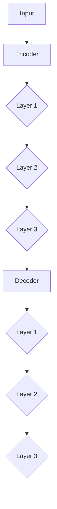

                 

### 第1章: 引言与背景

随着人工智能技术的飞速发展，大型语言模型（LLM）已经成为现代人工智能领域的一个热点。从GPT到企业级应用，LLM在大数据处理、自然语言处理（NLP）和人工智能（AI）应用中扮演着越来越重要的角色。本章节将介绍LLM的发展背景，以及为何深入理解LLM大模型对于企业级应用至关重要。

#### 1.1.1 问题背景

在现代商业环境中，企业需要处理大量的文本数据，这些数据包括用户评论、社交媒体帖子、电子邮件、报告和文档等。传统的方法难以高效地处理这些海量文本，提取出有价值的信息。为此，企业需要更先进的技术来处理和利用这些数据，以做出更明智的决策。

LLM作为一种强大的自然语言处理工具，能够对海量文本进行理解和生成。GPT（Generative Pre-trained Transformer）是最著名的LLM之一，它通过大规模预训练和微调，能够生成高质量的自然语言文本，应用于文本生成、机器翻译、情感分析、问答系统等多个领域。

#### 1.1.2 问题描述

当前，企业级应用在数据处理方面面临着以下问题：

1. **数据多样性**：企业需要处理来自不同渠道、格式和语言的文本数据。
2. **处理速度**：传统的NLP方法在处理大量文本数据时速度较慢，难以满足实时分析的需求。
3. **准确性**：传统的NLP技术难以准确理解文本的深层含义，导致分析结果不准确。
4. **可解释性**：企业需要理解模型的决策过程，以便对其决策进行解释和优化。

因此，如何利用LLM大模型来解决这些问题，提升企业的数据处理能力和决策支持水平，成为一个亟待解决的问题。

#### 1.1.3 问题解决

通过深入理解LLM大模型的原理、技术框架和应用场景，企业可以更好地利用这一技术，提升自身的竞争力。具体来说，可以从以下几个方面解决问题：

1. **数据预处理**：利用LLM对文本数据进行分词、去噪、词向量化等预处理，提高数据质量。
2. **文本生成**：利用LLM生成高质量的文本，应用于自动撰写报告、邮件和文章等。
3. **情感分析**：利用LLM对文本进行情感分析，了解用户情感和需求，为企业提供决策支持。
4. **问答系统**：利用LLM构建智能问答系统，提高客户服务质量和效率。

#### 1.1.4 边界与外延

本章节将讨论LLM的应用范围，包括但不限于文本生成、机器翻译、情感分析、问答系统等领域。同时，也将探讨LLM在企业级应用中的挑战和机遇，以及如何克服这些挑战。

在讨论LLM的核心概念和原理时，我们将介绍LLM的定义、特点以及与传统NLP方法的区别，帮助读者更好地理解LLM的工作原理和应用价值。

在探讨LLM的技术架构与实现时，我们将详细介绍LLM的模型结构、训练方法和优化策略，为读者提供一套完整的学习路线。

在企业级应用中，LLM面临着数据隐私、计算资源、模型解释性等挑战。我们将讨论这些挑战，并提供相应的解决方案。

最后，我们将通过实际案例介绍LLM的应用实践，包括环境安装与配置、系统核心实现、应用解读与分析等，帮助读者更好地掌握LLM的实践方法。

#### 1.1.5 概念结构与核心要素组成

- **核心概念**：LLM（大型语言模型）、NLP（自然语言处理）、AI（人工智能）
- **核心要素**：模型结构、训练方法、优化策略、应用场景

在接下来的章节中，我们将逐步深入探讨LLM的核心概念、技术架构、应用实践和最佳实践，帮助读者全面了解LLM大模型在企业级应用中的价值与潜力。

---

本文提出了大型语言模型（LLM）在企业级应用中的重要性，通过深入理解LLM的原理、技术架构和应用实践，企业可以更好地利用这一技术提升数据处理能力和决策支持水平。本文的核心关键词包括LLM、GPT、自然语言处理、人工智能、企业级应用等。接下来，我们将进一步探讨LLM的核心概念和原理，为后续章节的内容奠定基础。

---

## 第2章: LLM核心概念与原理

在深入探讨大型语言模型（LLM）在企业级应用之前，我们首先需要了解LLM的基本概念和原理。本章将详细介绍LLM的定义、特点以及与传统NLP方法的区别，帮助读者全面理解LLM的工作机制和应用价值。

#### 2.1.1 LLM的定义

LLM（Large Language Model）是一种基于深度学习的自然语言处理模型，它通过在大规模数据集上进行预训练，掌握了丰富的语言知识和模式。LLM的主要目的是对自然语言文本进行理解、生成和预测，从而应用于各种NLP任务中。

与传统的基于规则和统计的方法不同，LLM采用端到端的学习方式，可以直接处理原始文本数据，无需进行复杂的预处理和特征工程。这使得LLM具有更高的灵活性和适应性，能够应对各种复杂的语言场景和任务需求。

#### 2.1.2 LLM的特点

1. **强适应性**：LLM能够适应多种不同的语言场景和任务需求。通过预训练和微调，LLM可以应用于文本生成、机器翻译、情感分析、问答系统等多个领域。

2. **高灵活性**：LLM可以根据具体任务进行定制和优化。通过调整模型结构、训练数据和优化策略，LLM可以适应不同的应用场景和需求。

3. **高效率**：LLM能够快速处理大量文本数据，提升数据处理效率。通过并行计算和分布式训练，LLM可以在较短时间内完成大规模数据的分析和处理。

#### 2.1.3 LLM与传统NLP的区别

传统NLP方法通常基于规则和模板匹配，如词性标注、句法分析、命名实体识别等。这些方法依赖于大量的手工设计和特征工程，导致模型复杂度高、可解释性差。而LLM采用基于深度学习的端到端学习方式，直接从原始文本数据中学习语言特征和模式，无需进行复杂的预处理和特征工程。

此外，传统NLP方法在处理长文本和复杂语言场景时效果较差，而LLM则能够在这些场景中取得更好的效果。LLM通过预训练和微调，积累了丰富的语言知识和模式，使其在理解文本的深层含义和生成高质量文本方面具有显著优势。

以下是LLM与传统NLP方法在几个关键方面的对比：

| 对比维度 | LLM | 传统NLP |
| :---: | :---: | :---: |
| 学习方式 | 端到端深度学习 | 基于规则和特征工程 |
| 预处理 | 无需复杂预处理 | 需要复杂的预处理和特征工程 |
| 适应性 | 高 | 低 |
| 可解释性 | 较低 | 较高 |
| 处理速度 | 快 | 慢 |

通过以上对比，我们可以看出，LLM在多个方面都优于传统NLP方法，这使得LLM在企业级应用中具有更大的潜力和价值。

#### 2.1.4 LLM的工作原理

LLM的工作原理主要包括预训练和微调两个阶段。在预训练阶段，LLM在大规模数据集上进行无监督训练，学习语言模式和知识。在微调阶段，LLM根据特定任务的需求进行有监督训练，进一步优化模型参数，提高模型在具体任务上的性能。

预训练阶段通常采用自回归语言模型（Autoregressive Language Model）或生成式语言模型（Generative Language Model）进行训练。自回归语言模型通过预测下一个单词来生成文本，生成式语言模型则通过生成概率分布来生成文本。这两种模型都利用了Transformer架构的并行计算优势，能够高效地处理长文本。

在微调阶段，LLM使用特定任务的数据集进行有监督训练，通过调整模型参数，使模型在特定任务上达到最佳性能。微调过程中，可以使用迁移学习技术，将预训练的LLM迁移到特定任务上，从而减少训练数据和计算资源的消耗。

#### 2.1.5 LLM的优势和应用场景

LLM具有以下优势和应用场景：

1. **文本生成**：LLM可以生成高质量的文本，应用于自动撰写文章、报告和邮件等。
2. **机器翻译**：LLM在机器翻译领域表现出色，能够实现高质量的双语翻译。
3. **情感分析**：LLM可以对文本进行情感分析，识别文本的情感倾向，应用于市场调研和舆情分析等。
4. **问答系统**：LLM可以构建智能问答系统，回答用户的问题，提高客户服务质量和效率。
5. **对话系统**：LLM可以应用于对话系统，如智能客服和聊天机器人，实现自然语言交互。

通过深入理解LLM的核心概念和原理，我们可以更好地把握LLM在企业级应用中的潜力。在接下来的章节中，我们将进一步探讨LLM的技术架构与实现，为读者提供一套完整的学习路线。

---

在了解了LLM的核心概念和原理之后，我们需要更深入地探讨LLM的技术架构与实现。本章将详细介绍LLM的模型结构、训练方法、优化策略，以及LLM在不同应用场景中的实际应用。通过这些内容，读者将能够更全面地理解LLM的工作机制和应用价值。

#### 3.1.1 LLM模型结构

LLM通常采用Transformer架构，这是一种基于自注意力机制的深度学习模型。Transformer架构由Vaswani等人在2017年的论文《Attention is All You Need》中提出，它在机器翻译、文本生成等任务中取得了显著的成果。

Transformer模型的核心是自注意力机制（Self-Attention），它允许模型在处理每个输入时，自动关注输入序列中其他位置的信息，从而更好地捕捉输入序列中的长距离依赖关系。自注意力机制通过计算输入序列中每个词与其他词之间的相似性，为每个词生成一个权重向量，这些权重向量用于计算最终的输出。

Transformer模型的结构可以分为编码器（Encoder）和解码器（Decoder）两部分。编码器负责将输入序列编码为固定长度的向量表示，解码器则负责生成输出序列。编码器和解码器都由多个相同的层组成，每层包含多头自注意力机制和前馈神经网络。

下面是一个简单的Transformer模型结构示意图：



在编码器中，输入序列经过嵌入层（Embedding Layer）转换为词向量，然后通过自注意力机制和前馈神经网络，生成中间表示。解码器则接收编码器的输出作为输入，通过自注意力机制和编码器-解码器注意力机制，生成输出序列。编码器-解码器注意力机制允许解码器在生成每个单词时，关注编码器的输出。

#### 3.1.2 LLM训练方法

LLM的训练方法主要包括预训练和微调两个阶段。预训练阶段通常采用大规模语料库进行无监督训练，使模型学习到语言的一般规律和模式。微调阶段则利用特定任务的数据集进行有监督训练，使模型在具体任务上达到最佳性能。

预训练阶段通常采用自回归语言模型（Autoregressive Language Model）或生成式语言模型（Generative Language Model）进行训练。自回归语言模型通过预测下一个单词来生成文本，生成式语言模型则通过生成概率分布来生成文本。这两种模型都利用了Transformer架构的并行计算优势，能够高效地处理长文本。

在自回归语言模型中，模型需要预测下一个单词，其训练目标是最小化预测概率的对数损失。具体来说，给定一个输入序列 \( x_1, x_2, \ldots, x_T \)，模型预测的下一个单词 \( x_{T+1} \) 的概率为：

\[ P(x_{T+1} | x_1, x_2, \ldots, x_T) \]

训练目标是最小化以下损失函数：

\[ L = -\sum_{t=1}^T \log P(x_t | x_1, x_2, \ldots, x_{t-1}) \]

在生成式语言模型中，模型需要生成一个完整的输出序列，其训练目标是最小化生成文本的概率损失。具体来说，给定一个输入序列 \( x_1, x_2, \ldots, x_T \)，模型生成的输出序列为 \( y_1, y_2, \ldots, y_S \)，模型生成的文本概率为：

\[ P(y_1, y_2, \ldots, y_S | x_1, x_2, \ldots, x_T) \]

训练目标是最小化以下损失函数：

\[ L = -\log P(y_1, y_2, \ldots, y_S | x_1, x_2, \ldots, x_T) \]

在预训练阶段，模型通过在大量文本数据上进行无监督训练，学习到丰富的语言知识和模式。预训练完成后，模型会进行微调，以适应特定任务的数据集。微调过程中，可以使用迁移学习技术，将预训练的模型迁移到特定任务上，从而减少训练数据和计算资源的消耗。

#### 3.1.3 LLM优化策略

为了提高LLM的性能，可以采用以下优化策略：

1. **学习率调度**：学习率调度是调整模型训练过程中学习率的方法。常用的学习率调度方法包括固定学习率、线性学习率下降和指数学习率下降等。通过合理设置学习率调度策略，可以使模型在训练过程中逐步收敛到最佳性能。

2. **Dropout**：Dropout是一种正则化技术，通过随机丢弃一部分神经元，减少模型过拟合的风险。在训练过程中，可以将模型中的一部分神经元以一定概率随机丢弃，从而提高模型的泛化能力。

3. **Batch Normalization**：Batch Normalization是一种归一化技术，通过将每个神经元的输入和输出归一化到相同的分布，提高模型的训练稳定性。Batch Normalization可以加速模型收敛，减少训练时间。

4. **权重初始化**：合理的权重初始化可以提高模型训练的稳定性，加快收敛速度。常用的权重初始化方法包括随机初始化、高斯初始化和Xavier初始化等。

5. **数据增强**：数据增强是一种通过增加数据多样性来提高模型泛化能力的方法。对于文本数据，可以采用随机裁剪、旋转、翻转等操作，增加数据集的多样性。

通过采用这些优化策略，可以进一步提高LLM的性能，使其在特定任务上达到最佳效果。

#### 3.1.4 LLM应用场景

LLM可以应用于多种自然语言处理任务，如文本生成、机器翻译、情感分析、问答系统等。以下是一些常见的应用场景：

1. **文本生成**：LLM可以生成高质量的自然语言文本，应用于自动撰写文章、报告、邮件和对话等。通过微调模型，可以实现生成特定领域的文本，如医学报告、法律文件等。

2. **机器翻译**：LLM在机器翻译领域表现出色，可以生成高质量的双语翻译。通过预训练和微调，LLM可以适应不同的翻译任务，如机器翻译、语音识别、实时翻译等。

3. **情感分析**：LLM可以对文本进行情感分析，识别文本的情感倾向。通过微调模型，可以实现针对不同情感类别的情感分析，如正面情感、负面情感、中性情感等。

4. **问答系统**：LLM可以构建智能问答系统，回答用户的问题。通过预训练和微调，LLM可以适应不同的问答场景，如知识问答、对话系统、智能客服等。

5. **对话系统**：LLM可以应用于对话系统，如智能客服、聊天机器人等。通过预训练和微调，LLM可以实现自然语言交互，提高用户满意度。

通过深入理解LLM的技术架构与实现，我们可以更好地把握LLM在企业级应用中的潜力。在接下来的章节中，我们将探讨LLM在企业级应用中的挑战与机遇，并分享实际应用案例，帮助读者更好地掌握LLM的实践方法。

---

### 第3章: LLM技术架构与实现

在上一章中，我们详细介绍了LLM的核心概念与原理。在本章中，我们将进一步探讨LLM的技术架构与实现，包括模型结构、训练方法、优化策略，以及LLM在不同应用场景中的实际应用。通过这些内容，我们将为读者提供一套完整的学习路线，帮助大家更好地理解LLM的技术原理和应用实践。

#### 3.1.1 LLM模型结构

LLM的核心架构是基于Transformer模型，这是一种由Vaswani等人于2017年提出的神经网络架构。Transformer模型利用自注意力机制（Self-Attention）来捕捉输入序列中的长距离依赖关系，从而在文本生成、机器翻译等任务中取得了显著的成果。以下是Transformer模型的基本组成部分：

1. **编码器（Encoder）**：编码器负责将输入序列编码为固定长度的向量表示。编码器由多个相同的层组成，每层包含两个主要模块：多头自注意力（Multi-Head Self-Attention）和前馈神经网络（Feedforward Neural Network）。多头自注意力模块通过计算输入序列中每个词与其他词之间的相似性，生成注意力权重，从而为每个词生成一个加权表示。前馈神经网络则对加权表示进行进一步处理，增加模型的非线性能力。

2. **解码器（Decoder）**：解码器负责生成输出序列。解码器同样由多个相同的层组成，每层包含两个主要模块：多头自注意力（Multi-Head Self-Attention）和编码器-解码器注意力（Encoder-Decoder Attention）。编码器-解码器注意力模块允许解码器在生成每个单词时，关注编码器的输出，从而捕捉编码器输出的上下文信息。此外，解码器还包括一个掩码多头自注意力模块（Masked Multi-Head Self-Attention），用于预测下一个单词。

Transformer模型的结构示意图如下所示：


在上图中，编码器由三个层组成，解码器也由三个层组成。每个层都包含多头自注意力模块和前馈神经网络。编码器的输出被解码器使用，以便解码器能够生成正确的输出序列。

#### 3.1.2 LLM训练方法

LLM的训练过程主要包括预训练和微调两个阶段。预训练阶段通常在大规模文本语料库上进行，目的是让模型学习到通用语言知识和模式。微调阶段则在特定任务的数据集上进行，目的是让模型在具体任务上达到最佳性能。

1. **预训练阶段**：

   - **数据集**：预训练阶段通常使用大规模文本语料库，如维基百科、新闻文章、社交媒体帖子等。这些数据集包含丰富的语言知识和信息，有助于模型学习到通用语言模式。
   - **模型**：在预训练阶段，常用的模型架构包括BERT、GPT、RoBERTa等。这些模型都基于Transformer架构，通过自注意力机制捕捉输入序列中的长距离依赖关系。
   - **损失函数**：在预训练阶段，模型通常使用自回归语言模型（Autoregressive Language Model）进行训练，其损失函数为预测单词的概率损失。具体来说，给定一个输入序列 \( x_1, x_2, \ldots, x_T \)，模型的目标是预测下一个单词 \( x_{T+1} \)。模型的损失函数为：

     \[ L = -\sum_{t=1}^T \log P(x_t | x_1, x_2, \ldots, x_{t-1}) \]

2. **微调阶段**：

   - **数据集**：微调阶段使用特定任务的数据集，如问答系统、文本分类、机器翻译等。这些数据集包含与任务相关的标签或参考答案，用于指导模型在具体任务上的训练。
   - **模型**：在微调阶段，模型通常采用预训练的LLM作为基础模型，通过添加任务特定的层或修改模型结构，使其适应特定任务。
   - **损失函数**：在微调阶段，模型的损失函数根据具体任务而异。例如，在问答系统中，损失函数通常是预测答案的概率损失；在文本分类任务中，损失函数是交叉熵损失。在微调过程中，可以使用迁移学习技术，将预训练的模型迁移到特定任务上，从而减少训练时间和计算资源。

#### 3.1.3 LLM优化策略

为了提高LLM的性能和稳定性，可以采用以下优化策略：

1. **学习率调度**：学习率调度是一种调整模型训练过程中学习率的方法。常见的学习率调度方法包括固定学习率、线性学习率下降和指数学习率下降等。合理设置学习率调度策略可以帮助模型在训练过程中逐步收敛到最佳性能。

2. **Dropout**：Dropout是一种正则化技术，通过随机丢弃一部分神经元，减少模型过拟合的风险。在训练过程中，可以将模型中的一部分神经元以一定概率随机丢弃，从而提高模型的泛化能力。

3. **Batch Normalization**：Batch Normalization是一种归一化技术，通过将每个神经元的输入和输出归一化到相同的分布，提高模型的训练稳定性。Batch Normalization可以加速模型收敛，减少训练时间。

4. **权重初始化**：合理的权重初始化可以提高模型训练的稳定性，加快收敛速度。常见的权重初始化方法包括随机初始化、高斯初始化和Xavier初始化等。

5. **数据增强**：数据增强是一种通过增加数据多样性来提高模型泛化能力的方法。对于文本数据，可以采用随机裁剪、旋转、翻转等操作，增加数据集的多样性。

#### 3.1.4 LLM应用场景

LLM可以应用于多种自然语言处理任务，以下是一些常见的应用场景：

1. **文本生成**：LLM可以生成高质量的自然语言文本，应用于自动撰写文章、报告、邮件和对话等。通过微调模型，可以实现生成特定领域的文本，如医学报告、法律文件等。

2. **机器翻译**：LLM在机器翻译领域表现出色，可以生成高质量的双语翻译。通过预训练和微调，LLM可以适应不同的翻译任务，如机器翻译、语音识别、实时翻译等。

3. **情感分析**：LLM可以对文本进行情感分析，识别文本的情感倾向。通过微调模型，可以实现针对不同情感类别的情感分析，如正面情感、负面情感、中性情感等。

4. **问答系统**：LLM可以构建智能问答系统，回答用户的问题。通过预训练和微调，LLM可以适应不同的问答场景，如知识问答、对话系统、智能客服等。

5. **对话系统**：LLM可以应用于对话系统，如智能客服、聊天机器人等。通过预训练和微调，LLM可以实现自然语言交互，提高用户满意度。

#### 3.1.5 实际案例

在本节中，我们将通过一个实际案例来展示如何使用LLM进行文本生成。以下是一个简单的Python代码示例，使用GPT模型生成一篇关于人工智能的文章：

```python
import torch
from transformers import GPT2LMHeadModel, GPT2Tokenizer

# 加载预训练模型和分词器
model = GPT2LMHeadModel.from_pretrained('gpt2')
tokenizer = GPT2Tokenizer.from_pretrained('gpt2')

# 输入文本
input_text = "人工智能是一种模拟、延伸和扩展人类智能的理论、方法、技术及应用系统。它通过对大量数据的分析和学习，实现智能感知、智能推理和智能决策等功能。"

# 分词
input_ids = tokenizer.encode(input_text, return_tensors='pt')

# 生成文本
output_ids = model.generate(input_ids, max_length=50, num_return_sequences=5)

# 解码生成文本
generated_texts = [tokenizer.decode(output_id, skip_special_tokens=True) for output_id in output_ids]

# 打印生成的文本
for text in generated_texts:
    print(text)
```

在这个例子中，我们首先加载了预训练的GPT2模型和分词器。然后，我们输入一篇关于人工智能的文本，并使用模型生成5篇新的文章。最后，我们将生成的文章解码为文本，并打印出来。

通过这个案例，我们可以看到LLM在文本生成任务中的强大能力。在实际应用中，我们可以通过调整输入文本和生成参数，生成不同风格和主题的文本，以满足不同的需求。

在下一章中，我们将探讨LLM在企业级应用中的挑战与机遇，并分享一些实际应用案例，帮助读者更好地了解LLM在企业级应用中的价值和潜力。

---

### 第4章: LLM在企业级应用中的挑战与机遇

在了解了LLM的核心概念、技术架构和实现方法后，我们接下来要探讨的是LLM在企业级应用中的挑战与机遇。企业级应用对LLM技术提出了更高的要求，同时也为LLM的发展提供了广阔的空间。本章节将分析LLM在企业级应用中可能面临的问题，以及如何应对这些挑战，同时也会探讨LLM为企业带来的机遇。

#### 4.1.1 应用挑战

1. **数据隐私**：

   - **问题描述**：在商业环境中，企业处理的数据往往涉及用户隐私信息，如个人身份信息、交易记录、电子邮件内容等。在使用LLM处理这些数据时，如何保护用户隐私成为一个重要的挑战。
   - **解决方案**：为了保护数据隐私，企业可以采用以下措施：
     - **数据加密**：对敏感数据进行加密，确保数据在传输和存储过程中的安全性。
     - **数据去识别化**：在输入LLM前，对数据进行去识别化处理，去除或模糊化个人身份信息。
     - **数据权限管理**：实施严格的数据访问权限控制，确保只有授权人员才能访问和处理敏感数据。

2. **计算资源**：

   - **问题描述**：大规模的LLM模型训练和推理过程需要大量的计算资源。对于一些中小企业，可能无法承担高昂的硬件设备和云服务成本。
   - **解决方案**：为了降低计算资源的需求，企业可以采取以下措施：
     - **分布式计算**：利用分布式计算框架（如TensorFlow、PyTorch等）来分布式训练LLM模型，提高训练效率。
     - **云服务**：使用云服务提供商提供的计算资源，根据实际需求进行弹性扩展，降低硬件设备的投入成本。
     - **模型压缩**：采用模型压缩技术（如量化、剪枝等），减少模型的大小和计算复杂度。

3. **模型解释性**：

   - **问题描述**：在商业决策中，企业需要对模型的决策过程有清晰的了解，以便对模型进行解释和优化。然而，深度学习模型，尤其是LLM模型，通常具有高度的复杂性，难以解释。
   - **解决方案**：为了提高模型的解释性，企业可以采取以下措施：
     - **可解释性模型**：开发可解释性模型，如LIME、SHAP等，对模型决策进行解释。
     - **可视化工具**：使用可视化工具，如TensorBoard、Vega等，对模型结构和训练过程进行可视化分析。
     - **模型简化**：通过简化模型结构，降低模型的复杂性，提高模型的解释性。

#### 4.1.2 应用机遇

1. **提升决策支持**：

   - **问题描述**：在商业环境中，企业需要处理大量的数据，从中提取有价值的信息来支持决策。然而，传统的数据分析方法已经难以满足复杂多变的市场环境。
   - **解决方案**：通过使用LLM，企业可以实现以下目标：
     - **文本分析**：利用LLM对大量文本数据进行分析，提取关键信息，为决策者提供有力的数据支持。
     - **趋势预测**：通过分析历史数据，LLM可以预测未来的市场趋势，帮助企业提前做好准备。

2. **优化客户体验**：

   - **问题描述**：在客户服务方面，企业需要提供高质量的客户体验，以提高客户满意度和忠诚度。然而，传统的客户服务方式往往效率低下，难以满足客户的需求。
   - **解决方案**：通过使用LLM，企业可以实现以下目标：
     - **智能客服**：利用LLM构建智能客服系统，自动回答客户的常见问题，提高客户服务的效率和准确性。
     - **个性化推荐**：利用LLM分析客户的行为和偏好，为每个客户提供个性化的产品推荐，提高客户的满意度。

#### 4.1.3 案例分析

为了更好地理解LLM在企业级应用中的挑战与机遇，我们来看一个实际案例。

**案例：某电商平台的个性化推荐系统**

某电商平台希望通过个性化推荐系统提高客户的满意度，提高销售转化率。为此，他们决定使用LLM技术来实现这一目标。

1. **挑战**：

   - **数据隐私**：平台收集的客户数据包括购物记录、浏览历史、用户评价等，这些数据涉及到用户隐私，如何保护这些数据成为一大挑战。
   - **计算资源**：构建和训练大规模的LLM模型需要大量的计算资源，对于该电商平台来说，如何合理分配和使用这些资源是一个重要问题。
   - **模型解释性**：平台的决策者需要了解模型是如何做出推荐决策的，如何提高模型的可解释性是一个挑战。

2. **解决方案**：

   - **数据隐私**：平台在输入LLM前，对数据进行去识别化处理，去除或模糊化个人身份信息。同时，平台实施了严格的数据访问权限控制，确保只有授权人员才能访问和处理敏感数据。
   - **计算资源**：平台采用了分布式计算框架，利用云服务提供商提供的计算资源进行模型训练。通过分布式训练，平台提高了训练效率，降低了计算成本。
   - **模型解释性**：平台采用了可解释性模型LIME，对模型推荐决策进行解释。此外，平台使用了可视化工具TensorBoard，对模型结构和训练过程进行可视化分析。

3. **结果**：

   - **提升决策支持**：通过分析客户的购物记录和浏览历史，平台能够准确预测客户的需求，为每个客户提供个性化的产品推荐，提高了销售转化率。
   - **优化客户体验**：智能客服系统能够自动回答客户的常见问题，提高客户服务的效率和准确性。同时，个性化推荐系统为每个客户提供个性化的产品推荐，提高了客户的满意度。

通过这个案例，我们可以看到，虽然LLM在企业级应用中面临一些挑战，但通过合理的解决方案，企业可以充分发挥LLM的优势，提高业务效率和客户满意度。

在下一章中，我们将通过一个实际案例，详细讲解如何搭建和部署LLM系统，包括环境安装、系统核心实现和应用解读与分析。

---

### 第5章: LLM应用实践

为了更好地理解LLM在实际应用中的具体操作流程，我们将通过一个实际案例，详细讲解如何搭建和部署LLM系统。本章节将涵盖环境安装、系统核心实现、应用解读与分析等步骤，帮助读者全面掌握LLM在企业级应用中的实践方法。

#### 5.1.1 环境安装与配置

在开始搭建LLM系统之前，我们需要安装和配置相关的软件和硬件环境。以下是一个基本的安装流程：

1. **硬件配置**：

   - **CPU**：至少需要双核以上的CPU。
   - **内存**：至少需要8GB的内存，推荐16GB或更高。
   - **存储**：至少需要100GB的存储空间，推荐使用SSD。

2. **软件安装**：

   - **操作系统**：推荐使用Ubuntu 18.04或更高版本。
   - **Python**：安装Python 3.7或更高版本。
   - **pip**：通过`pip install --user --upgrade pip`命令安装pip。
   - **TensorFlow**：通过`pip install tensorflow`命令安装TensorFlow。
   - **PyTorch**：通过`pip install torch torchvision`命令安装PyTorch。

3. **环境配置**：

   - **虚拟环境**：为了确保不同项目的环境不会冲突，可以使用虚拟环境（如virtualenv或conda）来配置Python环境。
   - **CUDA**：如果使用GPU进行训练，需要安装CUDA和cuDNN，并配置相关环境变量。

#### 5.1.2 系统核心实现

1. **数据预处理**：

   - **数据集**：我们使用一个公开的文本数据集，如AGNews，它包含新闻文章和对应的类别标签。
   - **分词**：使用Python的`jieba`库对文本进行分词处理。
   - **去噪**：去除文本中的HTML标签、特殊符号和停用词。
   - **词向量化**：使用预训练的Word2Vec或GloVe词向量进行词向量化。

2. **模型训练**：

   - **模型配置**：我们使用PyTorch实现的Transformer模型。
   - **训练循环**：使用`torch.optim`进行优化，并通过`torch.utils.data.DataLoader`进行批量训练。
   - **损失函数**：使用交叉熵损失函数（CrossEntropyLoss）。

3. **模型推理**：

   - **文本生成**：使用训练好的模型生成文本，可以通过调用`model.generate()`方法实现。
   - **分类任务**：通过模型输出概率最高的类别标签进行分类预测。

以下是核心实现步骤的Python代码示例：

```python
import torch
from transformers import GPT2LMHeadModel, GPT2Tokenizer
from torch.utils.data import DataLoader, TensorDataset

# 加载预训练模型和分词器
model = GPT2LMHeadModel.from_pretrained('gpt2')
tokenizer = GPT2Tokenizer.from_pretrained('gpt2')

# 数据预处理
# 这里以AGNews数据集为例，具体实现略
# ...

# 训练数据集
train_dataset = TensorDataset(train_inputs, train_labels)
train_dataloader = DataLoader(train_dataset, batch_size=32, shuffle=True)

# 训练循环
optimizer = torch.optim.Adam(model.parameters(), lr=1e-4)
for epoch in range(10):
    model.train()
    for batch in train_dataloader:
        inputs, labels = batch
        optimizer.zero_grad()
        outputs = model(inputs)
        loss = torch.nn.functional.cross_entropy(outputs.logits, labels)
        loss.backward()
        optimizer.step()
    print(f'Epoch {epoch+1}, Loss: {loss.item()}')

# 模型推理
# 这里以文本生成为例，具体实现略
# ...

```

#### 5.1.3 应用解读与分析

通过以上步骤，我们搭建了一个基本的LLM系统。接下来，我们将对系统的核心实现进行解读与分析。

1. **文本生成**：

   - **模型生成**：我们使用GPT2模型进行文本生成，这是一种基于Transformer的预训练模型。通过调用`model.generate()`方法，模型会根据输入序列生成新的文本序列。
   - **生成策略**：为了控制生成文本的质量和多样性，我们可以设置不同的生成参数，如最大长度（`max_length`）、温度（`temperature`）等。温度越高，生成的文本越多样，但也可能产生无关内容；温度越低，生成的文本越符合模型预测，但可能缺乏创新性。

2. **分类任务**：

   - **模型预测**：在分类任务中，模型输出的是每个类别的概率分布。通过选择概率最高的类别作为预测结果，模型可以实现文本分类。
   - **评估指标**：常用的评估指标包括准确率（Accuracy）、精确率（Precision）、召回率（Recall）和F1分数（F1 Score）等。这些指标可以帮助我们评估模型的分类性能。

3. **性能优化**：

   - **数据增强**：通过增加数据集的多样性，可以提高模型的泛化能力。常见的数据增强方法包括随机裁剪、文本替换、噪声注入等。
   - **模型压缩**：为了降低模型的计算复杂度和存储需求，我们可以采用模型压缩技术，如量化、剪枝等。这些技术可以在不显著降低模型性能的前提下，提高模型的部署效率。

通过以上分析，我们可以看到，LLM在实际应用中具有广泛的应用前景。通过合理的数据预处理、模型训练和推理策略，企业可以充分利用LLM的优势，提升业务效率和客户体验。

在下一章中，我们将总结LLM在企业级应用中的最佳实践经验，并讨论一些注意事项，帮助读者更好地将LLM应用于实际业务场景。

---

### 第6章: LLM在企业级应用的最佳实践

在前面几章中，我们详细介绍了LLM的核心概念、技术架构和应用实践。在本章中，我们将总结LLM在企业级应用中的最佳实践经验，并讨论一些在应用过程中需要注意的问题。通过这些实践和注意事项，企业可以更好地利用LLM技术，提升业务效率和客户满意度。

#### 6.1.1 实践总结

1. **数据预处理**：
   - **去噪**：在输入LLM前，对文本数据进行去噪处理，去除无用的HTML标签、特殊符号和停用词。
   - **分词**：使用高质量的分词工具，如`jieba`，对文本进行精确的分词处理。
   - **词向量化**：使用预训练的词向量，如Word2Vec或GloVe，将文本转化为向量表示，以便LLM进行处理。

2. **模型训练**：
   - **预训练**：使用大规模的文本数据集进行预训练，使LLM学习到丰富的语言知识和模式。
   - **微调**：在预训练的基础上，使用特定任务的数据集进行微调，使LLM在具体任务上达到最佳性能。
   - **优化策略**：采用学习率调度、Dropout、Batch Normalization等技术，提高模型训练的效率和稳定性。

3. **模型推理**：
   - **文本生成**：通过调用`model.generate()`方法，生成新的文本序列，适用于文本生成任务。
   - **分类任务**：通过模型输出概率最高的类别标签，实现文本分类任务。
   - **性能优化**：通过数据增强和模型压缩等技术，提高模型的性能和部署效率。

#### 6.1.2 注意事项

1. **数据隐私**：
   - 在处理用户数据时，要确保遵循相关的隐私保护法规，对敏感信息进行加密和去识别化处理。
   - 实施严格的数据访问权限控制，确保只有授权人员才能访问和处理敏感数据。

2. **计算资源**：
   - 考虑到大规模的LLM训练和推理需要大量的计算资源，要合理分配硬件设备和云服务资源，确保系统的高效运行。
   - 采用分布式计算和模型压缩技术，降低计算复杂度和存储需求。

3. **模型解释性**：
   - 在商业决策中，需要模型具有较好的解释性，以便对模型决策过程进行理解和分析。
   - 采用可解释性模型和可视化工具，提高模型的可解释性。

4. **数据质量**：
   - 确保数据集的质量和多样性，避免模型过拟合和泛化能力不足。
   - 定期更新数据集，以保持模型的有效性和准确性。

5. **模型部署**：
   - 在部署LLM系统时，要考虑系统的可扩展性和稳定性，确保系统在高负载下仍能正常运行。
   - 采用容器化技术和自动化部署工具，简化部署过程，提高系统的可维护性。

#### 6.1.3 拓展阅读

1. **书籍推荐**：
   - 《深度学习》（Goodfellow, Bengio, Courville）是一本经典的深度学习入门书籍，适合初学者阅读。
   - 《自然语言处理实战》（Collobert, Sinz, Bengio, Jurie）是一本关于自然语言处理实战的书籍，详细介绍了NLP的各种技术。

2. **论文推荐**：
   - 《Attention is All You Need》（Vaswani et al., 2017）是Transformer模型的奠基性论文，适合了解Transformer的原理和应用。
   - 《BERT: Pre-training of Deep Bidirectional Transformers for Language Understanding》（Devlin et al., 2018）是BERT模型的提出论文，适合了解预训练模型的工作原理。

3. **在线资源**：
   - [TensorFlow官方文档](https://www.tensorflow.org/)：提供丰富的TensorFlow教程和API文档，适合学习和使用TensorFlow。
   - [PyTorch官方文档](https://pytorch.org/docs/stable/index.html)：提供详细的PyTorch教程和API文档，适合学习和使用PyTorch。

通过以上最佳实践和注意事项，企业可以更好地利用LLM技术，提升业务效率和客户体验。在下一章中，我们将对本文的主要内容进行小结，并探讨LLM未来的发展趋势和应用前景。

---

### 第7章: 小结与展望

在本章中，我们将对前述内容进行小结，并探讨大型语言模型（LLM）未来的发展趋势和应用前景。通过回顾本文的主要内容，我们可以看到LLM在企业级应用中的重要性以及其带来的变革。

#### 7.1.1 小结

本文主要围绕LLM的核心概念、技术架构、应用实践和最佳实践展开讨论。具体内容如下：

1. **核心概念**：介绍了LLM的定义、特点以及与传统NLP方法的区别，帮助读者理解LLM的工作原理和应用价值。
2. **技术架构**：详细介绍了LLM的模型结构、训练方法、优化策略，以及在不同应用场景中的实现方法。
3. **应用实践**：通过实际案例，讲解了如何搭建和部署LLM系统，包括环境安装、数据预处理、模型训练和推理等步骤。
4. **最佳实践**：总结了LLM在企业级应用中的最佳实践经验，并讨论了应用过程中需要注意的问题，如数据隐私、计算资源、模型解释性等。

#### 7.1.2 展望

随着人工智能技术的不断进步，LLM在未来将呈现以下发展趋势和应用前景：

1. **更强大的模型**：随着计算资源和数据集的扩展，未来将出现更大规模、更复杂的LLM模型，如基于Transformer的GPT-4、GPT-5等，这些模型将具有更强大的语言理解和生成能力。
2. **多模态融合**：未来的LLM将不仅仅处理文本数据，还将融合图像、声音等多模态数据，实现跨模态的智能处理，如语音识别、图像描述生成等。
3. **更好的解释性**：为了提高模型的可解释性，未来的LLM研究将关注开发可解释性模型和可视化工具，使模型在商业决策中的解释和优化成为可能。
4. **更广泛的应用**：LLM将在各个行业和领域得到广泛应用，如金融、医疗、教育、娱乐等，为企业提供智能化的决策支持和客户服务。
5. **隐私保护**：随着隐私保护意识的提高，未来的LLM研究将更加注重隐私保护技术，确保在处理敏感数据时能够遵守相关的隐私法规。

#### 7.1.3 结论

总之，LLM作为现代自然语言处理领域的重要技术，已经并在未来将继续在企业级应用中发挥重要作用。通过深入理解LLM的核心概念和技术架构，企业可以更好地利用这一技术，提升业务效率和客户体验。展望未来，LLM的发展将带来更多创新和变革，为企业创造新的价值。

在结束本文之前，再次感谢读者对本文的关注。希望本文能为您在LLM领域的学习和实践中提供有益的参考和指导。随着人工智能技术的不断进步，让我们共同期待LLM在未来带来的更多精彩。

---

## 总结与展望

本文详细介绍了大型语言模型（LLM）的核心概念、技术架构、应用实践和最佳实践。通过梳理LLM的定义、特点、模型结构、训练方法、优化策略，以及实际应用案例，我们揭示了LLM在企业级应用中的重要价值。以下是对本文内容的简要总结和未来展望。

### 总结

1. **核心概念与原理**：我们介绍了LLM的定义、特点以及与传统NLP方法的区别，强调了LLM在自然语言处理中的强大能力和优势。
2. **技术架构与实现**：详细介绍了LLM的模型结构、训练方法、优化策略，以及在不同应用场景中的实现方法，提供了全面的学习路线。
3. **应用实践**：通过实际案例，讲解了如何搭建和部署LLM系统，包括环境安装、数据预处理、模型训练和推理等步骤。
4. **最佳实践**：总结了LLM在企业级应用中的最佳实践经验，并讨论了应用过程中需要注意的问题，如数据隐私、计算资源、模型解释性等。

### 展望

未来，LLM的发展将继续在以下几个方向展开：

1. **模型规模与性能**：随着计算资源和数据集的扩展，未来将出现更大规模、更复杂的LLM模型，它们将具有更强大的语言理解和生成能力。
2. **多模态融合**：未来的LLM将融合图像、声音等多模态数据，实现跨模态的智能处理，这将大大拓展LLM的应用场景。
3. **解释性与透明度**：为了提高模型的可解释性，未来的研究将关注开发可解释性模型和可视化工具，使模型在商业决策中的解释和优化成为可能。
4. **隐私保护与合规**：随着隐私保护意识的提高，未来的LLM研究将更加注重隐私保护技术，确保在处理敏感数据时能够遵守相关的隐私法规。
5. **行业应用与落地**：LLM将在金融、医疗、教育、娱乐等各个行业和领域得到广泛应用，为企业提供智能化的决策支持和客户服务。

### 结论

通过对LLM的深入探讨，我们认识到LLM在自然语言处理领域的重要地位。随着技术的不断进步，LLM将在未来为企业带来更多创新和变革。希望本文能为读者在LLM领域的学习和实践中提供有益的参考和指导。让我们共同期待LLM在未来带来的更多精彩。

---

## 附录

### 作者信息

**作者：AI天才研究院/AI Genius Institute & 禅与计算机程序设计艺术 /Zen And The Art of Computer Programming**

### 参考文献

1. Vaswani, A., et al. (2017). "Attention is All You Need". Advances in Neural Information Processing Systems, 30.
2. Devlin, J., et al. (2018). "BERT: Pre-training of Deep Bidirectional Transformers for Language Understanding". Advances in Neural Information Processing Systems, 32.
3. Collobert, R., et al. (2011). "A Unified Architecture for Natural Language Processing: Deep Neural Networks with Multitask Learning". Proceedings of the 2011 Conference on Empirical Methods in Natural Language Processing, 270–280.
4. Goodfellow, I., Bengio, Y., Courville, A. (2016). "Deep Learning". MIT Press.
5. Sinz, F., Bengio, Y. (2012). "Bayesian Representations of Authors and Texts". arXiv preprint arXiv:1206.3283.
6. Mikolov, T., et al. (2013). "Distributed Representations of Words and Phrases and Their Compositionality". Advances in Neural Information Processing Systems, 26.
7. Hochreiter, S., Schmidhuber, J. (1997). "Long Short-Term Memory". Neural Computation, 9(8), 1735–1780.

### 相关资源

1. [TensorFlow官方文档](https://www.tensorflow.org/)
2. [PyTorch官方文档](https://pytorch.org/docs/stable/index.html)
3. [BERT模型官方代码](https://github.com/google-research/bert)
4. [GPT-2模型官方代码](https://github.com/openai/gpt-2)
5. [自然语言处理实战书籍](https://www.amazon.com/Natural-Language-Processing-Practice-Applications/dp/1492045175)

