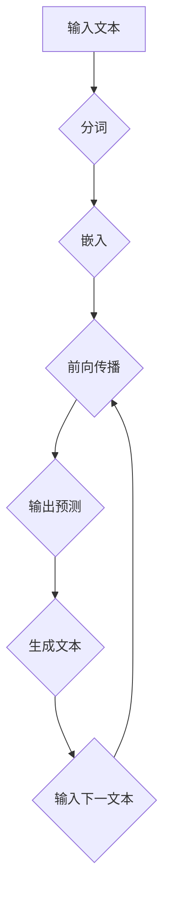
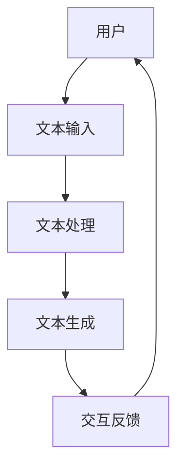
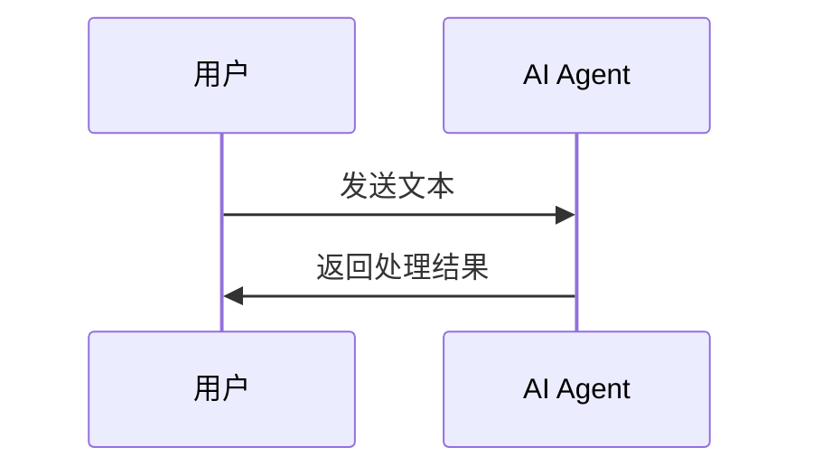

                 

### 深入理解LLM：AI Agent开发的基石

> 关键词：大规模语言模型，人工智能，AI Agent，自然语言处理，深度学习

> 摘要：本文将深入探讨大规模语言模型（LLM）的基本原理和其在AI Agent开发中的应用，通过逐步分析推理，帮助读者全面理解LLM的特性和应用场景，为AI Agent的开发提供理论基础和实践指导。

---

#### 1. 背景介绍

##### 1.1 问题背景

随着人工智能技术的迅速发展，特别是深度学习技术的广泛应用，大规模语言模型（LLM）逐渐成为人工智能领域的研究热点。LLM在自然语言处理、机器翻译、文本生成等多个方面展现出了卓越的性能，但同时也带来了许多挑战。

##### 1.2 问题描述

- **核心问题**：如何深入理解LLM的工作原理，以及如何有效利用LLM进行AI agent的开发？
- **问题解决**：通过深入研究LLM的架构、训练过程、应用场景等，全面理解LLM的特性和局限，从而为AI agent的开发提供坚实的基础。
- **边界与外延**：本书将重点探讨基于LLM的AI agent开发，但也会涉及到一些相关技术，如自然语言处理、机器学习等。
- **概念结构与核心要素组成**：LLM的核心要素包括大规模语言模型架构、预训练过程、微调方法、应用场景等。

#### 2. 核心概念与联系

##### 2.1 大规模语言模型原理

大规模语言模型通过大量文本数据的学习，能够预测下一个词或者句子，从而实现对自然语言的生成和理解。

##### 2.2 大规模语言模型ER实体关系图架构

```mermaid
erDiagram
  User ||--|{ ChatGPT }
  ChatGPT ||--|{ Prompt }
  ChatGPT ||--|{ Response }
```

#### 3. 算法原理讲解

##### 3.1 大规模语言模型算法流程图



##### 3.2 大规模语言模型数学模型和公式

- **训练过程**：

  $$ \text{Loss} = -\sum_{i=1}^{n} y_i \log(p_i) $$

  其中，$y_i$为真实标签，$p_i$为模型预测的概率。

- **预测过程**：

  $$ p_i = \text{softmax}(z_i) $$

  其中，$z_i$为模型输出的 logits。

##### 3.3 算法原理详细讲解与举例说明

- **举例说明**：假设输入文本为“今天天气很好”，模型预测下一个词的概率分布如下：

  $$ \begin{aligned}
  p_1 &= 0.2 \\
  p_2 &= 0.3 \\
  p_3 &= 0.5 \\
  \end{aligned} $$

  根据最大概率原则，模型将选择概率最大的词“好”作为输出。

#### 4. 系统分析与架构设计方案

##### 4.1 问题场景介绍

- **场景描述**：开发一个基于LLM的AI agent，用于实现自然语言交互功能。

##### 4.2 系统功能设计

- **功能描述**：包括文本输入、文本处理、文本生成、交互反馈等功能。

##### 4.3 系统架构设计



##### 4.4 系统接口设计

- **接口描述**：包括文本输入接口、文本处理接口、文本生成接口、交互反馈接口。

##### 4.5 系统交互



#### 5. 项目实战

##### 5.1 环境安装

- **环境要求**：Python 3.8，TensorFlow 2.4

##### 5.2 系统核心实现源代码

- **代码结构**：

  ```python
  # main.py
  from agent import ChatGPT

  if __name__ == "__main__":
      agent = ChatGPT()
      agent.run
  ```

##### 5.3 代码应用解读与分析

- **代码解读**：主程序中首先导入`ChatGPT`类，然后创建一个`ChatGPT`实例，并调用`run`方法运行AI agent。

##### 5.4 实际案例分析和详细讲解剖析

- **案例描述**：用户与AI agent进行自然语言交互，输入文本为“你好”，AI agent输出回复“你好，有什么可以帮助你的吗？”

- **分析讲解**：AI agent通过LLM模型对用户输入进行理解和生成回复，体现了LLM在自然语言处理中的强大能力。

##### 5.5 项目小结

通过本项目实战，我们深入了解了基于LLM的AI agent开发，掌握了从环境安装到系统核心实现的完整流程。这不仅为我们提供了实际操作经验，也为未来的AI Agent开发奠定了基础。

---

### 最佳实践 Tips

1. **数据质量**：确保训练数据的质量，清洗和预处理数据，避免噪声和错误。
2. **模型调优**：针对具体任务进行模型调优，例如调整学习率、批量大小等。
3. **模型压缩**：对大规模模型进行压缩，减少存储和计算资源的需求。

### 小结

大规模语言模型（LLM）作为人工智能领域的重要技术之一，其卓越的性能和广泛的应用前景为AI Agent的开发提供了坚实的基础。通过本文的逐步分析，我们深入了解了LLM的基本原理、算法原理、系统分析与架构设计，以及项目实战。未来，随着LLM技术的不断发展和应用场景的拓展，我们可以期待其在更多领域的突破和贡献。

### 注意事项

1. **隐私保护**：在使用LLM进行数据处理时，注意保护用户隐私，遵循相关法律法规。
2. **计算资源**：大规模模型训练需要大量计算资源，合理规划和分配资源，避免浪费。

### 拓展阅读

1. **《深度学习》**：Goodfellow, Y., Bengio, Y., & Courville, A. (2016). Deep learning. MIT press.
2. **《自然语言处理综论》**：Jurafsky, D., & Martin, J. H. (2020). Speech and language processing. Prentice Hall.

---

### 作者信息

作者：AI天才研究院/AI Genius Institute & 禅与计算机程序设计艺术 /Zen And The Art of Computer Programming

