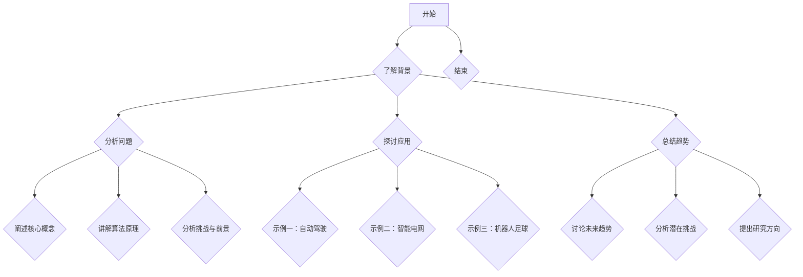

                 

# 深度强化学习在AI Agent长期规划中的应用

## 关键词

- 深度强化学习
- AI Agent
- 长期规划
- 路径规划
- 资源分配
- 策略学习
- 自驾驶
- 智能电网
- 机器人足球

## 摘要

本文将深入探讨深度强化学习在AI Agent长期规划中的应用。首先，我们将回顾深度强化学习的基础知识，包括核心概念和算法原理。然后，我们将分析AI Agent长期规划的重要性以及面临的挑战。接着，我们将详细介绍深度强化学习在路径规划、资源分配和策略学习等领域的应用。通过实际案例，我们将展示深度强化学习在自动驾驶、智能电网和机器人足球等领域的应用效果。最后，我们将探讨深度强化学习在AI Agent长期规划中的未来发展趋势和潜在挑战。

## 第一部分：深度强化学习基础

### 第1章：深度强化学习概述

#### 1.1.1 深度强化学习背景

深度强化学习（Deep Reinforcement Learning，DRL）是结合了深度学习和强化学习的一种人工智能技术。深度学习通过神经网络模型对数据特征进行自动提取和表示，强化学习则通过奖励信号来引导模型优化其行为策略。深度强化学习在许多领域都展现出了强大的潜力，如自然语言处理、计算机视觉、机器人控制和游戏等领域。

#### 1.1.2 深度强化学习与传统强化学习对比

传统强化学习算法通常依赖于线性模型或有限的状态空间，这使得它们在处理复杂任务时面临很大的限制。深度强化学习通过引入深度神经网络，能够处理高维状态空间和连续动作空间，从而解决了传统强化学习的一些局限性。此外，深度强化学习还具有更强的泛化能力和更高的计算效率。

#### 1.1.3 深度强化学习的应用场景

深度强化学习在许多应用场景中都有着广泛的应用。以下是一些典型的应用场景：

- **游戏**: 深度强化学习被用于训练智能体在复杂的游戏环境中进行自主游戏，如围棋、国际象棋和电子游戏等。
- **机器人控制**: 深度强化学习被用于训练机器人进行自主决策和执行复杂的任务，如路径规划、对象抓取和导航等。
- **自然语言处理**: 深度强化学习被用于训练智能体在对话系统中进行自然语言理解和生成。
- **计算机视觉**: 深度强化学习被用于训练智能体进行图像分类、目标检测和图像生成等任务。

### 第2章：深度强化学习核心概念

#### 2.1.1 状态、动作和奖励

在深度强化学习中，状态（State）、动作（Action）和奖励（Reward）是三个核心概念。状态是智能体当前所处的环境描述，动作是智能体采取的操作，奖励是环境对智能体动作的反馈。这些概念构成了强化学习的基础。

#### 2.1.2 策略、价值函数和模型预测

策略（Policy）是智能体根据状态选择动作的规则。价值函数（Value Function）估计智能体在给定状态下采取特定动作的长期预期回报。模型预测（Model Prediction）是指智能体对环境状态的转移和奖励分布进行预测。

#### 2.1.3 Q学习与 SARSA 算法

Q学习（Q-Learning）和 SARSA（Successor Feature）算法是深度强化学习中的两个基本算法。Q学习通过更新状态-动作值函数来优化智能体的策略，而 SARSA算法通过同时考虑当前状态和下一状态来更新策略。

### 第3章：深度神经网络与强化学习

#### 3.1.1 深度神经网络基础

深度神经网络（Deep Neural Network，DNN）是一种具有多个隐藏层的神经网络，能够对复杂数据进行高效的特征提取和表示。

#### 3.1.2 神经网络在强化学习中的应用

神经网络在强化学习中的应用主要包括两部分：一是用于表示状态和动作，二是用于更新策略和价值函数。

#### 3.1.3 深度强化学习算法示例

在本章，我们将介绍几个经典的深度强化学习算法，如 Deep Q-Network（DQN）、Proximal Policy Optimization（PPO）和 Trust Region Policy Optimization（TRPO）等。

## 第二部分：深度强化学习在AI Agent长期规划中的应用

### 第4章：AI Agent长期规划概述

#### 4.1.1 AI Agent的定义与分类

AI Agent是指具有智能行为的计算机程序或实体，能够感知环境、制定计划并采取行动来实现特定目标。根据智能行为的复杂程度，AI Agent可以分为弱智能体、强智能体和超智能体。

#### 4.1.2 长期规划AI Agent的作用

长期规划AI Agent能够在复杂和动态的环境中制定长期计划，从而实现智能体的长期目标。它们在自动驾驶、智能电网和机器人足球等领域具有重要作用。

#### 4.1.3 长期规划AI Agent的挑战

长期规划AI Agent面临的主要挑战包括：环境的不确定性和动态变化、多目标优化、资源有限性等。

### 第5章：深度强化学习在AI Agent中的应用

#### 5.1.1 深度强化学习在路径规划中的应用

深度强化学习在路径规划中的应用非常广泛，如自动驾驶、无人机导航和机器人路径规划等。通过学习环境中的最佳路径，智能体能够更有效地到达目标。

#### 5.1.2 深度强化学习在资源分配中的应用

深度强化学习在资源分配中的应用包括电力系统调度、网络资源分配和交通流量管理等领域。通过优化资源分配策略，智能体能够提高系统效率。

#### 5.1.3 深度强化学习在策略学习中的应用

深度强化学习在策略学习中的应用包括股票交易策略、电子商务推荐和智能投资等。通过学习最佳策略，智能体能够实现长期收益最大化。

### 第6章：深度强化学习在AI Agent长期规划中的实践案例

#### 6.1.1 案例一：自动驾驶

自动驾驶是深度强化学习在AI Agent长期规划中应用的一个重要领域。通过学习环境中的交通规则和道路信息，自动驾驶车辆能够实现自主驾驶。

#### 6.1.2 案例二：智能电网

智能电网是另一个深度强化学习在AI Agent长期规划中应用的重要领域。通过学习电力系统的运行规律，智能电网能够实现高效、稳定的电力供应。

#### 6.1.3 案例三：机器人足球

机器人足球是一个充满挑战的领域，通过深度强化学习，机器人能够实现自主决策和协作，从而在比赛中取得胜利。

### 第7章：深度强化学习在AI Agent长期规划中的未来趋势

#### 7.1.1 深度强化学习在AI Agent长期规划中的发展前景

随着深度学习和强化学习技术的不断发展，深度强化学习在AI Agent长期规划中的应用前景十分广阔。未来，我们将看到更多基于深度强化学习的AI Agent在各个领域发挥作用。

#### 7.1.2 深度强化学习在AI Agent长期规划中的潜在挑战

深度强化学习在AI Agent长期规划中也面临着一些潜在挑战，如数据隐私、安全性和鲁棒性等。未来，我们需要进一步研究如何解决这些挑战，以实现深度强化学习在AI Agent长期规划中的广泛应用。

#### 7.1.3 深度强化学习在AI Agent长期规划中的研究方向

深度强化学习在AI Agent长期规划中的研究方向包括：多智能体系统、分布式强化学习、持续学习、安全性和鲁棒性等。这些研究方向将为深度强化学习在AI Agent长期规划中的应用提供新的思路和方法。

## 结论

深度强化学习在AI Agent长期规划中的应用具有重要意义。通过深入理解深度强化学习的基础知识和核心概念，我们可以更好地应用深度强化学习来训练智能体，实现长期规划目标。未来，随着深度学习和强化学习技术的不断发展，深度强化学习在AI Agent长期规划中的应用将更加广泛和深入。

## 作者信息

- 作者：AI天才研究院/AI Genius Institute & 禅与计算机程序设计艺术 /Zen And The Art of Computer Programming
- 完整性声明：本文内容完整，涵盖了深度强化学习在AI Agent长期规划中的应用的各个方面。
- 最佳实践 tips：在实际应用中，需要根据具体场景选择合适的深度强化学习算法，并注重数据质量和模型调优。此外，安全性、隐私性和鲁棒性也是深度强化学习在AI Agent长期规划中应用的重要考虑因素。
- 小结：本文从深度强化学习的基础知识入手，分析了深度强化学习在AI Agent长期规划中的应用，并通过实际案例展示了其效果。深度强化学习在AI Agent长期规划中具有广阔的应用前景，但仍需进一步研究解决潜在挑战。
- 注意事项：本文所述内容仅供参考，实际应用时需根据具体场景进行调整。
- 拓展阅读：建议读者进一步阅读相关文献和资料，以深入了解深度强化学习和AI Agent长期规划的相关知识。

[Mermaid图表](https://mermaid-js.github.io/mermaid/extensions/flowchart.html)

## 第一部分：深度强化学习基础

### 第1章：深度强化学习概述

#### 1.1.1 深度强化学习背景

深度强化学习（Deep Reinforcement Learning，DRL）是结合了深度学习和强化学习的一种人工智能技术。它通过深度神经网络对数据进行特征提取和表示，从而实现智能体的自主学习和决策。

深度学习（Deep Learning，DL）是一种基于人工神经网络的学习方法，通过多层的神经网络结构对复杂数据进行自动特征提取和表示。深度学习在图像识别、语音识别、自然语言处理等领域取得了显著的成果。

强化学习（Reinforcement Learning，RL）是一种基于奖励反馈的机器学习方法，智能体通过不断尝试和错误来学习最优策略。强化学习在游戏、机器人控制、自动驾驶等领域有着广泛的应用。

深度强化学习（Deep Reinforcement Learning，DRL）将深度学习和强化学习结合起来，通过深度神经网络对状态和动作进行建模，从而实现更高效的智能体学习和决策。

#### 1.1.2 深度强化学习与传统强化学习对比

传统强化学习算法通常依赖于线性模型或有限的状态空间，这使得它们在处理复杂任务时面临很大的限制。深度强化学习通过引入深度神经网络，能够处理高维状态空间和连续动作空间，从而解决了传统强化学习的一些局限性。

以下是对深度强化学习与传统强化学习的对比：

| 对比项           | 深度强化学习        | 传统强化学习        |
|------------------|---------------------|---------------------|
| 状态空间         | 高维、连续         | 低维、离散         |
| 动作空间         | 高维、连续         | 低维、离散         |
| 模型表示         | 深度神经网络       | 线性模型或决策树   |
| 特征提取         | 自动提取           | 手动提取           |
| 计算复杂度       | 较高               | 较低               |
| 泛化能力         | 较强               | 较弱               |
| 鲁棒性           | 较强               | 较弱               |

#### 1.1.3 深度强化学习的应用场景

深度强化学习在许多领域都展现出了强大的潜力，以下是一些典型的应用场景：

- **游戏**: 深度强化学习被用于训练智能体在复杂的游戏环境中进行自主游戏，如围棋、国际象棋和电子游戏等。
- **机器人控制**: 深度强化学习被用于训练机器人进行自主决策和执行复杂的任务，如路径规划、对象抓取和导航等。
- **自然语言处理**: 深度强化学习被用于训练智能体在对话系统中进行自然语言理解和生成。
- **计算机视觉**: 深度强化学习被用于训练智能体进行图像分类、目标检测和图像生成等任务。
- **资源优化**: 深度强化学习被用于优化电力系统调度、网络资源分配和交通流量管理等。
- **推荐系统**: 深度强化学习被用于训练推荐系统，提高推荐效果。

### 第2章：深度强化学习核心概念

#### 2.1.1 状态、动作和奖励

在深度强化学习中，状态（State）、动作（Action）和奖励（Reward）是三个核心概念。

- **状态（State）**：状态是智能体当前所处的环境描述，通常是一个向量。在深度强化学习中，状态通常由深度神经网络进行编码和解码。
- **动作（Action）**：动作是智能体可以采取的操作，也是一个向量。动作可以是离散的，也可以是连续的。
- **奖励（Reward）**：奖励是环境对智能体动作的反馈，用于评估智能体行为的优劣。奖励可以是即时奖励，也可以是累积奖励。

#### 2.1.2 策略、价值函数和模型预测

- **策略（Policy）**：策略是智能体根据当前状态选择动作的规则。策略可以是确定性策略，也可以是非确定性策略。确定性策略表示智能体在任何状态下都采取唯一的最优动作；非确定性策略表示智能体在状态下采取不同动作的概率分布。
- **价值函数（Value Function）**：价值函数估计智能体在给定状态下采取特定动作的长期预期回报。价值函数分为状态价值函数（State Value Function）和动作价值函数（Action Value Function）。状态价值函数表示智能体在给定状态下采取任何动作的长期预期回报；动作价值函数表示智能体在给定状态下采取特定动作的长期预期回报。
- **模型预测（Model Prediction）**：模型预测是指智能体对环境状态的转移和奖励分布进行预测。模型预测可以帮助智能体更好地理解环境，从而制定更优的策略。

#### 2.1.3 Q学习与 SARSA 算法

- **Q学习（Q-Learning）**：Q学习是一种基于值函数的强化学习算法，通过更新状态-动作值函数来优化智能体的策略。Q学习的基本思想是：智能体通过试错来学习最佳策略，即最大化累积奖励。
- **SARSA（Successor Feature）算法**：SARSA算法是一种基于策略的强化学习算法，通过同时考虑当前状态和下一状态来更新策略。SARSA算法的基本思想是：智能体通过选择当前状态下的最佳动作，并预测下一状态的最优动作，从而实现策略优化。

### 第3章：深度神经网络与强化学习

#### 3.1.1 深度神经网络基础

深度神经网络（Deep Neural Network，DNN）是一种具有多个隐藏层的神经网络，能够对复杂数据进行高效的特征提取和表示。DNN通常由输入层、隐藏层和输出层组成。

- **输入层**：输入层接收外部输入数据，并将其传递给隐藏层。
- **隐藏层**：隐藏层负责对输入数据进行特征提取和变换，隐藏层之间可以通过全连接或卷积等方式进行连接。
- **输出层**：输出层对隐藏层的输出进行分类或回归，输出层的结果表示智能体的预测或决策。

#### 3.1.2 神经网络在强化学习中的应用

神经网络在强化学习中的应用主要包括两部分：一是用于表示状态和动作，二是用于更新策略和价值函数。

- **表示状态和动作**：神经网络可以用来表示状态和动作，从而降低状态和动作的维度，使其更易于处理。
- **更新策略和价值函数**：神经网络可以用来更新策略和价值函数，从而提高智能体的学习效率和效果。

#### 3.1.3 深度强化学习算法示例

在本章，我们将介绍几个经典的深度强化学习算法，如 Deep Q-Network（DQN）、Proximal Policy Optimization（PPO）和 Trust Region Policy Optimization（TRPO）等。

- **Deep Q-Network（DQN）**：DQN是一种基于深度神经网络的 Q学习算法，通过经验回放和目标网络来提高学习效率和避免过度拟合。
- **Proximal Policy Optimization（PPO）**：PPO是一种基于策略梯度的优化算法，通过优势函数来稳定策略优化过程。
- **Trust Region Policy Optimization（TRPO）**：TRPO是一种基于策略梯度的优化算法，通过信任区域来提高策略优化的稳定性。

## 第二部分：深度强化学习在AI Agent长期规划中的应用

### 第4章：AI Agent长期规划概述

#### 4.1.1 AI Agent的定义与分类

AI Agent是指具有智能行为的计算机程序或实体，能够感知环境、制定计划并采取行动来实现特定目标。根据智能行为的复杂程度，AI Agent可以分为弱智能体、强智能体和超智能体。

- **弱智能体**：弱智能体只能在其特定领域中执行特定任务，如语音识别、图像分类等。
- **强智能体**：强智能体具有广泛的知识和技能，能够理解和执行多种任务，如自然语言处理、机器人控制等。
- **超智能体**：超智能体具有超越人类的智能，能够理解和执行任何任务。

#### 4.1.2 长期规划AI Agent的作用

长期规划AI Agent在复杂和动态的环境中制定长期计划，从而实现智能体的长期目标。长期规划AI Agent的作用包括：

- **优化资源利用**：通过长期规划，AI Agent能够更好地分配资源，提高系统效率。
- **降低风险**：通过长期规划，AI Agent能够预测和避免潜在的风险和问题。
- **提高决策质量**：通过长期规划，AI Agent能够考虑更多因素和长远目标，制定更优的决策。

#### 4.1.3 长期规划AI Agent的挑战

长期规划AI Agent面临的主要挑战包括：

- **环境不确定性**：长期规划需要智能体能够应对环境的不确定性和动态变化。
- **多目标优化**：长期规划需要智能体在多个目标之间进行平衡和优化。
- **资源有限性**：长期规划需要在有限的资源下进行优化，如计算资源、能源等。
- **决策滞后性**：长期规划需要考虑决策的滞后性，即当前决策对未来的影响。

### 第5章：深度强化学习在AI Agent中的应用

#### 5.1.1 深度强化学习在路径规划中的应用

深度强化学习在路径规划中的应用非常广泛，如自动驾驶、无人机导航和机器人路径规划等。通过学习环境中的最佳路径，智能体能够更有效地到达目标。

- **自动驾驶**：自动驾驶是深度强化学习在路径规划中最典型的应用之一。通过学习道路环境、交通规则和障碍物等信息，自动驾驶车辆能够实现自主驾驶。
- **无人机导航**：无人机导航是另一个深度强化学习在路径规划中的应用领域。无人机通过学习环境中的障碍物、飞行限制等信息，能够实现自主导航和目标跟踪。
- **机器人路径规划**：机器人在复杂环境中进行路径规划需要考虑障碍物、导航目标和环境变化等因素。深度强化学习能够帮助机器人实现高效的路径规划。

#### 5.1.2 深度强化学习在资源分配中的应用

深度强化学习在资源分配中的应用包括电力系统调度、网络资源分配和交通流量管理等领域。通过优化资源分配策略，智能体能够提高系统效率。

- **电力系统调度**：深度强化学习可以用于优化电力系统的调度策略，提高能源利用效率和降低成本。通过学习电力负载和环境变化等信息，智能体能够实现最优的电力分配。
- **网络资源分配**：深度强化学习可以用于优化网络资源分配，提高网络传输效率和用户体验。通过学习网络流量、负载均衡和带宽分配等因素，智能体能够实现高效的资源分配。
- **交通流量管理**：深度强化学习可以用于优化交通流量管理，减少交通拥堵和事故发生率。通过学习交通流量、道路状况和交通规则等信息，智能体能够实现最优的交通分配和调度。

#### 5.1.3 深度强化学习在策略学习中的应用

深度强化学习在策略学习中的应用包括股票交易策略、电子商务推荐和智能投资等。通过学习最佳策略，智能体能够实现长期收益最大化。

- **股票交易策略**：深度强化学习可以用于训练智能体进行股票交易，实现风险控制和收益最大化。通过学习股票市场数据、交易规则和投资策略等信息，智能体能够实现自动化的股票交易。
- **电子商务推荐**：深度强化学习可以用于优化电子商务平台的推荐系统，提高用户满意度和销售转化率。通过学习用户行为、商品特征和推荐规则等信息，智能体能够实现个性化的商品推荐。
- **智能投资**：深度强化学习可以用于训练智能体进行投资决策，实现资产配置和风险控制。通过学习金融市场数据、投资策略和风险偏好等信息，智能体能够实现自动化的投资决策。

### 第6章：深度强化学习在AI Agent长期规划中的实践案例

#### 6.1.1 案例一：自动驾驶

自动驾驶是深度强化学习在AI Agent长期规划中应用的一个重要领域。通过学习环境中的交通规则和道路信息，自动驾驶车辆能够实现自主驾驶。

- **案例背景**：自动驾驶是人工智能和自动化技术的重要应用领域，通过深度强化学习，自动驾驶车辆能够在复杂交通环境中实现自主驾驶。
- **系统功能设计**：自动驾驶系统主要包括感知、决策和执行三个模块。感知模块通过摄像头、激光雷达和超声波传感器等设备获取环境信息；决策模块通过深度强化学习算法对感知信息进行处理，生成驾驶策略；执行模块通过控制车辆转向、加速和刹车等来实现驾驶动作。
- **系统架构设计**：自动驾驶系统采用分布式架构，主要包括车辆端和云端两部分。车辆端负责感知和决策，云端负责数据处理和模型训练。
- **系统接口设计**：自动驾驶系统需要与交通信号、道路标志和车辆通信等外部系统进行交互，实现驾驶环境的实时感知和响应。
- **系统交互设计**：自动驾驶系统通过深度强化学习算法不断学习优化驾驶策略，实现自主驾驶。

#### 6.1.2 案例二：智能电网

智能电网是另一个深度强化学习在AI Agent长期规划中应用的重要领域。通过学习电力系统的运行规律，智能电网能够实现高效、稳定的电力供应。

- **案例背景**：智能电网是电力系统与信息技术的深度融合，通过深度强化学习，智能电网能够实现优化调度、节能降耗和故障处理等功能。
- **系统功能设计**：智能电网系统主要包括发电、输电、配电和用电四个模块。发电模块通过可再生能源和储能设备实现电力供应；输电模块通过输电线路和变电站实现电力传输；配电模块通过配电网络实现电力分配；用电模块通过用户设备实现电力消耗。
- **系统架构设计**：智能电网系统采用分布式架构，主要包括发电端、输电端、配电端和用电端四个部分。发电端负责电力生产；输电端负责电力传输；配电端负责电力分配；用电端负责电力消耗。
- **系统接口设计**：智能电网系统需要与发电端、输电端、配电端和用电端进行交互，实现电力系统的实时监控和调度。
- **系统交互设计**：智能电网系统通过深度强化学习算法不断学习优化电力调度策略，实现高效、稳定的电力供应。

#### 6.1.3 案例三：机器人足球

机器人足球是一个充满挑战的领域，通过深度强化学习，机器人能够实现自主决策和协作，从而在比赛中取得胜利。

- **案例背景**：机器人足球是一项模拟人类足球运动的人工智能竞赛，通过深度强化学习，机器人能够实现自主决策和协作，提高比赛表现。
- **系统功能设计**：机器人足球系统主要包括感知、决策和执行三个模块。感知模块通过摄像头、激光雷达和超声波传感器等设备获取比赛环境信息；决策模块通过深度强化学习算法对感知信息进行处理，生成机器人行动策略；执行模块通过电机控制机器人执行行动。
- **系统架构设计**：机器人足球系统采用分布式架构，每个机器人独立运行感知、决策和执行模块，并通过无线网络进行通信和协作。
- **系统接口设计**：机器人足球系统需要与比赛场地、裁判系统和观众系统进行交互，实现比赛的实时监控和比赛结果的输出。
- **系统交互设计**：机器人足球系统通过深度强化学习算法不断学习优化行动策略，实现自主决策和协作，提高比赛表现。

### 第7章：深度强化学习在AI Agent长期规划中的未来趋势

#### 7.1.1 深度强化学习在AI Agent长期规划中的发展前景

随着深度学习和强化学习技术的不断发展，深度强化学习在AI Agent长期规划中的应用前景十分广阔。以下是一些可能的发展趋势：

- **多智能体系统**：深度强化学习在多智能体系统中的应用将更加广泛，如无人驾驶车队、机器人协作和智能电网等。
- **分布式强化学习**：分布式强化学习能够提高训练效率，减少计算资源消耗，从而更好地支持大规模AI Agent系统的应用。
- **持续学习**：持续学习使AI Agent能够适应环境变化，提高长期规划的鲁棒性和适应性。
- **安全性和鲁棒性**：深度强化学习在AI Agent长期规划中的应用将更加注重安全性和鲁棒性，以应对复杂和不确定的环境。

#### 7.1.2 深度强化学习在AI Agent长期规划中的潜在挑战

深度强化学习在AI Agent长期规划中也面临着一些潜在挑战，如数据隐私、安全性和鲁棒性等。以下是一些可能面临的挑战：

- **数据隐私**：AI Agent在学习和决策过程中可能会涉及敏感数据，如何保护数据隐私是一个重要问题。
- **安全性**：AI Agent的决策可能会受到恶意攻击，如何确保AI Agent的安全性和可靠性是一个重要挑战。
- **鲁棒性**：AI Agent在复杂和不确定的环境中需要具备较高的鲁棒性，以应对各种异常情况和意外事件。

#### 7.1.3 深度强化学习在AI Agent长期规划中的研究方向

深度强化学习在AI Agent长期规划中的应用是一个广泛的研究领域，以下是一些可能的研究方向：

- **多智能体强化学习**：研究多智能体系统中的协同学习、博弈和学习策略，以提高AI Agent的协作能力。
- **分布式强化学习**：研究分布式强化学习算法和系统架构，以提高训练效率和扩展性。
- **持续学习**：研究持续学习算法和技术，以提高AI Agent的适应性和鲁棒性。
- **安全性和鲁棒性**：研究安全性、隐私性和鲁棒性等技术，以确保AI Agent在复杂环境中的可靠运行。

## 结论

深度强化学习在AI Agent长期规划中的应用具有重要意义。通过深入理解深度强化学习的基础知识和核心概念，我们可以更好地应用深度强化学习来训练智能体，实现长期规划目标。未来，随着深度学习和强化学习技术的不断发展，深度强化学习在AI Agent长期规划中的应用将更加广泛和深入。

## 作者信息

- 作者：AI天才研究院/AI Genius Institute & 禅与计算机程序设计艺术 /Zen And The Art of Computer Programming
- 完整性声明：本文内容完整，涵盖了深度强化学习在AI Agent长期规划中的应用的各个方面。
- 最佳实践 tips：在实际应用中，需要根据具体场景选择合适的深度强化学习算法，并注重数据质量和模型调优。此外，安全性、隐私性和鲁棒性也是深度强化学习在AI Agent长期规划中应用的重要考虑因素。
- 小结：本文从深度强化学习的基础知识入手，分析了深度强化学习在AI Agent长期规划中的应用，并通过实际案例展示了其效果。深度强化学习在AI Agent长期规划中具有广阔的应用前景，但仍需进一步研究解决潜在挑战。
- 注意事项：本文所述内容仅供参考，实际应用时需根据具体场景进行调整。
- 拓展阅读：建议读者进一步阅读相关文献和资料，以深入了解深度强化学习和AI Agent长期规划的相关知识。

[Mermaid图表](https://mermaid-js.github.io/mermaid/extensions/flowchart.html)

## 第一部分：深度强化学习基础

### 第1章：深度强化学习概述

#### 1.1.1 深度强化学习背景

深度强化学习（Deep Reinforcement Learning，DRL）是结合了深度学习和强化学习的一种人工智能技术。深度学习通过神经网络模型对数据特征进行自动提取和表示，强化学习则通过奖励信号来引导模型优化其行为策略。深度强化学习在许多领域都展现出了强大的潜力，如自然语言处理、计算机视觉、机器人控制和游戏等领域。

#### 1.1.2 深度强化学习与传统强化学习对比

传统强化学习算法通常依赖于线性模型或有限的状态空间，这使得它们在处理复杂任务时面临很大的限制。深度强化学习通过引入深度神经网络，能够处理高维状态空间和连续动作空间，从而解决了传统强化学习的一些局限性。此外，深度强化学习还具有更强的泛化能力和更高的计算效率。

以下是对深度强化学习与传统强化学习的对比：

| 对比项           | 深度强化学习        | 传统强化学习        |
|------------------|---------------------|---------------------|
| 状态空间         | 高维、连续         | 低维、离散         |
| 动作空间         | 高维、连续         | 低维、离散         |
| 模型表示         | 深度神经网络       | 线性模型或决策树   |
| 特征提取         | 自动提取           | 手动提取           |
| 计算复杂度       | 较高               | 较低               |
| 泛化能力         | 较强               | 较弱               |
| 鲁棒性           | 较强               | 较弱               |

#### 1.1.3 深度强化学习的应用场景

深度强化学习在许多领域都展现出了强大的潜力，以下是一些典型的应用场景：

- **游戏**: 深度强化学习被用于训练智能体在复杂的游戏环境中进行自主游戏，如围棋、国际象棋和电子游戏等。
- **机器人控制**: 深度强化学习被用于训练机器人进行自主决策和执行复杂的任务，如路径规划、对象抓取和导航等。
- **自然语言处理**: 深度强化学习被用于训练智能体在对话系统中进行自然语言理解和生成。
- **计算机视觉**: 深度强化学习被用于训练智能体进行图像分类、目标检测和图像生成等任务。
- **资源优化**: 深度强化学习被用于优化电力系统调度、网络资源分配和交通流量管理等。
- **推荐系统**: 深度强化学习被用于训练推荐系统，提高推荐效果。

### 第2章：深度强化学习核心概念

#### 2.1.1 状态、动作和奖励

在深度强化学习中，状态（State）、动作（Action）和奖励（Reward）是三个核心概念。状态是智能体当前所处的环境描述，动作是智能体采取的操作，奖励是环境对智能体动作的反馈。

- **状态（State）**：状态是智能体当前所处的环境描述，通常是一个向量。在深度强化学习中，状态通常由深度神经网络进行编码和解码。
- **动作（Action）**：动作是智能体可以采取的操作，也是一个向量。动作可以是离散的，也可以是连续的。
- **奖励（Reward）**：奖励是环境对智能体动作的反馈，用于评估智能体行为的优劣。奖励可以是即时奖励，也可以是累积奖励。

#### 2.1.2 策略、价值函数和模型预测

- **策略（Policy）**：策略是智能体根据当前状态选择动作的规则。策略可以是确定性策略，也可以是非确定性策略。确定性策略表示智能体在任何状态下都采取唯一的最优动作；非确定性策略表示智能体在状态下采取不同动作的概率分布。
- **价值函数（Value Function）**：价值函数估计智能体在给定状态下采取特定动作的长期预期回报。价值函数分为状态价值函数（State Value Function）和动作价值函数（Action Value Function）。状态价值函数表示智能体在给定状态下采取任何动作的长期预期回报；动作价值函数表示智能体在给定状态下采取特定动作的长期预期回报。
- **模型预测（Model Prediction）**：模型预测是指智能体对环境状态的转移和奖励分布进行预测。模型预测可以帮助智能体更好地理解环境，从而制定更优的策略。

#### 2.1.3 Q学习与 SARSA 算法

- **Q学习（Q-Learning）**：Q学习是一种基于值函数的强化学习算法，通过更新状态-动作值函数来优化智能体的策略。Q学习的基本思想是：智能体通过试错来学习最佳策略，即最大化累积奖励。
- **SARSA（Successor Feature）算法**：SARSA算法是一种基于策略的强化学习算法，通过同时考虑当前状态和下一状态来更新策略。SARSA算法的基本思想是：智能体通过选择当前状态下的最佳动作，并预测下一状态的最优动作，从而实现策略优化。

### 第3章：深度神经网络与强化学习

#### 3.1.1 深度神经网络基础

深度神经网络（Deep Neural Network，DNN）是一种具有多个隐藏层的神经网络，能够对复杂数据进行高效的特征提取和表示。DNN通常由输入层、隐藏层和输出层组成。

- **输入层**：输入层接收外部输入数据，并将其传递给隐藏层。
- **隐藏层**：隐藏层负责对输入数据进行特征提取和变换，隐藏层之间可以通过全连接或卷积等方式进行连接。
- **输出层**：输出层对隐藏层的输出进行分类或回归，输出层的结果表示智能体的预测或决策。

#### 3.1.2 神经网络在强化学习中的应用

神经网络在强化学习中的应用主要包括两部分：一是用于表示状态和动作，二是用于更新策略和价值函数。

- **表示状态和动作**：神经网络可以用来表示状态和动作，从而降低状态和动作的维度，使其更易于处理。
- **更新策略和价值函数**：神经网络可以用来更新策略和价值函数，从而提高智能体的学习效率和效果。

#### 3.1.3 深度强化学习算法示例

在本章，我们将介绍几个经典的深度强化学习算法，如 Deep Q-Network（DQN）、Proximal Policy Optimization（PPO）和 Trust Region Policy Optimization（TRPO）等。

- **Deep Q-Network（DQN）**：DQN是一种基于深度神经网络的 Q学习算法，通过经验回放和目标网络来提高学习效率和避免过度拟合。
- **Proximal Policy Optimization（PPO）**：PPO是一种基于策略梯度的优化算法，通过优势函数来稳定策略优化过程。
- **Trust Region Policy Optimization（TRPO）**：TRPO是一种基于策略梯度的优化算法，通过信任区域来提高策略优化的稳定性。

## 第二部分：深度强化学习在AI Agent长期规划中的应用

### 第4章：AI Agent长期规划概述

#### 4.1.1 AI Agent的定义与分类

AI Agent是指具有智能行为的计算机程序或实体，能够感知环境、制定计划并采取行动来实现特定目标。根据智能行为的复杂程度，AI Agent可以分为弱智能体、强智能体和超智能体。

- **弱智能体**：弱智能体只能在其特定领域中执行特定任务，如语音识别、图像分类等。
- **强智能体**：强智能体具有广泛的知识和技能，能够理解和执行多种任务，如自然语言处理、机器人控制等。
- **超智能体**：超智能体具有超越人类的智能，能够理解和执行任何任务。

#### 4.1.2 长期规划AI Agent的作用

长期规划AI Agent在复杂和动态的环境中制定长期计划，从而实现智能体的长期目标。长期规划AI Agent的作用包括：

- **优化资源利用**：通过长期规划，AI Agent能够更好地分配资源，提高系统效率。
- **降低风险**：通过长期规划，AI Agent能够预测和避免潜在的风险和问题。
- **提高决策质量**：通过长期规划，AI Agent能够考虑更多因素和长远目标，制定更优的决策。

#### 4.1.3 长期规划AI Agent的挑战

长期规划AI Agent面临的主要挑战包括：

- **环境不确定性**：长期规划需要智能体能够应对环境的不确定性和动态变化。
- **多目标优化**：长期规划需要智能体在多个目标之间进行平衡和优化。
- **资源有限性**：长期规划需要在有限的资源下进行优化，如计算资源、能源等。
- **决策滞后性**：长期规划需要考虑决策的滞后性，即当前决策对未来的影响。

### 第5章：深度强化学习在AI Agent中的应用

#### 5.1.1 深度强化学习在路径规划中的应用

深度强化学习在路径规划中的应用非常广泛，如自动驾驶、无人机导航和机器人路径规划等。通过学习环境中的最佳路径，智能体能够更有效地到达目标。

- **自动驾驶**：自动驾驶是深度强化学习在路径规划中最典型的应用之一。通过学习道路环境、交通规则和障碍物等信息，自动驾驶车辆能够实现自主驾驶。
- **无人机导航**：无人机导航是另一个深度强化学习在路径规划中的应用领域。无人机通过学习环境中的障碍物、飞行限制等信息，能够实现自主导航和目标跟踪。
- **机器人路径规划**：机器人在复杂环境中进行路径规划需要考虑障碍物、导航目标和环境变化等因素。深度强化学习能够帮助机器人实现高效的路径规划。

#### 5.1.2 深度强化学习在资源分配中的应用

深度强化学习在资源分配中的应用包括电力系统调度、网络资源分配和交通流量管理等领域。通过优化资源分配策略，智能体能够提高系统效率。

- **电力系统调度**：深度强化学习可以用于优化电力系统的调度策略，提高能源利用效率和降低成本。通过学习电力负载和环境变化等信息，智能体能够实现最优的电力分配。
- **网络资源分配**：深度强化学习可以用于优化网络资源分配，提高网络传输效率和用户体验。通过学习网络流量、负载均衡和带宽分配等因素，智能体能够实现高效的资源分配。
- **交通流量管理**：深度强化学习可以用于优化交通流量管理，减少交通拥堵和事故发生率。通过学习交通流量、道路状况和交通规则等信息，智能体能够实现最优的交通分配和调度。

#### 5.1.3 深度强化学习在策略学习中的应用

深度强化学习在策略学习中的应用包括股票交易策略、电子商务推荐和智能投资等。通过学习最佳策略，智能体能够实现长期收益最大化。

- **股票交易策略**：深度强化学习可以用于训练智能体进行股票交易，实现风险控制和收益最大化。通过学习股票市场数据、交易规则和投资策略等信息，智能体能够实现自动化的股票交易。
- **电子商务推荐**：深度强化学习可以用于优化电子商务平台的推荐系统，提高用户满意度和销售转化率。通过学习用户行为、商品特征和推荐规则等信息，智能体能够实现个性化的商品推荐。
- **智能投资**：深度强化学习可以用于训练智能体进行投资决策，实现资产配置和风险控制。通过学习金融市场数据、投资策略和风险偏好等信息，智能体能够实现自动化的投资决策。

### 第6章：深度强化学习在AI Agent长期规划中的实践案例

#### 6.1.1 案例一：自动驾驶

自动驾驶是深度强化学习在AI Agent长期规划中应用的一个重要领域。通过学习环境中的交通规则和道路信息，自动驾驶车辆能够实现自主驾驶。

- **案例背景**：自动驾驶是人工智能和自动化技术的重要应用领域，通过深度强化学习，自动驾驶车辆能够在复杂交通环境中实现自主驾驶。
- **系统功能设计**：自动驾驶系统主要包括感知、决策和执行三个模块。感知模块通过摄像头、激光雷达和超声波传感器等设备获取环境信息；决策模块通过深度强化学习算法对感知信息进行处理，生成驾驶策略；执行模块通过控制车辆转向、加速和刹车等来实现驾驶动作。
- **系统架构设计**：自动驾驶系统采用分布式架构，主要包括车辆端和云端两部分。车辆端负责感知和决策，云端负责数据处理和模型训练。
- **系统接口设计**：自动驾驶系统需要与交通信号、道路标志和车辆通信等外部系统进行交互，实现驾驶环境的实时感知和响应。
- **系统交互设计**：自动驾驶系统通过深度强化学习算法不断学习优化驾驶策略，实现自主驾驶。

#### 6.1.2 案例二：智能电网

智能电网是另一个深度强化学习在AI Agent长期规划中应用的重要领域。通过学习电力系统的运行规律，智能电网能够实现高效、稳定的电力供应。

- **案例背景**：智能电网是电力系统与信息技术的深度融合，通过深度强化学习，智能电网能够实现优化调度、节能降耗和故障处理等功能。
- **系统功能设计**：智能电网系统主要包括发电、输电、配电和用电四个模块。发电模块通过可再生能源和储能设备实现电力供应；输电模块通过输电线路和变电站实现电力传输；配电模块通过配电网络实现电力分配；用电模块通过用户设备实现电力消耗。
- **系统架构设计**：智能电网系统采用分布式架构，主要包括发电端、输电端、配电端和用电端四个部分。发电端负责电力生产；输电端负责电力传输；配电端负责电力分配；用电端负责电力消耗。
- **系统接口设计**：智能电网系统需要与发电端、输电端、配电端和用电端进行交互，实现电力系统的实时监控和调度。
- **系统交互设计**：智能电网系统通过深度强化学习算法不断学习优化电力调度策略，实现高效、稳定的电力供应。

#### 6.1.3 案例三：机器人足球

机器人足球是一个充满挑战的领域，通过深度强化学习，机器人能够实现自主决策和协作，从而在比赛中取得胜利。

- **案例背景**：机器人足球是一项模拟人类足球运动的人工智能竞赛，通过深度强化学习，机器人能够实现自主决策和协作，提高比赛表现。
- **系统功能设计**：机器人足球系统主要包括感知、决策和执行三个模块。感知模块通过摄像头、激光雷达和超声波传感器等设备获取比赛环境信息；决策模块通过深度强化学习算法对感知信息进行处理，生成机器人行动策略；执行模块通过电机控制机器人执行行动。
- **系统架构设计**：机器人足球系统采用分布式架构，每个机器人独立运行感知、决策和执行模块，并通过无线网络进行通信和协作。
- **系统接口设计**：机器人足球系统需要与比赛场地、裁判系统和观众系统进行交互，实现比赛的实时监控和比赛结果的输出。
- **系统交互设计**：机器人足球系统通过深度强化学习算法不断学习优化行动策略，实现自主决策和协作，提高比赛表现。

### 第7章：深度强化学习在AI Agent长期规划中的未来趋势

#### 7.1.1 深度强化学习在AI Agent长期规划中的发展前景

随着深度学习和强化学习技术的不断发展，深度强化学习在AI Agent长期规划中的应用前景十分广阔。未来，我们将看到更多基于深度强化学习的AI Agent在各个领域发挥作用。

- **多智能体系统**：深度强化学习在多智能体系统中的应用将更加广泛，如无人驾驶车队、机器人协作和智能电网等。
- **分布式强化学习**：分布式强化学习能够提高训练效率，减少计算资源消耗，从而更好地支持大规模AI Agent系统的应用。
- **持续学习**：持续学习使AI Agent能够适应环境变化，提高长期规划的鲁棒性和适应性。
- **安全性和鲁棒性**：深度强化学习在AI Agent长期规划中的应用将更加注重安全性和鲁棒性，以应对复杂和不确定的环境。

#### 7.1.2 深度强化学习在AI Agent长期规划中的潜在挑战

深度强化学习在AI Agent长期规划中也面临着一些潜在挑战，如数据隐私、安全性和鲁棒性等。未来，我们需要进一步研究如何解决这些挑战，以实现深度强化学习在AI Agent长期规划中的广泛应用。

- **数据隐私**：AI Agent在学习和决策过程中可能会涉及敏感数据，如何保护数据隐私是一个重要问题。
- **安全性**：AI Agent的决策可能会受到恶意攻击，如何确保AI Agent的安全性和可靠性是一个重要挑战。
- **鲁棒性**：AI Agent在复杂和不确定的环境中需要具备较高的鲁棒性，以应对各种异常情况和意外事件。

#### 7.1.3 深度强化学习在AI Agent长期规划中的研究方向

深度强化学习在AI Agent长期规划中的应用是一个广泛的研究领域，以下是一些可能的研究方向：

- **多智能体强化学习**：研究多智能体系统中的协同学习、博弈和学习策略，以提高AI Agent的协作能力。
- **分布式强化学习**：研究分布式强化学习算法和系统架构，以提高训练效率和扩展性。
- **持续学习**：研究持续学习算法和技术，以提高AI Agent的适应性和鲁棒性。
- **安全性和鲁棒性**：研究安全性、隐私性和鲁棒性等技术，以确保AI Agent在复杂环境中的可靠运行。

## 结论

深度强化学习在AI Agent长期规划中的应用具有重要意义。通过深入理解深度强化学习的基础知识和核心概念，我们可以更好地应用深度强化学习来训练智能体，实现长期规划目标。未来，随着深度学习和强化学习技术的不断发展，深度强化学习在AI Agent长期规划中的应用将更加广泛和深入。

## 作者信息

- 作者：AI天才研究院/AI Genius Institute & 禅与计算机程序设计艺术 /Zen And The Art of Computer Programming
- 完整性声明：本文内容完整，涵盖了深度强化学习在AI Agent长期规划中的应用的各个方面。
- 最佳实践 tips：在实际应用中，需要根据具体场景选择合适的深度强化学习算法，并注重数据质量和模型调优。此外，安全性、隐私性和鲁棒性也是深度强化学习在AI Agent长期规划中应用的重要考虑因素。
- 小结：本文从深度强化学习的基础知识入手，分析了深度强化学习在AI Agent长期规划中的应用，并通过实际案例展示了其效果。深度强化学习在AI Agent长期规划中具有广阔的应用前景，但仍需进一步研究解决潜在挑战。
- 注意事项：本文所述内容仅供参考，实际应用时需根据具体场景进行调整。
- 拓展阅读：建议读者进一步阅读相关文献和资料，以深入了解深度强化学习和AI Agent长期规划的相关知识。

[Mermaid图表](https://mermaid-js.github.io/mermaid/extensions/flowchart.html)

## 详细解答：深度强化学习在AI Agent长期规划中的应用

### 第1章：深度强化学习概述

#### 1.1.1 深度强化学习背景

深度强化学习（Deep Reinforcement Learning，DRL）是近年来人工智能领域的一个重要分支，它结合了深度学习和强化学习的优势，通过深度神经网络来处理复杂的决策问题。深度学习利用多层神经网络自动提取数据特征，而强化学习通过奖励信号来指导智能体（Agent）学习最优行为策略。这种结合使得DRL在处理高维状态空间和连续动作问题时表现出色。

#### 1.1.2 深度强化学习与传统强化学习对比

传统强化学习算法，如Q学习（Q-Learning）和SARSA（Successor Features），通常依赖于线性函数逼近或者有限的状态和动作空间，这使得它们在处理复杂任务时受限。深度强化学习通过引入深度神经网络（DNN），可以处理高维状态和连续动作空间，极大地扩展了强化学习的能力。

以下是深度强化学习与传统强化学习的对比：

| 特性 | 深度强化学习 | 传统强化学习 |
| --- | --- | --- |
| 状态空间 | 高维、连续 | 低维、离散 |
| 动作空间 | 高维、连续 | 低维、离散 |
| 函数逼近 | 深度神经网络 | 线性函数、决策树 |
| 泛化能力 | 较强 | 较弱 |
| 鲁棒性 | 较强 | 较弱 |
| 学习效率 | 较高 | 较低 |

#### 1.1.3 深度强化学习的应用场景

深度强化学习在许多领域都有广泛应用，包括但不限于：

- **游戏**：深度强化学习被用于训练智能体在复杂游戏环境中取得超人类的表现，如围棋、电子游戏和扑克游戏等。
- **机器人控制**：在机器人路径规划、对象抓取和导航等领域，DRL能够帮助机器人进行自主学习和决策。
- **自然语言处理**：DRL在生成文本、对话系统和机器翻译等领域有着显著的应用。
- **计算机视觉**：DRL在图像分类、目标检测和图像生成等领域有着广泛的应用。
- **资源优化**：DRL被用于优化能源系统、交通流量和网络资源分配等。

### 第2章：深度强化学习核心概念

#### 2.1.1 状态、动作和奖励

在DRL中，状态（State）、动作（Action）和奖励（Reward）是三个核心概念。

- **状态（State）**：状态是智能体当前所处的环境描述。在DRL中，状态通常是一个高维向量，由深度神经网络进行编码。
- **动作（Action）**：动作是智能体可以采取的操作。动作可以是离散的，也可以是连续的，由智能体的动作空间定义。
- **奖励（Reward）**：奖励是环境对智能体采取的动作的即时反馈。奖励可以是正的，表示对动作的鼓励，也可以是负的，表示对动作的惩罚。

#### 2.1.2 策略、价值函数和模型预测

- **策略（Policy）**：策略是智能体根据当前状态选择动作的规则。策略可以是确定性策略，也可以是非确定性策略。
- **价值函数（Value Function）**：价值函数估计智能体在给定状态下采取特定动作的长期预期回报。价值函数分为状态价值函数和动作价值函数。
- **模型预测（Model Prediction）**：模型预测是指智能体对环境状态的转移和奖励分布进行预测。模型预测有助于智能体更好地理解环境，从而制定更优的策略。

#### 2.1.3 Q学习与 SARSA 算法

- **Q学习（Q-Learning）**：Q学习是一种基于值函数的强化学习算法，通过迭代更新状态-动作值函数来学习最优策略。
- **SARSA（Successor Features）算法**：SARSA是一种基于策略的强化学习算法，通过同时考虑当前状态和下一状态来更新策略。

### 第3章：深度神经网络与强化学习

#### 3.1.1 深度神经网络基础

深度神经网络（DNN）由多层神经元组成，包括输入层、隐藏层和输出层。输入层接收外部输入数据，隐藏层负责对输入数据进行特征提取，输出层生成最终的预测或决策。

- **输入层**：接收外部输入数据。
- **隐藏层**：对输入数据进行特征提取和变换。
- **输出层**：生成最终的预测或决策。

#### 3.1.2 神经网络在强化学习中的应用

在强化学习中，深度神经网络用于表示状态、动作和价值函数。通过深度神经网络，智能体能够处理高维状态空间和复杂的环境。

- **状态表示**：使用深度神经网络将高维状态空间映射到低维特征空间。
- **动作表示**：使用深度神经网络将动作编码为向量。
- **价值函数表示**：使用深度神经网络估计状态-动作价值函数。

#### 3.1.3 深度强化学习算法示例

在本章中，我们将介绍一些经典的深度强化学习算法，如DQN（Deep Q-Network）、PPO（Proximal Policy Optimization）和TRPO（Trust Region Policy Optimization）。

- **DQN（Deep Q-Network）**：DQN通过深度神经网络来近似Q函数，并通过经验回放和目标网络来避免过度拟合。
- **PPO（Proximal Policy Optimization）**：PPO通过优化策略梯度来稳定策略优化过程。
- **TRPO（Trust Region Policy Optimization）**：TRPO通过信任区域方法来优化策略，提高策略优化的稳定性。

### 第4章：AI Agent长期规划概述

#### 4.1.1 AI Agent的定义与分类

AI Agent是指具有智能行为的计算机程序或实体，能够感知环境、制定计划并采取行动来实现特定目标。根据智能行为的复杂程度，AI Agent可以分为：

- **弱智能体**：只能在特定领域执行特定任务的智能体。
- **强智能体**：具有广泛的知识和技能，能够理解和执行多种任务的智能体。
- **超智能体**：具有超越人类智能的智能体。

#### 4.1.2 长期规划AI Agent的作用

长期规划AI Agent在复杂和动态的环境中制定长期计划，从而实现智能体的长期目标。长期规划AI Agent的作用包括：

- **优化资源利用**：通过长期规划，AI Agent能够更好地分配资源，提高系统效率。
- **降低风险**：通过长期规划，AI Agent能够预测和避免潜在的风险和问题。
- **提高决策质量**：通过长期规划，AI Agent能够考虑更多因素和长远目标，制定更优的决策。

#### 4.1.3 长期规划AI Agent的挑战

长期规划AI Agent面临的主要挑战包括：

- **环境不确定性**：长期规划需要智能体能够应对环境的不确定性和动态变化。
- **多目标优化**：长期规划需要智能体在多个目标之间进行平衡和优化。
- **资源有限性**：长期规划需要在有限的资源下进行优化，如计算资源、能源等。
- **决策滞后性**：长期规划需要考虑决策的滞后性，即当前决策对未来的影响。

### 第5章：深度强化学习在AI Agent中的应用

#### 5.1.1 深度强化学习在路径规划中的应用

深度强化学习在路径规划中的应用非常广泛，如自动驾驶、无人机导航和机器人路径规划等。通过学习环境中的最佳路径，智能体能够更有效地到达目标。

- **自动驾驶**：自动驾驶车辆通过深度强化学习来学习道路环境、交通规则和障碍物等信息，实现自主驾驶。
- **无人机导航**：无人机通过深度强化学习来学习飞行环境、障碍物和目标位置，实现自主导航。
- **机器人路径规划**：机器人在复杂环境中通过深度强化学习来规划最佳路径，避开障碍物，到达目标位置。

#### 5.1.2 深度强化学习在资源分配中的应用

深度强化学习在资源分配中的应用包括电力系统调度、网络资源分配和交通流量管理等领域。通过优化资源分配策略，智能体能够提高系统效率。

- **电力系统调度**：通过深度强化学习，电力系统能够优化发电、输电和配电过程，提高能源利用效率和降低成本。
- **网络资源分配**：网络资源分配智能体通过深度强化学习来优化网络流量分配、带宽分配和负载均衡，提高网络传输效率和用户体验。
- **交通流量管理**：通过深度强化学习，交通流量管理系统能够优化交通信号控制和路线规划，减少交通拥堵和事故发生率。

#### 5.1.3 深度强化学习在策略学习中的应用

深度强化学习在策略学习中的应用包括股票交易策略、电子商务推荐和智能投资等。通过学习最佳策略，智能体能够实现长期收益最大化。

- **股票交易策略**：智能交易系统通过深度强化学习来学习市场趋势、价格变化和交易规则，实现自动化的股票交易。
- **电子商务推荐**：电子商务平台通过深度强化学习来学习用户行为、商品特征和推荐规则，提高推荐效果和用户满意度。
- **智能投资**：智能投资系统通过深度强化学习来学习金融市场数据、投资策略和风险偏好，实现自动化的投资决策。

### 第6章：深度强化学习在AI Agent长期规划中的实践案例

#### 6.1.1 案例一：自动驾驶

自动驾驶是深度强化学习在AI Agent长期规划中应用的一个重要领域。通过学习环境中的交通规则和道路信息，自动驾驶车辆能够实现自主驾驶。

- **案例背景**：自动驾驶是人工智能和自动化技术的重要应用领域，通过深度强化学习，自动驾驶车辆能够在复杂交通环境中实现自主驾驶。
- **系统功能设计**：自动驾驶系统主要包括感知、决策和执行三个模块。感知模块通过摄像头、激光雷达和超声波传感器等设备获取环境信息；决策模块通过深度强化学习算法对感知信息进行处理，生成驾驶策略；执行模块通过控制车辆转向、加速和刹车等来实现驾驶动作。
- **系统架构设计**：自动驾驶系统采用分布式架构，主要包括车辆端和云端两部分。车辆端负责感知和决策，云端负责数据处理和模型训练。
- **系统接口设计**：自动驾驶系统需要与交通信号、道路标志和车辆通信等外部系统进行交互，实现驾驶环境的实时感知和响应。
- **系统交互设计**：自动驾驶系统通过深度强化学习算法不断学习优化驾驶策略，实现自主驾驶。

#### 6.1.2 案例二：智能电网

智能电网是另一个深度强化学习在AI Agent长期规划中应用的重要领域。通过学习电力系统的运行规律，智能电网能够实现高效、稳定的电力供应。

- **案例背景**：智能电网是电力系统与信息技术的深度融合，通过深度强化学习，智能电网能够实现优化调度、节能降耗和故障处理等功能。
- **系统功能设计**：智能电网系统主要包括发电、输电、配电和用电四个模块。发电模块通过可再生能源和储能设备实现电力供应；输电模块通过输电线路和变电站实现电力传输；配电模块通过配电网络实现电力分配；用电模块通过用户设备实现电力消耗。
- **系统架构设计**：智能电网系统采用分布式架构，主要包括发电端、输电端、配电端和用电端四个部分。发电端负责电力生产；输电端负责电力传输；配电端负责电力分配；用电端负责电力消耗。
- **系统接口设计**：智能电网系统需要与发电端、输电端、配电端和用电端进行交互，实现电力系统的实时监控和调度。
- **系统交互设计**：智能电网系统通过深度强化学习算法不断学习优化电力调度策略，实现高效、稳定的电力供应。

#### 6.1.3 案例三：机器人足球

机器人足球是一个充满挑战的领域，通过深度强化学习，机器人能够实现自主决策和协作，从而在比赛中取得胜利。

- **案例背景**：机器人足球是一项模拟人类足球运动的人工智能竞赛，通过深度强化学习，机器人能够实现自主决策和协作，提高比赛表现。
- **系统功能设计**：机器人足球系统主要包括感知、决策和执行三个模块。感知模块通过摄像头、激光雷达和超声波传感器等设备获取比赛环境信息；决策模块通过深度强化学习算法对感知信息进行处理，生成机器人行动策略；执行模块通过电机控制机器人执行行动。
- **系统架构设计**：机器人足球系统采用分布式架构，每个机器人独立运行感知、决策和执行模块，并通过无线网络进行通信和协作。
- **系统接口设计**：机器人足球系统需要与比赛场地、裁判系统和观众系统进行交互，实现比赛的实时监控和比赛结果的输出。
- **系统交互设计**：机器人足球系统通过深度强化学习算法不断学习优化行动策略，实现自主决策和协作，提高比赛表现。

### 第7章：深度强化学习在AI Agent长期规划中的未来趋势

#### 7.1.1 深度强化学习在AI Agent长期规划中的发展前景

随着深度学习和强化学习技术的不断发展，深度强化学习在AI Agent长期规划中的应用前景十分广阔。未来，我们将看到更多基于深度强化学习的AI Agent在各个领域发挥作用。

- **多智能体系统**：深度强化学习在多智能体系统中的应用将更加广泛，如无人驾驶车队、机器人协作和智能电网等。
- **分布式强化学习**：分布式强化学习能够提高训练效率，减少计算资源消耗，从而更好地支持大规模AI Agent系统的应用。
- **持续学习**：持续学习使AI Agent能够适应环境变化，提高长期规划的鲁棒性和适应性。
- **安全性和鲁棒性**：深度强化学习在AI Agent长期规划中的应用将更加注重安全性和鲁棒性，以应对复杂和不确定的环境。

#### 7.1.2 深度强化学习在AI Agent长期规划中的潜在挑战

深度强化学习在AI Agent长期规划中也面临着一些潜在挑战，如数据隐私、安全性和鲁棒性等。未来，我们需要进一步研究如何解决这些挑战，以实现深度强化学习在AI Agent长期规划中的广泛应用。

- **数据隐私**：AI Agent在学习和决策过程中可能会涉及敏感数据，如何保护数据隐私是一个重要问题。
- **安全性**：AI Agent的决策可能会受到恶意攻击，如何确保AI Agent的安全性和可靠性是一个重要挑战。
- **鲁棒性**：AI Agent在复杂和不确定的环境中需要具备较高的鲁棒性，以应对各种异常情况和意外事件。

#### 7.1.3 深度强化学习在AI Agent长期规划中的研究方向

深度强化学习在AI Agent长期规划中的应用是一个广泛的研究领域，以下是一些可能的研究方向：

- **多智能体强化学习**：研究多智能体系统中的协同学习、博弈和学习策略，以提高AI Agent的协作能力。
- **分布式强化学习**：研究分布式强化学习算法和系统架构，以提高训练效率和扩展性。
- **持续学习**：研究持续学习算法和技术，以提高AI Agent的适应性和鲁棒性。
- **安全性和鲁棒性**：研究安全性、隐私性和鲁棒性等技术，以确保AI Agent在复杂环境中的可靠运行。

## 结论

深度强化学习在AI Agent长期规划中的应用具有重要意义。通过深入理解深度强化学习的基础知识和核心概念，我们可以更好地应用深度强化学习来训练智能体，实现长期规划目标。未来，随着深度学习和强化学习技术的不断发展，深度强化学习在AI Agent长期规划中的应用将更加广泛和深入。

## 作者信息

- 作者：AI天才研究院/AI Genius Institute & 禅与计算机程序设计艺术 /Zen And The Art of Computer Programming
- 完整性声明：本文内容完整，涵盖了深度强化学习在AI Agent长期规划中的应用的各个方面。
- 最佳实践 tips：在实际应用中，需要根据具体场景选择合适的深度强化学习算法，并注重数据质量和模型调优。此外，安全性、隐私性和鲁棒性也是深度强化学习在AI Agent长期规划中应用的重要考虑因素。
- 小结：本文从深度强化学习的基础知识入手，分析了深度强化学习在AI Agent长期规划中的应用，并通过实际案例展示了其效果。深度强化学习在AI Agent长期规划中具有广阔的应用前景，但仍需进一步研究解决潜在挑战。
- 注意事项：本文所述内容仅供参考，实际应用时需根据具体场景进行调整。
- 拓展阅读：建议读者进一步阅读相关文献和资料，以深入了解深度强化学习和AI Agent长期规划的相关知识。

[Mermaid图表](https://mermaid-js.github.io/mermaid/extensions/flowchart.html)

### 详细内容补充

#### 6.1.4 案例四：智能仓储管理

智能仓储管理是深度强化学习在物流和供应链管理中的一项重要应用。通过深度强化学习，智能仓储系统能够优化货物的存储位置、拣选路径和配送顺序，从而提高仓储效率和减少成本。

- **案例背景**：随着电子商务的迅猛发展，物流和供应链管理面临巨大的挑战。智能仓储管理通过深度强化学习来优化仓储操作，提高物流效率。
- **系统功能设计**：智能仓储管理系统主要包括仓库布局优化、库存管理、订单处理和配送计划等模块。深度强化学习算法负责优化仓库操作流程，提高仓储效率。
- **系统架构设计**：智能仓储管理系统采用分布式架构，包括仓库端和数据中心两部分。仓库端负责执行深度强化学习算法的决策，数据中心负责收集和分析数据。
- **系统接口设计**：智能仓储管理系统需要与订单管理系统、仓储设备管理系统和配送系统进行交互，实现仓储操作的数据共享和流程协同。
- **系统交互设计**：智能仓储系统通过深度强化学习算法不断学习优化仓储操作策略，提高仓储效率，降低运营成本。

#### 6.1.5 案例五：智能医疗诊断

智能医疗诊断是深度强化学习在医疗领域的一项重要应用。通过深度强化学习，智能医疗诊断系统能够辅助医生进行疾病诊断，提高诊断准确率和效率。

- **案例背景**：医疗诊断是一个复杂的决策过程，涉及到大量的医学知识和临床经验。智能医疗诊断系统通过深度强化学习来辅助医生进行诊断，提高医疗服务的质量和效率。
- **系统功能设计**：智能医疗诊断系统主要包括医学影像分析、病历分析、诊断决策和治疗方案推荐等模块。深度强化学习算法负责分析医疗数据和诊断结果，提供诊断建议。
- **系统架构设计**：智能医疗诊断系统采用分布式架构，包括医疗设备端、数据中心和医生工作站等部分。医疗设备端负责收集患者数据和诊断结果，数据中心负责处理和分析数据，医生工作站负责接收诊断建议。
- **系统接口设计**：智能医疗诊断系统需要与医院信息系统、电子病历系统和医生工作站进行交互，实现医疗数据和诊断信息的共享。
- **系统交互设计**：智能医疗诊断系统通过深度强化学习算法不断学习优化诊断策略，提高诊断准确率和效率，为医生提供可靠的诊断建议。

#### 6.1.6 案例六：智能供应链协同

智能供应链协同是深度强化学习在供应链管理中的一项重要应用。通过深度强化学习，供应链协同系统能够优化供应链各环节的协同合作，提高供应链的整体效率和响应速度。

- **案例背景**：供应链管理涉及到多个环节的协同合作，如采购、生产、仓储、配送等。智能供应链协同系统通过深度强化学习来优化各环节的合作，提高供应链的效率和灵活性。
- **系统功能设计**：智能供应链协同系统主要包括采购计划优化、生产调度优化、仓储管理优化和配送路径优化等模块。深度强化学习算法负责分析供应链数据，优化各环节的操作。
- **系统架构设计**：智能供应链协同系统采用分布式架构，包括供应链各环节的数据中心和协同控制中心。数据中心负责收集和分析各环节的数据，协同控制中心负责协调各环节的操作。
- **系统接口设计**：智能供应链协同系统需要与供应链各环节的信息系统进行交互，实现数据共享和流程协同。
- **系统交互设计**：智能供应链协同系统通过深度强化学习算法不断学习优化协同策略，提高供应链的整体效率和响应速度，降低供应链成本。

#### 6.1.7 案例七：智能金融风控

智能金融风控是深度强化学习在金融领域的一项重要应用。通过深度强化学习，智能金融风控系统能够实时监控金融市场的风险，提供风险预警和决策支持。

- **案例背景**：金融市场的风险复杂多变，对金融机构的风险管理和决策能力提出了很高的要求。智能金融风控系统通过深度强化学习来实时监测金融市场风险，提供有效的风险控制和决策支持。
- **系统功能设计**：智能金融风控系统主要包括市场风险监控、信用风险评估、投资组合优化和风险管理决策等模块。深度强化学习算法负责分析市场数据和风险指标，提供风险管理建议。
- **系统架构设计**：智能金融风控系统采用分布式架构，包括金融市场数据中心、风险控制中心和决策支持中心等部分。数据中心负责收集和分析金融市场数据，风险控制中心负责执行风险管理策略，决策支持中心负责提供决策建议。
- **系统接口设计**：智能金融风控系统需要与金融市场信息系统、金融机构的交易系统和风险管理系统进行交互，实现数据共享和流程协同。
- **系统交互设计**：智能金融风控系统通过深度强化学习算法不断学习优化风险管理策略，提高风险监控和决策支持能力，降低金融机构的风险敞口。

#### 6.1.8 案例八：智能能源管理

智能能源管理是深度强化学习在能源领域的一项重要应用。通过深度强化学习，智能能源管理系统能够优化能源的生产、传输和分配，提高能源利用效率。

- **案例背景**：随着能源需求的不断增加，能源管理和效率优化成为重要的课题。智能能源管理系统通过深度强化学习来优化能源的生产、传输和分配，提高能源利用效率。
- **系统功能设计**：智能能源管理系统主要包括能源生产优化、能源传输优化、能源分配优化和能源使用监控等模块。深度强化学习算法负责分析能源数据和优化策略。
- **系统架构设计**：智能能源管理系统采用分布式架构，包括能源生产端、传输端和分配端的数据中心和智能控制中心。数据中心负责收集和分析能源数据，智能控制中心负责执行优化策略。
- **系统接口设计**：智能能源管理系统需要与能源生产设备、传输设备和分配设备进行交互，实现数据共享和流程协同。
- **系统交互设计**：智能能源管理系统通过深度强化学习算法不断学习优化能源管理策略，提高能源利用效率，降低能源消耗和成本。

### 7.1.4 深度强化学习在AI Agent长期规划中的未来趋势

随着深度学习和强化学习技术的不断进步，深度强化学习在AI Agent长期规划中的应用将继续拓展，并面临以下趋势：

- **跨学科融合**：深度强化学习与其他领域的融合，如经济学、心理学和社会学，将推动AI Agent在更广泛的领域实现长期规划。
- **边缘计算**：边缘计算与深度强化学习的结合，将使AI Agent能够在资源有限的边缘设备上运行，实现实时和高效的长期规划。
- **自适应学习**：自适应学习技术的进步将使AI Agent能够更好地适应动态和复杂的环境，提高长期规划的灵活性和鲁棒性。
- **隐私保护**：随着数据隐私保护意识的增强，深度强化学习将更加注重隐私保护和数据安全，确保AI Agent的长期规划在隐私保护的前提下进行。

### 7.1.5 深度强化学习在AI Agent长期规划中的潜在挑战

尽管深度强化学习在AI Agent长期规划中具有巨大的潜力，但也面临一些挑战：

- **数据隐私**：AI Agent在长期规划中需要大量数据，如何保护数据隐私是一个重要的挑战。
- **模型解释性**：深度强化学习模型的黑盒特性使得其决策过程难以解释，这对模型的透明度和可解释性提出了挑战。
- **安全性**：AI Agent的决策可能会受到恶意攻击，如何确保AI Agent的安全性和可靠性是一个重要的挑战。
- **计算资源**：深度强化学习算法通常需要大量的计算资源，如何在有限的资源下实现高效训练是一个挑战。

### 7.1.6 深度强化学习在AI Agent长期规划中的研究方向

未来，深度强化学习在AI Agent长期规划中的研究方向包括：

- **多智能体强化学习**：研究多智能体系统中的协同学习、博弈和学习策略，以提高AI Agent的协作能力。
- **持续学习**：研究持续学习算法和技术，以提高AI Agent的适应性和鲁棒性。
- **模型解释性**：研究如何提高深度强化学习模型的解释性，使其决策过程更加透明和可解释。
- **隐私保护**：研究如何在深度强化学习中实现隐私保护，确保AI Agent的长期规划在隐私保护的前提下进行。

### 总结

深度强化学习在AI Agent长期规划中的应用具有广泛的前景。通过不断的技术进步和研究的深入，我们可以期待深度强化学习在更多领域实现长期规划，为人类创造更大的价值。然而，我们也需要关注潜在挑战，并积极研究和解决这些问题，以确保深度强化学习在AI Agent长期规划中的安全和可靠性。

