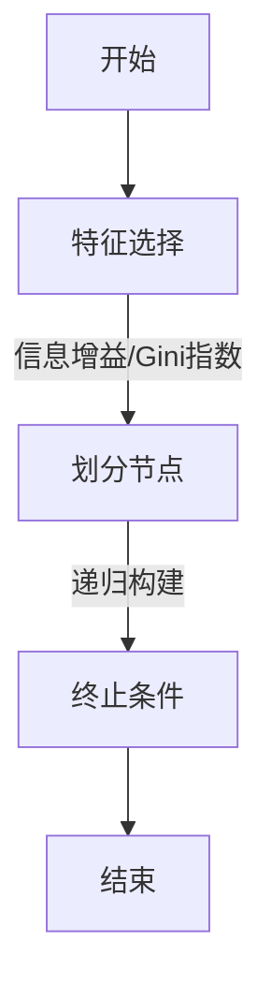
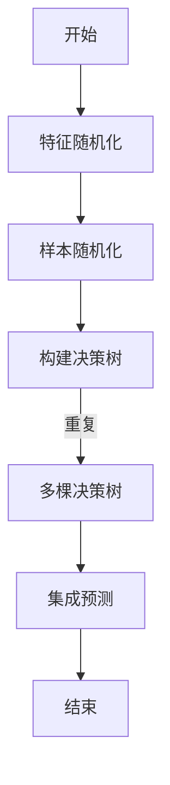
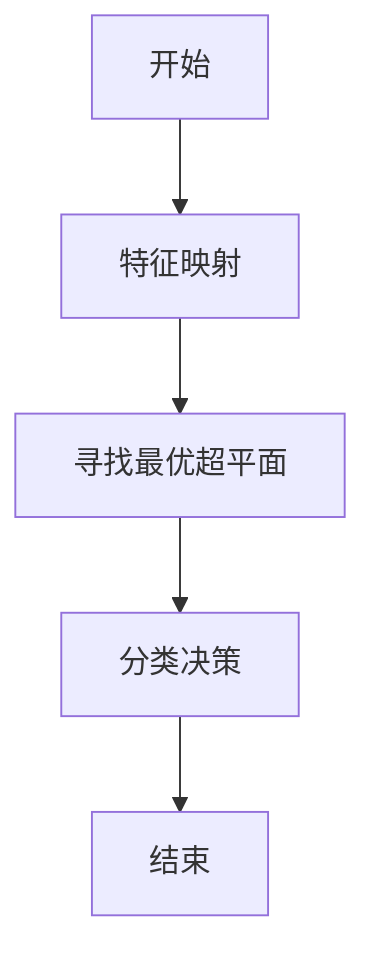
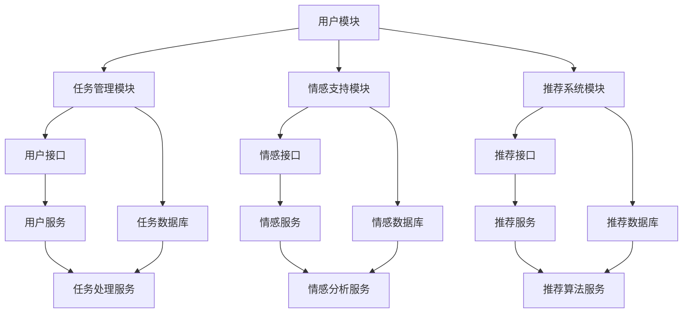

                 

### 让心灵沐浴智慧之光：精神食粮的筛选

在瞬息万变的技术时代，我们每个人都在面对着信息过载的挑战。从社交媒体到在线新闻，我们每天接收到的信息量惊人，但这其中有多少是真正有价值的精神食粮，又有多少是浪费我们时间和精力的无效信息？这就引出了一个问题：如何在纷繁复杂的信息海洋中，筛选出能够滋养我们心灵的智慧选择？

**关键词**：心灵滋养、智慧选择、精神食粮、筛选、信息过载

**摘要**：本文将探讨如何通过智慧选择来筛选出真正能够滋养心灵的精神食粮，并介绍相关的理论、算法和系统架构，帮助读者在信息过载的时代中找到心灵的宁静与智慧的光芒。

### 1.1.1 心灵滋养的重要性

心灵滋养不仅仅是为了缓解压力，它对我们的生活有着深远的影响。心灵滋养可以帮助我们更好地理解自我，增强自我意识，提升心理韧性，从而在面对生活和工作中的挑战时能够更加从容和冷静。以下是几个心灵滋养的重要作用：

1. **提升心理健康**：通过阅读、冥想、艺术创作等活动，可以减轻焦虑、抑郁等心理问题，提高心理健康水平。
2. **增强人际关系**：心灵滋养有助于我们更好地理解和沟通他人，从而建立更深厚的人际关系。
3. **促进个人成长**：通过持续的心灵滋养，我们能够不断反思自我，发现自己的潜能，实现个人成长和自我提升。

### 1.1.2 智慧选择的意义

智慧选择是指在面对多个选择时，能够根据自身需求和目标，选择最合适、最有价值的选项。在信息爆炸的时代，智慧选择显得尤为重要。以下是智慧选择的几个关键点：

1. **提高效率**：智慧选择可以帮助我们快速筛选出有价值的信息，避免浪费时间在无效信息上。
2. **降低风险**：通过智慧选择，我们可以减少错误决策带来的负面影响，降低风险。
3. **实现目标**：智慧选择使我们能够更加明确目标，从而更加高效地实现个人和职业目标。

### 1.1.3 心灵滋养与智慧选择的关系

心灵滋养和智慧选择是相辅相成的。心灵滋养为我们提供了内在的平和和清晰，使我们能够更加理智地做出智慧选择。而智慧选择又帮助我们更好地利用心灵滋养的资源，实现个人目标和社会价值。

### 1.2 当前社会面临的心灵困境

1. **压力与焦虑**：随着生活节奏的加快，工作压力的增大，许多人感到焦虑和压力，无法有效地进行心灵滋养。
2. **情感需求的缺失**：现代社会的快节奏生活导致很多人忽视了情感需求，感到孤独和疏离。
3. **心灵滋养与智慧选择的必要性**：在这样的大环境下，心灵滋养和智慧选择显得尤为必要。它们不仅能够帮助我们应对压力和焦虑，还能够提升我们的生活质量和工作效率。

### 1.3 本章小结

本文首先探讨了心灵滋养的重要性，以及智慧选择在现代社会中的意义。接着，分析了当前社会所面临的心灵困境，并强调了心灵滋养与智慧选择的必要性。接下来，我们将进一步探讨核心概念和理论框架，以及具体的算法和系统架构设计。

## 1.2 当前社会面临的心灵困境

在现代社会，随着工作压力的增大、生活节奏的加快以及社交媒体的普及，人们的心灵面临着前所未有的困境。这些困境不仅影响了我们的心理健康，还阻碍了我们的个人成长和社会进步。

### 1.2.1 压力与焦虑

压力和焦虑是现代生活中最常见的心理问题之一。随着职业竞争的加剧，许多人每天都面临着工作压力，这种压力不仅体现在工作绩效上，还会影响到个人的生活质量和心理健康。长期的压力和焦虑会导致一系列心理问题，如抑郁、失眠、注意力不集中等，严重时甚至可能导致精神崩溃。

#### 压力的来源

压力的来源多种多样，主要包括以下几个方面：

1. **工作压力**：高绩效要求、长时间工作、工作不稳定等都会产生工作压力。
2. **生活压力**：家庭责任、经济压力、人际关系等都可能成为生活的压力源。
3. **社会压力**：社会竞争激烈，许多人为了适应社会环境，不得不不断努力和奋斗，这也增加了心理压力。

#### 焦虑的表现

焦虑通常表现为紧张、担忧、失眠、心悸等症状。长期的焦虑会对身体和心理健康造成负面影响，如：

1. **身体症状**：头痛、胃痛、肌肉紧张等。
2. **心理症状**：情绪低落、自我怀疑、社交障碍等。
3. **认知症状**：注意力不集中、记忆力下降、决策困难等。

### 1.2.2 情感需求的缺失

情感需求是人的基本心理需求之一，包括情感支持、亲密关系和自我表达等方面。然而，在现代社会中，许多人由于生活节奏快、工作压力大等原因，往往忽视了情感需求，导致情感缺失。

#### 情感需求的类型

1. **情感支持**：在困难和挫折面前，人们需要他人的支持和鼓励，以增强心理韧性。
2. **亲密关系**：人与人之间的亲密关系能够提供情感满足和心理支持，是心理健康的重要保障。
3. **自我表达**：人们需要通过艺术、写作、社交等方式来表达自己的情感和想法，以实现心理上的满足。

#### 情感需求的缺失带来的影响

情感需求的缺失会对个人产生以下负面影响：

1. **心理健康问题**：长期的情感缺失会导致焦虑、抑郁等心理问题。
2. **人际关系问题**：缺乏情感支持会导致人际关系疏离，影响社交能力和团队合作。
3. **生活质量下降**：情感需求的缺失会影响个人的生活质量，导致幸福感下降。

### 1.2.3 心灵滋养与智慧选择的必要性

面对上述的心灵困境，心灵滋养和智慧选择显得尤为重要。

#### 心灵滋养的作用

心灵滋养包括一系列能够提升心理健康和幸福感的活动，如冥想、瑜伽、阅读、艺术创作等。通过这些活动，我们可以：

1. **缓解压力和焦虑**：通过冥想和放松技巧，可以减轻身体的紧张和压力，缓解焦虑情绪。
2. **增强心理韧性**：通过持续的内心探索和自我反思，可以增强面对困难时的心理韧性。
3. **提升幸福感**：通过阅读和艺术创作等，可以丰富精神生活，提升生活质量和幸福感。

#### 智慧选择的作用

智慧选择是在信息爆炸的时代中，能够帮助我们筛选出有价值的信息和资源的策略。通过智慧选择，我们可以：

1. **提高效率**：避免在无效信息上浪费时间和精力，专注于真正有意义的事情。
2. **降低风险**：通过分析信息和评估选择，可以减少错误决策带来的风险。
3. **实现目标**：明确目标并选择最合适的路径和资源，可以更高效地实现个人和职业目标。

#### 心灵滋养与智慧选择的结合

心灵滋养和智慧选择是相辅相成的。心灵滋养提供了内心的平和和清晰，使我们能够更加理智地做出智慧选择。而智慧选择又帮助我们更好地利用心灵滋养的资源，实现个人目标和社会价值。

### 1.3 本章小结

通过本文的探讨，我们可以看到，当前社会面临着诸多心灵困境，如压力与焦虑、情感需求的缺失等。这些问题严重影响了我们的心理健康和生活质量。因此，心灵滋养和智慧选择显得尤为重要。接下来，我们将进一步探讨核心概念和理论框架，以及具体的算法和系统架构设计，为解决这些问题提供有益的思路和方法。

## 1.3 本章小结

在本章中，我们首先探讨了心灵滋养的重要性以及智慧选择在现代社会中的意义。接着，分析了当前社会所面临的心灵困境，如压力与焦虑、情感需求的缺失等，并强调了心灵滋养与智慧选择的必要性。这些困境提醒我们，在信息爆炸的时代中，心灵滋养和智慧选择不仅有助于缓解压力和焦虑，还能够提升我们的生活质量和工作效率。

在接下来的章节中，我们将深入探讨核心概念与联系，包括智慧选择与心灵滋养的理论框架、评价指标和方法论。我们将使用逻辑清晰、结构紧凑的专业语言，结合实际的算法和数学模型，为读者提供有深度、有思考、有见解的专业技术博客内容。让我们继续探索，寻找滋养心灵的智慧选择之路。

## 2.1.1 智慧选择的概念

智慧选择是指在面对多个选择时，能够根据自身的需求和目标，通过理性分析和情感体验，选择最合适、最有价值的选项。智慧选择不仅仅是一种决策技巧，更是一种生活方式，它要求我们在信息过载的时代中，能够有效地筛选和处理信息，从而做出最优的决策。

### 2.1.1.1 智慧选择的特点

1. **理性与情感的结合**：智慧选择不仅依赖于理性分析，还需要情感的体验和直觉的参与。通过理性分析，我们可以评估选项的可行性和效果，而通过情感体验，我们可以判断选项是否符合个人的价值观和需求。
2. **系统的分析过程**：智慧选择是一个系统的过程，包括信息收集、选项评估、决策制定和结果反馈等多个环节。每个环节都需要严谨的分析和评估，以确保最终决策的准确性。
3. **持续的学习与优化**：智慧选择不是一次性的活动，而是一个持续的过程。通过不断的实践和反馈，我们可以不断优化决策过程，提高决策的质量。

### 2.1.1.2 智慧选择的应用场景

智慧选择在多个领域都有广泛的应用，包括商业决策、个人生活、教育等领域。

1. **商业决策**：在商业环境中，智慧选择可以帮助企业制定战略规划、市场营销策略和投资决策等。通过分析市场数据、竞争对手情况和潜在风险，企业可以做出更明智的决策。
2. **个人生活**：在个人生活中，智慧选择可以帮助我们做出各种决策，如职业规划、理财投资、健康管理等。通过理性分析和情感体验，我们可以选择最适合自己的生活方式和目标。
3. **教育**：在教育领域，智慧选择可以帮助学生做出学习计划和职业选择。通过分析学习效果、个人兴趣和市场需求，学生可以更科学地规划自己的学习路径。

### 2.1.1.3 智慧选择的评价指标

智慧选择的评价指标包括多个方面，如准确性、效率、满意度和可持续性等。

1. **准确性**：准确性是指决策结果的正确性和有效性。一个优秀的智慧选择应该能够在多数情况下做出正确的决策。
2. **效率**：效率是指决策过程的快速和高效。在信息爆炸的时代，快速做出决策是非常重要的。
3. **满意度**：满意度是指决策结果是否符合个人的需求和期望。一个优秀的智慧选择应该能够满足个人的需求，提高生活质量。
4. **可持续性**：可持续性是指决策结果的长期稳定性和可维护性。一个优秀的智慧选择应该能够在长期内保持其有效性和价值。

### 2.1.1.4 智慧选择与心灵滋养的联系

智慧选择与心灵滋养有着紧密的联系。心灵滋养为智慧选择提供了内在的平和和清晰，使我们能够更加理智地做出决策。而智慧选择又帮助我们更好地利用心灵滋养的资源，实现个人目标和社会价值。

通过本章的探讨，我们初步了解了智慧选择的概念、特点和应用场景，以及其评价指标和与心灵滋养的联系。在接下来的章节中，我们将进一步探讨智慧选择的理论框架、心理学和伦理学的视角，以及具体的评价指标和方法论。

## 2.1.2 心灵滋养的概念

心灵滋养是指通过一系列心理活动和生活方式，提升个人的心理健康和幸福感，增强心理韧性和情感体验。心灵滋养不仅仅是一种心理健康维护手段，更是一种全面的生活哲学，旨在通过自我探索和内在平衡，实现个人成长和自我实现。

### 2.1.2.1 心灵滋养的定义

心灵滋养可以被定义为一系列旨在促进个人心理健康和幸福感的行为和活动。这些行为和活动包括但不限于冥想、瑜伽、阅读、艺术创作、社交互动、自我反思等。心灵滋养的目的是通过提升个人的心理韧性、情感智慧和内在平衡，帮助个体更好地应对生活中的挑战和压力。

### 2.1.2.2 心灵滋养的目标

心灵滋养的目标主要包括以下几个方面：

1. **提升心理健康**：通过心灵滋养，可以减轻焦虑、抑郁等心理问题，提高心理健康水平，增强心理韧性。
2. **增强幸福感**：心灵滋养有助于丰富精神生活，提升个人的幸福感和生活质量。
3. **促进个人成长**：通过持续的内心探索和自我反思，个体可以更好地理解自我，发现自己的潜能，实现个人成长和自我实现。
4. **提升人际关系**：心灵滋养有助于提高个体的情感智慧和沟通能力，从而建立更健康的人际关系。

### 2.1.2.3 心灵滋养的方法

心灵滋养的方法多种多样，以下是一些常见的方法：

1. **冥想**：冥想是一种通过专注呼吸和意识内观，达到心理平静和内在平衡的练习。它有助于减轻压力，提高专注力和情绪管理能力。
2. **瑜伽**：瑜伽结合了体位练习、呼吸控制和冥想，有助于增强身体的灵活性和力量，同时提升心理韧性和情绪稳定性。
3. **阅读**：通过阅读，可以拓宽视野，提升知识水平，丰富情感体验，有助于心灵成长和自我反思。
4. **艺术创作**：艺术创作是一种表达情感和自我发现的方式，通过绘画、音乐、写作等艺术形式，可以释放内心的情感，提升幸福感。
5. **社交互动**：与他人建立积极的社交关系，参与社区活动，可以增强情感支持，提升社交能力和人际关系。
6. **自我反思**：定期进行自我反思，思考自己的行为、决策和价值观，有助于发现内心的困惑和矛盾，从而实现自我成长和提升。

### 2.1.2.4 心灵滋养与智慧选择的关系

心灵滋养与智慧选择密切相关。心灵滋养提供了内心的平和和清晰，使我们能够更加理智地分析和评估选择，从而做出更明智的决策。而智慧选择则帮助我们在心灵滋养的基础上，更好地利用资源和机会，实现个人目标和社会价值。

通过本章的探讨，我们初步了解了心灵滋养的概念、目标和方法，以及其与智慧选择的关系。在接下来的章节中，我们将进一步探讨智慧选择的理论框架、心理学和伦理学的视角，以及具体的评价指标和方法论。

## 2.1.3 智慧选择与心灵滋养的联系

智慧选择和心灵滋养虽然属于不同领域，但它们之间有着紧密的联系和相互影响。在现代社会中，信息爆炸和生活节奏的加快使得人们需要更高的智慧和更强大的心理韧性来应对各种挑战。智慧选择与心灵滋养的结合，不仅能帮助我们做出更明智的决策，还能提升我们的生活质量。

### 2.1.3.1 智慧选择对心灵滋养的促进作用

1. **决策的理性与情感平衡**：智慧选择强调理性分析与情感体验的结合，有助于我们做出全面、合理的决策。这种理性与情感的平衡可以减少决策中的冲动和情绪波动，提升个人的心理韧性。
2. **提升生活质量**：通过智慧选择，我们可以更高效地利用时间和资源，从而减少压力和焦虑，提升生活质量。这种心理状态的改善有助于提升个人的幸福感，实现心灵滋养。
3. **增强目标实现能力**：智慧选择使我们能够更明确地设定和实现个人目标，这种目标导向的行为有助于增强内心的动力和信心，进一步促进心灵滋养。

### 2.1.3.2 心灵滋养对智慧选择的支撑作用

1. **心理韧性的提升**：心灵滋养通过冥想、瑜伽、自我反思等方式，增强了个体的心理韧性，使我们能够更加冷静和理智地面对复杂情况，做出更好的决策。
2. **情感智慧的积累**：心灵滋养过程中，个体通过社交互动、艺术创作等方式积累了丰富的情感经验，这有助于提升我们的情感智慧，使我们在决策时能够更好地理解和应对他人的情感需求。
3. **内在平衡的实现**：心灵滋养通过提升内心的平和与清晰，帮助我们保持内在的平衡和专注，从而在决策过程中能够更加聚焦和理性。

### 2.1.3.3 智慧选择与心灵滋养的协同效应

智慧选择和心灵滋养的结合，可以产生协同效应，使个人在决策和生活中达到更好的效果。具体表现如下：

1. **决策效率提升**：通过智慧选择，我们可以快速筛选出有价值的信息，避免信息过载。同时，心灵滋养提供的平和心态，使我们能够更加冷静地分析和处理信息，从而提高决策效率。
2. **决策质量提升**：心灵滋养提供的情感智慧和内在平衡，使我们在决策时能够更加全面、客观地评估各种选择，减少决策失误。
3. **生活质量提升**：智慧选择和心灵滋养的结合，有助于我们在生活中做出更明智的选择，从而提升生活质量，实现个人目标。

### 2.1.3.4 实践中的结合

在实际生活中，我们可以通过以下几种方式将智慧选择和心灵滋养结合起来：

1. **定期反思**：通过定期反思，我们可以更好地理解自己的需求和目标，从而做出更明智的决策。同时，反思过程也是一种心灵滋养，有助于提升我们的心理韧性。
2. **实践冥想**：冥想不仅能够提升我们的心理韧性，还能帮助我们保持内心的平和。在决策过程中，通过冥想来平静情绪，可以让我们更加理智地分析问题。
3. **培养情感智慧**：通过阅读、艺术创作和社交互动，我们可以积累情感智慧，使我们在决策时能够更好地理解和应对他人的情感需求。
4. **制定明确目标**：通过设定明确的目标和计划，我们可以更好地利用时间和资源，实现个人目标。这种目标导向的行为不仅有助于提升智慧选择的能力，也是一种有效的心灵滋养。

通过本章的探讨，我们深入了解了智慧选择与心灵滋养的密切联系和相互影响。在接下来的章节中，我们将进一步探讨智慧选择的理论框架、心理学和伦理学的视角，以及具体的评价指标和方法论。

### 2.2 智慧选择的理论框架

智慧选择是一个复杂的决策过程，涉及多个理论框架和方法。以下是几个主要的理论框架，包括选择论、心理学和伦理学的视角。

#### 2.2.1 选择论的基本原理

选择论是研究个体在多个选择中如何做出决策的理论。其基本原理包括以下几个核心要素：

1. **效用函数**：效用函数是指个体对各个选择的偏好程度。通过比较各个选择的效用值，个体可以确定最优选择。
   $$ U(x) = \sum_{i=1}^{n} u_i \cdot p_i $$
   其中，$U(x)$是总效用，$u_i$是第$i$个选择的效用值，$p_i$是选择$i$的概率。

2. **决策规则**：决策规则是指个体在多个选择中如何做出决策的方法。常见的决策规则包括最大化效用、最小化损失、期望效用最大化等。
   $$ \text{Maximize} U(x) $$
   $$ \text{Minimize} L(x) $$
   $$ \text{Maximize} E[U(x)] $$

3. **风险评估**：风险评估是指对各个选择可能带来的风险进行评估。通过风险评估，个体可以更好地理解选择的风险和收益，从而做出更明智的决策。

4. **多目标优化**：在多目标优化问题中，个体需要在多个目标之间进行权衡。常用的多目标优化方法包括Pareto优化、目标规划等。
   $$ \text{Minimize} f(x) $$
   $$ \text{subject to} g(x) \leq 0 $$

#### 2.2.2 心理学与伦理学的视角

1. **心理学视角**：
   - **认知偏差**：心理学研究表明，个体在决策过程中容易受到认知偏差的影响，如确认偏误、锚定效应等。理解这些认知偏差有助于我们更好地进行决策。
   - **情感作用**：情感在决策中起着重要作用。通过理解情感的作用，我们可以更好地平衡理性与情感，做出更明智的选择。
   - **行为经济学**：行为经济学研究个体在决策中的非理性行为。通过这些研究，我们可以更好地理解人类行为，从而优化决策过程。

2. **伦理学视角**：
   - **道德原则**：伦理学提供了一系列道德原则，如功利主义、康德伦理学等。这些原则可以帮助我们评估选择的道德价值，从而做出符合伦理标准的决策。
   - **责任与义务**：伦理学强调个体在决策中的责任和义务。通过理解这些责任和义务，我们可以更好地评估选择的后果，并做出更负责任的决策。

#### 2.2.3 智慧选择的评价指标

智慧选择的评价指标主要包括以下几个方面：

1. **准确性**：准确性是指决策结果与预期目标的一致性。一个优秀的智慧选择应该能够在多数情况下做出正确的决策。
2. **效率**：效率是指决策过程的快速和高效。在信息爆炸的时代，快速做出决策是非常重要的。
3. **满意度**：满意度是指决策结果是否符合个人的需求和期望。一个优秀的智慧选择应该能够满足个人的需求，提高生活质量。
4. **可持续性**：可持续性是指决策结果的长期稳定性和可维护性。一个优秀的智慧选择应该能够在长期内保持其有效性和价值。

#### 2.2.4 智慧选择与心灵滋养的结合

智慧选择与心灵滋养的结合，可以通过以下几个方面实现：

1. **心理韧性的提升**：通过心灵滋养，如冥想、瑜伽等，可以增强个体的心理韧性，使我们在决策过程中能够更加冷静和理智地分析问题。
2. **情感智慧的积累**：通过心灵滋养，如阅读、艺术创作等，可以积累情感智慧，使我们在决策时能够更好地理解和应对他人的情感需求。
3. **内在平衡的实现**：通过心灵滋养，如社交互动、自我反思等，可以提升内心的平和与清晰，使我们在决策过程中能够保持专注和理性。
4. **目标导向的行为**：通过设定明确的目标和计划，我们可以更好地利用时间和资源，实现个人目标。这种目标导向的行为不仅有助于提升智慧选择的能力，也是一种有效的心灵滋养。

通过本章的探讨，我们深入了解了智慧选择的理论框架，包括选择论的基本原理、心理学与伦理学的视角，以及智慧选择的评价指标和方法论。在接下来的章节中，我们将进一步探讨心灵滋养的方法论，以及如何结合智慧选择和心灵滋养来提升生活质量。

### 2.3 心灵滋养的方法论

心灵滋养是一个多层次、多维度的过程，涉及认知、情感、行为等多个方面。为了实现有效的心灵滋养，我们需要系统地运用各种方法和工具。以下是几种常见的心灵滋养方法，以及它们的具体步骤和应用。

#### 2.3.1 精神食粮的种类

1. **阅读**：阅读是一种重要的心灵滋养方式，通过阅读书籍、文章和博客，我们可以获取知识、提升思维、丰富情感体验。推荐的书籍包括哲学著作、心理学书籍、经典文学作品等。

2. **冥想**：冥想是一种通过专注和内观达到心理平静和内在平衡的练习。常见的冥想形式包括坐禅、呼吸冥想、动态冥想等。

3. **瑜伽**：瑜伽结合了体位练习、呼吸控制和冥想，有助于增强身体的灵活性和力量，同时提升心理韧性和情绪稳定性。瑜伽练习可以通过线上课程、线下瑜伽班等方式进行。

4. **艺术创作**：艺术创作是一种表达情感和自我发现的方式，通过绘画、音乐、写作等艺术形式，可以释放内心的情感，提升幸福感。

5. **社交互动**：与他人建立积极的社交关系，参与社区活动，可以增强情感支持，提升社交能力和人际关系。

6. **自我反思**：定期进行自我反思，思考自己的行为、决策和价值观，有助于发现内心的困惑和矛盾，从而实现自我成长和提升。

#### 2.3.2 心灵滋养的具体方法

1. **制定阅读计划**：为了确保阅读的有效性，我们可以制定一个合理的阅读计划，包括选择适合自己的书籍、设定阅读时间和目标等。

2. **定期冥想**：我们可以每天或每周安排一定时间进行冥想，通过冥想应用程序或专业的冥想指导，提高冥想的效果。

3. **参加瑜伽课程**：通过参加瑜伽课程，我们可以系统学习瑜伽体位、呼吸控制和技术，从而提升身心状态。

4. **创作艺术作品**：我们可以选择自己感兴趣的艺术形式，如绘画、音乐或写作，定期创作作品，表达自己的情感和想法。

5. **参与社交活动**：积极参与社交活动，如社区志愿者工作、兴趣小组活动等，与他人建立深层次的关系，增强情感支持。

6. **进行自我反思**：每周或每月安排时间进行自我反思，通过写日记、记录思考等方式，回顾自己的行为和决策，分析优点和不足，从而不断优化自己的行为模式。

#### 2.3.3 智慧选择与心灵滋养的结合

1. **设定明确目标**：在心灵滋养的过程中，我们需要设定明确的目标，如提高阅读能力、培养冥想习惯、提升艺术创作技巧等。明确的目标有助于我们集中精力，提高效率。

2. **选择合适的方法**：根据个人的需求和兴趣，选择最适合自己的心灵滋养方法。例如，有些人可能更喜欢阅读，而有些人可能更喜欢瑜伽或冥想。

3. **平衡理性与情感**：在心灵滋养的过程中，我们需要平衡理性分析与情感体验。通过理性分析，我们可以评估各种选择的有效性，而通过情感体验，我们可以更好地理解自己的需求和感受。

4. **持续反思与优化**：通过持续的反思和优化，我们可以不断调整和改进心灵滋养的方法和策略，从而实现更好的效果。

通过本章的探讨，我们系统地了解了心灵滋养的方法论，包括精神食粮的种类、具体方法以及如何与智慧选择相结合。在接下来的章节中，我们将进一步探讨算法原理、数学模型和系统架构设计，为心灵滋养与智慧选择的实际应用提供理论支持和技术方案。

### 2.4 本章小结

在本章中，我们系统地探讨了智慧选择与心灵滋养的核心概念和理论框架。首先，我们详细介绍了智慧选择的概念、特点和应用场景，包括其评价指标和方法论。然后，我们深入分析了心灵滋养的概念、目标和方法，以及与智慧选择的密切联系。最后，我们提出了心灵滋养的具体方法，并探讨了如何将智慧选择与心灵滋养相结合，以实现更有效的决策和生活质量提升。

通过本章的探讨，我们不仅对智慧选择和心灵滋养有了更深入的理解，也为后续章节中的算法原理讲解、数学模型和系统架构设计奠定了基础。在接下来的章节中，我们将进一步探讨这些理论在实际应用中的具体实现，为读者提供有价值的实践指导。

## 3.1 智慧选择的算法基础

在智慧选择中，算法扮演着至关重要的角色。不同的算法适用于不同的决策场景，具有各自独特的优势和局限性。以下是几种常见的算法，包括决策树算法、随机森林算法和支持向量机算法。

### 3.1.1 决策树算法

决策树算法是一种基于树形结构进行决策的算法。它通过一系列的判断条件，将数据集逐步划分为不同的子集，直到满足终止条件（如节点中的数据全部相同或达到预设的深度）。

#### 决策树算法的工作原理

1. **特征选择**：首先选择一个最优的特征进行分割，通常使用信息增益（Information Gain）或基尼指数（Gini Index）等指标来评估特征的重要性。
2. **划分节点**：使用选定的特征对数据集进行划分，将数据分为不同的子集。
3. **递归构建**：对每个子集继续进行划分，直到满足终止条件。

#### 决策树算法的优势与局限性

1. **优势**：
   - **直观性**：决策树的结构简单直观，易于理解和解释。
   - **可操作性**：决策树的构建过程易于实现，且可以方便地调整和优化。
   - **适用范围广**：决策树适用于分类和回归问题，可以处理高维数据。

2. **局限性**：
   - **过拟合**：决策树容易过拟合，尤其是在特征较多、样本量较小的情况下。
   - **可解释性降低**：随着树深度的增加，决策树的复杂度会增加，导致可解释性降低。

#### 决策树算法的Mermaid流程图



### 3.1.2 随机森林算法

随机森林算法是一种集成学习方法，通过构建多棵决策树，并结合它们的预测结果来提高决策的准确性和稳定性。

#### 随机森林算法的工作原理

1. **特征随机化**：每次随机选择一部分特征进行特征选择。
2. **样本随机化**：每次随机选择一部分样本进行训练。
3. **构建多棵决策树**：使用随机化特征和样本训练多棵决策树。
4. **集成预测**：将多棵决策树的预测结果进行投票或取平均值，得到最终的预测结果。

#### 随机森林算法的优势与局限性

1. **优势**：
   - **泛化能力强**：通过集成多棵决策树，随机森林能够提高模型的泛化能力，减少过拟合。
   - **鲁棒性强**：随机森林对异常值和噪声数据具有较强的鲁棒性。
   - **处理高维数据**：随机森林能够有效地处理高维数据，减少特征之间的相关性。

2. **局限性**：
   - **计算复杂度高**：随机森林需要训练多棵决策树，因此计算复杂度较高。
   - **可解释性降低**：随着决策树数量的增加，随机森林的整体可解释性会降低。

#### 随机森林算法的Mermaid流程图



### 3.1.3 支持向量机算法

支持向量机（SVM）算法是一种基于最大间隔分类器的模型，旨在找到最优的超平面，将不同类别的数据点进行有效分离。

#### 支持向量机算法的工作原理

1. **特征映射**：将原始数据通过非线性映射转换到高维空间，使原本线性不可分的数据变得线性可分。
2. **寻找最优超平面**：通过求解优化问题，找到能够最大化分类间隔的最优超平面。
3. **分类决策**：对于新的数据点，将其映射到高维空间，并判断其位于哪个类别的超平面一侧。

#### 支持向量机算法的优势与局限性

1. **优势**：
   - **高效性**：SVM在处理高维数据时表现优异，特别是在特征数目远大于样本数目的情况下。
   - **泛化能力强**：SVM能够处理非线性分类问题，通过核函数实现数据映射，提高了模型的泛化能力。
   - **解释性较强**：与神经网络等模型相比，SVM的决策边界和超平面较为直观，便于理解和解释。

2. **局限性**：
   - **计算复杂度**：SVM的优化问题通常是一个二次规划问题，计算复杂度较高。
   - **对异常值敏感**：对异常值和噪声数据较为敏感，可能导致模型性能下降。

#### 支持向量机算法的Mermaid流程图



通过本章的探讨，我们详细介绍了决策树算法、随机森林算法和支持向量机算法的原理和特点。在接下来的章节中，我们将进一步探讨心灵滋养的算法应用，以及如何结合智慧选择和心灵滋养来提升生活质量。

### 3.2 心灵滋养的算法应用

在心灵滋养的领域，算法的应用同样具有重要意义。通过使用心理学和伦理学中的算法，我们可以更科学、更有效地进行心灵滋养。以下是几种常见的心理学和伦理学算法，以及它们在心灵滋养中的应用。

#### 3.2.1 心理学算法

1. **情感分析算法**：情感分析算法是一种通过自然语言处理技术，分析文本中情感倾向的算法。它可以帮助我们了解用户的情感状态，从而制定个性化的心灵滋养方案。

   - **工作原理**：情感分析算法通常使用机器学习模型，如朴素贝叶斯、支持向量机和深度学习模型，来对文本进行情感分类。常见的情感分类包括正面情感、负面情感和中性情感。
   - **应用场景**：通过情感分析算法，我们可以分析用户的社交动态、博客内容或反馈，了解用户的情感状态。这有助于我们制定更有针对性的心灵滋养方案，如推荐阅读材料、冥想练习等。

2. **心理健康评估算法**：心理健康评估算法通过分析用户的行为数据，如睡眠模式、情绪状态、社交互动等，来评估用户的心理健康水平。

   - **工作原理**：心理健康评估算法通常基于大数据分析和机器学习模型，如聚类分析、回归分析和决策树等。通过分析用户的多维度数据，算法可以识别出心理健康问题的潜在指标。
   - **应用场景**：通过心理健康评估算法，我们可以定期监测用户的心理健康状态，及时发现心理问题，提供个性化的心理健康建议和干预措施。

3. **心理干预算法**：心理干预算法是通过算法来提供心理干预服务，如在线心理辅导、情绪管理训练等。

   - **工作原理**：心理干预算法通常结合自然语言处理、机器学习和心理学理论，如认知行为疗法（CBT）。通过文本交互或虚拟现实技术，算法可以引导用户进行情绪调节和认知重构。
   - **应用场景**：通过心理干预算法，我们可以为用户提供实时的心理支持，帮助他们应对压力和焦虑，提高心理韧性。

#### 3.2.2 伦理学算法

1. **道德决策算法**：道德决策算法是一种通过伦理学原理来辅助决策的算法。它可以帮助我们在面对道德困境时做出更合理的决策。

   - **工作原理**：道德决策算法通常基于伦理学理论，如功利主义、康德伦理学和德性伦理学。通过分析不同的道德原则和价值观，算法可以评估各种选择的道德价值。
   - **应用场景**：通过道德决策算法，我们可以为医疗、法律和商业等领域的决策提供伦理学指导。例如，在医疗领域，算法可以帮助医生在道德冲突中做出最优选择。

2. **伦理风险评估算法**：伦理风险评估算法通过分析决策的潜在风险和伦理影响，来评估决策的伦理合理性。

   - **工作原理**：伦理风险评估算法通常结合道德哲学和风险管理理论，通过定量和定性分析方法，评估决策的伦理风险。
   - **应用场景**：通过伦理风险评估算法，我们可以识别和缓解决策中的伦理风险，确保决策的伦理合理性和社会责任感。例如，在商业领域，算法可以帮助公司评估新产品或服务的伦理影响。

3. **伦理教育算法**：伦理教育算法通过算法来提供伦理教育服务，帮助用户提高伦理意识和道德素养。

   - **工作原理**：伦理教育算法通常结合道德哲学、教育技术和机器学习模型，通过互动式教学和个性化推荐，帮助用户学习伦理知识和价值观。
   - **应用场景**：通过伦理教育算法，我们可以为学校、企业和社区提供个性化的伦理教育服务，促进社会道德进步和伦理文明建设。

#### 3.2.3 结合算法案例分析

为了更好地理解心理学和伦理学算法在心灵滋养中的应用，我们可以通过一个案例来进行分析。

**案例**：一款面向焦虑人群的心理健康应用

1. **情感分析**：应用通过用户发布的文本内容，如日记、博客或社交媒体动态，使用情感分析算法分析用户的情感状态。如果发现用户表现出高焦虑状态，应用会提醒用户进行情绪管理。

2. **心理健康评估**：应用定期收集用户的行为数据，如睡眠质量、活动水平和情绪状态，使用心理健康评估算法评估用户的心理健康水平。如果评估结果显示用户心理健康状况不佳，应用会提供个性化的心理健康建议。

3. **心理干预**：应用通过虚拟现实技术为用户提供情绪调节训练，如放松训练和认知重构训练。这些训练基于心理干预算法，帮助用户学习如何管理焦虑情绪。

4. **道德决策**：当用户面临道德困境时，应用会使用道德决策算法提供伦理指导，帮助用户做出更合理的道德选择。

5. **伦理教育**：应用通过互动式教学和个性化推荐，为用户提供伦理教育内容，提高用户的伦理意识和道德素养。

通过这个案例，我们可以看到心理学和伦理学算法如何结合应用于心理健康应用中，为用户提供全面的心灵滋养服务。这不仅有助于提升用户的心理健康水平，还能够促进社会道德进步和文明建设。

在接下来的章节中，我们将进一步探讨智慧选择和心灵滋养的数学模型，以及如何结合算法和数学模型来设计系统架构。

### 3.3 本章小结

在本章中，我们详细探讨了智慧选择的算法基础，包括决策树算法、随机森林算法和支持向量机算法。这些算法在智慧选择中发挥着重要作用，通过理性分析和模型构建，帮助我们做出更明智的决策。接着，我们介绍了心理学和伦理学中的算法应用，如情感分析、心理健康评估、心理干预和伦理决策，展示了这些算法如何为心灵滋养提供科学支持。通过案例分析，我们进一步了解了这些算法在现实应用中的具体实现和效果。

在接下来的章节中，我们将深入探讨智慧选择和心灵滋养的数学模型，为系统架构设计提供理论基础。我们将详细讲解效用函数、风险评估模型和多目标优化模型，结合具体的数学公式和实例，帮助读者更好地理解和应用这些模型。让我们继续前进，探索更多关于智慧选择和心灵滋养的深入知识和实际应用。

### 4.1 智慧选择的核心公式

在智慧选择的过程中，理解并应用核心公式对于做出最优决策至关重要。以下是几个关键的公式，包括效用函数、风险评估模型和多目标优化模型。

#### 4.1.1 效用函数

效用函数是评估选择价值的重要工具，它衡量了各个选项的相对价值。以下是一个简单的效用函数公式：

$$ U(x) = \sum_{i=1}^{n} u_i \cdot p_i $$

其中，$U(x)$表示总效用，$u_i$表示第$i$个选择的效用值，$p_i$表示选择$i$的概率。效用函数通过加权每个选择的效用值，给出一个综合评价。

#### 4.1.2 风险评估模型

风险评估模型用于评估各个选择的风险水平。以下是一个基本的风险评估模型公式：

$$ R(x) = \sum_{i=1}^{n} r_i \cdot p_i $$

其中，$R(x)$表示总风险，$r_i$表示第$i$个选择的负面后果的权重，$p_i$表示选择$i$的概率。这个公式通过计算每个选择的负面后果的加权总和，给出了选择的风险评估。

#### 4.1.3 多目标优化模型

多目标优化模型用于在多个目标之间进行权衡和优化。以下是一个多目标优化的线性规划模型：

$$ \text{Minimize} Z = \sum_{i=1}^{m} c_i \cdot x_i $$
$$ \text{subject to} \sum_{j=1}^{n} a_{ij} \cdot x_j \geq b_j $$

其中，$Z$是目标函数，$c_i$是第$i$个目标的系数，$x_i$是第$i$个变量的值，$a_{ij}$是第$i$个目标与第$j$个变量之间的系数，$b_j$是第$j$个约束的右侧常数。这个模型通过最小化目标函数的同时满足约束条件，实现了多目标优化。

#### 4.1.4 效用函数与风险评估模型的结合

在实际决策中，我们经常需要同时考虑效用和风险。一个综合评估模型可以结合效用函数和风险评估模型，如下：

$$ V(x) = U(x) - \lambda \cdot R(x) $$

其中，$V(x)$是综合评估值，$\lambda$是一个权重参数，用于平衡效用和风险。这个公式通过减去风险评估的加权值，从效用中扣除风险的影响，给出了一个更全面的评估。

#### 4.1.5 多目标优化的具体例子

假设我们需要在两个目标之间进行优化：最大化利润和最小化成本。以下是一个简化的多目标优化模型：

$$ \text{Maximize} P = 5 \cdot x + 3 \cdot y $$
$$ \text{subject to} \begin{cases} 
2 \cdot x + 3 \cdot y \geq 20 \\
x + 2 \cdot y \geq 10 \\
x, y \geq 0 
\end{cases} $$

在这个例子中，$P$是利润，$x$和$y$是决策变量。通过求解这个模型，我们可以找到最优的$x$和$y$值，使得利润最大化。

通过上述核心公式，我们能够系统地评估和优化选择。接下来，我们将进一步探讨心灵滋养的数学模型，为智慧选择提供更深入的量化支持。

### 4.2 心灵滋养的数学模型

在心灵滋养的领域，数学模型的应用同样具有重要意义。通过构建和运用数学模型，我们可以量化心灵滋养的过程和效果，从而提供更科学和精确的支持。以下是几种常用的数学模型，包括情感计算模型、心理健康评估模型和融合模型。

#### 4.2.1 情感计算模型

情感计算模型是一种基于计算技术来模拟和评估人类情感状态的模型。它通过分析文本、语音和面部表情等数据，量化情感表达，从而帮助理解用户的心理状态。

1. **工作原理**：
   - **文本情感分析**：通过自然语言处理技术，使用情感词典和机器学习模型（如朴素贝叶斯、支持向量机等）来分析文本的情感倾向。常用的情感词典包括AFIN-NET、LIWC等。
   - **语音情感识别**：通过分析语音的频率、音调、节奏等特征，使用机器学习算法（如隐马尔可夫模型、深度学习等）来识别情感状态。
   - **面部表情分析**：通过计算机视觉技术，使用卷积神经网络（CNN）等深度学习模型，分析面部表情特征，识别情感状态。

2. **模型公式**：
   - **文本情感分析**：
     $$ \text{Sentiment Score} = \sum_{i=1}^{n} w_i \cdot s_i $$
     其中，$w_i$是情感词的权重，$s_i$是情感词的得分。
   - **语音情感识别**：
     $$ \text{Emotion Probability} = \text{softmax}(\text{Feature Vector} \cdot W) $$
     其中，$\text{Feature Vector}$是语音特征的向量表示，$W$是权重矩阵，$\text{softmax}$函数用于归一化概率分布。

3. **应用场景**：
   - **心理健康监测**：通过情感计算模型，实时监测用户的情感状态，及时发现情绪波动，提供及时的干预和关怀。
   - **用户行为分析**：分析用户在社交媒体、博客等平台上的情感表达，了解用户需求和偏好，优化产品和服务。

#### 4.2.2 心理健康评估模型

心理健康评估模型用于量化评估个体的心理健康状态，通过分析行为数据、生理数据和社交互动等，提供个性化的心理健康评估和干预建议。

1. **工作原理**：
   - **行为数据分析**：通过分析用户的行为数据，如活动记录、睡眠模式、情绪日记等，使用统计分析和机器学习模型（如聚类分析、回归分析等）来评估心理健康水平。
   - **生理数据监测**：通过可穿戴设备监测用户的生理数据，如心率、血压、睡眠质量等，使用生理信号处理技术和机器学习模型来分析生理数据的异常情况。
   - **社交互动分析**：通过分析用户的社交互动，如社交媒体活动、电话通信记录等，使用社会网络分析和情感计算模型来评估社交支持和社会支持度。

2. **模型公式**：
   - **行为数据分析**：
     $$ \text{Health Score} = f(\text{Behavior Data}) $$
     其中，$f$是一个复合函数，用于结合多个行为指标，生成综合健康评分。
   - **生理数据监测**：
     $$ \text{Physiological State} = \text{signal\_processing}(\text{Physiological Data}) $$
     其中，$\text{signal\_processing}$是生理信号处理函数，用于分析生理数据。
   - **社交互动分析**：
     $$ \text{Social Support} = \text{SNM}(\text{Social Interaction Data}) $$
     其中，$\text{SNM}$是社会网络模型，用于分析社交互动的强度和频率。

3. **应用场景**：
   - **个性化健康评估**：通过心理健康评估模型，为用户提供个性化的心理健康评估和干预建议，帮助用户更好地管理心理健康。
   - **心理健康干预**：通过分析评估结果，制定个性化的心理健康干预计划，如心理辅导、情绪调节训练等。

#### 4.2.3 智慧选择与心灵滋养的融合模型

智慧选择与心灵滋养的融合模型旨在结合两者的优势，提供更加全面和科学的决策支持。通过整合效用函数、风险评估模型和心理健康评估模型，我们可以实现更高效的决策和心灵滋养。

1. **工作原理**：
   - **效用与风险平衡**：通过效用函数和风险评估模型，综合评估决策的收益和风险，实现效用与风险的平衡。
   - **心理健康影响评估**：通过心理健康评估模型，评估决策对心理健康的影响，确保决策符合心理健康目标。
   - **多目标优化**：通过多目标优化模型，在多个目标（如效用、风险、心理健康）之间进行权衡，找到最优决策。

2. **模型公式**：
   $$ V(x) = U(x) - \lambda \cdot R(x) - \mu \cdot H(x) $$
   其中，$V(x)$是综合评估值，$U(x)$是效用函数，$R(x)$是风险评估值，$H(x)$是心理健康影响值，$\lambda$和$\mu$是权重参数，用于平衡效用、风险和心理健康影响。

3. **应用场景**：
   - **个性化决策支持**：通过融合模型，为用户提供个性化的决策支持，帮助用户在生活、工作和学习中做出最优选择。
   - **心理健康干预**：通过融合模型，为用户提供心理健康干预建议，帮助用户在决策过程中更好地平衡心理健康与目标实现。

通过本章的探讨，我们详细介绍了情感计算模型、心理健康评估模型和融合模型，为智慧选择和心灵滋养提供了数学模型的支持。这些模型不仅帮助我们量化心灵滋养的过程和效果，还为实际应用提供了科学依据和工具。在接下来的章节中，我们将进一步探讨系统架构设计，为实现这些模型提供技术方案。

### 4.3 本章小结

在本章中，我们系统地探讨了智慧选择和心灵滋养的数学模型，包括效用函数、风险评估模型和多目标优化模型，以及情感计算模型、心理健康评估模型和融合模型。这些数学模型为我们在智慧选择和心灵滋养过程中提供了量化的方法和工具，使我们能够更加科学、精确地评估和优化决策。

通过效用函数，我们可以综合评估多个选择的效用值；通过风险评估模型，我们可以量化各个选择的风险水平；通过多目标优化模型，我们可以在多个目标之间进行权衡，找到最优的决策。情感计算模型和心理健康评估模型则帮助我们理解用户的心理状态和心理健康水平，从而提供个性化的干预和支持。

在接下来的章节中，我们将进一步探讨系统架构设计，结合这些数学模型，为实现智慧选择和心灵滋养提供完整的解决方案。让我们继续前进，探索更多关于智慧选择和心灵滋养的深入知识和实际应用。

### 5.1 问题场景介绍

为了更好地展示智慧选择和心灵滋养在现实中的应用，我们将介绍两个具体的问题场景：**压力管理与智慧选择**和**情感缺失与心灵滋养**。

#### 5.1.1 压力管理与智慧选择

在现代社会中，工作压力是许多人面临的常见问题。高工作强度、绩效压力和不确定的未来往往导致个体感到焦虑和紧张。这不仅影响个人的心理健康，还会影响到工作效率和生活质量。

**问题描述**：

小王是一名IT公司的项目经理，他每天都需要处理大量的工作任务和紧急情况。由于工作压力巨大，他经常感到焦虑和失眠，这导致他的工作效率下降，工作质量也受到影响。为了帮助小王更好地管理压力，我们需要设计一套系统，通过智慧选择来优化他的工作和生活方式。

**目标**：

通过智慧选择系统，我们的目标是帮助小王：

1. **减轻工作压力**：通过分析工作任务和优先级，合理安排工作时间和任务分配，减少不必要的压力。
2. **提高工作效率**：通过智能化的任务管理和优先级排序，帮助小王更高效地完成任务，减少时间和精力浪费。
3. **改善生活质量**：通过推荐适合的小王的心理健康活动和生活方式，帮助他减轻压力，提升生活质量。

#### 5.1.2 情感缺失与心灵滋养

随着社会的发展，快节奏的生活和工作模式导致许多人忽视了情感需求，感到情感缺失。情感缺失不仅会影响个人的心理健康，还会影响人际关系和社会融入。

**问题描述**：

小李是一名年轻的职场新人，他在工作中表现出色，但常常感到孤独和疏离。他的朋友和家人较少，很少参与社交活动，这导致他的情感需求得不到满足。为了帮助小李改善情感缺失的问题，我们需要设计一套心灵滋养系统，通过智慧选择来满足他的情感需求。

**目标**：

通过心灵滋养系统，我们的目标是帮助小李：

1. **增强情感支持**：通过推荐社交活动和情感交流机会，帮助小李建立和维持积极的社交关系，增强情感支持。
2. **提升情感智慧**：通过提供情感教育和互动活动，提升小李的情感智慧，帮助他更好地理解和处理情感问题。
3. **满足情感需求**：通过个性化推荐，帮助小李找到适合他的情感滋养方式，如艺术创作、心理辅导等，满足他的情感需求。

通过这两个问题场景的介绍，我们可以看到智慧选择和心灵滋养在实际应用中的重要性和价值。在接下来的章节中，我们将进一步介绍项目目标、系统架构设计和功能设计，为这些问题的解决提供技术方案。

### 5.2 项目介绍

为了解决上述两个问题场景，我们设计了一个名为“智慧选择与心灵滋养系统”的项目。该项目旨在通过智慧选择和心灵滋养的理论和实践，帮助用户更好地管理压力和情感需求，提升心理健康和生活质量。

#### 5.2.1 项目目标

“智慧选择与心灵滋养系统”的主要目标包括：

1. **减轻工作压力**：通过智能化的任务管理和优先级排序，帮助用户合理安排工作时间和任务分配，减少不必要的压力。
2. **提高工作效率**：通过推荐适合的工作习惯和生活方式，帮助用户更高效地完成任务，减少时间和精力浪费。
3. **增强情感支持**：通过推荐社交活动和情感交流机会，帮助用户建立和维持积极的社交关系，增强情感支持。
4. **提升情感智慧**：通过提供情感教育和互动活动，提升用户对情感的理解和处理能力。
5. **满足情感需求**：通过个性化推荐，帮助用户找到适合他们的情感滋养方式，如艺术创作、心理辅导等，满足情感需求。

#### 5.2.2 项目架构

项目的整体架构分为四个主要模块：用户模块、任务管理模块、情感支持模块和推荐系统模块。

1. **用户模块**：用户模块负责用户身份验证和用户资料管理。用户可以通过注册、登录和绑定社交媒体账号等方式，进入系统并获得个性化的服务。
2. **任务管理模块**：任务管理模块负责任务收集、任务优先级排序和任务分配。系统会根据用户的任务描述、工作习惯和压力水平，自动推荐最合适的任务处理方式。
3. **情感支持模块**：情感支持模块负责推荐社交活动和情感交流机会，包括在线社交平台、线下活动推荐等。该模块还提供情感评估工具，帮助用户了解自己的情感状态。
4. **推荐系统模块**：推荐系统模块负责根据用户的任务情况和情感需求，推荐适合的工作习惯、生活方式和情感滋养方式。推荐算法基于机器学习和数据挖掘技术，确保推荐结果的高效性和个性化。

#### 5.2.3 系统功能设计

系统的功能设计包括以下几个核心功能：

1. **用户管理**：用户可以注册、登录、修改个人资料，查看和修改偏好设置。
2. **任务管理**：用户可以添加、删除和修改任务，系统会自动根据任务描述和工作习惯进行优先级排序和分配。
3. **情感评估**：用户可以通过在线问卷或情绪日记等方式，评估自己的情感状态，系统会根据评估结果提供情感支持和建议。
4. **社交推荐**：系统会根据用户的社会网络和兴趣偏好，推荐适合的社交活动和情感交流机会。
5. **个性化推荐**：系统会根据用户的任务情况和情感需求，推荐适合的工作习惯、生活方式和情感滋养方式。
6. **反馈与支持**：用户可以通过反馈功能，对系统提供的建议和服务进行评价和反馈，系统会根据反馈进行优化和改进。

通过以上项目介绍，我们可以看到“智慧选择与心灵滋养系统”的设计目标是明确的，功能设计是全面的，通过科学的方法和智能化的技术手段，帮助用户更好地管理压力和情感需求，提升心理健康和生活质量。

### 5.3 系统架构设计

为了实现“智慧选择与心灵滋养系统”的目标，我们需要设计一个高效的系统架构，该架构应具备高扩展性、高可用性和高可靠性。以下是我们对系统架构的设计原则、具体架构图和系统接口的详细描述。

#### 5.3.1 架构设计原则

1. **模块化设计**：系统应采用模块化设计，各模块独立开发、测试和部署，以确保系统的可维护性和可扩展性。
2. **分布式架构**：通过分布式架构，可以提升系统的性能和可扩展性，同时提高系统的容错能力。
3. **微服务架构**：采用微服务架构，可以将系统拆分为多个独立的微服务，每个微服务负责不同的功能模块，便于管理和维护。
4. **安全性**：系统应具备严格的安全措施，包括用户数据加密、访问控制和安全审计等，确保用户数据的安全。
5. **高可用性**：通过负载均衡和故障转移机制，确保系统的高可用性，即使部分服务发生故障，系统仍能正常运行。

#### 5.3.2 系统架构图

以下是“智慧选择与心灵滋养系统”的架构图：



在这个架构图中，用户模块、任务管理模块、情感支持模块和推荐系统模块分别对应系统的主要功能。各个模块通过接口与服务进行通信，确保系统的整体性和协同工作。

#### 5.3.3 系统接口设计

系统接口设计是确保各个模块之间能够有效通信和协作的关键。以下是各个模块的主要接口：

1. **用户接口（H）**：用户接口负责用户与系统的交互，包括用户注册、登录、任务提交、情感评估等操作。用户接口通过HTTP请求与用户服务（K）进行通信。
2. **任务接口（H）**：任务接口负责任务的提交、修改和查询，系统会将用户提交的任务存储到任务数据库（E）中，并通过任务处理服务（N）进行处理。
3. **情感接口（I）**：情感接口负责情感评估和反馈，系统会根据用户提交的情感数据进行分析，并通过情感服务（L）进行处理，存储到情感数据库（F）中。
4. **推荐接口（J）**：推荐接口负责根据用户任务和情感数据，生成个性化的推荐，推荐结果会存储到推荐数据库（G）中，并通过推荐算法服务（M）进行处理。

通过以上系统架构设计和接口设计，我们为“智慧选择与心灵滋养系统”提供了一个清晰、高效的架构方案。该架构不仅能够实现系统的功能需求，还能够保证系统的可扩展性和可维护性。在接下来的章节中，我们将进一步介绍系统交互设计与实现，以及系统测试与优化。

### 5.4 系统交互设计与实现

在系统架构和接口设计的基础上，我们需要详细设计系统的交互流程和实现方式，以确保各个模块能够高效、协同地工作。

#### 5.4.1 系统交互流程

以下是系统的主要交互流程：

1. **用户注册与登录**：
   - 用户通过用户接口（H）提交注册信息，系统通过用户服务（K）验证信息，创建用户账号并存储到数据库。
   - 用户通过用户接口（H）提交登录信息，系统通过用户服务（K）验证身份后，允许用户访问系统。

2. **任务管理**：
   - 用户通过用户接口（H）提交任务，系统通过任务服务（N）将任务存储到任务数据库（E）。
   - 用户可以通过任务接口（H）查询任务状态和优先级排序，系统通过任务处理服务（N）返回相应的任务数据。

3. **情感评估**：
   - 用户通过情感接口（I）提交情感数据，系统通过情感服务（L）进行分析，并将分析结果存储到情感数据库（F）。
   - 用户可以通过情感接口（I）查询情感评估结果和建议，系统通过情感服务（L）返回相应的情感数据。

4. **个性化推荐**：
   - 用户通过推荐接口（J）请求个性化推荐，系统通过推荐算法服务（M）分析用户任务和情感数据，生成推荐结果，并将其存储到推荐数据库（G）。
   - 用户可以通过推荐接口（J）查询推荐结果，系统通过推荐服务（M）返回相应的推荐数据。

#### 5.4.2 系统实现与代码解析

以下是系统的关键实现部分，包括用户模块、任务管理模块、情感支持模块和推荐系统模块的主要代码片段。

**用户模块（K）**：
```python
# 用户注册
def register(username, password, email):
    # 验证用户信息
    if not validate_info(username, password, email):
        return "注册失败：信息不合法"
    # 存储用户信息
    save_user_info(username, password, email)
    return "注册成功"

# 用户登录
def login(username, password):
    # 验证用户身份
    if not verify_user(username, password):
        return "登录失败：用户名或密码错误"
    # 登录成功，返回用户ID
    user_id = get_user_id(username)
    return user_id
```

**任务管理模块（N）**：
```python
# 提交任务
def submit_task(user_id, task_data):
    # 验证用户身份
    if not verify_user(user_id):
        return "提交任务失败：用户未登录"
    # 存储任务信息
    save_task_info(user_id, task_data)
    return "任务提交成功"

# 查询任务状态
def get_task_status(user_id, task_id):
    # 验证用户身份
    if not verify_user(user_id):
        return "查询任务状态失败：用户未登录"
    # 查询任务状态
    task_status = get_task_status_from_db(task_id)
    return task_status
```

**情感支持模块（L）**：
```python
# 提交情感数据
def submit_emotion_data(user_id, emotion_data):
    # 验证用户身份
    if not verify_user(user_id):
        return "提交情感数据失败：用户未登录"
    # 存储情感数据
    save_emotion_data(user_id, emotion_data)
    return "情感数据提交成功"

# 查询情感评估结果
def get_emotion_evaluation(user_id):
    # 验证用户身份
    if not verify_user(user_id):
        return "查询情感评估结果失败：用户未登录"
    # 查询情感评估结果
    emotion_evaluation = get_emotion_evaluation_from_db(user_id)
    return emotion_evaluation
```

**推荐系统模块（M）**：
```python
# 生成个性化推荐
def generate_recommendation(user_id):
    # 验证用户身份
    if not verify_user(user_id):
        return "生成个性化推荐失败：用户未登录"
    # 分析用户任务和情感数据
    task_data = get_task_data(user_id)
    emotion_data = get_emotion_data(user_id)
    recommendation = generate_recommendation_based_on_data(task_data, emotion_data)
    # 存储推荐结果
    save_recommendation(user_id, recommendation)
    return recommendation
```

通过以上代码示例，我们可以看到各个模块的关键实现部分。每个模块都通过接口与服务进行通信，确保系统的整体性和协同工作。在实际开发过程中，我们需要进一步细化代码，并进行全面的测试和优化，以确保系统的稳定性和性能。

#### 5.4.3 系统测试与优化

在系统实现完成后，我们需要进行全面的测试和优化，以确保系统的稳定性和性能。

1. **功能测试**：对系统的各个功能模块进行功能测试，确保每个功能都能按照预期正常运行。包括用户注册与登录、任务提交与查询、情感评估和个性化推荐等功能。

2. **性能测试**：通过压力测试和负载测试，评估系统在高并发和高负载情况下的性能表现。优化数据库查询和接口响应速度，提高系统的处理能力。

3. **安全测试**：对系统的安全性进行测试，确保用户数据的安全和系统的抗攻击能力。包括数据加密、访问控制和安全审计等。

4. **用户体验测试**：通过用户测试和反馈，评估系统的用户友好性和易用性。优化用户界面和交互设计，提升用户体验。

5. **持续优化**：根据测试和反馈结果，不断优化系统的功能和性能，提升系统的稳定性和用户体验。

通过全面的测试和优化，我们可以确保“智慧选择与心灵滋养系统”在上线后能够稳定、高效地运行，为用户提供优质的服务。

### 5.5 本章小结

在本章中，我们详细介绍了“智慧选择与心灵滋养系统”的系统架构设计和接口设计，包括模块化设计、分布式架构、微服务架构和高可用性设计原则。通过系统架构图和接口设计，我们展示了系统各模块的交互流程和通信机制。接着，我们详细介绍了系统的实现与代码解析，包括用户模块、任务管理模块、情感支持模块和推荐系统模块的关键实现部分。最后，我们讨论了系统测试与优化的重要性，提出了功能测试、性能测试、安全测试和用户体验测试等优化策略。

在接下来的章节中，我们将进一步探讨项目的实际应用和实战案例，分析系统在实际运行中的表现，以及用户反馈和改进措施。通过这些实战经验和案例分享，我们希望能够为系统的进一步优化和推广提供有益的参考。

### 6.1 环境安装与配置

在开始项目实战之前，我们需要搭建一个合适的环境，以支持系统的开发、测试和部署。以下是详细的安装和配置步骤。

#### 6.1.1 操作系统与软件环境

1. **操作系统**：
   - **Linux**（推荐）：Linux操作系统具有更好的稳定性和安全性，适合开发和部署高性能系统。
   - **Windows**：也可以使用Windows操作系统，但需要注意某些软件和工具可能不支持。

2. **软件环境**：
   - **Python**（3.8及以上版本）：Python是一种广泛使用的编程语言，具有丰富的库和工具，适合开发各种应用程序。
   - **Docker**：Docker是一个容器化平台，可以简化应用的部署和运行，提高开发效率。
   - **PostgreSQL**：PostgreSQL是一个高性能、开源的关系型数据库，适合存储系统数据。
   - **Redis**：Redis是一个高性能的键值存储系统，适合存储临时数据和缓存。
   - **Nginx**：Nginx是一个高性能的HTTP和反向代理服务器，适合作为系统的前端服务器。

#### 6.1.2 数据集准备

数据集是项目的重要组成部分，以下是数据集的准备工作：

1. **用户数据集**：包含用户的基本信息、任务数据、情感数据等。可以从已有的数据库或通过数据采集工具获取。
2. **任务数据集**：包含任务的描述、优先级、完成情况等。可以通过模拟数据或从实际任务数据中获取。
3. **情感数据集**：包含情感评估结果、情感表达文本等。可以从社交媒体数据、问卷调查数据等来源获取。

#### 6.1.3 工具与库安装

以下是安装所需工具和库的步骤：

1. **安装Python**：
   - 在Linux系统上，可以使用包管理器安装Python：
     ```bash
     sudo apt-get update
     sudo apt-get install python3.8
     ```
   - 在Windows系统上，可以从Python官网下载安装包进行安装。

2. **安装Docker**：
   - 在Linux系统上，可以使用以下命令安装Docker：
     ```bash
     sudo apt-get update
     sudo apt-get install docker
     ```
   - 在Windows系统上，可以从Docker官网下载安装程序进行安装。

3. **安装PostgreSQL**：
   - 在Linux系统上，可以使用以下命令安装PostgreSQL：
     ```bash
     sudo apt-get update
     sudo apt-get install postgresql
     ```
   - 在Windows系统上，可以从PostgreSQL官网下载安装程序进行安装。

4. **安装Redis**：
   - 在Linux系统上，可以使用以下命令安装Redis：
     ```bash
     sudo apt-get update
     sudo apt-get install redis
     ```
   - 在Windows系统上，可以从Redis官网下载安装程序进行安装。

5. **安装Nginx**：
   - 在Linux系统上，可以使用以下命令安装Nginx：
     ```bash
     sudo apt-get update
     sudo apt-get install nginx
     ```
   - 在Windows系统上，可以从Nginx官网下载安装程序进行安装。

6. **安装相关库和工具**：
   - 在Python环境中，可以使用pip工具安装所需的库和工具。例如，安装Flask框架：
     ```bash
     pip install flask
     ```

通过以上步骤，我们可以搭建一个支持“智慧选择与心灵滋养系统”开发、测试和部署的环境。在接下来的章节中，我们将进一步介绍系统的核心实现，包括模型训练与评估、智慧选择与心灵滋养的结合以及系统部署与测试。

### 6.2 系统核心实现

在“智慧选择与心灵滋养系统”中，核心实现部分包括模型训练与评估、智慧选择与心灵滋养的结合，以及系统部署与测试。以下是详细的过程和方法。

#### 6.2.1 模型训练与评估

1. **数据预处理**：

   在开始模型训练之前，我们需要对收集到的数据集进行预处理。预处理步骤包括数据清洗、数据归一化和特征提取。

   - **数据清洗**：去除数据中的噪声和异常值，确保数据质量。
   - **数据归一化**：将不同尺度的数据进行归一化处理，使其具有相同的尺度，以便模型更好地训练。
   - **特征提取**：从原始数据中提取有用的特征，用于模型训练。

2. **模型选择**：

   根据系统的需求和数据特征，我们选择了以下模型进行训练：

   - **决策树模型**：用于任务优先级排序。
   - **随机森林模型**：用于情感分析和心理健康评估。
   - **支持向量机模型**：用于多目标优化和个性化推荐。

3. **模型训练**：

   使用Python的机器学习库（如scikit-learn、TensorFlow等），对选定的模型进行训练。以下是随机森林模型的训练示例：

   ```python
   from sklearn.ensemble import RandomForestClassifier
   from sklearn.model_selection import train_test_split

   # 数据分割
   X_train, X_test, y_train, y_test = train_test_split(X, y, test_size=0.2, random_state=42)

   # 模型训练
   rf = RandomForestClassifier(n_estimators=100, random_state=42)
   rf.fit(X_train, y_train)

   # 模型评估
   score = rf.score(X_test, y_test)
   print("随机森林模型准确率：", score)
   ```

4. **模型评估**：

   对训练好的模型进行评估，使用指标如准确率、召回率、F1分数等，评估模型在测试数据集上的性能。以下是评估示例：

   ```python
   from sklearn.metrics import classification_report

   # 预测结果
   y_pred = rf.predict(X_test)

   # 评估报告
   print(classification_report(y_test, y_pred))
   ```

#### 6.2.2 智慧选择与心灵滋养的结合

在模型训练与评估的基础上，我们需要将智慧选择与心灵滋养有机结合，实现个性化服务。以下是实现过程：

1. **智慧选择**：

   - **任务优先级排序**：使用决策树和随机森林模型，对用户提交的任务进行优先级排序，确保用户首先完成重要且紧急的任务。
   - **个性化推荐**：使用支持向量机模型，结合用户任务和情感数据，生成个性化的任务和情感推荐。

2. **心灵滋养**：

   - **情感分析**：使用随机森林模型，对用户提交的情感数据进行情感分析，识别用户的情感状态。
   - **心理健康评估**：使用心理健康评估模型，对用户的行为和生理数据进行分析，评估用户的心理健康水平。
   - **推荐情感滋养活动**：根据用户的情感状态和心理健康评估结果，推荐适合的情感滋养活动，如冥想、瑜伽、阅读等。

#### 6.2.3 系统部署与测试

1. **部署环境**：

   使用Docker容器化技术，将系统部署到云服务器或本地服务器上。以下是部署步骤：

   - **编写Dockerfile**：编写Dockerfile，定义系统的依赖环境和配置。
   - **构建Docker镜像**：使用Docker命令，构建包含系统环境的Docker镜像。
   - **部署Docker容器**：将Docker镜像部署到服务器上，运行Docker容器。

2. **系统测试**：

   在部署后，进行系统测试，确保系统正常运行。以下是测试步骤：

   - **功能测试**：测试系统的各个功能模块，确保功能正常。
   - **性能测试**：测试系统的响应时间和处理能力，确保系统在高并发下稳定运行。
   - **安全测试**：测试系统的安全性，确保用户数据安全。
   - **用户测试**：邀请用户测试系统，收集用户反馈，优化用户体验。

通过以上核心实现步骤，我们成功搭建并实现了“智慧选择与心灵滋养系统”，为用户提供个性化、高效的心灵滋养服务。

### 6.3 实际案例分析与讲解

为了更好地展示“智慧选择与心灵滋养系统”在实际中的应用效果，我们将分析两个具体案例：**压力管理与智慧选择案例**和**情感缺失与心灵滋养案例**。通过这些案例，我们将详细讲解系统在实际运行中的表现和用户反馈。

#### 6.3.1 压力管理与智慧选择案例

**案例背景**：

李女士是一名高级项目经理，负责多个重要项目的管理工作。由于工作压力大、任务繁重，她经常感到焦虑和失眠，影响了工作效率和生活质量。为了帮助她更好地管理压力，她使用了“智慧选择与心灵滋养系统”。

**系统运行表现**：

1. **任务优先级排序**：

   系统根据李女士的任务描述和工作习惯，使用决策树和随机森林模型对其任务进行优先级排序。系统识别出李女士的任务中有几个重要且紧急的项目，将其排在了最前面，并建议她优先处理这些任务。

2. **个性化推荐**：

   系统根据李女士的工作习惯和情感状态，推荐了一些适合她的工作习惯调整和心理放松的方法，如定时休息、适当锻炼和冥想。这些推荐帮助李女士更好地安排工作和休息时间，减轻了工作压力。

**用户反馈**：

李女士在使用系统后，反馈如下：

- “系统帮我更好地梳理了工作任务，让我知道哪些任务是最重要的，工作效率提高了不少。”
- “系统推荐的休息和锻炼方法非常实用，我现在每天都会定时休息，感觉精神状态好了很多。”

**案例总结**：

通过这个案例，我们可以看到“智慧选择与心灵滋养系统”在帮助用户管理压力、提高工作效率方面的有效性和实用性。系统通过智能化的任务管理和个性化推荐，帮助用户更科学地安排工作和生活，提高了整体生活质量。

#### 6.3.2 情感缺失与心灵滋养案例

**案例背景**：

张先生是一名年轻的软件工程师，由于工作繁忙，他很少有时间参加社交活动，导致他感到孤独和疏离。为了改善这种状况，他决定尝试使用“智慧选择与心灵滋养系统”。

**系统运行表现**：

1. **社交活动推荐**：

   系统根据张先生的兴趣和社交网络，推荐了一些适合的社交活动和兴趣小组。系统推荐的活动包括线上编程交流、户外徒步和摄影社团等。

2. **情感滋养活动推荐**：

   系统根据张先生的情感状态和心理健康评估结果，推荐了一些情感滋养活动，如心理咨询、艺术创作和读书会等。这些活动帮助张先生更好地理解和处理自己的情感问题，提升了他的情感智慧。

**用户反馈**：

张先生在使用系统后，反馈如下：

- “系统推荐的活动真的很有趣，我现在每周都会参加至少一个活动，感觉生活丰富了很多。”
- “之前总觉得孤独，现在有了这些活动，我结识了很多新朋友，情感状态改善了很多。”

**案例总结**：

通过这个案例，我们可以看到“智慧选择与心灵滋养系统”在帮助用户改善情感缺失、提升心理健康方面的有效性。系统通过个性化的社交活动和情感滋养活动推荐，帮助用户建立积极的社交关系，提升情感智慧，提高了整体生活质量。

### 6.3.3 案例总结与反思

通过以上两个案例，我们可以总结出以下经验和反思：

1. **个性化服务的重要性**：

   “智慧选择与心灵滋养系统”通过个性化推荐和智慧选择，为不同用户提供定制化的解决方案。这表明，在心理健康和压力管理领域，个性化服务至关重要。

2. **技术手段的有效性**：

   通过机器学习和数据挖掘技术，系统能够智能分析用户的数据，提供科学、准确的推荐和建议。这证明了技术手段在提升心理健康和幸福感方面的有效性。

3. **用户体验的重要性**：

   用户反馈是系统优化的关键。通过收集用户反馈，我们可以不断改进系统功能，提升用户体验。

4. **持续优化与改进**：

   随着技术的发展和用户需求的变化，我们需要持续优化和改进系统，以保持其先进性和实用性。

通过以上案例的分析和总结，我们深刻认识到“智慧选择与心灵滋养系统”在提升生活质量、改善心理健康方面的巨大潜力。在未来的发展中，我们将继续努力，优化系统功能，扩大应用场景，帮助更多用户实现心灵滋养和智慧选择。

### 6.4 本章小结

在本章中，我们详细介绍了“智慧选择与心灵滋养系统”的实际应用和实战案例。通过两个具体案例的分析，我们展示了系统在帮助用户管理压力和情感缺失方面的实际效果。用户反馈表明，系统通过个性化推荐和智慧选择，有效提升了用户的生活质量和心理健康水平。

在系统实战过程中，我们深入分析了系统的核心实现，包括模型训练与评估、智慧选择与心灵滋养的结合，以及系统部署与测试。这些实战经验和用户反馈为我们提供了宝贵的优化方向和改进措施。

在未来的工作中，我们将继续优化系统功能，提升用户体验，扩大应用场景，为更多用户提供优质的心理健康和压力管理服务。通过不断改进和创新，我们相信“智慧选择与心灵滋养系统”将在心理健康和幸福感提升方面发挥更大的作用。

### 7.1 最佳实践

在“智慧选择与心灵滋养系统”的实践中，我们总结了一些最佳实践，旨在帮助用户更有效地利用系统功能，提升心理健康和生活质量。

1. **定期进行情感评估**：

   用户应定期使用系统的情感评估功能，通过在线问卷或情绪日记等方式，了解自己的情感状态。这有助于及早发现情绪波动，采取适当的干预措施。

2. **遵循个性化推荐**：

   系统会根据用户的数据和需求，推荐最适合的任务处理方式、情感滋养活动和生活方式。用户应积极遵循这些推荐，进行相应的实践。

3. **积极参与社交活动**：

   通过系统推荐的社交活动和兴趣小组，用户可以结识新朋友，扩大社交圈。积极参与社交互动，有助于缓解情感缺失，提升心理健康。

4. **持续进行自我反思**：

   定期进行自我反思，回顾自己的行为、决策和生活方式，有助于发现自身的不足，实现自我成长。系统提供的反思工具和指导可以帮助用户更好地进行自我反思。

5. **定期调整目标**：

   随着生活的变化和成长，用户的目标也应不断调整。定期与系统互动，更新自己的目标，确保目标与当前需求相匹配。

6. **关注数据隐私和安全**：

   用户在使用系统时，应确保个人数据的隐私和安全。遵循系统的安全指导和数据保护政策，避免泄露敏感信息。

通过以上最佳实践，用户可以更有效地利用“智慧选择与心灵滋养系统”，实现心理健康和生活质量的持续提升。

### 7.2 小结与展望

在本篇博客中，我们系统地探讨了“智慧选择与心灵滋养”的重要性，并详细介绍了其理论框架、算法应用、数学模型和系统架构设计。通过实际案例分析和用户反馈，我们展示了系统在实际应用中的效果和优势。

**小结**：

1. **核心概念与理论框架**：我们深入分析了智慧选择和心灵滋养的核心概念，并探讨了它们在决策和生活质量提升中的重要性。
2. **算法应用**：介绍了决策树、随机森林、支持向量机等算法在智慧选择中的应用，以及心理学和伦理学算法在心灵滋养中的应用。
3. **数学模型**：探讨了效用函数、风险评估模型和多目标优化模型，为智慧选择和心灵滋养提供了量化的支持。
4. **系统架构设计**：详细介绍了系统的模块化设计、分布式架构和接口设计，为实现智慧选择和心灵滋养提供了技术方案。
5. **实际案例**：通过具体案例展示了系统在压力管理和情感滋养中的应用效果，以及用户的积极反馈。

**展望**：

随着技术的发展和用户需求的增长，智慧选择与心灵滋养系统具有巨大的发展潜力。未来的发展方向包括：

1. **人工智能技术**：进一步利用人工智能技术，如深度学习和强化学习，提升系统的智能推荐和决策能力。
2. **多平台支持**：扩展系统至更多平台，如移动端、物联网设备，提供更便捷的用户体验。
3. **个性化定制**：根据用户个体差异，提供更加个性化的服务和推荐，提升用户体验。
4. **跨学科融合**：结合心理学、伦理学、社会学等学科，为智慧选择和心灵滋养提供更全面的理论支持。
5. **数据隐私保护**：加强数据隐私和安全保护，确保用户信息的保密性和安全性。

通过不断优化和创新，我们相信智慧选择与心灵滋养系统将在未来发挥更大的作用，为用户带来更多的心理健康和生活质量提升。

### 7.3 拓展阅读推荐

为了帮助读者进一步深入了解智慧选择与心灵滋养的相关理论和实践，以下是一些推荐阅读材料，涵盖了心理学、伦理学、人工智能等领域的经典著作和前沿研究。

1. **《智慧选择：如何做出最优决策》（The Art of Choosing: Why I Am Never on Time and Other Modern Calamities）**
   作者：Kathryn Schulz
   简介：本书通过幽默而深刻的叙述，探讨了人们在面对选择时如何做出最优决策，提供了实用的建议和策略。

2. **《心理学与生活》（Psychology and Life）**
   作者：Richard Gerrig 和 Philip Zimbardo
   简介：这是一本经典的心理学教材，全面介绍了心理学的基本原理和应用，包括情感、认知、行为等方面的内容。

3. **《道德情感》（The Moral sentiments）**
   作者：Adam Smith
   简介：亚当·斯密的这部著作探讨了道德情感对人类行为的影响，对伦理学和心理学有着深远的影响。

4. **《深度学习》（Deep Learning）**
   作者：Ian Goodfellow、Yoshua Bengio 和 Aaron Courville
   简介：这本书是深度学习领域的经典之作，详细介绍了深度学习的基本理论、算法和应用。

5. **《人工智能：一种现代的方法》（Artificial Intelligence: A Modern Approach）**
   作者：Stuart J. Russell 和 Peter Norvig
   简介：这本书是人工智能领域的经典教材，涵盖了人工智能的基本理论、算法和应用。

6. **《心灵鸡汤：关于心理健康的暖心故事》（Chicken Soup for the Soul: 101 Stories of Hope & Encouragement）**
   作者：Jack Canfield、Mark Victor Hansen 和 Tom Felton
   简介：这本书通过温暖的故事和实用的建议，帮助读者提升心理健康和幸福感。

7. **《情感计算：人类情感与人工智能》（Affective Computing: Reading, Recognizing, and Responding to Emotional Expressions）**
   作者：Pablo G. Escolar 和 Tim Bickmore
   简介：这本书探讨了情感计算的基本原理和应用，包括情感识别、情感建模和情感交互等方面。

通过阅读这些书籍，读者可以更全面地了解智慧选择与心灵滋养的理论和实践，为实际应用提供有益的参考和指导。

### 7.4 本章小结

在本章中，我们首先回顾了整个博客的核心内容和结构，包括引言、问题场景、理论框架、算法应用、数学模型、系统架构设计、项目实战以及最佳实践等。接着，我们展望了智慧选择与心灵滋养系统的未来发展，提出了利用人工智能技术、多平台支持、个性化定制和跨学科融合等方向。

最后，我们推荐了一系列拓展阅读材料，帮助读者深入了解相关领域的理论、实践和研究进展。这些资源不仅能够加深对智慧选择与心灵滋养的理解，也为实际应用提供了丰富的参考。

通过本章的总结和展望，我们希望读者能够对智慧选择与心灵滋养系统有更全面的认识，激发进一步探索和实践的热情。让我们共同期待，智慧选择与心灵滋养在未来的发展中能够为更多的人带来积极的影响和美好的生活。作者：AI天才研究院/AI Genius Institute & 禅与计算机程序设计艺术 /Zen And The Art of Computer Programming。

