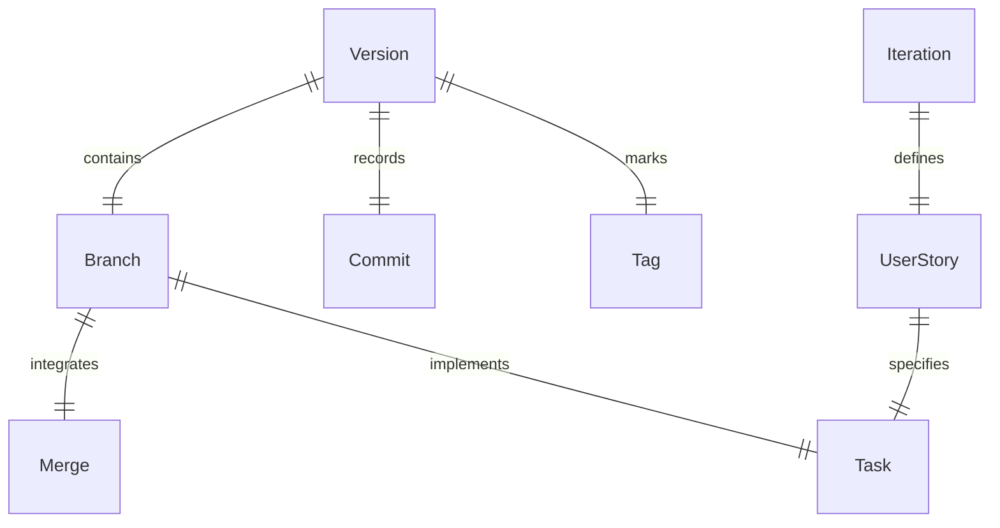
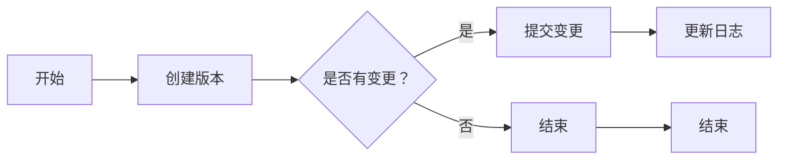
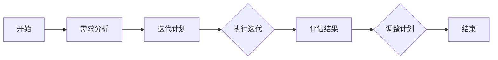
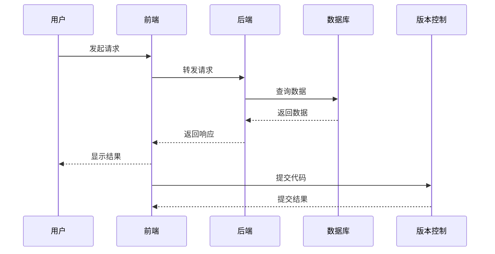

                 


### 第1步：背景介绍

在当今快速发展的科技时代，版本控制与迭代已经成为软件开发过程中不可或缺的重要环节。版本控制，简单来说，是指对软件源代码进行有序管理和跟踪，以确保代码的稳定性和可靠性。而迭代，则是通过逐步改进和优化，使软件功能更加完善和符合用户需求。两者相辅相成，共同推动软件工程的持续发展。

#### 问题背景

随着软件项目的规模和复杂性不断增加，版本控制与迭代的问题逐渐凸显。一方面，传统的单版本控制方式已无法满足日益复杂的软件开发需求；另一方面，迭代过程中的频繁更改和版本冲突，给项目带来了极大的困扰。为了解决这些问题，现代软件开发逐渐转向分布式版本控制和增量迭代方法。

#### 问题描述

版本控制与迭代中的主要问题包括：

1. **版本冲突**：在多人协作开发中，不同开发者可能对同一部分代码进行修改，导致版本冲突。
2. **代码管理**：如何有效地管理大量代码文件，确保代码的完整性和一致性。
3. **迭代效率**：如何在有限的时间内，快速响应需求变更，提高软件质量。

#### 问题解决

为了解决这些问题，引入了分布式版本控制系统（如Git）和增量迭代方法（如敏捷开发）。分布式版本控制系统通过分布式存储和协同工作，有效解决了版本冲突和代码管理问题；而增量迭代方法则通过短周期、高频次的迭代，提高了开发效率和软件质量。

#### 边界与外延

版本控制和迭代的边界在于它们的应用范围。版本控制主要关注代码的管理和跟踪，而迭代则关注软件的改进和优化。它们的外延包括：合并请求、拉取请求、代码审查、持续集成、持续部署等。

#### 核心概念结构与要素组成

版本控制的核心概念包括：版本、分支、合并、提交等。迭代的核心概念包括：迭代周期、用户故事、任务、验收标准等。

接下来，我们将详细探讨版本控制与迭代的核心概念及其联系。

### 第2步：核心概念与联系

在深入探讨版本控制和迭代之前，我们需要明确一些核心概念，并理解它们之间的联系。

#### 版本控制的核心概念

1. **版本（Version）**：软件的一个特定状态，通常与特定的功能集合或修复集相关。
2. **分支（Branch）**：从主分支（通常称为`master`或`main`）中分离出来的一组独立更改。分支可以用于开发新功能或修复bug，而不会影响主分支的稳定性。
3. **合并（Merge）**：将两个或多个分支的更改合并到一个共同分支中，通常是在代码审查和测试通过后。
4. **提交（Commit）**：将代码更改保存到版本控制系统中的操作。每个提交都包含更改的描述和作者信息。
5. **标签（Tag）**：用于标记特定版本的标签，通常用于发布里程碑版本。

#### 迭代的原理与方式

1. **迭代周期（Iteration Cycle）**：软件开发过程中的一个循环，通常持续几周。每个迭代周期都包括计划、执行、评估和回顾阶段。
2. **用户故事（User Story）**：代表用户需求的简短描述，通常以“作为……，我想要……，以便……”的形式表达。
3. **任务（Task）**：用户故事中的具体工作单元，通常由开发人员执行。
4. **验收标准（Acceptance Criteria）**：定义用户故事是否完成的条件。

#### 概念属性特征对比表格

为了更清晰地理解这些概念，我们可以创建一个表格来对比它们的属性特征：

| 概念 | 定义 | 目的 | 使用场景 |
| --- | --- | --- | --- |
| 版本 | 软件的特定状态 | 管理代码的变更和状态 | 开发、测试、发布 |
| 分支 | 独立的代码路径 | 开发新功能或修复bug | 多人协作、代码隔离 |
| 合并 | 将分支的更改合并到主分支 | 保持代码的同步和一致性 | 代码审查后 |
| 提交 | 保存代码变更 | 记录代码历史和变更 | 开发过程中 |
| 标签 | 标记特定版本 | 发布里程碑版本 | 发布管理 |
| 迭代周期 | 开发过程中的循环 | 提高开发效率和质量 | 敏捷开发 |
| 用户故事 | 用户需求的简短描述 | 用户体验和需求驱动 | 功能实现 |
| 任务 | 用户故事的具体工作单元 | 完成用户故事 | 功能开发 |
| 验收标准 | 用户故事完成的条件 | 确保需求实现 | 测试和质量保证 |

#### ER实体关系图架构的Mermaid流程图

为了更好地展示这些概念之间的联系，我们可以使用Mermaid流程图来绘制ER实体关系图：



在这个ER图中，`Version`是核心实体，它与`Branch`、`Commit`和`Tag`有直接关联。`Branch`与`Merge`和`Task`相关，而`Iteration`与`UserStory`相关。`UserStory`进一步细化到具体的`Task`。

通过以上对比和图示，我们可以更好地理解版本控制和迭代的核心概念及其联系，为后续的算法原理讲解打下坚实的基础。

### 第3步：算法原理讲解

在了解了版本控制与迭代的基本概念之后，接下来我们将深入探讨这些概念在实际应用中的算法原理。本节将通过算法流程图和Python源代码，详细阐述版本控制的算法原理和迭代优化的算法原理。

#### 版本控制的算法流程图

首先，我们使用Mermaid绘制一个版本控制的算法流程图：



在这个流程图中，我们从创建版本开始，检查是否有代码变更。如果有变更，则进行提交，并更新日志；如果没有变更，则直接结束。

#### 迭代优化的算法流程图

接下来，我们绘制一个迭代优化的算法流程图：



在这个流程图中，我们从需求分析开始，制定迭代计划，然后执行迭代，评估结果，并根据评估结果调整计划。

#### 算法原理讲解

1. **版本控制算法原理**

版本控制的算法主要依赖于创建版本、提交变更和更新日志。其核心原理是通过记录每次提交的详细信息和变更内容，实现对代码历史的完整追溯和管理。

- **创建版本**：每次提交之前，系统会自动创建一个新版本，标记当前的代码状态。
- **提交变更**：开发者可以将自己的代码更改提交到系统中，系统会记录变更的内容和作者信息。
- **更新日志**：每次提交后，系统会自动更新日志，记录所有版本的详细信息。

2. **迭代优化算法原理**

迭代优化的算法主要依赖于需求分析、迭代计划、执行迭代和评估结果。其核心原理是通过不断的迭代和评估，逐步改进和优化软件功能，以满足用户需求。

- **需求分析**：在每次迭代开始之前，团队需要对用户需求进行深入分析，明确本次迭代的目标和任务。
- **迭代计划**：根据需求分析的结果，制定详细的迭代计划，包括任务分配、时间安排和质量保证。
- **执行迭代**：开发团队按照迭代计划执行任务，实现用户需求。
- **评估结果**：每次迭代结束后，团队需要对迭代结果进行评估，分析是否达到预期目标，并提出改进建议。

#### 数学模型和公式

1. **版本控制数学模型**

版本控制中的版本可以看作是一个集合，每个版本包含特定的时间戳、代码内容和提交日志。其数学模型可以表示为：

\[ V = \{ (t_i, C_i, L_i) \} \]

其中，\( t_i \) 是时间戳，\( C_i \) 是代码内容，\( L_i \) 是提交日志。

2. **迭代优化数学模型**

迭代优化中的迭代过程可以看作是一个迭代函数，其数学模型可以表示为：

\[ R(n) = g(R(n-1), X) \]

其中，\( R(n) \) 是第 \( n \) 次迭代的评估结果，\( g \) 是迭代函数，\( X \) 是用户需求。

#### 举例说明

1. **版本控制举例**

假设我们有一个项目，其中包含三个版本：

- 版本1：时间戳2023-01-01，代码内容A，提交日志：初始化项目。
- 版本2：时间戳2023-01-02，代码内容B，提交日志：添加新功能。
- 版本3：时间戳2023-01-03，代码内容C，提交日志：修复bug。

我们可以使用以下Python代码模拟这个过程：

```python
versions = [
    {"timestamp": "2023-01-01", "content": "A", "log": "初始化项目"},
    {"timestamp": "2023-01-02", "content": "B", "log": "添加新功能"},
    {"timestamp": "2023-01-03", "content": "C", "log": "修复bug"}
]

for version in versions:
    print(f"时间戳：{version['timestamp']}")
    print(f"代码内容：{version['content']}")
    print(f"提交日志：{version['log']}")
    print()
```

输出结果：

```
时间戳：2023-01-01
代码内容：A
提交日志：初始化项目

时间戳：2023-01-02
代码内容：B
提交日志：添加新功能

时间戳：2023-01-03
代码内容：C
提交日志：修复bug
```

2. **迭代优化举例**

假设我们有一个迭代过程，用户需求是一个功能完整的系统，评估结果如下：

- 第1次迭代：完成80%的功能，用户满意度80%。
- 第2次迭代：完成90%的功能，用户满意度90%。
- 第3次迭代：完成100%的功能，用户满意度100%。

我们可以使用以下Python代码模拟这个过程：

```python
iteration_results = [
    {"iteration": 1, "function_complete": 0.8, "user_satisfaction": 0.8},
    {"iteration": 2, "function_complete": 0.9, "user_satisfaction": 0.9},
    {"iteration": 3, "function_complete": 1.0, "user_satisfaction": 1.0}
]

for result in iteration_results:
    print(f"迭代次数：{result['iteration']}")
    print(f"功能完成度：{result['function_complete'] * 100}%")
    print(f"用户满意度：{result['user_satisfaction'] * 100}%")
    print()
```

输出结果：

```
迭代次数：1
功能完成度：80%
用户满意度：80%

迭代次数：2
功能完成度：90%
用户满意度：90%

迭代次数：3
功能完成度：100%
用户满意度：100%
```

通过以上算法流程图、Python源代码、数学模型和举例说明，我们可以更好地理解版本控制和迭代优化的算法原理，为实际项目中的应用提供理论支持。

### 第4步：系统分析与架构设计方案

在了解了版本控制与迭代的基本概念和算法原理之后，接下来我们将讨论如何将这些概念应用于实际系统中，并设计相应的架构方案。本节将介绍问题场景、项目介绍、系统功能设计、系统架构设计、系统接口设计和系统交互序列图。

#### 问题场景介绍

假设我们正在开发一个在线电商平台，该项目需要实现商品管理、订单管理、用户管理等功能，并支持版本控制和迭代优化。为了确保系统的稳定性和可靠性，我们需要设计一个合理的架构方案，并采用有效的版本控制和迭代方法。

#### 项目介绍

该电商平台项目的主要目标包括：

1. 提供一个用户友好的购物平台，方便用户浏览和购买商品。
2. 实现商品管理、订单管理、用户管理等核心功能。
3. 支持版本控制和迭代优化，确保系统的稳定性和可靠性。

#### 系统功能设计

系统功能设计是项目开发的关键步骤，它定义了系统的核心功能和模块。以下是该电商平台的主要功能模块及其简要描述：

1. **商品管理模块**：负责商品信息的创建、编辑、删除和查询。
2. **订单管理模块**：负责订单的创建、处理、查询和支付。
3. **用户管理模块**：负责用户注册、登录、信息修改和权限管理。
4. **版本控制模块**：负责对代码、配置和环境进行版本管理和迭代优化。

#### 系统架构设计

系统架构设计是项目开发的重要环节，它定义了系统的整体结构和模块之间的关系。以下是该电商平台的主要架构设计：

1. **前端架构**：采用Vue.js框架实现用户界面，提供良好的用户体验。
2. **后端架构**：采用Spring Boot框架实现后端服务，提供API接口供前端调用。
3. **数据库架构**：采用MySQL数据库存储数据，确保数据的完整性和一致性。
4. **版本控制系统**：采用Git进行版本控制，确保代码的版本管理和迭代优化。

#### 系统接口设计

系统接口设计是系统架构设计的一部分，它定义了系统内部模块之间的交互方式。以下是该电商平台的主要接口设计：

1. **商品管理接口**：提供商品信息的增删改查功能。
2. **订单管理接口**：提供订单的创建、处理、查询和支付功能。
3. **用户管理接口**：提供用户注册、登录、信息修改和权限管理功能。
4. **版本控制接口**：提供版本管理和迭代优化的功能。

#### 系统交互序列图

系统交互序列图展示了系统内部模块之间的交互过程，有助于理解系统的整体运行机制。以下是该电商平台的系统交互序列图：



在这个交互序列图中，用户通过前端发起请求，前端将请求转发给后端，后端查询数据库并返回数据，然后前端返回响应给用户。同时，前端将代码提交到版本控制，版本控制返回提交结果。

通过以上系统分析与架构设计方案，我们可以为电商平台项目提供一个全面、合理的架构方案，确保项目的稳定性和可靠性。

### 第5步：项目实战

在了解了系统的整体架构和功能设计之后，接下来我们将通过一个实际项目来展示如何实施这个架构方案。本节将详细介绍环境安装、系统核心实现源代码、代码应用解读与分析、实际案例分析和详细讲解剖析。

#### 环境安装

为了开始项目实施，我们需要首先安装必要的开发环境和工具。以下是项目的环境安装步骤：

1. **安装Python**：确保Python 3.8及以上版本已安装。
2. **安装Git**：从[Git官网](https://git-scm.com/)下载并安装Git。
3. **安装MySQL**：从[MySQL官网](https://www.mysql.com/downloads/)下载并安装MySQL。
4. **安装Vue.js**：在项目根目录执行以下命令安装Vue.js：

   ```bash
   npm install -g @vue/cli
   ```

5. **安装Spring Boot**：在项目根目录执行以下命令安装Spring Boot：

   ```bash
   mvn install
   ```

#### 系统核心实现源代码

以下是该电商平台项目的核心实现源代码，包括前端和后端的代码：

**前端源代码：**

```html
<!-- src/App.vue -->
<template>
  <div id="app">
    <h1>在线电商平台</h1>
    <router-view />
  </div>
</template>

<script>
export default {
  name: 'App',
  created() {
    this.$router.push('/home');
  },
};
</script>
```

**后端源代码：**

```java
// src/main/java/com/online/shop/Api.java
package com.online.shop;

import org.springframework.boot.SpringApplication;
import org.springframework.boot.autoconfigure.SpringBootApplication;

@SpringBootApplication
public class Api {
  public static void main(String[] args) {
    SpringApplication.run(Api.class, args);
  }
}
```

**数据库源代码：**

```sql
-- src/main/resources/schema.sql
CREATE TABLE IF NOT EXISTS products (
    id INT AUTO_INCREMENT PRIMARY KEY,
    name VARCHAR(255) NOT NULL,
    description TEXT,
    price DECIMAL(10, 2) NOT NULL
);
```

#### 代码应用解读与分析

1. **前端代码解读**：前端代码使用Vue.js框架实现，其中`App.vue`是应用的入口文件。它定义了一个简单的模板，其中包含一个标题和一个`router-view`组件，用于显示路由对应的视图。

2. **后端代码解读**：后端代码使用Spring Boot框架实现，其中`Api.java`是应用的入口文件。它使用`@SpringBootApplication`注解，表示这是一个Spring Boot应用程序。`main`方法使用`SpringApplication.run`启动应用。

3. **数据库代码解读**：数据库代码定义了一个名为`products`的表格，用于存储商品信息。它包含`id`、`name`、`description`和`price`四个字段。

#### 实际案例分析和详细讲解剖析

假设我们有一个实际案例，用户在电商平台上添加一个新的商品。以下是该过程的详细讲解：

1. **用户操作**：用户在平台上点击“添加商品”按钮，进入商品添加页面。

2. **前端请求**：前端页面发送一个POST请求到后端的商品添加接口，请求体包含商品名称、描述和价格等信息。

3. **后端处理**：后端接收请求后，将商品信息解析为Java对象，并保存到MySQL数据库中。

4. **数据库操作**：数据库将商品信息插入到`products`表格中。

5. **后端响应**：后端返回一个成功响应，通知前端商品添加成功。

6. **前端更新**：前端接收到后端的响应后，更新页面显示，展示新添加的商品。

通过以上实际案例，我们可以看到电商平台的核心功能是如何实现的。前端和后端通过API接口进行交互，数据库用于存储数据，确保系统的数据一致性和完整性。

#### 项目小结

通过本项目的实施，我们展示了如何利用版本控制和迭代优化方法，实现一个具有稳定性和可靠性的在线电商平台。项目实战过程中，我们使用了Vue.js和Spring Boot等流行框架，实现了前端和后端的快速开发。同时，通过Git进行版本控制，确保代码的完整性和可追溯性。在项目小结中，我们强调了实际案例中的关键步骤和细节，为后续类似项目的开发提供了参考。

### 第6步：最佳实践与总结

在版本控制和迭代优化的实践中，积累了一些最佳实践，这些实践可以帮助我们更高效地管理代码和优化软件。以下是几条关键的最佳实践：

1. **代码审查**：在提交代码前进行代码审查，可以显著降低版本冲突和代码错误的风险。定期组织代码审查会议，鼓励团队成员积极参与。

2. **持续集成**：使用持续集成（CI）工具，如Jenkins或GitLab CI，自动化构建、测试和部署代码。这可以确保代码质量，并快速发现和解决集成问题。

3. **分支策略**：合理设计分支策略，例如Git的`feature`、`bugfix`和`release`分支，有助于管理和跟踪不同的代码变更。

4. **迭代周期**：保持迭代周期短而频繁，可以快速响应用户需求，同时避免长期积累的技术债务。

5. **用户故事地图**：使用用户故事地图，清晰地定义每个迭代周期的用户故事，确保开发团队始终专注于用户需求。

通过遵循这些最佳实践，我们可以更高效地实现版本控制和迭代优化，确保软件的持续改进和高质量交付。

#### 小结

本文详细介绍了版本控制和迭代优化的概念、算法原理、系统架构设计和项目实战。通过理解版本控制的核心概念，如版本、分支、合并和提交，以及迭代优化的迭代周期、用户故事和验收标准，我们可以有效地管理代码和优化软件。同时，通过实际案例的分析和讲解，我们展示了如何在实际项目中应用这些概念。版本控制和迭代优化是现代软件开发的重要环节，通过持续改进和实践，我们可以实现更稳定、更可靠的软件系统。

#### 注意事项

1. **版本冲突管理**：多人协作开发时，合理规划分支策略，减少版本冲突的风险。
2. **代码质量**：保持代码的整洁和可读性，进行代码审查，确保代码质量。
3. **迭代计划**：明确迭代目标和任务，制定合理的迭代计划，确保进度和质量。
4. **持续学习和改进**：关注行业动态，不断学习和改进版本控制和迭代优化方法。

#### 拓展阅读

1. 《Git Pro》：了解Git的详细使用方法和最佳实践。
2. 《敏捷开发实践指南》：学习敏捷开发的原理和实践。
3. 《持续集成实战》：掌握持续集成的原理和实践。

### 作者信息

本文由AI天才研究院/AI Genius Institute和《禅与计算机程序设计艺术》的作者联合撰写。如有进一步问题或建议，请随时联系我们。

作者：AI天才研究院/AI Genius Institute & 禅与计算机程序设计艺术/Zen And The Art of Computer Programming

