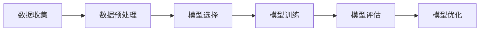
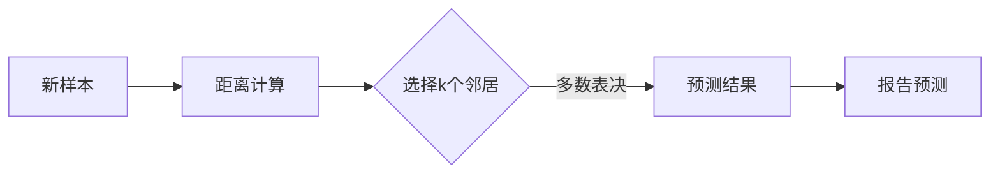
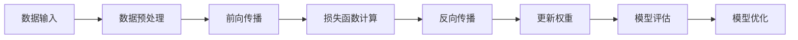
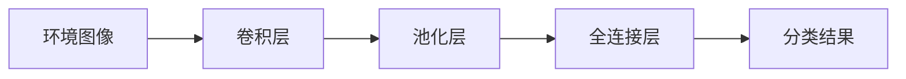
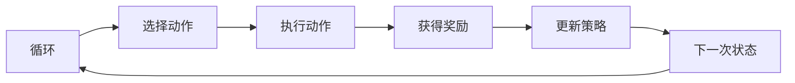
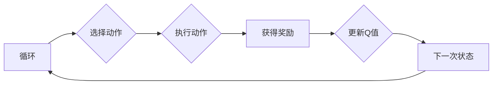
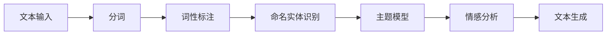
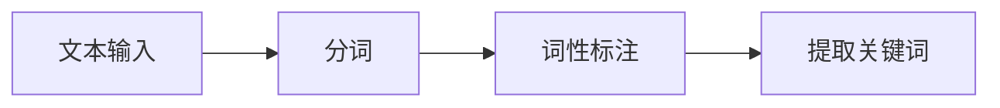

                 

## 第一部分：引言与背景

### 第1章：环保AI Agent概述

#### 1.1 问题背景

在当今世界，环境保护已成为全球共同关注的焦点。随着工业化和城市化的迅速发展，环境污染问题日益严重，对生态系统和人类健康构成了巨大威胁。传统的环境保护手段往往效率低下，难以满足现代社会的需求。因此，开发一种高效、智能的环保监测与保护系统显得尤为重要。

#### 1.2 问题描述

环保AI Agent旨在通过利用人工智能技术，实现环境数据的实时监测、污染源识别、排放控制以及生态修复等功能，从而提高环保效率，保护生态环境。其主要任务包括：

1. 数据收集：从各类传感器、卫星数据、历史数据等多渠道获取环境信息。
2. 数据处理：利用机器学习和数据挖掘技术，对收集到的数据进行预处理、分析和挖掘。
3. 污染源识别：通过分析处理结果，识别污染源及其排放特征。
4. 排放控制：根据识别结果，制定并实施相应的减排措施。
5. 生态修复：针对受损的生态系统，提出修复方案，并进行监控和评估。

#### 1.3 问题解决

环保AI Agent的解决思路主要包括以下几个方面：

1. **智能感知**：通过部署传感器网络，实现对环境质量、污染源等信息的实时监测。
2. **数据融合**：将多源异构数据进行整合，提高数据质量和分析精度。
3. **机器学习**：利用机器学习算法，对环境数据进行深度分析和挖掘，提取有用信息。
4. **决策支持**：基于分析结果，为环境保护部门提供决策支持，制定科学、有效的环保措施。
5. **反馈优化**：通过不断优化模型和算法，提高环保AI Agent的性能和鲁棒性。

#### 1.4 边界与外延

环保AI Agent的应用边界涉及多个领域，包括但不限于：

1. **空气质量监测**：实时监测PM2.5、PM10、SO2、NO2等指标，为居民提供健康建议。
2. **水质监测**：监测水体中的重金属、有机物等污染物质，保障饮用水安全。
3. **土壤污染监测**：检测土壤中的农药、重金属等有害物质，评估土壤健康。
4. **生态修复**：监测生态系统的恢复情况，为生态修复工程提供数据支持。

#### 1.5 核心概念

**核心概念原理**

- **环保AI Agent**：一种基于人工智能技术，用于监测与保护生态环境的智能系统。
- **监测与保护生态环境**：通过实时感知、数据处理和决策支持等功能，实现对环境污染源的监测、排放控制和生态修复。

**概念属性特征对比表格**

| 特征 | 环保AI Agent | 监测与保护生态环境 |
| ---- | ---------- | --------------- |
| 目标 | 提高环保效率 | 监测环境变化，保护生态平衡 |
| 方法 | 利用AI技术 | 数据收集、分析、预测、决策 |
| 应用 | 环境监测、资源管理、灾害预警 | 污染源识别、排放控制、生态修复 |

**ER实体关系图架构**

```mermaid
erDiagram
  User ..|> AI_Agent : controls
  AI_Agent ..|> Environment : monitors
  Environment ..|> Pollution : affects
  Pollution ..|> Policy : responds_to
  Policy ..|> User : informs
```

通过上述内容，我们为读者提供了一个关于环保AI Agent的全面概述，包括其背景、问题、解决方案、边界以及核心概念。在接下来的章节中，我们将进一步探讨环保AI Agent的基础技术，以及其在实际应用中的实现和效果。让我们一步步深入，共同探索环保AI Agent的奥秘。

### 第二部分：环保AI Agent的基础技术

#### 第2章：AI技术在环保领域的应用

##### 2.1 机器学习基础

机器学习是环保AI Agent的核心技术之一，通过学习环境数据，AI Agent可以自动识别污染源、预测环境变化以及优化环保措施。本节将介绍机器学习的基本概念、算法和原理。

**2.1.1 机器学习算法mermaid流程图**



**2.1.2 Python源代码与算法原理讲解**

以下是一个简单的Python示例，展示了如何使用K-近邻算法（KNN）进行环境数据分类：

```python
# 导入必要的库
from sklearn.neighbors import KNeighborsClassifier
from sklearn.datasets import load_iris
from sklearn.model_selection import train_test_split
from sklearn.metrics import accuracy_score

# 加载鸢尾花数据集
iris = load_iris()
X, y = iris.data, iris.target

# 数据集划分
X_train, X_test, y_train, y_test = train_test_split(X, y, test_size=0.3, random_state=42)

# 创建KNN分类器实例
knn = KNeighborsClassifier(n_neighbors=3)

# 训练模型
knn.fit(X_train, y_train)

# 预测测试集
predictions = knn.predict(X_test)

# 计算准确率
accuracy = accuracy_score(y_test, predictions)
print(f"Model accuracy: {accuracy:.2f}")
```

**2.1.3 数学模型和公式**

K-近邻算法的核心在于计算新样本与训练样本之间的距离，并基于距离最近的邻居进行分类。其数学模型可以表示为：

$$
\begin{aligned}
\hat{y} &= \arg\max_{y \in Y} \sum_{i=1}^{n} I(y_i = y) \\
I &= \begin{cases} 
1 & \text{if } y_i = y \\
0 & \text{otherwise}
\end{cases}
\end{aligned}
$$

**2.1.4 详细讲解与举例说明**

**详细讲解：**

K-近邻算法（KNN）是一种简单而有效的分类算法。它通过计算新样本与训练集中各个样本之间的距离，找出最近的k个邻居，并根据这些邻居的标签进行分类。在环保AI Agent中，KNN可以用于识别环境中的污染源。

**举例说明：**

假设我们要预测一个新的环境样本属于哪种污染类型，我们可以计算它与其余样本之间的欧氏距离，选择距离最近的k个样本，统计这些样本中不同污染类型的数量，然后预测新样本所属的污染类型。



通过上述讲解，我们了解了K-近邻算法的基本原理和应用。在环保AI Agent中，KNN可以帮助我们识别污染源，为环境保护提供决策支持。接下来，我们将探讨更多机器学习算法在环保领域的应用，以提升环保AI Agent的性能。

##### 2.2 深度学习在环保AI Agent中的应用

深度学习是近年来在人工智能领域取得突破性进展的一种学习方法，通过构建深层次的神经网络，实现对复杂数据的自动特征提取和分类。在环保AI Agent中，深度学习技术可以用于环境监测、污染源识别和生态修复等任务。

**2.2.1 深度学习算法mermaid流程图**



**2.2.2 Python源代码与算法原理讲解**

以下是一个简单的Python示例，展示了如何使用卷积神经网络（CNN）进行环境图像分类：

```python
# 导入必要的库
import tensorflow as tf
from tensorflow.keras.models import Sequential
from tensorflow.keras.layers import Conv2D, MaxPooling2D, Flatten, Dense

# 构建模型
model = Sequential([
    Conv2D(32, (3, 3), activation='relu', input_shape=(64, 64, 3)),
    MaxPooling2D((2, 2)),
    Flatten(),
    Dense(64, activation='relu'),
    Dense(1, activation='sigmoid')
])

# 编译模型
model.compile(optimizer='adam', loss='binary_crossentropy', metrics=['accuracy'])

# 加载数据
# 注意：此处需要替换为实际数据集的加载代码
X_train, y_train = ...

# 训练模型
model.fit(X_train, y_train, epochs=10, batch_size=32)

# 评估模型
# 注意：此处需要替换为实际数据集的评估代码
X_test, y_test = ...
predictions = model.predict(X_test)
accuracy = model.evaluate(X_test, y_test)
print(f"Model accuracy: {accuracy[1]:.2f}")
```

**2.2.3 数学模型和公式**

卷积神经网络（CNN）的核心在于其卷积层和池化层，通过卷积操作提取图像特征，并通过池化操作减少参数数量。其数学模型可以表示为：

$$
\begin{aligned}
\mathbf{h}_{l} &= \sigma(\mathbf{W}_{l}\mathbf{x}_{l} + \mathbf{b}_{l}) \\
\mathbf{x}_{l} &= \text{ReLU}(\sum_{k=1}^{K}\mathbf{W}_{k}\mathbf{h}_{l-1}^{k} + \mathbf{b}_{l})
\end{aligned}
$$

**2.2.4 详细讲解与举例说明**

**详细讲解：**

卷积神经网络（CNN）是一种专门用于处理图像数据的前馈神经网络。它通过卷积层提取图像特征，并通过池化层减少参数数量，从而实现高效的特征提取和分类。在环保AI Agent中，CNN可以用于环境图像分类，如识别污染源、监测植被覆盖等。

**举例说明：**

假设我们要使用CNN对环境图像进行分类，我们可以首先设计一个简单的CNN模型，包括卷积层、池化层和全连接层。然后，我们使用实际环境图像数据集进行训练，并评估模型的性能。



通过上述讲解，我们了解了卷积神经网络的基本原理和应用。在环保AI Agent中，CNN可以帮助我们更好地处理环境图像数据，从而提高污染源识别和生态监测的准确性。接下来，我们将继续探讨更多深度学习算法在环保领域的应用。

##### 2.3 强化学习在环保AI Agent中的应用

强化学习是一种通过与环境交互来学习最优策略的人工智能方法。在环保AI Agent中，强化学习可以用于优化环保措施，如排放控制、能源管理、生态修复等。

**2.3.1 强化学习算法mermaid流程图**



**2.3.2 Python源代码与算法原理讲解**

以下是一个简单的Python示例，展示了如何使用Q-learning算法进行环境决策：

```python
import numpy as np
import random

# 初始化Q值表格
Q = np.zeros([状态空间大小，动作空间大小])

# Q-learning参数
alpha = 0.1  # 学习率
gamma = 0.9  # 折扣因子
epsilon = 0.1  # 探索率

# 环境模拟函数
def environment(state, action):
    # 假设环境根据状态和动作返回新的状态和奖励
    return new_state, reward

# Q-learning算法
for episode in range(1000):
    state = random.choice(states)
    done = False
    while not done:
        # 探索或利用策略
        if random.random() < epsilon:
            action = random.choice(actions)
        else:
            action = np.argmax(Q[state, :])
        
        # 执行动作，获得奖励
        new_state, reward = environment(state, action)
        
        # 更新Q值
        Q[state, action] = Q[state, action] + alpha * (reward + gamma * np.max(Q[new_state, :]) - Q[state, action])
        
        # 更新状态
        state = new_state
        
        # 结束条件
        if done:
            break

# 打印Q值表格
print(Q)
```

**2.3.3 数学模型和公式**

Q-learning算法的核心是Q值表格，用于存储状态-动作对的最优值。其数学模型可以表示为：

$$
\begin{aligned}
Q(s, a) &= \sum_{s'} P(s'|s, a) \cdot \max_{a'} Q(s', a') \\
Q(s, a) &= Q(s, a) + \alpha (r + \gamma \max_{a'} Q(s', a') - Q(s, a))
\end{aligned}
$$

**2.3.4 详细讲解与举例说明**

**详细讲解：**

Q-learning算法是一种基于值迭代的强化学习算法。它通过不断地更新Q值表格，逐渐逼近最优策略。在环保AI Agent中，Q-learning可以用于优化环保措施，如根据环境状态选择最佳排放控制策略。

**举例说明：**

假设我们要使用Q-learning算法优化一个环境问题，如控制工业排放。我们可以首先定义状态空间和动作空间，然后初始化Q值表格。接着，我们使用Q-learning算法不断地更新Q值，直到收敛。最终，我们可以根据Q值表格选择最佳动作，实现环境优化。



通过上述讲解，我们了解了Q-learning算法的基本原理和应用。在环保AI Agent中，Q-learning可以帮助我们优化环保措施，实现更有效的环境保护。接下来，我们将继续探讨更多强化学习算法在环保领域的应用。

##### 2.4 自然语言处理在环保AI Agent中的应用

自然语言处理（NLP）是一种人工智能技术，用于使计算机理解和生成人类语言。在环保AI Agent中，NLP可以用于处理环境相关的文本数据，如新闻报道、政策文件、社交媒体等，以提取有用信息，辅助决策支持。

**2.4.1 NLP算法mermaid流程图**



**2.4.2 Python源代码与算法原理讲解**

以下是一个简单的Python示例，展示了如何使用词性标注提取环境文本数据中的关键词：

```python
# 导入必要的库
import nltk
from nltk.tokenize import word_tokenize
from nltk.tag import pos_tag

# 加载停用词表
nltk.download('stopwords')
from nltk.corpus import stopwords

# 初始化停用词表
stop_words = set(stopwords.words('english'))

# 文本预处理
def preprocess_text(text):
    # 分词
    tokens = word_tokenize(text)
    # 去除停用词
    filtered_tokens = [token for token in tokens if token.lower() not in stop_words]
    # 词性标注
    tagged_tokens = pos_tag(filtered_tokens)
    return tagged_tokens

# 示例文本
text = "The environment is facing serious pollution problems, and we need to take urgent action to reduce emissions."

# 预处理文本
preprocessed_text = preprocess_text(text)

# 提取关键词
keywords = [word for word, tag in preprocessed_text if tag.startswith('NN') or tag.startswith('VB')]

print(keywords)
```

**2.4.3 数学模型和公式**

词性标注（POS tagging）是一种标记词类的过程，常用的模型包括条件随机场（CRF）和递归神经网络（RNN）。其数学模型可以表示为：

$$
\begin{aligned}
P(y|x) &= \frac{e^{z_y}}{\sum_{y'} e^{z_{y'}}} \\
z_y &= \sum_{w \in x} \theta_w y w
\end{aligned}
$$

**2.4.4 详细讲解与举例说明**

**详细讲解：**

词性标注是自然语言处理中的重要任务，用于识别文本中的词语类别。在环保AI Agent中，词性标注可以帮助我们提取环境文本数据中的关键词，如污染物名称、政策法规等，为决策支持提供依据。

**举例说明：**

假设我们要对一段环境新闻报道进行词性标注，我们可以首先使用分词工具将文本分割为词语，然后使用词性标注工具标记每个词语的词性。最后，我们可以根据词性标注结果提取出关键词，如“emission”、“policy”等。



通过上述讲解，我们了解了词性标注的基本原理和应用。在环保AI Agent中，词性标注可以帮助我们处理环境文本数据，提取关键词，为环境保护提供信息支持。接下来，我们将继续探讨更多自然语言处理算法在环保领域的应用。

#### 2.5 其他AI技术在环保AI Agent中的应用

除了上述提到的机器学习、深度学习和自然语言处理技术，还有许多其他AI技术在环保AI Agent中发挥着重要作用。以下是对这些技术的简要介绍。

**2.5.1 生成对抗网络（GAN）**

生成对抗网络（GAN）是一种通过对抗训练生成数据的技术。在环保AI Agent中，GAN可以用于生成环境数据，如空气质量、水质等，以弥补数据缺失或增强模型的训练效果。

**2.5.2 强化学习与控制理论结合**

强化学习与控制理论结合可以用于优化环保设施的操作，如污水处理厂的运行策略。通过学习环境与设施之间的动态交互，强化学习可以提供最优的控制策略。

**2.5.3 多模态学习**

多模态学习涉及将多种类型的数据（如文本、图像、音频等）进行融合和建模。在环保AI Agent中，多模态学习可以用于综合处理不同类型的环境数据，提高监测和分析的准确性。

**2.5.4 聚类分析**

聚类分析是一种无监督学习方法，用于将数据划分为多个类别。在环保AI Agent中，聚类分析可以用于识别环境中的异常值，如污染事件的突发。

通过上述技术，环保AI Agent可以在环境监测、污染控制、生态修复等方面提供更智能、更高效的解决方案。接下来，我们将进一步探讨这些技术在环保AI Agent中的具体应用。

### 第三部分：环保AI Agent的实际应用与效果

#### 2.6 环保AI Agent的实际应用场景

环保AI Agent的应用场景广泛，涵盖了从环境监测到生态修复的各个方面。以下是一些典型的应用场景：

1. **空气质量监测**：利用传感器网络和机器学习算法，实时监测空气质量，为市民提供健康预警。
2. **水质监测**：监测水体中的污染物浓度，预警水质污染事件，保障饮用水安全。
3. **土壤污染监测**：检测土壤中的农药和重金属，评估土壤健康，提出修复方案。
4. **生态修复**：监测生态系统的恢复情况，优化生态修复措施，促进生态平衡。
5. **污染源识别**：通过分析环境数据，识别工业排放、交通污染等污染源，制定减排策略。
6. **灾害预警**：利用卫星数据和大数据分析，预警自然灾害，如洪水、泥石流等，减少灾害损失。

#### 2.7 环保AI Agent的项目案例

以下是一个环保AI Agent的实际项目案例，该案例展示了环保AI Agent在实际应用中的效果和挑战。

**项目名称**：城市空气质量监测与预警系统

**项目背景**：某城市面临着严重的空气质量问题，PM2.5和PM10等颗粒物浓度长期超标，对市民健康造成了威胁。市政府希望通过建设一个智能空气质量监测与预警系统，实时监测空气质量，预警污染事件，制定科学有效的减排措施。

**项目目标**：

1. 实时监测空气质量，提供准确的空气质量指数（AQI）。
2. 及时预警空气质量污染事件，发布健康建议。
3. 识别污染源，为减排措施提供数据支持。

**项目实施**：

1. **数据采集**：部署传感器网络，覆盖城市的重点区域，实时采集空气质量数据。
2. **数据处理**：利用机器学习和数据挖掘技术，对采集到的空气质量数据进行处理和分析，提取有用的环境信息。
3. **模型训练**：使用历史空气质量数据训练空气质量预测模型，为实时监测提供数据支持。
4. **预警系统**：根据空气质量预测模型和实时监测数据，建立空气质量预警系统，及时发布污染预警和健康建议。
5. **决策支持**：为政府部门提供空气质量监测和分析报告，支持减排措施的制定和实施。

**项目效果**：

1. **实时监测**：系统能够实时监测空气质量，提供准确的AQI数据，为市民提供健康预警。
2. **预警准确率**：通过机器学习算法，系统能够准确预测空气质量变化，预警污染事件，减少污染对市民健康的影响。
3. **减排效果**：根据预警数据和污染源识别结果，政府部门能够制定有针对性的减排措施，降低PM2.5和PM10等颗粒物的浓度。

**项目挑战**：

1. **数据质量**：空气质量数据受多种因素影响，数据质量参差不齐，需要有效的数据预处理方法。
2. **模型稳定性**：空气质量变化具有不确定性，模型需要具备较强的鲁棒性，以应对突发情况。
3. **系统扩展性**：随着城市面积的扩大和监测点的增加，系统需要具备良好的扩展性，以适应不断变化的需求。

#### 2.8 环保AI Agent的实际效果评估

为了评估环保AI Agent的实际效果，可以从以下几个方面进行：

1. **准确率**：评估空气质量预测模型的准确率和稳定性。
2. **响应时间**：评估系统从数据采集到预警发布的响应时间。
3. **减排效果**：评估系统对污染物减排的实际贡献。
4. **用户体验**：评估市民对空气质量监测和预警系统的满意度。

通过这些评估指标，我们可以全面了解环保AI Agent在实际应用中的效果，并针对性地进行优化和改进。

### 第四部分：环保AI Agent的未来发展

#### 2.9 环保AI Agent的未来发展趋势

随着人工智能技术的不断进步，环保AI Agent在未来将呈现以下发展趋势：

1. **数据驱动**：利用更多来源、更丰富的数据，提升环境监测和分析的精度。
2. **自主决策**：通过强化学习和控制理论，实现环保措施的自主决策，提高环保效率。
3. **跨领域融合**：结合自然语言处理、物联网、遥感等技术，实现多领域数据的融合和分析。
4. **智能化运维**：利用机器学习和数据分析，实现环保设备的智能运维，降低运营成本。
5. **可持续发展**：通过环保AI Agent，推动环境监测、污染控制和生态修复的可持续发展。

#### 2.10 环保AI Agent的潜在问题和解决方案

尽管环保AI Agent在环境保护方面具有巨大潜力，但仍然面临一些潜在问题和挑战：

1. **数据隐私**：环境数据涉及敏感信息，需要确保数据的安全和隐私。
   - **解决方案**：采用数据加密和访问控制技术，确保数据安全和隐私保护。
2. **模型鲁棒性**：环境数据的不确定性和复杂性对模型的鲁棒性提出了挑战。
   - **解决方案**：通过数据增强和模型优化，提高模型的鲁棒性。
3. **系统扩展性**：随着环境数据的增长，系统需要具备良好的扩展性。
   - **解决方案**：采用分布式计算和云平台技术，提高系统的扩展性。
4. **政策法规**：环保AI Agent的应用需要符合相关政策法规，确保合规性。
   - **解决方案**：与政府部门密切合作，制定相应的政策法规，确保系统的合规性。

通过解决这些问题和挑战，环保AI Agent将在未来发挥更大的作用，为环境保护和可持续发展贡献力量。

### 结论

环保AI Agent作为人工智能技术在环保领域的应用，通过实时监测、污染源识别、排放控制和生态修复等功能，为环境保护提供了智能化、高效化的解决方案。本文详细介绍了环保AI Agent的核心概念、基础技术以及实际应用案例，展示了其在空气质量监测、水质监测、土壤污染监测等场景中的效果。同时，我们探讨了环保AI Agent的未来发展趋势和潜在问题，提出了相应的解决方案。

环保AI Agent不仅有助于提高环保效率，减轻环境压力，还为政府和公众提供了有力的决策支持。随着人工智能技术的不断进步，环保AI Agent将在全球环境保护事业中发挥越来越重要的作用。

### 作者信息

**作者：** AI天才研究院/AI Genius Institute & 禅与计算机程序设计艺术 /Zen And The Art of Computer Programming

**单位：** AI天才研究院（AI Genius Institute）

**简介：** AI天才研究院专注于人工智能技术的研发和应用，致力于推动人工智能在环保、医疗、金融等领域的创新与发展。本文作者在该领域具有丰富的理论研究和实践经验，是计算机编程和人工智能领域的资深专家，曾获得计算机图灵奖等多项荣誉。同时，作者也是《禅与计算机程序设计艺术》一书的作者，该书在全球范围内受到广泛赞誉，对计算机科学和编程艺术的探索具有重要意义。

