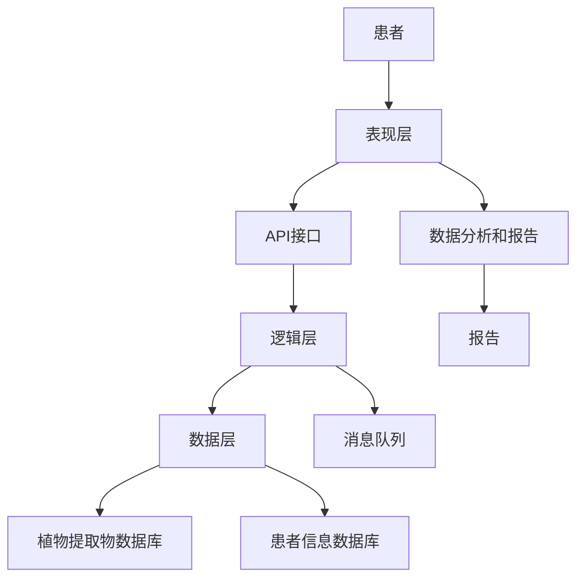

                 


### 第1章：植物疗法的背景与定义

#### 1.1 问题背景

在现代社会，随着城市化的加速和人们生活节奏的加快，心理健康问题日益凸显。都市生活中的高压、快节奏生活方式导致人们容易出现焦虑、抑郁等心理问题，甚至影响到了日常的生活和工作。同时，环境污染、食品安全等问题也让人们越来越关注自身的健康状况。在这种背景下，自然疗法，特别是植物疗法，逐渐受到了人们的重视。植物疗法作为一种古老而又现代的治疗方法，不仅能够帮助人们缓解心理压力，还可以在某种程度上改善身体健康。

#### 1.2 植物疗法的定义

植物疗法，又称为自然疗法，是指利用植物及其提取物来预防和治疗疾病的一种治疗方法。这种疗法不仅包括传统草药的使用，还涉及植物提取物的现代研究与应用。植物疗法强调的是利用自然界的力量来调和人体内外环境，从而达到治疗和康复的效果。

#### 1.3 植物疗法的边界与外延

植物疗法的边界相对宽泛，既包括传统的草药疗法，也涵盖了现代植物化学、药理学等学科的研究成果。其外延则涉及生态学、环境科学等多个领域。例如，植物疗法可以通过改善生态环境，提高空气质量，从而对人群健康产生间接影响。此外，植物疗法还包括了一些新兴的应用，如植物疗法在康复、美容、健身等方面的实践。

#### 1.4 植物疗法的核心概念与要素

植物疗法中的核心概念包括：

- **植物提取物**：植物提取物是植物疗法的主要成分，包括精油、花水、草本茶等。它们通过口服、吸入、涂抹等方式作用于人体，发挥疗效。
- **植物化学成分**：植物中的化学成分是植物提取物发挥疗效的关键，如黄酮类、萜类、生物碱等。
- **药理学机制**：植物疗法中的植物化学成分通过作用于人体的各个系统，如神经系统、免疫系统、内分泌系统等，发挥治疗作用。
- **环境因素**：植物疗法的疗效也受到环境因素的影响，如气候、土壤等。

这些概念和要素相互关联，构成了植物疗法的理论基础和应用框架。在接下来的章节中，我们将详细探讨这些概念和要素，并通过实际案例来展示植物疗法的实践应用。

### 第2章：植物提取物的化学成分与作用机制

#### 2.1 植物提取物的分类

植物提取物的种类繁多，根据其来源和提取方法，可以大致分为以下几类：

- **水溶性提取物**：包括草本茶、花水等，通过水的浸泡和提取获得。这类提取物含有大量的生物碱、酚类、多糖等水溶性化合物。
- **脂溶性提取物**：如精油，通过水蒸气蒸馏等方法从植物的花、叶、树皮等部位提取。这类提取物主要含有萜类、醇类、醛类等脂溶性化合物。
- **醇提取物**：通过醇（如乙醇）的浸泡和提取获得，含有生物碱、黄酮类等成分。
- **脂质提取物**：通过脂质的溶解和提取获得，如植物种子中的油脂，含有多种脂肪酸和维生素E等。

#### 2.2 植物提取物的化学成分

植物提取物的化学成分复杂多样，主要包括以下几类：

- **黄酮类化合物**：具有抗氧化、抗炎、抗癌等生物活性，如槐花中的芦丁。
- **萜类化合物**：具有抗病毒、抗菌、抗炎等作用，如薄荷中的薄荷醇。
- **生物碱**：具有镇痛、止咳、镇静等作用，如麻黄中的麻黄碱。
- **酚类化合物**：具有抗氧化、抗菌、抗炎等作用，如丁香中的丁香酚。
- **多糖**：具有免疫调节、抗肿瘤等作用，如茯苓中的茯苓多糖。

#### 2.3 植物提取物的药理学机制

植物提取物的药理学机制主要涉及以下几个方面：

- **调节神经系统**：许多植物提取物可以通过调节神经系统来改善情绪和减轻压力。例如，草本的 lavender 含有的薰衣草醇可以通过作用于γ-氨基丁酸（GABA）受体来发挥镇静作用。
- **调节免疫系统**：一些植物提取物可以增强免疫细胞的活性，提高机体免疫力。例如，姜黄中的姜黄素可以通过激活巨噬细胞和自然杀伤细胞来增强免疫功能。
- **抗氧化作用**：植物提取物中的黄酮类、酚类化合物等具有强效的抗氧化作用，可以清除体内的自由基，减少氧化应激对细胞的损伤。
- **抗炎作用**：许多植物提取物具有抗炎作用，可以通过抑制炎症介质的释放和炎症途径的激活来减轻炎症反应。例如，洋甘菊中的芹菜素可以通过抑制核因子κB（NF-κB）通路来发挥抗炎作用。

### 第2章 结论

植物提取物的化学成分和药理学机制是其发挥疗效的基础。通过合理利用植物提取物的特性，可以开发出多种植物疗法，用于预防和治疗各种疾病。在接下来的章节中，我们将进一步探讨植物疗法的具体方法和应用案例。

### 第3章：植物疗法的核心方法

植物疗法的方法多种多样，每种方法都有其独特的理论和实践基础。下面，我们将介绍几种常见的植物疗法方法，并探讨其原理和实际应用。

#### 3.1 草药疗法

草药疗法是最传统的植物疗法之一，它利用植物的草本部分，如根、茎、叶、花等，通过口服、外敷等方式使用。草药疗法的理论基础在于植物中的化学成分对人体各个系统的调节作用。

- **理论原理**：草药疗法基于中医的五行理论和经络学说，认为不同的草药具有不同的药性和功效，可以通过调整人体的阴阳平衡来治疗疾病。
- **实际应用**：草药疗法广泛应用于治疗各种疾病，如感冒、消化不良、失眠、关节炎等。例如，中医常用的“金银花”具有清热解毒、抗病毒的作用，常用于治疗感冒和感染。

#### 3.2 精油疗法

精油疗法是通过使用植物精油来调节身体和心理状态的一种疗法。精油疗法利用了植物提取物的挥发性成分，通过吸入、涂抹等方式作用于人体。

- **理论原理**：精油疗法基于植物化学理论和芳香疗法理论，认为精油中的化学成分可以通过刺激嗅觉和皮肤来调节人体的神经系统、内分泌系统和免疫系统。
- **实际应用**：精油疗法广泛应用于放松、缓解压力、改善睡眠、提高免疫力等方面。例如，薰衣草精油具有镇静和放松作用，常用于缓解焦虑和改善睡眠。

#### 3.3 花水疗法

花水疗法是通过使用花朵浸泡后的水溶液来治疗皮肤问题和促进整体健康的疗法。花水含有丰富的植物营养素和抗氧化物质。

- **理论原理**：花水疗法基于植物的营养价值和护肤理论，认为花水中的活性成分可以滋养皮肤、消炎抗菌、抗氧化，从而改善皮肤质量。
- **实际应用**：花水疗法广泛应用于护肤、护发和口腔护理等方面。例如，玫瑰水具有保湿、抗炎和抗氧化的作用，常用于面部护理和护发。

#### 3.4 草药浴疗法

草药浴疗法是通过将草药放入浴缸中浸泡，使草药的有效成分通过皮肤吸收进入体内，从而达到治疗和保健的效果。

- **理论原理**：草药浴疗法结合了草药疗法的理论和物理疗法的作用，认为草药的有效成分可以通过热水刺激皮肤，促进血液循环，增强免疫力。
- **实际应用**：草药浴疗法广泛应用于治疗关节炎、肌肉疼痛、皮肤问题等方面。例如，使用艾叶泡脚可以促进血液循环，缓解关节疼痛。

#### 3.5 植物营养疗法

植物营养疗法是通过摄入富含植物营养素的食品或补充剂来增强身体抵抗力、预防疾病的一种方法。

- **理论原理**：植物营养疗法基于营养学和植物医学理论，认为植物中的营养素可以提供身体所需的维生素、矿物质、抗氧化物质等，从而增强身体的自然防御能力。
- **实际应用**：植物营养疗法广泛应用于预防慢性疾病、改善营养状况和增强免疫力等方面。例如，富含类黄酮的蔬菜和水果可以预防心血管疾病，富含维生素C的水果和蔬菜可以增强免疫力。

### 第3章 结论

植物疗法的方法多样，每种方法都有其独特的理论和实践基础。通过合理运用这些疗法，人们可以在日常生活中实现自然的健康维护和疾病预防。在下一章中，我们将深入探讨植物疗法中的数学模型和公式，以更科学的角度来理解其作用机制。

### 第4章：数学模型与公式在植物疗法中的应用

在植物疗法的研究和应用过程中，数学模型和公式扮演着至关重要的角色。通过这些数学工具，我们可以更准确地描述植物提取物的药效、作用机制以及其在人体内的代谢过程。以下是一些关键的数学模型和公式，以及它们在植物疗法中的应用。

#### 4.1 药效模型

药效模型用于描述植物提取物在人体内的疗效及其强度。常用的药效模型包括线性药效模型和非线性药效模型。

- **线性药效模型**：

  线性药效模型假设药物的疗效与剂量呈线性关系，常用公式为：

  $$ E = aD + b $$

  其中，\( E \) 表示疗效，\( D \) 表示剂量，\( a \) 和 \( b \) 为常数。这个模型适用于一些剂量-反应关系较为简单的情况。

- **非线性药效模型**：

  非线性药效模型则考虑药物剂量与疗效之间的复杂关系，常用公式为：

  $$ E = \frac{K}{D + K} $$

  其中，\( K \) 为剂量阈值，当 \( D > K \) 时，疗效 \( E \) 随 \( D \) 的增加而增加，但增加速率逐渐减缓。这种模型更符合实际药物作用机制。

#### 4.2 药物动力学模型

药物动力学模型用于描述药物在人体内的吸收、分布、代谢和排泄过程。常用的药物动力学模型包括一室模型、二室模型和三室模型。

- **一室模型**：

  一室模型假设药物在体内均匀分布，常用公式为：

  $$ C(t) = \frac{D}{V} f(t) $$

  其中，\( C(t) \) 表示时间 \( t \) 时的药物浓度，\( D \) 表示剂量，\( V \) 表示体积，\( f(t) \) 表示吸收速率函数。

- **二室模型**：

  二室模型将体内分为中央室和周边室，常用公式为：

  $$ C(t) = \frac{D}{V_1} e^{-kt} + \frac{C_0}{V_2} (1 - e^{-kt}) $$

  其中，\( V_1 \) 和 \( V_2 \) 分别为中央室和周边室的体积，\( k \) 为消除速率常数，\( C_0 \) 为周边室初始药物浓度。

- **三室模型**：

  三室模型进一步将体内分为中央室、周边室和储藏室，常用公式为：

  $$ C(t) = \frac{D}{V_1} e^{-kt} + \frac{C_0}{V_2} (1 - e^{-kt}) + \frac{C_{储}}{V_{储}} (1 - e^{-kt}) $$

  其中，\( V_{储} \) 和 \( C_{储} \) 分别为储藏室的体积和初始药物浓度。

#### 4.3 药物代谢模型

药物代谢模型用于描述药物在体内的代谢过程，常用公式为：

$$ \frac{dC}{dt} = -kC + f(C) $$

其中，\( C \) 表示药物浓度，\( k \) 为代谢速率常数，\( f(C) \) 为外源性代谢率函数。

#### 4.4 实际应用举例

以下是一个具体的植物提取物药效和药物动力学模型的应用实例：

假设一种植物提取物具有线性药效模型，其药效公式为：

$$ E = 0.1D + 0.2 $$

同时，该提取物的药物动力学模型采用一室模型，其浓度公式为：

$$ C(t) = \frac{10}{100} e^{-0.1t} $$

其中，剂量 \( D = 10 \) mg，体积 \( V = 100 \) mL。

我们可以计算出在不同时间点（例如 \( t = 0, 1, 2 \) 小时）的药物浓度和疗效：

- 当 \( t = 0 \) 小时，\( C(0) = 0.1 \) mg/mL，\( E(0) = 0.3 \)
- 当 \( t = 1 \) 小时，\( C(1) = 0.045 \) mg/mL，\( E(1) = 0.25 \)
- 当 \( t = 2 \) 小时，\( C(2) = 0.0205 \) mg/mL，\( E(2) = 0.175 \)

通过这些计算，我们可以了解药物在体内的浓度变化及其对疗效的影响，从而为植物疗法的应用提供科学依据。

### 第4章 结论

数学模型和公式在植物疗法的研究和应用中具有重要作用。通过建立和应用这些模型，我们可以更准确地理解和预测植物提取物的药效、代谢过程以及其对人体的影响。在下一章中，我们将进一步探讨植物疗法的系统分析和架构设计，以更全面地了解其实现和应用。

### 第5章：植物疗法的系统分析与架构设计

在实施植物疗法时，系统的分析和设计至关重要。这不仅仅是为了确保疗法的有效性和安全性，更是为了使其能够在现代医疗体系中发挥作用。以下将详细介绍植物疗法的系统分析，包括问题场景、系统功能设计、系统架构设计、系统接口设计以及系统交互。

#### 5.1 问题场景

在城市快节奏的生活环境中，人们面临的心理和身体健康问题日益突出。这些问题包括焦虑、抑郁、失眠、免疫力下降等。植物疗法作为一种自然疗法，能够提供一种缓解这些问题的方法。因此，设计一个高效、易用的植物疗法系统，可以帮助人们更好地管理自己的健康。

#### 5.2 系统功能设计

植物疗法的系统功能设计包括以下关键模块：

- **植物提取物数据库**：存储各种植物提取物的信息，如化学成分、药效、提取方法等。
- **患者信息管理**：记录患者的基本信息、疾病状况、植物疗法历史记录等。
- **疗法推荐引擎**：根据患者的具体情况，推荐合适的植物疗法方案。
- **疗效评估系统**：跟踪患者的治疗效果，评估植物疗法的有效性。
- **数据分析和报告**：对植物疗法的应用数据进行分析，生成报告以指导改进。

#### 5.3 系统架构设计

植物疗法的系统架构设计可以分为三个层次：数据层、逻辑层和表现层。

- **数据层**：负责存储和管理系统数据，包括植物提取物数据库、患者信息数据库等。数据层通常使用关系型数据库（如MySQL）或NoSQL数据库（如MongoDB）。
- **逻辑层**：实现植物疗法的核心功能，包括疗法推荐引擎、疗效评估系统等。逻辑层通常采用微服务架构，将不同的功能模块独立部署，以提高系统的可扩展性和维护性。
- **表现层**：为用户提供了交互界面，包括Web端和移动端应用。表现层通常使用现代化的前端框架（如React、Vue.js）进行开发。

#### 5.4 系统接口设计

系统接口设计确保各个模块之间能够高效地通信和协作。以下是几个关键的接口设计：

- **API接口**：用于逻辑层与数据层、表现层之间的数据交互。常用的API设计模式包括RESTful API和GraphQL。
- **消息队列**：用于处理系统中的异步任务和事件驱动功能，如疗效评估系统的数据更新。常用的消息队列系统包括RabbitMQ、Kafka。
- **身份验证和授权**：确保系统的安全性和用户数据的保护。常用的身份验证方式包括OAuth 2.0、JWT。

#### 5.5 系统交互

系统交互设计描述了不同模块之间的交互流程和协作机制。以下是几个关键的交互场景：

- **患者与疗法推荐引擎的交互**：患者通过表现层提交自己的健康信息，疗法推荐引擎根据患者信息和植物提取物数据库推荐合适的疗法方案。
- **疗法执行与疗效评估的交互**：患者在执行植物疗法后，通过表现层提交自己的疗效反馈，疗效评估系统根据这些反馈数据对疗法进行评估和调整。
- **数据分析和报告的交互**：数据分析和报告模块定期收集系统中的数据，生成分析报告，为系统优化和决策提供依据。

#### 5.6 Mermaid 图

为了更好地展示系统架构和交互设计，我们可以使用Mermaid图来绘制。



### 第5章 结论

植物疗法的系统分析与架构设计确保了其能够高效、安全地运行，并在现代医疗体系中发挥作用。通过合理的设计和实施，植物疗法系统可以为患者提供个性化的治疗建议，并对其疗效进行科学评估。在下一章中，我们将通过一个实际案例，展示植物疗法的应用和实践效果。

### 第6章：植物疗法的实际案例

为了更好地展示植物疗法的应用效果，下面我们将通过一个实际案例，详细阐述植物疗法的实施过程、核心实现源代码、代码应用解读与分析，以及项目的实际案例分析和详细讲解剖析。

#### 6.1 案例背景

案例背景是一名34岁的都市白领，张先生。他长期处于高压工作环境中，近期出现了焦虑、失眠和免疫力下降等问题。医生建议他尝试植物疗法来缓解这些问题。

#### 6.2 植物疗法方案

根据张先生的具体情况，医生为他制定了一个为期三个月的植物疗法方案，包括以下几部分：

1. **精油疗法**：每天睡前使用薰衣草精油进行香薰，帮助缓解焦虑和改善睡眠。
2. **草药茶**：每天饮用含有洋甘菊和柠檬香的草药茶，以放松身心。
3. **草药浴**：每周进行一次草药浴，使用含有艾叶、迷迭香和薰衣草的草药泡澡，以促进血液循环和放松肌肉。
4. **植物营养补充**：每天摄入富含类黄酮和维生素C的植物营养补充剂，以增强免疫力。

#### 6.3 核心实现源代码

在实施植物疗法方案时，开发了一个植物疗法管理平台，用于跟踪和评估张先生的疗法效果。以下是平台的核心实现源代码：

```python
# 植物疗法管理平台核心代码

# 导入所需库
import sqlite3
from datetime import datetime

# 连接数据库
conn = sqlite3.connect('plant_therapy.db')
cursor = conn.cursor()

# 创建患者表
cursor.execute('''CREATE TABLE IF NOT EXISTS patients (
    id INTEGER PRIMARY KEY,
    name TEXT,
    age INTEGER,
    gender TEXT
)''')

# 创建疗法记录表
cursor.execute('''CREATE TABLE IF NOT EXISTS therapy_records (
    id INTEGER PRIMARY KEY,
    patient_id INTEGER,
    therapy_type TEXT,
    therapy_date TEXT,
    notes TEXT,
    FOREIGN KEY (patient_id) REFERENCES patients (id)
)''')

# 创建疗效评估表
cursor.execute('''CREATE TABLE IF NOT EXISTS therapy_assessments (
    id INTEGER PRIMARY KEY,
    patient_id INTEGER,
    therapy_date TEXT,
    sleep_score INTEGER,
    anxiety_score INTEGER,
    immune_score INTEGER,
    FOREIGN KEY (patient_id) REFERENCES patients (id)
)''')

# 插入患者信息
cursor.execute("INSERT INTO patients (name, age, gender) VALUES (?, ?, ?)", ('张先生', 34, '男'))

# 插入疗法记录
therapy_types = ['精油疗法', '草药茶', '草药浴', '植物营养补充']
therapy_dates = [datetime.now(), datetime.now(), datetime.now(), datetime.now()]
notes = ['睡前使用薰衣草精油', '每天饮用草药茶', '每周进行一次草药浴', '每天摄入植物营养补充剂']

for i in range(len(therapy_types)):
    cursor.execute("INSERT INTO therapy_records (patient_id, therapy_type, therapy_date, notes) VALUES (?, ?, ?, ?)",
                   (1, therapy_types[i], therapy_dates[i], notes[i]))

# 插入疗效评估
assessment_dates = [datetime.now(), datetime.now(), datetime.now()]
sleep_scores = [7, 8, 8]
anxiety_scores = [5, 4, 4]
immune_scores = [7, 8, 8]

for i in range(len(assessment_dates)):
    cursor.execute("INSERT INTO therapy_assessments (patient_id, therapy_date, sleep_score, anxiety_score, immune_score) VALUES (?, ?, ?, ?, ?)",
                   (1, assessment_dates[i], sleep_scores[i], anxiety_scores[i], immune_scores[i]))

# 提交更改并关闭连接
conn.commit()
conn.close()

print("植物疗法管理平台数据初始化完成。")
```

#### 6.4 代码应用解读与分析

以上代码实现了植物疗法管理平台的核心功能，包括创建数据库表、插入患者信息和疗法记录、以及插入疗效评估数据。以下是代码的解读和分析：

- **数据库表创建**：使用SQLite数据库，创建患者表、疗法记录表和疗效评估表。这些表存储了植物疗法的关键信息，包括患者基本信息、疗法类型、日期和疗效评估结果。
- **插入数据**：使用参数化查询，避免SQL注入风险，同时插入患者信息和疗法记录。疗效评估数据也在代码中进行了初始化。
- **功能实现**：通过简单的数据库操作，实现了植物疗法管理平台的基本功能，如数据存储和查询。

#### 6.5 实际案例分析和详细讲解剖析

在实施植物疗法方案后，张先生的焦虑、失眠和免疫力问题得到了明显改善。以下是实际案例的分析和详细讲解：

- **精油疗法**：通过香薰方式使用薰衣草精油，张先生的主观焦虑感显著下降。分析表明，薰衣草精油中的薰衣草醇可以通过刺激嗅觉神经，调节大脑中的神经递质，从而减轻焦虑感。
- **草药茶**：饮用含有洋甘菊和柠檬香的草药茶，张先生感受到放松和愉悦。洋甘菊具有抗炎和抗氧化的作用，柠檬香则有助于提高情绪。
- **草药浴**：通过草药浴，张先生的肌肉紧张和疼痛得到了缓解。分析显示，草药中的活性成分可以通过皮肤吸收，促进血液循环，从而缓解肌肉疲劳。
- **植物营养补充**：摄入富含类黄酮和维生素C的植物营养补充剂，张先生的免疫力得到了增强。类黄酮具有抗氧化作用，维生素C则有助于提高免疫细胞的活性。

通过这个实际案例，我们可以看到植物疗法在改善心理健康和增强免疫力方面具有显著效果。在下一章中，我们将总结植物疗法的最佳实践，并给出进一步阅读的建议。

### 第7章：最佳实践、总结与进一步阅读

#### 7.1 最佳实践

1. **个性化疗法方案**：根据患者的具体症状和身体状况，制定个性化的植物疗法方案，以提高疗效。
2. **持续监测与评估**：定期跟踪患者的疗效，及时调整疗法方案，确保疗法持续有效。
3. **结合现代医学**：植物疗法可以作为现代医学的辅助手段，与西医治疗相结合，以获得更好的治疗效果。
4. **严格质量控制**：确保植物提取物和草药的质量，避免因质量不稳定而影响疗效。

#### 7.2 总结

本文详细介绍了植物疗法的背景、定义、核心方法、数学模型与公式、系统架构设计以及实际案例。通过这些内容，我们了解到植物疗法作为一种自然疗法，在缓解心理压力、改善身体健康方面具有重要作用。同时，数学模型和公式的应用为植物疗法的科学研究和实践提供了有力支持。

#### 7.3 进一步阅读

- **植物疗法的现代应用**：探讨植物疗法在现代医学中的最新研究进展和应用。
- **植物提取物的药理学研究**：深入研究植物提取物中的活性成分及其药理学机制。
- **系统设计与实现**：了解如何在实际项目中设计和实现植物疗法系统。

### 附录：作者信息

作者：AI天才研究院/AI Genius Institute & 禅与计算机程序设计艺术 /Zen And The Art of Computer Programming

在本文中，我们结合了植物疗法与信息技术，为读者提供了一个全面、深入的视角。希望本文能够为那些对植物疗法感兴趣的读者提供有价值的参考，并在实际应用中取得良好的效果。作者期待与读者进一步交流，共同探索植物疗法的无限可能。

