                 

### 第一部分: 了解生命的旋律

生命的旋律，就像一首永恒的乐章，奏响在每个人的人生旅途中。从出生那一刻起，我们就开始谱写自己的人生乐章，每一声、每一拍都是对生活深刻的感悟和体验。然而，如何才能创作出独特而优美的乐章？让我们一步一步来思考。

## 第1章: 人生乐章的起航

### 1.1 人生的哲学思考

在人生的哲学思考中，我们首先需要回答一个问题：什么是人生？人生，是一个多维度的概念，它包含了生理、心理、社会、精神等多个层面。为了更清晰地理解这个问题，我们可以通过以下三个方面进行探讨。

#### 问题背景

人生作为一个哲学问题，自古以来就为人们所关注。从古希腊哲学家苏格拉底、柏拉图，到中国的孔子、庄子，都曾对人生进行过深刻的思考和探讨。这些哲学家的思考为我们理解人生提供了宝贵的思想资源。

#### 问题描述

人生是一个关于人的存在和活动的问题，它涉及到生活的意义、价值、目的等问题。具体来说，人生哲学需要回答以下几个问题：

- 人为什么而活？
- 人生的意义是什么？
- 人的价值和目的是什么？

#### 问题解决

对于这些问题的解答，不同的哲学家有不同的看法。例如，苏格拉底认为，人应该追求知识和真理；庄子则认为，人应该顺应自然，追求内心的自由和宁静。无论哪种观点，它们都在帮助我们思考人生的意义和价值。

#### 边界与外延

人生的哲学思考不仅仅局限于个人的层面，它还涉及到社会、文化、历史等更广泛的领域。例如，一个社会如何定义人生的价值和意义，一个文化如何塑造个人的生命观，这些都是人生哲学需要探讨的问题。因此，人生的哲学思考具有广泛的外延和边界。

### 1.2 自我认知的重要性

在人生的哲学思考中，自我认知是一个至关重要的概念。自我认知不仅关乎个人的内心世界，也影响到我们的行为、决策和生活方式。以下是关于自我认知的一些核心概念和特征。

#### 核心概念

自我认知是指一个人对自己的认识和理解，包括自我意识、自我评价、自我调节等。

#### 概念属性特征对比表格

| 概念           | 特征对比                     | 说明                                                         |
| -------------- | ---------------------------- | ------------------------------------------------------------ |
| 自我意识       | 对自己存在的感知和认识       | 如：我存在吗？我是什么？                                     |
| 自我评价       | 对自己的能力和价值进行评估   | 如：我擅长什么？我不擅长什么？                               |
| 自我调节       | 根据环境和目标调整自己的行为 | 如：如何应对挫折？如何适应环境变化？                         |

#### ER实体关系图架构的Mermaid流程图

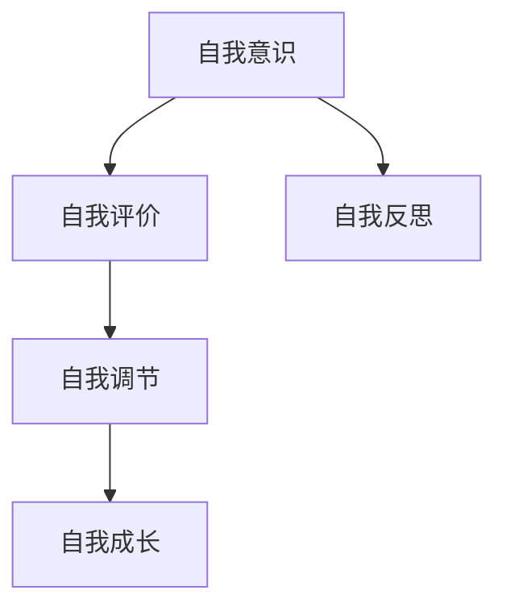

通过这个Mermaid流程图，我们可以更直观地理解自我认知的概念及其相互关系。

### 1.3 生活目标的重要性

生活目标对每个人来说都是至关重要的，它不仅决定了我们的行为和生活方式，还影响着我们的幸福感和成就感。以下是关于生活目标的一些核心概念和特征。

#### 核心概念原理

生活目标是指一个人在生活过程中期望达到的某个状态或成就。这些目标可以是长期的，也可以是短期的，但它们都对我们的人生有着深远的影响。

#### 概念属性特征对比表格

| 概念       | 特征对比                     | 说明                                                         |
| ---------- | ---------------------------- | ------------------------------------------------------------ |
| 长期目标   | 需要较长时间才能实现的目标   | 如：成为顶尖程序员、创业成功等                               |
| 短期目标   | 需要较短时间就能实现的目标   | 如：完成一个项目、学习一项新技能等                           |
| 实际可行   | 具有实现可能性的目标         | 如：设定目标时需要考虑自身条件和外部环境                     |
| 具体明确   | 目标必须具体和明确           | 如：减肥10公斤、阅读50本书等                               |

#### ER实体关系图架构的Mermaid流程图

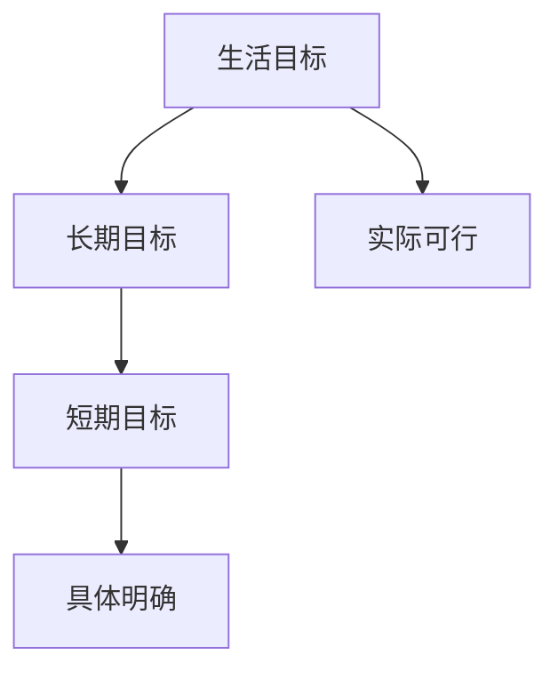

通过这个Mermaid流程图，我们可以更直观地理解生活目标的概念及其特征。

### 1.4 精神的力量

精神的力量是人生乐章中不可或缺的一部分。它不仅影响着我们的心态和情感，还影响着我们的行为和决策。以下是关于精神力量的一些核心概念和特征。

#### 算法原理讲解

精神力量的算法原理可以简化为以下几个方面：

1. **自我激励**：通过自我激励来增强内在动力，如设定奖励机制。
2. **心态调整**：通过调整心态来应对生活中的挑战，如积极心态、心理弹性。
3. **情感管理**：通过情感管理来处理负面情绪，如情绪调节、情感表达。

#### 数学模型和公式

为了更好地理解精神力量的作用，我们可以使用以下数学模型：

$$
精神力量 = 自我激励 \times 心态调整 \times 情感管理
$$

其中，自我激励、心态调整和情感管理分别代表精神力量的三个核心维度。

#### 举例说明

假设一个人在面临工作压力时，他可以通过以下方式提升精神力量：

1. **自我激励**：设定一个小目标，如完成当天的任务，然后给予自己一些小奖励，如看一集喜欢的电视剧。
2. **心态调整**：保持积极的心态，通过自我暗示来提醒自己“我可以做到”。
3. **情感管理**：合理表达自己的情绪，通过与朋友交流或写日记来释放负面情绪。

通过这种方式，他可以更好地应对工作压力，保持良好的精神状态。

总结本章内容，我们可以看到，人生的哲学思考、自我认知、生活目标和精神力量都是人生乐章的重要组成部分。理解这些概念和特征，有助于我们更好地认识自己、设定目标并保持积极的心态。在接下来的章节中，我们将进一步探讨如何谱写个人独特的人生乐章。让我们继续思考，并期待更多精彩的发现。## 第2章: 谱写个人独特的人生乐章

在了解了生命的旋律和人生的基本要素后，现在让我们开始探讨如何谱写个人独特的人生乐章。每个人都有自己独特的生活路径和目标，因此，谱写个人独特的人生乐章不仅是对生命的一种诠释，也是对个人价值和梦想的追求。

### 2.1 确立个人使命

个人的使命是人生乐章的核心，它为我们的生命提供了方向和动力。确立个人使命，就像在茫茫大海中找到一座灯塔，指引我们前进。

#### 问题场景介绍

在一个快速变化的世界中，许多人可能会感到迷茫和不知所措。他们不知道自己的使命是什么，也不知道如何找到方向。这种场景在现代社会中尤为普遍，尤其是在年轻一代中。

#### 项目介绍

为了帮助人们确立个人使命，我们可以开发一个在线平台，这个平台提供了一系列工具和资源，帮助用户进行自我探索和使命定位。

#### 系统功能设计(Mermaid类图)

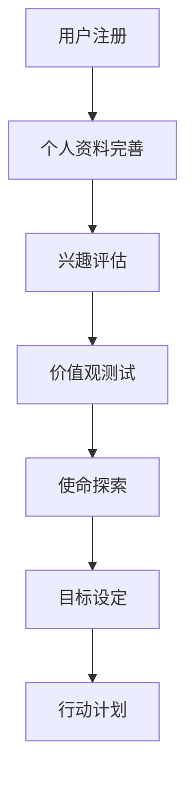

#### 系统架构设计(Mermaid架构图)

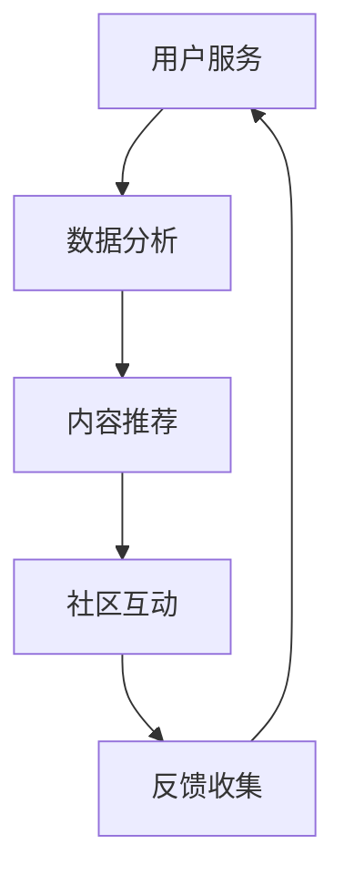

#### 系统接口设计和系统交互(Mermaid序列图)

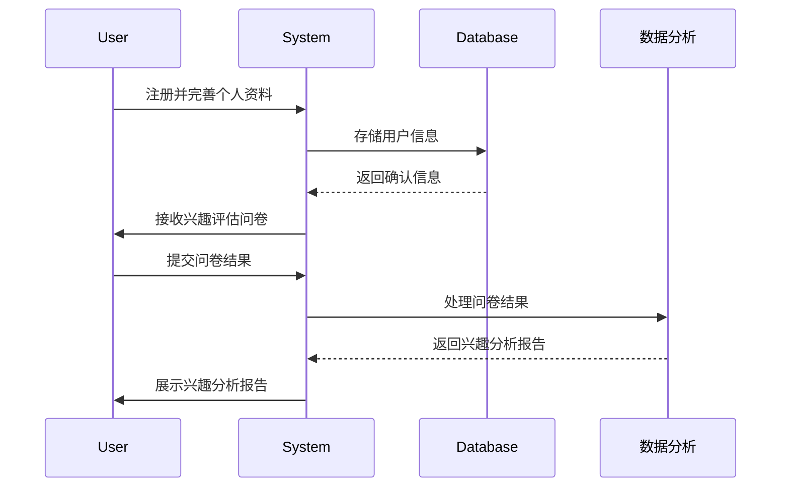

通过上述的设计，我们可以帮助用户更清晰地认识自己的兴趣和价值观，从而更好地确立个人使命。

### 2.2 培养良好的生活习惯

良好的生活习惯是个人成长和成功的重要基石。它不仅影响我们的身体健康，还影响我们的心理状态和社交能力。

#### 算法原理讲解

培养良好生活习惯的算法原理可以归纳为以下几个方面：

1. **目标设定**：明确想要培养的习惯，并将其分解为具体的、可执行的任务。
2. **持续激励**：通过奖励机制和自我激励来保持动力。
3. **行为追踪**：记录习惯的养成过程，以便进行反馈和调整。

#### 数学模型和公式

我们可以使用以下数学模型来描述这个算法：

$$
良好习惯 = 目标设定 \times 持续激励 \times 行为追踪
$$

其中，目标设定、持续激励和行为追踪分别代表习惯养成的三个关键维度。

#### 举例说明

以培养每日阅读30分钟的习惯为例：

1. **目标设定**：设定一个具体的阅读目标，如每日阅读30分钟。
2. **持续激励**：设定奖励机制，如在完成阅读后给自己买一本喜欢的书。
3. **行为追踪**：使用日历或手机应用记录每天的阅读时间，以便进行反馈和调整。

通过这种方式，我们可以有效地培养每日阅读的习惯。

### 2.3 发展个人特长

发展个人特长是个人成长的重要途径，它不仅能够提升个人的竞争力，还能够为个人带来成就感和满足感。

#### 问题场景介绍

在现代社会，许多人在工作中面临着技能单一的挑战，这使得他们在职业发展中遇到瓶颈。因此，如何发展个人特长成为一个重要问题。

#### 项目介绍

为了帮助人们发展个人特长，我们可以开发一个在线学习平台，提供各种专业技能培训课程，并配备导师指导。

#### 系统功能设计(Mermaid类图)

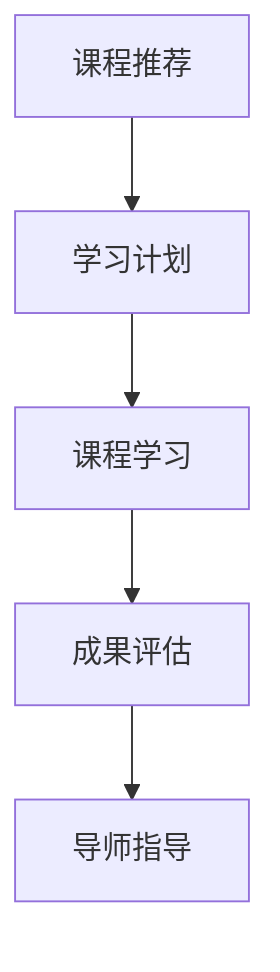

#### 系统架构设计(Mermaid架构图)

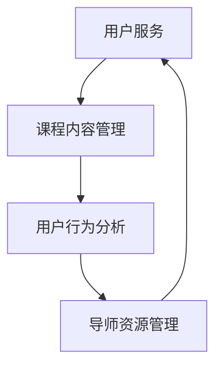

#### 系统接口设计和系统交互(Mermaid序列图)

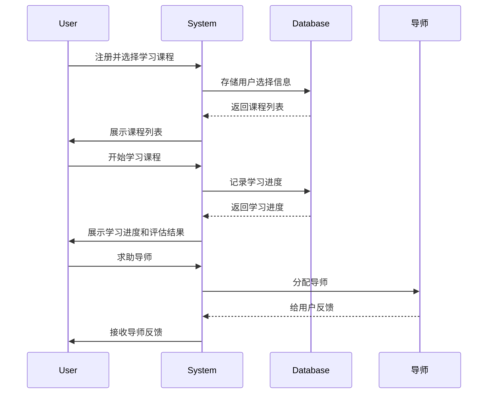

通过这个系统，用户可以根据自己的兴趣和需求选择合适的课程，并通过导师的指导不断提升自己的专业技能。

### 2.4 建立良好的人际关系

人际关系是人生的重要组成部分，它影响着我们的心理健康和幸福感。建立良好的人际关系需要付出努力和时间，但它带来的回报也是巨大的。

#### 算法原理讲解

建立良好人际关系的算法原理可以简化为以下几个方面：

1. **沟通**：有效的沟通是建立良好关系的基础。
2. **信任**：信任是人际关系的核心，它需要通过时间和行动来建立。
3. **互助**：在彼此需要时提供帮助，是加深关系的重要方式。

#### 数学模型和公式

我们可以使用以下数学模型来描述这个算法：

$$
良好人际关系 = 沟通 \times 信任 \times 互助
$$

其中，沟通、信任和互助分别代表关系建立的三个关键维度。

#### 举例说明

以建立与同事的良好关系为例：

1. **沟通**：定期与同事交流工作进展和问题，倾听对方的意见和建议。
2. **信任**：通过履行承诺和保守秘密来建立信任。
3. **互助**：在同事需要帮助时主动提供支持，共同完成任务。

通过这种方式，我们可以建立和维护与同事的良好关系。

总结本章内容，我们可以看到，确立个人使命、培养良好生活习惯、发展个人特长和建立良好人际关系，都是谱写个人独特人生乐章的重要步骤。这些步骤不仅有助于我们更好地理解自己，也为我们的未来提供了明确的方向和动力。在接下来的章节中，我们将继续探讨如何应对挑战和把握机遇，以进一步丰富我们的人生乐章。## 第3章: 挑战与机遇的旋律

在人生的旅途中，我们不可避免地会遇到各种各样的挑战和机遇。这些挑战和机遇，就像人生乐章中的高潮和低谷，它们让我们更加深刻地体会到生命的起伏和变化。如何面对挑战和把握机遇，是每个人都需要思考的重要问题。

### 3.1 面对挫折与困境

挫折和困境是人生中不可避免的组成部分。它们可能会让我们感到痛苦、失落和无助，但同时也是我们成长和进步的重要契机。

#### 问题场景介绍

在职业生涯中，每个人都会遇到挫折和困境。例如，可能是因为项目失败、工作压力增大或者人际关系问题，这些问题可能会对我们的心理和职业发展造成负面影响。

#### 项目介绍

为了帮助人们更好地面对挫折和困境，我们可以开发一款名为“挫折应对助手”的应用程序，它提供一系列工具和资源，帮助用户分析和应对各种挫折和困境。

#### 系统功能设计(Mermaid类图)

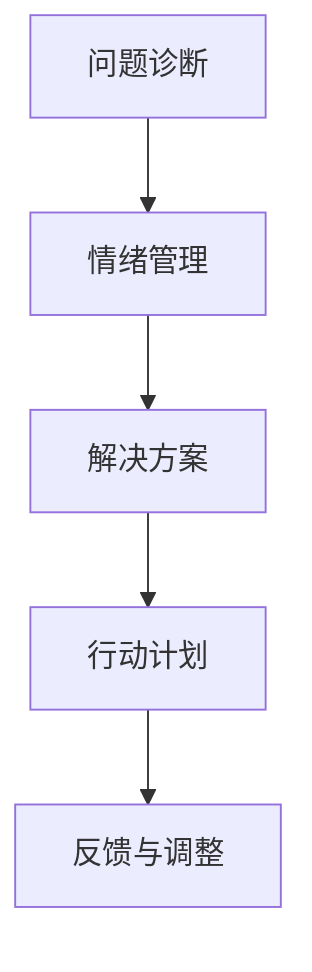

#### 系统架构设计(Mermaid架构图)

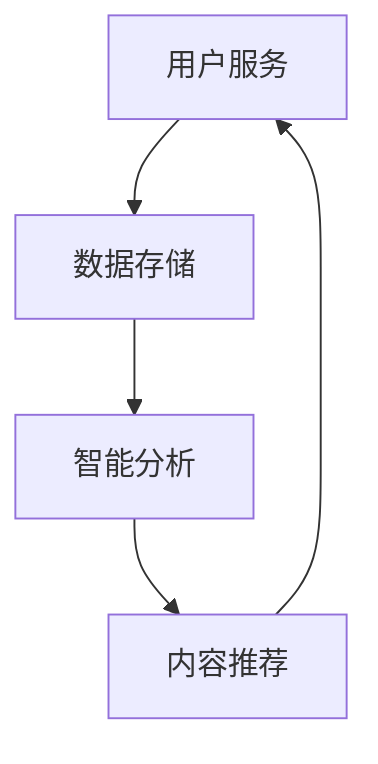

#### 系统接口设计和系统交互(Mermaid序列图)

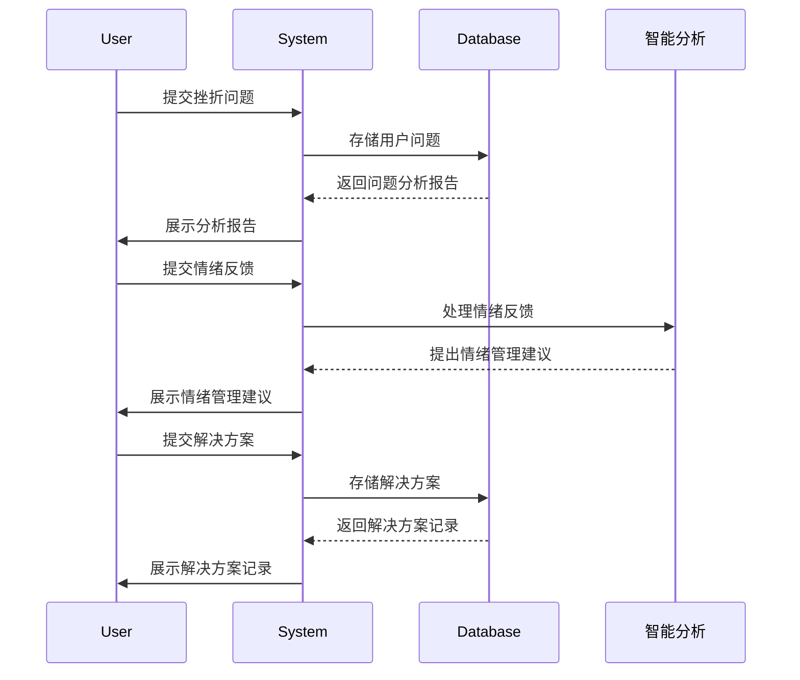

通过这个系统，用户可以更好地了解自己的挫折和困境，并得到有效的解决方案。

### 3.2 把握机遇，迎接未来

机遇是推动个人和事业发展的重要力量。把握机遇，意味着能够更好地实现自己的目标和梦想。

#### 算法原理讲解

把握机遇的算法原理可以简化为以下几个方面：

1. **信息收集**：广泛收集与机遇相关的信息，包括市场动态、行业趋势和个人资源等。
2. **风险评估**：对机遇进行全面的评估，包括潜在的收益和风险。
3. **决策制定**：基于信息和风险评估，制定具体的行动计划。

#### 数学模型和公式

我们可以使用以下数学模型来描述这个算法：

$$
机遇把握 = 信息收集 \times 风险评估 \times 决策制定
$$

其中，信息收集、风险评估和决策制定分别代表把握机遇的三个关键维度。

#### 举例说明

以把握职场机遇为例：

1. **信息收集**：通过行业报告、社交媒体和专业会议等渠道，收集与职场机遇相关的信息。
2. **风险评估**：评估这些机遇的潜在收益和风险，如薪资待遇、职业发展前景和公司稳定性等。
3. **决策制定**：根据评估结果，制定具体的行动计划，如申请职位、参加培训或拓展人脉。

通过这种方式，我们可以更好地把握职场机遇，实现个人职业发展。

### 3.3 终身学习的旋律

终身学习是应对时代变化和保持竞争力的重要手段。它不仅能够提升我们的专业技能，还能够拓宽我们的视野和思维方式。

#### 问题场景介绍

在现代社会，知识更新速度非常快，许多人可能会感到自己的知识体系过时，难以适应新的工作和生活环境。因此，终身学习成为一个紧迫的问题。

#### 项目介绍

为了推动终身学习，我们可以开发一个名为“智慧学习平台”的应用程序，它提供丰富的学习资源、个性化的学习路径和互动的学习社区。

#### 系统功能设计(Mermaid类图)

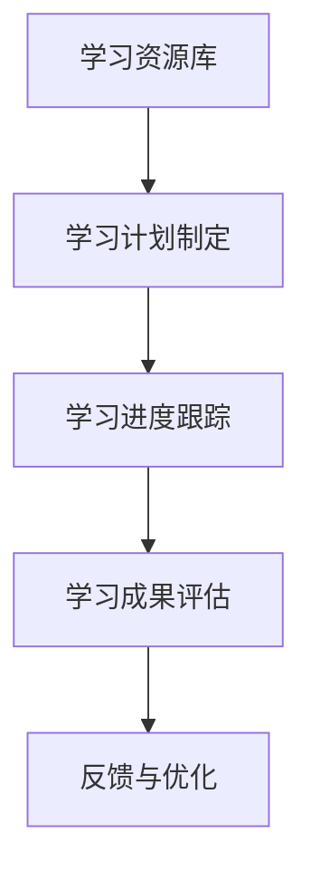

#### 系统架构设计(Mermaid架构图)

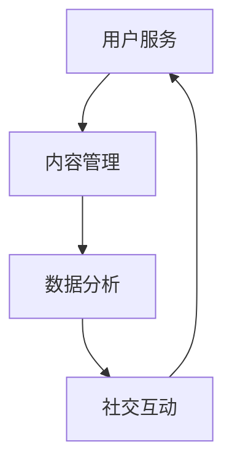

#### 系统接口设计和系统交互(Mermaid序列图)

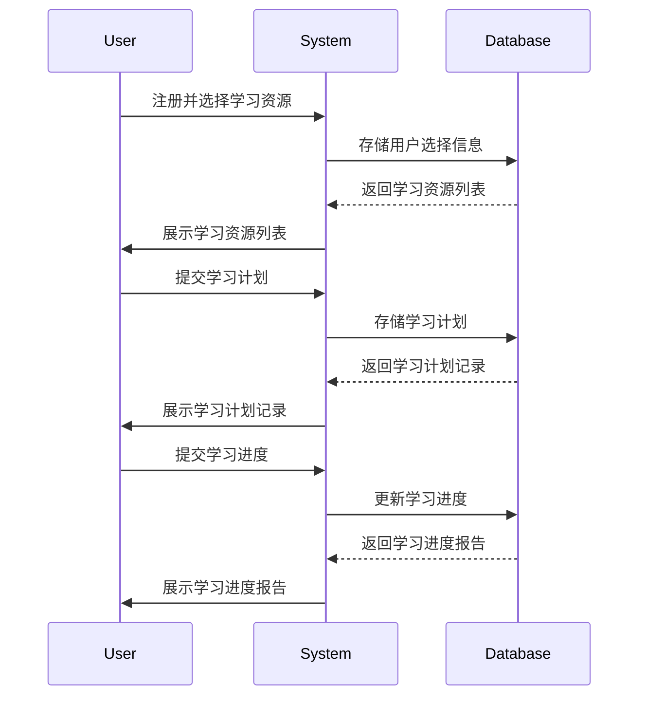

通过这个系统，用户可以方便地获取学习资源，制定个性化学习计划，并跟踪学习进度。

### 3.4 精神世界的丰盈

精神世界的丰盈是人生的重要组成部分，它关系到我们的心理健康和幸福感。一个丰富而充实的精神世界，能够帮助我们更好地应对生活中的挑战和困难。

#### 算法原理讲解

精神世界的丰盈可以通过以下几个方面的算法原理来实现：

1. **心理调适**：通过心理调适来缓解压力和负面情绪。
2. **自我反思**：通过自我反思来提升自我认知和自我价值感。
3. **情感培养**：通过培养积极的情感和情绪，提升生活的质量。

#### 数学模型和公式

我们可以使用以下数学模型来描述这个算法：

$$
精神世界丰盈 = 心理调适 \times 自我反思 \times 情感培养
$$

其中，心理调适、自我反思和情感培养分别代表精神世界丰盈的三个关键维度。

#### 举例说明

以提升自我认知为例：

1. **心理调适**：通过冥想和呼吸练习来缓解压力，保持心理健康。
2. **自我反思**：定期进行自我反思，思考自己的行为、决策和成长，提升自我认知。
3. **情感培养**：通过阅读、写作和艺术创作来培养积极的情感，提升生活的质量。

通过这种方式，我们可以丰富我们的精神世界，提升人生的幸福感。

总结本章内容，我们可以看到，面对挑战与困境、把握机遇、终身学习和精神世界的丰盈，都是谱写个人独特人生乐章的重要部分。这些步骤不仅帮助我们更好地理解自己，也为我们的未来提供了明确的方向和动力。在接下来的章节中，我们将继续探讨如何维护和谐的人际关系，以进一步完善我们的人生乐章。## 第4章: 人际关系的和谐旋律

人际关系是人生中不可或缺的一部分，它们不仅影响我们的心理健康，也影响着我们的生活质量。维护和谐的人际关系，就像是人生乐章中的和谐音符，为我们的生命增添色彩。在这部分，我们将探讨如何通过沟通的艺术、理解与包容、建立和谐的团队以及家庭关系的维护，来谱写和谐的人际关系乐章。

### 4.1 沟通的艺术

沟通是人际关系中最为关键的要素之一。有效的沟通能够帮助我们更好地理解他人，也能够帮助我们更好地表达自己。掌握沟通的艺术，对于维护和谐的人际关系至关重要。

#### 问题场景介绍

在日常工作和生活中，许多人可能会因为沟通不畅而产生误解和冲突。例如，在一个团队项目中，成员之间的沟通不畅可能导致项目进度受阻，甚至影响团队的和谐。

#### 项目介绍

为了提高沟通能力，我们可以开发一款名为“沟通训练助手”的应用程序，它提供一系列沟通技巧训练和互动练习，帮助用户提升沟通能力。

#### 系统功能设计(Mermaid类图)

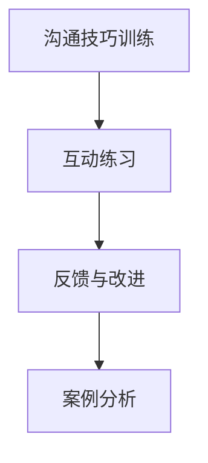

#### 系统架构设计(Mermaid架构图)


#### 系统接口设计和系统交互(Mermaid序列图)

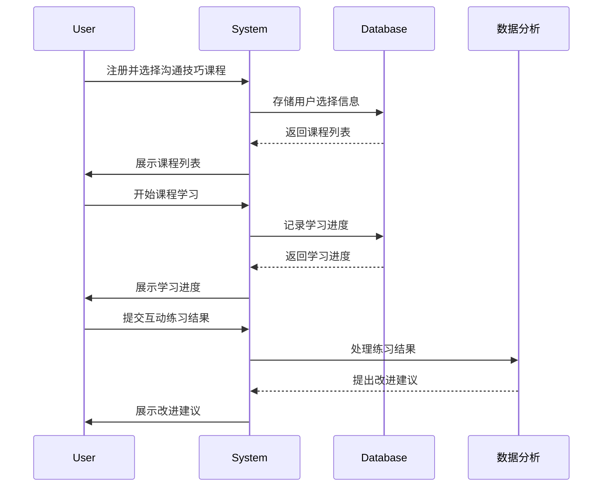

通过这个系统，用户可以系统性地学习沟通技巧，并通过互动练习提升沟通能力。

### 4.2 理解与包容

理解与包容是维护和谐人际关系的重要原则。在人际关系中，理解和包容他人，能够帮助我们减少冲突，增进友谊。

#### 算法原理讲解

理解与包容的算法原理可以简化为以下几个方面：

1. **换位思考**：通过换位思考来理解他人的感受和需求。
2. **宽容对待**：对他人犯的错误或不足持宽容态度，给予理解和原谅。
3. **情感共鸣**：通过情感共鸣来增强与他人的情感联系。

#### 数学模型和公式

我们可以使用以下数学模型来描述这个算法：

$$
理解与包容 = 换位思考 \times 宽容对待 \times 情感共鸣
$$

其中，换位思考、宽容对待和情感共鸣分别代表理解与包容的三个关键维度。

#### 举例说明

在家庭关系中，理解与包容可以帮助家庭成员更好地相处：

1. **换位思考**：在家庭成员遇到困难时，尝试从对方的角度去理解和感受，给予关心和支持。
2. **宽容对待**：对家庭成员的不足和错误持宽容态度，给予改正的机会。
3. **情感共鸣**：通过分享彼此的情感体验，增强家庭成员之间的情感联系。

通过这种方式，我们可以建立更加和谐的家庭关系。

### 4.3 建立和谐的团队

在工作和生活中，团队协作是不可避免的。一个和谐的团队能够提高工作效率，增强团队凝聚力。建立和谐的团队需要每个成员的努力和共同遵守的原则。

#### 问题场景介绍

在一个团队中，成员之间由于个性、背景和工作方式的差异，可能会产生矛盾和冲突。这些矛盾和冲突如果处理不当，会影响团队的整体表现。

#### 项目介绍

为了建立和谐的团队，我们可以开发一款名为“团队协作平台”的应用程序，它提供了一系列协作工具和沟通渠道，帮助团队成员更好地合作。

#### 系统功能设计(Mermaid类图)

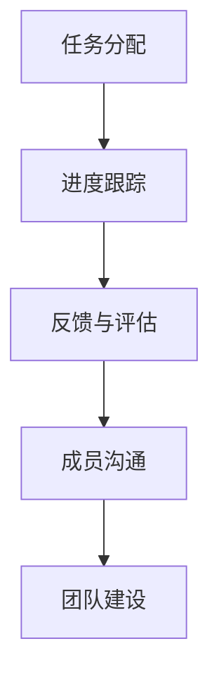

#### 系统架构设计(Mermaid架构图)

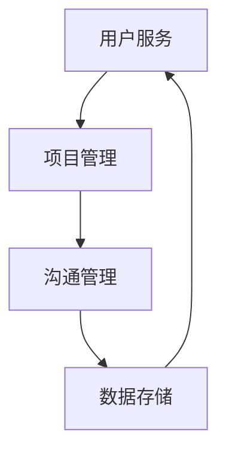

#### 系统接口设计和系统交互(Mermaid序列图)

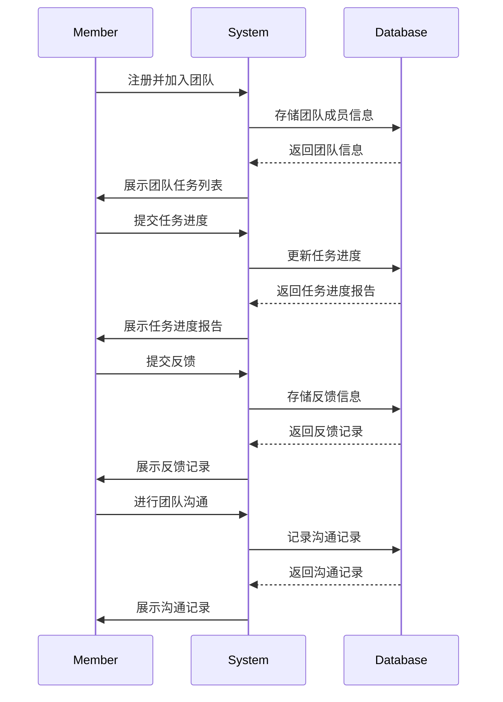

通过这个系统，团队成员可以更好地协作，提高工作效率。

### 4.4 家庭关系的维护

家庭关系是人生中最为重要的关系之一。和谐的家庭关系能够为我们提供情感支持和生活保障，而家庭矛盾的积累则可能导致严重的心理和情感问题。

#### 算法原理讲解

家庭关系的维护可以通过以下几个方面的算法原理来实现：

1. **有效沟通**：通过有效沟通来减少误解和冲突。
2. **共同目标**：建立共同的家庭目标，增强家庭成员之间的联系。
3. **情感支持**：在家庭成员遇到困难时提供情感支持。

#### 数学模型和公式

我们可以使用以下数学模型来描述这个算法：

$$
家庭关系维护 = 有效沟通 \times 共同目标 \times 情感支持
$$

其中，有效沟通、共同目标和情感支持分别代表家庭关系维护的三个关键维度。

#### 举例说明

在家庭中，维护和谐关系可以通过以下方式实现：

1. **有效沟通**：家庭成员之间定期进行沟通，分享彼此的生活和工作情况，及时解决问题。
2. **共同目标**：制定家庭目标和计划，如共同装修房屋、规划假期旅行等，增强家庭成员之间的共同感和归属感。
3. **情感支持**：在家庭成员遇到困难时，给予关心和支持，共同面对挑战。

通过这种方式，我们可以建立和维护和谐的家庭关系。

总结本章内容，我们可以看到，沟通的艺术、理解与包容、建立和谐的团队和家庭关系的维护，都是谱写和谐人际关系乐章的重要部分。这些原则和方法不仅有助于我们更好地理解他人，也为我们的生活和事业提供了重要的支持。在接下来的章节中，我们将继续探讨如何维护身心健康，以进一步完善我们的人生乐章。## 第5章: 健康与幸福的旋律

在生命的乐章中，健康与幸福是不可或缺的旋律。一个健康的身体和愉悦的心灵，不仅能够提升生活质量，还能增强我们面对挑战和机遇的信心。在本章中，我们将探讨如何维护身体健康、心理健康的守护以及培养幸福感。

### 5.1 身体健康的重要性

身体健康是人生的基础，它直接影响我们的生活质量和工作效率。维护身体健康需要我们从饮食、运动、休息等方面进行综合考虑。

#### 问题场景介绍

在现代社会，由于工作压力、不良生活习惯等原因，许多人的身体健康状况堪忧。肥胖、缺乏运动、营养不良等问题普遍存在，这些因素不仅影响身体健康，还可能引发一系列慢性疾病。

#### 项目介绍

为了提高人们的健康意识，我们可以开发一款名为“健康生活助手”的应用程序，它提供个性化的健康建议、饮食计划和运动指导。

#### 系统功能设计(Mermaid类图)

```mermaid
graph TB
    A[健康评估] --> B[饮食计划]
    B --> C[运动指导]
    C --> D[休息建议]
    D --> E[健康报告]
```

#### 系统架构设计(Mermaid架构图)

```mermaid
graph TB
    A[用户服务] --> B[健康数据分析]
    B --> C[内容推荐]
    C --> D[用户反馈]
    D --> A
```

#### 系统接口设计和系统交互(Mermaid序列图)

```mermaid
sequenceDiagram
    participant 用户 as User
    participant 系统 as System
    participant 数据库 as Database

    用户->>系统: 注册并提交健康数据
    系统->>数据库: 存储用户健康数据
    数据库-->>系统: 返回健康评估结果
    系统->>用户: 展示健康评估结果
    用户->>系统: 更新饮食计划
    系统->>数据库: 存储饮食计划
    数据库-->>系统: 返回饮食计划
    系统->>用户: 展示饮食计划
    用户->>系统: 开始运动计划
    系统->>数据库: 存储运动计划
    数据库-->>系统: 返回运动计划
    系统->>用户: 展示运动计划
    用户->>系统: 提交休息建议
    系统->>数据库: 存储休息建议
    数据库-->>系统: 返回休息建议
    系统->>用户: 展示休息建议
```

通过这个系统，用户可以更好地管理自己的健康，制定个性化的健康计划。

### 5.2 心理健康的维护

心理健康是身体健康的重要补充，一个健康的心理状态能够帮助我们更好地应对生活中的压力和挑战。维护心理健康需要我们从情绪管理、心理调适和社交支持等方面进行努力。

#### 算法原理讲解

维护心理健康的算法原理可以简化为以下几个方面：

1. **情绪管理**：通过情绪管理来应对负面情绪，保持心理平衡。
2. **心理调适**：通过心理调适来增强心理弹性，应对生活压力。
3. **社交支持**：通过社交支持来获得情感上的安慰和支持。

#### 数学模型和公式

我们可以使用以下数学模型来描述这个算法：

$$
心理健康维护 = 情绪管理 \times 心理调适 \times 社交支持
$$

其中，情绪管理、心理调适和社交支持分别代表维护心理健康的三个关键维度。

#### 举例说明

以情绪管理为例：

1. **情绪管理**：通过冥想和呼吸练习来缓解压力，保持冷静和理智。
2. **心理调适**：通过自我反思和积极心态来调整自己的情绪状态。
3. **社交支持**：通过与朋友和家人的交流来获得情感上的支持和安慰。

通过这种方式，我们可以更好地维护心理健康。

### 5.3 精神健康的守护

精神健康是心理健康的重要组成部分，它关乎我们的精神状态和幸福感。守护精神健康需要我们从心理健康、精神生活和心灵成长等方面进行关注。

#### 问题场景介绍

在现代社会，由于生活节奏加快、工作压力增大等原因，许多人的精神健康受到威胁。失眠、焦虑、抑郁等问题普遍存在，这些问题不仅影响个人的生活质量，还可能影响人际关系和职业发展。

#### 项目介绍

为了守护精神健康，我们可以开发一款名为“精神健康助手”的应用程序，它提供一系列心理测试、放松练习和心灵成长课程。

#### 系统功能设计(Mermaid类图)

```mermaid
graph TB
    A[心理测试] --> B[放松练习]
    B --> C[心灵成长]
    C --> D[反馈与改进]
```

#### 系统架构设计(Mermaid架构图)

```mermaid
graph TB
    A[用户服务] --> B[内容管理]
    B --> C[数据分析]
    C --> D[社交互动]
    D --> A
```

#### 系统接口设计和系统交互(Mermaid序列图)

```mermaid
sequenceDiagram
    participant 用户 as User
    participant 系统 as System
    participant 数据库 as Database

    用户->>系统: 注册并完成心理测试
    系统->>数据库: 存储测试结果
    数据库-->>系统: 返回测试结果
    系统->>用户: 展示测试结果
    用户->>系统: 开始放松练习
    系统->>数据库: 存储练习记录
    数据库-->>系统: 返回练习记录
    系统->>用户: 展示练习记录
    用户->>系统: 开始心灵成长课程
    系统->>数据库: 存储课程进度
    数据库-->>系统: 返回课程进度
    系统->>用户: 展示课程进度
    用户->>系统: 提交反馈
    系统->>数据库: 存储反馈信息
    数据库-->>系统: 返回反馈记录
    系统->>用户: 展示反馈记录
```

通过这个系统，用户可以更好地了解自己的精神健康状况，并获得专业的指导和帮助。

### 5.4 幸福感的培养

幸福感是生活质量的重要指标，它关乎我们的精神状态和生活满意度。培养幸福感需要我们从积极心态、社会支持和情感连接等方面进行努力。

#### 算法原理讲解

培养幸福感的算法原理可以简化为以下几个方面：

1. **积极心态**：通过积极心态来提升生活满意度。
2. **社会支持**：通过社会支持来获得情感上的安慰和帮助。
3. **情感连接**：通过情感连接来增强人际关系的幸福感。

#### 数学模型和公式

我们可以使用以下数学模型来描述这个算法：

$$
幸福感培养 = 积极心态 \times 社会支持 \times 情感连接
$$

其中，积极心态、社会支持和情感连接分别代表培养幸福感的三个关键维度。

#### 举例说明

以积极心态为例：

1. **积极心态**：通过正念冥想和积极思考来提升心态，保持乐观。
2. **社会支持**：通过与家人、朋友和社区的互动来获得情感上的支持。
3. **情感连接**：通过参与社区活动和志愿服务来增强与他人的情感连接。

通过这种方式，我们可以培养和提升幸福感。

总结本章内容，我们可以看到，身体健康、心理健康、精神健康的守护以及幸福感的培养，都是维护生命质量和幸福的重要方面。通过科学的方法和良好的习惯，我们可以更好地维护自己的健康，提升生活质量。在接下来的章节中，我们将探讨生命的价值和社会贡献，以及如何传承生命的智慧，进一步完善我们的人生乐章。## 第6章: 生命价值的体现

生命的价值不仅仅体现在个人的幸福感和成就上，更在于我们对社会的贡献。一个人的生命价值，在很大程度上是通过他对社会、家庭和人类进步的贡献来体现的。在本章中，我们将探讨生命价值的体现，包括对社会的贡献、生命教育的意义以及如何传承生命的智慧。

### 6.1 对社会的贡献

对社会的贡献是衡量生命价值的重要标准。通过参与社会事务、推动社会进步和解决社会问题，我们可以体现自己的生命价值。

#### 问题场景介绍

在现代社会，随着经济发展和科技进步，社会问题日益复杂。环境污染、资源短缺、社会不平等等问题亟待解决。面对这些问题，每个人都可以通过自己的方式为社会做出贡献。

#### 项目介绍

为了更好地体现生命的价值，我们可以开展一系列社会公益项目，如环境保护行动、扶贫援助计划、科技创新等。

#### 系统功能设计(Mermaid类图)

```mermaid
graph TB
    A[环保行动] --> B[扶贫援助]
    B --> C[科技创新]
    C --> D[社会调研]
    D --> E[成果展示]
```

#### 系统架构设计(Mermaid架构图)

```mermaid
graph TB
    A[社会贡献项目] --> B[资源管理]
    B --> C[数据收集与分析]
    C --> D[成果评估]
    D --> A
```

#### 系统接口设计和系统交互(Mermaid序列图)

```mermaid
sequenceDiagram
    participant 项目发起者 as Initiator
    participant 项目参与者 as Participant
    participant 系统 as System
    participant 数据库 as Database

    Initiator->>系统: 发起环保行动
    系统->>数据库: 存储环保行动信息
    数据库-->>系统: 返回环保行动计划
    系统->>Initiator: 展示环保行动计划
    Initiator->>系统: 启动扶贫援助计划
    系统->>数据库: 存储扶贫援助信息
    数据库-->>系统: 返回扶贫援助计划
    系统->>Initiator: 展示扶贫援助计划
    Initiator->>系统: 开展科技创新项目
    系统->>数据库: 存储科技创新信息
    数据库-->>系统: 返回科技创新计划
    系统->>Initiator: 展示科技创新计划
    Participant->>系统: 加入环保行动
    系统->>数据库: 记录参与者信息
    数据库-->>系统: 返回参与者名单
    系统->>Participant: 接收环保行动通知
    Participant->>系统: 完成扶贫援助任务
    系统->>数据库: 更新扶贫援助进度
    数据库-->>系统: 返回扶贫援助进度
    系统->>Participant: 接收扶贫援助反馈
    Participant->>系统: 参与科技创新
    系统->>数据库: 记录科技创新成果
    数据库-->>系统: 返回科技创新成果
    系统->>Participant: 接收科技创新成果报告
```

通过这个系统，我们可以更好地组织社会公益项目，让更多人参与进来，为社会做出贡献。

### 6.2 生命教育的意义

生命教育是培养个体对生命价值和意义的认识，以及如何在生活中实践这些价值观的教育。它不仅关乎个体的成长，也关乎社会的进步。

#### 算法原理讲解

生命教育的算法原理可以简化为以下几个方面：

1. **价值观培养**：通过培养正确的价值观来引导个体的行为。
2. **生活技能训练**：通过生活技能训练来提升个体的生活能力和独立性。
3. **社会参与**：通过社会参与来增强个体对社会的责任感和归属感。

#### 数学模型和公式

我们可以使用以下数学模型来描述这个算法：

$$
生命教育 = 价值观培养 \times 生活技能训练 \times 社会参与
$$

其中，价值观培养、生活技能训练和社会参与分别代表生命教育的三个关键维度。

#### 举例说明

以培养青少年的责任感为例：

1. **价值观培养**：通过家庭教育和社会教育来培养青少年正确的价值观，如责任感、尊重他人等。
2. **生活技能训练**：通过实践活动和培训课程来提升青少年的生活技能，如时间管理、财务管理等。
3. **社会参与**：通过志愿服务和社区活动来增强青少年对社会的责任感和参与感。

通过这种方式，我们可以培养具有责任感和独立性的青少年，为社会培养合格的公民。

### 6.3 传承生命的智慧

生命的智慧是经过时间和生活积累的宝贵财富，传承这些智慧是提升社会文明和个体生活质量的重要途径。通过教育、实践和文化传承，我们可以实现生命的智慧传递。

#### 问题场景介绍

在现代社会，由于信息爆炸和生活节奏加快，许多人忽视了传统文化的价值，导致生命智慧的传承出现断层。

#### 项目介绍

为了传承生命的智慧，我们可以开展一系列文化传承项目，如传统文化教育、智慧分享平台等。

#### 系统功能设计(Mermaid类图)

```mermaid
graph TB
    A[传统文化教育] --> B[智慧分享平台]
    B --> C[文化体验活动]
    C --> D[传承成果评估]
```

#### 系统架构设计(Mermaid架构图)

```mermaid
graph TB
    A[文化传承项目] --> B[内容管理]
    B --> C[数据分析]
    C --> D[用户互动]
    D --> A
```

#### 系统接口设计和系统交互(Mermaid序列图)

```mermaid
sequenceDiagram
    participant 教育者 as Educator
    participant 学生 as Student
    participant 系统 as System
    participant 数据库 as Database

    Educator->>系统: 注册并开设传统文化课程
    系统->>数据库: 存储课程信息
    数据库-->>系统: 返回课程列表
    系统->>Educator: 展示课程列表
    Educator->>系统: 分享智慧经验
    系统->>数据库: 存储智慧经验
    数据库-->>系统: 返回智慧经验
    系统->>Educator: 展示智慧经验
    Student->>系统: 报名传统文化课程
    系统->>数据库: 记录报名信息
    数据库-->>系统: 返回课程进度
    系统->>Student: 展示课程进度
    Student->>系统: 提交课程作业
    系统->>数据库: 存储作业记录
    数据库-->>系统: 返回作业评分
    系统->>Student: 接收作业评分
    Student->>系统: 参与智慧分享平台
    系统->>数据库: 存储分享内容
    数据库-->>系统: 返回分享内容
    系统->>Student: 展示分享内容
    Student->>系统: 参与文化体验活动
    系统->>数据库: 记录活动参与信息
    数据库-->>系统: 返回活动反馈
    系统->>Student: 接收活动反馈
```

通过这个系统，我们可以有效地传承和传播生命的智慧。

### 6.4 生命的终极意义

生命的终极意义是一个哲学性的问题，不同的人有不同的看法。但无论如何，生命的终极意义在于我们如何去体验和实现它。通过努力实现自己的梦想和目标，通过为社会做出贡献，我们可以找到生命的意义和价值。

#### 算法原理讲解

生命的终极意义的算法原理可以简化为以下几个方面：

1. **自我实现**：通过实现个人的梦想和目标来找到生命的意义。
2. **社会贡献**：通过为社会做出贡献来提升生命的价值。
3. **持续探索**：通过不断学习和成长来拓展生命的意义。

#### 数学模型和公式

我们可以使用以下数学模型来描述这个算法：

$$
生命终极意义 = 自我实现 \times 社会贡献 \times 持续探索
$$

其中，自我实现、社会贡献和持续探索分别代表生命的三个关键维度。

#### 举例说明

以实现个人梦想为例：

1. **自我实现**：通过不断努力和学习，实现个人的梦想，如成为一名音乐家、科学家等。
2. **社会贡献**：通过自己的职业和活动，为社会做出贡献，如开展公益活动、发明新技术等。
3. **持续探索**：通过终身学习和实践，不断探索新的知识和领域，提升自己的能力和智慧。

通过这种方式，我们可以找到和实现生命的终极意义。

总结本章内容，我们可以看到，生命的价值体现在对社会的贡献、生命教育的意义、传承生命的智慧以及生命的终极意义。通过科学的方法和实际行动，我们可以更好地体现自己的生命价值，为社会和人类的发展做出贡献。在接下来的章节中，我们将探讨生命科技的最新进展，以及如何在未来拓展生命的旋律。## 第7章: 拓展生命的旋律

随着科技的飞速发展，生命科技的进步正在不断拓展我们对生命的认知和体验。从基因编辑到人工智能，从虚拟现实到生物打印，这些前沿技术的出现不仅改变了我们的生活，也为我们的生命旋律带来了新的可能性和挑战。在本章中，我们将探讨生命科技的最新进展，以及如何在未来拓展生命的旋律。

### 7.1 生命科技的发展

生命科技的发展涵盖了生物技术、医疗技术、基因工程等多个领域，这些技术的进步正在改变我们对生命和健康的理解。

#### 问题场景介绍

随着人口老龄化和慢性病的增加，医疗系统面临着巨大的压力。同时，环境污染和生活方式的改变也导致了新的健康问题。为了应对这些挑战，生命科技的发展变得至关重要。

#### 项目介绍

为了推动生命科技的发展，我们可以开展一系列科研项目，如基因编辑技术的研究、个性化医疗的应用等。

#### 系统功能设计(Mermaid类图)

```mermaid
graph TB
    A[基因编辑研究] --> B[个性化医疗]
    B --> C[生物打印]
    C --> D[健康监测系统]
    D --> E[科研成果分享]
```

#### 系统架构设计(Mermaid架构图)

```mermaid
graph TB
    A[科研平台] --> B[数据管理]
    B --> C[数据分析]
    C --> D[科研成果发布]
    D --> A
```

#### 系统接口设计和系统交互(Mermaid序列图)

```mermaid
sequenceDiagram
    participant 科研人员 as Researcher
    participant 系统 as System
    participant 数据库 as Database

    Researcher->>系统: 提交基因编辑研究数据
    系统->>数据库: 存储研究数据
    数据库-->>系统: 返回数据记录
    系统->>Researcher: 展示数据记录
    Researcher->>系统: 开始个性化医疗项目
    系统->>数据库: 存储项目信息
    数据库-->>系统: 返回项目进度
    系统->>Researcher: 展示项目进度
    Researcher->>系统: 开展生物打印实验
    系统->>数据库: 存储实验数据
    数据库-->>系统: 返回实验结果
    系统->>Researcher: 展示实验结果
    Researcher->>系统: 提交健康监测数据
    系统->>数据库: 存储健康数据
    数据库-->>系统: 返回健康报告
    系统->>Researcher: 展示健康报告
    Researcher->>系统: 分享科研成果
    系统->>数据库: 存储科研成果
    数据库-->>系统: 返回科研成果列表
    系统->>Researcher: 展示科研成果列表
```

通过这个系统，科研人员可以方便地管理和分享研究成果，推动生命科技的发展。

### 7.2 人工智能在生命科技中的应用

人工智能（AI）在生命科技中的应用正在迅速扩展，从疾病预测到个性化治疗，AI正在改变医疗行业的方方面面。

#### 问题场景介绍

传统的医疗诊断和治疗方法往往依赖于医生的经验和知识，这种模式在处理复杂病例时可能会存在局限性。而人工智能可以通过大数据分析和算法优化，提供更加精准和高效的诊断和治疗建议。

#### 项目介绍

为了推动人工智能在生命科技中的应用，我们可以开发一款名为“智能医疗助手”的应用程序，它利用AI技术提供疾病预测、个性化治疗建议和健康监测等功能。

#### 系统功能设计(Mermaid类图)

```mermaid
graph TB
    A[疾病预测] --> B[个性化治疗]
    B --> C[健康监测]
    C --> D[智能咨询]
    D --> E[数据管理]
```

#### 系统架构设计(Mermaid架构图)

```mermaid
graph TB
    A[AI平台] --> B[数据存储]
    B --> C[数据处理]
    C --> D[模型训练]
    D --> A
```

#### 系统接口设计和系统交互(Mermaid序列图)

```mermaid
sequenceDiagram
    participant 用户 as User
    participant 系统 as System
    participant 数据库 as Database

    User->>系统: 提交健康数据
    系统->>数据库: 存储用户健康数据
    数据库-->>系统: 返回健康评估结果
    系统->>User: 展示健康评估结果
    User->>系统: 提交疾病症状
    系统->>数据库: 存储症状信息
    数据库-->>系统: 返回疾病预测结果
    系统->>User: 展示疾病预测结果
    User->>系统: 获取个性化治疗建议
    系统->>数据库: 存储治疗数据
    数据库-->>系统: 返回治疗建议
    系统->>User: 展示治疗建议
    User->>系统: 进行健康监测
    系统->>数据库: 记录监测数据
    数据库-->>系统: 返回监测报告
    系统->>User: 展示监测报告
```

通过这个系统，用户可以方便地获取健康评估、疾病预测和个性化治疗建议，提高健康管理水平。

### 7.3 虚拟现实与生命科技的结合

虚拟现实（VR）技术的进步正在改变我们的生活和体验方式。在生命科技领域，VR技术可以用于模拟医疗手术、康复训练、心理健康治疗等，提供更加直观和沉浸式的体验。

#### 问题场景介绍

传统的医疗手术和康复训练往往需要真实的环境和设备，这在某些情况下可能存在局限性。而VR技术可以为医疗和康复提供一种全新的解决方案。

#### 项目介绍

为了推动VR技术在生命科技中的应用，我们可以开发一款名为“VR医疗康复系统”的应用程序，它提供虚拟手术模拟、康复训练和心理治疗等功能。

#### 系统功能设计(Mermaid类图)

```mermaid
graph TB
    A[虚拟手术模拟] --> B[康复训练]
    B --> C[心理健康治疗]
    C --> D[数据记录与分析]
    D --> E[系统管理]
```

#### 系统架构设计(Mermaid架构图)

```mermaid
graph TB
    A[VR系统] --> B[数据管理]
    B --> C[虚拟场景生成]
    C --> D[用户交互]
    D --> A
```

#### 系统接口设计和系统交互(Mermaid序列图)

```mermaid
sequenceDiagram
    participant 医生 as Doctor
    participant 患者 as Patient
    participant 系统 as System
    participant 数据库 as Database

    Doctor->>系统: 模拟手术
    系统->>数据库: 存储手术模拟数据
    数据库-->>系统: 返回手术模拟结果
    系统->>Doctor: 展示手术模拟结果
    Doctor->>系统: 开康复训练
    系统->>数据库: 存储康复训练数据
    数据库-->>系统: 返回康复训练计划
    系统->>Doctor: 展示康复训练计划
    Patient->>系统: 开始康复训练
    系统->>数据库: 记录康复训练进度
    数据库-->>系统: 返回康复训练进度
    系统->>Patient: 展示康复训练进度
    Patient->>系统: 进行心理健康治疗
    系统->>数据库: 存储治疗数据
    数据库-->>系统: 返回治疗建议
    系统->>Patient: 展示治疗建议
    Doctor->>系统: 分析治疗数据
    系统->>数据库: 存储分析结果
    数据库-->>系统: 返回分析结果
    系统->>Doctor: 展示分析结果
```

通过这个系统，医生和患者可以更方便地进行手术模拟、康复训练和心理治疗，提高治疗效果。

### 7.4 生物打印技术的未来

生物打印技术（Bioprinting）是一种新兴的打印技术，它使用生物材料打印出具有生物活性的组织或器官。这项技术的未来潜力巨大，有望在医疗领域产生重大变革。

#### 问题场景介绍

器官移植是治疗许多疾病的重要手段，但供体器官的短缺和移植手术的复杂性限制了其广泛应用。生物打印技术提供了一种可能的解决方案，通过打印出个性化的器官，可以大大提高移植的成功率和效率。

#### 项目介绍

为了推动生物打印技术的发展，我们可以开展一系列研究项目，如生物材料的研究、生物打印机的开发等。

#### 系统功能设计(Mermaid类图)

```mermaid
graph TB
    A[生物材料研究] --> B[生物打印机开发]
    B --> C[器官打印]
    C --> D[生物兼容性测试]
    D --> E[临床应用研究]
```

#### 系统架构设计(Mermaid架构图)

```mermaid
graph TB
    A[生物打印研究平台] --> B[数据管理]
    B --> C[生物材料库]
    C --> D[生物打印机控制]
    D --> A
```

#### 系统接口设计和系统交互(Mermaid序列图)

```mermaid
sequenceDiagram
    participant 研究员 as Researcher
    participant 系统 as System
    participant 数据库 as Database

    Researcher->>系统: 提交生物材料数据
    系统->>数据库: 存储生物材料数据
    数据库-->>系统: 返回生物材料信息
    系统->>Researcher: 展示生物材料信息
    Researcher->>系统: 开始生物打印机开发
    系统->>数据库: 存储打印机开发数据
    数据库-->>系统: 返回打印机开发进度
    系统->>Researcher: 展示打印机开发进度
    Researcher->>系统: 进行器官打印实验
    系统->>数据库: 存储实验数据
    数据库-->>系统: 返回实验结果
    系统->>Researcher: 展示实验结果
    Researcher->>系统: 进行生物兼容性测试
    系统->>数据库: 存储测试数据
    数据库-->>系统: 返回测试结果
    系统->>Researcher: 展示测试结果
    Researcher->>系统: 开展临床应用研究
    系统->>数据库: 存储临床研究数据
    数据库-->>系统: 返回临床研究结果
    系统->>Researcher: 展示临床研究结果
```

通过这个系统，研究人员可以更有效地进行生物打印技术的研究和开发，推动这项技术的临床应用。

总结本章内容，我们可以看到，生命科技的进步正在不断拓展我们的认知和体验，为生命的旋律带来了新的旋律。从基因编辑到人工智能，从虚拟现实到生物打印，这些前沿技术的应用不仅提高了我们的生活质量，也为未来的医疗和健康管理提供了新的可能性。在未来的发展中，我们需要继续探索和利用这些技术，以实现更加美好和充实的人生。## 总结

在这篇技术博客中，我们系统地探讨了生命的旋律以及如何谱写个人独特的人生乐章。从了解生命的旋律，到面对挑战与机遇，再到维护和谐的人际关系和身心健康，我们逐步分析了每一个关键环节。这不仅帮助我们更好地理解了生命的本质，也为我们的未来提供了宝贵的指导和启示。

### 最佳实践 tips

1. **设定明确的目标**：无论是个人发展还是职业规划，设定明确的目标是成功的第一步。确保目标具体、可衡量、可实现、相关性强和时间限定性。

2. **保持终身学习**：在快速变化的世界中，持续学习和更新知识是保持竞争力的关键。利用在线课程、研讨会和读书会等资源，不断提升自己。

3. **有效沟通**：沟通是人际关系中最重要的技能之一。学会倾听、表达和解决冲突，能够帮助我们更好地与他人合作和建立联系。

4. **关注身心健康**：健康和幸福是生活质量的基础。定期进行体检、保持适度的运动和充足的睡眠，同时关注心理健康，是保持活力和创造力的关键。

5. **积极参与社会活动**：参与社会公益活动和志愿服务，不仅能够提升自己的社会责任感，也能够为社会做出贡献。

### 小结

生命是一首旋律，每个人都是这旋律中的创作者。通过明确目标、持续学习、有效沟通、关注身心健康和积极参与社会活动，我们可以更好地谱写自己的生命乐章。在这个过程中，我们不仅实现了个人的成长和进步，也为社会和人类的发展做出了贡献。

### 注意事项

1. **保持平衡**：在追求个人目标的同时，要注意保持生活和工作之间的平衡，避免过度劳累。

2. **适应变化**：世界在不断变化，我们需要保持灵活和适应性，以应对不断出现的新挑战。

3. **持续反思**：定期反思自己的行为和决策，及时调整和改进，以实现更好的自我。

### 拓展阅读

1. **《深度工作》**：作者Cal Newport详细介绍了如何在信息泛滥的时代保持专注和生产力。
2. **《非暴力沟通》**：作者马歇尔·卢森堡介绍了如何通过非暴力沟通技巧建立和谐的人际关系。
3. **《人类简史》**：作者尤瓦尔·赫拉利从宏观角度探讨了人类历史的发展和未来趋势。

通过阅读这些书籍，我们可以获得更多关于个人成长和社会发展的深刻见解。让我们继续探索和拓展生命的旋律，共同谱写属于我们自己的精彩乐章。作者：AI天才研究院/AI Genius Institute & 禅与计算机程序设计艺术 /Zen And The Art of Computer Programming。

