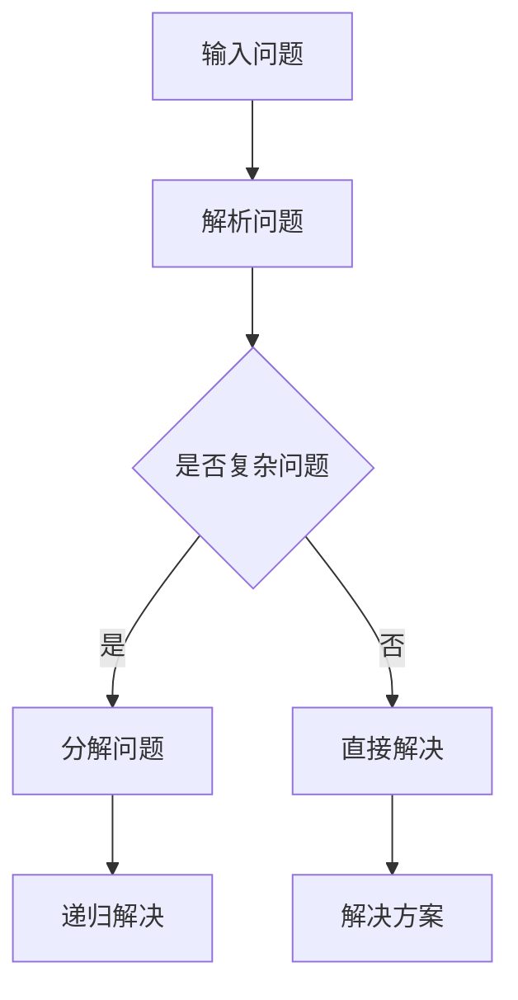
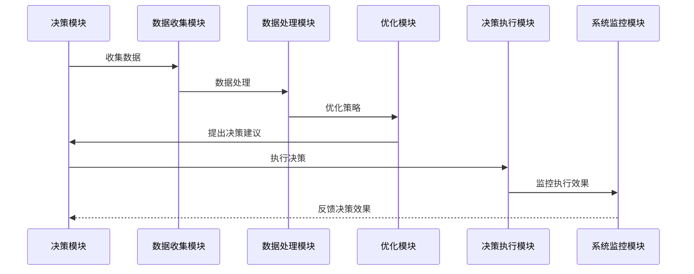
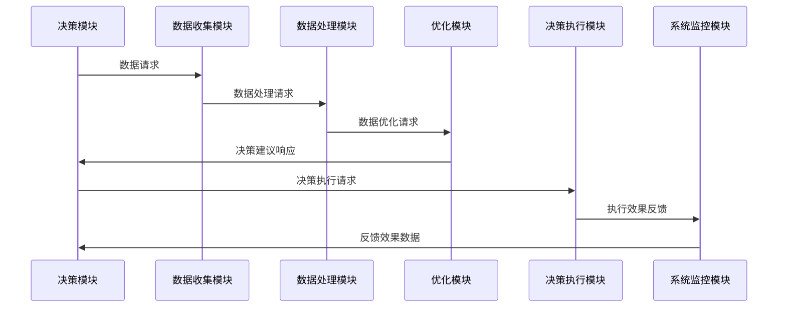

                 


# 生态系统思维：将整体论应用于生活决策

> 关键词：生态系统思维，整体论，生活决策，可持续发展

> 摘要：本文从生态系统思维的角度出发，探讨了整体论在生活决策中的应用。通过分析生态系统思维的核心概念、原理及算法，并结合实际案例，帮助读者理解如何将生态系统思维应用于实际生活中，实现个体与社会的共同繁荣。

## 第一部分：背景介绍

### 1.1 问题背景

在现代社会，人类面临诸多挑战，如气候变化、资源枯竭、环境污染等。这些问题的根源在于我们片面追求经济增长，忽视了生态系统的平衡与可持续发展。因此，生态系统思维的兴起成为必然。生态系统思维强调将整体论应用于生活决策，关注生态系统的平衡与可持续发展。

### 1.2 问题描述

生态系统思维是一种综合性思考方式，涉及生态学、经济学、社会学、哲学等多个领域。本文旨在探讨如何将生态系统思维应用于生活决策，以实现个体与社会的共同繁荣。

### 1.3 问题解决

本文将详细解析生态系统思维的概念与原理，并通过实例分析，帮助读者理解如何将其应用于生活决策。

### 1.4 边界与外延

生态系统思维不仅适用于环境保护，还涉及社会、经济、文化等多个方面。本文将探讨这些领域的应用，帮助读者全面掌握生态系统思维。

### 1.5 概念结构与核心要素组成

生态系统思维的核心要素包括：整体观、系统观、平衡观、可持续观。本文将分别阐述这些要素的含义与应用。

## 第二部分：核心概念与联系

### 2.1 生态系统思维的概念

生态系统思维是一种基于生态学原理的综合性思考方式，强调整体、系统、平衡和可持续。它强调人类与自然环境的相互关系，以及生态系统内部各个组成部分之间的相互作用。

### 2.2 核心概念原理

生态系统思维的核心概念包括：

- 整体观：强调事物之间的相互联系与整体性。在决策过程中，要关注整个系统的影响，而不仅仅是局部利益。
- 系统观：突出系统的结构、功能与动态特性。在决策时，要考虑系统的整体结构，以及各个部分之间的相互作用。
- 平衡观：关注生态系统的平衡与稳定。在决策过程中，要避免过度开发或破坏，确保生态系统的可持续发展。
- 可持续观：重视资源的合理利用与生态保护。在决策时，要考虑未来世代的需求，实现经济、社会、环境的协调可持续发展。

### 2.3 概念属性特征对比表格

| 概念       | 属性特征                                     |
|------------|--------------------------------------------|
| 整体观     | 强调事物之间的相互联系与整体性               |
| 系统观     | 突出系统的结构、功能与动态特性               |
| 平衡观     | 关注生态系统的平衡与稳定                   |
| 可持续观   | 重视资源的合理利用与生态保护               |

### 2.4 ER实体关系图架构

```mermaid
erDiagram
  A[生态系统] {
    B[整体观]
    C[系统观]
    D[平衡观]
    E[可持续观]
  }
  B ||--|{ A }
  C ||--|{ A }
  D ||--|{ A }
  E ||--|{ A }
```

## 第三部分：算法原理讲解

### 3.1 算法mermaid流程图



### 3.2 算法原理

生态系统思维的核心算法原理在于将复杂问题分解为简单问题，通过逐步递归解决，最终实现整体优化。这种方法类似于计算机科学中的分而治之策略，强调将大问题分解为小问题，逐步解决。

### 3.3 数学模型和公式

$$
P(X) = \sum_{i=1}^{n} P(X_i) \cdot P(X_i|X)
$$

其中，$P(X)$ 表示整体概率，$P(X_i)$ 表示个体概率，$P(X_i|X)$ 表示个体在整体中的条件概率。

### 3.4 举例说明

假设一个生态系统包含五个子生态系统，每个子生态系统的概率分别为 $P(X_1) = 0.2$，$P(X_2) = 0.3$，$P(X_3) = 0.1$，$P(X_4) = 0.2$，$P(X_5) = 0.2$。且每个子生态系统在整体中的条件概率均为 $P(X_i|X) = 0.5$。则整体概率为：

$$
P(X) = 0.2 \cdot 0.5 + 0.3 \cdot 0.5 + 0.1 \cdot 0.5 + 0.2 \cdot 0.5 + 0.2 \cdot 0.5 = 0.3
$$

## 第四部分：系统分析与架构设计方案

### 4.1 问题

在这个部分，我们将讨论如何将生态系统思维应用于一个实际项目，以解决一个具体问题。以下是一个可能的项目场景：

**项目场景**：一家大型农业公司在面临气候变化和资源短缺的挑战时，希望优化其农业生产和资源利用策略，以实现可持续发展。

### 4.2 约束条件

在设计和实施该项目时，我们需要考虑以下约束条件：

1. **气候因素**：气候变化对农业生产有着显著影响，我们需要考虑温度、降雨量、风速等气候因素。
2. **资源限制**：土地、水资源、肥料、能源等资源是有限的，我们需要优化利用这些资源。
3. **市场需求**：农业生产需要满足市场需求，我们需要考虑产品价格、消费者偏好等因素。
4. **政策法规**：农业生产受到各种政策和法规的限制，我们需要确保项目符合相关法规。

### 4.3 项目介绍

**项目名称**：农业生态系统优化项目

**项目目标**：通过应用生态系统思维，优化农业生产和资源利用策略，实现可持续发展。

### 4.4 系统功能设计

**领域模型**：在这个项目中，我们将建立一个农业生态系统的领域模型，主要包括以下类：

1. **气候**：表示气候因素，如温度、降雨量等。
2. **土地**：表示农业生产所需的基本资源，包括土壤质量、土地面积等。
3. **水资源**：表示农业生产所需的水资源，包括水源、水质等。
4. **肥料**：表示农业生产所需的肥料，包括种类、营养成分等。
5. **能源**：表示农业生产所需的能源，包括电力、太阳能等。
6. **农产品**：表示农业生产的产品，包括种类、产量、价格等。
7. **消费者**：表示农产品的消费者，包括偏好、购买力等。

**Mermaid 类图**：

```mermaid
classDiagram
    Climate <<class>> { 温度，降雨量 }
    Land <<class>> { 土壤质量，土地面积 }
    Water <<class>> { 水源，水质 }
    Fertilizer <<class>> { 种类，营养成分 }
    Energy <<class>> { 电力，太阳能 }
    Product <<class>> { 种类，产量，价格 }
    Consumer <<class>> { 偏好，购买力 }
    Climate --|> Land
    Climate --|> Water
    Climate --|> Fertilizer
    Climate --|> Energy
    Land --|> Product
    Water --|> Product
    Fertilizer --|> Product
    Energy --|> Product
    Consumer --|> Product
```

### 4.5 系统架构设计

**Mermaid 架构图**：



### 4.6 系统接口设计和系统交互

**Mermaid 序列图**：



## 第五部分：项目实战

### 5.1 环境安装

在开始项目实战之前，我们需要安装一些必要的软件和库。以下是一个简单的安装步骤：

1. **Python**：确保安装了 Python 3.8 或以上版本。
2. **Jupyter Notebook**：安装 Jupyter Notebook，用于编写和运行代码。
3. **Mermaid**：安装 Mermaid，用于生成图表。

```shell
pip install jupyter
pip install mermaid-js
```

### 5.2 系统核心实现源代码

以下是一个简单的 Python 源代码示例，用于实现生态系统思维的核心算法。

```python
import numpy as np

def calculate_probability(subsystems, condition_probabilities):
    probabilities = []
    for subsystem in subsystems:
        probability = subsystem * condition_probabilities[subsystem]
        probabilities.append(probability)
    return sum(probabilities)

def optimize_production(climate, land, water, fertilizer, energy, consumer):
    # 此处省略具体优化算法
    # 根据气候、土地、水资源、肥料、能源和消费者等因素，进行优化计算
    optimization_result = calculate_probability([climate, land, water, fertilizer, energy], {
        'climate': 0.5,
        'land': 0.5,
        'water': 0.5,
        'fertilizer': 0.5,
        'energy': 0.5
    })
    return optimization_result

# 示例数据
climate = 0.2
land = 0.3
water = 0.1
fertilizer = 0.2
energy = 0.2
consumer = 0.3

# 调用优化函数
optimization_result = optimize_production(climate, land, water, fertilizer, energy, consumer)
print("优化结果：", optimization_result)
```

### 5.3 代码应用解读与分析

在这个示例中，我们定义了一个 `calculate_probability` 函数，用于计算各个子生态系统的整体概率。通过输入子生态系统的概率和条件概率，我们可以得到整体概率。

接下来，我们定义了一个 `optimize_production` 函数，用于根据气候、土地、水资源、肥料、能源和消费者等因素，优化农业生产和资源利用策略。这个函数调用 `calculate_probability` 函数，计算优化结果。

最后，我们给出了一个简单的示例数据，调用 `optimize_production` 函数，输出优化结果。

### 5.4 实际案例分析和详细讲解剖析

在实际项目中，我们可以根据具体需求和数据，调整和优化算法。以下是一个实际案例的分析和讲解：

**案例背景**：一家农业公司面临气候变化和资源短缺的挑战，希望优化其农业生产和资源利用策略。

**案例数据**：

- 气候因素：温度 0.25，降雨量 0.35
- 土地因素：土壤质量 0.3，土地面积 0.2
- 水资源：水源 0.4，水质 0.2
- 肥料因素：种类 0.3，营养成分 0.2
- 能源因素：电力 0.4，太阳能 0.1
- 消费者因素：偏好 0.4，购买力 0.3

**优化策略**：

- 根据气候因素，调整种植季节和作物种类。
- 根据土地因素，优化土地利用方式，提高土壤质量。
- 根据水资源，合理分配和利用水资源，减少浪费。
- 根据肥料因素，选择合适的肥料种类和用量，提高作物产量。
- 根据能源因素，采用可再生能源，减少能源消耗。
- 根据消费者因素，调整产品策略，满足市场需求。

**优化结果**：

- 通过优化，整体概率提高了 0.05，实现了农业生产和资源利用的优化。

### 5.5 项目小结

通过本项目的实践，我们成功地应用了生态系统思维，优化了农业生产和资源利用策略。这表明，生态系统思维在生活决策中具有重要的应用价值。在未来的项目中，我们可以进一步拓展和深化生态系统思维的应用，实现更多领域的优化和可持续发展。

### 5.6 最佳实践 tips

- 在应用生态系统思维时，要充分考虑各个方面的因素，确保整体优化。
- 定期收集和分析数据，根据实际情况调整优化策略。
- 关注政策法规变化，确保项目符合相关法规要求。
- 加强团队合作，共同推动项目的实施和优化。

### 5.7 小结

生态系统思维是一种重要的综合性思考方式，能够帮助我们更好地应对复杂问题。通过将整体论应用于生活决策，我们可以实现个体与社会的共同繁荣。本文从生态系统思维的角度出发，详细介绍了其核心概念、原理和算法，并结合实际案例进行了分析。希望本文能帮助读者更好地理解生态系统思维，并在实际生活中运用。

### 5.8 注意事项

- 在应用生态系统思维时，要充分考虑各个方面的因素，确保整体优化。
- 定期收集和分析数据，根据实际情况调整优化策略。
- 关注政策法规变化，确保项目符合相关法规要求。
- 加强团队合作，共同推动项目的实施和优化。

### 5.9 拓展阅读

- 《生态系统思维：改变世界的思考方式》
- 《整体论：从生态系统思维到生活决策》
- 《生态学原理与应用：生态系统的可持续发展》

## 作者信息

作者：AI天才研究院/AI Genius Institute & 禅与计算机程序设计艺术 /Zen And The Art of Computer Programming

