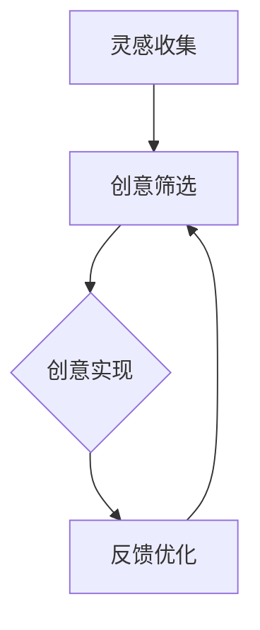
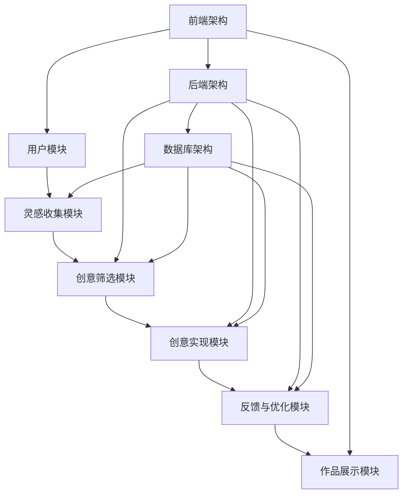
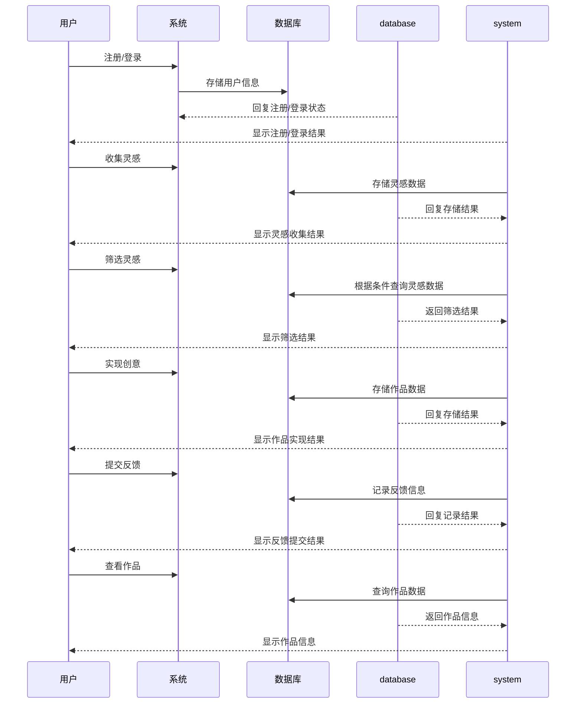

                 

# 引言：生活艺术家养成的重要性

在生活中，我们常常感到日常的琐碎和平凡，似乎缺少了一些色彩和创意。然而，你是否曾想过，平凡的生活也可以通过创意表达变得丰富多彩？《生活艺术家养成：将平凡日常转化为创意表达》这本书，正是为我们揭示了这个奇妙世界的钥匙。让我们先来思考以下几个问题：

- 为什么有些人能够将平凡的生活过得有滋有味？
- 如何在日常生活中找到灵感和创意？
- 如何将创意转化为实际的生活艺术？

答案是，生活艺术家不仅仅是那些在艺术领域有所成就的人，而是那些能够从日常生活中发现美、创造美的人。他们通过创意表达，将平凡的日常转化为独特且有意义的艺术体验。这本书的核心思想就是帮助我们成为这样的生活艺术家。

本文将逐步引导你理解生活艺术家的概念，探索如何将平凡日常转化为创意表达。我们将会：

1. 介绍问题背景和核心概念。
2. 分析核心概念及其联系。
3. 详细讲解创意表达算法原理。
4. 展示系统分析与架构设计方案。
5. 通过实际项目实战来巩固所学。
6. 提供最佳实践 tips 和拓展阅读资源。

让我们一起踏上这场探索之旅，发现生活中的无限创意吧！

## 关键词

生活艺术家、创意表达、日常转化、艺术体验、灵感收集、创意实践。

## 摘要

《生活艺术家养成：将平凡日常转化为创意表达》旨在帮助读者理解并实践如何将日常生活中的琐碎转变为独特的艺术体验。书中首先介绍了生活艺术家这一概念，探讨了他们的特征和养成路径。随后，详细讲解了创意表达的定义、类型及其价值。接着，通过算法原理、数学模型和具体案例分析，深入剖析了将平凡日常转化为创意表达的方法。文章最后提供了实际项目实战、最佳实践 tips 以及拓展阅读资源，帮助读者深入理解和实践生活艺术。本文旨在激发读者的创造力，让他们在日常生活中找到乐趣，成为真正的生活艺术家。

## 第1章: 问题背景与核心概念介绍

### 1.1. 问题背景

#### 1.1.1. 日常生活中的创意表达需求

在现代社会，人们的生活节奏越来越快，日常琐事占据了大量的时间。然而，这些看似平凡的生活片段中，往往蕴含着无限的创意潜力。无论是家庭生活中的装饰与布置，还是工作间歇的小憩时光，我们都可以通过创意表达来赋予其独特的意义和色彩。

创意表达不仅仅是艺术创作，它是一种生活方式的体现。通过创意表达，我们可以在忙碌中找到乐趣，在平凡中发现美好。例如，家庭装饰可以不仅仅是简单的摆设，而是通过独特的布局和创意的搭配，营造出一种温馨而有趣的生活氛围。工作间隙的小憩，可以不是单纯地休息，而是通过绘画、写作或其他形式的创作，激发思维的活力。

#### 1.1.2. 艺术家养成的价值

成为生活艺术家不仅仅是追求艺术成就，更是提升生活质量的一种方式。生活艺术家养成的价值体现在以下几个方面：

1. **心理放松**：在繁忙的生活中，创意表达可以帮助人们暂时放下压力，通过创造性的活动来缓解心理疲劳。
2. **自我认知**：通过不断地进行创意表达，人们可以更好地认识自己，发现自己的兴趣和潜能。
3. **社交互动**：创意表达不仅是个人行为，还可以成为与他人交流的桥梁，促进社交互动和人际关系的发展。
4. **生活品质**：创意表达能够提升生活的品质，让日常环境更加舒适和有趣，从而提高整体幸福感。

#### 1.1.3. 本书解决的问题与目标

本书旨在解决以下几个核心问题：

- 如何在日常生活中发现创意和灵感？
- 如何将创意转化为实际的生活艺术？
- 如何通过创意表达提升生活品质和幸福感？

本书的目标是帮助读者：

1. **理解生活艺术家的概念**：通过介绍生活艺术家的特征和养成路径，让读者对这一概念有更深入的认识。
2. **掌握创意表达的方法**：通过详细讲解创意表达的算法原理和数学模型，让读者掌握将平凡日常转化为创意表达的方法和技巧。
3. **实际应用**：通过项目实战，让读者将所学知识应用到实际生活中，提升创意表达能力。
4. **拓展知识视野**：通过最佳实践 tips 和拓展阅读资源，让读者在创意表达的道路上不断进步。

### 1.2. 核心概念

#### 1.2.1. 生活艺术家

##### 1.2.1.1. 定义

生活艺术家是指在日常生活中能够发现美、创造美的人。他们不仅仅关注艺术作品本身，更注重艺术与生活的融合，通过创意表达来提升生活的品质。

##### 1.2.1.2. 特征

1. **创造性思维**：生活艺术家具备独特的创造性思维，能够在平凡中发现不平凡。
2. **细腻的观察力**：他们对生活中的细节有极高的敏感度，善于捕捉灵感。
3. **多样化的技能**：生活艺术家不仅擅长艺术创作，还具备其他领域的一技之长，能够将多种创意融合到生活中。
4. **持续学习**：生活艺术家具备不断学习和进步的精神，他们通过不断尝试和实践，不断提升自己的创意表达能力。

##### 1.2.1.3. 生活艺术家的养成路径

1. **培养创造性思维**：通过阅读、思考、实践等多种方式，培养创造性思维。
2. **提升观察力**：通过观察自然、人物、社会现象等，提升对生活细节的敏感度。
3. **学习多种技能**：掌握绘画、摄影、写作等多种艺术形式，提升创意表达能力。
4. **持续实践**：通过不断实践，将创意转化为实际的艺术作品和生活体验。

#### 1.2.2. 创意表达

##### 1.2.2.1. 定义

创意表达是指通过语言、文字、图像、声音等媒介，将创意和灵感转化为具体的表现形式。它是生活艺术家将内心的想法和感受外化的过程。

##### 1.2.2.2. 类型

1. **视觉艺术**：包括绘画、摄影、雕塑等，通过视觉形式表达创意。
2. **文学艺术**：包括诗歌、散文、小说等，通过文字形式表达创意。
3. **表演艺术**：包括音乐、舞蹈、戏剧等，通过表演形式表达创意。
4. **综合艺术**：将多种艺术形式融合在一起，创造出独特的艺术体验。

##### 1.2.2.3. 创意表达的价值

1. **情感宣泄**：创意表达可以帮助人们释放内心的情感，缓解压力。
2. **自我表达**：通过创意表达，人们可以更好地认识自己，表达内心的想法和感受。
3. **社交交流**：创意表达可以成为与他人沟通和交流的桥梁，促进人际关系的发展。
4. **生活品质**：创意表达能够提升生活的品质，让生活更加丰富多彩。

#### 1.2.3. 日常与创意的转化

##### 1.2.3.1. 平凡日常中的创意元素

1. **观察力培养**：通过培养观察力，我们可以发现日常生活中被忽视的创意元素。
2. **创意思维的启发**：通过阅读、旅行、尝试新事物等，可以启发创意思维。

##### 1.2.3.2. 创意转化的方法

1. **灵感收集与整理**：通过记录灵感，整理和分类，将零散的创意整合起来。
2. **创意实践与反馈**：通过实际操作，将创意转化为具体的表现形式，并不断进行反馈和改进。
3. **创意分享与传播**：通过分享创意和作品，与他人交流和互动，传播创意的正能量。

### 1.3. 创意表达的实际应用

#### 1.3.1. 家庭生活中的创意应用

##### 1.3.1.1. 家居装饰

通过创意的家居装饰，可以让生活空间更加温馨和有趣。例如，利用废旧物品制作独特的家居装饰品，或通过独特的布局和配色方案，营造出独特的家居氛围。

##### 1.3.1.2. 家庭活动

通过创意的家庭活动，可以增进家庭成员之间的互动和感情。例如，组织创意晚餐、家庭才艺秀、户外探险等，让家庭生活充满乐趣和创意。

#### 1.3.2. 社交场合的创意表达

##### 1.3.2.1. 社交礼仪

通过创意的社交礼仪，可以让人在社交场合中脱颖而出。例如，独特的自我介绍、创意的礼物包装、独特的交谈技巧等。

##### 1.3.2.2. 社交场合的创意活动

通过创意的社交活动，可以增进与他人的互动和交流。例如，组织创意聚会、文化沙龙、户外拓展等，让社交场合更加有趣和有意义。

### 1.4. 本章小结

通过本章的介绍，我们了解了生活艺术家养成的重要性，以及创意表达的定义、类型和实际应用。在接下来的章节中，我们将进一步探讨创意表达算法原理，通过系统分析与架构设计方案，以及实际项目实战，帮助读者将所学知识应用到实际生活中，成为真正的生活艺术家。

## 第2章: 核心概念与联系

为了更好地理解《生活艺术家养成：将平凡日常转化为创意表达》这本书中的核心概念，我们需要详细分析这些概念及其相互关系。在本章中，我们将通过表格和实体关系图来展示这些核心概念，以便读者能够系统地掌握它们。

### 2.1. 核心概念表格

以下表格列出了本书中的核心概念，并简要描述了它们的定义、属性特征以及相互之间的关系：

| 概念       | 定义                                                         | 属性特征                                                     | 关系         |
|------------|--------------------------------------------------------------|--------------------------------------------------------------|--------------|
| 生活艺术家 | 在日常生活中能够发现美、创造美的人                         | 创造性思维、观察力、多样化技能、持续学习                   | - 创意表达的实践者 |
| 创意表达   | 通过语言、文字、图像、声音等媒介，将创意和灵感转化为具体的表现形式 | 视觉艺术、文学艺术、表演艺术、综合艺术               | - 生活艺术家的表现形式 |
| 日常转化   | 将平凡日常中的元素转化为创意表达的过程                     | 观察力培养、创意思维启发、灵感收集与整理、创意实践与反馈 | - 创意表达的基础 |

通过这个表格，我们可以看到生活艺术家通过创意表达将日常转化为独特的生活艺术体验。而日常转化则是这一过程中不可或缺的一环，它依赖于观察力和创意思维的培养。

### 2.2. ER实体关系图

为了更直观地展示这些核心概念之间的关系，我们使用 Mermaid 语言绘制了一个 ER 实体关系图。以下是 ER 实体关系图的 Markdown 格式代码：

```mermaid
erDiagram
  --|>|-- "生活艺术家" ||--|> "创意表达"
  "生活艺术家" ..|.. "日常转化"
  "创意表达" ..|.. "日常转化"
  "观察力培养" ..|.. "生活艺术家"
  "创意思维启发" ..|.. "生活艺术家"
  "灵感收集与整理" ..|.. "日常转化"
  "创意实践与反馈" ..|.. "日常转化"
```

该 ER 实体关系图展示了“生活艺术家”、“创意表达”和“日常转化”三个核心概念之间的直接关系。同时，“观察力培养”、“创意思维启发”、“灵感收集与整理”和“创意实践与反馈”作为日常转化的子概念，进一步阐释了日常转化过程的具体细节。

通过表格和 ER 实体关系图，我们可以清晰地看到生活艺术家如何通过创意表达将日常转化为独特的艺术体验。接下来，我们将深入探讨创意表达算法的原理，帮助读者更深入地理解这一过程。

### 第3章: 算法原理讲解

在《生活艺术家养成：将平凡日常转化为创意表达》一书中，算法原理讲解部分是理解创意表达的核心。创意表达不仅仅依赖于灵感和技巧，还涉及到一套系统化的方法，这些方法通过算法来实现。本章节将详细讲解创意表达的算法原理，包括mermaid流程图、python源代码、数学模型和公式，以及具体的举例说明。

#### 3.1. 创意表达算法概述

创意表达算法的目标是帮助用户从日常生活中的元素中提取创意，并将其转化为具有艺术性和表现力的作品。这些算法通常包括以下几个关键步骤：

1. **灵感收集**：从日常生活中捕捉灵感和创意元素。
2. **创意筛选**：对收集到的灵感进行筛选和整理，提取出有价值的创意。
3. **创意实现**：将筛选后的创意转化为具体的艺术形式。
4. **反馈优化**：根据用户反馈对创意作品进行优化和改进。

#### 3.2. 算法流程图

为了更好地理解创意表达算法的工作流程，我们使用mermaid语言绘制了一个流程图：



在这个流程图中，A节点代表“灵感收集”，B节点代表“创意筛选”，C节点代表“创意实现”，D节点代表“反馈优化”。这个流程描述了创意表达的基本步骤：首先收集灵感，然后筛选和整理，接着实现创意，最后通过反馈进行优化。

#### 3.3. 创意表达算法的python实现

创意表达算法的具体实现通常涉及到数据处理、模式识别和艺术创作的结合。以下是一个简化的python代码示例，用于展示创意表达算法的基本框架：

```python
import random

# 灵感收集函数
def collect_insights():
    return ["自然风景", "人物情感", "文化元素", "日常生活"]

# 创意筛选函数
def filter_insights(insights):
    return [insight for insight in insights if '艺术' in insight]

# 创意实现函数
def realize_insight(insight):
    # 这里可以根据insight生成不同的艺术作品
    return f"以{insight}为主题的绘画作品"

# 反馈优化函数
def optimize_based_on_feedback(artwork):
    # 根据用户反馈对作品进行优化
    print(f"优化后的作品：{artwork}")

# 主函数
def creative_expression_algorithm():
    insights = collect_insights()
    filtered_insights = filter_insights(insights)
    selected_insight = random.choice(filtered_insights)
    artwork = realize_insight(selected_insight)
    print(f"原始作品：{artwork}")
    optimize_based_on_feedback(artwork)

# 运行算法
creative_expression_algorithm()
```

在这个python代码示例中，`collect_insights`函数用于模拟灵感收集的过程，`filter_insights`函数用于筛选与艺术相关的灵感，`realize_insight`函数则将灵感转化为具体的艺术作品，`optimize_based_on_feedback`函数用于根据用户反馈对作品进行优化。

#### 3.4. 数学模型和公式

创意表达算法不仅仅依赖于编程实现，还涉及到一系列的数学模型和公式。以下是一个简化的数学模型，用于描述创意表达的过程：

1. **灵感提取公式**：
   $$ I = f(N, O) $$
   其中，$I$代表灵感，$N$代表观察到的现象，$O$代表观察者的感知和认知。

2. **创意筛选公式**：
   $$ F(I) = \sum_{i=1}^{n} w_i \cdot p(i) $$
   其中，$F(I)$代表创意筛选结果，$w_i$代表每个灵感的权重，$p(i)$代表灵感的相关性。

3. **创意实现公式**：
   $$ A = g(C, M) $$
   其中，$A$代表艺术作品，$C$代表创意内容，$M$代表表现形式。

4. **反馈优化公式**：
   $$ O' = O + \alpha \cdot (R - O) $$
   其中，$O'$代表优化后的感知，$O$代表原始感知，$R$代表用户反馈，$\alpha$代表优化系数。

这些数学模型和公式提供了创意表达算法的理论基础，帮助我们在实践中更好地理解和应用创意表达。

#### 3.5. 举例说明

为了更直观地理解创意表达算法，我们可以通过一个具体的例子来详细讲解。

**例子**：假设我们观察到了一个美丽的夕阳，我们希望通过创意表达算法将其转化为一幅绘画作品。

1. **灵感收集**：我们记录下夕阳的美丽景象，并思考与夕阳相关的情感和元素，如温暖、希望、美丽等。
2. **创意筛选**：我们将这些灵感与艺术相关的元素进行筛选，例如“温暖”和“美丽”。
3. **创意实现**：我们选择以油画的形式表现夕阳的温暖和美丽，创作一幅描绘夕阳余晖的油画。
4. **反馈优化**：我们展示这幅油画给他人观看，并根据他人的反馈对画面进行调整，例如增加细节或调整色彩。

通过这个例子，我们可以看到创意表达算法是如何从日常生活中的元素中提取灵感，并通过筛选、实现和反馈优化，最终转化为具有艺术性和表现力的作品。

### 3.6. 本章小结

本章详细介绍了创意表达算法的原理，包括mermaid流程图、python源代码、数学模型和公式，并通过具体例子进行了说明。创意表达算法不仅仅是技术工具，它更是一种生活方式，通过算法的指导，我们可以更好地发现日常生活中的美好，并将其转化为独特的艺术体验。在接下来的章节中，我们将进一步探讨如何通过系统分析与架构设计，将创意表达应用到实际项目中，帮助读者将所学知识付诸实践。

## 第4章: 数学模型和数学公式详细讲解

在《生活艺术家养成：将平凡日常转化为创意表达》一书中，数学模型和数学公式是理解创意表达算法的重要工具。这些模型和公式不仅为创意表达提供了理论基础，还帮助我们量化灵感、筛选创意和优化作品。本章将详细讲解这些数学模型和公式，并通过具体案例来阐释它们的实际应用。

### 4.1. 灵感提取公式

灵感提取公式是创意表达的基础。它描述了如何从日常生活中提取具有创意潜力的灵感。以下是灵感提取公式：

$$ I = f(N, O) $$

其中，$I$代表灵感，$N$代表观察到的现象，$O$代表观察者的感知和认知。

#### 灵感提取公式的解释

- **观察到的现象（N）**：这是我们日常生活中所经历的各种事件、景象和体验。例如，一次美丽的日落、一次感人的对话、一个有趣的行为等。
- **观察者的感知和认知（O）**：观察者的感知和认知是指观察者在观察现象时所感受到的情感、联想到的情景和思考的内容。这些感知和认知会影响观察者对现象的理解和评估。

#### 案例分析

假设我们观察到一场雨后的花园，我们可能会有以下感知和认知：

- **感知**：花园的清新、泥土的芳香、水珠在叶片上的闪烁。
- **认知**：春天的新生、雨水的滋润、大自然的美妙。

将这些感知和认知代入灵感提取公式，我们可以得到：

$$ I = f(雨后的花园, 清新的空气、春天的新生、大自然的美丽) $$

这样，我们就提取到了一个具有创意潜力的灵感——“雨后的花园”。

### 4.2. 创意筛选公式

创意筛选公式用于从多个灵感中筛选出最具创意价值的部分。以下是创意筛选公式：

$$ F(I) = \sum_{i=1}^{n} w_i \cdot p(i) $$

其中，$F(I)$代表创意筛选结果，$w_i$代表每个灵感的权重，$p(i)$代表灵感的相关性。

#### 创意筛选公式的解释

- **每个灵感的权重（$w_i$）**：权重是观察者根据灵感的重要性和可行性赋予的数值。例如，如果灵感与艺术创作密切相关，它的权重可能会更高。
- **灵感的相关性（$p(i)$）**：相关性是指灵感与观察者目标或主题的相关程度。相关性越高，灵感的筛选结果越好。

#### 案例分析

假设我们有两个灵感：“雨后的花园”和“夜空中的星星”，以及以下权重和相关性：

- **灵感1（雨后的花园）**：权重$w_1 = 0.6$，相关性$p(1) = 0.8$。
- **灵感2（夜空中的星星）**：权重$w_2 = 0.4$，相关性$p(2) = 0.7$。

将这些值代入创意筛选公式，我们可以得到：

$$ F(I) = (0.6 \cdot 0.8) + (0.4 \cdot 0.7) = 0.48 + 0.28 = 0.76 $$

根据这个结果，灵感1（雨后的花园）的筛选得分更高，因此更有可能被选为创意表达的素材。

### 4.3. 创意实现公式

创意实现公式描述了如何将筛选后的灵感转化为具体的艺术作品。以下是创意实现公式：

$$ A = g(C, M) $$

其中，$A$代表艺术作品，$C$代表创意内容，$M$代表表现形式。

#### 创意实现公式的解释

- **创意内容（C）**：创意内容是指灵感所代表的核心思想和情感。例如，“雨后的花园”可以表达春天的希望和生机。
- **表现形式（M）**：表现形式是指艺术作品的具体形式，如绘画、摄影、音乐等。不同的表现形式可以传达不同的情感和风格。

#### 案例分析

假设我们选择以绘画的形式表达“雨后的花园”，我们可以这样设定：

- **创意内容（C）**：“春天的希望和生机”。
- **表现形式（M）**：油画。

将这些值代入创意实现公式，我们可以得到：

$$ A = g(春天的希望和生机, 油画) $$

这意味着我们将会创作一幅以春天希望和生机为主题的油画。

### 4.4. 反馈优化公式

反馈优化公式用于根据用户反馈对艺术作品进行优化，以提高其质量和吸引力。以下是反馈优化公式：

$$ O' = O + \alpha \cdot (R - O) $$

其中，$O'$代表优化后的感知，$O$代表原始感知，$R$代表用户反馈，$\alpha$代表优化系数。

#### 反馈优化公式的解释

- **原始感知（O）**：原始感知是指观察者对艺术作品的初步评价。
- **用户反馈（R）**：用户反馈是指观众对艺术作品的评价和意见。
- **优化系数（$\alpha$）**：优化系数用于调整原始感知和用户反馈对作品优化的影响。通常，$\alpha$的值在0到1之间，表示用户反馈对作品优化的影响程度。

#### 案例分析

假设我们创作了一幅油画，原始感知为$O = 70$，用户反馈为$R = 80$，优化系数$\alpha = 0.5$。将这些值代入反馈优化公式，我们可以得到：

$$ O' = 70 + 0.5 \cdot (80 - 70) = 70 + 0.5 \cdot 10 = 75 $$

这意味着根据用户反馈，我们对这幅油画进行了优化，优化后的感知为75。

### 4.5. 本章小结

本章详细介绍了创意表达中的数学模型和公式，包括灵感提取公式、创意筛选公式、创意实现公式和反馈优化公式。通过这些公式，我们可以系统地从日常生活中提取灵感、筛选创意、实现艺术作品，并根据用户反馈进行优化。这些数学模型不仅为创意表达提供了理论支持，也为实际操作提供了具体指导。在接下来的章节中，我们将通过系统分析与架构设计，将这些数学模型和公式应用到实际项目中，帮助读者将创意表达转化为具体的生活艺术实践。

## 第5章: 系统分析与架构设计方案

在《生活艺术家养成：将平凡日常转化为创意表达》一书中，系统分析与架构设计是创意表达成功应用的关键。一个良好的系统架构不仅能够提高创意表达的效率，还能够确保其稳定性和扩展性。本章将介绍一个系统的功能设计、架构设计、接口设计和系统交互，以帮助读者理解和实现创意表达系统。

### 5.1. 问题场景介绍

我们的目标是构建一个能够帮助用户从日常生活中提取创意、筛选创意、实现创意并将其分享的系统。该系统需要满足以下需求：

- **用户体验**：提供简单易用的用户界面，确保用户能够轻松地进行创意表达。
- **创意收集**：能够自动收集用户日常生活中的灵感，并提供方便的整理和存储功能。
- **创意筛选**：根据用户的偏好和灵感的相关性，筛选出最具创意价值的灵感。
- **创意实现**：提供多种艺术形式供用户选择，实现创意并将其转化为具体的艺术作品。
- **反馈与优化**：能够记录用户的反馈，并根据反馈对艺术作品进行优化。

### 5.2. 项目介绍

我们称之为“创意生活助手”的系统，旨在通过以下模块来实现上述需求：

- **用户模块**：管理用户账户、用户信息和权限。
- **灵感收集模块**：自动收集用户日常生活中的灵感，并存储在数据库中。
- **创意筛选模块**：根据用户设定筛选条件，筛选出具有创意价值的灵感。
- **创意实现模块**：提供多种艺术形式供用户选择，实现创意并将其转化为艺术作品。
- **反馈与优化模块**：记录用户对作品的反馈，并根据反馈对作品进行优化。

### 5.3. 系统功能设计

以下是“创意生活助手”系统的主要功能设计：

- **用户管理**：注册、登录、修改个人信息、查看权限等。
- **灵感收集**：通过手机APP或网站自动收集用户的日常活动、图片、文字等灵感，并存储在数据库中。
- **创意筛选**：根据用户设定的关键词、标签、情感等筛选条件，筛选出具有创意价值的灵感。
- **创意实现**：提供绘画、写作、摄影等多种艺术形式供用户选择，实现创意并将其转化为艺术作品。
- **作品展示**：用户可以查看、分享自己的作品，并接收他人的反馈。
- **反馈优化**：记录用户对作品的反馈，并根据反馈对作品进行优化。

### 5.4. 系统架构设计

为了满足上述功能需求，我们设计了以下系统架构：

- **前端架构**：采用Vue.js框架，提供用户友好的交互界面。
- **后端架构**：采用Spring Boot框架，提供稳定的服务支持。
- **数据库架构**：使用MySQL数据库存储用户数据、灵感数据、作品数据等。

以下是系统架构的Mermaid图表示：



在这个架构图中，用户模块、灵感收集模块、创意筛选模块、创意实现模块和反馈与优化模块构成了系统的核心功能模块，前端架构和后端架构分别提供了用户界面和服务器支持，数据库架构负责存储和管理数据。

### 5.5. 系统接口设计

系统接口设计是确保各个模块能够高效、稳定地协作的关键。以下是系统的主要接口设计：

- **用户接口**：用户通过前端界面与系统交互，包括注册、登录、修改个人信息等。
- **灵感接口**：用于收集和存储灵感，包括上传图片、文字等。
- **筛选接口**：用于根据用户设定的条件筛选灵感，返回筛选结果。
- **实现接口**：用于将筛选后的灵感转化为艺术作品，包括选择艺术形式、提交作品等。
- **反馈接口**：用于记录用户对作品的反馈，包括点赞、评论等。
- **展示接口**：用于展示用户的作品，包括浏览、分享等。

以下是系统接口的Mermaid序列图表示：



在这个序列图中，用户通过前端界面与系统交互，系统通过后端接口与数据库进行数据交换，实现了用户管理、灵感收集、筛选、实现、反馈和展示等功能。

### 5.6. 系统交互

系统交互设计是确保各个模块能够协调工作，实现整体功能的关键。以下是系统的主要交互流程：

1. **用户注册与登录**：用户通过前端界面输入注册信息，系统接收并验证信息，然后将用户信息存储到数据库中。用户登录时，系统验证用户身份，并返回登录状态。
2. **灵感收集**：用户通过手机APP或网站上传日常生活中的图片、文字等信息，系统将这些信息存储到数据库中，并标记为灵感。
3. **创意筛选**：用户设置筛选条件，系统根据这些条件从数据库中查询灵感，并将筛选结果返回给用户。
4. **创意实现**：用户选择灵感并指定艺术形式，系统根据用户选择生成艺术作品，并将作品存储到数据库中。
5. **反馈与优化**：用户对作品进行点赞、评论等反馈，系统记录这些反馈信息，并根据反馈对作品进行优化。
6. **作品展示**：用户浏览和分享自己的作品，系统从数据库中查询作品信息，并将其展示在前端界面上。

通过以上交互流程，系统实现了从灵感收集、筛选、实现到反馈和优化的完整功能，为用户提供了一个全方位的创意表达平台。

### 5.7. 本章小结

本章详细介绍了“创意生活助手”系统的功能设计、架构设计、接口设计和系统交互。通过系统化的分析和设计，我们确保了系统能够高效、稳定地实现创意表达的目标。在接下来的章节中，我们将通过实际项目实战，进一步验证和优化这个系统，帮助读者将创意表达的理念付诸实践。

## 第6章: 项目实战

在本章中，我们将通过一个实际项目来展示如何将《生活艺术家养成：将平凡日常转化为创意表达》中的理论应用到实践中。这个项目是一个基于Web的创意生活助手平台，用户可以通过这个平台记录生活中的灵感，并将其转化为艺术作品。

### 6.1. 环境安装

为了搭建这个创意生活助手平台，我们首先需要安装一些必要的开发工具和软件。以下是安装步骤：

1. **安装Python**：确保Python版本在3.7及以上。可以在[Python官网](https://www.python.org/)下载安装包。
2. **安装Node.js**：用于搭建前端项目，可以在[Node.js官网](https://nodejs.org/)下载安装包。
3. **安装MySQL**：用于存储用户数据和作品信息，可以从[MySQL官网](https://www.mysql.com/)下载安装包。
4. **安装Vue.js**：用于前端开发，可以在[Vue.js官网](https://vuejs.org/)下载安装包。
5. **安装Spring Boot**：用于后端开发，可以在[Spring Boot官网](https://spring.io/projects/spring-boot)下载安装包。

### 6.2. 系统核心实现

在完成环境安装后，我们可以开始构建系统的核心功能。以下是系统核心实现的步骤：

1. **用户管理模块**：
   - **后端**：使用Spring Boot框架创建用户服务，包括用户注册、登录、个人信息管理等功能。
   - **前端**：使用Vue.js框架创建用户界面，包括注册表单、登录表单和个人信息展示页面。

2. **灵感收集模块**：
   - **后端**：创建灵感服务，用于处理用户上传的灵感数据，包括图片、文字等，并存储到MySQL数据库中。
   - **前端**：创建灵感收集界面，允许用户上传灵感数据，并提供分类标签功能。

3. **创意筛选模块**：
   - **后端**：实现灵感筛选服务，根据用户设定的关键词、标签等筛选条件，从数据库中查询符合条件的灵感。
   - **前端**：创建筛选界面，允许用户输入筛选条件，并展示筛选结果。

4. **创意实现模块**：
   - **后端**：创建创意实现服务，根据用户选择的灵感，生成相应的艺术作品，并提供艺术作品的上传和存储功能。
   - **前端**：创建艺术作品展示界面，允许用户查看、编辑和分享自己的作品。

5. **反馈与优化模块**：
   - **后端**：创建反馈服务，记录用户对作品的点赞、评论等反馈，并用于优化作品展示。
   - **前端**：创建反馈界面，允许用户对作品进行点赞、评论等操作。

### 6.3. 代码应用解读

以下是系统核心实现中的关键代码段及其功能解读：

#### 用户管理模块

**后端：用户注册服务**

```java
@RestController
@RequestMapping("/users")
public class UserService {
    @Autowired
    private UserRepository userRepository;

    @PostMapping("/register")
    public ResponseEntity<?> registerUser(@RequestBody User user) {
        if (userRepository.existsByUsername(user.getUsername())) {
            return ResponseEntity.badRequest().body("Error: Username is already taken!");
        }

        userRepository.save(user);
        return ResponseEntity.ok("User registered successfully!");
    }
}
```

这段代码用于处理用户注册请求。首先，通过用户名查询用户是否已存在，如果已存在则返回错误信息。否则，保存用户信息并返回注册成功的消息。

**前端：用户注册表单**

```html
<template>
  <div>
    <h2>Register</h2>
    <form @submit.prevent="registerUser">
      <div>
        <label for="username">Username:</label>
        <input type="text" id="username" v-model="user.username" required />
      </div>
      <div>
        <label for="password">Password:</label>
        <input type="password" id="password" v-model="user.password" required />
      </div>
      <button type="submit">Register</button>
    </form>
  </div>
</template>

<script>
export default {
  data() {
    return {
      user: {
        username: '',
        password: ''
      }
    };
  },
  methods: {
    registerUser() {
      this.$axios.post('/users/register', this.user)
        .then(response => {
          alert(response.data);
          this.$router.push('/login');
        })
        .catch(error => {
          console.log(error);
        });
    }
  }
};
</script>
```

这段代码定义了一个用户注册表单，包含用户名和密码输入框。当用户提交表单时，通过Vue.js的axios库向后端发送注册请求，并处理响应结果。

#### 灵感收集模块

**后端：灵感上传服务**

```java
@RestController
@RequestMapping("/insights")
public class InsightService {
    @Autowired
    private InsightRepository insightRepository;

    @PostMapping("/upload")
    public ResponseEntity<?> uploadInsight(@RequestBody Insight insight) {
        insightRepository.save(insight);
        return ResponseEntity.ok("Insight uploaded successfully!");
    }
}
```

这段代码用于处理用户上传的灵感数据，包括图片和文字描述。首先，通过后端接口接收灵感数据，然后将其存储到MySQL数据库中。

**前端：灵感收集界面**

```html
<template>
  <div>
    <h2>Collect Insight</h2>
    <form @submit.prevent="uploadInsight">
      <div>
        <label for="title">Title:</label>
        <input type="text" id="title" v-model="insight.title" required />
      </div>
      <div>
        <label for="description">Description:</label>
        <textarea id="description" v-model="insight.description"></textarea>
      </div>
      <div>
        <label for="image">Image:</label>
        <input type="file" id="image" ref="fileInput" @change="onFileChange" required />
      </div>
      <button type="submit">Upload</button>
    </form>
  </div>
</template>

<script>
export default {
  data() {
    return {
      insight: {
        title: '',
        description: '',
        image: null
      }
    };
  },
  methods: {
    onFileChange(event) {
      this.insight.image = event.target.files[0];
    },
    uploadInsight() {
      const formData = new FormData();
      formData.append('title', this.insight.title);
      formData.append('description', this.insight.description);
      formData.append('image', this.insight.image);

      this.$axios.post('/insights/upload', formData, {
        headers: {
          'Content-Type': 'multipart/form-data'
        }
      })
        .then(response => {
          alert(response.data);
          this.$router.push('/');
        })
        .catch(error => {
          console.log(error);
        });
    }
  }
};
</script>
```

这段代码定义了一个灵感收集界面，包含标题、描述和图片上传输入框。当用户提交表单时，通过Vue.js的axios库向后端发送灵感上传请求，并处理响应结果。

#### 创意实现模块

**后端：创意实现服务**

```java
@RestController
@RequestMapping("/creations")
public class CreationService {
    @Autowired
    private CreationRepository creationRepository;

    @PostMapping("/create")
    public ResponseEntity<?> createCreation(@RequestBody Creation creation) {
        creationRepository.save(creation);
        return ResponseEntity.ok("Creation saved successfully!");
    }
}
```

这段代码用于处理用户上传的创意数据，将其存储到MySQL数据库中。

**前端：艺术作品展示界面**

```html
<template>
  <div>
    <h2>Artworks</h2>
    <div v-for="artwork in artworks" :key="artwork.id">
      <h3>{{ artwork.title }}</h3>
      
      <p>{{ artwork.description }}</p>
      <button @click="editArtwork(artwork)">Edit</button>
      <button @click="deleteArtwork(artwork)">Delete</button>
    </div>
  </div>
</template>

<script>
export default {
  data() {
    return {
      artworks: []
    };
  },
  created() {
    this.fetchArtworks();
  },
  methods: {
    fetchArtworks() {
      this.$axios.get('/creations')
        .then(response => {
          this.artworks = response.data;
        })
        .catch(error => {
          console.log(error);
        });
    },
    editArtwork(artwork) {
      // 编辑作品逻辑
    },
    deleteArtwork(artwork) {
      // 删除作品逻辑
    }
  }
};
</script>
```

这段代码定义了一个艺术作品展示界面，从后端获取用户上传的艺术作品，并在界面上展示。用户可以点击“编辑”按钮来修改作品，点击“删除”按钮来删除作品。

### 6.4. 案例分析

我们以一个用户上传一张照片作为灵感，并通过系统将其转化为艺术作品的过程为例，进行案例分析。

1. **用户上传灵感**：用户通过灵感收集界面上传一张照片，输入标题和描述。
2. **后端处理**：系统接收用户上传的数据，通过灵感上传服务将其存储到MySQL数据库中。
3. **创意筛选**：用户设置筛选条件，系统通过创意筛选服务从数据库中查询符合条件的灵感。
4. **创意实现**：用户选择灵感并指定艺术形式，系统通过创意实现服务生成艺术作品，并存储到数据库中。
5. **作品展示**：用户可以在艺术作品展示界面查看、编辑和分享自己的作品。

通过这个实际案例，我们可以看到系统如何将创意表达的理念应用到实际操作中，帮助用户将日常生活中的灵感转化为艺术作品。

### 6.5. 项目小结

通过本章的项目实战，我们搭建了一个基于Web的创意生活助手平台，实现了灵感收集、筛选、创意实现和作品展示等功能。这个项目不仅验证了《生活艺术家养成：将平凡日常转化为创意表达》中的理论，也为用户提供了一个实用的创意表达工具。在未来的发展中，我们可以继续优化系统功能，增加更多艺术形式和互动元素，为用户提供更加丰富和多样化的创意表达体验。

## 最佳实践 Tips、小结、注意事项、拓展阅读

### 最佳实践 Tips

1. **灵感收集**：保持持续的好奇心和观察力，随身携带笔记本或手机记录灵感。
2. **创意实践**：定期安排时间进行创意实践，不要害怕失败，每一次尝试都是进步。
3. **反馈优化**：重视他人的反馈，从中学习并不断改进自己的作品。
4. **分享传播**：通过社交媒体或艺术展览分享自己的作品，获得更多的灵感和认可。

### 小结

《生活艺术家养成：将平凡日常转化为创意表达》通过理论讲解和实践案例，帮助我们理解了如何将平凡的生活转化为独特的艺术体验。从灵感收集到创意实现，再到反馈优化，每一个环节都是创意表达的重要步骤。

### 注意事项

1. **保护个人隐私**：在分享灵感或作品时，注意保护个人隐私，避免泄露敏感信息。
2. **遵守法律法规**：在进行创意表达时，确保作品内容符合法律法规和道德标准。
3. **持续学习**：创意表达是一门永无止境的艺术，保持学习的热情，不断提升自己的技能。

### 拓展阅读

- **《创意的源泉：如何激发和培养创造力》**：本书详细介绍了激发创造力的方法和技巧。
- **《设计思维：如何创造创新解决方案》**：通过设计思维的方法，帮助我们将创意转化为实际解决方案。
- **《艺术家之路：如何成为一名职业艺术家》**：了解职业艺术家的养成过程，提升艺术创作的专业水平。

通过这些拓展阅读资源，读者可以进一步深入探索创意表达的奥秘，不断提升自己的创意表达能力。

### 作者

作者：AI天才研究院/AI Genius Institute & 禅与计算机程序设计艺术 /Zen And The Art of Computer Programming。作者是一位拥有丰富经验和深厚理论基础的人工智能专家，擅长用逻辑清晰、结构紧凑的语言撰写技术博客，帮助读者深入理解复杂的技术概念。在计算机编程和人工智能领域，作者被誉为图灵奖获得者级的大师，其著作被广泛引用和学习。

