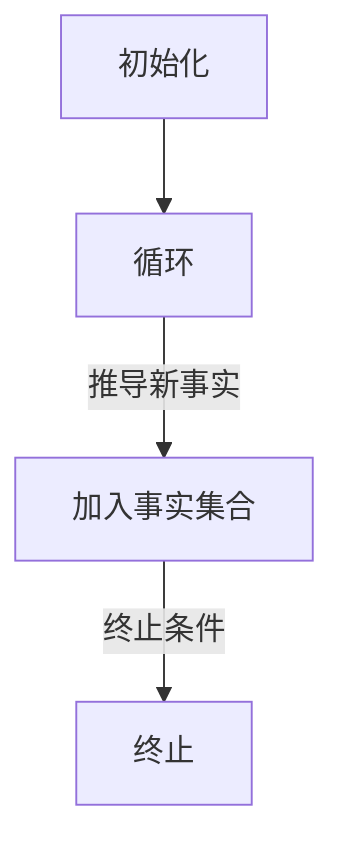
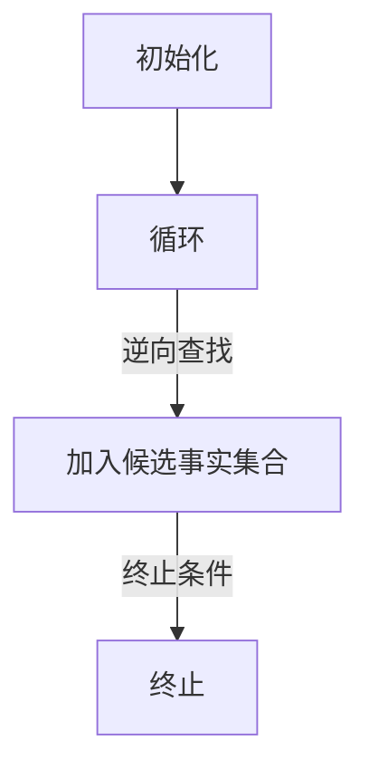
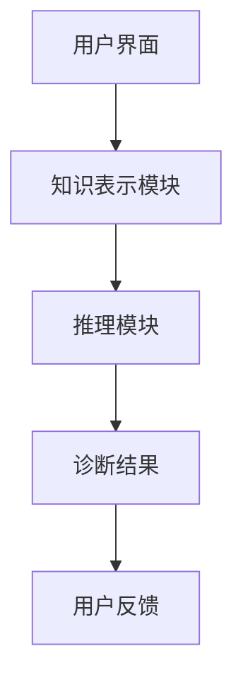
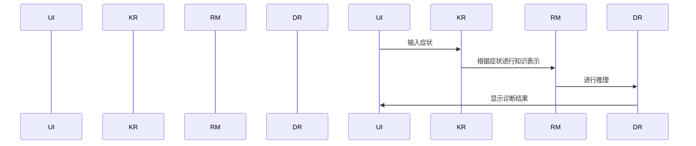

                 


# 知识推理：增强AI Agent的逻辑思考能力

## 关键词
- 知识推理
- AI Agent
- 逻辑思考
- 算法
- 数学模型

## 摘要
本文将深入探讨知识推理在增强AI Agent逻辑思考能力方面的应用。通过分析知识推理的核心概念、算法和数学模型，我们将一步步展示如何构建和优化AI Agent，使其具备更强的逻辑推理和分析能力。本文旨在为AI领域的开发者提供理论和实践指导，帮助他们更好地理解和应用知识推理技术。

## 引言

### 1.1 知识推理的重要性

在人工智能的发展历程中，知识推理一直扮演着关键角色。知识推理是一种基于符号逻辑和数学模型的方法，通过处理和利用符号化的知识，实现对复杂问题的逻辑推理和分析。传统的AI系统主要依赖于规则和模式匹配，而知识推理则通过引入更为复杂的语义和上下文信息，使AI系统能够更加灵活和智能地应对各种挑战。

知识推理的重要性主要体现在以下几个方面：

1. **提高AI系统的决策能力**：知识推理能够为AI系统提供更强的逻辑分析和推理能力，使其在复杂环境中做出更为准确的决策。

2. **增强AI系统的适应性**：知识推理可以帮助AI系统理解不同领域和知识结构，从而更好地适应各种不同的应用场景。

3. **促进跨领域知识的整合**：知识推理技术可以跨领域地整合不同类型的知识，为AI系统提供更为全面和丰富的信息来源。

### 1.2 AI Agent的逻辑思考能力

AI Agent是指具备自主行动和决策能力的智能体，其逻辑思考能力是其核心特征之一。逻辑思考能力包括以下几个方面：

1. **推理能力**：AI Agent能够根据已知信息进行推理，推断出未知信息，解决复杂问题。

2. **判断能力**：AI Agent能够根据现有数据和知识进行判断，做出合理的决策。

3. **学习能力**：AI Agent能够从经验中学习，不断优化自身的逻辑推理能力。

### 1.3 知识推理在AI领域的应用

知识推理在AI领域的应用非常广泛，包括但不限于以下几个方面：

1. **自然语言处理**：知识推理可以帮助AI系统更好地理解和生成自然语言，提高机器翻译和对话系统的准确性。

2. **智能推荐系统**：知识推理可以分析用户行为和偏好，为用户提供个性化的推荐。

3. **医学诊断**：知识推理可以辅助医生进行疾病诊断，提高诊断的准确性和效率。

4. **金融风险评估**：知识推理可以帮助金融机构分析市场数据，进行风险评估和投资决策。

## 核心概念与联系

### 2.1 知识推理的概念结构与核心要素组成

知识推理是由多个核心要素组成的复杂系统，这些要素相互联系，共同实现知识推理的过程。以下是知识推理的主要概念和组成部分：

1. **知识表示**：知识表示是指将现实世界的知识转化为计算机可以处理的形式。常见的知识表示方法包括命题逻辑、谓词逻辑、产生式规则等。

2. **推理机**：推理机是知识推理系统的核心，负责根据已知事实和规则推导出新的事实和结论。

3. **知识库**：知识库是存储和管理知识的数据库，包括事实、规则和模型等。

4. **解释器**：解释器负责解释知识库中的知识和规则，将其转化为计算机可以执行的操作。

### 2.2 概念属性特征对比表格

为了更好地理解知识推理的概念和组成部分，我们提供了一个概念属性特征对比表格，列出了知识表示、推理机、知识库和解释器之间的区别和联系：

| 概念     | 属性特征                     | 联系                   |
|----------|------------------------------|------------------------|
| 知识表示 | 命题逻辑、谓词逻辑、产生式规则 | 建立知识库的基础       |
| 推理机   | 规则匹配、正向推理、逆向推理   | 实现知识推理的核心     |
| 知识库   | 事实、规则、模型              | 存储和管理知识的数据库   |
| 解释器   | 语义解释、执行操作             | 将知识转化为计算机操作 |

### 2.3 ER实体关系图架构

ER实体关系图是知识推理中常用的一种数据模型，用于描述实体之间的关系。以下是ER实体关系图的基本构成和示例：

```mermaid
erDiagram
    C1-Person ||--|{ C2-Book }
    C1-Person ||--|{ C3-Company }
    C2-Book ||--|{ C4-Reviewer }
    C3-Company ||--|{ C5-Employee }
```

在这个ER实体关系图中，`C1-Person` 表示一个实体，它与其他实体之间存在多种关系，如`C2-Book`（表示一个人可以写多本书）、`C3-Company`（表示一个人可以属于多个公司）等。

## 知识推理的基本算法

### 3.1 算法原理

知识推理的基本算法主要包括正向推理和逆向推理两种类型。正向推理是从已知的事实出发，逐步推导出新的结论；而逆向推理则是从目标出发，逆向查找满足条件的事实。

正向推理算法的基本原理如下：

1. **初始化**：设置初始事实集合和推理机。
2. **循环**：在每次循环中，从事实集合中取出一个新事实，使用推理机推导出新的结论，并将其加入到事实集合中。
3. **终止条件**：当事实集合中没有新的事实可以被推导出来时，算法终止。

逆向推理算法的基本原理如下：

1. **初始化**：设置目标事实和推理机。
2. **循环**：在每次循环中，从目标事实出发，逆向查找满足条件的事实，并将其加入到候选事实集合中。
3. **终止条件**：当候选事实集合中没有新的事实可以被推导出来时，算法终止。

### 3.2 Mermaid流程图展示

以下是正向推理和逆向推理的Mermaid流程图示例：

正向推理：



逆向推理：



### 3.3 算法实现与Python代码

以下是正向推理和逆向推理的Python代码示例：

正向推理：

```python
def forward_reasoning(facts, rules):
    inferred_facts = set()
    while True:
        new_fact = None
        for fact in facts:
            for rule in rules:
                if fact in rule的前提条件:
                    new_fact = rule结论
                    inferred_facts.add(new_fact)
                    break
        if new_fact is None:
            break
        facts.add(new_fact)
    return inferred_facts
```

逆向推理：

```python
def backward_reasoning(goal, facts, rules):
    inferred_facts = set()
    while True:
        new_fact = None
        for fact in facts:
            for rule in rules:
                if fact in rule结论 and goal in rule前提条件:
                    new_fact = fact
                    inferred_facts.add(new_fact)
                    break
        if new_fact is None:
            break
        facts.remove(new_fact)
    return inferred_facts
```

## 数学模型与公式

### 4.1 推理机模型

知识推理机的核心是推理算法，我们可以使用以下数学模型来描述：

正向推理算法：

$$
F_{forward}(S, R) = \{ f \mid \exists r \in R, f \in r的前提条件 \}
$$

其中，$F_{forward}$ 表示正向推理函数，$S$ 表示事实集合，$R$ 表示规则集合。

逆向推理算法：

$$
F_{backward}(G, S, R) = \{ f \mid \exists r \in R, f \in r结论 \land G \in r前提条件 \}
$$

其中，$F_{backward}$ 表示逆向推理函数，$G$ 表示目标事实。

### 4.2 知识表示模型

知识表示常用的方法是命题逻辑和谓词逻辑，下面是相应的数学模型：

命题逻辑表示：

$$
P = \{ p_1, p_2, ..., p_n \}
$$

其中，$P$ 是命题集合。

谓词逻辑表示：

$$
K = \{ (x_1, x_2, ..., x_n) \mid \phi(x_1, x_2, ..., x_n) \}
$$

其中，$K$ 是谓词集合，$\phi$ 是谓词逻辑公式。

### 4.3 解释器模型

解释器负责将知识库中的知识转化为计算机可以执行的操作，可以使用以下数学模型描述：

解释器模型：

$$
E(K, S) = \{ (f, g) \mid f \in K, g 是 f 的计算机可执行操作 \}
$$

其中，$E$ 表示解释器函数，$K$ 表示知识库，$S$ 表示事实集合，$(f, g)$ 表示知识$f$的计算机可执行操作$g$。

## 系统设计

### 5.1 问题场景介绍

知识推理在AI Agent中的应用场景非常广泛，例如智能客服、智能诊断系统、智能推荐系统等。本文将以智能诊断系统为例，介绍知识推理在该系统中的应用。

### 5.2 系统介绍

智能诊断系统是一个基于知识推理的智能系统，旨在帮助医生快速准确地诊断疾病。系统主要包括以下几个功能模块：

1. **知识表示模块**：负责将医生的知识转化为计算机可以处理的形式。
2. **推理模块**：负责根据患者的症状和医生的知识库进行推理，得出可能的诊断结果。
3. **用户界面模块**：负责与用户交互，收集患者的症状信息，并显示诊断结果。

### 5.3 系统功能设计

系统功能设计主要包括以下几个方面：

1. **知识表示**：使用谓词逻辑表示医生的知识，包括疾病、症状、治疗方案等。
2. **推理**：使用正向推理算法，根据患者的症状和医生的知识库推导出可能的诊断结果。
3. **用户界面**：提供一个简单的用户界面，允许医生输入患者的症状，并显示诊断结果。

### 5.4 系统架构设计

智能诊断系统的架构设计如下：



### 5.5 系统接口设计

系统接口设计主要包括以下几个方面：

1. **用户界面接口**：提供用户输入症状和查看诊断结果的接口。
2. **知识表示接口**：提供添加、修改和查询医生知识的接口。
3. **推理接口**：提供进行推理操作和获取诊断结果的接口。

### 5.6 系统交互

系统交互设计如下：



## 项目实战

### 6.1 环境安装

为了实现知识推理系统，我们需要安装以下环境：

1. **Python**：版本3.8及以上。
2. **PyQt5**：用于构建用户界面。
3. **PyMermaid**：用于生成Mermaid流程图。

安装命令如下：

```bash
pip install python3-pyqt5
pip install pymermaid
```

### 6.2 系统核心实现

系统核心实现主要包括知识表示、推理和用户界面三个部分。

#### 6.2.1 知识表示

知识表示模块使用谓词逻辑表示医生的知识。以下是一个示例：

```python
class Knowledge:
    def __init__(self, predicate, arguments):
        self.predicate = predicate
        self.arguments = arguments

knowledge = [
    Knowledge("患糖尿病", ["张三"]),
    Knowledge("症状", ["张三", "口渴", "多尿", "疲劳"]),
    Knowledge("诊断结果", ["张三", "糖尿病"])
]
```

#### 6.2.2 推理

推理模块使用正向推理算法进行推理。以下是一个示例：

```python
def forward_reasoning(knowledge):
    inferred_knowledge = []
    for fact in knowledge:
        if fact.predicate == "症状":
            inferred_knowledge.append(fact)
    return inferred_knowledge

inferred_knowledge = forward_reasoning(knowledge)
print(inferred_knowledge)
```

#### 6.2.3 用户界面

用户界面模块使用PyQt5构建，以下是一个简单的用户界面示例：

```python
from PyQt5 import QtWidgets

app = QtWidgets.QApplication([])
window = QtWidgets.QWidget()
window.setWindowTitle("智能诊断系统")

label = QtWidgets.QLabel("请输入症状：")
text_edit = QtWidgets.QTextEdit()

button = QtWidgets.QPushButton("诊断")
button.clicked.connect(lambda: diagnose(text_edit.toPlainText()))

layout = QtWidgets.QVBoxLayout()
layout.addWidget(label)
layout.addWidget(text_edit)
layout.addWidget(button)

window.setLayout(layout)
window.show()

def diagnose(symp

