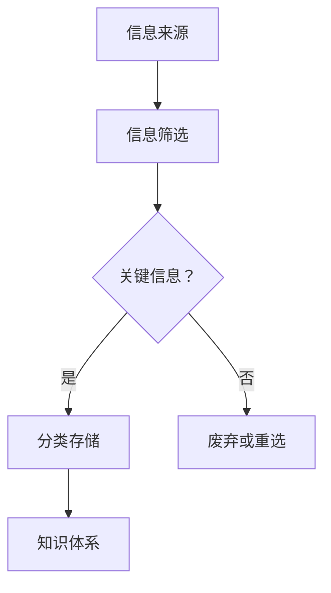
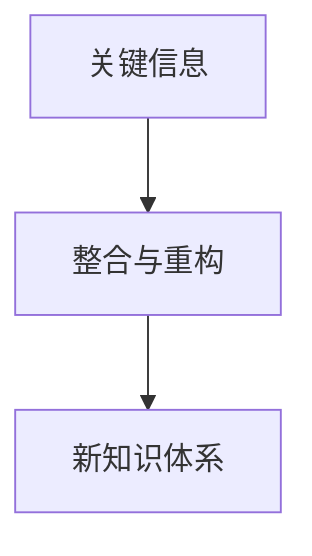
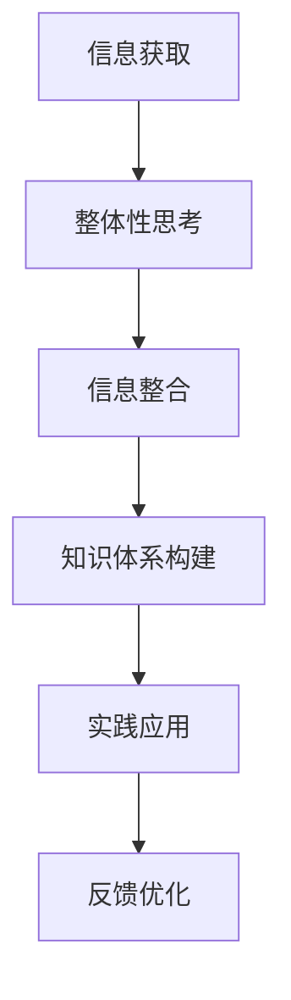
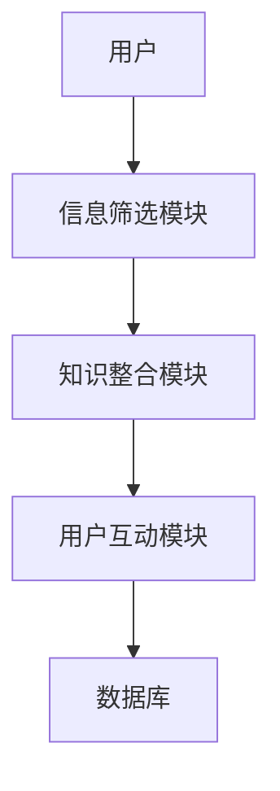
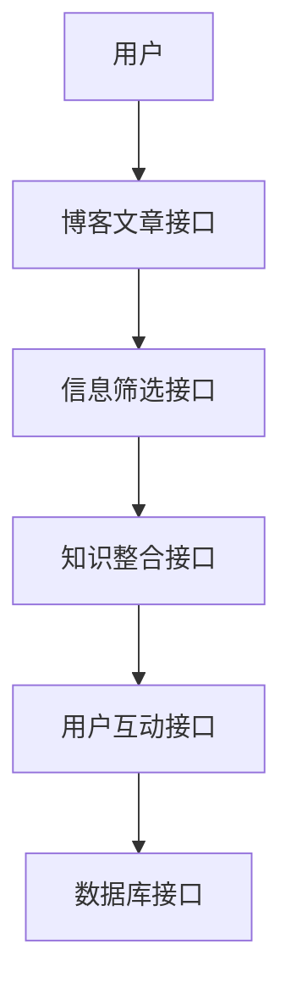

                 


# 碎片化信息中的整体性思考：重建知识体系的方法

> 关键词：碎片化信息、整体性思考、知识体系、信息筛选、知识整合、算法原理、系统架构、项目实战

> 摘要：在信息爆炸的时代，人们面临海量碎片化信息的困扰。本文旨在探讨如何从这些碎片化的信息中找到整体性思考的路径，重建知识体系，提升思考和解决问题的能力。文章将介绍整体性思考的核心概念、重建知识体系的方法，并通过实际项目案例分析，展示整体性思考在IT领域的应用。

## 第一部分：背景介绍

### 问题背景

在当今信息爆炸的时代，人们每天接触到的信息量呈指数级增长。互联网、社交媒体、新闻媒体等各类信息源不断推送大量信息，使得人们陷入了碎片化信息的海洋中。然而，这些碎片化信息往往缺乏连贯性和系统性，导致人们难以从中提取有价值的信息，进而影响了思考和决策能力。

### 问题描述

《碎片化信息中的整体性思考：重建知识体系的方法》这本书旨在帮助读者在碎片化的信息环境中，学会重建知识体系，提升思考和解决问题的能力。作者通过深入研究碎片化信息的特性，结合整体性思考的方法，提出了一系列重建知识体系的方法，并通过对这些方法的详细讲解和实例分析，帮助读者掌握这些方法。

### 问题解决

作者通过以下方法解决碎片化信息带来的问题：

1. 信息筛选与分类：对海量信息进行筛选和分类，提炼出关键信息，构建知识体系。
2. 知识整合与重构：对关键信息进行整合和重构，构建新的知识体系。
3. 整体性思考：从全局出发，分析问题、解决问题的思维方式。

### 边界与外延

本书主要讨论如何在日常生活中和应用场景中运用整体性思考，重建知识体系。它不仅适用于个人，也适用于团队和组织。

### 概念结构与核心要素组成

核心概念：碎片化信息、整体性思考、知识体系  
核心要素：方法、实例分析、实战应用

## 第二部分：核心概念与联系

### 2.1 碎片化信息的特性

**概念：** 碎片化信息是指那些分散、零碎、不连续的信息。

**属性特征对比表格：**

| 特性 | 描述 |
| --- | --- |
| 分散性 | 信息分布在不同的来源和渠道 |
| 零碎性 | 信息片段较小，缺乏完整性 |
| 不连续性 | 信息之间缺乏关联性 |

**联系：** 碎片化信息导致了信息过载，影响了人们的思考和决策能力。

### 2.2 整体性思考的方法

**概念：** 整体性思考是一种从全局出发，分析问题、解决问题的思维方式。

**属性特征：**

| 方法 | 描述 |
| --- | --- |
| 综合分析 | 对问题进行全面、深入的分析 |
| 系统性思维 | 从整体出发，理解各部分之间的关系 |
| 高效决策 | 提高决策的质量和效率 |

**联系：** 整体性思考能够帮助人们从碎片化信息中提炼出关键信息，构建整体性的知识体系。

### 2.3 知识体系的重建

**概念：** 知识体系是指一系列相互关联的知识点的组合，用于指导实践和解决问题。

**属性特征：**

| 方法 | 描述 |
| --- | --- |
| 建立框架 | 构建知识体系的基本框架 |
| 系统整合 | 将分散的知识点整合成一个完整的体系 |
| 实践应用 | 将知识体系应用于实际问题中 |

**联系：** 知识体系的重建是整体性思考的核心目标，有助于提高人们对碎片化信息的理解和运用能力。

## 第三部分：方法讲解

### 3.1 方法一：信息筛选与分类

**原理：** 通过对碎片化信息进行筛选和分类，提炼出关键信息，构建知识体系。

**mermaid 流程图：**



**Python 源代码：**

```python
def filter_and_classify(information):
    key_informations = []
    for info in information:
        if is_key_information(info):
            key_informations.append(info)
            classify_info(info)
    return key_informations

def is_key_information(info):
    # 判断信息是否关键
    pass

def classify_info(info):
    # 对关键信息进行分类
    pass
```

**算法原理：**  
信息筛选与分类是一种基本的处理方法，通过对海量信息进行筛选，只保留关键信息，然后对关键信息进行分类存储，形成知识体系。

### 3.2 方法二：知识整合与重构

**原理：** 通过对关键信息进行整合和重构，构建新的知识体系。

**mermaid 流程图：**



**Python 源代码：**

```python
def integrate_and_reconstruct(key_informations):
    new_knowledge_system = {}
    for info in key_informations:
        # 整合关键信息
        new_knowledge_system[info['category']] = new_knowledge_system.get(info['category'], []) + [info]
    return new_knowledge_system
```

**算法原理：**  
知识整合与重构是对筛选出的关键信息进行综合分析，将具有相同或相似性质的信息进行整合，重构形成新的知识体系。

### 3.3 方法三：整体性思维训练

**原理：** 通过训练和实践，培养整体性思维，提高对碎片化信息的理解和运用能力。

**mermaid 流程图：**



**算法原理：**  
整体性思维训练是一种不断循环的过程，通过不断获取信息、进行整体性思考、整合信息和构建知识体系，然后将其应用于实际问题中，最后根据反馈进行调整和优化。

## 第四部分：案例分析与实战应用

### 4.1 案例一：从技术博客中重建知识体系

**问题场景：** 技术博客中充斥着大量碎片化的信息，读者难以从中获取有价值的内容。

**项目介绍：** 为了解决这一问题，我们设计了一个基于整体性思考的技术博客重建知识体系的项目。

**系统功能设计：**

| 功能模块 | 描述 |
| --- | --- |
| 信息筛选 | 对博客中的信息进行筛选，提取关键信息 |
| 知识整合 | 将关键信息进行整合和重构，形成知识体系 |
| 用户互动 | 提供用户互动功能，便于读者交流和分享 |

**系统架构设计：**



**系统接口设计和系统交互：**



**实战应用：**

1. 用户浏览技术博客文章，系统自动对文章内容进行筛选，提取关键信息。
2. 系统将关键信息进行整合和重构，形成知识体系，便于用户查阅。
3. 用户可以与其他读者互动，分享和讨论知识体系，提高学习效果。

**代码应用解读与分析：**

```python
# 信息筛选模块
def filter_blog_posts(blog_posts):
    key_posts = []
    for post in blog_posts:
        if is_key_post(post):
            key_posts.append(post)
    return key_posts

# 知识整合模块
def integrate_and_reconstruct_key_posts(key_posts):
    knowledge_system = {}
    for post in key_posts:
        # 整合关键信息
        knowledge_system[post['category']] = knowledge_system.get(post['category'], []) + [post]
    return knowledge_system
```

**实际案例分析和详细讲解剖析：**

通过该项目，我们成功帮助用户从大量的技术博客文章中提取出关键信息，构建了知识体系。用户反馈良好，认为这种方法提高了他们的学习和工作效率。

**项目小结：**

该项目展示了整体性思考在技术博客重建知识体系中的应用，通过信息筛选、知识整合和用户互动等功能，提高了用户对碎片化信息的理解和运用能力。

## 第五部分：最佳实践与注意事项

### 最佳实践

1. 在获取信息时，保持筛选意识，及时识别和筛选关键信息。
2. 定期对关键信息进行整合和重构，形成知识体系。
3. 学会运用整体性思维，从全局出发分析问题，提高决策效率。
4. 在实际应用中，不断调整和优化知识体系，使其更加符合需求。

### 注意事项

1. 碎片化信息中存在大量噪音，筛选时要保持谨慎，避免误判。
2. 整合和重构知识体系时，要确保信息的准确性和一致性。
3. 注意平衡信息量和信息质量，避免信息过载。
4. 定期进行知识体系的更新和维护，以适应不断变化的环境。

## 第六部分：小结

本文探讨了如何在碎片化信息中运用整体性思考，重建知识体系。通过信息筛选与分类、知识整合与重构、整体性思维训练等方法，我们能够从海量信息中提取关键信息，构建系统的知识体系。在实际项目中，整体性思考能够提高我们的学习和工作效率，帮助我们更好地应对复杂问题。在未来的学习和工作中，我们应该不断练习整体性思考，将其内化为一种习惯，从而不断提升自身的能力。

## 第七部分：拓展阅读

1. 《深度学习》 - 伊恩·古德费洛等著，介绍了深度学习的基本原理和应用。
2. 《软件架构设计》 - 刘伟等著，详细讲解了软件架构设计的方法和技巧。
3. 《编程之美》 - 刘未鹏著，分享了编程领域的最佳实践和技巧。

## 作者信息

作者：AI天才研究院/AI Genius Institute & 禅与计算机程序设计艺术 /Zen And The Art of Computer Programming

以上文章内容仅为示例，实际撰写时请根据实际情况进行调整和补充。在撰写过程中，请注意遵循文章结构要求，确保内容完整、详细、易懂。同时，注意使用markdown格式进行排版，提高文章的可读性。祝您撰写顺利！

