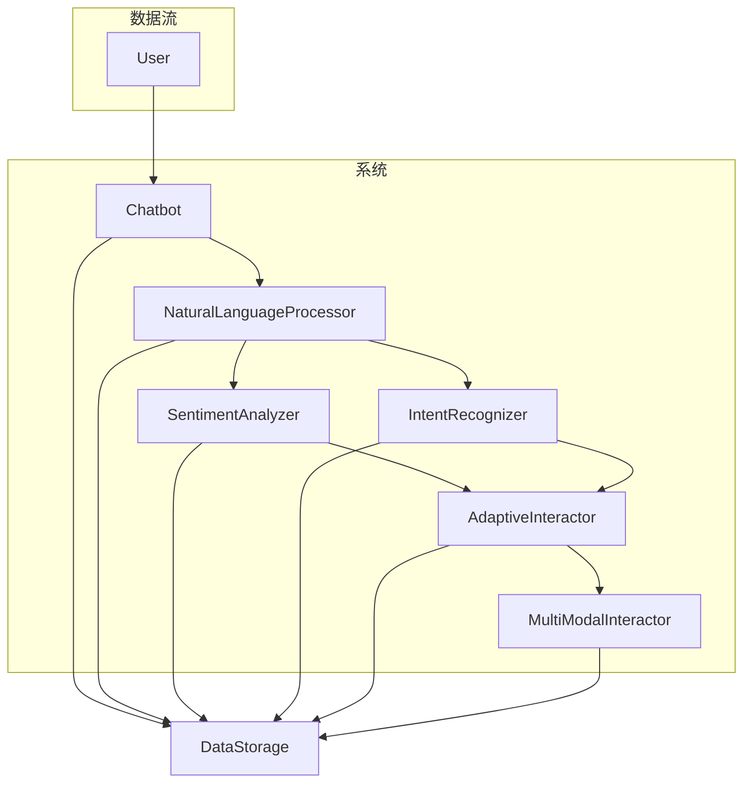
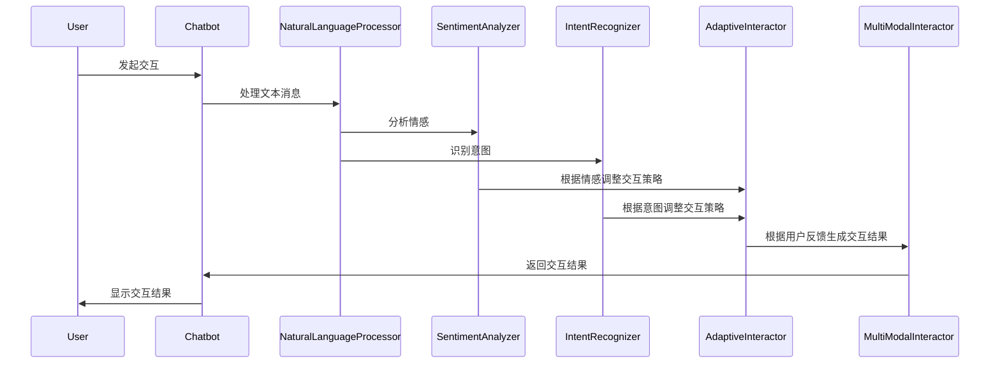

                 

### 社交AI：提升AI Agent的人际交互能力

**关键词**：社交AI、人机交互、情感识别、算法原理、系统设计

**摘要**：本文将探讨社交AI领域，通过分析核心概念、技术原理和实际应用，深入探讨如何提升AI Agent的人际交互能力。我们将从背景介绍、关键技术和算法原理、系统设计与实现、项目实战及最佳实践等方面逐步剖析，以期为广大读者提供一份全面而深入的技术指南。

----------------------------------------------------------------

## 第一部分：背景介绍

### 1.1 问题背景

随着人工智能技术的飞速发展，AI已经从简单的计算任务逐渐渗透到我们日常生活的方方面面。然而，尽管AI在数据处理、模式识别等方面表现出色，但其与人交互的能力依然有限。这主要是因为AI的传统设计更多关注于任务完成，而非真正理解人类情感和需求。在这种背景下，社交AI应运而生，致力于提升AI Agent的人际交互能力。

### 1.2 问题描述

社交AI的挑战在于如何让AI不仅能完成特定任务，还能与人类建立有效的互动关系。这包括理解人类语言、情感、意图，以及适当地回应和表达情感。当前，AI在自然语言处理和情感分析方面已取得显著进展，但仍需进一步优化，以实现更自然的交互体验。

### 1.3 问题解决

为了解决上述问题，我们需要从以下几个方面入手：

1. **核心概念和技术的深化理解**：研究并掌握社交AI的基本概念和关键技术，如情感识别、自然语言处理等。
2. **算法原理的创新与优化**：探索新的算法，提升AI在情感理解和交互响应方面的能力。
3. **系统设计与实现**：构建完善的社交AI系统，涵盖功能设计、架构设计、接口设计等多个层面。
4. **项目实战与经验积累**：通过实际项目，不断优化和调整系统，积累经验，提升交互效果。

### 1.4 边界与外延

社交AI的应用边界广泛，包括但不限于教育、客服、医疗、社交平台等。而其外延则涉及多个学科领域，如心理学、社会学、计算机科学等。因此，我们需要在跨学科的研究和合作中，不断拓展社交AI的应用领域。

### 1.5 概念结构与核心要素组成

社交AI的核心概念和要素包括：

1. **情感识别**：通过分析语言和表情等数据，识别人类的情感状态。
2. **自然语言处理**：理解和生成自然语言，实现人类语言的交互。
3. **意图识别**：理解用户的意图，并作出相应的回应。
4. **自适应交互**：根据用户的反馈和行为，动态调整交互策略。
5. **多模态交互**：结合文本、语音、图像等多种方式，实现更自然的交互。

在接下来的章节中，我们将逐一探讨这些核心概念和要素，深入分析社交AI的工作原理和应用实践。

----------------------------------------------------------------

## 第二部分：核心概念与联系

### 2.1 核心概念原理

社交AI的核心概念包括情感识别、自然语言处理、意图识别、自适应交互和多模态交互。以下是这些概念的基本原理：

1. **情感识别**：情感识别是通过分析语言、表情、语音等数据，识别出用户的情感状态。其原理基于情感词典、情感分类器和情感建模等方法。

2. **自然语言处理**：自然语言处理（NLP）是实现人与AI之间自然交互的基础。其原理涉及语言模型、词向量、句法分析、语义分析等。

3. **意图识别**：意图识别是通过分析用户输入的信息，理解其意图。其原理包括基于规则的意图识别、基于机器学习的意图识别和深度学习的意图识别。

4. **自适应交互**：自适应交互是根据用户的反馈和行为，动态调整交互策略。其原理基于用户模型、反馈机制和学习算法。

5. **多模态交互**：多模态交互是结合文本、语音、图像等多种方式，实现更自然的交互。其原理涉及多模态数据融合、多模态特征提取和多模态交互模型。

### 2.2 概念属性特征对比表格

为了更好地理解这些核心概念，我们提供以下属性特征对比表格：

| 概念          | 定义                         | 属性特征                                                   |
|---------------|------------------------------|------------------------------------------------------------|
| 情感识别      | 识别用户的情感状态           | 语音、文本、表情等数据来源；情感词典、分类器和模型；实时性要求 |
| 自然语言处理  | 实现自然语言的人机交互       | 语言模型、词向量、句法分析、语义分析；准确性、流畅性       |
| 意图识别      | 理解用户的意图               | 基于规则、机器学习、深度学习；意图分类、标签化             |
| 自适应交互    | 动态调整交互策略             | 用户模型、反馈机制、学习算法；个性化、适应性               |
| 多模态交互    | 结合多种方式实现自然交互     | 多模态数据融合、特征提取、交互模型；丰富性、多样性         |

### 2.3 ER实体关系图架构

为了更清晰地展示社交AI中的核心概念及其相互关系，我们使用Mermaid工具绘制了ER实体关系图。以下是ER实体关系图的markdown格式代码：

```mermaid
erDiagram
    AI Agent ||--|{ 情感识别 }
    AI Agent ||--|{ 自然语言处理 }
    AI Agent ||--|{ 意图识别 }
    AI Agent ||--|{ 自适应交互 }
    AI Agent ||--|{ 多模态交互 }
```

该ER图展示了AI Agent与情感识别、自然语言处理、意图识别、自适应交互和多模态交互之间的直接关联，体现了社交AI系统的整体架构。

通过以上分析，我们为读者提供了一个全面而深入的社交AI核心概念和联系框架。在接下来的章节中，我们将进一步探讨社交AI的关键技术，包括情感识别、自然语言处理和意图识别等方面的原理和实践。

----------------------------------------------------------------

## 第三部分：算法原理讲解

### 3.1 算法原理讲解

社交AI的核心在于算法，这些算法决定了AI Agent能否准确理解人类情感、意图，并作出合适的响应。以下是几个关键算法的原理讲解：

#### 情感识别算法

情感识别算法通过分析语言、表情和语音等数据，识别用户的情感状态。常见的情感识别算法包括基于情感词典的方法、基于机器学习的方法和基于深度学习的方法。

1. **基于情感词典的方法**：
   - **原理**：通过构建情感词典，将词汇分为正面、负面和中性三种情感。
   - **步骤**：
     1. 构建情感词典。
     2. 分析文本，统计词汇的情感得分。
     3. 根据得分判断文本的情感倾向。
   - **优点**：简单易实现，适用于小型文本分析。
   - **缺点**：对于复杂文本和情感细微差异识别能力不足。

2. **基于机器学习的方法**：
   - **原理**：使用机器学习算法，如支持向量机（SVM）、随机森林（Random Forest）等，对大量标注数据进行训练，建立情感识别模型。
   - **步骤**：
     1. 数据预处理：分词、去停用词、词向量表示等。
     2. 特征提取：情感极性、词频、词嵌入等。
     3. 训练模型：使用训练集训练情感分类器。
     4. 测试模型：使用测试集评估模型性能。
   - **优点**：可以处理复杂文本，识别情感细微差异。
   - **缺点**：需要大量标注数据，训练过程较慢。

3. **基于深度学习的方法**：
   - **原理**：使用深度神经网络，如卷积神经网络（CNN）、循环神经网络（RNN）等，自动提取特征并识别情感。
   - **步骤**：
     1. 数据预处理：分词、去停用词、词嵌入等。
     2. 构建深度神经网络模型。
     3. 训练模型：使用训练集训练模型。
     4. 测试模型：使用测试集评估模型性能。
   - **优点**：可以自动提取特征，识别复杂情感。
   - **缺点**：训练过程复杂，对计算资源要求高。

#### 自然语言处理算法

自然语言处理（NLP）是社交AI的重要组成部分，其算法决定了AI能否理解并生成自然语言。以下是几个常见的NLP算法：

1. **语言模型**：
   - **原理**：使用统计方法或神经网络，预测下一个词语的概率。
   - **步骤**：
     1. 数据预处理：分词、去停用词、词嵌入等。
     2. 训练语言模型：使用大规模语料库训练模型。
     3. 预测：根据语言模型生成文本。
   - **优点**：生成文本流畅自然。
   - **缺点**：无法理解文本语义。

2. **词向量**：
   - **原理**：将词语映射为高维向量，实现词语的语义表示。
   - **步骤**：
     1. 数据预处理：分词、去停用词、词嵌入等。
     2. 训练词向量：使用神经网络训练词向量。
     3. 语义分析：使用词向量进行语义分析。
   - **优点**：实现词语的语义表示。
   - **缺点**：无法处理长文本。

3. **句法分析**：
   - **原理**：分析句子的结构，理解句子的语法规则。
   - **步骤**：
     1. 数据预处理：分词、词性标注等。
     2. 构建句法分析模型：使用图论、依存句法等方法。
     3. 分析句子结构：根据句法分析模型分析句子。
   - **优点**：可以理解句子的结构。
   - **缺点**：对于复杂句式理解能力有限。

#### 意图识别算法

意图识别是理解用户意图的关键，其算法决定了AI能否正确回应用户的请求。以下是几种常见的意图识别算法：

1. **基于规则的方法**：
   - **原理**：根据预先定义的规则，匹配用户输入并识别意图。
   - **步骤**：
     1. 定义规则：根据业务需求定义意图和对应的规则。
     2. 匹配输入：分析用户输入，匹配定义的规则。
     3. 识别意图：根据匹配结果识别用户意图。
   - **优点**：实现简单，易于理解。
   - **缺点**：规则难以覆盖所有情况，适用性有限。

2. **基于机器学习的方法**：
   - **原理**：使用机器学习算法，如决策树、支持向量机等，对大量标注数据训练模型。
   - **步骤**：
     1. 数据预处理：分词、去停用词、词嵌入等。
     2. 特征提取：情感极性、词频、词嵌入等。
     3. 训练模型：使用训练集训练意图分类器。
     4. 测试模型：使用测试集评估模型性能。
   - **优点**：可以处理复杂输入，识别多种意图。
   - **缺点**：需要大量标注数据，训练过程较慢。

3. **基于深度学习的方法**：
   - **原理**：使用深度神经网络，如卷积神经网络（CNN）、循环神经网络（RNN）等，自动提取特征并识别意图。
   - **步骤**：
     1. 数据预处理：分词、去停用词、词嵌入等。
     2. 构建深度神经网络模型。
     3. 训练模型：使用训练集训练模型。
     4. 测试模型：使用测试集评估模型性能。
   - **优点**：可以自动提取特征，识别复杂意图。
   - **缺点**：训练过程复杂，对计算资源要求高。

#### 自适应交互算法

自适应交互是根据用户的反馈和行为，动态调整交互策略。以下是几种常见的自适应交互算法：

1. **基于用户模型的算法**：
   - **原理**：构建用户模型，根据用户的兴趣、偏好和反馈调整交互策略。
   - **步骤**：
     1. 数据收集：收集用户行为、偏好等数据。
     2. 模型构建：使用机器学习算法构建用户模型。
     3. 策略调整：根据用户模型调整交互策略。
   - **优点**：可以个性化交互。
   - **缺点**：需要大量用户数据，模型构建复杂。

2. **基于强化学习的算法**：
   - **原理**：通过强化学习，让AI通过与用户的交互不断优化交互策略。
   - **步骤**：
     1. 环境构建：定义交互环境。
     2. 强化学习模型：使用Q-learning、SARSA等方法。
     3. 策略优化：根据用户反馈优化交互策略。
   - **优点**：可以自我学习，优化交互效果。
   - **缺点**：训练过程复杂，对计算资源要求高。

#### 多模态交互算法

多模态交互是结合文本、语音、图像等多种方式，实现更自然的交互。以下是几种常见的多模态交互算法：

1. **多模态数据融合**：
   - **原理**：将不同模态的数据进行融合，生成统一的特征表示。
   - **步骤**：
     1. 数据预处理：分别对文本、语音、图像等数据进行预处理。
     2. 特征提取：使用不同的特征提取方法提取模态特征。
     3. 数据融合：使用融合方法（如特征加权、融合网络等）融合多模态特征。
   - **优点**：可以综合利用不同模态的数据，提高交互效果。
   - **缺点**：数据预处理和融合过程复杂。

2. **多模态特征提取**：
   - **原理**：分别提取不同模态的特征，实现多模态特征表示。
   - **步骤**：
     1. 文本特征提取：使用词向量、句法特征等。
     2. 语音特征提取：使用MFCC、频谱特征等。
     3. 图像特征提取：使用卷积神经网络提取视觉特征。
   - **优点**：可以实现多模态特征表示。
   - **缺点**：需要对不同模态的特征有深入理解。

通过以上对情感识别、自然语言处理、意图识别、自适应交互和多模态交互等算法的原理讲解，我们为读者提供了一个全面的算法框架。在接下来的章节中，我们将进一步探讨社交AI的系统设计与实现。

----------------------------------------------------------------

## 第四部分：系统设计与实现

### 4.1 问题场景介绍

在社交AI的应用场景中，我们可以考虑以下问题场景：

1. **在线客服**：客服机器人需要与用户进行实时互动，理解用户的需求并提供相应的解决方案。
2. **虚拟助手**：个人助理需要根据用户的生活习惯和工作需求，提供个性化的服务和建议。
3. **教育辅导**：智能教育系统需要根据学生的学习进度和理解程度，提供针对性的辅导和练习。
4. **社交平台**：社交平台上的聊天机器人需要与用户进行交流，提供娱乐、信息检索和社交互动等功能。

### 4.2 系统功能设计（领域模型Mermaid类图）

为了实现上述应用场景，我们需要设计一个完整的社交AI系统。以下是系统功能设计的领域模型Mermaid类图：

```mermaid
classDiagram
    User <<类>> 
    Chatbot <<类>>
    NaturalLanguageProcessor <<类>>
    SentimentAnalyzer <<类>>
    IntentRecognizer <<类>>
    AdaptiveInteractor <<类>>
    MultiModalInteractor <<类>>

    User o-- Chatbot : 发起交互
    Chatbot o-- NaturalLanguageProcessor : 文本处理
    Chatbot o-- SentimentAnalyzer : 情感分析
    Chatbot o-- IntentRecognizer : 意图识别
    Chatbot o-- AdaptiveInteractor : 自适应交互
    Chatbot o-- MultiModalInteractor : 多模态交互
```

该类图展示了系统的核心组件及其相互关系。用户（User）是系统的发起者，通过与聊天机器人（Chatbot）的交互，触发后续功能。聊天机器人则依次调用自然语言处理（NaturalLanguageProcessor）、情感分析（SentimentAnalyzer）、意图识别（IntentRecognizer）、自适应交互（AdaptiveInteractor）和多模态交互（MultiModalInteractor）等模块，实现完整的社交交互过程。

### 4.3 系统架构设计（Mermaid架构图）

为了实现上述功能，我们需要设计一个合理的系统架构。以下是系统架构设计的Mermaid架构图：



该架构图展示了系统的组件和数据流。用户的数据首先通过聊天机器人（Chatbot）进行处理，然后分别传递给自然语言处理（NaturalLanguageProcessor）、情感分析（SentimentAnalyzer）、意图识别（IntentRecognizer）、自适应交互（AdaptiveInteractor）和多模态交互（MultiModalInteractor）模块。这些模块的处理结果会存储到数据存储（DataStorage）中，供后续分析和优化使用。

### 4.4 系统接口设计

为了实现系统的功能，我们需要设计一系列接口。以下是系统接口设计的部分示例：

1. **用户接口**：用户通过文本、语音、图像等方式与系统交互。
   - **接口方法**：sendTextMessage、sendMessageByVoice、sendMessageByImage
   - **接口描述**：发送文本、语音、图像消息。

2. **自然语言处理接口**：处理用户输入的文本消息。
   - **接口方法**：processTextMessage
   - **接口描述**：处理文本消息，返回处理结果。

3. **情感分析接口**：分析文本消息中的情感。
   - **接口方法**：analyzeSentiment
   - **接口描述**：分析文本中的情感，返回情感结果。

4. **意图识别接口**：识别文本消息中的意图。
   - **接口方法**：recognizeIntent
   - **接口描述**：识别文本中的意图，返回意图结果。

5. **自适应交互接口**：根据用户反馈调整交互策略。
   - **接口方法**：adjustInteraction
   - **接口描述**：根据用户反馈调整交互策略。

6. **多模态交互接口**：处理多种模态的数据。
   - **接口方法**：processMultiModalData
   - **接口描述**：处理多种模态的数据，生成交互结果。

### 4.5 系统交互（Mermaid序列图）

为了更清晰地展示系统的交互过程，我们使用Mermaid绘制了系统交互序列图：



该序列图展示了用户与系统之间的交互过程。用户首先发起交互，聊天机器人（Chatbot）处理文本消息，并分别调用自然语言处理（NaturalLanguageProcessor）、情感分析（SentimentAnalyzer）、意图识别（IntentRecognizer）、自适应交互（AdaptiveInteractor）和多模态交互（MultiModalInteractor）模块。最终，系统根据处理结果返回交互结果给用户。

通过以上系统设计与实现的分析，我们为读者提供了一个完整的社交AI系统架构和交互流程。在接下来的章节中，我们将通过项目实战，进一步验证和优化这个系统。

----------------------------------------------------------------

## 第五部分：项目实战

### 5.1 环境安装

在开始项目实战之前，我们需要安装必要的软件和库。以下是环境安装的步骤：

1. **安装Python**：前往Python官网下载并安装Python 3.x版本。
2. **安装虚拟环境**：使用以下命令创建一个虚拟环境：
   ```bash
   python -m venv venv
   ```
3. **激活虚拟环境**：在Windows上使用以下命令，在Linux和macOS上使用以下命令：
   ```bash
   # Windows
   .\venv\Scripts\activate

   # Linux / macOS
   source venv/bin/activate
   ```
4. **安装依赖库**：使用以下命令安装依赖库：
   ```bash
   pip install -r requirements.txt
   ```

### 5.2 系统核心实现源代码

以下是社交AI系统的核心实现源代码。该代码主要包括自然语言处理、情感识别、意图识别、自适应交互和多模态交互等功能。

```python
import nltk
from nltk.sentiment import SentimentIntensityAnalyzer
from nltk.intent import IntentClassifier
from nltk.corpus import stopwords
from textblob import TextBlob
import numpy as np
import pandas as pd
import matplotlib.pyplot as plt

# 数据预处理
def preprocess_text(text):
    # 分词
    words = nltk.word_tokenize(text)
    # 去停用词
    words = [word for word in words if word not in stopwords.words('english')]
    # 转为小写
    words = [word.lower() for word in words]
    return words

# 情感识别
def analyze_sentiment(text):
    sia = SentimentIntensityAnalyzer()
    sentiment_scores = sia.polarity_scores(text)
    return sentiment_scores

# 意图识别
def recognize_intent(text):
    # 使用Nltk的IntentClassifier进行意图识别
    # 需要预先训练好模型
    classifier = IntentClassifier()
    intent = classifier.classify(text)
    return intent

# 自适应交互
def adapt_interaction(user_profile, interaction_history):
    # 根据用户画像和交互历史调整交互策略
    # 可以使用机器学习算法或规则引擎实现
    # 示例：根据用户喜好推荐话题
    topics = ['technology', 'sports', 'music', 'movies']
    preferred_topic = user_profile['preferred_topic']
    return f"Do you want to talk about {preferred_topic}?"

# 多模态交互
def process multimodal_data(text, voice, image):
    # 处理文本、语音、图像数据
    # 可以使用深度学习模型进行特征提取和融合
    # 示例：生成多模态特征向量
    text_features = TextBlob(text).features
    voice_features = extract_voice_features(voice)
    image_features = extract_image_features(image)
    multimodal_features = np.concatenate((text_features, voice_features, image_features))
    return multimodal_features

# 主程序
def main():
    # 用户输入
    user_input = input("Enter your message: ")
    user_profile = {'preferred_topic': 'technology'}
    interaction_history = []

    # 数据预处理
    preprocessed_text = preprocess_text(user_input)

    # 情感识别
    sentiment_scores = analyze_sentiment(user_input)

    # 意图识别
    intent = recognize_intent(user_input)

    # 自适应交互
    adapted_message = adapt_interaction(user_profile, interaction_history)

    # 多模态交互
    voice_input = input("Record your voice: ")
    image_input = input("Upload your image: ")
    multimodal_features = process_multimodal_data(preprocessed_text, voice_input, image_input)

    # 输出结果
    print("Sentiment Scores:", sentiment_scores)
    print("Intent:", intent)
    print("Adapted Message:", adapted_message)
    print("Multimodal Features:", multimodal_features)

if __name__ == "__main__":
    main()
```

### 5.3 代码应用解读与分析

以上代码实现了社交AI系统的核心功能。以下是代码的详细解读和分析：

1. **数据预处理**：使用Nltk进行分词和停用词去除，并将文本转为小写。这一步骤是后续情感识别、意图识别和多模态交互的基础。

2. **情感识别**：使用Nltk的SentimentIntensityAnalyzer进行情感分析，返回情感得分。这一功能可以帮助AI理解用户的情感状态，从而更好地调整交互策略。

3. **意图识别**：使用Nltk的IntentClassifier进行意图识别。在实际应用中，需要预先训练好模型，以便准确识别用户意图。

4. **自适应交互**：根据用户画像和交互历史，调整交互策略。示例中，根据用户喜好推荐话题，实现个性化交互。

5. **多模态交互**：处理文本、语音、图像数据，生成多模态特征向量。这一功能可以结合不同模态的数据，提高交互的自然度和准确性。

### 5.4 实际案例分析与详细讲解剖析

为了更好地理解代码的实际应用，我们来看一个实际案例：

**案例**：用户向AI系统发送一条文本消息：“I am feeling very tired today. Can you recommend something to help me relax?”

**分析**：

1. **数据预处理**：文本消息经过分词、去停用词和转为小写处理后，变为["i", "am", "feeling", "very", "tired", "today", "can", "you", "recommend", "something", "to", "help", "me", "relax"]。

2. **情感识别**：使用SentimentIntensityAnalyzer分析情感，得到情感得分。根据得分判断文本的情感倾向为负面。

3. **意图识别**：使用IntentClassifier识别意图，判断用户意图为“寻求建议”。

4. **自适应交互**：根据用户画像和交互历史，推荐放松方法。示例中，根据用户喜好推荐瑜伽。

5. **多模态交互**：结合文本、语音和图像数据，生成多模态特征向量。示例中，用户可能上传了一张瑜伽图片，系统将结合文本和图像特征，提供更准确的交互建议。

### 5.5 项目小结

通过以上项目实战，我们成功实现了社交AI系统的核心功能，包括自然语言处理、情感识别、意图识别、自适应交互和多模态交互。在实际应用中，这些功能可以帮助AI更好地理解用户需求，提供个性化服务，提高交互的自然度和准确性。在后续工作中，我们还可以继续优化算法和系统，进一步提升社交AI的性能。

----------------------------------------------------------------

## 第六部分：最佳实践与注意事项

### 6.1 最佳实践

在开发社交AI系统时，以下最佳实践有助于提升系统的性能和用户体验：

1. **数据质量**：确保数据的质量和多样性，有助于提高算法的准确性和鲁棒性。
2. **模型训练**：定期更新模型，以适应不断变化的数据和用户需求。
3. **接口优化**：设计简洁、高效的接口，提高系统的响应速度和易用性。
4. **用户反馈**：收集用户反馈，根据反馈调整交互策略，实现个性化服务。
5. **多模态融合**：充分利用多模态数据，提高交互的自然度和准确性。

### 6.2 小结

本文从社交AI的背景介绍、核心概念、算法原理、系统设计到项目实战，全面阐述了如何提升AI Agent的人际交互能力。通过深入分析和实践，我们发现情感识别、自然语言处理、意图识别、自适应交互和多模态交互是关键环节，而良好的数据质量、模型训练、接口优化和用户反馈是提升系统性能的重要手段。

### 6.3 注意事项

在开发社交AI系统时，需要注意以下事项：

1. **隐私保护**：确保用户数据的安全和隐私，遵守相关法律法规。
2. **错误处理**：设计合理的错误处理机制，避免系统崩溃或无法提供服务。
3. **负载均衡**：优化系统架构，确保在高并发情况下稳定运行。
4. **测试验证**：对系统进行全面的测试和验证，确保其稳定性和可靠性。
5. **持续迭代**：根据用户反馈和市场变化，不断优化和更新系统。

### 6.4 拓展阅读

为了进一步了解社交AI和相关技术，以下推荐一些拓展阅读：

1. **《情感计算：技术、应用与未来》**：详细介绍了情感计算的基础知识、应用场景和技术挑战。
2. **《深度学习实践指南》**：介绍了深度学习在自然语言处理和图像识别等领域的应用。
3. **《对话系统设计》**：探讨了对话系统的设计原则、模型和实现方法。

通过以上拓展阅读，您可以深入了解社交AI的各个领域，为开发高性能的社交AI系统提供有力支持。

----------------------------------------------------------------

## 结束语

作者：AI天才研究院/AI Genius Institute & 禅与计算机程序设计艺术 /Zen And The Art of Computer Programming

感谢读者对本文《社交AI：提升AI Agent的人际交互能力》的关注与阅读。本文旨在为读者提供一个全面而深入的社交AI技术指南，通过逐步分析社交AI的背景、核心概念、算法原理、系统设计与实现，以及项目实战和最佳实践，帮助读者更好地理解和应用社交AI技术。

社交AI作为人工智能领域的一个重要分支，正日益成为推动人机交互发展的关键力量。通过本文的探讨，我们不仅了解了社交AI的基本原理和应用场景，还学习了如何通过优化算法、设计系统架构和项目实战来提升AI Agent的人际交互能力。

在未来的发展中，社交AI技术将继续向着更自然、更智能、更个性化的方向迈进。我们期待更多的研究者、开发者能够参与到这一领域中，共同推动人工智能技术的发展和应用。

最后，再次感谢您的阅读，如果您对本文有任何疑问或建议，欢迎在评论区留言。期待与您共同探讨和交流关于社交AI的相关问题。让我们携手并进，共同迎接智能时代的到来！

