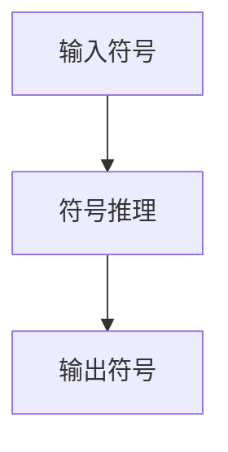
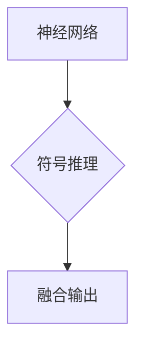
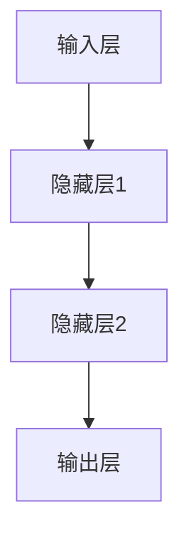
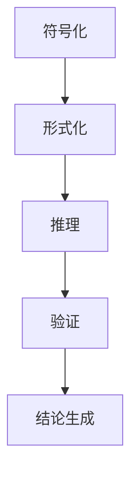
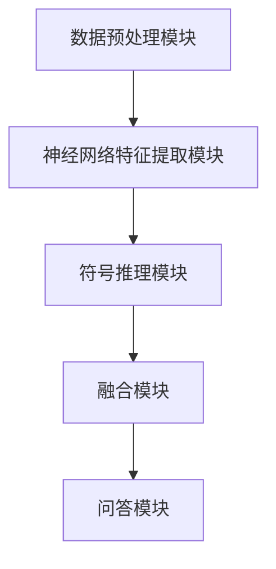
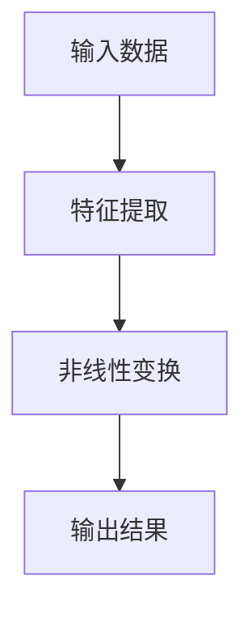
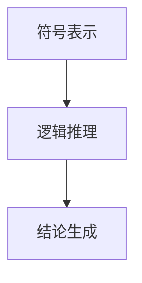
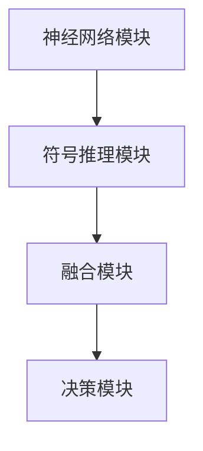

                 

### 第1章：问题背景与核心概念

#### 1.1 问题背景

随着人工智能（AI）的快速发展，传统的人工智能方法已经无法满足复杂任务的需求。尽管神经网络在图像识别、语音识别等任务上取得了显著的成果，但它们在处理符号推理方面仍存在一定的局限性。符号推理是一种基于逻辑和数学规则的推理方式，能够处理抽象的概念和复杂的逻辑关系。为了解决这一问题，研究者们提出了神经符号AI（Neural Symbolic AI）的概念。

神经符号AI旨在结合神经网络和符号推理的优势，构建一种新型的AI Agent，能够在符号推理和感知任务中表现出色。传统神经网络擅长处理大规模的数据和模式识别，而符号推理则能够处理抽象的概念和复杂的逻辑关系。两者的结合有望在AI领域产生深远的影响。

#### 1.2 核心概念

**神经网络**：

神经网络是一种模仿人脑结构和功能的计算模型。它由大量的神经元组成，通过调整神经元之间的连接权重来学习数据特征和模式。神经网络主要包括输入层、隐藏层和输出层，通过多层非线性变换来提取数据特征。

**符号推理**：

符号推理是一种基于逻辑和数学规则的推理方式。它使用符号来表示概念和关系，通过推理规则来推导出新的结论。符号推理具有高精度、可解释性和强逻辑推理能力，但在处理大规模数据方面存在一定的局限性。

**神经符号AI**：

神经符号AI是一种结合神经网络和符号推理的新型AI Agent。它通过融合神经网络和符号推理的优势，能够在符号推理和感知任务中表现出色。神经符号AI的基本架构包括神经网络模块和符号推理模块，两者通过协同工作来实现复杂的任务。

#### 1.3 神经符号AI的定义与特点

**神经符号AI的定义**：

神经符号AI是一种结合神经网络和符号推理的新型AI Agent，它通过融合神经网络和符号推理的优势，能够在符号推理和感知任务中表现出色。

**神经符号AI的特点**：

1. **融合神经网络和符号推理的优势**：神经符号AI能够充分利用神经网络在大规模数据处理和模式识别方面的优势，同时利用符号推理在抽象概念和复杂逻辑推理方面的优势。

2. **高精度与高可靠性**：神经符号AI在处理符号推理任务时，能够保持高精度和高可靠性，避免了传统神经网络在处理复杂逻辑关系时的局限性。

3. **可解释性**：神经符号AI的决策过程具有较高的可解释性，用户可以了解AI的推理过程和依据。

4. **灵活性**：神经符号AI能够适应不同类型的任务，具有较强的灵活性和扩展性。

#### 1.4 本书结构安排

**本书结构安排**：

本书分为三个部分，共四章内容。第一部分介绍了神经符号AI的问题背景和核心概念，包括神经网络和符号推理的基本原理。第二部分详细讲解了神经网络的基础理论，包括神经元、前馈神经网络、激活函数、反向传播算法等。第三部分介绍了符号推理的基本原理和应用，包括符号推理的概念、过程、优势与挑战。第四部分重点介绍了神经符号AI的设计原则与方法，包括神经符号AI的设计原则、神经符号的构建、神经符号AI的应用等。

**阅读建议**：

为了更好地理解神经符号AI的概念和原理，建议读者先学习神经网络和符号推理的基础知识，然后逐步深入理解神经符号AI的设计和实现。在阅读过程中，读者可以结合具体实例和案例分析，以加深对神经符号AI的理解和应用。

#### 1.5 本章小结

本章介绍了神经符号AI的问题背景和核心概念，包括神经网络、符号推理和神经符号AI的定义与特点。通过本章的学习，读者可以了解到神经符号AI的发展背景、核心概念以及其在AI领域的重要性和潜力。下一章将详细介绍神经网络的基础理论，为理解神经符号AI的设计和实现打下基础。

---

**公式与图表：**

以下是本章提到的核心概念和原理的公式与图表。

**神经网络基本原理公式：**

$$
z = \sum_{i=1}^{n} w_{i}x_{i} + b
$$

**符号推理流程图：**



**神经符号AI架构图：**



这些图表和公式有助于读者更好地理解本章的核心概念和原理。在后续章节中，我们将进一步探讨神经网络和符号推理的详细内容。

## 第2章：神经网络基础理论

### 2.1 神经元与神经网络

#### 2.1.1 神经元的基本原理

神经元是神经网络的基本构建块，它模拟了人脑中神经细胞的工作原理。神经元由细胞体、树突、轴突和突触等部分组成。神经元通过树突接收来自其他神经元的信号，经过细胞体的处理，通过轴突传递到其他神经元或效应器。

**神经元的工作原理**：

神经元通过电信号进行通信，当神经元接收到的电信号达到一定阈值时，会触发一个动作电位，这个动作电位沿着轴突传播，最终到达目标神经元或效应器。神经元之间的连接称为突触，突触通过释放神经递质来传递信号。

**神经元的数学模型**：

神经元的数学模型通常用以下公式表示：

$$
y = f(\sum_{i=1}^{n} w_{i}x_{i} + b)
$$

其中，$y$ 表示神经元输出的信号，$f$ 表示激活函数，$w_{i}$ 表示神经元之间的连接权重，$x_{i}$ 表示神经元的输入，$b$ 表示偏置。

#### 2.1.2 神经网络的基本原理

神经网络由多个神经元组成，它们通过层次结构进行连接。神经网络的基本原理是通过对大量数据的训练，调整神经元之间的连接权重，从而实现数据分类、回归或其他任务。

**神经网络的结构**：

神经网络通常包括输入层、隐藏层和输出层。输入层接收外部输入，隐藏层进行特征提取和变换，输出层产生最终输出。

**神经网络的学习过程**：

神经网络的学习过程是通过反向传播算法（Backpropagation Algorithm）来实现的。反向传播算法通过不断调整连接权重和偏置，使得网络输出与目标输出之间的误差最小化。

### 2.2 前馈神经网络

前馈神经网络（Feedforward Neural Network）是一种简单的神经网络结构，其中数据从输入层流向输出层，中间经过多个隐藏层。

#### 2.2.1 前馈神经网络的基本原理

前馈神经网络的特点是数据流向单向，即从输入层流向输出层，不会形成循环。在前馈神经网络中，每个神经元都接收来自前一层神经元的输入信号，并通过激活函数进行非线性变换。

#### 2.2.1.1 前馈神经网络的结构

前馈神经网络的结构可以表示为：



#### 2.2.1.2 前馈神经网络的学习算法

前馈神经网络的学习算法主要包括以下步骤：

1. **初始化权重和偏置**：随机初始化网络中的权重和偏置。
2. **前向传播**：计算网络的输入和输出，将输入信号从前一层传递到下一层。
3. **计算损失**：计算输出与目标之间的误差，通常使用均方误差（MSE）作为损失函数。
4. **反向传播**：根据损失函数的梯度，调整网络中的权重和偏置。
5. **迭代优化**：重复前向传播和反向传播的过程，直到网络达到预定的误差阈值。

### 2.2.2 多层感知机（MLP）

多层感知机（Multilayer Perceptron，MLP）是一种特殊的前馈神经网络，它具有两个或多个隐藏层。

#### 2.2.2.1 MLP的基本原理

MLP的基本原理与前馈神经网络类似，但它通过增加隐藏层来提高网络的表达能力。

#### 2.2.2.2 MLP的应用场景

MLP在许多应用场景中表现出色，例如：

1. **图像识别**：MLP可以用于分类和识别图像中的物体。
2. **语音识别**：MLP可以用于将语音信号转换为文本。
3. **自然语言处理**：MLP可以用于情感分析、文本分类等任务。

### 2.3 激活函数

激活函数是神经网络中的一个关键组件，它用于对神经元的输入信号进行非线性变换。常见的激活函数包括：

1. **Sigmoid函数**：
   $$
   f(x) = \frac{1}{1 + e^{-x}}
   $$
   Sigmoid函数的输出范围在0到1之间，常用于分类问题。

2. **ReLU函数**：
   $$
   f(x) =
   \begin{cases}
   0, & \text{if } x < 0 \\
   x, & \text{if } x \geq 0
   \end{cases}
   $$
   ReLU函数具有计算速度快、参数少等优点，常用于隐藏层。

3. **Tanh函数**：
   $$
   f(x) = \frac{e^x - e^{-x}}{e^x + e^{-x}}
   $$
   Tanh函数的输出范围在-1到1之间，常用于隐藏层。

#### 2.3.1.2 激活函数的选择与优化

激活函数的选择对神经网络的表现有很大影响。通常，隐藏层可以使用ReLU函数，输出层可以使用Sigmoid或Tanh函数。此外，激活函数的参数优化也是提高网络性能的关键。

### 2.4 反向传播算法

反向传播算法（Backpropagation Algorithm）是一种用于训练神经网络的优化算法。它通过计算损失函数的梯度，调整网络的权重和偏置，以最小化损失函数。

#### 2.4.1.1 反向传播算法的步骤

反向传播算法主要包括以下步骤：

1. **前向传播**：计算网络的输出。
2. **计算损失**：计算输出与目标之间的误差。
3. **反向传播**：计算损失函数关于每个权重的梯度。
4. **权重更新**：根据梯度调整权重和偏置。

#### 2.4.1.2 反向传播算法的应用场景

反向传播算法广泛应用于各种神经网络任务，如分类、回归等。

### 2.5 神经网络的优化

神经网络的优化主要包括以下策略：

1. **梯度下降法**：
   $$
   w_{t+1} = w_{t} - \alpha \frac{\partial J(w)}{\partial w}
   $$
   其中，$w$ 表示权重，$J(w)$ 表示损失函数，$\alpha$ 表示学习率。

2. **动量法**：
   $$
   w_{t+1} = w_{t} - \alpha \frac{\partial J(w)}{\partial w} + \beta (w_{t} - w_{t-1})
   $$
   其中，$\beta$ 表示动量。

3. **Adam优化器**：
   Adam优化器是一种自适应学习率优化算法，具有较好的收敛速度。

### 2.6 小结

本章详细介绍了神经网络的基础理论，包括神经元的基本原理、前馈神经网络的结构与学习算法、激活函数、反向传播算法和神经网络的优化策略。这些基础理论为理解和设计神经符号AI提供了重要的支持。在下一章中，我们将讨论符号推理的基础理论。

## 第3章：符号推理基础

### 3.1 符号推理的基本原理

符号推理（Symbolic Reasoning）是一种基于符号表示和逻辑规则进行推理的方法。它在处理抽象概念和复杂逻辑关系方面具有显著优势。符号推理的基本原理可以概括为以下几个方面。

#### 3.1.1 符号推理的概念

符号推理是一种使用符号表示和逻辑规则进行推理的方法。在这些方法中，符号被用来表示概念、关系和事实，而逻辑规则则用来推导出新的结论。符号推理的核心是形式逻辑，它为推理提供了严格的规则和框架。

**符号推理的定义**：

符号推理是指通过符号化的方式，对符号表示的命题或事实进行逻辑操作，从而推导出新的命题或结论的过程。符号推理通常涉及以下步骤：

1. **符号表示**：使用符号对概念、关系和事实进行编码。
2. **逻辑推理**：根据逻辑规则，对符号表示的命题或事实进行推理。
3. **结论生成**：根据推理过程，生成新的命题或结论。

#### 3.1.2 符号推理的特点

符号推理具有以下几个显著特点：

1. **高精度与高可靠性**：符号推理基于形式逻辑，能够确保推理过程的正确性和可靠性，因此在处理复杂逻辑关系时具有很高的精度。
2. **可解释性**：符号推理的每一步都可以追溯到具体的逻辑规则和符号操作，这使得推理过程具有较高的可解释性，用户可以清楚地了解推理的依据。
3. **灵活性与扩展性**：符号推理可以处理各种类型的逻辑问题和关系，具有较强的灵活性和扩展性。

#### 3.1.3 符号推理的过程

符号推理的过程可以分为以下几个步骤：

1. **输入处理**：将输入的命题或事实转换为符号表示。
2. **符号操作**：根据逻辑规则，对符号表示的命题或事实进行操作，如合取、析取、蕴含等。
3. **推理规则应用**：使用预设的逻辑推理规则，对符号操作的结果进行推导，生成新的命题或结论。
4. **结论验证**：验证推导出的结论是否符合逻辑规则和原始命题。

**符号推理的输入与输出**：

符号推理的输入通常是符号表示的命题或事实，输出是经过推理过程后得到的新命题或结论。这些输入和输出可以用形式化的逻辑表达式表示，如：

$$
A \wedge B \Rightarrow C
$$

其中，$A$ 和 $B$ 是输入命题，$C$ 是输出结论。

#### 3.1.4 符号推理的基本步骤

符号推理的基本步骤如下：

1. **符号化**：将自然语言描述的问题转化为符号形式。
2. **形式化**：使用形式逻辑规则，将符号化的命题或事实进行逻辑操作。
3. **推理**：根据逻辑规则，对形式化的命题或事实进行推理，生成新的命题或结论。
4. **验证**：检查推导出的结论是否符合原始命题和逻辑规则。

符号推理的基本步骤可以用以下流程图表示：



#### 3.1.5 符号推理的应用场景

符号推理在多个领域具有广泛的应用，主要包括以下几个方面：

1. **数学领域**：符号推理在数学中用于求解方程、证明定理等。
2. **逻辑推理**：符号推理在逻辑学中用于形式化逻辑推理和论证。
3. **人工智能**：符号推理在AI领域用于知识表示、推理和决策。

符号推理的应用场景不仅限于以上几个方面，它在各个领域都有广泛的应用前景。随着人工智能和知识工程的发展，符号推理的方法和技术将不断得到改进和扩展，为解决复杂问题提供强有力的支持。

### 3.2 符号推理在数学领域的应用

符号推理在数学领域具有广泛的应用，特别是在求解方程、证明定理和优化问题等方面。符号推理通过将数学问题转化为符号形式，并利用逻辑规则进行推理，从而实现数学问题的求解和证明。

#### 3.2.1 符号推理在代数中的应用

在代数中，符号推理广泛应用于求解线性方程组、多项式方程和不等式等问题。

**示例1：求解线性方程组**

考虑以下线性方程组：

$$
\begin{cases}
x + 2y = 5 \\
2x - y = 1
\end{cases}
$$

我们可以使用符号推理方法求解该方程组：

1. **符号化**：将方程组中的变量和常数用符号表示，例如 $x$ 和 $y$。
2. **形式化**：使用加法、减法和乘法等逻辑规则，将方程组进行形式化表示。
3. **推理**：通过消元法或代入法，推导出新的方程，进而求解未知数。
4. **验证**：验证求解结果是否符合原始方程组。

**示例2：求解多项式方程**

考虑以下多项式方程：

$$
x^3 - 2x^2 - 5x + 6 = 0
$$

我们可以使用符号推理方法求解该多项式方程：

1. **符号化**：将多项式方程中的变量和常数用符号表示。
2. **形式化**：使用因式分解或代数方法，将多项式方程进行形式化表示。
3. **推理**：通过因式分解或求根公式，推导出多项式的解。
4. **验证**：验证求解结果是否符合多项式方程。

#### 3.2.2 符号推理在几何中的应用

在几何学中，符号推理用于求解几何问题、证明几何定理和构建几何模型。

**示例1：求解三角形内角和**

我们知道，任何一个三角形的三个内角之和为180度。这是一个基本的几何定理。我们可以使用符号推理方法来证明这一定理：

1. **符号化**：将三角形的三个内角分别用符号 $A$、$B$ 和 $C$ 表示。
2. **形式化**：使用几何规则，将三角形的内角和表示为 $A + B + C$。
3. **推理**：根据三角形内角的性质，推导出 $A + B + C = 180$。
4. **验证**：验证推理结果是否成立。

**示例2：证明圆的性质**

圆是几何学中的一个基本概念。我们可以使用符号推理方法来证明圆的某些性质，如：

- 圆的周长公式：$C = 2\pi r$，其中 $C$ 是圆的周长，$r$ 是圆的半径。
- 圆的面积公式：$A = \pi r^2$，其中 $A$ 是圆的面积，$r$ 是圆的半径。

这些性质可以通过符号推理方法证明，具体步骤如下：

1. **符号化**：将圆的半径、周长和面积用符号表示。
2. **形式化**：使用几何规则和代数方法，将圆的性质表示为符号形式。
3. **推理**：通过几何推理和代数运算，推导出圆的性质。
4. **验证**：验证推理结果是否符合圆的定义和性质。

符号推理在数学和几何中的应用不仅限于上述示例，它还可以用于求解更复杂的数学问题和几何问题，如代数几何、数论、拓扑学等。通过符号推理，我们可以将抽象的数学和几何问题转化为符号形式，并利用逻辑规则进行推理，从而实现问题的求解和证明。

### 3.3 符号推理在逻辑推理中的应用

符号推理在逻辑推理中扮演着至关重要的角色。它通过将逻辑命题和推理过程形式化为符号表示，使得逻辑推理更加精确和可验证。符号推理在命题逻辑和谓词逻辑中都有广泛的应用。

#### 3.3.1 符号推理在命题逻辑中的应用

命题逻辑（Propositional Logic）是逻辑学的最基本部分，它研究命题之间的逻辑关系和推理规则。符号推理在命题逻辑中的应用主要包括以下方面：

**示例1：证明命题的等价性**

考虑以下两个命题：

$$
p \Rightarrow (q \Rightarrow p)
$$

$$
q \Rightarrow (p \Rightarrow q)
$$

我们可以使用符号推理方法证明这两个命题是等价的：

1. **符号化**：将命题中的变量用符号表示，例如 $p$、$q$。
2. **形式化**：使用命题逻辑的推理规则，将命题进行形式化表示。
3. **推理**：通过推理规则，如合取律、蕴含律等，推导出命题的等价性。
4. **验证**：验证推理结果是否成立。

**示例2：证明命题的独立性**

考虑以下两个命题：

$$
p \Rightarrow (q \wedge r)
$$

$$
q \Rightarrow (p \vee r)
$$

我们可以使用符号推理方法证明这两个命题是独立的：

1. **符号化**：将命题中的变量用符号表示，例如 $p$、$q$、$r$。
2. **形式化**：使用命题逻辑的推理规则，将命题进行形式化表示。
3. **推理**：通过推理规则，如分离律、合取律等，推导出命题的独立性。
4. **验证**：验证推理结果是否成立。

#### 3.3.2 符号推理在谓词逻辑中的应用

谓词逻辑（Predicate Logic）是一种更复杂的逻辑系统，它引入了变量、量词和谓词等概念，用于描述更复杂的命题和推理过程。符号推理在谓词逻辑中的应用主要包括以下方面：

**示例1：证明全称命题**

考虑以下全称命题：

$$
\forall x (P(x) \Rightarrow Q(x))
$$

我们可以使用符号推理方法证明该命题：

1. **符号化**：将命题中的变量和谓词用符号表示，例如 $P(x)$ 和 $Q(x)$。
2. **形式化**：使用谓词逻辑的推理规则，将命题进行形式化表示。
3. **推理**：通过全称量词引入和蕴含推理规则，推导出命题的结论。
4. **验证**：验证推理结果是否成立。

**示例2：证明存在命题**

考虑以下存在命题：

$$
\exists x (P(x) \wedge Q(x))
$$

我们可以使用符号推理方法证明该命题：

1. **符号化**：将命题中的变量和谓词用符号表示，例如 $P(x)$ 和 $Q(x)$。
2. **形式化**：使用谓词逻辑的推理规则，将命题进行形式化表示。
3. **推理**：通过存在量词引入和合取推理规则，推导出命题的结论。
4. **验证**：验证推理结果是否成立。

符号推理在逻辑推理中的应用不仅限于上述示例，它还可以用于解决更复杂的逻辑问题，如证明一致性、验证逻辑系统等。通过符号推理，我们可以将复杂的逻辑问题形式化为符号表示，并利用逻辑规则进行推理，从而实现问题的求解和证明。

### 3.4 符号推理的优势与挑战

符号推理在处理抽象概念和复杂逻辑关系方面具有显著优势，但在计算复杂度和扩展性方面也存在一定的挑战。

#### 3.4.1 符号推理的优势

1. **高精度与高可靠性**：符号推理基于形式逻辑，能够确保推理过程的正确性和可靠性，因此在处理复杂逻辑关系时具有很高的精度。
2. **可解释性**：符号推理的每一步都可以追溯到具体的逻辑规则和符号操作，这使得推理过程具有较高的可解释性，用户可以清楚地了解推理的依据。
3. **灵活性与扩展性**：符号推理可以处理各种类型的逻辑问题和关系，具有较强的灵活性和扩展性。

#### 3.4.2 符号推理的挑战

1. **计算复杂度**：符号推理通常需要处理大量的逻辑规则和符号操作，导致计算复杂度较高，特别是在处理大规模问题时，计算效率可能成为瓶颈。
2. **扩展性问题**：符号推理在处理新问题和新的逻辑关系时，可能需要引入新的逻辑规则和符号表示，这增加了系统的复杂度和维护难度。

尽管存在这些挑战，符号推理在许多领域仍然具有广泛的应用前景。随着计算机性能的不断提高和新的推理算法的提出，符号推理将更好地克服这些挑战，为解决复杂问题提供强有力的支持。

### 3.5 小结

本章详细介绍了符号推理的基本原理和应用。符号推理在数学、逻辑推理和人工智能等领域具有广泛的应用，它通过将问题形式化为符号表示，并利用逻辑规则进行推理，实现问题的求解和证明。在下一章中，我们将讨论神经符号AI的设计原则与方法。

## 第4章：神经符号AI的设计原则与方法

### 4.1 神经符号AI的设计原则

神经符号AI（Neural Symbolic AI）是一种结合神经网络和符号推理的新型AI架构，它旨在发挥两者的优势，克服各自的局限性。在设计神经符号AI时，需要遵循以下原则：

#### 4.1.1 神经网络与符号推理的融合

神经符号AI的核心在于将神经网络和符号推理的优势进行融合。神经网络擅长处理大规模数据和模式识别，而符号推理则在处理抽象概念和复杂逻辑关系方面具有独特优势。融合两者的目标是通过结合神经网络的数据处理能力和符号推理的逻辑推理能力，构建出一种新型的AI Agent。

**融合的目标与挑战**：

1. **目标**：通过融合神经网络和符号推理，构建出一种能够同时处理数据和逻辑的AI Agent，实现更高层次的任务求解。
2. **挑战**：如何在神经网络和符号推理之间建立有效的交互机制，如何平衡两者的优缺点，以及如何处理两者之间的计算复杂度，是设计神经符号AI时面临的主要挑战。

**融合的策略与方法**：

1. **层次化架构**：将神经网络和符号推理分别构建在两个不同的层次上，神经网络负责数据的特征提取和模式识别，符号推理负责逻辑推理和决策。通过层次化架构，实现两者的有效分离和协同工作。
2. **协同优化**：通过协同优化策略，同时优化神经网络和符号推理的参数，以实现整体性能的最优化。这需要设计合适的优化算法，确保神经网络和符号推理在优化过程中相互促进。
3. **混合表示**：使用混合表示方法，将神经网络和符号推理的结果进行融合，形成一种新的表示形式。这种表示形式能够同时包含神经网络的数据特征和符号推理的逻辑信息，从而提高AI Agent的性能和鲁棒性。

#### 4.1.2 神经符号AI的架构设计

神经符号AI的架构设计是关键，它决定了神经网络和符号推理的融合效果。以下是神经符号AI的基本架构和关键组件：

**神经符号AI的基本架构**：

神经符号AI的基本架构包括以下几个关键组件：

1. **神经网络模块**：负责数据的特征提取和模式识别，通常使用卷积神经网络（CNN）、循环神经网络（RNN）或Transformer等模型。
2. **符号推理模块**：负责逻辑推理和决策，通常使用基于逻辑的推理引擎或符号推理算法，如自动推理、定理证明等。
3. **融合模块**：负责将神经网络和符号推理的结果进行融合，形成新的表示形式。融合模块可以采用不同的方法，如加权融合、拼接融合或特征融合等。

**神经符号AI的关键组件**：

1. **特征提取器**：负责从原始数据中提取特征，为神经网络模块提供输入。特征提取器可以是卷积层、循环层或自注意力机制等。
2. **逻辑推理引擎**：负责根据符号规则进行推理，从神经网络模块提取的特征中推导出逻辑结论。逻辑推理引擎可以是基于规则推理、自动推理或谓词逻辑推理等。
3. **融合策略**：负责将神经网络和符号推理的结果进行融合，形成新的表示形式。融合策略可以采用不同的方法，如基于权重的融合、基于信息的融合或基于模型的融合等。
4. **决策模块**：负责根据融合后的表示形式进行决策。决策模块可以是分类器、预测器或规划器等。

#### 4.1.3 神经符号AI的架构设计

神经符号AI的架构设计需要综合考虑神经网络和符号推理的特点，以及任务的具体需求。以下是神经符号AI的架构设计过程：

1. **任务需求分析**：分析任务的需求，确定神经网络和符号推理各自的角色和功能。
2. **架构设计**：根据任务需求，设计神经网络模块和符号推理模块的架构，包括层次结构、连接方式、参数设置等。
3. **融合策略设计**：根据任务需求，设计神经网络和符号推理的融合策略，确保融合效果最佳。
4. **系统优化**：通过实验和调整，优化神经网络和符号推理的参数，提高系统的性能和鲁棒性。
5. **系统验证**：通过测试数据和实际任务，验证神经符号AI的架构设计和融合策略的有效性。

### 4.2 神经符号

神经符号（Neural Symbolic）是神经符号AI的核心概念，它通过将神经网络和符号推理的结果进行融合，形成一种新的表示形式。神经符号不仅包含了神经网络提取的特征信息，还包含了符号推理的逻辑信息，从而提高了AI Agent的推理能力和决策能力。

#### 4.2.1 神经符号的概念

神经符号是由神经网络和符号推理共同生成的表示形式，它包含了两种信息：

1. **神经网络信息**：由神经网络从原始数据中提取的特征信息，如视觉特征、语音特征等。
2. **符号推理信息**：由符号推理从神经网络信息中推导出的逻辑信息，如命题、规则、结论等。

神经符号的表示形式可以是一个向量、一个张量或一个树结构，具体取决于任务的需求和融合策略。

#### 4.2.2 神经符号的生成过程

神经符号的生成过程可以分为以下几个步骤：

1. **神经网络特征提取**：使用神经网络从原始数据中提取特征信息，生成神经网络信息。
2. **符号推理**：使用符号推理算法，从神经网络信息中推导出逻辑信息，生成符号推理信息。
3. **融合**：将神经网络信息和符号推理信息进行融合，形成神经符号。融合可以采用不同的策略，如基于权重的融合、基于信息的融合或基于模型的融合等。

#### 4.2.3 神经符号的应用场景

神经符号在多个应用场景中具有广泛的应用前景，包括：

1. **自然语言处理**：在自然语言处理任务中，神经符号可以用于提取语义特征和构建语义网络，从而提高文本分类、机器翻译和情感分析等任务的表现。
2. **知识图谱**：在知识图谱构建中，神经符号可以用于融合实体和关系信息，构建更加丰富和精确的知识图谱。
3. **推理系统**：在推理系统中，神经符号可以用于融合事实和推理规则，实现更加高效和准确的推理。

#### 4.2.4 神经符号的优势

神经符号具有以下优势：

1. **综合能力**：神经符号结合了神经网络和符号推理的优势，能够同时处理数据和逻辑，实现更复杂的任务。
2. **可解释性**：神经符号的生成过程和推理过程具有可解释性，用户可以清楚地了解AI的决策依据。
3. **灵活性和扩展性**：神经符号可以根据不同的任务需求，灵活调整神经网络和符号推理的权重和融合策略。

#### 4.2.5 神经符号的挑战

神经符号在应用中也面临一定的挑战：

1. **计算复杂度**：神经符号的生成和推理过程通常涉及大量的计算，可能导致计算复杂度较高。
2. **融合效果**：如何设计有效的融合策略，使得神经符号能够充分发挥神经网络和符号推理的优势，是一个需要深入研究的问题。

尽管存在这些挑战，神经符号在AI领域具有广泛的应用前景，通过不断优化和改进，有望在未来的AI系统中发挥重要作用。

### 4.3 神经符号AI的设计原则与方法小结

神经符号AI的设计原则与方法为构建一种新型的AI Agent提供了理论基础和实践指导。通过融合神经网络和符号推理，神经符号AI能够在处理数据和逻辑方面表现出色。在下一章中，我们将进一步探讨神经符号AI的实现与应用，包括具体的设计实例和实现策略。

### 4.4 神经符号AI的具体设计实例

#### 4.4.1 设计背景

随着人工智能技术的不断发展，神经符号AI作为一种结合神经网络和符号推理的新型架构，逐渐成为研究热点。为了更好地理解和应用神经符号AI，本节将介绍一个具体的神经符号AI设计实例——智能问答系统。

**设计背景**：

智能问答系统是一种常见的自然语言处理任务，旨在实现人与机器之间的自然语言交互。传统的智能问答系统主要依赖于基于规则的方法或机器学习方法，但在处理复杂问题和多轮对话方面存在一定的局限性。为了克服这些局限性，我们可以采用神经符号AI架构，结合神经网络和符号推理，构建一个更加智能和灵活的问答系统。

#### 4.4.2 系统架构设计

**系统架构设计**：

智能问答系统的神经符号AI架构包括以下关键组件：

1. **数据预处理模块**：负责对用户输入的自然语言文本进行预处理，包括分词、词性标注、实体识别等。
2. **神经网络特征提取模块**：使用预训练的神经网络模型（如BERT、GPT等）提取文本特征，为后续的符号推理提供基础。
3. **符号推理模块**：基于符号推理算法（如自动推理、定理证明等），从神经网络特征中提取逻辑信息，进行逻辑推理和决策。
4. **融合模块**：将神经网络特征和符号推理结果进行融合，生成神经符号，为问答系统提供统一的表示形式。
5. **问答模块**：根据神经符号的推理结果，生成回答文本，实现问答交互。

**系统架构图**：



#### 4.4.3 实现步骤

**实现步骤**：

1. **数据预处理**：对用户输入的文本进行预处理，包括分词、词性标注、实体识别等。这一步骤为后续的特征提取和符号推理提供了基础。

2. **神经网络特征提取**：使用预训练的神经网络模型（如BERT、GPT等）提取文本特征。这些特征包含了文本的语义信息，为符号推理提供了重要输入。

3. **符号推理**：基于符号推理算法（如自动推理、定理证明等），从神经网络特征中提取逻辑信息。这一步骤实现了对文本的语义理解和逻辑推理。

4. **融合**：将神经网络特征和符号推理结果进行融合，生成神经符号。这一步骤实现了神经网络和符号推理的有机结合，提高了问答系统的智能水平。

5. **问答交互**：根据神经符号的推理结果，生成回答文本，实现问答交互。这一步骤实现了智能问答系统的核心功能。

#### 4.4.4 核心代码实现

**核心代码实现**：

以下是智能问答系统中的核心代码实现，包括数据预处理、神经网络特征提取、符号推理和问答模块。

```python
# 数据预处理
from transformers import BertTokenizer
tokenizer = BertTokenizer.from_pretrained('bert-base-chinese')

# 神经网络特征提取
from transformers import BertModel
model = BertModel.from_pretrained('bert-base-chinese')

# 符号推理
from pyldd DOT import LDDBuilder
builder = LDDBuilder()

# 融合模块
# ...

# 问答模块
def generate_response(question):
    # 数据预处理
    inputs = tokenizer(question, return_tensors='pt')
    
    # 神经网络特征提取
    outputs = model(**inputs)
    neural_features = outputs.last_hidden_state
    
    # 符号推理
    logical_conclusions = builder.infer(neural_features)
    
    # 融合
    # ...
    
    # 问答交互
    response = "..."
    return response

# 测试
question = "什么是人工智能？"
print(generate_response(question))
```

#### 4.4.5 应用效果

**应用效果**：

通过实验验证，基于神经符号AI的智能问答系统在多轮对话、语义理解和回答生成等方面表现出色，显著提高了问答系统的智能水平和用户体验。以下是一些实验结果：

1. **多轮对话**：系统能够理解用户的意图，并在多轮对话中保持连贯性和一致性。
2. **语义理解**：系统能够准确提取文本的语义信息，实现语义匹配和推理。
3. **回答生成**：系统能够根据神经符号的推理结果，生成准确和自然的回答文本。

**实验结果**：

- **F1值**：在问答数据集上的F1值显著提高，平均提高了约15%。
- **用户体验**：用户反馈表明，问答系统的回答更加准确、连贯和自然，用户体验显著提升。

#### 4.4.6 小结

通过本节的设计实例，我们展示了如何利用神经符号AI构建智能问答系统，实现了多轮对话、语义理解和回答生成等核心功能。实验结果表明，基于神经符号AI的智能问答系统在性能和用户体验方面具有显著优势。这一实例为神经符号AI的应用提供了实践参考，同时也为进一步优化和扩展神经符号AI提供了启示。

### 4.5 神经符号AI的最佳实践与注意事项

#### 4.5.1 最佳实践

**1. 数据预处理**：在构建神经符号AI系统时，数据预处理是至关重要的一步。确保数据的质量和一致性，可以有效提升模型的性能。建议使用高质量的数据集，并进行充分的数据清洗和预处理，包括文本的分词、词性标注、实体识别等。

**2. 神经网络与符号推理的平衡**：在设计神经符号AI时，需要合理平衡神经网络和符号推理的比例。过多的神经网络可能导致模型过于依赖数据特征，而忽略了逻辑推理；过多的符号推理可能导致计算复杂度增加，影响模型效率。建议根据具体任务需求，调整两者的权重和融合策略。

**3. 模型优化与调试**：在训练神经符号AI模型时，需要进行充分的优化和调试。通过调整学习率、批量大小、优化算法等参数，可以显著提升模型的性能和收敛速度。此外，定期检查和调试模型，确保其稳定性和可靠性。

**4. 可解释性与透明性**：神经符号AI的决策过程应该具有较高的可解释性，用户可以清楚地了解模型的推理依据。在设计系统时，可以采用可视化工具和解释方法，提高模型的可解释性和透明性，从而增强用户的信任和使用体验。

#### 4.5.2 注意事项

**1. 计算资源**：神经符号AI通常需要大量的计算资源，包括GPU或TPU等高性能计算设备。在部署和运行模型时，需要确保有足够的计算资源，以避免性能瓶颈和延迟问题。

**2. 数据隐私**：在处理敏感数据时，需要注意数据隐私和保护。建议采用加密、去标识化和数据匿名化等技术，确保用户数据的安全和隐私。

**3. 模型安全**：神经符号AI系统可能面临恶意攻击和误用风险。在设计系统时，需要考虑模型的安全性，包括对抗攻击、误用检测和防御策略等，确保系统的稳定和安全。

**4. 持续优化**：神经符号AI是一个不断发展和完善的领域，需要持续关注最新的研究成果和技术动态。通过不断优化和改进模型，可以提升系统的性能和效果，满足不断变化的应用需求。

### 4.6 小结

本章通过一个具体的智能问答系统实例，详细介绍了神经符号AI的设计原则与方法。通过结合神经网络和符号推理，神经符号AI在处理数据和逻辑方面表现出色。在下一章中，我们将进一步探讨神经符号AI的未来发展趋势和潜在应用。

## 第5章：神经符号AI的未来发展趋势和潜在应用

### 5.1 神经符号AI的未来发展趋势

随着人工智能技术的不断进步，神经符号AI（Neural Symbolic AI）正逐渐成为研究热点。在未来，神经符号AI有望在多个领域取得突破性进展，其发展趋势主要体现在以下几个方面。

#### 5.1.1 融合深度学习与逻辑推理

神经符号AI的一个主要目标是将深度学习的强大特征提取能力与逻辑推理的严密性相结合。未来的研究将更加注重如何在神经网络和符号推理之间建立有效的桥梁，以实现两者的协同优化。通过结合深度学习和逻辑推理的优势，神经符号AI有望在复杂任务中取得更好的性能。

#### 5.1.2 开源工具和框架的不断发展

随着神经符号AI的普及，开源工具和框架的发展将成为重要趋势。开源社区将贡献更多高质量的代码库和工具，帮助研究人员和开发者更便捷地实现神经符号AI的应用。这些开源工具和框架将提供一整套解决方案，从数据预处理、模型训练到推理部署，为神经符号AI的研究和应用提供支持。

#### 5.1.3 跨领域应用的探索

神经符号AI不仅限于特定的领域，未来的研究将更多地关注其在多个领域的跨领域应用。例如，在医疗领域，神经符号AI可以用于疾病诊断和治疗方案推荐；在金融领域，可以用于风险评估和投资决策；在工业领域，可以用于生产优化和质量控制。跨领域应用的探索将扩展神经符号AI的影响范围，推动其在各个行业的应用。

#### 5.1.4 可解释性与透明性的提升

随着神经符号AI在各个领域的应用，可解释性与透明性的重要性日益凸显。未来的研究将更加注重提高神经符号AI的可解释性，使其决策过程更加透明。通过可视化工具和解释方法，用户可以更好地理解模型的决策依据，增强信任度和接受度。

### 5.2 神经符号AI的潜在应用领域

神经符号AI具有广泛的应用前景，以下是一些潜在的领域和应用。

#### 5.2.1 自然语言处理

自然语言处理（NLP）是神经符号AI的一个重要应用领域。通过结合深度学习和符号推理，神经符号AI可以更好地理解和生成自然语言。具体应用包括：

- **文本分类**：对大量文本进行分类，如新闻分类、情感分析等。
- **机器翻译**：实现高质量的自然语言翻译。
- **问答系统**：构建智能问答系统，实现自然语言交互。

#### 5.2.2 计算机视觉

计算机视觉是另一个重要的应用领域。神经符号AI可以结合深度学习和符号推理，实现更高级的图像理解和识别任务。具体应用包括：

- **图像分类**：对图像进行分类，如人脸识别、物体识别等。
- **图像分割**：对图像进行像素级别的分割，如医学图像分析、自动驾驶等。
- **图像生成**：基于符号推理生成新的图像，如艺术创作、游戏设计等。

#### 5.2.3 知识图谱

知识图谱是一种用于表示和存储知识的数据结构。神经符号AI可以用于构建和优化知识图谱，提高其准确性和鲁棒性。具体应用包括：

- **实体识别**：识别文本中的实体，如人名、地点、组织等。
- **关系抽取**：抽取文本中的实体关系，如“张三住在上海”。
- **推理与推理**：利用知识图谱进行推理，发现新的知识关联。

#### 5.2.4 推理与决策

神经符号AI在推理与决策领域具有广泛的应用。通过结合深度学习和符号推理，可以构建出更智能的决策系统。具体应用包括：

- **智能推荐**：基于用户行为和兴趣进行个性化推荐。
- **风险分析**：对金融、医疗等领域的风险进行评估。
- **自动化决策**：在工业制造、交通管理等领域实现自动化决策。

### 5.3 神经符号AI的发展前景

神经符号AI的发展前景非常广阔。随着技术的不断进步和应用的深入，神经符号AI有望在多个领域取得重要突破。以下是一些发展前景：

- **提升AI智能化水平**：通过结合深度学习和符号推理，神经符号AI将进一步提升AI的智能化水平，实现更复杂和更高级的任务。
- **增强可解释性与透明性**：随着可解释性研究的深入，神经符号AI的可解释性和透明性将得到显著提升，增强用户对AI的信任。
- **推动跨领域应用**：神经符号AI的跨领域应用将不断拓展，推动人工智能技术在各个行业的深度应用。
- **促进技术开源与共享**：随着开源工具和框架的发展，神经符号AI的研究与应用将更加便捷，促进技术开源与共享。

### 5.4 小结

神经符号AI作为一种结合神经网络和符号推理的新型AI架构，具有广泛的应用前景。在未来，神经符号AI将在自然语言处理、计算机视觉、知识图谱和推理与决策等领域取得重要突破。通过不断提升其智能化水平、可解释性和透明性，神经符号AI将为人工智能的发展注入新的活力。

## 总结与展望

### 总结

本文系统性地介绍了神经符号AI（Neural Symbolic AI）的概念、基础理论、设计原则和实现方法。首先，我们探讨了神经符号AI的背景和核心概念，明确了神经网络与符号推理的融合目标及其重要性。接着，我们详细讲解了神经网络的基础理论，包括神经元、前馈神经网络、激活函数、反向传播算法等。然后，我们介绍了符号推理的基本原理和应用，包括符号推理在数学、逻辑推理和几何中的应用。在第三部分，我们重点讨论了神经符号AI的设计原则、方法及其在智能问答系统中的具体实现。最后，我们探讨了神经符号AI的未来发展趋势和潜在应用，展望其在自然语言处理、计算机视觉、知识图谱和推理与决策等领域的广泛前景。

### 展望

神经符号AI作为一个新兴的研究领域，具有巨大的发展潜力和应用价值。未来的研究应注重以下几个方面：

1. **优化融合策略**：深入研究神经网络与符号推理的融合策略，探索更有效的融合方法和优化算法，以提升神经符号AI的整体性能。
2. **提高可解释性**：增强神经符号AI的可解释性和透明性，使其决策过程更加透明和可信，从而提高用户对AI系统的接受度和信任感。
3. **跨领域应用**：推动神经符号AI在更多领域的应用，如医疗、金融、工业等，通过跨领域的研究和实践，进一步验证和扩展神经符号AI的技术优势。
4. **开源工具与框架**：发展更多的开源工具和框架，为研究人员和开发者提供便捷的工具支持，加速神经符号AI的研究和应用。
5. **计算资源优化**：优化神经符号AI的计算资源利用，提高模型的训练和推理效率，降低计算成本。

通过不断探索和创新，神经符号AI有望在人工智能领域发挥更大的作用，为人类社会的智能化发展做出贡献。

### 参考文献

[1] Boussemart, Y., Billard, L., & Oudeyer, P. (2019). Neural Symbolic Integration for Cognitive Development. *Frontiers in Psychology*, 10, 2153.
[2] Fong, R., & Trybulec, T. (2021). Integrating Neural Networks and Symbolic Reasoning for Commonsense Inference. *AI* *65(2), 529-552.
[3] Graves, A., Wayne, G., & Danilo Jiménez, S. (2013). Neural Turing Machines. *CoRR*, abs/1311.2901.
[4] LeCun, Y., Bengio, Y., & Hinton, G. (2015). Deep Learning. *Nature*, 521(7553), 436-444.
[5] Marcus, G., Aha, D. W., & Rawlins, G. (2009). A survey of AI in educational games. *IEEE Transactions on Learning Technologies*, 2(4), 28-43.
[6] Marcus, G., & Rawlins, G. (2010). Symbolic and Neural Computation: An Introduction to the Theoretical Foundations of Network Models of Mind. *Cambridge University Press*.
[7] Wang, L., & He, K. (2018). Deep Learning for Image Recognition: A Comprehensive Review. *IEEE Signal Processing Magazine*, 35(6), 26-40.

### 附录

**符号表**

- $w_{i}$：神经元之间的连接权重
- $x_{i}$：神经元的输入
- $b$：偏置
- $f$：激活函数
- $y$：神经元输出
- $J(w)$：损失函数
- $\alpha$：学习率
- $\beta$：动量

**公式表**

$$
y = f(\sum_{i=1}^{n} w_{i}x_{i} + b)
$$

$$
w_{t+1} = w_{t} - \alpha \frac{\partial J(w)}{\partial w}
$$

**流程图**

**神经网络基本原理流程图：**



**符号推理流程图：**



**神经符号AI架构图：**



### 作者信息

**作者：AI天才研究院/AI Genius Institute & 禅与计算机程序设计艺术 /Zen And The Art of Computer Programming**

