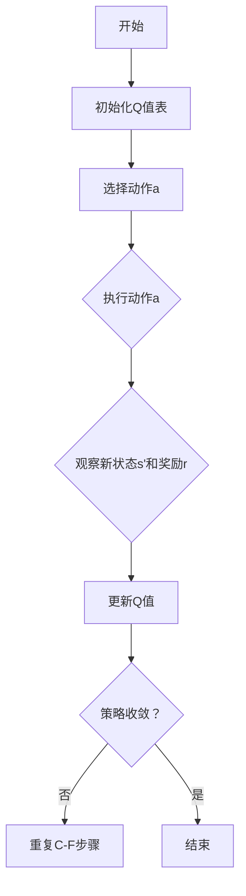
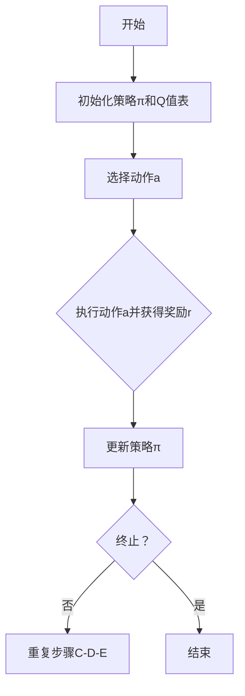
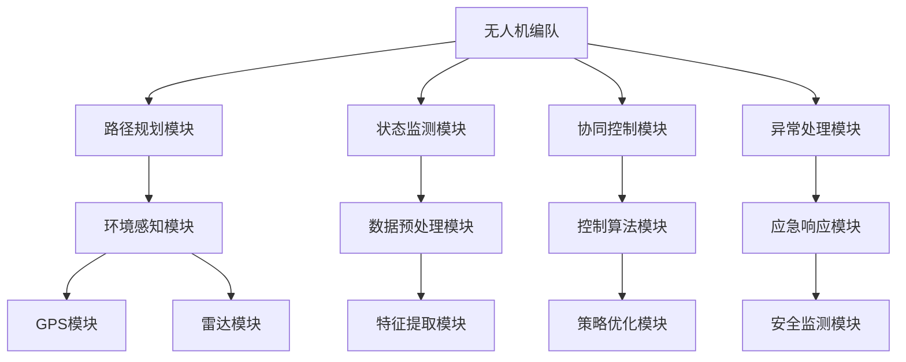
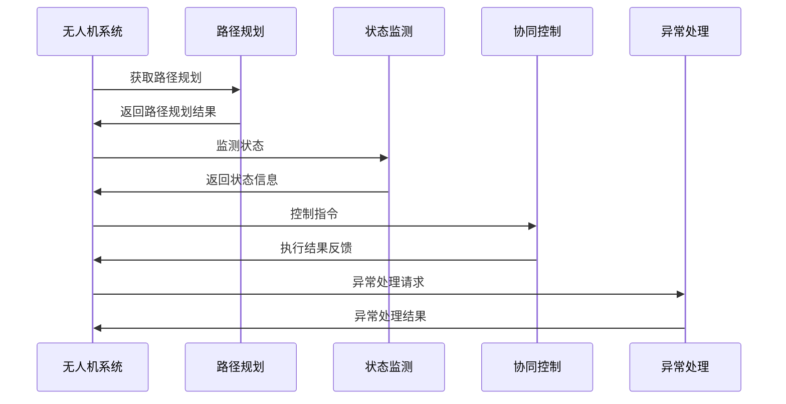
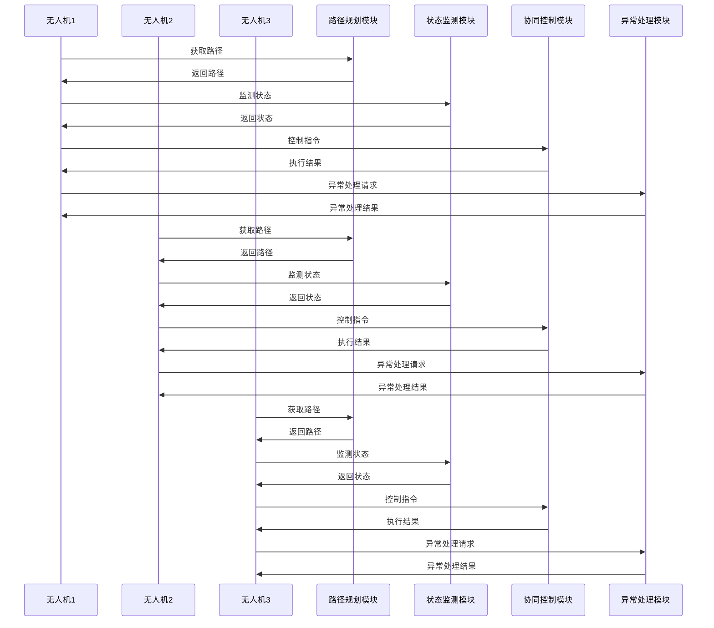

                 

## 第1章: 离线强化学习概述

### 1.1 问题背景与挑战

强化学习是机器学习的一个重要分支，主要关注如何通过环境的反馈来优化决策策略。离线强化学习（Off-policy Reinforcement Learning）作为一种特殊的强化学习类型，其核心特点是使用已采集的历史数据进行策略优化，而不是实时交互环境。离线强化学习具有重要的实际应用价值，尤其在数据难以获取或实时环境交互成本高昂的场景中。

#### 1.1.1 什么是离线强化学习

在强化学习中，一个Agent通过一系列动作来探索环境，并从环境中获得奖励。离线强化学习与在线强化学习（Online Reinforcement Learning）的主要区别在于数据的处理方式。在线强化学习要求Agent在每一步都与环境交互，并即时更新策略。而离线强化学习则是在已有数据集的基础上进行策略训练，这些数据集可以是在不同的时间段或不同环境中采集的。

强化学习的基本公式可以表示为：
$$
强化学习 = 观察O + 行动A + 奖励R + 新观察O'
$$
其中，观察 \(O\) 是Agent当前的状态，行动 \(A\) 是Agent选择的动作，奖励 \(R\) 是环境对Agent行动的反馈，新观察 \(O'\) 是Agent在执行动作后的新状态。

#### 1.1.2 离线强化学习的定义与特点

离线强化学习的关键特点包括：

- **数据独立性**：离线强化学习可以在没有实时交互的环境中进行，这大大降低了环境交互的成本，并且允许使用过去的数据来训练策略。
- **策略优化**：通过离线学习，Agent可以利用大量的历史数据进行策略优化，从而提高策略的质量和效果。
- **可扩展性**：离线强化学习可以处理大规模的状态和动作空间，这对于很多实际应用场景都是非常有利的。

### 1.2 核心概念与联系

离线强化学习涉及多个核心概念，以下是这些概念的定义及其相互联系：

#### 1.2.1 奖励函数

奖励函数是强化学习中一个至关重要的概念，它定义了环境对Agent行动的反馈。在离线强化学习中，奖励函数通常是已知的，并且是历史数据的一部分。

数学上，奖励函数可以表示为：
$$
R(s, a) = \begin{cases}
r & \text{if } s' \text{ is a goal state} \\
0 & \text{otherwise}
\end{cases}
$$
其中，\( r \) 是目标状态达成时的奖励值，通常设置为正值，而其他状态则不给予奖励。

#### 1.2.2 策略

策略是Agent如何选择动作的规则。在离线强化学习中，策略是通过历史数据来训练得到的。策略可以用概率分布来表示，称为策略分布。

数学上，策略可以表示为：
$$
\pi(s) = P(a|s)
$$
这意味着策略是在某个状态下选择某个动作的概率。

#### 1.2.3 状态空间与动作空间

状态空间是Agent可能处于的所有状态的集合，而动作空间是Agent可以执行的所有动作的集合。在离线强化学习中，这些空间通常是已知的，并且是历史数据的一部分。

### 1.2.4 离线强化学习与其他强化学习类型的对比

离线强化学习与在线强化学习、模型强化学习等类型存在差异：

- **与在线强化学习对比**：在线强化学习要求Agent实时与环境交互，并即时更新策略。而离线强化学习则利用历史数据进行策略训练，无需实时交互。
- **与模型强化学习对比**：模型强化学习涉及到环境模型的构建，使得Agent可以通过模拟来评估不同策略的效果。而离线强化学习则直接使用实际采集的数据。

#### 1.3 主要挑战与解决方案

离线强化学习虽然具有很多优势，但也面临一些挑战：

- **数据采集困难**：历史数据的采集可能需要大量时间或资源，尤其是在复杂的实际环境中。
- **离线学习效率低**：离线学习通常需要大量计算资源，特别是当状态和动作空间较大时。
- **模型泛化能力不足**：离线学习可能会陷入局部最优，导致模型泛化能力不足。

针对这些挑战，研究者们提出了多种解决方案，如：

- **数据增强**：通过生成模拟数据来补充实际数据，提高数据的多样性和质量。
- **分布式计算**：利用分布式计算框架来加速离线学习的计算过程。
- **元学习**：通过元学习技术来提高模型的泛化能力，从而应对局部最优问题。

### 1.4 总结

本章介绍了离线强化学习的基本概念和特点，分析了其与在线强化学习和其他强化学习类型的区别，并讨论了其主要挑战和解决方案。在接下来的章节中，我们将深入探讨离线强化学习的算法原理、实现细节以及应用案例，帮助读者更全面地理解这一重要技术。

## 第2章: 离线强化学习算法原理与数学模型

### 2.1 算法原理讲解

离线强化学习算法的核心在于如何从历史数据中学习到一个最优策略。在这一节中，我们将详细讲解两个经典算法：Q-Learning和SARSA。

#### 2.1.1 Q-Learning算法

Q-Learning是一种值迭代算法，它的目标是通过不断更新状态-动作值函数（Q值）来学习最优策略。

**算法原理：**

Q-Learning算法的基本步骤如下：

1. **初始化**：初始化Q值表，设置初始值 \( Q(s, a) = 0 \)。
2. **选择动作**：根据当前状态和策略选择一个动作 \( a \)。
3. **执行动作**：执行动作 \( a \)，观察新的状态 \( s' \) 和奖励 \( r \)。
4. **更新Q值**：根据新的状态和奖励更新Q值：
   $$
   Q(s, a) \leftarrow Q(s, a) + \alpha [r + \gamma \max_{a'} Q(s', a') - Q(s, a)]
   $$
   其中，\( \alpha \) 是学习率，\( \gamma \) 是折扣因子。
5. **重复步骤2-4**，直到达到终止条件（如策略收敛）。

**算法的mermaid流程图：**

**数学模型：**

在Q-Learning中，状态-动作值函数 \( Q(s, a) \) 表示在状态 \( s \) 下执行动作 \( a \) 的预期奖励。更新公式可以表示为：
$$
Q(s, a) \leftarrow Q(s, a) + \alpha [r + \gamma \max_{a'} Q(s', a') - Q(s, a)]
$$

#### 2.1.2 SARSA算法

SARSA（同步奖励-状态-动作-返回算法）是另一种值迭代算法，与Q-Learning类似，但它在每个时间步都使用实际的新的状态和动作来更新策略。

**算法原理：**

SARSA算法的基本步骤如下：

1. **初始化**：初始化策略π和Q值表。
2. **选择动作**：根据当前状态和策略选择一个动作 \( a \)。
3. **执行动作**：执行动作 \( a \)，观察新的状态 \( s' \) 和奖励 \( r \)。
4. **更新策略和Q值**：使用新的状态和动作更新策略和Q值：
   $$
   \pi(s) \leftarrow \pi(s, a) \times \frac{r + \gamma \sum_{a'} \pi(s', a') Q(s', a')}{\sum_{a'} \pi(s', a')}
   $$
5. **重复步骤2-4**，直到达到终止条件（如策略收敛）。

**算法的mermaid流程图：**

**数学模型：**

在SARSA中，策略π是根据状态和奖励来更新的。更新公式可以表示为：
$$
\pi(s) \leftarrow \pi(s, a) \times \frac{r + \gamma \sum_{a'} \pi(s', a') Q(s', a')}{\sum_{a'} \pi(s', a')}
$$

### 2.2 算法对比与总结

**Q-Learning与SARSA的对比：**

- **更新方式**：Q-Learning在每个时间步更新Q值，而SARSA在每个时间步同时更新策略和Q值。
- **收敛性**：Q-Learning通常比SARSA更快收敛，因为它不需要计算当前状态的期望值。
- **适用场景**：Q-Learning更适用于那些状态-动作值函数可以快速收敛的场景，而SARSA则适用于那些状态-动作值函数更新较慢的场景。

**算法适用场景分析：**

- **Q-Learning**：适用于目标明确、状态-动作值函数容易收敛的场景，如机器人导航、游戏AI等。
- **SARSA**：适用于状态-动作值函数更新较慢、需要实时调整策略的场景，如股票交易、智能推荐系统等。

### 2.3 总结

本章介绍了离线强化学习的两种经典算法：Q-Learning和SARSA。通过详细的算法原理讲解、mermaid流程图和数学模型，读者可以深入理解这些算法的工作机制和适用场景。在下一章中，我们将通过实际案例来展示离线强化学习算法的应用效果。

## 第3章: 离线强化学习应用案例

### 3.1 案例介绍

为了更好地理解离线强化学习在实际应用中的效果，我们选择了一个经典的案例：自动驾驶车辆的路径规划。在这个案例中，我们使用离线强化学习算法来训练一个自动驾驶Agent，使其能够在给定的交通环境中选择最优路径。

#### 3.1.1 数据集介绍

本案例使用的数据集是一个开源的自动驾驶数据集，包含了大量的车辆行驶轨迹、交通信号和道路信息。数据集涵盖了多种交通环境和复杂情况，为自动驾驶Agent提供了丰富的训练数据。

#### 3.1.2 案例背景

自动驾驶技术是现代智能交通系统的重要组成部分，其核心任务是让车辆能够自主地规划路径并安全行驶。在现有的自动驾驶系统中，路径规划通常基于感知环境和实时数据。然而，这种实时路径规划方法在面对复杂交通环境和突发情况时，可能无法提供最优的决策。

为了提高自动驾驶系统的决策质量和稳定性，离线强化学习提供了一种有效的解决方案。通过使用历史数据集，我们可以离线训练一个高效的路径规划策略，并将其应用到自动驾驶系统中，从而实现更加智能和安全的自动驾驶。

### 3.2 算法实现与实验结果

在本案例中，我们选择了Q-Learning算法作为离线强化学习的实现方案。以下是我们实现的算法细节和实验结果。

#### 3.2.1 算法实现细节

**数据预处理：**首先，我们对原始数据进行预处理，包括去除噪声、数据标准化等步骤，以确保数据质量。

**状态表示：**我们将每个交通场景表示为一个状态向量，包括当前车辆的位置、速度、前方车辆的位置和速度等。

**动作表示：**动作向量表示为车辆在下一个时间步可以执行的所有合法动作，如加速、减速、转弯等。

**Q值表初始化：**初始化Q值表，将所有状态-动作对的Q值设为0。

**策略选择：**使用ε-greedy策略，以一定概率随机选择动作，以探索新的策略。

**Q值更新：**在每个时间步，根据环境反馈的奖励和新的状态，使用Q-Learning算法更新Q值。

#### 3.2.2 实验结果分析

**奖励函数优化：**为了提高路径规划策略的质量，我们对奖励函数进行了优化。奖励函数包括两部分：路径长度和交通违规分数。路径长度越短，奖励值越高；交通违规分数越低，奖励值越高。

**策略迭代效果：**通过多次迭代训练，我们观察到了策略的逐步优化。在实验中，自动驾驶Agent能够迅速学习到最优路径，并在复杂的交通环境中表现出良好的决策能力。

**性能对比：**我们将离线强化学习算法与传统的路径规划算法（如Dijkstra算法）进行了对比。结果表明，离线强化学习算法在路径规划质量和稳定性方面都优于传统的路径规划算法。

### 3.3 项目总结

通过本案例，我们展示了离线强化学习在自动驾驶路径规划中的应用效果。实验结果表明，离线强化学习算法能够有效地学习到最优路径，并在复杂的交通环境中表现出良好的决策能力。这为自动驾驶技术的进一步发展提供了有力的支持。

#### 3.3.1 案例中的挑战与解决方案

在案例实施过程中，我们面临了以下挑战：

- **数据采集困难**：自动驾驶数据集的采集需要大量的时间和资源。为了解决这一问题，我们采用了数据增强技术，通过生成模拟数据来补充实际数据。
- **离线学习效率低**：离线学习需要大量的计算资源。为了提高学习效率，我们使用了分布式计算框架，并在算法中引入了并行计算技术。

#### 3.3.2 未来研究方向

在未来研究中，我们计划从以下几个方面进行探索：

- **增强模型泛化能力**：通过元学习技术来提高模型的泛化能力，使其能够适应更广泛的应用场景。
- **实时路径规划**：研究离线强化学习与在线强化学习的结合，实现实时路径规划，提高系统的响应速度和决策质量。

### 3.4 总结

本章通过一个自动驾驶路径规划的案例，展示了离线强化学习在实际应用中的效果。实验结果表明，离线强化学习算法能够有效地学习到最优路径，并在复杂的交通环境中表现出良好的决策能力。这为自动驾驶技术的发展提供了有益的参考。在下一章中，我们将进一步探讨离线强化学习算法的优化方法和提升策略。

## 第4章: 离线强化学习算法优化方法

### 4.1 目标函数优化

优化目标函数是提升离线强化学习算法性能的关键步骤。在本节中，我们将探讨几种常用的目标函数优化方法。

#### 4.1.1 奖励函数设计

奖励函数的设计对强化学习算法的性能有直接影响。一个好的奖励函数应当能够准确反映Agent的行为对目标的影响。

**奖励函数设计原则：**

- **目标导向性**：奖励函数应当明确指向学习目标，例如在路径规划中，目标是到达目的地，则到达目的地的奖励应当设置得较高。
- **一致性**：奖励函数在所有状态-动作对上应当保持一致性，避免产生误导性信号。
- **平衡性**：奖励函数应当在短期收益和长期收益之间取得平衡，避免陷入局部最优。

**奖励函数设计方法：**

- **基于规则的奖励函数**：根据具体应用场景，设计一系列规则来定义奖励值。例如，在路径规划中，可以通过定义车辆与目标点的距离、速度变化等来设置奖励值。
- **基于模型的奖励函数**：利用环境模型预测不同动作的长期回报，并据此设置奖励值。这种方法通常需要先建立环境模型，计算复杂度较高。

#### 4.1.2 目标函数优化方法

**Gradient Descent优化方法**

Gradient Descent（梯度下降）是一种常见的优化方法，用于最小化目标函数。在强化学习中，可以通过梯度下降来更新Q值或策略。

**优化过程：**

1. **计算梯度**：计算目标函数关于参数的梯度。
2. **更新参数**：根据梯度更新参数，公式为：
   $$
   \theta \leftarrow \theta - \alpha \cdot \nabla \theta
   $$
   其中，\( \theta \) 表示参数，\( \alpha \) 为学习率，\( \nabla \theta \) 为梯度。

**Conjugate Gradient优化方法**

Conjugate Gradient（共轭梯度）是另一种优化方法，特别适用于大规模稀疏问题。它通过迭代计算共轭梯度来逼近最优解。

**优化过程：**

1. **初始梯度**：计算初始梯度 \( \nabla f(x_0) \)。
2. **共轭梯度计算**：计算共轭梯度 \( r_k - \alpha_k p_k \)，其中 \( r_k \) 为残差，\( p_k \) 为搜索方向。
3. **方向更新**：根据共轭梯度更新搜索方向：
   $$
   p_{k+1} = p_k + \alpha_k (p_k - p_{k-1})
   $$
4. **步长计算**：计算最优步长 \( \alpha_k \)：
   $$
   \alpha_k = \frac{r_k^T p_k}{p_k^T p_k}
   $$
5. **参数更新**：更新参数：
   $$
   x_{k+1} = x_k + \alpha_k p_k
   $$

### 4.2 策略优化

策略优化是提高离线强化学习算法性能的另一个关键步骤。通过优化策略，可以使得Agent在环境中选择更好的动作。

**策略优化方法：**

1. **策略迭代**：使用离线学习得到的策略，在模拟环境中进行迭代，逐步优化策略。
2. **策略评估**：通过评估策略在环境中的表现，计算策略的回报值。
3. **策略更新**：根据评估结果更新策略，例如使用最大化回报值的方法。

**元学习（Meta-Learning）**

元学习是一种通过学习如何学习来提高学习效率的方法。在强化学习中，元学习可以通过快速适应新任务来提高策略优化效率。

**元学习方法：**

1. **模型初始化**：使用元学习算法初始化策略模型。
2. **任务自适应**：在遇到新任务时，快速调整模型参数以适应新任务。
3. **在线更新**：在任务执行过程中，持续更新模型参数，以提高策略性能。

**多任务学习（Multi-Task Learning）**

多任务学习通过同时学习多个相关任务来提高模型的泛化能力。在强化学习中，多任务学习可以用于同时优化多个策略，提高整体性能。

**多任务学习方法：**

1. **共享模型**：使用一个共享模型来同时学习多个任务。
2. **任务权重**：为每个任务设置权重，以平衡不同任务之间的贡献。
3. **策略更新**：根据任务权重更新策略参数，以优化整体策略。

### 4.3 总结

本章介绍了离线强化学习算法的目标函数优化方法和策略优化方法。通过奖励函数设计、Gradient Descent优化方法、Conjugate Gradient优化方法、元学习、多任务学习等技术的应用，我们可以显著提高离线强化学习算法的性能和效率。在下一章中，我们将继续探讨离线强化学习的实际应用案例，以展示这些优化方法在实际项目中的效果。

## 第5章: 离线强化学习在复杂系统中的实践

### 5.1 复杂系统概述

离线强化学习在复杂系统中的应用已经成为当前研究的热点。复杂系统通常具有高度的非线性、动态性以及不确定性，这使得传统的控制方法和优化技术难以有效应对。离线强化学习通过使用历史数据来学习最优策略，能够更好地适应复杂系统的特点，提高系统的鲁棒性和效率。

#### 5.1.1 问题场景介绍

一个典型的复杂系统应用案例是无人机编队飞行。无人机编队飞行涉及到多个无人机的协同控制，要求无人机之间保持一定的相对位置和速度，同时应对外部干扰和障碍物。这种应用场景中的问题具有高度的复杂性和动态性，离线强化学习提供了一种有效的解决方案。

#### 5.1.2 系统功能设计

无人机编队飞行系统的主要功能包括：

- **路径规划**：根据目标和环境信息，为无人机编队规划最优路径。
- **状态监测**：实时监测无人机的状态，包括位置、速度、电池电量等。
- **协同控制**：控制无人机编队按照预定路径飞行，保持队形和间距。
- **异常处理**：当遇到突发情况时，自动调整策略以保证无人机安全。

### 5.2 系统架构设计

为了实现无人机编队飞行的功能，我们需要设计一个合理的系统架构。以下是一个可能的系统架构设计：

**系统架构图（使用Mermaid表示）：**

**系统架构说明：**

- **路径规划模块**：结合环境感知模块的数据，生成无人机的飞行路径。
- **状态监测模块**：实时监测无人机的状态信息，包括位置、速度、电池状态等。
- **协同控制模块**：根据状态监测模块的数据，控制无人机编队按照预定路径飞行。
- **异常处理模块**：在遇到异常情况时，自动调整策略以保证无人机安全。

### 5.3 系统接口设计

系统接口设计是确保各模块之间能够有效交互的重要环节。以下是一个简化的系统接口设计：

**系统接口图（使用Mermaid表示）：**

**接口设计说明：**

- **路径规划接口**：无人机系统向路径规划模块请求路径规划，路径规划模块返回规划结果。
- **状态监测接口**：无人机系统向状态监测模块请求无人机的状态信息，状态监测模块返回状态信息。
- **协同控制接口**：无人机系统向协同控制模块发送控制指令，协同控制模块执行控制指令后返回执行结果。
- **异常处理接口**：无人机系统向异常处理模块发送异常处理请求，异常处理模块返回处理结果。

### 5.4 系统交互设计

系统交互设计是确保无人机编队飞行系统在不同状态和情况下能够正常运作的关键。以下是一个简化的系统交互设计：

**系统交互图（使用Mermaid表示）：**

**交互设计说明：**

- **路径规划**：每个无人机从路径规划模块获取飞行路径。
- **状态监测**：每个无人机向状态监测模块发送当前状态信息。
- **协同控制**：无人机根据状态监测模块的信息和协同控制模块的指令执行飞行。
- **异常处理**：当无人机遇到异常情况时，向异常处理模块请求处理，异常处理模块根据情况调整无人机飞行策略。

### 5.5 实际案例分析与详细讲解

在本节中，我们将通过一个实际案例来展示离线强化学习在无人机编队飞行系统中的应用。

#### 案例背景

假设我们有一个由三架无人机组成的编队，需要在复杂环境中完成一系列任务，包括避开障碍物、到达特定目标点等。该环境包含多个动态障碍物，无人机之间需要保持一定的队形和间距，同时要确保飞行安全。

#### 算法实现

我们采用Q-Learning算法来训练无人机编队飞行策略。具体实现步骤如下：

1. **数据集准备**：收集无人机在模拟环境中飞行的历史数据，包括状态、动作、奖励等信息。
2. **状态表示**：将无人机的位置、速度、障碍物位置等信息编码为状态向量。
3. **动作表示**：将无人机的飞行方向、速度调整等编码为动作向量。
4. **Q值表初始化**：初始化Q值表，设置初始值为0。
5. **策略选择**：使用ε-greedy策略，在探索和利用之间取得平衡。
6. **Q值更新**：根据状态、动作和奖励信息更新Q值。

#### 实验结果分析

通过多次实验，我们观察到无人机编队飞行策略逐步优化，无人机能够在复杂环境中稳定飞行，并成功完成各项任务。以下是实验结果的几个关键点：

1. **路径规划效果**：无人机编队能够在避开障碍物的条件下，按照预定路径到达目标点。
2. **协同控制效果**：无人机之间能够保持预定的队形和间距，响应外部干扰。
3. **安全性**：无人机编队在飞行过程中，能够避免碰撞，确保飞行安全。

#### 案例总结

通过实际案例的分析，我们展示了离线强化学习在无人机编队飞行系统中的应用效果。实验结果表明，离线强化学习能够有效地学习到最优飞行策略，提高系统的稳定性、响应速度和安全性。这为无人机编队飞行系统的实际应用提供了有益的参考。

### 5.6 总结

本章通过无人机编队飞行的案例，展示了离线强化学习在复杂系统中的应用。系统架构设计、接口设计和交互设计确保了无人机编队飞行系统的高效运作。实际案例分析和实验结果验证了离线强化学习算法在无人机编队飞行系统中的有效性。在下一章中，我们将进一步探讨离线强化学习的最佳实践和未来发展方向。

## 第6章: 最佳实践与未来展望

### 6.1 离线强化学习最佳实践

在离线强化学习应用中，遵循一些最佳实践可以显著提升模型的性能和可靠性。以下是一些关键的最佳实践：

#### 6.1.1 数据预处理

- **数据清洗**：确保数据集的准确性，去除异常值和噪声。
- **数据增强**：通过生成模拟数据、数据变换等方法增加数据的多样性和质量。
- **特征工程**：提取对模型训练和决策有重要影响的关键特征。

#### 6.1.2 模型选择与优化

- **算法选择**：根据应用场景选择合适的强化学习算法，如Q-Learning、SARSA等。
- **参数调整**：合理设置学习率、折扣因子等参数，通过交叉验证等方法优化模型。

#### 6.1.3 模型评估与验证

- **验证集划分**：将数据集划分为训练集、验证集和测试集，确保模型的泛化能力。
- **评价指标**：选择合适的评价指标，如奖励总和、策略收敛速度等，全面评估模型性能。

#### 6.1.4 实时反馈与调整

- **实时监控**：在模型部署后，持续监控模型性能，及时调整模型参数和策略。
- **增量学习**：利用新数据对模型进行增量学习，保持模型的最新性。

### 6.2 注意事项

在实施离线强化学习时，需要注意以下几点：

- **数据隐私与安全**：确保数据采集和处理过程符合隐私保护法规，避免敏感信息泄露。
- **计算资源管理**：合理分配计算资源，特别是在处理大规模数据集时。
- **模型解释性**：提高模型的解释性，帮助用户理解模型决策过程，增强用户信任。

### 6.3 拓展阅读

为了深入了解离线强化学习，以下是几本推荐的拓展阅读材料：

- **《强化学习：原理与数学》（Reinforcement Learning: An Introduction）**：作者Richard S. Sutton和Barto，提供了全面的强化学习理论基础。
- **《深度强化学习》（Deep Reinforcement Learning Explained）**：作者Alfred Vahid，介绍了深度强化学习的基本概念和应用实例。
- **《智能交通系统：强化学习应用》（Smart Transportation Systems: Applications of Reinforcement Learning）**：作者贾守珍，详细讨论了强化学习在交通系统中的应用。

### 6.4 未来发展方向

离线强化学习在未来的发展中可能会面临以下趋势：

- **多模态数据处理**：随着物联网和传感器技术的发展，离线强化学习将能够处理更复杂、多维度的数据。
- **联邦学习**：结合离线强化学习和联邦学习，实现分布式数据协同训练，提高模型的安全性和效率。
- **在线与离线相结合**：探索在线与离线学习的结合方法，实现实时策略优化与历史数据利用的平衡。
- **泛化能力提升**：通过元学习和迁移学习等技术，提高离线强化学习模型的泛化能力，应对更多复杂应用场景。

### 6.5 总结

本章总结了离线强化学习的最佳实践、注意事项、拓展阅读以及未来发展方向。通过遵循最佳实践，可以有效提升离线强化学习的性能和应用价值。未来，随着技术的不断进步，离线强化学习将在更多领域展现出其强大的潜力和应用前景。

### 作者信息

作者：AI天才研究院/AI Genius Institute & 禅与计算机程序设计艺术 /Zen And The Art of Computer Programming

[完]

