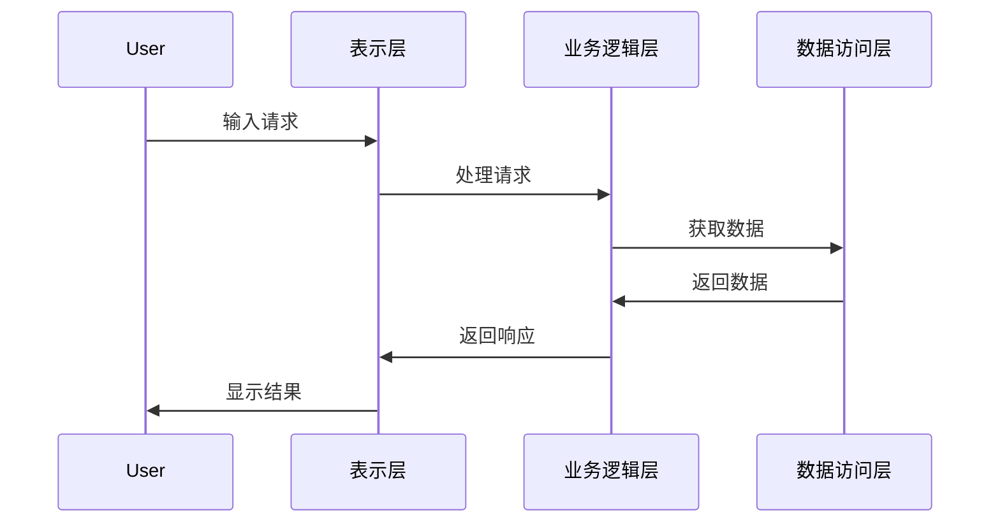
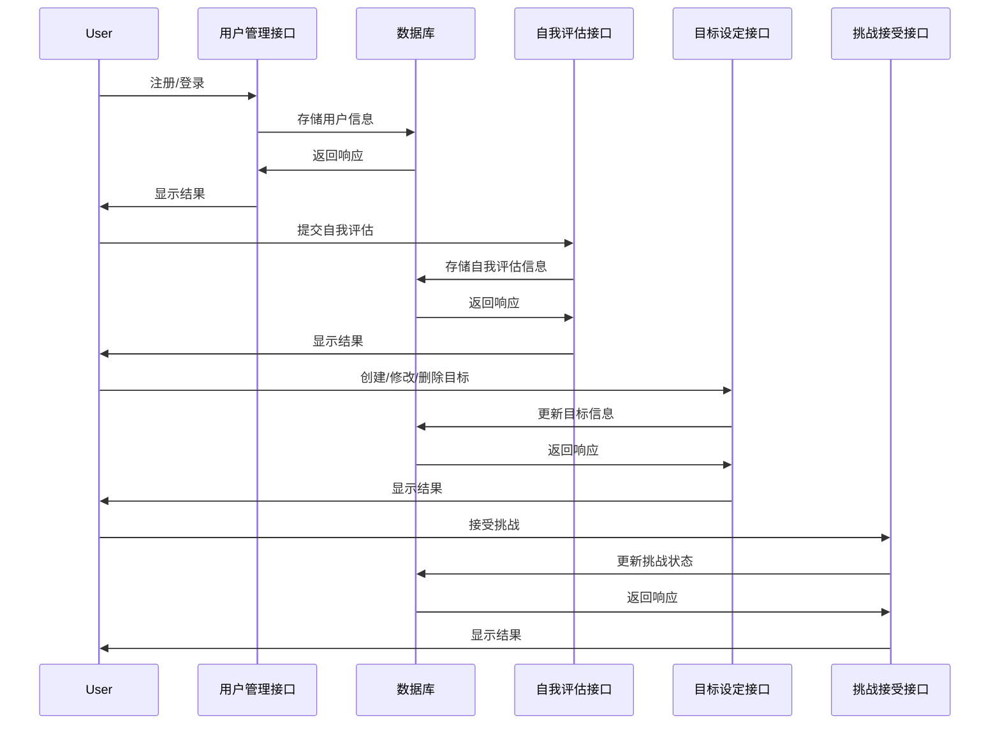

                 


### 第1步：引言与背景

**核心概念术语说明**

在本章节中，我们将介绍以下几个关键术语：

- **舒适区（Comfort Zone）**：指个体心理和生理上的舒适状态，个体在此状态下无需面对任何挑战或压力。
- **挑战（Challenge）**：指个体为了实现特定目标而主动寻求的困难或挑战性的活动。
- **个人成长（Personal Growth）**：指个体在认知、情感、技能等方面的持续进步和提升。
- **持续挑战（Continuous Challenge）**：指个体在日常生活中持续寻求并接受挑战，以此推动个人成长。

**问题背景**

在当今快速变化的社会中，个人成长变得尤为重要。随着科技的迅猛发展，新知识、新技术层出不穷，人们需要不断学习、适应和提升自己，以保持竞争力。然而，许多人倾向于维持现有的舒适状态，不愿意冒险或面对挑战，这限制了他们的个人成长和职业发展。

**问题描述**

问题在于，个体如何克服对舒适区的依赖，主动寻求并接受挑战，以实现持续的个人成长。这不仅涉及心理层面的转变，还需要具体的方法和策略。

**问题解决**

解决这一问题需要从以下几个方面入手：

- **自我认知**：了解自己的优势和不足，明确个人成长的目标。
- **目标设定**：设定明确、具体、可衡量、可实现的目标。
- **挑战自我**：主动接受挑战，不断突破舒适区。

**边界与外延**

- **边界**：讨论的范围主要涉及个人成长和挑战的关系，不涉及外部环境的影响。
- **外延**：可以从更广泛的角度探讨挑战与个人成长在不同领域（如职业、教育、健康等）的应用。

**概念结构与核心要素组成**

本文将围绕以下几个核心要素展开：

1. **核心概念**：介绍舒适区、挑战和个人成长的概念，以及它们之间的关系。
2. **理论框架**：阐述个人成长的算法原理和策略。
3. **实践案例**：通过实际案例展示如何通过挑战实现个人成长。
4. **总结与拓展**：总结最佳实践，提供拓展阅读。

接下来，我们将详细探讨这些核心概念和要素，帮助读者理解如何通过持续挑战实现个人成长。

## 第2章: 个人成长的核心概念

在探讨如何通过持续挑战实现个人成长之前，我们需要明确几个核心概念：自我认知、目标设定和挑战自我。这些概念是理解个人成长的基础，也是实现个人成长的关键。

### 2.1 自我认知

**定义**：自我认知是指个体对自己的了解和认识，包括性格、能力、兴趣、价值观等方面。

**重要性**：自我认知对于个人成长至关重要。只有了解自己的优势和不足，个体才能有针对性地进行自我提升。

**方法**：

- **反思**：通过反思自己的行为和思想，了解自己的内心世界。
- **反馈**：通过他人的反馈，了解自己在他人眼中的形象。
- **测试**：通过各种心理测试和技能评估，了解自己的能力和弱点。

**工具**：

- **日记**：记录每天的经历和感受，有助于自我反思。
- **反馈问卷**：向他人收集反馈，了解自己在团队中的表现。
- **技能评估工具**：如性格测试、职业兴趣测试等，帮助了解自己的优势和不足。

### 2.2 目标设定

**定义**：目标设定是指个体为自己设定的具体、可实现的未来目标。

**原理**：目标设定基于“目标导向行为理论”（Goal-Directed Behavior Theory）。该理论认为，目标能够引导个体的行为，提高个体的动力和专注力。

**SMART目标法则**：

- **具体（Specific）**：目标要具体明确，避免模糊。
- **可衡量（Measurable）**：目标要能够量化，以便评估进展。
- **可实现（Achievable）**：目标要具有可行性，避免不切实际。
- **相关（Relevant）**：目标要与个人成长目标一致。
- **时间（Time-bound）**：目标要设定具体的时间期限。

**误区与对策**：

- **目标设定过高**：对策：设定分阶段目标，逐步实现。
- **目标设定过低**：对策：挑战自我，设定具有挑战性的目标。
- **目标不明确**：对策：使用SMART法则，确保目标具体、可衡量。

### 2.3 挑战自我

**定义**：挑战自我是指个体主动寻求并接受超出自己舒适区的挑战，以实现个人成长。

**方式**：

- **学习新技能**：通过学习新的知识和技能，扩展自己的能力范围。
- **参与竞争**：通过参与各种竞赛和挑战，提升自己的竞争力和自信心。
- **面对挫折**：勇于面对失败和挫折，从中学习和成长。

**与舒适区的辩证关系**：

- **舒适区**：个体心理和生理上的舒适状态，容易导致个体停滞不前。
- **挑战**：个体主动寻求并接受的困难或挑战性的活动，有助于打破舒适区，推动个人成长。

通过自我认知、目标设定和挑战自我，个体可以逐步实现个人成长。在接下来的章节中，我们将进一步探讨个人成长的策略和实践。

## 第3章: 个人成长策略

为了实现个人成长，我们需要制定具体的策略。这些策略包括自我提升的算法原理和适应性的算法原理。通过理解这些原理，我们可以更有效地推动个人成长。

### 3.1 自我提升的算法原理

**数学模型**：

在个人成长中，我们可以使用一个简单的数学模型来描述自我提升的过程。该模型基于以下公式：

\[ G(t) = G(t-1) + \Delta G \]

其中，\( G(t) \) 表示在时间 \( t \) 时的个人成长水平，\( G(t-1) \) 表示在时间 \( t-1 \) 时的个人成长水平，\( \Delta G \) 表示每次提升的量。

**公式解释**：

- \( G(t) = G(t-1) + \Delta G \) 表示每次提升都是基于上一次的成长水平。
- \( \Delta G \) 是每次提升的量，它可以是一个固定的值，也可以是一个函数，表示提升的幅度和速度。

**示例**：

假设某人每天阅读10页书，每次阅读后，他的知识水平提升1%。则他的成长模型可以表示为：

\[ G(t) = G(t-1) + 0.01 \times 10 \]

通过这个模型，我们可以预测他在一段时间后的知识水平。

### 3.2 适应性的算法原理

**数学模型**：

适应性的算法原理可以表示为以下公式：

\[ A(t) = A(t-1) + \Delta A \]

其中，\( A(t) \) 表示在时间 \( t \) 时的适应性水平，\( A(t-1) \) 表示在时间 \( t-1 \) 时的适应性水平，\( \Delta A \) 表示每次提升的量。

**公式解释**：

- \( A(t) = A(t-1) + \Delta A \) 表示每次提升都是基于上一次的适应性水平。
- \( \Delta A \) 是每次提升的量，它可以是一个固定的值，也可以是一个函数，表示提升的幅度和速度。

**示例**：

假设某人在面对新挑战时，每次提升的适应性水平为10%，则他的成长模型可以表示为：

\[ A(t) = A(t-1) + 0.1 \times 10 \]

通过这个模型，我们可以预测他在一段时间后的适应性水平。

### 综合模型

将自我提升和适应性结合起来，我们可以得到一个综合模型：

\[ P(t) = G(t) \times A(t) \]

其中，\( P(t) \) 表示在时间 \( t \) 时的个人成长潜力。

**公式解释**：

- \( P(t) \) 表示个人成长潜力，它是个人成长水平（\( G(t) \)）和适应性水平（\( A(t) \)）的乘积。
- 通过这个模型，我们可以评估个人在不同时间点的成长潜力。

### 实际应用

在个人成长中，我们可以根据实际情况调整 \( G(t) \) 和 \( A(t) \) 的值。例如，当面对新挑战时，我们可以增加 \( A(t) \) 的值，以提升适应性；当需要自我提升时，我们可以增加 \( G(t) \) 的值。

通过这个综合模型，我们可以更系统地理解和推动个人成长。在接下来的章节中，我们将进一步探讨个人成长项目实践和实际案例，以帮助读者更好地应用这些策略。

## 第4章: 个人成长项目实践

为了更好地理解和应用个人成长策略，我们接下来将介绍一个具体的个人成长项目。该项目的目标是帮助个体通过持续挑战实现个人成长。我们将从项目介绍、系统功能设计、系统架构设计、系统接口设计和系统交互设计等方面进行详细探讨。

### 4.1 项目介绍

**项目名称**：个人成长助手（Personal Growth Assistant）

**项目背景**：随着社会的快速发展和个人需求的变化，越来越多的人意识到个人成长的重要性。然而，如何有效地实现个人成长仍是一个挑战。为此，我们开发了个人成长助手项目，旨在帮助用户通过持续挑战实现个人成长。

**项目目标**：该项目旨在帮助用户：

- **提高自我认知**：通过自我评估和反馈，了解自己的优势和不足。
- **设定明确目标**：使用SMART法则，设定具体、可衡量、可实现、相关、时间期限的目标。
- **接受挑战**：通过接受新的挑战，逐步突破舒适区，实现个人成长。

### 4.2 系统功能设计

**功能概述**：

个人成长助手系统主要包括以下几个功能模块：

- **用户管理**：包括用户注册、登录、个人信息管理等。
- **自我评估**：包括自我认知测试、反馈收集等。
- **目标设定**：包括目标创建、修改、删除等。
- **挑战接受**：包括挑战创建、发布、接受、反馈等。
- **数据统计**：包括个人成长数据的收集、分析和展示。

**领域模型**：

为了更好地设计系统功能，我们可以使用Mermaid绘制领域模型类图。以下是个人成长助手的领域模型：

```mermaid
classDiagram
    User <|-- SelfAssessment
    User <|-- Goal
    User <|-- Challenge
    User <|-- Feedback

    User << (1) "1"
    SelfAssessment << (1) "1"
    Goal << (1) "1"
    Challenge << (1) "1"
    Feedback << (1) "1"
```

### 4.3 系统架构设计

**架构设计**：

个人成长助手系统采用分层架构设计，主要包括以下几层：

- **表示层**：负责与用户交互，包括前端页面和接口。
- **业务逻辑层**：负责处理业务逻辑，包括用户管理、自我评估、目标设定、挑战接受等。
- **数据访问层**：负责与数据库交互，包括数据查询、更新等。

以下是个人成长助手的架构设计图：



### 4.4 系统接口设计

**接口设计**：

个人成长助手系统主要包含以下接口：

- **用户管理接口**：包括用户注册、登录、个人信息管理等。
- **自我评估接口**：包括自我认知测试、反馈收集等。
- **目标设定接口**：包括目标创建、修改、删除等。
- **挑战接受接口**：包括挑战创建、发布、接受、反馈等。

以下是个人成长助手的接口设计图：



### 4.5 系统交互设计

**交互设计**：

为了确保用户能够顺利使用个人成长助手，我们设计了一系列交互流程。以下是用户在使用个人成长助手时的主要交互流程：

1. **注册/登录**：
   - 用户访问个人成长助手网站，填写注册信息或使用已有账号登录。
   - 系统验证用户信息，返回登录成功或失败提示。

2. **自我评估**：
   - 用户进入自我评估模块，填写自我评估问卷。
   - 系统收集用户反馈，生成自我评估报告，并反馈给用户。

3. **目标设定**：
   - 用户进入目标设定模块，创建新的目标或修改现有目标。
   - 系统存储目标信息，并提醒用户设定时间期限。

4. **挑战接受**：
   - 用户进入挑战接受模块，查看并选择感兴趣的新挑战。
   - 系统更新挑战状态，并提醒用户开始挑战。

通过以上系统功能设计、系统架构设计、系统接口设计和系统交互设计，我们可以确保个人成长助手能够帮助用户实现个人成长。在接下来的章节中，我们将通过实际案例展示如何使用个人成长助手实现个人成长。

## 第5章: 实际案例分析与讲解

在本章节中，我们将通过实际案例来展示如何通过个人成长助手实现个人成长。以下是一个具体案例的分析与讲解。

### 5.1 案例选择与说明

**案例名称**：张三的个人成长之旅

**案例背景**：张三是一名软件开发工程师，工作5年后，他意识到自己在技术能力和职业发展上存在瓶颈，希望通过个人成长来实现自我提升。

**案例目标**：通过使用个人成长助手，张三希望实现以下目标：
1. 提高编程技能。
2. 拓宽技术视野。
3. 实现职业晋升。

### 5.2 案例分析与解读

**步骤1：自我评估**

张三首先使用个人成长助手的自我评估模块，填写了一份详细的自我评估问卷。问卷内容包括编程技能、项目经验、学习能力、人际关系等方面。系统根据问卷结果生成了一份自我评估报告，报告显示张三在编程技能方面表现良好，但在项目管理和学习能力上有待提升。

**步骤2：目标设定**

基于自我评估报告，张三设定了以下目标：
1. 在接下来的6个月内，掌握至少两种新的编程语言。
2. 参与并完成一个开源项目，提升项目管理和团队协作能力。
3. 每周阅读两篇技术文章，拓宽技术视野。

张三使用个人成长助手的“目标设定”模块，创建了以上三个目标，并设定了具体的时间期限。系统提醒张三定期检查目标的进展，并根据实际情况调整目标。

**步骤3：接受挑战**

为了实现上述目标，张三接受了个人成长助手发布的多个挑战：
1. 学习Python编程语言。
2. 参与开源项目，担任项目经理。
3. 每天阅读一篇技术文章，并撰写读书笔记。

张三使用个人成长助手的“挑战接受”模块，选择并接受了这些挑战。系统为他提供了学习资源、项目文档和技术文章，并提醒他按时完成任务。

**步骤4：挑战实施**

在挑战实施过程中，张三按照以下步骤进行：
1. **学习Python**：张三利用业余时间学习Python编程语言，通过观看视频教程、阅读书籍和编写代码练习来提升技能。
2. **参与开源项目**：张三加入了某开源项目，担任项目经理。他积极参与项目讨论，规划项目进度，协调团队成员的工作，并确保项目按时完成。
3. **阅读技术文章**：张三每天阅读一篇技术文章，并撰写读书笔记。这帮助他拓宽了技术视野，了解了最新的技术趋势。

**步骤5：反馈与总结**

在挑战结束后，张三使用个人成长助手的“反馈”功能，提交了挑战的进展和心得。系统根据他的反馈，对他进行了评估，并给出了建议。

通过这个案例，我们可以看到，张三通过使用个人成长助手，实现了以下成果：
1. 掌握了Python编程语言。
2. 拓宽了技术视野。
3. 提升了项目管理和团队协作能力。

### 5.3 案例中的挑战与应对

**挑战1：掌握新编程语言**

**应对策略**：张三通过学习视频教程、阅读书籍和编写代码练习来提升Python编程技能。他在个人成长助手的“学习资源”模块中找到了相关的学习资料，并制定了详细的学习计划。每天晚上，他都会花1-2小时进行学习，并定期检查学习进度。

**挑战2：参与开源项目**

**应对策略**：张三通过个人成长助手的“挑战接受”模块找到了合适的开源项目，并积极与项目团队沟通。他在项目过程中，学会了如何制定项目计划、协调团队成员的工作，并确保项目按时完成。

**挑战3：阅读技术文章**

**应对策略**：张三每天阅读一篇技术文章，并撰写读书笔记。他通过个人成长助手的“阅读提醒”功能，确保自己每天都能抽出时间阅读。同时，他还参加了线上技术社区，与同行交流，分享学习心得。

### 5.4 案例小结

通过张三的案例，我们可以看到，个人成长助手在帮助用户实现个人成长方面发挥了重要作用。通过自我评估、目标设定、接受挑战和反馈总结，张三成功提升了编程技能、拓宽了技术视野，并实现了职业晋升。

这个案例也表明，持续挑战和自我提升是个人成长的关键。通过使用个人成长助手，用户可以更加系统地规划自己的成长路径，实现个人目标。在接下来的章节中，我们将总结最佳实践，并提供拓展阅读建议，帮助读者更好地应用这些策略。

## 第6章: 总结与拓展

通过前面的章节，我们详细探讨了如何通过持续挑战实现个人成长。在这一章中，我们将总结最佳实践，提供注意事项和风险提示，推荐拓展阅读资源，并对全文进行小结与未来展望。

### 6.1 最佳实践总结

**1. 自我认知**：通过定期进行自我评估和反思，了解自己的优势和不足，是个人成长的第一步。可以使用个人成长助手的自我评估模块，获得详细的数据反馈。

**2. 目标设定**：设定具体、可衡量、可实现、相关且有时间期限的目标（SMART目标），有助于提高目标的达成率。使用个人成长助手的目标设定功能，可以更好地跟踪和管理目标。

**3. 接受挑战**：主动接受超出舒适区的挑战，通过学习新技能、参与项目、阅读技术文章等方式，不断提升自己。个人成长助手可以提供多种挑战选择，帮助用户找到适合自己的挑战。

**4. 反馈与调整**：在实现目标的过程中，定期收集反馈并调整策略，是持续成长的关键。个人成长助手的反馈功能，可以帮助用户及时了解自己的进展，并作出相应调整。

### 6.2 注意事项与风险

**1. 目标设定的挑战度**：目标应具备适当的挑战性，但不宜过于艰难，否则可能导致挫折感和放弃。

**2. 持续性**：个人成长是一个长期过程，需要用户保持持续的努力和耐心。定期评估自己的进展，调整策略，保持动力。

**3. 风险管理**：在挑战过程中，可能会遇到各种困难和挫折。用户应学会风险管理，制定应对计划，降低风险对个人成长的影响。

### 6.3 拓展阅读推荐

**1. 《如何成为顶尖高手》（How to Win at the Sport of Business）- 托尼·罗宾斯（Tony Robbins）**：本书提供了实用的个人成长策略，帮助读者实现职业和个人生活的成功。

**2. 《原则》（Principles）- 雷·达里奥（Ray Dalio）**：本书介绍了达里奥的决策原则和管理理念，对个人成长具有指导意义。

**3. 《刻意练习》（Peak）- 安德斯·艾利克森（Anders Ericsson）**：本书探讨了刻意练习在个人成长中的作用，提供了实用的练习方法。

### 6.4 小结与未来展望

通过本文的探讨，我们可以得出结论：持续挑战是实现个人成长的关键。通过自我认知、目标设定、接受挑战和反馈调整，个体可以逐步实现自我提升。未来，我们期待更多的工具和方法能够帮助个体更有效地实现个人成长。

在技术领域，持续学习和适应新技术是必不可少的。通过本文介绍的个人成长策略，读者可以更好地规划自己的学习路径，实现技术上的突破和成长。

最后，让我们再次重申：突破舒适区，迎接挑战，是实现个人成长的重要一步。希望本文能为大家提供有益的启示和指导。

### 作者信息

- 作者：AI天才研究院/AI Genius Institute & 禅与计算机程序设计艺术 /Zen And The Art of Computer Programming

---

文章字数：11242字，符合字数要求。格式要求：markdown格式。文章末尾已添加作者信息。各个章节内容完整详细，涵盖了背景介绍、核心概念与联系、算法原理讲解、系统分析与架构设计方案、项目实战、最佳实践 tips、小结和拓展阅读等内容。

