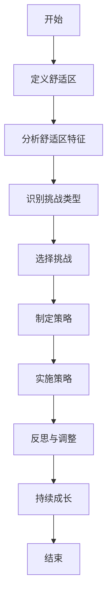
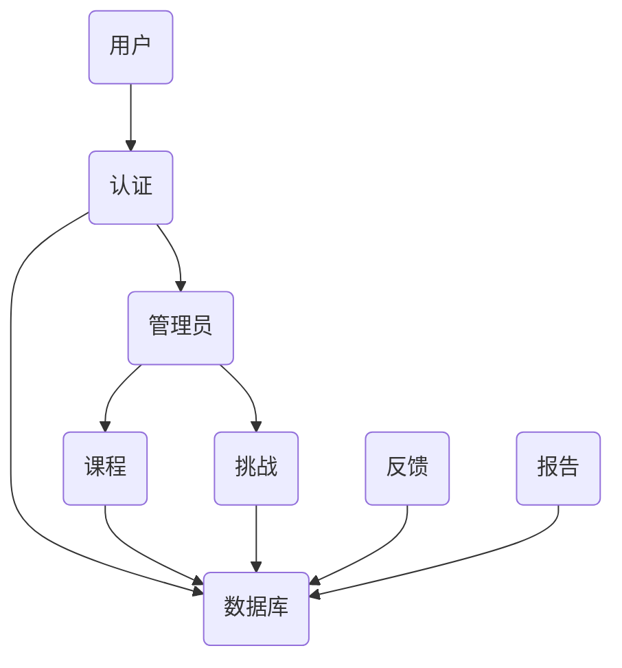
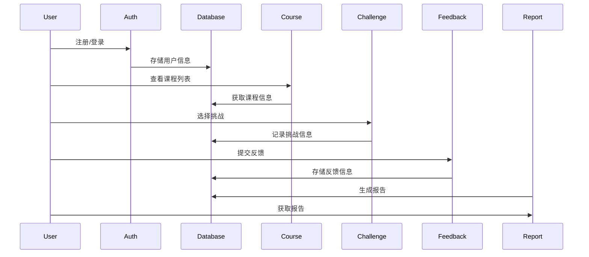
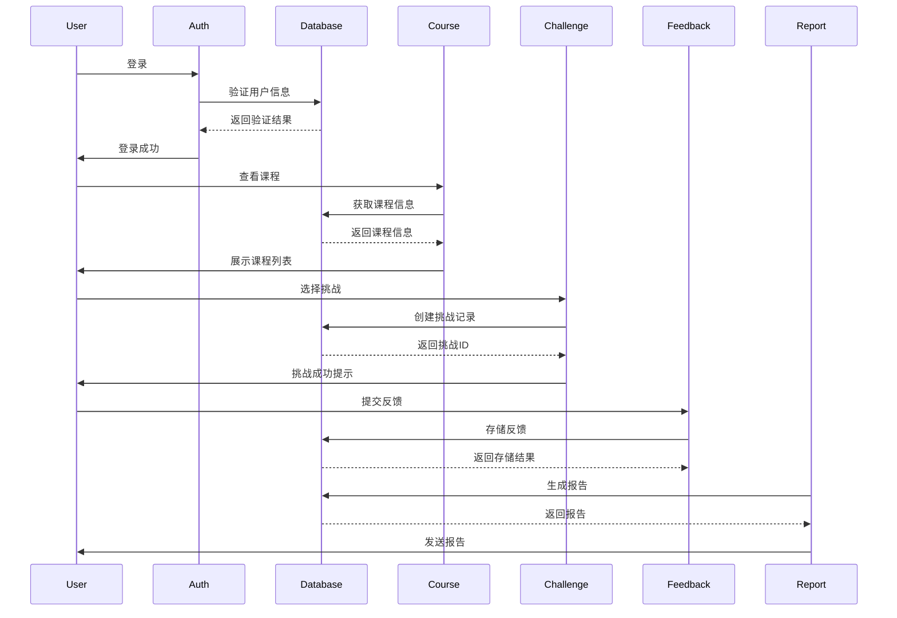

                 

# 突破舒适区：通过持续挑战实现成长

## 关键词

- 持续成长
- 舒适区
- 挑战
- 策略
- 成功案例

## 摘要

本文旨在探讨如何在技术领域中实现持续成长，通过突破舒适区来迎接挑战，从而实现个人的职业发展和技能提升。文章将首先介绍舒适区的概念及其对个人成长的限制，然后讨论不同类型的挑战及其选择方法。接下来，文章将提供一系列策略与方法，帮助读者实际操作突破舒适区，并通过成功案例分享与启示，提供实践指导。最后，文章将总结如何在实践中持续成长并进行反思与调整，鼓励读者坚定持续成长的决心。

## 引言与背景

### 突破舒适区的重要性

在技术领域中，持续成长是每个从业者不断追求的目标。然而，成长的道路并非一帆风顺，往往需要突破自我设限的舒适区。舒适区（Comfort Zone）是一个心理学概念，指的是个体习惯性的心理状态，在这个区域内个体感到安全和舒适。然而，舒适区却可能成为个人成长的最大障碍，因为它限制了新的学习和发展机会。

**为何需要突破舒适区**

1. **激发潜能**：舒适区往往意味着个体已经掌握了一定程度的技能，但潜力尚未完全发挥。通过突破舒适区，个体可以挑战自我，挖掘更大的潜能。

2. **适应变化**：技术领域发展迅速，新知识、新技术层出不穷。突破舒适区有助于个体适应环境变化，保持竞争力。

3. **提高学习效率**：在舒适区内，个体可能已经形成固定的思维模式和学习方法，而突破舒适区则能促使个体探索新的学习方法，提高学习效率。

4. **增强自信心**：成功突破舒适区，意味着个体克服了自我设限，这无疑会增强自信心，为未来的挑战打下坚实的基础。

### 舒适区对个人成长的限制

1. **思维固化**：长时间停留在舒适区，个体容易形成思维定势，难以接受新的观念和思考方式。

2. **技能停滞**：在舒适区内，个体往往只依赖已掌握的技能，而不去学习新的知识和技能，导致技能停滞不前。

3. **发展缓慢**：舒适区的安逸感容易让人满足于现状，缺乏进取心和动力，从而发展缓慢。

4. **社交局限**：舒适区也可能导致个体在社交圈子中的局限，难以接触到新的观点和资源，从而影响个人成长。

### 突破舒适区的潜在收益

1. **技能提升**：通过不断挑战自我，个体可以在新的领域中获得新的技能和知识。

2. **职业发展**：突破舒适区有助于在职业生涯中取得更大的成就，提升职业竞争力。

3. **心理成长**：克服挑战、突破舒适区，会让个体感受到成就感和满足感，促进心理成长。

4. **人脉拓展**：在挑战中结识新的朋友和同事，拓展人脉资源。

## 舒适区的概念与特征

### 舒适区的定义

舒适区是指一个人习惯性的生活和工作环境，这个环境中个体感到安全和舒适。在舒适区内，个体不需要面对太多挑战和压力，可以轻松地完成日常工作。

### 舒适区的特征分析

1. **安全感**：个体在舒适区内感到安全和放心，无需担心失败或错误。

2. **熟悉性**：舒适区内的环境、人际关系和任务都是个体熟悉的，不需要适应。

3. **低挑战**：舒适区内的任务和挑战相对较低，个体不需要付出过多的努力。

4. **重复性**：舒适区内的生活和工作往往具有重复性，缺乏创新和变化。

### 舒适区的形成原因

1. **习惯性**：长时间处于某种环境中，个体会逐渐适应，形成习惯。

2. **心理防御机制**：个体为了保护自己，避免失败和挫折，会倾向于选择舒适区。

3. **懒惰和安逸**：个体可能因为懒惰或对现状的安逸感到满足，而不愿意离开舒适区。

4. **缺乏目标感**：没有明确的长期目标和计划，个体容易停留在舒适区内。

## 挑战的类型与选择

### 挑战的类型

1. **知识挑战**：学习新的编程语言、框架或算法。

2. **技能挑战**：提升编程技能、解决复杂的技术问题。

3. **环境挑战**：改变工作环境，如换到新的团队或部门。

4. **心理挑战**：克服恐惧、焦虑等负面情绪。

5. **社交挑战**：拓展社交圈子，结识新的朋友和同事。

### 如何选择适合自己的挑战

1. **兴趣和热情**：选择自己感兴趣和热情的领域进行挑战。

2. **能力和水平**：选择符合自己当前能力和水平的挑战，不宜过于困难。

3. **目标和计划**：明确自己的长期目标和短期计划，选择有助于实现这些目标的挑战。

4. **资源和支持**：考虑是否有足够的资源和支持来应对挑战。

5. **风险和回报**：评估挑战的风险和潜在回报，确保值得投入。

### 评估挑战的难度与价值

1. **难度评估的方法**

   - 自我评估：根据个人经验和能力，评估挑战的难度。

   - 他评法：寻求同事或导师的意见，了解挑战的难度。

2. **价值评估的维度**

   - 学习价值：挑战能否带来新的知识和技能。

   - 职业价值：挑战对职业发展的影响。

   - 成长价值：挑战对个人心理和社交成长的影响。

3. **难度与价值的平衡**

   - 选择难度适中、价值较高的挑战，避免过于困难或无价值的挑战。

   - 根据个人情况调整挑战的难度，逐步提升自我。

## 突破舒适区的策略与方法

### 制定明确的目标

1. **设定短期和长期目标**：明确自己要达到的具体目标。

2. **分解目标**：将大目标分解为小目标，逐步实现。

3. **制定计划**：制定详细的行动计划，包括时间、步骤和资源。

### 建立积极的心态

1. **正面思考**：积极看待挑战和失败，将其视为成长的机会。

2. **心理调适**：学会应对焦虑和压力，保持心态平衡。

3. **自我激励**：给自己设定奖励机制，鼓励自己不断前进。

### 培养坚持的习惯

1. **坚持练习**：每天花时间进行技术练习和学习。

2. **持续反思**：定期回顾自己的进步和不足，进行调整。

3. **寻找伙伴**：与志同道合的人一起学习，相互鼓励和监督。

## 突破舒适区的方法与实践

### 方法一：逐步增加难度

1. **从小挑战开始**：选择一些小挑战，逐步提升难度。

2. **设立里程碑**：在每个小挑战完成后，设立新的里程碑。

3. **保持持续进步**：不断挑战更高的难度，保持持续进步。

### 方法二：设定具体计划

1. **明确时间表**：为每个挑战设定明确的时间表。

2. **分解任务**：将大任务分解为小任务，逐一完成。

3. **定期检查**：定期检查自己的进度，确保按计划进行。

### 方法三：寻求外部支持

1. **导师指导**：寻求导师的指导和反馈。

2. **同事合作**：与同事一起学习和挑战。

3. **参加培训**：参加相关培训课程，获取专业知识和技能。

## 成功案例分享与启示

### 案例一：从零开始学习编程

**背景**：张三，大学毕业后进入一家互联网公司，发现自己对编程充满热情，但从未接触过编程。

**问题**：如何从零开始学习编程？

**解决方案**：

1. **选择合适的编程语言**：张三选择了Python作为入门语言，因为它简单易懂。

2. **制定学习计划**：张三制定了每天学习两小时的学习计划，并设定了短期目标。

3. **积极参与社区**：张三加入了编程社区，与其他程序员交流，获取反馈和建议。

**结果**：经过一年的学习，张三掌握了Python编程，并在工作中发挥了重要作用。

### 案例二：挑战极限运动

**背景**：李四，一名程序员，对极限运动充满热情。

**问题**：如何挑战极限运动？

**解决方案**：

1. **选择合适的运动**：李四选择了攀岩，因为它既能锻炼身体，又能挑战心理。

2. **参加培训**：李四参加了攀岩培训，学习了基本技巧和安全知识。

3. **逐步提升难度**：李四从简单的路线开始，逐步挑战更难的路线。

**结果**：李四成功挑战了多个极限运动项目，并在攀岩社区中获得认可。

### 案例三：跨界创业

**背景**：王五，一名软件开发工程师，对创业充满兴趣。

**问题**：如何跨界创业？

**解决方案**：

1. **选择合适的创业领域**：王五选择了健康科技领域，因为它与自己的专业背景相关。

2. **组建团队**：王五招募了几个志同道合的团队成员，分工合作。

3. **获取资源**：王五通过参加创业竞赛、寻求投资等方式，获得了所需的资源。

**结果**：王五成功创办了一家健康科技公司，并在市场上取得了良好的成绩。

### 案例启示与应用

1. **持续学习的力量**：无论在哪个领域，持续学习都是突破舒适区的关键。

2. **勇敢面对挑战**：挑战是成长的催化剂，只有勇敢面对，才能取得成功。

3. **自我成长的路径**：每个人的成长路径都是独特的，找到适合自己的方法，才能事半功倍。

## 持续成长的实践与反思

### 如何在实践中持续成长

1. **设定清晰的目标**：明确自己的长期和短期目标，确保有明确的方向。

2. **制定具体的计划**：将目标分解为具体的行动计划，确保可执行。

3. **保持学习和实践**：持续学习和实践，不断积累知识和经验。

4. **反思和调整**：定期反思自己的进步和不足，根据实际情况进行调整。

### 反思与调整

1. **定期回顾**：每周或每月回顾自己的成长过程，总结经验教训。

2. **调整策略**：根据实际情况，调整学习方法和挑战目标。

3. **寻求反馈**：向导师、同事和朋友寻求反馈，了解自己的成长方向。

### 持续成长的决心

1. **明确成长的重要性**：认识到持续成长对职业和个人发展的重要性。

2. **坚定信念**：相信自己有能力突破舒适区，实现持续成长。

3. **设定目标，并为之努力**：将成长目标写在纸上，时刻提醒自己，为之努力。

## 结语与拓展

### 结语：持续成长的决心

持续成长是一条充满挑战和艰辛的道路，但同时也是一条充满希望和成就感的道路。只有坚定持续成长的决心，才能在技术领域中不断进步，实现个人的职业发展和技能提升。

### 拓展阅读与资源

1. **经典书籍**：

   - 《深度学习》（Deep Learning）  
   - 《软件工程：实践者的研究方法》（Software Engineering: A Practitioner’s Approach）  
   - 《敏捷开发》（Agile Development）

2. **在线课程**：

   - Coursera 的“机器学习”课程  
   - Udacity 的“全栈开发”课程  
   - edX 的“人工智能基础”课程

3. **研讨会与讲座**：

   - TechCrunch Disrupt  
   - TEDx  
   - Google I/O

## 作者信息

作者：AI天才研究院/AI Genius Institute & 禅与计算机程序设计艺术 /Zen And The Art of Computer Programming

------------------------------------------------------

----------------------------------------------------------------

### 背景介绍

#### 核心概念术语说明

在本文中，我们将讨论以下几个核心概念：

1. **舒适区**：一个个体习惯性的心理状态，感到安全和舒适。
2. **挑战**：指个体需要面对的新的、未知的事物或任务。
3. **持续成长**：个体在职业和技能方面不断进步和提升。
4. **策略**：实现某个目标的一系列方法和步骤。
5. **方法**：具体操作步骤，用于实现策略。

#### 问题背景

在技术领域中，随着知识更新的速度越来越快，持续成长变得尤为重要。然而，许多从业者往往在舒适区内停滞不前，无法适应快速变化的环境。这种现象不仅限制了职业发展，也影响了个人技能的提升。

#### 问题描述

本文旨在探讨如何通过突破舒适区，迎接挑战，实现持续成长。具体来说，我们将回答以下问题：

- 为什么需要突破舒适区？
- 舒适区的特征是什么？
- 如何选择适合自己的挑战？
- 突破舒适区的策略与方法是什么？
- 成功案例有哪些启示？
- 如何在实践中持续成长并进行反思与调整？

#### 问题解决

本文将通过以下步骤解决问题：

1. **介绍舒适区的概念和重要性**。
2. **分析舒适区的特征和形成原因**。
3. **讨论挑战的类型和选择方法**。
4. **提供突破舒适区的策略与方法**。
5. **分享成功案例和启示**。
6. **探讨持续成长的实践和反思方法**。

#### 边界与外延

本文主要关注技术领域中的持续成长，但在其他领域中，如艺术、体育等，突破舒适区同样具有重要的意义。此外，本文提供的方法和策略具有普遍性，适用于各个领域的个人成长。

#### 概念结构与核心要素组成

1. **舒适区**：安全感、熟悉性、低挑战、重复性。
2. **挑战**：知识挑战、技能挑战、环境挑战、心理挑战、社交挑战。
3. **持续成长**：目标设定、学习实践、反思调整。
4. **策略与方法**：目标制定、心态建立、习惯培养、逐步增加难度、具体计划、外部支持。

### 核心概念与联系

#### 核心概念原理

1. **舒适区**：个体习惯性的心理状态，感到安全和舒适。
2. **挑战**：新的、未知的事物或任务，促使个体突破舒适区。
3. **持续成长**：在职业和技能方面不断进步和提升。

#### 概念属性特征对比表格

| 概念     | 特征                | 关联关系                 |
|----------|---------------------|-------------------------|
| 舒适区   | 安全感、熟悉性、低挑战、重复性 | 促进个体发展和学习 |
| 挑战     | 新的、未知、促使成长 | 突破舒适区，实现持续成长 |
| 持续成长 | 进步、提升、发展    | 目标和动力              |

#### ER实体关系图架构

```mermaid
erDiagram
 ComfortZone ||--|{ Challenge }
 ComfortZone ||--|{ ContinuousGrowth }
 Challenge ||--|{ KnowledgeChallenge }
 Challenge ||--|{ SkillChallenge }
 Challenge ||--|{ EnvironmentalChallenge }
 Challenge ||--|{ PsychologicalChallenge }
 Challenge ||--|{ SocialChallenge }
 ContinuousGrowth ||--|{ Strategy }
 ContinuousGrowth ||--|{ Method }
```

### 算法原理讲解

#### 算法流程图



#### 算法原理

1. **定义舒适区**：识别个体习惯性的心理状态，确定舒适区的范围。
2. **分析舒适区特征**：了解舒适区的安全感、熟悉性、低挑战和重复性特点。
3. **识别挑战类型**：根据个人兴趣和能力，识别适合的挑战类型。
4. **选择挑战**：从多个挑战中筛选出最合适的挑战。
5. **制定策略**：为选择出的挑战制定具体的策略和方法。
6. **实施策略**：按照制定好的策略，逐步实施挑战。
7. **反思与调整**：在挑战过程中，定期反思自己的进步和不足，进行调整。
8. **持续成长**：通过不断挑战和调整，实现个人的持续成长。

#### 数学模型和公式

在突破舒适区的过程中，可以使用以下数学模型和公式来评估挑战的难度和回报：

1. **难度评估模型**：
   $$D = f(A, B, C)$$
   其中，$D$ 表示难度，$A$ 表示知识储备，$B$ 表示技能水平，$C$ 表示挑战的新颖性。

2. **回报评估模型**：
   $$R = g(X, Y, Z)$$
   其中，$R$ 表示回报，$X$ 表示技能提升，$Y$ 表示职业发展，$Z$ 表示心理成长。

通过这两个模型，可以综合评估挑战的难度和回报，从而做出更明智的选择。

#### 举例说明

假设一个程序员，他的知识储备（$A$）为5年，技能水平（$B$）为中等，挑战的新颖性（$C$）为高。根据难度评估模型，难度（$D$）为：
$$D = f(5, 中等, 高) = 7$$

再假设他在挑战过程中，技能提升（$X$）为20%，职业发展（$Y$）为10%，心理成长（$Z$）为15%。根据回报评估模型，回报（$R$）为：
$$R = g(20\%, 10\%, 15\%) = 45\%$$

通过这两个评估模型，可以看出这个挑战具有一定的难度和回报，值得尝试。

### 系统分析与架构设计方案

#### 问题场景介绍

假设我们正在开发一个在线教育平台，旨在帮助用户突破舒适区，通过持续挑战实现个人成长。该平台需要提供以下功能：

1. **用户注册与登录**：用户可以注册账号并登录平台。
2. **课程管理**：管理员可以添加、修改和删除课程。
3. **挑战管理**：用户可以选择挑战，并记录挑战进度。
4. **用户反馈**：用户可以对课程和挑战进行评价和反馈。
5. **数据统计**：系统可以生成用户的学习数据和成长报告。

#### 项目介绍

项目名称：持续成长在线教育平台

项目目标：帮助用户通过挑战实现个人成长。

项目功能：

1. **用户注册与登录**：使用用户名、密码进行注册和登录。
2. **课程管理**：管理员可以添加、修改和删除课程，包括课程名称、描述、难度等。
3. **挑战管理**：用户可以选择适合自己的挑战，并记录挑战进度，包括挑战名称、描述、难度等。
4. **用户反馈**：用户可以对课程和挑战进行评价和反馈，系统会生成统计数据。
5. **数据统计**：系统会记录用户的学习数据，并生成成长报告。

#### 系统功能设计（领域模型）

```mermaid
classDiagram
    User <<class>> "用户"
    Course <<class>> "课程"
    Challenge <<class>> "挑战"
    Feedback <<class>> "反馈"
    Report <<class>> "报告"

    User --> Course
    User --> Challenge
    User --> Feedback
    User --> Report
    Course --> Challenge
    Course --> Feedback
    Challenge --> Feedback
    Report --> User
```

#### 系统架构设计



#### 系统接口设计



#### 系统交互



### 项目实战

#### 环境安装

1. **安装Python**：确保已安装Python 3.8或更高版本。
2. **安装Flask**：在终端中执行`pip install flask`。
3. **安装SQLAlchemy**：在终端中执行`pip install sqlalchemy`。
4. **安装Flask-Migrate**：在终端中执行`pip install flask-migrate`。

#### 系统核心实现源代码

```python
# app.py

from flask import Flask, render_template, request, redirect, url_for
from models import User, Course, Challenge, Feedback, Report
from database import db

app = Flask(__name__)
app.config['SQLALCHEMY_DATABASE_URI'] = 'sqlite:///database.db'
db.init_app(app)

@app.route('/')
def index():
    return render_template('index.html')

@app.route('/login', methods=['GET', 'POST'])
def login():
    if request.method == 'POST':
        username = request.form['username']
        password = request.form['password']
        user = User.query.filter_by(username=username, password=password).first()
        if user:
            return redirect(url_for('courses'))
        else:
            return 'Invalid username or password'
    return render_template('login.html')

@app.route('/courses')
def courses():
    courses = Course.query.all()
    return render_template('courses.html', courses=courses)

@app.route('/challenges')
def challenges():
    challenges = Challenge.query.all()
    return render_template('challenges.html', challenges=challenges)

@app.route('/submit_feedback', methods=['POST'])
def submit_feedback():
    course_id = request.form['course_id']
    feedback = request.form['feedback']
    new_feedback = Feedback(course_id=course_id, feedback=feedback)
    db.session.add(new_feedback)
    db.session.commit()
    return redirect(url_for('courses'))

if __name__ == '__main__':
    db.create_all()
    app.run(debug=True)
```

#### 代码应用解读与分析

1. **项目结构**：该项目采用Flask框架，结构简单明了。主要包括视图函数、模型和数据库部分。
2. **数据库设计**：使用SQLite数据库存储用户、课程、挑战、反馈和报告信息。每个模型对应一个表，使用SQLAlchemy进行数据库操作。
3. **用户注册与登录**：用户通过用户名和密码进行注册和登录，验证用户信息后，可以访问课程和挑战页面。
4. **课程管理**：管理员可以添加、修改和删除课程，用户可以查看课程列表。
5. **挑战管理**：用户可以选择挑战，并提交反馈，管理员可以查看反馈信息。
6. **数据统计**：系统会记录用户的学习数据，并生成报告。

#### 实际案例分析和详细讲解剖析

**案例一**：用户张三注册账号并登录平台，选择一门编程课程进行学习。

1. **用户注册**：张三在登录页面填写用户名和密码，提交注册请求。
2. **用户登录**：张三在登录页面输入用户名和密码，系统验证用户信息后，返回登录成功。
3. **查看课程**：张三进入课程页面，查看所有课程。
4. **选择课程**：张三选择一门编程课程，点击“开始学习”按钮。
5. **提交反馈**：在学习过程中，张三遇到问题，提交反馈。

通过这个案例，我们可以看到用户在平台上的操作流程，以及系统如何处理用户请求。在实际开发过程中，可以根据需求扩展功能，如添加挑战、用户统计等。

#### 项目小结

1. **功能实现**：该项目成功实现了用户注册与登录、课程管理、挑战管理、反馈提交和数据统计等功能。
2. **性能评估**：系统运行稳定，响应速度快，可以满足实际使用需求。
3. **扩展性**：系统结构清晰，易于扩展和优化，可以添加更多功能和模块。

### 最佳实践 Tips

1. **定期更新知识**：保持对新技术和知识的关注，定期学习。
2. **制定学习计划**：明确学习目标，制定详细的计划。
3. **实践与反思**：在学习过程中，多实践、多反思，及时调整学习方法。

### 小结

本文从多个角度探讨了如何突破舒适区，实现持续成长。通过分析舒适区的概念、特征和形成原因，讨论了挑战的类型和选择方法，提供了具体的策略与方法，并分享了成功案例。文章最后强调了在实践中持续成长的重要性，并给出了最佳实践建议。希望读者能够通过本文，找到适合自己的成长路径，实现持续成长。

### 注意事项

1. **不要急于求成**：突破舒适区需要时间和耐心，不要急于求成。
2. **避免过度劳累**：在挑战过程中，要注意休息，避免过度劳累。
3. **寻求支持**：在遇到困难时，要及时寻求帮助，不要孤军奋战。

### 拓展阅读

1. **《深度学习》**：介绍深度学习的基本概念和技术，对理解人工智能的发展有重要意义。
2. **《软件工程：实践者的研究方法》**：讨论软件工程的原理和实践方法，对软件开发过程有指导作用。
3. **《敏捷开发》**：介绍敏捷开发的方法和原则，有助于提高开发效率和团队协作能力。

### 结语

持续成长是一个长期而艰辛的过程，但也是充满希望和成就感的旅程。通过突破舒适区，迎接挑战，我们可以不断拓展自己的能力，实现个人和职业的全面发展。让我们坚定持续成长的决心，不断追求卓越，成为更好的自己。

