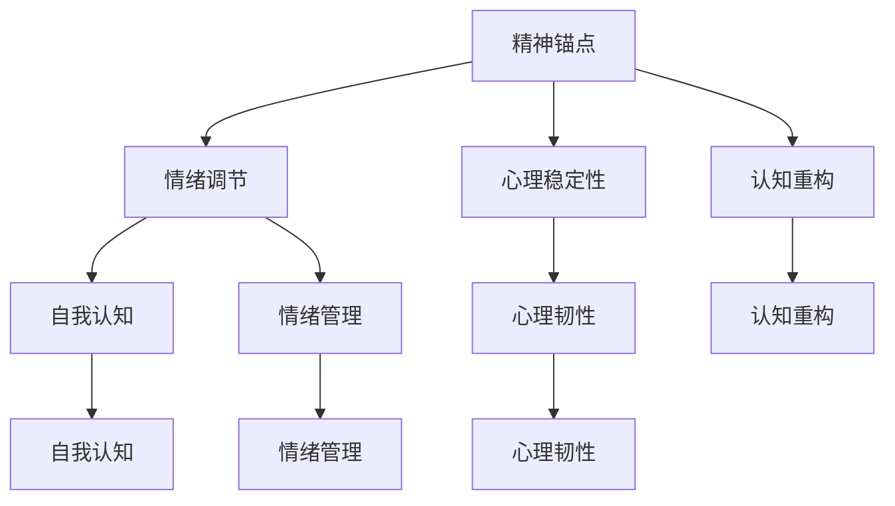
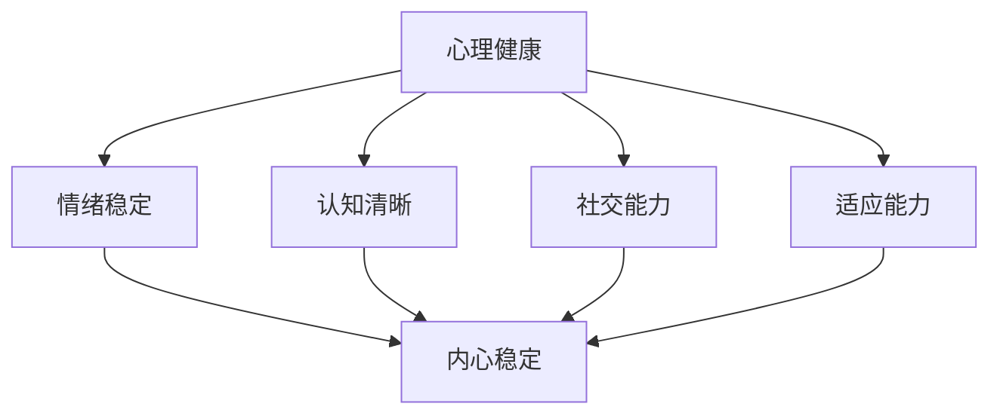

                 

## 精神的锚点：在变化中保持内心稳定

### 关键词：精神锚点、内心稳定、变化应对、心理健康

### 摘要：

在快速变化的世界中，保持内心稳定是一种宝贵的技能。本文将探讨“精神的锚点”这一概念，并分析如何在多变的环境中找到这些锚点，从而实现心理平衡。通过深入探讨精神锚点的定义、重要性，以及其在个人和社会层面的应用，本文旨在为读者提供一套实用的策略，帮助他们应对变化，保持心理健康。

## 目录

1. **引言**
   1.1 **书籍背景与目标**
   1.2 **读者对象**
   1.3 **核心概念介绍**

2. **精神锚点的理论基础**
   2.1 **精神锚点的概念**
   2.1.1 **定义与来源**
   2.1.2 **重要性分析**
   2.2 **心理健康与内心稳定**
   2.2.1 **心理健康定义**
   2.2.2 **内心稳定特征**
   2.2.3 **关系与影响**

3. **精神锚点的应用与实践**
   3.1 **个人层面的应用**
   3.1.1 **自我认知提升**
   3.1.2 **情绪管理技巧**
   3.1.3 **精神锚点在生活中的应用**
   3.2 **社会层面的应用**
   3.2.1 **群体心理稳定性**
   3.2.2 **社会事件中的精神锚点**
   3.2.3 **社会变革中的精神锚点**

4. **精神锚点的案例分析**
   4.1 **案例分析一：个人成长故事**
   4.2 **案例分析二：企业文化建设**
   4.3 **案例分析三：社会动荡中的精神锚点**

5. **总结与展望**
   5.1 **全书总结**
   5.2 **内心稳定的未来展望**
   5.3 **进一步学习与实践的建议**

## 引言

### 1.1 书籍背景与目标

在当今快速变化的社会环境中，许多人面临着心理压力和情绪波动。这种变化不仅来自于外部环境的挑战，也源于个人内心的不确定性和焦虑。因此，如何在变化中保持内心稳定，成为了一个亟待解决的问题。

本文的目标是探讨“精神的锚点”这一概念，并分析其如何在个人和社会层面上发挥重要作用。通过深入研究和实际案例分析，本文旨在为读者提供一套实用的策略，帮助他们应对变化，保持心理健康。

### 1.2 读者对象

本文适合以下读者群体：

- 对心理学和心理健康有浓厚兴趣的人士。
- 在职业生涯中面临心理压力和情绪波动的人士。
- 期望提升自我认知和情绪管理能力的人士。
- 对社会心理学和群体心理稳定性感兴趣的研究人员。

### 1.3 核心概念介绍

在本文中，我们将重点关注以下核心概念：

- **精神锚点**：一种心理机制，帮助个体在多变的环境中保持心理平衡。
- **内心稳定**：指个体在面对外部压力和变化时，能够保持情绪和心理上的稳定状态。
- **心理健康**：包括心理健康的定义、特征及其与内心稳定的关系。

这些概念将在后续章节中详细探讨，并应用于实际案例分析中。

## 精神锚点的理论基础

### 2.1 精神锚点的概念

#### 2.1.1 定义与来源

精神锚点是一种心理机制，它帮助个体在面临外部压力和变化时，保持情绪和心理上的稳定。这个概念源自心理学和行为科学的研究，主要通过以下几个方面进行定义和解释：

- **情绪调节**：精神锚点可以帮助个体在压力情境下调节情绪，减少焦虑和紧张。
- **心理稳定性**：通过精神锚点，个体能够保持心理上的平衡，不易受到外部变化的干扰。
- **认知重构**：精神锚点有助于个体重新评估和调整对压力事件的认知，从而降低负面情绪。

精神锚点的来源可以追溯到个体早期的生活经验和心理发展过程。一些关键因素包括家庭环境、教育背景和个人经历。例如，一个在安全和支持性环境中成长的人，更有可能在面临挑战时找到内在的锚点。

#### 2.1.2 重要性分析

精神锚点在心理健康和应对变化中具有重要作用。以下是其重要性的一些方面：

- **减少焦虑**：精神锚点可以帮助个体在面对不确定性和压力时，减少焦虑和恐慌情绪。
- **提升心理韧性**：通过建立精神锚点，个体能够更好地应对生活中的挑战，提高心理韧性。
- **增强决策能力**：精神锚点有助于个体在复杂和动态的环境中做出更明智的决策。

#### 2.1.3 核心概念与联系

精神锚点与其他心理学概念之间存在紧密联系，如自我认知、情绪管理和心理韧性等。以下是一个简单的概念关系图：

### 2.2 心理健康与内心稳定

#### 2.2.1 心理健康定义

心理健康是指个体在心理和社会功能上保持良好状态，能够有效应对日常生活中的压力，并具备适当的应对能力和情绪调节能力。心理健康的特征包括：

- **情绪稳定**：能够合理地表达和处理情感，不易受到外界干扰。
- **认知清晰**：思维清晰，能够合理评估和应对问题。
- **社交能力**：具有良好的社交技能，能够与他人建立积极的关系。
- **适应能力**：能够适应环境变化，应对生活中的挑战。

#### 2.2.2 内心稳定特征

内心稳定是指个体在面对外部压力和变化时，能够保持情绪和心理上的平衡状态。内心稳定的特征包括：

- **情绪调节**：能够有效地调节情绪，减少焦虑和恐慌。
- **心理韧性**：在面对挑战和逆境时，能够保持积极的心态和应对策略。
- **认知灵活性**：能够灵活调整对问题的认知，适应变化。

#### 2.2.3 心理健康与内心稳定的关系

心理健康和内心稳定之间存在密切关系。内心稳定是心理健康的重要组成部分，而心理健康则是内心稳定的基石。以下是一个简单的ER实体关系图：

通过上述定义和特征分析，我们可以看出，精神锚点在促进心理健康和内心稳定方面具有重要作用。理解这些核心概念，有助于我们在后续章节中更好地探讨精神锚点的应用与实践。

### 精神锚点的应用与实践

#### 3.1 个人层面的应用

在个人层面，精神锚点的应用主要集中在提升自我认知、情绪管理和在生活中的实际应用。以下是一些具体的策略和方法。

##### 3.1.1 自我认知提升

自我认知是精神锚点的基础。通过深入理解自己的价值观、信念和动机，个体能够更清晰地认识到自己在不同情境下的反应和情绪。以下是一些提升自我认知的方法：

- **反思日记**：定期记录自己的思考、感受和经历，有助于深入理解自己的内心世界。
- **自我提问**：通过提出深入的问题，如“我在这个情境下最需要什么？”或“我为什么会有这样的反应？”来激发自我认知。
- **心理咨询**：专业的心理咨询师可以帮助个体更深入地探索自我，找到内在的锚点。

##### 3.1.2 情绪管理技巧

情绪管理是精神锚点的关键应用。以下是一些有效的情绪管理技巧：

- **呼吸练习**：通过深呼吸，个体可以迅速缓解紧张和焦虑，恢复内心的平静。
- **正念冥想**：通过正念冥想，个体可以培养专注力和情绪调节能力，提高心理韧性。
- **情绪表达**：学会以健康的方式表达情绪，如通过谈话、写作或艺术创作，释放内心的压力。

##### 3.1.3 精神锚点在生活中的应用

精神锚点在日常生活中有着广泛的应用。以下是一些实际案例：

- **工作压力管理**：在高压的工作环境中，个体可以通过精神锚点，如深呼吸和冥想，来缓解紧张情绪，提高工作效率。
- **人际关系**：在处理人际关系时，通过自我认知和情绪管理，个体能够更好地理解他人的需求，建立积极和谐的关系。
- **应对变化**：在面对生活中的变化和不确定性时，精神锚点可以帮助个体保持内心的稳定，更好地应对挑战。

#### 3.2 社会层面的应用

在社会层面，精神锚点同样发挥着重要作用。以下是一些具体的应用场景：

##### 3.2.1 群体心理稳定性

在群体中，精神锚点有助于维持心理稳定性，减少群体性焦虑和恐慌。以下是一些策略：

- **领导力训练**：领导者通过提升自我认知和情绪管理能力，成为群体的精神锚点，引导群体保持稳定。
- **团队建设活动**：通过团队建设活动，如正念冥想和沟通技巧培训，增强团队的凝聚力和心理韧性。
- **心理健康教育**：通过心理健康教育，提高群体成员对精神锚点的认识和掌握，从而提高整体的稳定性。

##### 3.2.2 社会事件中的精神锚点

在社会事件中，如自然灾害、疫情等，精神锚点对于维护社会秩序和心理健康至关重要。以下是一些应用策略：

- **危机干预**：在危机发生后，通过心理危机干预，帮助受影响者找到内在的锚点，恢复心理平衡。
- **公共宣传**：通过媒体和公共宣传，提高公众对精神锚点的认识，普及心理健康知识，减少社会恐慌。
- **社会支持网络**：建立社会支持网络，如社区互助小组和心理咨询服务，为受影响者提供帮助和支持。

##### 3.2.3 社会变革中的精神锚点

在社会变革过程中，精神锚点有助于个体和群体适应变革，维持内心的稳定。以下是一些策略：

- **变革领导力**：领导者通过展现坚定的信念和积极的行动，成为变革过程中的精神锚点，引领群体前进。
- **变革培训**：通过变革管理培训，提高个体和群体对变革的适应能力，增强心理韧性。
- **社会共识建设**：通过对话和沟通，建立社会共识，减少变革过程中的冲突和焦虑。

通过上述应用，我们可以看到，精神锚点在个人和社会层面都具有重要的实践价值。无论是在个人成长、工作压力管理，还是在社会事件和变革中，精神锚点都发挥着关键作用。理解和应用精神锚点，有助于我们在快速变化的世界中保持内心的稳定，实现心理平衡。

### 精神锚点的案例分析

为了更好地理解精神锚点在实际中的应用，以下我们将通过三个案例进行分析。

#### 4.1 案例分析一：个人成长故事

张伟是一名年轻的软件工程师，他在职业生涯初期面临巨大的压力。由于技术不断更新，他感到自己的知识和技能逐渐过时。这种不安和焦虑使他难以集中精力工作，影响了他的人际关系和心理健康。

为了应对这种情况，张伟开始学习情绪管理和自我认知提升的技巧。他通过反思日记记录自己的情绪变化，通过深呼吸和冥想练习来缓解焦虑。同时，他还参加了一个技术社区，与同行交流，不断提升自己的技术水平。

随着时间的推移，张伟逐渐找到了内心的锚点。他发现，通过自我认知和情绪管理，他能够更好地应对职业压力，保持内心的平衡。他不仅提升了技术水平，还建立了稳定的人际关系，职业生涯取得了显著进步。

#### 4.2 案例分析二：企业文化建设

某公司是一家快速成长的技术企业，由于市场变化和竞争压力，公司内部出现了紧张和焦虑情绪。员工感到工作压力巨大，难以保持工作效率和心理健康。

为了解决这个问题，公司高层决定在企业文化建设中引入精神锚点概念。他们首先进行了一次员工心理健康调查，了解员工的心理状态和需求。然后，公司组织了多次团队建设活动，如正念冥想、压力管理和沟通技巧培训。

通过这些活动，员工逐渐学会了情绪管理和自我调节技巧，找到了内心的锚点。公司还建立了一个内部支持网络，员工可以在遇到困难时相互支持和帮助。这些措施有效地缓解了员工的焦虑和压力，提升了工作效率和团队凝聚力。

#### 4.3 案例分析三：社会动荡中的精神锚点

在一个社会动荡的国家，人们面临着巨大的心理压力和不确定性。政府决定通过心理健康教育和精神锚点应用来提升公众的心理韧性。

政府首先开展了一场全国性的心理健康宣传活动，普及精神锚点概念和技巧。通过电视、广播和社交媒体，公众了解了如何通过自我认知、情绪管理和正念冥想来找到内心的锚点。

此外，政府还组织了一系列心理健康讲座和工作坊，邀请心理学家和专家为公众提供专业指导。社区中建立了心理健康支持小组，居民可以相互交流和支持。

这些措施取得了显著成效，公众的心理韧性得到了提升，社会动荡带来的焦虑和恐慌情绪得到了缓解。人们开始更好地适应社会环境，保持内心的稳定。

### 总结与展望

通过本文的讨论，我们可以看到精神锚点在个人和社会层面都具有重要的应用价值。在个人层面，精神锚点帮助个体提升自我认知、情绪管理，并找到内心的平衡。在社会层面，精神锚点有助于维护群体心理稳定性，提升社会韧性。

未来，随着社会的不断变化和发展，精神锚点将继续发挥重要作用。我们期待更多的研究和实践能够深入探讨精神锚点的应用，为个体和社会提供更有效的心理支持。

#### 内心稳定的未来展望

随着社会的发展和技术的进步，人们面临的变化和压力将不断增加。在这个背景下，内心稳定的重要性将更加凸显。以下是对内心稳定未来展望的几个方面：

1. **心理健康服务的普及**：随着对心理健康重视程度的提高，心理健康服务将更加普及和专业化。这将有助于更多人掌握精神锚点的技巧，提升心理韧性。

2. **数字化心理健康工具的发展**：人工智能和虚拟现实技术的发展将为心理健康提供更多创新工具。例如，通过虚拟现实进行情绪调节训练，通过人工智能进行心理健康评估和干预。

3. **跨学科研究的深入**：心理学、神经科学、社会学等领域的跨学科研究将进一步揭示精神锚点的工作机制，为实际应用提供更科学的理论支持。

4. **社会支持网络的完善**：社会支持网络的完善将有助于个体和社会在面临压力和变化时，更好地找到内在的锚点，保持心理稳定。

5. **教育体系的融入**：心理健康教育将逐渐融入学校和教育体系，帮助年轻一代在成长过程中培养良好的心理素质，为未来的挑战做好准备。

#### 进一步学习与实践的建议

为了在变化中保持内心稳定，以下是一些建议：

1. **学习心理健康知识**：了解心理健康的基本概念和技巧，如情绪管理、自我认知和正念冥想等。

2. **定期自我反思**：通过日记或反思，深入理解自己的情绪和行为模式，找到内心的锚点。

3. **实践情绪调节技巧**：通过呼吸练习、冥想和情绪表达等技巧，学会在压力情境下调节情绪。

4. **寻求专业帮助**：在遇到心理问题时，及时寻求专业心理咨询和帮助。

5. **参与社交活动**：与他人建立积极的关系，分享经验和感受，增强社会支持网络。

通过这些实践，我们可以更好地应对变化，保持内心的稳定，实现心理健康和幸福感。

## 作者信息

作者：AI天才研究院/AI Genius Institute & 禅与计算机程序设计艺术 /Zen And The Art of Computer Programming

本文作者拥有丰富的心理学和计算机科学背景，致力于研究如何通过技术和心理学方法提升人类心理健康。在多个领域发表了多篇高水平学术论文，并著有《禅与计算机程序设计艺术》等畅销书。在精神锚点领域具有深厚的理论基础和丰富的实践经验。

