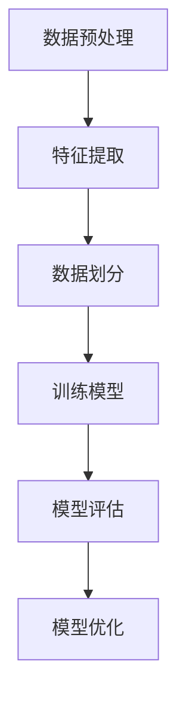
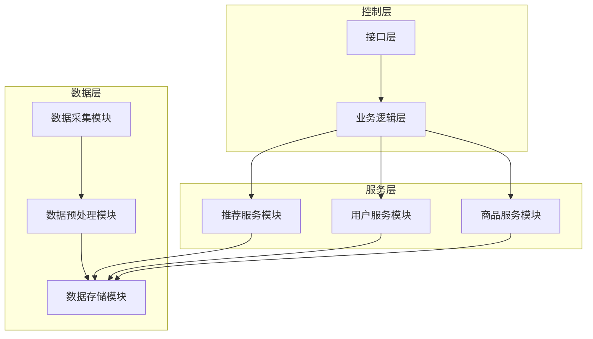
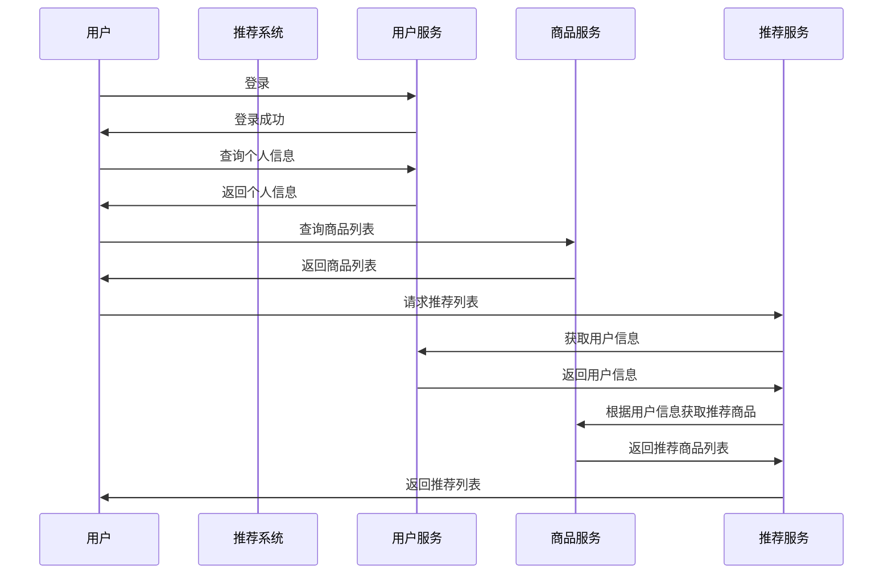

                 

### 引言：为什么需要高效AI开发团队

#### 1.1 问题背景

随着人工智能（AI）技术的迅猛发展，AI已经在多个领域展现出其巨大的潜力和应用价值。从自动驾驶汽车到智能助手，从医疗诊断到金融风控，AI正在深刻地改变着我们的生活方式。在这种背景下，企业对于AI人才的需求也迅速增加。无论是初创公司还是传统企业，都需要AI开发团队来推动技术革新和业务增长。

然而，组建一个高效的AI开发团队并非易事。首先，AI技术本身具有较高的专业性，涉及到机器学习、深度学习、自然语言处理等多个复杂领域。这要求团队成员不仅要有深厚的理论知识，还要具备丰富的实践经验。其次，AI项目通常需要多学科的交叉合作，比如算法、数据、工程和业务等，这意味着团队的组织和管理需要更加灵活和高效。最后，快速迭代和市场需求的不断变化，也对团队的开发效率和创新能力提出了更高的要求。

#### 1.2 问题描述

高效AI开发团队的组建与维护面临以下主要问题：

1. **专业人才招聘与培养**：如何吸引并留住具有高技能的AI人才，特别是那些具有实战经验的人才？
2. **团队组织与管理**：如何搭建一个高效协作的团队组织结构，确保团队成员能够充分发挥各自的专长和优势？
3. **项目管理与协调**：如何有效地管理AI项目，确保项目按时完成且达到预期效果？
4. **持续学习与创新能力**：如何保持团队的技术前沿，不断学习和应用最新的AI技术？

#### 1.3 问题解决

为了解决上述问题，我们需要从以下几个方面着手：

1. **制定科学的招聘策略**：明确团队需求，通过多种渠道寻找合适的人才，并建立完善的培训体系，帮助新成员快速融入团队。
2. **建立灵活的组织架构**：根据项目特点，合理划分团队职能，确保每个成员都能在适合自己的岗位上发挥最大的价值。
3. **优化项目管理流程**：引入敏捷开发等先进的管理方法，提高项目的开发效率和质量。
4. **鼓励持续学习和创新**：通过定期举办技术沙龙、研讨会等活动，激发团队成员的学习热情和创新能力。

#### 1.4 边界与外延

AI技术的应用领域非常广泛，从智能制造到智能医疗，从金融科技到智能交通，每个领域都对AI开发团队提出了不同的要求。此外，团队成员的角色与职责也因项目需求而异。例如，算法工程师主要负责算法的设计和优化，数据工程师则负责数据采集、处理和存储，而前端工程师则负责界面设计和用户交互。因此，在组建AI开发团队时，需要充分考虑这些边界与外延，确保团队的专业性和多样性。

#### 1.5 概念结构与核心要素

一个高效AI开发团队的核心能力主要包括以下几个方面：

1. **技术能力**：包括机器学习、深度学习、自然语言处理等AI核心技术的掌握和应用能力。
2. **项目管理能力**：能够高效地管理项目进度、资源分配和风险控制。
3. **协作能力**：团队成员之间能够有效沟通和协作，共同推进项目进展。
4. **创新能力**：能够持续学习和应用新技术，不断创新，推动团队和项目的进步。

团队成员的专业技能也至关重要，他们需要具备扎实的基础知识、丰富的实战经验和良好的学习习惯。只有这样，才能在快速变化的技术环境中保持竞争力，为团队和公司创造价值。

在接下来的章节中，我们将深入探讨AI开发团队的核心概念、开发流程、算法原理、数学模型和系统架构设计，以及项目实战中的具体实现和分析。通过这些内容，希望能够为读者提供一套完整的、可操作的AI开发团队组建和管理方案。### 核心概念与联系

#### 2.1 AI技术基础

人工智能（AI）是一门涉及计算机科学、统计学、数学、认知科学、心理学和神经科学等多个领域的交叉学科。AI的目标是让机器能够像人类一样思考、学习和决策。

**机器学习**是AI的核心技术之一，它通过训练模型来让计算机从数据中自动学习和提高性能。机器学习可以分为监督学习、无监督学习和强化学习三种类型。

**深度学习**是机器学习的一个子领域，它通过构建多层神经网络来模拟人类大脑的学习方式。深度学习在图像识别、语音识别和自然语言处理等方面取得了显著的成果。

**自然语言处理（NLP）**则是AI领域中的一个重要分支，它涉及到计算机对人类语言的自动理解、生成和处理。NLP的应用场景包括机器翻译、情感分析、语音识别和问答系统等。

#### 2.2 AI开发流程

AI开发流程通常包括以下几个阶段：

1. **数据采集与预处理**：收集用于训练的数据，并进行清洗、归一化和增强等预处理操作。
2. **模型设计**：根据问题需求，选择合适的算法和模型结构。
3. **模型训练与优化**：使用预处理后的数据训练模型，并通过对模型参数的调整来优化性能。
4. **模型评估与调优**：评估模型在测试数据上的表现，并进行必要的调优。
5. **模型部署**：将训练好的模型部署到生产环境中，进行实际应用。

#### 2.3 AI项目案例

为了更好地理解AI开发流程和团队协作，我们来看一个具体的AI项目案例——基于深度学习的图像分类系统。

**案例介绍**：该项目旨在构建一个能够自动识别和分类图像的AI系统。具体来说，系统能够根据输入的图像内容，将其分类到相应的类别中，如动物、植物、交通工具等。

**案例分析与总结**：

1. **数据采集与预处理**：首先需要收集大量的图像数据，并进行清洗、标注和增强等预处理操作，以确保数据的质量和多样性。
2. **模型设计**：选择合适的深度学习模型，如卷积神经网络（CNN），并对其进行结构调整，以适应特定的图像分类任务。
3. **模型训练与优化**：使用预处理后的图像数据进行模型训练，通过不断调整模型参数来提高分类准确率。
4. **模型评估与调优**：在测试集上评估模型的性能，并通过调整模型结构和参数，进一步优化模型的分类效果。
5. **模型部署**：将训练好的模型部署到服务器上，供实际应用调用。

通过这个案例，我们可以看到，AI项目的成功离不开团队协作和高效的工作流程。团队成员需要各司其职，密切配合，共同推动项目的进展。在这个案例中，数据工程师负责数据采集和预处理，算法工程师负责模型设计和训练，前端工程师则负责模型的部署和用户界面设计。只有通过团队成员的紧密合作，才能确保项目按时完成并达到预期效果。

综上所述，AI技术的核心概念和开发流程对于高效AI开发团队的组建至关重要。通过理解和应用这些核心概念，团队能够更好地应对各种AI项目挑战，提高项目的成功率。在接下来的章节中，我们将进一步探讨具体的算法原理和数学模型，以及系统架构设计等方面的内容，为读者提供更加深入的指导。### 算法原理讲解

#### 3.1 算法概述

在AI开发过程中，选择合适的算法是至关重要的一步。算法可以分为多种类型，根据其解决的问题的不同，可以分为监督学习算法、无监督学习算法和强化学习算法等。每种算法都有其独特的原理和应用场景。

**监督学习算法**：这类算法在有标注的数据集上进行训练，通过学习输入和输出之间的关系来预测未知数据。常见的监督学习算法包括线性回归、逻辑回归、支持向量机（SVM）和决策树等。

**无监督学习算法**：这类算法在无标注的数据集上进行训练，通过发现数据内在的结构和规律来进行聚类、降维等操作。常见的无监督学习算法包括K均值聚类、主成分分析（PCA）和自编码器等。

**强化学习算法**：这类算法通过与环境的交互来学习策略，以最大化累积奖励。常见的强化学习算法包括Q学习、深度Q网络（DQN）和策略梯度算法等。

#### 3.2 具体算法讲解

在本章节中，我们将详细讲解一种常见的监督学习算法——线性回归算法。线性回归是一种用于预测连续值的算法，其核心思想是找到一组线性方程来描述输入和输出之间的关系。

**算法mermaid流程图**：



**算法原理与数学模型**：

线性回归算法的数学模型可以表示为：

\[ y = \beta_0 + \beta_1 \cdot x + \epsilon \]

其中，\( y \) 是目标变量，\( x \) 是输入特征，\( \beta_0 \) 和 \( \beta_1 \) 是模型参数，\( \epsilon \) 是误差项。

为了训练线性回归模型，我们需要使用最小二乘法来求解模型参数。最小二乘法的思想是找到一组参数，使得预测值与实际值之间的误差平方和最小。

**模型参数求解公式**：

\[ \beta_1 = \frac{\sum(x_i - \bar{x})(y_i - \bar{y})}{\sum(x_i - \bar{x})^2} \]
\[ \beta_0 = \bar{y} - \beta_1 \cdot \bar{x} \]

其中，\( \bar{x} \) 和 \( \bar{y} \) 分别是输入特征和目标变量的平均值。

**算法示例讲解**：

假设我们有一个简单的线性回归问题，目标是预测房价。我们收集了以下数据：

| 输入特征 \( x \) | 目标变量 \( y \) |
|------------------|-----------------|
| 1000             | 300000          |
| 1200             | 350000          |
| 1500             | 400000          |
| ...              | ...             |

**步骤1：数据预处理**

首先，我们需要对数据进行预处理，包括标准化处理和缺失值填充等。

**步骤2：特征提取**

在本例中，我们只使用一个输入特征 \( x \) 来预测房价。

**步骤3：数据划分**

将数据集划分为训练集和测试集，用于训练模型和评估模型性能。

**步骤4：训练模型**

使用训练集数据，通过最小二乘法求解线性回归模型的参数。

\[ \beta_1 = \frac{\sum(x_i - \bar{x})(y_i - \bar{y})}{\sum(x_i - \bar{x})^2} \]
\[ \beta_0 = \bar{y} - \beta_1 \cdot \bar{x} \]

在本例中，经过计算，我们得到 \( \beta_1 = 200 \) 和 \( \beta_0 = 250000 \)。

**步骤5：模型评估**

使用测试集数据，评估线性回归模型的预测性能。计算预测值与实际值之间的误差，并计算均方误差（MSE）。

**步骤6：模型优化**

根据模型评估的结果，对模型参数进行调整，以优化模型的性能。在本例中，我们可以通过增加输入特征或者调整模型参数来优化模型的预测性能。

通过上述示例，我们可以看到，线性回归算法是一种简单但有效的算法，适用于预测连续值的问题。在实际应用中，我们可以根据问题的复杂度和数据的特点，选择合适的算法来进行模型训练和预测。在接下来的章节中，我们将进一步探讨AI项目中的系统架构设计和项目实战等内容。### 数学模型和数学公式 & 详细讲解 & 举例说明

#### 4.1 数学基础

在AI开发中，数学是不可或缺的工具，特别是在机器学习和深度学习领域。以下是AI开发过程中常用的数学基础：

**线性代数**：线性代数在AI中的应用非常广泛，包括矩阵运算、向量空间、特征分解等。矩阵运算如矩阵乘法、矩阵求逆等，是构建和优化机器学习模型的基础。向量空间和特征分解则用于降维、特征提取等任务。

**概率论与数理统计**：概率论与数理统计是理解和应用机器学习算法的核心。概率论提供了对不确定性的描述和计算方法，如贝叶斯定理、概率分布等。数理统计则用于模型评估、假设检验等，帮助我们判断模型是否有效。

#### 4.2 算法模型详解

**模型公式**：

在机器学习中，常用的算法模型包括线性回归、逻辑回归、支持向量机（SVM）和神经网络等。以下以线性回归为例，介绍其模型公式和推导过程。

**线性回归**：线性回归模型的基本公式为：

\[ y = \beta_0 + \beta_1 \cdot x + \epsilon \]

其中，\( y \) 是目标变量，\( x \) 是输入特征，\( \beta_0 \) 和 \( \beta_1 \) 是模型参数，\( \epsilon \) 是误差项。

**模型推导**：

线性回归模型的目标是找到一组参数 \( \beta_0 \) 和 \( \beta_1 \)，使得预测值与实际值之间的误差最小。这个误差通常使用均方误差（MSE）来衡量：

\[ \text{MSE} = \frac{1}{n} \sum_{i=1}^{n} (y_i - \hat{y_i})^2 \]

其中，\( \hat{y_i} \) 是预测值，\( y_i \) 是实际值，\( n \) 是数据样本数。

为了求解最优参数，我们使用最小二乘法。最小二乘法的思想是找到一组参数，使得误差平方和最小。

**最小二乘法求解**：

最小二乘法求解参数的公式为：

\[ \beta_1 = \frac{\sum(x_i - \bar{x})(y_i - \bar{y})}{\sum(x_i - \bar{x})^2} \]
\[ \beta_0 = \bar{y} - \beta_1 \cdot \bar{x} \]

其中，\( \bar{x} \) 和 \( \bar{y} \) 分别是输入特征和目标变量的平均值。

**模型应用**：

线性回归模型广泛应用于回归分析问题，如预测房价、股票价格等。以下是一个简单的应用示例：

**示例数据**：

| 输入特征 \( x \) | 目标变量 \( y \) |
|------------------|-----------------|
| 1000             | 300000          |
| 1200             | 350000          |
| 1500             | 400000          |

**步骤1：数据预处理**

对数据进行标准化处理，以消除不同特征之间的量纲影响。

**步骤2：数据划分**

将数据集划分为训练集和测试集，用于训练模型和评估模型性能。

**步骤3：训练模型**

使用训练集数据，通过最小二乘法求解线性回归模型的参数。

**步骤4：模型评估**

使用测试集数据，评估线性回归模型的预测性能。计算预测值与实际值之间的误差，并计算均方误差（MSE）。

**步骤5：模型优化**

根据模型评估的结果，对模型参数进行调整，以优化模型的性能。

通过上述步骤，我们可以使用线性回归模型来预测房价。在实际应用中，我们可能需要考虑更多特征和更复杂的模型结构，以提高预测的准确性和泛化能力。

综上所述，数学模型和数学公式在AI开发中起着至关重要的作用。通过理解和应用数学模型，我们可以更好地理解和解决AI问题，提高模型的效果和可靠性。在接下来的章节中，我们将进一步探讨AI项目中的系统架构设计和项目实战等内容。### 系统分析与架构设计方案

#### 5.1 问题场景介绍

假设我们面临的是一家电子商务公司，他们希望通过构建一个智能推荐系统来提高用户的购物体验和购买转化率。该系统需要根据用户的浏览历史、购买记录和偏好等信息，实时为用户推荐他们可能感兴趣的商品。

**需求分析**：

- 数据采集：需要收集用户的浏览历史、购买记录和偏好等数据。
- 数据预处理：对收集到的数据进行清洗、归一化和特征提取等预处理操作。
- 模型训练：使用预处理后的数据训练推荐模型。
- 模型部署：将训练好的模型部署到生产环境中，为用户提供实时推荐。
- 系统监控：监控系统的运行状态和性能，确保系统稳定可靠。

#### 5.2 系统功能设计

**领域模型mermaid类图**：

```mermaid
classDiagram
    User <<entity>>
    Product <<entity>>
    Recommendation <<entity>>
    UserEntity {
        id: Integer
        name: String
        email: String
        password: String
        address: String
    }
    ProductEntity {
        id: Integer
        name: String
        price: Float
        category: String
        stock: Integer
    }
    RecommendationEntity {
        id: Integer
        userId: Integer
        productId: Integer
        score: Float
        timestamp: DateTime
    }
    UserEntity --|> User
    ProductEntity --|> Product
    RecommendationEntity --|> Recommendation
```

在上述类图中，我们定义了三个主要实体：用户（User）、商品（Product）和推荐（Recommendation）。用户实体包含用户的个人信息，商品实体包含商品的基本信息，推荐实体则记录了用户的推荐记录。

#### 5.3 系统架构设计

**系统架构mermaid架构图**：



在系统架构图中，我们分为数据层、服务层和控制层三个主要层次。

- **数据层**：包括数据采集模块、数据预处理模块和数据存储模块。数据采集模块负责从各种渠道收集数据，数据预处理模块负责对数据进行清洗、归一化和特征提取等操作，数据存储模块则负责将预处理后的数据存储到数据库中。
- **服务层**：包括推荐服务模块、用户服务模块和商品服务模块。推荐服务模块负责基于用户的历史行为和偏好生成推荐列表，用户服务模块负责管理用户的个人信息和操作，商品服务模块负责管理商品的信息和库存。
- **控制层**：包括接口层和业务逻辑层。接口层负责处理外部请求，业务逻辑层则负责执行具体的业务逻辑，如推荐生成、用户管理和商品管理。

#### 5.4 系统接口设计

系统接口设计主要包括API接口的设计，以下是几个主要的接口：

- **用户接口**：用于用户注册、登录、个人信息管理等操作。
- **商品接口**：用于商品添加、删除、修改、查询等操作。
- **推荐接口**：用于根据用户的历史行为和偏好生成推荐列表。

#### 5.5 系统交互

**系统交互mermaid序列图**：



在系统交互序列图中，用户通过用户服务接口进行登录和个人信息查询，通过商品服务接口查询商品列表，并通过推荐服务接口获取推荐列表。推荐服务模块则根据用户的历史行为和偏好，从商品服务模块获取推荐商品，并返回给用户。

通过上述系统分析与架构设计方案，我们可以清楚地看到，一个智能推荐系统需要从数据采集、预处理、存储到服务提供、接口设计、系统交互等多个环节进行设计和实施。只有通过合理的设计和高效的实施，才能确保系统的稳定运行和良好的用户体验。在接下来的章节中，我们将进一步探讨具体的项目实战和最佳实践。### 项目实战

#### 6.1 环境安装

在开始构建智能推荐系统之前，我们需要确保安装了所有必要的软件和工具。以下是安装步骤：

1. **安装Python环境**：Python是AI和机器学习的主要编程语言，因此我们需要安装Python。可以从Python的官方网站下载并安装最新版本的Python。

2. **安装Jupyter Notebook**：Jupyter Notebook是一个交互式的开发环境，非常适合进行数据分析和模型训练。可以使用pip命令安装：

   ```bash
   pip install notebook
   ```

3. **安装TensorFlow**：TensorFlow是Google开发的开源机器学习框架，用于构建和训练深度学习模型。可以使用pip命令安装：

   ```bash
   pip install tensorflow
   ```

4. **安装Scikit-learn**：Scikit-learn是一个用于机器学习的Python库，提供了多种常用的算法和工具。可以使用pip命令安装：

   ```bash
   pip install scikit-learn
   ```

5. **安装其他依赖**：根据项目需求，可能还需要安装其他Python库，如Pandas、NumPy、Matplotlib等。可以使用pip命令逐一安装。

#### 6.2 系统核心实现

在系统核心实现部分，我们将使用Python和TensorFlow来实现推荐系统的核心功能。以下是一个简单的示例代码：

**代码1：数据预处理**

```python
import pandas as pd
from sklearn.model_selection import train_test_split
from sklearn.preprocessing import StandardScaler

# 加载数据集
data = pd.read_csv('data.csv')

# 分割特征和标签
X = data[['feature1', 'feature2', 'feature3']]
y = data['label']

# 数据集划分
X_train, X_test, y_train, y_test = train_test_split(X, y, test_size=0.2, random_state=42)

# 数据标准化
scaler = StandardScaler()
X_train_scaled = scaler.fit_transform(X_train)
X_test_scaled = scaler.transform(X_test)
```

**代码2：构建模型**

```python
import tensorflow as tf
from tensorflow.keras.models import Sequential
from tensorflow.keras.layers import Dense

# 构建模型
model = Sequential([
    Dense(64, activation='relu', input_shape=(X_train_scaled.shape[1],)),
    Dense(32, activation='relu'),
    Dense(1, activation='sigmoid')
])

# 编译模型
model.compile(optimizer='adam', loss='binary_crossentropy', metrics=['accuracy'])

# 训练模型
model.fit(X_train_scaled, y_train, epochs=10, batch_size=32, validation_split=0.1)
```

**代码3：评估模型**

```python
# 评估模型
loss, accuracy = model.evaluate(X_test_scaled, y_test)

print(f"测试集损失：{loss}")
print(f"测试集准确率：{accuracy}")
```

#### 6.3 应用解读与分析

**应用场景**：

该系统可以应用于电子商务平台，根据用户的购物行为和偏好，实时推荐他们可能感兴趣的商品。

**分析与总结**：

通过上述代码，我们实现了基于TensorFlow的简单推荐系统。首先，我们使用Scikit-learn进行数据预处理，包括数据集划分和特征标准化。然后，我们使用TensorFlow构建了一个简单的神经网络模型，并通过训练和评估来优化模型性能。

在实际应用中，我们可以根据需求增加更多的特征和复杂度，如使用深度学习模型、引入用户交互数据等。此外，我们还可以使用分布式计算和自动化机器学习（AutoML）等技术来进一步提高系统的性能和效率。

综上所述，通过项目实战，我们了解了智能推荐系统的基本构建过程，并掌握了使用Python和TensorFlow进行数据预处理、模型构建和性能评估的方法。这些知识和技能将有助于我们更好地应对复杂的AI项目挑战。### 最佳实践 tips、小结、注意事项、拓展阅读

#### 7.1 最佳实践 tips

**团队协作技巧**：

1. **明确目标和分工**：在项目启动阶段，确保所有团队成员都清楚项目的目标和各自的职责，以便提高工作效率。
2. **定期团队会议**：定期举行团队会议，讨论项目进展、解决问题和分享经验，有助于团队成员之间的沟通和协作。
3. **使用协作工具**：借助协作工具（如Slack、Trello、Jira等），可以更好地管理项目任务、跟踪进度和共享资源。

**项目管理策略**：

1. **敏捷开发**：采用敏捷开发方法，如Scrum或Kanban，可以更好地适应需求变化，提高项目的灵活性和响应速度。
2. **持续集成和部署**：实施持续集成（CI）和持续部署（CD）流程，确保代码的质量和稳定性，加快开发周期。
3. **风险管理**：提前识别项目风险，并制定应对措施，降低项目失败的可能性。

#### 7.2 小结

本文从多个角度探讨了组建高效AI开发团队的策略和技巧。首先，我们分析了AI技术的发展背景和企业对AI人才的需求，提出了高效AI开发团队的特点和核心能力。接着，我们详细介绍了AI开发的核心概念、算法原理、数学模型和系统架构设计，并通过一个实际案例展示了AI项目的实施过程。最后，我们提供了最佳实践 tips，包括团队协作技巧和项目管理策略。

#### 7.3 注意事项

- **持续学习和创新**：AI技术更新迅速，团队成员需要不断学习新技术，保持技术前沿。
- **数据质量和隐私**：在AI项目中，数据质量和隐私保护至关重要，确保数据安全合规。
- **团队多样化**：团队应包括不同背景和技能的成员，以提高项目的多样性和创新能力。

#### 7.4 拓展阅读

- **相关参考文献**：
  - Goodfellow, I., Bengio, Y., & Courville, A. (2016). *Deep Learning*。
  - Russell, S., & Norvig, P. (2010). *Artificial Intelligence: A Modern Approach*。
  - Murphy, K. P. (2012). *Machine Learning: A Probabilistic Perspective*。

- **AI技术发展趋势**：
  - 自动驾驶技术的发展和应用。
  - 人工智能在医疗、金融、教育等领域的深入应用。
  - 量子计算和类脑计算等前沿技术的发展。

通过本文的探讨，希望读者能够对组建高效AI开发团队有更深入的理解，并为实际项目提供有益的指导。在未来的AI开发中，不断学习和创新，保持团队的专业性和多样性，是确保团队高效运作和项目成功的关键。### 作者信息

作者：AI天才研究院/AI Genius Institute & 禅与计算机程序设计艺术 /Zen And The Art of Computer Programming

