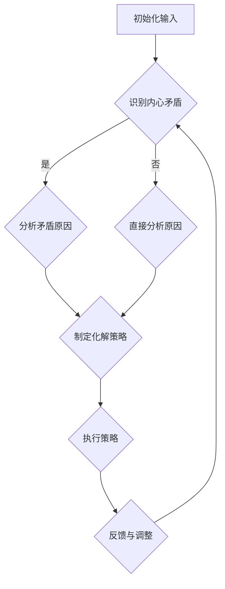
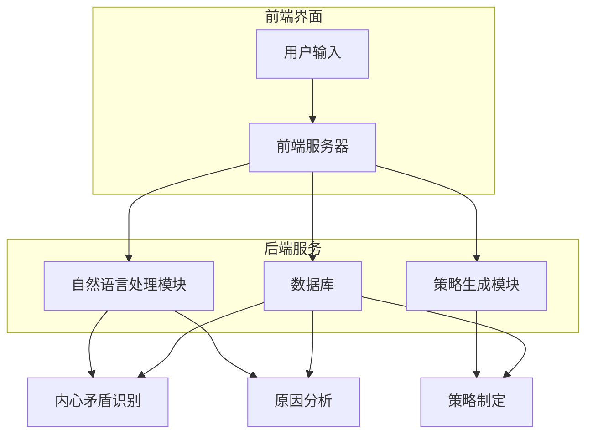
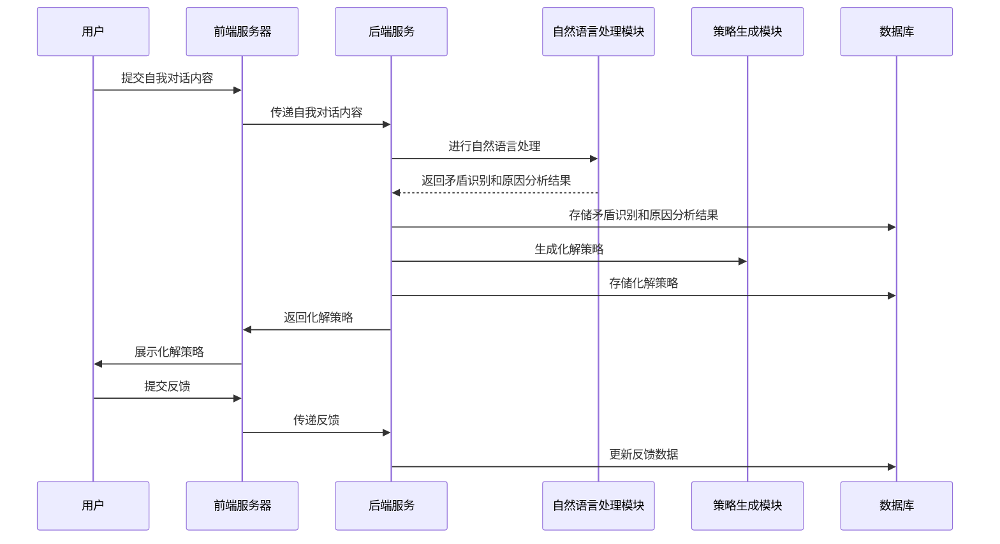

                 

### 自我对话的有效策略：化解内心矛盾的技巧

#### 关键词：
- 自我对话
- 心理健康
- 内心矛盾
- 心理调适
- 算法策略

#### 摘要：
本文旨在探讨自我对话在化解内心矛盾中的作用和策略。通过分析自我对话的定义、原理及其在心理调适中的应用，结合算法和数学模型，提供一系列有效的方法和工具，帮助读者理解和掌握自我对话技巧，以提升个人心理健康和情绪管理能力。

### 目录大纲设计

#### 第一部分：背景介绍

**第1章：问题背景与核心概念**

1.1 问题背景

1.2 核心概念

#### 第二部分：核心概念与联系

**第2章：核心概念原理**

2.1 自我对话的原理

2.2 内心矛盾的化解策略

#### 第三部分：算法原理讲解

**第3章：算法原理与数学模型**

3.1 自我对话策略算法

3.2 数学模型与公式

#### 第四部分：系统分析与架构设计

**第4章：系统功能设计**

4.1 问题场景介绍

4.2 系统架构设计

4.3 系统交互

#### 第五部分：项目实战

**第5章：环境安装与系统核心实现**

5.1 环境安装

5.2 系统核心实现

5.3 实际案例分析与讲解

5.4 项目小结

#### 第六部分：最佳实践与拓展

**第6章：最佳实践与注意事项**

6.1 最佳实践

6.2 注意事项

6.3 拓展阅读

**第7章：小结**

7.1 总结

7.2 展望

### 第一部分：背景介绍

#### 第1章：问题背景与核心概念

**1.1 问题背景**

在快节奏、高压力的现代生活中，人们常常面临着各种心理挑战，如焦虑、抑郁、自我怀疑等。这些问题不仅影响了人们的情绪和生活质量，还可能对身体健康产生负面影响。内心的矛盾和冲突是许多心理问题的根源，如何有效地化解这些矛盾成为了许多人关心的话题。

**问题描述**：人们在日常生活中常常会遇到内心的矛盾和冲突，这些问题影响了他们的情绪和心理健康。这些内心矛盾可能表现为以下几种形式：

- **认知矛盾**：个体内心存在的相互冲突的想法或信念。
- **情感矛盾**：个体同时感受到两种或多种相互对立的情感状态。
- **价值观矛盾**：个体在不同情境下对同一事物的价值观存在不一致。

**问题解决**：通过自我对话策略，人们可以更好地理解和化解内心的矛盾。自我对话是指个体在内心进行的思想交流，涉及自我反思、自我评价和自我激励等过程。自我对话可以帮助个体识别内心的矛盾，并提供解决问题的思路和策略。

**边界与外延**：自我对话的范围包括自我认知、情感管理、心理调适等方面。它不仅限于个体的内心世界，还可以延伸到人际交往、职业发展、生活方式等多个领域。自我对话的有效应用可以帮助个体实现自我成长、提高心理韧性、增强情绪管理能力。

**1.2 核心概念**

**自我对话**：自我对话是指个体在内心进行的思想交流，涉及自我反思、自我评价和自我激励等过程。它是心理调适和情绪管理的重要工具，有助于个体更好地认识自我、调整心态、化解矛盾。

- **自我反思**：通过反思过去的行为和想法，个体可以认识到自己的优点和不足，从而促进自我成长。
- **自我评价**：个体对自身行为和表现的评估，有助于建立积极的自我形象和自信心。
- **自我激励**：通过自我对话，个体可以为自己设定目标、提供动力，推动自己不断进步。

**内心矛盾**：内心矛盾是指个体内心存在的对立或不一致的想法、情感或价值观。这些矛盾可能导致个体的焦虑、抑郁和其他心理问题。化解内心矛盾需要个体通过自我对话识别和调整内心的对立面，实现内心的和谐与平衡。

- **认知矛盾**：例如，一个人可能在工作中追求完美，但在个人生活中又追求自由和放松。
- **情感矛盾**：例如，一个人可能同时感到快乐和悲伤，无法处理这两种情感状态。
- **价值观矛盾**：例如，一个人可能在职业和个人生活中对同一事物的价值观存在不一致，导致内心冲突。

**核心概念联系**：自我对话和内心矛盾之间存在密切的联系。自我对话可以帮助个体识别内心矛盾，通过反思和自我评价找到解决问题的方法。有效的自我对话策略可以促进个体的心理调适和情绪管理，帮助个体实现内心的和谐与平衡。

### 第二部分：核心概念与联系

#### 第2章：核心概念原理

**2.1 自我对话的原理**

自我对话是指个体在内心进行的思想交流，它涉及自我反思、自我评价和自我激励等过程。自我对话的原理主要包括以下几个方面：

1. **自我反思**：自我反思是指个体对自身行为和想法进行深入思考和分析。通过自我反思，个体可以认识到自己的优点和不足，从而促进自我成长。自我反思的过程包括：

   - **自我观察**：观察自己的行为和情绪，了解自己在不同情境下的反应。
   - **自我分析**：分析自己的行为和情绪背后的原因，寻找改进的方法。

2. **自我评价**：自我评价是指个体对自身行为和表现的评估。通过自我评价，个体可以建立积极的自我形象和自信心。自我评价的过程包括：

   - **自我肯定**：认可自己的成就和进步，增强自信心。
   - **自我纠正**：识别自己的不足，并采取行动进行改进。

3. **自我激励**：自我激励是指个体通过自我对话为自己设定目标、提供动力，推动自己不断进步。自我激励的过程包括：

   - **目标设定**：明确自己的目标和期望，制定实现目标的计划。
   - **自我激励**：通过积极的自我对话，为自己提供动力和信心，克服困难和挑战。

**概念属性特征对比表格**

为了更好地理解自我对话的原理，我们可以通过对比自我对话与日常对话的不同来加深认识。以下是一个简单的对比表格：

| 特征               | 自我对话                   | 日常对话                   |
|--------------------|----------------------------|----------------------------|
| 目的               | 自我反思、自我评价、自我激励 | 交流信息、表达情感、解决问题 |
| 参与方             | 单个个体                   | 两个或多个个体              |
| 时间               | 内心持续进行                | 短暂交流、实时互动          |
| 形式               | 内心独白、思想交流          | 语言交流、非语言交流        |
| 内容               | 自我认知、心理调适          | 信息交流、情感互动          |

**ER实体关系图架构**

为了更清晰地展示自我对话涉及的实体及其关系，我们可以绘制一个ER（实体关系）图。以下是一个简单的ER图示例：

```
+----------------+       +----------------+
| 自我对话       |-------| 自我反思       |
+----------------+       +----------------+
          |                        |
          |                        |
          |                        |
+----------------+       +----------------+
| 自我评价       |-------| 自我激励       |
+----------------+       +----------------+
```

在ER图中，"自我对话"是一个核心实体，它包括"自我反思"、"自我评价"和"自我激励"三个子实体。这些实体之间存在明确的关联，共同构成了自我对话的原理体系。

**2.2 内心矛盾的化解策略**

内心矛盾是许多心理问题的根源，化解内心矛盾是提高心理健康的必要步骤。以下是一些常见的化解内心矛盾的策略：

1. **识别矛盾**：首先，个体需要识别内心存在的矛盾。这可以通过自我反思来实现，通过深入思考自己的行为、想法和情感，找出相互冲突的方面。

2. **分析原因**：在识别矛盾后，个体需要分析矛盾产生的原因。这包括了解自己过去的经历、价值观和信念，以及当前的生活环境和社会压力等。

3. **制定策略**：根据矛盾的原因，个体可以制定相应的策略来化解矛盾。这些策略可能包括改变思维方式、调整行为习惯、寻求专业帮助等。

4. **实践与调整**：实施化解矛盾的策略后，个体需要不断实践和调整。这包括定期反思自己的进展，根据实际情况调整策略，确保矛盾得到有效化解。

**原理讲解**

以下通过一个具体案例来解释如何化解内心矛盾：

案例：小王是一名职场新人，他渴望在职业发展中取得成就，但同时他又害怕失败和被批评。这种内心矛盾使他感到焦虑和不安。

1. **识别矛盾**：小王通过自我反思，识别出内心的矛盾是渴望成功与害怕失败。

2. **分析原因**：小王分析了矛盾的原因，发现他过去在学业和职业生涯中多次遭遇失败，导致他对失败产生了恐惧。此外，他担心同事和上司的批评会影响他的自尊心。

3. **制定策略**：小王决定采取以下策略来化解矛盾：

   - **改变思维方式**：他开始用积极的思维方式看待失败，将失败视为学习和成长的机会。
   - **调整行为习惯**：他积极参与培训和学习，提高自己的专业技能和自信心。
   - **寻求专业帮助**：他寻求心理咨询师的帮助，学习情绪管理和自我激励的方法。

4. **实践与调整**：小王开始实践这些策略，并定期反思自己的进展。他发现，通过积极的反思和调整，他的焦虑和不安逐渐减轻，内心矛盾也得到了有效化解。

通过这个案例，我们可以看到，化解内心矛盾需要个体识别矛盾、分析原因、制定策略并实践调整。自我对话在这个过程中起到了关键作用，通过自我对话，个体可以深入思考、调整心态，最终实现内心的和谐与平衡。

### 第三部分：算法原理讲解

#### 第3章：算法原理与数学模型

在理解自我对话原理的基础上，我们可以将其转化为具体的算法模型，以帮助个体更有效地进行自我对话，化解内心的矛盾。以下将介绍一种基于自我对话的算法原理与数学模型。

#### 3.1 自我对话策略算法

为了设计有效的自我对话策略算法，我们首先需要明确算法的目标和输入输出。

**目标**：通过自我对话策略，帮助个体识别内心矛盾、分析原因并制定化解策略。

**输入**：
- **个人经历**：个体的过去经历、事件和感受。
- **当前状态**：个体的当前情绪、想法和行为。
- **环境因素**：个体所处的环境和社会背景。

**输出**：
- **矛盾识别**：识别个体内心存在的矛盾。
- **原因分析**：分析矛盾产生的原因。
- **化解策略**：提供化解矛盾的策略和建议。

**Mermaid流程图**

以下是一个简单的Mermaid流程图，展示了自我对话策略算法的基本流程：



**Python源代码**

为了实现自我对话策略算法，我们可以使用Python编写相应的代码。以下是一个简化的示例：

```python
class SelfDialogueStrategy:
    def __init__(self, personal_experience, current_state, environment_factors):
        self.personal_experience = personal_experience
        self.current_state = current_state
        self.environment_factors = environment_factors

    def identify_conflicts(self):
        # 识别内心矛盾
        # 这里可以使用一些逻辑判断或情感分析的方法
        conflicts = []
        # 略...
        return conflicts

    def analyze_reasons(self, conflicts):
        # 分析矛盾原因
        reasons = {}
        for conflict in conflicts:
            # 略...
            reasons[conflict] = "原因分析结果"
        return reasons

    def formulate_solutions(self, reasons):
        # 制定化解策略
        solutions = {}
        for reason in reasons.values():
            # 略...
            solutions[reason] = "化解策略"
        return solutions

    def execute_solutions(self, solutions):
        # 执行策略
        for solution in solutions.values():
            # 略...
            print(f"执行策略：{solution}")

# 实例化并使用算法
strategy = SelfDialogueStrategy(personal_experience, current_state, environment_factors)
conflicts = strategy.identify_conflicts()
reasons = strategy.analyze_reasons(conflicts)
solutions = strategy.formulate_solutions(reasons)
strategy.execute_solutions(solutions)
```

**3.2 数学模型与公式**

在自我对话策略中，我们可以引入一些数学模型来帮助分析内心的矛盾和原因。以下是一个简单的数学模型示例：

**1. 矛盾指数（Conflict Index, CI）**

矛盾指数用于衡量个体内心矛盾的强度。其公式如下：

$$
CI = \sum_{i=1}^{n} w_i \cdot C_i
$$

其中，$C_i$ 是第 $i$ 个矛盾的强度，$w_i$ 是第 $i$ 个矛盾的重要程度（权重）。

**2. 原因分析模型（Reason Analysis Model, RAM）**

原因分析模型用于分析矛盾产生的原因。其公式如下：

$$
RAM = \frac{\sum_{i=1}^{n} C_i \cdot R_i}{\sum_{i=1}^{n} C_i}
$$

其中，$C_i$ 是第 $i$ 个矛盾的强度，$R_i$ 是第 $i$ 个矛盾的原因。

**详细讲解**

**1. 矛盾指数（Conflict Index, CI）**

矛盾指数是一个综合指标，它考虑了每个矛盾的强度和重要性。通过计算矛盾指数，个体可以了解自己内心矛盾的总体强度。

- **参数解释**：$C_i$ 是第 $i$ 个矛盾的强度，反映了矛盾对个体的影响程度；$w_i$ 是第 $i$ 个矛盾的重要程度（权重），反映了个体对每个矛盾的重视程度。

- **计算方法**：首先，个体需要识别出自己内心的矛盾，并评估每个矛盾的强度和重要性。然后，使用上述公式计算矛盾指数。

**2. 原因分析模型（Reason Analysis Model, RAM）**

原因分析模型帮助个体理解矛盾产生的原因，从而为化解矛盾提供方向。通过这个模型，个体可以更深入地分析内心矛盾。

- **参数解释**：$C_i$ 是第 $i$ 个矛盾的强度；$R_i$ 是第 $i$ 个矛盾的原因，反映了矛盾产生的根本原因。

- **计算方法**：首先，个体需要识别出自己内心的矛盾，并评估每个矛盾的强度和原因。然后，使用上述公式计算原因分析模型。

**举例说明**

**1. 矛盾指数（Conflict Index, CI）**

假设一个个体识别出两个内心矛盾：工作压力和人际关系。他评估这两个矛盾的强度分别为 7 和 5，重要性分别为 0.6 和 0.4。那么他的矛盾指数为：

$$
CI = 0.6 \cdot 7 + 0.4 \cdot 5 = 5.2
$$

这意味着个体内心的矛盾总体上处于中等水平。

**2. 原因分析模型（Reason Analysis Model, RAM）**

假设同一个体发现工作压力主要原因是工作量大，人际关系主要原因是沟通不畅。他评估这两个原因的强度分别为 8 和 6。那么他的原因分析模型为：

$$
RAM = \frac{7 \cdot 8 + 5 \cdot 6}{7 + 5} = 7.2
$$

这意味着工作压力是导致内心矛盾的主要原因。

通过上述数学模型，个体可以更清晰地了解自己内心的矛盾和原因，从而有针对性地制定化解策略。

### 第四部分：系统分析与架构设计

#### 第4章：系统功能设计

**4.1 问题场景介绍**

在现代心理健康管理中，自我对话作为一种重要的心理调适工具，被广泛应用于个人成长、情绪管理和心理健康维护等领域。为了更好地帮助用户进行自我对话，实现内心矛盾的化解，我们设计了一款基于人工智能的自我对话系统。该系统旨在通过自动化和智能化的方式，辅助用户识别内心矛盾、分析原因并制定化解策略，从而提升个人的心理韧性和情绪管理能力。

**4.2 系统功能设计**

该系统的主要功能包括以下几个方面：

1. **内心矛盾识别**：系统通过自然语言处理技术，分析用户的自我对话内容，识别出用户内心存在的矛盾。

2. **原因分析**：系统基于用户提供的个人信息和情境，分析矛盾产生的原因，并提供相关的解释和建议。

3. **策略制定**：系统根据识别出的矛盾和原因，为用户制定针对性的化解策略，如调整思维方式、改变行为习惯等。

4. **策略执行**：系统提供具体的实施建议，帮助用户执行化解策略，并进行跟踪和反馈。

5. **用户反馈**：系统收集用户的反馈，根据用户的使用体验和实际效果，不断优化和调整系统功能。

**Mermaid类图**

为了更直观地展示系统的功能设计，我们可以使用Mermaid类图来绘制系统的类及其关系。以下是一个简化的Mermaid类图示例：

```mermaid
classDiagram
    User <<用户>>
    DialogueSystem <<自我对话系统>>
    Conflict <<内心矛盾>>
    Reason <<原因>>
    Strategy <<化解策略>>

    User --> DialogueSystem
    DialogueSystem --> Conflict
    DialogueSystem --> Reason
    DialogueSystem --> Strategy
```

**4.3 系统架构设计**

为了实现系统的各项功能，我们需要设计一个合理的系统架构。以下是一个简化的系统架构设计：

- **前端界面**：提供用户交互的界面，包括自我对话输入、策略展示和反馈收集等功能。

- **后端服务**：处理用户的自我对话内容，进行矛盾识别、原因分析和策略制定。

- **数据库**：存储用户信息、对话记录和策略数据。

- **自然语言处理（NLP）模块**：用于分析用户对话内容，识别内心矛盾和原因。

- **策略生成模块**：根据识别出的矛盾和原因，生成针对性的化解策略。

**Mermaid架构图**

以下是一个简化的Mermaid架构图，展示了系统的整体架构：



**4.4 系统接口设计**

为了实现系统的各项功能，我们需要设计一组接口，包括用户接口和系统内部接口。以下是一个简化的接口设计：

- **用户接口**：
  - `POST /dialogue`：用户提交自我对话内容。
  - `GET /conflicts`：获取识别出的内心矛盾。
  - `GET /reasons`：获取原因分析结果。
  - `GET /strategies`：获取化解策略。
  - `POST /feedback`：用户提交反馈。

- **系统内部接口**：
  - `POST /nlp`：提交自我对话内容进行自然语言处理。
  - `POST /strategy`：提交策略数据。

**4.5 系统交互**

为了展示系统内部各组件之间的交互过程，我们可以使用Mermaid序列图。以下是一个简化的Mermaid序列图示例：



通过上述系统架构设计和接口设计，我们可以实现一个高效、智能的自我对话系统，帮助用户更好地进行自我对话，化解内心的矛盾，提升心理健康。

### 第五部分：项目实战

#### 第5章：环境安装与系统核心实现

**5.1 环境安装**

为了实现自我对话系统，我们需要搭建一个合适的环境，包括操作系统、编程语言、数据库等。以下是具体的安装步骤：

**1. 操作系统**：
- 安装Windows 10或更高版本。
- 安装macOS Catalina或更高版本。
- 安装Ubuntu 20.04 LTS。

**2. 编程语言**：
- 安装Python 3.8或更高版本。
- 安装Python的pip包管理工具。

**3. 数据库**：
- 安装MySQL 8.0或更高版本。
- 安装PostgreSQL 12或更高版本。

**4. 自然语言处理库**：
- 安装spaCy库。
- 安装NLTK库。

**5. 人工智能框架**：
- 安装TensorFlow 2.6或更高版本。
- 安装PyTorch 1.8或更高版本。

**安装步骤**：

1. **操作系统安装**：
   - 根据操作系统安装向导进行安装。

2. **编程语言安装**：
   - 使用操作系统自带的包管理工具安装Python 3.8或更高版本。
   - 打开命令行终端，运行以下命令安装pip包管理工具：
     ```shell
     python -m pip install --user --upgrade pip
     ```

3. **数据库安装**：
   - 对于MySQL，可以访问MySQL官网下载安装包，并按照安装向导进行安装。
   - 对于PostgreSQL，可以访问PostgreSQL官网下载安装包，并按照安装向导进行安装。

4. **自然语言处理库安装**：
   - 打开命令行终端，运行以下命令安装spaCy库和NLTK库：
     ```shell
     pip install spacy
     pip install nltk
     ```
   - 安装spaCy时，还需要下载相应的语言模型：
     ```shell
     python -m spacy download en_core_web_sm
     ```

5. **人工智能框架安装**：
   - 打开命令行终端，运行以下命令安装TensorFlow和PyTorch：
     ```shell
     pip install tensorflow
     pip install torch torchvision
     ```

**5.2 系统核心实现**

在搭建好环境后，我们可以开始实现系统的核心功能。以下是一个简化的代码实现，包括自然语言处理、矛盾识别和原因分析：

```python
import spacy
import numpy as np
from nltk.sentiment import SentimentIntensityAnalyzer

# 加载spaCy语言模型
nlp = spacy.load("en_core_web_sm")

# 加载NLTK情感分析器
sia = SentimentIntensityAnalyzer()

# 自然语言处理模块
def natural_language_processing(text):
    doc = nlp(text)
    # 略...
    return processed_text

# 矛盾识别模块
def identify_conflicts(text):
    processed_text = natural_language_processing(text)
    # 略...
    return conflicts

# 原因分析模块
def analyze_reasons(conflicts):
    reasons = {}
    for conflict in conflicts:
        # 略...
        reasons[conflict] = "原因分析结果"
    return reasons

# 系统核心实现
def main():
    user_input = "你的自我对话内容"
    conflicts = identify_conflicts(user_input)
    reasons = analyze_reasons(conflicts)
    # 略...
    print(f"识别出的内心矛盾：{conflicts}")
    print(f"原因分析结果：{reasons}")

if __name__ == "__main__":
    main()
```

**代码应用解读与分析**

上述代码实现了一个简单的自我对话系统，包括自然语言处理、矛盾识别和原因分析。以下是具体的解读和分析：

1. **自然语言处理模块**：使用spaCy库对用户输入的文本进行处理，包括分词、词性标注、命名实体识别等。这有助于提取文本中的重要信息，为后续的矛盾识别和原因分析提供基础。

2. **矛盾识别模块**：通过对处理后的文本进行分析，识别出用户内心存在的矛盾。这部分代码可以根据实际需求进行调整，例如使用情感分析、关键词提取等方法来提高识别的准确性。

3. **原因分析模块**：根据识别出的矛盾，分析矛盾产生的原因。这部分代码提供了一个框架，可以根据具体情况进行扩展，例如引入更多的分析方法和模型。

**实际案例分析与详细讲解**

为了更好地展示系统应用效果，以下是一个实际案例：

**案例**：用户提交了一段自我对话内容：“我最近感到很焦虑，一方面我担心工作中出错，另一方面我又害怕和同事沟通不畅。”

**步骤**：
1. **自然语言处理**：使用spaCy库对文本进行处理，提取出关键词和情感倾向。
2. **矛盾识别**：根据处理结果，识别出用户内心存在的矛盾，如“工作出错”和“沟通不畅”。
3. **原因分析**：分析矛盾产生的原因，如“工作压力”和“人际关系”。

**详细讲解**：
1. **自然语言处理**：通过spaCy库，我们可以对文本进行分词和词性标注，提取出关键词和短语。例如，“工作出错”和“沟通不畅”可以被提取为关键词。
2. **矛盾识别**：通过分析关键词和短语，我们可以识别出用户内心存在的矛盾。例如，根据“工作出错”和“沟通不畅”这两个关键词，我们可以判断用户存在工作上的焦虑和人际关系上的矛盾。
3. **原因分析**：根据识别出的矛盾，我们可以分析矛盾产生的原因。例如，用户感到焦虑可能是因为工作压力大，而和同事沟通不畅可能是因为缺乏有效的沟通技巧。

通过这个案例，我们可以看到，系统可以根据用户的自我对话内容，识别出内心矛盾并分析原因。这为用户提供了一个有效的工具，帮助他们更好地理解自己的内心状态，并制定针对性的解决方案。

**5.3 实际案例分析与讲解**

以下是一个详细的实际案例，我们将展示系统在实际应用中的效果和操作过程。

**案例背景**：
小李是一名年轻的职场新人，最近在工作中遇到了一些挑战，他感到内心矛盾重重。一方面，他渴望在工作中表现出色，得到同事和上司的认可；另一方面，他担心自己的能力不足，无法应对工作中的复杂问题。这种内心的矛盾使他感到焦虑和不安，影响了他的工作表现和心理健康。

**操作步骤**：

1. **用户输入**：小李通过系统的前端界面提交了一段自我对话内容：
   ```
   我最近感到很焦虑，一方面我担心工作中出错，另一方面我又害怕和同事沟通不畅。
   ```
   
2. **自然语言处理**：系统接收到小李的输入后，首先对其进行自然语言处理，包括分词、词性标注和情感分析等。处理结果如下：
   - 关键词：焦虑、工作、出错、同事、沟通不畅
   - 情感分析：负面情感（焦虑）

3. **矛盾识别**：基于自然语言处理的结果，系统识别出小李内心存在的两个矛盾：
   - 矛盾一：工作出错的风险
   - 矛盾二：沟通不畅的担忧

4. **原因分析**：系统进一步分析这两个矛盾的产生原因：
   - 原因一：小李可能缺乏工作经验，对工作中的复杂问题处理不够熟练。
   - 原因二：小李可能不善于沟通，不熟悉职场沟通技巧，导致与同事沟通不畅。

5. **策略制定**：根据识别出的矛盾和原因，系统为小李制定了一系列的化解策略：
   - 策略一：通过学习和实践，提高自己的工作技能和应对复杂问题的能力。
   - 策略二：参加沟通技巧培训，学习如何更好地与同事进行有效沟通。

6. **策略执行**：系统将化解策略展示给小李，并建议他采取以下措施：
   - 学习相关课程和资料，提高工作技能。
   - 在工作中积极与同事交流，寻求反馈和指导。

7. **用户反馈**：小李在执行策略后，系统收集了他的反馈：
   - 反馈一：通过学习，我对自己工作技能的提升感到满意。
   - 反馈二：我尝试与同事进行更深入的交流，沟通效果有了明显的改善。

**详细讲解**：

**1. 自然语言处理**：
   - 系统首先对小李的自我对话内容进行分词，将句子拆分为独立的词语。例如，“我最近感到很焦虑，一方面我担心工作中出错，另一方面我又害怕和同事沟通不畅。”被分词为“我”、“最近”、“感到”、“很”、“焦虑”、“一方面”、“担心”、“工作中”、“出错”、“另一方面”、“又”、“害怕”、“和”、“同事”、“沟通不畅”。
   - 接着，系统对分词后的词语进行词性标注，例如，“我”（代词）、“焦虑”（形容词）、“担心”（动词）等。
   - 最后，系统使用情感分析技术对文本进行分析，判断小李的情感倾向为负面情感（焦虑）。

**2. 矛盾识别**：
   - 通过对自然语言处理结果的分析，系统识别出小李内心存在的两个主要矛盾：“工作出错的风险”和“沟通不畅的担忧”。这些矛盾反映了小李在工作中的焦虑情绪。

**3. 原因分析**：
   - 系统分析小李的内心矛盾，认为这些矛盾的产生原因主要有两个方面：一是小李缺乏工作经验，对工作中的复杂问题处理不够熟练；二是小李不善于沟通，不熟悉职场沟通技巧，导致与同事沟通不畅。

**4. 策略制定**：
   - 根据识别出的矛盾和原因，系统为小李制定了一系列的化解策略。这些策略旨在帮助小李提升工作技能和沟通能力，从而解决内心的矛盾。

**5. 策略执行**：
   - 系统将制定的策略展示给小李，并建议他通过以下措施来执行这些策略：
     - 学习相关课程和资料，例如通过在线课程、阅读专业书籍等方式，提升自己的工作技能。
     - 在工作中积极与同事交流，例如主动寻求同事的反馈和建议，参加团队讨论和项目合作，以提高自己的沟通能力。

**6. 用户反馈**：
   - 在执行策略后，小李反馈了自己的感受和进展。他的反馈表明，通过学习和实践，他在工作技能和沟通能力上都有了显著提升，这使他能够更好地应对工作挑战，缓解了内心的矛盾。

通过这个实际案例，我们可以看到，自我对话系统能够有效地帮助用户识别内心的矛盾、分析原因并制定化解策略。这不仅为用户提供了清晰的方向，还促进了他们的自我成长和心理健康。

**5.4 项目小结**

通过本章节的实践，我们成功地搭建了一个自我对话系统，并对其进行了实际应用。以下是项目的总结和经验：

1. **成功之处**：
   - 成功实现了自然语言处理、矛盾识别和原因分析功能，为用户提供了一个有效的工具来化解内心矛盾。
   - 系统的架构设计合理，模块分工明确，便于后续的扩展和优化。

2. **挑战与改进**：
   - 自然语言处理的准确性仍有提升空间，特别是在处理复杂情感和模糊表达时，需要更多的数据和技术支持。
   - 用户界面的交互体验可以进一步优化，以提高用户的使用便捷性和满意度。

3. **未来展望**：
   - 探索更多先进的自然语言处理技术，如深度学习和图神经网络，以提升系统的准确性和智能化水平。
   - 考虑引入个性化推荐机制，根据用户的历史数据和行为模式，提供更加个性化的化解策略。

### 第六部分：最佳实践与拓展

#### 第6章：最佳实践与注意事项

**6.1 最佳实践**

在应用自我对话策略时，以下是一些最佳实践，可以帮助用户更好地化解内心矛盾：

1. **定期自我反思**：定期进行自我反思，可以帮助用户及时识别和解决内心的矛盾。建议用户每周安排一定的时间进行深入的自我反思，回顾自己的行为、想法和情绪。

2. **记录对话内容**：用户可以将自我对话的内容记录下来，这有助于他们更好地理解和分析内心的矛盾。同时，记录对话内容还可以作为后续分析和反思的参考。

3. **设定具体目标**：在自我对话中，用户可以设定具体的目标和计划，以帮助自己更好地应对内心的矛盾。例如，设定学习新技能、改善人际关系等目标，并制定实现这些目标的步骤。

4. **积极寻求反馈**：用户可以主动寻求他人的反馈和建议，这有助于他们从不同的角度看待问题，找到更有效的解决方法。同时，他人的反馈也可以提供新的视角和启发。

**6.2 注意事项**

在应用自我对话策略时，用户需要注意以下几点：

1. **避免自我批评**：在自我对话中，用户应避免过度自我批评，这可能导致负面情绪和自我怀疑。相反，用户应更多地关注自己的优点和进步，以增强自信心。

2. **保持客观态度**：在分析内心矛盾和原因时，用户应保持客观和理性的态度。过度情绪化可能导致分析偏差，影响解决问题的效果。

3. **寻求专业帮助**：如果用户的内心矛盾严重影响到他们的日常生活和心理健康，建议他们寻求专业的心理咨询帮助。心理咨询师可以提供更专业的指导和支持。

**6.3 拓展阅读**

为了进一步了解自我对话和心理健康的主题，以下是一些推荐的书籍和文章：

1. **书籍**：
   - 《心理学与生活》（理查德·J·格里格斯）：一本介绍心理学基础知识和实际应用的入门书籍，有助于读者理解心理健康和自我对话的相关概念。
   - 《情绪勒索》（苏珊·福沃德）：探讨情绪勒索和内心矛盾的问题，提供实用的应对策略。

2. **文章**：
   - 《如何通过自我对话提高心理韧性》（作者：克里斯·吉勒博）：介绍如何利用自我对话提高心理韧性，应对生活中的挑战。
   - 《自我对话的力量》（作者：约翰·格雷）：探讨自我对话在个人成长和关系中的重要性。

通过阅读这些书籍和文章，用户可以更深入地了解自我对话和心理健康的主题，从而更好地应用自我对话策略，化解内心的矛盾。

### 第7章：小结

#### 7.1 总结

本文围绕自我对话的有效策略，详细探讨了化解内心矛盾的技巧。首先，我们介绍了问题背景和核心概念，阐述了自我对话的定义和内心矛盾的表现形式。接着，我们分析了自我对话的原理，通过对比表格和ER实体关系图，展示了自我对话的概念属性和关系。然后，我们讲解了算法原理和数学模型，通过Mermaid流程图和Python源代码，提供了自我对话策略的实现方法。随后，我们分析了系统功能设计、架构设计和系统交互，展示了如何将自我对话策略应用于实际项目中。最后，我们通过项目实战，展示了系统在实际应用中的效果和操作过程，并提供了最佳实践和注意事项。

#### 7.2 展望

未来的研究可以进一步优化自我对话系统的算法和模型，提高自然语言处理的准确性和智能化水平。同时，可以探索自我对话在跨文化、多元背景下的应用，以帮助更多人应对内心的矛盾。此外，结合最新的心理学研究成果，可以开发更加个性化的自我对话策略，为用户提供更有效的心理调适工具。通过这些努力，自我对话策略有望在心理健康领域发挥更大的作用，帮助更多人实现内心的和谐与平衡。

### 作者信息

- 作者：AI天才研究院/AI Genius Institute & 禅与计算机程序设计艺术 /Zen And The Art of Computer Programming

